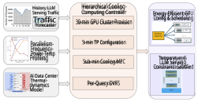
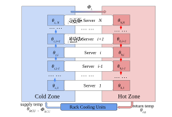
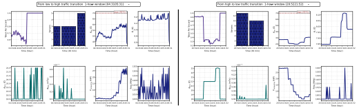
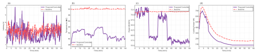
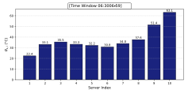
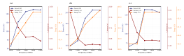
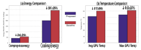

IEEE TRANSACTIONS ON CLOUD COMPUTING 

1 

# Coordinated Cooling and Compute Management for AI Datacenters 

Nardos Belay Abera and Yize Chen, _Member, IEEE_ 

**_Abstract_ —The AI datacenters are currently being deployed on a large scale to support the training and deployment of power-intensive large-language models (LLMs). Extensive amount of computation and cooling required in datacenters increase concerns about the energy use and carbon emissions of AI datacenters. Although current state-of-the-art has examined the energy efficiency of LLM inference, most prior research focused on optimizing compute-side scheduling without considering thermal objectives or constraints. Since GPU-intensive inference generates substantial heat that can degrade datacenter performance, ignoring thermal effects can increase total energy consumption and reduce the efficiency of LLM serving. To fill this gap, we profile the characteristics of GPU servers under varying cooling and AI jobs, and develop a joint cooling and computing modeling approach for AI datacenters. Built upon such workload and thermal dynamics models, a novel hierarchical control framework is proposed to co-optimize computing and thermal management by identifying the optimal GPU parallelism, frequency (DVFS), and cooling control knobs. Using real Azure inference traces and detailed GPU profiling, our model balances serving latency and thermal constraints in AI datacenters while significantly improving AI datacenters’ energy efficiency.** 

**_Index Terms_ —AI datacenters, DVFS, GPU profiling, hierarchical control, LLM, latency.** 

## I. INTRODUCTION 

**A** RTIFICIALto support computing-intensiveintelligence (AI) datacenterstasks suchareasdesignedtrainingasdesignedtrainingtraining 

to support computing-intensiveintelligence tasks suchareasdesignedtrainingasdesignedtrainingtraining and serving of the large language model (LLM) and the GenAI model. Due to AI’s rapid and widespread adoption, hyper-scale inference clusters are now being deployed to serve trillions of requests per day [1], [2]. To meet the ever-increasing computational requirements of LLMs services, various solutions, such as enhanced datacenter architectures, scheduling algorithms, and accelerators, have been proposed to increase the efficiency of inference [3]–[6]. Although previous work primarily focused on performance aspects, one critical factor is largely overlooked: the energy perspective of large-scale AI datacenters [7]. This concern is amplified by the substantial economic and environmental impacts of the enormous amounts of energy consumed by modern AI models. In particular, training the 175-billion-parameter GPT-3 would require approximately 1287 MWh of electricity and emit 502 metric tons of CO2 [8]. LLM inference is even gradually dominating the energy consumption landscape. In 

N. B. Abera and Y. Chen are with the Department of Electrical and Computer Engineering, University of Alberta, Edmonton, AB, Canada (email: nbelay@ualberta.ca; yize.chen@ualberta.ca). This work was supported in part by the Natural Sciences and Engineering Research Council of Canada, and in part by the Canada First Research Excellence Fund as part of the University of Alberta’s Future Energy Systems Research Initiative. 

fact, recent studies project that 80–90% of the total workload and energy consumption of LLMs deployed in production environments arise from inference rather than training [9], [10]. Although some previous work has aimed to reduce the energy consumption of LLM inference [11], these studies explicitly ignore the impact of thermal behavior and cooling systems [12]. 

Such energy-inefficient computing can be attributed to suboptimal thermal conditions in datacenters, where intense and dense heat generation leads to GPU performance degradation due to thermal throttling [13]. Load and temperature imbalances also cause sub-optimal scheduling and cooling in datacenters. Therefore, neglecting thermal dynamics could result in cooling units reacting only after temperature increases occur [14]. Not only does such operation result in degradation in computing performance, but the energy used for cooling is significant and also contributes approximately 45-50% of the total energy consumption in AI datacenters [15]. 

A major challenge in managing power and energy profile of AI datacenters is the highly heterogeneous and time-varying nature of LLM workload, which varies in context length, output length, and model size. This creates irregular compute demand and rapid heat generation patterns across GPU racks. This heterogeneity breaks the assumption of the traditional datacenter control system and overwhelms cooling systems, whose slow response leads to temperature overshoots, local hot spots, and inefficient use of cooling energy [16]. Existing datacenter management approaches often decouple computing and cooling control as separate loops [17]. Although such methods improve inference throughput or cooling efficiency in isolation, they fail to capture the strong interdependence between computational load, heat generation, and cooling dynamics. This separation leads to suboptimal energy consumption and unstable temperature regulation, especially under dynamic LLM workloads, which ultimately affects the sustainability and performance of datacenters [18]. 

To address this research gap in AI datacenters energy management, this paper proposes the first hierarchical control framework, which jointly coordinates and controls computing and cooling resources to enable energy-efficient LLM inference. Such a hierarchical framework helps reduce computational complexity and disaggregates multiple control variables, allowing coordinated control across multiple layers. As a foundation for this design, we first model the power and energy characteristics of the LLM workloads and key cooling control parameters. LLM inference differs fundamentally from conventional CPUcentric datacenter workloads [19]–[22]. 

Taking into account heterogeneous computational behaviors of LLM inference, we develop the AI datacenter heat transfer 

IEEE TRANSACTIONS ON CLOUD COMPUTING 

2 

model, and develop a novel hierarchical control framework operating across multiple levels. At the higher level, we predict the AI workload, and dynamically adjust the number of active servers to maximize utilization and reduce idle power. At the intermediate level, the controller dynamically changes GPU parallelism, involving the number of GPUs working together on one LLM inference instance, subject to the maximum available GPUs and temperature constraints. The cooling level dynamically adjusts parameters such as the supply air temperature and airflow rate, which vary with respect to workloads. On the lower level, dynamic voltage and frequency scaling (DVFS) is adopted to adjust the frequencies of GPUs according to the SLOs of workloads and thermal conditions. To achieve this, we introduce a novel temperature-aware DVFS mechanism that jointly considers workload intensity and GPU temperature when selecting the optimal operating frequency. This enables the controller to reduce energy consumption and regulate temperature without degrading inference performance. This approach also considers the sensitivity of DVFS to the types of work request. Requesting longer prompts is computationally intensive and more sensitive to frequencies, while requests involving short prompts but longer output are memory-bound, which is less sensitive [11]. The control framework uses detailed, realistic profiling LLM serving data obtained with varying workloads, GPU configurations, and temperatures to capture the correlation between energy, latency, and temperature, allowing the controller to design the optimal cooling and computing strategy. The overall scheme is illustrated in Fig. 1. 

Fig. 1: Schematic for proposed hierarchical control of joint cooling–compute for AI datacenters. 

## _A. Main Contribution_ 

Building upon LLM serving characteristics and opportunities of co-management of GPU cooling and computing, this work makes the following key contributions: 

- We propose a novel hierarchical compute–thermal control framework for the AI datacenter that provides methodology for jointly optimizing computing resources (GPU parallelism and frequency) and cooling resources (supply air temperature and inlet airflow rate). A novel temperature constraint is integrated to guaranty thermal safety while enabling significant energy savings. 

- We develop a novel thermal-aware workload dispatch algorithm that schedules jobs based on the capacity of 

each GPU pool. This algorithm reduces the overhead associated with frequent reconfigurations and ensures smooth adaptation to heterogeneous, time-varying LLM inference workloads. We incorporate an LSTM-based model for forecasting token demand for proactive resource allocation and a DistilBERT-based classifier for classifying each LLM job’s length. 

- We perform a comprehensive evaluation using Microsoft Azure LLM inference traces in combination with detailed thermal and power profiling of the GPU [23]. Simulation and experimental results demonstrate that the proposed approach reduces both IT-side and cooling-side power consumption while preserving SLOs. Overall, the proposed controller achieves 24.2% computing-energy savings and 31.2% cooling-energy savings, and lowers the average GPU temperature by 17.0%, while maintaining negligible impact on inference latency. 

## _B. Article Outline_ 

The remainder of this paper is organized as follows. Section II provides background on datacenter cooling systems and the major control knobs associated with AI datacenters, such as tensor parallelism (TP), DVFS, and LLM Workload Characteristics. Section III describes the cooling and computing characteristics of the AI datacenter. Section IV proposes our hierarchical control framework for both cooling and workload scheduling with a dispatch algorithm. Section V presents a comprehensive performance analysis using simulation and real-system experiments, which validate the effectiveness of the integrated cooling-computing control. Finally, Section VI concludes the paper and outlines directions for future work. 

## II. BACKGROUND 

## _A. Datacenters Cooling Systems_ 

Cooling systems are major determinants of the thermal behavior of computing components such as GPUs and CPUs in the datacenter. Due to their importance in thermal management and energy efficiency, there are enormous opportunities to enhance performance datacenters using optimized cooling strategies. Therefore, it is important to determine their working characteristics to facilitate co-optimization of computing and cooling power consumption. Datacenters utilize air and liquid cooling to control the massive heat loads generated by highperformance GPUs [24]–[26]. Air cooling remains the most widely used approach due to its relatively low operating and maintenance costs [27]. Heat is removed by circulating cold air through the servers, which can be deployed at the level of the room, row, or rack. Room-level systems pump cold air through the raised floor plenum, but are subject to problems of cold air bypass and return of hot air, resulting in reduced efficiency in the cooling process [28], [29]. Row and rack cooling minimize airflow distances and increase the isolation between cold and hot streams to achieve higher thermal efficiency [30], [31]. 

According to ASHRAE guidelines, proper inlet and outlet air temperature must be maintained to ensure stable operation of IT equipment and to avoid hardware failure [32]. To improve cooling effectiveness, several key parameters can be actively 

IEEE TRANSACTIONS ON CLOUD COMPUTING 

3 

controlled, including supply air temperature, inlet airflow rate, cold inlet temperature, and return temperature. These parameters must be dynamically tuned to track the time-varying AI workloads while ensuring thermal safety. Effective control of these parameters is possible with an advanced control scheme. PID (Proportional–Integral–Derivative) control is commonly used in temperature control in a datacenter [33]. Despite its simplicity, PID controller only relies on the previous error values for control, and it is incapable of considering forecasts for the error values. Hence, it can be slow and inaccurate in its responses [34]. In addition, PID controllers cannot incorporate optimization objectives. While model predictive control (MPC) leverages the knowledge obtained from the system model to predict its possible behaviors in the future [35]. With real-time temperature prediction and optimization of cooling systems, MPC has been extensively used in the field of traditional CPU-based datacenter energy savings and thermal management. In [36], an objective function of the MPC was performed that included operating costs, which reduced energy consumption. In [37], a data-driven subspace predictive control method was designed for air-cooled traditional datacenters. An economic MPC was proposed for room-based cooling systems in [38], [39].However, many of these methods were mainly adapted to CPU-centric datacenters, which have slower workload dynamics and fixed airflow actuation. Such assumptions do not hold for AI/LLM inference, which is highly time-varying and exhibits nonlinear performance–power behavior. 

## _B. Tensor Parallelism and Thermal Constraints_ 

As the computational requirements for LLMs inference remain high in terms of memory, large models are generally split into multiple GPUs using a concept referred to as model parallelism in LLMs for efficient execution. There exist two variants for model parallelism, namely pipeline parallelism (PP) and tensor parallelism (TP) [40]. In PP, the models’ layers are assigned to different GPU in such a way that each GPU is only responsible for processing a separate stage within a specific layer, with communication between only two successive stages. In the other variant, called TP, operations in each layer are performed using multiple GPUs in a manner in which the GPUs need to execute processes in each layer synchronously [41]. Because most open-source LLMs can be accommodated on multiple GPUs within a single server [42], this paper focuses on the widely used TP configurations. Although choosing a smaller TP reduces power consumption, the computational workload for each separate GPU is also higher. Increased usage for each GPU leads to increased heat production by single device, possibly increasing the temperature with subsequent thermal throttling with reduced power [18]. Considering these operational challenges, TP decisions must incorporate temperature constraints to achieve efficient datacenter operation. 

## _C. DVFS and LLM Workload Characteristics_ 

DVFS is also widely utilized in standard CPU-based datacenters to save power under stable and predictable workloads [43]. DVFS holds the promise of efficiently reducing dynamic power 

consumption by lowering the operating frequency/voltage of processors during periods of low utilization without compromising performance. In contrast, the workload of LLM serving has highly stochastic characteristics with variations in request sizes influenced by the input/output token lengths. There is also a significant variation in the computational requirements for each request, leading to fluctuations in GPU usage, power usage, and heat generation over a short period of time. As a result, traditional fixed GPU frequency approaches in AI datacenters may not be efficient [11]. To overcome this challenge, DVFS of LLM inference needs to adapt dynamically according to the real-time workload pattern of the arriving requests, in addition to considering the temperature factors. 

## _D. Performance Metrics_ 

Most prior studies evaluated the latency of LLM inference using the time to first token (TTFT) and the time between tokens (TBT) [44], [45]. In this work, to capture end-to-end request-level performance, we use throughput in queries per second (QPS). Additionally, in terms of measuring the energy consumption for each GPU (in watts-hour, Wh), together with the average GPU temperature during the inference phase, we intend to evaluate the power efficiency and thermal sustainability for different levels of workload, respectively. Cooling performance is evaluated using cooling energy in conjunction with temperature metrics, including the server return temperature and the inlet (cold-aisle) temperature. In this work, we aim at optimizing the overall AI datacenter performance by integrating both LLM serving and thermal management metrics. 

## III. COOLING AND COMPUTING CHARACTERISTICS OF AI DATACENTERS 

In this Section, we present the complete modeling and forecasting framework used in our cooling–computing control system. Our goal is to clearly present the thermal dynamics, power modeling, and IT-load forecasting, and explain why each component is needed and how they connect to the hierarchical control. First, Sects.III-A and Sect.III-B develop the thermal model, which includes (i) a temperature-field model that describes rack-level heat transfer and airflow dynamics and (ii) a cooling power model that links supply temperature, airflow rate, and chiller/fan consumption. Together, these models describe how thermal states evolve in response to workload and cooling actuation. Next, Sect.III-C introduces the computing workload prediction and runtime workload characterization model. Although this section is not part of the thermal model itself, it is essential, since thermal dynamics depends directly on the computational load executed by the servers. Therefore, we use a forecasting and profiling framework based on LSTM token demand prediction and DistilBERT job classification to estimate the future workload. This forecast is fed into the thermal model so the controller can anticipate the upcoming heat generation, proactively adjust the cooling supply, and schedule workloads to ensure that temperature and latency constraints are satisfied. 

IEEE TRANSACTIONS ON CLOUD COMPUTING 

4 

## _A. General Framework for Rack-Based Air Cooling_ 

Rack-based cooling is widely adopted in modern datacenters to compensate for the limitations associated with room-/rowbased cooling. In this design, rack cooling units (RCUs) are integrated within single server racks, usually at the bottom or at the back. The RCUs supply conditioned air to the cold aisle, drawn through server components such as GPUs and memory modules [46]. The heat-exhaled air is released into the hot aisle and fed back to the RCU to be cooled once more, with a closed-loop air flow cycle. 

To model the thermal dynamics, a zonal modeling method is utilized which divides the rack into distinct thermal zones, generally categorized as the inlet and outlet zone. The assumption holds that every zone is subject to the same thermophysical properties, namely density and specific heat [47]. The model is given in multi-node state-space form, and it is governed through mass conservation principles that account for airflow and convective heat transport, with energy balance relations that illuminate thermal relations between zones. In server rack simulation, the model encapsulates the coupled relationships among airflow dynamics, internal heat generation, and the cooling reactions of the RCUs. 

## _B. Temperature Field Model and Power Model Development_ 

The thermal dynamics per-rack for the datacenters is built based on energy conservation laws [48]. Each rack (with server _i_ = 1 _, ..., N_ ) is divided into three temperature zones with _θc,i_ , _θs,i_ , and _θh,i_ denoting the temperatures for the cold, server exhaust, and hot zones, respectively. Let Φ _L_ , Φ_OH_ _i_ , Φ _s,i_ , ΦRCU and Φ_OC_ _i_ denote the leakage flow rate between the hot and cold zones, the recirculated flow between the cold zone and the hot zone, the server fan flow, the RCU supply flow, and the cold-to-cold coupling flow, respectively. The RCU supply temperature is denoted by _θ_ RCU, and _bi_ indicates the distance from the RCU. Each server contains a _m_ number of GPU, whose power consumption is modeled by _P_ GPU( _f_ ( _t_ ) _, u_ ( _t_ )) as a function of the operating frequency of the GPU _f_ ( _t_ ) and the utilization of the workload _u_ ( _t_ ). Given air density _ρ_ , heat capacity _cp_ , cold zone volume _Vc_ , hot zone volume _Vh_ , and server thermal capacitance _Cth_ , we can model the thermal dynamics for the cold zone, server exhaust and hot zone. The governing equations are expressed as follows. The cold-zone dynamics are 

$$
\dot{θ}c,i(t) = 1 ρcpVc � biΦRCUρcpθRCU � �� � RCU supply + ΦOC i-1ρcpθc,i-1 � �� � upstream inflow + ΦLρcpθh,i � �� � leakage -(ΦOC i + Φs,i)ρcpθc,i � �� � outflow � , (1)
$$

The server exhaust temperature is expressed as 

$$
\dot{θ}s,i(t) = 1 Cth � Φs,iρcp(θc,i -θs,i) � �� � convective exchange + mPGP U(f(t), u(t) � �� � server power � , (2)
$$

Finally, the hot-zone dynamics are 

$$
\dot{θ}h,i(t) = 1 ρcpVh � Φs,iρcpθs,i � �� � exhaust inflow -ΦLρcpθh,i � �� � leakage to cold + ΦOH i-1ρcpθh,i-1 � �� � upstream inflow -ΦOH i ρcpθh,i � �� � recirculation out � ,
$$

(3)

_Thermal Load Extraction:_ In addition to the rack thermal dynamics, we model the cooling power consumption of the RCU. Once we collect measurements of the temperature of each hot zone _θh,i_ , the return temperature _θ_ ret( _t_ ) is 

$$
θret(t) = 1 N N � i=1 θh,i(t); (4)
$$

then the heat removed by the RCU can be calculated as 

$$
Qload(t) = ρ ΦRCU(t)cp � θret(t) -θRCU(t) � . (5)
$$

_Cooling Efficiency Metric:_ The efficiency of the RCU is quantified through the coefficient of performance (COP), represented as a quadratic function of the outlet temperature [49]: 

$$
COP � θRCU(t) � = α0 + α1θRCU(t) + α2θ2 RCU(t), (6)
$$

where _α_ 0 _, α_ 1 _, α_ 2 are the empirical coefficients. The power drawn from the cooling source is proportional to the thermal load and inversely proportional to the COP: 

$$
Pc,src(t) = Qload(t) COP � θRCU(t) �. (7)
$$

The fan power consumption model is characterized by the following relationship: 

$$
Pc,fan(t) = δ0 + δ1ΦRCU(t) + δ2Φ2 RCU(t), (8)
$$

where _δ_ 0 _, δ_ 1 _, δ_ 2 are empirical parameters that reflect the performance of the fan. 

_Cooling Power Model:_ To sum up everything, the total cooling power _P_ cooling( _t_ ) can be written as the sum of the cold-source consumption _Pc,_ src( _t_ ) and the fan consumption _Pc,_ fan( _t_ ) [50]: 

$$
Pcooling(t) = Pc,src(t) + Pc,fan(t). (9)
$$

The _Pc,_ src( _t_ ) and _Pc,_ fan( _t_ ) are the main factors defining the power required to remove heat from the GPU rack. The main source of thermal generation originates from the computing components themselves. In modern AI datacenters, the GPU is the dominant contributor to total IT power, and its power consumption directly affects the heat released into the surrounding environment. Hence, an accurate model of GPU power consumption as a function of its operating conditions (e.g., working frequency, GPU utilization rate) is essential to characterize the coupling between computing workloads and thermal dynamics. 

In this work, GPU power consumption is modeled as a function of the time-varying operating frequency _f_ ( _t_ ) and utilization _U_ ( _t_ ) [51], which will be elaborated in Sec. III-D: 

_PGP U_ ( _t_ ) = _a_ 3 _f_ ( _t_ ) _U_ ( _t_ ) + _a_ 2 _f_ ( _t_ ) + _a_ 1 _U_ ( _t_ ) + _a_ 0 _,_ (10) 

5 

IEEE TRANSACTIONS ON CLOUD COMPUTING 

where _ai_ ( _i_ = 0 _,_ 1 _,_ 2 _,_ 3) are constant coefficients. 

The GPU temperature dynamics is modeled as [11]: 

$$
\dot{θ}GPU(t) = β0 θc(t) + β1 PGPU(t) + γ, (11)
$$

where _β_ 0, _β_ 1, and _γ_ are the model coefficients. Here, _θC_ ( _t_ ) denotes the cold air temperature, _P_ GPU( _t_ ) represents the power of the GPU, and _θ_˙ GPU( _t_ ) captures the rate of change of the GPU temperature. 

Fig. 2: Schematic of airflow in the hot and cold zone, with cooling from Rack Cooling Units (RCU). 

## _C. Workload Forecasting Model_ 

Precise workload prediction is critical to designing effective allocation of computing resources for large-scale inference clusters for LLM. By foreseeing future inference demands, the system identifies a proactive workload distribution of computing resources to adjust cooling, balance thermal regulation, and maintain performance and energy efficiency as a whole. Moreover, datacenters can prevent abrupt changes in thermal and computing conditions ahead of time, thus attaining SLOs compliance with avoided unnecessary power usage. This predictive capability is especially important for serving LLM deployments, where token generation needs have strong temporal correlation with LLM serving characteristics, such as prefill-decoding schemes and transformer architectures. To achieve workload forecasting, we collect 30-minute interval data and train a sequence to sequence long-short-term memory (LSTM) network, which fulfills token workload prediction at the cluster level. At time step _t_ , we define the input vector as _Lt_ = [ _nt, gt_ ], where _nt_ and _gt_ denote the aggregated context length and generated tokens within this interval, respectively. Given the lookback length _H_ , the next-step token demand is predicted as _L_ˆ _t_ +1 = _f_ LSTM( _Lt−H_ +1: _t_ ) where _Lt−H_ +1: _t_ denotes the sequence _{Lt−H_ +1 _, . . . , Lt}_ . The LSTM can preserve memory over time using its hidden states, and can address short-term variations in token demand together with long-term cycles in token demand. 

## _D. Impact of TP and DVFS on LLM Inference Workloads_ 

The performance of LLM inference is jointly determined by the workload characteristics, the degree of TP, and the 

underlying GPU frequency settings. Table I shows the profiling results obtained from our real GPU inference experiment using the LLaMA-2 model [23] with 8X Tesla V100 cluster. It illustrate how TP configurations (TP2, TP4, TP8) and token lengths would impact the power and computing profile. For a given total token size, increasing the TP decreases the load per GPU, consequently decreasing the average inference latency and temperature. While larger TP size are also responsible for increasing the overall power usage. This compromise requires determining the best TP configuration given observed workload and datacenter utilization. Second, Table II aggregates the effects of DVFS for workloads with varying token lengths. The request streams are categorized into three different sizes of workload based on the total length of the generated and incoming context token. This classification allows for an ordered investigation of how the workload size interacts with the GPU frequency. The table finds that higher frequency settings always reduce latency, but raises power consumption and GPU temperature. In particular, since token length directly affects each workload’s computation demand, the latency, power, and thermal readings are different for the three classes. The per class effect of DVFS is reported in Appendix B. 

These tables show the subset of experimental setup utilized to investigate the effects of workload variation for various TP and frequency tuning settings. By classifying incoming requests into small, medium and large sets based on the integrated context and generated token lengths, we can determine how the size of the workload influences computational requirements. For each type of workload, we vary the TP configuration and the operating frequency of the GPU, then record the resulting latency, power usage, and temperature levels. This methodology allows for the determination of the sensitivity of LLM inference performance to the change in size of the workload and hardware control parameters. Overall, these results highlight a clear tradeoff: a higher TP and higher GPU frequency reduce latency, but they can increase power draw and temperature. These experimental observations motivate our choice of TP and DVFS as the decision variables in the proposed framework. 

## IV. HIERARCHICAL COOLING AND COMPUTING CONTROL 

In this Section, we introduce the design of our hierarchical control architecture, which integrates four levels of decision making to jointly manage computing and cooling parameters in LLM inference. At the upper layer, a cluster-level controller determines how many GPU clusters to activate based on workload forecasts obtained from an LSTM prediction model, 

TABLE I: Performance metrics with different configurations of TP units for varying levels of total tokens, with 8 _×_ Tesla V100 GPUs (16 GB), on the Llama-2 7B model inference workload. 

|**Total Tokens**|**La**|**tency **|**(s)**|**Temp**|**eratu**|**re (°C)**|**Po**|**wer (**|**W)**|
|---|---|---|---|---|---|---|---|---|---|
||TP2|TP4|TP8|TP2|TP4|TP8|TP2|TP4|TP8|
|195k|0.473|0.395|0.365|54.7|50.8|47.4|145|299|598|
|179k|0.435|0.384|0.355|54.1|50.0|47.0|145|298|597|
|177k|0.423|0.378|0.355|53.6|49.6|46.6|145|298|596|
|168k|0.368|0.355|0.344|53.4|49.5|46.6|145|297|596|
|150k|0.355|0.279|0.233|53.2|49.0|46.6|140|289|581|

6 

IEEE TRANSACTIONS ON CLOUD COMPUTING 

TABLE II: Performance metrics with varying GPU frequencies for 3 representative workload traces, using 8 _×_ Tesla V100 GPUs (16 GB) for Llama-2 7B inference with TP2. 

|**Frequency**|**30**|**47 Toke**|**ns**|**23**|**73 Toke**|**ns**|**93**|**5 Toke**|**ns**|
|---|---|---|---|---|---|---|---|---|---|
||Lat.|Power|Temp|Lat.|Power|Temp|Lat.|Power|Temp|
|1000|4.169|87.71|42|3.673|68.90|42|3.546|67.17|40|
|1200|3.811|169.41|43|3.641|152.78|43|3.487|77.66|40|
|1400|3.780|204.46|45|3.623|187.50|44|3.466|163.87|43|
|1600|3.732|209.13|46|3.620|193.97|45|3.465|164.17|43|
|1800|3.712|219.99|47|3.615|194.85|45|3.463|156.58|43|

updated every 30 minutes. In the second layer, the TP configurations are adjusted every 5 minutes to meet workload demands, while incorporating a novel thermal constraint to prevent overheating. In the third layer, the cooling control is updated every 60 seconds to regulate airflow and inlet temperature for thermal stability. Lastly, at the lowest layer, per-job DVFS scaling is applied, whereby GPU operating frequencies are chosen at run-time to meet latency, energy, and thermal constraints. Through this multi-layered design, the system can achieve coordinated control within various timescales, both the long-term workload variability and the fine-grained system changes. 

## _A. Cluster-Level Control_ 

At the cluster level, 30-minute intervals are utilized to adjust decisions to decide the number of active servers and the GPU budget subjected to lower layers. The aim is to allocate adequate computational capacity to process the forecasted token load while avoiding both under-provisioning and excessive idle capacity. The workload prediction is made based on the LSTM model trained on historical data to predict the sum of tokens in the next half hour. To map that demand to physical resources, we use profiled throughput information from a single TP8 (8-GPU) because it provides the maximum parallelism. This configuration serves as a reference for capacity estimation, ensuring that cluster-level sizing reflects the maximum achievable throughput under full GPU utilization. From these measurements, we obtain the effective 30-minute capacity _C_ 8(30) . The number of TP groups (servers) required to reliably serve the forecast load is calculated as _N_ = _⌈L_ˆ 30 _/C_ 8(30) _⌉_ , where _L_ˆ 30 denotes the total token demand predicted by the LSTM during the next 30 minute interval and _C_ 8(30) represents the profiled token-processing capacity (tokens per 30 minutes) of a TP8 server over the same horizon. This profile-anchored sizing translates the forecasted workload into a robust GPU budget, which is subsequently passed to the window-level mixed-integer linear program (MILP) for fine-grained allocation across TP modes. 

## _B. Window-Level TP Selection_ 

At the start of each control window, denoted as _w_ (5 minutes), the system verifies the optimal TP configuration mix _m ∈M_ , where _M_ is the set of potential GPU parallelism settings, e.g. _TP_ 2 _, TP_ 4, etc. The objective of optimization is to reduce overall power consumption while (i) meeting the anticipated 

token demand _L_ˆ _w_ , (ii) adhering to the specified GPU budget _Gmax_ and (iii) maintaining compliance with thermal regulation. 

The forecast workload _L_ˆ _w_ (total tokens in window _w_ ) is given from an LSTM model that was trained on traces from the past. The decision variable _Ym,w_ is the number of pools of TP _m_ to be selected for window _w_ . The choice of sets **Y** _w_ = _{Y_ 2 _,w, Y_ 4 _,w, Y_ 8 _,w}_ is formulated as an MILP with the GPU budget and the temperature constraints. 

$$
min Ym,w � m � t PGP Um,w,t Ym,w (12a) s.t. � m Cm,w Ym,w \geq{}{}ˆLw (12b)
$$

$$
� m m Ym,w \leq{}{}Gmax (12c)
$$

$$
θGP U,w(Yw, ˆLw, θc) \leq{}{}θmax GP U (12d)
$$

The MILP at the pool-level in (12a)–(12d) determines the optimal number of TP pools _Ym,w_ for each configuration _m_ during the control window _w_ . Designed to minimize the energy consumption of the GPU (12a). The constraint (12b) guaranties that the aggregate capacity of all active pools _Cm,w_ is adequate to support the expected token demand; The constraint (12c) applies the constraint budget of the GPUs _G_ max (total available GPUs), while (12d) will ensure that the resulting temperature _θGP U,w_ from the thermal dynamics in (11) remains below the maximum allowable limit, i.e., _θ_ GPU( _t_ ) _≤ θ_ GPU _,_ max, under the selected TP configuration _Yw_ and the forecast workload _L_ ˆ _w_ . 

Here, _Cm,w_ , _PGP Um,w_ and _θGP U,w_ denote the profiled tokenprocessing capacity (tokens per 5 min), the GPU power in the window, and the temperature that correspond to configuration TP _m_ , respectively. When the runtime configuration for the pool is reached, expressed as **Y** _w__⋆_= (_Y_ 2_⋆_ _,w__, Y_ 4_⋆_ _,w__, Y_ 8_⋆_ _,w_),the runtime controller uses a smart-switch algorithm and maps the TP pools as desired to the currently idle GPUs. When sufficient idle resources exist, it allows the fast reconfiguration of TP without restarting the serving process or repeating expensive re-sharding. 

Moreover, to design a fair and deterministic dispatch of inference request allocations among the designated multi pools, we utilize a proportional deterministic dispatch (Algorithm 1). This algorithm assigns tasks to the pools with respect to their evaluated capacities, resulting in an alternating schedule among the pools with respect to their relative weights. Thus, two pools with the same type (e.g., two pools of TP4) are load-balanced by design, with the consequence that job allocation is capacityaware and predictable for each designated window. 

The Capacity-proportional deterministic dispatch algorithm allocates inference jobs across active GPU pools based on their effective capacities. Here, _R__′_ indicates the set of active GPU pools considered in the current scheduling window, and _p_ stands for the index of each of these pools in _R__′_ . _Cp_ is the effective processing capacity of the pool _p_ , defined as the number of tokens processed per window. The number of inference jobs that arrive in the current scheduling window is expressed as _Jw_ , _sp_ is the normalized capacity share of the pool _p_ , and _np_ denotes the number of jobs scheduled for the 

IEEE TRANSACTIONS ON CLOUD COMPUTING 

7 

## **Algorithm 1** Capacity-Proportional Deterministic Dispatch 

- 1: **Input:** Active pools _R__′_ = _{p}_ with capacities _Cp_ ; window job list _{_ ( _tj, nj_ ) _}__J_ _j_ =1_w_sortedbyarrivaltime.where_nj_ denotes the token length of job _j_ . 

- 2: **Output:** Mapping _f_ : _{_ 1 _, . . . , Jw} →R__′_ (job _→_ pool) 

- 3: Compute shares _sp ← Cp/_� _q∈R__′ Cq_ 

- 4: Balanced-round _np ≈ spJw_ to integers _np_ such that � _p__np_=_Jw_ 

- 5: Build a deterministic weighted schedule _S_ by interleaving each pool _p_ exactly _np_ times 

- 6: **for** _j_ = 1 to _Jw_ **do** 

- 7: _f_ ( _j_ ) _← S_ [ _j_ ] 

- 8: **return** _f_ 

pool _p_ . The function _f_ : _{_ 1 _, . . . , Jw} →R__′_ assigns each job _j_ to a specific group _p_ based on the deterministic schedule determined by the algorithm. 

## _C. Cooling MPC Formulation_ 

Utilizing the computational power within a physics-based rack model framework, we regulate the temperature of the RCU supply and the flow rate. _uk_ := ( _θ_ RCU( _k_ ) _,_ ΦRCU( _k_ )) _,_ reduce cooling power with the adoption of thermal safety. Let _xk ∈_ R_Nk_ denote the overall thermal state for each active server. for server _i_ governed by the zonal energy balance equations (Eqs. 1–3), with _Nk_ the number of active servers in the time interval _k_ . We find the discretized dynamics for the sampling time interval ∆ _t_ by numerically combining the ODE Eqs. (1)-(3) 

$$
xk+1 = f � xk, uk, dk � , (13)
$$

where _dk_ is the computing workload. At each time _t_ , the controller solves the following optimization problem with horizon _Np_ : 

$$
min {uk} Np-1 k=0 Np-1 � k=0 Pcooling(k) (14a)
$$

$$
s.t. xk+1 = f(xk, uk, dk), k = 0, . . . , Np -1, (14b)
$$

$$
θmin RCU \leq{}{}θRCU(k) \leq{}{}θmax RCU (14c)
$$

$$
Φmin RCU \leq{}{}ΦRCU(k) \leq{}{}Φmax RCU (14d)
$$

$$
θc(k) \leq{}{}θmax c (14e)
$$

$$
θret(k) \leq{}{}θmax ret (14f) θGPU(k) \leq{}{}θmax GPU (14g)
$$

In this cooling MPC, (14a) minimizes the total cooling power on the prediction horizon. Constraints (14e)–(14g) enforce thermal safety by keeping the temperatures below their respective limits, while constraints (14c)–(14d) impose actuator bounds on the cooling setpoints ( _θ_ RCU _,_ ΦRCU). In practice, such a MPC framework can be solved iteratively with the fitted cooling dynamics (13). 

## _D. Per-Job DVFS with Class-Aware Constraints_ 

DVFS is a well-established mechanism in GPU power management that dynamically adjusts the GPU clock/voltage 

to trade inference performance (latency/throughput) for lower power consumption [52], where controllers rely on known execution time and workload size. However, for LLM inference workloads in the AI datacenter, the output length is inherently uncertain and depends on both the input prompt and the model generation process. This makes conventional DVFS policies inadequate, as frequency selection cannot be decided solely from static job parameters. To address this challenge, we introduce a DistilBERT-based job classifier that predicts the type of job ( _short_ , _medium_ or _long_ ) based on the context token length (Table III). We adopt DistilBERT because it provides strong semantic representations with a smaller model footprint, leading to lower inference latency and overhead, which is critical for real-time scheduling and control decisions in LLM serving [53]. This classification enables the enforcement of class-specific latency and thermal constraints, allowing frequency selection to be formulated as an optimization problem that is token length–aware and ensures compliance with SLOs. 

For each incoming job _j_ , we formulate a binary MILP = problem that selects a frequency _f_ from the set _F {_ 1000 _,_ 1200 _,_ 1400 _,_ 1600 _,_ 1800 _}_ MHz. The DVFS optimization problem minimizes GPU power while respecting both the perclass latency and the GPU temperature limits: 

$$
min xf,j � f\in{}{}F PGP U(f, nj) xf,j (15a)
$$

$$
s.t. � f\in{}{}F xf,j = 1, (15b)
$$

$$
� f\in{}{}F latc(nj, f) xf,j \leq{}{}latmax c(j) , (15c)
$$

$$
� f\in{}{}F θGPU(f, nj) xf,j \leq{}{}θmax GP U, (15d)
$$

$$
xf,j \in{}{}{0, 1}, ∀f \in{}{}F. (15e)
$$

Objective (15a) minimizes the power of the GPU by selecting the optimal operating frequency _f_ for each job _j_ , subject to several constraints. Constraint (15b) enforces a one-hot selection, ensuring that exactly one frequency is chosen per job. Constraint (15c) guaranties that the job latency at the selected frequency does not exceed the class-specific latency bound _lat_max _c_ ( _j_ ),where_c_(_j_)_∈{_S_,_M_,_L_}_correspondstoshort,medium or long job classes. Constraint (15d) ensures thermal safety by keeping the GPU temperature below its upper threshold _θGP U_max.Here,_nj_denotesthecontexttokenlengthofthejob_j_, while _PGP U_ ( _f, nj_ ), _Lc_ ( _nj, f_ ), and _θ_ GPU( _f, nj_ ) represent the GPU power, latency, and temperature profiles associated with frequency _f_ , respectively. 

TABLE III: Job classification by input/output token thresholds (DistilBERT-based predictor). 

|**Query Type **|**Class **|**Context Token Length **|**Generated Token Length**|
|---|---|---|---|
|Short|S|_<_256|_<_100|
|Medium|M|_<_1024|_<_350|
|Long|L|_<_8192|_≥_350|

IEEE TRANSACTIONS ON CLOUD COMPUTING 

8 

TABLE IV: Parameters of the control algorithm. 

|**Notation**|**Value**|**Unit**|**Description**|
|---|---|---|---|
|_TS_|30|sec|Control sampling time|
|_Np_|2|–|Prediction horizon of MPC|
|_θ_min RCU|18|_◦_C|Lower bound of supply-air temp|
|_θ_max RCU|27|_◦_C|Upper bound of supply-air temp|
|Φmin RCU|0.009|m3/s|Lower bound of supply airflow rate|
|Φmax RCU|0.03|m3/s|Upper bound of supply airflow rate|
|_θ_max ret|70|_◦_C|Upper limit of return-air temperature|
|_θ_max c|12|_◦_C|Upper limit of cold-aisle inlet temp|
|_θ_max GPU|50|_◦_C|Upper limit of GPU inlet temperature|
|_Kp_|4.5|–|Proportional gain of PID controller|
|_Ki_|0.18|–|Integral gain of PID controller|
|_Kd_|0.1|–|Derivative gain of PID controller|

The proposed controller is designed within a specified operating range of temperature and airflow as shown in Table IV, allowing stable system cooling. For this purpose, the limits _θ_ RCU and ΦRCU constrain the operation of the cooling unit within the range, while _θ_ retmax,_θ_ cmax , and _θ_ GPUmaxenforcethe thermal safety of the rack and GPU modules. The PID gains ( _Kp, Ki, Kd_ ) define the dynamic response of the controller (for a detailed mathematical formulation, see Appendix D). 

## V. NUMERICAL EXPERIMENTS 

## _A. Evaluation Setup_ 

We evaluate the proposed joint cooling–computing framework through a one-day simulation on GPU clusters, which captures diurnal workload variations derived from the realworld Azure LLM Inference Trace. The hierarchical controller operates on multiple temporal scales: cluster-level planning every 30 minutes, pool-level TP scheduling every 5 minutes, cooling control per minute, and DVFS on per-job level. 

Before the DVFS stage, we employ a DistilBERT-based job classification model to predict the output length category from the input context tokens. The classifier achieves 91% accuracy on validation set, allowing the controller to anticipate 

the expected service duration and select appropriate GPU frequencies that balance latency and power efficiency. The MILP optimization problems for the TP and server allocation are solved using PuLP [54], while the cooling control is formulated as an MPC problem solved by SciPy SLSQP [55]. The simulation integrates real GPU profiling data and productionlevel inference traces, including a one-week Azure workload that covers coding and conversation traces. To further validate the practicality of our approach, we conducted one-hour real system experiments on servers equipped with 8 × Tesla V100 GPUs (16 GB each) running the Llama-2-7B model [42]. The control algorithm is implemented on top of vLLM [56], allowing dynamic TP configuration, workload scheduling, and DVFS runtime adjustment. The proposed framework is compared with a baseline configuration consisting of a single TP8 pool operating at fixed, non optimized GPU frequency clocks. 

## _B. Hierarchical Control–Based Provisioning_ 

We simulate the proposed hierarchical control framework using a subset of the utilization profile shown in Fig. 3 (a), which is derived from the Microsoft Azure LLM inference dataset, which captures normalized token and job arrival patterns, providing realistic diurnal workload dynamics that serve as the foundation for LSTM-based forecasting and subsequent hierarchical control simulation. 

At the cluster level, the LP-based provisioning controller dynamically manages the number of active GPU servers according to the workload forecast from the LSTM model. As illustrated in Fig. 3 (b), the controller activates or deactivates GPU servers every 30 minutes to align the computing capacity with the predicted demand. When off-peak conditions exist, only a few servers are kept online to reduce idle energy consumption, while more servers are brought online as utilization increases. This adaptive scaling demonstrates that the proposed control mechanism can effectively balance resource allocation and energy efficiency. The workload utilization pattern shows diurnal characteristics with sharp peaks and valleys occurring along the cycles in user activity. By maintaining the right number 

Fig. 3: Simulation results of the hierarchical control framework integrating workload utilization, cluster-level provisioning, MILP-based frequency tuning, computing power consumption, and cooling regulation. The bottom panels show the comparison between PID and MPC controllers in the cooling layer, illustrating the control efforts required by supply air temperature and airflow rate from both controllers. 

IEEE TRANSACTIONS ON CLOUD COMPUTING 

9 

Fig. 4: High-resolution one hour windows in two operating regimes: high-traffic (left, panels) and low-load (right, panels). Top rows show workload utilization, LP-based provisioning, and MILP-based GPU frequency optimization; bottom rows show MPC-regulated thermals: return temperature, inlet temperature, airflow rate, and supply temperature. This side-by-side view highlights control behavior and thermal–power responses under peak versus trough demand. 

of active GPUs, the proposed controller prevents both underutilization (too many idle GPUs) and overload (insufficient capacity). At the DVFS level, an MILP-based frequency-tuning controller determines the optimal GPU frequency per class such that the computing power is minimized with respect to latency and temperature limits. Fig. 3 (c), shows the dynamic scaling of the mean GPU frequency with workload intensity. This behavior demonstrates the effectiveness of the proposed controller at the instance-level in combining compute efficiency with real-time workload dynamics. The resulting computing power consumption, shown in Fig. 3 (d), follows the combined effect of provisioning and frequency control. Computing power increases with both workload intensity and active server count frequency tuning, and decreases when either utilization or operating frequency is reduced. 

At the cooling level, an MPC regulates two manipulated variables, ΦRCU and _θ_ RCU to control the thermal outputs: temperatures _θ_ ret, _θc_ , and _θ_ s. The objective of MPC controller is to guaranty thermal safety while simultaneously reducing cooling power consumption given GPU TP configuration and incoming workloads. Fig. 3 (e)-(h) illustrate the performance of the MPC-based cooling controller, which controls in response to the variable intensity of the workload. Fig. 3 (e) shows that _θ_ ret stays below the limit of 70°C throughout the day, which confirms the effectiveness of the proposed controller. As workload and temperature increase, the MPC increases 

the cooling effort to stabilize _θ_ ret. Fig. 3 (f) shows that _θc_ increases as the workload is reduced, indicating that _θc_ becomes hotter as the workload decreases to minimize the cooling effort and vise versa. This adaptive response from the proposed control system shows that the MPC is working to adjust airflow in the cold aisle according to thermal and workload variations. As shown in Fig. 3 (g), the air temperature supplied by the RCU is reduced during periods of high utilization to provide a higher cooling rate and increased during periods of low utilization to reduce the power consumption of the chiller. As illustrated in Fig. 3 (h), in the proposed system, ΦRCU increases during periods of high utilization, and it is reduced during periods of low utilization to reduce the fan power. In addition to the temporal response, the spatial temperature distribution across the rack indicates that servers positioned farther from the cooling unit have slightly higher temperatures due to reduced airflow uniformity and uneven workload distribution. However, every _θs_ is within the defined safety threshold, which confirms effective thermal management under spatially varying conditions (see Appendix A). To further evaluate the performance, the cooling controller was compared with that of a proposed MPC and a PID controller. In both controls, the workload was the same. The results indicate that the MPC-based cooling strategy significantly outperforms the PID controller in terms of energy savings with around 28% due to its performance in adapting both ΦRCU and _θ_ RCU in response 

Fig. 5: Performance on the computing side versus the cooling side with the proposed control framework versus a baseline on the LLaMA-2-7B inference on a real 8 _×_ Tesla (16 GB) GPU server. The plots collectively depict (a) end-to-end inference latency (QPS), (b) GPU temperature, (c) average per-GPU power consumption, and (d) cooling power. 

IEEE TRANSACTIONS ON CLOUD COMPUTING 

10 

to workload variations in advance (see the Appendix A). In both cases, the control objective, therefore, is to keep the returnair temperature _θ_ ret below its set point while minimizing the cooling power. 

Fig. 4 shows a representative, high-resolution windows of one-hour around two operating regimes: low to high-traffic transition (left panels) and high to low traffic transition (right panels). Under high traffic times, utilization characteristics show dramatic changes, the LP scheduler activates more servers, and MILP will update GPU frequency to ensure throughput continues. The related MPC thermal control proactively adjusts to the response by increasing ΦRCU and reducing _θ_ RCU to minimize heat accumulation, thus keeping _θ_ ret below the safety threshold. Meanwhile, workload and GPU frequencies are low in low-load regimes. MPC also reduces the energy consumption of the cooling by reducing ΦRCU and increasing _θ_ RCU, decreasing the power of the fan and the chiller, while keeping the limits of thermal safety. On the whole, the sideby-side comparison highlights the advantages of proposed coordinated operation of the hierarchical framework. The computation layer scales resources or frequency dynamically with demand. The cooling layer coordinately adjusts airflow or supply temperature all the time, while achieving joint power efficiency and thermal safety. It is shown that this proposed controller can achieve high performance during peaks and substantial energy savings during troughs without violating thermal or computing constraints. 

## _C. Experimental Evaluation_ 

We evaluate the effectiveness of the proposed hierarchical control framework using the setup environment described previously. The experiments use three key metrics: GPU power consumption, thermal behavior, and inference latency to assess the performance of the proposed control approach and compare it with the baseline setup. These metrics reflect the efficiency of GPU energy usage, its operating temperature safety, and its real-time operating status. Figs. 5(a) - 5(d) depict the efficiency of each control layer under experimental inference workloads. 

As shown in Fig. 5(a) the total end-to-end latency follows the baseline well, confirming that the SLOs are maintained without performance degradation. Fig. 5(b) shows that GPU temperatures remain stable within safe limits despite reduced power consumption. The maximum temperature per GPU remains below 50°C, the framework’s capacity to maintain thermal reliability while reducing energy. 

Fig. 5(c) also shows that hierarchical control reduces the power per GPU compared to the static baseline. During 1 hour, the average reduction reaches approximately 24.2%, confirming that the TP configuration and the MILP-based frequency tuning based on the proposed control scheme enable efficient energy scaling without performance loss. Finally, Fig. 5 (d) highlights the contribution of the MPC cooling layer, which modulates ΦRCU and _θ_ RCU in coordination with the optimization of the compute side. The coordination therefore reduces the cooling capacity by 31. 2% while ensuring temperature stability. 

At the pool level, the MILP scheduler dynamically adjusts TP every five minutes based on workload demand and GPU 

TABLE V: TP configuration across five-minute windows under hierarchical control (LLaMA-2-7B). 

|**TP Mode**|**W1**|**W2**|**W3**|**W4**|**W5**|**W6**|**W7**|**W8**|**W9**|**W10**|**W11**|**W12**|
|---|---|---|---|---|---|---|---|---|---|---|---|---|
|TP2|0|0|0|0|0|0|0|0|0|0|2|2|
|TP4|0|0|0|1|1|2|2|2|1|1|0|0|
|TP8|1|1|1|0|0|0|0|0|0|0|0|0|

TABLE VI: Performance Comparison Between Baseline and Controlled Systems. 

|**Metric**|**Baseline**|**Controlled**|**Improvement**|
|---|---|---|---|
|Computing energy (Wh/GPU)|54.8|41.6|**24.2%**|
|Cooling energy (Wh/GPU)|291|202.2|**31.2%**|
|Temperature (°C)|50.1|41.6|**17.0%**|
|Latency (s)|2.31|2.28|_≈_0|

availability (see Table V). The optimizer switches from TP8 down through TP4 and finally TP2 with decreasing workload intensity to reduce energy consumption while keeping inference throughput high. Table VI shows that the proposed controller has a reduction in energy in both the cooling and the computing subsystems. The result suggests that the proposed hierarchical controller can efficiently reduce total energy costs while maintaining reliable inference performance. 

## VI. CONCLUSION 

This papers tackles the challenge of energy management of AI datacenters, and proposes a hierarchical design for joint computing and cooling control. The proposed framework integrates LP-driven resource allocation, MILP-based LLM scheduling, and MPC cooling control, which is further supported by an LSTM-based workload predictor and a latency-aware classifier. Extensive simulations and real system experiments using Azure LLM inference trace on 8 _×_ Tesla V100 GPU with LLaMA2-7B demonstrate up to 24.2% reduction in per GPU energy consumption, 31.2% cooling energy savings, and 17% decrease in mean GPU temperature, resulting in consistent total energy reduction without latency degradation. Future research will extend the scope further to include advanced liquid and hybrid cooling schemes with the objective of enhancing energy efficiency and temperature stability. 

## REFERENCES 

- [1] I. Ozkaya, “Application of large language models to software engineering tasks: Opportunities, risks, and implications,” _IEEE Software_ , vol. 40, no. 3, pp. 4–8, 2023. 

- [2] M. Lammertyn, “60+ chatgpt statistics and facts you need to know in 2024,” Invgate Blog, 2024, [Online]. Available: https://blog.invgate.com/ chatgpt-statistics. 

- [3] N. Kulkarni, G. Gonzalez-Pumariega, A. Khurana, C. A. Shoemaker, C. Delimitrou, and D. H. Albonesi, “CuttleSys: Data-driven resource management for interactive services on reconfigurable multicores,” in _Proc. 53rd Annual IEEE/ACM International Symposium on Microarchitecture (MICRO)_ , 2020, pp. 650–664. 

- [4] W. Kwon, Z. Li, S. Zhuang, Y. Sheng, L. Zheng, C. H. Yu, J. Gonzalez, H. Zhang, and I. Stoica, “Efficient memory management for large language model serving with PagedAttention,” in _Proc. 29th Symposium on Operating Systems Principles (SOSP)_ , 2023, pp. 611–626. 

- [5] X. Miao, C. Shi, J. Duan, X. Xi, D. Lin, B. Cui, and Z. Jia, “SpotServe: Serving generative large language models on preemptible instances,” in _Proc. 29th ACM International Conference on Architectural Support for Programming Languages and Operating Systems (ASPLOS), Vol. 2_ , 2024, pp. 1112–1127. 

IEEE TRANSACTIONS ON CLOUD COMPUTING 

11 

- [6] Y. Zhao, D. Wu, and J. Wang, “Alisa: Accelerating large language model inference via sparsity-aware kv caching,” in _Proc. 2024 ACM/IEEE 51st Annual International Symposium on Computer Architecture (ISCA)_ , 2024, pp. 1005–1017. 

- [7] S. Samsi, D. Zhao, J. McDonald, B. Li, A. Michaleas, M. Jones, W. Bergeron, J. Kepner, D. Tiwari, and V. Gadepally, “From words to watts: Benchmarking the energy costs of large language model inference,” in _Proc. 2023 IEEE High Performance Extreme Computing Conference (HPEC)_ , 2023, pp. 1–9. 

- [8] D. Patterson, J. Gonzalez, Q. Le, C. Liang, L.-M. Munguia, D. Rothchild, D. So, M. Texier, and J. Dean, “Carbon emissions and large neural network training,” _arXiv preprint arXiv:2104.10350_ , 2021. 

- [9] T. Brown, B. Mann, N. Ryder, M. Subbiah, J. Kaplan, P. Dhariwal, A. Neelakantan, P. Shyam, G. Sastry, A. Askell, S. Agarwal, A. Herbert-Voss, G. Krueger, T. Henighan, R. Child, A. Ramesh, D. Ziegler, J. Wu, C. Winter, C. Hesse, M. Chen, E. Sigler, M. Litwin, S. Gray, B. Chess, J. Clark, C. Berner, S. McCandlish, A. Radford, I. Sutskever, and D. Amodei, “Language models are few-shot learners,” in _Advances in Neural Information Processing Systems (NeurIPS)_ , 2020. [Online]. Available: https://arxiv.org/abs/2005.14165 

- [10] G. Leopold, “AWS to offer Nvidia’s T4 GPUs for AI inferencing,” HPCwire, Mar 2019, [Online]. Available: https://www.hpcwire.com/2019/ 03/19/aws-upgrades-its-gpu-backed-ai-inference-platform/. 

- [11] J. Stojkovic, C. Zhang, I. Goiri, J. Torrellas, and E. Choukse, “Dynamollm: Designing LLM inference clusters for performance and energy efficiency,” in _Proc. 2025 IEEE Int. Symp. on High Performance Computer Architecture (HPCA)_ , 2025, pp. 1348–1362. 

- [12] M. Dayarathna, Y. Wen, and R. Fan, “Data center energy consumption modeling: A survey,” _IEEE Commun. Surveys & Tutorials_ , vol. 18, no. 1, pp. 732–794, 2015. 

- [13] Ł. Łach and D. Svyetlichnyy, “Advances in numerical modeling for heat transfer and thermal management: A review of computational approaches and environmental impacts,” _Energies_ , vol. 18, no. 5, p. 1302, 2025. 

- [14] S. Ilager, K. Ramamohanarao, and R. Buyya, “ETAS: Energy and thermalaware dynamic virtual machine consolidation in cloud data center with proactive hotspot mitigation,” _Concurrency and Computation: Practice and Experience_ , vol. 31, no. 17, p. e5221, 2019. 

- [15] V. Lopez and H. F. Hamann, “Heat transfer modeling in data centers,” _International Journal of Heat and Mass Transfer_ , vol. 54, no. 25–26, pp. 5306–5318, 2011. 

- [16] S. Cruzes, “Data centers in the age of AI: A tutorial survey on infrastructure, sustainability, and emerging challenges,” _Authorea Preprints_ , 2025. 

- [17] R. Lu and D. Wang, “A thermal-aware workload scheduler for highperformance LLM inference in cooling-regulated datacenters,” _ACM SIGENERGY Energy Informatics Review_ , vol. 5, no. 2, pp. 98–104, 2025. 

- [18] J. Stojkovic, C. Zhang, I. Goiri, E. Choukse, H. Qiu, R. Fonseca, J. Torrellas, and R. Bianchini, “TAPAS: Thermal-and power-aware scheduling for LLM inference in cloud platforms,” in _Proc. 30th ACM Int. Conf. on Architectural Support for Programming Languages and Operating Systems (ASPLOS)_ , vol. 2, 2025, pp. 1266–1281. 

- [19] S. Chen, A. Jin, C. Delimitrou, and J. F. Mart´ınez, “Retail: Opting for learning simplicity to enable QoS-aware power management in the cloud,” in _Proc. 2022 IEEE International Symposium on High-Performance Computer Architecture (HPCA)_ , 2022, pp. 155–168. 

- [20] C.-H. Hsu, Y. Zhang, M. A. Laurenzano, D. Meisner, T. Wenisch, J. Mars, L. Tang, and R. G. Dreslinski, “Adrenaline: Pinpointing and reining in tail queries with quick voltage boosting,” in _Proc. 2015 IEEE 21st International Symposium on High Performance Computer Architecture (HPCA)_ , 2015, pp. 271–282. 

- [21] H. Kasture, D. B. Bartolini, N. Beckmann, and D. Sanchez, “Rubik: Fast analytical power management for latency-critical systems,” in _Proc. 48th International Symposium on Microarchitecture (MICRO)_ , 2015, pp. 598–610. 

- [22] L. Zhou, L. N. Bhuyan, and K. K. Ramakrishnan, “Gemini: Learning to manage CPU power for latency-critical search engines,” in _Proc. 2020 53rd Annual IEEE/ACM International Symposium on Microarchitecture (MICRO)_ , 2020, pp. 637–649. 

- [23] P. Patel, E. Choukse, C. Zhang, A. Shah,´ I. Goiri, S. Maleki, R. Fonseca, and R. Bianchini, “Splitwise: Efficient generative LLM inference using phase splitting,” _IEEE Micro_ , 2025. 

- [24] T. Gao, M. David, J. Geer, R. Schmidt, and B. Sammakia, “A dynamic model of failure scenarios of the dry cooler in a liquid cooled chiller-less data center,” in _Proc. 2015 31st Thermal Measurement, Modeling & Management Symposium (SEMI-THERM)_ , 2015, pp. 113–119. 

- [25] B. Tschudi and O. VanGeet, “Best practices guide for energy-efficient data center design,” NREL, Tech. Rep. NREL/BR-7A40-47201, Mar 2011, [Online]. Available: https://datacenters.lbl.gov/sites/default/files/ eedatacenterbestpractices.pdf. 

- [26] E. J. Walsh, T. J. Breen, J. Punch, A. J. Shah, and C. E. Bash, “From chip to cooling tower data center modeling: Part II influence of chip temperature control philosophy,” in _Proc. 2010 12th IEEE Intersociety Conference on Thermal and Thermomechanical Phenomena in Electronic Systems_ , 2010, pp. 1–7. 

- [27] A. C. Kheirabadi and D. Groulx, “Cooling of server electronics: A design review of existing technology,” _Applied Thermal Engineering_ , vol. 105, pp. 622–638, 2016. 

- [28] Y. Taniguchi, K. Suganuma, T. Deguchi, G. Hasegawa, Y. Nakamura, N. Ukita, N. Aizawa, K. Shibata, K. Matsuda, and M. Matsuoka, “Tandem equipment arranged architecture with exhaust heat reuse system for software-defined data center infrastructure,” _IEEE Transactions on Cloud Computing_ , vol. 5, no. 2, pp. 182–192, 2015. 

- [29] J. Wan, X. Gui, S. Kasahara, Y. Zhang, and R. Zhang, “Air flow measurement and management for improving cooling and energy efficiency in raised-floor data centers: A survey,” _IEEE Access_ , vol. 6, pp. 48 867–48 901, 2018. 

- [30] C.-H. Wang, Y.-Y. Tsui, and C.-C. Wang, “Airflow management on the efficiency index of a container data center having overhead air supply,” _Journal of Electronic Packaging_ , vol. 139, no. 4, 2017. 

- [31] P. Lin and V. Avelar, “How row-based data center cooling works,” Schneider Electric, White Paper, 2007. 

- [32] ASHRAE, _Thermal Guidelines for Data Processing Environments_ , 4th ed. Atlanta, GA, USA: ASHRAE, 2015. 

- [33] A. Afram and F. Janabi-Sharifi, “Theory and applications of HVAC control systems—a review of model predictive control (MPC),” _Building and Environment_ , vol. 72, pp. 343–355, 2014. 

- [34] J. B. Petersen, J. D. Bendtsen, and J. Stoustrup, “Nonlinear model predictive control for energy efficient cooling in shopping center HVAC,” in _Proc. 2019 IEEE Conference on Control Technology and Applications (CCTA)_ , 2019, pp. 611–616. 

- [35] Q. Fang, J. Wang, Q. Gong, and M. Song, “Thermal-aware energy management of an HPC data center via two-time-scale control,” _IEEE Transactions on Industrial Informatics_ , vol. 13, no. 5, pp. 2260–2269, 2017. 

- [36] M. Kheradmandi, D. G. Down, and H. Moazamigoodarzi, “Energyefficient data-based zonal control of temperature for data centers,” in _Proc. 10th Int. Green and Sustainable Comput. Conf. (IGSC)_ , 2019, pp. 1–7. 

- [37] Z. Li, H. Wang, Q. Fang, and Y. Wang, “A data-driven subspace predictive control method for air-cooled data center thermal modelling and optimization,” _J. Franklin Inst._ , vol. 360, no. 5, pp. 3657–3676, 2023. 

- [38] Q. Fang, Q. Gong, J. Wang, and Y. Wang, “Optimization based resource and cooling management for a high performance computing data center,” _ISA Trans._ , vol. 90, pp. 202–212, 2019. 

- [39] Y. J. Choi, B. R. Park, J. Y. Hyun, and J. W. Moon, “Development of an adaptive artificial neural network model and optimal control algorithm for a data center cyber–physical system,” _Build. Environ._ , vol. 210, p. 108704, 2022. 

- [40] A. Qiao, S. K. Choe, S. J. Subramanya, W. Neiswanger, Q. Ho, H. Zhang, G. R. Ganger, and E. P. Xing, “Pollux: Co-adaptive cluster scheduling for goodput-optimized deep learning,” in _Proc. 15th USENIX Symposium on Operating Systems Design and Implementation (OSDI 21)_ , 2021. 

- [41] NVIDIA, “NVLink and NVLink switch,” 2024, [Online]. Available: https://www.nvidia.com/en-us/data-center/nvlink/. 

- [42] H. Touvron, L. Martin, K. Stone, P. Albert, A. Almahairi, Y. Babaei, N. Bashlykov, S. Batra, P. Bhargava, S. Bhosale _et al._ , “LLaMA 2: Open foundation and fine-tuned chat models,” _arXiv preprint arXiv:2307.09288_ , 2023. 

- [43] H. Huang, W. Lin, J. Lin, and K. Li, “Power management optimization for data centers: A power supply perspective,” _IEEE Transactions on Sustainable Computing_ , 2025. 

- [44] T. Patel and D. Tiwari, “CLITE: Efficient and QoS-aware co-location of multiple latency-critical jobs for warehouse scale computers,” in _Proc. IEEE Int. Symp. on High Performance Computer Architecture (HPCA)_ , 2020, pp. 193–206. 

- [45] P. Patel, E. Choukse, C. Zhang, A. Shah, I. Goiri, S. Maleki, and R. Bianchini, “Splitwise: Efficient generative LLM inference using phase splitting,” in _Proc. 51st Annu. Int. Symp. on Computer Architecture (ISCA)_ , 2024, pp. 412–425. 

- [46] T. Gao, E. Kumar, M. Sahini, C. Ingalz, A. Heydari, W. Lu, and X. Sun, “Innovative server rack design with bottom located cooling unit,” in _Proc._ 

IEEE TRANSACTIONS ON CLOUD COMPUTING 

12 

   - _15th IEEE Intersoc. Conf. Thermal Thermomech. Phenom. Electron. Syst. (ITherm)_ , 2016, pp. 1172–1181. 

- [47] X. Tong, J. Wang, W. Liu, H.-A. Samah, Q. Zhang, and L. Zhang, “A time-varying state-space model for real-time temperature predictions in rack-based cooling data centers,” _Appl. Therm. Eng._ , vol. 230, p. 120737, 2023. 

- [48] W. Liu, X. Tong, J. Wang, C. Yue, and Q. Zhang, “Real-time temperature predictions via state-space model and parameters identification within rack-based cooling data centers,” _J. Build. Eng._ , vol. 58, p. 105013, 2022. 

- [49] H. Moazamigoodarzi, S. Pal, S. Ghosh, and I. K. Puri, “Real-time temperature predictions in IT server enclosures,” _Int. J. Heat Mass Transf._ , vol. 127, pp. 890–900, 2018. 

- [50] Z. Li, H. Wang, Q. Fang, and Y. Wang, “A data-driven subspace predictive control method for air-cooled data center thermal modelling and optimization,” _J. Franklin Inst._ , vol. 360, no. 5, pp. 3657–3676, 2023. 

- [51] J. Guerreiro, A. Ilic, N. Roma, and P. Tomas,´ “Modeling and decoupling the GPU power consumption for cross-domain DVFS,” _IEEE Trans. Parallel Distrib. Syst._ , vol. 30, no. 11, pp. 2494–2506, 2019. 

- [52] Y. Wang, M. Hao, H. He, W. Zhang, Q. Tang, X. Sun, and Z. Wang, “DRLCAP: Runtime GPU frequency capping with deep reinforcement learning,” _IEEE Transactions on Sustainable Computing_ , vol. 9, no. 5, pp. 712–726, 2024. 

- [53] V. Sanh, L. Debut, J. Chaumond, and T. Wolf, “DistilBERT, a distilled version of BERT: smaller, faster, cheaper and lighter,” _arXiv preprint arXiv:1910.01108_ , 2019. 

- [54] Python PuLP, “Optimization with PuLP,” 2024. 

- [55] Python SciPy, “SciPy library,” 2024, [Online]. Available: https://scipy. org/. 

- [56] W. Kwon, Z. Li, S. Zhuang, Y. Sheng, L. Zheng, C. H. Yu, J. Gonzalez, H. Zhang, and I. Stoica, “Efficient memory management for large language model serving with PagedAttention,” in _Proc. 29th Symp. Operating Syst. Principles (SOSP)_ , 2023, pp. 611–626. 

## APPENDIX 

## _A. Spatial Distribution of Server Exhaust Temperature_ 

Figure 6 shows the spatial change in server temperature across the rack in the 10-server operation window [ _t_ 06:30 _, t_ 06:59]. As illustrated in Fig 2, the server close to the cooling unit has smaller index and receives cooler air. Therefore, it exhibits a lower server exhaust temperature. The server temperature difference can be attributed to the relative distance of the server to the cooling unit, resulting in the nonuniform airflow and uneven workload allocation, which may produce more heat in servers with high workload. Collectively, these contributions lead to an increase in server temperatures at the upstream end of the rack. 

Fig. 6: Mean server’s exhaust temperature _θs,i_ ( _t_ ) during the first 30-minute interval [ _t_ 06:30 _, t_ 06:59] after the system scaled to ten active servers. 

## _B. GPU Frequency Sensitivity_ 

We test on real LLM query data using LlaMA-2-7B model. Figure 7 illustrates the relationship between GPU frequency, 

power, latency, and temperature under different token-length categories. It is noteworthy the trained classifer is compatible with such token-length classification. As the frequency of the GPU increases, per-job latency decreases, but power and temperature generally increase. We utilize these profiling data in the DVFS control problem (15). This shows the need of class-aware frequency selection to satisfy latency targets while limiting power and temperature. 

Fig. 7: GPU frequency sensitivity for LLAMA-2-7B inference on a real 8 _×_ Tesla (16 GB) GPU server. We report latency, GPU temperature, GPU power, and cooling power versus frequency for different token-length classes. Subfigures correspond to token-length classes: (a) Medium, (b) Large, and (c) Small. 

## _C. Performance Comparison_ 

Fig. 8: Comparison of energy and temperature metrics under proposed and baseline control strategies. 

In Fig. 8 the left panel shows the energy consumption of computing and cooling, while the right panel illustrates the average and maximum temperatures of the GPU. The percentages indicate relative differences between the proposed hierarchical control and the baseline configuration, highlighting the energy savings and the thermal reduction achieved. 

## _D. PID-Based Datacenters Cooling_ 

To provide a comparison with the proposed MPC-based cooling controller, we implemented PID controller at the cooling layer. The PID loop uses the tracking error between the measured return-air temperature and its set point to adjust the RCU supply-air temperature command, which is constrained within its physical limits. This setup represents a purely feedback-based, non-predictive controller that is commonly used in practice. 

For a fair comparison, both MPC and PID controllers were evaluated under the same workload and IT power profiles. The results show that the proposed MPC controller reduces the cooling-energy consumption by approximately 28% while maintaining the return-air temperature closer to its set point than the PID baseline. 

