ALLIANCEe GREAT LAKES 

# A Finite Resource 

**Managing the Growing Water Needs of Data Centers, Critical Minerals Mining, and Agriculture in the Great Lakes Region** 

Helena Volzer, Senior Source Water Policy Manager, Alliance for the Great Lakes, August 2025 

### **TABLE OF CONTENTS** 

|**I.**|**EXECUTIVE SUMMARY**|**4**|
|---|---|---|
|**II.**|**CURRENT LANDSCAPE: OVERVIEW**|**7**|
||**A. The Compact and beyond**|**8**|
||1. Prohibition on diversions and Compact basics|8|
||2. State water withdrawal programs|12|
||**B.  Great Lakes region water use: Groundwater** **risks, conflicts, consumptive use, and demand**|**12**|
||1. Groundwater risks and conflicts|12|
||2. Consumptive use and demand|13|
|**III.**|**DATA CENTERS**|**17**|
|**IV.**|**CRITICAL MINERALS MINING**|**23**|
|**V.**|**AGRICULTURAL IRRIGATION**|**28**|
|**VI.**|**POLICY RECOMMENDATIONS**|**32**|
||**A. Regional recommendations**|**32**|
||**B. State-level recommendations**|**32**|
||1. Conduct regional water demand studies to determine||
||capacity as part of ongoing conservation programs and for use in economic development planning|32|
||2. Incorporate public transparency at both the beginning and end of siting|34|
||3. Expand existing registration and consumptive use||
||permitting requirements|38|
||4. Fully fund groundwater and aquifer mapping, and amend state groundwater laws and management f||
||programs to allow state agencies to effectively manage groundwater before crises occur|40|
||Ohio: Adopt groundwater stress area rules|40|
||Michigan: Require formation of water users committees||
||where adverse resource impacts are likely|41|
||Minnesota: Specify restrictions where groundwater||
|| appropriations are likely to negatively impact||
|| surface or groundwater|42|
||Illinois: Centralize groundwater management|43|
||Indiana: Revisit restricted use area provisions|43|
||Wisconsin: Consider provisions to allow restriction||
|| of use where adverse resource impacts are likely|43|
||5. Set energy and water efficiency standards for hyperscale||
||fi data centers and large water-using industries|44|

**A FINITE RESOURCE: MANAGING THE GROWING WATER NEEDS IN THE LAKES REGION | 2 A FINITE RESOURCE: MANAGING THE GROWING WATER NEEDS IN THE LAKES REGION | 2** 

### **ABOUT THIS REPORT** 

#### **About the Alliance for the Great Lakes** 

The Alliance for the Great Lakes is a nonpartisan nonprofit working across the region to protect our most precious resource: the fresh, clean, and natural waters of the Great Lakes. Our mission is to protect, conserve, and restore the Great Lakes, ensuring healthy water in the lakes and in our communities for all generations of people and wildlife. We advance our mission as advocates for policies that support the lakes and communities, by building the research, analysis, and partnerships that motivate action, and by educating and uniting people as a voice for the Great Lakes. More at greatlakes.org. 

#### **Acknowledgements** 

Thank you to Tom Zimnicki, whose insights helped inform and strengthen this report. 

#### **A note about this report** 

This report covers dynamic subject matter that continues to evolve at a rapid pace. Where applicable, an effort was made to include the last date of access to information referenced in footnote citations. Please note that this report may contain outdated information after publication. 

##### **Find this report online at greatlakes.org/wateruse** 

Copyright © 2025 by Alliance for the Great Lakes. All rights reserved. 

**A FINITE RESOURCE: MANAGING THE GROWING WATER NEEDS IN THE LAKES REGION | 3** 

### **I. EXECUTIVE SUMMARY** 

The Great Lakes are a vast yet finite resource, a onetime gift from glaciers that melted thousands of years ago. Only 1% of the total volume in the Great Lakes is replenished each year by rainfall, snowmelt, and inflow from groundwater. When we think of the Great Lakes, we tend to imagine the vast resources we can see on the surface. However, the surface waters of the Great Lakes are not separate from groundwater. Between 20% and 40% of the Great Lakes’ water budget (the total water flowing in and out of the system) originates as groundwater, and between 40% and 75% of Great Lakes state residents rely on groundwater as their drinking water source. Protecting and managing this precious resource requires long-term management and planning, particularly in the face of rising and unprecedented demand from heavy-water-using sectors, such as data centers, critical minerals mining, and agriculture. 

The Great Lakes states are fortunate to have a solid foundation on which to be able to build and respond to these kinds of increased demands. Agreed to in 2008 by the eight Great Lakes states and made applicable through an agreement with the two Canadian provinces, the Great Lakes – St. Lawrence River Basin Water Resources Compact (Compact) is designed to ensure that Great Lakes water stays in the Great Lakes Basin. The Compact requires states to manage their in-Basin water use, set conservation and efficiency standards for that use, and, most importantly, generally prohibits diversions of Great Lakes water outside the Basin. What this means, however, is that the Great Lakes states are facing increased demand for water here at home. 

Demand for Great Lakes water is also rising at a time when climate change is making resource management and planning more difficult. Precipitation patterns are deviating from historical trends, with heavier rain events in spring and hotter and drier summers impacting and limiting the 

ability of groundwater aquifers to recharge. At the same time, demand from data centers, critical minerals mining, and agriculture is putting more pressure on groundwater resources. 

Data centers tend to cluster where fiber optic networks and energy resources are abundant, at peak times potentially coming into competition for water with agricultural use or public supply. Hyperscale data centers, the likes of which can support generative artificial intelligence, can use more than 365 million gallons of water a year, equivalent to what 12,000 Americans use in that time. Hyperscale data centers are projected to withdraw as much as 150.4 billion gallons of water over the next five years, as much as 4.6 million American households. Fueled by a transition to greener and cleaner technologies, the waterintensive critical minerals mining industry will also require large volumes of water. Due to hotter and drier summers, irrigation is now increasingly beginning to be used for agriculture in places where historically, it had been unheard of, like northwest Ohio and parts of Wisconsin. 

**A FINITE RESOURCE: MANAGING THE GROWING WATER NEEDS IN THE LAKES REGION | 4** 

EXECUTIVE SUMMARY 

Simultaneously converging on the water resources in this region, these large water-using industries have the potential to cause dramatic localized impacts without the proper planning and management tools in place. Water shortages, groundwater conflicts, and contaminated aquifers are all real potential risks without them. At the same time, all of the Great Lakes states have enacted tax incentives over the last 20 years to attract the data center industry to the region to support the so-called “blue economy.” The Compact is protecting Great Lakes water from diversions outside the Basin, and the marketing strategy is working – industries like data centers and semiconductor chip manufacturing are choosing to locate in the Great Lakes region, in part because of its water resources. But the region is simply not prepared to manage the competing and overlapping demands that may soon lead to more conflict over water resources, especially groundwater. 

Consider for a moment this hypothetical. Imagine a suburban community of 11 square miles, about a quarter of which is zoned for agricultural use. The city has 25,000 people who get their drinking water from a public water system that provides about 2 million gallons of water per day (MGD), entirely from groundwater sources. The system’s design capacity is for 3 MGD. For the last 15 years, it has been operating at 66% of its capacity, and as much as 95% of its capacity during periods of peak summer demand. The city adopted mandatory summer lawn sprinkler restrictions over a decade ago. The population is growing fast and is projected to increase by 20% by 2040. The community wants to attract new economic development, including a data center. But can it sustainably supply that new industry? Can it balance supplying water to both that industry and the anticipated new residents? How will farmers’ wells be impacted by the city’s growth? These are the types of questions communities like this are already facing and will be forced to answer in the coming years, but in most cases, don’t currently have all the data to be able to answer. 

If states, local governments, and economic development agencies do not begin incorporating water availability and demand into their decision-making processes, it may lead the region down a dangerous, unsustainable, and inefficient water use path that impacts drinking water supplies, businesses, and food production. From the Great Lakes region, one need only look westward to see the types of real consequences this might bring to bear. For example, in Arizona, overpumping of groundwater has already caused residents’ wells to run dry and collapsing aquifers to subside, creating fissures that damage roads and infrastructure. These same impacts are beginning to be felt in the Great Lakes region too, where wells are running dry in specific areas because demand is high and groundwater resources are being stretched beyond what they can sustain. Southwest Michigan; the Central Sands region of Wisconsin; Joliet, Illinois; and Ottawa County, Indiana, are all communities beginning to feel the limitations of groundwater resources due to overextraction. Overextraction of groundwater is also causing subsidence of major cities in the Great Lakes region – Detroit, Indianapolis, Columbus, and Chicago are all sinking at a rate of 2mm or more per year, which may threaten groundwater supplies, infrastructure, and public safety if states do not act now. 

**A FINITE RESOURCE: MANAGING THE GROWING WATER NEEDS IN THE LAKES REGION | 5** 

EXECUTIVE SUMMARY 

Unfortunately, it’s difficult right now to know the true extent of water demand, particularly from the hightech and data center industry, for a variety of reasons. The use of nondisclosure agreements, lack of water use reporting requirements, and gaps in existing state water management laws all pose challenges for states and local governments in both resource management and economic development. This report will explore some of those challenges; examine the rising demand from these three sectors; and present regional, state, and local solutions. Five solutions presented include: 

1. Conducting regional demand studies as part of ongoing conservation programs. 

2.  Incorporating public transparency measures, including disclosure, water use reporting requirements, and reevaluating tax incentive structures. 

3. Expanding existing water use registration and consumptive use permitting requirements. 

4. Funding groundwater mapping and revising state groundwater laws to address existing gaps. 

5. Setting energy and water conservation and efficiency standards. 

The Compact is a solid foundation and cooperative agreement on which these solutions can build to ensure that our most precious freshwater resource, the Great Lakes, are protected and continue to be available for generations to come. 

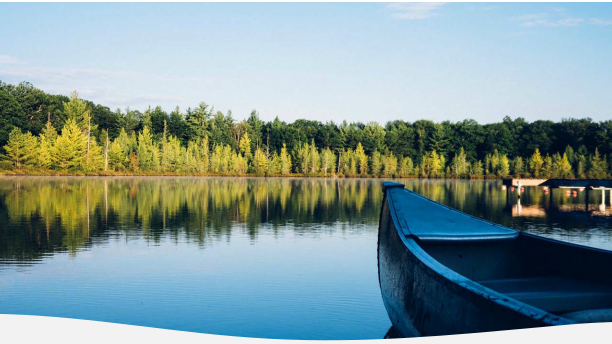**A FINITE RESOURCE: MANAGING THE GROWING WATER NEEDS IN THE LAKES REGION | 6** 

### **II. CURRENT LANDSCAPE: OVERVIEW** 

The Great Lakes are a vast but finite natural resource. They hold 20% of the Earth’s surface freshwater, and up to 40 million Great Lakes Basin residents rely on the Lakes for their drinking water.1 This surface water is directly intertwined with and connected to the groundwater beneath our feet. Between 20% and 40% of the Great Lakes’ water budget (the total water flowing in and out of the system) originates as groundwater, and between 40% and 75% of people residing in Great Lakes states depend on groundwater as their drinking water source.2 This finite resource requires comprehensive and ongoing management to ensure its availability for future generations. The eight Great Lakes states and two Canadian provinces wisely recognized this when they agreed to the Great Lakes – St. Lawrence River Basin Water Resources Compact (Compact) and corresponding Great Lakes – St. Lawrence River Basin Sustainable Water Resources Agreement (Agreement) in Canada. The Compact treats Great Lakes surface and groundwater as one interconnected resource, Great Lakes water, and does four things well: 

1.  Prohibits diversions of Great Lakes water (with limited exceptions). 

2.  Requires the states and provinces to manage Great Lakes water use within the Basin. 

3.  Sets water conservation and efficiency goals and objectives and requires the states and provinces to implement such programs. 

4.  Establishes common water use reporting protocols. 

The Compact’s prohibition on diversions is designed to generally ensure that Great Lakes water stays in the Great Lakes Basin. Proposals to pipe Great Lakes water for any use to a location outside the Great Lakes Basin are legally and logistically not in the cards – the Compact prohibits it. Any exception to the diversion prohibition can happen only in a county that is partially in the Basin, and the water must be returned after use. Beyond the legal constraints, moving vast amounts of Great Lakes water away from our region makes no economic or logistic sense. While this report will focus on water use from a U.S. perspective, a parallel good-faith agreement extends identical requirements to the Canadian provinces of Ontario and Quebec and establishes a regional body of which the eight states and two provinces are all members.3 In short, the good news is that Great Lakes water will be staying in the Great Lakes. 

> 1 International Joint Commission, “Great Lakes Water Quality,” <u>https://www.ijc.org/en/what/glwq#:~:text=The%20lakes%20hold%2020%20percent,of%20 the%20North%20American%20continent</u> (last accessed Dec. 12, 2024). 

> 2 Dempsey, Dave, “The Sixth Great Lake is Under Your Feet,” International Joint Commission (Jan. 18, 2021), _available at:_ <u>https://ijc.org/en/sixth-great-lakeunder-your-feet (last accessed May 28, 2025), and</u> Joyce Foundation, Groundwater Governance in EPA Region 5, p.10 (May 2024), _available at:_ <u>https://assets. joycefdn.org/content/uploads/Groundwater-Governance-in-EPA-Region-5-Report.pdf (last accessed July 2, 2025).</u> 

> 3 Great Lakes-Saint Lawrence River Basin Sustainable Water Resources Agreement, _available at_ : <u>https://www.glslcompactcouncil.org/media/uvlnnp5d/great_ lakes-st_lawrence_river_basin_sustainable_water_resources_agreement.pdf.</u> 

**A FINITE RESOURCE: MANAGING THE GROWING WATER NEEDS IN THE LAKES REGION | 7 A FINITE RESOURCE: MANAGING THE GROWING WATER NEEDS IN THE LAKES REGION | 7** 

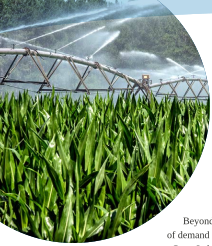However, the demand for Great Lakes water within the Basin is changing and will continue to do so over the next decade. A variety of factors are all simultaneously increasing the demand on Great Lakes water, including: 

   - The proliferation and expansion of artificial intelligence, the world’s data storage needs, and the associated energy demand. 

   - Mining for the critical minerals needed to power a green energy transition. 

- Agricultural irrigation in response to climate change. 

Beyond the Compact, state laws are not adequate to accommodate this influx of demand from all sectors, especially when it comes to groundwater. For example, many Great Lakes states follow the common law doctrine of riparian rights, meaning every landowner has a right to use groundwater underlying their property, provided that the use is reasonable and does not impact the use of another. While states have enacted registration, permitting, and reporting requirements, not all states in the Great Lakes region have adequate laws or tools in place to be able to curb or halt groundwater use when aquifers begin to decline but before a crisis occurs. While the Compact is a valuable tool for the region, its minimum requirements don’t necessarily ensure that states have all the facts when it comes to water use. 

In addition, state legislatures, economic development agencies, and local governments also do not appear to be strategically, proactively, and comprehensively evaluating increases in water demand. Nor is water demand and usage formally considered when states and local governments are making economic development decisions to attract, incentivize, and site new development. While states like Ohio, Indiana, and Illinois have undertaken regional demand studies to gain more understanding about the capacity of aquifers and surface water to support growing demand, the studies often examine water only through the lens of whether supply will be sufficient to meet demand, neglecting to examine other factors, such as how that increase in demand and use will impact the environment and ecosystems. 

#### **A. The Compact and beyond** 

##### **_1. Prohibition on diversions and Compact basics_** 

The Compact establishes the Compact Council, made up of the governors of the eight Great Lakes States. The Agreement establishes a regional body composed of the states and two Canadian provinces, Ontario and Quebec. Both play an important role in the Compact’s operation and functionality, as detailed throughout this section. 

First and foremost, the Compact prohibits diversions (with limited exceptions). A diversion is a transfer of water, including groundwater, from the Basin into another watershed or from the watershed of one of the Great Lakes into that of another. The diversion prohibition does not apply to water used within the Basin or a Great Lakes watershed to manufacture or produce a product that is then transferred out of the Basin or watershed.4 A withdrawal is the taking of Great Lakes water, either from surface or groundwater, and <u>becomes a diversion only if it is sent outside of the Basin boundary line. Consumptive use is the portion</u> 

> 4 Great Lakes – St. Lawrence River Basin Water Resources Compact, Art. 1, Sec. 1.2, _hereinafter_ Great Lakes Compact, _available at_ : <u>https://gsgp.org/media/ qjpdf1gr/great_lakes-st_lawrence_river_basin_water_resources_compact.pdf.</u> 

T LAKES 

**A FINITE RESOURCE: MANAGING THE GROWING WATER NEEDS IN THE LAKES REGION | 8 A FINITE RESOURCE: MANAGING THE GROWING WATER NEEDS IN THE LAKES REGION | 8** 

CURRENT LANDSCAPE: OVERVIEW 

of water withdrawn or withheld from the Basin that is lost or otherwise not returned to the watershed because of incorporation into a product, evaporation, or some other process. Under the Compact, both withdrawals and diversions may allow for some percentage of consumptive use. 

The Compact’s two main exceptions to the diversion prohibition are: 

- A diversion to a community that is located partially in the Great Lakes Basin for public water supply purposes (a straddling community). 

- A diversion to a community that is located within a county that is partially in the Basin for public water supply purposes (a community within a straddling county). 

The distinguishing feature between the two is which entity has final approval authority: A straddling community diversion can be approved by a state alone, whereas a community within a straddling county diversion requires the unanimous approval of the Compact Council. For any withdrawal, consumptive use, or diversion proposal to be approved, it must meet the Compact’s decision-making standard, which requires all of the following: 

- All water withdrawn must be returned to the Basin, less an allowance for consumptive use. 

- No significant individual or cumulative adverse impacts may be caused. 

- Conservation and efficiency measures must be in place to reduce loss and waste. 

- The proposal must abide by all other laws. 

- The proposed use must be “reasonable.” 

Reasonableness is subjective, so the Compact provides guidance on how to interpret that term. Factors to be considered as part of the reasonableness determination include: 

- Whether the proposal makes efficient use of water that minimizes waste. 

- If the proposal is for an increase, whether it makes efficient use of already-existing supplies. 

- Whether the proposal balances economic development, social development, environmental protection, and other water user’s uses. 

- The supply potential of the proposal, including the quantity, quality, reliability, and safe yield of hydrologically interconnected water sources. 

- The degree and duration of adverse impacts to other uses, and plans for mitigation. 

- Optionally, the restoration of hydrologic conditions and functions of the source watershed, if included in the proposal. 

**A FINITE RESOURCE: MANAGING THE GROWING WATER NEEDS IN THE LAKES REGION | 9 A FINITE RESOURCE: MANAGING THE GROWING WATER NEEDS IN THE LAKES REGION | 9** 

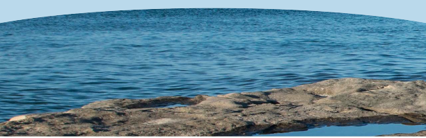Examples of diversions that have tested the Compact thus far include the Wisconsin communities of New Berlin, Mount Pleasant (Foxconn), and Waukesha. The Mount Pleasant diversion is an example of a straddling community diversion. In that proposal in 2018, the Wisconsin Department of Natural Resources (WDNR) approved the city of Racine to supply Mount Pleasant with up to 7 million gallons per day of Lake Michigan water, about 40% of which would be lost to consumptive use. Environmental advocates challenged that approval because part of the reason Mount Pleasant needed the diversion was in order to supply a new industrial user, Foxconn, a Taiwanese LCD-panel manufacturing company. In 2019, an administrative judge upheld the diversion as being for a public supply purpose because the Compact defines a public water supply as water that is distributed through treatment, storage, and distribution infrastructure that serves “a group of largely residential customers that may also serve industrial, commercial, and other industrial operators.”5 In this case, the diversion was to be added to existing residential infrastructure. 

Foxconn is also an example of how fast new economic development proposals can change. How much water new development might require isn’t always well known at the outset and can change quickly based on market conditions and technological developments. While Foxconn has since scaled back its initially proposed development, Microsoft purchased some of the property owned by Foxconn and is now constructing a data center there. However, Microsoft too is now considering reducing the scale of its initially proposed development.6 

Waukesha, Wisconsin, was the Compact’s first community within a straddling county diversion, requiring the approval of all eight states. The city of Waukesha had a deep aquifer groundwater supply, contaminated by high radium concentrations requiring costly treatment. The city was under an amended court order to comply with radium standards by Sept. 1, 2023. Because of these groundwater concerns, Waukesha applied to the WDNR for a diversion of Lake Michigan water under the Great Lakes Compact and Agreement as a community in a straddling county first in 2010 and then again in a revised application in 2013. 

> 5 Great Lakes Compact, Art. 1, Sec. 1.2. 

> 6 Davis, D.L. “Fact check: Biden hits and misses with Trump and Foxconn claims,” Milwaukee Journal Sentinel (July 15, 2024), _available at:_ <u>https://www.jsonline. com/story/news/politics/politifactwisconsin/2024/07/15/biden-campaign-hits-and-misses-with-trump-and-foxconn-claims/74404076007/ (last accessed</u> May 2, 2025), and Rommel, Nick, “Microsoft pauses construction on parts of Mount Pleasant site again,” Wisconsin Public Radio (March 20, 2025) _available at:_ <u>https://www.wpr.org/news/microsoft-pauses-construction-on-parts-of-mount-pleasant-site-again#:~:text=The%20project’s%20ongoing%20frst%20i phase,the%20northwest%20along%20Durand%20Avenue (last accessed May 2, 2025).</u> 

**A FINITE RESOURCE: MANAGING THE GROWING WATER NEEDS IN THE LAKES REGION | 10 A FINITE RESOURCE: MANAGING THE GROWING WATER NEEDS IN THE LAKES REGION | 10** 

CURRENT LANDSCAPE: OVERVIEW 

In 2016, the WDNR forwarded to the Compact Council its review of the application for 10.1 million gallons per day, which was more water per day for a larger area than the city was then serving. The Compact Council approved Waukesha’s diversion application in June 2016 under the following conditions: 

- A reduced diversion volume of 8.2 million gallons per day. 

- A smaller diversion area, composed of only the places then served by the Waukesha water utility. 

- A requirement to monitor wastewater impacts to the Root River. 

- Annual reporting to the Great Lakes states and provinces on the diversion. 

The city of Waukesha now purchases water from the city of Milwaukee and returns treated wastewater to the Root River, a tributary of Lake Michigan. Waukesha switched from groundwater wells to Lake Michigan water supply on Oct. 9, 2023. In 2024, Waukesha submitted its first report detailing the conditions of the Root River, from 2016 to 2023. Waukesha is required to submit such reports annually.7 Waukesha highlights the important role of the Compact Council and illustrates that the Compact is functioning as intended. 

One other exception to the Compact’s general prohibition against diversions that bears mentioning is Illinois. Illinois’ diversion of Great Lakes water is not subject to the Compact and is instead governed by a 1967 Supreme Court decree.8 Under that decree, Illinois (via Chicago) may divert 2.1 billion gallons per day from Lake Michigan. The Court retains jurisdiction over future modifications to the decree. As the Illinois diversion is not subject to the Compact, allocations under that decree are instead up to Illinois to oversee and manage under its state laws and the specifications of the decree. For example, in 2023, Chicago agreed to a 100-year, $1 billion deal to sell water to Joliet, located 35 miles southwest of the city. Joliet’s groundwater supply was anticipated to run out by 2030, according to a report by the Illinois State Water Survey, and other neighboring communities that rely on that aquifer may face the same challenge in the years ahead.9 Per the water supply agreement, Chicago will provide Joliet and five other communities that will compose the Grand Prairie Water Commission a guaranteed maximum of 105 million gallons per day.10 These communities will pay initial infrastructure costs, and communities that join the Commission in the future will bear a portion of those costs. One of the five initial communities, Minooka, is planning to build a data center that could use up to 3 million gallons of water per day. Under Illinois conservation and efficiency laws governing purchased Lake Michigan water, Joliet is required to obtain a permit from the Illinois Department of Natural Resources and reduce its current water loss rate of 29% to 10% by updating its aging infrastructure. Illinois water use reporting requirements will apply once the permit is issued.11 

> 7 Looby, Caitlyn, “After decades-long journey, Waukesha hits one-year anniversary tapping into Lake Michigan,” Milwaukee Journal Sentinel (Sept. 17, 2024), _available at:_ <u>https://www.jsonline.com/story/news/local/2024/09/17/waukeshas-one-year-anniversary-marks-end-of-drinking-water-crisis/75069048007/</u> (last accessed April 14, 2025). 

> 8 Great Lakes Compact, Art. 4, Sec. 4.14. 

> 9 Looby, Caitlin, “How could Chicago sell Lake Michigan water to Joliet, 35 miles away? Five questions answered,” Milwaukee Journal Sentinel (May 22, 2023), _available at:_ <u>https://www.jsonline.com/story/news/2023/05/22/how-chicago-just-sold-lake-michigan-water-to-joliet-35-miles-away/70232563007/ (last</u> accessed May 28, 2025). 

> 10  Strifling, David, “Chicago and the Great Lakes Compact,” Marquette University Law School (May 30, 2023), _available at:_ <u>https://law.marquette.edu/ facultyblog/2023/05/</u> (last accessed May 28, 2025), and city of Joliet, “Joliet Announces Historic Water Agreement with City of Chicago,” (April 20, 2023), _available at:_ <u>https://www.joliet.gov/Home/Components/News/News/4278/41 (last accessed May 28, 2025).</u> 

> 11  Ching, Cathy, “As aquifer dries up, some Will County towns say they aren’t worried about running out of water,” Chicago Tribune (May 7, 2025), _available at:_ <u>https://www.chicagotribune.com/2025/05/06/joliet-water-pipeline-aquifer/ (last accessed May 28, 2025), and</u> IL Admin. Code, Title 17, Part 3730. 

**A FINITE RESOURCE: MANAGING THE GROWING WATER NEEDS IN THE LAKES REGION | 11 A FINITE RESOURCE: MANAGING THE GROWING WATER NEEDS IN THE LAKES REGION | 11** 

CURRENT LANDSCAPE: OVERVIEW 

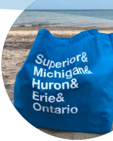#### **2. State water withdrawal programs** 

Under the Compact, each state is required to manage and regulate new or increased withdrawals, consumptive uses, and diversions in a manner consistent with the Compact’s decision-making standard. At minimum, every state requires any person with the capacity to withdraw 100,000 gallons per day or more to register with the state.12 However, the Compact affords states flexibility in determining how best to manage these programs; thus, each state’s programs differ in terms of withdrawal thresholds that may trigger consumptive use permit requirements. The Compact Council periodically reviews water management programs and can make recommendations to the states to strengthen them, including recommending lower thresholds.13 

Each state is also required to develop and maintain a conservation and efficiency program to: 

- Ensure improvement of Great Lakes water resources. 

- Protect and restore the hydrologic and ecosystem integrity of the Basin. 

- Retain the quantity of surface water and groundwater in the Basin. 

- Ensure the sustainable use of waters of the Basin. 

- Promote the efficiency of use and reduce losses and wasted water. 

Per the Compact, programs “need to adjust to new demands and the potential impacts of cumulative effects and climate.”14 

The Compact is an invaluable tool for the region, but it could not have accounted for every water use-related issue in the Great Lakes region that would arise after its inception in the early 2000s. However, it provides a solid foundation on which states can build and adapt their withdrawal and conservation and efficiency programs. Where there are gaps in state programs, the Compact Council can help recommend ways that they be filled. States can also seek to voluntarily fill them in the absence of such recommendations. Section V of this report will identify and address specific ways that states can fill those gaps. 

##### **_B. Great Lakes region water use: Groundwater risks, conflicts, consumptive use, and demand_** 

1. GROUNDWATER RISKS AND CONFLICTS 

Recall that between 20% and 40% of the Great Lakes’ water budget (the total water flowing in and out of the system) originates as groundwater, and between 40% and 75% of Great Lakes state residents rely on groundwater as their drinking water source.15 Thus, the unsustainable use of groundwater poses a number of risks to the Great Lakes region. Overpumping groundwater at unsustainable rates means that aquifers can’t adequately replenish themselves. This can lower water tables, requiring 

> 12  Great Lakes Compact, Art. 4, Sec. 4.1. 

> 13  Great Lakes Compact, Art. 3, Sec. 3.4. 

> 14  Great Lakes Compact, Sec. 4.2., _emphasis added._ 

> 15  Dempsey, Dave, “The Sixth Great Lake is Under Your Feet,” International Joint Commission (Jan. 18, 2021), _available at:_ <u>https://ijc.org/en/sixth-great-lakeunder-your-feet (last accessed May 28, 2025), and</u> Joyce Foundation, Groundwater Governance in EPA Region 5, p.10 (May 2024), _available at_ : <u>https://assets. joycefdn.org/content/uploads/Groundwater-Governance-in-EPA-Region-5-Report.pdf (last accessed July 2, 2025).</u> 

**A FINITE RESOURCE: MANAGING THE GROWING WATER NEEDS IN THE LAKES REGION | 12 A FINITE RESOURCE: MANAGING THE GROWING WATER NEEDS IN THE LAKES REGION | 12** 

CURRENT LANDSCAPE: OVERVIEW 

drilling of deeper wells, which comes with added costs. Moreover, it risks drawing deep-water brine and other contaminants into the aquifer, making existing wells unusable. Overextraction of groundwater can also cause communities to sink. When aquifers are depleted and not adequately replenished, the pore space the groundwater once occupied can collapse, permanently reducing the aquifer’s storage capacity. This causes compaction underground and sinking at the surface level. A new study indicates that cities in the Great Lakes are subsiding – Chicago, Columbus, Indianapolis, and Detroit are all subsiding at a rate of 2mm or more annually.16 Over time, this subsidence threatens public drinking water supplies and can impact roads, buildings, and infrastructure, posing serious public safety risks. 

Conflicts over groundwater and overextraction are already occurring in Great Lakes states. For example, in Southwestern Michigan, heavy demand from agriculture, developers, and homeowners is causing shallow aquifers to become strained and creating disputes over groundwater resources. Thick clay soils in that region limit the ability of precipitation to recharge the surface aquifer, and overpumping can draw out saline brine water that isn’t drinkable from deeper groundwater.17 Similarly, overuse of groundwater in the Little Rock Creek area of central Minnesota has required the Minnesota Department of Natural Resources to intervene and designate a groundwater management area. Overpumping of groundwater in that area has already reduced the amount of surface water in Little Rock Creek, negatively impacting the habitat and exacerbating water quality impairments of that unique cold-water stream.18 In Wisconsin, extensive pumping of groundwater for irrigated agriculture in the Central Sands region has caused surface water drawdown in two lakes, impacting both those lakes’ ecosystems and human use. Significant impacts to one of the lakes, Long Lake, were not caused by any one well, but rather, by the cumulative impact of 200 wells within a 5-mile radius of the lake.19 In Indiana, it’s suspected that construction activities associated with dewatering to make way for data centers and an EV battery plant have caused at least three residential wells to fail.20 As these localized examples illustrate, concentrated demand from largescale water use can have a big impact on local groundwater resources. 

##### 2. CONSUMPTIVE USE AND DEMAND 

When it comes to water use, the terminology matters, because most of the water we use every day is returned to the watershed where it came from. Consumptive water use is different. Recall that consumptive use is the portion of water withdrawn or withheld from the Great Lakes Basin that is lost or otherwise not returned to the Basin because of evaporation or incorporation into a product or some other process. Whether that water is consumed to grow and harvest a cucumber, evaporated for cooling a data center, or becomes process mining waste that cannot be reused, consumptively used water is effectively lost to the watershed. However, only 1% of water in the Great Lakes system 

> 16  Ohenhen, L.O., Zhai, G., Lucy, J. _et al._ , “Land subsidence risk to infrastructure in US metropolises,” _Nat Cities_ 2, 543–554 (2025), _available at:_ <u>https://doi. org/10.1038/s44284-025-00240-y.</u> 

> 17  Flesher, John, “Even in water-rich Michigan, no guarantee of enough for all,” OPB (Feb. 26, 2022), _available at:_ <u>https://www.opb.org/article/2022/02/26/even-inwater-rich-michigan-no-guarantee-of-enough-for-all/ (last accessed May 22, 2025).</u> 

> 18  “Sustainable use of groundwater in the Little Rock Creek area,” Minnesota Department of Natural Resources, _available at:_ <u>https://www.dnr.state.mn.us/waters/ groundwater_section/sustainability/lrc/index.html (last accessed May 22, 2025).</u> 

> 19  Central Sands Lakes Study Report: Findings & Recommendations, WDNR (May 27, 2021), p. 2 and 27, _available at:_ <u>https://widnr.widen.net/content/ kmlotz3hmk/pdf/DG_CSLS_Findings_Report_2021.pdf?u=kfkpym (last accessed May 29, 2025).</u> 

> 20  Dits, Joseph, “Wells lose water west of South Bend. Homeowners question if it’s from Amazon, GM projects,” South Bend Tribune (May 29, 2025), _available at:_ <u>https://www.southbendtribune.com/story/news/local/2025/05/29/wells-lose-water-near-amazon-gm-projects-in-st-joseph-county/83765951007/ (last</u> accessed May 30, 2025). 

**A FINITE RESOURCE: MANAGING THE GROWING WATER NEEDS IN THE LAKES REGION | 13 A FINITE RESOURCE: MANAGING THE GROWING WATER NEEDS IN THE LAKES REGION | 13** 

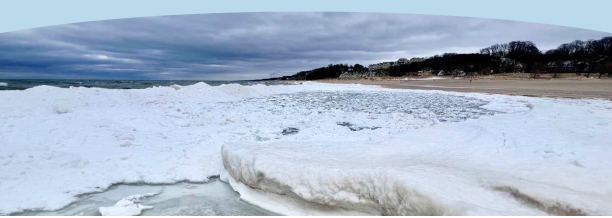is renewed each year by precipitation (rainfall and snowmelt), surface water runoff, and inflow from groundwater sources. The Lakes are a one-time gift from glaciers that melted thousands of years ago. Because Great Lakes surface and groundwater is so finite, it necessitates both careful planning and management to ensure that water is continuously available when and where we need it. 

Large-scale consumptive water use for power plant cooling that began over a century ago took place without any concern for or consideration of future impacts. However, thanks in part to the Compact, the careful planning and management it requires, and overall improvements in conservation and efficiency, consumptive use is a small percentage of today’s overall Great Lakes water use. Total consumptive water use in 2023 was about 1.9 billion gallons per day, less than 5% of the total amount of water withdrawn that year. Consumptive use also has declined over time since 2015, largely due to improvements made in efficiency and conservation, including the retirement of coalfired power plants that used to consume vast amounts of water for cooling.21 

But there is no guarantee that this trend will continue, and we must make conscious choices that ensure progress made with respect to reducing consumptive use is not erased. That progress is currently at risk of being washed away. For example, President Donald Trump issued an executive order in April 2025 directing the Energy Department to establish a procedure using emergency powers to keep coal plants open. In May 2025, the administration then issued emergency orders requiring some fossil fuel-fired plants, including a coal-fired one in Michigan and an oil and gas one in Pennsylvania, that were previously slated for closure to remain open.22 In addition, the increased demands for Great Lakes water from the high-consumptive-use sectors detailed in this report call into question whether this historical trend will continue. Nevertheless, the chart below, made using Great Lakes Regional Water Use Database data, illustrates how consumptive use of Great Lakes water has declined since 2015. 

> 21  Nicholas, Jim and Posthumus, Emily, Potential Changes in Water Use Resulting from Retirement of Thermoelectric Power Plants in the Great Lakes Basin (Jan. 2017), _available at:_ <u>https://www.glslcompactcouncil.org/media/unqf0dbl/2017-thermoelectric-powerplant-report.pdf (last accessed May 13, 2025).</u> 

> 22  Brown, Claire and Stevens, Harry, “Coal and Gas Plants Were Closing. Then Trump Ordered Them to Keep Running,” New York Times (June 6, 2025), _available at:_ <u>https://www.nytimes.com/2025/06/06/climate/trump-coal-gas-plants-energy-emergency.html (last accessed June 26, 2025).</u> 

**A FINITE RESOURCE: MANAGING THE GROWING WATER NEEDS IN THE LAKES REGION | 14** 

CURRENT LANDSCAPE: OVERVIEW 

**_Fig. 2.1. Consumptive Water Use Since 2015 in Great Lakes States in Billions of Gallons per Day_** 

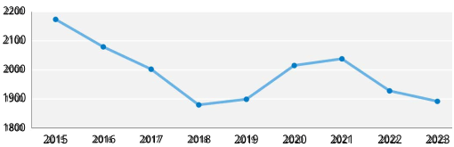Despite this overall historical downward trend in Great Lakes consumptive water use, demand for water is not evenly distributed at the local level. For example, according to the Chicago Metropolitan Planning Agency, while demand across the Chicago metro area is projected to remain relatively stable through 2050, it is not evenly spread across all water supply sources.23 Likewise, water supply is not evenly distributed. For example, Ohio’s Central Ohio Regional Water Demand Study identifies several shortages, or gaps, in raw water supply, treatment capacity, and receiving water conditions when looking more closely at the 15-country Central Ohio region.24 We see and experience this disconnect between supply and demand when examining local groundwater conflicts, like those detailed in section B.1. above. 

It is also very likely that Great Lakes water will be in high demand for the foreseeable future. For example: 

- Hyperscale data centers are forecasted to withdraw 150.4 billion gallons of water between 2025 and 2030, the equivalent of 4.6 million U.S. households.25 

- Heavily dependent on groundwater, agriculture in the region is increasingly turning to irrigation to support crop production during peak summer months. 

- Critical minerals needed to power electric vehicles (EVs) and renewable energy – including copper and nickel, which are both found in the Great Lakes region – will require significant amounts of water to extract. 

Large water-using industries in the Great Lakes region historically included sectors like steel production, petroleum refining, agriculture, and power generation. Today’s growth sectors look somewhat different, but all large-scale water use has the potential to impact water supply. Made using 2023 data from the Great Lakes Regional Water Use Database, the chart below illustrates consumptive use across the current reporting categories.26 

> 23  “On to 2050,” Chicago Metropolitan Planning Agency (2022), p. 173-174, _available at:_ <u>https://cmap.illinois.gov/download/967/?tmstv=1747701375 (last</u> accessed May 22, 2025). 

> 24  Ohio Environmental Protection Agency, Central Ohio Regional Water Study (2025), _available at:_ <u>https://epa.ohio.gov/monitor-pollution/pollution-issues/ water-studies/central-ohio-water-study (last accessed May 9, 2025).</u> 

> 25  Water Online, “U.S. Water-Related Expenditures for Data Centers to Exceed US$4.1B through 2030” (June 26, 2025), _available at:_ <u>https://www.wateronline. com/doc/u-s-water-related-expenditures-data-centers-exceed-us-b-through-0001 (last accessed July 2, 2025).</u> 

> 26  The chart excludes hydroelectric power production and water use, as there is no consumptive use associated with those categories. See <u>https://waterusedata. glc.org/sector-defnitionsi .</u> 

ALLIANCE GREAT LAKES 

**A FINITE RESOURCE: MANAGING THE GROWING WATER NEEDS IN THE LAKES REGION | 15** 

CURRENT LANDSCAPE: OVERVIEW 

###### **_Fig. 2.2. Great Lakes water consumptive use, by category, in 2023_** 

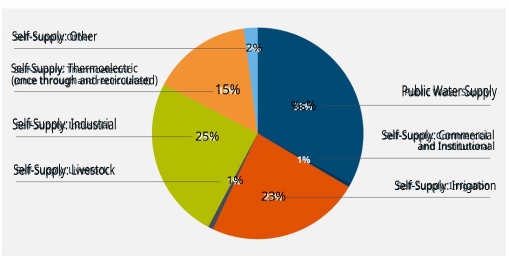To further explore rising demand for Great Lakes water, this report will focus on three high-consumptive water-using industries simultaneously poised for dramatic growth over the next decade in the region: data centers, critical minerals mining, and agriculture. 

ALLIANCE e GREAT LAKES 

**A FINITE RESOURCE: MANAGING THE GROWING WATER NEEDS IN THE LAKES REGION | 16** 

### **III. DATA CENTERS** 

The rapid growth of digital consumption of generative artificial intelligence (GenAI), bitcoin mining, cloud computing, the Internet of Things, and digital services is driving an unprecedented demand for new data centers. Growth projections vary and depend on a wide variety of factors, but we can make a few generalizations about the trends in this region: 

- Demand for data centers is rapidly increasing. 

- GenAI is a key driver of the growth, requiring vast data processing capabilities. 

- The type of hyperscale data centers that can handle big tasks require both large quantities of electricity and water for cooling. 

For example, McKinsey & Company finds that global demand for data center capacity could more than triple by 2030 and that Gen AI is a key driver of that growth.27 Synergy Research Group finds that the average capacity of hyperscale data centers to be opened over the next four years will be almost double that of those currently in operation.28 

Hyperscale data centers can take up over 10,000 square feet and house over 5,000 servers that demand water and electricity 24 hours a day. How much water a data center needs varies depending on the size and type of cooling technology used, but hyperscale data centers can use between 1 and 5 million gallons of water per day (MGD) 

when evaporative cooling, currently the most common method, is the method used. To put this in perspective, a hyperscale data center that uses 365 million gallons in a year (or 1 MGD) is equivalent to what roughly 12,000 Americans use in a year.29 

Most of the water used in evaporative cooling is used consumptively, meaning the water is not returned to the watershed, but rather, as the name implies, lost to evaporation. For example, according to Equinix’s 2023 sustainability report, the company consumed 60% of all the water it withdrew for data centers, mainly via evaporative cooling.30 The increased pace of this consumption is alarming. A new report shows that in 2023, U.S. data centers directly consumed about 17.4 billion gallons of water, and the authors expect that figure to double by 2028.31 

> 27  Srivathsan, Bhargs, Sorel, Marc, and Sachdeva, Pankaj, with Arjita Bhan, Haripreet Batra, Raman Sharma, Rishi Gupta, and Surbhi Choudhary, “AI power: Expanding data center capacity to meet growing demand,” McKinsey & Company (Oct. 29, 2024), _available at:_ <u>https://www.mckinsey.com/industries/ technology-media-and-telecommunications/our-insights/ai-power-expanding-data-center-capacity-to-meet-growing-demand.</u> 

> 28  “Hyperscale Data Center Capacity to Triple by 2030, Driven by Generative AI,” Synergy Research Group (Jan. 9, 2025), _available at:_ <u>https://www.srgresearch. com/articles/hyperscale-data-center-capacity-to-triple-by-2030-driven-by-generative-ai#:~:text=Hyperscale%20Data%20Center%20Capacity%20to%20 Triple%20by%202030%2C%20Driven%20by%20Generative%20AI,-RENO%2C%20NV%2C%20January&text=New%20data%20and%20forecasts%20 from,current%20operational%20hyperscale%20data%20centers.</u> 

> 29  USEPA, _citing_ USGS, Estimated Use of Water in the United States, 2015, _available at:_ <u>https://www.epa.gov/watersense/statistics-and-facts.</u> 30  Setmajer, Alex, “How Data Centers Use Water, and How We’re Working to Use Water Responsibly” (Sept. 19, 2024), _available at:_ <u>https://blog.equinix.com/ blog/2024/09/19/how-data-centers-use-water-and-how-were-working-to-use-water-responsibly/ (last accessed May 30, 2025).</u> 

> 31  Shehabi, A., Smith, S.J., Hubbard, A., Newkirk, A., Lei, N., Siddik, M.A.B., Holecek, B., Koomey, J., Masanet, E., Sartor, D., 2024 United States Data Center Energy Usage Report (2024), Lawrence Berkeley National Laboratory, Berkeley, California. LBNL-2001637, _available at:_ <u>https://eta-publications.lbl.gov/sites/default/ fles/2024i</u> -12/lbnl-2024-united-states-data-center-energy-usage-report.pdf. 

**A FINITE RESOURCE: MANAGING THE GROWING WATER NEEDS IN THE LAKES REGION | 17** 

DATA CENTERS 

Other cooling methods, such as liquid immersion or direct-to-chip cooling, consume less water and electricity by directly using water to cool equipment but can introduce contaminants into the process. These methods may be more efficient from a water consumption standpoint but will pose water quality questions. Air cooling is another alternative but uses more electricity and cannot accommodate the tremendous processing power GenAI demands. The reuse of nonpotable water and recirculation have the potential to offset consumptive use, but these technologies are not contemplated by most states’ laws and therefore, it takes more time and effort to finalize partnerships and obtain permits for them. There also isn’t good data to show how many data centers are adopting them. Furthermore, it may not be possible to recirculate water forever; eventually, recirculated water may need to be replaced due to scaling and changes in pH or it can negatively impact equipment.32 

For example, a closed-loop system is in development at the Microsoft data center in Mount Pleasant, Wisconsin (the former site of the Foxconn project). However, how that technology will reduce both water and electricity usage remains to be seen.33 While Microsoft notes the shift to this type of technology will nominally increase electricity use, exactly how much water and electricity will be used or saved isn’t entirely clear. As of the date of this writing, Microsoft has paused development of the $3.3 billion dollar project beyond the initially proposed phase.34 

A shift to cooling systems that require more electricity than water does not entirely solve water use issues – it may be somewhat of a shell game. This is because generating electricity to meet data centers’ needs via coal, natural gas, or nuclear-fired power plants also requires water. Power plants using fossil fuels turn water into steam, which in turn pushes a turbine to generate electricity. This process involves the loss of some water through evaporation. Some refer to this relationship between water and energy generation as part of the water-energy nexus. Per the Great Lakes Regional Water Use Database, 70% of Great Lakes reported water use in 2023 was associated with generating electrical power. That’s overall water use, not the percentage of consumptive use, and that percentage generally matches each state’s water use as well. However, because the electric utility is the entity that reports its water use and corresponding consumptive use to the Database, we don’t have a clear understanding of what the total water footprint of an individual data center or the data center industry is. What we do know is that the percentage of consumptive use from thermoelectric self-supply (from both once-through cooling and recirculation) for 2023 was 15%, down from about 16% in 2022.35 This number doesn’t express what portion of consumptive use was due to growth in the data center sector. The corresponding increase in the cumulative use of water by data centers, both in their indirect energy needs and direct cooling needs, must be better quantified and understood. 

> 32  Ahmad, Rasheed, “Engineers often need a lot of water to keep data centers cool,” American Society of Civil Engineers (March 4, 2024), _available at:_ <u>https://www. asce.org/publications-and-news/civil-engineering-source/civil-engineering-magazine/issues/magazine-issue/article/2024/03/engineers-often-need-a-lotof-water-to-keep-data-centers-cool (last accessed April 14, 2025).</u> 

> 33  Casey, Evan, “Microsoft says new technology will save water at Mount Pleasant data center development” (Dec. 11, 2024), _available at:_ <u>https://www.wpr.org/ news/microsoft-new-technology-save-water-mount-pleasant-data-center (last accessed April 14, 2025).</u> 

> 34  Casey, Evan, “Microsoft says new technology will save water at Mount Pleasant data center development” (Dec. 11, 2024), _available at:_ <u>https://www.wpr.org/ news/microsoft-new-technology-save-water-mount-pleasant-data-center (last accessed May 2, 2025).</u> 

> 35  Nicholas, Jim and Posthumus, Emily, “Potential Changes in Water Use Resulting from Retirement of Thermoelectric Power Plants in the Great Lakes Basin” (Jan. 2017), _available at:_ <u>https://www.glslcompactcouncil.org/media/unqf0dbl/2017-thermoelectric-powerplant-report.pdf (last accessed May 13, 2025).</u> 

**A FINITE RESOURCE: MANAGING THE GROWING WATER NEEDS IN THE LAKES REGION | 18** 

DATA CENTERS 

Consumptive water use for electric generation has declined since 2015, but it’s not certain that will continue to be the case as energy demand, driven by data centers, continues to increase at an unprecedented pace. For example, PJM Interconnection, the regional transmission organization that services several Great Lakes states, continues to voice concerns about the lack of available generation capacity to meet demand due to retirement of coal-fired plants.36 Research also shows that it’s taken just four years for the total capacity of hyperscale data centers (megawatts of load a data center can handle) to double, while both the number of facilities and average capacity are rapidly climbing.37 To meet the demand on existing power grids, states will have to add capacity while also meeting state renewable energy targets. According to a new study by the National Electrical Manufacturers Association, U.S. electricity demand is expected to increase 2% annually and 50% by 2050.38 In some states, that may necessitate reactivating or expanding nuclear power plants. That’s already happening in Michigan (Palisades), Pennsylvania (Three Mile Island), and Ontario (Bruce). Three Mile Island’s reopening is specifically driven by a power purchase agreement to power Microsoft data centers, while the Palisades reopening and Bruce expansion are part of a more general response to the influx of demand driven by data centers.39 In Ohio, Pennsylvania, and Wisconsin, demand is driving the construction of new natural gas plants, including on-site natural gas plants specifically to power data centers.40 

Seasonal variations in temperature can impact how much water and electricity a data center may need. In general, data centers consume less water in winter and more in summer. When outside air temperatures are high, more energy is needed for cooling. That in turn demands more water to bring down the data center’s inside air temperature to ideal levels.41 

> 36  “PJM Summer Outlook 2025: Adequate Resources Available for Summer Amid Growing Risk,” PJM Inside Lines (May 9, 2025), _available at:_ <u>https://insidelines. pjm.com/pjm-summer-outlook-2025-adequate-resources-available-for-summer-amid-growing-risk/#:~:text=PJM%20continues%20to%20voice%20 concerns,Replacements%20and%20Risks%20(PDF) (last accessed May 22, 2025).</u> 37  Synergy Research Group, “Hyperscale Data Centers Hit the Thousand Mark; Total Capacity is Doubling Every Four Years” (April 17, 2024), _available at:_ <u>https:// www.srgresearch.com/articles/hyperscale-data-centers-hit-the-thousand-mark-total-capacity-is-doubling-every-four-years (last accessed May 2, 2025).</u> 38  Walton, Robert, “US electricity demand will grow 50% by 2050, electrical manufacturer study finds,” Utility Dive (April 7, 2025), _available at:_ <u>https://www. utilitydive.com/news/us-electricity-demand-will-grow-50-by-2050-electrical-manufacturer-study/744575/#:~:text=Driven%20by%20data%20centers%20 and,in%20a%20study%20published%20Monday (last accessed May 22, 2025).</u> 39  Mandler, C., “Three Mile Island nuclear plant will reopen to power Microsoft data centers,” NPR (Sept. 20, 2024), _available at:_ <u>https://www.npr.org/2024/09/20/ nx-s1-5120581/three-mile-island-nuclear-power-plant-microsoft-ai (last accessed June 23, 2025), and Ross, Izzy, “Rural Michigan company sees big potential</u> in Palisades nuclear plant restart,” Bridge Michigan (Jan. 23, 2025), _available at_ : <u>https://www.bridgemi.com/business-watch/rural-michigan-company-seesbig-potential-palisades-nuclear-plant-restart (last accessed June 23, 2025); and Jones, Allison, “Surge in Data Centres, AI to Drive 75% Growth in Ontario Power</u> Demand, IESO says,” The Energy Mix (Oct. 18, 2024), _available at:_ <u>https://www.theenergymix.com/surge-in-data-centres-ai-to-drive-75-surge-in-ontariopower-demand-ieso-says/#:~:text=Demand%20for%20electricity%20in%20Ontario,Electricity%20System%20Operator%20said%20Wednesday (last</u> accessed June 23, 2025). 40  Clark, Kevin, “Onsite gas plants proposed for data centers in Ohio,” PowerGen International, (March 25, 2025), _available at:_ <u>https://www.power-eng.com/news/ onsite-gas-plants-proposed-for-data-centers-in-ohio/#:~:text=Three%20natural%20gas%2Dfred%20plants,Meta%2C%20Google%20and%20STACK%20i Infrastructure</u> (last accessed April 14, 2025); Skidmore, Zachary, “AEP Ohio wins approval for on-site power units at AWS, Cologix data centers,” DCD (June 1, 2025) _available at:_ <u>https://www.datacenterdynamics.com/en/news/aep-ohio-wins-approval-for-on-site-power-units-at-aws-cologix-data-centers/ (last</u> accessed June 23, 2025); Howland, Ethan, “Largest US gas-fired power plant planned for data centers in Pennsylvania,” Utility Dive (April 3, 2025), _available at:_ <u>https://www.utilitydive.com/news/homer-city-gas-fredi</u> -power-station-data-center-frstenergy/744332/i (last accessed May 2, 2025); and Schulz, Joe, “Public Service Commission approves We Energies’ plan to build new Wisconsin natural gas plants,” WPR (May 22, 2025), _available at:_ <u>https://www.wpr.org/ news/public-service-commission-approves-we-energies-plan-wisconsin-natural-gas-plants#:~:text=Economy%2C%20Energy%2C%20News-,Public%20 Service%20Commission%20approves%20We%20Energies’%20plan%20to,new%20Wisconsin%20natural%20gas%20plants&text=State%20regulators%20 have%20paved%20the,power%20plants%20in%20southeastern%20Wisconsin (last accessed May 23, 2025).</u> 

> 41  Zhang, Mary, “Data Center Water Usage: A Comprehensive Guide,” Digital Infra (Jan. 17, 2024), _available at:_ <u>https://dgtlinfra.com/data-center-waterusage/#:~:text=Data%20center%20water%20consumption%20varies,liters%20of%20water%20each%20year (last accessed May 2, 2025).</u> 

**A FINITE RESOURCE: MANAGING THE GROWING WATER NEEDS IN THE LAKES REGION | 19** 

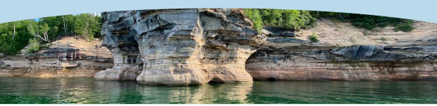Data centers are not being transparent about their total water footprint from the early stages of proposed development and may not have systems in place to accurately measure water use, because there is no requirement to do so. It’s estimated that fewer than one-third of data centers are currently tracking water usage.42 In the Great Lakes states, when a large water user obtains water from a public water system that has the capacity to supply it, the obligation to track and report water usage rests with that public system, not the water user. That reporting discrepancy critically obscures exactly how much water that industry or sector is using. For example, as shown in Figure 2.2 above, public water supply was the highest category of consumptive use in the Great Lakes region at 33%, but we cannot determine what portion of that is attributable to data centers or any other large water-using industry that receives water from a public water supply system. This is especially true with respect to data centers, as more than 97% of water used by major data center operators is purchased from municipal drinking water systems.43 Shielding large water users connected to public water systems from publicly reporting and tracking water usage over time may cause the Great Lakes Regional Water Use Database to reflect an increase in public supply and thermoelectric use categories that does not accurately reflect the growth of consumptive water use by that industry. 

At the same time, state legislatures, economic development agencies, and local governments are inviting data centers to locate in the Great Lakes region with tax incentives and other benefits packages. Every state in the Great Lakes region has enacted legislation over the last 20 years providing various types of tax exemptions designed to incentivize data centers to locate there.44 New legislation in Minnesota may extend such incentives, and Michigan recently authorized new tax incentives by statute as well.45 

Furthermore, when decisions are being made about where to incentivize development, water doesn’t appear to be holistically factored into the equation. That can and should change, as states (like Ohio, Illinois, and Indiana) are undertaking studies to better understand water demand and capacity. If it doesn’t, states may max out an area with data centers and not have the capacity to handle any other type of growth or economic development. This is particularly worth examining because data centers, especially hyperscale data centers, tend to regionally concentrate and cluster around established fiber optic networks and where energy supply is abundant. This clustering is already beginning to occur throughout major cities and suburban areas in the Great Lakes region, as shown in the Data Center Map below. 

> 42  Center of Expertise for Energy Efficiency in Data Centers, <u>https://datacenters.lbl.gov/water-efciencyfi</u> (last accessed April 11, 2025). 

> 43  Water Online, “U.S. Water-Related Expenditures for Data Centers to Exceed US$4.1B through 2030” (June 26, 2025), _available at_ : <u>https://www.wateronline. com/doc/u-s-water-related-expenditures-data-centers-exceed-us-b-through-0001 (last accessed July 2, 2025).</u> 

> 44   Indiana (I.C. § 6-2.5-15, first enacted in 2019), Michigan (MCL § 205.54ee and 205.94, first enacted in 2016), Minnesota (Min. Stat. § 297A.68 and 297A.75, first 

> enacted in 2011), Ohio (Ohio Rev. Code § 122.175, first enacted in 2011), Pennsylvania (72 P.S. § 9915-D, first enacted in 2016), New York (N.Y. Tax Law § 1115(a) 

> (37), first enacted in 2000), and Wisconsin (Wis. Stat. § 77.52, 77.54, and 238.40, first enacted in 2023) all offer tax exemptions. 

> 45  HF 1277 94th Leg. (2025-2026) (Minn.) and SB 237 102nd Leg. (2023-2024) (Mich.). 

**A FINITE RESOURCE: MANAGING THE GROWING WATER NEEDS IN THE LAKES REGION | 20** 

DATA CENTERS 

###### **_Fig 3.1 Data Center Map: Locations_****_46_** 

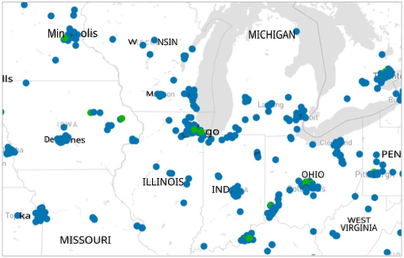Without careful planning, it could have unintended consequences, like depleting groundwater availability in existing private drinking water wells and wells used for agricultural irrigation. 

Great Lakes states are leading the nation in terms of volume of data centers. At the time of this writing, in July 2025, Ohio ranked fifth and Illinois ranked fourth in the country in terms of the number of data centers located there, behind only Virginia, Texas, and California. The map below illustrates the number of data centers in each state as of July 9, 2025. 

> 46  USA Data Center Map _available at:_ <u>https://www.datacentermap.com/ (last accessed July 9, 2025).</u> 

ALLIANCE GREAT LAKES 

**A FINITE RESOURCE: MANAGING THE GROWING WATER NEEDS IN THE LAKES REGION | 21** 

DATA CENTERS 

###### **_Fig. 3.2. Data Center Map: Number of Data Centers by State_****_47_** 

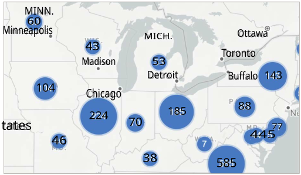A data center can employ as few as 10 or more than 100 people, depending on its size, and supports 6.5 jobs for every one person directly employed.48 If data centers turn out to be the economic development engine they have been touted as, then that may drive population growth, further increasing the demand for both water and electricity. For example, the Columbus, Ohio metropolitan area, where data centers are being constructed at a very rapid rate, was the fastest-growing city in the U.S. for the second half of 2023 and the second fastest in 2024.49 

> 47  USA Data Centers Map _available at:_ <u>https://www.datacentermap.com/ (last accessed July 9, 2025).</u> 

> 48  Weiker, Jim, “Data center industry makes case that the centers contribute billions to Ohio’s economy,” Columbus Dispatch (Feb. 19, 2025), _available at_ : <u>https:// www.dispatch.com/story/business/2025/02/19/data-center-report-notes-15000-employed-ohioans-billions-invested/79060756007/ (last accessed May 5,</u> 2025). 

> 49  NBC4i, “Columbus population grew faster than any city in second half of 2023, study says” (Feb. 16, 2024), _available at:_ <u>https://www.nbc4i.com/news/ local-news/columbus/columbus-population-grew-faster-than-any-u-s-city-in-second-half-of-2023-study-shows/#:~:text=COLUMBUS%2C%20Ohio%20 (WCMH)%20%E2%80%94,Bank%20of%20American%20Institute%20Ranking, and Millard, Katie, NBC4i, “Columbus named the second-fastest growing U.S.</u> city in 2024, highlighting housing needs” (March 14, 2025), _available at:_ <u>https://www.nbc4i.com/news/local-news/real-estate/columbus-named-the-secondfastest-growing-u-s-city-in-2024-highlighting-housing-needs/.</u> 

ALLIANCE e GREAT LAKES 

**A FINITE RESOURCE: MANAGING THE GROWING WATER NEEDS IN THE LAKES REGION | 22** 

### **IV. CRITICAL MINERALS MINING** 

The demand for critical minerals like lithium, cobalt, graphite, copper, and nickel is booming. This is because transitioning away from fossil fuels to clean energy technologies such as wind turbines, solar panels, EVs, and battery storage requires a wide variety of minerals and metals that currently are not widely available. In addition, data centers must replace computer and server equipment containing some of these minerals about every four to five years.50 

To meet the goals of the Paris Agreement and prevent global temperatures from rising 1.5-2 degrees Celsius, mining for these minerals will need to increase substantially worldwide. As shown in Figure 4.1 below, the demand for nickel, cobalt, and graphite is expected to grow by about 20 times, while lithium demand is expected to grow to 40 times its current level. 

**_Fig. 4.1. Growth in demand for selected minerals from clean energy technologies, 2040 relative to 2020_****_51_** 

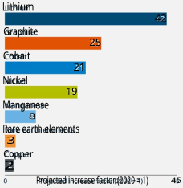However, mining is a waterintensive industry. Significant amounts of water are needed to separate minerals, cool machinery, and control dust. The exact process used depends on the mineral being mined; however, water is generally added to help separate minerals from mining waste. In hard rock or clay mining, ore may be found beneath the water table, so mining often begins with dewatering, pumping groundwater to the surface for use in further processing the ore. 

Exact details regarding how much water the mining industry uses are difficult to come by. The United States Geological Survey (USGS) estimated in 2015 that the mining industry withdrew four billion gallons per day, equivalent to 1% of all withdrawals. Groundwater was the source for 72% of that withdrawal. When surface water was withdrawn, 77% of it was from a freshwater source. The 2015 map below shows the total millions of gallons of water that were withdrawn by the mining industry in the Great Lakes states. Unfortunately, this data includes water used in the extraction of liquid resources, including petroleum exploration. New USGS data is anticipated in 2025 but was not accessible at the time of this writing.52 The Great Lakes Regional Water Use Database does not have a reporting category specific to mining withdrawals. Per Figure 2.2, water used consumptively in mining may come from public water supplies or be reported as industrial use. Thus, as with data centers, it is not possible to get a completely clear picture of how much water the mining industry alone is using. 

SOURCE: IEA WORLD RESOURCES INSTITUTE 

> 50  Horizon Editorial, “Navigating Hardware Refresh Cycles In The Data Center,” Horizon Technology (Nov. 13, 2024), _available at_ : <u>https://horizontechnology.com/ news/data-center-hardware-refresh-cycles/ (last accessed May 2, 2025).</u> 

> 51  Barbanell, Melissa, “Overcoming Critical Minerals Shortages Is Key to Achieving US Climate Goals,” World Resources Institute (May 3, 2023), _available at_ : <u>https:// www.wri.org/insights/critical-minerals-us-climate-goals (last accessed May 12, 2025).</u> 

> 52  U.S. Geological Survey, 2018, Mining water withdrawals in 2015, _available at:_ <u>https://www.usgs.gov/media/images/mining-water-withdrawals-2015 (last</u> accessed April 25, 2025). 

ALLIANCE GREAT LAKES 

**A FINITE RESOURCE: MANAGING THE GROWING WATER NEEDS IN THE LAKES REGION | 23** 

CRITICAL MINERALS 

###### **_Fig. 4.2. U.S. Water Withdrawal Map_****_53_** 

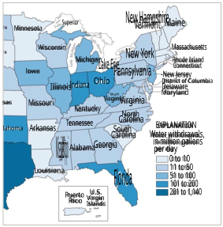In hard rock mining, such as for copper, gold, and nickel, metals are extracted from sulfide ore. The extraction process is very complex, and highly acidic mining waste is often stored in open pits called tailings dams. That mining waste can contaminate surface and groundwater, including drinking water supplies of those in neighboring communities and indigenous peoples. Tailings dams are large structures that are not removed even after a mine closes and effectively store mine waste forever, presenting a constant threat to downstream communities. These tailings dams can also fail, especially due to heavy rainfall, as has occurred in Zambia, Bolivia, and Indonesia in 2025.54 

Tailings dam failings and releases have occurred in the U.S. as well. A 2012 review of nearly all the U.S. copper mines in operation 

in 2010 (89%) revealed that all 14 mines had had pipeline spills or other accidental releases. In addition, water collection and treatment systems failed to control mine seepage at 13 of 14 of those mines, causing significant water quality impacts.55 The risks of contamination are greater in wetter climates, where more interaction between surface and groundwater occurs. 

Where tailings dams are used, the mining process generally follows the following four steps: 

1.  Rock that contains minerals and metals are removed from the earth and processed in order to separate minerals and metals. 

2.  Mined rock is then ground down finely and blended with water and other chemicals to further separate minerals and metals. 

3.  After separating those minerals and metals from the finely ground rock, the waste that remains is in a slurry form, known as tailings. 

4. Tailings are pumped into a reservoir with a dam.56 

> 53  U.S. Geological Survey, 2018, Mining water withdrawals in 2015, _available at:_ <u>https://www.usgs.gov/media/images/mining-water-withdrawals-2015 (last</u> accessed April 25, 2025). 

> 54  Morill, Jan, “A String of Tailings Dam Failures Shows the Urgency of Putting Safety First,” Earthworks (March 31, 2025), _available at:_ <u>https://earthworks.org/ blog/a-string-of-tailings-dam-failures-shows-the-urgency-of-putting-safety-frst/i</u> (last accessed April 11, 2025). 

> 55  U.S. Copper Porphyry Mines Report, Earthworks (July 2012, rev. Nov. 2012), _available at:_ <u>https://earthworks.org/resources/us-copper-porphyry-mines/ (last</u> accessed May 8, 2025). 56  U.S. Geological Survey, 2018, Mining water withdrawals in 2015, _available at:_ <u>https://www.usgs.gov/media/images/mining-water-withdrawals-2015 (last</u> accessed April 25, 2025). 

ALLIANCE re GREAT LAKES 

**A FINITE RESOURCE: MANAGING THE GROWING WATER NEEDS IN THE LAKES REGION | 24** 

CRITICAL MINERALS 

The Great Lakes region is home to some proven reserves of critical minerals. For example, nickel and copper are abundant in places like Michigan’s western Upper Peninsula.57 Northeastern Minnesota’s Superior National Forest, near the Boundary Waters, was the site proposed for the $1.7 billion Twin Metals copper, cobalt, and nickel mine. Another $1 billion copper nickel mine, New Range (formerly Polymet), is also proposed to be located there. While the Biden administration issued a moratorium on new mining in that area for the next 20 years, a recent Trump administration executive order repeals that effort.58 In response, the Minnesota congressional delegation has introduced legislation to restore the Biden-era moratorium and make it permanent.59 Indigenous tribes, including the Fond du Lac Band of Lake Superior Chippewa and Mille Lacs Band of Ojibwe, have expressed concerns regarding both water use and the potential for contamination from proposed mines in northeastern Minnesota.60 Similarly, in Wisconsin, efforts are underway to expand mining for copper, zinc, and gold, despite objections filed by the Lac du Flambeau tribe.61 Copper and gold mining both require extracting minerals from sulfide ores. Wisconsin eliminated its “prove it first” law in 2017 that required sulfide mining operations to demonstrate a successful track record of operating similar mines in North America without causing pollution. No mine had ever satisfied that requirement, meaning that until 2017, it had functioned as a de facto moratorium.62 

At the federal level, new laws and policies may be further fueling the demand for critical minerals. The Inflation Reduction Act of 2022 (IRA) identifies 50 specific critical minerals as essential to U.S. national or economic security. To encourage domestic production of these minerals, the IRA attempts to influence the EV market by altering eligibility requirements for the Clean Vehicle Tax Credit. The IRA does this in three main ways: 

- First, the IRA requires that a certain percentage of the critical minerals used in the production of an EV be sourced within the U.S. or from a country with which the U.S. has a free trade agreement for a consumer to be able to claim half of the $7,500 Clean Vehicle Tax Credit. To access the credit, EVs in service before Jan. 1, 2025, must contain at least 50% domestically sourced critical minerals, and that percentage rises annually through 2027, after which it must be 80%. 

- Second, to be eligible for the remaining half of the Clean Vehicle Tax Credit, a percentage of an EV’s battery components must be manufactured or assembled in North America. For 2025, the percentage is 60%, and that percentage rises annually to 100% by 2029. 

- Third, beginning in 2024, an eligible clean vehicle may not contain any battery components that are manufactured by a “foreign entity of concern” (such as China), and beginning in 2025, an eligible clean vehicle may not contain any critical minerals that were extracted, processed, or recycled by a foreign entity of concern. 

> 57  House, Kelly, “Mining rush brings hope, dread to Upper Peninsula, amid historic energy shift” (Oct. 29, 2024), _available at:_ <u>https://www.bridgemi.com/ michigan-environment-watch/mining-rush-brings-hope-dread-upper-peninsula-amid-historic-energy-shift#:~:text=Those%20batteries%20will%20 require%20more,the%20national%20economy%20and%20security (last accessed May 2, 2025).</u> 

> 58  Murphy, Esme, “Trump executive order could bring back mining near Boundary Waters” (Jan. 22, 2025), _available at:_ <u>https://www.cbsnews.com/minnesota/ news/boundary-waters-mining-trump-executive-order/ (last accessed May 2, 2025).</u> 

> 59  Kraker, Dan, “Sen. Smith introduces bill to ban copper mining near the Boundary Waters,” MPRNews (April 9, 2025), _available at:_ <u>https://www.mprnews.org/ story/2025/04/09/sen-smith-introduces-bill-to-ban-copper-mining-near-the-boundary-waters.</u> 

> 60  MacGillivray, Christina, “Northeast Minnesota’s fraught choice: Precious metals v. precious water” (July 7, 2022), _available at:_ <u>https://minnesotareformer. com/2022/07/07/northeast-minnesotas-fraught-choice-precious-metals-v-precious-water/#:~:text=The%20mine%20faces%20stif%20f opposition,could%20move%20into%20the%20St</u> _._ (last accessed May 2, 2025); Mille Lacs Band of Ojibwe, “Mining Impact,” <u>https://millelacsband.com/home/ mining-impact</u> (last accessed May 2, 2025). 

> 61  Kaeding, Danielle, “Mining company wants to drill for metals like zinc and gold at more sites in Wisconsin” (May 8, 2025), _available at:_ <u>https://www.wpr.org/ news/mining-company-wants-to-drill-for-metals-like-zinc-and-gold-at-more-sites-in-wisconsin (last accessed May 8, 2025).</u> 

> 62  Wisconsin Public Radio, “Gov. Walker Signs Bill Lifting Mining Moratorium” (Dec. 11, 2017), _available at:_ <u>https://www.wpr.org/agriculture/gov-walker-signs-billlifting-mining-moratorium</u> (last accessed May 8, 2025). 

**A FINITE RESOURCE: MANAGING THE GROWING WATER NEEDS IN THE LAKES REGION | 25** 

CRITICAL MINERALS 

The table below illustrates these requirements for 2024 and 2025. 

**_Fig. 4.3. Clean Vehicle Tax Credit_****_63_** 

|**Clean Vehicle Credit Requirement**|**2024**(T|o receive $7,500)|**2025**(To receive $7,500)|
|---|---|---|---|
|**Foreign Entity of Concern (Battery Component)**|YES||YES|
|**Foreign Entity of Concern (Critical Minerals)**|NO||YES|
|**Battery Component Percentage**|60%||60%|
|**Critical Minerals Percentage**|50%||60%|

In addition to the Clean Vehicle Tax Credit, the IRA provides an Advanced Manufacturing Production Tax Credit (AMPTC) to companies that domestically produce and sell clean energy technologies. The AMPTC allows a company to claim a per-unit tax credit equal to 10% of the cost of producing each clean energy component domestically produced and sold. Fifty critical minerals are listed in the IRA as eligible clean energy components, meaning any company producing these minerals in the U.S. can claim the AMPTC.64 

Nonetheless, whether U.S. mining for these minerals will come to fruition remains to be seen. For one thing, U.S. EV manufacturers can continue to source minerals from countries with which the U.S. has free trade agreements, allowing consumers to still claim at least half of the Clean Vehicle Tax Credit. For another, under the most recent congressional budget bill, the Clean Vehicle Tax Credit will be eliminated beginning on Sept. 30, 2025. The AMPTC remains in place but will be phased out based on the date the eligible components are sold, beginning in 2030. For critical minerals produced in the U.S. other than metallurgical coal, the credit also will be phased out, beginning in 2031.65 Mining is a volatile and difficult industry to compete in – much depends on the market price and availability of the resource. For example, over the last few years, China and Congo have ramped up cobalt production, driving down the price and shuttering efforts to open the U.S.’s only cobalt mine in Idaho.66 China has also recently discovered a copper deposit of up to 20 million tons in the Tibetan Plateau, part of a larger resource area estimated to hold up to 150 million tons. The discovery is significant enough that it will likely impact international markets, affecting supply chains, prices, and trade agreements, and potentially impacting whether new copper mining projects in the Great Lakes region get off the ground.67 

> 63  U.S. Department of the Treasury, “Treasury Releases Proposed Guidance to Continue U.S. Manufacturing Boom in Batteries and Clean Vehicles, Strengthen Energy Security” (Dec. 1, 2023), _available at:_ <u>https://home.treasury.gov/news/press-releases/jy1939#:~:text=To%20meet%20the%20critical%20 mineral,February%206%2C%202025</u> (last accessed May 2, 2025). 

> 64  Bricker Graydon, “Inflation Reduction Act (IRA): Advanced Manufacturing Product Credit – A cheat sheet” (May 3, 2023), _available at:_ <u>https://www. brickergraydon.com/insights/publications/Infationl</u> -Reduction-Act-IRA-Advanced-Manufacturing-Product-Credit-A-cheat-sheet (last accessed May 2, 2025). 

> l 65  “One Big Beautiful Bill Act: House-Passed Version,” H.R. 1, 119th Cong. (2025), and Davis, Jeffrey, et. al, “Amendments to IRA Tax Credits in the Senate Budget Bill,” White & Case (July 1, 2025) _available at:_ <u>https://www.whitecase.com/insight-alert/amendments-ira-tax-credits-senate-budget-bill</u> (last accessed July 3, 2025). 66  Home, Andy, “Another cobalt bust but this time it’s different,” Reuters (Feb. 6, 2025) _available at:_ <u>https://www.reuters.com/markets/commodities/ another-cobalt-bust-this-time-its-diferentf</u> -andy-home-2025-02-06/ (last accessed May 2, 2025). 

> 67  Hart, Evelyn, “Geologists Uncover 20 Million Tons of Copper Worth Over $100 Billion in an Unexpected Location,” Indian Defence Review (April 27, 2025), _available at:_ <u>https://indiandefencereview.com/geologists-uncover-20-million-tons-worth-over-100-billion-in-an-unexpected-location/.</u> 

**A FINITE RESOURCE: MANAGING THE GROWING WATER NEEDS IN THE LAKES REGION | 26** 

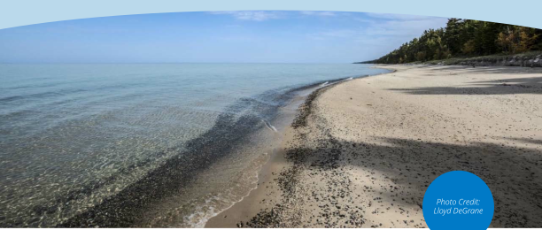On the other hand, the Trump administration’s new economic, tax, and tariff policies seek to accelerate the pace of domestic mining and EV manufacturing. For example, more EV automobile manufacturers may consider relocating to the U.S. Honda has recently committed to manufacturing its hybrid Civic in Indiana to avoid tariffs, and a joint venture between Honda and LG to construct a large EV battery plant was recently completed in Ohio.68 The congressional budget bill also provides a tax deduction on loans for vehicles manufactured in the U.S.69 Moreover, a recent executive order specifically calls for boosting U.S. copper production. It orders the Secretary of Commerce to investigate national security impacts of importing copper and whether tariffs or quotas are needed.70 Another executive order, issued on March 20, 2025, titled “Immediate Measures to Increase American Mineral Production,” directs U.S. agencies to fast-track permitting for priority mining projects on federal lands and requires the departments of Energy, Agriculture, and Defense, and the Small Business Administration to give the most favorable terms possible to those seeking to establish commercial mining operations on federal lands.71 

In short, critical minerals mining is both water intensive and poses legitimate risks to water quality and quantity. Market forces, including the incentives initially created in the IRA, the current administration’s tax and tariff policies, and the market prices for these minerals will be determining factors in whether mining for them in the Great Lakes region will really come to fruition. Assuming it does, extraction of these minerals will require and put additional pressure on groundwater resources simultaneously with other sectors, such as data centers and agriculture, discussed in this report. In addition, and as with data centers, there is not a clear water use reporting category for this sector, making it difficult to accurately determine how much water the sector uses and predict future water demand. 

> 68  Shiraki, Maki, “Exclusive: Honda to produce next Civic in Indiana, not Mexico, due to US tariffs, sources say” (March 3, 2025) _available at:_ <u>https://www. reuters.com/business/autos-transportation/honda-produce-next-civic-indiana-not-mexico-due-us-tarifsf</u> -sources-say-2025-03-03/ , and Williams, Mark, “Honda, LG ramp up hiring as Fayette County electric vehicle battery plant hits milestone,” _available at:_ <u>https://www.dispatch.com/story/business/ manufacturing/2024/02/29/honda-lg-ramp-up-hiring-as-ev-battery-plant-hits-milestone/72772147007/ (last accessed May 2, 2025).</u> 

> 69  Miller, Caleb, “Senate Bill Aims to Reduce Tax on Loan Interest for U.S.-Built Cars,” Car and Driver (July 2, 2025), _available at:_ <u>https://www.caranddriver.com/ news/a65280890/senate-bill-tax-deduction-car-loan-interest/.</u> 

> 70  Trump, Donald. “Addressing the Threat to National Security From Imports of Copper.” _Federal Register_ , 25 Feb. 2025, <u>https://www.federalregister.gov/ documents/2025/02/28/2025-03439/addressing-the-threat-to-national-security-from-imports-of-copper.</u> 

> 71  Trump, Donald. “Immediate Measures To Increase American Mineral Production.” _Federal Register_ , 20 Mar. 2025, <u>https://www.federalregister.gov/ documents/2025/03/25/2025-05212/immediate-measures-to-increase-american-mineral-production.</u> 

**A FINITE RESOURCE: MANAGING THE GROWING WATER NEEDS IN THE LAKES REGION | 27** 

### **V. AGRICULTURAL IRRIGATION** 

The Great Lakes region is a heavily agricultural one. Where agriculture withdraws groundwater for irrigation from the same aquifers used by the public water systems that supply high-consumptive water users such as data centers, we may begin to see increased conflict over resources, especially during peak summer months. 

While agriculture makes up a very small percentage of overall Great Lakes water use, it is a very highconsumptive-use sector. For example, at 23%, agricultural irrigation was the third-highest category of consumptive Great Lakes water use in 2023.72 Groundwater sources contribute about half the water used in irrigation in the Great Lakes region.73 Agriculture consumes water in crop production through the water cycle, as crops take up water in order to grow and lose water through evapotranspiration, illustrated in the image below: 

###### **_Fig. 5.1. The Small Water Cycle_** 

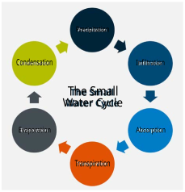Climate change has led to increased frequency and intensity of extreme heat events and continues to complicate the ability to predict irrigation demand across the Great Lakes region. While total precipitation has remained relatively consistent, with slight increases in winter and spring, precipitation events now tend to happen in heavy, short bursts. On the other hand, drought conditions are occurring more frequently and persisting longer compared to the historical record. Drought conditions stress plants at critical growth stages, necessitating supplemental water via irrigation to mitigate yield losses. For the purposes of this report, we focused on irrigation trends in Wisconsin, Ohio, and Michigan. 

> 72  See Fig. 2.2 above. 

> 73  Grannemann, N.G., Hunt, R.J., Nicholas, J.R., Reilly, E. and Winter, T.C., “The importance of ground water in the Great Lakes region,” USGS, p. 9, _available at:_ <u>https://doi.org/10.3133/wri004008 (last accessed July 2, 2025).</u> 

ALLIANCE e GREAT LAKES 

**A FINITE RESOURCE: MANAGING THE GROWING WATER NEEDS IN THE LAKES REGION | 28** 

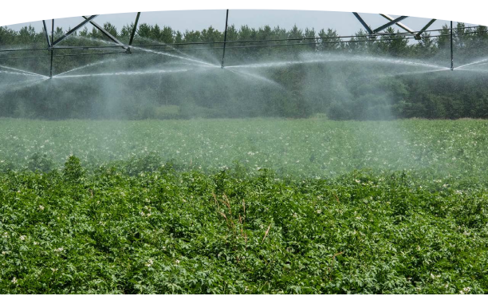In 2023, Wisconsin agricultural producers withdrew nearly 125 billion gallons of groundwater, with the majority of withdrawals occurring between June and August.74 The 2023 drought in Wisconsin and regionally was significant but also tracks recent trends of hotter and drier summers. While it is understandable that the use of agricultural irrigation is greatest in the summer in order to combat heat stress, hotter months are also when additional cooling capacity demands peak for data centers. The potential for these agricultural and industrial demands to seasonally simultaneously converge and cause adverse impacts to groundwater resources should be evaluated and incorporated into conservation planning. 

Precipitation projections through 2060 show a notable dip in June. Thus, expansion of irrigation in Wisconsin is likely to continue. Farmers who would typically not need or consider using irrigation are now regularly including it as part of their planning portfolio. Further consolidation of dairy farms is also likely to result in a push toward centralizing water use. Although the dairy industry uses less water overall than irrigated crops, it requires a constant amount of water, rather than needing it only during the peak summer months. Thus far, the Wisconsin Department of Natural Resources has not denied many high-capacity well permits, making it difficult to emphasize the importance of conservation and planning.75 While there is potential interest in water quantity trading, that has not yet happened. 

> 74  Wisconsin Department of Natural Resources, Wisconsin Water Use: 2023 Water Withdrawal Report, p. 6, _available at:_ <u>https://dnr.wisconsin.gov/sites/default/ fles/topic/WaterUse/WithdrawalReport/2023.pdfi</u> (last accessed May 12, 2025). 

> 75  Between 2011 and 2020, the Wisconsin Department of Natural Resources denied only four applications. Connaster, Grace, “Changes eyed for high-capacity well application process after Kaul opinion reversal,” Wisconsin Farmer (June 25, 2020), _available at:_ <u>https://www.wisfarmer.com/story/news/2020/06/25/ environmental-regulations-tighten-high-capacity-wells-wisconsin/3156048001/ (last accessed July 16, 2025).</u> 

**A FINITE RESOURCE: MANAGING THE GROWING WATER NEEDS IN THE LAKES REGION | 29** 

AGRICULTURAL IRRIGATION 

New irrigation capacity will continue to make economic sense for farmers in the future to combat potential crop yield losses. We are already seeing rapid expansion of irrigation in Northwest Ohio, a region where irrigation was previously unheard of. Historically, irrigation in this part of Ohio was not necessary due to precipitation trends and the soil type in this region. In Central Ohio, the Central Ohio Regional Water Demand Study also notes that the demand for annual groundwater for irrigation is expected to increase by 9.15 billion gallons across the 15-county Central Ohio area by 2040. This is about 0.02 million gallons to 1.16 billion gallons per year, according to the HUC-10 watershed scale.76 

Michigan is seeing increased interest in irrigation as drought conditions persist longer than before. However, the availability of water on agricultural lands might limit how much more irrigation use can expand. Less available capacity per minute limits the amount of acreage that farmers can irrigate. For example, at 200 GPM, it is possible to irrigate only 40 acres. Other factors driving irrigation expansion in Michigan include: 

- High commodity prices. 

- Demand for more in-state food processing, particularly applicable to Michigan, as it has a great diversity of fruits and vegetables requiring processing. 

- Bank policies requiring the use of irrigation systems to ensure returns on investments, particularly in the dairy industry, where reliable irrigation is needed to provide a constant water supply for cows.77 

In agricultural irrigation, there are opportunities to recycle water that could mitigate some of the demand and need for groundwater. Drainage water recycling is the capture and reuse of water that drains off of agricultural land. This can be done either via subterranean irrigation, where water is captured and put into a tile drainage system to let it soak back into the soil profile, or by capturing the water and running it through a center pivot system. Drainage water recycling (DWR) could be a good opportunity for farms lacking access to sufficient well pumping capacity, for example, in Northwest and Central Ohio, the Michigan “thumb,” and other non-sandy-soil regions. However, the startup costs of DWR are expensive and potentially take some land out of production. Most of the cost is associated with the design and construction of the reservoir needed to capture the water. In general, a reservoir will take up up to 5% of the overall acreage being irrigated. In Southeastern Michigan, one irrigation system covering a 100acre farm cost about $250,000, or $2,500 an acre. These costs are perhaps somewhat offset by the fact that utilizing irrigation will boost crop yield. Assuming those boosts, the return on the investment for this particular farm would take about 11 years. DWR also has the potential to reduce total fertilizer inputs by recycling the drainage water, but research on this appears to be lacking. Minnesota has a small grant program that compensates landowners for increasing water storage to minimize flooding.78 Programs like these may be beneficial in other states, as adopting DWR is still cost prohibitive for many farmers. However, crop yield losses from droughts might drive farmers to make these investments sooner rather than later. 

> 76  Ohio Environmental Protection Agency, Central Ohio Regional Water Study (2025), _available at:_ <u>https://epa.ohio.gov/monitor-pollution/pollution-issues/ water-studies/central-ohio-water-study (last accessed May 9, 2025).</u> 

> 77  Dong, Younsuk, Michigan State University Extension, Michiana Irrigation Association Winter Workshop (Dec. 10, 2021). 

> 78  “BWSR Accepting Applications for Water Storage Grants,” Minnesota Board of Water and Soil Resources (Feb. 11, 2025), _available at:_ <u>https://bwsr.state.mn.us/ node/13641#:~:text=%E2%80%9CInvesting%20in%20water%20storage%20projects,Minnesota’s%20land%20and%20water%20resources (last accessed</u> May 2, 2025). 

**A FINITE RESOURCE: MANAGING THE GROWING WATER NEEDS IN THE LAKES REGION | 30** 

AGRICULTURAL IRRIGATION 

Without comprehensive planning and resource management, there is great potential for the kinds of large water use sectors highlighted in this report to simultaneously converge on Great Lakes water resources, especially during peak summer months, and cause significant adverse impacts. If states, local governments, and economic development agencies do not begin incorporating water availability and demand into their decision-making processes, it may lead the region down a dangerous, unsustainable, and inefficient water use path that threatens drinking water supplies, businesses, and food production. Unfortunately, Great Lakes states currently lack the data necessary to inform those decisions and generally do not have the legal tools in place to be able to curb groundwater use before impacts occur. They also lack conservation and efficiency requirements designed for newly emerging large water-using industries like semiconductor chip manufacturing and data centers. However, the Great Lakes Compact provides solid ground on which to build and collaborate. and the time is ripe to do so. 

八GREAT LAKES 

**A FINITE RESOURCE: MANAGING THE GROWING WATER NEEDS IN THE LAKES REGION | 31 A FINITE RESOURCE: MANAGING THE GROWING WATER NEEDS IN THE LAKES REGION | 31** 

### **VI. POLICY RECOMMENDATIONS** 

#### **A. Regional recommendations** 

Despite the pressures and demands for Great Lakes water from the sectors discussed in this report, the Great Lakes region is well positioned to be able to protect and manage its resources by utilizing the tools created by the Great Lakes Compact. Under the Compact, each state must have water conservation and efficiency programs in place. In addition, new or increased withdrawals or consumptive uses must be approved consistent with the Compact’s decision-making standard. The Compact Council and regional body could consider encouraging the states and provinces to voluntarily expand on these programs to accommodate and reflect the increasing demand for Great Lakes water. The Compact itself stipulates that programs “need to adjust to new demands and the potential impacts of cumulative effects and climate.”79 There are several recommendations the Compact Council could make to states to do this, including recommending that they: 

- Conduct regional water demand studies as an ongoing part of conservation and efficiency programs to gain a better understanding of supply and demand in a way that sustainably considers environmental and ecosystem needs. 

- Collaborate among one another in coordinating regional water demand studies where watersheds do not respect state lines. 

- Require large water-using industries to track and report water use so that the reported water use categories of the Great Lakes Regional Database can account for and more clearly define how much water high-consumptive water-using industries, such as mining and data centers, are using and consuming. 

- Expand and strengthen registration requirements and consumptive use permit programs, including recommending lower consumptive use permitting thresholds, considering the convergence of increased demand from all sectors outlined in this report and based on regional demand study results. 

- Develop and incorporate efficiency standards specifically tailored to address large water-using industries. 

The state and local level recommendations outlined below will provide specific examples of how and where states can further implement these recommendations, independent of the Compact. 

#### **B. State-level recommendations** 

**_1.  Conduct regional water demand studies to determine capacity as part of ongoing conservation programs and for use in economic development planning_** 

States should have a good understanding of the demand for surface and groundwater and use that understanding to inform both state water conservation and efficiency programs and economic development decision-making. In response to rapid economic development from the data center, semiconductor chip manufacturing, and EV battery industries, Ohio and Indiana have recently undertaken regional water demand studies to obtain a better understanding of where water is available. Ohio’s 

> 79  Great Lakes Compact, Section 4.2. 

**A FINITE RESOURCE: MANAGING THE GROWING WATER NEEDS IN THE LAKES REGION | 32** 

POLICY RECOMMENDATIONS 

economic development agency plans to use the results to guide decision-making about where to recommend and incentivize new facilities to locate. Illinois has completed such studies as well. These studies are the first step in determining whether a state’s local water supply can sustainably meet the demand for water. However, these studies may not adequately address impacts to the environment or existing ecosystems that may be caused by increased water use. For example, while Ohio’s newly released Central Ohio water demand study and dashboard shows ecologically sensitive areas on the map, it does not take ecological needs into account in demand calculations. In addition, Ohio’s regional water demand studies were prompted only after the rapid growth the Central Ohio region has seen in data centers, Intel’s decision to build a semiconductor chip manufacturing facility in the region, and the associated population growth. A subsequent study is planned for southwest Ohio, where a large EV battery plant was sited despite the lack of the availability of the volume of water or wastewater treatment capacity needed to service it.80 Ideally, these studies should be completed before major water users are incentivized to locate somewhere. 

Though it is not a demand study, Michigan’s Water Withdrawal Assessment Tool (WWAT) does account for ecosystem impacts. The WWAT allows water users to register a proposed withdrawal and determine whether it will have an adverse impact on resources that will affect fish habitats in local streams and rivers. If the withdrawal fails the assessment, a site-specific review can be requested. If it passes, the withdrawal can proceed to immediate registration. Larger withdrawals are subject to a formal permitting process.81 Use of the WWAT is designed to determine and evaluate how registration or permitting requirements apply, which is relevant only when a large water user is seeking to make the withdrawal itself. However, the WWAT could be modified to be used as a preliminary screening tool available to all large water users. 

States should combine both approaches (regional demand studies and withdrawal assessment tools) into conservation planning and economic development decision-making. States will also need to consider collaborative regional demand studies where watersheds do not respect state boundaries. Rather than one-off projects, regional water demand studies should be made an ongoing part of existing water conservation and planning programs to inform the carrying capacity of watersheds. Incorporating them as part of state conservation and planning programs would allow them to be updated on a regular basis. States should also incorporate tools like Michigan’s WWAT that can more broadly allow water users to determine where might be a more ideal place to locate facilities with less adverse resource impacts. Economic development agencies and local governments can then turn to these tools and resources to inform siting decisions and economic incentive packages. Indiana appears to be heading in that direction, as Gov. Mike Braun recently issued an executive order directing the Secretary of Energy and Natural Resources to develop a water resources inventory that includes a statewide water planning framework.82 Having a framework in place is imperative, because if water resources are maximized to support data centers and the limited number of jobs that they directly create, regions may miss out on the subsequent ancillary economic development that they have been shown to generate. Virginia’s Joint Legislative 

> 80   Richter, Ed, “Massive water line project runs from Caesar Creek Lake to boost $3.5B Honda plant,” Dayton Daily News (Jan. 29, 2024), _available at_ : <u>https://www.daytondailynews.com/community/massive-water-line-project-runs-from-caesar-creek-lake-to-boost-35-billion-honda-plant/ QQWGCEMQM5DULPDJWBDCTKGDE4/.</u> 

> 81  MCL 324.32701 to MCL 324.32723. 

> 82  Ind. Exec. Order No. 25-63 (April 21, 2025). 

**A FINITE RESOURCE: MANAGING THE GROWING WATER NEEDS IN THE LAKES REGION | 33** 

POLICY RECOMMENDATIONS 

Audit and Review Commission, which issued a study concerning the impacts of the data center industry in Virginia, provides this same recommendation to local governments.83 But these frameworks must also incorporate environmental and ecosystem needs and demands into tools that guide economic development. If they don’t, states may be no farther ahead than they were before, because the tools will drive development where water appears to be available without considering adverse resource impacts. Finally, conservation programs should also evaluate seasonal demand, as there is potential for agricultural and industrial demands to simultaneously converge and cause adverse impacts to groundwater resources during periods of peak demand. 

##### **_2. Incorporate public transparency at both the beginning and end of siting_** 

- A.  REQUIRE DISCLOSURE OF WATER USE, AND WHERE NONDISCLOSURE AGREEMENTS AND STATE TAX INCENTIVES ARE IN USE, CONSIDER THE USE OF COMMUNITY BENEFIT AGREEMENTS 

In many cases, how much water a data center or large industrial facility will actually use is not publicly well understood until construction is already underway. Companies and real estate brokers may insist on the signing of nondisclosure agreements (NDAs) during negotiations with state and local governments. The use of these agreements is common in economic development and the data center industry, as research conducted by students at the University of Mary Washington found in Virginia in 2024.84 The same is true in the Great Lakes region. To provide a few specific examples: 

- In October 2024, the Franklin County Board of Commissioners in Ohio approved a resolution authorizing a mutual NDA with Bluebeam data center.85 

- City officials in Farmington, Minnesota, signed a number of NDAs regarding various data center proposals between 2021 and 2023.86 

- Multiple Morgan County, Indiana officials, both appointed and elected, have signed NDAs regarding a data center proposal in which both the developer and exact end use are unknown involving 390 acres that the Morgan County Board of County Commissioners approved to be rezoned for that purpose.87 

While the data center industry claims the use of NDAs is necessary to protect sensitive information from competitors during negotiations, states should consider whether public water and utility usage really merits broad protection from public disclosure in this manner. It appears some are beginning to do so. Proposed legislation in New York requires a data center with the capacity to consume 5 MW or more to submit a disclosure report to the state’s utility commission prior to beginning construction, though it contains no similar provision regarding water use disclosure.88 Thus, state legislation could be enacted to prohibit shielding proposed water and energy use from disclosure. 

> 83  Joint Legislative Audit and Review Commission, “Data Centers in Virginia” (Dec. 2024), (p. 63-64) _available at:_ <u>https://jlarc.virginia.gov/pdfs/reports/Rpt598.pdf</u> (last accessed May 5, 2025). 

> 84  Staff Report, ”FOIA Friday: Professor, students find NDAs between localities and data center companies” (Oct. 25, 2024) _available at_ : <u>https://virginiamercury. com/2024/10/25/foia-friday-professor-students-fndi</u> -ndas-with-data-center-companies-localities-say-theyre-used-often/. 

> 85  Resolution No. 0761-24, Resolution authorizing a Mutual Non-Disclosure Agreement with Bluebeam, Inc. (Franklin County Data Center), _available at:_ <u>https:// crms.franklincountyohio.gov/RMSWeb/pdfs/R18313.pdf (Oct. 1, 2024) (last accessed Jul. 29, 2025).</u> 86  Herscowitz, Eva, “Farmington residents couldn’t get answers about a proposed data center. Then they saw the NDA,” Minnesota Star Tribune (Jan. 9, 2025), _available at:_ <u>https://www.startribune.com/farmington-tract-nda-data-center/601203732 (last accessed Jul. 29, 2025).</u> 

> 87  Perry, Elyse, “Protesters say planned Monrovia data center exploits residents,” Indiana Public Media (Jul. 22, 2025), _available at:_ <u>https://www.ipm.org/ news/2025-07-22/protesters-say-planned-monrovia-data-center-exploits-residents (last accessed Jul. 29, 2025).</u> 

**A FINITE RESOURCE: MANAGING THE GROWING WATER NEEDS IN THE LAKES REGION | 34** 

POLICY RECOMMENDATIONS 

Notwithstanding NDAs, states and local governments can negotiate with companies for an agreement that includes community benefit requirements, such as water infrastructure improvements, the use of conservation and efficiency measures to conserve water, or other ecological restorations that will mitigate water use. These agreements can be a way to protect water resources, engage local communities, and create long-term lasting community value, but they must include concrete measurable terms and details to be effective. Community benefit agreements (CBAs) can include: 

- Local or targeted hiring practices and job commitment requirements. 

- Wage and benefit agreements. 

- Workforce training. 

- Affordable housing commitments. 

- Educational partnerships with schools, colleges, and universities. 

- Supports for or prioritization of small and local businesses. 

- Environmental benefits or actions to reduce the environmental impacts of a project. 

- Construction of community resources, including parks, recreational facilities, or childcare facilities. 

CBAs have been successfully used in large transportation and infrastructure projects. One of the largest and widely regarded examples is a 2004 CBA among community organizations, labor unions, and the city of Los Angeles regarding an $11 billion modernization plan for the Los Angeles International Airport (LAX). Benefits included: 

- $15 million for job training for aviation-related jobs. 

- A local hiring program with priority jobs for local residents and low-income and special needs individuals. 

- Funds for soundproofing impacted homes and schools. 

- Retrofitting diesel vehicles operating on the tarmac to curb air pollution. 

- Electrification of airplane gates to reduce air pollution from jet engine idling. 

- Funds for research on airport operations’ impact on surrounding communities’ health. 

- Increased opportunity for locally owned and minority- and women-owned businesses to partake in the modernization. 

This CBA includes detailed and ongoing monitoring and enforcement provisions that help ensure adherence.89 

89  Los Angeles World Airports, Community Benefits Agreement (2004), _available at:_ <u>https://www.lawa.org/sites/lawa/fles/documents/LAX_CBA_Final.pdfi</u> 

**A FINITE RESOURCE: MANAGING THE GROWING WATER NEEDS IN THE LAKES REGION | 35** 

POLICY RECOMMENDATIONS 

By contrast, under Ohio’s agreement with Intel for $600 million in grants to support a large semiconductor chip manufacturing plant, Intel agreed to commit to creating 3,000 full-time jobs and $405 million in payroll by December 2028.90 However, after several delays, it appears that Intel is not going to meet that deadline, and the state’s attorney general has publicly said that the agreement was drafted so broadly that it is essentially unenforceable.91 Intel’s design and build partner, Bechtel, did sign a project labor agreement with the North America Building Trades Unions for the construction of the two facilities.92 And, although it was not executed as a CBA, in exchange for many of the benefits Intel received from the state of Ohio to locate its semiconductor manufacturing operation in Central Ohio, Intel did agree to commit to providing $50 million directly to Ohio colleges and universities to develop semiconductor education and workforce training programs.93 Intel also has partnered with the state on a 90-acre wetlands project, which is more than the 20 acres Intel was required to restore for mitigation under its isolated wetlands permit.94 Whether and how Intel fulfills these commitments outside of contractual obligation remains to be seen. 

By involving local communities early on in negotiating CBAs, states and local governments can build trust with residents and ensure that projects include benefits that conserve water and are responsive to the needs of local communities. This is beneficial for all parties, as it fosters a more collaborative and open way of doing business that communities throughout the region are demanding. For example, there has been significant pushback against the siting of hyperscale data centers in Indiana – so much so that it has defeated proposed data center projects in Valparaiso, Burns Harbor, and Chesterton. Furthermore, these agreements are one place where states and local governments can begin to incorporate conservation and efficiency standards and requirements (irrespective of what state laws specify) to encourage the use of technologies that will reduce water consumption and electricity use, as exemplified by the air pollution provisions in the LAX CBA. 

As every state in the Great Lakes region statutorily authorizes tax incentives for data centers to locate in the region, states could consider scaling back those incentives and/or modifying them to require execution of a CBA. The Ohio legislature passed a provision eliminating the sales and use tax incentive for new data centers, beginning on Oct. 1, 2025; however, the governor subsequently vetoed that provision.95 States and local governments could also consider connecting tax incentives with water use, as Michigan has done. 

In 2024, Michigan enacted legislation authorizing tax incentives for new enterprise data centers. As a condition of the incentive, a new enterprise data center must hook up to a municipal water system that has available capacity to supply it.96 In principle, the concept of this provision is simple: Encourage data 

> 90  Ohio Department of Development, Grant Agreement Ohio Onshoring Incentive, Exhibit A (June 21, 2023), _available at:_ <u>https://www.documentcloud.org/ documents/25868135-odod-intelonshoringgrantexecuted/#document/p1</u> 

> 91  Pelzer, Jeremy, “Ohio AG Dave Yost: State has little power to claw back $600M from Intel,” Cleveland.com (March 25, 2025), _available at:_ <u>https://www.cleveland. com/news/2025/03/ohio-ag-dave-yost-state-has-little-power-to-claw-back-600m-from-intel.html.</u> 

> 92  U.S. Department of Commerce, “Biden-Harris Administration Announces Preliminary Terms with Intel to Support Investment in U.S. Semiconductor Technology Leadership and Create Tens of Thousands of Jobs,” (March 20, 2024), _available at:_ <u>https://www.commerce.gov/news/press-releases/2024/03/biden-harrisadministration-announces-preliminary-terms-intel-support (last accessed May 7, 2025).</u> 

> 93  Hendrix, Sheridan, “Intel to give Ohio colleges $17.7 million for semiconductor research, education,” The Columbus Dispatch (Sept. 9, 2022), _available at:_ <u>https://www.dispatch.com/story/news/education/2022/09/09/intel-invests-17-7-million-for-ohio-semiconductor-research-education/66804476007/.</u> 

> 94  Taylor, Lydia, “Ohio partners up with Intel to improve water quality,” Spectrum News 1 (April 26, 2024), _available at:_ <u>https://spectrumnews1.com/oh/columbus/ news/2024/04/26/ohio-intel-water-quality (last accessed May 7, 2025), and city of New Albany, “Intel Project Permits Needed for Construction” (June 2023),</u> _available at:_ <u>https://siliconheartland.newalbanyohio.org/wp-content/uploads/2023/06/Intel-Permits-compressed.pdf.</u> 

> 95  R.C. 122.175(D) of H.B. 96, 135th Gen. Assemb. (2025) and Ohio, Gov. Mike DeWine, _Veto Message on House Bill 96_ , Ohio Legislature, June 30, 2025. (Item Number 58), _available at:_ <u>https://www.legislature.ohio.gov/assets/legislation/legislation-documents/136/VetoMessageAmSubHB96.pdf.</u> 

**A FINITE RESOURCE: MANAGING THE GROWING WATER NEEDS IN THE LAKES REGION | 36** 

POLICY RECOMMENDATIONS 

centers to locate in communities that have available water capacity and the necessary infrastructure to supply them. In practice, there are a few pitfalls to avoid with this approach. First, such a provision should come paired with a requirement to hook up to where there is not only available water capacity, but also where that connection will not cause an adverse resource impact. Second, consideration should be given to whether the provision might inadvertently encourage more groundwater withdrawals. Because Michigan’s requirement was drafted to only apply to new enterprise data centers (a certain subset), data centers could simply choose to forgo this tax incentive. Alternatively, the data center could opt to draw on groundwater or install the necessary infrastructure to draw from a private groundwater well, which could drive more groundwater use. But data centers proposing to use large amounts of groundwater are subject to Michigan’s permit requirements, including the WWAT, which is designed to prevent withdrawals that would cause adverse resource impacts from becoming registered or permitted. The requirement to hook up to a municipal water system that has existing capacity appears to have been a factor in the delay of at least one data center project in Michigan.97 This kind of tax incentive connection to water use might be effective at encouraging siting where municipal capacity already exists, but states will need to ensure that such provisions come paired with strong groundwater management laws and tools. 

##### B. ONGOING TRACKING AND REPORTING REQUIREMENTS ARE NEEDED 

Without information about how much water a data center (or any other large water user) proposes to use up front and reporting to determine how much water is being used once it’s built, it’s not possible to fully understand and assess the impact of an individual data center or large water-using industry on a water resource. This lack of knowledge also introduces significant uncertainty into demand forecasting and could lead to underestimating future water demand if the needs of data centers and large water using industries aren’t accurately accounted for. Where a large water user obtains its water from a system that has capacity to supply it, better accounting and reporting requirements are needed to guide decision-making and protect water resources. Great Lakes states could do this by requiring all large water users to track and report water usage to the state-level agency tasked with reporting to the Great Lakes Regional Database. This would enable states and local governments to gain a better understanding of how Great Lakes water resources and municipal systems’ water capacity may be impacted. 

For example, legislation has been introduced in Illinois and New York to specifically require the data center industry to report water and electricity usage to state utility commissions.98 Virigina, the United States’ “data center alley,” has proposed legislation to require water and energy use reporting to its Department of Environmental Quality, but it has failed to advance.99 However, in September 2024, the European Union began requiring data center operators to file reports detailing water and energy consumption, as well as steps they are taking to reduce it.100 While data centers are a rapidly growing large water-use industry today, states should look to ensure that such laws are crafted broadly enough to apply to any large waterusing industry. Left out of these bills, for example, are the semiconductor chip manufacturing and critical minerals mining sectors, which are poised for dramatic growth over the next decade. 

> 97  Yadav, Niva, “Plans for $3bn data center in Benton Township, Michigan, stall,” Data Center Dynamics (Aug. 8, 2024), _available at:_ <u>https://www. datacenterdynamics.com/en/news/plans-for-3bn-data-center-in-benton-township-michigan-stall/ (last accessed May 7, 2025).</u> 

> 98  SB 2181, 104th Gen. Assem. (Illinois) and S 06394, 2025-2026 Reg. Sess. (New York). 

> 99  HB 2035 (Reg. Sess. 2025) (Virginia). 

> 100  Gross, Grant, “EU moves toward regulating data center energy and water use,” CIO (May 15, 2024), _available at:_ <u>https://www.cio.com/article/2100517/eumoves-toward-regulating-data-center-energy-and-water-use.html (last accessed May 30, 2025).</u> 

**A FINITE RESOURCE: MANAGING THE GROWING WATER NEEDS IN THE LAKES REGION | 37** 

POLICY RECOMMENDATIONS 

##### **_3. Expand existing registration and consumptive use permitting requirements_** 

To put a finer point on it, all facilities with the capacity to withdraw more than 100,000 gallons per day are required to register with the Great Lakes state in which they are located and annually report how much water is withdrawn each day. However, this requirement applies only when the facility is the one physically withdrawing water, such as in agricultural irrigation, where water is drawn from private wells. To close the gaps regarding large water use, and rather than crafting entirely new reporting requirements specific to one industry, states could make these registration and reporting requirements applicable to any facility with the capacity to use 100,000 gallons per day, regardless of whether that water is obtained from a municipal system. This would level the playing field among all water-intensive industries and result in more accurate accounting. 

In addition, where a municipal water system has the capacity to supply a large water user within its existing allocation, consumptive use permitting requirements do not apply. The thresholds at which these permits are needed vary wildly by state, from as low as 10,000 gallons per day in Minnesota to as high as 5 million gallons per day in Indiana and Pennsylvania. Put in place around the time of the signing of the Great Lakes Compact and implementing legislation (generally between 2005 and 2008), these state thresholds have not been examined since. However, with an increase in consumptive use now on the horizon from the various sectors outlined in this report and considering the Compact’s requirement to adjust state programs to new demands and the potential impacts of cumulative effects and climate, they are worth revisiting. The table below illustrates the thresholds at which consumptive use permits are required in the Great Lakes states. 

**A FINITE RESOURCE: MANAGING THE GROWING WATER NEEDS IN THE LAKES REGION | 38** 

POLICY RECOMMENDATIONS 

###### **_Fig 6.1. Great Lakes State Consumptive Use Permitting Thresholds_** 

|State|Consumptive Use Permitting Threshold|Citation|
|---|---|---|
|Indiana|• 5 MGD from Lake Michigan • 100,000 GPD from salmonoid stream • 1 MGD from other surface or groundwaters|IC 14-25-15-7|
|**Illinois**|• N/A|Great Lakes Compact § 4.14|
|**Michigan**|• 2 MGD statewide • Certain high-risk withdrawals above 1 MGD|Mich. Comp. Laws § 324.32723|
|**Minnesota**|• 10,000 GPD statewide|Minn. Stat. § 103G.271; Minn. Rule 6115.0620|
|**New York**|• 100,000 GPD statewide|NYS ECL § 15-1501 and 1502|
|**Ohio**|• 2 MGD statewide • In the Lake Erie Basin: • 2.5 MGD from Lake Erie or navigation channel • 1 MGD from river, stream, or groundwater in Lake Erie watershed • 100,000 GPD from a high-quality river or stream|R.C. 1521.23 and 1522.12|
|**Pennsylvania**|• 5 MGD|32 P.S. § 817.26|
|**Wisconsin**|**General permit required:** • In the Great Lakes Basin and withdrawing or planning to withdraw 100,000 but less than 1 MGD, general permit needed **Individual permit required:** • In the Great Lakes Basin, 1 MGD (some 100,000- 1,000,000 if in groundwater protection or management area) • Any other lake or stream, 2 MGD|Wis. Stat. § 281.346|

As with registration and reporting requirements, states could seek to make these permitting requirements applicable to large water users proposing a consumptive use at those thresholds, regardless of whether the water is obtained from a municipal system with existing capacity. Furthermore, states may consider lowering permitting thresholds and closing existing gaps in consumptive use permitting requirements and associated reporting. For example, Ohio entirely exempts from consumptive use permitting requirements facilities that purchase water from a public water system; surface mining, major utilities, and electric generating facilities that increase consumptive use because of federal regulations; and certain facilities averaging less than the applicable consumptive use threshold when averaged over specific periods.101 

101  R.C. 1521.14. 

**A FINITE RESOURCE: MANAGING THE GROWING WATER NEEDS IN THE LAKES REGION | 39** 

###### POLICY RECOMMENDATIONS 

States should take an active role in evaluating reasonable consumptive use by determining the carrying capacity of watersheds, especially in water-stressed areas. The ability to do that requires a balance of both comprehensive demand studies and strong groundwater management laws. The Compact’s requirement to notify other states of consumptive use proposals of 5 MGD suggests that proposals upward of that limit at the very least merit the scrutiny and awareness of the other states party to the Compact.102 While 5 MGD may seem like an extremely large quantity, the introduced version of Ohio’s main operating budget bill initially proposed to set consumptive use permit fees all the way up to 50 MGD or greater, suggesting that extremely large consumptive use proposals are not outside the realm of possibility in the future.103 

##### **_4.  Fully fund groundwater and aquifer mapping, and amend state groundwater laws and management programs to allow state agencies to effectively manage groundwater before crises occur_** 

More funding for better groundwater and aquifer mapping at the federal and state levels would help improve states’ understanding of how groundwater pumping will impact groundwater resources. In general, groundwater recharge rates are currently not well understood. More comprehensive knowledge about the extent of buried aquifers is needed, which requires additional resources to be directed to mapping geology and hydrology. 

When it comes to groundwater use, many Great Lakes states follow the common law doctrine of riparian rights, meaning every landowner has a right to use groundwater underlying their property, provided that the use is reasonable and does not impact the use of another. However, state agencies responsible for managing the diversion provisions of the Compact already play a role when it comes to determining what is “reasonable” for a diversion proposal and could likewise play a role in more proactively managing groundwater to avoid disputes. States should fully exercise that role by ensuring adequate laws or tools are in place to be able to curb or halt groundwater use when aquifers begin to decline but before a crisis or conflict occurs. Courts lack the technical expertise concerning groundwater that rests with these state agencies. The increased demands for groundwater outlined in this report may bring more disputes to fruition, so it is imperative that states act now to address the kinds of gaps outlined below. As discussed in detail below, each state manages groundwater differently under its legal framework, and while there are some benefits to each approach, no state has the ability to curb or limit groundwater before adverse resource impacts are felt. 

> 102 Great Lakes Compact, Art. 4, Sec. 4.6. 

> 103  R.C. 1521.16 of HB 96 of the 136th Gen. Assembly (Ohio), As Introduced, available at: <u>https://search-prod.lis.state.oh.us/api/v2/general_assembly_136/ legislation/hb96/00_IN/pdf/</u> (last accessed July 16, 2025). 

**A FINITE RESOURCE: MANAGING THE GROWING WATER NEEDS IN THE LAKES REGION | 40** 

POLICY RECOMMENDATIONS 

OHIO: ADOPT GROUNDWATER STRESS AREA RULES 

Though it has a temporary statutory groundwater dispute mechanism in place, Ohio ultimately refers parties at odds over groundwater use to private litigation.104 Furthermore, though the chief of the Division of Water Resources of the Ohio Department of Natural Resources (ODNR) has the authority to adopt rules governing groundwater stress areas, the Division has never done so.105 Under Ohio law, a groundwater stress area is a definable geographic area in which groundwater quantity is being affected by human activity or natural forces to the extent that continuous availability of supply is jeopardized by withdrawals.106 While the term implies the chief’s ability to limit or regulate withdrawal in such areas, its significance is unclear, because no rules have been adopted under that statute. This defies the statute’s requirement that the chief must adopt rules establishing the standards and criteria for determining when an area of groundwater is a stress area, the geographic limits of that area, and a threshold withdrawal capacity for the area below which registration is not required.107 ODNR should endeavor to adopt these rules in a manner that would establish standards and criteria for designating groundwater stress areas where aquifers and ecosystems are at risk of adverse impact but before crises or conflicts occur. 

##### MICHIGAN: REQUIRE FORMATION OF WATER USERS COMMITTEES WHERE ADVERSE RESOURCE IMPACTS ARE LIKELY 

Michigan’s WWAT, discussed above (see state-level recommendation 1), helps ensure that registrations and large withdrawals that would pose adverse resource impacts cannot become registered or permitted. When conflicts over groundwater do arise, Michigan has a temporary statutory process for dispute resolution similar to Ohio’s and ultimately relies on private litigation to resolve them.108 However, unlike in Ohio, the director of the Michigan Department of Environment, Great Lakes, and Energy (EGLE) can order permit holders to immediately restrict a withdrawal if clear and convincing scientific evidence shows that there is a substantial and imminent threat that a withdrawal is causing or is likely to cause an adverse resource impact. Such an order is only valid for a maximum of 60 days.109 In addition, if any party believes a permitted or registered withdrawal is causing an adverse resource impact, that party can challenge it by filing a petition, triggering reassessment of permitted water use with the WWAT.110 

Michigan law also encourages water users making large-quantity withdrawals to form a water users committee (WUC), made up of registered water users, permit holders, and local government officials, to evaluate the current status of water resources, water use, and trends in water use to inform long-term planning, but the decision to form one is ultimately voluntary. However, when EGLE determines that an adverse resource impact is occurring or likely to occur, it can convene the WUC (if one has been formed) and attempt to get the members to form a voluntary agreement on measures to prevent that impact.111 Michigan could amend its statute concerning the WUC to require, rather than simply allow, permitted large water users to form a water use committee where it is likely that an adverse resource impact will occur. This could facilitate more voluntary resolution of groundwater disputes. Other Great Lakes states could similarly look to implement laws providing for the establishment of WUCs. 

> 104  R.C. 1521.35. 

> 105  R.C. 1521.16. 

> 106  R.C. 1521.01(I). 

> 107  R.C. 1521.16(B). 

> 108  Mich. Comp. Laws Sec. 324.31702. 

> 109  Mich. Comp. Laws Sec. 324.32725. 

> 110  Mich. Comp. Laws Sec. 324.32722. 

> 111  Mich. Comp. Laws Sec. 324.32725. 

**A FINITE RESOURCE: MANAGING THE GROWING WATER NEEDS IN THE LAKES REGION | 41** 

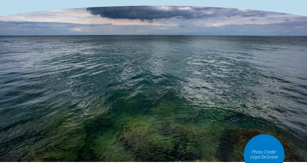MINNESOTA: SPECIFY RESTRICTIONS WHERE GROUNDWATER APPROPRIATIONS ARE LIKELY TO NEGATIVELY IMPACT SURFACE OR GROUNDWATER 

Minnesota law allows the state Department of Natural Resources commissioner to both: 

1. Establish water appropriation limits to protect groundwater resources; and 

2.  Designate groundwater management areas and limit total annual water appropriations and uses within a designated area to ensure sustainable use of groundwater that protects ecosystems, water quality, and the ability of future generations to meet their own needs. 

Water appropriations and uses within a designated management area must be consistent with a groundwater management area plan approved by the commissioner that addresses water conservation requirements and specific water allocation priorities.112 However, it appears that in order to set a sustainable diversion limit or water appropriation limit, or designate a groundwater management area, the commissioner must first find that groundwater appropriations are having a negative impact on surface waters.113 Minnesota could amend this statute to specify that a diversion limit, water appropriation limit, or groundwater management area may be designated where groundwater appropriations are _likely_ to have a negative impact on surface waters or groundwater aquifers. 

Minnesota law does allow the state to intervene when conflicts over groundwater arise, but a conflict is defined as “where the available supply of waters of the state in a given area is limited to the extent that there are competing demands among existing and proposed users which exceed the reasonably available 

> 112  Minn. Stat. § 103G.287. 

> 113  See, e.g., Findings of Fact and Order, Little Rock Creek Sustainable Diversion Limit and Water Use Conflict Morrison and Benton Counties (April 22, 2024), _available at_ : <u>https://fles.dnr.state.mn.us/waters/groundwater_section/sustainability/littlerock/2024i</u> -04-22-fof-lrc-wuc-sdl-moratorium-fnal.pdfi 

**A FINITE RESOURCE: MANAGING THE GROWING WATER NEEDS IN THE LAKES REGION | 42** 

POLICY RECOMMENDATIONS 

waters.” In this sense, conflicts under the Minnesota rule consist of situations where existing and proposed appropriations could endanger supply. In such situations, the commissioner can resolve the conflict by modifying appropriations limits, or when that is not possible, by following a set of legislatively established priorities.114 Though the rule is flexible to allow the commissioner to determine what constitutes a conflict and whether water use exceeds reasonably available supply, the focus of the rule on the availability of supply versus potential adverse impacts to groundwater resources limits Minnesota’s ability to restrict water use before impacts occur. 

##### ILLINOIS: CENTRALIZE GROUNDWATER MANAGEMENT 

Illinois does not have a centralized state system of groundwater management. Soil and Water Conservation Districts (SWCDs) oversee registrations and make recommendations for limits regarding high-capacity wells to the Illinois Department of Agriculture. However, SWCDs can make those recommendations only after receiving a landowner complaint, conducting an investigation, and finding a substantial lowering of groundwater levels. Thus, Illinois does not have a mechanism to proactively address declining aquifers before impacts occur.115 Illinois should centralize its groundwater management to create a state-level program of registration, permitting, and well siting that allows the state to curb groundwater use where adverse resource impacts are likely to occur. 

##### INDIANA: REVISIT RESTRICTED USE AREA PROVISIONS 

Like Michigan and Ohio, Indiana ultimately relies on litigation to resolve groundwater disputes. Unlike those states, Indiana follows the English rule of water use, meaning where a water user makes use of groundwater for a beneficial purpose, damage is not actionable unless deliberate or gratuitous. Indiana statute further specifies 11 beneficial purposes.116 The Indiana Department of Natural Resources (IDNR) regulates water withdrawals and can establish a restricted-use area. However, before establishing a restricted-use area, IDNR must have had surveys made of the area’s groundwater resources, have determined the safe annual yield of that basin, and find that the withdrawal of groundwater exceeds or threatens to exceed natural replenishment.117 Thus, Indiana is currently very limited in the ability to restrict groundwater withdrawal before impacts to aquifers or surface waters occur. 

WISCONSIN: CONSIDER PROVISIONS TO ALLOW RESTRICTION OF USE WHERE ADVERSE RESOURCE IMPACTS ARE LIKELY 

Wisconsin is a riparian state and relies on litigation to resolve groundwater disputes. However, Wisconsin also follows the public trust doctrine, which holds that some resources (generally navigable waters) are held in trust for the public and therefore deserve special protection. After a series of Supreme Court cases, the Wisconsin Department of Natural Resources’ (WDNR) authority to deny applications and impose permit conditions on high-capacity wells was ultimately upheld, meaning WDNR can place restrictions on highcapacity well approvals or deny permit applications, but only where the well’s operation might harm other waters in the state.118 

> 114  Minn. R. §§ 6115.0740. 

> 115  525 ILCS 45/5.1. 

> 116  IC 14-25-7-2. 

> 117  IC 14-25-3-4. 

> 118  Strifling, David, ”Plugging the Holes in Wisconsin’s Groundwater Policy,” Wisconsin Lawyer (June 9, 2022) _available at:_ <u>https://www.wisbar.org/ NewsPublications/WisconsinLawyer/Pages/Article.aspx?Volume=95&Issue=6&ArticleID=29155 (last accessed May 29, 2025).</u> 

**A FINITE RESOURCE: MANAGING THE GROWING WATER NEEDS IN THE LAKES REGION | 43** 

POLICY RECOMMENDATIONS 

Despite Wisconsin having one of the lowest thresholds for permitting in the Great Lakes region (see Fig. 6.1, above), the state’s groundwater law does not allow the Wisconsin Department of Natural Resources to establish groundwater management or protection areas, which are subject to lower withdrawal limits. Instead, those areas are defined by statute and regulation. Generally, a groundwater management area is one where the aquifers have already been reduced 150 feet below the level at which the potentiometric surface would be if no withdrawals had occurred, and a groundwater protection area is an area within 1,200 feet of an outstanding resource water, exceptional resource water, or other high-quality trout stream.119 Thus, like the other states discussed above, and because its approach to groundwater management is very permit driven, Wisconsin lacks the ability to curb or halt groundwater use before impacts to aquifers or surface waters occur. Wisconsin could consider amending its statute and regulations governing groundwater management and groundwater protection areas to allow WDNR to designate them and more clearly restrict groundwater use where adverse resources impacts are likely but have not yet occurred. WDNR recommended a similar regional management-type approach in 2021 with respect to the Central Sands region through the creation of a regional water use district.120 

##### **_5. Set energy and water efficiency standards for hyperscale data centers and large water-using industries_** 

There are more efficient types of cooling technologies data centers could use, but there are no water or energy efficiency standards or industry benchmarks for this sector. This is perhaps in part due to the pace with which this industry has developed, but also perhaps because of the range in scale and size of data centers. However, integrating more efficient cooling technologies and strategic siting requirements could directly reduce water consumption. Energy efficiency standards for large water-using industries such as data centers, semiconductor chip manufacturing, and quantum computing would additionally help reduce water consumption by reducing the use of water at nuclear-, coal-, and gas-fired electric generation facilities. Thus, the development of these kinds of efficiency standards should be considered in harmony, rather than siloed. Some states in the Great Lakes region, such as Wisconsin, may be better positioned to do that than states like Ohio or Michigan, because the state’s utility commission has oversight over not only electric utilities, but also water utilities. New York, for example, has pending legislation requiring its Public Service Commission and state Climate Action Council to develop energy consumption efficiency goals, but not water efficiency goals.121 

Although the Compact requires states to ensure withdrawals and consumptive uses meet its decisionmaking standard (which requires incorporation of environmentally sound and economically feasible water conservation measures), no state in the Great Lakes region definitively sets water efficiency standards that large water-using industries like data centers must follow. For example, in Michigan, an applicant for certain large-scale water withdrawals must self-certify to the Department of Environment, Great Lakes, and Energy that the applicant is implementing environmentally sound and economically feasible conservation measures. These are measures, methods, technologies, or practices for efficient water use and for reduction of water loss and waste, or for reducing a withdrawal, consumptive use, or diversion that: 

- Are environmentally sound. 

- Reflect best practices applicable to the water use sector. 

> 119  Wis. Admin. Code. NR 820.12 and Wis. Stat. § 281.34(1)(am). 

> 120  Central Sands Lakes Study Report: Findings & Recommendations, WDNR (May 27, 2021), p. 27 to 29, _available at:_ <u>https://widnr.widen.net/content/ kmlotz3hmk/pdf/DG_CSLS_Findings_Report_2021.pdf?u=kfkpym (last accessed May 29, 2025).</u> 

> 121  S 6394 (2025-2026 Reg. Sess.) (New York). 

**A FINITE RESOURCE: MANAGING THE GROWING WATER NEEDS IN THE LAKES REGION | 44** 

POLICY RECOMMENDATIONS 

- Are technically feasible and available. 

- Are economically feasible and cost effective based on an analysis that considers direct and avoided economic and environmental costs. 

- Consider the particular facilities and processes involved, taking into account the environmental impact, the age of equipment and facilities involved, the process employed, energy impacts, and other appropriate factors.122 

While it’s well understood by state agencies what kinds of technologies this might involve for water utilities (metering, loss monitoring, etc.) and agricultural irrigation, it is less clear what might constitute “environmentally sound and economically feasible conservation measures” for the high-tech data center or semiconductor chip manufacturing industries. Furthermore, these are practices the applicant must self-certify that they are implementing and only apply to applicants obtaining a permit (because they are not hooked into a municipal system with existing capacity). At minimum, states should seek to define and incorporate water efficiency standards into permitting requirements. More broadly, states in the region should look to incorporate water efficiency standards for this sector alongside energy efficiency requirements. 

Though it is outside the Great Lakes region, at least one state is considering legislation to more definitively impose water and energy efficiency standards on data centers. A bill introduced in Connecticut directs its commissioners of Energy and Environmental Protection, in consultation with the Public Utility Regulatory Authority and commissioner of Economic and Community Development, to conduct a study concerning energy efficiency performance standards for artificial intelligence data centers. The bill further requires the commissioner of Energy and Environmental Protection to adopt regulations establishing energy and water efficiency performance standards for artificial intelligence data centers. The regulations must: 

- Prioritize cost effectiveness, technological feasibility, and alignment with the state’s greenhouse gas emission reduction targets and the state water plan. 

- Consider best practices for energy and water usage effectiveness, energy and water management systems, and the use of renewable energy resources. 

- Require new AI data centers and substantial alterations to existing data centers to incorporate loadmanagement and load-shifting capabilities, including the ability to participate in demand response programs. 

This bill has been favorably reported out of committee.123 

State laws and regulations may also need to be adapted to allow for water reuse and recycling, such as the use of nonpotable water for cooling. Data centers do not necessarily require potable water for cooling. States like Ohio and Illinois have formed water reuse trade associations to study and explore what kinds of legal revisions are necessary to allow for nonpotable reuse of water for cooling statewide. Innovative solutions, such as co-locating a data center with a wastewater treatment plant, might not be permissible without modifications to existing legal frameworks. These associations could be beneficial in exploring these opportunities and in assisting states with setting water efficiency standards. 

> 122  MCL 324.32701 and 324.32723. 

> 123  S.B. No. 1292 (2025) (Conn.) 

**A FINITE RESOURCE: MANAGING THE GROWING WATER NEEDS IN THE LAKES REGION | 45** 

## ALLIANCE for the GREAT LAKES 

#### **Protecting Water, Sustaining Life** 

The Alliance for the Great Lakes is a nonpartisan nonprofit working across the region to protect our most precious resource: the fresh, clean, and natural waters of the Great Lakes. Learn more at <u>greatlakes.org.</u> 

