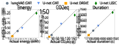
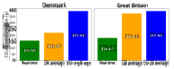
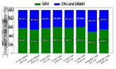
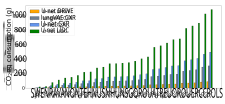
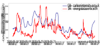
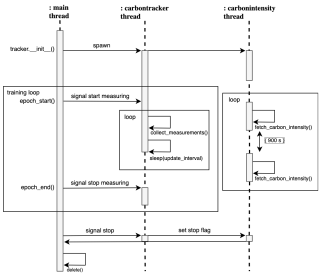
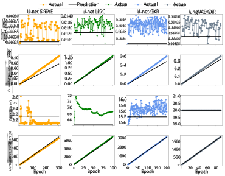

# **Carbontracker: Tracking and Predicting the Carbon Footprint of Training Deep Learning Models** 

### **Lasse F. Wolff Anthony**_∗_1 **Benjamin Kanding**_∗_1 **Raghavendra Selvan**1 

## **Abstract** 

Deep learning (DL) can achieve impressive results across a wide variety of tasks, but this often comes at the cost of training models for extensive periods on specialized hardware accelerators. This energy-intensive workload has seen immense growth in recent years. Machine learning (ML) may become a significant contributor to climate change if this exponential trend continues. If practitioners are aware of their energy and carbon footprint, then they may actively take steps to reduce it whenever possible. In this work, we present _carbontracker_ , a tool for tracking and predicting the energy and carbon footprint of training DL models. We propose that energy and carbon footprint of model development and training is reported alongside performance metrics using tools like _carbontracker_ . We hope this will promote responsible computing in ML and encourage research into energy-efficient deep neural networks.1 

## **1. Introduction** 

The popularity of solving problems using deep learning (DL) has rapidly increased and with it the need for ever more powerful models. These models achieve impressive results across a wide variety of tasks such as gameplay, where AlphaStar reached the highest rank in the strategy game Starcraft II (Vinyals et al., 2019) and Agent57 surpassed human performance in all 57 Atari 2600 games (Badia et al., 2020). This comes at the cost of training the model for thousands of hours on special- 

> *Equal contribution 1Department of Computer Science, University of Copenhagen, Copenhagen, Denmark. Correspondence to: Lasse F. Wolff Anthony <lassewolffanthony@gmail.com>, Benjamin Kanding <bmk1212@live.dk>. 

ICML Workshop on "Challenges in Deploying and monitoring Machine Learning Systems", 2020. 

> 1Source code for _carbontracker_ is available here: https://github.com/lfwa/carbontracker 

ized hardware accelerators such as graphics processing units (GPUs). From 2012 to 2018 the compute needed for DL grew 300000-fold (Amodei & Hernandez, 2018). 

This immense growth in required compute has a high energy demand, which in turn increases the demand for energy production. In 2010 energy production was responsible for approximately 35% of total anthropogenic greenhouse gas (GHG) emissions (Bruckner et al., 2014). Should this exponential trend in DL compute continue then machine learning (ML) may become a significant contributor to climate change. 

This can be mitigated by exploring how to improve energy efficiency in DL. Moreover, if practitioners are aware of their energy and carbon footprint, then they may actively take steps to reduce it whenever possible. We show that in ML, these can be simple steps that result in considerable reductions to carbon emissions. 

The environmental impact of ML in research and industry has seen increasing interest in the last year following the 2018 IPCC special report (IPCC, 2018) calling for urgent action in order to limit global warming to 1 _._ 5_◦_ C. We briefly review some notable work on the topic. Strubell et al. (2019) estimated the financial and environmental costs of R&D and hyperparameter tuning for various state-of-the-art (SOTA) neural network (NN) models in natural language processing (NLP). They point out that increasing cost and emissions of SOTA models contribute to a lack of equity between those researchers who have access to large-scale compute, and those who do not. The authors recommend that metrics such as training time, computational resources required, and model sensitivity to hyperparameters should be reported to enable direct comparison between models. Lacoste et al. (2019) provided the _Machine Learning Emissions Calculator_ that relies on self-reporting. The tool can estimate the carbon footprint of GPU compute by specifying hardware type, hours used, cloud provider, and region. Henderson et al. (2020) presented the _experiment-impact-tracker_ framework and gave various strategies for mitigating carbon emissions in ML. Their Python framework allows for estimating the energy and carbon impact 

**Carbontracker** 

of ML systems as well as the generation of “Carbon Impact Statements” for standardized reporting hereof. 

In this work, we propose _carbontracker_ , a tool for tracking and predicting the energy consumption and carbon emissions of training DL models. The methodology is similar to that of Henderson et al. (2020) but differs from prior art in two major ways: 

- (1) We allow for a further proactive and interventiondriven approach to reducing carbon emissions by supporting predictions. Model training can be stopped, at the user’s discretion, if the predicted environmental cost is exceeded. 

- (2) We support a variety of different environments and platforms such as clusters, desktop computers, and Google Colab notebooks, allowing for a plug-and-play experience. 

We experimentally evaluate the tool on several different deep convolutional neural network (CNN) architectures and datasets for medical image segmentation and assess the accuracy of its predictions. We present concrete recommendations on how to reduce carbon emissions considerably when training DL models. 

## **2. Design and Implementation** 

The design philosophy that guided the development of _carbontracker_ can be summarized by the following principles: 

**Pythonic** The majority of ML takes place in the Python language (Wilcox et al., 2017). We want the tool to be as easy as possible to integrate into existing work environments making Python the language of choice. 

**Usable** The required effort and added code must be minimal and not obfuscate the existing code structure. **Extensible** Adding and maintaining support for changing application programming interfaces (APIs) and new hardware should be straightforward. 

**Flexible** The user should have full control over what is monitored and how this monitoring is performed. **Performance** The performance impact of using the tool must be negligible, and computation should be minimal. It must not affect training. 

**Interpretable** Carbon footprint expressed in gCO2eq is often meaningless. A common understanding of the impact should be facilitated through conversions. 

_Carbontracker_ is an open-source tool written in Python for tracking and predicting the energy consumption 

and carbon emissions of training DL models. It is available through the Python Package Index (PyPi). The tool is implemented as a multithreaded program. It utilizes separate threads to collect power measurements and fetch carbon intensity in real-time for parallel efficiency and to not disrupt the model training in the main thread. Appendix A has further implementation details. 

_Carbontracker_ supports predicting the total duration, energy, and carbon footprint of training a DL model. These predictions are based on a user-specified number of monitored epochs with a default of 1. We forecast the carbon intensity of electricity production during the predicted duration using the supported APIs. The forecasted carbon intensity is then used to predict the carbon footprint. Following our preliminary research, we use a simple linear model for predictions. 

## **3. Experiments and Results** 

In order to evaluate the performance and behavior of _carbontracker_ , we conducted experiments on three medical image datasets using two different CNN models: U-net (Ronneberger et al., 2015) and lungVAE (Selvan et al., 2020). The models were trained for the task of medical image segmentation using three datasets: DRIVE (Staal et al., 2004), LIDC (Armato III et al., 2004), and CXR (Jaeger et al., 2014). Details on the models and datasets are given in Appendix B. All measurements were taken using _carbontracker_ version 1.1.2. We performed our experiments on a single NVIDIA TITAN RTX GPU with 12 GB memory and two Intel central processing units (CPUs). 

In line with our message of reporting energy and carbon footprint, we used _carbontracker_ to generate the following statement: The training of models in this work is estimated to use 37 _._ 445 kWh of electricity contributing to 3 _._ 166 kg of CO2eq. This is equivalent to 26 _._ 296 km travelled by car (see A.5). 

An overview of predictions from _carbontracker_ based on monitoring for 1 training epoch for the trained models compared to the measured values is shown in Figure 1. The errors in the energy predictions are 4 _._ 9–19 _._ 1% compared to the measured energy values, 7 _._ 3–19 _._ 9% for the CO2eq, and 0 _._ 8–4 _._ 6% for the duration. The error in the CO2eq predictions are also affected by the quality of the forecasted carbon intensity from the APIs used by _carbontracker_ . This is highlighted in Figure 2, which shows the estimated carbon emissions (gCO2eq) of training our U-net model on LIDC in Denmark and Great Britain for different carbon intensity estimation methods. As also shown by Henderson et al. (2020), we see that using country or region-wide average estimates 

**Carbontracker** 

_Figure 1._ Comparison of predicted and measured values of energy in kWh (left), emissions in gCO2eq (center), and duration in s (right) for the full training session when predicting after a single epoch. The diagonal line represents predictions that are equal to the actual measured consumption. Description of the models and datasets are in Appendix B. 

_Figure 2._ Carbon emissions (gCO2eq) of training the U-net on LIDC dataset for different carbon intensity estimation methods. (left) The emissions of training in Denmark and (right) in Great Britain at 2020-05-21 22:00 local time. Real-time indicates that the current intensity is fetched every 15 min during training using the APIs supported by _carbontracker_ . The average intensities are from 2016 (see Figure 8 in Appendix). 

may severely overestimate (or under different circumstances underestimate) emissions. This illustrates the importance of using real-time (or forecasted) carbon intensity for accurate estimates of carbon footprint. 

Figure 3 summarizes the relative energy consumption of each component across all runs. We see that while the GPU uses the majority of the total energy, around 50–60%, the CPU and dynamic random-access memory (DRAM) also account for a significant part of the total consumption. This is consistent with the findings of Gorkovenko & Dholakia (2020), who found that GPUs are responsible for around 70% of power consumption, CPU for 15%, and RAM for 10% when testing on the TensorFlow benchmarking suite for DL on Lenovo ThinkSystem SR670 servers. As such, only accounting for GPU consumption when quantifying the energy and carbon footprint of DL models will lead to considerable underestimation of the actual footprint. 

## **4. Reducing Your Carbon Footprint** 

The carbon emissions that occur when training DL models are not irreducible and do not have to simply be the cost of progress within DL. Several steps can 

_Figure 3._ Comparison of energy usage by component shown as the relative energy usage (%) out of the total energy spent during training. We see that the GPU uses the majority of the energy, about 50–60%, but the CPU and DRAM also account for a significant amount of the total energy consumption across all models and datasets. 

_Figure 4._ Estimated carbon emissions (gCO2eq) of training our models (see Appendix B) in different EU-28 countries. The calculations are based on the average carbon intensities from 2016 (see Figure 8 in Appendix). 

be taken in order to reduce this footprint considerably. In this section, we outline some strategies for practitioners to directly mitigate their carbon footprint when training DL models. 

**Low Carbon Intensity Regions** The carbon intensity of electricity production varies by region and is dependent on the energy sources that power the local electrical grid. Figure 4 illustrates how the variation in carbon intensity between regions can influence the carbon footprint of training DL models. Based on the 2016 average intensities, we see that a model trained in Estonia may emit more than 61 times the CO2eq as an equivalent model would when trained in Sweden. In perspective, our U-net model trained on the LIDC dataset would emit 17 _._ 7 gCO2eq or equivalently the same as traveling 0 _._ 14 km by car when trained in Sweden. However, training in Estonia it would emit 1087 _._ 9 gCO2eq or the same as traveling 9 _._ 04 km by car for just a single training session. 

As training DL models is generally not latency bound, we recommend that ML practitioners move training to regions with a low carbon intensity whenever it is possible to do so. We must further emphasize that for 

**Carbontracker** 

_Figure 5._ Real-time carbon intensity (gCO2eq _/_ kWh) for Denmark (DK) and Great Britain (GB) from 2020-05-18 to 2020-05-25 shown in local time. The data is collected using the APIs supported by _carbontracker_ . The carbon intensities are volatile to changes in energy demand and depend on the energy sources available. 

large-scale models that are trained on multiple GPUs for long periods, such as OpenAI’s GPT-3 language model (Brown et al., 2020), it is imperative that training takes place in low carbon intensity regions in order to avoid several megagrams of carbon emissions. The absolute difference in emissions may even be significant between two green regions, like Sweden and France, for such large-scale runs. 

**Training Times** The time period in which a DL model is trained affects its overall carbon footprint. This is caused by carbon intensity changing throughout the day as energy demand and capacity of energy sources change. Figure 5 shows the carbon intensity (gCO2eq _/_ kWh) for Denmark and Great Britain in the week of 2020-05-18 to 2020-05-25 collected with the APIs supported by _carbontracker_ . A model trained during low carbon intensity hours of the day in Denmark may emit as little as<u>1</u> 4the CO2eq of one trained during peak hours. A similar trend can be seen for Great Britain, where 2-fold savings in emissions can be had. We suggest that ML practitioners shift training to take place in low carbon intensity time periods whenever possible. The time period should be determined on a regional level. 

**Efficient Algorithms** The use of efficient algorithms when training DL models can further help reduce compute-resources and thereby also carbon emissions. Hyperparameter tuning may be improved by substituting grid search for random search (Bergstra & Bengio, 2012), using Bayesian optimization (Snoek et al., 2012) or other optimization techniques like Hyperband (Li et al., 2017). Energy efficiency of inference in deep neural networks (DNNs) is also an active area of research with methods such as quantization aware training, energy-aware pruning (Yang et al., 2017), and power- and memory-constrained hyperparameter optimization like HyperPower (Stamoulis et al., 2018). **Efficient Hardware and Settings** Choosing more 

energy-efficient computing hardware and settings may also contribute to reducing carbon emissions. Some GPUs have substantially higher efficiency in terms of floating point operations per second (FLOPS) per watt of power usage compared to others (Lacoste et al., 2019). Power management techniques like dynamic voltage and frequency scaling (DVFS) can further help conserve energy consumption (Li et al., 2016) and for some models even reduce time to reach convergence (Tang et al., 2019). Tang et al. (2019) show that DVFS can be applied to GPUs to help conserve about 8 _._ 7% to 23 _._ 1% energy consumption for training different DNNs and about 19 _._ 6% to 26 _._ 4% for inference. Moreover, the authors show that the default frequency settings on tested GPUs, such as NVIDIA’s Pascal P100 and Volta V100, are often not optimized for energy efficiency in DNN training and inference. 

## **5. Discussion and Conclusion** 

The current trend in DL is a rapidly increasing demand for compute that does not appear to slow down. This is evident in recent models such as the GPT-3 language model (Brown et al., 2020) with 175 billion parameters requiring an estimated 28000 GPU-days to train excluding R&D (see Appendix D). We hope to spread awareness about the environmental impact of this increasing compute through accurate reporting with the use of tools such as _carbontracker_ . Once informed, concrete and often simple steps can be taken in order to reduce the impact. 

SOTA-results in DL are frequently determined by a model’s performance through metrics such as accuracy, AUC score, or similar performance metrics. Energyefficiency is usually not one of these. While such performance metrics remain a crucial measure of model success, we hope to promote an increasing focus on energy-efficiency. We must emphasize that we do not argue that compute-intensive research is not essential for the progress of DL. We believe, however, that the impact of this compute should be minimized. We propose that the total energy and carbon footprint of model development and training is reported alongside accuracy and similar metrics to promote responsible computing in ML and research into energy-efficient DNNs. 

In this work, we showed that ML risks becoming a significant contributor to climate change. To this end, we introduced the open-source _carbontracker_ tool for tracking and predicting the total energy consumption and carbon emissions of training DL models. This enables practitioners to be aware of their footprint and take action to reduce it. 

**Carbontracker** 

### ACKNOWLEDGEMENTS 

The authors would like to thank Morten Pol EngellNørregård for the thorough feedback on the thesis version of this work. The authors also thank the anonymous reviewers and early users of _carbontracker_ for their insightful feedback. 

## **References** 

- Amodei, D. and Hernandez, D. Ai and compute. _Heruntergeladen von https://blog. openai. com/aiand-compute_ , 2018. 

- Armato III, S. G., McLennan, G., McNitt-Gray, M. F., Meyer, C. R., Yankelevitz, D., Aberle, D. R., Henschke, C. I., Hoffman, E. A., Kazerooni, E. A., MacMahon, H., et al. Lung image database consortium: developing a resource for the medical imaging research community. _Radiology_ , 232(3):739–748, 2004. 

- Ascierto, R. Uptime Institute 2018 Data Center Survey. Technical report, Uptime Institute, 2018. 

- Ascierto, R. Uptime Institute 2019 Data Center Survey. Technical report, Uptime Institute, 2019. 

- Avelar, V., Azevedo, D., and French, A. PUE™: A Comprehensive Examination of the Metric. _GreenGrid_ , pp. 1–83, 2012. 

- Badia, A. P., Piot, B., Kapturowski, S., Sprechmann, P., Vitvitskyi, A., Guo, D., and Blundell, C. Agent57: Outperforming the atari human benchmark, 2020. 

- Bergstra, J. and Bengio, Y. Random search for hyperparameter optimization. _Journal of Machine Learning Research_ , 13:281–305, 2012. ISSN 15324435. 

- Brown, T. B., Mann, B., Ryder, N., Subbiah, M., Kaplan, J., Dhariwal, P., Neelakantan, A., Shyam, P., Sastry, G., Askell, A., Agarwal, S., Herbert-Voss, A., Krueger, G., Henighan, T., Child, R., Ramesh, A., Ziegler, D. M., Wu, J., Winter, C., Hesse, C., Chen, M., Sigler, E., Litwin, M., Gray, S., Chess, B., Clark, J., Berner, C., McCandlish, S., Radford, A., Sutskever, I., and Amodei, D. Language models are few-shot learners, 2020. 

- Bruckner, T., Bashmakov, Y., Mulugetta, H., and Chum, A. 2014: Energy systems. In _Climate Change 2014: Mitigation of Climate Change. Contribution of Working Group III to the Fifth Assessment Report of the Intergovernmental Panel on Climate Change_ . 2014. 

- David, H., Gorbatov, E., Hanebutte, U. R., Khanna, R., and Le, C. RAPL: Memory power estimation and capping. In _Proceedings of the International Symposium_ 

_on Low Power Electronics and Design_ , pp. 189–194, 2010. ISBN 9781450301466. doi: 10.1145/1840845.1840883. 

- Goodward, J. and Kelly, A. Bottom line on offsets. Technical report, The World Resources Institute, 10 G Street, NE Suite 800 Washington, D. C ..., 2010. 

- Gorkovenko, M. and Dholakia, A. Towards Power Efficiency in Deep Learning on Data Center Hardware. pp. 1814–1820, 2020. 

- Henderson, P., Hu, J., Romoff, J., Brunskill, E., Jurafsky, D., and Pineau, J. Towards the Systematic Reporting of the Energy and Carbon Footprints of Machine Learning. jan 2020. URL http://arxiv.org/abs/2002.05651. 

- IPCC. Global Warming of 1.5°C. An IPCC Special Report on the impacts of global warming of 1.5°C above pre-industrial levels and related global greenhouse gas emission pathways, in the context of strengthening the global response to the threat of climate change,. Technical report, 2018. 

- Jaeger, S., Candemir, S., Antani, S., Wáng, Y.-X. J., Lu, P.-X., and Thoma, G. Two public chest x-ray datasets for computer-aided screening of pulmonary diseases. _Quantitative imaging in medicine and surgery_ , 4(6):475, 2014. 

- Kingma, D. and Ba, J. Adam optimizer. _arXiv preprint arXiv:1412.6980_ , pp. 1–15, 2014. 

- Lacoste, A., Luccioni, A., Schmidt, V., and Dandres, T. Quantifying the Carbon Emissions of Machine Learning. Technical report, 2019. 

- Li, D., Chen, X., Becchi, M., and Zong, Z. Evaluating the energy efficiency of deep convolutional neural networks on CPUs and GPUs. In _Proceedings - 2016 IEEE International Conferences on Big Data and Cloud Computing, BDCloud 2016, Social Computing and Networking, SocialCom 2016 and Sustainable Computing and Communications, SustainCom 2016_ , pp. 477–484. Institute of Electrical and Electronics Engineers Inc., oct 2016. ISBN 9781509039364. doi: 10.1109/ BDCloud-SocialCom-SustainCom.2016.76. 

- Li, L., Jamieson, K., DeSalvo, G., Rostamizadeh, A., and Talwalkar, A. Hyperband: A novel bandit-based approach to hyperparameter optimization. _J. Mach. Learn. Res._ , 18(1):6765–6816, January 2017. ISSN 1532-4435. 

- Paszke, A., Gross, S., Massa, F., Lerer, A., Bradbury, J., Chanan, G., Killeen, T., Lin, Z., Gimelshein, N., Antiga, L., Desmaison, A., Köpf, A., Yang, 

**Carbontracker** 

- E., DeVito, Z., Raison, M., Tejani, A., Chilamkurthy, S., Steiner, B., Fang, L., Bai, J., and Chintala, S. PyTorch: An Imperative Style, HighPerformance Deep Learning Library. 2019. URL http://arxiv.org/abs/1912.01703. 

- Ronneberger, O., Fischer, P., and Brox, T. U-net: Convolutional networks for biomedical image segmentation. In _Lecture Notes in Computer Science (including subseries Lecture Notes in Artificial Intelligence and Lecture Notes in Bioinformatics)_ , volume 9351, pp. 234– 241, may 2015. doi: 10.1007/978-3-319-24574-4_28. URL http://arxiv.org/abs/1505.04597. 

- Selvan, R., Dam, E. B., Detlefsen, N. S., Rischel, S., Sheng, K., Nielsen, M., and Pai, A. Lung Segmentation from Chest X-rays using Variational Data Imputation. In _ICML Workshop on The Art of Learning with Missing Values_ , 2020. URL https: //openreview.net/forum?id=dlzQM28tq2W. 

- Snoek, J., Larochelle, H., and Adams, R. P. Practical bayesian optimization of machine learning algorithms. In _Advances in neural information processing systems_ , pp. 2951–2959, 2012. 

- Staal, J., Abràmoff, M. D., Niemeijer, M., Viergever, M. A., and Van Ginneken, B. Ridge-based vessel segmentation in color images of the retina. _IEEE Transactions on Medical Imaging_ , 23(4):501–509, apr 1 2004. ISSN 02780062. doi: 10.1109/TMI.2004.825627. 

- 2 3 

- Stamoulis, D., Cai, E., Juan, D. C., and Marculescu, 4 D. HyperPower: Power- and memory-constrained hyper-parameter optimization for neural networks. 5 In _Proceedings of the 2018 Design, Automation and_ 6 _Test in Europe Conference and Exhibition, DATE 2018_ , 78 volume 2018-Janua, pp. 19–24, dec 2018. ISBN 9 9783981926316. doi: 10.23919/DATE.2018.8341973.10 URL http://arxiv.org/abs/1712.02446. 11 

starcraft ii using multi-agent reinforcement learning. _Nature_ , 575(7782):350–354, 2019. 

- Wilcox, M., Schuermans, S., Voskoglou, C., and Sobolevski, A. Developer economics: State of the developer nation q1 2017. Technical report, 2017. 

- Yang, T. J., Chen, Y. H., and Sze, V. Designing energy-efficient convolutional neural networks using energy-aware pruning. In _Proceedings - 30th IEEE Conference on Computer Vision and Pattern Recognition, CVPR 2017_ , volume 2017-Janua, pp. 6071–6079, nov 2017. ISBN 9781538604571. doi: 10.1109/CVPR.2017.643. URL http://arxiv.org/abs/1611.05128. 

- Yuventi, J. and Mehdizadeh, R. A critical analysis of Power Usage Effectiveness and its use in communicating data center energy consumption. _Energy and Buildings_ , 64:90–94, 2013. ISSN 03787788. doi: 10.1016/j.enbuild.2013.04.015. 

## **A. Implementation details** 

_Listing 1._ Example of the default setup added to training scripts for tracking and predicting with _carbontracker_ . 

- **from carbontracker.tracker** 

   - **import** CarbonTracker 

- _�→_ 

tracker 

- _�→_ = CarbonTracker(epochs=<your epochs>) 

- **for** epoch **in** range(<your epochs>): 

   - tracker.epoch_start() 

   - _# Your model training._ 

tracker.epoch_end() 

   - 12 

- Strubell, E., Ganesh, A., and McCallum, A. Energy and13 Policy Considerations for Deep Learning in NLP. pp. 3645–3650, 2019. doi: 10.18653/v1/p19-1355. URL https://bit.ly/2JTbGnI. 

- Tang, Z., Wang, Y., Wang, Q., and Chu, X. The impact of GPU DVFS on the energy and performance of deep Learning: An Empirical Study. In _e-Energy 2019 - Proceedings of the 10th ACM International Conference on Future Energy Systems_ , pp. 315–325, may 2019. ISBN 9781450366717. doi: 10.1145/3307772.3328315. URL http://arxiv.org/abs/1905.11012. 

- Vinyals, O., Babuschkin, I., Czarnecki, W. M., Mathieu, M., Dudzik, A., Chung, J., Choi, D. H., Powell, R., Ewalds, T., Georgiev, P., et al. Grandmaster level in 

tracker.stop() 

_Carbontracker_ is a multithreaded program. Figure 6 illustrates a high-level overview of the program. 

### **A.1. On** 

### **the Topic of Power and Energy Measurements** 

In our work, we measure the total power of selected components such as the GPU, CPU, and DRAM. It can be argued that dynamic power rather than total power would more fairly represent a user’s power consumption when using large clusters or cloud computing. We argue that these computing resources would not have to exist if the user did not use them. As 

**Carbontracker** 

_Listing 2._ Example output of using _carbontracker_ to track and predict the energy and carbon footprint of training a DL model. 

|Car|bonTracker: The following components|
|---|---|
|_�→_|were found: GPU with device(s) TITAN|
|_�→_|RTX. CPU with device(s) cpu:0, cpu:1.|
|Car|bonTracker: Carbon intensity|
|_�→_|for the next 1:54:54 is predicted to|
|_�→_|be 54.09 gCO2/kWh at detected location:|
|_�→_|Copenhagen, Capital Region, DK.|
|Car|bonTracker:|
|Pre|dicted consumption for 100 epoch(s):|
||Time: 1:54:54|
||Energy: 1.159974 kWh|
||CO2eq: 62.744032 g This is equivalent to:|
||0.521130 km travelled by car|
|Car|bonTracker: Average|
|_�→_|carbon intensity during training|
|_�→_|was 58.25 gCO2/kWh at detected location:|
|_�→_|Copenhagen, Capital Region, DK.|
|Car|bonTracker:|
|Act|ual consumption for 100 epoch(s):|
||Time: 1:55:55|
||Energy: 1.334319 kWh CO2eq: 77.724065 g This is equivalent to:|
||0.645549 km travelled by car|
|Car|bonTracker: Finished monitoring.|

such, the user should also be accountable for the static power consumption during the period in which they reserve the resource. It is also a pragmatic solution as accurately estimating dynamic power is challenging due to the infeasibility of measuring static power by software and the difficulty in storing and updating information about static power for a multitude of different components. A similar argument can be made for the inclusion of life-cycle aspects in our energy estimates, such as accounting for the energy attributed to the manufacturing of system components. Like Henderson et al. (2020), we ignore these aspects due to the difficulties in their estimation. 

The power and energy monitoring in _carbontracker_ is limited to a few main components of computational systems. Additional power consumed by the supporting infrastructure, such as that used for cooling or power delivery, is accounted for by multiplying the measured power by the Power Usage Effectiveness (PUE) of the data center hosting the compute, as suggested by Strubell et al. (2019). PUE is a ratio describing the efficiency of a data center and the energy overhead of the computing equipment. It is defined as the ratio of the total energy used in a data center facility to the energy used by the IT equipment such as the compute, 

storage, and network equipment (Avelar et al., 2012): 

$$
PUE= Total Facility Energy IT Equipment Energy. (1)
$$

Previous research has examined PUE and its shortcomings (Yuventi & Mehdizadeh, 2013). These shortcomings may largely be resolved by data centers reporting an average PUE instead of a minimum observed value. In our work, we use a PUE of 1 _._ 58, the global average for data centers in 2018 as reported by Ascierto (2018).2 This may lead to inaccurate estimates of power and energy consumption of compute in energy-efficient data centers; e.g., Google reports a fleetwide PUE of 1 _._ 10 for 2020.3 Future work may, therefore, explore alternatives to using an average PUE value as well as to include more components in our measurements to improve the accuracy of our estimation. Currently, the software needed to take power measurements for components beyond the GPU, CPU, and DRAM is extremely limited or in most cases, non-existent. 

### **A.2. On the Topic of Carbon Offsetting** 

Carbon emissions can be compensated for by carbon offsetting or the purchases of Renewable Energy Credits (RECs). Carbon offsetting is the reduction in emissions made to compensate for emissions occurring elsewhere (Goodward & Kelly, 2010). We ignore such offsets and RECs in our reporting as to encourage responsible computing in the ML community that would further reduce global emissions. See Henderson et al. (2020) for an extended discussion on carbon offsets and why they also do not account for them in the _experiment-impact-tracker_ framework. Our carbon footprint estimate is solely based on the energy consumed during training of DL models. 

### **A.3. Power and Energy Tracking** 

The power and energy tracking in _carbontracker_ occurs in the carbontracker thread. The thread continuously collects instantaneous power samples in real-time for every available device of the specified components. Once samples for every device has been collected, the thread will sleep for a fixed interval before collecting samples again. When the epoch ends, the thread stores the epoch duration. Finally, after the training loop completes we calculate the total energy 

> 2Early versions (v1.1.2 and earlier) of _carbontracker_ used a PUE of 1 _._ 58. This has subsequently been updated to 1 _._ 67, the global average for 2019 (Ascierto, 2019). 

> 3See https://www.google.com/about/ datacenters/efficiency/ 

**Carbontracker** 

_Figure 6._ A visualization of the _carbontracker_ control flow. The main thread instantiates the CarbonTracker class which then spawns the carbontracker and carbonintensity daemon threads. The carbontracker thread continuously collects power measurements for available devices. The carbonintensity thread fetches the current carbon intensity every 900 s. When the specified epochs before predicting have passed, the total predicted consumption is reported to stdout and optional log files. Similarly, when the specified amount of epochs have been monitored, the actual measured consumption is reported, after which the carbontracker and carbonintensity threads join the main thread. Finally, the _carbontracker_ object runs the cleanup routine delete() which releases all used resources. 

consumption _E_ as 

### **A.4. Converting** 

### **Energy Consumption to Carbon Emissions** 

$$
E =PUE � e\in{}{}E � d\in{}{}D Pavg,deTe (2)
$$

where _Pavg,de_ is the average power consumed by device _d ∈D_ in epoch _e ∈E_ , and _Te_ is the duration of epoch _e_ . 

The components supported by _carbontracker_ in its current form are the GPU, CPU, and DRAM due to the aforementioned restrictions. NVIDIA GPUs represent a large share of Infrastructure-as-a-Service compute instance types with dedicated accelerators. So we support NVIDIA GPUs as power sampling is exposed through the NVIDIA Management Library (NVML)4 . Likewise, we support Intel CPUs and DRAM through the Intel Running Average Power Limit (Intel RAPL) interface (David et al., 2010). 

4https://developer.nvidia.com/ nvidia-management-library-nvml 

We can estimate the carbon emissions resulting from the electricity production of the energy consumed during training as the product of the energy and carbon intensity as shown in (3): 

$$
Carbon Footprint= Energy Consumption\times{}{} Carbon Intensity. (3)
$$

The used carbon intensity heavily influences the accuracy of this estimate. In _carbontracker_ , we support the fetching of carbon intensity in real-time through external APIs.We dynamically determine the location based on the IP address of the local compute through the Python geocoding library geocoder5 . Unfortunately, there does not currently exist a globally accurate, free, and publicly available real-time carbon intensity database. This makes determining the carbon intensity to use for the conversion more difficult. 

5https://github.com/DenisCarriere/ geocoder 

**Carbontracker** 

We solve this problem by using several APIs that are local to each region. It is currently limited to Denmark and Great Britain. Other regions default to an average carbon intensity for the EU-28 countries in 20176 . For Denmark we use data from Energi Data Service7 and for Great Britain we use the Carbon Intensity API8 . 

### **A.5. Logging** 

Finally, _carbontracker_ has extensive logging capabilities enabling transparency of measurements and enhancing the reproducibility of experiments. The user may specify the desired path for these log files. We use the logging API9 provided by the standard Python library. 

Additional functionality for interaction with logs has also been added through the carbontracker.parser module. Logs may easily be parsed into Python dictionaries containing all information regarding the training sessions, including power and energy usages, epoch durations, devices monitored, whether the model stopped early, and the outputted prediction. We further support aggregating logs into a single estimate of the total impact of all training sessions. By using different log directories, the user can easily keep track of the total impact of each model trained and developed. The user may then use the provided parser functionality to estimate the full impact of R&D. 

Current version of _carbontracker_ uses kilometers travelled by car as the carbon emissions conversion. This data is retrieved from the average CO2eq emissions of a newly registered car in the European Union in 201810 . 

## **B. Models and Data** 

In our experimental evaluation, we trained two CNN models on three medical image datasets for the task of image segmentation. The models were developed in PyTorch (Paszke et al., 2019). We describe each of the models and datasets in turn below. 

**U-net DRIVE** This is a standard U-net model (Ronneberger et al., 2015) trained on the DRIVE dataset 

6https://www.eea.europa. 

> eu/data-and-maps/data/ 

co2-intensity-of-electricity-generation 

7https://energidataservice.dk/ 

> 8https://carbonintensity.org.uk/ 

9https://docs.python.org/3/library/ logging.html 

> 10https://www.eea.europa. 

(Staal et al., 2004). DRIVE stands for Digital Retinal Images for Vessel Extraction and is intended for segmentation of blood vessels in retinal images. The images are 768 by 584 pixels and JPEG compressed. We used a training set of 15 images and trained for 300 epochs with a batch size of 4 and a learning rate of 10_−_3 with the Adam optimizer (Kingma & Ba, 2014). 

**U-net CXR** The model is based on a U-net (Ronneberger et al., 2015) with slightly changed parameters. The dataset comprises of chest X-rays (CXR) with lung masks curated for pulmonary tuberculosis detection (Jaeger et al., 2014). We use 528 CXRs for training and 176 for validation without any data augmentation. We trained the model for 200 epochs with a batch size of 12, a learning rate of 10_−_4 , and weight decay of 10_−_5 with the Adam optimizer (Kingma & Ba, 2014). 

**U-net LIDC** This is also a standard U-net model (Ronneberger et al., 2015) but trained on a preprocessed LIDC-IDRI dataset (Armato III et al., 2004)11 . The LIDC-IDRI dataset consists of 1018 thoracic computed tomography (CT) scans with annotated lesions from four different radiologists. We trained our model on the annotations of a single radiologist for 100 epochs. We used a batch size of 64 and a learning rate of 10_−_3 with the Adam optimizer (Kingma & Ba, 2014). 

**lungVAE CXR** This model and dataset is from the open source model available from Selvan et al. (2020). The model uses a U-net type segmentation network and a variational encoder for data imputation. The dataset is the same CXR dataset as used in our above U-net CXR model. 528 CXRs are used for training and 176 for validation. The model was trained with a batch size of 12 and a learning rate of 10_−_4 with the Adam optimizer (Kingma & Ba, 2014) for a maximum of 200 epoch using early stopping based on the validation loss. The first run was 90 epochs, and the second run was 97. 

## **C. Additional Experiments** 

### **C.1. Performance Impact of Carbontracker** 

The performance impact of using _carbontracker_ to monitor all training epochs is shown as a boxplot in Figure 7. We see that the mean increase in epoch duration for our U-net models across two runs is 0 _._ 19% on DRIVE, 1 _._ 06% on LIDC, and _−_ 0 _._ 58% on CXR. While we see individual epochs with a relative increase of up to 5% on LIDC and even 22% on DRIVE, this is more likely attributed to the stochasticity in epoch duration than to _carbontracker_ . We further note that the fluctuations in epoch dura- 

> eu/data-and-maps/indicators/ 

> average-co2-emissions-from-motor-vehicles/ assessment-1 

11https://github.com/stefanknegt/ Probabilistic-Unet-Pytorch 

**Carbontracker** 

_Figure 7._ Box plot of the performance impact (%) of using _carbontracker_ to monitor all training epochs shown as the relative increase in epoch duration compared to a baseline without _carbontracker_ . The whiskers and outliers are obtained from the Tukey method using 1.5 times IQR. 

tion (Figure 7) are not caused by _carbontracker_ . These fluctuations are also witnessed in the baseline runs. 

## **D. Estimating the** 

## **Energy and Carbon Footprint of GPT-3** 

Brown et al. (2020) report that the GPT-3 model with 175 billion parameters used 3 _._ 14 _·_ 1023 floating point operations (FPOs) of compute to train using NVIDIA V100 GPUs on a cluster provided by Microsoft. We assume that these are the most powerful V100 GPUs, the V100S PCIe model, with a tensor performance of 130 TFLOPS12 and that the Microsoft data center has a PUE of 1.125, the average for new Microsoft data centers in 201513 . The compute time on a single GPU is therefore 

_Figure 8._ Average carbon intensity (gCO2eq _/_ kWh) of EU-28 countries in 2016. The intensity is calculated as the ratio of emissions from public electricity production and gross electricity production. Data is provided by the European Environment Agency (EEA). See https://www.eea.europa.eu/ds_resolveuid/ 3f6dc9e9e92b45b9b829152c4e0e7ade. 

Using the average carbon intensity of USA in 2017 of 449 _._ 06 gCO2eq _/_ kWh14 , we see this may emit up to 

$$
449.06gCO2eq/kWh\cdot{}{}188701.92kWh
$$

$$
3.14\cdot{}{}1023 FPOs 130\cdot{}{}1012 FLOPS =2415384615.38s=27955.84d.
$$

This is equivalent to about 310 GPUs running non-stop for 90 days. If we use the thermal design power (TDP) of the V100s and the PUE, we can estimate that this used 

$$
250W\cdot{}{}2415384615.38s\cdot{}{}1.125=679326923075.63J
$$

$$
=84738484.20gCO2eq
$$

$$
=84738.48kgCO2eq.
$$

This is equivalent to 

$$
84738484.20gCO2eq 120.4gCO2eqkm-1 =703808.01km
$$

travelled by car using the average CO2eq emissions of a newly registered car in the European Union in 201815 . 

$$
=188701.92kWh.
$$

> 12https://bit.ly/2zFsOK2 

> 13http://download.microsoft.com/download/ 

> 8/2/9/8297f7c7-ae81-4e99-b1db-d65a01f7a8ef/ microsoft_cloud_infrastructure_datacenter_ and_network_fact_sheet.pdf 

> 14https://www.eia.gov/tools/faqs/faq.php? id=74&t=11 

> 15https://www.eea.europa. 

> eu/data-and-maps/indicators/ 

> average-co2-emissions-from-motor-vehicles/ assessment-1 

**Carbontracker** 

_Figure 9._ Comparison of predicted and measured values of energy (kWh) and duration (s) per epoch when predicting after a single epoch. (row 1) Energy. (row 2) Cumulative energy. (row 3) Duration. (row 4) Cumulative duration. Each column shows a different model and dataset, as detailed in Appendix B. The initial epoch is often characterized by low energy usage and short epoch duration compared to the following epochs. Notwithstanding, the linear prediction model used by _carbontracker_ may still lead to reasonable predictions after monitoring a single epoch. 

