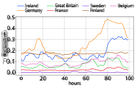
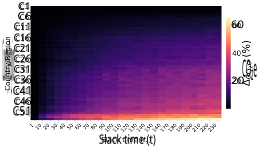
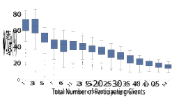
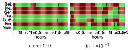
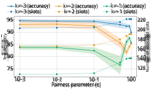
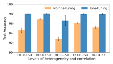
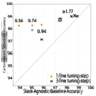

# Green Federated Learning via Carbon-Aware Client and Time Slot Scheduling 

Daniel Richards Arputharaj_∗_ , Charlotte Rodriguez_∗†_ , Angelo Rodio_‡_ , Giovanni Neglia_∗_ 

_∗_ Inria Centre at Universit´e Cˆote d’Azur, France. Email: _{_ firstname.lastname _}_ @inria.fr, 

_†_ Accenture, France. Email: c.q.rodriguez@accenture.com, 

_‡_ Department of Electrical Engineering (ISY), Link¨oping University, Sweden. Email: angelo.rodio@liu.se 

**_Abstract_ —Training large-scale machine learning models incurs substantial carbon emissions. Federated Learning (FL), by distributing computation across geographically dispersed clients, offers a natural framework to leverage regional and temporal variations in Carbon Intensity (CI). This paper investigates how to reduce emissions in FL through carbon-aware client selection and training scheduling. We first quantify the emission savings of a carbon-aware scheduling policy that leverages slack time—permitting a modest extension of the training duration so that clients can defer local training rounds to lower-carbon periods. We then examine the performance trade-offs of such scheduling which stem from statistical heterogeneity among clients, selection bias in participation, and temporal correlation in model updates. To leverage these trade-offs, we construct a carbon-aware scheduler that integrates slack time,** _α_ **-fair carbon allocation, and a global fine-tuning phase. Experiments on realworld CI data show that our scheduler outperforms slackagnostic baselines, achieving higher model accuracy across a wide range of carbon budgets, with especially strong gains under tight carbon constraints.** 

## I. INTRODUCTION 

With the growing complexity of machine learning (ML) models, training requires access to large-scale, high-quality datasets and high-throughput computing infrastructure—often involving hundreds of terabytes of data and thousands of GPUhours over days or even weeks of continuous execution [1]. 

In terms of _energy consumption_ , training a baseline convolutional neural network such as ResNet-50 on the ImageNet dataset for a single-GPU, 90-epoch run consumes 55–90 kilowatt-hours (kWh) on the Inria Nef cluster, comparable to the energy needed for an electric car trip from Nice to Paris [2]. The resulting environmental cost depends not only on energy consumption but also on the Carbon Intensity (CI) of the electricity used, typically expressed in CO2-equivalents per kilowatt-hour (CO2e/kWh). This standardized metric aggregates the global warming impact of all greenhouse gases (and not just CO2). CI varies across time and geography, 

This research was supported in part by the French government, through the “Plan de Relance” and the 3IA Cˆote d’Azur Investments in the Future project managed by the National Research Agency (ANR) with the reference number ANR-19-P3IA-0002, and in part by the European Network of Excellence dAIEDGE under Grant Agreement Nr. 101120726, the EU HORIZON MSCA 2023 DN project FINALITY (G.A. 101168816), the Groupe La Poste, sponsor of the Inria Foundation, in the framework of the FedMalin Inria Challenge, and the Wallenberg AI, Autonomous Systems and Software Program (WASP) funded by the Knut and Alice Wallenberg Foundation. 

Our code is available at: https://github.com/chrdz/GreenFL. 

reflecting differences in local energy mix. As the current level of resource consumption becomes increasingly unsustainable, research priorities are shifting from exclusively maximizing model accuracy to jointly optimizing predictive performance and energy efficiency [1], [3], giving rise to the principles of Green ICT and Green AI [4], [5]. 

In terms of _data production_ , training data is inherently decentralized—generated at the user level and constrained by geographic and jurisdictional boundaries. Centralizing such data is often infeasible due to bandwidth limitations, latency, and energy overheads associated with large-scale data transfer. In addition, regulatory frameworks such as the GDPR in Europe and the CCPA in the U.S. impose data sovereignty, regulating cross-border data transfer and confining training data to their region of origin. Together, these constraints result in statistical heterogeneity and non-IID data distributions across computing nodes, as local datasets reflect regionspecific demographic, behavioral, and cultural characteristics. 

_Federated Learning (FL)_ emerges as an effective paradigm for training ML models across geographically distributed computing nodes—also referred to as clients [6]–[8]. Unlike centralized learning, FL avoids the transfer of raw data by exchanging model updates. 

In this work, we explore the idea that FL’s decentralized structure can also be leveraged to reduce the environmental impact of training by strategically allocating it to clients in regions and periods with lower CI. Indeed, due to disparities in regional energy mixes, CI varies significantly across both time and location. This variability creates opportunities for _carbonaware scheduling_ , in which training is shifted toward lowcarbon regions and time windows. This paper addresses the following question: _Given a pool of geographically distributed clients characterized by heterogeneous energy efficiency and carbon intensity, how should we schedule client training to minimize the environmental impact?_ We quantify the potential for substantial carbon savings by leveraging slack time—the flexibility to extend the training process beyond its minimum duration and defer computation to low-carbon periods. 

In addition to highlighting the potential benefits, this paper identifies and addresses the following challenges inherent to carbon-aware scheduling: 

1) Due to statistical heterogeneity, a carbon-greedy scheduling that tends to exclude high-emission clients will introduce 

1 

statistical bias in the learned model. Our carbon-aware scheduler allocates a strictly positive share of the global carbon budget to each client through an _α-fair scheduling policy_ . 

2) Due to geographic variability in CI, even fair carbonaware scheduling induces skewed client selection during training, leading to selection bias. We use an _unbiased aggregation rule_ that compensates for heterogeneous client selection, ensuring all clients contribute equally to the final model. 

3) Due to temporal correlations in CI, carbon-aware scheduling suffers from last-iterate bias: early updates are rapidly forgotten, while late-round updates disproportionately influence the final model. To mitigate this imbalance, our scheduler introduces a _fine-tuning phase_ with full client selection and optimizes its placement under the carbon budget. 

We evaluate our approach through extensive simulations using real-world CI traces from Electricity Maps [9]. The experimental results quantify the benefits of slack time, _α_ -fair carbon allocation, and fine-tuning, demonstrating consistent improvements over slack-agnostic training, particularly under tight carbon budget constraints. 

## II. RELATED WORKS 

As concerns grow over the environmental impact of ML training, driven by the increasing scale of models, research has focused on making ML more sustainable. Most efforts predominantly target centralized settings, particularly singletenant data centers. At the hardware level, specialized accelerators can drastically reduce energy consumption per operation—often by orders of magnitude compared to traditional CPUs and GPUs [10], [11]. At the platform level, carbon-aware schedulers migrate workloads to low-carbonintensity periods [12], [13]. Orthogonal model-centric techniques, such as pruning, quantization, and distillation, reduce floating-point operations and memory usage with relatively minor impact on accuracy [14]–[16]. 

While effective in centralized settings, these strategies are often ill-suited for federated learning, where training is distributed across statistically heterogeneous, geographically dispersed clients. A large body of work in FL optimizes client selection to reduce wall-clock time or iteration complexity. _System-oriented_ approaches (e.g., [17]–[19]) aim to accelerate convergence by selecting clients based on gradient norm [20] or loss-based utilities [21]. _Fairness-oriented_ approaches (e.g., [22], [23]), enforce diverse client selection by prioritizing clients with high statistical utility. However, all these works overlook the carbon footprint of the resulting schedules. 

A parallel line of research has investigated how carbonaware scheduling can reduce the environmental impact of federated learning. Early work shows that deferring training to low-carbon-intensity periods or selecting clients based on emission profiles can significantly reduce emissions [24], [25]. 

Building on these foundations, recent works like FedZero [26], FedCarbon [27], CAFE [28], and GREED [29] jointly optimize convergence and carbon efficiency by scheduling FL rounds during periods and in regions of low CI. Recognizing the bias introduced by statistical heterogeneity, FedZero and 

CAFE incorporate fairness into carbon-aware client selection by promoting diverse participation and prioritizing clients with high statistical utility. However, estimating this utility requires all clients to compute local gradients on the current model at every round, regardless of whether they are selected or not—a common assumption in these works—which incurs an additional carbon cost. While this overhead is negligible in cross-silo settings (e.g., data centers), it becomes significant in cross-device scenarios, where clients are resource-constrained (e.g., smartphones) and both computation and communication are costly. In contrast, FedCarbon and GREED avoid this overhead by omitting fairness criteria from client selection, but consequently overlook the learning bias that carbon-aware scheduling can introduce. 

Unlike prior work, this paper incorporates fair client selection without relying on statistical utility, and is therefore applicable to both cross-silo and cross-device settings. In the latter setting, where individual devices may not always be available, selecting clients from a region can be intended as defining a sampling probability over that region. To our knowledge, we are the first to address _temporal bias_ in carbonaware scheduling, a challenge stemming from correlations in CI profiles, yet overlooked in existing literature. To our knowledge, we are the first to address _temporal bias_ in carbonaware scheduling, a challenge stemming from correlations in CI profiles, yet overlooked in existing literature. 

## III. PROBLEM DESCRIPTION 

A central server coordinates a set of clients _C_ := _{_ 1 _, . . . , K}_ to collaboratively learn the parameters _θ ∈_ R_d_ of a global ML model (e.g., the weights of a neural network architecture). Each client _c ∈C_ holds a private local dataset _Dc_ and evaluates the quality of model parameters _θ_ on data sample _z ∈ Dc_ via a loss function _ℓ_ ( _θ_ ; _z_ ). The global learning objective is to minimize the average empirical loss across all clients: 

$$
F(θ) := 1 K � c\in{}{}C � Fc(θ) := 1 |Dc| � z\in{}{}Dc ℓ(θ; z) � . (1)
$$

_A. The FedAvg Algorithm_ 

Problem (1) is commonly solved using iterative algorithms such as _Federated Averaging (FedAvg)_ [7], which proceed over _T_ communication rounds between the server and clients. 

At each round _t ∈{_ 1 _, . . . , T }_ , the server selects a subset of clients _A_(_t_) _⊆C_ and broadcasts the current global model _θ_(_t_) . Let _a_( _c__t_) _∈{_ 0 _,_ 1 _}_ denote the binary indicator of whether client _c_ is selected at round _t_ , so that _ac_(_t_) = 1 if _c ∈A_(_t_) , and 0 otherwise. Each selected client _c ∈A_(_t_) performs _τ_ local stochastic gradient descent (SGD) steps on its local dataset: 

_θc_(_t,l_+1) = _θc_(_t,l_) _− η∇Fc_ ( _θc_(_t,l_) _, Bc_(_t,l_) ) _, l_ = 0 _, . . . , τ −_ 1 _,_ (2) 

where _η >_ 0 is the learning rate, _Bc_(_t,l_) _⊆ Dc_ is a randomly sampled mini-batch, and _∇Fc_ ( _·, B_ ) := _|B|_ <u>1</u> � _z∈B__∇ℓ_(_·, z_)is an unbiased gradient estimate of _∇Fc_ ( _·_ ). Each client _c ∈A_(_t_) 

2 

TABLE I: List of Symbols 

then returns its local update ∆ _c_(_t_) = _θ_(_t_) _− θc_(_t,τ_) to the server, which aggregates the updates as: 

$$
∆(t) FedAvg = 1 |A(t)| � c\in{}{}A(t) ∆(t) c , (3)
$$

and updates the global model as _θ_(_t_+1) = _θ_(_t_) _−_ ∆( FedAvg_t_). Because clients are geographically distributed, different selection sequences _{A_(_t_) _}__T_ _t_ =1yielddifferentcarbonemissions, depending on the temporal and regional variability of CI. 

## _B. Carbon Footprint of FL Training_ 

As we mentioned above, the CI is measured in kilograms of carbon dioxide equivalent (CO2e) per kWh of energy consumed (kgCO2e/kWh). Platforms such as Electricity Maps [9] provide CI estimates, including both hourly historical data and 72-hour forecasts, for a broad set of geographic regions. In this paper, for the sake of concreteness, we consider historical CI data from 2022 across 54 geographic regions, as provided by [9]. For simplicity, we assume that each communication round corresponds to a one-hour time slot _t ∈{_ 1 _, . . . , T }_ . If the round duration differs, the CI granularity should be adjusted accordingly. Moreover, each client _c_ is characterized by a fixed power draw _Pc_ (in kW), leading to the same energy consumption over each time slot _Ec_ = _Pc ×_ 1 (in kWh). Thus, the carbon footprint _gc_(_t_) incurred by selecting client _c_ during the interval [ _t, t_ + 1] is approximated by _gc_(_t_) = _Ec ×_ CI( _c__t_), where CI( _c__t_) is the average CI of client _c_ during time slot _t_ . Our objective is to design a carbon-aware FL schedule that, under a predefined carbon budget _k_ (in kgCO2e), jointly decides _which clients to select_ and _at which time slots_ , while preserving model accuracy. A key challenge here is that clients may have possibly diverse datasets, and the underlying energy sources are inherently heterogeneous and correlated across time and geography. These combined effects influence client selection strategies in a nontrivial way. 

## IV. PROSPECTIVE CARBON SAVINGS VIA SLACK TIME 

|**Symbol**|**Description**|
|---|---|
|_K_|Total number of clients|
|_C_|Set of clients, _C_ :=_{_1_, . . . , K}_|
|_Dc_|Local dataset of client _c_|
|_ℓ_(_θ_;_z_)|Loss of model _θ_ on data sample _z_|
|_Fc_(_θ_)|Local objective of client _c_, _Fc_(_θ_) := 1 _|Dc|_ � _z∈Dc __ℓ_(_θ_;_z_)|
|_F_(_θ_)|Global objective, _F_(_θ_) := 1 _K_ � _c∈C __Fc_(_θ_)|
|_T_|Number of communication rounds|
|_A_(_t_) |Subset of clients selected at round/slot _t_|
|_a_(_t_) _c_|Binary indicator: 1 if client _c_ selected at slot _t_, else 0|
|_τ_|Number of local steps|
|_η_|Learning rate|
|_Bc_(_t,l_)|Mini-batch sampled by client _c_ at round _t_, local step _l_|
|_∇Fc_(_·, B_)|Unbiased mini-batch gradient estimator for client _c_|
|_F __∗_ |Minimum value of the global objective _F_|
|_θ_(_t,l_) _c_|Local model of client _c_ at round _t_, local step _l_|
|∆(_t_) _c_ |Local update from client _c_ at round _t_, ∆(_t_) _c_ =_θ_(_t_) _−θ_(_t,τ_) _c_|
|∆(_t_) FedAvg |FedAvg update at round _t_ (Eq. (3))|
|∆(_t_) U-FedAvg|Unbiased FedAvg update at round _t_ (Eq. (7))|
|_Pc_|Power draw of client _c_|
|_Ec_ |Energy consumed per time slot by client _c_|
|CI(_t_) _c_ |Carbon intensity at client _c_ during slot _t_  |
|_g_(_t_) _c_|Carbon cost of selecting _c_ at _t_, _g_(_t_) _c_ =_Ec ·_CI(_t_) _c_|
|_g_max _k_|Maximum carbon cost across all clients and time slots Global carbon budget|
|_t_sl|Slack time (number of extra time slots beyond _T_)|
|_Tc_|Set of_T_ time slots for client_c_within window of length_T_+_t_sl|
|∆CO2e(_c_)| Relative CO2e savings for client _c_ (Eq. (4))|
|∆CO2e(_N_)|Relative CO2e savings for_N_ clients with slack vs without slack|
|_N_ i|Number of clients selected (varies between 1 and _K_)|
|_S_fixed _N_|Set of _N_ clients selected without using slack time|
|_S_slack _N_|Set of _N_ clients selected when slack is allowed|
|_α_|Fairness parameter in _α_-fair carbon allocation, _α ∈_(0_,_1]|
|_πc_|Selection frequency of client c _πc_ := 1 _T_ �_T_ _t_=1 _a_(_t_) _c_|
|**_π_**| Vector of selection frequencies **_π_** := (_π_1_, . . . , πK_)|
|_ρ_H|Selection heterogeneity measure, _ρ_H := 1 _K_ �_K_ _c_=1 1_−πc_ _πc_|
|_ρ_T|Temporal correlation measure in client selection|
|_ρ_TS|Temporal-spatial correlation measure (second-largest eigen- value of transition matrix)|
|_t_ft|Fine-tuning duration (number of rounds)|
|_s_|Fine-tuning end time|
|_F_(_s_)|Fine-tuning window, _F_(_s_) =_{T_ +_s −t_ft+ 1_, . . . , T_ +_s}_ |
|_A_|Scheduling matrix _A_:= (_a_(_t_) _c_ )_c,t_|

_How much CO2e can FL potentially avoid by deferring training to periods of low carbon intensity?_ 

Figure 1, sourced from the Electricity Maps [9], shows the hourly variation in CI across selected European countries over five consecutive days in January 2022. Countries like France and Sweden exhibit low, stable CI levels below 0.05 kgCO2e/kWh, while countries like Germany and Ireland show the highest variability with fluctuations above 0.2 kgCO2e/kWh. This variability in the CI profiles across countries opens prospective opportunities for emissions reduction, as training can be partially offloaded to low-CI periods. 

We formalize these potential savings by defining _slack time_ , _t_ sl, as the number of extra time slots available beyond the strictly necessary training duration _T_ . A larger slack time offers more flexibility to defer training to low-CI periods, thereby reducing carbon emissions. 

In what follows, we quantify the potential benefits of strategically scheduling client training, while temporarily ignoring its impact on final model quality. 

## _A. Impact of Slack Time on Individual Clients_ 

We first quantify CO2e savings for an _individual client._ We set a fixed training duration of _T_ = 100 hours and progressively increase slack time _t_ sl _∈_ [1 _,_ 236], yielding a scheduling window of up to two weeks ( _T_ + _t_ sl = 336 hours). For each client _c_ , we select a set _Tc_ consisting of the _T_ time slots with the lowest CI within the given window, i.e., _Tc ∈_ arg min _T ′⊆{_ 1 _,...,T_ + _t_ sl _},|T ′|_ = _T_ � _t∈T__′ g_ _c_(_t_).Wemeasure the CO2e savings relative to the first _T_ slots (i.e., without slack time) as: 

$$
∆CO2e(c) = � 1 - � t\in{}{}Tc g(t) c �T t′=1 g(t′) c � . (4)
$$

Figure 2 shows that clients with high carbon intensity variability can already achieve a 20% reduction in emissions when training is allowed to extend by just _t_ sl = 20 extra hours, 

3 

Fig. 1: CI time evolution across selected countries from January 1 to January 5, 2022. 

Fig. 2: CO2e savings per individual client as a function of slack time. Each row corresponds to a different region. 

Fig. 3: CO2e savings from slack-aware versus slack-agnostic client selection as a function of the number of selected clients (with lowest average carbon emissions). 

Figure 3 shows the relative reduction in CO2e: 

$$
∆CO2e(N) =  1 - c\in{}{}Sslack N t\in{}{}Tc g(t) c c′\in{}{}Sfixed N T t′=1 g(t′) c′  . (5) \sum{}{} \sum{}{} \sum{}{} \sum{}{}
$$

To account for seasonality effects, we averaged results over 100 randomly sampled training start times throughout the year 2022. As _N_ grows, emissions necessarily increase because each additional client contributes an equal or greater carbon cost. Nonetheless, accounting for slack time allows for meaningful reductions in overall carbon usage. CO2e savings exceed 60% with fewer than 5 clients, remain above 40% with up to 15 clients, and stabilize around 20% when all _K_ = 54 clients are selected. 

## V. PERFORMANCE TRADE-OFFS IN CARBON-AWARE SCHEDULING 

and up to 60% reductions with _t_ sl = 236 hours. Moreover, with _t_ sl = 236 hours, approximately 80% of clients reduce their training carbon intensity by at least 10%, and 50% of them achieve reductions by at least 20%. 

## _B. Impact of Slack Time and Client Selection_ 

We extend the analysis to jointly optimize _client selection_ and _time slot scheduling_ . We again fix _T_ = 100 hours and consider the maximal slack time _t_ sl = 236 hours, varying the number of selected clients _N_ from 1 to _K_ = 54. We compare two client selection strategies: 

- _Without slack time_ , where we select the set of _N_ clients _SN_fixed with the lowest cumulative carbon emissions over the initial _T_ -hour training period. Formally, _SN_fixed _∈ T_ 

- arg min _S⊆{_ 1 _,...,K}, |S|_ = _N_ ∑∑ _c∈S t_ =1_g_ _c_(_t_). 

- _• With slack time_ , where we select the set of clients _SN_slack with the lowest emissions over their _T_ least carbon-intensive time slots within the extended scheduling window of length _T_ + _t_ sl. Formally, _SN_slack _∈_ arg min _S⊆{_ 1 _,...,K}, |S|_ = _N_ ∑∑ _c∈S t∈Tc__g_ _c_(_t_). 

The slack analysis showed substantial carbon savings assuming equal contribution of _all_ training slots to model performance. In practice, the contribution of each slot depends on _when_ it occurs and on _which_ client performs it. This section quantifies the practical trade-offs between carbon savings and model accuracy, under a consistent experimental setup. 

_Experimental Setup._ We simulate a FL environment with _K_ = 7 clients, each mapped to a different geographic region (Belgium, Great Britain, Ireland, Finland, Sweden, Germany, and France). Unless otherwise mentioned, training begins on January 1, 2022 and proceeds for _T_ = 50 communication rounds, and each region is assigned hourly carbon intensity from real-world Electricity Maps [9]. Each client trains a convolutional neural network (CNN) with _∼_ 1 _._ 2 million parameters for MNIST classification, consisting of two 3 _×_ 3 convolutional layers with 32 and 64 filters (each followed by ReLU and 2 _×_ 2 max-pooling) and two fully connected layers with 128 hidden units and 10 output units. To simulate statistical heterogeneity, we partition the data across clients in a non-IID fashion using a Dirichlet distribution with concentration parameter _β_ = 0 _._ 5. Clients perform _τ_ = 5 local SGD updates per round using mini-batches of size 128. Optimization uses cross-entropy loss 

4 

Fig. 4: Effect of fairness parameter _α_ on allocation (green: selected, red: excluded): from a carbon-greedy (Fig. 4a) to a carbon-fair (Fig. 4b) allocation. 

with learning rates tuned for each experiment via grid search over _η ∈{_ 10_−_1 _,_ 10_−_1_._5 _,_ 10_−_2 _}_ . All results are averaged over three independent runs. 

## _A. Fair Carbon Allocation under Statistical Heterogeneity_ 

In real-world FL systems, time slots are not interchangeable across clients due to statistical heterogeneity in their local datasets _{Dc}__K_ _c_ =1,whichdifferinbothsamplesize and distribution. For instance, clients in different geographic regions may exhibit distinct data influenced by cultural, linguistic, or behavioral factors. As a result, the local losses from _{Fc_ ( _θ_ the) :=global ~~∑~~ _|D_ <u>1</u> _c|_ loss _z∈FD_ ( _cθ__ℓ_ ) :=(_θ_;_z_ ~~-∑~~) _K_<u>1</u>_}_ _c__K_ =1 _Kc_ =1can_Fc_deviate(_θ_).significantly A carbon-aware scheduler that selects client _c_ at time _t_ ( _ac_(_t_) = 1) minimizes, over _T_ rounds, the empirical loss _F_ ˜ _T_ ( _θ_ ) := _KT_ <u>1</u> _Kc_ =1 _Tt_ =1_a_ _c_(_t_)_F_ _c_(_θ_). If a high-emission client ~~-∑~~ ∑ _c__′_ is systematically excluded (i.e., _a_( _c__t′_)= 0forall_t_),itslocal loss _Fc′_ ( _θ_ ) does not contribute to _F_˜ _T_ ( _θ_ ), inducing a _statistical bias_ in the learned model. 

More generally, under a fixed carbon budget _k_ , selecting only the lowest CI time slots may result in a skewed representation of clients, potentially harming model generalization. To mitigate this statistical bias, each client should be guaranteed a non-zero fraction of the global carbon budget _k_ , while still favoring lower-emission clients. We formalize this trade-off using an _α_ -fair utility function [30], and define the resulting policy as the _α-fair carbon-aware scheduler_ : 

$$
maximize A := (a(t) c )c,t K c=1 T +tsl t=1 (gmax -g(t) c )a(t) c α (6a) subject to K c=1 T +tsl t=1 g(t) c a(t) c \leq{}{}k, (6b) \sum{}{}(\sum{}{} \sum{}{}\sum{}{}
$$

$$
a(t) c \in{}{}{0, 1}, ∀c, t, (6c)
$$

where _g_ max := max _c,t gc_(_t_) is a constant that allows us to formulate the problem as a maximization task—the rationale for preferring a maximization formulation over minimization will be discussed in Section VI. The parameter _α ∈_ (0 _,_ 1] controls the trade-off between pure carbon-efficiency and fair carbon allocation across clients: when _α_ = 1, the solution prioritizes selecting as many low-emission time slots as the 

Fig. 5: Effect of fairness parameter _α_ on test accuracy for different carbon budgets: from a carbon-fair ( _α_ = 10_−_3 ) to a carbon-greedy ( _α_ = 1) per client allocation. 

budget allows, whereas as _α →_ 0+ , the allocation tends toward distributing the carbon budget as equally as possible among clients at the cost of selecting a smaller number of time slots. Throughout the remainder of this work, we refer to the _α_ = 1 allocation as _carbon-greedy_ , and to allocations with smaller _α_ as (more) _carbon-fair_ . 

Figure 4 shows the resulting matrix _A_ := ( _a_( _c__t_)) _c,t_for_α_= 1 and _α_ = 10_−_3 , respectively. At _α_ = 1, high-emission clients are systematically excluded. In contrast, at _α_ = 10_−_3 , these clients are occasionally selected, at the cost of a 14% reduction in the total number of scheduled training slots. 

Figure 5 shows the trade-off between test accuracy and the fairness parameter _α_ under varying carbon budgets. Overall, we observe that for large (3 kgCO2e) and medium (2 kgCO2e) carbon budgets, increasing fairness (i.e., using smaller _α_ values) reduces statistical bias and leads to substantial improvements in accuracy compared to the carbon-greedy case ( _α_ = 1): +5 percentage points (pp) for large budgets and +8 pp for medium budgets. However, under tight carbon budgets (e.g., below 1 kgCO2e), enforcing fairness can limit the number of available training slots, ultimately leading to a drop in accuracy. Interestingly, within the range _α ∈_ [10_−_3 _,_ 10_−_1 ], performance remains relatively stable, indicating that the method is not overly sensitive to the exact choice of _α_ . This suggests that selecting a suitable value is not particularly challenging in practice—though it may come at the cost of suboptimal performance under very tight carbon budgets. 

## _B. Unbiased FedAvg under Client Selection Heterogeneity_ 

While the _α_ -fair scheduler in Opt. (6) guarantees each client a non-zero share of the carbon budget, it does not enforce uniform selection frequencies. Even as _α →_ 0+ , the scheduler tends to equalize the carbon budget allocated per client, but clients with higher CI will be selected less frequently, as each of their training rounds consumes more of the budget. As a result, _selection heterogeneity_ can emerge: lower-emission clients can be selected significantly more frequently than highemission ones, even at small _α_ . For example, in Figure 4b, 

5 

low-carbon clients are selected up to 6 times more often than high-carbon ones when _α_ = 10_−_3 . 

We define selection frequencies **_π_** := ( _π_ 1 _, . . . , πK_ ), where _πc_ := _T_<u>1</u> � _Tt_ =1_a_ _c_(_t_) is the fraction of training rounds in which client _c_ is selected. We measure selection heterogeneity as _ρ_ H := _K_<u>1</u> � _Kc_ =1 <u>1</u> _−πcπc_,withhigher_ρ_Hindicatingmorehetero- geneous client selection. In practice, substantial disparities may persist even under carbon-fair scheduling: in Figure 4b, we measure _ρ_ H = 6. 

Selection heterogeneity can significantly degrade model quality. The standard FedAvg aggregation rule, ∆( FedAvg_t_)= _|A_ <u>1</u>(_t_) _|_ � _c∈A_(_t_) ∆ _c_(_t_), effectively minimizes the weighted loss _F_ ˜ _T_ ( _θ_ ) := _K_ <u>1</u> � _Kc_ =1_πcFc_(_θ_),whereclients selected more frequently—those with lower CI—receive higher weight (this argument can be formalized by assuming that each client _c_ is selected at each time slot with probability _πc_ ). The selection bias introduces then a mismatch between the empirical loss _F_ ˜ _T_ ( _θ_ ) and the true global loss _F_ ( _θ_ ), leading to a non-vanishing convergence error proportional to the total variation distance dTV( **1** _/K,_ **_π_** _/∥_ **_π_** _∥_ 1) = 2<u>1</u> � _Kc_ =1_|_ _K_<u>1</u>_−_ _∥_ **_π_** _<u>πc∥</u>_ 1_|_[31]. 

Fig. 6: Effect of heterogeneity and correlation on test accuracy, with and without fine-tuning ( _t_ ft = 10). Client selection is either homogeneous (HO: _ρ_ H _<_ 1) or heterogeneous (HE: _ρ_ H _>_ 1 _._ 5); time uncorrelated (TU: _ρ_ T _<_ 0 _._ 1) or time correlated (TC: _ρ_ T _>_ 0 _._ 7); and space uncorrelated (SU: _ρ_ TS _<_ 0 _._ 35) or space correlated (SC: _ρ_ TS _>_ 0 _._ 45). 

**Algorithm 1:** Carbon-Aware FL Algorithm 

$$
or proportional to the total variation distance ∥1) = 1 2 �K c=1| 1 K - πc ∥π∥1 | [31]. r selection bias, a carbon-aware scheduler unbiased aggregation rule, in which each s reweighted by the inverse of its selection ∆(t) U-FedAvg = 1 K � c\in{}{}A(t) ∆(t) c πc . (7) known as Unbiased FedAvg (U-FedAvg) [31] unbiased model. nd strongly-convex objective and diminish- es, U-FedAvg achieves E[F(θ(T ))] -F ⋆\leq{}{} e F ∗denotes the minimum value of F, ction bias but converging more slowly when geneity ρH is large [31]. under Temporal and Spatial Correlation 1 Input: θ(1), {Dc}K c=1, τ, η, (g(t) c )c,t, T, tsl, tft, α 2 ((a(t) c )c,t, s) \leftarrow{}{}CarbonScheduler((g(t) c )c,t, tsl, tft, α) 3 for t = 1, . . . , T + s do 4 for c = 1, . . . , K : a(t) c = 1, in parallel do 5 θ(t,0) c \leftarrow{}{}θ(t) 6 for l = 0, 1 . . . , τ -1 do 7 θ(t,l+1) c = θ(t,l) c -η\nabla{}{}Fc(θ(t,l) c , B(t,l) c ) 8 ∆(t) c \leftarrow{}{}(θ(t) -θ(t,τ) c ) 9 if t \in{}{}F(s) then 10 ∆(t) FedAvg = 1 K �K c=1 ∆(t) c 11 θ(t+1) = θ(t) -∆(t) FedAvg 12 else 13 ∆(t) U-FedAvg = 1 K �K c=1 a(t) c ∆(t) c πc 14 θ(t+1) = θ(t) -∆(t) U-FedAvg
$$

To correct for selection bias, a carbon-aware scheduler must adopt an _unbiased aggregation rule_ , in which each client’s update is reweighted by the inverse of its selection frequency _πc_ : 

This variant is known as _Unbiased FedAvg (U-FedAvg)_ [31] and leads to an unbiased model. 

For smooth and strongly-convex objective and diminishing learning rates, U-FedAvg achieves E[ _F_ ( _θ_(_T_) )] _− F__⋆_ _≤ O_ ( _ρ_ H _/T_ ), where _F__∗_ denotes the minimum value of _F_ , eliminating selection bias but converging more slowly when selection heterogeneity _ρ_ H is large [31]. 

## _C. Fine-Tuning under Temporal and Spatial Correlation_ 

Temporal and spatial correlations in carbon intensity introduce additional challenges for carbon-aware scheduling. These correlations stem from systematic variations in regional energy mixes and demand. For instance, in solarheavy regions, CI drops predictably around midday when solar energy production peaks and lowers demand for fossil fuels. In wind-dominated regions, CI fluctuates with weather conditions, while in coal-reliant grids, CI remains consistently high throughout the day. 

be either consistently selected or consistently excluded across long sequences of time slots. 

These correlations degrade model performance by introducing temporal imbalance in the aggregation of client updates from different training rounds. Specifically, updates from clients selected in early rounds may be rapidly overwritten— a phenomenon known as _catastrophic forgetting_ [32]—while updates from clients selected in later rounds typically exert a disproportionately high influence on the final model parameters, an effect known as _last-iterate bias_ [33]. 

The carbon-aware scheduler in Opt. (6) naturally inherits these correlated dynamics. _Temporal correlation_ arises when clients are consistently selected or excluded over long consecutive time periods, due to persistently low or high CI during specific hours or days. _Spatial correlation_ emerges when geographically close clients share similar CI patterns and are thus selected or excluded together. Correlated selection patterns are clearly visible in Figure 4b: despite the strong fairness constraint imposed by _α_ = 10_−_3 , many clients tend to 

When client participation follows a Markov chain (MC) with state space _{_ 0 _,_ 1 _}__K_ and transition matrix _P_ , [31] shows that, for smooth and strongly convex objectives, U- FedAvg achieves the convergence bound E[ _F_ ( _θ_(_T_) )] _− F__∗_ _≤ O_ ([ln(1 _/ρ_ TS) _T_ ]_−_1 ), where _ρ_ TS denotes the second-largest eigenvalue in modulus of _P_ . This result highlights the impact 

6 

Fig. 7: Final test accuracy for our carbon-aware scheduler (yaxis) and the slack-agnostic baseline (x-axis) across varying carbon budgets. Each point corresponds to the best end time for fine-tuning configuration (from Table II) for a given budget level and is annotated with its associated budget. 

of correlations in client selection on the convergence rate, with slower-mixing chains (i.e., _ρ_ TS _→_ 1) leading to slower convergence. 

Figure 6 reports test accuracy under varying levels of temporal and spatial correlation. In general, the MC can capture these correlations either separately or jointly. We denote _ρ_ TS simply as _ρ_ T when the MC exhibits only temporal correlation. Compared to low-correlation settings ( _ρ_ T _<_ 0 _._ 1), test accuracy decreases by 1 pp when temporal correlation is high ( _ρ_ T _>_ 0 _._ 7), and by an additional 1 pp when spatial correlation is also high ( _ρ_ TS _>_ 0 _._ 45). 

To compensate for last-iterate bias, we append a _fine-tuning_ window at the end of the training schedule. This window, defined as _F_ = _{T − t_ ft + 1 _, . . . , T }_ , spans the final _t_ ft rounds and enforces full client selection ( _ac_(_t_) = 1 for all _c ∈C_ , _t ∈F_ ). By imposing a final model update from every client, this final stage aims at mitigating the temporal imbalance caused by correlated selection and the dominance of late-round updates. In Figure 6, fine-tuning yields substantial gains, especially when both correlations are high ( _ρ_ TS _>_ 0 _._ 45), improving test accuracy by +3.8 pp. 

## VI. CARBON-AWARE FL SCHEDULER AND ALGORITHM 

Building on previous sections, we now propose a unified _carbon-aware FL scheduling_ formulation that integrates: (i) _slack time t_ sl _≥_ 0, extending training to _T_ + _t_ sl rounds; (ii) _α-fair carbon allocation_ , parameterized by _α ∈_ (0 _,_ 1]; (iii) _fine-tuning_ of duration _t_ ft, which selects all clients. 

Since fine-tuning may also consume a significant share of the carbon budget, we optimize its temporal placement. Formally, we define a movable fine-tuning window _F_ ( _s_ ) = _{T_ + _s − t_ ft + 1 _, . . . , T_ + _s}_ and treat its end time _s ∈ {_ 1 _, . . . , t_ sl _}_ as a decision variable. We then jointly optimize the 

scheduling matrix _A_ := ( _a_( _c__t_)) _c,t_and the fine-tuning placement _s_ under a global carbon budget constraint: 

$$
maximize A, s K c=1 T +tsl t=1 (gmax -g(t) c )a(t) c α (8a) subject to K c=1 T +tsl t=1 g(t) c a(t) c \leq{}{}k, (8b) F(s) = {T + s -tft + 1, . . . , T + s}, (8c) 3)3 \sum{}{}\sum{}{}
$$

$$
a(t) c \in{}{}{0, 1}, ∀c, t < T + s -tft + 1, (8d) a(t) c = 1, ∀c, t \in{}{}F(s), (8e) a(t) c = 0, ∀c, t > T + s. (8f)
$$

The fine-tuning phase, during which all clients are selected (constraint (8e)), is included in the global carbon budget _k_ (constraint (8b)), and training concludes at the last fine-tuning round _T_ + _s_ (constraint (8f)). 

Problem (8) is a non-convex integer nonlinear program, formulated as a maximization problem, and is NP-hard by reduction to the 0–1 knapsack problem. At the scale considered in our experiments, it can be solved to numerical optimality using the MOSEK solver through the CVXPY library, in under a minute. For larger-scale instances, the monotone and submodular structure of the objective under a single-knapsack constraint admits a polynomial-time greedy algorithm, which iteratively selects client–time slot pairs with the highest marginal carbon utility per unit cost and achieves a tight (1 _−_ 1 _/e_ ) approximation ratio [34]. 

Algorithm 1 summarizes our _carbon-aware FL training_ procedure. The server leverages our carbon-aware scheduler (Problem (8)) to precompute the client–time slot allocation (line 2). Only the selected clients ( _ac_(_t_) = 1) participate in training and send their model updates to the server (lines 4– 8). To correct for selection bias, the server applies U-FedAvg aggregation (lines 13–14), switching to standard FedAvg during fine-tuning when all clients are selected (lines 10–11). 

## VII. MODEL ACCURACY UNDER CARBON CONSTRAINTS 

We benchmark our carbon-aware scheduler against a slackagnostic baseline that runs standard FedAvg and selects all clients in every round until the carbon budget _k_ is exhausted. This baseline achieves highest statistical representativeness, fastest per-round convergence (as full-client gradients provide the steepest unbiased descent direction), and uniform client selection ( _ρ_ H = 0). It is a provably optimal baseline under stationary carbon intensity or sufficiently large budgets. 

Figure 7 and Table II report the final test accuracy of our carbon-aware algorithm under a wide range of carbon budgets and fine-tuning end times. Budgets vary from lowcarbon regimes (5% of the full-budget reference) to highcarbon regimes (up to 82%). For each budget, we vary the finetuning end time _s ∈{_ 1 _,_ 3 _, . . . ,_ 150 _}_ and consider two finetuning durations _t_ ft _∈{_ 1 _,_ 3 _}_ . We fix the fairness parameter to _α_ = 0 _._ 1, identified in Figure 5 as providing an effective trade-off between test accuracy and carbon efficiency. 

7 

TABLE II: Final test accuracy under different carbon budget constraints ( _k_ ) and fine-tuning end times ( _s_ ). The first column reports the absolute available budget as well as percentage of the full-budget reference. The second and third columns show the training time ( _T_ ) and the accuracy for the slack-agnostic baseline, respectively. The remaining columns correspond to varying fine-tuning end times _s_ , evaluated for two fine-tuning durations ( _t_ ft = 1 and _t_ ft = 3). Numbers in parentheses denote the standard deviation across three seeds. Bold values indicate the best accuracy in each row. A horizontal rule (—) indicates that placing fine-tuning at the given _s_ would exceed the available carbon budget and was therefore infeasible. 

(a) Test accuracy with fine-tuning duration _t_ ft = 1. 

|**Carbon**|**Training**|**No-Slack**||||||**En**|**d time **|**for fine**|**i-tuning **|**(**_s_**)**||||||
|---|---|---|---|---|---|---|---|---|---|---|---|---|---|---|---|---|---|
|**Budget (**_k_**)**|**Time (**_T_**)**|**Baseline**|**1**|**3**|**5**|**7**|**9**|**10**|**20**|**30**|**40**|**50**|**70**|**90**|**110**|**130**|**150**|
|7.98 / 82.0%|40|98.82|98.86|98.82|98.86|98.83|98.86|98.91|98.95|98.91|98.99|99.01|98.97|98.97|**99.02**|98.98|98.98|
|||(0.06)|(0.04)|(0.07)|(0.09)|(0.06)|(0.07)|(0.02)|(0.07)|(0.08)|(0.03)|(0.02)|(0.03)|(0.03)|(0.03)|(0.03)|(0.06)|
|6.2 / 63.67%|30|98.66|98.68|98.72|98.71|98.78|98.8|98.82|98.83|98.94|98.96|99.01|**99.03**|99.02|98.98|99.03|98.9|
|||(0.07)|(0.03)|(0.06)|(0.05)|(0.08)|(0.06)|(0.05)|(0.03)|(0.08)|(0.05)|(0.04)|(0)|(0.04)|(0.03)|(0.05)|(0.13)|
|4.24 / 43.52%|20|98.36|98.38|98.41|98.5|98.53|98.55|98.6|98.78|98.89|98.97|**99.01**|98.98|98.97|98.97|98.77|98.68|
|||(0.09)|(0.1)|(0.1)|(0.05)|(0.08)|(0.12)|(0.07)|(0.03)|(0.03)|(0.04)|(0.01)|(0.03)|(0.04)|(0.07)|(0.03)|(0.26)|
|1.98 / 20.38%|10|97.42|97.48|97.7|97.96|98.14|98.25|98.21|98.58|98.7|**98.86**|98.77|98.66|98.67|98.25|96.72|96.19|
|||(0.08)|(0.08)|(0.11)|(0.06)|(0.09)|(0.08)|(0.1)|(0.03)|(0.04)|(0.07)|(0.05)|(0.01)|(0.06)|(0.12)|(0.3)|(0.4)|
|0.94 / 9.69%|5|95.83|96.14|96.71|97.3|97.56|97.79|97.97|98.01|97.94|97.61|**98.33**|97.85|97.86|97.33|88.98|89.05|
|||(0.34)|(0.23)|(0.15)|(0.12)|(0.1)|(0.1)|(0.15)|(0.14)|(0.07)|(0.16)|(0.07)|(0.27)|(0.17)|(0.24)|(1.8)|(3.08)|
|0.74 / 7.65%|4|95.03|95.51|96.41|97.2|97.47|97.71|97.79|98.14|97.21|96.14|**98.27**|97.54|97.69|95.36|88.98|85.12|
|||(0.4)|(0.21)|(0.3)|(0.09)|(0.16)|(0.14)|(0.06)|(0.18)|(0.24)|(0.13)|(0.02)|(0.25)|(0.39)|(0.62)|(0.82)|(1.79)|
|0.56 / 5.73%|3|93.9|95.05|95.96|96.82|97.18|97.56|97.66|98.11|97.07|94.31|98.13|**98.26**|90.91|75.79|74.72|82.99|
|||(0.33)|(0.35)|(0.2)|(0.1)|(0.13)|(0.17)|(0.09)|(0.11)|(0.09)|(1.68)|(0.14)|(0.16)|(2.98)|(13.32)|(4.08)|(1.44)|

|||||(b) Tes|t accur|acy wi|th fine-|ituning|duratio|n _t_ft =|3.|||||||
|---|---|---|---|---|---|---|---|---|---|---|---|---|---|---|---|---|---|
|**Carbon**|**Training**|**No-Slack**||||||**En**|**d time **|**for fine**|**i-tuning **|**(**_s_**)**||||||
|**Budget (**_k_**)**|**Time (**_T_**)**|**Baseline**|**1**|**3**|**5**|**7**|**9**|**10**|**20**|**30**|**40**|**50**|**70**|**90**|**110**|**130**|**150**|
|7.98 / 82.0%|40|98.82|97.53|97.69|97.63|97.72|97.78|98.92|98.93|98.98|99|**99.01**|97.16|97.33|97.97|97.74|97.82|
|||(0.06)|(0.07)|(0.11)|(0.3)|(0.15)|(0.1)|(0.03)|(0.05)|(0.07)|(0.04)|(0.08)|(0.19)|(0.11)|(0.12)|(0.55)|(0.1)|
|6.2 / 63.67%|30|98.66|97.16|97.28|97.48|97.54|97.5|97.36|98.8|98.97|99.02|99.02|99.05|**99.09**|99.06|99.05|99.01|
|||(0.07)|(0.12)|(0.1)|(0.35)|(0.21)|(0.09)|(0.06)|(0.02)|(0.05)|(0.02)|(0.04)|(0.01)|(0.05)|(0.06)|(0.07)|(0.04)|
|4.24 / 43.52%|20|98.36|96.47|96.72|96.74|96.77|96.8|97.03|97.35|98.9|98.89|**98.99**|98.9|94.22|93.21|94.97|92.41|
|||(0.09)|(0.18)|(0.14)|(0.04)|(0.17)|(0.39)|(0.14)|(0.21)|(0.04)|(0.05)|(0.01)|(0.01)|(1.18)|(2.6)|(1.54)|(1.34)|
|1.98 / 20.38%|10|97.42|93.5|94.05|95.18|95.65|95.77|96.13|97.1|97.45|**98.82**|98.71|98.57|98.1|98.06|95.8|92.24|
|||(0.08)|(0.83)|(0.37)|(0.49)|(0.31)|(0.22)|(0.42)|(0.31)|(0.27)|(0.04)|(0.04)|(0.16)|(0.24)|(0.3)|(1.59)|(1.4)|
|1.77 / 18.23%|9|97.37|91.44|91.84|91.32|91.52|89.2|87.31|92.07|94.2|**98.63**|98.52|98.38|97.78|97.76|92.93|92.41|
|||(0.08)|(1.64)|(1.18)|(0.96)|(0.55)|(1.34)|(1.8)|(1.52)|(0.43)|(0.07)|(0.17)|(0.04)|(0.31)|(0.28)|(0.82)|(1.71)|
|0.94 / 9.69%|5|95.83|82.04|84.91|88.55|84.64|91.32|90.05|92.12|94.21|88.91|**97.13**|22.7|—|—|—|—|
|||(0.34)|(0.98)|(1.16)|(0.48)|(0.85)|(0.96)|(0.9)|(0.12)|(0.46)|(1.6)|(0.15)|(15.46)|||||
|0.74 / 7.65%|4|95.03|78.99|82.87|95.14|90.88|97.39|91.09|95.7|96.64|**97.89**|96.51|—|—|—|—|—|
|||(0.4)|(0.94)|(1.56)|(0.47)|(0.71)|(0.14)|(0.77)|(0.25)|(0.28)|(0.09)|(0.36)||||||

Figure 7 compares the final test accuracy of our carbonaware scheduler (y-axis) against the slack-agnostic baseline (xaxis) across matching carbon budgets. Each point is annotated with its associated budget level. Across most regimes, our scheduler consistently outperforms the baseline, particularly under tight budget constraints: at 5.73% and 7.65% of the fullbudget reference, our scheduler achieves gains of +4.36 and +3.24 pp, respectively. As the budget increases, the margin narrows (e.g., +0.2 pp at 82%), showing that the baseline becomes strongly competitive in high-budget settings. 

Table II analyzes the impact of fine-tuning end time _s_ , finetuning duration _t_ ft, and slack time _t_ sl on final test accuracy. At low carbon budgets (e.g., 9.69%), shorter training durations ( _T_ + _s ≤_ 55) with moderate slack ( _t_ sl _≤_ 50) achieve higher accuracy (+2.5 pp over no slack), as longer durations lead to sparser client selection and increase the risk of forgetting initial slots. Similarly, at low carbon budgets (9.69%), a shorter fine-tuning duration ( _t_ ft = 1) achieves +1.2 pp higher accuracy than _t_ ft = 3, likely due to the additional carbon cost of longer 

fine-tuning durations. In contrast, at high carbon budgets (e.g., 63 _._ 67%), longer training durations ( _T_ + _s ≥_ 100) with larger slack ( _t_ sl _≥_ 70) yield higher accuracy (+0.37 pp over no slack), as the extended horizon provides more opportunities to allocate low-carbon, high-utility training slots. 

## VIII. CONCLUSION 

This paper investigated emissions reduction in federated learning through carbon-aware training scheduling. Beyond quantifying potential carbon savings, we highlighted key challenges in balancing environmental objectives with learning performance, including statistical heterogeneity, selection bias, and temporal imbalance of training slots. By introducing a scheduler that integrates slack time, fairness-aware allocation, and fine-tuning, we take a first step toward addressing these challenges. We believe that exploring the trade-off between emission reductions and learning performance is key to developing sustainable, carbon-efficient federated learning systems. 

8 

REFERENCES 

- [1] E. Strubell, A. Ganesh, and A. McCallum, “Energy and Policy Considerations for Modern Deep Learning Research,” _Proceedings of the AAAI Conference on Artificial Intelligence_ , 2020. 

- [2] M. Vesin, “Estimating Power Consumption and Carbon Impact of DeepLearning on Nef,” Inria SED SAM Blog, 2020. 

- [3] S. A. Budennyy, V. D. Lazarev _et al._ , “eco2AI: Carbon Emissions Tracking of Machine Learning Models as the First Step Towards Sustainable AI,” _Doklady Mathematics_ , 2022. 

- [4] A. Hankel, “Understanding Higher Order Impacts of Green ICT,” in _ICT for Sustainability 2014_ . Atlantis Press, 2014. 

- [5] R. Schwartz, J. Dodge _et al._ , “Green AI,” _Communications of the ACM_ , 2020. 

- [6] J. Koneˇcn´y, H. B. McMahan _et al._ , “Federated Learning: Strategies for Improving Communication Efficiency,” in _NIPS Workshop on Private Multi-Party Machine Learning_ , 2016. 

- [7] B. McMahan, E. Moore _et al._ , “Communication-Efficient Learning of Deep Networks from Decentralized Data,” in _Proceedings of the 20th International Conference on Artificial Intelligence and Statistics_ . PMLR, 2017. 

- [8] P. Kairouz, H. B. McMahan _et al._ , “Advances and Open Problems in Federated Learning,” _Foundations and Trends® in Machine Learning_ , 2021. 

- [9] “Electricity Maps Datasets,” https://portal.electricitymaps.com/datasets. 

- [10] M. Yu, T. Xiang _et al._ , “Multiply-and-Fire: An Event-Driven Sparse Neural Network Accelerator,” _ACM Transactions on Architecture and Code Optimization_ , 2023. 

- [11] N.-S. Pham, S. Shin _et al._ , “StarSPA: Stride-Aware Sparsity Compression for Efficient CNN Acceleration,” _IEEE Access_ , 2024. 

- [12] B. Acun, B. Lee _et al._ , “Carbon Explorer: A Holistic Framework for Designing Carbon Aware Datacenters,” in _Proceedings of the 28th ACM International Conference on Architectural Support for Programming Languages and Operating Systems_ , 2023. 

- [13] N. Bashir, T. Guo _et al._ , “Enabling Sustainable Clouds: The Case for Virtualizing the Energy System,” in _Proceedings of the ACM Symposium on Cloud Computing_ , 2021. 

- [14] A. Gholami, K. Kwon _et al._ , “SqueezeNext: Hardware-Aware Neural Network Design,” in _Proceedings of the IEEE Conference on Computer Vision and Pattern Recognition Workshops_ , 2018. 

- [15] V. Sanh, L. Debut _et al._ , “DistilBERT, a distilled version of BERT: smaller, faster, cheaper and lighter,” in _5th Workshop on Energy Efficient Machine Learning and Cognitive Computing_ , 2019. 

- [16] M. Sun, Z. Liu _et al._ , “A Simple and Effective Pruning Approach for Large Language Models,” in _The Twelfth International Conference on Learning Representations_ , 2024. 

- [17] T. Nishio and R. Yonetani, “Client Selection for Federated Learning with Heterogeneous Resources in Mobile Edge,” in _2019 IEEE International Conference on Communications_ , 2019. 

- [18] A. M. Abdelmoniem, A. N. Sahu _et al._ , “REFL: Resource-Efficient Federated Learning,” in _Proceedings of the 18th ACM European Conference on Computer Systems_ , 2023. 

- [19] Z. Chai, A. Ali _et al._ , “TiFL: A Tier-based Federated Learning System,” in _Proceedings of the 29th ACM International Symposium on HighPerformance Parallel and Distributed Computing_ , 2020. 

- [20] W. Chen, S. Horv´ath, and P. Richt´arik, “Optimal Client Sampling for Federated Learning,” _Transactions on Machine Learning Research_ , 2022. 

- [21] Y. J. Cho, J. Wang, and G. Joshi, “Client Selection in Federated Learning: Convergence Analysis and Power-of-Choice Selection Strategies,” no. arXiv:2010.01243, 2020. 

- [22] T. Li, M. Sanjabi _et al._ , “Fair Resource Allocation in Federated Learning,” in _International Conference on Learning Representations_ , 2019. 

- [23] F. Lai, X. Zhu _et al._ , “Oort: Efficient Federated Learning via Guided Participant Selection,” in _15th USENIX Symposium on Operating Systems Design and Implementation_ , 2021. 

- [24] X. Qiu, T. Parcollet _et al._ , “A First Look into the Carbon Footprint of Federated Learning,” _Journal of Machine Learning Research_ , 2023. 

- [25] J. Dodge, T. Prewitt _et al._ , “Measuring the Carbon Intensity of AI in Cloud Instances,” in _Proceedings of the 2022 ACM Conference on Fairness, Accountability, and Transparency_ , 2022. 

- [26] P. Wiesner, R. Khalili _et al._ , “FedZero: Leveraging Renewable Excess Energy in Federated Learning,” in _Proceedings of the 15th ACM International Conference on Future and Sustainable Energy Systems_ , 2024. 

- [27] Y. Li, T. Ouyang _et al._ , “FedCarbon: Carbon-Efficient Federated Learning with Double Flexible Controls for Green Edge AI,” in _2024 IEEE/ACM 32nd International Symposium on Quality of Service_ , 2024. 

- [28] J. Bian, L. Wang _et al._ , “CAFE: Carbon-Aware Federated Learning in Geographically Distributed Data Centers,” in _Proceedings of the 15th ACM International Conference on Future and Sustainable Energy Systems_ , 2024. 

- [29] R. Albelaihi, L. Yu _et al._ , “Green Federated Learning via Energy-Aware Client Selection,” in _IEEE Global Communications Conference_ , 2022. 

- [30] R. Jain, D. Chiu, and W. Hawe, “A Quantitative Measure of Fairness and Discrimination for Resource Allocation in Shared Computer Systems,” Digital Equipment Corporation, Tech. Rep. TR-301, 1984. 

- [31] A. Rodio, F. Faticanti _et al._ , “Federated Learning Under Heterogeneous and Correlated Client Availability,” _IEEE/ACM Transactions on Networking_ , 2023. 

- [32] J. Kirkpatrick, R. Pascanu _et al._ , “Overcoming catastrophic forgetting in neural networks,” _Proceedings of the National Academy of Sciences_ , 2017. 

- [33] A. V. Varre, L. Pillaud-Vivien, and N. Flammarion, “Last iterate convergence of SGD for Least-Squares in the Interpolation regime.” in _Advances in Neural Information Processing Systems_ . Curran Associates, Inc., 2021. 

- [34] A. Krause and D. Golovin, _Submodular Function Maximization_ . Cambridge University Press, 2014. 

9 

