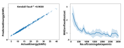
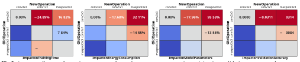
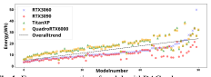
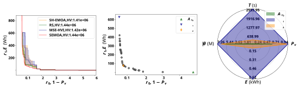
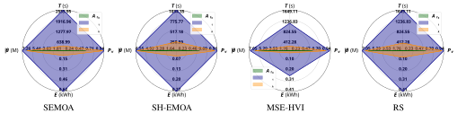

# **EC-NAS: ENERGY CONSUMPTION AWARE TABULAR BENCHMARKS FOR NEURAL ARCHITECTURE SEARCH** 

_Pedram Bakhtiarifard__†_ 

_Christian Igel__†_ _Raghavendra Selvan__†∗_ 

_†_ Department of Computer Science, University of Copenhagen, Denmark 

## **ABSTRACT** 

Energy consumption from the selection, training, and deployment of deep learning models has seen a significant uptick recently. This work aims to facilitate the design of energyefficient deep learning models that require less computational resources and prioritize environmental sustainability by focusing on the energy consumption. Neural architecture search (NAS) benefits from tabular benchmarks, which evaluate NAS strategies cost-effectively through pre-computed performance statistics. We advocate for including energy efficiency as an additional performance criterion in NAS. To this end, we introduce an enhanced tabular benchmark encompassing data on energy consumption for varied architectures. The benchmark, designated as EC-NAS1 , has been made available in an open-source format to advance research in energy-conscious NAS. EC-NAS incorporates a surrogate model to predict energy consumption, aiding in diminishing the energy expenditure of the dataset creation. Our findings emphasize the potential of EC-NAS by leveraging multi-objective optimization algorithms, revealing a balance between energy usage and accuracy. This suggests the feasibility of identifying energy-lean architectures with little or no compromise in performance. 

**_Index Terms_ —** Energy-aware benchmark, neural architecture search, sustainable machine learning, multi-objective optimization 

## **1. INTRODUCTION** 

Neural Architecture Search (NAS) strategies, which explore model architectures based on training and evaluation metrics, have demonstrated their ability to reveal novel designs with state-of-the-art performance [1, 2, 3]. While promising, NAS comes with computational and energy-intensive demands, leading to significant environmental concerns due to the carbon footprint incurred due to energy consumption [4, 5, 6]. Given the rapidly increasing computational requirements of deep learning models [7], there is an imperative to address the balance between performance and resource efficiency. 

> _∗_ The authors acknowledge funding received under European Union’s Horizon Europe Research and Innovation programme under grant agreements No. 101070284 and No. 101070408. 

> 1Source code is available at: https://github.com/saintslab/ EC-NAS-Bench 

**Fig. 1** . Scatter plot of about 423k CNN architectures showing training energy ( _E_ ) vs. validation performance ( _Pv_ ) across four training budgets. Solutions in the top-right (red ellipse) prioritize performance at high energy costs. Joint optimization shifts preferred solutions to the left (green ellipse), indicating reduced energy with minimal performance loss. 

Efficient evaluation of NAS strategies has gained traction, using pre-computed performance statistics in tabular benchmarks and the use of surrogate and one-shot models [8, 9, 10, 2, 11]. Nevertheless, the primary focus remains on performance, with the trade-offs between performance and energy efficiency often overlooked. This trade-off is visually represented in Figure 1, illustrating the potential to find energyefficient models without compromising performance. Aligning with recent advancements in energy-aware NAS research, we advocate for integrating energy consumption as a pivotal metric in tabular NAS benchmarks. We aim to uncover inherently efficient deep learning models, leveraging pre-computed energy statistics for sustainable model discovery. This perspective is supported by recent works, such as the EA-HASBench [12], which emphasizes the trade-offs between performance and energy consumption. Furthermore, the diverse applications of NAS in areas like speech emotion recognition [13] and visual-inertial odometry [14] underscore its versatility and the need for efficiency. 

## **2. ENERGY AWARENESS IN NAS** 

Building upon the foundational NAS-Bench-101 [10], we introduce our benchmark, EC-NAS, to accentuate the imperative of energy efficiency in NAS. Our adaptation of this dataset, initially computed using an exorbitant 100 TPU years equivalent of compute time, serves our broader mission of steering NAS methodologies towards energy consumption awareness. 

## **2.1. Architectural Design and Blueprint** 

Central to our method are architectures tailored for CIFAR10 image classification [15]. We introduce additional objectives for emphasizing the significance of hardware-specific efficiency trends in deep learning models. The architectural space is confined to the topological space of cells, with each cell being a configurable feedforward network. In terms of cell encoding, these individual cells are represented as directed acyclic graphs (DAGs). Each DAG, _G_ ( _V, M_ ), has _N_ = _|V |_ vertices (or nodes) and edges described in a binary adjacency matrix _M ∈{_ 0 _,_ 1 _}__N×N_ . The set of operations (labels) that each node can realise = = is given by _L__′_ _{_ `input` _,_ `output` _} ∪L_ , where _L {_ `3x3conv` _,_ `1x1conv` _,_ `3x3maxpool` _}_ . Two of the _N_ nodes are always fixed as `input` and `output` to the network. The remaining _N −_ 2 nodes can take up one of the labels in _L_ . The connections between nodes of the DAG are encoded in the upper-triangular adjacency matrix with no self-connections (zero main diagonal entries). For a given architecture, _A_ , every entry _αi,j ∈ MA_ denotes an edge, from node _i_ to node _j_ with operations _i, j ∈L_ and its labelled adjacency matrix, _LA ∈ MA × L__′_ . 

## **2.2. Energy Measures in NAS** 

Traditional benchmarks, while insightful, often fall short of providing a complete energy consumption profile. In EC-NAS, we bring the significance of energy meaures to the forefront, crafting a comprehensive view that synthesizes both hardware and software intricacies. The mainstays of neural network training – GPUs and TPUs – are notorious for their high energy consumption [6, 16]. To capture these nuances, we utilize and adopt the Carbontracker tool [6] to our specific needs, allowing us to observe total energy costs, computational times, and aggregate carbon footprints. 

## **2.3. Surrogate Model for Energy Estimation** 

The landscape of NAS has transformed to encompass a broader spectrum of metrics. Energy consumption, pivotal during model training, offers insights beyond the purview of traditional measures such as floating-point operations (FPOPs) and computational time. Given the variability in computational time, owing to diverse factors like parallel infrastructure, this metric can occasionally be misleading. 

**Fig. 2** . Scatter plot depicting the Kendall-Tau correlation coefficient between predicted and actual energy consumption (left) and the influence of training data size on test accuracy (right). Error bars are based on 10 random initializations. 

Energy consumption, in contrast, lends itself as a more consistent and comprehensive measure, factoring in software and hardware variations. We measure the energy consumption of training the architectures on the CIFAR-10 dataset, following the protocols to NAS-Bench-101. The in-house SLURM cluster, powered by an NVIDIA Quadro RTX 6000 GPU and two Intel CPUs, provides an optimal environment. 

The vast architecture space, however, introduces challenges in the direct energy estimation. Our remedy to this is a surrogate model approach, wherein we derived insights to guide a multi-layer perceptron (MLP) model by training using a representative subset of architectures. This surrogate model adeptly predicts energy consumption patterns, bridging computational demand and energy efficiency. Its efficacy is highlighted by the strong correlation between its predictions and actual energy consumption values, as illustrated in Figure 2. 

## **2.4. Dataset Analysis and Hardware Consistency** 

Understanding architectural characteristics and the trade-offs they introduce is crucial. This involves studying operations, their impacts on efficiency and performance, as well as the overarching influence of hardware on energy costs. Training time and energy consumption trends naturally increase with model size. However, gains in performance tend to plateau for models characterized by larger DAGs. Interestingly, while parameter variation across model sizes remains minimal, training time and energy consumption show more significant variability for more extensive models. These findings highlight the multifaceted factors affecting performance and efficiency. 

Different operations can also have a profound impact on performance. For instance, specific operation replacements significantly boost validation accuracy while increasing energy consumption without increasing training time. This complex relationship between training time, energy consumption and performance underscore the importance of a comprehensive approach in NAS. The impact of swapping one operation for another on various metrics, including energy consumption, training time, validation accuracy, and parameter count, is captured in Figure 3. 

In EC-NAS, we further probed the energy consumption 

**Fig. 3** . Aggregated impact of swapping one operator for another on energy consumption, training time, validation accuracy, and parameter count. The figure illustrates how changing a single operator can affect the different aspects of model performance, emphasizing the importance of selecting the appropriate operators to balance energy efficiency and performance. 

**Fig. 4** . Energy consumption of models with DAGs where _|V | ≤_ 4 on different GPUs. Models are organized by their average energy consumption for clarity. 

patterns of models characterized by DAGs with _|V | ≤_ 4, spanning various GPUs. This exploration, depicted in Figure 4, confirms the flexibility of the benchmark across different hardware environments. This adaptability paves the way for advanced NAS strategies, notably for multi-objective optimization (MOO). It signifies a paradigm shift towards a balanced pursuit of performance and energy efficiency, echoing the call for sustainable computing. 

## **3. LEVERAGING** EC-NAS **IN NAS STRATEGIES** 

Tabular benchmarks like EC-NAS offer insights into energy consumption alongside traditional performance measures, facilitating the exploration of energy-efficient architectures using multi-objective optimization (MOO) whilst emphasizing the rising need for sustainable computing. 

**Role of Multi-objective Optimization in NAS** : In the context of NAS, MOO has emerged as an instrumental approach for handling potentially conflicting objectives. We utilize the EC-NAS benchmark to apply diverse MOO algorithms, encompassing our own simple evolutionary MOO algorithm (SEMOA) based on [17] and other prominent algorithms such as SH-EMOA and MS-EHVI from [18]. These methodologies are assessed against the conventional random rearch (RS) technique. 

Our exploration within EC-NAS span both single-objective optimization (SOO) and MOO. We execute algorithms across various training epoch budgets _e ∈{_ 4 _,_ 12 _,_ 36 _,_ 108 _}_ over 100 evolutions with a population size of 10. For SOO, 1000 evolutions were designated to equate the discovery potential. Results, averaged over 10 trials, followed the methodology of [18]. 

For MOO, validation accuracy _Pv_ and the training energy 

|**Method**|**Arch.**|**_T_ (****_s_)** **_↓_**|**_Pv ↑_**|**_E_(kWh)****_↓_**|**_|θ|_(M)****_↓_**|
|---|---|---|---|---|---|
||_A_**r**0|15.22_±_2_._98|0.52_±_0_._02|0.01_±_0_._00|5.98_±_0_._10|
|**SH-EMOA**|_A_**r**1|1034.35_±_358_._15|0.91_±_0_._03|0.27_±_0_._11|6.55_±_0_._44|
||_A_**r**_k_|226.28_±_114_._03|0.85_±_0_._04|0.04_±_0_._03|6.27_±_0_._43|
||_A_**r**0|14.23_±_0_._00|0.52_±_0_._00|0.01_±_0_._00|5.95_±_0_._00|
|**RS**|_A_**r**1|1649.11_±_342_._02|0.94_±_0_._00|0.41_±_0_._09|7.05_±_0_._18|
||_A_**r**_k_|310.93_±_56_._50|0.89_±_0_._03|0.07_±_0_._03|6.51_±_0_._38|
||_A_**r**0|14.23_±_0_._00|0.52_±_0_._00|0.01_±_0_._00|5.95_±_0_._00|
|**MSE-HVI**|_A_**r**1|1112.13_±_642_._49|0.92_±_0_._02|0.25_±_0_._14|6.80_±_0_._33|
||_A_**r**_k_|191.09_±_93_._13|0.83_±_0_._03|0.02_±_0_._02|6.01_±_0_._18|
||_A_**r**0|14.23_±_0_._00|0.52_±_0_._00|0.01_±_0_._00|5.95_±_0_._00|
|**SEMOA**|_A_**r**1|2555.95_±_202_._42|0.94_±_0_._00|0.62_±_0_._08|7.26_±_0_._15|
||_A_**r**_k_|306.9_±_41_._86|0.92_±_0_._01|0.07_±_0_._01|6.43_±_0_._06|

**Table 1** . Average performance and resource consumption for models. Architectures _A_ **r** 0, _A_ **r** 1, and _A_ **r** _k_ correspond to the two extrema and the knee point, respectively. 

cost, _E_ (in kWh), were chosen as the dual objectives and, for SOO, simply the performance metric. Given its indifference to parallel computing, energy consumption was chosen over training time. Inverse objectives were used for optimization in maximization tasks (e.g., 1 _− Pv_ ). 

**Trade-offs in Energy Efficiency and Performance** : Balancing energy efficiency with performance presents a layered challenge in NAS. Figure 5 elucidates the architectural intricacies and the prowess of various MOO algorithms in identifying energy-conservative neural architectures. 

Figure 5 (left) evaluates the architecture discovery efficacy of MOO algorithms, presenting the median solutions achieved over multiple runs. SEMOA, in particular, showcases an even distribution of models attributed to its ability to exploit model locality. In contrast, SH-EMOA and MSE-HVI display a more substantial variation, highlighting the robust search space exploration of SEMOA. 

The Pareto front, as depicted in Figure 5 (center), highlights extrema ( _r_ 0 _, r_ 1) and the knee point ( _rk_ ), which represents an optimal trade-off between objectives. The extrema prioritize energy efficiency or validation accuracy, while the knee point achieves a balanced feature distribution. MOO algorithms’ capability to navigate the NAS space effectively is evident in their identification of architectures that balance competing objectives. 

## **4. DISCUSSIONS** 

**Single versus Multi-objective Optimisation** : Figure 5 and Table 1 capture the performance trends of solutions, eluci- 

**Fig. 5** . (Left) The attainment curve showing median solutions for 10 random initializations on the surrogate 7V space from EC-NAS dataset. (Center) A representation of the Pareto front for one run of SEMOA. (Right) Summary of metrics for the extrema and knee point architectures for one SEMOA run. 

dating that knee point solutions, _Ark_ , offer architectures with about 70% less energy consumption with only a 1% performance degradation. Depending on specific applications, this might be an acceptable trade-off. If performance degradation is unacceptable, the Pareto front also provides alternative candidate solutions. For instance, extremum solution _Ar_ 0 achieves nearly the same performance as the SOO solution but consumes about 32% less energy. This trend is consistent across various solutions. 

**Training Time vs. Energy Consumption** : While the original NAS-Bench-101 dataset reports training time, it cannot replace energy consumption as a metric. Even though training time generally correlates with energy consumption in single hardware regimes, the scenario changes with large-scale parallelism on multiple GPUs. Aggregate energy consumption encompasses parallel hardware and its associated overheads. Even in single GPU scenarios, energy consumption provides insights into energy-efficient models. For instance, a small architecture might consume more energy on a large GPU due to under-utilization. 

**Energy-Efficient Tabular NAS Benchmarks** : Despite the immense one-time cost of generating tabular benchmark, these benchmarks have proven highly useful for efficient evaluation of NAS strategies. For instance, our EC-NAS dataset, predicting metrics after training models for only 4 epochs, results in a 97% reduction compared to a dataset creation from scratch. Other techniques such as predictive modelling based on learning curves [19], gradient approximations [20], and surrogate models fitted to architecture subsets [9] also prove very useful in creating new architecture spaces to consider. However, incorporating energy consumption metrics is frequently overlooked and challenges arise in integrating with existing NAS strategies. This is considering NAS benchmarks and strategies and closely intertwined, which often restricts benchmarks to tailored strategies. 

**Carbon-footprint Aware NAS** : The EC-NAS dataset provides various metrics for each architecture. By using MOO, NAS can directly optimize the carbon footprint of models. Although instantaneous energy consumption and carbon 

footprint are linearly correlated, fluctuations in instantaneous regional carbon intensities can introduce discrepancies during extended training periods [6]. By reporting the carbon footprint of model training in EC-NAS, we facilitate carbonfootprint-aware NAS [21]. In this work, our focus remains on energy consumption awareness, sidestepping the temporal and spatial variations of carbon intensity. 

**Energy Consumption Aware Few-shot NAS** : While tabular benchmarks like NAS-Bench-101 [10] facilitate efficient exploration of various NAS strategies, they are constrained to specific architectures and datasets. Addressing this challenge involves one- or few-shot learning methods [22, 11]. A bridge between few-shot and surrogate tabular benchmarks emerges by combining surrogate models for predicting learning dynamics [9] with energy measurements. We have illustrated integrating surrogate models with existing tabular benchmarks, seamlessly extending these to surrogate benchmarks. **Limitations** : Our proposed approach has certain limitations. To manage the search space, which expands exponentially with the number of vertices in the network specification DAGs, we have limited the vertices count to _≤_ 7, in line with NAS-Bench-101[10]. Moreover, in EC-NAS, we utilized surrogate time and energy measurements, sidestepping the variability of training time. Despite these limitations, which primarily aim to conserve energy in experiments, the insights from these experiments can be extrapolated to broader architectural spaces. 

## **5. CONCLUSION** 

We have enriched an established NAS benchmark by incorporating energy consumption and carbon footprint measures. EC-NAS, encompassing _>_ 1 _._ 6 _M_ entries, was crafted using an accurate surrogate model that predicts energy consumption. By showcasing Pareto-optimal solutions through MOO methods, we illuminate the potential for achieving significant energy reductions with minimal performance compromises. With its diverse metrics, EC-NAS invites further research into developing energy-efficient and environmentally sustainable models. 

## **6. REFERENCES** 

- [1] Pengzhen Ren, Yun Xiao, Xiaojun Chang, Po-Yao Huang, Zhihui Li, Xiaojiang Chen, and Xin Wang, “A comprehensive survey of neural architecture search: Challenges and solutions,” _ACM Computing Surveys_ , vol. 54, no. 4, pp. 1–34, 2021. 

- [2] Ming Lin, Pichao Wang, Zhenhong Sun, Hesen Chen, Xiuyu Sun, Qi Qian, Hao Li, and Rong Jin, “Zen-NAS: A Zero-Shot NAS for High-Performance Deep Image Recognition,” in _International Conference on Computer Vision (ICCV)_ , 2021. 

- [3] Bowen Baker, Otkrist Gupta, Ramesh Raskar, and Nikhil Naik, “Accelerating neural architecture search using performance prediction,” in _International Conference on Learning Representations (ICLR) - Workshop Track_ , 2017. 

- [4] Mingxing Tan and Quoc Le, “Efficientnet: Rethinking model scaling for convolutional neural networks,” in _International Conference on Machine Learning (ICML)_ , 2019. 

- [5] Roy Schwartz, Jesse Dodge, Noah A Smith, and Oren Etzioni, “Green AI,” _Communications of the ACM_ , vol. 63, no. 12, pp. 54–63, 2020. 

- [6] Lasse F. Wolff Anthony, Benjamin Kanding, and Raghavendra Selvan, “Carbontracker: Tracking and Predicting the Carbon Footprint of Training Deep Learning Models,” ICML Workshop on Challenges in Deploying and monitoring Machine Learning Systems, 2020. 

- [7] Jaime Sevilla, Lennart Heim, Anson Ho, Tamay Besiroglu, Marius Hobbhahn, and Pablo Villalobos, “Compute trends across three eras of machine learning,” in _International Joint Conference on Neural Networks (IJCNN)_ , 2022. 

- [8] Aaron Klein and Frank Hutter, “Tabular benchmarks for joint architecture and hyperparameter optimization,” Arxiv, 2019. 

- [9] Arber Zela, Julien Niklas Siems, Lucas Zimmer, Jovita Lukasik, Margret Keuper, and Frank Hutter, “Surrogate NAS benchmarks: Going beyond the limited search spaces of tabular NAS benchmarks,” in _International Conference on Learning Representations (ICLR)_ , 2022. 

- [10] Chris Ying, Aaron Klein, Eric Christiansen, Esteban Real, Kevin Murphy, and Frank Hutter, “NASBench-101: Towards reproducible neural architecture search,” in _International Conference on Machine Learning (ICML)_ , 2019. 

- [11] Arber Zela, Julien Siems, and Frank Hutter, “NASBench-1Shot1: Benchmarking and dissecting one-shot neural architecture search,” in _International Conference on Learning Representations (ICLR)_ , 2020. 

- [12] Shuguang Dou, Xinyang Jiang, Cai Rong Zhao, and Dongsheng Li, “EA-HAS-bench: Energy-aware hyperparameter and architecture search benchmark,” in _International Conference on Learning Representations (ICLR)_ , 2023. 

- [13] Xixin Wu, Shoukang Hu, Zhiyong Wu, Xunying Liu, and Helen Meng, “Neural architecture search for speech emotion recognition,” Arxiv, 2022. 

- [14] Yu Chen, Mingyu Yang, and Hun-Seok Kim, “Search for efficient deep visual-inertial odometry through neural architecture search,” in _IEEE International Conference on Acoustics, Speech and Signal Processing (ICASSP)_ , 2023. 

- [15] Alex Krizhevsky, “Learning multiple layers of features from tiny images,” Tech. Rep., Univeristy of Toronto, 2009. 

- [16] Jesse Dodge, Taylor Prewitt, Remi Tachet des Combes, Erika Odmark, Roy Schwartz, Emma Strubell, Alexandra Sasha Luccioni, Noah A. Smith, Nicole DeCario, and Will Buchanan, “Measuring the carbon intensity of ai in cloud instances,” in _Conference on Fairness, Accountability, and Transparency (FAccT)_ , 2022. 

- [17] Oswin Krause, Tobias Glasmachers, and Christian Igel, “Multi-objective optimization with unbounded solution sets,” in _NeurIPS Workshop on Bayesian Optimization (BayesOpt 2016)_ , 2016. 

- [18] Sergio Izquierdo, Julia Guerrero-Viu, Sven Hauns, Guilherme Miotto, Simon Schrodi, Andr´e Biedenkapp, Thomas Elsken, Difan Deng, Marius Lindauer, and Frank Hutter, “Bag of baselines for multi-objective joint neural architecture search and hyperparameter optimization,” in _ICML Workshop on Automated Machine Learning (AutoML)_ , 2021. 

- [19] Shen Yan, Colin White, Yash Savani, and Frank Hutter, “Nas-bench-x11 and the power of learning curves,” _Advances in Neural Information Processing Systems (NeurIPS)_ , 2021. 

- [20] Jingjing Xu, Liang Zhao, Junyang Lin, Rundong Gao, Xu Sun, and Hongxia Yang, “KNAS: green neural architecture search,” in _International Conference on Machine Learning (ICML)_ , 2021. 

- [21] Raghavendra Selvan, Nikhil Bhagwat, Lasse F. Wolff Anthony, Benjamin Kanding, and Erik B. Dam, “Carbon footprint of selecting and training deep learning models for medical image analysis,” in _International Conference on Medical Image Computing and Computer-Assisted Intervention (MICCAI)_ , 2022. 

- [22] Yiyang Zhao, Linnan Wang, Yuandong Tian, Rodrigo Fonseca, and Tian Guo, “Few-shot neural architecture search,” in _International Conference on Machine Learning (ICML)_ , 2021. 

- [23] Rhonda Ascierto and Andy Lawrence, “Uptime Institute global data center survey 2020,” Tech. Rep., Uptime Institute, 07 2020. 

- [24] Adam Paszke, Sam Gross, Francisco Massa, Adam Lerer, James Bradbury, Gregory Chanan, Trevor Killeen, Zeming Lin, Natalia Gimelshein, Luca Antiga, Alban Desmaison, Andreas Kopf, Edward Yang, Zachary DeVito, Martin Raison, Alykhan Tejani, Sasank Chilamkurthy, Benoit Steiner, Lu Fang, Junjie Bai, and Soumith Chintala, “Pytorch: An imperative style, high-performance deep learning library,” in _Advances in Neural Information Processing Systems (NeurIPS))_ . 2019. 

- [25] Diederik P Kingma and Jimmy Ba, “Adam: A method for stochastic optimization,” in _International Conference on Learning Representations_ , 2015. 

- [26] Peter Henderson, Jieru Hu, Joshua Romoff, Emma Brunskill, Dan Jurafsky, and Joelle Pineau, “Towards the systematic reporting of the energy and carbon footprints of machine learning,” _Journal of Machine Learning Research_ , vol. 21, no. 248, pp. 1–43, 2020. 

- [27] Andrew G. Howard, Menglong Zhu, Bo Chen, Dmitry Kalenichenko, Weijun Wang, Tobias Weyand, Marco Andreetto, and Hartwig Adam, “MobileNets: Efficient convolutional neural networks for mobile vision applications,” _arXiv preprint arXiv:1704.04861_ , 2017. 

- [28] Yunho Jeon and Junmo Kim, “Constructing fast network through deconstruction of convolution,” _Advances in Neural Information Processing Systems_ , 2018. 

- [29] Lucas Høyberg Puvis de Chavannes, Mads Guldborg Kjeldgaard Kongsbak, Timmie Rantzau, and Leon Derczynski, “Hyperparameter power impact in transformer language model training,” in _Proceedings of the Second Workshop on Simple and Efficient Natural Language Processing_ , Virtual, Nov. 2021, pp. 96–118, Association for Computational Linguistics. 

- [30] Eckart Zitzler and Lothar Thiele, “Multiobjective evolutionary algorithms: A comparative case study and the strength Pareto approach,” _IEEE Transactions on Evolutionary Computation_ , vol. 3, no. 4, pp. 257–271, 1999. 

- [31] Eckart Zitzler, Lothar Thiele, Marco Laumanns, Carlos M. Fonseca, and Viviane Grunert da Fonseca, “Performance assessment of multiobjective optimizers: An analysis and review,” _IEEE Transactions on Evolutionary Computation_ , vol. 7, no. 2, pp. 117–132, 2003. 

- [32] Karl Bringmann, Tobias Friedrich, Christian Igel, and Thomas Voß, “Speeding up many-objective optimization by Monte Carlo approximations,” _Artificial Intelligence_ , vol. 204, pp. 22–29, 2013. 

- [33] Karl Bringmann and Tobias Friedrich, “Approximation quality of the hypervolume indicator,” _Artificial Intelligence_ , vol. 195, pp. 265–290, 2013. 

- [34] Nicola Beume, Boris Naujoks, and Michael Emmerich, “SMS-EMOA: Multiobjective selection based on dominated hypervolume,” _European Journal of Operational Research_ , vol. 181, no. 3, pp. 1653–1669, 2007. 

- [35] Christian Igel, Nikolaus Hansen, and Stefan Roth, “Covariance matrix adaptation for multi-objective optimization,” _Evolutionary Computation_ , vol. 15, no. 1, pp. 1– 28, 2007. 

- [36] Johannes Bader and Eckart Zitzler, “HypE: An algorithm for fast hypervolume-based many-objective optimization,” _Evolutionary computation_ , vol. 19, no. 1, pp. 45–76, 2011. 

- [37] James Edward Baker, “Adaptive selection methods for genetic algorithms,” in _International Conference on Genetic Algorithms and their Applications_ , 1985, vol. 1. 

- [38] John J. Greffenstette and James E. Baker, “How genetic algorithms work: A critical look at implicit parallelism,” in _International Conference on Genetic Algorithms_ , 1989, pp. 20–27. 

## **A. ADDITIONAL BENCHMARKS AND METRICS** 

For all benchmarks in EC-NAS, we report on operations, parameter count and performance metrics, similar to NASBench-101, with the addition of energy consumption. However, we introduce separate benchmarks for models characterized by DAGs with _|V | ≤_ 4 and _|V | ≤_ 5, denoted the 4V and 5V space, respectively, where we also detail the carbon footprint. For the 4V and 5V spaces the energy efficiency metrics are derived from direct measurements, independent of surrogate modeling. These datasets were compiled by performing exhaustive model training limited to 4 epochs, with the resource costs for the remaining epochs extrapolated through linear scaling. 

The primary focus for efficiency metrics is quantifying resource costs specific to model training, however, we also report total resource costs, including computational overheads, e.g., data movements. Lastly, we include the average energy consumption of computing hardware. A complete overview of the metrics relevant to this work is presented in Table 2. 

|**Metrics**|**Unit of measurement**|**Notation**|
|---|---|---|
|Model parameters|Million (M)|_|θ|_|
|Test/Train/Eval. time|Seconds (s)|_T_(_s_)|
|Test/Train/Val. Acc.|R_∈_[0; 1]|_Pv_|
|Energy consumption|Kilowatt-hour (kWh)|_E_(kWh)|
|Power consumption|Joule (J), Watt (W)|_E_(J),_E_(W)|
|Carbon footprint|kgCO2eq|–|
|Carbon intensity|g/kWh|–|

**Table 2** . Metrics reported in EC-NAS-Bench. 

## **B. MEASUREMENTS FROM CARBONTRACKER** 

Our measurements account for the energy consumption of Graphics Processing Units (GPUs), Central Processing Units (CPUs), and Dynamic Random Access Memory (DRAM), with the CPU energy usage inclusive of DRAM power consumption. Energy usage data is collected and logged at 10second intervals, and this information is averaged over the duration of model training. The total energy consumed is then calculated and reported in kilowatt-hours (kWh), where 1kWh = 3 _._ 6 _·_ 106 Joules (J). In addition, we assess the emission of greenhouse gases (GHG) in terms of carbon dioxide equivalents (CO2eq), calculated by applying the carbon intensity metric, which denotes the CO2eq emitted per kWh of electricity generated. This carbon intensity data is updated every 15 minutes during model training from a designated provider. 

|**SPACE**|**RED. GPU DAYS**|**RED. KWH**|**RED. KGCO2EQ**|
|---|---|---|---|
|4V|3.758|48.931|6.327|
|5V|121.109|1970.495|252.571|
|7V|14037.058|259840.907|–|

**Table 3** . Estimated reduction in actual resource costs when creating EC-NAS dataset for the 4V and 5V using linear scaling and 7V space using the surrogate model. 

However, considering only the direct energy consumption of these components does not fully capture the carbon footprint of model training, as it overlooks the energy consumption of auxiliary infrastructure, such as data centers. To address this, we refine our estimations of energy usage and carbon footprint by incorporating the 2020 global average Power Usage Effectiveness (PUE) of data centers, which stands at 1.59, as reported in [23]. 

## **C. SURROGATE MODEL IMPLEMENTATION** 

We use a simple four-layered MLP with gelu( _·_ ) activation functions, except for the final layer, which transforms the input in this sequence 36 _→_ 128 _→_ 64 _→_ 32 _→_ 1. 

The surrogate energy model is trained using actual energy measurements from 4310 randomly sampled architectures from the 7V space. The model was implemented in Pytorch [24] and trained on a single NVIDIA RTX 3060 GPU. We use a training, validation and test split of ratio [0 _._ 7 _,_ 0 _._ 1 _,_ 0 _._ 2] resulting in [3020 _,_ 430 _,_ 860] data points, respectively. The MLP, _fθ_ ( _·_ ), is trained for 200 epochs with an initial learning rate of 5 _×_ 10_−_3 to minimise the _L_ 1-norm loss function between the predicted and actual energy measurements using the Adam optimiser [25]. 

## **D. ADDITIONAL DISCUSSION** 

**Resource constraind NAS.** Resource-constrained NAS for obtaining efficient architectures has been explored mainly by 

optimising the run-time or the number of floating point operations (FPOs). For instance, the now widely popular EfficientNet architecture was discovered using a constraint of FPOs [4]. Optimising for FPOs, however, is not entirely indicative of the efficiency of models [26]. It has been reported that models with fewer FPOs could have bottleneck operations that consume the bulk of the training time [27], and some models with higher FPOs might have lower inference time [28]. Energy consumption optimised hyperparameter selection outside of NAS settings for large language models has been recently investigated in [29]. 

**Surrogate model adaptability.** Our surrogate energy model is promising in predicting energy consumption within our current search space. We have also adapted the surrogate model to the OFA search space, achieving comparable results in terms of energy consumption prediction. This suggests the potential for the surrogate model to be generalized and applied to other search spaces, broadening its applicability and usefulness in future research. Estimates for reduction in compute costs for the EC-NAS benchmark datasets are presented in Table 3. While a comprehensive investigation of the surrogate model’s performance in different search spaces is beyond the scope of this work, it is worth noting that the model could potentially serve as a valuable tool for researchers seeking to optimize energy consumption and other efficiency metrics across various architectural search spaces. Further studies focusing on the adaptability and performance of surrogate models in diverse search spaces will undoubtedly contribute to developing more efficient and environmentally sustainable AI models. 

**Hardware accelerators.** Hardware accelerators have become increasingly efficient and widely adopted for edge computing and similar applications. These specialized devices offer significant performance improvements and energy efficiency, allowing faster processing and lower power consumption than traditional computing platforms. However, deriving general development principles and design directions from these accelerators can be challenging due to their highly specialized nature. Moreover, measuring energy efficiency on such devices tends to be hardware-specific, with results that may need to be more easily transferable or applicable to other platforms. Despite these challenges, we acknowledge the importance and necessity of using hardware accelerators for specific applications and recognize the value of development further to improve energy efficiency and performance on these specialized devices. 

## **E. MULTI-OBJECTIVE OPTIMISATION** 

Formally, let the MOO problem be described by **_f_** : X _→_ R_m_ _,_ **_f_** ( _x_ ) _�→_ ( _f_ 1( _x_ ) _, . . . , fm_ ( _x_ )). Here X denotes the search space of the optimisation problem and _m_ refers to the number of objectives. We assume w.l.o.g. that all objectives are to be minimized. For two points _x, x__′_ _∈_ X we say that _x__′_ _dominates_ 

**Fig. 6** . Average performance and resource consumption across models for all baseline methods, including SEMOA. Architectures _A_ **r** 0, _A_ **r** 1, and _A_ **r** _k_ denote the two extremes and the knee point, respectively. For precise numerical data, refer to Table 1. 

_x_ and write _x__′_ _≺ x_ if _∀i ∈{_ 1 _, . . . , m}_ : _fi_ ( _x__′_ ) _≤ fi_ ( _x_ ) _∧∃j ∈ {_ 1 _, . . . , m}_ : _fj_ ( _x__′_ ) _< fj_ ( _x_ ). For _X__′_ _, X__′′_ _⊆_ X we say that _X__′_ dominates _X__′′_ and write _X__′_ _≺ X__′′_ if _∀x__′′_ _∈ X__′′_ : _∃x__′_ _∈ X__′_ : _x__′_ _≺ X__′′_ . The subset of non-dominated solutions in a set _X__′_ _⊆_ X is given by ndom( _X__′_ ) = _{x | x ∈ X__′_ _∧_ ∄ _x__′_ _∈ X__′_ _\ {x}_ : _x__′_ _≺ x}_ . The _Pareto front_ of a set _X__′_ _⊂_ X defined as _F_ ( _X__′_ ) = _{_ **_f_** ( _x_ ) _| x ∈_ ndom( _X__′_ ) _}_ and, thus, the goal of MOO can be formalised as approximating _F_ (X). 

In iterative MOO, the strategy is to step-wise improve a set of candidate solutions towards a sufficiently good approximation of _F_ (X). For the design of a MOO algorithm, it is important to have a way to rank two sets _X__′_ and _X__′′_ w.r.t. the overall MOO goal even if neither _X__′_ _≺ X__′′_ nor _X__′′_ _≺ X__′_ . This ranking can be done by the hypervolume measure. The hypervolume measure or _S_ -metric (see [30]) of a set _X__′_ _⊆_ X is the volume of the union of regions in R_m_ that are dominated by _X__′_ and bounded by some appropriately chosen reference point **_r_** _∈_ R_m_ : 

$$
Sr(X′) := Λ �� x\in{}{}X′ � f1(x), r1 � \times{}{} \cdot{}{} \cdot{}{} \cdot{}{} \times{}{} � fm(x), rm � � ,
$$

where Λ( _·_ ) is the Lebesgue measure. The hypervolume is, up to weighting objectives, the only strictly Pareto compliant measure [31] in the sense that given two sets _X__′_ and _X__′′_ we have _S_ ( _X__′_ ) _> S_ ( _X__′′_ ) if _X__′_ dominates _X__′′_ . As stated by [32], the worst-case approximation factor of a Pareto front _F_ ( _X__′_ ) obtained from any hypervolume-optimal set _X__′_ with size _|X__′_ _|_ = _µ_ is asymptotically equal to the best worst-case approximation factor achievable by any set of size _µ_ , namely Θ(1 _/µ_ ) for additive approximation and 1 + Θ(1 _/µ_ ) for relative approximation [33]. Now we define the _contributing hypervolume_ of an individual _x ∈ X__′_ as 

$$
∆r(x, X′) := Sr(X′) -Sr(X′ \backslash{} {x}) .
$$

The value ∆( _x, X__′_ ) quantifies how much a candidate solution _x_ contributed to the total hypervolume of _X__′_ and can be regarded as a measure of the relevance of the point. Therefore, 

the contributing hypervolume is a popular criterion in MOO algorithms [34, 35, 36, 17]. If we iteratively optimize some solution set _P_ , then points _x_ with low ∆( _x, P_ ) are candidates in an already crowded region of the current Pareto front _F_ ( _P_ ), while points with high ∆( _x, P_ ) mark areas that are promising to explore further. 

## **E.1. SEMOA: Simple Evolutionary Multi-objective Optimisation Algorithm** 

In this study, we used a simple MOO algorithm based on hypervolume maximisation outlined in Algorithm 1 inspired by [17]. The algorithm iteratively updates a set _P_ of candidate solutions, starting from a set of random network architectures. Dominated solutions are removed from _P_ . Then _λ_ new architectures are generated by first selecting _λ_ architectures from _P_ and then modifying these architectures according to the perturbation described in Procedure 2. The _λ_ new architectures are added to _P_ and the next iteration starts. In Procedure 2, the probability _p_ edge for changing (i.e., either adding or removing) an edge is chosen such that in expectation, two edges are changed, and the probability _p_ node for changing a node is set such that in expectation every second perturbation changes the label of a node. 

The selection of the _λ > m_ architectures from the current solution set is described in Procedure 3. We always select the _extreme points_ in _P_ that minimize a single objective (thus, the precise choice of the reference point **_r_** is of lesser importance). The other _m − λ_ points are randomly chosen preferring points with higher contributing hypervolume. The points in _P_ are ranked according to their hypervolume contribution. The probability of being selected depends linearly on the rank. We use _linear ranking selection_ [37, 38], where the parameter controlling the slope is set to _η_+ = 2. Always selecting the extreme points and focusing on points with large contributing hypervolume leads to a wide spread of nondominated solutions. 

## **Algorithm 1** SEMOA for NAS strategy 

**Input:** objective **_f_** = ( _f_ 1 _, . . . , fm_ ), maximum number of iterations _n_ **Output:** set of non-dominated solutions _P_ 

|1:|Initialize_P ⊂_X(e.g., randomly)|_▷_Initial random architectures|
|---|---|---|
|2:|_P ←_ndom(_P_)|_▷_Discard dominated solutions|
|3:|**for**_i ←_1to_n_**do**|_▷_Loop over iterations|
|4:|_O ←_LinearRankSample(_P_,_λ_)|_▷_Get_λ_points from_P_|
|5:|_O ←_Perturb(_O_)|_▷_Change the architectures|
|6:|Compute**_f_**(_x_)for all_x ∈O_|_▷_Evaluate architectures|
|7:|_P ←_ndom(_P ∪O_)|_▷_Discard dominated points|
|8:|**end for**||
|9:|**return**_P_||

## **Procedure 2** Perturb( _O_ <u>)</u> 

|**Inp** **Ou**|**ut:** set of architectures _O_, variation probabilities for edges and nodes _p_edge and_p_node **tput:** set of modified architecture_O__∗_|
|---|---|
|1:  2:|**for all**_MA ∈O_**do** _▷_Loop over matrices **repeat**|
|3:|**for all**_αi,j ∈MA_ **do** _▷_Loop over entries|
|4: |With probability_p_edge flip_αi,j_ |
|5: |**end for**    |
|6:|**for all**_l ∈LA_ **do** _▷_Loop over labels|
|7:|With probability_p_node change the label of_l_|
|8:|**end for**|
|9:|**until**_MA_ has changed|
|10:|**end for**|
|11:|**return**_O__∗_|

## **Procedure 3** LinearRankSample( _P_ , _λ_ ) 

**Input:** set _P ⊂_ X of candidate solutions, number _λ_ of elements to be selected; reference point **_r_** _∈_ R_m_ , parameter controlling the preference for better ranked points _η_+ _∈_ [1 _,_ 2] 

**Output:** _O ⊂ P_ , _|O|_ = _λ_ 

1: _O_ = _∅_ 2: **for** _i ←_ 1 to _m_ **do** 3: _O ← O ∪_ argmin _x∈P fi_ ( _x_ ) _▷_ Always add extremes 4: **end for** 5: Compute ∆ **_r_** ( _x, P_ ) for all _x ∈ P ▷_ Compute contributing hypervolume 6: Sort _P_ according to ∆( _x, P_ ) 7: Define discrete probability distribution _π_ over _P_ where 

$$
πi = 1 |P| � η+ -2(η+ -1) i -1 |P| -1 �
$$

is the probability of the element _xi_ with the _i_ th largest contributing hypervolume 

8: **for** _i ←_ 1 to _λ − m_ **do** _▷_ Randomly select remaining points 9: Draw _x ∼ π ▷_ Select points with larger ∆ **_r_** with higher probability 10: _O ← O ∪ x_ 

11: **end for** 12: **return** _O_ 

## **E.2. Multi-objective Optimization Baselines** 

**Hyperparameters for the MOO Baseline Methods** All baseline methods employ EC-NAS for exploring and optimizing architectures. We select hyperparameters for each method to prevent unfair advantages due to increased computation time, such as the number of iterations or function evaluations. Despite allocating similar resources to the baseline methods, assessing fairness in their comparison is challenging due to the disparity in their algorithmic approaches. To mitigate uncertainties in the results, we average the outcomes over 10 experiments using different initial seeds, providing a measure of variability. 

We adopt the bag-of-baselines implementation presented in [18] for compatibility with the tabular benchmarks of EC-NAS. Additionally, we implement the previously presented MOO algorithm SEMOA within the same framework as the baseline methods to ensure consistency. Here, we provide further details on the modifications and characteristics of the baseline methods. Summary of metrics for each method over all runs can be seen in Figure 6. 

**Random Search** Unlike other methods, Random Search does not utilize evolutionary search heuristics to optimize architectures in the search space. It does not inherently consider multiple objectives but relies on processing each randomly queried model. Specifically, all queried architectures are stored, and a Pareto front is computed over all models to obtain the MOO interpretation of this method. We allow 1,000 queries for this search scheme. 

**Speeding up Evolutionary Multi-Objective Algorithm (SH-EMOA)** We initialize SH-EMOA with a population size of 10 and limit the search to 100 function evaluations for budgets between 4 and 108. The algorithm is constrained to use budgets of 4, 12, 36, and 108, available in our search space. The remaining hyperparameters are set to default values, including a uniform mutation type for architecture perturbation and a tournament-style parent selection for offspring generation. 

**Mixed Surrogate Expected Hypervolume Improvement (MS-EHVI)** This evolutionary algorithm is also initialized with a population size of 10 and limited to 100 evolutions. We provide an auxiliary function to discretize parameters to accommodate the experimental setup using tabular benchmarks. MS-EHVI integrates surrogate models to estimate objective values and employs the expected hypervolume improvement criterion to guide the search. This combination allows for an efficient exploration and exploitation of the search space, especially when dealing with high-dimensional and multi-objective problems. 

