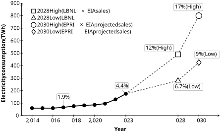

# Environmental and Economic Implications of Artificial Intelligence Data Centers in the United States 

Johanna Bola˜nos-Zu˜niga1_,∗_ , Alberto J. Lamadrid2_,_3 

> 1Institute for Cyber Physical Infrastructure and Energy (I-CPIE), Lehigh University, Bethlehem, PA, USA 

> 2Laboratory for Information and Decision Systems (LIDS), Massachusetts Institute of Technology (MIT), Cambridge, MA, USA 

`job323@lehigh.edu` (J. Bola˜nos-Zu˜niga), `ajlamadrid@lehigh.edu` (A. J. Lamadrid) 

> _∗_ Corresponding author 

##### **Abstract** 

In this study, we use electricity demand growth, cooling requirements, and backup system operation to evaluate the environmental and economic implications of artificial intelligence data centers in the United States. Our results indicate that impacts are not determined solely by facility design, but by the broader electricity, water, and land-use systems in which these facilities operate. Emissions are primarily driven by electricity consumption and therefore depend on marginal generation mixes, transmission constraints, and the spatial and temporal distribution of demand. Analysis further shows that local effects include pressures on water resources, increased noise exposure, and land-use changes, with outcomes varying across regions and infrastructure conditions. The assessment of technological and operational measures shows that improvements in energy efficiency, cooling configurations, and operational strategies can reduce these impacts, although their effectiveness depends on system-level conditions. Evaluation of regulatory and market structures suggests that existing frameworks may not fully account for location- and time-specific externalities. These findings support the need for integrated policy approaches that align data center deployment and operation with electricity system characteristics, water availability, and land-use planning to improve overall environmental and economic performance. 

_Keywords_ : Artificial intelligence data centers; Environmental impacts; Electricity markets; Regulatory frameworks 

1 

## **1 Introduction** 

Electricity demand from data centers has increased with the expansion of digital services across the economy (International Energy Agency, 2025; Jones, 2018). These facilities support data storage, cloud computing, and large-scale applications, and are among the most energy-intensive commercial users due to continuous operation and cooling requirements. The demand of a typical data center can be comparable to that of 25,000 households (Dayarathna et al., 2016), and data centers accounted for about 4.4% of total U.S. electricity consumption in 2023 (Shehabi et al., 2024). 

Despite rapid growth in computing workloads, electricity use increased only modestly over much of the last decade due to efficiency improvements and consolidation into hyperscale facilities (Masanet et al., 2020). More recently, electricity demand has accelerated, growing by about 1.7% annually between 2020 and 2025 compared to 0.1% between 2005 and 2019 (EIA, 2026c). Data centers are identified as one of the drivers of this increase, alongside industrial demand, with AI workloads expected to further contribute to future growth, see Shehabi et al. (2024) and EIA (2026a). 

Many AI workloads involve the training of machine learning (ML) models, which rely on large clusters of specialized processors such as GPUs and other accelerators (see e.g., de Vries, 2023). These processes require highly parallel computation and substantial energy inputs (Strubell et al., 2019). 

Such clusters exhibit higher electricity densities than traditional data center workloads (Aljbour et al., 2024). The resulting heat loads require advanced cooling systems and specialized facility designs to ensure reliable operation (VanGeet and Sickinger, 2024). In addition to electricity use, cooling may involve significant water consumption in some facilities (Lei et al., 2025), introducing additional infrastructure requirements related to water supply, cooling systems, and site-specific resource constraints (see e.g., American Society of Civil Engineers, 2024). 

The discussion above highlights important differences between traditional and AI data centers in terms of computational intensity, power density, and cooling requirements. AI workloads rely on concentrated clusters of specialized processors that operate at higher electricity densities and generate larger heat loads than conventional computing applications. As a result, AI data centers exhibit distinct operational and environmental profiles, with implications for electricity demand, cooling infrastructure, and resource use. Table 1 summarizes key differences between traditional data center workloads and AI computing clusters in terms of facility scale, electricity intensity, and cooling requirements. 

2 

Table 1: Comparison of traditional vs AI data centers 

|Characteristic||Traditional data centers|AI data centers|
|---|---|---|---|
|Typical workloads||Web services, cloud computing, Edge and enterprise applications_a_|Training and inference of machine learning models (e.g., large language models - LLMs)_b_|
|Typical MW size load)1|(facility|Majority of historically deployed data centers are significantly smaller, typi- cally on the order of 1–2 MW or less. Most existing data centers are below 100 MW_c_|New interconnection requests generally exceed 100 MW and can approach 1 GW per facility, total demand is projected to increase by 30–35 GW by 2030_d_|
|Electricity intensity2||Electricity demand driven by Informa- tion and Communication Technologies (ICT) services such as data storage and web services_e_|High electricity demand associated with AI ap- plications, with implications for power system planning_f_|
|Cooling type||Direct expansion, air cooling, and chilled-water cooling systems_g_|Air cooling, chilled-water systems, and ad- vanced cooling approaches such as liquid cooling_h_|

_a_ Dayarathna et al. (2016); Shehabi et al. (2024) and Masanet et al. (2020) _b_ Luccioni et al. (2024) and Masanet et al. (2024) _c_ EPRI (2024b) and EPRI (2024a) _d_ EPRI (2024a) and EPRI (2026) _e_ Dayarathna et al. (2016) and Masanet et al. (2020) _f_ Luccioni et al. (2024); Shehabi et al. (2024) and EPRI (2026) _g_ Vasques et al. (2019) and VanGeet and Sickinger (2024) _h_ Lei et al. (2025); Polidoro (2026), and VanGeet and Sickinger (2024) 

Figure 1 summarizes historical estimates and selected projections of electricity demand from U.S. data centers. Projections indicate that electricity demand from U.S. data centers will continue to increase with the expansion of AI applications. Scenarios from Shehabi et al. (2024) estimate that data centers could account for 6.7% to 12.0% of total U.S. electricity consumption by 2028, depending on hardware deployment and cooling assumptions. Other analyses project similar growth, with data centers representing 9% to 17% of total consumption by 2030 (EPRI, 2026). 

> 1Reported MW values refer to total facility load (including Information Technology (IT) equipment and supporting infrastructure such as cooling and power delivery). 

> 2Electricity demand varies depending on computing density, hardware configuration, and cooling infrastructure (Dayarathna et al., 2016; Masanet et al., 2020). 

3 

Figure 1: Projected U.S. data center electricity demand growth. Historical values for 2014– 2023 are based on Shehabi et al. (2024). The 2028 projections apply the shares reported in Shehabi et al. (2024) to projected U.S. electricity sales from the U.S. Energy Information Administration (EIA, 2025a). The 2030 projections are derived from EPRI (2026) estimates of data center shares of U.S. electricity generation and are converted to an electricity consumption basis. 

The growth of electricity demand from AI data centers has implications for power system planning and market design. Large facilities represent concentrated loads that can influence generation investment, transmission expansion, and tariff structures for large consumers, (see e.g., Satchwell et al., 2025). As AI infrastructure expands, its environmental and economic impacts become increasingly relevant for utilities, system operators, and policymakers. Improving the sustainability of AI systems has therefore emerged as a growing research and policy priority, linked to broader decarbonization efforts and responsible technological development (de Vries, 2023; Aljbour et al., 2024; Kocak et al., 2025). 

The preceding discussion shows that AI data centers are not only large electricity consumers, but also infrastructure systems whose impacts depend on where and how they are connected to electricity, water, and land-use systems. 

The rest of this article is organized as follows. Section 2 examines the main environmental dimensions associated with AI data centers, including air emissions (2.1), noise (2.1.1), water 

4 

(2.2), and land (2.3). Section 3 discusses the electric system, economic, regulatory, and policy mechanisms that shape these impacts and determine the extent to which technological and operational measures can mitigate them. Building on this analysis. Section 4 provides policy recommendations. 

## **2 Environmental Assessment** 

### **2.1 Air** 

Data centers have been estimated to account for approximately 2.5% to 3.7% of global greenhouse gas (GHG) emissions (Kambhampati et al., 2024). The bulk of this footprint arises not from on-site combustion, but from electricity consumption, which constitutes the dominant source of both direct and indirect emissions associated with data center operations (Boscariol et al.; Nassar and Bashroush, 2026). 

Because electricity demand is supplied by power generation, the environmental impact of data centers depends on the characteristics of the underlying electricity system. Emissions are therefore attributed through electricity use and vary with the generation mix and marginal technologies (Siddik et al., 2021). As a consequence, data center operations are primarily associated with indirect emissions from the power sector rather than direct on-site emissions, and their GHG intensity reflects the broader energy system in which they operate (WattTime and Tomorrow, 2021). 

In electricity systems such as those in the United States (u.S.), increases in demand are frequently met by fossil-fuel generators, primarily natural gas and, to a lesser extent, coal, (see e.g., EIA, 2025b). The combustion of these fuels releases greenhouse gases (GHG) and air pollutants associated with electricity production, with carbon dioxide (CO2) as the dominant GHG (EPA, 2024, 2025b). 

In addition to these indirect emissions, data centers may also be associated with direct emissions from on-site backup systems. Backup power has typically relied on diesel generators, although alternative and complementary storage-based configurations have been explored, e.g., hydrogen and battery storage systems, (see e.g., Kambhampati et al., 2024; Saur, Genevieve and Arjona, Vanessa and Clutterbuck, Amberlie and Parker, Eric, 2019; Norris et al., 2025). Diesel generators are widely used due to their reliability and rapid response (Kambhampati et al., 2024), but their combustion produces air pollutants with environmental and public health impacts (Babamohammadi et al., 2025; Nordin and Lindemark, 1999). 

Because data centers represent large and concentrated electricity loads, increases in their 

5 

demand raise the question of how additional electricity translates into emissions Bogmans et al. (2026). A key distinction in this context is between average and marginal emission factors. Average factors measure the mean emissions intensity of electricity generation, whereas marginal factors capture the change in system emissions from an incremental increase in demand (Valenzuela et al., 2024; WattTime, 2024). Since additional load is typically met by marginal generators, these emissions can differ from system averages and vary across time and location (Valenzuela et al., 2024; Wang et al., 2016). For this reason, marginal emission factors are commonly used to assess the environmental impacts of demand changes (WattTime, 2024). 

Table 2 shows that coal has the highest emission intensities across pollutants under marginal conditions, whereas natural gas exhibits lower values, particularly for SO2, PM, and Hg. Diesel, used for backup generation, produces relatively high NO _x_ , CO, and PM emissions. These differences imply that the environmental impacts of additional electricity demand depend on the fuels supplying that demand, with CO2 driving climate effects and other pollutants affecting air quality and public health. 

Although emission factors allow for comparisons across individual pollutants, they do not provide a direct measure of overall climate impacts. To address this, greenhouse gas emissions can be expressed in CO2-equivalent terms using Global Warming Potential (GWP), based on CO2 and CH4 emission factors (Jenner and Lamadrid, 2013). Table 3 reports these values for coal, natural gas, and diesel over 20-year and 100-year horizons. Coal exhibits the highest values, followed by diesel and natural gas, although the gap narrows when methane emissions are included. These comparisons provide a consistent basis to assess the relative climate impacts of fuels supplying electricity demand. 

In summary, electricity supplied by coal is associated with higher climate and air quality impacts, whereas natural gas exhibits lower emission intensities, with outcomes sensitive to methane emissions. Diesel generators introduce an additional source of direct emissions with localized air quality effects. These results suggest that marginal emission factors provide a 

> 3EPA (2025c) reports emission factors by combustion technology, since emissions depend on furnace design and control technologies. To maintain a consistent fuel-based baseline, we select the pulverized coal (PC) dry bottom, wall-fired configuration under Pre-NSPS conditions, a conventional coal-fired design without emission control technologies. 

> 4We exclude utility scale boiler configurations such as wall-fired and tangential-fired systems because they represent specific combustion designs typical of centralized power plants. Instead, we select a generalized combustion factor based on small boiler systems to maintain a technology-neutral approach. 

> 5Backup generators are typically powered by diesel fuel oil (No. 2), a distillate fuel oil widely used in stationary IC engines, including generators EPA (2025a). 

> 6We use the uncontrolled diesel NOx emission factor expressed on a fuel input basis. This metric maintains consistency with the fuel-based approach used for natural gas and coal and avoids dependence on engine output or conversion efficiency. 

6 

<u>Table 2: Emission factors</u> 

|Emission Factor|CO2|CH4|NOx|SO2|PM|CO|Hg|
|---|---|---|---|---|---|---|---|
|**Coal** ||||||||
|Primary energy_ade_(kg/GJ) |88.41||0.416|0.702S+|0.172A*|8.62E-03|6.90E-06|
|Electricity_fg_ (kg/GJ ~~e~~) |259.27||1.22|2.059S|0.50A|0.025|2.02E-05|
|Fugitive_jkl_||1.61||||||
|**Diesel**_jkm_ ||||||||
|Primary energy_cde_(kg/GJ) |70.1||1.376|0.434S+|0.027|0.365|2.67E-06|
|Electricity_fh_ (kg/GJ ~~e~~)|215.69||4.234|1.335S|0.082|1.123|8.22E-06|
|**Natural gas** ||||||||
|Primary energy_bd_(kg/GJ) |50.29||0.042|2.20E-07|8.01E-04|0.035|0|
|Electricity_fi_(kg/GJ ~~e~~) Fugitive_jkn_|111.26|13.33_p_|0.093|4.87E-07|1.77E-03|0.078|0|

- _a_ CO2: EPA (2025c) - Bituminous; NOx, CO, SO2, PM: EIA (2020a) - PC, dry bottom, wall-fired, bituminous, Pre-NSPS3 ; Hg: EPA (2000). 

- _b_ CO2 EPA (2025c); NOx, CO, SO2, PM and Hg: EIA (2020a) - Small Boilers ( _<_ 100 MMBtu/h), Uncontrolled4 . 

- _c_ CO2: EPA (2025a) - Distillate Fuel Oil5 No. 2; NOx: EPA (2025a) - uncontrolled6; CO, SO2, PM: EPA (2025a); Hg: EPA (2000). 

- _d_ We consider filterable PM to maintain consistency with a fuel-based approach and avoid introducing atmospheric transformation effects. 

- _e_ EPA (2020) and EPA (2025a) do not report mercury emission factors for the selected fuels. Therefore, we use uncontrolled Hg values from EPA (2000) for bituminous coal and distillate No. 2 fuel oil, which depend on fuel mercury content and remain consistent with the fuel-based approach used for other pollutants. 

- _f_ We convert emissions to an electricity basis using technology-specific heat rates from EIA (2026b), consistent with representative U.S. power plant performance, and derive efficiencies as eff = 3412 _/_ Heat Rate. 

- _g_ We use steam generator heat rate values for coal-fired plants, with an efficiency of approximately 34.1%. _h_ We use petroleum internal combustion (IC) heat rate values for diesel plants, with an efficiency of approximately 32.5%. 

- _i_ We use combined cycle heat rate values for natural gas plants, with an efficiency of approximately 45.2%. 

- _j_ CH4: (TgCH4/GtC). 

- _k_ We do not report fugitive CO2 emissions for fossil fuel systems because CO2 emissions primarily arise from combustion rather than upstream fuel extraction or handling (Alvarez et al., 2018). 

- _l_ We estimate methane emissions from coal using the average surface mining emission factor reported in IPCC (2019) (1.2 m3 CH4 per ton of coal) and convert them to TgCH4/GtC following Wigley (2011) (assuming that combustion of 1 ton of coal produces approximately 1.83 ton of CO2) because recent studies support the use of inventory approaches to capture variability across the system (Tibrewal et al., 2024). 

- _m_ We consider methane emissions from diesel fuel systems negligible based on EPA (2024). _n_ We estimate methane emissions from natural gas systems following Wigley (2011) (13.33p TgCH4/GtC), assuming a leakage rate _p_ = 2 _._ 3% based on (Alvarez et al., 2018) and (Inman et al., 2020). 

- _∗_ Expressed as a function of ash content (A), consistent with filterable PM (Method 5) EPA (2020). 

- + Unlike natural gas, both coal and diesel emission factors explicitly depend on fuel sulfur (S) content EPA (2020). 

<u>Table 3: GWP Estimates</u> 

||Avg. Coal|Avg.|Gas|Avg. Diesel|
|---|---|---|---|---|
|20-years horizon (lb CO2 ~~e~~/MWh)|2,141||890|1,714|
|100-years horizon (lb CO2 ~~e~~/MWh)|2,089||885|1,714|

Source: NETL (2011); Forster et al. (2021); IPCC (2006) 

more appropriate measure of the air-related impacts of increases in data center electricity demand. 

7 

#### **2.1.1 Noise pollution** 

Noise in data centers is primarily associated with cooling systems and backup generators, making these facilities localized sources of activity (Gour et al., 2026). Air and noise pollution may be correlated across space and time, although this relationship has not been specifically examined for data center operations, implying potential co-exposure to both stressors (Ghosh et al., 2018). 

Hamilton (2024); Gour et al. (2026) discuss acoustic sources within facilities, including cooling equipment (e.g., chillers, cooling towers, and fans), backup generators, and load banks used during testing. Cooling systems operate continuously, whereas generator testing introduces intermittent noise events. At the site level, noise reflects the combined operation of multiple sources rather than a single unit (Hamilton, 2024). Noise exposure is typically assessed using time-averaged metrics such as Leq and Ldn, (see EPA, 1974), as well as indicators like Lden and Lnight for long-term exposure (WHO, 2018). 

At the community level, observations near operational data centers report noise in adjacent residential areas, often described as a continuous “hum” or “drone” (JLARC, 2024). Evidence on these impacts remains limited and largely based on site-specific measurements rather than systematic exposure assessments (Gour et al., 2026). Although not typically reported using standardized indicators such as Ldn or Lden, sustained environmental noise exposure has been associated with annoyance, sleep disturbance, cardiovascular and cognitive effects, and mental health outcomes (WHO, 2018; Gour et al., 2026). 

In occupational settings, noise is measured using A-weighted decibels (dBA) and timeweighted averages (TWA), with exposure limits defined over an 8-hour period (OSHA, 2023; NIOSH, 2024). Reported measurements within data centers include servers, HVAC systems (Miljkovi´c, 2016), and server rooms (Alnuaimy et al., 2022). 

Additional noise sources arise from on-site power systems, including diesel and natural gas generators (Hamilton, 2024; JLARC, 2024). Measurements for generator sets and gas turbine components vary with unit size and operating conditions (Uddin et al., 2016; Tupov and Taratorin, 2020). Table 4 summarizes the corresponding environmental, occupational, and source-specific metrics. 

The significance of noise extends beyond human exposure. Evidence from ecological studies indicates that anthropogenic noise can affect wildlife, including changes in behavior, physiology, and reproduction (University of Michigan, 2026). Although not specific to data centers, these findings provide context for assessing persistent mechanical noise as part of the broader environmental footprint of energy-intensive infrastructure. 

These considerations motivate mitigation strategies. Engineering approaches include operating cooling equipment below maximum fan speeds, treating generator components 

8 

<u>Table 4: Noise metrics</u> 

|Type|Category|Metric V|alue (dBA)|Description|
|---|---|---|---|---|
|Enviromental|Limit|Leq(24)_a_ Ldn_a_ Lden_b_ Lnight_b_|70 45 55 53 45|Protection against hearing loss Indoor activity annoyance / interference. Outdoor activity annoyance / interference. Average noise exposure for road traffic noise Night noise exposure for road traffic noise|
||Observed|Community exposure_c_|40–59|Reported measurements|
|Occupational|Limit|OSHA (8-hour TWA)_d_ NIOSH (8-hour TWA)_e_|90 85|Workplace exposure Recommended exposure|
||Observed|Data center (indoor)_f_|40–83 70|Server rooms HVAC / equipment|
||Diesel Natural Gas|125 – 2000 kW_g_ 125 kW_g_|86 – 99.2 84.1|At a distance of 7 m|
|Backup Generator|Gas Turbine (GT)|100 MW_h_ 16.8–287 MW_h_|100 84 72.2 – 78.5 68–82|At a distance of 120 m from the air intake (without silencers) At a distance of 120 m from the exhaust (with- out sound attenuation system) At a distance of 350 m from the exhaust At distances of 300–380 m, depending on the angular position and the number of units (1–3)|

_a_ EPA (1974) _b_ WHO (2018) _c_ JLARC (2024) _d_ OSHA (2023) _e_ NIOSH (2024) _f_ Server rooms Miljkovi´c (2016) and Alnuaimy et al. (2022); HVAC Miljkovi´c (2016) _g_ Uddin et al. (2016) _h_ Tupov and Taratorin (2020) 

as distinct acoustic sources, and increasing distance between noise sources and receptors (Hamilton, 2024). Additional measures include generator yard walls, facade treatments (Conaway, 2024), and noise control technologies such as enclosures and silencers for diesel systems Casomar and Bangsund (2026); Montazeri et al. (2026). 

Noise is increasingly incorporated into local planning and permitting frameworks. Reported approaches include zoning restrictions, site selection criteria, and acoustic mitigation requirements (Gour et al., 2026), with some jurisdictions implementing setback distances and noise studies for data center facilities, (see e.g., Fairfax County, 2024). These practices align with existing regulatory frameworks, where environmental noise control is primarily addressed at the state and local level (U.S. Congress, 1972). 

Overall, to our knowledge, the literature remains limited in terms of systematic and quantitative studies on data center noise. Nevertheless, it supports the inclusion of noise as a standard consideration in data center planning, emphasizing measurement, comparison to established indicators, and mitigation at both facility and community scales. 

9 

### **2.2 Water** 

Water use in data centers is primarily driven by cooling requirements, as computing equipment generates substantial heat loads. Water use intensity (WUE) is commonly used to measure this relationship, linking water use to IT electricity consumption. WUE can be defined at the site level, capturing direct water use, and at the source level, which includes indirect water use from electricity generation (Lei et al., 2025; Li et al., 2025). 

At the facility level, water use is determined by heat rejection. Systems with watercooled chillers exhibit higher WUEsite due to evaporative losses in cooling towers, whereas air-cooled or direct expansion systems reduce on-site water use (Lei et al., 2025). Cooling design, therefore, determines whether water use occurs on-site or is shifted to electricity consumption (Lei et al., 2025; Li et al., 2025). 

Rising AI workloads have increased power densities, limiting the effectiveness of air cooling and driving adoption of liquid cooling (National Academies of Sciences, Engineering, and Medicine, 2025; SP, 2025; d’Orgeval et al., 2026). However, water consumption depends on the heat rejection system: evaporative systems increase water use, whereas dry cooling can eliminate on-site water use at the cost of higher electricity demand (Li et al., 2025). 

Cooling configurations involve trade-offs between on-site water use and electricity consumption. Air-cooled systems reduce on-site water use but require higher electricity input, whereas water-cooled systems lower electricity demand at the expense of increased water consumption (Lei et al., 2025). Alternative designs, such as economizers and adiabatic systems, can reduce both under specific conditions (Lei et al., 2025). 

Besides direct use, data centers rely on water embedded in electricity generation. This indirect component depends on the water consumption factor of the power system, which varies by generation technology and cooling method (Lei et al., 2025; Jin et al., 2019). For thermoelectric generation with cooling towers, water consumption ranges from 490–1,900 L/MWh for natural gas and 1,970–3,940 L/MWh for coal (Grubert and Kitasei, 2011). Total water use, therefore, depends on both cooling configuration and the characteristics of the electricity supply. 

Reported data remain limited and inconsistent across firms, with indirect water use rarely disclosed (de Vries-Gao, 2026). As a result, water use is evaluated on an electricity basis (L/kWh), allowing comparison across cooling systems and energy sources. Table 5 summarizes representative estimates combining direct and indirect components. 

Table 5 shows indirect, upper part, and total water intensity. The water intensity increases with the water consumption factor (WCF) of the electricity supply across all cooling configurations. For low-WCF sources (e.g., wind or solar), differences are driven mainly by direct water use, with water-cooled systems consuming more than dry air systems. As WCF 

10 

Table 5: Water metrics based on Lei et al. <u>(2025)</u> 

|Cooling technology|Water use_a_ (L/kWh)|Wind|Solar|Natural Gas|Coal|Oil|Biomass|Hydro|Geothermal|
|---|---|---|---|---|---|---|---|---|---|
||Indirect|0.01|0.03|1.17|2.20|2.90|4.28|6.80|11.01|
|Air-cooled chiller|Total|0.04|0.07|1.20|2.23|2.93|4.31|6.83|11.04|
|Airside economizer (air-cooled chiller)||0.03|0.05|1.19|2.22|2.92|4.30|6.82|11.03|
|Direct expansion system||0.04|0.07|1.20|2.23|2.93|4.31|6.83|11.04|
|Airside economizer adiabatic cool-||0.03|0.05|1.19|2.22|2.92|4.30|6.82|11.03|
|ing (air-cooled chiller)||||||||||
|Airside economizer (water-cooled chiller)||0.99|1.02|2.15|3.18|3.88|5.26|7.78|11.99|
|Airside economizer adiabatic cool- ing (water-cooled chiller)||0.56|0.58|1.72|2.75|3.45|4.83|7.35|11.56|
|IT Liquid cooling: dry cooler with||0.15|0.17|1.31|2.34|3.04|4.42|6.94|11.14|
|adiabatic assist (air-cooled chiller)||||||||||
|IT Liquid cooling: waterside econ- omizer (water-cooled chiller)||1.76|1.79|2.92|3.95|4.65|6.03|8.55|12.76|
|Water-cooled chiller||1.91|1.94|3.07|4.10|4.80|6.18|8.70|12.91|
|Waterside economizer (water- cooled chiller)||1.88|1.91|3.04|4.07|4.77|6.15|8.67|12.88|

_a_ We adapt WUE values from Lei et al. (2025), originally defined per IT load, to a facility-level basis for consistency using Power Usage Effectiveness (PUE) values from the same study. 

rises (e.g., thermoelectric generation), indirect water use becomes dominant, reducing the relative importance of cooling design. Total water use scales with facility demand because water intensity is defined per unit of electricity. Although efficiency improvements reduce water use per unit of computation (Lei et al., 2025), total consumption depends on overall electricity demand, which has increased and is projected to continue growing (EPRI, 2024b). As a result, total water use may rise despite efficiency gains. 

At the facility level, larger data centers therefore exhibit higher total water use. A substantial share may involve potable water; for instance, 5,984.6 of 7,657.2 million gallons reported by Google correspond to potable withdrawals (Google, 2024). Water use can also affect local systems through wastewater generation and resource management challenges (Gour et al., 2026). 

### **2.3 Land** 

Several studies characterize data center land use by the physical footprint of the facilities, with classifications by EPRI (2025) and LVPC (2026) distinguishing small, medium, large, and hyperscale data centers based on building size, as shown in Table 6. Although not specific to AI, rising data processing requirements, particularly from AI applications, have been associated with the expansion of hyperscale facilities (CRS, 2025; Smith, 2026). 

Hyperscale data centers, though defined at the building level, are typically developed as multi-building campuses, extending their footprint beyond a single structure, (see EPRI, 

11 

Table 6: Data center building sizes based on EPRI <u>(2025)</u> and LVPC (2026) 

|Type|Avg. Building size (ft2)|
|---|---|
|Micro|_≤_5,000|
|Small|5,000–20,000|
|Medium|20,000–100,000|
|Large|100,000 – 1M|
|Hyperscale|_≥_1M|

2025). For example, the proposed Project Bolt in Pennsylvania spans roughly 700 acres and includes up to 18 buildings totaling about 5 million ft2 (CRS, 2025). 

Table 7 new data center developments and their direct land use impacts. Recent developments indicate a trend toward large-scale siting, often involving conversion of agricultural or rural land. Examples include an Amazon Web Services campus in Indiana (1,200 acres) (Weise and Metz, 2025), farmland conversion in Nebraska for Meta and Google facilities (Nebraska Public Media, 2024), expansion of Microsoft’s Mount Pleasant site in Wisconsin to over 1,270 acres (Schulz, 2024; Kaeding, 2026), and the proposed rezoning of 2,100 acres in Virginia for the Digital Gateway project (Prince William Times, 2023; Barlow and Smith, 2026). 

Table 7: Direct land use impacts from AI data center <u>projects.</u> 

|Project|Status||Footprint|Land type|
|---|---|---|---|---|
|New Carlisle, IN (AWS)_a_ |Current||_∼_1,200-acre (_∼_486 ha)|Greenfield (agricultural land)|
|Nebraska (Meta, Google)_b_|Current||_∼_900-acre each (_∼_364 ha)|Greenfield (agricultural land)|
|Mount Pleasant, WI (Microsoft)_c_|Current / ing|expand-|315 _→_ _>_1,270-acre (_∼_127 _→>_514 ha)|Not specified - Expansion|
|Prince William County, VA (Digi- tal Gateway)_d_|Proposed tested|/ con-|_∼_2,100-acre (_∼_850 ha)|Greenfield (rural land) - public op- position|
|Shackelford County, TX (Vantage Frontier)_e_|Current /|planned|_∼_1,200-acre (_∼_486 ha)|Not specified|
|ACE Basin, SC_f_|Proposed tested|/ con-|_∼_850–859-acre (_∼_344– 348 ha)|Greenfield (rural/ecologically sen- sitive land) - public opposition|

_a_ Weise and Metz (2025) _b_ Nebraska Public Media (2024) _c_ Schulz (2024) and Kaeding (2026) _d_ Prince William Times (2023) and Barlow and Smith (2026) _e_ Vantage Data Centers (2025) _f_ Yeargin (2026a) and Yeargin (2026b) 

In addition to facility size, data centers affect land use indirectly through electricity demand. Table 8 summarizes recent projects associated with different pathways and their indirect land-use implications. Demand is expected to grow with hyperscale deployments and AI applications (EPRI, 2025; PJM, 2025a), requiring additional generation and transmission infrastructure (CRS, 2025). System operators have initiated processes to accommodate large- 

12 

load interconnections and evaluate capacity needs PJM (2025b). These requirements are further constrained by timing differences, as data centers can be deployed within one to two years, whereas transmission infrastructure requires longer planning and construction periods (Aljbour et al., 2024). From a system perspective, increases in electricity demand require coordinated expansion of generation, transmission, and distribution capacity. Large new loads, such as AI data centers, therefore contribute to additional infrastructure requirements. 

Indirect land-use impacts arise through several pathways, including transmission expansion, site-specific generation, renewable deployment, and system-level capacity growth. For example, transmission expansion to serve new loads may require new lines, substations, and upgrades. In Wisconsin, the Ozaukee County project includes new 345 and 138 kV lines and associated infrastructure in a predominantly agricultural area, (see Public Service Commission of Wisconsin, 2025; Schulze et al., 2026). 

Site-specific generation expansion refers to the development or repurposing of on-site energy infrastructure to meet rising demand. For example, the Homer City Energy Campus in Pennsylvania redevelops a former coal plant into a 3,200-acre site with up to 4.5 GW of natural gas capacity (Homer City Redevelopment, 2025). Although located on a brownfield, the project represents an intensification of land use for electricity supply. 

Renewable generation involves large land requirements for electricity production. The IP Radian Solar project in Texas occupies approximately 2,300 acres to generate 300 MW (Apple Inc., 2022). More broadly, utility-scale solar deployment requires significant land area and may involve vegetation disturbance and soil impacts depending on site conditions (EIA, 2020b; Ong et al., 2013). 

System-level generation expansion arises when large new loads require additional capacity beyond existing resources. In the TVA region (DiGang, 2026), data center growth has increased the need for new firm generation. In this case, electricity is supplied through the grid, with utilities planning new resources to meet demand. 

As shown in Tables 7 and 8, several recent examples of large-scale land conversion associated with hyperscale data center development involve greenfield and rural sites. These developments may alter local ecosystems and built environments through the loss of green space, increased impervious surfaces, and changes in land use patterns. Such transformations may reduce ecosystem services, including climate regulation, air quality, and recreational functions, while also affecting community structure and land-use dynamics (Millennium Ecosystem Assessment, 2005). 

Existing evidence suggests that these changes can have broader implications for human well-being, including increased exposure to environmental stressors and potential impacts on mental health, particularly in communities undergoing rapid land-use transitions (Gour 

13 

Table 8: Indirect land-use Impact from AI data centers. 

|Project|Status|Area / Expa|nsion|Land type|Pathway||Impact|
|---|---|---|---|---|---|---|---|
|Ozaukee Transmis- sion (WI)_a_|Oncoming|_∼_1,120–3,80 (_∼_453–1,538 345 and 13 transmission|0-acre ha): 8 kV  lines|Agricultural / mixed land|Transmissio pansion|n ex-|New transmission lines and substations (4–5) to serve the large load addi- tion|
|Homer City (PA)_b_|Oncoming|_>_3,200-acre (_>_1,295 up to 4.5 G|ha): W|Brownfield (for- mer coal plant)|Site-specific generation pansion|ex-|Redevelopment of the for- mer coal site into a large- scale generation campus|
|Apple Radian So- lar (TX)_c_ |Built|2,300-acre ha): 300 MW|(_∼_931 |Not specified|Renewable eration and  transformati|gen-  land on|Utility-scale solar instal- lation occupying a large land area|
|TVA System (TN)_d_|Current / on- coming|400-acre ha): 6.2 GW|(_∼_162 |Greenfield (new reservoir) + Brownfield (for- mer coal plant)|System-level generation pansion|ex-|Load growth requiring additional generation ca- pacity|
|PORTS Campus (OH)_e_|Oncoming|_∼_3,700-acre (_∼_1,497 10 GW generation; GW natural|ha): power 9.2  gas|Brownfield (for- mer federal site)|Site-specific generation pansion|ex-|Energy and AI infrastruc- ture development on the former federal site|
|Mosey Solar (NV)_f_|Oncoming|_∼_3,500-acre (_∼_1,416 500 MW|ha):|Greenfield (pub- lic desert land)|Renewable eration and  transformati|gen-  land on|Utility-scale solar devel- opment on public land|
|Quantum Freder- ick (MD)_g_|Current / on- coming|2,100-acre ha): 2.4 GW under d ment; 40-mil connection|(_∼_850 power evelop- e fiber|Brownfield (for- mer industrial site)|Site-specific frastructure pansion|in- ex-|Redevelopment of a for- mer industrial site with a large-scale data center and associated energy in- frastructure|

_a_ Public Service Commission of Wisconsin (2025) and Schulze et al. (2026) _b_ Homer City Redevelopment (2025) and Rocha (2026) _c_ Apple Inc. (2022) _d_ DiGang (2026) and Roby (2025) _e_ DOE (2026) _f_ Bureau of Land Management (2024) _g_ Maryland Department of Commerce (2021) and Catellus (2024) 

et al., 2026). Based on the literature reviewed, existing studies remain limited and primarily case-based. Nevertheless, the examples discussed highlight the importance of considering land-use change in local land-use and zoning ordinances governing hyperscale data center development. 

## **3 Discussion** 

The previous assessment examined the environmental impacts of AI data centers across air, water, and land dimensions. Taken together, the evidence suggests that the impacts of these facilities are primarily driven by electricity consumption, cooling requirements, and infrastructure expansion. As a result, the environmental profile of AI data centers is not determined solely by facility design, but by the broader energy systems in which they operate. In particular, the characteristics of the electricity supply, e.g., generation mix, marginal technologies, and system constraints, play a central role in shaping both climate and local 

14 

#### environmental outcomes. 

From an environmental perspective, AI data centers exhibit a combination of localized and system-wide effects. Locally, facilities may contribute to noise, water use, and land transformation, with impacts varying by siting decisions and cooling technologies. At the system level, increases in electricity demand translate into changes in generation, transmission, and distribution infrastructure, with associated emissions and resource use. These interactions highlight that the environmental impacts of AI data centers extend beyond facility boundaries and are closely linked to power system operations. 

At the same time, the economic and operational characteristics of these facilities introduce additional considerations. AI data centers represent large, concentrated loads with distinct temporal and spatial profiles, which can affect peak demand, resource adequacy, and infrastructure planning. While they may generate economic activity during construction and support specialized employment during operation, their broader impacts depend on cost allocation mechanisms, local economic conditions, and the evolution of supporting industries. 

These observations raise two central questions. First, to what extent can technological and operational measures mitigate the environmental impacts identified in the previous section? Second, what regulatory and market frameworks are required to align private investment decisions with broader system efficiency and environmental objectives? The following subsections address these questions by examining electric system impacts, economic implications, market failures, and potential policy responses. 

### **3.1 Electric Impacts** 

AI data centers are increasingly relevant for grid operations due to their contribution to peak demand and the concentration of large loads. EPRI (2026) estimates that the U.S. data center peak load is at 21–22 GW in 2024 and projected to reach 45, 71, and 94 GW, _>_ 110%, by 2030 under alternative scenarios. These projections indicate that electric system impacts are driven primarily by peak demand rather than total electricity consumption, which is expected to grow more modestly. 

Reliability assessments show accelerating peak demand growth across North America, exceeding 224 GW in summer and 245 GW in winter over a ten-year horizon (NERC, 2026). In several regions, data centers contribute to this increase. For example, PJM projects a 56 GW rise in summer peak demand by 2035, largely driven by data centers, and ERCOT projects growth from 94.7 GW in 2026 to 154.1 GW in 2035, including 23 GW of data center load, (see NERC, 2026). 

15 

Transmission expansion is influenced by multiple factors, including reliability needs, renewable integration, and demand growth, but may be constrained by permitting, interconnection processes, and equipment availability (NERC, 2026). Deployment timelines further exacerbate these constraints, as data centers can be connected within one to two years, whereas transmission projects typically require longer development periods (EPRI, 2025; Aljbour et al., 2024). 

These dynamics have implications for resource adequacy. Rising peak demand, combined with generation retirements and development lags, can reduce reserve margins and increase the risk of supply shortfalls. Project-level evidence illustrates these effects: in Indiana, a single AI data center campus is associated with an increase in peak demand from 2.8 GW to over 7 GW, along with new substation requirements (NERC, 2026). 

### **3.2 Economic Impacts** 

The employment impacts of data centers can be understood through the framework of direct, indirect, and induced effects commonly used in input–output analysis. In this framework, direct employment arises from construction and operations, indirect employment reflects supply-chain activity, and induced employment captures household spending effects. Models such as JEDI (NLR, 2026) and IMPLAN (IMPLAN, 2026) apply this structure using sectoral linkages and multipliers to estimate gross economic impacts. These approaches translate project expenditures into employment outcomes based on local spending shares and jobsper-dollar coefficients, with indirect and induced effects derived from Type I and Type II multipliers. 

Total employment is given by the sum of direct, indirect, and induced components, where indirect effects scale with direct activity and induced effects depend on the combined income generated. As a result, reported employment impacts can be substantially larger than direct job counts, with multipliers reflecting the strength of regional economic linkages. For data centers, these models typically identify large construction-phase employment and smaller but persistent operational employment, with additional effects arising from supplier industries and local services. 

#### **Construction** 

Construction generates short-run demand through site preparation, civil works, electrical equipment, cooling systems, and grid upgrades. Regional effects arise from direct construction employment and indirect activity in supplier industries, including materials, equipment, and engineering services, as well as induced household spending. Input–output methods are 

16 

well suited for this analysis, as capital expenditures can be allocated across sectors and regions. Models such as JEDI can be adapted to estimate gross output, labor income, and employment during this phase for the case of AI data centers (NLR, 2026). Construction is capital intensive, with employment concentrated early and largely temporary. Permanent jobs, on the other hand, are fewer but typically higher paid, (see FED, 2023). This pattern is consistent with other energy infrastructure projects (Wei et al., 2010). 

#### **Operation** 

Operational employment is more persistent but smaller in scale, including facility operations, maintenance, security, and specialized engineering. Additional effects arise through demand for contractors, utilities, and local services. Data centers may also support the development of related industries, particularly those providing electricity and cooling services, generating longer-run economic effects. 

Alternative approaches, including dynamic models such as REMI or reduced-form event studies, typically produce smaller net employment effects by accounting for displacement and general equilibrium adjustments. Taken together, the literature suggests that data centers generate visible short-run employment through construction and supply-chain activity, but long-run job creation remains modest relative to investment (FED, 2023). 

### **3.3 Market Failures, Cost Allocation, and Tradeoffs** 

The expansion of AI data centers raises a set of economic issues that can be understood within the framework of regulation and public economics. Three related concerns are particularly relevant: environmental externalities, infrastructure cost allocation, and imperfect information in interconnection processes. Together, these factors shape both the efficiency and distributional consequences of data center growth. 

First, data center operations are associated with environmental externalities. Electricity consumption leads to emissions and water use that are not fully priced in many markets, particularly where generation relies on fossil fuels or water-intensive cooling technologies. As in standard models of environmental regulation, when marginal private costs do not reflect marginal social costs, resource use may exceed the socially optimal level (Viscusi et al., 2018). These externalities occur via air, water, and land use, implying that their magnitude depends on marginal generation technologies, sources of water, location of the facilities, and system conditions rather than on facility characteristics alone. In addition, water use associated with cooling introduces local externalities, particularly in regions where water resources are scarce or subject to competing uses (Lei et al., 2025). 

17 

Second, hyperscale data centers raise issues of network cost allocation. Transmission and distribution investments in electric and water systems are often lumpy and involve shared infrastructure, making it difficult to assign costs to individual users. In regulated electricity systems, tariffs may not fully reflect cost causation, leading to potential crosssubsidization between large new loads and existing customers. Economic theory suggests that efficient pricing should reflect marginal and, where relevant, incremental costs of network expansion, but practical implementation is constrained by regulatory, informational, and political considerations (Viscusi et al., 2018). As a result, the entry of large loads such as AI data centers may shift costs across customer classes depending on the design of tariffs, interconnection agreements, and cost-recovery mechanisms. 

Third, imperfect information in interconnection queues can create inefficiencies in system planning (Aljbour et al., 2024). Project developers and system operators often face uncertainty regarding the timing, scale, and likelihood of new load additions. Queue backlogs, speculative applications, and limited transparency can complicate investment decisions in generation and transmission infrastructure. From an economic perspective, these conditions resemble coordination problems under uncertainty, where incomplete information leads to delays, over- or under-investment, and increased system costs. Improving information disclosure and screening mechanisms may therefore enhance allocative efficiency. 

These market failures give rise to several tradeoffs. One central tradeoff is between economic development and the price of utilities, notably electricity prices, but potentially water. Data centers can generate local tax revenues and construction activity, but may also increase system costs if infrastructure investments are socialized. A second tradeoff arises between water conservation and energy efficiency. Cooling systems that reduce electricity consumption may increase water use, while dry cooling technologies conserve water at the cost of higher energy demand (Lei et al., 2025). 

Taken together, these considerations suggest that the impacts of AI data centers depend not only on technological characteristics, but also on the regulatory frameworks governing pricing, cost allocation, and environmental management. Designing policies that internalize externalities, align incentives, and address informational constraints remains central to achieving efficient and sustainable outcomes. 

### **3.4 Technical Mitigation Strategies and System Integration** 

A range of technical strategies has been proposed to mitigate the environmental impacts of data centers across air pollution, noise, water use, and land requirements (Xiao et al., 2025). Consistent with a systems perspective, these approaches operate through the joint 

18 

optimization of facility design, energy and water systems, and grid interactions, rather than through isolated interventions. 

A central pathway involves _advanced cooling technologies_ . Innovations such as liquid cooling, economizers, and hybrid air–water systems can reduce both electricity consumption and water use, although the magnitude and direction of these effects depend on the heat rejection configuration. Engineering evidence suggests that advanced cooling systems can significantly lower operational resource intensity and maintaining reliability. From an economic standpoint, these technologies represent capital-deepening investments that shift costs from variable energy expenditures to fixed infrastructure, with potential long-run efficiency gains (Hoosain et al., 2023). 

A second approach involves _workload shifting and demand flexibility_ . AI workloads, particularly training processes but also inference, can be temporally adjusted to align with periods of lower marginal emissions or excess renewable supply. This reduces indirect air pollution and alleviates peak demand pressures, limiting the need for additional generation and transmission capacity. In economic terms, such flexibility allows data centers to respond to time-varying price signals, internalizing system costs associated with congestion and emissions. 

Third, _energy storage systems_ provide a mechanism to manage the variability and intensity of data center loads. High-response storage technologies can smooth rapid demand fluctuations, stabilize voltage and frequency, and reduce the need for grid upgrades. Evidence from dynamicgrid (2025) indicates that these systems can mitigate ramp-rate impacts and support interconnection processes by reducing stress on network infrastructure. In addition, storage enables participation in ancillary service markets, creating revenue streams while improving system-wide efficiency. 

Fourth, _on-site generation and hybrid energy systems_ offer an alternative means of reducing reliance on grid electricity. Fuel cells, renewable microgrids, and co-located generation can lower emissions and enhance reliability, particularly when paired with storage. However, these systems introduce tradeoffs, including localized environmental impacts (e.g., noise and land use) and potential shifts in infrastructure costs across consumers. 

Finally, mitigation extends to facility-level design and lifecycle management. Acoustic treatments can reduce noise exposure, while compact layouts and co-location strategies limit land use. Circular economy approaches further reduce environmental impacts by extending equipment lifetimes and minimizing material extraction (Hoosain et al., 2023). 

Overall, these technical measures highlight that the environmental footprint of data centers depends critically on design choices and system integration. Their adoption reflects a combination of private cost considerations, regulatory incentives, and evolving market 

19 

structures that increasingly value flexibility and reduced externalities. 

### **3.5 Pricing Signals and Regulatory Frameworks** 

The rapid expansion of AI data centers raises important questions for electricity pricing, wholesale market design, and regulatory policy. Because these facilities represent large, concentrated, and often inflexible loads, their integration into electricity and water systems depends not only on technical feasibility but also on the design of tariffs, interconnection rules, and environmental regulations. As emphasized in the economics of regulation, efficient outcomes require prices and policies that reflect marginal costs while addressing externalities and distributional concerns (Viscusi et al., 2018). 

A central issue concerns _electricity tariffs and cost allocation_ . Large data centers may require substantial investments in generation, transmission, and distribution infrastructure. If tariffs do not fully reflect cost causation, these investments may be partially socialized across existing ratepayers. Evidence suggests that, in some cases, utility rate structures allow costs associated with large new loads to be recovered broadly, raising concerns about cross-subsidization (Martin and Peskoe, 2025). From an economic perspective, efficient tariff design would align prices with marginal and incremental system costs, potentially through demand charges, time-varying pricing, or specialized tariffs for large loads. However, regulatory constraints and political considerations often limit the extent to which such pricing can be implemented. 

Wholesale market design introduces additional considerations. In regions such as Pennsylvania and the PJM market, where electricity capacity markets operate under price caps, the entry of large loads raises concerns regarding resource adequacy and price signals. Price caps, while intended to protect consumers from extreme price volatility, may suppress incentives for new generation investment when demand increases rapidly. In the presence of sustained load growth from data centers, binding price caps can therefore contribute to capacity shortages or increased reliance on out-of-market mechanisms. These dynamics highlight a tradeoff between short-run price stability and long-run investment incentives, a central theme in electricity market design. 

_Interconnection rules_ also play a critical role. Current interconnection processes were largely designed for generation rather than large, uncertain load additions. As a result, system operators face challenges in evaluating the timing, scale, and reliability implications of data center projects. Queue congestion, speculative applications, and limited information can delay infrastructure investment and increase system costs. Recent assessments identify large loads as a growing source of uncertainty for system planning, particularly due to their 

20 

size, clustering, and sensitivity to power quality (NERC, 2025). Improving interconnection procedures, including screening mechanisms and cost-sharing rules, is therefore essential for efficient system expansion. 

Environmental and resource regulations further shape the development of data centers. _Environmental permitting_ frameworks address emissions, land use, and local impacts, but are often fragmented across jurisdictions. In many cases, indirect emissions from electricity consumption are not fully captured in permitting processes, limiting the ability of regulators to internalize environmental externalities. Similarly, _water regulation_ plays an important role in regions where cooling requirements may strain local water resources. Regulatory approaches vary widely, ranging from permitting requirements and withdrawal limits to pricing mechanisms that reflect scarcity conditions (Lo Schiavo, 2025). 

The broader economic context also matters. Data center growth is highly concentrated geographically, with implications for regional labor markets, infrastructure, and fiscal outcomes (FED, 2025). This concentration can amplify both the benefits and the costs of development, increasing the importance of coordinated regulatory responses. 

Taken together, these considerations suggest that pricing reform and regulatory adaptation are central to managing the impacts of AI data centers. Aligning tariffs with cost causation, ensuring that wholesale market signals support investment, and improving interconnection and permitting frameworks can help balance efficiency, equity, and sustainability objectives. These challenges are not unique to data centers but reflect broader tensions in the regulation of network industries under conditions of rapid technological change. 

## **4 Policy Recommendations** 

Based on the preceding analysis, several recommendations emerge for improving the environmental and economic performance of AI data centers: 

1. Align electricity tariffs with cost causation. Tariff structures should reflect the marginal and incremental costs imposed by large loads, including transmission and distribution investments. Time-varying pricing and demand-based charges can improve efficiency and reduce cross-subsidization. 

2. Strengthen wholesale market price signals. Market designs should ensure that price caps and other interventions do not unduly suppress investment incentives. Mechanisms that support resource adequacy while preserving efficient price formation are critical under rapid load growth. 

21 

3. Reform interconnection processes for large loads. Interconnection rules should incorporate improved screening, transparency, and cost-allocation mechanisms to address uncertainty in timing and scale. Dedicated processes for large loads may reduce queue congestion and planning inefficiencies. 

4. Incorporate environmental externalities into decision-making. Policies should better account for emissions and water use associated with electricity consumption. This may include emissions pricing, water-use regulations, or performance standards linked to system conditions. 

5. Promote flexibility through demand response and workload shifting. Encouraging data centers to adjust operations in response to system conditions can reduce peak demand, lower emissions, and defer infrastructure investment. 

6. Support deployment of low-impact technologies. Incentives for advanced cooling, energy storage, and low-carbon on-site generation can reduce environmental impacts while improving system reliability. 

7. Coordinate land use, water, and permitting frameworks. Integrated planning across electricity, water, and land-use regulation can reduce conflicts and improve siting decisions, particularly in regions experiencing concentrated data center growth. 

Taken together, these recommendations emphasize the need for coordinated regulatory and market responses that align private incentives with system-wide efficiency, environmental objectives, and the well-being of the community. 

## **References** 

- Aljbour, J., Wilson, T., Patel, P., 2024. Powering intelligence: Analyzing artificial intelligence and data center energy consumption. EPRI White Paper no. 3002028905 . 

- Alnuaimy, A., Shushura, O., Zhyrov, G., 2022. Impact of noise inside server room, in: Emerging Technology Trends on the Smart Industry and the Internet of Things, pp. 9–16. 

- Alvarez, R.A., Zavala-Araiza, D., Lyon, D.R., Allen, D.T., Barkley, Z.R., Brandt, A.R., Davis, K.J., Herndon, S.C., Jacob, D.J., Karion, A., Kort, E.A., Lamb, B.K., Lauvaux, T., Maasakkers, J.D., Marchese, A.J., Omara, M., Pacala, S.W., Peischl, J., Robinson, A.L., Shepson, P.B., Sweeney, C., Townsend-Small, A., Wofsy, S.C., Hamburg, S.P., 2018. Assessment of methane emissions from the u.s. oil and gas supply chain. Science 361, 186–188. 

22 

- American Society of Civil Engineers, 2024. Engineers often need a lot of water to keep data centers cool. Accessed: 2026-03. 

- Apple Inc., 2022. Apple helps suppliers rapidly accelerate renewable energy use. Accessed: 2026-03. 

- Babamohammadi, S., Birss, A.R., Pouran, H., Borhani, T.N., 2025. Emission control and carbon capture from diesel generators and engines: A decade-long perspective. Carbon Capture Science & Technology 14, 100379. 

- Barlow, K., Smith, J., 2026. Prince william county residents sue over plan to develop major data center. Fox 5 DC Accessed: 2026-03. 

- Bogmans, C., Ganpurev, G., Gomez-Gonzalez, P., Melina, G., Pescatori, A., Thube, S., 2026. Power hungry: How AI will drive energy demand. Energy Economics 158, 109278. 

- Boscariol, M., Cacciaguerra, E., Gasbarri, P., Accardo, D., Meschini, S., Tagliabue, L.C., . A review of current practices and challenges in green data centers: renewable energy sources, waste heat recovery, and intelligent management systems, in: 2025 33rd Euromicro International Conference on Parallel, Distributed, and Network-Based Processing (PDP), pp. 478–485. 

- Bureau of Land Management, 2024. Mosey solar project. Accessed: 2026-03. 

- Casomar, C., Bangsund, J., 2026. Diesel Generators at Data Centers: Status, Impacts, and Protective Practices. Technical Report. Better Data Center Project. Accessed: 2026-04. 

- Catellus, 2024. Hyperscale Data Center Campus — Frederick County, MD. Accessed: 202603. 

- Conaway, R., 2024. It’s only one more data center! when scope creep becomes sound emissions creep, in: Proceedings of INTER-NOISE, Institute of Noise Control Engineering. Accessed: 2026-03. 

- CRS, 2025. Data Center Energy Infrastructure: Federal Permit Requirements. Technical Report R48762. U.S. Congress. Accessed: 2026-03. 

- Dayarathna, M., Wen, Y., Fan, R., 2016. Data center energy consumption modeling: A survey. IEEE Communications Surveys & Tutorials 18, 732–794. 

- DiGang, D., 2026. TVA pursues 6.2 GW of new generation, citing data centers, population growth. UTILITY DIVE . 

23 

- DOE, 2026. Energy Department Announces Partnership to Ensure Affordable Energy and Power America’s AI Future. Accessed: 2026-03. 

- d’Orgeval, A., Sheehan, S., Avenas, Q., Assoumou, E., Sessa, V., 2026. Generative AI impact assessment through a life cycle analysis of multiple data center typologies. Applied Energy 406, 127288. 

- dynamicgrid, 2025. Powering the Future of AI: How LTO Energy Storage Accelerates Data Center Growth and Reliability. Technical Report. Dynamic Grid. 

- EIA, 2020a. Natural gas generators make up largest share of u.s. electricity generation capacity. Accessed: 2026-03. 

- EIA, 2020b. Solar energy and the environment. Accessed: 2026-03. 

- EIA, 2025a. Annual Energy Outlook 2025. Technical Report. U.S. Department of Energy. Accessed: 2026-03. 

- EIA, 2025b. Electricity in the united states. Accessed: 2026-03. 

- EIA, 2026a. Commercial electricity sales have soared in virginia, driven by data centers. Accessed on 2026-05. 

- EIA, 2026b. Electric power annual - table 8.2. average tested heat rates by prime mover and energy source, 2014 - 2024. Accessed: 2026-03. 

- EIA, 2026c. Fossil generation could rise with faster-than-expected growth in data center power demand. Accessed on 05-2026. 

- EPA, 1974. Information on Levels of Environmental Noise Requisite to Protect Public Health and Welfare with an Adequate Margin of Safety. Technical Report. U.S. Environmental Protection Agency. Accessed: 2026-03. 

- EPA, 2000. Locating and Estimating Air Emissions from Sources of Mercury and Mercury Compounds. Accessed: 2026-03. 

- EPA, 2020. AP-42, Fifth Edition, Volume I: Chapter 1.1 Bituminous and Subbituminous Coal Combustion. Accessed: 2026-03. 

- EPA, 2024. Inventory of U.S. Greenhouse Gas Emissions and Sinks: 1990–2022, Chapter 3: Energy. Technical Report. U.S. EPA. Accessed: 2026-03. 

24 

- EPA, 2025a. AP-42, Fifth Edition, Volume I: Chapter 3.4 Large Stationary Diesel and All Stationary Dual-Fuel Engines. Accessed: 2026-03. 

- EPA, 2025b. AP-42 Introduction. Accessed: 2026-03. 

- EPA, 2025c. Emission Factors for Greenhouse Gas Inventories. Accessed: 2026-03. 

- EPRI, 2024a. Powering Data Centers: U.S. Energy System and Emissions Impacts of Growing Loads. Technical Report. Electric Power Research Institute. Accessed: 2026-03. 

- EPRI, 2024b. Utility Experiences and Trends Regarding Data Centers: 2024 Survey. Technical Report. Electric Power Research Institute. Accessed: 2026-03. 

- EPRI, 2025. Advanced Nuclear Technology: A Guide for Co-locating Data Centers with Nuclear Plants. Technical Report. Electric Power Research Institute. 

- EPRI, 2026. Powering Intelligence 2026: Updated Scenarios of U.S. Data Center Electricity Use and Power Strategies. Technical Report. Electric Power Research Institute. Accessed: 2026-03. 

- Fairfax County, 2024. Board of supervisors approves new data center zoning ordinance amendment. Accessed: 2026-03. 

- FED, 2023. Virginia’s Data Centers and Economic Development. Technical Report. Federal Reserve Bank of Richmond. 

- FED, 2025. Concentrated Growth: The Role of the IT Sector. Technical Report. Federal Reserve Bank of Chicago. Accessed: 2026-05. 

- Forster, P., Storelvmo, T., Armour, K., Collins, W., Dufresne, J.L., Frame, D., Lunt, D.J., Mauritsen, T., Palmer, M.D., Watanabe, M., Wild, M., Zhang, H., 2021. The Earth’s Energy Budget, Climate Feedbacks, and Climate Sensitivity. Cambridge University Press. chapter 7. 

- Ghosh, S., et al., 2018. Spatial and temporal correlation of air and noise pollution. Environmental Research Letters . 

- Google, 2024. Google Environmental Report 2024. Technical Report. Google. Accessed: 2026-03. 

- Gour, N., Ortiz, L., Maibach, E., 2026. Health implications of the rapid rise of data centers in virginia: an exploratory assessment. Frontiers in Climate Volume 8 - 2026. 

25 

- Grubert, E., Kitasei, S., 2011. How Energy Choices Affect Fresh Water Supplies: A Comparison of U.S. Coal and Natural Gas. Technical Report. Worldwatch Institute. Accessed: 2026-03. 

- Hamilton, J., 2024. Challenges in urban data center design. The Journal of the Acoustical Society of America 155, A198. 

- Homer City Redevelopment, 2025. Homer city energy campus project overview. Accessed: 2026-03. 

- Hoosain, M.S., Paul, B.S., Kass, S., Ramakrishna, S., 2023. Tools Towards the Sustainability and Circularity of Data Centers. Circular Economy and Sustainability 3, 173–197. 

- IMPLAN, I., 2026. IMPLAN. Accessed: 2026-05. 

- Inman, M., Grubert, E., Weller, Z., 2020. THE UNITED STATES’ NATURAL GAS SYSTEM HAS A SERIOUS PROBLEM IT LEAKS. Technical Report. The Gax Index. Accessed: 2026-03. 

- International Energy Agency, 2025. Energy and AI. Technical Report. IEA. Accessed: 2026-03. 

- IPCC, 2006. 2006 ipcc guidelines for national greenhouse gas inventories, volume 2, chapter 2 (stationary combustion). Accessed: 2026-03. 

- IPCC, 2019. 2019 refinement to the 2006 ipcc guidelines for national greenhouse gas inventories, volume 2, chapter 4 (fugitive emissions). Accessed: 2026-03. 

- Jenner, S., Lamadrid, A.J., 2013. Shale gas vs. coal: Policy implications from environmental impact comparisons of shale gas, conventional gas, and coal on air, water, and land in the united states. Energy Policy 53, 442–453. 

- Jin, Y., Behrens, P., Tukker, A., Scherer, L., 2019. Water consumption in electricity systems. Energy Policy 115, 109391. 

- JLARC, 2024. Data Centers in Virginia: Impacts and Policy Considerations. Technical Report. Joint Legislative Audit and Review Commission. Accessed: 2026-03. 

- Jones, N., 2018. How to stop data centres from gobbling up the world’s electricity. Nature 561, 163–166. 

- Kaeding, D., 2026. Microsoft wants to build 15 more data centers in mount pleasant. Wisconsin Public Radio Accessed: 2026-03. 

26 

- Kambhampati, V., van den Dobbelsteen, A., Schild, J., 2024. Moving beyond diesel generators: Exploring renewable backup alternatives for data centers. Journal of Physics: Conference Series 2929, 012008. 

- Kocak, B., Ponsiglione, A., Romeo, V., Ugga, L., Huisman, M., Cuocolo, R., 2025. Radiology AI and Sustainability Paradox: Environmental, Economic, and Social Dimensions. Insights Imaging 16. 

- Lei, N., Lu, J., Shehabi, A., Masanet, E., 2025. The water use of data center workloads: A review and assessment of key determinants. Resources, Conservation & Recycling 219, 108310. 

- Li, P., Yang, J., Islam, M.A., Ren, S., 2025. Making AI Less “Thirsty”. Communications of the ACM 68, 54–61. 

- Lo Schiavo, L., 2025. Regulatory and Policy Frameworks for AI Data Centers in EU and US: Innovative Approaches to Cope with the AI-Climate Dilemma. Technical Report. Energy Regulators Regional Association (ERRA). Accessed: 2026-03. 

- Luccioni, A.S., Jernite, Y., Strubell, E., 2024. Power Hungry Processing: Watts Driving the Cost of AI Deployment?, in: Proceedings of the 2024 ACM Conference on Fairness, Accountability, and Transparency (FAccT ’24), ACM. pp. 85–99. 

- LVPC, 2026. Lehigh County Industrial Land Use Guide. Technical Report. Lehigh Valley Planning Commission. Accessed: 2026-04. 

- Martin, E., Peskoe, A., 2025. Extracting Profits from the Public: How Utility Ratepayers Are Paying for Big Tech’s Power. Technical Report. Harvard Environmental and Energy Law Program. Accessed: 2026-05. 

- Maryland Department of Commerce, 2021. Maryland commerce, frederick county announce purchase of former alcoa eastalco site. Accessed: 2026-03. 

- Masanet, E., Lei, N., Koomey, J., 2024. To better understand AI’s growing energy use, analysts need a data revolution. Joule 8, 2427–2436. 

- Masanet, E., Shehabi, A., Lei, N., Smith, S., Koomey, J., 2020. Recalibrating global data center energy-use estimates. Science 367, 984–986. 

- Miljkovi´c, D., 2016. Noise within a data center, in: MIPRO 2016, pp. 1352–1357. 

27 

- Millennium Ecosystem Assessment, 2005. Ecosystems and Human Well-being: Synthesis. Island Press. 

- Montazeri, A., et al., 2026. Noise reduction techniques for generator systems: A review and meta-analysis. Renewable and Sustainable Energy Reviews Accessed: 2026-04. 

- Nassar, D., Bashroush, R., 2026. Towards a more effective and comprehensive assessment of data centre environmental impact. IEEE Transactions on Sustainable Computing PP, 1–12. 

- National Academies of Sciences, Engineering, and Medicine, 2025. Implications of Artificial Intelligence–Related Data Center Electricity Use and Emissions: Proceedings of a Workshop. National Academies Press. 

- Nebraska Public Media, 2024. Facebook, google data centers among latest developments transforming nebraska farmland. Nebraska Public Media . 

- NERC, 2025. Characteristics and Risks of Emerging Large Loads. White Paper. North American Electric Reliability Corporation. Accessed: 2026-05. 

- NERC, 2026. Long-Term Reliability Assessment. Technical Report. North American Electric Reliability Corporation. 

- NETL, 2011. Life Cycle Greenhouse Gas Inventory of Natural Gas Extraction, Delivery and Electricity Production. Technical Report. U.S. Department of Energy, National Energy Technology Laboratory. 

- NIOSH, 2024. Understanding noise exposure limits. Accessed: 2026-03. 

- NLR, 2026. Jobs and Economic Development Impact (JEDI) Models. Technical Report. National Laboratory of the Rockies. Accessed: 2026-05. 

- Nordin, H., Lindemark, B., 1999. System reliability, dimensioning and environmental impact of diesel engine generator sets used in telecom applications, in: 21st International Telecommunications Energy Conference. INTELEC ’99 (Cat. No.99CH37007), p. 377. 

- Norris, T.H., Profeta, T., Patino-Echeverri, D., Cowie-Haskell, A., 2025. Rethinking Load Growth. Technical Report. Duke University Working papers. Accessed: 2026-03. 

- Ong, S., Campbell, C., Denholm, P., Margolis, R., Heath, G., 2013. Land-Use Requirements for Solar Power Plants in the United States. Technical Report. National Renewable Energy Laboratory (NREL). Accessed: 2026-03. 

28 

OSHA, 2023. 29 cfr 1910.95 occupational noise exposure. Accessed: 2026-03. 

PJM, 2025a. 2025 pjm load forecast report. Accessed: 2026-03. 

- PJM, 2025b. Conceptual proposal and request for member feedback: Large load interconnection. Accessed: 2026-03. 

- Polidoro, C., 2026. The inevitable shift to liquid cooling in data centers, in: Proceedings of the SMTA Pan Pacific Strategic Electronics Symposium, SMTA. pp. 67–71. 

- Prince William Times, 2023. Digital gateway data center project sparks debate in prince william county. Prince William Times Accessed: 2026-03. 

- Public Service Commission of Wisconsin, 2025. Ozaukee county distribution interconnection project. Accessed: 2026-03. 

- Roby, J.R., 2025. ‘Engine for this area’ - TVA details proposed $5 billion hydropower project in Alabama. AL.com . 

- Rocha, A.F., 2026. Power developers adapt gas turbine strategies to mitigate tight supply. Reuters . 

- Satchwell, A., Frick, N.M., Cappers, P., Sergici, S., Hledik, R., Kavlak, G., Oskar, G., 2025. Electricity Rate Designs for Large Loads: Evolving Practices and Opportunities. Technical Report. Lawrence Berkeley National Laboratory. Accessed: 2026-03. 

- Saur, Genevieve and Arjona, Vanessa and Clutterbuck, Amberlie and Parker, Eric, 2019. Hydrogen and Fuel Cells for Data Center Applications Project Meeting: Workshop Report. Technical Report. National Renewable Energy Laboratory. 

- Schulz, J., 2024. Microsoft buys more land in racine county near data center project. Wisconsin Public Radio Accessed: 2026-03. 

- Schulze, E., Steakin, W., Kohlberg, E., Kofsky, J., Green, M., 2026. A 600-acre AI data center could cost some Wisconsin residents their land. ABC News . 

- Shehabi, A., Smith, S., Hubbard, A., Newkirk, A., Lei, N., Siddik, M., Holecek, B., Koomey, J., Masanet, E., Sartor, D., 2024. 2024 united states data center energy usage report. Technical Report. Lawrence Berkeley National Laboratory. Accessed: 2026-03. 

- Siddik, M.A.B., Shehabi, A., Marston, L., 2021. The environmental footprint of data centers in the united states. Environmental Research Letters 16, 064017. 

29 

- Smith, M., 2026. What will it take to build the world’s largest data center? Spectrum, IEEE . 

- SP, 2025. Analyzing U.S. datacenter and energy requirements in fast-growing markets, Georgia case study. Technical Report. Standard and Poor’s S&P Global Market Intelligence. Accessed: 2026-03. 

- Strubell, E., Ganesh, A., McCallum, A., 2019. Energy and policy considerations for deep learning in nlp, in: Proceedings of the 57th Annual Meeting of the Association for Computational Linguistics, pp. 3645–3650. 

- Tibrewal, K., Ciais, P., Saunois, M., Martinez, A., Lin, X., Thanwerdas, J., Deng, Z., Chevallier, F., Giron, C., Albergel, C., Tanaka, K., Patra, P., Tsuruta, A., Zheng, B., Belikov, D., Niwa, Y., Janardanan, R., Maksyutov, S., Segers, A., Tzompa-Sosa, Z.A., Bousquet, P., Sciare, J., 2024. Assessment of methane emissions from oil, gas and coal sectors across inventories and atmospheric inversions. Communications Earth & Environment 5, 1–12. 

- Tupov, V., Taratorin, V., 2020. Noise radiation from gas turbine units. Procedia Engineering . 

- Uddin, M., et al., 2016. Noise characteristics of diesel generator sets. Journal of Environmental Engineering . 

- University of Michigan, 2026. Noise pollution affects birds’ reproduction and stress. Accessed: 2026-03. 

- U.S. Congress, 1972. Noise control act of 1972. Public Law 92-574. Accessed: 2026-04. 

- Valenzuela, L.F., Degleris, A., Gamal, A.E., Pavone, M., Rajagopal, R., 2024. Dynamic locational marginal emissions via implicit differentiation. IEEE Transactions on Power Systems 39, 1138–1147. 

- VanGeet, O., Sickinger, D., 2024. Best Practices Guide for Energy-Efficient Data Center Design. Technical Report. National Renewable Energy Laboratory (NREL). Accessed: 2026-03. 

- Vantage Data Centers, 2025. Vantage Data Centers Unveils Plans for “Frontier,” a $25B Mega-campus in Texas to Meet Unprecedented AI Demand. Vantage Data Centers Accessed: 2026-03. 

- Vasques, T.L., Moura, P., de Almeida, A.T., 2019. A review on energy efficiency and demand response with focus on small and medium data centers. Energy Efficiency 12, 1399–1428. 

30 

- Viscusi, W.K., Harrington Jr, J.E., Sappington, D.E., 2018. Economics of regulation and antitrust. MIT press. 

- de Vries, A., 2023. The growing energy footprint of artificial intelligence. Joule 7, 2191–2194. 

- de Vries-Gao, A., 2026. The carbon and water footprints of data centers and what this could mean for artificial intelligence. Patterns 7, 101430. 

- Wang, C., Wang, Y., Miller, C.J., Lin, J., 2016. Estimating hourly marginal emission in real time for pjm market area using a machine learning approach, in: 2016 IEEE Power and Energy Society General Meeting (PESGM), pp. 1–5. 

- WattTime, 2024. Average vs. marginal emissions. Accessed: 2026-03. 

- WattTime, Tomorrow, 2021. GHG Accounting Frameworks for Electricity Consumption. Technical Report. WattTime. Accessed: 2026-03. 

- Wei, M., Patadia, S., Kammen, D.M., 2010. Putting renewables and energy efficiency to work: How many jobs can the clean energy industry generate in the US? Energy Policy 38, 919–931. 

- Weise, K., Metz, C., 2025. At amazon’s biggest data center, everything is supersized for a.i. Accessed: 2026-03. 

- WHO, 2018. Environmental Noise Guidelines for the European Region. Technical Report. World Health Organization. Accessed: 2026-03. 

- Wigley, T., 2011. Coal to gas: the influence of methane leakage. Climatic Change 108, 601–608. 

- Xiao, T., Nerini, F.F., Matthews, H.D., Tavoni, M., You, F., 2025. Environmental impact and net-zero pathways for sustainable artificial intelligence servers in the USA. Nature Sustainability 8, 1541–1553. 

- Yeargin, C., 2026a. Colleton county lawmakers oppose proposed data center in ace basin. Live 5 News Accessed: 2026-03. 

- Yeargin, C., 2026b. Landowners sue colleton county over data center ordinance. Live 5 News Accessed: 2026-03. 

31 

