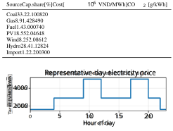
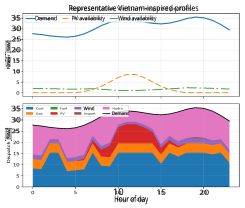
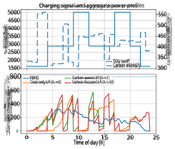
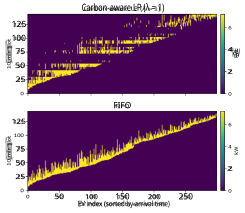
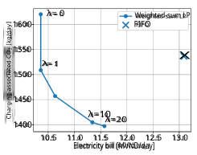
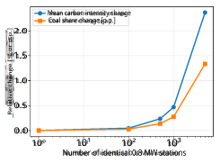

# A Multi-Criterion Approach to Smart EV Charging with CO2 Emissions and Cost Minimization 

Giuseppe C. Calafiore, Luca Ambrosino, Khai Manh Nguyen, Minh Binh Vu, Riadh Zorgati, Laurent El Ghaoui 

**_Abstract_ — We study carbon-aware smart charging in a fossil-dominated grid by coupling a simplified hydro-thermalrenewable dispatch model with a tractable linear charging scheduler. The case study is informed by Vietnam’s regional data. Thermal units remain dominant, renewables are timevarying, and hydropower is modeled through a single reservoir budget. From the day-ahead dispatch we derive hourly carbon intensity and a corresponding carbon-cost signal; these are combined with a local time-of-use tariff in the EV charging problem. The resulting weighted-sum linear program is multiobjective: by sweeping the trade-off coefficient, we recover the supported Pareto frontier between electricity cost and chargingassociated emissions. In a 300-EV public-charging scenario with a 0.8 MW feeder cap, the proposed carbon-aware scheduler preserves the 19.8% bill reduction of a cost-only optimizer while lowering charging-associated emissions by 7.3%; a more carbon-focused tuning still remains 12.6% cheaper and 9.3% cleaner than a FIFO baseline. A hydro-sensitivity study shows that changing the reservoir budget by** _±_ **20% moves the mean grid carbon intensity from 360 to 466 g/kWh, yet the carbonaware scheduler remains consistently cheaper and cleaner than FIFO. The dispatch and charging LPs solve in few milliseconds on a standard desktop computer, showing that the framework is lightweight enough for repeated day-ahead studies.** 

## I. INTRODUCTION 

Electric vehicles can strongly reduce transport emissions, but the grid-side benefit depends on _when_ charging takes place and on the carbon content of the electricity actually used [1]. This is particularly relevant in systems where coal and gas still provide a large share of daily generation. In such contexts, a charging strategy that reacts only to electricity prices may shift demand toward hours that are cheap for the operator but not necessarily clean for the environment. 

The two research threads behind this paper are well established. On the supply side, unit-commitment and dispatch formulations with emission-aware objectives are standard tools for studying cost–carbon trade-offs in hydro-thermal and renewable-rich systems [2], [3]. On the demand side, smart EV charging is often posed as a linear or convex scheduling problem that reallocates flexible charging load across time [4]–[6]. A parallel literature shows that the environmental impact of charging depends strongly on marginal or time-varying supply conditions: Ontario and Great Britain studies quantify large timing effects [7], [8], while optimization-based formulations schedule EV demand 

L. Ambrosino and G. C. Calafiore are with the Department of Electronics and Telecommunications, Politecnico di Torino, Italy. K. M. Nguyen, M. B. Vu and L. El Ghaoui are with VinUniversity, Hanoi, Vietnam. R. Zorgati is with EDF Lab Paris-Saclay, France. 

directly against marginal-emissions or real-time carbonintensity signals [9], [10]. The gap we address is practical rather than theoretical: public charging operators often need a lightweight workflow that turns system-level generation information into a carbon-aware charging signal without solving one large, tightly coupled market-clearing problem. 

We therefore adopt a three-step pipeline. First, a simplified hourly dispatch model computes a least-cost Vietnaminspired hydro-thermal-renewable mix over one representative day. Second, the dispatch is converted into hourly carbon intensity and carbon cost. Third, these quantities are combined with a local time-of-use (TOU) tariff in a linear charging scheduler. The contribution is not a new class of unit-commitment models; rather, it is a compact and reproducible way to merge (i) thermal, renewable and hydro resources, (ii) a locally consistent tariff instead of foreign wholesale prices, (iii) an optimization-based costonly baseline besides FIFO, (iv) an explicit Pareto analysis, and (v) computational-burden reporting. 

The decoupled architecture is appropriate when the charging station behaves as a _price taker_ . In the experiments, the station peak is 0.8 MW whereas the representative system peak is 35.5 GW, hence the charging hub accounts for only 2 _._ 25 _×_ 10_−_5 of system peak demand. For larger aggregations, the coupling would need to be iterated or formulated as a bilevel/fixed-point problem; we return to this in the discussion. 

## II. VIETNAM-INSPIRED DISPATCH LAYER 

## _A. Generation mix and representative profiles_ 

The supply-side model integrates thermal sources, renewables, hydropower, imports, and associated CO2 emissions. Table I reports the source shares used to scale installed capacity from official Vietnam Electricity (EVN, the stateowned national electric utility of Vietnam) data, together with dispatch costs and life-cycle emission factors from the sources used in the original study [11], [16]. Monetary quantities are handled in VND _/_ MWh. 

The demand trajectory is a representative 24-hour system profile spanning 26.1–35.5 GW. Photovoltaic (PV) availability is modeled through a daylight bell shape, while wind follows a milder diurnal profile consistent with Vietnamscale wind modeling based on reanalysis-driven virtual wind farms [12]. Hydropower is aggregated into a single energyequivalent reservoir, following the usual virtual-reservoir simplification employed in system studies and motivated by the importance of hydro flexibility in Vietnam [13]. This 

TABLE I 

SOURCE DATA USED IN THE DISPATCH LP. 

Fig. 1. Representative-day retail electricity price, based on the EVN business-customer time-of-use tariff. 

aggregation keeps the hydro discussion in the paper while avoiding plant-level binaries that are not needed for the charging application. 

Thermal units (coal, gas, fuel, oil) are assumed fully available up to their aggregate capacity, so the thermal layer plays the role of the dispatchable backbone. Fuel oil therefore appears as a costly emergency option rather than a routinely used source. Renewable production is curtailable and no stationary battery is included, which means that midday PV surplus cannot be shifted to the evening peak. The hydro parameters are set to _s_ 0 = 110 GWh, _<u>s</u>_ = 30 GWh, _<u>s</u>_ = 160 GWh, with a flat inflow of 7 GWh/h; these values keep hydro energy in the same order of magnitude as its annual contribution while still leaving enough freedom to arbitrage between midday and evening demand. 

The representative-day retail electricity price profile in Figure 1 is constructed from the Vietnam Electricity business-customer retail tariff under Decision No. 1279/QDBCT dated 9 May 2025, using the published off-peak, standard, and peak rates together with EVN’s time-of-use period definitions; the official half-hour boundaries are mapped to our hourly discretization, [15], [17]. For the weekday representative day considered here, off-peak hours are taken overnight, peak hours occur in the late morning and early evening, and the remaining hours are standard-price periods, consistent with EVN’s published TOU schedule [17]. 

## _B. Hydro-thermal-renewable dispatch model_ 

Let _pt,j_ denote the power produced at hour _t ∈ {_ 1 _, . . . ,_ 24 _}_ by source _j ∈G_ := _{_ coal, gas, fuel, PV, wind, import, hydro _}_ . For thermal units and imports, 0 _≤ pt,j ≤ p_ ¯ _t,j_ with time-invariant upper bounds. For PV and wind, _p_ ¯ _t,j_ is hour-dependent. Hydropower output is denoted _ht_ := _pt,_ hydro, and the reservoir state _st_ is measured in energy-equivalent MWh. Problem (1) below is the day- 

Fig. 2. Representative demand and renewable availability (top), and optimal hourly dispatch mix (bottom). 

ahead least-cost dispatch model: over the representative 24hour horizon, it determines the hourly generation mix that satisfies demand while respecting source-capacity constraints and hydro-storage dynamics. 

$$
min p,s 24 t=1 j\in{}{}G cjpt,j s.t. j\in{}{}G pt,j = Dt, t = 1, . . . , 24, st = st-1 + ϕt -ht, t = 1, . . . , 24, s \leq{}{}st \leq{}{}s, 0 \leq{}{}pt,j \leq{}{}pt,j. (1) \sum{}{}\sum{}{} \sum{}{}
$$

Here, _p_ := _{pt,j}t_ =1 _,...,_ 24; _j∈G_ and _s_ := _{st}t_24 =1denotethe decision variables, where _pt,j_ is the generation scheduled from source _j_ at hour _t_ , and _st_ is the hydro-reservoir energy level at hour _t_ . The parameter _cj_ denotes the unit generation cost of source _j_ (in VND/MWh), _Dt_ is the system demand at hour _t_ , and _<u>pt,j</u>_ is the available capacity of source _j_ at hour _t_ (constant for thermal units and imports, timevarying for PV and wind). Moreover, _ϕt_ is the exogenous hydro inflow during hour _t_ , while _<u>s</u>_ and _<u>s</u>_ are the minimum and maximum admissible reservoir levels, respectively; _s_ 0 is the given initial reservoir level. Finally, since hydropower is included in _G_ , one has _ht_ = _pt,_ hydro. With a one-hour time discretization, _pt,j_ , _ht_ , and _ϕt_ can be interpreted equivalently as hourly average powers or as hourly energies. 

All costs are linear because we seek a lightweight proxy for carbon-aware charging, not a full mixed-integer unitcommitment problem (UCP) with startup logic. This simplification is intentional: the charging layer only needs an hourly signal indicating the likely marginal carbon intensity of electricity supply, not the exact commitment of every individual plant. Accordingly, (1) should be interpreted as a dispatch-based surrogate for carbon-intensity estimation rather than as a full market-clearing simulator. 

A second modeling point concerns emissions interpretation. Since the charging station is small at the scale considered here, the carbon signal derived from (1) is used as an _associated_ emission factor for each hour, not as a strict marginal-emission oracle. The charging schedule reshapes the station load, but at this scale it does not materially change the national mix itself. Figure 2 shows the resulting schedule. Hydropower is heavily used around the evening peak, PV depresses midday coal usage, and fuel oil is essentially absent because of its high cost. Over the representative day, the model dispatches 41.0% coal, 13.2% gas, 33.1% hydro, 7.0% PV, 5.6% wind, and negligible fuel/imported power. 

III. FROM DISPATCH TO CARBON-AWARE CHARGING 

## _A. Carbon signal_ 

From the dispatch solution we compute the hourly grid carbon intensity 

$$
κt = � j\in{}{}G γjpt,j � j\in{}{}G pt,j , t = 1, . . . , 24, (2)
$$

where _γj_ is the source-specific emission factor from Table I. In the representative day, _κt_ ranges from 308 to 562 gCO2/kWh. To turn it into a monetary penalty, we use a reference carbon price _τ_ and define 

$$
πCO2 t = τ κt/106 [VND/kWh], (3)
$$

which yields an hourly carbon-cost signal. We set _τ_ = 1 _._ 785 _×_ 106 VND/tCO2, consistent with a 70 USD/t reference level discussed in carbon-pricing studies [14]. 

## _B. Smart charging LP and Pareto interpretation_ 

We consider a public station serving _N_ = 300 EVs over a 24-hour horizon with 10-minute slots. Vehicle _i_ is present on the interval _Ti_ , requests _Ei_ kWh, and can receive at most _<u>p</u>_ = 7 _._ 2 kW per slot. Let _yi,t_ be the energy assigned to EV _i_ in slot _t_ , and let _C_ = 0 _._ 8 MW be the feeder cap. The charging problem is 

$$
min y T � t=1 � πe t + λπCO2 t �N � i=1 yi,t s.t. � t\in{}{}Ti yi,t = Ei, i = 1, . . . , N, N � i=1 yi,t \leq{}{}C∆, t = 1, . . . , T, 0 \leq{}{}yi,t \leq{}{}p ∆, t \in{}{}Ti, (4)
$$

where ∆= 1 _/_ 6 h and _πt__e_is the TOU retail tariff faced by the station operator. In the experiments, _πt__e_follows the published EVN business-customer TOU bands, with off-peak hours overnight, standard pricing through most daytime hours, and peak periods in the late morning and early evening [15], [17]. 

The coefficient _λ ≥_ 0 is not an ad hoc tweak but the usual weighted-sum scalarization parameter: sweeping it recovers the supported Pareto frontier of the convex bi-objective problem. 

TABLE II 

CHARGING-SIMULATION PARAMETERS. 

|Quantity|Value|
|---|---|
|EVs per day|300|
|Time step ∆|10 min|
|Per-EV limit _p_|7.2 kW|
|Feeder cap _C_|0.8 MW|
|TOU tariff [off/std/peak]|1609 / 2887 / 5025 VND/kWh |
|Reference carbon price _τ_|1_._785_×_106 VND/tCO2|
|Mean delivered energy|3.82 MWh/day|

A FIFO baseline is used for comparison, but we also compare against the optimization-based cost-only scheduler obtained from (4) by setting _λ_ = 0. The FIFO baseline is a non-anticipative first-in-first-out charging rule. Specifically, EVs are ordered according to their arrival times, and at each hour the available charging power is assigned first to the earliest-arrived vehicles that are still connected and not yet fully charged. Charging is continued for each such vehicle up to its per-vehicle charging limit or remaining energy requirement, and any residual charging capacity is then passed to the next vehicle in the queue. Hence, FIFO does not optimize against electricity price or carbon intensity; it simply prioritizes vehicles in order of arrival while enforcing the same connection windows, battery requirements, and aggregate charging constraints as in (4). 

## IV. NUMERICAL RESULTS 

## _A. Simulation setup_ 

The charging horizon contains _T_ = 144 slots of 10 minutes each. We generate _N_ = 300 EVs through a two-cluster arrival model: half of the vehicles belong to a morning peak and half to an afternoon/evening peak. Parking durations are random, and each energy request is a beta-distributed fraction of the energy that could be delivered within the corresponding availability window. This keeps every instance feasible while producing heterogeneous flexibility levels across users. The station is modeled as a public charging hub with identical AC ports and a single feeder bottleneck. 

The tariff values in Table II correspond to the EVN business-customer TOU bands [15]. Our setup keeps the local charging economics grounded in Vietnamese retail conditions, while letting the dispatch layer provide a gridconsistent carbon signal. 

## _B. Representative day charging profiles_ 

In Figure 3, the top panel reports the TOU tariff and the dispatch-derived carbon intensity; the bottom panel shows the aggregate charging power under FIFO, a cost-only LP, a balanced carbon-aware LP ( _λ_ = 1), and a more carbonfocused scheduler ( _λ_ = 10). 

The qualitative behavior can be easily interpreted: the FIFO policy reacts only to vehicle arrivals and therefore charges whenever demand appears. The cost-only LP shifts energy toward off-peak price bands, especially at night and outside the evening peak. Because the cheapest hours are not always the “cleanest” ones, this policy actually _increases_ 

Fig. 3. TOU tariff and dispatch-derived carbon signal (top), and aggregate charging power for four policies (bottom). 

charging-associated emissions. The carbon-aware policies push additional energy toward low-carbon windows around late morning and early afternoon, when coal is partially displaced by PV and hydro. 

On the representative day, FIFO yields a 13.09 MVND bill and 1536.6 kg of charging-associated CO2. The costonly LP cuts the bill to 10.36 MVND but raises emissions to 1620.4 kg. By contrast, the balanced carbon-aware LP with _λ_ = 1 achieves the _same_ bill, 10.36 MVND, while reducing emissions to 1508.8 kg. A more aggressive setting, _λ_ = 10, lowers emissions further to 1404.8 kg with a moderate bill increase to 11.34 MVND. Hence, in this scenario the multi-criterion formulation is useful even relative to another optimizer, not only relative to FIFO. 

## _C. Charging heatmaps_ 

The aggregate power curves in Figure 3 hide an important structural difference between FIFO and the optimizer. Figure 4 visualizes the slot-by-slot allocation matrix for the representative day. FIFO produces the expected staircase pattern: vehicles begin charging immediately after arrival and continue until their demand is satisfied. The carbonaware LP instead interrupts and resumes many sessions, using user flexibility to move energy from carbon-intensive periods toward cleaner ones. This is exactly the type of temporal reshaping that a myopic arrival-ordered policy cannot reproduce. 

## _D. Pareto frontier and Monte Carlo study_ 

Figure 5 shows the supported Pareto frontier for the representative day. Several nearby _λ_ values collapse to the same point, which is normal in weighted-sum scalarizations of LPs: the optimizer stays on one exposed extreme point until the scalar weight becomes large enough to activate a different supporting hyperplane. The key message is that 

Fig. 4. Charging heatmaps for the representative day. EVs are sorted by arrival time. The optimizer uses interruptions and resumptions, while FIFO follows a nearly monotone service pattern. 

Fig. 5. Supported Pareto frontier obtained by sweeping _λ_ in (4). FIFO is shown for reference. 

FIFO is dominated by multiple Pareto points, while the costonly LP is merely one frontier endpoint. 

To verify that the conclusions are not tied to one arrival pattern, we simulate 100 random days. Each day serves on average 3.82 MWh of charging energy. Table III reports average electricity bill, charging-associated CO2, and mean solve time. The cost-only LP remains the cheapest policy, but also appears to be the “dirtiest”. Setting _λ_ = 1 preserves the same 19.8% bill reduction as the cost-only policy while decreasing emissions by 7.3% relative to that cost-only schedule and by 2.5% relative to FIFO. With _λ_ = 10, emissions drop by 9.3% versus FIFO while the bill is still 12.6% lower. 

The computational burden is very small: the dispatch LP in (1) solves in about 2 ms, and the charging LP in (4) solves in 

TABLE III 

AVERAGE RESULTS OVER 100 RANDOM DAYS 

(MEAN DELIVERED ENERGY: 3.82 MWH/DAY). 

|Policy|Bill [MVND/day]|CO2 [kg/day]|Solve time [s]|
|---|---|---|---|
|FIFO|13.03|1556.8|–|
|LP, _λ_= 0|10.45|1637.3|0.030|
|LP, _λ_= 1|10.45|1518.2|0.033|
|LP, _λ_= 10|11.39|1412.4|0.034|

TABLE IV REPRESENTATIVE-DAY SENSITIVITY TO HYDRO AVAILABILITY. 

|Hydro case|Mean CI|Coal|FIFO|LP, _λ_= 1|LP, _λ_= 10|
|---|---|---|---|---|---|
||[g/kWh]|[%]|[kg/day]|[kg/day]|[kg/day]|
|0.8_×_ hydro|465.7|47.6|1737.0|1706.8|1580.4|
|1.0_×_ hydro|413.0|41.0|1536.6|1508.8|1404.8|
|1.2_×_ hydro|360.3|34.3|1346.9|1300.1|1248.2|

roughly 0.03 s. This is compatible with repeated day-ahead studies, sensitivity analyses, or online re-optimization when updated arrivals become available. 

## _E. Hydro sensitivity and seasonal interpretation_ 

Hydropower is the main low-carbon _dispatchable_ resource in the model. We next perturb the hydro budget by scaling the initial storage, storage bounds, and hourly inflow by factors 0.8 and 1.2 around the nominal case, while keeping thermal and renewable capacities fixed. This is not a full seasonal study, but it is enough to reveal how hydrology reshapes the carbon signal seen by the charging station. Table IV reports the resulting mean system carbon intensity, coal share, and representative-day charging emissions. 

The sensitivity highlights the distinct roles of renewables and hydro. PV mainly opens low-carbon windows around late morning and early afternoon, whereas hydro determines how much of the late-afternoon and evening demand can be served without additional coal. When hydro is scarce, the average carbon intensity rises from 413.0 to 465.7 g/kWh and coal share increases from 41.0% to 47.6%. In that harder case, the balanced scheduler still attains the same 10.36 MVND electricity bill as in the nominal scenario, while the more carbon-focused schedule remains 8.2% cheaper and 9.0% cleaner than FIFO. 

When hydro is abundant, the grid becomes cleaner throughout the day and the price–carbon conflict weakens, but it does not disappear. The balanced policy yields 1300.1 kg/day, compared with 1346.9 kg/day for FIFO, and the _λ_ = 10 schedule reaches 1248.2 kg/day while still costing only 10.90 MVND/day, i.e., 16.7% below FIFO. Hence the exact Pareto frontier is hydrology-dependent, as expected, yet the structural message is robust: updating the dispatch scenario is enough to adapt the charging signal, without changing the charging LP itself. 

From an operator viewpoint, Table IV suggests a useful rule of thumb. Hydro-poor days mainly increase the penalty for charging into the evening peak, because coal and gas remain on the margin for longer; hydro-rich days, instead, 

Fig. 6. Ex-post feedback check: the optimized charging profile is replicated across many identical stations and added back to the dispatch layer. The one-way coupling is accurate for a single station and remains reasonable for moderate aggregations. 

create cleaner shoulder hours but do not eliminate the bill advantage of nighttime charging. The optimal response is therefore not a fixed heuristic such as “always defer to the night” or “always absorb midday PV,” but a schedule that explicitly tracks both the retail tariff and the supply mix. 

This observation also clarifies why the CO2 term is kept separate from the retail tariff instead of being absorbed into one ad hoc price signal. The electricity bill is driven by the station-facing TOU tariff, while the environmental signal is dispatch- and scenario-dependent. Keeping the two ingredients distinct makes the formulation easier to interpret and lets the same charging LP be reused under different hydrology, renewable availability, or carbon-price assumptions. 

## _F. Feedback sensitivity and limitations_ 

The proposed decomposition should be interpreted carefully. Because the charging station is tiny relative to the national system in this study, using the dispatch only as an _exogenous_ carbon signal is defensible. To quantify this statement, Figure 6 feeds the optimized hourly charging profile back into the dispatch layer after scaling it by the number of identical 0.8 MW stations. With one station, the change in mean daily carbon intensity is essentially zero. Even with 1000 identical stations, the mean carbon intensity rises by only 0.47% and coal share by 0.28 percentage points. The decoupled approximation becomes visibly less reliable only for extremely large aggregations (5000 identical stations in this stylized calculation, roughly 4 GW of coincident feeder capacity). 

A second limitation is perfect foresight: the scheduler assumes the arrival/departure windows and the day-ahead carbon signal are known. The present results therefore represent an optimistic upper bound, albeit a useful one. Extending problem (4) with stochastic or robust constraints is straightforward and aligns with recent robust EV-charging formulations [5], [6]. 

## V. CONCLUSIONS 

This paper presented a tractable framework for carbonaware EV smart charging that couples a simplified dayahead power-system dispatch model with an optimizationbased charging scheduler. The study is grounded on realistic regional data from Vietnam. The dispatch layer provides an hourly estimate of the carbon intensity of electricity supply by accounting for the interplay among thermal generation, renewable availability, hydropower, imports, and demand, while the charging layer exploits this signal jointly with timeof-use electricity prices to schedule aggregate EV charging. 

The numerical results show that the proposed approach can substantially reshape charging demand away from carbonintensive hours while preserving economic efficiency and operational feasibility. Compared with a FIFO rule, the optimization-based policies achieve lower charging cost and lower emissions, and the weighted formulation makes the cost–emissions trade-off explicit through a tunable parameter. The additional sensitivity and Monte Carlo analyses further indicate that the main qualitative conclusions are robust to variations in hydropower availability and fleet-level charging uncertainty. 

Overall, the results support the view that even a lightweight dispatch-informed signal can materially improve charging decisions in practice, without requiring a full market simulator or plant-level commitment model. Future work will consider finer network and reserve constraints, stochastic renewable and inflow models, and larger heterogeneous EV fleets with distributed implementation and real-time recourse. 

## REFERENCES 

- [1] IEA, “Global EV Outlook 2024,” International Energy Agency, Paris, 2024. 

- [2] N. Zhang, Z. Hu, D. Dai, S. Dang, M. Yao, and Y. Zhou, “Unit commitment model in smart grid environment considering carbon emissions trading,” _IEEE Trans. Smart Grid_ , vol. 7, no. 1, pp. 420– 427, 2016. 

- [3] M. R. Norouzi, A. Ahmadi, A. E. Nezhad, and A. Ghaedi, “Mixed integer programming of multi-objective security-constrained hydro/thermal unit commitment,” _Renewable and Sustainable Energy Reviews_ , vol. 29, pp. 911–923, 2014. 

- [4] J. Liu, G. Lin, S. Huang, Y. Zhou, Y. Li, and C. Rehtanz, “Optimal EV charging scheduling by considering the limited number of chargers,” _IEEE Trans. Transportation Electrification_ , vol. 7, no. 3, pp. 1112– 1122, 2021. 

- [5] W. Sun, F. Neumann, and G. P. Harrison, “Robust scheduling of electric vehicle charging in LV distribution networks under uncertainty,” _IEEE Trans. Industry Applications_ , vol. 56, no. 5, pp. 5785–5795, 2020. 

- [6] G. C. Calafiore, L. Ambrosino, K. M. Nguyen, R. Zorgati, D. NguyenNgoc, and L. El Ghaoui, “Robust power scheduling for smart charging of electric vehicles,” in _Proc. European Control Conference_ , 2025, pp. 2796–2801. 

- [7] Y. Gai, A. Wang, L. Pereira, M. Hatzopoulou, and I. D. Posen, “Marginal greenhouse gas emissions of Ontario’s electricity system and the implications of electric vehicle charging,” _Environmental Science & Technology_ , vol. 53, no. 13, pp. 7903–7912, 2019. 

- [8] Y. Tang, T. T. Cockerill, A. J. Pimm, and X. Yuan, “Reducing the life cycle environmental impact of electric vehicles through emissionsresponsive charging,” _iScience_ , vol. 24, no. 12, Art. no. 103499, 2021. 

- [9] R. Tu, Y. J. Gai, B. Farooq, D. Posen, and M. Hatzopoulou, “Electric vehicle charging optimization to minimize marginal greenhouse gas emissions from power generation,” _Applied Energy_ , vol. 277, Art. no. 115517, 2020. 

- [10] K.-W. Cheng, Y. Bian, Y. Shi, and Y. Chen, “Carbon-aware EV charging,” in _Proc. IEEE Int. Conf. Commun., Control, and Computing Technologies for Smart Grids (SmartGridComm)_ , 2022, pp. 186–192. 

- [11] Vietnam Electricity, “Overview of national power sources in 2023,” 2024. [Online]. Available: https://en.evn.com.vn/d6/ news/Overview-of-national-power-sources.aspx 

- [12] I. Staffell and S. Pfenninger, “Using bias-corrected reanalysis to simulate current and future wind power output,” _Energy_ , vol. 114, pp. 1224–1239, 2016. 

- [13] V. Nguyen-Tien, R. J. Elliott, and E. A. Strobl, “Hydropower generation, flood control and dam cascades: A national assessment for Vietnam,” _Journal of Hydrology_ , vol. 560, pp. 109–126, 2018. 

- [14] I. Parry, “The case for carbon taxation,” _Finance & Development_ , International Monetary Fund, Dec. 2019. 

- [15] Vietnam Electricity, “Retail electricity tariff (Decision No. 1279/QD-BCT dated 9 May 2025),” 2025. [Online]. Available: https://en.evn.com.vn/d6/news/ RETAIL-ELECTRICITY-TARIFF-9-28-252.aspx 

- [16] World Nuclear Association, “Carbon dioxide emissions from electricity,” 2024. [Online]. Available: https: //world-nuclear.org/information-library/ energy-and-the-environment/ carbon-dioxide-emissions-from-electricity 

- [17] Vietnam Electricity, “Time-of-use electricity charge,” 2016. [Online]. Available: https://en.evn.com.vn/d/en-US/news/ TIME-OF-USE-ELECTRICITY-CHARGE-60-28-264 

