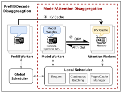
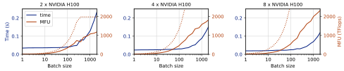
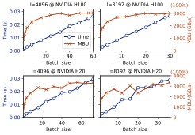
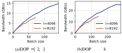
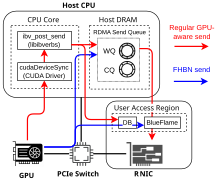
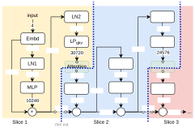
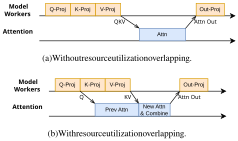
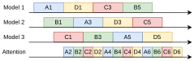
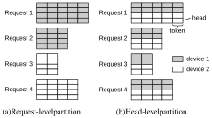
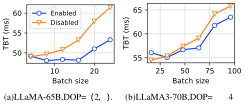

# **Efficient Heterogeneous Large Language Model Decoding with Model-Attention Disaggregation** 

Shaoyuan Chen1 Wencong Xiao2 Yutong Lin1 Mingxing Zhang1 Yingdi Shan1 Jinlei Jiang1 Kang Chen1 Yongwei Wu1 

1Tsinghua University 

2ByteDance 

## **Abstract** 

Transformer-based large language models (LLMs) exhibit impressive performance in generative tasks but also introduce significant challenges in real-world serving due to inefficient use of the expensive, computation-optimized accelerators. Although disaggregated serving architectures have been proposed to split different phases of LLM inference, the efficiency of decoding phase is still low. This is caused by the varying resource demands of different operators in the transformer-based LLMs. Specifically, the attention operator is memory-intensive, exhibiting a memory access pattern that clashes with the strengths of modern accelerators, especially for long context requests. 

To enhance the efficiency of LLM decoding, we introduce model-attention disaggregation. This approach leverages a collection of cheap, memory-optimized devices for the attention operator while still utilizing high-end accelerators for other parts of the model. This heterogeneous setup ensures that each component is tailored to its specific workload, maximizing overall performance and cost efficiency. Our comprehensive analysis and experiments confirm the viability of splitting the attention computation over multiple devices. Also, the communication bandwidth required between heterogeneous devices proves to be manageable with prevalent networking technologies. To further validate our theory, we develop and deploy Lamina, an LLM inference system that incorporates model-attention disaggregation in a distributed heterogeneous cluster. Experimental results indicate that Lamina can provide 16 _._ 1 _∼_ 90 _._ 1% higher estimated throughput than existing solutions with similar costs. 

## **1 Introduction** 

## **1.1 Motivation** 

Disaggregated serving architectures for large language models (LLMs) [40, 41, 59] have recently emerged as efficient frameworks for handling generative inference requests. The core concept of disaggregation involves allocating separate 

resources for different tasks to improve resource utilization. This approach aligns perfectly with LLM processing, which can be divided into two distinct phases. The first phase, known as the prefill phase, processes all input tokens from the prompt in parallel and is computation-bound. The second phase, i.e., the decode phase, generates the output tokens one after another, and is typically memory-bound. 

Splitting the two phases of inference reduces interference between different requests and allows for more flexible parallel configurations for the two phases. To better leverage the differing characteristics of each phase, several methods propose using heterogeneous hardware to reduce the cost of disaggregated serving [12, 59]. Specifically, flagship all-rounder GPUs like NVIDIA H100 integrate high-performance computational units and high-bandwidth memory (HBM) within a single package, delivering good performance for LLM inference. However, as shown in Table 1, specialized accelerators optimized for either computation or bandwidth can be significantly cheaper than the H100 in terms of TFLOPS per dollar/watt (e.g., TPU v6e) or bandwidth per dollar/watt (e.g., NVIDIA H20), but not both. This cost disparity arises because all-rounder GPUs combine powerful computation units, HBM controllers, and high-bandwidth internal buses within a single chip. Such integration leads to larger die sizes and increased transistor counts, posing additional challenges for chip designing, packaging, and thermal management [21, 25, 55], all of which drive up the design and manufacturing cost. 

According to our analyses and experiments, while the separation of resources works well for the prefill nodes, we identified significant inefficiencies in the decoding phase. For instance, as analyzed in section 2, the computation resource utilization is often below 20% when serving the LLaMA370B model with H100. This is primarily due to the limited GPU memory size, which cannot accommodate the large aggregated KV cache for large batches, as well as the low arithmetic intensity of the attention operators. 

A detailed examination reveals that the decoding phase mainly comprises two types of operators, each facing distinct resource bottlenecks. Linear transformations, includ- 

1 

Table 1: H100, H20, and TPU v6e specifications. 

||**H100**|**H20**|**TPU v6e**[7]|
|---|---|---|---|
|**BF16 TFLOPs**|989|148|918|
|**Memory capacity**|80 GB|96 GB|32 GB|
|**Memory bandwidth**|3.35 TB/s|4.0 TB/s|1.64 TB/s|
|**Power rating**|700 W|400 W|unlisted|
|**Inter-chip bandwidth**|450 GB/s|450 GB/s|448 GB/s|
|**Network bandwidth**|400 Gbps|400 Gbps|200 Gbps|
|**Price per chip [2]**|$11.06/hr|$4.63/hr *|$2.70/hr|

*: As H20 is not readily available on cloud service providers, the listed price is estimated using the relative complete system cost against H100. 

ing QKVO projections and feedforward networks, are implemented with _generalized matrix-matrix multiplications_ (GEMMs). Since all requests multiply with the same parameter matrices in these operators, processing multiple requests in batch can avoid repeated parameter loads from memory, making these operators primarily computation-bound. In contrast, the self-attention operator is memory-bound. This pivotal operator requires each request to read its own, distinct KV cache, resulting in a _batched generalized matrix-vector multiplication_ (BGEMV) pattern. Increasing batch sizes does not improve the computation resource utilization but places additional pressure on the already limited memory capacity. 

## **1.2 Our Contributions** 

In light of the above findings, we propose an innovative concept called **model-attention disaggregation** , as illustrated in Figure 1. This approach involves further disaggregating the decoding phase by creating two pools of heterogeneous accelerators: one optimized for computational power and the other for memory resources. We use the memory-optimized accelerators to store the KV caches and process self-attention operators, while the computation-optimized devices handle all other operators. By choosing the most suitable devices for each kind of operators, this architecture further increases hardware utilization and leads to better overall performance. Moreover, different LLMs and workloads present varying computation and memory resource requirements. Homogeneous accelerator solutions, however, can only provide **a fixed ratio of computation and memory resources** , which can result in resource wastage. For instance, as context lengths increase, the memory capacity needed to store the KV cache expands accordingly; with a fixed resource ratio, a substantial portion of computational resources remains underutilized when processing requests with long contexts. By pooling heterogeneous accelerators, we can adjust the number of each kind of accelerators to better match the LLM and workload and hence improve resource utilization. 

The primary challenge associated with attention offloading arises from the substantial communication demands be- 

Figure 1: The disaggregated architecture of LLM serving. 

tween heterogeneous accelerators when sending and receiving the inputs and outputs of self-attention operators. Unlike the original prefill-decode disaggregation, where the KV cache is transferred only once between the prefill nodes and the decode nodes, our model-attention disaggregation architecture requires inter-GPU communication for every layer of the model. Even worse, communication between heterogeneous GPUs must rely on _data center networks_ (DCNs), such as Ethernet and InfiniBand, which provide only ~10% of the bandwidth of _inter-chip interconnects_ (ICIs) like NVLink between homogeneous GPUs. If not handled properly, this frequent communication would introduce high network roundtrip times (RTTs) to the token generation latency, worsening the user experience. 

To assess the practicality of our novel disaggregated architecture, we first conduct a detailed quantitative study indicating that these concerns are manageable in the context of LLM inference. In subsection 3.1, we provide profiling and analysis to determine the minimum bandwidth threshold between different accelerator pools. Our findings reveal that 200/400Gbps DCNs, widely deployed in current AI-oriented data centers, suffice for attention offloading. However, this can only be achieved if the inter-GPU communication is carefully implemented and optimized, which is not possible for off-the-shelf communication libraries such as NCCL or Gloo. 

To realize the idea of model/attention disaggregation, we implement two specific techniques to reduce the networking overhead. First, we designed and deployed a fully hostbypassed network stack. Leveraging PCIe P2P capabilities, this revamped network stack enables GPUs to directly talk with network interface cards (NICs), eliminating the need for host CPU synchronization and involvement for network transmissions. The network data is also directly read from and written to GPU memory without passing through host memory. Additionally, we developed an automated model 

2 

converter. This converter splits the model computation graph into slices, interleaved with attention operators. It also reorders the operators and coordinates the computation and communication pipelines, enabling effective overlapping of communication and computation tasks. 

Moreover, with model-attention disaggregation, running the inference process with only a single batch results in underutilization of resources, as the memory device remains idle when the computation device is active, and vice versa. To address this inefficiency and resource wastage, we introduce staggered pipelining, an advanced technique that increases the hardware utilization. With staggered pipelining, we run multiple batches concurrently and optimize the workflow to ensure that both the computation and memory devices are working simultaneously, minimizing resource waste and maximizing system performance. 

To validate our analysis, we develop and evaluate Lamina, a distributed heterogeneous LLM inference system with model-attention disaggregation. We also conduct extensive evaluations to mirror the real-world LLM services with a heterogeneous cluster made up of H100 and H20 GPUs, tested with various models and request traces collected from the production environments of LLM service providers. Experimental results that our system can achieve up to 16 _._ 1 _∼_ 90 _._ 1% higher throughput with similar hardware cost than existing solutions. Although Lamina experiences a slightly larger latency than homogeneous solutions for the larger (2 _._ 39 _×_ on average) batch sizes and additional networking and scheduling costs, the latency is still within the SLO of online interactive LLM services. 

## **2 Background: The Underutilization of GPUs in LLM Decoding** 

To comprehensively understand the challenges and limitations present in current LLM decoding implementation with homogeneous hardware, this section will provide a detailed performance analysis of LLM decoding with LLaMA3-70B model as a representative LLM. The specific notations used in this analysis are explained in Table 2. 

Table 2: Notations used in the performance analysis. The values for LLaMA3-70B are also presented. 

|**Parameter**|**Description**|**Typical Value**|
|---|---|---|
|_N_|Number of parameters in LLM.|70 billion|
|_d_|Hidden dimension.|8192|
|_L_|Layers of the LLM.|80|
|_G_|GQA group size.|8|
|_e_|Bytes per element.|2|
|_B_|Batch size.|1_∼_1024|
|_l_|Sequence length.|128_∼_32768|

## **2.1 Preliminaries** 

Modern large language models (LLMs) primarily rely on the transformer architecture [49]. In a transformer-based LLM, each input token is first mapped to a word embedding of dimension _d_ . These embeddings then pass through a series of transformer blocks. The final output embeddings are multiplied by a sampling matrix to generate the predicted likelihoods for the next token. 

Within each transformer block, the input embeddings are projected into three distinct vectors: query ( _qi_ ), key ( _ki_ ), and value ( _vi_ ), all of which have the same dimension _d_ as hidden states. These vectors are processed through an _attention operator_ to compute attention scores. The attention scores are then weighted by a matrix _W_ out to produce the output embeddings _yi_ of the attention layer. 

$$
qi = Wqxi, ki = Wkxi, vi = Wvxi, ai = n \sum{}{} j=1 softmax �q⊤ i kj \sqrt{}{} d � vj, ⋆ yi = Woutai.
$$

The output _yi_ is then passed through a feedforward network that scales it into an intermediate vector space, followed by another matrix multiplication to scale it back: 

$$
x′ i = Wproj \cdot{}{} fact (Wfc \cdot{}{}yi).
$$

Although the transformer block involves various transformations, there are actually only two kind of computationally expensive operations, which are the attention operator (denoted by _⋆_ in the equations) and the other matrix projection steps. Thus, in the following of this section, we will conduct a quantitative analysis based on the roofline model [50] and experimental measurements to evaluate these two kinds of operators. This analysis will highlight the differing characteristics of attention and non-attention operators during the decoding phase, which explains why current LLM decoding implementations with homogeneous hardware often lead to underutilization of GPUs, thus motivating the need for heterogeneous architectures. 

## **2.2 Hardware Underutilization** 

### **2.2.1 The Underutilization in Non-Attention Operators** 

To improve GPU utilization in LLM decoding, continuous batching is widely adopted [16, 20, 46]. By processing multiple inputs concurrently, the model parameters in GPU memory can be reused, making the workload more computationintensive. For a batch of _B_ requests, the non-attention operator requires approximately 2 _NB_ floating-point operations. Additionally, these operators involve loading model parameters _eN_ and reading/writing a total of 2 _eBd_ input and output data from 

3 

Figure 2: Measured time consumption and MFU of non-attention operators in LLaMA3-70B during one decode iteration. Results with different tensor parallelisms are presented. The dotted lines indicate the projected values using the roofline model. 

GPU memory. The resulting arithmetic intensity, <u>2</u> _<u>NB</u> e_ ( _N_ +2 _Bd_ ), increases rapidly with larger batch sizes. 

Figure 2 shows the latency and memory throughput utilization (MFU) of non-attention operators in LLaMA3-70B, measured on an NVIDIA H100 GPU, alongside projections based on the roofline model. For small batch sizes (less than 100), the workload is bandwidth-bound, with latency predominantly caused by accessing model parameters from GPU memory. In this regime, the MFU remains below 20%, indicating significant underutilization of computational resources. As the batch size increases, the workload transitions to being computation-bound, with an increase in latency. To optimize GPU resource utilization, larger batch sizes are preferred. But, achieving this is often constrained by the limited VRAM capacity, which cannot accommodate the required KV cache size, a limitation discussed in detail later. 

### **2.2.2 The Underutilization in Attention Operators** 

Different from the weight matrix projection operators, the attention operator, when processing a batch of requestss still performs a batched matrix-vector multiplication, where each query accesses and processes its own KV cache. As a result, the arithmetic intensity of the attention operator remains constant, irrespective of the batch size. This behavior makes attention operations memory-bound, and increasing the batch size does not improve resource utilization. More recent models have adopt _grouped-query attention_ (GQA), which splits _qi_ into a group of _G_ independent queries and reduce the size of _ki_ and _vi_ by a factor of _G_ . Each query goes through the attention computation with the same _ki_ and _vi_ and the outputs are simply concatenated. With GQA, the arithmetic intensity of attention operators is increased _G_ times, but is still quite low compared with other operators. 

As shown in Figure 3, the bandwidth utilization of attention operators remains above 70% even for small batch sizes, such as 20. This holds true even on memory-specialized accelerators like H20, which delivers only 15% of the TFLOPs of the H100. However, the batch size achievable for attention operations is constrained by GPU memory capacity, particularly due to the high memory demand of KV caches for longer 

Figure 3: Measured time consumption and model bandwidth utilization (MBU) of attention operators in LLaMA3-70B during one decode iteration. Results with different sequence lengths and hardware configurations are presented. 

context lengths. For example, with a context length of 8192, the full memory of an H100 can only hold KV caches for about 30 requests, with the actual number being lower due to memory used by model weights. Consequently, the limited batch size for attention operations becomes a key bottleneck, preventing efficient utilization of computational resources for non-attention operations during the decoding phase. 

## **3 Model-Attention Disaggregation** 

## **3.1 Overview** 

Current LLM serving systems often employ the same hardware for both attention and non-attention operators during the decode phase. However, our analysis reveals that this homogeneous approach leads to suboptimal resource utilization for both types of operators, due to the following reasons: 

- **Attention operators** demonstrate low arithmetic intensity, as each value retrieved from the KV cache participates in only a limited number of computations. Given 

4 

the disparity between memory bandwidth and computing power in modern high-performance accelerators, which favor high arithmetic intensity for efficient resource utilization, these operators tend to underutilize the computation resources of advanced GPUs. 

- For **non-attention operators** , while increasing the batch size could potentially enhance hardware utilization, this also results in a corresponding increase in the KV cache, which may exceed the available memory capacity. Consequently, to prevent memory overflow, the batch size is often kept small, which also leads to inefficient hardware utilization because of low arithmetic intensity. 

To address the above limitations of homogeneous decoding solutions, we propose the **model-attention disaggregation** architecture, which uses memory-specialized accelerators to store KV caches and compute the attention operators; the nonattention operators are still executed on original accelerators. A model-attention disaggregation system can use multiple devices of each kind to provide different _degrees of parallelism_ (DOPs). If we use _a_ GPUs for non-attention operators and _b_ memory-optimized GPUs for attention operators, we denote the DOP as ( _a, b_ ). 

By leveraging the cheaper memory-optimized devices, we can make larger batch sizes due to the extended memory capacities to store the KV caches, hence increasing the arithmetic intensity and promoting the hardware utilization of non-attention operators. Moreover, as the attention computation are moved to memory-optimized devices, we avoid wasting precious computation resources of high-end GPUs. 

One potential obstacle in implementing attention offloading lies in the necessity of data transmission between heterogeneous accelerators for each layer of the model, which could encounter the communication wall problem and increase the end-to-end decoding latency. We conduct a quantitative analysis to determine the required interconnect bandwidth for such transfers. Say we run one iteration with batch size _B_ , and we can afford α _×_ more latency for the networking overhead, the minimum interconnect bandwidth required can thus be calculated as 

$$
minimum bandwidth =size of data to transmit α\cdot{}{}computation time = (2+2/G)edBL α[MTIME(B)+ATIME(B,l)]
$$

where MTIME( _B_ ) and ATIME( _B, l_ ) is running time of nonattention and attention operators at batch size _B_ and sequence length _l_ , respectively, and they can be measured experimentally. The estimated minimum bandwidths required for different batch sizes, when α = 0 _._ 2, are calculated and presented in Figure 4. 

As evident from the data presented, the required interconnect bandwidth does not exceed 30 GB/s, even when dealing 

Figure 4: The required network bandwidth for decoding LLaMA3-70B using attention offloading with H100 and H20, with at most 20% latency slow-down for network overhead. 

with batch sizes as high as 300. This bandwidth demand can be easily met by networking technologies like 400Gbps Ethernet. Indeed, contemporary data centers already fulfill this requirement, where each GPU is typically equipped with an exclusive 400Gbps NIC to provide sufficient networking bandwidth for LLM training. 

For memory devices, the identical interconnection bandwidth is also necessary to communicate with computational devices. Since we employ a collection of more economical yet less powerful memory devices to collaboratively compute attention, the communication bandwidth needed for each individual device is significantly smaller. Consequently, we can choose to either equip each device with a less powerful NIC or install a single shared 400Gbps NIC to serve multiple memory devices. 

## **3.2 Practical Challenges** 

While model-attention disaggregation promises potential benefits in improving LLM decoding efficiency, it also introduces a set of formidable practical challenges. We discuss some of these challenges below. 

**Frequent network communications.** By separating the attention operator from computation-optimized devices to memory-optimized devices, we introduce cross-machine data communications within each model layer. Even though the interconnect bandwidth in existing data centers is sufficient for attention offloading, we found that networking latency might still be a problem for efficient LLM decoding. With attention offloading, we have **layer-wise data transfer** between GPUs on different nodes, which may be up to thousands round-trips per second. These frequent network transfers might significantly increase the decoding time due to the accumulated network latencies. Hence, we need a refurnished, latency-optimized, GPU-aware networking stack for optimal performance of model-attention disaggregation. 

**Software engineering challenges.** With model-attention disaggregation, we are moving the execution of _attention operator_ , an intermediate operation of the transformer block, to other devices. This requires complicated and destructive 

5 

modifications to the existing LLM codebase. Specifically, we have to dissect the models into separate slices that do not align with the modular structure of the transformer-based LLMs. This process is not only labor-intensive and error-prone but also significantly increases maintenance complexity. Hence, automated tools to help slice the models and perform relevant optimizations are highly desirable. 

**Difficult execution overlapping.** In a heterogeneous disaggregated system, various devices such as compute-optimized GPUs, memory-optimized GPUs, and NICs can be utilized simultaneously. Hence, we might achieve significant execution time reduction if the execution of operations occupying different devices could be overlapped. However, in the transformers architectures of current LLMs, attention operators and model operators are tightly interleaved in a sequential manner, with the output of one operator being transmitted over the network for the input of the other. Consequently, operations that depend on distinct hardware resources cannot be effectively overlapped in time, leading to considerable resource underutilization. Therefore, careful orchestration of operations on various devices and efficient design of task pipelines are required to promote execution overlapping and increase resource utilization. 

## **4 System Design** 

We build Lamina, a distributed heterogeneous LLM decoding system that implements model-attention disaggregation and solves the related challenges. Lamina employs two kinds of acceleration devices: memory devices are used for storing KV cache and computing the attention operator, and computation devices are used for storing model parameters and computing other parts of the model. These two kinds of devices are interconnected with high-speed DCN, e.g., Infiniband or Ethernet. 

## **4.1 Fully Host-Bypassed Network Stack** 

The communication between GPUs across different nodes, often utilizing RDMA technologies, is a complex process that requires the coordination of multiple system agents, including the CPU, GPU, and NIC. To reduce GPU-aware networking overhead, GPUDirect RDMA (GDR) [3] is developed to allow the RDMA-capable NIC (RNIC) to directly access GPU memory. This eliminates the need for host memory as an intermediate buffer, thereby enhancing both network latency and bandwidth. However, the control path still requires CPU involvement and includes several steps, all of which lie on the critical path and contribute to network latency. Specifically, when transferring data using GPUDirect RDMA, the following steps are performed: 

1. The local CPU waits for all prior GPU kernels to complete, ensuring the data to be transmitted is ready. 

2. The local CPU submits a send _work request_ (WR) to the RNIC. 

3. The local RNIC processes the send WR, fetching the data from GPU memory and transmitting it over the physical network link. 

4. The remote RNIC receives the data and writes it to the GPU memory. 

5. The remote CPU waits for the RDMA receive operation to complete. 

6. The remote CPU launches the subsequent GPU kernels. 

Based on our experimental results, steps 1 through 5 may incur a latency of 60–70 µs. Furthermore, because we have to launch the kernel after the received data is ready, the GPU kernel launch overhead, which might be up to 20 µs, is also added to end-to-end latency. All these additional latencies pose a significant overhead for model-attention disaggregation, which must rely on frequent network communications. 

To reduce such networking overhead, we develop a _fully host-bypassed network_ (FHBN) stack, which **completely eliminates host CPU involvement** in both control and data paths of GPU-aware networking. We describe how FHBN performs send and recv operations below. 

**FHBN recv.** To implement the FHBN recv function, we employ the _device-side polling_ technique to await the completion of the recv operation. Specifically, we allocate a seqno variable on the receiver’s GPU memory. The sender increments the remote seqno with RDMA write after each send operation. The data send and seqno increment operations are batched in a single WR post and hence would not increase the end-to-end latency. When the receiver GPU is ready to receive and process the incoming data, it actively polls the value of seqno with a specialized GPU kernel. This approach not only eliminates the need for CPU involvement during the recv process, but also allows asynchronous launch of the polling kernel and subsequent computation kernels to the GPU stream. Therefore, the GPU kernel launch overhead is also removed from the critical path. 

**FHBN send.** The implementation of FHBN send, illustrated in Figure 5, is more involved as it necessitates the GPU to directly submit RDMA commands to RNIC. When the CPU submits a new RDMA WR to RNIC, it first enqueues the WR to the _work queue_ (WQ) in the host memory. Then, it tells the RNIC that there is outstanding work by ringing the _doorbell_ (DB), a special register in the _user access region_ (UAR) of the RNIC. The UAR is part of the RNIC’s mmio region and is mapped to the address space of unprivileged applications to allow kernel-bypass RDMA operations. All above steps are implemented in the RDMA userspace library (libibverbs). 

To enable direct RDMA command submission on GPUs, we have to allow GPUs to directly access the UAR via PCIe P2P. Specifically, we use the cudaHostRegisterIoMemory API to map the UAR into the GPU’s address space. Then, 

6 

Figure 5: Diagram of WR submission with FHBN send and conventional GPU-aware send implementations. 

we reimplement the RDMA command submission logic in CUDA device code. To further decrease latency, we leverage the BlueFlame mechanism, a hardware feature provided by Mellanox RNICs [4]. This approach allows the WR to be directly submitted to the RNIC with mmio write to UAR, eliminating the need for the RNIC to fetch the WR from host memory via an expensive PCIe DMA read. Note that the WR should still be enqueued into the WQ, as the hardware may occasionally miss the BlueFlame WR and fall back to the regular workflow, particularly under heavy loads. 

## **4.2 Automated Model Converter** 

### **4.2.1 Model Splitting** 

In the attention offloading architecture, different operators of the LLM might be executed on different hardware; hence, we need to partition the model into slices, which is achieved by cutting at the attention operators. It often involves significant modifications to the existing codebase, primarily because the desired cutting points do not align with the LLM’s inherent modular structure. This misalignment complicates the partitioning process and increases the risk of errors and inconsistencies within the heterogeneous system. 

To facilitate model partitioning, we develop an automated model splitter capable of transforming the LLM into individually invokable slices, illustrated in Figure 6. Given the LLM source code, the splitter uses symbolic execution to generate a weighted computation graph. The weight of each edge denotes the size of the data passed between the operators, which is derived from the model’s shape specification. 

Due to the presence of residual connections and other intricate model constructs, directly removing the attention operator does not always result in a disconnected computation graph. Therefore, we compute the _minimum weighted cut_ of 

Figure 6: The partitioned computation graph of an LLM. 

the remaining graph, from the input to the output of the attention operator. The edges in this minimum cut, representing the context that must be saved between slice invocations, are removed from the computation graphs. This process is iteratively applied to each attention operator, ultimately yielding _n_ + 1 model slices, where _n_ denotes the original number of the attention operators. 

### **4.2.2 Resource Utilization Overlapping** 

While the attention operators and other operators in a transformer block are executed sequentially, a closer examination of the attention computation reveals the potential for achieving partial overlapping of resource utilization. Given an attention query _q_ and the set of token indices _I_ , the attention computation can be carried out in a divide-and-conquer manner. Assume that _I_ can be written as the disjoint union of two subsets _I_ 1 and _I_ 2, and let 

$$
Aq(I) = \sum{}{} i\in{}{}I softmax �q⊤ki \sqrt{}{} d � vi, Sq(I) = \sum{}{} i\in{}{}I exp �q⊤ki \sqrt{}{} d � ,
$$

where _Aq_ ( _I_ ) is the attention output and _Sq_ ( _I_ ) is the denominator of softmax, then _Aq_ ( _I_ ) can be easily obtained by combining the partial attention results on _I_ 1 and _I_ 2, i.e., [ _Aq_ ( _I_ 1) _, Sq_ ( _I_ 1)] and [ _Aq_ ( _I_ 2) _, Sq_ ( _I_ 2)]: 

$$
Aq(I) = Aq(I1)Sq(I1)+Aq(I2)Sq(I2) Sq(I1)+Sq(I2) .
$$

During LLM decoding, we may divide the current token set into two partitions during attention computation: all previous tokens (prev) and the newly generated token (new). Note that [ _Aq_ (prev) _, Sq_ (prev)] can be computed as soon as _qn_ is ready; therefore, we may eagerly execute Q-Proj and transfer _qn_ , and then execute K-Proj, V-Proj and transfer _kn, vn_ to the attention 

7 

workers. As illustrated in Figure 7, this does not only improve the GPU utilization on both kinds of workers, but also reduces the end-to-end latency by hiding the communication behind the computation. 

Figure 7: Illustration of resource utilization overlapping by splitting the attention computation. 

The above attention splitting optimization is integrated in our automated model converter. After dissecting the original model, the converter will generate a serial program of each model slice by computing a topological order of its computation graph. During this topological sort, we always put the Q-Proj operator and all its dependencies as early as possible. Then, we insert the “send Q” instruction immediately after the Q-Proj operator and “send KV” at the end of this slice. 

## **4.3 Execution Pipelining** 

Due to the serial nature of transformer-based models, if there is only one batch under processing, the memory device is idle when the computation device is working, and vice versa. To address this resource underutilization problem and increase system throughput, we may run multiple batches concurrently in a pipelined fashion. With properly designed pipelining, better hardware utilization can be achieved without sacrificing latency. We propose the rotational staggered pipelining to solve this problem. 

Figure 8: Illustration of rotational staggered pipelining. 

Assume that we execute _n_ batches concurrently. Let _tm,ta_ represent the time required for executing one model slice and one attention operator, respectively. As illustrated in Figure 8, we deploy _n −_ 1 model replicas, with each replica starting its 

tasks at a time of _nt−m_ 1later than the previous one. All batches share a common set of memory devices to maximize aggregated memory bandwidth and improve memory utilization. For every batch, the KV cache is evenly partitioned across these devices. All memory devices jointly compute the attention operator for a single batch. The number of memory devices is selected to make _ta_ = _nt−m_ 1. After the attention opera- tor, each batch transitions to the next model replica according to a rotational schedule; that is, the _k_ th model slice of the _j_ th batch is executed on replica ( _j_ + _k_ ) mod ( _n −_ 1)+ 1. 

This rotational task scheduling, combined with the staggered execution intervals, guarantees seamless task transitions for each batch and ensures a conflict- and bubble-free workflow on each device. Furthermore, by increasing the number of concurrent batches, the overall inference latency can be reduced due to the decreased attention computation time. However, the rotational scheduling requires migrating batch execution contexts between computation devices. Note that when _n_ = 2, the context migration is unnecessary because both batches are executed within a single model replica. 

## **5 Implementation** 

Lamina is implemented with ~6000 lines of Python and C/C++ code, in addition to a few lines of CUDA code implementing custom kernels. The fully host-bypassed network stack is built on top of a modified version of rdma-core [6]. Lamina uses Ray [5] to facilitate task scheduling and worker placement in distributed heterogeneous environments. 

**Fault tolerance.** With attention-offloading, we have two different types of accelerators. Lamina addresses faults in these two types of accelerators with different approaches. Note that all request states, i.e., the KV caches, are only stored in the attention devices. Consequently, should any model worker experience a failure, we can seamlessly replace that worker with a functioning one, without losing any progresses. In case of an attention worker failure, we reconstruct the KV cache by using the prompt texts and already generated tokens, which are stored in the LLM service front-end. 

**Handling the prefill-decode transition.** During the prefill phase, the generated KV cache shall be transmitted to the attention workers for decoding. For each request, the global scheduler picks a set of model workers and attention workers to handle the decode phase. Like previous works [40, 59], the KV cache is asynchronously transferred in a layer-by-layer fashion to hide the communication latency behind computation. Moreover, the data transfer is controlled by the attention workers: the attention workers only reads the KV cache from prefill workers during the free periods between receiving QKV tensors from model workers. This approach minimizes interference with ongoing decoding tasks. 

**Attention parallelism.** Given the limited capability of a single device, we may use multiple memory devices to jointly 

8 

Figure 9: Work partition methods of the attention operator. 

store the KV caches and compute the attention operators. As depicted in Figure 9, the attention operators can be parallelized among memory devices in various ways. One method is to distribute different requests across different devices; an alternative strategy is to partition and distribute the attention heads, which can also be computed independently, to different devices. The head-level partitioning approach ensures a balanced workload distribution, whereas the request-level partitioning may result in load imbalance due to the differences in sequence lengths and therefore the KV cache sizes among requests. However, head-level partitioning has limited flexibility, as it requires the number of memory devices to be divisible by the number of attention heads. We opt for head-level partitioning in Lamina, which offers optimal load balancing. 

Table 3: Large language models used for evaluation. 

|**Model**|**Parameters**|_L_|_d_|_G_|
|---|---|---|---|---|
|LLaMA-33B|64.7 GB|60|6656|1|
|LLaMA-65B|130.1 GB|80|8192|1|
|LLaMA3-70B|137.5 GB|80|8192|8|

traces, including the average prompt tokens ( _lp_ ) and average generated tokens ( _lg_ ), are listed in Table 4. 

Table 4: Request traces used for evaluation. 

|**Trace**|**# Requests**|_lp_|_lg_|
|---|---|---|---|
|Azure-Conv|19366|1154.7|211.1|
|Azure-Code|8819|2047.8|27.9|
|Kimi-Conv|12031|12035.1|342.6|
|Kimi-TA|23608|8560.0|182.1|

**Baseline system.** We compare with vLLM [28], a state-ofthe-art LLM serving system optimized for high throughput. vLLM also integrates optimizations from other LLM inference systems, such as continuous batching from Orca [57]. We use vLLM with homogeneous H100 GPUs and use tensor parallel for multi-GPU inference. As Lamina only focuses on the decode phase, we modify vLLM to remove the prefill phase during evaluation for a fair comparison. 

## **6.1 Serving Performance** 

## **6 Evaluation** 

**Testbed.** We deploy Lamina on a real heterogeneous cluster with two kinds of GPU nodes. Each node consists of either eight H100 or H20 GPUs, and each GPU is paired with a dedicated ConnectX-7 NIC via PCIe switch. The GPU nodes are interconnected with 400 Gbps RoCE network. We use H100 as compute-optimized GPUs and H20 as memory-optimized GPUs for Lamina. 

**Models.** Lamina supports a wide variety of LLM architectures, including OPT [58], LLaMA [48], and LLaMA3 [9]. All these architectures have similar outlines and workload characteristics and only have minor differences irrelevant to system designs. Hence, as listed in Table 3, we choose LLaMA-33B, LLaMA-65B, and LLaMA3-70B for evaluations. All model parameters and KV caches are stored in FP16 format. 

**Workloads** To mirror the real-world LLM use cases, we use four request traces collected from the production systems of two LLM service providers, Azure [1, 40] and Kimi [41]. Due to data protection regulations, these traces only contain the sequence length of user requests but not the actual contents. Hence, we use requests of dummy tokens with the same sequence length for evaluation. The summaries of these 

We evaluate the serving performance of Lamina against vLLM using real-world request traces. We first use homogeneous and heterogeneous hardware settings of similar costs, listed in Table 5, for vLLM and Lamina, respectively. Compared with vLLM, Lamina replaces half of the H100 devices to H20, which is cheaper but provides more memory capacity and bandwidth. We measure the token generation throughput, time between tokens (TBT), and average batch size. 

Table 5: Equal-cost hardware configurations for evaluation. 

|**Model**|**Lamina**|**vLLM**|
|---|---|---|
|LLaMA-33B|DOP=(1,2) ($20.32/hr)|2_×_H100 ($22.12/hr)|
|LLaMA-65B, LLaMA3-70B|DOP=(2,4) ($40.64/hr)|4_×_H100 ($44.24/hr)|

As illustrated in Figure 10, Lamina consistently achieves 16 _._ 1 _∼_ 90 _._ 1% higher throughput than vLLM among all models and traces, given comparable hardware costs. This enhancement is primarily attributed to the larger batch size attained by Lamina, which is 2 _._ 39 _×_ of vLLM on average. These 

9 

Figure 11: Decoding throughput and hardware cost with various hardware configurations. The DOPs for Lamina and tensor parallelisms for vLLM are annotated in the plot. The configuration with best cost efficiency is bolded. 

results demonstrate that Lamina effectively leverages the extra memory capacity provided by memory-optimized devices to boost decoding throughput. Note that the throughput and batch size of LLaMA3-70B is much larger than LLaMA-33B and LLaMA-65B; this is because LLaMA3-70B adopts GQA with a group size of 8, which results in a much smaller KV cache size per request. 

Lamina experiences an increased token generation latency than vLLM. This can be attributed by two factors. First, Lamina adopts a larger batch size, which results in longer execution time on both model and attention workers. Second, the disaggregation of model and attention in Lamina may incur additional scheduling and networking overhead. Nevertheless, the end-to-end latency of Lamina can still meet the SLO requirements of interactive online LLM services in most cases. 

vLLM under various hardware configurations. Specifically, we adjust the DOPs for Lamina and the number of devices involving tensor parallelism for vLLM. As the results in Figure 11 shows, the throughput for Lamina rapidly increases with more attention workers added, which enables larger batch sizes. The addition of expensive model worker can only mildly improve the throughput by reducing the model-part execution latency. An exception is the LLaMA3-70B model, where the attainable batch size reaches 800 for DOP = (2 _,_ 4), which already saturates the computation resources on model workers; hence, adding more memory devices will not dramatically improve the throughput. This indicates that the optimal ratio between model and attention workers varies for different models and workloads. In practice, we may conduct a performance profiling and select the best hardware configuration. 

We also explore the decoding throughput of Lamina and 

10 

Figure 12: Token generation latency breakdown. 

## **6.2 Latency Breakdown** 

Latency is a crucial indicator of the service quality offered by LLM applications. In this subsection, we measure the time between tokens (TBT) across various system configurations, as well as the execution time for model and attention workers and the networking overhead. We use requests with fixed sequence lengths (4096 or 8192) as the workload and disable rotational pipelining to better reveal the time breakdown. 

As we can see from Figure 12, for smaller batch sizes, the model execution time dominates the token generation latency. The attention and networking latency rapidly increases for larger batch sizes, while the model execution time remains almost constant. This indicates that the computation resource utilization gets improved as batch size increases. Note that the observed TBT might be less than the sum of model worker time, attention worker time, and network time. This is due to the automated resource utilization overlapping optimization, which will be further profiled in subsection 6.4. 

## **6.3 Network Stack Optimizations** 

We evaluate the effectiveness of our fully host-bypassed network (FHBN) stack with a microbenchmark. Specifically, we conduct a ping-pong test between two GPUs located on distinct nodes, using NCCL, NCCL without GPUDirect RDMA, Gloo, and FHBN as the networking engine. The initiator GPU sends a varying amount of data to the remote GPU. Upon receiving the complete data, the remote GPU immediately sends it back to the initiator. We measure the round-trip time from the initiator GPU’s perspective, which encompasses the time interval from the completion of the kernel that generates the data for transmission to the start of the kernel that consumes 

the received data. 

Figure 13: Network ping-pong test between two GPUs on different nodes, interconnected with 400Gbps RoCE. 

As illustrated in Figure 13, for smaller data sizes, the roundtrip time is primarily determined by network latency. In this case, FHBN achieves an end-to-end latency of 33 _._ 0 µs, representing a 50.5% reduction compared to NCCL’s 66 _._ 6 µs latency. This improvement is attributed to the removal of host CPU involvement in data transmission, eliminating expensive host-device synchronization and PCIe transactions. This improvement justifies the efficacy of our fully host-bypassed network stack design. 

For larger payload sizes, the primary factor influencing networking time is the utilization of network bandwidth. In this scenario, FHBN reaches a peak network bandwidth of 45.7 GB/s, which corresponds to 91.4% of the line rate. Conversely, NCCL only attains a bandwidth of 35.5 GB/s. As a result, FHBN can also serve as a superior alternative to existing communication libraries for point-to-point transmission of large GPU memory blocks within DCNs. 

11 

## **6.4 Resource Utilization Overlapping** 

To assess the efficacy of resource utilization overlapping (subsubsection 4.2.2) implemented in our automated model converter, we conducted a series of experiments on the LLaMA65B and LLaMA3-70B models, with the optimization either enabled or disabled. We use request batches of varying sizes and the context length of each request is fixed at 4096. 

Figure 14: Time between tokens (TBT) results with automatic resource utilization overlapping enabled and disabled. 

As illustrated in Figure 14, the LLaMA-65B model experiences a significant improvement in performance, achieving up to a 13.2% with through automated resource utilization overlapping. The speedup is particularly notable for larger batch sizes, which produce larger KV tensors and result in greater latency reduction. The effectiveness is less pronounced for the LLaMA3-70B model, where the maximum latency reduction is only 3.5%. This is because LLaMA3-70B adopts GQA, whose KV size is 8 _×_ smaller. Consequently, there is less room for resource utilization overlapping in LLaMA3-70B. 

## **7 Discussion** 

**Generality of our techniques.** Although Lamina is built for model-attention disaggregation, relevant techniques can also be used to enable a wider range of fine-grained LLM disaggregation techniques in distributed heterogeneous environments. For example, LoRA [24] and Mixture-of-Experts (MoE) [18, 53] all add less computation-intensive operators to existing LLM architectures. Like Lamina, we may also offload the LoRA and MoE operators to less powerful but more economic remote accelerators to reduce the inference cost. Such operator-level disaggregations, unlike prefill-decode disaggregation, require frequent layer-wise communications and are considered not feasible unless an optimized networking stack like the one in Lamina is used. 

**Alternative heterogeneous devices.** In Lamina, we may use more specialized accelerating devices for optimal performance and cost. For example, we anticipate that Processingin-Memory (PIM) devices [13,22,26,29,30,32,47,54] will be a more suitable candidate for memory-optimized devices as they demonstrate even greater cost advantages alongside their larger capacity and higher bandwidth. Besides, we can also 

use CPU and DRAM for attention computation and KV cache storage. However, due to the relatively smaller bandwidth of host DRAM, it is preferable to also adopt sparse attention mechanisms [14, 52] to reduce the size of data read during attention computation. 

## **8 Related Work** 

**System optimizations for LLM Inference.** Splitwise [40] and DistServe [59] proposes prefill-decode disaggregation, which improves hardware utilization and minimizes the interference between the prefill and decode phases. Orca [57] proposes _continuous batching_ , that batches incoming requests in iteration granularity. Compared with whole-request batching, continuous batching greatly reduces resource waste caused by early termination during the decode phase. PagedAttention [28] focuses on memory management optimizations, using fine-grained KV cache management to reduce memory waste. PagedAttention can also be used to optimize various decoding scenarios, like beam search and shared prefixes. These optimizations can all be used in our system. FlexGen [44] is a heterogeneous LLM inference system employing layerand token-level task partitioning and scheduling. However, it does not account for the varying characteristics of different operators within a layer. LLM-tailored inference systems, like DeepSeed [11], Megatron-LM [45], and TensorRT-LLM [39], use optimizations of various aspects including kernel optimization [17, 23], advanced scheduling [8, 19, 33, 51], and efficient memory management [19]. 

**Speculative Decoding** The speculative decoding technology [31, 36, 38] enables parallel generation of multiple tokens for a single request during the decoding phase. This is done by _guessing_ the next few tokens using a smaller auxiliary model. These predicted tokens are then validated by the primary LLM. This validation of the predicted tokens can be executed in parallel, thereby enhancing the arithmetic intensity and reducing latency. However, speculative decoding can lead to a trade-off in throughput due to the auxiliary model’s overhead and the potential need for re-execution in case of misprediction. 

**Variations of the Attention Operator.** Researchers have developed many variations of the attention operator for large language models to mitigate the memory bottleneck. GQA [10] and MLA [34] are two recent attention mechanisms targeted for memory efficiency. Model quantization uses reduced-precision formats (e.g., FP8) to store KV caches. Various sparse attention mechanisms [14,15,27,35,37,42,43,56] have been adopted, focusing on a subset of all history keyvalue pairs during attention computation. All these modifications to the attention operator, however, might compromise the model quality. 

12 

## **9 Conclusion** 

In this paper, we present model-attention disaggregation, an innovative architectural approach to improve the efficiency of LLM decoding. This approach is motivated by the observation that the LLM decoding phase can be divided into computationintensive parts and memory-intensive parts (i.e., the attention operators). Hence, we may use computation- and memoryoptimized devices for each part to improve the hardware resource utilization. Moreover, by adjusting the To realize this idea, we design a revamped latency-optimized networking stack that facilitate the frequent data transfer between remote GPUs. We also develop automated tools for transforming and optimizing existing LLMs for model-attention disaggregation. We develop and deploy Lamina on a cluster comprising heterogeneous GPUs. Evaluation on traces collected from production systems show that Lamina provides 16 _._ 1 _∼_ 90 _._ 1% higher throughput than heterogeneous solutions with similar hardware costs. 

## **References** 

- [1] Azure llm inference trace 2023. https: //github.com/Azure/AzurePublicDataset/blob/ master/AzureLLMInferenceDataset2023.md. 

- [2] Cloud Computing Services | Google Cloud. https: //cloud.google.com/. 

- [3] GPUDirect RDMA. https://docs.nvidia.com/ cuda/gpudirect-rdma/. 

- [4] Mellanox adapters programmer’s reference manual. https://network.nvidia.com/files/doc-2020/ ethernet-adapters-programming-manual.pdf. 

- [5] Ray. https://www.ray.io/. 

- [6] RDMA core userspace libraries and daemons. https: //github.com/linux-rdma/rdma-core. 

- [7] TPU v6e specification. https://cloud.google.com/ tpu/docs/v6e. 

- [8] Amey Agrawal, Ashish Panwar, Jayashree Mohan, Nipun Kwatra, Bhargav S. Gulavani, and Ramachandran Ramjee. Sarathi: Efficient llm inference by piggybacking decodes with chunked prefills, 2023. 

- [9] AI@Meta. Llama 3 model card. 2024. 

- [10] Joshua Ainslie, James Lee-Thorp, Michiel de Jong, Yury Zemlyanskiy, Federico Lebrón, and Sumit Sanghai. Gqa: Training generalized multi-query transformer models from multi-head checkpoints, 2023. 

- [11] Reza Yazdani Aminabadi, Samyam Rajbhandari, Minjia Zhang, Ammar Ahmad Awan, Cheng Li, Du Li, Elton Zheng, Jeff Rasley, Shaden Smith, Olatunji Ruwase, and Yuxiong He. Deepspeed inference: Enabling efficient inference of transformer models at unprecedented scale, 2022. 

- [12] Anonymous. Hexgen-2: Disaggregated generative inference of LLMs in heterogeneous environment. In _Submitted to The Thirteenth International Conference on Learning Representations_ , 2024. under review. 

- [13] Kazi Asifuzzaman, Narasinga Rao Miniskar, Aaron R Young, Frank Liu, and Jeffrey S Vetter. A survey on processing-in-memory techniques: Advances and challenges. _Memories-Materials, Devices, Circuits and Systems_ , 4:100022, 2023. 

- [14] Iz Beltagy, Matthew E Peters, and Arman Cohan. Longformer: The long-document transformer. _arXiv preprint arXiv:2004.05150_ , 2020. 

- [15] Rewon Child, Scott Gray, Alec Radford, and Ilya Sutskever. Generating long sequences with sparse transformers. _arXiv preprint arXiv:1904.10509_ , 2019. 

- [16] Y. Choi, Y. Kim, and M. Rhu. Lazy batching: An sla-aware batching system for cloud machine learning inference. In _2021 IEEE International Symposium on High-Performance Computer Architecture (HPCA)_ , pages 493–506, Los Alamitos, CA, USA, mar 2021. IEEE Computer Society. 

- [17] Tri Dao, Daniel Haziza, Francisco Massa, and Grigory Sizov. Flash-decoding for long-context inference. https://crfm.stanford.edu/2023/10/12/ flashdecoding.html. 

- [18] Artyom Eliseev and Denis Mazur. Fast inference of mixture-of-experts language models with offloading, 2023. 

- [19] Jiarui Fang, Yang Yu, Chengduo Zhao, and Jie Zhou. Turbotransformers: An efficient gpu serving system for transformer models. In _Proceedings of the 26th ACM SIGPLAN Symposium on Principles and Practice of Parallel Programming_ , PPoPP ’21, page 389–402, New York, NY, USA, 2021. Association for Computing Machinery. 

- [20] Pin Gao, Lingfan Yu, Yongwei Wu, and Jinyang Li. Low latency rnn inference with cellular batching. In _Proceedings of the Thirteenth EuroSys Conference_ , EuroSys ’18, New York, NY, USA, 2018. Association for Computing Machinery. 

- [21] Amir Gholami, Zhewei Yao, Sehoon Kim, Coleman Hooper, Michael W Mahoney, and Kurt Keutzer. Ai and memory wall. _IEEE Micro_ , 2024. 

13 

- [22] Mingxuan He, Choungki Song, Ilkon Kim, Chunseok Jeong, Seho Kim, Il Park, Mithuna Thottethodi, and T. N. Vijaykumar. Newton: A dram-maker’s accelerator-inmemory (aim) architecture for machine learning. In _2020 53rd Annual IEEE/ACM International Symposium on Microarchitecture (MICRO)_ , pages 372–385, 2020. 

- [23] Ke Hong, Guohao Dai, Jiaming Xu, Qiuli Mao, Xiuhong Li, Jun Liu, Kangdi Chen, Hanyu Dong, and Yu Wang. Flashdecoding++: Faster large language model inference on gpus, 2023. 

- [24] Edward J. Hu, Yelong Shen, Phillip Wallis, Zeyuan Allen-Zhu, Yuanzhi Li, Shean Wang, Lu Wang, and Weizhu Chen. Lora: Low-rank adaptation of large language models, 2021. 

- [25] Wei Huang, Karthick Rajamani, Mircea R Stan, and Kevin Skadron. Scaling with design constraints: Predicting the future of big chips. _IEEE Micro_ , 31(4):16–29, 2011. 

- [26] Jin Hyun Kim, Shin-Haeng Kang, Sukhan Lee, Hyeonsu Kim, Yuhwan Ro, Seungwon Lee, David Wang, Jihyun Choi, Jinin So, YeonGon Cho, JoonHo Song, Jeonghyeon Cho, Kyomin Sohn, and Nam Sung Kim. Aquabolt-xl hbm2-pim, lpddr5-pim with in-memory processing, and axdimm with acceleration buffer. _IEEE Micro_ , 42(3):20–30, 2022. 

- [27] Nikita Kitaev, Łukasz Kaiser, and Anselm Levskaya. Reformer: The efficient transformer. _arXiv preprint arXiv:2001.04451_ , 2020. 

- [28] Woosuk Kwon, Zhuohan Li, Siyuan Zhuang, Ying Sheng, Lianmin Zheng, Cody Hao Yu, Joseph Gonzalez, Hao Zhang, and Ion Stoica. Efficient memory management for large language model serving with pagedattention. In _Proceedings of the 29th Symposium on Operating Systems Principles_ , SOSP ’23, page 611–626, New York, NY, USA, 2023. Association for Computing Machinery. 

- [29] Yongkee Kwon, Kornijcuk Vladimir, Nahsung Kim, Woojae Shin, Jongsoon Won, Minkyu Lee, Hyunha Joo, Haerang Choi, Guhyun Kim, Byeongju An, Jeongbin Kim, Jaewook Lee, Ilkon Kim, Jaehan Park, Chanwook Park, Yosub Song, Byeongsu Yang, Hyungdeok Lee, Seho Kim, Daehan Kwon, Seongju Lee, Kyuyoung Kim, Sanghoon Oh, Joonhong Park, Gimoon Hong, Dongyoon Ka, Kyudong Hwang, Jeongje Park, Kyeongpil Kang, Jungyeon Kim, Junyeol Jeon, Myeongjun Lee, Minyoung Shin, Minhwan Shin, Jaekyung Cha, Changson Jung, Kijoon Chang, Chunseok Jeong, Euicheol Lim, Il Park, Junhyun Chun, and Sk Hynix. System architecture and software stack for gddr6-aim. In _2022 IEEE Hot Chips 34 Symposium (HCS)_ , pages 1–25, 2022. 

- [30] Ann Franchesca Laguna, Arman Kazemi, Michael Niemier, and X. Sharon Hu. In-memory computing based accelerator for transformer networks for long sequences. In _2021 Design, Automation and Test in Europe Conference & Exhibition (DATE)_ , pages 1839–1844, 2021. 

- [31] Yaniv Leviathan, Matan Kalman, and Yossi Matias. Fast inference from transformers via speculative decoding, 2023. 

- [32] Wantong Li, Madison Manley, James Read, Ankit Kaul, Muhannad S. Bakir, and Shimeng Yu. H3datten: Heterogeneous 3-d integrated hybrid analog and digital compute-in-memory accelerator for vision transformer self-attention. _IEEE Transactions on Very Large Scale Integration (VLSI) Systems_ , 31(10):1592–1602, 2023. 

- [33] Zhuohan Li, Lianmin Zheng, Yinmin Zhong, Vincent Liu, Ying Sheng, Xin Jin, Yanping Huang, Zhifeng Chen, Hao Zhang, Joseph E Gonzalez, et al. AlpaServe: Statistical multiplexing with model parallelism for deep learning serving. In _17th USENIX Symposium on Operating Systems Design and Implementation (OSDI 23)_ , pages 663–679, 2023. 

- [34] Aixin Liu, Bei Feng, Bin Wang, Bingxuan Wang, Bo Liu, Chenggang Zhao, Chengqi Dengr, Chong Ruan, Damai Dai, Daya Guo, Dejian Yang, Deli Chen, Dongjie Ji, Erhang Li, Fangyun Lin, Fuli Luo, Guangbo Hao, Guanting Chen, Guowei Li, H. Zhang, Hanwei Xu, Hao Yang, Haowei Zhang, Honghui Ding, Huajian Xin, Huazuo Gao, Hui Li, Hui Qu, J. L. Cai, Jian Liang, Jianzhong Guo, Jiaqi Ni, Jiashi Li, Jin Chen, Jingyang Yuan, Junjie Qiu, Junxiao Song, Kai Dong, Kaige Gao, Kang Guan, Lean Wang, Lecong Zhang, Lei Xu, Leyi Xia, Liang Zhao, Liyue Zhang, Meng Li, Miaojun Wang, Mingchuan Zhang, Minghua Zhang, Minghui Tang, Mingming Li, Ning Tian, Panpan Huang, Peiyi Wang, Peng Zhang, Qihao Zhu, Qinyu Chen, Qiushi Du, R. J. Chen, R. L. Jin, Ruiqi Ge, Ruizhe Pan, Runxin Xu, Ruyi Chen, S. S. Li, Shanghao Lu, Shangyan Zhou, Shanhuang Chen, Shaoqing Wu, Shengfeng Ye, Shirong Ma, Shiyu Wang, Shuang Zhou, Shuiping Yu, Shunfeng Zhou, Size Zheng, T. Wang, Tian Pei, Tian Yuan, Tianyu Sun, W. L. Xiao, Wangding Zeng, Wei An, Wen Liu, Wenfeng Liang, Wenjun Gao, Wentao Zhang, X. Q. Li, Xiangyue Jin, Xianzu Wang, Xiao Bi, Xiaodong Liu, Xiaohan Wang, Xiaojin Shen, Xiaokang Chen, Xiaosha Chen, Xiaotao Nie, Xiaowen Sun, Xiaoxiang Wang, Xin Liu, Xin Xie, Xingkai Yu, Xinnan Song, Xinyi Zhou, Xinyu Yang, Xuan Lu, Xuecheng Su, Y. Wu, Y. K. Li, Y. X. Wei, Y. X. Zhu, Yanhong Xu, Yanping Huang, Yao Li, Yao Zhao, Yaofeng Sun, Yaohui Li, Yaohui Wang, Yi Zheng, Yichao Zhang, Yiliang Xiong, Yilong Zhao, Ying He, Ying Tang, Yishi Piao, Yixin Dong, Yixuan 

14 

Tan, Yiyuan Liu, Yongji Wang, Yongqiang Guo, Yuchen Zhu, Yuduan Wang, Yuheng Zou, Yukun Zha, Yunxian Ma, Yuting Yan, Yuxiang You, Yuxuan Liu, Z. Z. Ren, Zehui Ren, Zhangli Sha, Zhe Fu, Zhen Huang, Zhen Zhang, Zhenda Xie, Zhewen Hao, Zhihong Shao, Zhiniu Wen, Zhipeng Xu, Zhongyu Zhang, Zhuoshu Li, Zihan Wang, Zihui Gu, Zilin Li, and Ziwei Xie. Deepseek-v2: A strong, economical, and efficient mixture-of-experts language model, 2024. 

- [35] Hao Liu, Matei Zaharia, and Pieter Abbeel. Ring attention with blockwise transformers for near-infinite context, 2023. 

- [36] Xiaoxuan Liu, Lanxiang Hu, Peter Bailis, Ion Stoica, Zhijie Deng, Alvin Cheung, and Hao Zhang. Online speculative decoding, 2023. 

- [37] Zichang Liu, Jue Wang, Tri Dao, Tianyi Zhou, Binhang Yuan, Zhao Song, Anshumali Shrivastava, Ce Zhang, Yuandong Tian, Christopher Re, et al. Deja vu: Contextual sparsity for efficient llms at inference time. In _International Conference on Machine Learning_ , pages 22137–22176. PMLR, 2023. 

- [38] Xupeng Miao, Gabriele Oliaro, Zhihao Zhang, Xinhao Cheng, Zeyu Wang, Rae Ying Yee Wong, Alan Zhu, Lijie Yang, Xiaoxiang Shi, Chunan Shi, Zhuoming Chen, Daiyaan Arfeen, Reyna Abhyankar, and Zhihao Jia. Specinfer: Accelerating generative large language model serving with speculative inference and token tree verification, 2023. 

- [39] NVIDIA. Tensorrt-llm: A tensorrt toolbox for optimized large language model inference. https://github. com/NVIDIA/TensorRT-LLM. 

- [40] Pratyush Patel, Esha Choukse, Chaojie Zhang, Aashaka Shah, Íñigo Goiri, Saeed Maleki, and Ricardo Bianchini. Splitwise: Efficient generative llm inference using phase splitting, 2024. 

- [41] Ruoyu Qin, Zheming Li, Weiran He, Mingxing Zhang, Yongwei Wu, Weimin Zheng, and Xinran Xu. Mooncake: A kvcache-centric disaggregated architecture for llm serving. _arXiv preprint arXiv:2407.00079_ , 2024. 

- [42] Jiezhong Qiu, Hao Ma, Omer Levy, Scott Wen-tau Yih, Sinong Wang, and Jie Tang. Blockwise self-attention for long document understanding. _arXiv preprint arXiv:1911.02972_ , 2019. 

- [43] Aurko Roy, Mohammad Saffar, Ashish Vaswani, and David Grangier. Efficient content-based sparse attention with routing transformers. _Transactions of the Association for Computational Linguistics_ , 9:53–68, 2021. 

- [44] Ying Sheng, Lianmin Zheng, Binhang Yuan, Zhuohan Li, Max Ryabinin, Beidi Chen, Percy Liang, Christopher Ré, Ion Stoica, and Ce Zhang. Flexgen: High-throughput generative inference of large language models with a single gpu. In _Proceedings of the 40th International Conference on Machine Learning_ , ICML’23. JMLR.org, 2023. 

- [45] Mohammad Shoeybi, Mostofa Patwary, Raul Puri, Patrick LeGresley, Jared Casper, and Bryan Catanzaro. Megatron-lm: Training multi-billion parameter language models using model parallelism, 2020. 

- [46] Franyell Silfa, Jose Maria Arnau, and Antonio González. E-batch: Energy-efficient and high-throughput rnn batching. _ACM Trans. Archit. Code Optim._ , 19(1), jan 2022. 

- [47] Shrihari Sridharan, Jacob R. Stevens, Kaushik Roy, and Anand Raghunathan. X-former: In-memory acceleration of transformers. _IEEE Transactions on Very Large Scale Integration (VLSI) Systems_ , 31(8):1223–1233, 2023. 

- [48] Hugo Touvron, Thibaut Lavril, Gautier Izacard, Xavier Martinet, Marie-Anne Lachaux, Timothée Lacroix, Baptiste Rozière, Naman Goyal, Eric Hambro, Faisal Azhar, Aurelien Rodriguez, Armand Joulin, Edouard Grave, and Guillaume Lample. Llama: Open and efficient foundation language models, 2023. 

- [49] Ashish Vaswani, Noam Shazeer, Niki Parmar, Jakob Uszkoreit, Llion Jones, Aidan N. Gomez, Łukasz Kaiser, and Illia Polosukhin. Attention is all you need. In _Proceedings of the 31st International Conference on Neural Information Processing Systems_ , NIPS’17, page 6000–6010, Red Hook, NY, USA, 2017. Curran Associates Inc. 

- [50] Samuel Williams, Andrew Waterman, and David Patterson. Roofline: An insightful visual performance model for multicore architectures. _Commun. ACM_ , 52(4):65–76, apr 2009. 

- [51] Bingyang Wu, Yinmin Zhong, Zili Zhang, Gang Huang, Xuanzhe Liu, and Xin Jin. Fast distributed inference serving for large language models, 2023. 

- [52] Guangxuan Xiao, Yuandong Tian, Beidi Chen, Song Han, and Mike Lewis. Efficient streaming language models with attention sinks, 2024. 

- [53] Leyang Xue, Yao Fu, Zhan Lu, Luo Mai, and Mahesh Marina. Moe-infinity: Offloading-efficient moe model serving, 2024. 

- [54] Xiaoxuan Yang, Bonan Yan, Hai Li, and Yiran Chen. Retransformer: Reram-based processing-in-memory architecture for transformer acceleration. In _Proceedings of_ 

15 

_the 39th International Conference on Computer-Aided Design_ , ICCAD ’20, New York, NY, USA, 2020. Association for Computing Machinery. 

- [55] Zhuoping Yang, Shixin Ji, Xingzhen Chen, Jinming Zhuang, Weifeng Zhang, Dharmesh Jani, and Peipei Zhou. Challenges and opportunities to enable largescale computing via heterogeneous chiplets. In _2024 29th Asia and South Pacific Design Automation Conference (ASP-DAC)_ , pages 765–770. IEEE, 2024. 

- [56] Zihao Ye, Qipeng Guo, Quan Gan, Xipeng Qiu, and Zheng Zhang. Bp-transformer: Modelling longrange context via binary partitioning. _arXiv preprint arXiv:1911.04070_ , 2019. 

- [57] Gyeong-In Yu, Joo Seong Jeong, Geon-Woo Kim, Soojeong Kim, and Byung-Gon Chun. Orca: A distributed serving system for Transformer-Based generative models. In _16th USENIX Symposium on Operating Systems Design and Implementation (OSDI 22)_ , pages 521–538, 2022. 

- [58] Susan Zhang, Stephen Roller, Naman Goyal, Mikel Artetxe, Moya Chen, Shuohui Chen, Christopher Dewan, Mona Diab, Xian Li, Xi Victoria Lin, Todor Mihaylov, Myle Ott, Sam Shleifer, Kurt Shuster, Daniel Simig, Punit Singh Koura, Anjali Sridhar, Tianlu Wang, and Luke Zettlemoyer. Opt: Open pre-trained transformer language models, 2022. 

- [59] Yinmin Zhong, Shengyu Liu, Junda Chen, Jianbo Hu, Yibo Zhu, Xuanzhe Liu, Xin Jin, and Hao Zhang. DistServe: Disaggregating prefill and decoding for goodputoptimized large language model serving. In _18th USENIX Symposium on Operating Systems Design and Implementation (OSDI 24)_ , pages 193–210, 2024. 

16 

