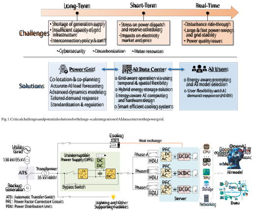
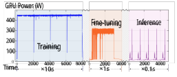
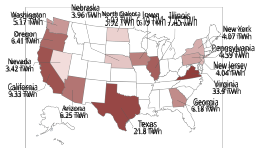
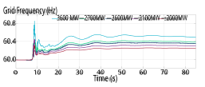

1 

# Electricity Demand and Grid Impacts of AI Data Centers: Challenges and Prospects 

Xin Chen, Xiaoyang Wang, Ana Colacelli, Matt Lee, Le Xie 

**_Abstract_ —The rapid growth of artificial intelligence (AI) is driving an unprecedented increase in the electricity demand of AI data centers, raising emerging challenges for electric power grids. Understanding the characteristics of AI data center loads and their interactions with the grid is therefore critical for ensuring both reliable power system operation and sustainable AI development. This paper provides a comprehensive review and vision of this evolving landscape. Specifically, this paper (i) presents an overview of AI data center infrastructure and its key components, (ii) examines the key characteristics and patterns of electricity demand across the stages of model preparation, training, fine-tuning, and inference, (iii) analyzes the critical challenges that AI data center loads pose to power systems across three interrelated timescales, including long-term planning and interconnection, short-term operation and electricity markets, and real-time dynamics and stability, and (iv) discusses potential solutions from the perspectives of the grid, AI data centers, and AI end-users to address these challenges. By synthesizing current knowledge and outlining future directions, this review aims to guide research and development in support of the joint advancement of AI data centers and power systems toward reliable, efficient, and sustainable operation.** 

**_Index Terms_ —AI data centers, electric load demand, grid impact, emerging challenges, potential solutions.** 

## I. INTRODUCTION 

**I** Nartificial intelligence (AI), particularly large language mod-recent years, the accelerated advancement of generative els (LLMs) [1] such as GPT [2], LLaMA [3], and Gemini [4], has fueled explosive growth in the AI industry. This surge is driving the rapid expansion of data center infrastructure and imposing unprecedented pressure on the power grid due to the immense electricity demands of ultra-scale AI workloads. For instance, training GPT-3 is estimated to have consumed 1.29 GWh of electricity [5], whereas the electricity consumption for training the larger-scale GPT-4 rose dramatically to an estimated over 50 GWh [6], [7], equivalent to nearly 0.1% of New York City’s annual electricity use. According to a recent International Energy Agency (IEA) report [8], global data centers consumed around 415 TWh of electricity in 2024 (about 1.5% of total global demand), and their consumption is projected to more than double by 2030 to around 945 TWh, with AI identified as the primary driver of this growth. 

X. Chen and X. Wang are with the Department of Electrical and Computer Engineering, Texas A&M University, USA. A. Colacelli is with the Environmental Engineering Department, Texas A&M University. M. Lee is with the Texas A&M Energy Institute. L. Xie is with the John A. Paulson School of Engineering and Applied Sciences, Harvard University. (Corresponding author: Xin Chen, email: xin <u>chen@tamu.edu)</u> 

The work was supported by the Consortium on AI and Large Flexible Load (CALL) at Texas A&M University. 

AI data centers are the computing facilities that are designed and optimized to execute large-scale AI workloads, such as the training and inference of LLMs, computer vision systems, and other compute-intensive AI applications. In contrast to traditional data centers, which primarily provide generalpurpose information technology (IT) services, AI data centers are architected to deliver the extreme computational performance required for advanced AI workloads (see Table I for a detailed comparison). This capability is enabled by dense configurations of high-performance computing hardware, such as Graphics Processing Units (GPUs) [9] and Tensor Processing Units (TPUs) [10], together with high-efficiency cooling systems [11]. Modern hyperscale AI data centers typically operate with power demand exceeding 100 MW [12], and some new campuses are planned to scale to the gigawatt (GW) level [13]. As a result, AI data centers are emerging as prominent large electric loads in the power grid, with distinct characteristics and demand patterns, including: 

- _High power density:_ Intensive AI workloads require substantially more power than conventional IT services. For instance, a ChatGPT query is estimated to consume about 2.9 Wh, nearly ten times the 0.3 Wh of a regular Google search [14]. In contrast to traditional server racks typically operating at 7-10 kW, AI computing racks can reach power densities of 30-100+ kW per rack [15]. Such extreme power density places considerable strain on data center architecture, cooling systems, and power grids. 

- _Fast and large variability:_ Across the training, finetuning, and inference phases, AI workloads can be highly variable and bursty [16], with power demand fluctuating sharply over very short timescales and remaining difficult to forecast [17]. For example, large-scale GPU clusters can produce power fluctuations of hundreds of megawatts within only seconds [18], [19], bringing significant challenges for system balancing and reliable grid operation. 

- _Grid interface via power electronics:_ AI data centers interface with the power grid primarily through power electronic converters, which exhibit fundamentally different dynamic behaviors from conventional electromechanical loads, such as low inertia, fast response dynamics, and harmonic distortions [20]. At scale, power electronicsbased AI computing loads can pose major threats to grid stability and cause severe power quality issues [21]. 

- _Geographic concentration:_ AI data centers tend to cluster in regions with low electricity prices, ample land and water resources, and favorable policy environments. In the U.S., for example, fifteen states (most notably Virginia, 

2 

Texas, and California) accounted for about 80% of total data center demand in 2023 [14]. Such concentration effect further intensifies local grid stress, and many regional grids cannot accommodate large-scale integration of data 

centers without substantial infrastructure upgrades [22]. 

As such, the rapid expansion of AI data centers poses unprecedented challenges to modern power systems. To sustain the fast pace of AI innovation and the continued growth of AI infrastructure, it is essential to establish a deep understanding of AI data center loads and their interactions with the grid, and to develop effective solution strategies that ensure reliable and sustainable power system operation. 

A growing number of recent articles and reports [7], [8], [14], [23]–[25] have drawn considerable attention to the surging electricity demand of AI data centers and their implications for the power sector. Prior works [11], [14] examine the energy use of AI data centers by analyzing the power consumption of key components, including AI computing, cooling systems, and auxiliary facilities, and present strategies for energyefficient operation. Reference [26] proposes a benchmarking framework for quantifying the footprint of energy, water, and carbon emissions of LLM inference workloads. Recent study [16] analyzes the transient dynamic behaviors of AI computing power consumption, develops high-level mathematical models for AI data center loads, and discusses the resulting disruptions and opportunities for power systems. Case studies on several power grids are conducted in [22] to assess their capacity to accommodate projected five-year AI data center load growth, deriving implications for long-term grid planning and management. However, the existing literature has mainly focused on the AI data center itself and presented high-level, preliminary, and fragmented discussions, while a comprehensive and indepth synthesis of AI data center load characteristics and their impacts on power grids, particularly the challenges from the grid’s perspective, remains lacking. 

To bridge this critical gap and help guide future research and development in the field, this paper presents a comprehensive review and vision that (i) details the overall architecture of AI data centers together with their load characteristics and patterns, and (ii) provides a systematic analysis of the multitimescale and multi-faceted challenges posed by the rapid growth of AI data centers to power grids, along with promising solutions for enabling their large-scale integration to the grid. Specifically, Section II presents an overview of AI data center infrastructure and its key components. Section III examines the characteristics and patterns of electricity demand across the AI model preparation, training, fine-tuning, and inference stages. Section IV analyzes the key challenges that AI data center loads bring to power systems across three interrelated timescales: long-term planning and interconnection, short-term operation and electricity markets, and real-time grid dynamics and stability. Other critical challenges, including cybersecurity, decarbonization, and water resources, are discussed as well. Section V presents potential solutions from the grid side, AI data center side, and AI end-user side to address these challenges and ensure reliable power system operation. Figure 1 visualizes the critical challenges discussed in Section IV and potential solutions introduced in Section V. At last, 

conclusions are drawn in Section VI. 

## II. OVERVIEW OF AI DATA CENTER 

This section provides an overview of the primary components of an AI data center, including IT hardware, electrical power infrastructure, cooling systems, and other supporting facilities. A typical architecture illustrating the interconnection of these components is depicted in Figure 2. Key distinctions between AI and conventional data centers are summarized in Table I and detailed below. 

## _A. IT Hardware Infrastructure_ 

The IT hardware infrastructure forms the computational backbone of an AI data center and encompasses the _computing_ , _storage_ , and _networking_ systems, which execute largescale model training and inference, manage massive datasets, and enable high-throughput communication. 

_1) Computing:_ AI workloads, such as LLM training and inference, require high-performance computing clusters designed to execute large-scale computations efficiently. These clusters typically integrate multi-core Central Processing Units (CPUs) with dense configurations of GPUs and TPUs [10]. These processing units are housed in high-density server nodes and stacked in standardized computer racks, allowing scalable deployment, efficient power distribution, and optimized cooling. Compared with conventional data centers, AI-oriented computing facilities concentrate substantially greater processing power within each rack. While a standard rack typically uses 7-10 kilowatt (kW), an AI-capable rack can demand 30 kW to over 100 kW [14], [25], with an average of more than 60 kW in dedicated AI facilities [15]. For example, the perrack power of NVIDIA’s GB200 NVL36 and NVL72 servers reaches about 66 kW and 120 kW [27], respectively. The substantially higher power densities pose critical challenges for power distribution and thermal management. 

_2) Storage:_ To sustain intense compute capabilities, scalable and high-performance data storage is necessitated to handle massive training datasets, intermediate model checkpoints, and inference data. Tiered storage components include: (i) the _hot tier_ , such as Non-Volatile Memory Express (NVMe) Solid State Drives (SSDs) arrays [28], provides ultra-low latency and high bandwidth to store active data for fast processing, (ii) the _warm tier_ , such as high-capacity hard disk drives (HDDs), is cost-effective for storing massive, less frequently accessed data, and (iii) the _code tier_ stores data in tape libraries or object storage systems for long-term archiving with less access speed. In addition, _distributed file systems_ , such as Lustre and Ceph [29], allow large-scale parallel reading and writing, while _object storage_ is used for archiving large datasets with long durability and redundancy [30]. Unlike conventional data centers, which balance capacity, cost, and speed, AI-optimized storage prioritizes maximum throughput and parallel access to prevent bottlenecks that idle expensive GPU clusters. 

_3) Networking:_ High-speed networking is critical to ensure that massive data flow efficiently between storage systems and compute nodes during large-scale AI workloads. The 

3 

Fig. 2. A typical architecture of an AI data center. (The transformer voltage levels and the presented double-conversion UPS system are illustrative examples; actual configurations vary across data centers). 

TABLE I 

COMPARISON BETWEEN TRADITIONAL DATA CENTERS AND AI DATA CENTERS 

|**Feature**|**Traditional Data Center**|**AI Data Center**|
|---|---|---|
|Primary Functions|General-purpose IT services (e.g., web/app hosting, databases, enterprise software hosting, cloud storage, email, virtualization, backup recovery)|AI/ML model training, fine-tuning, and inference (e.g., large language models, AI computer vision, generative AI)|
|Workload Pattern|Stable, predictable workloads|Dynamic, bursty, data-intensive, hard-to-predict workloads|
|Compute Hardware|CPU-centric, some GPUs|GPU/TPU-dense clusters|
|Rack Power Density|7 kW - 10 kW/rack, moderate density|30 kW - over 100 kW/rack, very high density|
|Storage|Balanced performance and capacity, mix of HDD and SSD|Very high-throughput SSD/NVMe storage with parallel file systems|
|Networking|Standard Ethernet, designed for general-purpose traffic patterns|Ultra-high-bandwidth, low-latency interconnects (InfiniBand, NVLink) for distributed AI workloads|
|Cooling|Primarily air cooling|Liquid cooling (direct-to-chip, immersion) or hybrid cooling|
|Facility Design|Optimized for mixed workloads, standard floor loading|Optimized for high-density AI workloads, reinforced structures for heavy racks and cooling equipment|

4 

networking system in an AI data center includes both _intranode interconnects_ , such as NVIDIA NVLink [31] for highbandwidth GPU-to-GPU communication within a server, and _inter-node fabrics_ , such as InfiniBand [32] or Ethernet with RDMA over Converged Ethernet (RoCE), for low-latency, high-throughput communication between servers and racks. Specialized network topologies, including fat-tree and dragonfly architectures [33], are adopted to optimize GPU-to-GPU communication in distributed training environments. In contrast, conventional data centers are usually designed for more heterogeneous workloads and general-purpose traffic patterns, and do not require such high bandwidth or low latency. 

## _B. Electric Power Infrastructure_ 

_1) Grid Power Supply:_ AI data centers are typically connected to the medium- or high-voltage distribution grid, while hyperscale facilities may connect directly to the transmission grid as their primary power source. Depending on the local grid infrastructure and facility scale, interconnection voltages can range from about 13.2 kV for small-scale installations (under 10 MW) to 115-230 kV for hyperscale sites (exceeding 100 MW) in the U.S. [12]. As illustrated in Figure 2, alternating current (AC) power enters the facility through high-voltage switchgear and protective devices, after which it is stepped down to operational voltage levels such as 480 V via on-site three-phase step-down transformers. These transformers not only reduce voltage but also provide electrical isolation between the utility grid and the facility’s internal power supply system. The power is then distributed through main distribution panels and power distribution units (PDUs) to supply IT server racks, cooling systems, and other supporting loads. For IT server racks, AC power is further converted to direct current (DC) via a power factor correction (PFC) rectifier, followed by a DC-DC converter for DC-side voltage regulation [34], ensuring stable and properly rated power delivery to IT equipment. Additionally, large AI data centers typically employ redundant utility feeders and transformers to ensure high reliability and continued operation even during partial grid outages [35]. 

_2) Uninterruptible Power Supply (UPS):_ UPS systems [36] serve as the first layer of protection against power interruptions in data center operations. They provide instantaneous electrical power from energy storage devices, such as batteries or flywheels, when the grid supply is disrupted, ensuring continuous operation during the transition period before backup generators start and synchronize with the load. UPS deployments commonly employ battery technologies such as valve-regulated lead-acid (VRLA), lithium-ion, and emerging solid-state chemistries [37]. Selection criteria include specific power and energy ratings, cycle life, energy density, thermal management requirements, and cost-effectiveness. UPS systems typically operate in three modes: normal mode, doubleconversion mode, and battery mode [34], and they are sized to handle high power demands of dense GPU and TPU racks in AI data centers. Modern UPS systems can also support gridinteractive capabilities, enabling data centers to shift loads or participate in demand response programs by temporarily supplying power from their stored energy. 

_3) Backup Generation:_ Backup generation provides emergency power to ensure that AI workloads remain uninterrupted in the event of a grid outage. Traditionally, diesel generators have been the most common solution because of low costs and their ability to quickly deliver large amounts of power to reliably support full critical IT load and essential cooling systems. To enhance sustainability, some facilities integrate on-site renewables, such as solar photovoltaic (PV) arrays or hydrogen fuel cell systems, to supplement or partially replace diesel generators [38]. For instance, Caterpillar and Microsoft successfully used hydrogen fuel cells to supply backup power to a data center for 48 hours [39]. These clean generations can operate in parallel with conventional generators during outages and supply power under normal conditions to reduce reliance on the grid. Most backup generation systems are equipped with automatic transfer switches, enabling them to start within seconds and seamlessly supply power during an outage. 

## _C. Cooling Facilities_ 

In AI data centers, cooling facilities are essential for dissipating the substantial heat generated by high-density computing equipment, particularly GPU- and TPU-based clusters, maintaining safe operation and preventing hardware failures. A variety of cooling technologies have been used in data centers [40], which are broadly classified into three main categories: (i) _Air cooling_ [41] circulates chilled air to absorb heat from IT equipment and expel it from the facility. Due to its low cost and operational simplicity, air cooling has been the mainstream choice for data centers with low rack power densities (below 20 kW), but it becomes inadequate for AI clusters with much higher rack power densities [11]. (ii) _Liquid cooling_ uses a liquid medium to remove heat from servers, which absorbs heat far more effectively than air and allows for very high rack power densities. For example, _liquid immersion cooling_ [42] submerges servers in engineered dielectric fluids, enabling safe, direct contact with electronic components and highly efficient heat removal; _direct-to-chip liquid cooling_ [43] circulates coolant through cold plates mounted directly on processors or other high-heat components, improving heat transfer without immersing the entire server in liquid. (iii) _Hybrid cooling_ [44] combines air and liquid cooling methods to optimize efficiency under varying workloads. This approach offers flexible operation, reduces energy consumption, and mitigates the high infrastructure cost and complexity of fully liquidcooled designs. The commonly used cooling methods are summarized in Table III. In practice, cooling selection depends on factors such as rack power density, energy efficiency targets, facility design constraints, capital and operational costs, and water availability. Particularly, rapidly growing AI workloads are accelerating the adoption of advanced liquid-based and intelligent cooling solutions. Further discussion on smart and efficient cooling techniques is provided in Section V-B. 

## _D. Other Supporting Facilities_ 

Beyond core IT hardware, electrical power infrastructure, and cooling systems, AI data centers incorporate additional supporting facilities that ensure reliable, secure, and efficient 

5 

TABLE II 

SUMMARY OF ELECTRIC POWER INFRASTRUCTURE IN AI DATA CENTERS 

|**Infrastructure Component**|**Function**|**Key Equipment**|**Details and Features**|
|---|---|---|---|
|Grid Power Supply|Primary electricity source|Switch and protective devices, step-down transformers, power distribution units, power converters|Connected to 13.2-230 kV grid, stepped down to 480/415 V using isolation transformers, redundancy ensures reliability|
|Uninterruptible Power Supply (UPS)|Instantaneous power during interruptions|Valve-regulated lead-acid (VRLA), lithium-ion, solid-state batteries, flywheels|Instantaneous power supply until backup starts, protect GPU/TPU racks, support grid-interactive capabilities and demand response|
|Backup Generation|Emergency power during grid outages|Diesel generators, solar PV, hydrogen fuel cells|Support critical IT and cooling loads, automatic transfer switches enable seamless transition, renewable integration|

TABLE III 

COMPARISON OF AI DATA CENTER COOLING TECHNIQUES 

|**Cooling Method**|**Heat Density Suitability**|**Efficiency** **(PUE)**|**Pros**|**Cons**|
|---|---|---|---|---|
|Air Cooling [41]|Low-moderate|_∼_1.1–2.9 [45]|Simple, low cost, widely adopted|Poor efficiency at high rack power (_>_30 kW)|
|Direct-to-Chip Liquid Cooling [43] Immersion Cooling [42]|High Very high (_>_50 kW/rack)|_∼_1.1–1.3 [46] _∼_1.02-1.04 [45]|Excellent thermal transfer, ideal for dense AI workloads Ultra-efficient, low noise, compact|Requires plumbing and infrastructure; risk of leaks Redesign needed, fluid cost, specialized hardware|
|Hybrid Cooling [43]|Medium-high|_∼_1.34-1.38 [47]|Flexible and adaptable to existing setups|System integration complexity|

operations. These include: (i) _physical infrastructure and layout_ encompass data hall design features such as hot/cold aisle containment to optimize airflow, raised floors or overhead trays for organized cabling and ventilation, and structural reinforcements to accommodate the weight of high-density server racks; (ii) _monitoring and control systems_ involve dense networks of temperature, humidity, and airflow sensors integrated into centralized building management platforms, along with fire detection and suppression systems employing inert gases or pre-action sprinklers to safeguard equipment; (iii) _security and access control_ measures combine physical barriers, continuous video surveillance, and multi-factor authentication to prevent unauthorized entry; and (iv) _auxiliary systems_ comprise redundant network links, battery energy storage systems, water treatment units for cooling operations, energy-efficient and emergency lighting, and dedicated office and maintenance spaces for on-site staff. 

## III. ELECTRICITY DEMAND OF AI DATA CENTERS 

This section analyzes the electricity demand of AI data centers. It firstly outlines their electricity consumption structure and efficiency, and then presents the characteristics and patterns of the dominant component, AI computing load, across different stages of AI workflows, including model preparation, training, fine-tuning, and inference. 

## _A. Electricity Consumption Structure and Efficiency_ 

AI data centers are emerging as one of the fastest-growing electricity consumers in the energy sector. According to the IEA report [8], global data centers consumed around 415 TWh of electricity in 2024, accounting for about 1.5% of total global 

electricity consumption. Looking ahead, the IEA projects that global data center electricity demand will more than double by 2030, reaching around 945 TWh, with AI identified as the primary driver of this growth [8]. The global data center electricity consumption is further discussed in Appendix A. 

Modern hyperscale AI facilities typically contract for power capacities exceeding 100 MW, with some campuses planned to scale to the gigawatt level [13], to support ultra-scale AI training and inference. According to the Electric Power Research Institute (EPRI) white paper [14], electricity consumption in a data center is mainly attributed to IT hardware equipment, which typically accounts for 40-50% of total load. Cooling systems represent the second-largest share, consuming approximately 30-40%, depending on the cooling technology and server rack density. The remaining 10-30% is from other supporting facilities, including lighting, office spaces, and monitoring and security systems. In AI data centers, the share of electricity consumed by IT equipment is higher and typically exceeds 60%, due to the adoption of high-density GPU/TPU racks and efficient liquid cooling systems. Power Usage Effectiveness (PUE) [14] is the most widely used metric to measure the energy efficiency of a data center, which is defined as the ratio (1): 

$$
PUE = Total Facility Electricity Consumption IT Equipment Electricity Consumption \geq{}{}1. (1)
$$

A lower PUE indicates greater energy efficiency, with a value of 1.0 signifying that all electricity is used for IT computation. A typical enterprise data center has a PUE of around 1.5-1.6, while modern large-scale facilities achieve a lower PUE below 1.3. For example, Google reports a comprehensive trailing twelve-month PUE of 1.09 across its large-scale data centers, with some sites operating under 1.06 [48]. Similarly, Meta’s 

6 

2024 Sustainability Report states an average PUE of 1.08 across its data centers [49]. It indicates that IT computing dominates the electricity consumption of these data centers. 

## _B. AI Computing Load Patterns at Different Stages_ 

Since AI computing constitutes the dominant share of electricity consumption in AI data centers, this subsection analyzes its load patterns and characteristics across the four main stages of AI model workflows: _preparation_ , _training_ , _fine-tuning_ , and _inference_ [3], [50]. 

_1) Preparation Stage:_ The preparation stage aims to prepare the AI model architecture and data before formal training begins [50]. It includes: (i) _model preparation_ : designing or selecting a base AI model, configuring model size, parameters, architecture, precision settings, and conducting earlyphase experimental testing; and (ii) _data acquisition and pre-processing:_ LLMs, which contain billions to hundreds of billions of parameters, require massive training datasets (often terabytes in size) that cover a broad range of content and are collected from diverse sources such as Wikipedia [51], CommonCrawl [52], BookCorpus [53], Reddit posts, GitHub codes, and other text datasets [1]. These raw datasets must be cleaned and preprocessed into training-ready formats (e.g., tokenization, normalization, augmentation). The extracttransform-load pipelines often rely on distributed computing clusters that consume significant electricity during large-scale pre-processing [54]. Well-designed AI models and carefully processed data are critical to the model training efficiency. Empirical results in [55] show that data-centric approaches, such as removing redundant samples from datasets or performing effective feature selection, can drastically reduce the energy consumption of model training by more than 90%, underscoring the importance of developing Green AI [55]. Nevertheless, the preparation stage is flexible and widely dispersed, with the workloads varying substantially depending on factors such as the choice of data processing libraries and tools [56], the deployment environment, and the workflow structure, making its electricity consumption difficult to quantify precisely. 

_2) Training Stage:_ The training stage is the most electricityintensive phase of AI development, particularly for LLMs. During this process, computing hardware operates at near-peak capacity for extended periods, which often runs continuously for days or weeks, resulting in a significant and sustained power draw. For example, training GPT-3 is estimated to have consumed 1.29 GWh of electricity [5]; this intensive process involved approximately 14.8 days of continuous computation on 10,000 NVIDIA V100 GPUs in a Microsoft data center [5]. Furthermore, training GPT-4 required an estimated over 50 GWh of electricity, approximately 40 times more than GPT-3, and equivalent to nearly 0.02% of California’s annual electricity consumption1 [6], [7]. Similar LLMs, such as Meta’s LLaMA series and Google’s Gemini, require tens of thousands of high-performance GPUs operating in parallel for training, 

> 1OpenAI does not officially disclose the energy consumption data for training its GPT models. The figures cited are estimates based on third-party analysis and research. 

resulting in exceptionally high electricity consumption, often ranging from hundreds to thousands of MWh. 

Typical electricity load patterns during the training stage include: (i) _Initial load ramp-up phase_ : at the beginning of training, resource utilization gradually increases as datasets are loaded into memory and distributed across computing nodes, creating a short period of escalating demand [17]. (ii) _Constant high demand_ : computing hardware operates at near-maximum utilization for prolonged periods with very high power load throughout the training stage [20]. (iii) _Rapid and large power fluctuations_ : the alternation between a power-intensive computation phase and a less power-demanding communication phase in the training stage often leads to large power swings [18]. Besides, tasks such as checkpointing, intermediate result saving, and large-scale data transfers between nodes can cause brief but pronounced spikes in electricity consumption; additional transient surges may occur when training is paused and resumed [17], [57]. (iv) _High cooling load_ : sustained fullpower operation of GPUs and supporting equipment produces substantial heat, requiring cooling systems to operate at elevated capacity, which significantly increases total energy use. Electricity consumption during the training stage is affected by many factors, such as AI model architecture and training configuration choices, such as batch size and numerical precision requirements. Several strategies have been proposed to improve training efficiency. For example, reference [58] showed that power-capping, which limits the maximum power a GPU can consume, enables a 15% decrease in energy usage with a marginal increase in overall computation time. Other approaches include dynamically adjusting training parameters based on convergence progress and implementing early stopping when performance improvements plateau. 

_3) Fine-tuning Stage:_ The fine-tuning stage adapts a pretrained AI model to a specific downstream task [59], such as legal text analysis, medical report summarization, or customer service chatbots. Since the AI model has already undergone extensive pre-training, fine-tuning typically requires substantially less computation and electricity than training from scratch. Empirical measurements in [60] show that pre-training BERT consumes electricity equivalent to approximately 400 to 45,000 fine-tuning runs, depending on the dataset size and task complexity. Nevertheless, as fine-tuning often involves smaller datasets, frequent evaluation cycles, and hyperparameter tuning, power use tends to be more variable. Rather than maintaining a sustained high baseline, fine-tuning workloads typically exhibit intermittent bursts of GPU utilization followed by lower activity periods. 

Typical electricity use patterns during fine-tuning include: (i) _moderate average demand_ , generally lower than full pretraining but varying by model size and dataset; (ii) _bursty workloads_ , with short periods of high consumption during forward/backward passes, validation, and hyperparameter exploration; and (iii) _cooling demand variability_ , with cooling loads fluctuating in step with computational bursts. Although a single fine-tuning run consumes far less energy than pretraining, its much higher frequency across numerous organizations implies that fine-tuning can cumulatively represent a non-negligible share of total lifecycle energy consumption, un- 

7 

derscoring the need to enhance its efficiency. For example, reference [61] introduced GreenTrainer, an adaptive fine-tuning algorithm that strategically selects which model parameters to update. This method reduces fine-tuning workload by up to 64% without significant accuracy loss, highlighting the potential to make fine-tuning more energy-efficient [61]. Reference [62] analyzes the trade-offs between energy consumption and model performance, showing that fine-tuning smaller models such as T5-base, BART-base, or LLaMA3-8B can achieve competitive results while significantly reducing energy usage. 

_4) Inference Stage:_ Inference is the process of executing a well-trained AI model to generate outputs in response to user inputs. On a per-query basis, it is the least electricity-intensive stage of the AI model lifecycle. Nevertheless, as inference is performed continuously at scale, often serving millions or billions of requests, its cumulative electricity consumption can exceed that of training. According to [63], compared to 40% for training, inference represents about 60% of total AI energy usage at Google, owing to the billion-user services that rely on AI. Recent estimates suggest inference can account for up to 90% of a model’s total lifecycle energy use [26]. The electricity consumption for a single AI inference query varies widely depending on the model size and architecture, prompt length, and task complexity [26]. Compared to a traditional Google search, which consumes about 0.3 Wh [64], a recent study [26] estimates that GPT-o3 consumes 39.2 Wh, DeepSeekR1 33.6 Wh, and GPT-4.5 30.5 Wh for processing a long prompt query, whereas GPT-4.1 Nano requires only 0.45 Wh. Reference [65] compares inference energy consumption across a wide range of tasks and shows that image generation is among the most energy-intensive, whereas simpler tasks, such as text classification, consume significantly less electricity. 

Unlike the sustained, high load profile of model training, inference workloads are characterized by significant variability. This is driven by fluctuating user requests, diverse query complexities, and the unpredictable nature of real-time interactions, resulting in short, intense bursts of computing load. As a result, typical electricity use patterns in the inference stage include: (i) low average demand per query but high total demand over time due to continuous operation; (ii) bursty and unpredictable spikes from user activity and varying task complexity; and (iii) strong diurnal patterns, with peak usage during business or social activity hours. Supporting such dynamic loads necessitates scalable and flexible IT and power infrastructure capable of rapidly adjusting resources to provide fast response and maintain operational reliability. Energy efficiency can be improved at both the hardware and software levels. Specialized low-power accelerators such as FPGAs and ASICs [66] can reduce energy consumption, while techniques like model quantization, pruning, and knowledge distillation further enhance performance [67], [68]. Emerging architectures such as retrieval augmented generation (RAG) [69] introduce additional complexity by combining model inference with large-scale data retrieval processes. Despite the exponential growth in model parameters, the associated energy cost of inference has been shown to grow sub-linearly, suggesting that efficiency gains can partially offset the demands of larger architectures [70]. 

Fig. 3. Illustration of the patterns of AI computing load (represented by GPU power) during training, fine-tuning, and inference stages. (The data are derived from [16]; refer to Figures 9, 13, 15 and Table III in [16] for detailed data and experimental settings.) 

## _C. Summary and Discussion_ 

AI computing load is highly energy-intensive, with each stage of the workflow contributing differently to the total electricity consumption. According to [14], the inference stage represents a dominant share of approximately 60% of the energy footprint, while training accounts for 30%, and model preparation and fine-tuning make up the remaining 10%. Moreover, these stages exhibit distinct load patterns. Figure 3 illustrates the typical time-varying electric computing load (measured by GPU power) patterns across different stages of the AI workflow, excluding the data preparation stage due to its typically dispersed energy usage. The electricity load estimates for each stage are derived from [16], where the tasks were executed using GPT-2. Additional experimental details are available in [16]. As shown in Figure 3, all stages exhibit an initial rapid ramp-up phase, during which power consumption rises sharply from a low (near-zero) value to a high operational level. In the training stage, power remains consistently high, characterized by intermittent large rapid load fluctuations, along with persistent high-frequency, small-scale variations, the magnitude of which depends on the underlying hardware and training algorithms [16]. The fine-tuning stage begins with pronounced high-frequency, large-magnitude fluctuations, which gradually decrease in frequency over time; however, moderate fluctuations continue throughout the process. In contrast, the inference stage operates over much shorter durations and exhibits highly variable short bursts of power demand, driven by the stochastic nature of real-time inference requests. This diversity in load profiles underscores the critical need for advanced AI data center designs, grid integration strategies, and power-aware workload scheduling approaches that balance performance, sustainability, and system reliability. 

## IV. GRID IMPACTS AND EMERGING CHALLENGES OF AI DATA CENTERS 

The rapid expansion of large-scale AI data centers is imposing unprecedented demands on electric power grids. With immense electricity consumption subject to large and fast fluctuations, these facilities introduce emerging impacts and operational challenges for power grids. This section analyzes these challenges across three interrelated timescales, including _long-term_ planning and interconnection, _short-term_ operation 

8 

and market, and _real-time_ grid dynamics and stability, illustrating how AI data center loads affect each phase of power grid management. Other critical challenges, such as cybersecurity, decarbonization, and water resources, are discussed as well. 

## _A. Long-Term Planning and Interconnection_ 

Over the long-term timescales (years to decades), AI data centers are projected to drive a sustained increase in electricity demand, requiring substantial investment in generation capacity, transmission infrastructure, and distribution equipment to maintain an adequate and reliable electricity supply. According to the IEA report [8], global electricity consumption by data centers is projected to more than double by 2030, reaching approximately 945 TWh, with AI workloads expected to be the primary driver of this growth. However, many regional grids are incapable of accommodating large-scale data centers without extensive transmission and distribution upgrades, which often require 5-10 years for planning, permitting, and construction [22], [71]. Reference [22] assessed the 5-year projections of AI data-center demand across several bulk power grids and found that resource-adequacy constraints could severely limit their planned growth, particularly in high-density clusters such as EirGrid in Ireland and Dominion in the U.S. Moreover, AI data centers tend to concentrate in a limited number of regions, driven by low energy prices, available land and water resources, and supportive policy environments. For example, in the U.S., fifteen states (notably Virginia, Texas, and California) accounted for an estimated 80% of the national data center load in 2023 [14], as shown in Figure 4. This geographical concentration effect further intensifies regional grid stress. 

Fig. 4. The fifteen U.S. states with the highest data center loads in 2023 [14] (darker colors indicate higher loads). 

To address this challenge, _coordinated co-planning_ of AI data centers, the power grid, and generations can reduce costly infrastructure investments, alleviate transmission congestion, enhance operational reliability, and support decarbonization goals. This approach integrates transmission and distribution expansion planning with the strategic siting of AI data centers, as well as the optimal siting and sizing of additional generation and energy storage resources. A number of studies [72]–[75] focus on the modeling and optimization of joint planning for conventional data centers and the power grid, while solutions tailored to AI data centers remain largely 

underexplored. Another key strategy is the _co-location with dedicated local generation_ , such as renewable generators and nuclear power plants. This scheme can directly supply large stable power sources to high-demand AI workloads, reducing reliance on long-distance electricity transmission and mitigating grid-integration challenges. For example, Amazon Web Services (AWS) has arranged to source approximately 960 MW directly from a nuclear power plant in Pennsylvania to power its data center under a dedicated power purchase agreement [76]. Google and Kairos Power have signed a Master Plant Development Agreement to deploy a fleet of advanced small modular reactors to provide up to 500 MW of clean electricity to Google’s AI data centers [77]. 

In addition, the grid _interconnection policies and regulatory frameworks_ remain among the most significant bottlenecks to AI data center deployment. For example, in 2025, Texas passed Senate Bill 6 (SB-6) [78], which redefines the interconnection process for large electrical loads, such as data centers exceeding 75 MW, within the ERCOT grid. Under this bill, large load customers must submit interconnection requests through the interconnecting utility and comply with new requirements, including disclosure of similar requests, reporting of on-site backup generation, payment of a minimum $100k transmission screening study fee, proof of site control, and a financial commitment to cover transmission infrastructure costs. Complex regulatory and permitting workflows, thorough grid integration studies, overloaded interconnection queues, and the need for major grid infrastructure upgrades are causing multiyear delays in data center deployments across regions such as Northern Virginia [79]. Refining interconnection processes and deploying AI and automation tools to accelerate interconnection studies could significantly reduce these delays. Moreover, _tariff structure_ varies across jurisdictions: many data centers fall under smaller regional utilities and are subject to distribution-level tariffs, while hyperscale facilities connect directly to bulk transmission systems, exposing them to wholesale market price signals. As a result, the tariff design and standardization are critical to ensuring cost predictability and sustaining the deployment of AI data centers [80], [81]. 

## _B. Short-Term Operation and Electricity Markets_ 

On the short-term timescales (hourly to weekly), the largescale integration of AI data center loads (ranging from tens to hundreds of megawatts) introduces substantial operational and market challenges to the power grid. 

_1) Impacts on Power Dispatch and Reserve Scheduling:_ Maintaining the balance between generation and demand is a fundamental objective of power system operation. On the short-term timescale, power balance is achieved through unit commitment (UC) and economic dispatch (ED), supported by reserve scheduling to accommodate unforeseen power variations [82]. The immense and bursty power usage of AI data centers, particularly during intensive model training and large-scale inference, introduces significant uncertainty and rapid load variations to the grid operation [17]. This challenges conventional deterministic power dispatch schemes and necessitates advanced short-term forecasting techniques 

9 

for AI data center loads [17], [83]. However, accurate prediction remains inherently difficult due to their complex, non-cyclic patterns and dynamic scheduling behaviors of AI workloads. In addition, the rapid and unpredictable ramping of AI data center loads imposes greater reserve requirements. To ensure reliability amid large and fast load variations, grid operators need to maintain elevated spinning and non-spinning reserve margins, which increase operational costs and call for additional fast-responding reserve resources. 

_2) Impacts on Electricity Market and Price:_ Large-scale AI data center loads are expected to place upward pressure on _capacity market clearing prices_ , as higher peak demands require additional capacity commitments. This impact has been observed in PJM, where capacity market clearing prices for the 2026-2027 delivery year increased to $329.17/MW, over ten times higher than the price of $28.92/MW in the 20242025 delivery year, with rapid data center growth identified as a major contributing factor [84], [85]. Similar effects are emerging in New York ISO and ERCOT, where anticipated data center expansion is influencing forward capacity markets and resource adequacy planning [86], [87]. In addition, the substantial and often unpredictable demand from AI data centers raises marginal generation costs in wholesale markets, as more expensive mid-merit and peaking units are dispatched to meet AI-driven loads [14]. It also amplifies price volatility in day-ahead and real-time markets due to short-term large AI load fluctuations [88]. Rapid AI load surges can result in sharp increases in locational marginal prices (LMPs), particularly in transmission-congested areas [89]. 

## _C. Real-Time Dynamics and Grid Stability_ 

In real-time and fast timescales (sub-seconds to minutes), large-scale AI data center loads can significantly impact power system dynamics and stability. These facilities are inherently power electronics-based loads, with their dynamic behavior governed by the control of internal power electronic converters and by the computational workload scheduling dynamics. 

_1) Grid Disturbances Ride-Through:_ AI data centers interface with the power grid through high-capacity power electronic converters, which are sensitive to short-duration voltage and frequency disturbances at the point of interconnection, such as voltage sags, voltage dips, and upward or downward frequency deviations. These disturbances can induce substantial power oscillations and even trigger the disconnection of an AI data center from the grid to protect internal electronic devices. Without adequate fault ride-through (FRT) capabilities or grid disturbance-tolerance measures, such sudden trips can occur during grid faults, potentially exacerbating the original grid disturbance. In regions with high concentrations of AI data centers, simultaneous tripping events can take place and lead to cascading outages [90]. These impacts have been observed in practice. For example, high-frequency undamped power oscillations appeared in a data center-rich region in Dominion Energy’s grid, triggered by a once-a-second voltage sag [91]. ERCOT has also reported multiple events wherein large computing loads tripped during transmission faults due to insufficient ride-through capability [92]. For example, Figure 

5 illustrates the grid frequency dynamics under several large electronic load trip events studied in ERCOT [93]. It shows that the loss of more than 2600 MW of such loads can drive system frequency up to 60.4 Hz, a level at which conventional generators may fail to ride through, potentially leading to uncontrolled cascading events [93]. To this end, ERCOT considered imposing ride-through requirements for large data center and crypto-mining loads [94] to ensure reliable interconnection and grid operation. 

Fig. 5. ERCOT system frequency response to several large electronic load trip events [93]. 

_2) Power Fluctuations and Grid Stability:_ AI data centers can introduce rapid power fluctuations during cold starts, planned shutdowns, workload transitions, or sudden load interruptions triggered by faults or operational contingencies. For example, training large-scale AI models across tens of thousands of GPUs can induce significant power swings, arising from the synchronous nature of these jobs and the alternation between a power-intensive computation phase and a less power-demanding communication phase [18]. In addition, inference workloads often exhibit rapid “start-stop” behavior with sharp spikes followed by sudden drops in power consumption, as shown in Figure 3. Unlike conventional electromechanical loads, power electronics-based AI data center demand may change by tens to hundreds of megawatts within sub-second intervals, posing substantial stability risks to the power grid. Such abrupt power variations can challenge the grid’s frequency stability [95], [96], induce voltage excursions [97], and interact with the dynamics of grid-connected generation and control systems, potentially exciting oscillations and instability [98]. For instance, a major resonance event was reported in 2017 across multiple Facebook data centers and analyzed in [99]. As noted in [100], unlike solar plants and wind farms, data centers typically have internal impedances much higher than those of transmission lines or distribution transformers, which can amplify such resonance phenomena. From a data center perspective, reference [18] proposes three classes of power stabilization techniques to mitigate large power swings, including (i) software-based methods that inject controlled workloads to smooth power transitions, (ii) GPUlevel firmware mechanisms that enforce ramping constraints and power floors, and (iii) rack-level energy storage systems to reduce fluctuations by absorbing and releasing power as needed. Beyond these approaches, addressing the challenge of large power fluctuations also requires accurate dynamic modeling of AI data center behavior and close coordination between grid operators and data center operators to ensure effective mitigation and maintain system-level stability. More- 

10 

over, as data centers typically employ fast-acting UPS systems for power continuity, transitions between grid supply and UPS operation during disturbances must be carefully managed to prevent large transient power swings or synchronization issues upon reconnection. 

_3) Power Quality Issues:_ High-frequency switching devices and power electronic equipment in data centers can introduce significant harmonic distortions to the grid, degrading local power quality and posing risks to nearby electrical facilities [101]. These distortions originate primarily from non-linear power supplies, AC/DC conversions, and the control of server PFC circuits [102]. In large-scale AI facilities, where thousands of server racks operate simultaneously, these harmonics can accumulate and propagate into the local distribution system, presenting risks to industrial and residential equipment, such as malfunctions, accelerated wear, overheating, and electrical fires. According to a 2024 Bloomberg analysis [21], sensor data from more than 700,000 homes reveal a strong correlation between proximity to data centers and declining power quality, with evident effects observed within 20 miles of major data center clusters. Beyond harmonic distortion, AI data centers may contribute to other power quality issues, such as voltage flicker during rapid load changes, unbalanced loads across three phases [97], inter-harmonics caused by certain switching patterns in high-frequency converters [103]. These power quality issues can propagate through the grid, potentially degrading protection system performance, reducing metering accuracy, shortening equipment lifespans, and impairing control system stability [97]. To mitigate power quality issues and maintain compliance with industry standards such as IEEE Standard 519-2014 [102], key approaches include: (i) active harmonic filtering at the AI data center facilities, (ii) phase balancing and load redistribution to minimize neutral current distortion, (iii) coordination with grid operators for harmonic monitoring and mitigation planning, and (iv) UPS and converter design optimization to minimize harmonic generation at the source. As AI data center capacity keeps expanding, proactive power quality management will be critical for maintaining grid stability and ensuring equipment safety and regulatory compliance. 

## _D. Other Critical Challenges_ 

This subsection discusses other critical challenges arising from the rapid expansion of AI data centers, including cybersecurity, decarbonization, and water resources. 

_1) Cybersecurity:_ AI data centers not only present major physical impacts on the power grid, as discussed above, but also introduce emerging cybersecurity risks to power systems. Their highly concentrated electricity demand, dependence on programmable power electronics, and integration with cloudbased control architectures collectively increase the vulnerability of power systems to cyber attacks. Specifically, coordinated cyber intrusions could manipulate workload scheduling or UPS switching, deliberately inducing sudden surges or drops of hundreds of megawatts in power demand. Such abrupt load changes pose a significant threat to grid stability, potentially overloading local distribution networks, disrupting 

frequency regulation, and triggering cascading failures across interconnected systems [104]. For instance, in 2024, a largescale disconnection event occurred in Virginia’s “Data Center Alley”, where a protection system failure caused 60 out of more than 200 data centers to suddenly disconnect from the grid and transition to on-site generators [105]. This abrupt loss of load introduced a significant power imbalance, compelling the utility to rapidly curtail generation in order to avert cascading outages. Although the event was not triggered by malicious cyber attacks, it underscores how sudden shifts in data center loads can impose substantial stress on grid stability. 

Beyond transient disturbances, maliciously orchestrated or malfunction-induced workload patterns can act as sources of _forced oscillations_ , periodically modulating AI data center demand in ways that resonate with the grid’s natural modes. Such oscillatory injections can amplify inter-area oscillations, reduce damping margins, and in extreme cases, trigger widespread instability [106]. Unlike conventional industrial loads, the inherent controllability and programmability of AI workloads render them particularly susceptible to being exploited as virtual power perturbation sources. This tight coupling between cyber-level control and physical load response highlights the urgent need for integrated approaches that jointly address cybersecurity and power system dynamics. Effective countermeasures include the implementation of secure communication protocols, the development of anomaly detection mechanisms tailored to workload-induced oscillations, and the establishment of collaborative frameworks between data center operators and grid utilities to prevent cascading failures triggered via cyber attacks. 

_2) Decarbonization:_ According to the IEA report [8], carbon emissions from the electricity use of global data centers reached 180 million tonnes (Mt) in 2024 and are projected to rise to 300 Mt by 2035, raising concerns that the rapid growth of AI facilities could further exacerbate climate change [107]. Nevertheless, AI data centers generally do not produce direct carbon emissions during normal operation, apart from on-site backup generators such as diesel units, which are only infrequently activated. Instead, AI data centers mainly account for the indirect carbon footprint2 associated with their electricity consumption, with the carbon emission intensities determined by the generation fuel mix and electric power flow of the supplying power grid [110]; see [111] for a more detailed introduction. Consequently, the coupling between electricity demand and grid carbon intensity highlights the importance of considering both energy efficiency measures within AI data centers and the decarbonization trajectory of power grids [112]. At present, data center owners achieve their decarbonization goals primarily by co-locating renewable generation with data center campuses or through procuring renewable energy in the electricity market via power purchase agreements (PPAs) [113] or renewable energy certificates (RECs) [114]. For example, Google launched its “24/7 Carbon-Free Energy” program [115] aimed at sourcing carbon-free electricity for its 

> 2Accordingly, the Greenhouse Gas (GHG) Protocol [108], [109] defines two categories of emissions, Scope 1 and Scope 2, to distinguish between direct and indirect (or attributed) emissions for carbon accounting. 

11 

data center operations on a continuous 24 hours-7 days time basis for decarbonization. 

_3) Water Resources:_ Many large-scale data centers utilize evaporative cooling systems to dissipate heat, a process that consumes substantial volumes of water daily, often amounting to tens of thousands or even millions of liters of water depending on the facility size and climate conditions. As indicated in report [8], a 100 MW data center in the U.S. on average consumes around 2 million liters of water per day, equivalent to about 6,500 households. It estimates that global water consumption for data centers is currently around 560 billion liters per year and could rise to around 1,200 billion liters per year in 2030. As a consequence, together with high electricity demand, substantial water withdrawals are emerging as a critical limiting factor for AI-driven data center expansion, especially during summer peaks when both water availability and power supply are under stress. According to Bloomberg [116], nearly two-thirds of new U.S. data centers built since 2022 are located in high water-stress regions, such as the Southwest, Texas, and parts of the Midwest, some of which face growing risks of drought and water scarcity. Reference [117] proposes a general framework for evaluating the water impact of computing by factoring in both spatial and temporal variations in water stress. In [118], the factors influencing data center water use are analyzed, such as server efficiency, server utilization, and cooling techniques. The study also finds that there is no single recipe for minimizing water use; instead, optimal outcomes depend on tailored combinations of these factors. To reduce stress on water resources, integrated planning frameworks that jointly assess electricity and water footprints of AI data centers are necessary. Effective strategies include adopting low-water cooling technologies in water-scarce regions, siting facilities with attention to both water availability and grid capacity, and incorporating climate resilience metrics into future AI infrastructure planning. 

## V. POTENTIAL SOLUTIONS AND OPPORTUNITIES 

In addition to the approaches discussed in Section IV, this section presents further solutions and opportunities to address the challenges associated with the rapid integration of AI data centers, considered from three perspectives: the power grid, the AI data centers, and the AI end-users. 

## _A. Solutions on Power Grid Side_ 

_1) Improving Forecasting of AI Load:_ Accurate forecasting of AI data center loads, particularly during large-scale model training and inference stages, is critical for grid planning and operation. Unlike traditional data center loads, AI workloads exhibit highly irregular temporal patterns, with abrupt transitions between low-utilization and peak-demand periods. These rapid changes can generate sharp power surges that challenge power dispatch, reserve scheduling, and real-time grid stability. Effective forecasting requires a comprehensive understanding of AI workload characteristics, including job scheduling policies, training cycle durations, hardware utilization patterns, and the interaction between compute intensity and cooling system demand [119]. To address privacy 

concerns, load forecasting can be performed internally by AI data centers, while only aggregated results are reported to the grid operator. Alternatively, collaborative forecasting frameworks, where AI data center operators share anonymized workload information with grid operators, can be developed to enhance situational awareness and support preventive grid operations that mitigate potential impacts. As a complement, recent advances in machine learning (ML) techniques can be leveraged to enhance AI load forecasting [17], [120]. These approaches integrate telemetry data from IT infrastructure, job queue statistics, and environmental factors with advanced ML tools to predict short-term fluctuations and identify potential peak demand events before they occur. For example, hybrid statistical-ML models have been shown to improve shortterm prediction accuracy for cloud and AI computing facilities compared to conventional auto-regressive models [83]. 

_2) Dynamics Modeling of AI Data Centers:_ High-fidelity modeling of the electrical dynamics of AI data center facilities is essential for assessing their grid disturbance ride-through capabilities and their interactions with power system stability. As inherently power electronics-based loads, AI data centers exhibit dynamic behavior governed by internal power converter controls and the temporal characteristics of computational workload processing. Hence, electromagnetic transient (EMT) modeling, using tools such as EMTP or PSCAD, is required for capturing the fast, high-frequency responses of these AI facilities, which may not be accurately represented by conventional phasor-domain models [121], [122]. A recent dynamic load model tailored for AI data centers is proposed in [123] that incorporates three key features, including an upstream UPS, cooling loads represented by induction motor dynamics, and pulsing compute loads to represent AI workload transients. Complementary approaches include hierarchical and hybrid modeling frameworks that combine high-fidelity EMT simulations for critical components with reduced-order equivalents for external network regions. This method balances computational efficiency with accuracy, enabling reliable simulation of real-world grid impacts from AI data center behavior [124], [125]. 

_3) Tailored Demand Response Program Design:_ To effectively harness the flexibility of AI data centers while minimizing adverse operational impacts, grid operators need to design demand response (DR) programs specifically tailored to the unique characteristics of these loads. Standard price-based DR mechanisms, while widely used in residential and industrial contexts, may introduce new challenges when applied directly to large-scale AI loads. For instance, inference or training tasks deferred in response to high electricity prices may be rescheduled simultaneously once prices fall, leading to secondary demand peaks or rebound effects that stress the grid. Moreover, AI data center operators are relatively insensitive to electricity prices. As noted in [126], these facilities have high sunk capital costs, and the workloads they run are highly lucrative. As a result, the opportunity cost of deferring training or inference tasks can outweigh potential savings from energy arbitrage. Therefore, relying on price signals alone may be insufficient to drive effective load shifting. This underscores the need for carefully designed DR mechanisms tailored to AI data centers. 

12 

One promising direction involves incentive-based (or penaltybased) and contract-based DR mechanisms, in which AI data centers commit to predefined levels of flexibility in exchange for direct compensation or priority grid services. For example, Google has signed contractual agreements with utilities in Indiana and Tennessee to curtail AI workloads during periods of grid stress [127], [128]. Additionally, Coincident Peak (CP) mechanisms, such as ERCOT’s Four Coincident Peak (4CP) charge, which imposes significant penalties on energy consumption during the grid’s four highest monthly demand intervals, can directly incentivize data centers to shift their usage away from peak periods [129]. 

_4) Standardization and Regulation:_ As the scale and concentration of AI data centers increase, the implementation of specific standards and regulatory frameworks becomes essential to confine their load behavior and preserve grid reliability. One key task is the specification of fault ridethrough (FRT) capabilities. Similar to requirements imposed on renewable energy sources under IEEE Standard 1547 and European grid codes, AI data centers may be required to remain connected during short-term voltage or frequency disturbances. For instance, proposed specifications for data center UPS systems suggest maintaining operation down to 50–70% of nominal voltage with a resynchronization capability within one second [130], [131]. In addition to ridethrough, dynamic performance requirements should address acceptable voltage and frequency tolerance ranges, reactive power support, harmonic emissions, and ramp rate limits. Such performance standards are increasingly being applied to large electrical and hybrid loads under evolving European interconnection frameworks [132]. Moreover, interconnection standards may require that AI data center operators provide utilities with accurate dynamic models, anonymized workload profiles, and operational telemetry to enable realistic system planning and stability analysis [133]. On the regulatory front, the North American Electric Reliability Corporation (NERC) has launched a Large Loads Task Force to assess and manage risks associated with high-density data center growth [134]. There is growing momentum for applying grid codes to large, sensitive electronic loads, including mandatory response characteristics during contingencies [135]. As a result, these regulatory and standardization measures are critical to ensuring that the integration of AI data centers supports, rather than undermines, the stability and resilience of the power grid. 

## _B. Solutions on AI Data Center Side_ 

_1) Leveraging Temporal and Spatial Flexibility of AI Data Centers for Grid-Aware Operation:_ Flexible AI workloads can be rescheduled or shifted without compromising service quality, offering valuable flexibility to support grid operation. Specifically, _temporal flexibility_ refers to the ability to shift AI workloads over time without compromising service quality or user experience. For example, non-urgent computational tasks, such as large-scale model training or batch inference, can be scheduled during off-peak hours or periods of low grid stress and high renewable energy availability. This helps to flatten load curves, enhance grid utilization, lower operating costs, 

and reduce carbon emissions. _Spatial flexibility_ refers to the capability to reroute AI workloads across multiple data centers in different geographic locations. This allows AI workloads to be rerouted to facilities in regions with cleaner electricity, lower prices, or less grid congestion. Together, temporal and spatial flexibility offer powerful levers for optimizing the alignment between AI demand and power system conditions, helping to enhance grid reliability, reduce carbon emissions, and lower operational costs. Prior research shows that temporally shifting AI workloads can reduce operational costs by up to 12% and carbon emissions by approximately 10% [136]–[138]. Realworld implementations [139] are increasingly supported by energy-aware scheduling platforms and demand-sensing technologies [140]. Moreover, studies based on locational marginal emissions modeling highlight that even modest spatial shifting of loads can yield significant emission reductions [141]. In addition, AI data centers equipped with advanced control systems and on-site energy storage can mitigate their own power fluctuations [18] and even provide ancillary services to the grid. By modulating compute intensity or charging and discharging stored energy in response to grid signals, such facilities can contribute to frequency regulation, spinning reserves, and fast-ramping support [14], [142]. This positions AI data centers not only as large load consumers but also as active grid participants that enhance grid reliability [143]. 

_2) Hybrid Energy Storage Solutions:_ Energy storage systems are increasingly essential for mitigating the fast and large power fluctuations of AI data centers. However, individual energy storage technologies often fall short of meeting the full spectrum of performance requirements, including rapid response, adequate power and energy capacity, long cycle life, and cost-effectiveness. As a result, hybrid energy storage systems (HESS), which integrate multiple storage technologies with complementary operational characteristics, have emerged as a promising solution to address these diverse demands [144]. Specifically, _supercapacitors_ [145], [146] offer subsecond response times and exceptionally high cycle life, making them well-suited for absorbing ultra-short-term power spikes at the server or rack level. _Batteries_ , particularly lithium-ion and emerging alternatives such as sodium-ion, provide higher energy density and longer-duration buffering, which makes them suitable for load shifting, peak shaving, and backup at the facility level [73]. _Flywheels_ [147] deliver medium-duration, high-power buffering with high round-trip efficiency, making them effective for smoothing aggregated power fluctuations and providing short-term ride-through support at the cluster level [148]. A potential hybrid configuration, in which supercapacitors manage millisecond-to-second transients, flywheels address second-to-minute ramps, and batteries handle minute-to-hour variations, offers a balance of technical performance, lifecycle efficiency, and overall costeffectiveness. As AI workloads continue to grow in intensity and variability, the deployment of hybrid storage architectures, coupled with smart energy storage management systems, will play a critical role in enabling sustainable, reliable, and gridfriendly AI data center operations. 

_3) Energy-Aware AI Workload and Hardware:_ AI computing accounts for the largest share of electricity consumption in 

13 

AI data centers, making advances in computing efficiency and management crucial for reducing their energy footprint and stabilizing power demand. Several complementary strategies are outlined below: 

(i) _Energy-aware AI computing_ : Techniques such as energyaware training (EAT) [149] enable models to activate only the neurons and connections necessary for a given task, effectively disabling unused components and lowering power use. Additional savings can be achieved through dynamic voltage and frequency scaling of CPUs and GPUs. For example, reference [126] reports that under-clocking a single NVIDIA A100 GPU for a specific application reduced power consumption by 40% while decreasing performance by only 22%. This demonstrates that certain jobs could be executed at lower frequencies over a longer duration to reduce overall energy use. Moreover, advanced power smoothing and management techniques at the software and GPU levels can be developed and deployed to mitigate power swings induced by AI workloads [18], thus reducing risks to grid stability. 

(ii) _Development of lighter, task-specific AI models_ : Smaller, task-specific AI models can match the accuracy of large foundation models while consuming substantially less power. Techniques such as pruning (removing redundant parameters), quantization (reducing numerical precision), and knowledge distillation (transferring knowledge from a large model to a smaller one) lower computational demands without compromising output quality. These approaches also facilitate deployment on edge and mobile devices while yielding significant energy savings. For example, TinyBERT achieves over 90% lower energy consumption compared to full-size BERT models [150]. Furthermore, sparse model architectures enhance efficiency by directing computational resources toward the most critical regions of the network. 

(iii) _Energy-efficient hardware design_ : The deployment of energy-efficient hardware are necessary for reducing the carbon and energy footprint of AI data centers. Advances in processor architecture can substantially improve performance-perwatt, enabling higher computational throughput at lower power costs. Domain-specific accelerators, low-power CPUs/GPUs, and AI-optimized hardware such as Google’s TPUs are central to this effort. For instance, Google’s TPU v4-based supercomputer has demonstrated notable speed and efficiency gains over NVIDIA A100 GPUs [151]. Moreover, AI itself can be leveraged to optimize the performance and energy efficiency of its supporting infrastructure, as illustrated in [152]. Co-optimizing AI model architectures with underlying hardware, combining techniques such as pruning, quantization, and hardware-aware model design, offers further potential for achieving substantial energy savings without sacrificing accuracy. 

_4) Smart and Efficient Cooling Techniques:_ Cooling facilities account for the second-largest share of electricity consumption in AI data centers. Recent research and industry trends emphasize several advanced strategies: (i) _Hybrid airliquid cooling systems_ : combining air-based airflow management (e.g., hot/cold aisle containment, in-row cooling, raisedfloor systems) with liquid approaches (e.g., direct-to-chip) to optimize energy, complexity, and adaptability. These systems help manage thermal loads from dense AI clusters while 

reducing energy usage compared to air-only or liquid-only designs [153], [154]. (ii) _Immersion and direct liquid cooling_ : immersing servers in dielectric fluids or using piping/driven liquid heat removal offers dramatically improved heat transfer, higher rack density, and up to 50% energy savings compared to air cooling, though challenges remain around maintenance and cost [155], [156]. (iii) _AI-driven adaptive and predictive cooling control_ : leveraging reinforcement learning (RL) [157]– [159], deep neural networks, or other ML models to anticipate thermal load changes and dynamically tune cooling systems for maximum efficiency. These approaches have achieved 1421% energy savings in live data center deployments without violating safety constraints [160]. Google’s commercial cooling experiments using RL yielded 9-13% energy reductions [161]. (iv) _Renewable-powered and free (economizer) cooling_ : leveraging ambient air (free cooling) where climates permit, and powering cooling infrastructure with onsite renewables (solar, wind) to reduce carbon intensity. These approaches support sustainable operations while attenuating grid demand [162]. These smart and efficient cooling strategies underscore a shift towards multi-dimensional optimization to balance energy, water, carbon, and operational complexity. 

## _C. Solutions on AI End-User Side_ 

_1) Energy-Aware Prompting and AI Model Selection:_ Endusers and developers of AI applications can contribute to reducing the AI electricity footprint through energy-aware application development and informed usage decisions. For endusers, one critical approach is the adoption of energy-efficient prompting strategies and the selection of appropriately scaled models. Recent studies have shown that longer, more verbose prompts, while potentially improving model interpretability or output alignment, can significantly increase the number of tokens to be processed and thus greatly elevate the power consumption of LLMs [163]–[165]. Moreover, fine-tuned, task-specific lightweight AI models often yield comparable performance to general-purpose foundation models but at a small fraction of the computational and energy cost [166]. Recent initiatives, such as the AI Energy Score project [167], aim to bring transparency to model energy efficiency by benchmarking the energy cost per query across different AI models. Making such metrics available to end-users can encourage more responsible usage behaviors and incentivize developers to adopt energy-aware design considerations. 

_2) User Flexibility and AI Demand Response:_ In practice, many end-users of AI applications exhibit a degree of flexibility in their usage behaviors, as they often do not need immediate AI responses to their queries. For example, a user submitting a complex AI task late at night may not need the results until the following morning. This inherent temporal flexibility in AI demand of end-users offers a valuable opportunity to better align query processing with power grid operational needs. Building on this insight, a novel concept, termed “ _AI Demand Response_ (AI-DR)”, can be developed to harness user-side AI workload flexibility, analogous to the electric demand response programs [166], [168], [169] in power systems. Similarly, there can be _incentive-based_ and _price-based_ AI-DR mechanisms. 

14 

In incentive-based AI-DR programs, end-users are incentivized through lower subscription fees, discounted inference rates, or access to premium model tiers in exchange for accepting minor service compromises [126]. These may include bounded response delays, use of lower-tier hardware, or allowing their queries to be processed during periods of low grid stress or high renewable generation. In contrast, price-based AIDR programs employ time-varying pricing schemes, such as real-time pricing, time-of-use, critical peak pricing [166], to encourage users to shift their AI usage away from peak hours. By exposing end-users to dynamic AI usage pricing signals, service providers can influence AI workload patterns in a gridaware and energy-efficient manner. When aggregating across a large and diverse user base, service providers (AI data centers) can provide substantial flexibility to support grid reliability and improve overall cost efficiency. 

## VI. CONCLUSION 

This paper focuses on the growing intersection between AI and energy systems, specifically the electricity demand of AI data centers and their impacts on the power grid. It highlights that the electricity use of AI data centers is largely driven by computing and cooling loads, with distinct characteristics and patterns across model preparation, training, fine-tuning, and inference stages. From the perspective of the power grid, the large-scale integration of AI data center loads introduces multifaceted challenges across multiple timescales, ranging from long-term planning and interconnection, short-term operation and markets, to real-time dynamics and stability. Addressing these challenges requires collaborative, integrated solutions involving grid operators, data centers, and end-users, such as advances in AI load forecasting and dynamics modeling, standardization and regulation, grid-aware scheduling, energyefficient hardware, and energy-conscious AI usage. Looking ahead, the co-development of power grids and AI data centers will be essential to sustaining the rapid pace of AI innovation in a reliable and sustainable manner. 

## APPENDIX 

## _A. Global AI Data Center Electricity Demand_ 

According to the IEA report [8], global data centers consumed around 415 TWh of electricity in 2024, accounting for about 1.5% of total global electricity consumption. The United States was the largest contributor, accounting for 45% of this demand, followed by China at 25% and Europe at 15%. Given their dominant shares of global data center electricity consumption, the cases in the United States, China, and Europe are discussed in greater detail as below; see [8], [170]–[172] for more data center demand information in other countries and regions. 

_1) AI Data Center Load in United States:_ The United States is among the largest markets for hyperscale data centers and accounts for a significant share of global AI-related electricity demand. U.S. data center energy consumption, which reached 176 TWh (4.4% of total U.S. electricity) in 2023, is projected to increase to a range of 325-580 TWh by 2028, contingent upon various growth scenarios [173]. McKinsey & Company 

projects that U.S. data center load will rise from 25 GW in 2024 to over 80 GW by 2030, largely driven by AI workloads [24]. Moreover, AI data center deployment in the U.S. is highly concentrated, as evidenced by the fact that roughly 80% of the power demand is located in only 15 states [14], with Virginia, Texas, Georgia, and Arizona being leading hubs due to their favorable tax incentives, existing fiber networks, and relatively lower energy costs [174], [175]. Northern Virginia’s “Data Center Alley” alone accounts for more than 2.5 GW of active capacity, with multiple AI-focused data center campuses under construction. New projects are increasingly targeting Midwestern and Mountain West states such as Iowa, Ohio, and Wyoming, for proximity to renewable energy resources and to diversify geographic risk. 

_2) AI Data Center Load in China:_ China is rapidly expanding its AI data center infrastructure, leading to a commensurate increase in power demand. In 2024, the electricity consumption of data centers in China is estimated to be in the 100-150 TWh range, representing about 1-2% of the nation’s total electricity use, which is projected to rise to between 400 and 600 TWh annually by 2030 [176], [177]. To manage this growth, China has integrated AI development into its national energy strategy. A key strategy is the _Eastern Data, Western Computing_ initiative, which encourages siting new highperformance computing facilities in western provinces like Qinghai, Xinjiang, and Heilongjiang that are rich in renewable resources. This policy, coupled with accelerated smart grid integration for demand forecasting and load management, aims to align the growing computational demand with sustainable power generation and grid reliability [176]. 

_3) AI Data Center Load in Europe:_ Europe is also experiencing a significant expansion of its AI data center capacity. The total IT load demand for data centers in Europe is projected to increase from approximately 10 GW in 2024 to 35 GW by 2030, with corresponding annual power consumption nearly tripling from 62 TWh to over 150 TWh by 2030, which would represent 5% of the continent’s total electricity use [178]. This growth is underpinned by strategic EU initiatives, including the EUR 30 billion gigafactory plan and the Climate Neutral Data Center Pact, which promote the development of large-scale facilities powered by renewable energy [179]. Projects such as OpenAI’s proposed Stargate facility in Norway, planned to run on hydropower with an initial 230 MW capacity expandable to 520 MW, exemplify this trend [180]. Accommodating this expansion will require an estimated EUR 250-300 billion in grid upgrades and lowcarbon energy integration [181]. This investment is necessary to support McKinsey’s forecast of nearly tripled data center electricity consumption by 2030 [178]. 

## REFERENCES 

> [1] W. X. Zhao, K. Zhou, J. Li, T. Tang, X. Wang, Y. Hou, Y. Min, B. Zhang, J. Zhang, Z. Dong _et al._ , “A survey of large language models,” _arXiv preprint arXiv:2303.18223_ , vol. 1, no. 2, 2023. 

> [2] J. Achiam, S. Adler, S. Agarwal, L. Ahmad, I. Akkaya, F. L. Aleman, D. Almeida, J. Altenschmidt, S. Altman, S. Anadkat _et al._ , “GPT-4 technical report,” _arXiv preprint arXiv:2303.08774_ , 2023. 

15 

- [3] H. Touvron, T. Lavril, G. Izacard, X. Martinet, M.-A. Lachaux, T. Lacroix, B. Rozi`ere, N. Goyal, E. Hambro, F. Azhar _et al._ , “LLaMA: Open and efficient foundation language models,” _arXiv preprint arXiv:2302.13971_ , 2023. 

- [4] G. Team, R. Anil, S. Borgeaud, J.-B. Alayrac, J. Yu, R. Soricut, J. Schalkwyk, A. M. Dai, A. Hauth, K. Millican _et al._ , “Gemini: a family of highly capable multimodal models,” _arXiv preprint arXiv:2312.11805_ , 2023. 

- [5] D. Patterson, J. Gonzalez, Q. Le, C. Liang, L.-M. Munguia, D. Rothchild, D. So, M. Texier, and J. Dean, “Carbon emissions and large neural network training,” _arXiv preprint arXiv:2104.10350_ , 2021. 

- [6] K. Semba, “Artificial intelligence, real consequences: Confronting AI’s growing energy appetite,” https://www.extremenetworks. com/resources/blogs/confronting-ai-growing-energy-appetite-part- 

- 1?utm source=chatgpt.com, Aug. 2024, [Online; accessed 13-Aug2025]. 

- [7] A. Cohen, “AI is pushing the world toward an energy crisis,” _Forbes_ , May 2024. [Online]. Available: https://www.forbes.com/sites/arielcohen/2024/05/23/ai-ispushing-the-world-towards-an-energy-crisis 

- [8] International Energy Agency, “Energy and AI,” International Energy Agency, Tech. Rep., Sep. 2024, accessed: 14 August 2025. [Online]. Available: https://www.iea.org/reports/energy-and-ai 

- [9] J. Choquette, W. Gandhi, O. Giroux, N. Stam, and R. Krashinsky, “NVIDIA A100 tensor core GPU: Performance and innovation,” _IEEE Micro_ , vol. 41, no. 2, pp. 29–35, 2021. 

- [10] N. Jouppi, G. Kurian, S. Li, P. Ma, R. Nagarajan, L. Nai, N. Patil, S. Subramanian, A. Swing, B. Towles _et al._ , “TPU v4: An optically reconfigurable supercomputer for machine learning with hardware support for embeddings,” in _Proceedings of the 50th annual international symposium on computer architecture_ , 2023, pp. 1–14. 

- [11] V. Avelar, P. Donovan, P. Lin, W. Torell, and M. A. T. Arango, “The AI disruption: Challenges and guidance for data center design,” _Artificial Intelligence in Medicine_ , vol. 138, 2023. 

- [12] D. Patel, J. E. Ontiveros, and D. Nishball, “Datacenter anatomy part 1: Electrical systems,” https://semianalysis.com/2024/10/14/datacenteranatomy-part-1-electrical/, 2024, accessed: 2025-08-09. 

- [13] Crusoe, “Crusoe and tallgrass announce AI data center in wyoming,” https://www.crusoe.ai/resources/newsroom/crusoe-and-tallgrassannounce-ai-data-center-in-wyoming, Jul. 2025, accessed: 2025-0809. 

- [14] J. Aljbour, T. Wilson, and P. Patel, “Powering intelligence: Analyzing artificial intelligence and data center energy consumption,” _EPRI White Paper no. 3002028905_ , 2024. [Online]. Available: https://www.wpr.org/wp-content/uploads/2024/06/3002028905 Powering-Intelligence -Analyzing-Artificial-Intelligence-and-DataCenter-Energy-Consumption.pdf 

- [15] Nlyte Software, “Data center rack power costs: A condensed analysis,” https://www.nlyte.com/blog/data-center-rack-power-costs-acondensed-analysis/, 2024, accessed: 2025-08-01. 

- [16] Y. Li, M. Mughees, Y. Chen, and Y. R. Li, “The unseen AI disruptions for power grids: LLM-induced transients,” _arXiv_ , Sep. 2024. 

- [17] M. Mughees, Y. Li, Y. Chen, and Y. R. Li, “Short-term load forecasting for AI-data centers,” _arXiv preprint arXiv:2503.07756_ , 2025. [Online]. Available: https://arxiv.org/abs/2503.07756 

- [18] E. Choukse, B. Warrier, S. Heath, L. Belmont, A. Zhao, H. A. Khan, B. Harry, M. Kappel, R. J. Hewett, K. Datta _et al._ , “Power stabilization for AI training datacenters,” _arXiv preprint arXiv:2508.14318_ , 2025. 

- [19] APT Power Technology, “How AI compute loads are transforming datacenter infrastructure,” https://apt4power.com/how-ai-compute-loadsare-transforming-datacenter-infrastructure/, Jun. 2025, accessed: 202508-27. 

- [20] W. Li and J. Li, “AI load dynamics – a power electronics perspective,” _arXiv preprint arXiv:2502.01647_ , 2025, accessed: 202508-14. [Online]. Available: https://arxiv.org/html/2502.01647v2 

- [21] Bloomberg News. (2024, Dec.) AI needs so much power, it’s making yours worse. [Online]. Available: https://www.bloomberg.com/ graphics/2024-ai-power-home-appliances/?embedded-checkout=true 

- [22] L. Lin, R. Wijayawardana, V. Rao, H. Nguyen, E. W. GNIBGA, and A. A. Chien, “Exploding AI power use: an opportunity to rethink grid planning and management,” in _Proceedings of the 15th ACM International Conference on Future and Sustainable Energy Systems_ , 2024, pp. 434–441. 

- [23] K. Pilz, Y. Mahmood, and L. Heim, “AI’s power requirements under exponential growth: Extrapolating AI data center power demand and assessing its potential impact on U.S. competitiveness,” _RAND_ 

   - _Corporation_ , Jan. 2025. [Online]. Available: https://www.rand.org/ pubs/research reports/RRA3572-1.html 

- [24] McKinsey & Company, “How data centers and the energy sector can sate AI’s hunger for power,” https://www.mckinsey.com/industries/ private-capital/our-insights/how-data-centers-and-the-energy-sectorcan-sate-ais-hunger-for-power, 2024, accessed: 2025-08-01. 

- [25] C. Davenport, B. Singer, N. Mehta, B. Lee, J. Mackay, A. Modak, B. Corbett, J. Miller, T. Hari, J. Ritchie _et al._ , “Generational growth: AI, data centers and the coming US power demand surge,” _Goldman Sachs, April_ , vol. 28, 2024. 

- [26] N. Jegham, M. Abdelatti, L. Elmoubarki, and A. Hendawi, “How hungry is AI? benchmarking energy, water, and carbon footprint of LLM inference,” _arXiv preprint arXiv:2505.09598_ , 2025. 

- [27] D. Patel, W. Chu, C. Tseng, M. Xie, J. E. Ontiveros, and D. Nishball, “GB200 hardware architecture-component supply chain & bom,” https://semianalysis.com/2024/07/17/gb200-hardwarearchitecture-and-component/#, 2024, accessed: 2025-08-09. 

- [28] J. Do, V. C. Ferreira, H. Bobarshad, M. Torabzadehkashi, S. Rezaei, A. Heydarigorji, D. Souza, B. F. Goldstein, L. Santiago, M. S. Kim _et al._ , “Cost-effective, energy-efficient, and scalable storage computing for large-scale AI applications,” _ACM Transactions on Storage (TOS)_ , vol. 16, no. 4, pp. 1–37, 2020. 

- [29] A. George, A. Dilger, M. J. Brim, R. Mohr, A. Shehata, J. Y. Choi, A. M. Karimi, J. Hanley, J. Simmons, D. Manno _et al._ , “Lustre unveiled: Evolution, design, advancements, and current trends,” _ACM Transactions on Storage_ , vol. 21, no. 3, pp. 1–109, 2025. 

- [30] Amazon Web Services, “What is Amazon simple storage service (Amazon S3)?” 2024, accessed: 2025-08-07. [Online]. Available: https://docs.aws.amazon.com/AmazonS3/latest/dev/Welcome.html 

- [31] NVIDIA Corporation, “NVIDIA NVLink high-speed GPU interconnect,” https://www.nvidia.com/en-us/products/workstations/nvlinkbridges/, 2025, accessed: 2025-08-01. 

- [32] InfiniBand Trade Association, “InfiniBand – high-performance interconnect technology,” https://www.infinibandta.org/, 2025, accessed: 2025-08-01. 

- [33] J. J. Wilke and J. P. Kenny, “Opportunities and limitations of quality-ofservice in message passing applications on adaptively routed dragonfly and fat tree networks,” in _2020 IEEE International Conference on Cluster Computing (CLUSTER)_ . IEEE, 2020, pp. 109–118. 

- [34] J. Sun, S. Wang, J. Wang, and L. M. Tolbert, “Dynamic model and converter-based emulator of a data center power distribution system,” _IEEE Transactions on Power Electronics_ , vol. 37, no. 7, pp. 8420–8432, 2022. 

- [35] S. Chalise, A. Golshani, S. R. Awasthi, S. Ma, B. R. Shrestha, L. Bajracharya, W. Sun, and R. Tonkoski, “Data center energy systems: Current technology and future direction,” in _2015 IEEE Power & Energy Society General Meeting_ . IEEE, 2015, pp. 1–5. 

- [36] A. Muhammad, A. Kalwar, and K. Mekhilef, “Review: uninterruptible power supply (UPS) system,” _Renewable and Sustainable Energy Reviews_ , vol. 58, pp. 1395–1410, 2016. 

- [37] T. Teague, S. S. Refaat, M. Farrag, and A. Karki, “A comparative study of UPS batteries for data center applications,” in _2025 IEEE 19th International Conference on Compatibility, Power Electronics and Power Engineering (CPE-POWERENG)_ . IEEE, 2025, pp. 1–6. 

- [38] V. Kambhampati, A. van den Dobbelsteen, and J. Schild, “Moving beyond diesel generators: Exploring renewable backup alternatives for data centers,” in _Journal of Physics: Conference Series_ , vol. 2929, no. 1. IOP Publishing, 2024, p. 012008. 

- [39] M. Gooding, “Microsoft and caterpillar power data center for 48 hours using hydrogen fuel cells,” https://www.datacenterdynamics.com/en/ news/microsoft-caterpillar-hydrogen-fuel-cell-data-center/, Jan. 2024, accessed: 2025-08-09. 

- [40] Q. Zhang, Z. Meng, X. Hong, Y. Zhan, J. Liu, J. Dong, T. Bai, J. Niu, and M. J. Deen, “A survey on data center cooling systems: Technology, power consumption modeling and control strategy optimization,” _Journal of Systems Architecture_ , vol. 119, p. 102253, 2021. 

- [41] J. Ni and X. Bai, “A review of air conditioning energy performance in data centers,” _Renewable and sustainable energy reviews_ , vol. 67, pp. 625–640, 2017. 

- [42] I. W. Kuncoro, N. Pambudi, M. K. Biddinika, I. Widiastuti, M. Hijriawan, and K. Wibowo, “Immersion cooling as the next technology for data center cooling: A review,” in _Journal of Physics: Conference Series_ , vol. 1402, no. 4. IOP Publishing, 2019, p. 044057. 

- [43] A. Heydari, A. R. Gharaibeh, M. Tradat, Y. Manaserh, V. Radmard, B. Eslami, J. Rodriguez, B. Sammakia _et al._ , “Experimental evaluation of direct-to-chip cold plate liquid cooling for high-heat-density data centers,” _Applied Thermal Engineering_ , vol. 239, p. 122122, 2024. 

16 

- [44] H. Chen, Y.-h. Peng, and Y.-l. Wang, “Thermodynamic analysis of hybrid cooling system integrated with waste heat reusing and peak load shifting for data center,” _Energy Conversion and Management_ , vol. 183, pp. 427–439, 2019. 

- [45] K. Haghshenas, B. Setz, Y. Blosch, and M. Aiello, “Enough hot air: The role of immersion cooling,” _Energy Informatics_ , vol. 6, no. 1, p. 14, Aug. 2023. [Online]. Available: https://doi.org/10.1186/s42162023-00269-0 

- [46] M. Azarifar, M. Arik, and J.-Y. Chang, “Liquid cooling of data centers: A necessity facing challenges,” _Applied Thermal Engineering_ , vol. 247, p. 123112, Jun. 2024. 

- [47] F. Zhou, C. Shen, G. Ma, and X. Yan, “Power usage effectiveness analysis of a liquid-pump-driven hybrid cooling system for data centers in subclimate zones,” _Sustainable Energy Technologies and Assessments_ , vol. 52, p. 102277, Aug. 2022. 

- [48] Google, “Google data center pue performance,” https://datacenters. google/efficiency/, accessed: 2025-08-11. 

- [49] Meta Platforms, Inc., “Meta 2024 sustainability report,” https://sustainability.atmeta.com/wp-content/uploads/2024/08/Meta2024-Sustainability-Report.pdf, 2024, accessed: 2025-08-11. 

- [50] A. Liu, B. Feng, B. Xue, B. Wang, B. Wu, C. Lu, C. Zhao, C. Deng, C. Zhang, C. Ruan _et al._ , “DeepSeek-V3 technical report,” _arXiv preprint arXiv:2412.19437_ , 2024. 

- [51] Wikipedia, “Wikipedia,” https://en.wikipedia.org/wiki/Main Page, [Online; accessed 13-Aug-2025]. 

- [52] Common Crawl, “Common crawl,” https://commoncrawl.org/, [Online; accessed 13-Aug-2025]. 

- [53] Y. Zhu, R. Kiros, R. Zemel, R. Salakhutdinov, R. Urtasun, A. Torralba, and S. Fidler, “Aligning books and movies: Towards story-like visual explanations by watching movies and reading books,” in _Proceedings of the IEEE international conference on computer vision_ , 2015, pp. 19–27. 

- [54] Wikipedia contributors, “Artificial intelligence engineering,” https://en. wikipedia.org/wiki/Artificial <u>intelligence engineering, 2025, accessed:</u> 2025-08-01. 

- [55] R. Verdecchia, L. Cruz, J. Sallou, M. Lin, J. Wickenden, and E. Hotellier, “Data-centric green AI an exploratory empirical study,” in _2022 international conference on ICT for sustainability (ICT4S)_ . IEEE, 2022, pp. 35–45. 

- [56] S. Shanbhag and S. Chimalakonda, “On the energy consumption of different dataframe processing libraries–an exploratory study,” _arXiv preprint arXiv:2209.05258_ , 2022. 

- [57] I. Latif, A. C. Newkirk, M. R. Carbone, A. Munir, Y. Lin, J. Koomey, X. Yu, and Z. Dong, “Empirical measurements of ai training power demand on a GPU-accelerated node,” _arXiv preprint arXiv:2412.08602_ , 2024. 

- [58] J. McDonald, B. Li, N. Frey, D. Tiwari, V. Gadepally, and S. Samsi, “Great power, great responsibility: Recommendations for reducing energy for training language models,” _arXiv_ , May 2022. 

- [59] D. Anisuzzaman, J. G. Malins, P. A. Friedman, and Z. I. Attia, “Finetuning large language models for specialized use cases,” _Mayo Clinic Proceedings: Digital Health_ , vol. 3, no. 1, p. 100184, 2025. 

- [60] X. Wang, C. Na, E. Strubell, S. Friedler, and S. Luccioni, “Energy and carbon considerations of fine-tuning BERT,” _arXiv preprint arXiv:2311.10267_ , 2023, accessed: 2025-08-14. [Online]. Available: https://arxiv.org/abs/2311.10267 

- [61] K. Huang, H. Yin, H. Huang, and W. Gao, “Towards green AI in finetuning large language models via adaptive backpropagation,” _arXiv preprint arXiv:2309.13192_ , 2023, accessed: 2025-08-14. [Online]. Available: https://arxiv.org/abs/2309.13192 

- [62] T. Rehman, D. K. Sanyal, and S. Chattopadhyay, “How green are neural language models? Analyzing energy consumption in text summarization fine-tuning,” _arXiv preprint arXiv:2501.15398_ , Jan. 2025. 

- [63] D. Patterson, J. Gonzalez, U. H¨olzle, Q. Le, C. Liang, L.-M. Munguia, D. Rothchild, D. R. So, M. Texier, and J. Dean, “The carbon footprint of machine learning training will plateau, then shrink,” _Computer_ , vol. 55, no. 7, pp. 18–28, 2022. 

- [64] Kanoppi. (2024) Search engines vs AI: Energy consumption compared. Accessed: 2025-08-14. [Online]. Available: https://kanoppi.co/searchengines-vs-ai-energy-consumption-compared/ 

- [65] A. S. Luccioni, Y. Jernite, and E. Strubell, “Power hungry processing: Watts driving the cost of AI deployment?” _arXiv_ , Nov. 2023. 

- [66] A. Amara, F. Amiel, and T. Ea, “FPGA vs. ASIC for low power applications,” _Microelectronics journal_ , vol. 37, no. 8, pp. 669–677, 2006. 

- [67] S. Han, J. Pool, J. Tran, and W. J. Dally, “Learning both weights and connections for efficient neural network,” in _Proceedings of the 28th International Conference on Neural Information Processing Systems (NeurIPS)_ , 2015, pp. 1135– 1143. [Online]. Available: https://proceedings.neurips.cc/paper/2015/ file/ae0eb3eed39d2bcef4622b2499a05fe6-Paper.pdf 

- [68] P. Stock, A. Joulin, R. Gribonval, B. Graham, and H. J´egou, “And the bit goes down: Revisiting the quantization of neural networks,” in _Proceedings of the 37th International Conference on Machine Learning (ICML)_ , 2020, pp. 1–12. [Online]. Available: https://arxiv.org/abs/1907.05686 

- [69] W. Fan, Y. Ding, L. Ning, S. Wang, H. Li, D. Yin, T.-S. Chua, and Q. Li, “A survey on RAG meeting LLMs: Towards retrieval-augmented large language models,” in _Proceedings of the 30th ACM SIGKDD conference on knowledge discovery and data mining_ , 2024, pp. 6491– 6501. 

- [70] R. Desislavov, F. Mart´ınez-Plumed, and J. Hern´andez-Orallo, “Compute and energy consumption trends in deep learning inference,” _arXiv_ , Sep. 2021. 

- [71] A. Ballantyne, “White paper: The power strain: Can the grid manage the data center boom?” Wunderlich-Malec, Tech. Rep., Apr. 2025. 

- [72] H. Chen, P. Gao, K. Liu, L. Chen, and W. Huang, “Joint expansion planning for data centers and distribution networks based on conditional value-at-risk theory considering low carbon characteristics,” _Electric Power Systems Research_ , vol. 229, p. 110162, 2024. 

- [73] C. Guo, F. Luo, Z. Cai, Z. Y. Dong, and R. Zhang, “Integrated planning of internet data centers and battery energy storage systems in smart grids,” _Applied Energy_ , vol. 281, p. 116093, 2021. 

- [74] A. Vafamehr, M. E. Khodayar, S. D. Manshadi, I. Ahmad, and J. Lin, “A framework for expansion planning of data centers in electricity and data networks under uncertainty,” _IEEE Transactions on Smart Grid_ , vol. 10, no. 1, pp. 305–316, 2017. 

- [75] Y. Zhang, C. Liang, H. Wang, J. Zhang, B. Zeng, and W. Liu, “A multi-objective interval optimization approach to expansion planning of active distribution system with distributed internet data centers and renewable energy resources,” _IET Generation, Transmission & Distribution_ , vol. 18, no. 18, pp. 2999–3016, 2024. 

- [76] “Amazon buys nuclear-powered data center from Talen.” [Online]. Available: https://www.ans.org/news/article-5842/amazonbuys-nuclearpowered-data-center-from-talen/ 

- [77] S. Patel. (2024, Oct.) Google bets big on nuclear: Inks deal with kairos power for 500-MW SMR fleet to power data centers. [Online]. Available: https://www.powermag.com/google-bets-big-on-nuclear-inksdeal-with-kairos-power-for-500-mw-smr-fleet-to-power-data-centers/ 

- [78] “Texas Senate Bill 6 (2025): Relating to planning for, interconnection and operation of, and costs of servicing certain electrical loads,” https: //legiscan.com/TX/bill/SB6/2025, 2025, passed June 20, 2025; effective immediately, 89th Legislature. 

- [79] FTI Consulting, “Current power trends and implications for the data center industry,” https://www.fticonsulting.com/insights/ articles/current-power-trends-implications-data-center-industry, 2024, accessed: September 6, 2025. 

- [80] A. Satchwell, N. M. Frick, P. Cappers, S. Sergici, R. Hledik, G. Kavlak, and G. Oskar, “Electricity rate designs for large loads: Evolving practices and opportunities,” Lawrence Berkeley National Laboratory, Tech. Rep., Jan. 2025, accessed: 2025-09-08. [Online]. Available: https://eta-publications.lbl.gov/sites/default/files/202501/electricity rate <u>designs</u> for <u>large</u> loads evolving practices <u>and</u> opportunities final.pdf 

- [81] Charles River Associates, “Win-win tariff design and commercial considerations for data centers and utilities,” https://media.crai.com/wp-content/uploads/2024/10/08113955/EnergyInsights-Win-win-tariff-design-and-commercial-consideration-fordatacenters-and-utilities-October-2024.pdf, 2024, accessed: September 6, 2025. 

- [82] A. J. Wood, B. F. Wollenberg, and G. B. Sheble, _Power Generation, Operation, and Control_ , 3rd ed. John Wiley & Sons, 2013. 

- [83] Q. Dong, R. Huang, C. Cui, D. Towey, L. Zhou, J. Tian, and J. Wang, “Short-Term Electricity-Load Forecasting by deep learning: A comprehensive survey,” _Engineering Applications of Artificial Intelligence_ , vol. 154, p. 110980, Aug. 2025. [Online]. Available: https://www.sciencedirect.com/science/article/pii/S0952197625009807 

- [84] PJM Interconnection, “PJM capacity market auction results for 2026/2027 delivery year,” 2025. [Online]. Available: https://www.pjm. com/markets-and-operations/rpm.aspx 

- [85] C. Kunkel. (2025, Jul.) Projected data center growth spurs PJM capacity prices by factor of 10. Institute for Energy 

17 

Economics and Financial Analysis (IEEFA). Accessed: 2025-08-02. [Online]. Available: https://ieefa.org/resources/projected-data-centergrowth-spurs-pjm-capacity-prices-factor-10 

- [86] New York Independent System Operator, “2025 power trends,” https://www.nyiso.com/documents/20142/2223020/2025-PowerTrends.pdf/51517a1b-36fa-4f3d-d44d-eabe23598514, 2025, accessed: 2025-08-04. 

- [87] Electric Reliability Council of Texas (ERCOT), “Long-term system assessment 2024,” ERCOT, Tech. Rep., 2024. [Online]. Available: https://www.ercot.com/gridinfo/resource 

- [88] Business Insider. (2025, Jul.) Electric bills are rising in 13 states because of big tech’s energy hunger. Accessed: 2025-0802. [Online]. Available: https://www.businessinsider.com/electric-billsrise-13-states-because-big-tech-data-centers-2025-7 

- [89] K. Patel, K. Steinberger, and A. Debenedictis, “Virginia data center study: Electric infrastructure and customer rate impacts,” Joint Legislative Audit and Review Commission (JLARC), Tech. Rep., Dec. 2024, accessed: 2025-08-04. [Online]. Available: https://jlarc.virginia.gov/pdfs/presentations/JLARC%20Virginia% 20Data%20Center%20Study FINAL <u>12-09-2024.pdf</u> 

- [90] “IEEE Standard for Interconnection and Interoperability of Distributed Energy Resources with Associated Electric Power Systems Interfaces,” pp. 1–138, 2018. 

- [91] C. Mishra, L. Vanfretti, J. Delaree Jr, T. Purcell, and K. D. Jones, “Understanding the inception of 14.7 Hz oscillations emerging from a data center,” _Sustainable Energy, Grids and Networks_ , p. 101735, 2025. 

- [92] P. Gravois, “ERCOT large load loss/reduction events 2020– 2024,” Electric Reliability Council of Texas (ERCOT), Operations Engineer – Event Analysis, 2024. [Online]. Available: https://www.ercot.com/files/docs/2024/11/18/ERCOT%20Large% 20Load%20Events <u>PDCWG 19Nov2024.pdf</u> 

- [93] J. Billo, “Large electronic load (LEL) voltage ride-through overview,” Electric Reliability Council of Texas (ERCOT), Operations Planning – Event Analysis, 2025, accessed: 2025-08-18. [Online]. Available: https://www.ercot.com/calendar/06132025-Large-Load-Workshop 

- [94] Electric Reliability Council of Texas (ERCOT), “Large load survey and request for information of voltage ride-through capabilities to ensure reliable interconnection and operation of large electronic loads,” ERCOT, Tech. Rep. M-B062325-01, Jun. 2025. [Online]. Available: https://www.ercot.com/services/comm/mkt <u>notices/M-B062325-01</u> 

- [95] P. Kundur, _Power System Stability and Control_ . McGraw-Hill, 1994. [96] A. Ulbig, T. S. Borsche, and G. Andersson, “Impact of low rotational inertia on power system stability and operation,” _IFAC Proceedings Volumes_ , vol. 47, no. 3, pp. 7290–7297, 2014. 

- [97] M. H. J. Bollen, _Understanding Power Quality Problems: Voltage Sags and Interruptions_ . IEEE Press / Wiley, 2000. 

- [98] L. Meegahapola, A. Sguarezi, J. S. Bryant, M. Gu, E. R. Conde D, and R. B. Cunha, “Power system stability with power-electronic converter interfaced renewable power generation: Present issues and future trends,” _Energies_ , vol. 13, no. 13, p. 3441, 2020. 

- [99] J. Sun, M. Xu, M. Cespedes, and M. Kauffman, “Low-frequency input impedance modeling of single-phase pfc converters for data center power system stability studies,” in _2019 IEEE Energy Conversion Congress and Exposition (ECCE)_ , 2019, pp. 97–106. 

- [100] J. Sun, M. Xu, M. Cespedes, D. Wong, and M. Kauffman, “Modeling and analysis of data center power system stability by impedance methods,” in _2019 IEEE Energy Conversion Congress and Exposition (ECCE)_ , 2019, pp. 107–116. 

- [101] M. Glinkowski, P. Lembke, L. Simmons, and T. Earp, “Data center power system harmonics: An overview of effects on data center efficiency and reliability,” 3DFS, Tech. Rep., 2015. [Online]. Available: https://3dfs.com/wp-content/uploads/2015/ 11/WP55 <u>DataCenterPowerSystemHarmonics.pdf</u> 

- [102] IEEE Standards Association, “IEEE recommended practice and requirements for harmonic control in electric power systems (IEEE Std 519-2014),” 2014. 

- [103] J. Arrillaga and N. R. Watson, _Power System Harmonics_ , 2nd ed. Wiley, 2000. 

- [104] S. Maleki, S. Pan, S. Lakshminarayana, and C. Konstantinou, “Survey of load-altering attacks against power grids: Attack impact, detection and mitigation,” _IEEE Open Access Journal of Power and Energy_ , 2025. 

- [105] T. McLaughlin, “Big Tech’s data center boom poses new risk to US grid operators,” _Reuters_ , Mar. 2025. [Online]. Available: https: //www.reuters.com/technology/big-techs-data-center-boom-posesnew-risk-us-grid-operators-2025-03-19/?utm <u>source=chatgpt.com</u> 

- [106] C.-C. Sun, A. Hahn, and C.-C. Liu, “Cyber security of a power grid: State-of-the-art,” _International Journal of Electrical Power & Energy Systems_ , vol. 99, pp. 45–56, 2018. 

- [107] E. Gibney, “How to shrink AI’s ballooning carbon footprint,” _Nature_ , vol. 607, p. 648, Jul. 2022. 

- [108] J. Ranganathan, L. Corbier, P. Bhatia _et al._ , “The greenhouse gas protocol: A corporate accounting and reporting standard,” 2004. 

- [109] M. Sotos, “GHG protocol scope 2 guidance,” 2015. 

- [110] X. Chen, A. Sun, W. Shi, and N. Li, “Carbon-aware optimal power flow,” _IEEE Transactions on Power Systems_ , 2024. 

- [111] X. Chen, H. Chao, W. Shi, and N. Li, “Towards carbon-free electricity: A flow-based framework for power grid carbon accounting and decarbonization,” _Energy Conversion and Economics_ , vol. 5, no. 6, pp. 396–418, 2024. 

- [112] X. Chen, “Enhance low-carbon power system operation via carbonaware demand response,” _Energy Internet_ , vol. 1, no. 2, pp. 141–149, 2024. 

- [113] R. Kansal, “Introduction to the virtual power purchase agreement,” _Rocky Mountain Institute_ , 2018. 

- [114] C. Lau and J. Aga, “Bottom line on renewable energy certificates,” Online, 2008. [Online]. Available: https://www.wri.org/research/ bottom-line-renewable-energy-certificates 

- [115] Google, “Moving toward 24 _×_ 7 carbon-free energy at Google data centers: Progress and insights,” Google, White Paper, 2018. [Online]. Available: https://www.gstatic.com/gumdrop/sustainability/ 24x7-carbon-free-energy-data-centers.pdf 

- [116] L. Nicoletti, M. Ma, and D. Bass, “AI is draining water from areas that need it most,” https://www.bloomberg.com/graphics/2025-ai-impactsdata-centers-water-data, 2025, accessed: 2025-05-09. 

- [117] Y. Wu, I. Hua, and Y. Ding, “Not all water consumption is equal: A water stress weighted metric for sustainable computing,” _ACM SIGENERGY Energy Informatics Review_ , vol. 5, no. 2, pp. 84–90, 2025. 

- [118] N. Lei, J. Lu, A. Shehabi, and E. Masanet, “The water use of data center workloads: A review and assessment of key determinants,” _Resour. Conserv. Recycl._ , vol. 219, p. 108310, Jun. 2025. 

- [119] L. Cupelli, T. Sch¨utz, P. Jahangiri, M. Fuchs, A. Monti, and D. M¨uller, “Data center control strategy for participation in demand response programs,” _IEEE Transactions on Industrial Informatics_ , vol. 14, no. 11, pp. 5087–5099, Nov. 2018. 

- [120] S. Ma, Y. Liu, Y. Liu, J. Wang, Q. Fang, and Y. Huang, “Artificial intelligence-enabled predictive energy saving planning of liquid cooling system for data centers,” _Adv. Eng. Inf._ , vol. 65, p. 103283, May 2025. 

- [121] A. Allabadi, J. Mahseredjian, K. Jacobs, S. Denneti`ere, I. Kocar, and T. Ould-Bachir, “Initializing EMT models of grid forming VSCs in MTDC systems,” _Electric Power Systems Research_ , vol. 235, p. 110674, Oct. 2024. 

- [122] K. Chen, “EPE perspective on modeling needs,” ESIG Large Load Task Force, Tech. Rep., 2025. [Online]. Available: https://www.esig.energy/wp-content/uploads/2025/03/EPEPerspective-on-Modeling-Needs <u>Kevin-Chen.pdf</u> 

- [123] A. Jimenez-Ruiz and F. Milano, “Data center model for transient stability analysis of power systems,” _arXiv preprint arXiv:2505.16575_ , 2025. [Online]. Available: https://arxiv.org/abs/2505.16575 

- [124] K. Huang, M. Xiong, Y. Liu, K. Sun, and F. Qiu, “A heterogeneous multiscale method for power system simulation considering electromagnetic transients,” _arXiv preprint arXiv:2302.09341_ , 2023. [Online]. Available: https://arxiv.org/abs/2302.09341 

- [125] Q. Shen, Y. Zhou, P. Zhang, Y. A. Shamash, R. Sharma, and B. Chen, “Physics-informed AI inverter,” 2024. [Online]. Available: https://arxiv.org/abs/2406.17661 

- [126] C. Crozier and M. Liska, “The potential of data center energy demand to provide grid flexibility,” _Current Sustainable/Renewable Energy Reports_ , vol. 12, no. 1, p. 12, Apr. 2025. [Online]. Available: https://doi.org/10.1007/s40518-025-00258-9 

- [127] Reuters, “Google agrees to curb power use for AI data centers to ease strain on US grid,” Aug. 2025. [Online]. Available: https://www.reuters.com/sustainability/boards-policyregulation/google-agrees-curb-power-use-ai-data-centers-ease-strainus-grid-when-demand-2025-08-04/ 

- [128] IT Pro, “Google says it will pause AI data centers to help overloaded grids,” Aug. 2025. [Online]. Available: https://www.itpro.com/infrastructure/data-centres/google-says-itwill-pause-ai-data-centers-to-help-overloaded-grids 

- [129] M. Lukawski, J. W. Tester, M. C. Moore, P. Krol, and C. L. Anderson, “Demand response for reducing coincident peak loads in data centers,” in _Proceedings of the 52nd Hawaii International Conference on System_ 

18 

- _Sciences (HICSS-52)_ , Grand Wailea, Hawaii, Jan. 2019. [Online]. Available: https://aisel.aisnet.org/hicss-52/es/renewable <u>resources/2/</u> 

- [130] Eaton, “Data centers – a good grid citizen,” https://www.ercot.com/ files/docs/2025/07/10/Eaton-Data-center-A-Good-Grid-Citizen.pdf, 2025, proposed UPS ride-through and post-fault reconnection performance specifications for data centers. 

- [131] Wikipedia contributors, “Grid code,” https://en.wikipedia.org/wiki/ Grid code, 2025, overview of technical requirements for gridinterconnected facilities. 

- [132] Energy Systems Integration Group (ESIG), “Large load performance requirements,” https://www.esig.energy/wp-content/uploads/2025/05/ LL-Performance-Requirements-Framework-and-Methodology v2.pdf, 2025. 

- [133] GridLab, “Practical guidance and considerations for large load interconnections,” GridLab, Tech. Rep., 2025, interim report addressing large data-center and AI load interconnection challenges and grid reliability engineering analyses. 

- [134] White & Case LLP, “NERC tees up plan to assess grid risks associated with data centers,” https://www.whitecase.com/insight-alert/nerctees-plan-assess-grid-risks-associated-data-centers, 2025, summary of NERC’s Large Loads Task Force and regulatory developments. 

- [135] J. Kemp, “U.S. data centres and the risk to grid stability,” https://jkempenergy.com/2025/03/19/u-s-data-centres-and-the-risk-togrid-stability/, 2025, regulatory considerations for load ride-through in AI and hyperscale data centers. 

- [136] X. Hao, P. Liu, and Y. Deng, “Joint optimization of operational cost and carbon emission in multiple data center micro-grids,” _Frontiers in Energy Research_ , vol. 12, p. 1344837, 2024. 

- [137] I. Riepin, T. Brown, and V. M. Zavala, “Spatio-temporal load shifting for truly clean computing,” _Advances in Applied Energy_ , vol. 17, p. 100202, 2025. 

- [138] “Energy management in data centers and renewable energy systems,” Nature Research Intelligence, accessed August 2025. [Online]. Available: https://www.nature.com/research-intelligence/nritopic-summaries/energy-management-in-data-centers-and-renewableenergy-systems-micro-2932 

- [139] A. Radovanovi´c, R. Koningstein, I. Schneider, B. Chen, A. Duarte, B. Roy, D. Xiao, M. Haridasan, P. Hung, N. Care _et al._ , “Carbon-aware computing for datacenters,” _IEEE Transactions on Power Systems_ , vol. 38, no. 2, pp. 1270–1280, Mar. 2023. 

- [140] “Green computing,” wikipedia, accessed August 2025. [Online]. Available: https://en.wikipedia.org/wiki/Green computing 

- [141] J. Lindberg, B. C. Lesieutre, and L. Roald, “The environmental potential of hyper-scale data centers: Using locational marginal CO2 emissions to guide geographical load shifting,” _arXiv preprint arXiv:2010.03379_ , 2020. 

- [142] E. Ela, B. Kirby, N. Navid, and C. Smith, “Effective ancillary services market designs on high wind power penetration systems,” National Renewable Energy Laboratory (NREL), Tech. Rep. NREL/TP-550053514, 2011. [Online]. Available: https://www.nrel.gov/docs/fy12osti/ 53514.pdf 

- [143] M. Spieler, “How AI Factories Can Help Relieve Grid Stress,” Jul. 2025. [Online]. Available: https://blogs.nvidia.com/blog/ai-factoriesflexible-power-use/ 

- [144] D. Wang, C. Ren, A. Sivasubramaniam, B. Urgaonkar, and H. Fathy, “Energy storage in datacenters: what, where, and how much?” in _Proceedings of the 12th ACM SIGMETRICS/PERFORMANCE joint international conference on Measurement and Modeling of Computer Systems_ , 2012, pp. 187–198. 

- [145] W. Zheng, K. Ma, and X. Wang, “Hybrid energy storage with supercapacitor for cost-efficient data center power shaving and capping,” _IEEE Transactions on Parallel and Distributed Systems_ , vol. 28, no. 4, pp. 1105–1118, 2016. 

- [146] O. Ulibas, “The rise and limitations of hybrid supercapacitors for ai datacenters [expert view],” _IEEE Power Electronics Magazine_ , vol. 11, no. 4, pp. 80–82, 2024. 

- [147] M. E. Amiryar and K. R. Pullen, “A review of flywheel energy storage system technologies and their applications,” _Applied Sciences_ , vol. 7, no. 3, p. 286, 2017. 

- [148] R. Arghandeh, M. Pipattanasomporn, and S. Rahman, “Flywheel energy storage systems for ride-through applications in a facility microgrid,” _IEEE Transactions on smart grid_ , vol. 3, no. 4, pp. 1955– 1962, 2012. 

- [149] D. Lazzaro, A. E. Cin`a, M. Pintor, A. Demontis, B. Biggio, F. Roli, and M. Pelillo, “Minimizing energy consumption of deep learning models by energy-aware training,” in _International Conference on Image Analysis and Processing_ . Springer, 2023, pp. 515–526. 

- [150] E. Paula, J. Soni, H. Upadhyay, and L. Lagos, “Comparative analysis of model compression techniques for achieving carbon efficient AI,” _Scientific Reports_ , vol. 15, no. 1, p. 23461, 2025. 

- [151] Synced. (2023) Google reveals its latest TPU v4-based supercomputer, which betters NVIDIA’s A100s in speed and efficiency. Accessed: 2025-07-18. [Online]. Available: https://syncedreview.com/2023/04/06/google-reveals-its-latest-tpuv4-based-supercomputer-which-betters-nvidias-a100s-in-speed-andefficiency/ 

- [152] V. Bol´on-Canedo, L. Mor´an-Fern´andez, B. Cancela, and A. AlonsoBetanzos, “A review of green artificial intelligence: Towards a more sustainable future,” _Neurocomputing_ , vol. 599, p. 128096, 2024. 

- [153] Taking a hybrid approach to data centre cooling - Data Centre Review. [Online]. Available: https://datacentrereview.com/2024/06/ taking-a-hybrid-approach-to-data-centre-cooling/ 

- [154] K. Chien, “A guide to data center cooling: Future innovations for sustainability.” [Online]. Available: https://www.digitalrealty.com/ resources/articles/future-of-data-center-cooling 

- [155] S. Zheng, C. Su, X. Yang, Y. Zhang, K. Duan, Y. Zhang, Z. Huang, Y. Zhang, F. Liu, and J. Wei, “A comprehensive review of single-phase immersion cooling in data centres,” _Applied Thermal Engineering_ , vol. 272, p. 126385, Aug. 2025. 

- [156] N. M. Mohammed, W. M. El-Maghlany, M. Elhelw, and A. H. Abdelaziz, “Performance improvement of high-density data center via two-phase liquid immersion cooling,” _Journal of Thermal Analysis and Calorimetry_ , vol. 150, no. 6, pp. 4279–4294, Mar. 2025. [Online]. Available: https://doi.org/10.1007/s10973-025-14006-0 

- [157] X. Chen, G. Qu, Y. Tang, S. Low, and N. Li, “Reinforcement learning for selective key applications in power systems: Recent advances and future challenges,” _IEEE Transactions on Smart Grid_ , vol. 13, no. 4, pp. 2935–2958, 2022. 

- [158] H. Kahil, S. Sharma, P. V¨alisuo, and M. Elmusrati, “Reinforcement learning for data center energy efficiency optimization: A systematic literature review and research roadmap,” _Applied Energy_ , vol. 389, p. 125734, 2025. 

- [159] Y. Ran, H. Hu, Y. Wen, and X. Zhou, “Optimizing energy efficiency for data center via parameterized deep reinforcement learning,” _IEEE Transactions on Services Computing_ , vol. 16, no. 2, pp. 1310–1323, 2022. 

- [160] X. Zhan, X. Zhu, P. Cheng, X. Hu, Z. He, H. Geng, J. Leng, H. Zheng, C. Liu, T. Hong, Y. Liang, Y. Liu, and F. Zhao, “Data center cooling system optimization using offline reinforcement learning,” in _The Thirteenth International Conference on Learning Representations (ICLR 2025)_ , 2025. [Online]. Available: https: //openreview.net/forum?id=W8xukd70cU 

- [161] J. Luo, C. Paduraru, O. Voicu, Y. Chervonyi, S. Munns, J. Li, C. Qian, P. Dutta, J. Q. Davis, N. Wu _et al._ , “Controlling commercial cooling systems using reinforcement learning,” Dec. 2022. [Online]. Available: https://arxiv.org/abs/2211.07357 

- [162] E. Or´o, V. Depoorter, A. Garcia, and J. Salom, “Energy efficiency and renewable energy integration in data centres. strategies and modelling review,” _Renewable and Sustainable Energy Reviews_ , vol. 42, pp. 429– 445, Feb. 2015. 

- [163] R. Rubei, A. Moussaid, C. Di Sipio, and D. Di Ruscio, “Prompt engineering and its implications on the energy consumption of large language models,” _arXiv preprint arXiv:2501.05899_ , 2025. 

- [164] M. Adamska, D. Smirnova, H. Nasiri, Z. Yu, and P. Garraghan, “Green prompting,” _arXiv preprint arXiv:2503.10666_ , 2025. 

- [165] E. J. Husom, A. Goknil, L. K. Shar, and S. Sen, “The price of prompting: Profiling energy use in large language models inference,” _arXiv preprint arXiv:2407.16893_ , 2024. 

- [166] N. O’Connell, P. Pinson, H. Madsen, and M. O’Malley, “Benefits and challenges of electrical demand response: A critical review,” _Renewable and Sustainable Energy Reviews_ , vol. 39, pp. 686– 699, 2014. [Online]. Available: https://www.sciencedirect.com/science/ article/pii/S1364032114005504 

- [167] AI Energy Score, “AI energy score—energy efficiency ratings for AI models,” https://huggingface.github.io/AIEnergyScore/, 2025. 

- [168] A. R. Jordehi, “Optimisation of demand response in electric power systems, a review,” _Renewable and sustainable energy reviews_ , vol. 103, pp. 308–319, Apr. 2019. 

- [169] X. Chen, Y. Li, J. Shimada, and N. Li, “Online learning and distributed control for residential demand response,” _IEEE Transactions on Smart Grid_ , vol. 12, no. 6, pp. 4843–4853, 2021. 

- [170] G. Kamiya and V. C. Coroam˘a, “Data centre energy use: Critical review of models and results,” _IEA 4E TCP Efficient, Demand Flexible Networked Appliances (EDNA)_ , 2025. 

19 

- [171] Ember Climate, “Grids for data centres: ambitious grid planning can win europe’s AI race,” Ember Climate, Tech. Rep., Jun. 2025, accessed: 2025-09-05. [Online]. Available: https://emberenergy.org/app/uploads/2025/06/Grids-for-data-centres-in-Europe.pdf 

- [172] ICIS. (2024) Data centres hungry for power. Accessed: 2025-0905. [Online]. Available: https://www.icis.com/explore/resources/datacentres-hungry-for-power/ 

- [173] A. Shehabi, A. Hubbard, A. Newkirk, N. Lei, M. A. B. Siddik, B. Holecek, J. Koomey, E. Masanet, D. Sartor _et al._ , “2024 United States data center energy usage report,” Lawrence Berkeley National Laboratory, Tech. Rep., Dec. 2024. [Online]. Available: https://escholarship.org/uc/item/32d6m0d1 

- [174] Reuters, “How prepared are US grid operators for extreme heat this summer?” 2025, accessed: 2025-08-01. [Online]. Available: https://www.reuters.com/business/energy/how-prepared-areus-grid-operators-extreme-heat-this-summer-2025-08-01/ 

- [175] Thane Moore, “Examining data center energy consumption and power sources,” https://blog.enconnex.com/data-center-energy-consumptionand-power-sources, Jun. 2024, accessed: 2025-08-01. 

- [176] South China Morning Post, “China hopes to power AI boom with green energy in new data centre strategy,” https://www.scmp.com/economy/china-economy/article/3313194/ china-hopes-power-ai-boom-green-energy-new-data-centre-strategy, 2024, accessed: 2025-08-01. 

- [177] Carbon Brief, “Explainer: How China is managing the rising energy demand from data centres,” https://www.carbonbrief.org/explainer-howchina-is-managing-the-rising-energy-demand-from-data-centres/, 2024, accessed: 2025-08-01. 

- [178] Reuters, “Europe’s data centre power demand expected to triple by 2030, mckinsey report says,” https://www.reuters.com/ technology/europes-data-centre-power-demand-expected-triple-by2030-mckinsey-report-says-2024-10-23/, 2024, accessed: 2025-08-01. 

- [179] Climate Neutral Data Centre Pact, “Climate neutral data centre pact: European initiative to achieve climate neutrality by 2030,” https: //en.wikipedia.org/wiki/Climate <u>Neutral Data Centre Pact,</u> 2024, accessed: 2025-08-01. 

- [180] IT Pro, “OpenAI is teaming up with Nscale and Aker to build Europe’s first AI gigafactory: Stargate norway to host 100,000 NVIDIA GPUs,” https://www.itpro.com/infrastructure/openai-is-teaming-upwith-nscale-and-aker-to-build-europes-first-ai-gigafactory-stargatenorway-is-set-to-host-100-000-nvidia-gpus-and-will-be-powered-byrenewable-energy, 2024, accessed: 2025-08-01. 

- [181] E. Cremona and P. Czyzak, “Grids for data centres: ambitious grid planning can win Europe’s AI race,” Ember, Tech. Rep., Jun. 2025, accessed: 2025-08-21. [Online]. Available: https://emberenergy.org/app/uploads/2025/06/Grids-for-data-centres-in-Europe.pdf 

