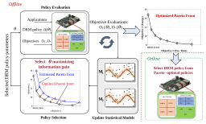
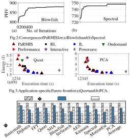
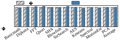
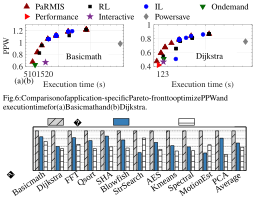

# Learning Pareto-Frontier Resource Management Policies for Heterogeneous SoCs: An Information-Theoretic Approach 

Aryan Deshwal, Syrine Belakaria, Ganapati Bhat, Janardhan Rao Doppa, Partha Pratim Pande 

School of Electrical Engineering and Computer Science, Washington State University, Pullman, WA Email: _{_ aryan.deshwal, syrine.belakaria, ganapati.bhat, jana.doppa, pande _}_ @wsu.edu 

**_Abstract_ —Mobile system-on-chips (SoCs) are growing in their complexity and heterogeneity (e.g., Arm’s Big-Little architecture) to meet the needs of emerging applications, including games and artificial intelligence. This makes it very challenging to optimally manage the resources (e.g., controlling the number and frequency of different types of cores) at runtime to meet the desired trade-offs among multiple objectives such as performance and energy. This paper proposes a novel informationtheoretic framework referred to as** **_PaRMIS_ to create Pareto-optimal resource management policies for given target applications and design objectives. PaRMIS specifies parametric policies to manage resources and learns statistical models from candidate policy evaluation data in the form of target design objective values. The key idea is to select a candidate policy for evaluation in each iteration guided by statistical models that maximize the information gain about the true Pareto front. Experiments on a commercial heterogeneous SoC show that PaRMIS achieves better Pareto fronts and is easily usable to optimize complex objectives (e.g., performance per Watt) when compared to prior methods.** 

## I. INTRODUCTION 

The usage of mobile platforms and associated applications is growing rapidly [21]. To meet the needs of emerging applications such as games and artificial intelligence, mobile system-on-chips (SoCs) are growing in heterogeneity. Emerging heterogeneous mobile SoCs support cores of different types (e.g., Big and Little), and dynamic resource management (DRM) decisions correspond to selecting the number of active cores and corresponding frequency level for each type of core. The DRM problem at runtime as a function of active applications to meet the desired trade-offs among relevant objectives (e.g., performance and energy) poses two key challenges. First, the space of DRM decisions is exponential in the number of cores and their frequencies. For example, Samsung Exynos 5422 SoC has four Big and four Little cores, and we need to select the best decision from 4940 candidates at every decision epoch, which is typically between 50 to 100 ms [16]. Second, optimal DRM decisions change depending on the desired trade-off among target objectives. Since required tradeoffs can change based on real-world scenarios, we need to create _Pareto-frontier_ DRM policies to make optimal DRM decisions for different trade-offs. The Pareto-frontier allows the selection of a DRM policy that meets the desired trade-off at runtime. 

Prior work on DRM to address the above two challenges is lacking in the following ways. First, solutions in commercial mobile SoCs are based on _simple heuristics_ . For example, interactive and ondemand governors increase/decrease the operating frequency by one level when the utilization falls below a static threshold. These heuristics only provide a _single_ trade-off for performance and energy, and they are less accurate than data-driven machine learning based approaches [12]. Second, commonly used _reinforcement learning (RL)_ [2, 12] approaches define a reward function for each objective and consider a linear combination of reward functions with one scalar parameter for each objective. RL methods learn the DRM policy via trialand-error based on the feedback from DRM decisions. To create Pareto-frontier DRM policies, we need to run RL methods with different scalar parameters repeatedly. Unfortunately, accuracy of RL 

978-1-6654-3274-0/21/$31.00 ©2021 IEEE 

algorithms critically depends on the design of good reward functions, which is hard and even impossible to do for some objectives, e.g., performance per Watt (PPW). Since RL needs to try different actions at each state (i.e., exploration) to discover the best DRM policy, it may not be feasible for large state space and DRM decision space, as in our case. We may need to run RL with a large number of fine-grained scalar parameter configurations to uncover high-quality Pareto-frontier DRM policies. Third, recent work on supervised approaches to DRM policies is based on the _imitation learning (IL)_ framework [12]. The key idea in IL is to create an Oracle policy for each targeted trade-off and mimic its behavior using off-theshelf supervised learning algorithms. Recent work has shown the effectiveness of IL for some specific design objectives with minimal trade-off space. Unfortunately, it is computationally hard to create high-quality Oracle policies for complex objectives, such as PPW, for approximating the optimal Pareto front. 

This paper proposes a novel framework referred to as _Learning_ **Pa** _reto-frontier_ **R** _esource_ **M** _anagement Policies via_ **I** _nformationTheoretic_ **S** _earch (PaRMIS)_ to automatically create high-quality Pareto-frontier DRM policies for any given set of design objectives, as shown in Figure 1. PaRMIS specifies DRM policy as a function, e.g., multi-layer perceptron (MLP), with a fixed number of parameters over the system state. The key idea is to build statistical models over this parameter space by evaluating candidate DRM policies in terms of the given design objectives and using them to select the candidate DRM policy that maximizes the information gain of the optimal Pareto front in each iteration. We derive an efficient algorithm to compute entropy, a key computational step in the selection procedure. A key feature of our framework is that designers can plug-and-play with any set of target objectives and uncover optimized Pareto-frontier DRM policies in a small number of iterations. Our experimental evaluation on a commercial heterogeneous SoC with 12 applications shows the efficacy and generality of PaRMIS over the state-of-the-art, including interactive and ondemand governors and RL and IL-based methods. 

**Contributions.** The key contribution is the design, demonstration, and evaluation of the PaRMIS framework to create Pareto-frontier DRM policies for heterogeneous SoCs. _To the best of our knowledge, this is the first general framework that directly optimizes for Paretofrontier DRM policies_ . Specific contributions include: 

- Developing a novel information-theoretic framework referred to as PaRMIS to create resource management policies to tradeoff target design objectives such as performance and energy. PaRMIS iteratively selects a candidate policy for evaluation that maximizes the information gain about the optimal Pareto front. 

- Development of an efficient algorithm to compute entropy, a key step in the PaRMIS framework. 

- Comprehensive experiments on a commercial hardware platform using real-world applications to show the advantages of PaRMIS in terms of the quality of Pareto front and ability to optimize complex objectives over state-of-the-art methods. 

Fig. 1: High-level overview of the PaRMIS framework for two objectives. PaRMIS learns two statistical models, one for each objective, using training data in the form of DRM policy parameters _θ_ (input) and objective evaluations _O_ 1 _, O_ 2 (output), and uses them to guide the selection of next DRM policy Π _θ_ that maximizes information gain about the optimal Pareto front. The statistical models are updated with the new training example created in each iteration. At the end of convergence or maximum iterations (offline computation), it produces Pareto-frontier DRM policies: one for each point on the Pareto front. At runtime (online), we select the appropriate DRM policy from this set based on the desired trade-off. 

## II. BACKGROUND AND PROBLEM SETUP 

We consider a heterogeneous mobile platform with _T_ different types of cores and there are _mi_ number of cores for _i__th_ type. Suppose we can make resource management decisions at _runtime_ to control the number of active cores and frequencies for each core type. Let each resource management decision be represented by two vectors ( _a_ 1 _, a_ 2 _, · · · , aT_ ) and ( _f_ 1 _, f_ 2 _, · · · , fT_ ), where _ai_ and _fi_ represent the number of active cores and frequency for _i__th_ type, respectively. For example, the heterogeneous SoC employed in our experiments has two types of cores: _Big_ ( _m_ 1 _= 4)_ and _Little_ ( _m_ 2 _= 4)_ . Hence, each resource management decision is a four-tuple ( _aBig, aLittle, fBig, fLittle_ ). Suppose a policy Π maps the current system state captured in terms of hardware counters Ψ (see Table I) to a candidate resource management decision tuple. The hardware counters are obtained for a set of repeatable decision epochs for each application. Epochs are clusters of macro-blocks obtained by profiling the basic blocks in an application, as detained in [6, 12]. In this work, we consider policies represented as functions with parameters _θ ∈ℜ__d_ (e.g., MLP) and consequently denote them as Π _θ_ . 

Given _k_ ( _≥_ 2) design objectives _O_ 1 _, O_ 2 _, · · · , Ok_ (e.g., performance, energy) and a set of applications APP, our goal is to create _Pareto-frontier_ resource management policies Π_∗_ to trade-off the given objectives for the application set APP. The evaluation of the quality of decisions from a candidate policy Π _θ_ produces a vector of objective values _⃗O_ = ( _O_ 1 _, O_ 2 _, · · · , Ok_ ). We say that a policy Π _θ Pareto-dominates_ another policy Π _θ′_ if _Oi_ (Π _θ_ ) _≤ Oi_ (Π _θ′_ ) _∀i_ and there exists some _j ∈{_ 1 _,_ 2 _, · · · , k}_ such that _Oj_ (Π _θ_ ) _< Oj_ (Π _θ′_ ). The optimal solution of our problem is a set of policies Π_∗_ such that no other policy Π _θ′_ Pareto-dominates a policy Π _θ ∈_ Π_∗_ . The solution set Π_∗_ is called the optimal _Pareto-frontier_ resource management policies and the corresponding set of objective values _O__∗_ is called the optimal _Pareto front_ . Once we have a set of Pareto-frontier DRM policies, we select an appropriate policy at runtime based on the desired trade-off among the design objectives. 

## III. RELATED WORK 

Heterogeneous SoCs are widely used due to their integration of multiple types of cores (Big/Little), graphics processing units, 

TABLE I: Features of system state used for DRM policies. 

|Instructions Retired|Non-cache External Memory Request|
|---|---|
|CPU Cycles|Sum of Little Cluster Utilization|
|Branch Miss Predictions|Per Core Big Cluster Utilization|
|Level 2 Cache Misses|Total Chip Power Consumption|
|Data Memory Accesses||

and other accelerators to support millions of applications [11]. The heterogeneity in the processors necessitates DRM techniques that are able to choose the best configurations as a function of the application requirements [9, 15]. Most DRM techniques, including default governors such as ondemand [16], use core utilization to make their decisions. However, utilization alone does not provide sufficient information about the characteristics of applications running on the system. To address this drawback, recent approaches have used performance counters to make DRM decisions [1, 17, 19, 20]. The performance counters give fine-grained information about the system state, thus allowing DRM policies to make more intelligent decisions. Machine learning approaches, such as decision trees [17], RL [2], and IL [10, 12, 20] have also been used to create DRM policies for mobile platforms. While these approaches are able to improve upon prior DRM methods, they still optimize for a single objective function, such as energy or execution time or PPW. However, in realworld scenarios, we need DRM policies that can achieve the user’s desired trade-off among multiple objectives of interest. Therefore, there is strong need to develop algorithms to create Pareto-frontier DRM policies so that the system can use the appropriate DRM policy at runtime based on the user’s desired trade-off. 

The DyPO approach proposed in [6] performs _exhaustive search_ to find Pareto-frontier points for the objectives of interest and then designs a logistic regression classifier at a _coarse-level_ over clusters of the Pareto points. Unfortunately, exhaustive search does not scale well with the size of the DRM decision space and number of applications; and the coarse approximation is significantly suboptimal. Recent work [10, 12] used RL and IL to overcome the drawbacks of DyPO by creating DRM policies for a limited number of trade-off scenarios by optimizing a linear combination of the desired objectives. However, RL and IL approaches suffer from two drawbacks. First, they cannot be extended to complex objectives (e.g., PPW) and/or different trade-offs due to the difficulty in designing reward functions and Oracle policies to provide supervision. Second, they don’t optimize for Pareto-frontier DRM policies directly and can require significant tuning of scalarization parameters and other hyperparameters. Third, linear scalarization is known to perform poorly due to its inability to explore non-convex regions of the Pareto front [4]. In strong contrast to these approaches, the proposed PaRMIS framework can be used to obtain (near-) optimal Pareto-frontier DRM policies for any given set of design objectives. Experiments on the Odroid-XU3 [8] board show that PaRMIS achieves Pareto-fronts that have 13% and 23% higher Pareto hypervolume metric compared to state-of-the-art RL and IL methods, respectively. 

## IV. PARMIS FRAMEWORK 

**Overview of PaRMIS.** To find optimized Pareto-frontier policies Π_∗_ , PaRMIS learns statistical models for _k_ design objectives over the parameter space _θ_ using training data in the form of candidate DRM policy evaluations and iteratively selects the next DRM policy for evaluation. We perform the following algorithmic steps in each iteration: 1) Using the current statistical models, we select the parameters _θ_ of the candidate DRM policy that maximizes the information gain about the optimal Pareto front _O__∗_ . 2) We evaluate the DRM policy Π _θ_ by executing it on the target platform while running the applications 

to measure the _k_ -tuple of objective evaluations _⃗O_ =( _O_ 1 _, O_ 2 _, · · · , Ok_ ). 3) We use the new training example in the form of (input) policy parameters _θ_ and (output) objective evaluations _⃗O_ =( _O_ 1 _, O_ 2 _, · · · , Ok_ ) to update the statistical models. At convergence or after maximum number of iterations, we compute the Pareto front from the aggregate set of objective evaluation vectors and output the DRM policies corresponding to Pareto front as the resulting solution. Algorithm 1 provides the pseudo-code and Figure 1 shows an example illustration of PaRMIS for two design objectives. 

ease of notation, we only use parameters _θ_ in the below discussion) that maximizes the information gain about the **optimal Pareto front** _O__∗_ . This is equivalent to expected reduction in entropy over the optimal Pareto front _O__∗_ . Our utility function that maximizes the information gain between the next candidate input for evaluation _θ_ and Pareto front _O__∗_ is given as: 

$$
α(θ) = I({θ,⃗O}, O∗| D) (1)
$$

$$
= H(O∗| D) -EO[H(O∗| D \cup{}{}{θ,⃗O})] (2)
$$

$$
= H(⃗O | D, θ) -EO∗[H(⃗O | D, θ, O∗)] (3)
$$

## **Algorithm 1** PaRMIS for Dynamic Resource Management 

- **Input** : ARCH = target heterogeneous SoC, APP = target applications, _O_ 1 _, O_ 2 _, · · · , Ok_ = _k_ design objectives to trade-off, Π _θ_ = dynamic resource management policy with parameters _θ_ **Output** : Pareto-frontier DRM policies 1: Initialize _D_ 0 _←_ initial training data in the form of small number of candidate policy and evaluation objective-vector pairs; and _t ←_ 0 

- 2: **repeat** 3: Learn statistical models from training data _Dt_ 4: Select candidate DRM policy parameters that maximize information gain about the true Pareto front: _θt_ +1 _←_ arg _maxθ α_ ( _θ_ ) = _IG_ ( _{θ,⃗O}, O__∗_ _| Dt_ ) // Eqn. 1 and 9 

- 5: Evaluate the selected policy for _k_ objective functions: _O_ =( _O_ 1 _, O_ 2 _, · · · , Ok_ ) _←_ EVALUATE(ARCH _,_ APP _,_ Π _θt_ +1 ) 

- 6: Aggregate the training data: _Dt_ +1 _←Dt ∪_ ( _θt_ +1 _,⃗O_ ) � � 

- 7: _t ← t_ + 1 8: **until** convergence or maximum iterations 9: **return** the Pareto-frontier DRM policies uncovered during search 

## _A. Learning Statistical Models from Training Data_ 

**Training data.** We collect training data by iteratively evaluating a sequence of DRM policies. Each training example is of the following form: a) input variables are parameters _θ_ of the DRM policy Π _θ_ ; and b) output variables are objective evaluation vectors _O_ =( _O_ 1 _, O_ 2 _, · · · , Ok_ ) obtained by executing the DRM policy Π _θ_ when running applications APP on the target heterogeneous SoC ARCH. Therefore, aggregate training data after _t_ iterations _D_ consists of _t_ training examples of input-output pairs. 

**Statistical models.** We want to learn statistical models from training data to capture our uncertainty about the Pareto front and guide us in selecting the candidate DRM policy for evaluation to quickly uncover the Pareto-frontier DRM policies. We employ Gaussian processes (GPs) [23] as our choice of statistical model due to its superior uncertainty quantification ability via Bayesian interpretation [23]. A GP over input space Θ is a random process from Θ to _ℜ_ . It is characterized by a mean function _µ_ : Θ _�→ℜ_ and a covariance or kernel function _κ_ : Θ _×_ Θ _�→ℜ_ . The posterior mean and standard deviation of a GP provide the prediction and uncertainty, respectively. Intuitively, uncertainty will be low for DRM policy parameters _θ_ that are close to the ones in our training data and will increase as the distance grows. We model the objective functions _O_ 1 _, O_ 2 _, · · · , Ok_ using _k_ independent GP models _M_ 1 _, M_ 2 _, · · · , Mk_ with zero mean and i.i.d. observation noise and update all statistical models from the aggregate training data _D_ after every iteration. 

## _B. Selecting DRM Policy for Evaluation via Information Gain_ 

The effectiveness of PaRMIS framework critically depends on the reasoning mechanism to select the candidate DRM policy for evaluation in each iteration. Ideally, we want an algorithmic approach that can use the uncertainty of learned statistical models and allows us to uncover high-quality Pareto-frontier DRM policies in a small number of iterations. Therefore, we propose a novel informationtheoretic approach that selects the next candidate DRP policy Π _θ_ (for 

Information gain _I_ ( _._ ) is defined as the expected reduction in entropy _H_ ( _._ ) of the posterior distribution _P_ ( _O__∗_ _| D_ ) over the optimal Pareto front _O__∗_ as given in Equations 2 and 3 resulting from the symmetric property of information gain. 

The first term in the r.h.s of Equation 3, i.e., the entropy of a factorizable _k_ -dimensional Gaussian distribution _P_ ( _⃗O | D, θ_ )) can be computed in closed form as shown below: 

$$
H(⃗O | D, θ) = K(1 + ln(2π)) 2 + k � i=1 ln(σi(θ)) (4)
$$

where _σi_2(_θ_)isthepredictivevarianceof_ith_GPmodelatinput_θ_. Intuitively, it says that the entropy is distributed over the _k_ GP models by the sum of their log standard-deviations. The second term in the r.h.s of equation 3 is an expectation over the Pareto front _O__∗_ . We can approximately compute this term via Monte-Carlo sampling as: 

$$
EO∗[H(⃗O | D, θ, O∗)] \simeq{}{}1 S S � s=1 [H(⃗O | D, θ, O∗ s)] (5)
$$

where _S_ is the number of samples and _Os__∗_denoteasamplePareto front. The main advantages of our utility function are its computational efficiency and accuracy. There are two key algorithmic steps to compute Equation 5, which we describe below: 

**1) Computing Pareto front samples** _Os__∗_**.**TocomputeaPareto front sample _Os__∗_,wefirstsamplefunctionsfromtheposteriorGP models via random Fourier features [18]. Subsequently, we solve a multi-objective optimization over the _k_ sampled functions to capture the interactions between different objectives. We employ the popular NSGA-II algorithm [5] to solve the multi-objective optimization problem with sampled functions noting that any other algorithm can be used to similar effect. 

**2) Computing entropy with respect to Pareto front sample** _Os__∗_**.** Let _Os__∗_=_{⃗z_ 1_, · · ·,⃗z_ _m__}_bethesampleParetofront,where_m_isthe size of the Pareto front and each _⃗zi_ = _{zi_1_, · · ·, z_ _i__k}_isa_k_-vector evaluated at the _k_ sampled functions. The following inequality holds for each component _Oj_ of the _k_ -vector _⃗O_ = _{O_ 1 _, · · · , Ok}_ in the entropy term _H_ ( _⃗O | D, θ, Os__∗_): 

$$
Oj \leq{}{}max{zj 1, \cdot{}{} \cdot{}{} \cdot{}{} zj m} ∀j \in{}{}{1, \cdot{}{} \cdot{}{} \cdot{}{} , k} (6)
$$

The inequality essentially says that the _j__th_ component of _⃗O_ (i.e., _Oj_ ) is upper-bounded by a value obtained by taking the maximum of _j__th_ components of all _m k_ -vectors in the sample Pareto front _Os__∗_.Thisinequalitycanbeprovenbyacontradictionargument. Suppose there exists some component _Oj_ of _⃗O_ such that _Oj >_ max _{z_ 1_j, · · · z_ _m__j}_.However,bydefinition,_⃗O_isanon-dominated point because no point dominates it in the _j_ th dimension. This results in _⃗O ∈Os__∗_whichisacontradiction.Hence,ourhypothesisthat _Oj >_ max _{z_ 1_j, · · · z_ _m__j}_isincorrectandinequality6holds. By combining the inequality 6 and the fact that each function is modeled as a GP, we can model each component _Oj_ as a truncated Gaussian distribution since the distribution of _Oj_ needs to satisfy _Oj ≤_ max _{z_ 1_j, · · · z_ _m__j}_. Furthermore, a common property of entropy 

measure allows us to decompose the entropy of a set of independent variables into a sum over entropies of individual variables [3]: 

$$
H(⃗O | D, θ, O∗ s) \simeq{}{} k � j=1 H(Oj|D, θ, max{zj 1, \cdot{}{} \cdot{}{} \cdot{}{} zj m}) (7)
$$

Equation 7 and the fact that the entropy of a truncated Gaussian distribution [14] can be computed in closed form gives the following mathematical expression for the entropy term _H_ ( _⃗O | D, θ, Os__∗_). 

$$
H(⃗O | D, θ, O∗ s) \simeq{}{} k � j=1 [(1 + ln(2π)) 2 + ln(σj(θ))+ (8) ln Φ(γj s(θ)) -γj s(θ)φ(γj s(θ)) 2Φ(γj s(θ)) ]
$$

$$
where γj s(θ) = Oj∗ s -µj(θ) σj(θ) , yj∗ s = max{zj 1, \cdot{}{} \cdot{}{} \cdot{}{} zj m}, and φ and Φ are the p.d.f and c.d.f of a standard normal distribution, respectively. By combining equations 4 and 8 with Equation 3, we get the final form of our utility function as shown below: α(θ) \simeq{}{}1 S S � s=1 k � j=1 �γj s(θ)φ(γj s(θ)) 2Φ(γj s(θ)) -ln Φ(γj s(θ)) � (9)
$$

V. EXPERIMENTS AND RESULTS

## _A. Experimental Setup_ 

**Heterogeneous Mobile SoC platform.** We employ the Odroid-XU3 board [8] running Ubuntu 15.04 for our experiments. The Exynos 5422 SoC integrates four A15 big cores, four A7 Little cores, a Mali T628 graphics processing unit (GPU), and other system components. The Odroid board also provides current sensors to measure the power consumption of the big CPU cluster, Little CPU cluster, main memory, and the GPU. We use the on-board current sensors to obtain the energy consumption and PPW metrics to evaluate different DRM policies considered in this paper. 

**Benchmarks.** We employ 12 benchmarks from MiBench [7] and CortexSuite [22] suites using the “large” input datasets for each suite. These benchmarks represent a wide range of real-world scenarios encountered by heterogeneous SoCs. 

**Design objectives.** We consider three objectives, namely, execution time, energy, and PPW to test the generality and effectiveness of different DRM algorithms. 

**Decision space for DRM policies.** For the Odroid-XU3 platform, the decision space is defined by the number of active Big/Little cores and their respective frequencies. There are 4 _×_ 5 combinations for active cores given that one Little core has to be ON at all times to manage the operating system. Similarly, the Big and Little core clusters support frequencies from 200 MHz to 2 GHz and 200 MHz to 1.4 GHz in 100 MHz steps, respectively. Consequently, there are 4 _×_ 5 _×_ 13 _×_ 19 (4940) candidate DRM decisions at each system state. The DRM policy must choose one of these 4940 configurations at each state depending on the desired trade-off among target objectives. **Decision interval.** An application goes through multiple phases throughout its execution. As a result, using the same configuration for the entire application is not optimal. To this end, the policies proposed in this paper use the repeatable decision epochs described in [6] for making decisions. Each decision epoch consists of a cluster macroblocks that capture the varying characteristics of the application. The policies use the hardware counters (Table I) observed in each epoch to decide the configuration for the following epoch. 

**Policy representation.** For all learning-based approaches, namely, PaRMIS, RL, and IL, we use one function to make DRM decision for each of the four control knobs at each decision epoch. In our 

implementation, we use the following MLP configuration to represent each of the four functions noting that any other function can be used to similar effect: two hidden layers with the ReLU activation and an output layer with the softmax activation. The number of output layer neurons is equal to the number of possible actions for the control knob (e.g., 4 for number of cores). We also note that the proposed approach is not dependent on any specific policy representation and other approaches can be used to implement the DRM policies. **Runtime policy selection.** The choice of the DRM policy from the Pareto front depends on the user preference in terms of desired trade-offs between target objectives, such as power and performance. For example, if the battery level is low, the user can specify that energy consumption has the highest priority. In this work, we present our results under the assumption that an interface to provide user preference about the importance of objectives exists. 

## _B. PaRMIS and Baseline DRM Algorithms_ 

**PaRMIS.** There are no critical hyper-parameters to apply PaRMIS. We employed the no. of samples to compute the utility function in Equation 9 with _S_ =1. We ran PaRMIS for a maximum of 500 iterations and noticed that it converges in at most 300 iterations. **Reinforcement learning (RL).** Prior work using RL has typically focused on optimizing a single objective function by defining an appropriate reward function [2, 10, 12]. Single objective RL algorithms can be extended to multiple objectives by using a linear combination all the objectives via scalarization as: _R_ ( _O_ 1 _, · · · , Ok_ ) =�_k_ _i_ =1_λi · R_(_Oi_),where_R_(_O_1_, · · ·, Ok_)isthecombinedreward function, and _R_ ( _Oi_ ) and _λi_ stand for reward function and scalarization parameter for _i_ th objective _Oi_ . We employ the reward functions for energy and execution time from recent work [10]. However, it is hard to design a reward function for the PPW objective. We run RL algorithm employed in recent studies [10] with different scalarization parameters ( _λ_ 1 _, · · · , λk_ ) to create the Pareto-frontier DRM policies. **Imitation learning (IL).** IL methods create an Oracle policy to optimize a given objective and then learn a policy to mimic its behavior [12, 20]. We employ the IL approach and Oracle policies for energy and PPW objectives from a recent work [12], which showed good results for optimizing energy with small or no performance penalty (i.e., very specific trade-offs). As noted before, Oracle policies may not be optimal for some objectives such as PPW and for different trade-offs. Similar to RL, we run IL by creating Oracle policies to optimize a linear combination of target objectives and obtain Paretofrontier DRM policies by varying the scalarization parameters. **Default governors.** We also compare with the default governors in the system, i.e., ondemand, interactive, performance, and powersave. These governors provide a single point on the Pareto-front since they are optimized for a single objective, such as power or performance. Nonetheless, it is crucial to compare with these baselines as they are implemented on millions of commercial platforms. 

## _C. Quality of Application-Specific Pareto-front_ 

In this section, we compare different DRM algorithms for each application separately for two objectives: execution time and energy. To this end, we compute Pareto-frontier DRM policies using PaRMIS, RL, and IL approaches by running them on a single application and measure the quality of the resulting Pareto-front. These results provide the best-case scenario for each application and help us in analyzing how global DRM policies learned over all applications compare to application-specific DRM policies. 

**PHV metric.** We employ the Pareto hypervolume (PHV) metric, which is commonly used to measure the quality of a given Pareto 

Fig. 4: Comparison of normalized PHV metric of baseline methods w.r.t the PaRMIS approach for application-specific optimization. 

front [24]. PHV is defined as the volume between a reference point and the given Pareto front. We report the normalized PHV metric w.r.t the PHV of PaRMIS approach (higher the better). **Convergence of PaRMIS.** Recall that PaRMIS is an iterative approach and we want to see the number of iterations required to converge to the uncovered Pareto-front. Figure 2 shows PHV of the Pareto-front vs. no. of iterations for Blowfish and Spectral benchmarks noting that other applications show similar or better convergence behavior. We can see that PHV improvement is significant in the initial iterations and converges in at most 300 iterations. **Energy consumption vs. Execution time Pareto front.** Figure 3 shows the overall Pareto-front for two representative benchmarks (Qsort and PCA) noting that we got similar results for all applications. Each marker in the figure corresponds to one policy from the Paretofrontier DRM policy set obtained by PaRMIS (dark red _△_ ), RL (black □), and IL (blue _◦_ ), respectively. We make the following observations. 1) The Pareto-front obtained by PaRMIS dominates those from both RL and IL. More specifically, PaRMIS creates DRM policies that improve both objectives when compared to RL and IL. Furthermore, PaRMIS creates policies that have a wider range of trade-offs between energy and execution time. For example, the lowest execution time obtained by PaRMIS for the Qsort application is 1.2 s, while the lowest values for RL and IL are 1.6 s and 1.9 s, respectively. 2) Figure 3 also shows the trade-off obtained by DRM policies of the four default governors. We can clearly see that the Pareto-front obtained by PaRMIS dominates all of them significantly. The difference is especially visible for the performance governor that is optimized for minimizing the execution time. Even in this case, PaRMIS is able to provide a DRM policy that has both lower execution time and energy than the performance governor. In summary, these results show that PaRMIS creates DRM policies that provide significant improvements over both the default governors and state-of-the-art machine-learning based DRM approaches. 

**PHV comparison.** The data in Figure 3 offers an intuitive visualiza- 

tion of the Pareto-fronts obtained by each DRM approach. However, it does not allow a quantitative comparison of the Pareto-front quality. The PHV metric allows us to compare the quality of different Paretofronts. For computing PHV, the reference point is chosen such that it has a higher execution time and energy than all points in the Pareto front. To allow comparison between different Pareto-fronts, the same reference point is used for all DRM approaches. Figure 4 shows the comparison of normalized PHV metric for all the 12 applications. The normalized PHV of both RL and IL is significantly lower than 1, which shows that they have a significantly lower PHV. For example, PaRMIS has 10% and 25% higher PHV than RL and IL for the PCA application. On an average, PaRMIS achieves 13% and 23% higher PHV compared to RL and IL, respectively. This shows that the quality of the Pareto front obtained by PaRMIS is consistently better than both RL and IL. Prior work [10, 12] has shown that IL is better than RL for specific trade-offs between energy and execution time. However, IL performs worse than RL over the entire Paretofront because the Oracle policy for different trade-offs is not optimal. RL and IL also suffer from drawbacks of linear scalarization due to its inability to explore non-convex regions of the Pareto front [4]. These results show the key advantage of PaRMIS not requiring any effort from designers to get the optimized Pareto-front. 

## _D. Global vs. Application-Specific Pareto-frontier DRM policies_ 

Application-specific policies do not scale as the number of applications available to the user grow in size. Moreover, not all applications are known at design-time. Therefore, DRM algorithms must learn _global Pareto-frontier DRM policies_ that are applicable to all the applications. To this end, we apply PaRMIS to design global Paretofrontier policies using training data from all 12 applications. 

Figure 5 shows the normalized PHV for all the applications. The PHV is normalized with respect to the PHV of application-specific Pareto-front. As expected, the normalized PHV of the global Paretofrontier policies is within 2% of the application-specific policies. For FFT, Qsort, and StringSearch, the PHV of the global Pareto-frontier policies is higher than the application-specific Pareto-frontier policies. On an average, the PHV of global and application-specific Paretofrontier policies are equal. In summary, the global Pareto-frontier policies achieve comparable or better quality than application-specific policies while generalizing to all applications. 

## _E. Evaluation with Complex Objectives_ 

One of the main advantages of the PaRMIS approach is that it can be easily applied with any set of complex objectives desired by the designers. Recall that this is not possible with RL and IL as it is hard to design a good reward function and optimal Oracle policy respectively for complex objectives such as PPW. To demonstrate this advantage, we use PaRMIS to optimize PPW and execution time for each application. However, we cannot use RL and IL to optimize PPW and execution time as PPW is a complex, non-linear objective. There is no reward function and optimal Oracle policy 

Fig. 5: Comparison of normalized PHV of PaRMIS for application-specific vs. global Pareto-frontier DRM policies. 

Fig. 7: Normalized PHV metric of baseline methods w.r.t the PaRMIS approach for application-specific optimization over PPW and execution time. for PPW objective [13]. Due to these limitations, we reuse the Pareto-frontier DRM policies for energy and execution time from RL and IL, and compute the Pareto-front and PHV for PPW and execution time objectives. Figure 6 shows a comparison of the Pareto fronts obtained by PaRMIS, RL, and IL for Basicmath and Dijkstra applications. The Pareto front achieved by PaRMIS dominates those from RL and IL both in terms of the range of policies and quality of individual Pareto points. PaRMIS is also able to dominate the default governors available on the platform. A similar behavior is seen for the normalized PHV metric, as shown in Figure 7. PaRMIS has a higher PHV for all the applications with an average improvement of 16% and 21% over RL and IL, respectively. These results show that PaRMIS can be easily extended to any new and complex objectives. 

## _F. Implementation Overhead_ 

The DRM policies in each approach are implemented as user-space governors in software to characterize the overhead. Furthermore, all learning-based approaches including PaRMIS, RL, and IL use the same MLP function with different set of parameters to represent each DRM policy in the user-space governor. Hence, the storage cost and decision-making time for each policy is same for all three methods. In particular, contrary to existing implementation that employs look up table for RL [10], we use the same function approximator to implement both RL and IL. Hence, there is no computational and storage difference between IL, RL, and PaRMIS. Table II provides a summary of all overheads. On an average, per decision execution of a DRM policy to choose the runtime configuration takes about 800 _µ_ s (200 _µ_ s for each knob), which amounts to about 0.8% overhead when DRM decisions are made every 100 ms. The memory required to store a single DRM policy from all three methods (PaRMIS, RL, and IL) is 1 KB. When we employ global Pareto-frontier policies, PaRMIS creates 27 policies that form the Pareto front, resulting in 27 KB storage overhead (0.001% with 2 GB RAM available on the SoC platform). At runtime, we choose one DRM policies from this set of 27 policies as per the desired trade-off. In summary, the overhead in terms of storage and DRM decision-making time is negligible. 

TABLE II: Summary of implementation overhead. 

|Metric|Per Policy|Total|% Overhead|
|---|---|---|---|
|Exe. time|200 _µ_s|800 _µ_s|0.8 (every 100 ms)|
|Memory|1 KB|27 KB|0.001|

## VI. CONCLUSIONS AND FUTURE WORK 

Dynamic resource management (DRM) of mobile SoCs is a challenging problem due to rise of heterogeneity, large state space and decision space, and complexity of application workloads. This paper studied a novel information-theoretic learning framework referred to as PaRMIS to create Pareto-frontier DRM policies. PaRMIS can produce high-quality DRM policies and easy to configure/apply to trade-off any set of complex design objectives. Experiments on a commercial heterogeneous SoC platform show that PaRMIS achieves Pareto-fronts that have 13% and 23% higher Pareto hypervolume (PHV) compared to state-of-the-art RL and IL methods, respectively. Immediate future work includes studying PaRMIS for large-scale manycore systems. 

**Acknowledgements.** This work was supported in part by the NSF grants CNS-1955353, OAC-1910213 and IIS-1845922, in part by the ARO grants W911NF-17-1-0485 and W911NF-19-1- 0162, and in part by semiconductor research corporation’s AI Hardware program. 

## REFERENCES 

- [1] A. Aalsaud _et al._ , “Power–Aware Performance Adaptation of Concurrent Applications In Heterogeneous Many-Core Systems,” in _ISLPED_ , 2016. 

- [2] Z. Chen _et al._ , “Distributed Reinforcement Learning For Power Limited Many-Core System Performance Optimization,” in _DATE_ , 2015. 

- [3] T. M. Cover and J. A. Thomas, _Elements of Information Theory_ , 2012. 

- [4] I. Das _et al._ , “A Closer Look at Drawbacks of Minimizing Weighted Sums of Objectives for Pareto Set Generation in Multicriteria Optimization Problems,” _Structural optimization_ , vol. 14, no. 1, pp. 63–69, 1997. 

- [5] K. Deb _et al._ , “A Fast and Elitist Multiobjective Genetic Algorithm: NSGA-II,” _IEEE TEC_ , vol. 6, no. 2, pp. 182–197, 2002. 

- [6] U. Gupta _et al._ , “DyPO: Dynamic Pareto-Optimal Configuration Selection for Heterogeneous MpSoCs,” _ACM TECS_ , 2017. 

- [7] M. R. Guthaus _et al._ , “MiBench: A Free, Commercially Representative Embedded Benchmark Suite,” in _Proc. WWC-4_ , 2001, pp. 3–14. 

- [8] Hardkernel. (2014) Odroid-xu3. https://www.hardkernel.com/shop/ odroid-xu3/ Accessed 11/20/2020. 

- [9] D. Kadjo _et al._ , “Towards Platform Level Power Management In Mobile Systems,” in _Int. Syst.-on-Chip Conf. (SOCC)_ , 2014, pp. 146–151. 

- [10] R. Kim _et al._ , “Imitation Learning For Dynamic VFI Control In LargeScale Manycore Systems,” _IEEE TVLSI_ , vol. 25, no. 9, 2017. 

- [11] R. Kumar _et al._ , “Heterogeneous Chip Multiprocessors,” _Computer_ , vol. 38, no. 11, pp. 32–38, 2005. 

- [12] S. K. Mandal _et al._ , “Dynamic Resource Management of Heterogeneous Mobile Platforms via Imitation Learning,” _IEEE TVLSI_ , 2019. 

- [13] S. K. Mandal _et al._ , “An Energy-Aware Online Learning Framework for Resource Management in Heterogeneous Platforms,” _ACM TODAES_ , vol. 25, no. 3, pp. 1–26, 2020. 

- [14] J. V. Michalowicz, J. M. Nichols, and F. Bucholtz, _Handbook of differential entropy_ . Chapman and Hall/CRC, 2013. 

- [15] T. S. Muthukaruppan _et al._ , “Hierarchical Power Management For Asymmetric Multi-Core In Dark Silicon Era,” in _DAC_ , 2013. 

- [16] V. Pallipadi and A. Starikovskiy, “The Ondemand Governor,” in _Proc. Linux Symp._ , vol. 2, 2006, pp. 215–230. 

- [17] J.-G. Park _et al._ , “ML-Gov: A Machine Learning Enhanced Integrated CPU-GPU DVFS Governor For Mobile Gaming,” in _Proc. of ESTIMedia_ , 2017, pp. 12–21. 

- [18] A. Rahimi and B. Recht, “Random Features for Large-scale Kernel Machines,” in _NeurIPS_ , 2008, pp. 1177–1184. 

- [19] B. K. Reddy _et al._ , “Inter-cluster Thread-to-core Mapping and DVFS on Heterogeneous Multi-cores,” _IEEE TVLSI_ , vol. 4, no. 3, 2018. 

- [20] A. Sartor _et al._ , “HiLITE: Hierarchical and Lightweight Imitation Learning for Power Management of Embedded SoCs,” _IEEE CAL_ , vol. 19, no. 1, pp. 63–67, 2020. 

- [21] Statista, “Mobile App Usage - Statistics & Facts,” https://www.statista. com/topics/1002/mobile-app-usage/ Accessed 24 Nov. 2018. 

- [22] S. Thomas _et al._ , “CortexSuite: A Synthetic Brain Benchmark Suite.” in _IISWC_ , 2014, pp. 76–79. 

- [23] C. K. Williams and C. E. Rasmussen, _Gaussian processes for machine learning_ . MIT Press, 2006, vol. 2, no. 3. 

- [24] E. Zitzler, _Evolutionary Algorithms for Multiobjective Optimization: Methods and Applications_ , 1999, vol. 63. 

