#### Independent Statistics and Analysis eia AdministrationU.S. Energy Information 

Annual Energy Outlook 2026 April 2026 

The U.S. Energy Information Administration (EIA), the statistical and analytical agency within the U.S. Department of Energy (DOE), prepared this report. By law, our data, analyses, and forecasts are independent of approval by any other officer or employee of the U.S. Government. The views in this report do not represent those of DOE or any other federal agencies. 

U.S. Energy Information Administration   |   AEO2026 Narrative 

ii 

_April 2026_ 

##### **<mark>Table of Contents</mark>** 

|**Administrator’s Foreword...................................................................................................... 1**|
|---|
|**Introduction .......................................................................................................................... 2**|
|National Energy Modeling System (NEMS) ........................................................................................................... 3|
|Modeled Cases ...................................................................................................................................................... 4|
|Population, demographics, and productivity shape long-term economic projections ......................................... 7|
|Technology drives efficient consumption of energy through 2050, in some cases regardless of policy .............. 8|
|**Transportation ...................................................................................................................................9**|
|Transportation sector trending both higher tech and less energy intensive ...................................................... 10|
|Policy assumptions determine pace of shifting vehicle technology adoption, especially in freight ................... 11|
|Alternative policy futures suggest increased liquids consumption filters throughout the energy economy ..... 12|
|**Electricity......................................................................................................................................... 13**|
|Data centers bolster electricity demand growth ................................................................................................ 14|
|Timing of electricity demand affects power sector costs ................................................................................... 15|
|The electricity generation mix depends on resource availability and market conditions .................................. 16|
|Electricity capacity decisions are affected by policy  and regulations ................................................................ 17|
|Renewables additions vary by region ................................................................................................................. 18|
|Future U.S. coal demand largely depends on electric sector policies, exports may grow .................................. 19|
|**Oil and natural gas ........................................................................................................................... 20**|
|Prime acreage and technological advancements in resource recovery are key factors in future U.S. oil production .......................................................................................................................................................... 21|
|Projections suggest narrow band of refinery throughput amid variable domestic use of petroleum products 22|
|Liquids exports remain historically elevated in nearly all cases ......................................................................... 23|
|Projections suggest robust natural gas production increases in a narrow range, except when geological assumptions vary ................................................................................................................................................ 24|
|Global exports, domestic electricity, and industrial consumption boost natural gas demand .......................... 25|
|LNG exports grow substantially in nearly all cases ............................................................................................. 26|
|**Focus: Technologies ......................................................................................................................... 27**|
|Why don’t our projections show more nuclear capacity? .................................................................................. 28|
|Geothermal still regional, hydrogen remains mostly an industrial concern, both linked to natural gas............ 29|
|Carbon capture tightly linked to tax credits, emissions fall in all cases .............................................................. 30|

U.S. Energy Information Administration   |   AEO2026 Narrative 

iii 

_April 2026_ 

### **Administrator’s Foreword** 

The report you are reading represents the highest standards of analytical rigor anywhere in the world and was produced by one of the hardest working, most dedicated teams in the federal government: the U.S. Energy Information Administration (EIA). 

The _Annual Energy Outlook_ is best understood as a product suite for alternative futures analysis, not a set of predictions. It includes this report, as well as the full set of data tables and visualizations, fully disclosed assumptions and methodologies, detailed descriptions of all 11 scenarios (10 cases plus the Counterfactual Baseline), and the periodic _Retrospective_ , a marvelous innovation in transparency. 

We check our work, and you should feel free to do the same. The National Energy Modeling System, which forms the foundation of AEO2026, is open source. All of its modules are fully documented. 

Everyone associated with this report’s production deserves to be proud. That group may be centered on the AEO team, but the surrounding orbitals are heavily populated: there is only One EIA. Without the surveys and statistics of the National Energy Information System, there would be nothing to model, and without our data center and other technical resources, there would be nothing to run. 

EIA is undergoing a period of decisive acceleration that promises to leave no legacy system or antiquated process untouched. Our team has upgraded code, designed modules, and launched new surveys while improving efficiency and effectiveness across the agency. Artificial intelligence is a powerful enabler, but the will to renew is entirely human. 

Leading such a talented and capable group of people ranks among life’s great honors. 

###### **Tristan Abbey** **_Administrator_** 

U.S. Energy Information Administration   |   AEO2026 Narrative 

1 

_April 2026_ 

### **Introduction** 

The _Annual Energy Outlook 2026_ (AEO2026) explores medium- and long-term alternative futures in the United States. AEO2026 is published in accordance with statutory provisions requiring the Administrator of the U.S. Energy Information Administration (EIA) to prepare an annual report on energy consumption and supply.1 These projections are used by federal, state, and local governments; industry; trade associations; and other planners and decisionmakers in the public and private sectors. 

We prepared the AEO using the National Energy Modeling System (NEMS), an integrated model that captures interactions of economic changes and energy supply, demand, and prices. Given the complex nature of the energy markets, we produced a series of projections, or cases, with varying assumptions, which represent a range of outcomes for the U.S. energy system. These outcomes are not predictions of what will happen, rather the results represent modeled projections of what could happen given certain assumptions and methodologies. In most cases we model, we only consider current events, laws, and regulations implemented as of December 2025. These assumptions are documented and are available on the AEO website. In addition to these documents, we created a separate <mark>report</mark> that explains how we implemented the One Big Beautiful Bill Act (OBBBA) in our AEO2026 cases. 

> 1 Section 57(a)(2) of the Federal Energy Administration Act of 1974 (Public Law 93-275), as amended, requires the Administrator to publish “an annual report which includes, but is not limited to . . . short-, medium-, and long-term energy consumption and supply trends and forecasts under various assumptions.” Section 205(c) of the Department of Energy Organization Act of 1977 (Public Law 95-91) delegates this authority to the EIA Administrator. In complying with this requirement, EIA publishes two-year forecasts each month in the _Short-Term Energy Outlook_ (STEO) and reserves the _Annual Energy Outlook_ (AEO) for projections under a defined set of modeled assumptions. 

U.S. Energy Information Administration   |   AEO2026 Narrative 

2 

_April 2026_ 

##### **National Energy Modeling System (NEMS)** 

NEMS is a long-term energy-economy modeling system of U.S. energy markets that is used in the production of the _Annual Energy Outlook._ NEMS is a modular system. The modules represent each of the fuel supply markets, conversion sectors, and end-use consumption sectors of the energy system. The modular design allows us to use the methodology and level of detail most appropriate for each energy sector. 

During the production of AEO2025, we revised most of the connecting code in NEMS from Fortran and shell scripts to modern open-source Python packages. We also removed many software dependencies on third-party packages. These changes reduced the resources required to maintain and operate NEMS. Simultaneously in AEO2025, we significantly updated NEMS to better model hydrogen, carbon capture, and oil and gas resources. 

During the AEO2026 production cycle, we continued to update and retool NEMS for greater detail and capability. Beyond the legislative and regulatory updates, we made major updates across the model. Examples include: 

- Reducing the runtime by more than half to 11 hours and the required disk space by two-thirds 

- Refining how we represent liquefied natural gas (LNG) export capacity expansion within the Natural Gas Market Module (NGMM) 

- Modernizing the Lower 48 onshore data preprocessing workflow within the Hydrocarbon Supply Module (HSM)2 

- Refining how we aggregate hours of the year within the Electricity Market Module (EMM) to more accurately group hours with similar dispatch characteristics to better reflect the increasing market share of intermittent resources such as solar and wind 

For future outlooks, we plan to continue to make improvements to the system. In the next year, we expect to implement additional modules in Python, tighten integration with international models, and continue to improve our workflows from data ingestion to output. As we continue to develop NEMS, we will continue to expand the operational envelope to allow wider assumptions. We welcome your feedback on the open-source model. 

> 2 Although HSM was developed for AEO2025, many preprocessors remained in legacy languages and with legacy assumptions. We reevaluated the process end-to-end, introducing new technologies and more reasonable assumptions where needed. 

U.S. Energy Information Administration   |   AEO2026 Narrative 

3 

_April 2026_ 

##### **Modeled Cases** 

To better represent the possible range of outcomes of potential policy and regulatory changes, and to better address many key uncertainties, AEO2026 includes a Counterfactual Baseline case and 10 side cases that systematically vary important underlying assumptions. 

###### **_Counterfactual Baseline case_****_3_** 

The Counterfactual Baseline case (formerly known as the Reference case) represents how U.S. and world energy markets would operate through 2050 under laws and regulations in force as of December 2025. The key assumptions of the Counterfactual Baseline case provide an experimental control for exploring long-term trends. An overview of the laws and regulations as well as assumptions included in the AEO2026 are available on the AEO website. It should not be regarded as the most likely of the cases. 

###### **_High and Low Economic Growth cases_** 

The High Economic Growth case and Low Economic Growth case address the effects of economic assumptions on energy consumption modeled in AEO2026. From 2025 to 2050, the High Economic Growth case assumes the compound annual growth rate for U.S. GDP is 2.2%, and the Low Economic Growth case assumes a 1.2% rate. By contrast, the Counterfactual Baseline case assumes the U.S. GDP annual growth rate is 1.7% over the projection period. 

###### **_High and Low Oil and Gas Supply cases_** 

Compared with the Counterfactual Baseline case, the High Oil and Gas Supply case assumes that the estimated ultimate recovery per well for tight oil, tight gas, or shale gas in the United States is 50% higher. Similarly, this case assumes that undiscovered resources in Alaska and the offshore Lower 48 states are 50% greater than assumed in the Counterfactual Baseline case. Technological improvement rates that reduce costs and increase productivity of oil and natural gas production in the United States are also 50% higher than assumed in the Counterfactual Baseline case. Conversely, the Low Oil and Gas Supply case assumes these points are 50% lower than assumed in the Counterfactual Baseline case: the estimated ultimate recovery per well for tight oil, tight gas, or shale gas in the United States; the undiscovered resources in Alaska and the offshore Lower 48 states; and rates of technological improvement. 

###### **_High and Low Zero-carbon Technology Cost (ZTC) cases_** 

To address the uncertainty in the future costs of power generation technologies that produce zero emissions, AEO2026 provides two cases: one assuming technology costs that are higher than those in the Counterfactual Baseline case and another assuming technology costs that are lower. In the High Zero-carbon Technology Cost case, the overnight capital cost is held constant at the 2025 level throughout the projection period for all of the technologies listed in the Case Description document. In the Low Zero-carbon Technology Cost case, we assume overnight capital costs and fixed operating and maintenance (O&M) costs decline more rapidly than in the Counterfactual Baseline case, falling 40% below their Counterfactual Baseline case equivalents by 2050 for all of these technologies. 

> 3 The Reference case was renamed the Counterfactual Baseline case in AEO2026. No change has been made to the methodology of case construction; the manner in which the case was constructed remains the same as in previous years. The purpose of the Reference case was always to provide a counterfactual baseline, but it was frequently misinterpreted and mischaracterized as the EIA’s preferred, safest, or most likely case. On the contrary, it is a tool to illuminate the other cases. 

U.S. Energy Information Administration   |   AEO2026 Narrative 

4 

_April 2026_ 

###### **_High Electricity Demand case_** 

The AEO2026 High Electricity Demand case examines uncertainty about long-term computational requirements and data center server power draw across the commercial building stock. To develop this case, we updated the Commercial Demand Module to report data center server energy use separately from the broader category of commercial computing. In this case, we assume growth in the installed stock of AI servers follows an exponential trend through 2050 and electricity use to support data centers is more intensive than we assume in our Counterfactual Baseline case. We make no additional assumptions about increases in computational efficiency over time, beyond what is present in historical trends. 

###### **_Alternative Electricity case_** 

The Alternative Electricity case assumes the Clean Air Act (CAA) Section 111 rule implemented by the U.S. Environmental Protection Agency (EPA) in April 2024 to regulate carbon dioxide (CO2) emissions from new natural gas-fired combustion turbines and existing coal-, oil-, and gas-fired steam generating units is not in place, and the affected generators no longer have federal restrictions on greenhouse gas emissions. In this case, existing coal-fired plants continue operating without requiring modifications to reduce emissions, and generation from new natural gas-fired combined cycle units isn’t constrained based on whether the plant has installed carbon capture equipment. 

###### **_Alternative Transportation case_** 

The Alternative Transportation case assumes the following policies are not in place: 1) for light-duty vehicles, the National Highway Traffic Safety Administration’s Corporate Average Fuel Economy standards and EPA’s vehicle tailpipe emission standards for model years (MY)2027 and later; 2) for trucks and buses, the EPA Phase 3 tailpipe emissions standards for MY2027 and later; and 3) for trucks and buses, the EPA Low nitrous oxide (NOx) standards for MY2027 and later. Regulations affecting fuel economy and tailpipe emissions that were issued for MY2026 and earlier remain in place. Removal of the most recent tailpipe standards required adjustments to assumptions regarding vehicle manufacturer product plans and the anticipated rollout of charging infrastructure. 

###### **_Alternative Electricity and Alternative Transportation Combination (Combination) case_** 

The Alternative Electricity and Alternative Transportation Combination case further explores the impact of policy uncertainty by combining the assumptions in the Alternative Electricity and Alternative Transportation cases. 

U.S. Energy Information Administration   |   AEO2026 Narrative 

5 

_April 2026_ 

###### **U.S. consumption by fuel in 2030, 2040, and 2050** 

###### share of annual total 

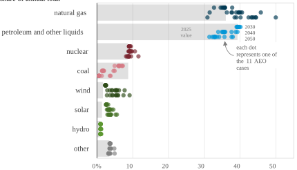Data source: U.S. Energy Information Administration, _Annual Energy Outlook 2026,_ April 2026 

This dot-plot is a visual representation of the energy fuel mix, tracked by decade, across all 10 side cases and the Counterfactual Baseline. It illustrates how varying assumptions embedded in each case can demonstrably alter future pathways, on the one hand, but also how certain ranges of outcomes appear robust under multiple scenarios. In the cases that we have modeled here, the greatest variation arises in the proportion of overall energy demand that is attributed to natural gas and petroleum. 

U.S. Energy Information Administration   |   AEO2026 Narrative 

6 

_April 2026_ 

**Population, demographics, and productivity shape long-term economic projections** 

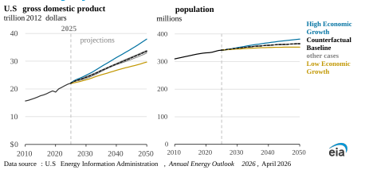To derive our detailed economic projections, we integrate S&P Global Market Intelligence’s U.S. Macroeconomic model from August 2025 into our NEMS modeling system. Each of our cases recursively incorporates our energy-related outputs into the S&P Macroeconomic model until a stable solution is reached. Because of the S&P model’s comprehensive and interconnected design, NEMS cannot inherently adjust GDP growth rates incrementally; we are limited to the three scenarios developed by S&P Global Market Intelligence—the Counterfactual Baseline, the High Economic Growth, and the Low Economic Growth cases. 

In our cases, U.S. GDP, a key driver of energy consumption, grows at an annual average rate between 1.2% and 2.2% through 2050, compared with 2.2% per year over 2000–2025. The annual U.S. GDP growth rate in most of our cases is about 1.6%. Structural factors, including slowing population growth, labor force growth, and productivity gains underpin the economic projections we use. 

Macroeconomic, population, and demographic considerations are often underappreciated. Changes in each can easily swamp the effect of even significant changes in energy-related variables like fuel mix and technology adoption. Population growth and the age distribution across the population, in particular, affect demand for goods and services, the production of which requires energy. Our population projections, by 2050, range from 352 million to 382 million people, bounded by the High and Low Economic Growth cases. 

Across our cases, we project economic growth in the industrial sector, which consumes significant energy for machinery and industrial processes. Similarly, we project that real disposable personal income increases across all cases. Disposable income determines consumer spending power, which influences household purchases of goods and services, including vehicles and appliances, and heating and cooling equipment. Commercial floorspace also grows between 0.8% and 1.2% per year over the projection period, affecting demand for space heating, cooling, ventilation, and data center servers. 

U.S. Energy Information Administration   |   AEO2026 Narrative 

7 

_April 2026_ 

##### **Technology drives efficient consumption of energy through 2050, in some cases regardless of policy** 

We project total energy consumption in the United States will remain relatively flat or continue to decrease slightly through 2050 in most of our cases despite projected economic growth. 

Over the past 25 years, total consumption of all fuels decreased by 0.1% per year even with 

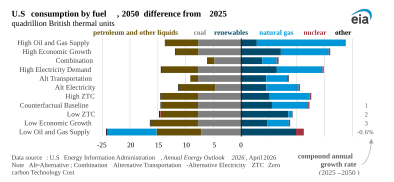average economic growth of 2.2% per year from 2000 to 2025. Newer, more efficient technologies continue to replace older ones, reducing the amount of energy needed to produce the same goods and services. Total consumption has floated between 88 quadrillion British thermal units (quads) and 99 quads for about 30 years. We assume those trends will continue in all the cases considered here, with total consumption ranging from an average decrease of 0.6% to no growth in most cases. In our High Economic Growth and High Oil and Gas Supply cases, energy consumption increases an average of 0.2% per year through 2050. In the near future, EIA will be developing capabilities to use NEMS to model cases in which energy consumption and the economy grow at more similar rates and in which economic growth rates vary much higher and lower than previously considered. 

In most of our cases, total **Total energy consumption by end-use sector** consumption of petroleum and quadrillion British thermal units other liquids decreases by 11%– 40 **2025** 23% in 2050 compared with 2025, projections with much of that decrease 30 attributable to increased use of 20 electric vehicles. Even in our cases without 2024 policies requiring 10 further increases in vehicle 0 efficiency, we still project a small 2000 2010 2020 2030 2040 2050 decrease in petroleum and other Data source: U.S. Energy Information Administration, _Annual Energy Outlook 2026,_ liquids as decreasing technology Note: Total consumption in end -use sectors includes purchased electricity, electricity-related losses, and hydrogen-related losses. Transportation sector includes pipeline and liquefaction consumption. costs encourage consumers and Each line represents AEO Counterfactual Baseline case projections. fleets to adopt more efficient vehicles. Across our cases, coal consumption declines; and in almost all our cases, natural gas and renewables consumption grows as electricity demand increases and coal plants retire. 

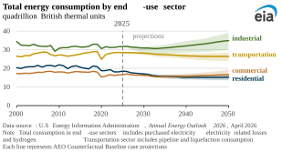In 2025, end-use consumption in the transportation, industrial, and combined residential and commercial buildings sectors each represent nearly one-third of gross energy consumption. In 2050, industrial sector end-use consumption increases to 36%–39% as a result of greater production in the energy-intensive bulk chemicals industry and heat and power for oil and natural gas extraction. Transportation consumption decreases to about 29%, depending on the case, as the vehicle fleet becomes more efficient. 

U.S. Energy Information Administration   |   AEO2026 Narrative 

8 

_April 2026_ 

## **Transportation** 

U.S. Energy Information Administration   |   AEO2026 Narrative 

9 

_April 2026_ 

##### **Transportation sector trending both higher tech and less** 

##### **energy intensive** 

Use of energy by the transportation **U.S. transportation sector consumption by mode, 2025 and 2050** sector decreases over the projection quadrillion British thermal units in all cases, from 27 quads in 2025 to 2025 21 = 25 quads in 2050, despite increasing travel demand as newer, Combination Alt Transport more efficient powertrains make up a High Economic Growth larger portion of on-road vehicles. The High Oil and Gas Supply decrease is most significant in cases Alt Electricity High Electricity Demand where the 2024 U.S. Environmental Counterfactual Baseline Protection Agency Model Year 2027– High ZTC Low ZTC 2032 tailpipe greenhouse gas Low Oil and Gas Supply emissions standards are enforced, Low Economic Growth requiring significant fuel efficiency 0 5 10 15 20 improvements and increased adoption Data source: U.S. Energy Information Administration, _Annual Energy Outlook_ of zero-emission powertrains for both _2026_ , April 2026 Note: _Other_ includes rail, buses, and military. Not included in chart: natural gas light-duty vehicles and freight trucks. consumption for pipeline operation and liquefaction, lubricants, losses due to In these cases, use of energy by the electricity generation, transmission, and distribution, and losses due to hydrogen production. Alt=Alternative; Combination=Alternative Transportation-Alternative transportation sector falls by 13%– Electricity; ZTC=Zero-carbon Technology Cost 25% between 2025 and 2050. In cases where these standards are not enforced, consumption falls by around 9% over the same period. 

###### **U.S. transportation sector consumption by mode, 2025 and 2050** quadrillion British thermal units 

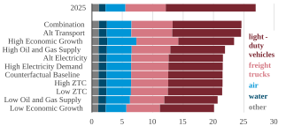Data source: U.S. Energy Information Administration, _Annual Energy Outlook 2026_ , April 2026 

Note: _Other_ includes rail, buses, and military. Not included in chart: natural gas consumption for pipeline operation and liquefaction, lubricants, losses due to electricity generation, transmission, and distribution, and losses due to hydrogen production. Alt=Alternative; Combination=Alternative Transportation-Alternative Electricity; ZTC=Zero-carbon Technology Cost 

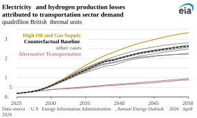Light-duty vehicle miles traveled, which is tied to changes in disposable income, employment, and cost to drive, grows 8%– 12% by 2050 compared with 2025. Freight truck ton-mile demand grows 10%–35% during the same period in tandem with industrial output, with most cases clustering around 20% growth. 

As more vehicles electrify, on-road transportation is increasingly powered by charging in homes and commercial buildings. In the electricity system, energy is lost in generation, transmission, and distribution. In our projections, the losses 

Note: Electricity losses include losses due to generation, transmission, and distribution of electricity for electric vehicles. Hydrogen losses include losses due to production of hydrogen to power fuel cell and hydrogen internal combustion engine vehicles. 

that come with greater vehicle electrification as well as some hydrogen use for transportation are equivalent to 30%–70% of the decrease in transportation fuel consumption across our cases. Losses due to hydrogen production account for less than 10% of these losses across all cases. 

Air travel is the third-largest transportation mode by the amount of energy used; its share of the sector total grows from 12% in 2025 to 16%–20% in 2050. This increase corresponds to jet fuel consumption growth of around 25% in most cases, driven by significant growth in travel demand, which is only partly offset by limited increases in efficiency. Conventional jet fuel continues to be the dominant source of propulsion in air travel. 

U.S. Energy Information Administration   |   AEO2026 Narrative 

10 

_April 2026_ 

##### **Policy assumptions determine pace of shifting vehicle technology adoption, especially in freight** 

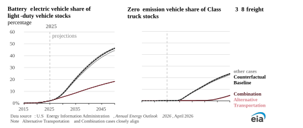Policy is a key driver of the share of zero-emission vehicle adoption in our projections. Although all AEO2026 cases take into account the early expiration of clean vehicle and charging infrastructure <u>tax credits</u> under the One Big Beautiful Bill Act, differing assumptions regarding the U.S. Environmental Protection Agency’s (EPA) latest Model Year 2027–2032 (MY2027+) tailpipe emission standards drive different results across cases. 

When we suspend the MY2027+ EPA standards for both light- and heavy-duty vehicles, the share of registered light-duty battery electric vehicles and zero-emission freight trucks on the road decreases notably. Electric vehicle share of the light-duty vehicle stock decreases from about 40%–46% in 2050 in our cases that incorporate those policies to about 18% in cases that eliminate them. Zero-emission freight trucks—including both battery electric and fuel cell powertrains—decrease from about 21%–24% of all Class 3-8 freight trucks on the road in 2050 in cases that include the policies to about 5% in the cases that do not. 

New vehicles remain on the road for an average of 18–28 years, depending on type and usage. As a result, the mix of new vehicle sales changes more rapidly than the total on-road vehicle stock. For example, light-duty battery electric vehicles reach 50% of total light-duty vehicle sales by 2032 in most AEO2026 cases, but it takes an additional 28 years for light-duty battery electric vehicles to reach 46% of total light-duty vehicle on-road stocks. 

In our cases that incorporate the MY2027+ EPA standards, the share of electric light-duty vehicle and zero-emission freight trucks sold increases through 2032 as policies tighten before leveling off. We project about 53% of light-duty vehicles sold in the United States each year are electric by 2032 before stabilizing under those policies; without the policies, sales share gradually increases to around 20% by 2050. Similarly, we project sales of zero-emission freight trucks increase to about 30% in 2032 in cases that incorporate the MY2027+ standards, remaining relatively steady through the projection period. Without the policies, sales of zero-emissions freight trucks do not begin increasing until the 2040s, when we project falling battery costs will make some lighter electric freight trucks more economical in the absence of the policies, increasing to about 20% of all freight truck sales by the end of the projection period. 

U.S. Energy Information Administration   |   AEO2026 Narrative 

11 

_April 2026_ 

##### **Alternative policy futures suggest increased liquids consumption filters throughout the energy economy** 

**Motor gasoline price** 2025 U.S. dollars per gallon 

**U.S. motor gasoline consumption** 

million barrels per day 

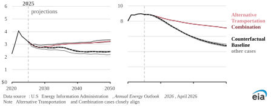In our Alternative Transportation case, we assume 2024 policies aimed at increasing vehicle fuel economy and reducing tailpipe emissions are not in place. Removing those policies filters throughout the energy economy, affecting electricity and hydrogen demand, oil consumption, and even levels of liquefied natural gas (LNG) exports. 

With fewer vehicles propelled by electricity in the Alternative Transportation case, electricity demand decreases and oil demand increases relative to other cases. The tailpipe standards are also critical to supporting hydrogen's use as a transportation fuel, particularly for heavy-duty vehicles; in the Alternative Transportation case without them, almost no hydrogen is consumed in the sector. 

By 2050, liquid fuels consumption is 3 million barrels per day (b/d) higher in the Alternative Transportation case than in the Counterfactual Baseline case, with 2.3 million b/d of the additional consumption as motor gasoline and 0.7 million b/d more as distillate. With higher domestic demand, refiners in the United States process about 1.1 million b/d more crude oil in 2050 compared with the Counterfactual Baseline case, and product exports decrease by about 1.7 million b/d. 

Despite higher prices at the pump, domestic crude oil production does not increase by a proportionate amount because a higher portion of the barrels refiners process comes from trade. U.S. crude oil exports decrease by about 0.5 million b/d, and U.S. crude oil imports increase by about 0.3 million b/d compared with the Counterfactual Baseline case. With less electricity demand from the transportation sector, we project 9% less electricity sales than in the Counterfactual Baseline case. 

We also project 21% more LNG exports in the Alternative Transportation case than in the Counterfactual Baseline case. With more vehicles propelled by liquid fuels, Brent prices, a large contributor to international LNG prices, are higher. Those higher prices increase the spread between international and U.S. natural gas prices, making U.S. exports more economic. And fewer electric vehicles mean less demand for electricity, including natural gas-fired electricity, lowering the cost of natural gas and making it more economic to export. 

U.S. Energy Information Administration   |   AEO2026 Narrative 

12 

_April 2026_ 

## **Electricity** 

# 弄 

U.S. Energy Information Administration   |   AEO2026 Narrative 

_April 2026_ 

##### **Data centers bolster electricity demand growth** 

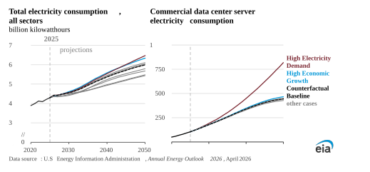After 15 years of nearly flat U.S. electricity consumption, demand has increased by 2.1% per year, on average, over the last five years. We project electricity consumption will continue growing through 2050 at a rate of 0.9% to 1.6%, with data center server energy use a major factor. Energy use in commercial buildings, home to data center activity, grows more rapidly than in the residential or industrial sectors in all modeled cases. 

We assume AI servers will increasingly skew more energy intensive, the installed stock of AI servers grows exponentially through at least 2040, and computational efficiency will increase over time. In our High Electricity Demand case, we assume the exponential growth in AI servers will continue through 2050, and the rate of improvement in server computational efficiency will reflect historical trends. 

These assumptions lead data center server energy use alone to grow to 818 billion kilowatthours in 2050 in the High Electricity Demand case. Server electricity consumption in 2050 is more than 16 times that in 2020. In 2050, the High Electricity Demand case shows 84% more data center server electricity use than the Counterfactual Baseline case. 

Average annual electricity consumption growth through 2050 in the High Electricity Demand (1.6%) and High Economic Growth (1.5%) cases are comparable. In all cases, electricity use is highest in the commercial sector. By case design, commercial buildings alone account for the incremental electricity growth in the High Electricity Demand case—largely to meet additional data center server and space cooling demand. The entire economy would need to grow at the rate projected in the High Economic Growth case to match the data center-related electricity growth in the High Electricity Demand case. Data center server electricity use grows fastest in the South Atlantic and the West South Central census divisions, home to Virginia and Texas, respectively. 

U.S. Energy Information Administration   |   AEO2026 Narrative 

14 

_April 2026_ 

##### **Timing of electricity demand affects power sector costs** 

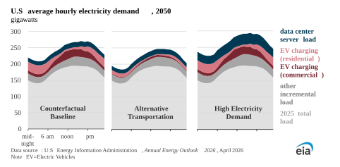Although electric vehicle (EV) and data center server demand show significant growth across most of our cases, they account for a relatively small share of total load projections in 2050. Overall electricity demand grows between 25% and 50% by 2050, with EV and data center server demand accounting for between 50% and 80% of that growth. However, EV and data center electricity demand only accounts for between 10% and 25% of total demand in 2050. 

Despite the relatively low share of total demand, EV and data center server demand growth influences the load factor of the system, which is the ratio of the average system load to peak. Changes in the load factor can affect how system costs, such as reliability and distribution, are incorporated into customer rates. 

In the Alternative Transportation case, where demand from EVs is much lower, a greater portion of demand takes place during the peak afternoon and early evening hours. As a result, distribution costs in this case constitute a higher share of total electricity costs than in the Counterfactual Baseline case because transmission and distribution investment is tied to growth in peak demand but shared over the smaller total sales. 

Conversely, in the High Electricity Demand case, increased electricity use from data center servers occurs consistently throughout the day, along with additional growth in space cooling demand that is more pronounced midday. In this case, average generation costs increase compared with the Counterfactual Baseline to recover costs of building additional generating capacity along with increased operating costs to meet the higher demand levels. 

Our projections include EV charging in either residential or commercial sectors to reflect the customer charging location. We assume commercial charging at workplaces and for school buses occurs primarily during the day, and we expect residential charging and commercial charging of transit buses and fleet trucks occurs primarily overnight. Load for data center servers is assumed to be relatively constant throughout the day. 

U.S. Energy Information Administration   |   AEO2026 Narrative 

15 

_April 2026_ 

##### **The electricity generation mix depends on resource availability and market conditions** 

###### **Total generation in all sectors, 2025 and 2050** 

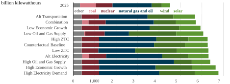Data source: U.S. Energy Information Administration, _Annual Energy Outlook 2026,_ April 2026 Note: Alt=Alternative; Combination=Alternative Transportation-Alternative Electricity; ZTC=Zero-carbon Technology Cost 

Total generation grows between 25% and 50% through 2050 across all cases, with the most growth resulting from the cases that assume high economic growth and high electricity demand in the commercial sector. To meet this increasing demand for electricity, total installed electric generating capacity increases between 50% and 90% across modeled cases. 

The mix of new electricity generation sources that meets this demand varies considerably depending on the assumptions within each side case. Natural gas, solar, and wind generation increasingly meet U.S. power demand across all cases examined here. The combined generation share of these technologies rises from about 60% in 2025 to around 80% in most cases by 2050; in the Counterfactual Baseline case, natural gas accounts for about 40%, wind for 20%, and solar for 20% in 2050. 

Although the absolute amount of natural gas generation increases, its share of electricity generation generally stays flat in most cases. This is in contrast to coal; in 2025, coal’s share is 16%, but it declines by 2050 in all cases. In cases where regulations curbing greenhouse gas emissions from power plants remain in place, coal’s share declines to less than 1% by 2050; in cases where these regulations are not in place, its share declines to about 5% over the same period. 

Nuclear generation remains relatively stable in most scenarios, except for the Low Oil and Gas Supply case, in which the high cost of natural gas significantly enhances nuclear power's economic competitiveness. However, the share of nuclear generation declines in all cases considered here, from 17% in 2025 to between 12% and 15% by 2050. For more information on nuclear generation see the Focus: Technologies section. 

The assumptions regarding natural gas resources and prices play a crucial role in shaping the generation mix by altering the relative economic competitiveness of other resources. We consistently observe a strong correlation between natural gas prices and electricity prices, particularly in our High Oil and Gas Supply and Low Oil and Gas Supply cases. This correlation underscores the critical role natural gas plays in setting the dispatch margin on the electricity grid. 

U.S. Energy Information Administration   |   AEO2026 Narrative 

16 

_April 2026_ 

##### **Electricity capacity decisions are affected by policy and regulations** 

###### **Cumulative electricity generating capacity additions and retirements (2025 –2050) AEO2026 selected cases** 

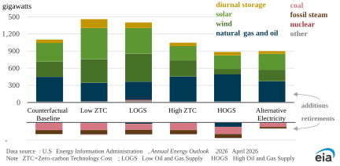Natural gas prices and technology costs affect the generation mix because of tight cost competition between natural gas and renewables for new power plant construction. Wind capacity additions are very sensitive to natural gas price changes, with over five times more additions in the Low Oil and Gas Supply case than in the High Oil and Gas Supply case. Solar additions, meanwhile, vary by a factor of two across the cases and are less sensitive to natural gas prices in part because of their tendency to suppress peak mid-day electricity prices. Displacing generation from low-efficiency simple turbines to higher efficiency combined-cycle units reduces the revenue available to new solar units, which in turn makes solar less likely to be competitive under a wider range of natural gas prices. In cases with more generation from wind and solar resources, greater total capacity is generally needed due to the seasonal and diurnal limitations of wind and solar and the necessity for dispatchable resources during times of low or no wind and solar output. Dispatchable resources typically include coal-fired generation, natural gas-fired generation, oil-fired generation, and nuclear power. 

We project between 100 gigawatts (GW) and 125 GW of coal capacity retirements by 2050—about 65% to 80% of the coal fleet—across all our cases, with the exception of the Alternative Electricity cases. If regulations that aim to curb greenhouse gas emissions from power plants are no longer in effect, cumulative coal retirements decrease to about 70 GW—just over half of the retirements we project in most other cases. In cases in which these regulations remain in place, about 25 GW to 40 GW of coal plants convert to natural gas and coal co-firing (included in fossil steam) before they ultimately retire by 2038. 

In cases in which we assume that the regulations that aim to curb greenhouse gas emissions from power plants are not in place, we see fewer natural gas turbines installed. In these cases, these new natural gas turbines would not be limited to a maximum 40% annual capacity factor, so fewer turbines are needed to cover the same demand. Natural gas capacity additions are projected to reach about 430 GW in the Counterfactual Baseline case and about 365 GW in the Alternative Electricity case. 

U.S. Energy Information Administration   |   AEO2026 Narrative 

17 

_April 2026_ 

##### **Renewables additions vary by region** 

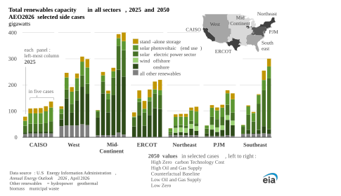We project that renewable power capacity will increase in all regions of the United States in all cases, although regional resource availability results in a varying renewable resource mix. Growth in energy storage capacity, primarily batteries, is largely correlated with growth in solar capacity, as diurnal storage systems are a good fit for the daily and seasonal variability of solar output, which is often offset by a few hours from system peak load periods. Additional storage is often co-located and jointly operated with solar plants. In 2050, about 2.5 GW to 25 GW of batteries, representing 2% to 10% of installed storage capacity across the cases, are located within a solar-hybrid plant. This co-located storage capacity is accounted for within the capacity of the hybrid plant, which is reported in the figure above as solar photovoltaic capacity. 

Across all cases, renewable power capacity in the Mid-Continent region increases between 75 GW and 300 GW throughout the projection, with renewables capacity projected to increase by 160 GW in the Counterfactual Baseline case. Most of the increases come from wind generation, which grows between 20 GW and 170 GW relative to 2025, with the Counterfactual Baseline case accounting for 85 GW of wind capacity growth. The Mid-Continent region has a lot of untapped wind potential and lowcost wind resources, which drives the expansion of wind capacity. Wind is also more economical in that region because of the above-average price of natural gas in the central portion of the country, which ranges from 2% to 6% above the national average after 2035. 

Expansion of solar capacity through 2050 remains between 100% and 235% across most cases. The Southeast, the region with the most significant solar growth, has a two-fold increase in solar capacity in the High Oil and Gas Supply case when natural gas prices are below $3 per million British thermal units (MMBtu) in real 2025 dollars, or when the costs of renewable technologies are high. This increase is closer to five-to-sevenfold in the Low Oil and Gas Supply case when natural gas prices are above $10/MMBtu, or when the costs of renewable technologies are low. 

U.S. Energy Information Administration   |   AEO2026 Narrative 

18 

_April 2026_ 

##### **Future U.S. coal demand largely depends on electric sector policies, exports may grow** 

###### **Coal disposition, 2025 and 2050** million short tons 

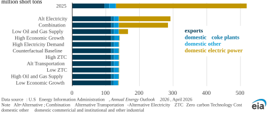Future coal use in the United States in our projections is heavily dependent on policy assumptions. Electricity sector regulations finalized in 2024 target carbon dioxide emissions from coal, oil, and natural gas plants and would require existing steam coal plants without carbon capture to convert to natural gas or retire by 2038. With those policies in place, coal use in the electric power sector, which is currently 75% of coal disposition in the United States, decreases from 388 million short tons (MMst) in 2025 to nearly nothing by 2050. 

In the two cases we ran without those regulations in place—Alternative Electricity and Combination— coal use for electricity generation decreases from 388 MMst in 2025 to about 150 MMst in 2050, and accounts for about 50% of U.S. supply instead of less than 1% in the other cases. Power sector operators’ retirement plans reported to EIA as of October 2025 account for about half of the decrease in generation, with the rest coming from assumed retirements based on our cost projections in NEMS. 

Coal consumption for heat and power in the industrial sector decreases by about 5 MMst, or 30% of industrial use by 2050, across all cases examined here. This decrease occurs because coal is partially replaced by natural gas and electricity. Natural gas replaces coal as a boiler fuel driven by lower operations and maintenance costs, greater thermal efficiency, and more expedient fuel accessibility. 

Metallurgical coal consumption for steelmaking decreases across all cases as electric arc furnaces, which use recycled steel as a feedstock, replace blast furnaces and basic oxygen furnaces. Lower demand for coal coke results in coke plant consumption of metallurgical coal decreasing by 5 MMst to 7 MMst across all cases by 2050, depending largely on economic growth assumptions. 

With a drop-off in domestic coal consumption, U.S. coal produced for exports increases throughout the projection period in all examined cases by about 20% from the 96 MMst exported in 2025 to 115 MMst in 2050, assuming no restrictions on global coal trade. 

U.S. Energy Information Administration   |   AEO2026 Narrative 

19 

_April 2026_ 

## **Oil and natural gas** 

U.S. Energy Information Administration   |   AEO2026 Narrative 

20 

_April 2026_ 

**Prime acreage and technological advancements in resource recovery are key factors in future U.S. oil production** 

###### **Crude oil production** 

million barrels per day 

###### **Brent crude oil price** 

2025 U.S. dollars per barrel 

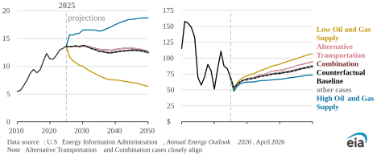Across most of our cases, we project U.S. crude oil production fluctuates in a relatively narrow band, first declining slightly in the early 2030s, rising again around 2040, and declining again towards 2050. This fluctuation occurs amid sustained but modest increases in Brent crude oil prices over the long term. Most of our cases indicate U.S. crude oil production will hover between 12.4 million barrels per day (b/d) and 12.7 million b/d in 2050, compared with 13.6 million b/d produced in 2025. The cases that model high and low oil and gas supply extend this range considerably, projecting 18.7 million b/d and 6.4 million b/d in 2050, respectively. In our projections, Brent crude oil prices remain below $70 per barrel (b) in real 2025 U.S. dollars through 2030, leading to decreased U.S. crude oil production through the mid-2030s in nearly all cases. We project the Brent crude oil price increases above $75/b in the late 2030s, which then supports increased oil production through most of the 2040s. 

In the Alternative Transportation case, where domestic petroleum consumption is 17% higher by 2050 than in the Counterfactual Baseline case, Brent crude oil prices rise more sharply, reaching $95/b by 2050 compared with $87/b in the Counterfactual Baseline case. However, crude oil production only increases by 2% by 2050 relative to the Counterfactual Baseline case because of imports and exports dynamics. 

Led by the Permian Basin, Lower 48 onshore production remains the dominant source of U.S. crude oil over the projection period. The Permian accounts for between 54% and 64% of Lower 48 onshore crude oil output, depending on the year, in most cases. One important factor in our analysis is the availability of so-called _prime acreage_ in U.S. shale plays, a term that refers to areas from which hydrocarbons can be more easily extracted due to resource abundance, geological certainty, prior development, availability of infrastructure, and other economic considerations. Although the availability of prime acreage is uncertain and contingent on many variables, our cases assume historical trends based on geographic location, as well as technological improvements to costs and recovery based on the level of development in a given area. As a result, while areas gradually improve their resource recovery rates, we project that as producers run out of prime acreage, they move into _Tier 2 acreage_ , or areas less economical to drill based on higher costs and/or lower rates of recovery. 

U.S. Energy Information Administration   |   AEO2026 Narrative 

21 

_April 2026_ 

**Projections suggest narrow band of refinery throughput amid variable domestic use of petroleum products** 

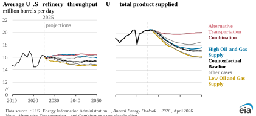Data source: U.S. Energy Information Administration, _Annual Energy Outlook 2026,_ April 2026 Note: Alternative Transportation and Combination cases closely align. 

We project that refinery throughput remains above 14.7 million b/d in all cases supported by liquid fuels demand domestically and globally. In all cases, refinery utilization remains above 84% as U.S. refinery capacity decreases by 0.2 million b/d to 0.7 million b/d by 2050 across all cases. In the High Oil and Gas Supply and Low Oil and Gas Supply cases, changes in domestic crude oil production directly affect utilization and refinery throughput. 

Crude oil prices, which largely determine refinery feedstock costs, drive petroleum product pricing. Brent crude oil prices are lowest in the High Oil and Gas Supply case, ranging from $48/b to $74/b over the projection period compared with $53/b to $87/b in the Counterfactual Baseline case. In contrast, Brent prices exceed $87 for half of the projection period in the Low Oil and Gas Supply case, resulting in motor gasoline prices over $3 per gallon. Transportation fuel demand significantly outpaces other petroleum product demand in the Alternative Transportation case, pushing transportation fuel prices close to those in the Low Oil and Gas Supply case despite Brent crude oil prices remaining about $12/b lower than in the Low Oil and Gas Supply case in 2050. 

Domestic use of liquid fuels decreases significantly in nearly all cases, except for the two cases where we assume policies that increase vehicle fuel economy requirements are suspended: the Alternative Transportation and Combination cases. In both cases featuring alternative transportation policies, strong domestic use of liquid fuels and increased petroleum product exports sustain robust refinery utilization rates throughout the projection period. 

Use of liquid fuels by industrial consumers grows across all cases, driven mainly by U.S. GDP growth and increased hydrocarbon gas liquids (HGL) production.4 Increased distillate consumption by the nonmanufacturing sectors such as agriculture, mining, and construction, as well as liquid feedstocks (HGL and naphtha) in the bulk chemicals sector, drive most of this consumption increase. Industrial petroleum use increases from 5.5 million b/d in 2025 to between 6.3 million b/d and 7.7 million b/d in 2050 in most cases. 

> 4 Hydrocarbon gas liquids include natural gas liquids (e.g., ethane and propane) and refinery olefins (e.g., ethylene and propylene). EIA is developing a series of pilot studies to more closely explore HGLs and petrochemicals. We intend to launch these studies later this spring. 

U.S. Energy Information Administration   |   AEO2026 Narrative 

22 

_April 2026_ 

##### **Liquids exports remain historically elevated in nearly all cases** 

**Gross petroleum liquids exports** million barrels per day 

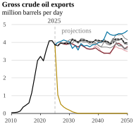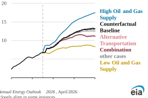Data source: U.S. Energy Information Administration, _Annual Energy Outlook 2026,_ April 2026 Note: Alternative Transportation and Combination cases closely align in some instances. 

We project that the United States will remain a net exporter of petroleum through 2050 in all but one of our cases. Crude oil exports are projected to remain between 3.3 million b/d and 4.7 million b/d in most modeled cases examined here, accounting for 25% to 33% of U.S. crude oil production in 2050. Underlying these results is an assumption that global liquid fuels demand will continue to increase through 2050. 

While crude oil exports are mostly clustered around the Counterfactual Baseline case, low production volumes in the Low Oil and Gas Supply case result in crude oil exports falling to 0.2 million b/d in 2030 and then to zero in 2050. In this case, net imports rise to 8.3 million b/d in 2050. 

In the Alternative Transportation case and the Combination case, where we remove regulations that reduce vehicle liquid fuels consumption, Brent prices rise gradually, resulting in a 1% to 2% increase in crude oil production by 2050 relative to the Counterfactual Baseline case. However, domestic petroleum consumption in 2050 under these two cases is 17% higher than in the Counterfactual Baseline case. With demand substantially exceeding the incremental increase in production, more crude oil is absorbed by domestic refineries rather than exported, modestly reducing exports from about 26% to 22% of total crude oil supply. 

Exports of petroleum liquids increase in nearly all cases, driven by the increase in hydrocarbon gas liquids (HGL) production tied to projected rising natural gas output. The only exception is the Low Oil and Gas Supply case, in which both HGL production and exports decline throughout the projection period. We project between 37% and 71% of domestic HGL production will be exported across cases. In the High Oil and Gas Supply case, HGL production increases much more quickly than demand, with exports becoming the primary outlet for the increased supply. 

In the Alternative Transportation case, petroleum product exports, particularly transportation fuels, are lower because of higher domestic demand for these products. 

U.S. Energy Information Administration   |   AEO2026 Narrative 

23 

_April 2026_ 

**Projections suggest robust natural gas production increases in a narrow range, except when geological assumptions vary** 

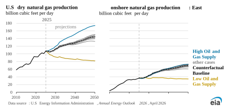With natural gas demand increasing both at home and abroad, we project dry U.S. natural gas production rises significantly, increasing from 107 billion cubic feet per day (Bcf/d) in 2025 to between 133 Bcf/d and 151 Bcf/d by 2050 in most of our cases. Our Low Oil and Gas Supply and High Oil and Gas Supply cases are outside this general projection range, with 82 Bcf/d and 174 Bcf/d production projected in 2050. 

We project natural gas production to increase the most in the East region, home to the Appalachian Basin, where production costs are relatively low. Natural gas production increases from 37 Bcf/d in 2025 to between 66 Bcf/d and 73 Bcf/d by 2050 in that region in most of our cases. In addition, regions with significant associated natural gas—gas extracted as a by-product of crude oil—also contribute to higher natural gas production in our projections across all cases. This rise is partly a result of a re-assessment of underlying factors, including the gas-to-oil ratios for plays where natural gas is co-produced with crude oil. This re-assessment indicates increasingly gassier gas-to-oil ratios in associated natural gas production, leading to higher overall natural gas production volumes. 

The increased output from the East region requires infrastructure buildout to move natural gas to the Gulf Coast to accommodate growing demand. The buildout is supported by price differences between the relatively low-cost natural gas in Appalachia compared with that produced near the Gulf Coast, where the Henry Hub is located. 

In the High Oil and Gas Supply case, where we assume more recoverable resources are available, most of the additional gas supply comes from regions rich in associated gas, such as the Permian Basin, or from areas in close proximity to demand centers, with the Haynesville play being a key contributor. Given lower-cost, higher-productivity unconventional resources from these regions, further increasing production out of the East (for example, from the Marcellus) in that case is uneconomical because of the additional pipeline infrastructure costs. 

U.S. Energy Information Administration   |   AEO2026 Narrative 

24 

_April 2026_ 

##### **Global exports, domestic electricity, and industrial consumption boost natural gas demand** 

**Henry Hub natural gas spot price** U.S. dollars per million British thermal units 

###### **U.S. natural gas consumption** 

billion cubic feer per day 

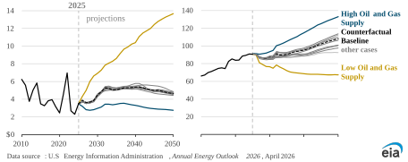Growing demand for U.S. natural gas in both domestic and international markets is reflected in the Henry Hub natural gas spot prices. Across almost all cases examined here, growth in U.S. liquefied natural gas (LNG) exports and domestic consumption—particularly in the electric power and industrial sectors—drive modest increases in natural gas prices through 2050. (These prices also support the greater production and export levels discussed elsewhere in AEO2026.) 

Domestically, across all cases, natural gas use for electric power generation by 2050 increases more than it does in any other end-use sector. The power sector uses 38.1 Bcf/d to 50.4 Bcf/d in 2050 in most cases, compared with 35.2 Bcf/d in 2025. Higher overall electricity generation and changes in policy that curb renewables deployment support growing natural gas consumption in the electric power sector. Additionally, for AEO2026, we changed the time slice definitions in our model to better account for increased wind and solar generation on the system, which also increased our projections for natural gas consumption across cases. Refining the definition of time slices to cluster hours by net load rather than gross load results in solar being less available during time slices with high electricity prices and therefore less economical to build relative to natural gas. 

Industrial sector natural gas use also grows, with consumption in 2050 projected to increase in most cases by 11% to 35% from 2025. Driving this growth is consumption in bulk chemicals and other natural gas-intensive industries, and because natural gas increasingly replaces coal as a boiler fuel. 

As demand for natural gas increases, we expect natural gas prices to increase through the early 2030s, remaining between $5/MMBtu and $6/MMBtu at the Henry Hub benchmark in most cases. Production continues to grow even after Henry Hub spot prices decline after 2040. Associated natural gas production in the Permian accounts for most of this rise as it has relatively low production costs and is near Gulf of America export infrastructure. 

Henry Hub natural gas spot prices are bound by the Low Oil and Gas Supply and High Oil and Gas Supply cases, which make alternative assumptions regarding the productivity of oil and natural gas drilling. 

U.S. Energy Information Administration   |   AEO2026 Narrative 

25 

_April 2026_ 

##### **LNG exports grow substantially in nearly all cases** 

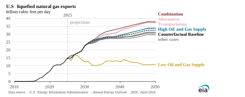Our projections for U.S. LNG exports grow significantly through the 2040s, exceeding 30 Bcf/d by 2050 in most cases from 14.9 Bcf/d in 2025. 

U.S. exports of natural gas, specifically LNG, are the fastest-growing source of natural gas demand across all cases, supporting the projected pace of production growth. LNG developers are in the midst of a significant buildout, and we expect U.S. LNG export capacity will increase to 27.7 Bcf/d by 2030. The complex, capital- and time-intensive nature of liquefaction capacity construction explains the seemingly stepwise characteristic of the trend lines in the early years of our projection window: when projects come online, they bring discrete volumes of new capacity, not volumes that are smoothed out over several years of continuous increase. 

In addition to planned LNG export capacity additions through 2030, we project additional LNG export capacity will be economical to build in the 2030s and 2040s across most cases, resulting in LNG export volumes ranging from 29.6 Bcf/d to 37.9 Bcf/d by 2050. Across these cases, Henry Hub spot prices remain low enough to make additional volumes economical to produce and compete in global markets. 

Our LNG export projections are mostly clustered around the Counterfactual Baseline case, with exports highest in cases where policies aimed at reducing tailpipe emissions are not in place. In those cases, we project higher Brent crude oil prices because of increased oil demand. Because LNG prices are commonly indexed to crude oil, higher oil prices make U.S. LNG priced from natural gas more economical. Additionally, lower power demand from electric vehicles (EVs) reduces natural gas used in power generation supporting higher levels of exports. 

Of the cases considered here, LNG exports decline only in the Low Oil and Gas Supply case, where high domestic prices make U.S. LNG uncompetitive internationally. Only 40% to 50% of U.S. LNG export capacity is used after 2030 in that case. 

Our LNG export projections reflect methodology changes in AEO2026. Our previous methodology relied on outdated flexible LNG (LNG not sold under fixed-destination, long-term contracts) assumptions that we could no longer update because of changes in our international natural gas models, which no longer provided that information for use in the AEO. Instead of using flexible LNG volumes, we modified our LNG modeling to consider global (non-U.S.) LNG capacity. This approach, along with an accompanying recalibration of related equations, projects a tighter oil market for natural gas, making U.S. LNG more competitive in global markets. 

While this analysis focuses on LNG exports, up until 2020 the majority of U.S. natural gas exports transited through cross-border pipelines with Mexico and Canada. Even in 2024, the last year for which we have complete data, exports to these nations accounted for over 9 Bcf/d, or 43% of total gas exports per year. We project exports to Canada and Mexico by pipeline will continue to increase, rising to about 12.6 Bcf/d in most cases. 

U.S. Energy Information Administration   |   AEO2026 Narrative 

26 

_April 2026_ 

## **Focus: Technologies** 

U.S. Energy Information Administration   |   AEO2026 Narrative 

27 

_April 2026_ 

##### **Why don’t our projections show more nuclear capacity?** 

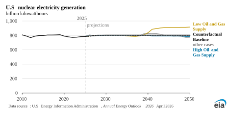Our projections for nuclear capacity remain flat across most of our cases. Of the cases that we consider here, nuclear power generation increases meaningfully in the Low Oil and Gas Supply case, where the price of natural gas rises enough to make new nuclear generation economical in the 2040s. The type of nuclear power considered by the model is based on representative designs for both large- and smallscale light water reactors. The National Energy Modeling System (NEMS) is not optimized to project the economic competitiveness of technologies still experimental or undergoing development, such as other types of small modular reactors, microreactors, and fusions. 

In recent years, Congress, the U.S. Department of Energy (DOE), and other agencies have taken steps to bolster nuclear power deployment and nuclear fuel production, with initiatives such as the DOE’s reactor and fuel line pilot programs and the Department of the Army’s Janus program. The White House recently laid out a goal of 400 gigawatts (GW) of total installed nuclear capacity online by 2050 and intends to support an additional 5 GW of new plants and uprated nuclear capacity by 2030. 

The greater the specificity that can be provided to the model as an input, the more easily NEMS can solve for future pathways. At the time of publication, DOE and other agencies are still reviewing and developing specific projects and support mechanisms for both near-term commercial projects to meet the 2030 goal and longer-term policies to support the 2050 goal. Future EIA outlooks will account for these programs as commercial plants or those participating in DOE or other government-backed programs report construction plans to EIA through our regular power plant data collection effort and as firm implementation plans for mid- and long-term goals evolve. At the time of publication, a pilot study on fusion technologies is already underway. EIA is also developing a series of pilot studies on advanced nuclear technologies in terms of vendors, utilities, and fuel. These studies will inform EIA data collection and analytical efforts. 

U.S. Energy Information Administration   |   AEO2026 Narrative 

28 

_April 2026_ 

##### **Geothermal still regional, hydrogen remains mostly an industrial concern, both linked to natural gas** 

We project geothermal will contribute to around 1% of total U.S. electricity generation in 2050, with an estimated generating capacity of 7 gigawatts (GW) to 9 GW. Geothermal power generation grows faster than the historic rate across all our cases, but regionally concentrated and limited high-quality hydrothermal reservoirs constrain expansion. Growth in our projections is concentrated in the western United States, largely in California. Developments of newer geothermal technologies, such as enhanced geothermal systems, could lead to additional growth beyond our projections if the economics of those technologies change. Geothermal development is sensitive to natural gas price projections—especially in the Great Basin region in Nevada, Idaho, Utah—as more geothermal capacity is built with higher natural gas prices. 

###### **Western U.S. electricity generation by technology** 

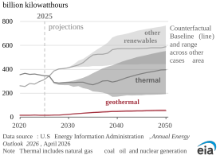We project hydrogen to be produced almost entirely from natural gas, either as an industrial byproduct or via steam methane reforming **.** Transportation policy encouraging the use of hydrogen in freight trucks accounts for most of the potential growth in hydrogen demand. In our cases without those policies in place, Alternative Transportation and the Combination case, the transportation sector uses almost no hydrogen. 

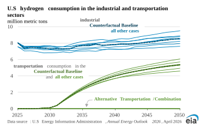With the 45V clean hydrogen tax credits expiring at the end of 2027, we project very little hydrogen produced by electrolyzers in all cases. The 45Q tax credits encourage some hydrogen production from carbon capture technologies, peaking at around 10% of the total in most cases. The Hydrogen Market Module (HMM), which was introduced in AEO2025, compares the economic competitiveness of different hydrogen production technologies, deploying the most-economic choice to meet demand. 

U.S. Energy Information Administration   |   AEO2026 Narrative 

29 

_April 2026_ 

##### **Carbon capture tightly linked to tax credits, emissions fall in all cases** 

Carbon capture and storage (CCS) volumes are highest when a combination of tax incentives and power plant emissions regulations, along with low natural gas prices, support additional deployment at coal- and natural gas-fired power plants. In the Alternative Electricity case, which suspends policies aimed at reducing power plant emissions, CCS is lowest. Captured volumes are highest in the High Oil and Gas Supply case, when low natural gas prices make natural gas-fired generation economical even with mandatory CCS. In most cases, we project CCS peaks around 2040 as natural gas generation with CCS replaces retired coal generation before declining rapidly as 45Q tax credits expire. 

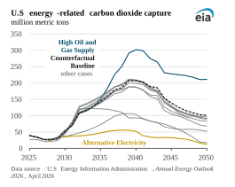Between 2025 and 2050, projected energyrelated CO2 emissions across all cases decline between 11% and 38%. Some cases see emissions flatline around 2040 after declining for several years. While most of our projections are clustered around the Counterfactual Baseline case, changes to policy assumptions related to the transportation and electric power sectors induce the wider range bookended by two cases. Under the Combination case, when policies aimed at regulating carbon emissions in the power and transportation sectors are removed, more coal and natural gas are used for electric power generation, and more petroleum products are used in the transportation sector. 

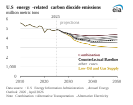High fossil fuel prices in the Low Oil and Gas 

Supply case result in the lowest emissions. This is because higher prices cause natural gas and petroleum demand to decline, particularly for natural gas-fired electric power generation and in industrial activities. 

Policy also has large impacts on our long-term projections of CCS, most notably, the One Big Beautiful Bill Act revisions to the 45Q tax credit, which incentivize carbon captured through enhanced oil recovery, and rules regulating carbon emissions at power plants. The Carbon Capture, Allocation, Transportation, and Sequestration Module (CCATS), which was originally introduced in AEO2025, is designed to quantify various operation and investment costs for capturing, transporting, and sequestering or utilizing CO₂ from industrial facilities and electric power plants. 

U.S. Energy Information Administration   |   AEO2026 Narrative 

30 

