# **Energy Considerations of Large Language Model Inference and Efficiency Optimizations** 

**Jared Fernandez*****1** **, Clara Na*****1** **, Vashisth Tiwari*****1** **, Yonatan Bisk****1** , **Sasha Luccioni****2** , **Emma Strubell****1** 

1Carnegie Mellon University, 2Hugging Face, 

**Correspondence:** {jaredfern, clarana, vashisthtiwari}@cmu.edu 

## **Abstract** 

As large language models (LLMs) scale in size and adoption, their computational and environmental costs continue to rise. Prior benchmarking efforts have primarily focused on latency reduction in idealized settings, often overlooking the diverse real-world inference workloads that shape energy use. In this work, we systematically analyze the energy implications of common inference efficiency optimizations across diverse Natural Language Processing (NLP) and generative Artificial Intelligence (AI) workloads, including conversational AI and code generation. We introduce a modeling approach that approximates real-world LLM workflows through a binning strategy for input-output token distributions and batch size variations. Our empirical analysis spans software frameworks, decoding strategies, GPU architectures, online and offline serving settings, and model parallelism configurations. We show that the effectiveness of inference optimizations is _highly sensitive to workload geometry, software stack, and hardware accelerators_ , demonstrating that naive energy estimates based on FLOPs or theoretical GPU utilization significantly underestimate real-world energy consumption. Our findings reveal that the proper application of relevant inference efficiency optimizations can reduce total energy use by up to **73%** from unoptimized baselines. These insights provide a foundation for sustainable LLM deployment and inform energy-efficient design strategies for future AI infrastructure. 

## **1 Introduction** 

Improvements in task performance by large language models (LLMs) have prompted large-scale investments in computing hardware and energy infrastructure to support the development and deployment of LLM and related machine learning models (Isaac, 2025; Smith, 2025; Cai and Sophia, 

*Equal contribution 

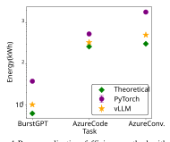Figure 1: Proper application of efficiency methods with optimized vLLM (orange) approaches the ideal energy consumption (green) as compared with an unoptimized baseline PyTorch (purple) implementation. 

2025). However, the growing prevalence of LLMs yields commensurate increases in the energy demand, water use, and carbon emissions associated with their development and deployment (Morrison et al., 2025; Li et al., 2025; Strubell et al., 2020; Luccioni et al., 2024b). Primarily motivated by the increased demands from LLM and AI workloads, projections estimate that that data centers consume between 9.1% and 11.7% of the total US energy demand by 2030 (Aljbour et al., 2024; Shehabi et al., 2024; Green et al., 2024). However, such projections of energy use primarily rely upon sector-wide estimates of demand or substantial simplifications of the of the energy demands of individual models. 

In order to develop effective energy policy for this growing demand, it is necessary to characterize the underlying computational workloads of development (i.e. model training) and deployment (i.e. inference). In particular, the cost and efficiency of inference is especially crucial due to the scale and increased frequency at which models are served for repeated use. Concretely, Meta reports that inference workloads constitute up to 70% of their AI power consumption (Wu et al., 2022) while Google attributes 60% of their ML energy (Patterson et al., 2022) and between 80 to 90% of ML AWS cloud computing demand (Barr, 2019; Leopold, 2019). 

1 

To address the problem of inference efficiency, the NLP and machine learning research communities have developed various optimizations spanning: algorithms, software frameworks, and hardware accelerators. Such optimizations have primarily targeted improvements in model speed (e.g. latency and throughput; (Leviathan et al., 2023; Kwon et al., 2023)). Moreover, these methods are frequently assessed in constrained settings or on simplified datasets that fail to capture the broad diversity of real-world tasks. These tasks range from traditional NLP applications like sequence tagging and summarization to more computationally demanding workloads such as synthetic data generation and chain-of-thought reasoning. _There remains a critical gap in understanding of the energy costs of language model inference, especially when efficiency interventions are applied jointly in real-world settings._ 

In this work, we examine the energy costs of LLM inference and present a comprehensive analysis of the impact of: _data dimensionality, decoding strategies, serving frameworks, compilation techniques, GPU hardware platforms, model parallelism, and architectural variants_ on total energy use during inference. Based on our energy profiling across these optimizations, we approximate offline inference with LLMs based on real-world workload with variable sequence lengths and batching, considering both an upper bound of naive unoptimized inference and a lower bound of theoretical optimized inference. Our analysis reveals that while idealized estimations of hardware utilization substantially underestimate the energy use of language model inference, proper application of inference efficiency optimizations can substantially **reduce the energy requirements of inference by up to 73% from unoptimized baselines with vanilla PyTorch and Huggingface Transformers** and to within 26.6% of theoretical ideal performance on simulated offline workloads (see Table 4). 

## **2 Methodology** 

In the following section, we describe our experimental setup for evaluating inference efficiency. 

**Model Architectures.** We focus our experiments on language models ranging from 1B to 32B parameters, primarily evaluating Llama-3.1-8B-Ba se and Llama-3.1-8B-Instruct models as representative decoder-only transformers (Dubey et al., 2024). To investigate effects of scaling model archi- 

tecture, we include the Qwen-1.5-32B model (Bai et al., 2023). For architectural comparisons, we analyze the sparse OLMoE mixture-of-expert (MoE) model alongside its dense counterparts – the 1B and 7B OLMo architectures – which maintain comparable active and total parameter counts, respectively (Muennighoff et al., 2024; Groeneveld et al., 2024). 

**Data Dimensionality** We investigate the impact of data dimensionality across three key dimensions: input sequence lengths, output generation lengths, and batch sizes. 

Inference with large language models is commonly decomposed into two stages: prefilling and token generation, each with a different energy profile (Patel et al., 2024). The prefill stage processes prompts in parallel and is typically compute-bound, achieving high GPU utilization. In contrast, the autoregressive decoding stage is typically memorybound and leads to GPU under-utilization. These bottlenecks and their resulting energy profiles shift with input and output lengths. 

To address GPU under-utilization during generation, serving systems employ batching strategies. However, the effectiveness of batching varies with input-output characteristics (Agrawal et al., 2024; Li et al., 2024). Long input sequences limit maximum batch sizes due to memory constraints, while variable output lengths can lead to inefficient batch utilization as some sequences complete before others. 

Our analysis spans batch sizes from 1 (singleexample inference) to task-dependent maximums (up to 1024), ensuring coverage of a broad range of maximally realistic settings. 

We ground analysis in NLP workloads spanning text classification, summarization, translation, and open-ended text generation. Different tasks exhibit different data dimensionalities: classification involves minimal generation (often a single token), summarization pairs long contexts with mediumlength outputs, and translation typically assumes balanced input-output lengths. Input length statistics in considered datasets are shown in Table 3. 

In a controlled sweep, we explore scenarios with up to 32k input tokens and 4k output tokens, varying sequence lengths by powers of two. We fix generation to 64 or 8 tokens when varying context lengths, and assume 512 or 64 token input context when varying output lengths. Input context length is enforced via truncation of longer sequences from PG19 (Rae et al., 2019). 

2 

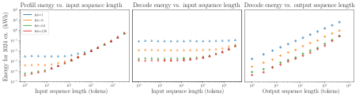Figure 2: Controlled sweeps of input and output sequence lengths on A6000 GPUs, on vLLM backend, described in §3.1. We decompose inference costs into prefill and decode energy. At small batch sizes and input sequence lengths, energy intensity of a workload scales sub-linearly with increasing sequence length input sequence lengths. Decoding is more energy intensive per token than prefill, but energy intensity begins scaling linearly even for short generations and small batch sizes with the vLLM framework. 

**Decoding Strategies.** Different decoding strategies used for generation have different computational profiles and can have a substantial impact on the generation efficiency (Kwon et al., 2023). In order to study the impact of sampling methods and auto-regressive decoding strategies, we investigate _greedy decoding, beam search decoding, temperature sampling, top-p decoding_ affect the energy requirements and end-to-end latency (Holtzman et al., 2020). 

In addition to auto-regressive decoding, we study the impact of speculative decoding. _Speculative decoding_ is commonly used as a latency minimization inference optimization (Kwon et al., 2023). In speculative decoding, a lightweight draft model is used to predict multiple tokens ( _γ_ ) which are then verified by the target model in parallel (Leviathan et al., 2023; Chen et al., 2023). Speculative decoding provides latency improvement by better utilizing GPUs over autoregressive decoding. 

In our experiments, we use the following targetdraft model pairs with a look-ahead value _γ_ = 4 across various batch sizes: DeepSeek-R1-Distil l-Qwen-32B with mobiuslabsgmbh/DeepSeek-R 1-ReDistill-Qwen-1.5B-v1.1 (Guo et al., 2025; Yang et al., 2024); Llama-3.1-8B-Base with Lla ma-3.2-1B (Dubey et al., 2024). 

**Software Optimizations.** Choice in the software frameworks used for inference significantly impacts both latency and energy efficiency through optimized kernel implementations and computational graph management (Georgiou et al., 2022; Fernandez et al., 2023). We evaluate two widely-adopted libraries used in LLM inference: native PyTorch with HuggingFace transformers (Wolf et al., 2020), and vLLM, an optimized framework for LLM infer- 

ence that achieves improved compute and memory utilization (Paszke et al., 2019; Kwon et al., 2023); experiments are conducted in bfloat16 precision. 

Within these frameworks, we compare with a native PyTorch baselines with Just-in-Time compilation via TorchInductor (i.e. torch.compile) and CUDA Graphs kernel serialization. Furthermore, for vLLM, we evaluate continuous batching which efficiently handles variable output lengths in batch processing by overlaying sequences (Yu et al., 2022). 

**Hardware Platforms.** Our experiments are conducted using an on-premise heterogeneous server with multiple GPU types and node configurations. Specifically, we conduct experiments on multiple generations of consumer workstation and datacenter GPU accelerators from the Ampere (A6000, A100 80GB PCIe), and Ada Lovelace (A6000 Ada) microarchitecture. 

All experiments run on 8-GPU nodes with standardized node- and job-level CPU and RAM configurations for each GPU type. For multi-GPU experiments, we utilize up to 4 GPUs simultaneously, investigating tensor parallel inference with group sizes of 2 and 4 devices.1 . We examine both standard and speculative decoding approaches using the Llama-3.1-8B and Qwen-32B models. Additional details on computing hardware are provided in Appendix A. 

> 1This configuration leaves 4-7 GPUs available for other users. While the Slurm scheduler does not enforce complete isolation in network, memory, and CPU infrastructure across jobs, concurrent workloads in practice were not CPU- or memory-intensive enough to impact ours significantly – for example, in the vast majority of cases (98%), an ambient measurement of the RAM utilization in a node our jobs were running on was less than 20% of the total available 

3 

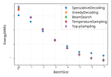Figure 3: At small batch sizes, speculative decoding provides reduced latency and energy savings. At larger batch size speculative decoding increases energy. 

**Performance Measures.** We evaluate the efficiency of inference by measuring the latency, throughput, GPU energy, and GPU power required for the inference of 1,024 examples2 . Total energy use and GPU power metrics are measured using Nvidia Management Library (NVML) via the CodeCarbon library (Courty et al., 2024). Prior to evaluation, we conduct a warmup on up to 20 batches to allow for memory allocation, required CUDA graph capture, and JiT compilation3 . Results are reported as the mean values energy use, latency, or power usage of three runs. 

## **3 Results** 

In the following section, we examine the effects of variations of data dimensionality, model architecture, decoding strategies, and software optimizations on inference energy use. 

### **3.1 Effects of Dataset and Sequence Length** 

We present results from our controlled sweep of sequence lengths and batch sizes in Figure 2. Prefill costs increase as a function of input sequence length, _at the same rate_ regardless of batch sizes when scaling sequences larger than 128 tokens. At shorter sequence lengths and smaller batch sizes, the energy costs of prefill are constant regardless of the computational workload due to significant undersaturation of the accelerator. Although we fix output generation tokens to 64, we verify that at this convergence in rate of energy intensity increase occurs at the same point when instead fixing generation length to 8 tokens; see Figure 11 in Appendix E. 

> 2For experiments with batch sizes larger than 256, metrics are computed over 4096 examples and then normalized. 

> 3Due to size, warmup is limited to 4 batches for inference with the Qwen-32B. 

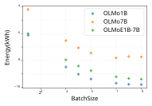Figure 4: Mixture-of-Experts LLMs require more energy than dense models with comparable active parameters; differences are pronounced at larger batch sizes. 

In Figure 2, the energy intensity of the decode likewise scales with input context length only at larger input sequence lengths. 

However, the energy intensity of decoding scales linearly with sequence length regardless of sequence length or batch sizes due to the autoregressive, sequential nature of decoding. 

Generally, decoding energy dominates the overall workload in all settings but those with the shortest generation lengths, such as those seen in classification workloads and short form summarization. Note the log-log scale and the parallel linear trends, where the differences in intercepts are proportionate with the differences in batch size4 . In the following sections, we discuss a variety of algorithmic and software interventions that are appropriate for different types of workload geometries. 

### **3.2 Effects of Algorithmic Optimizations** 

**Speculative Decoding Only Reduces Energy at Low Batch Sizes.** Speculative decoding is commonly used to achieve inference speedups in lowbatch inference in which autoregressive decoding fails to achieve high GPU VRAM utilization. However, for large batch sizes where GPU is already saturated, draft model speculation and excess verifications introduce additional overhead. In the large batch case, for short to medium contexts, LLM inference is typically compute bound, making speculative decoding slower than autoregressive decoding with the target model (Chen et al., 2025; Liu et al., 2024). 

Compared to variations in energy use from alternate decoding strategies and sampling methods, speculative decoding has the greatest effect on the 

> 4See Fig 10 in Appendix E for additional results on vanilla PyTorch backend, and Figure 12 for comparison with real energy intensity measurements for a sample of classical NLP tasks 

4 

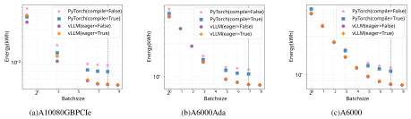Figure 5: Energy consumption comparison across different GPUs for inference with PyTorch and vLLM backends of 1024 samples for 64 output tokens. For each GPU, we compare PyTorch with and without compilation, and vLLM with and without CUDA Graph serialization. The line in black represents the maximum allowable batch size for PyTorch. Relative savings are most apparent in the low batch size regime and that vLLM due to its optimizations can serve a larger batch size. 

energy use and latency of language model inference. At smaller batch sizes ( _≤_ 16) speculative decoding is effective in reducing the total energy cost of inference with up to +29 _._ 14% compared to single-example inference (Figure 3). However, autoregressive decoding methods are more efficient at larger batch sizes, with speculative decoding requiring 25 _._ 65% more energy when performing inference at a batch size of 128. 

**Mixture of Experts Incurs Higher Inference Energy Costs.** Sparse mixture-of-experts are often utilized as an alternative architecture due to their increased sample efficiency during training and increased performance relative to dense neural networks with the same number of active parameters. Although both dense OLMo-1B and the OLMoE1B-7 B mixture-of-experts models use substantially less energy than the dense OLMo-7B model, the OLMoE architecture utilizes up to **54** _._ **24** % more energy than the base OLMo 1B model, despite having a similar number of active parameters. 

We identify that the increased energy and latency of MoE’s can be attributed to the fused kernel used in the expert layers which is substantially slower than the corresponding GEMM operation in linear layers in the dense model; 19.70% slower at batch size 1 and 63% slower at batch size 8. Notably, we observe that the additional routing operations in the MoE model introduce minimal latency; and that the increased overhead of more CUDA graph and kernel launch operations are largely mitigated through kernel serialization and graph compilation optimizations (i.e. vLLM with CUDA Graphs). 

### **3.3 Effects of Software Optimizations** 

**PagedAttention with vLLM Improves Efficiency.** Compared to native PyTorch, the vLLM inference serving engine improves both the throughput and the energy efficiency. The vLLM framework uses PagedAttention to implement non-contiguous KV cache blocks which reduces memory fragmentation and allocation of redundant memory in the case of sparse sequences (Kwon et al., 2023). 

These optimizations allow for improved memory efficiency and the vLLM framework to support larger batch sizes on fixed memory GPUs. 

### **Compilation and Kernel Serialization Improves** 

**Efficiency.** The graph compilation and kernel serialization increase hardware utilization by removing redundant operations in the computational graph and reducing the kernel launch overhead (Fernandez et al., 2023), respectively. We observe that both torch.compile and CUDA graph serialization (eager=False) improve throughput at no additional energy cost in Figure 5. However, we note that the benefits of CUDA graphs are more apparent at lower batch sizes, as the relative cost of kernel launch is larger for smaller computational workloads. 

**Continuous Batching Reduces Energy Use.** LLM inference is inherently autoregressive, requiring many sequential operations. Static batching maintains a fixed batch size throughout inference, which leads to GPU under-utilization when generation lengths vary and idle compute accumulates after early terminations. _Continuous batching_ mitigates this by dynamically replacing completed requests with new ones, improving GPU utilization and reducing idle time (Yu et al., 2022). This ap- 

5 

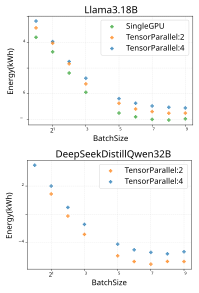Figure 6: Energy Use of Llama-3.1 8B and Qwen 32B with varying degrees of Tensor Parallelism. 

proach is particularly effective when generation lengths have high variance, yielding significant speedups at larger batch sizes. 

We observe that at smaller batch sizes the overhead of online scheduling outweighs its benefits but at larger batch sizes, online serving with continuous batching requires less energy; details in Appendix D. We note that the numbers under-represent the impact of continuous batching given the samples are drawn from the same dataset, thereby reducing the variance in input and output lengths. 

### **3.4 Effects of Hardware Design Choices** 

**Multi-GPU Tensor Parallelism Reduces Latency for Increased Power Use** Model parallelism techniques such as tensor and pipeline parallelism are frequently used to alleviate the memory pressure of large sets of model parameters and batch sizes, as well as to leverage multiple hardware accelerators in order to speed up workload execution (Narayanan et al., 2021). Additionally, for fixed workloads, tensor parallelism reduces both the per-device computational intensity and perdevice power utilization as the workload is sharded across accelerator. However, the speedups from additional accelerators are insufficient to offset the energy cost of utilizing more devices (i.e. utilizing twice the GPUs fails to yield a two-fold speedup). 

In Figure 6, we observe that utilizing tensor parallelism to scale from inference with a single GPU to four GPUs reduces latency and per-device power utilization for the Llama-3.1 8B model. However, increasing parallelism yields higher total energy use due to the larger number of accelerators. Concretely, parallelizing a fixed workload over two and four GPUs decreases latency by 40.16% and 61.34% but increases total energy use by 29.3% and 55.23% at single batch inference due to the introduction of additional devices. 

**Effects of Hardware Speed** The effectiveness of optimization techniques varies significantly across hardware platforms, with faster accelerators showing greater benefits from optimizations that target computational efficiency. Our results demonstrate that graph compilation, kernel serialization, and speculative decoding achieve their maximum impact on the A100 GPU. 

Specifically, PyTorch compilation yields a 29.90% improvement on the A100, which drops to 13.28% on the RTX 6000 Ada and further to 1.96% on the A6000. Similarly, vLLM’s eager mode optimization shows a 25.47% improvement on the A100 versus 2.97% on the A6000. This pattern suggests that as hardware computational capabilities increase, the relative impact of software optimizations targeting kernel efficiency becomes more pronounced. 

## **4 The Impact of Optimizations on Inference Energy Use** 

In this section, we outline our approach to modeling the energy consumption of an LLM under both synthetic and realistic workload distributions. We leverage classical NLP tasks and datasets of inference requests to estimate energy usage across different execution environments, including PyTorchnative and vLLM backends with software optimizations on a single A6000 GPU. 

### **4.1 Modeling Energy Requirements Using Offline Serving** 

We consider the energy required to process a dataset _D_ = _{R_ 1 _, R_ 2 _, . . . , RN }_ in an offline setting in which all requests can be batch processed freely, and where each request _Rk_ consists of a tuple ( _ik, ok_ ), representing the input token length _ik_ and the output generation length _ok_ : 

$$
Rk = (ik, ok), ∀k \in{}{}{1, . . . , N}.
$$

6 

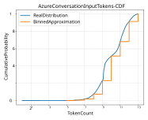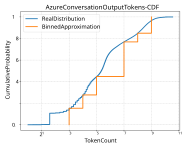Figure 7: Comparison of the real token length distributions (blue) with the binned approximation (orange) for Azure conversation input (left) and output (right) token lengths. The CDF plots illustrate how our binning strategy approximates the empirical distribution while ensuring computational efficiency for energy estimation. 

Since _ik_ and _ok_ vary significantly across requests, we utilize dataset statistics—including the median and 99th percentile of input and output lengths (discussed in §4.3) to inform our binning strategy. 

**Binning Strategy.** To effectively handle the broad range of ( _ik, ok_ ) values, we define discrete bin sets for input and output lengths: 

We collect real energy measurements **E**real batch(**I**_∗,_**O**_∗_),representingtheobserveden- ergy usage when processing a full batch of size _B_ ( _I__∗_ _, O__∗_ ) with input lengths _I__∗_ and output lengths _O__∗_ . Thus, the total estimated energy consumption across the workload to serve _N_ requests that fall in the bin is given by: 

$$
Ibins = {2m | m \in{}{}N, 4 \leq{}{}m \leq{}{}13} = {32, 128, 256, 512, 1024, 2048, 4096, 8192}, Obins = {2n | n \in{}{}N, 3 \leq{}{}m \leq{}{}9} = {8, 16, 32, 64, 128, 256, 512}.
$$

These bin choices ensure sufficient coverage across realistic request distributions. Notably, we exclude extremely long input requests ( _>_ 8 _k_ tokens) and generation outputs beyond 512 tokens. 

$$
�Etotal = � (I∗,O∗) �Nreal(I∗, O∗) B(I∗, O∗) � Ereal batch(I∗, O∗),
$$

where _N_real ( _I__∗_ _, O__∗_ ) is the total number of observed requests mapped to bin ( _I__∗_ _, O__∗_ ), and _N_real <u>(</u> _I__∗_ _<u>,O</u>__∗_ <u>)</u> represents the number of batches re- _B_ ( _I__<u>∗</u>_ _,O__<u>∗</u>_ ) quired to process them. 

**Mapping Requests to Bins.** Given a request _R_ = ( _i, o_ ), we map it to the closest ceiling bin: 

$$
I∗= min{I \in{}{}Ibins | I \geq{}{}i}, O∗= min{O \in{}{}Obins | O \geq{}{}o}.
$$

We group requests within the same ( _I__∗_ _, O__∗_ ) bin into batches of size _B_ ( _I__∗_ _, O__∗_ ), the maximum allowable batch size for the given hardware and backend configuration. Each batch processes _B_ ( _I__∗_ _, O__∗_ ) requests in parallel, allowing for more efficient energy utilization, which is more representative of real-world inference setups. 

Given our hardware configuration and backend, we collect the estimates of _E_ batch( _I__∗_ _, O__∗_ ), which corresponds to the energy used to serve a request of batch size _B_ with input prompts of length _I∗_ and output lengths _O∗_ . 

### **4.2 Idealized Baseline** 

As a naive baseline, we estimate an upper bound of the energy efficiency of these workloads with a baseline derived from the manufacturer-rated hardware speeds ( _FLOPSHW_ ), power draw (TDP) ,and floating point operations (FLOPs) required for inference _FLOPs_5 . This approximation assumes hardware is being utilized as maximum efficiency both in through idealized floating point operation throughput and maximum power draw. 

$$
�EOptimal = � TDP FLOPSHW � \times{}{} � (I∗,O∗) Nreal(I∗, O∗) \times{}{} FLOPs(I∗, O∗)
$$

7 

|**Dataset**|**Mean**_±_**Std**|**Median**|**99th**|
|---|---|---|---|
|BurstGPT|256.80_±_242.27|215|1038|
|Azure Chat|1631.58_±_1529.64|928|6683|
|Azure Code|2511.28_±_2133.54|1930|7685|

Table 1: Input Sequence Length Statistics Across RealWorld LLM Workloads 

|**Dataset**|**Mean**_±_**Std**|**Median**|**99th**|
|---|---|---|---|
|BurstGPT|35.10_±_108.59|7|478|
|Azure Chat|105.51_±_158.25|41|694|
|Azure Code|22.69_±_74.78|8|271|

Table 2: Output Sequence Length Statistics Across RealWorld LLM Workloads 

### **4.3 Evaluations** 

We examine a suite of classical NLP tasks and LLM inference workloads, each characterized by a range of different input context and output generation sequences; with dataset statistics provided in Tables 3, 1, 2. We simulate a large-scale offline processing setting on the RTX A6000 GPUs, in which examples are binned by sequence lengths (as described in §4 and processed in parallel in the largest possible batches that fit in GPU memory. 

Utilizing the simulated workloads described in Sec 4.1, we estimate the effectiveness of the inference efficiency optimizations evaluated in Section 4.1. Based on these results, we select an inference framework with efficiency optimizations targeting large batch inference. Concretely, we consider inference with a dense model utilizing vLLM with CUDA graph serialization (eager mode off) on a single GPU and compare it to unoptimized inference native PyTorch as a lower bound on energy efficiency. In addition, we also model the idealized energy baseline based on the model and hardware configurations. 

**Classical NLP Tasks.** We benchmark the energy use in a set of classical natural language processing tasks in the English language: text classification (IMDB, Maas et al., 2011), machine translation (WMT-14, Bojar et al., 2014), summarization (CNN-DailyMail, Nallapati et al., 2016), and text generation (Wikitext-2 (Merity et al., 2016)). 

For each of these tasks, we sample a subset of 1024 examples with statistics of each dataset for the input and the output tokens provided in Table 3. 

> 5Based on the Nvidia datasheet for the RTX A6000 GPU, we utilize consider _FLOPSHW_ of 309.7 TFLOPS and a 300W TDP power draw; and estimate theoretical inference FLOPs with the DeepSpeed profiler (Rasley et al., 2020). 

|**Task**|**Mean**_±_**Std**|**Max**|**Output**|
|---|---|---|---|
|**Translatio**|**n** 49.96_±_39.39|550|64|
|**Generatio**|**n** 136.89_±_93.13|547|64|
|**Classificat**|**iion** 292.48_±_239.94|3112|1|
|**Summariz**|**ation** 838.49_±_400.70|2386|64|
|ble 3: To cross NLP 0_._05|kenized Input and Output Tasks used for Energy Be PyTorch vLLM|Lengt nchm|h Statisti arking|
|0_._04  (kWh)||||
|0_._02 0_._03 Energy||||
|0_._01||||
||wiki imdb CNN Task||wmt|

Table 3: Tokenized Input and Output Length Statistics Across NLP Tasks used for Energy Benchmarking 

Figure 8: Energy Comparison in doing inference over 1024 samples between PyTorch with Compilation off and vLLM with eager model off. 

We note that the input sequences were padded to the maximum sequence length. The energy profiles for the best run, characterized by the least energy are summarized in Figure 8, with consistent reductions in energy use provided by inference efficiency optimizations. 

**Real-World LLM Workloads** Additionally, we estimate the energy intensity and effectiveness of efficiency optimizations on real-world LLM workloads. We simulate the offline processing of LLM inference requests as used in applications for shortform conversations with the Burst-GPT dataset (Wang et al., 2024) and long context conversations and code completion with the Azure LLM Inference chat and code traces (Stojkovic et al., 2024b). Each dataset provides a traces of LLM inference requests with their corresponding input context and output generation lengths. As compared with the classical NLP tasks, modern LLM workloads tend to be longer in both input context and output generation token lengths, with code-assist applications having longer contexts, whereas conversational settings resulting in longer generations. 

Due to the larger number of requests and increased sequence lengths, we observe that these workloads require substantially larger amounts of energy. However, we find that proper applications of inference efficiency optimizations can substantially reduce energy costs with savings of 73.00%, 

8 

|Dataset|PyTorch %∆|vLLM %∆|
|---|---|---|
|BurstGPT|506.52%|63.75%|
|Azure Code|102.79%|26.59%|
|Azure Conversation|490.23%|64.22%|

Table 4: Percentage differences of energy consumption relative to theoretical values for Various Tasks with Offline Inference. 

37.58%, and 72.18% on BurstGPT, Azure Code and Conversation, respectively. 

## **5 Related Work** 

**Efficient Methods for LLM Inference** To meet the service-level-objective (SLO) serving requirements of real deployment settings, efficiency optimizations for LLM inference are often designed to optimize model serving speed, as measured by latency and time-to-first-token. A variety of methods have been developed to meet these latency constraints, including: continuous batching (Yu et al., 2022), model parallelism (Narayanan et al., 2021; Huang et al., 2019; Li et al., 2020), speculative decoding (Liu et al., 2024; Leviathan et al., 2023; Chen et al., 2023, 2025), and disaggregated serving (Zhong et al., 2024). 

Solely optimizing system performance for speed is insufficient in characterizing and does not provide insight into the model energy use and resulting carbon emissions of LLM inference; as such methods may require additional computation or exhibit low correlation between efficiency cost indicators (Dehghani et al., 2022). Recent work has explored methods for explicitly reducing energy requirements and carbon emissions for LLM serving via disaggregated serving over heterogeneous hardware (Shi et al., 2024), system-wide scheduling and request routing to energy-optimized instances (Stojkovic et al., 2024b), and prompt directives to induce shorter sequence generations (Li et al., 2024). However, the exact impact or improvements in energy requirements for latency-optimized methods remains not fully characterized. 

**Estimations and Measurement of of Energy Use in NLP** The energy and carbon emissions of machine learning models have been a growing concern in the research community and industry as the scale of models and prevalence of deployment has increased (Schwartz et al., 2020; Wu et al., 2022). Estimations of the energy requirements and environmental impact of LLMs has largely focused on estimation of costs for pretraining and finetuning 

due to the large singular costs of model developments (Strubell et al., 2020; Wang et al., 2023; Luccioni et al., 2023; Faiz et al., 2023); with large industrial developers similarly reporting the energy required for pretraining (OLMo et al., 2024; Morrison et al., 2025; Dubey et al., 2024). 

In contrast to training, inference workloads are higher in variability with variation in request frequencies, batching, input and output sequence lengths executed over diverse hardware platforms at scale; and more complex energy use profiles due to variations in power draw during prefill and decoding stages of generation (Patel et al., 2024). Previous work has investigated the comparative energy cost of machine learning models across various tasks (Luccioni et al., 2024b,a), the energy costs of LMs of various sizes (Samsi et al., 2023; Wu et al., 2025), the effects of hardware configurations (i.e. GPU power capping and frequency scaling; (Samsi et al., 2023)), and the impact of sequence length variability and batching strategies (Patel et al., 2024; Stojkovic et al., 2024a; Wilkins et al., 2024). However, such evaluations of inference energy use often rely on simplified deployment settings with limited sets of model architectures and serving frameworks. 

## **6 Conclusion** 

In this work, we evaluate the impact of common inference efficiency optimizations on the energy requirements of large language model serving. We examine a variety of optimization techniques and evaluate on representative data corresponding to classical NLP tasks as well as modern LLM deployment settings. We conclude that the effectiveness of latency optimizations in reducing energy use is highly sensitive to the shape of the input data, underlying hardware architecture, and software framework implementations; and that optimizations cannot be applied uniformly. 

Additionally, we conduct a case study of classical NLP tasks and real-world LLM inference workloads and find that proper application of the studied inference optimizations can reduce total energy use by up to 73% on the BurstGPT chat dataset. 

## **Limitations and Risks** 

In this work, we evaluate the energy efficiency and carbon emissions of LLM inference as approximated by total GPU power usage. Although GPUs the majority of arithmetic operations required for 

9 

inference and operate at a higher TDP than other components, we do not account for the energy use by other other components of the hardware system such as power use from CPU, memory, or disk storage (McAllister et al., 2024; Patel et al., 2024); or estimate the energy requirements of other hardware accelerator architectures (e.g. TPUs, NPUs, etc.). Likewise, we conduct an investigation of commonly used inference software frameworks and standard efficiency optimizations. However, there remain other settings and computational optimizations that can be applied to LLM inference, such as utilizing: reduced or mixed precision, adaptive adjustment of GPU frequency, additional forms of model parallelism, or other forms of load management and workload scheduling; which remain out of the scope of this work (Stojkovic et al., 2024b). 

In this work, we primarily focus on the operation energy use of machine learning inference. Estimation of the embodied costs of inference; and the costs of machine learning training remain out of the scope of this work. 

Although improved characterization of the energy use of LLM inference can be used to design more efficient serving settings and reduce the energy needs of inference, it is possible that reductions in the cost of pretraining may then lead more individuals and organizations to pursue large model pretraining (i.e. Jevons Paradox). 

## **References** 

- Amey Agrawal, Nitin Kedia, Ashish Panwar, Jayashree Mohan, Nipun Kwatra, Bhargav S Gulavani, Alexey Tumanov, and Ramachandran Ramjee. 2024. Taming throughput-latency tradeoff in llm inference with sarathi-serve. _Proceedings of 18th USENIX Symposium on Operating Systems Design and Implementation, 2024, Santa Clara_ . 

- Jordan Aljbour, Tom Wilson, and P Patel. 2024. Powering intelligence: Analyzing artificial intelligence and data center energy consumption. _EPRI White Paper no. 3002028905_ . 

- Jinze Bai, Shuai Bai, Yunfei Chu, Zeyu Cui, Kai Dang, Xiaodong Deng, Yang Fan, Wenbin Ge, Yu Han, Fei Huang, et al. 2023. Qwen technical report. _arXiv preprint arXiv:2309.16609_ . 

- Jeff Barr. 2019. Amazon ec2 update-infl instances with aws inferentia chips for high performance costeffective inferencing. 

- Ondrej Bojar, Christian Buck, Christian Federmann, Barry Haddow, Philipp Koehn, Johannes Leveling, 

   - Christof Monz, Pavel Pecina, Matt Post, Herve SaintAmand, Radu Soricut, Lucia Specia, and Ales Tamchyna. 2014. Findings of the 2014 workshop on statistical machine translation. In _Proceedings of the Ninth Workshop on Statistical Machine Translation_ , pages 12–58, Baltimore, Maryland, USA. Association for Computational Linguistics. 

- Kendrick Cai and Deborah Mary Sophia. 2025. Alphabet plans massive capex hike, reports cloud revenue growth slowed. _Reuters_ . 

- Charlie Chen, Sebastian Borgeaud, Geoffrey Irving, Jean-Baptiste Lespiau, Laurent Sifre, and John Jumper. 2023. Accelerating large language model decoding with speculative sampling. _arXiv preprint arXiv:2302.01318_ . 

- Jian Chen, Vashisth Tiwari, Ranajoy Sadhukhan, Zhuoming Chen, Jinyuan Shi, Ian En-Hsu Yen, and Beidi Chen. 2025. Magicdec: Breaking the latencythroughput tradeoff for long context generation with speculative decoding. In _The Thirteenth International Conference on Learning Representations_ . 

- Benoit Courty, Victor Schmidt, Sasha Luccioni, GoyalKamal, MarionCoutarel, Boris Feld, Jérémy Lecourt, LiamConnell, Amine Saboni, Inimaz, supatomic, Mathilde Léval, Luis Blanche, Alexis Cruveiller, ouminasara, Franklin Zhao, Aditya Joshi, Alexis Bogroff, Hugues de Lavoreille, Niko Laskaris, Edoardo Abati, Douglas Blank, Ziyao Wang, Armin Catovic, Marc Alencon, Michał St˛echły, Christian Bauer, Lucas Otávio N. de Araújo, JPW, and MinervaBooks. 2024. mlco2/codecarbon: v2.4.1. 

- Mostafa Dehghani, Yi Tay, Anurag Arnab, Lucas Beyer, and Ashish Vaswani. 2022. The efficiency misnomer. In _International Conference on Learning Representations_ . 

- Abhimanyu Dubey, Abhinav Jauhri, Abhinav Pandey, Abhishek Kadian, Ahmad Al-Dahle, Aiesha Letman, Akhil Mathur, Alan Schelten, Amy Yang, Angela Fan, et al. 2024. The llama 3 herd of models. _arXiv preprint arXiv:2407.21783_ . 

- Ahmad Faiz, Sotaro Kaneda, Ruhan Wang, Rita Osi, Prateek Sharma, Fan Chen, and Lei Jiang. 2023. Llmcarbon: Modeling the end-to-end carbon footprint of large language models. _arXiv preprint arXiv:2309.14393_ . 

- Jared Fernandez, Jacob Kahn, Clara Na, Yonatan Bisk, and Emma Strubell. 2023. The framework tax: Disparities between inference efficiency in nlp research and deployment. In _Proceedings of the 2023 Conference on Empirical Methods in Natural Language Processing_ , pages 1588–1600. 

- Stefanos Georgiou, Maria Kechagia, Tushar Sharma, Federica Sarro, and Ying Zou. 2022. Green ai: Do deep learning frameworks have different costs? In _Proceedings of the 44th International Conference on Software Engineering_ , pages 1082–1094. 

10 

- Alistair Green, Humayun Tai, Jesse Noffsinger, and Pankaj Sachdeva. 2024. How data centers and the energy sector can sate ai’s hunger for power. _McKinsey and Company_ . 

- Dirk Groeneveld, Iz Beltagy, Pete Walsh, Akshita Bhagia, Rodney Kinney, Oyvind Tafjord, Ananya Harsh Jha, Hamish Ivison, Ian Magnusson, Yizhong Wang, et al. 2024. Olmo: Accelerating the science of language models. _arXiv preprint arXiv:2402.00838_ . 

- Daya Guo, Dejian Yang, Haowei Zhang, Junxiao Song, Ruoyu Zhang, Runxin Xu, Qihao Zhu, Shirong Ma, Peiyi Wang, Xiao Bi, et al. 2025. Deepseek-r1: Incentivizing reasoning capability in llms via reinforcement learning. _arXiv preprint arXiv:2501.12948_ . 

- Ari Holtzman, Jan Buys, Li Du, Maxwell Forbes, and Yejin Choi. 2020. The curious case of neural text degeneration. In _International Conference on Learning Representations_ . 

- Yanping Huang, Youlong Cheng, Ankur Bapna, Orhan Firat, Dehao Chen, Mia Chen, HyoukJoong Lee, Jiquan Ngiam, Quoc V Le, Yonghui Wu, et al. 2019. Gpipe: Efficient training of giant neural networks using pipeline parallelism. _Advances in neural information processing systems_ , 32. 

- Mike Isaac. 2025. Meta to increase spending to $65 billion this year in a.i. push. _New York Times_ . 

- Woosuk Kwon, Zhuohan Li, Siyuan Zhuang, Ying Sheng, Lianmin Zheng, Cody Hao Yu, Joseph E. Gonzalez, Hao Zhang, and Ion Stoica. 2023. Efficient memory management for large language model serving with pagedattention. In _Proceedings of the ACM SIGOPS 29th Symposium on Operating Systems Principles_ . 

- George Leopold. 2019. Aws to offer nvidia’s t4 gpus for ai inferencing. _URL: https://web. archive. org/web/20220309000921/https://www. hpcwire. com/2019/03/19/aws-upgrades-its-gpu-backed-aiinference-platform/(visited on 2022-04-19)_ . 

- Yaniv Leviathan, Matan Kalman, and Yossi Matias. 2023. Fast inference from transformers via speculative decoding. In _International Conference on Machine Learning_ , pages 19274–19286. PMLR. 

- Baolin Li, Yankai Jiang, Vijay Gadepally, and Devesh Tiwari. 2024. Sprout: Green generative ai with carbon-efficient llm inference. In _Proceedings of the 2024 Conference on Empirical Methods in Natural Language Processing_ , pages 21799–21813. 

- Pengfei Li, Jianyi Yang, Mohammad A. Islam, and Shaolei Ren. 2025. Making AI Less "Thirsty": Uncovering and Addressing the Secret Water Footprint of AI Models. _arXiv preprint_ . ArXiv:2304.03271 [cs]. 

- Shen Li, Yanli Zhao, Rohan Varma, Omkar Salpekar, Pieter Noordhuis, Teng Li, Adam Paszke, Jeff Smith, Brian Vaughan, Pritam Damania, et al. 2020. Pytorch 

distributed: Experiences on accelerating data parallel training. _arXiv preprint arXiv:2006.15704_ . 

- Xiaoxuan Liu, Cade Daniel, Langxiang Hu, Woosuk Kwon, Zhuohan Li, Xiangxi Mo, Alvin Cheung, Zhijie Deng, Ion Stoica, and Hao Zhang. 2024. Optimizing speculative decoding for serving large language models using goodput. _arXiv preprint arXiv:2406.14066_ . 

- Alexandra Sasha Luccioni, Sylvain Viguier, and AnneLaure Ligozat. 2023. Estimating the carbon footprint of bloom, a 176b parameter language model. _Journal of Machine Learning Research_ , 24(253):1–15. 

- Sasha Luccioni, Boris Gamazaychikov, Sara Hooker, Régis Pierrard, Emma Strubell, Yacine Jernite, and Carole-Jean Wu. 2024a. Light bulbs have energy ratings—so why can’t ai chatbots? _Nature_ , 632(8026):736–738. 

- Sasha Luccioni, Yacine Jernite, and Emma Strubell. 2024b. Power hungry processing: Watts driving the cost of ai deployment? In _Proceedings of the 2024 ACM Conference on Fairness, Accountability, and Transparency_ , FAccT ’24, page 85–99, New York, NY, USA. Association for Computing Machinery. 

- Andrew Maas, Raymond E Daly, Peter T Pham, Dan Huang, Andrew Y Ng, and Christopher Potts. 2011. Learning word vectors for sentiment analysis. In _Proceedings of the 49th annual meeting of the association for computational linguistics: Human language technologies_ , pages 142–150. 

- Sara McAllister, Fiodar Kazhamiaka, Daniel S Berger, Rodrigo Fonseca, Kali Frost, Aaron Ogus, Maneesh Sah, Ricardo Bianchini, George Amvrosiadis, Nathan Beckmann, et al. 2024. A call for research on storage emissions. In _Proceedings of the 3rd Workshop on Sustainable Computer Systems (HotCarbon)_ . 

- Stephen Merity, Caiming Xiong, James Bradbury, and Richard Socher. 2016. Pointer sentinel mixture models. _Preprint_ , arXiv:1609.07843. 

- Jacob Morrison, Clara Na, Jared Fernandez, Tim Dettmers, Emma Strubell, and Jesse Dodge. 2025. Holistically evaluating the environmental impact of creating language models. In _The Thirteenth International Conference on Learning Representations_ . 

- Niklas Muennighoff, Luca Soldaini, Dirk Groeneveld, Kyle Lo, Jacob Morrison, Sewon Min, Weijia Shi, Pete Walsh, Oyvind Tafjord, Nathan Lambert, et al. 2024. Olmoe: Open mixture-of-experts language models. _arXiv preprint arXiv:2409.02060_ . 

- Ramesh Nallapati, Bowen Zhou, Cicero dos Santos, Ça˘glar Gu˙lçehre, and Bing Xiang. 2016. Abstractive text summarization using sequence-to-sequence RNNs and beyond. In _Proceedings of the 20th SIGNLL Conference on Computational Natural Language Learning_ , pages 280–290, Berlin, Germany. Association for Computational Linguistics. 

11 

- Deepak Narayanan, Mohammad Shoeybi, Jared Casper, Patrick LeGresley, Mostofa Patwary, Vijay Korthikanti, Dmitri Vainbrand, Prethvi Kashinkunti, Julie Bernauer, Bryan Catanzaro, et al. 2021. Efficient large-scale language model training on gpu clusters using megatron-lm. In _Proceedings of the International Conference for High Performance Computing, Networking, Storage and Analysis_ , pages 1– 15. 

- Team OLMo, Pete Walsh, Luca Soldaini, Dirk Groeneveld, Kyle Lo, Shane Arora, Akshita Bhagia, Yuling Gu, Shengyi Huang, Matt Jordan, et al. 2024. 2 olmo 2 furious. _arXiv preprint arXiv:2501.00656_ . 

- Adam Paszke, Sam Gross, Francisco Massa, Adam Lerer, James Bradbury, Gregory Chanan, Trevor Killeen, Zeming Lin, Natalia Gimelshein, Luca Antiga, et al. 2019. Pytorch: An imperative style, high-performance deep learning library. _Advances in neural information processing systems_ , 32. 

- Pratyush Patel, Esha Choukse, Chaojie Zhang, Íñigo Goiri, Brijesh Warrier, Nithish Mahalingam, and Ricardo Bianchini. 2024. Characterizing power management opportunities for llms in the cloud. In _Proceedings of the 29th ACM International Conference on Architectural Support for Programming Languages and Operating Systems, Volume 3_ , pages 207–222. 

- David Patterson, Joseph Gonzalez, Urs Hölzle, Quoc Le, Chen Liang, Lluis-Miquel Munguia, Daniel Rothchild, David So, Maud Texier, and Jeff Dean. 2022. The carbon footprint of machine learning training will plateau, then shrink. _Preprint_ , arXiv:2204.05149. 

- Jack W Rae, Anna Potapenko, Siddhant M Jayakumar, Chloe Hillier, and Timothy P Lillicrap. 2019. Compressive transformers for long-range sequence modelling. _arXiv preprint_ . 

- Jeff Rasley, Samyam Rajbhandari, Olatunji Ruwase, and Yuxiong He. 2020. Deepspeed: System optimizations enable training deep learning models with over 100 billion parameters. In _Proceedings of the 26th ACM SIGKDD International Conference on Knowledge Discovery & Data Mining_ , pages 3505–3506. 

- Siddharth Samsi, Dan Zhao, Joseph McDonald, Baolin Li, Adam Michaleas, Michael Jones, William Bergeron, Jeremy Kepner, Devesh Tiwari, and Vijay Gadepally. 2023. From words to watts: Benchmarking the energy costs of large language model inference. In _2023 IEEE High Performance Extreme Computing Conference (HPEC)_ , pages 1–9. IEEE. 

- Roy Schwartz, Jesse Dodge, Noah A Smith, and Oren Etzioni. 2020. Green ai. _Communications of the ACM_ , 63(12):54–63. 

- Arman Shehabi, Alex Hubbard, Alex Newkirk, Nuoa Lei, Md Abu Bakkar Siddik, Billie Holecek, Jonathan Koomey, Eric Masanet, Dale Sartor, et al. 2024. 2024 united states data center energy usage report. 

- Tianyao Shi, Yanran Wu, Sihang Liu, and Yi Ding. 2024. Greenllm: Disaggregating large language model serving on heterogeneous gpus for lower carbon emissions. _arXiv preprint arXiv:2412.20322_ . 

- Brad Smith. 2025. The golden opportunity for american ai. 

- Jovan Stojkovic, Esha Choukse, Chaojie Zhang, Inigo Goiri, and Josep Torrellas. 2024a. Towards greener llms: Bringing energy-efficiency to the forefront of llm inference. _arXiv preprint arXiv:2403.20306_ . 

- Jovan Stojkovic, Chaojie Zhang, Íñigo Goiri, Josep Torrellas, and Esha Choukse. 2024b. Dynamollm: Designing llm inference clusters for performance and energy efficiency. _arXiv preprint arXiv:2408.00741_ . 

- Emma Strubell, Ananya Ganesh, and Andrew McCallum. 2020. Energy and policy considerations for modern deep learning research. In _Proceedings of the AAAI conference on artificial intelligence_ , volume 34, pages 13693–13696. 

- Xiaorong Wang, Clara Na, Emma Strubell, Sorelle Friedler, and Sasha Luccioni. 2023. Energy and carbon considerations of fine-tuning BERT. In _Findings of the Association for Computational Linguistics: EMNLP 2023_ , pages 9058–9069, Singapore. Association for Computational Linguistics. 

- Yuxin Wang, Yuhan Chen, Zeyu Li, Xueze Kang, Zhenheng Tang, Xin He, Rui Guo, Xin Wang, Qiang Wang, Amelie Chi Zhou, and Xiaowen Chu. 2024. Burstgpt: A real-world workload dataset to optimize llm serving systems. _Preprint_ , arXiv:2401.17644. 

- Grant Wilkins, Srinivasan Keshav, and Richard Mortier. 2024. Offline energy-optimal llm serving: Workloadbased energy models for llm inference on heterogeneous systems. _ACM SigEnergy newletter_ . 

- Thomas Wolf, Lysandre Debut, Victor Sanh, Julien Chaumond, Clement Delangue, Anthony Moi, Pierric Cistac, Tim Rault, Rémi Louf, Morgan Funtowicz, et al. 2020. Transformers: State-of-the-art natural language processing. In _Proceedings of the 2020 conference on empirical methods in natural language processing: system demonstrations_ , pages 38–45. 

- Carole-Jean Wu, Ramya Raghavendra, Udit Gupta, Bilge Acun, Newsha Ardalani, Kiwan Maeng, Gloria Chang, Fiona Aga, Jinshi Huang, Charles Bai, et al. 2022. Sustainable ai: Environmental implications, challenges and opportunities. _Proceedings of Machine Learning and Systems_ , 4:795–813. 

- Yanran Wu, Inez Hua, and Yi Ding. 2025. Unveiling environmental impacts of large language model serving: A functional unit view. _arXiv preprint arXiv:2502.11256_ . 

- An Yang, Baosong Yang, Beichen Zhang, Binyuan Hui, Bo Zheng, Bowen Yu, Chengyuan Li, Dayiheng Liu, Fei Huang, Haoran Wei, et al. 2024. Qwen2. 5 technical report. _arXiv preprint arXiv:2412.15115_ . 

12 

- Gyeong-In Yu, Joo Seong Jeong, Geon-Woo Kim, Soojeong Kim, and Byung-Gon Chun. 2022. Orca: A distributed serving system for _{_ Transformer-Based _}_ generative models. In _16th USENIX Symposium on Operating Systems Design and Implementation (OSDI 22)_ , pages 521–538. 

- Yinmin Zhong, Shengyu Liu, Junda Chen, Jianbo Hu, Yibo Zhu, Xuanzhe Liu, Xin Jin, and Hao Zhang. 2024. _{_ DistServe _}_ : Disaggregating prefill and decoding for goodput-optimized large language model serving. In _18th USENIX Symposium on Operating Systems Design and Implementation (OSDI 24)_ , pages 193–210. 

## **A Hardware Details** 

In Table 5, we provide additional details on the hardware configurations of the nodes used in our benchmarking experiments. 

## **B Dataset Licenses** 

The CNN-DailyMail dataset used for summarization is released under the Apache-2.0 License. The dataset Wikitext-2 dataset for text generation is available under the Creative Commons AttributionShareAlike License. The WMT-14 translation datasets are released for non-commercial use. The BurstGPT and Azure trace datasets are released under CC-BY-4.0 licenses. 

## **C Acknowledgment of AI Assistance** 

Artificial intelligence assistance was used to assist in literature review and for code completion assistance, specifically during the creation of visualizations. 

## **D Additional Optimzations: Continuous Batching** 

In Figure 9, we present additional results on the impact of vLLM’s continuous batching for online inference in which we observe that at large batch sizes continuous batching yields reductions in energy use. 

## **E Additional Sequence Length Results** 

In Figure 10, we present additional results on the effects of scaling input and output sequence lengths with the PyTorch framework. 

13 

|**CPU**|**RAM**|**GPU**|**GPU TDP**|**FP32 TFLOPS**|**Bfloat16 TFLOPS**|
|---|---|---|---|---|---|
|256xAMD EPYC 7763|1TB|Nvidia RTX A6000|300W|38.7|–|
|128xAMD EPYC 7513|500GB|Nvidia RTX A6000 Ada|300W|91.1|–|
|128xAMD EPYC 7763|1TB|Nvidia RTX A100-80 GB|300W|156|312|

Table 5: Node Hardware Specifications 

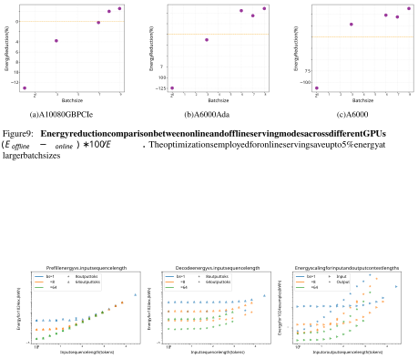Figure 9: **Energy reduction comparison between online and offline serving modes across different GPUs** ( _Eoffline − Eonline_ ) _∗_ 100 _/Eoffline_ ) **.** The optimizations employed for online serving save up to 5% energy at larger batch sizes 

Figure 10: Controlled sweeps of input and output sequence lengths on A6000 GPUs, with vanilla PyTorch backend. 

14 

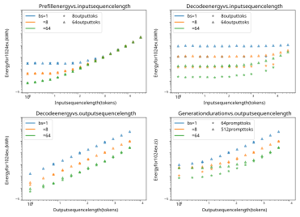Figure 11: Controlled sweeps of input and output sequence lengths on A6000 GPUs, with vLLM offline inference. Here, we display multiple fixed sequence length sizes for comparison as we sweep across batch size and the other dimension of sequence length. 

15 

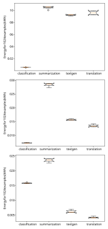Figure 12: Classical NLP tasks and their energy intensities with vLLM backends. From top to bottom, the batch size varies from 1, 8, to 128 

16 

