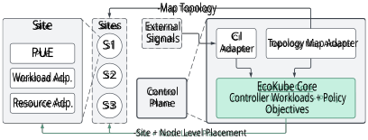
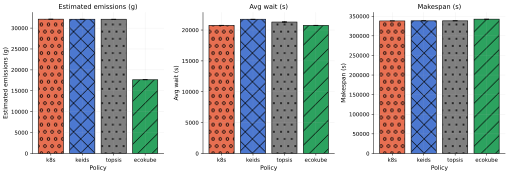

# **EcoKube: Simulating Carbon-Aware Scheduling Policies in Heterogeneous Edge–Cloud Environments** 

Gonçalo Ferreira 

g.j.teixeiradepinhoferreira@uva.nl University of Amsterdam 

Amsterdam, Netherlands 

## **Abstract** 

Energy demand from cloud and edge computing is rising rapidly, with AI workloads further intensifying electricity use and associated carbon emissions. In hybrid edge–cloud settings, sustainability impact depends on time- and location-varying grid Carbon Intensity (CI), site Power Usage Effectiveness (PUE), and heterogeneous hardware characteristics. Existing carbon-aware work explores solutions such as temporal elasticity, spatio-temporal workload shifting, and carbon-aware placement across distributed sites. However, these solutions do not provide a consistent and reproducible workflow for evaluating sustainability-aware scheduling policies on heterogeneous, federated edge–cloud topologies. We present EcoKube: a configurable simulation framework for the reproducible evaluation of sustainability-aware scheduling policies in heterogeneous edge–cloud environments. The framework includes an event-driven deterministic simulator, policy hooks, and a heterogeneity-aware reference policy. We evaluate the framework with synthetic batch workloads, comparing the reference policy against the default Kubernetes scheduler, KEIDS, and TOPSIS/KCSS. The contribution is architectural and experimental: EcoKube provides a reproducible way to compare sustainability-aware policies before deployment. 

**_CCS Concepts:_** • **Computer systems organization** → **Distributed architectures** ; • **Networks** → _Cloud computing_ ; • **Computing methodologies** → _Discrete-event simulation_ ; • **Hardware** → Impact on the environment. 

**_Keywords:_** Sustainable computing, carbon-aware computing, federated computing systems, Kubernetes scheduling, multi-objective optimisation, Carbon Intensity (CI) 

#### **ACM Reference Format:** 

Gonçalo Ferreira and Shashikant Ilager. 2026. EcoKube: Simulating CarbonAware Scheduling Policies in Heterogeneous Edge–Cloud Environments. In _4th International Workshop on Testing Distributed Internet of Things Systems (TDIS ’26), April 27–30, 2026, Edinburgh, Scotland Uk._ ACM, New York, NY, USA, 6 pages. https://doi.org/10.1145/3802513.3803486 

## **1 Introduction** 

Global warming, largely driven by carbon dioxide emissions, remains one of the most pressing challenges of our time [15]. At the same time, compute demand keeps ballooning: modern AI/ML training and inference, data-intensive science, and always-on edge services push more workloads across a widening cloud–edge continuum [7]. This shift increases _operational complexity_ , as execution 

This work is licensed under a Creative Commons Attribution 4.0 International License. _TDIS ’26, Edinburgh, Scotland Uk_ 

> © 2026 Copyright held by the owner/author(s). https://doi.org/10.1145/3802513.3803486 

Shashikant Ilager 

s.s.ilager@uva.nl 

University of Amsterdam Amsterdam, Netherlands 

spans geo-distributed sites with different electricity mixes, facility overheads, and heterogeneous hardware, making sustainability impact more visible, but also more difficult to evaluate [1]. 

A key approach for reducing operational footprint is through _scheduling_ : deciding _where_ and _when_ workloads run, and how resources are allocated during execution. However, assessing the sustainability impact of scheduling policies is challenging in hybrid edge–cloud settings because carbon- and energy-related signals are multi-level and time-varying: grid carbon intensity changes by region and time; site efficiency (e.g., PUE) shifts with load and season; and node-level performance-per-watt depends on hardware generation and accelerator availability [16]. 

Several state-of-the-art approaches explore carbon-aware workload management through temporal shifting (waiting for low-carbon windows), spatial shifting (moving computation to cleaner regions), or combinations of both [1, 9, 13]. Kubernetes-native systems such as CarbonScaler demonstrate that forecast-driven, controller-based adaptation can improve carbon efficiency for temporally flexible workloads [3]. Despite this progress, _systematic evaluation under heterogeneity_ remains challenging. Existing studies often focus on single-provider clusters, rely on ad-hoc experimental setups, or lack integrated modelling of both (i) _site-level_ signals (CI/PUE, effective CI) and (ii) _node-level_ constraints (hardware diversity, accelerators, interference), making results costly to reproduce and hard to compare across policies and topologies [1, 2, 16]. What is needed is a testable workflow that supports controlled, repeatable experiments across heterogeneous, federated edge–cloud scenarios while remaining close to Kubernetes operational realities [11]. 

In this paper, we present _EcoKube_ , a configurable framework for testing sustainability-aware scheduling policies in heterogeneous edge–cloud environments. EcoKube provides a discrete-event simulation workflow that (i) models site-level sustainability signals (CI and site normalisation), (ii) captures node-level heterogeneity and feasibility constraints (latency and accelerator fit), and (iii) exposes transparent policy hooks to implement and compare practical heuristics and multi-criteria schedulers [6, 8, 11]. Concretely, EcoKube contributes: (1) a deterministic modular simulator for hybrid edge–cloud scheduling experiments; (2) a reference policy instantiation, _EcoKube Policy_ , that demonstrates how site-level sustainability signals and node-level feasibility constraints can be composed within the framework; and (3) an evaluation methodology for comparing sustainability–performance trade-offs across scenario families [1, 2]. 

Our experiments show that explicitly modelling heterogeneity changes the observed trade-offs between carbon and energy and performance, and that sustainability-aware policies can reduce the emissions estimate under the evaluated hybrid scenarios without requiring impractical assumptions about uniform infrastructure or perfect testbed control. In this evaluation, EcoKube Policy serves 

TDIS ’26, April 27–30, 2026, Edinburgh, Scotland Uk 

Ferreira et al. 

as a transparent reference instantiation used to validate the framework rather than as a claim of a new optimisation paradigm. This behaviour is consistent with prior evidence that carbon-aware orchestration can reduce emissions under temporal flexibility and operational constraints [3, 13]. The remainder of the paper is organised as follows: §2 summarises the required background and related work; §3 describes the EcoKube simulator, policy interface and implementation; §4 describes the setup of the experiment and evaluates its performance; and §5 concludes with limitations and future work. 

## **2 Background and Related Work** 

Hybrid edge–cloud systems span multiple _sites_ (regions, edge clusters, or federated Research Infrastructure (RI) facilities) that differ in hardware capabilities, operational efficiency, and carbon conditions. This heterogeneity matters because the _same_ workload can incur materially different energy use, completion time, and carbon footprint depending on where it runs [9]. Consequently, sustainabilityaware scheduling is typically framed as a multi-objective optimisation problem that balances carbon impact against latency- and makespan-oriented SLOs [4]. 

**_Carbon-intensity, site overhead, and normalisation._** Carbonaware orchestration relies on exogenous signals: time-varying grid carbon intensity CI _𝑠_ ( _𝑡_ ) (e.g., gCO2e/kWh) for each site _𝑠_ , and facility efficiency captured via Power Usage Effectiveness PUE _𝑠_ [5, 9]. A common abstraction is to express job-level carbon as a function of IT energy, site overheads, and carbon intensity: 

$$
CFP(𝑗,𝑠) \approx{}{}𝐸IT 𝑗,𝑠\cdot{}{} PUE𝑠\cdot{}{} 𝑘𝑠\cdot{}{} CI𝑠, (1)
$$

where _𝐸_IT _𝑗,𝑠_is the workload IT energy attributable to job_𝑗_at site_𝑠_, CI _𝑠_ is the average carbon intensity over the job interval, and _𝑘𝑠_ is a site normalisation factor that compensates for cross-site measurement and attribution differences in heterogeneous environments [10]. While many studies treat CI _𝑠_ ( _𝑡_ ) as a given external input, hybrid and federated settings also motivate _effective_ CI models (e.g., accounting for imports/exports, local generation mix, or finergrained spatial variation), which remain inconsistently considered in scheduling-oriented frameworks [14]. 

**_Latency modelling and accelerator fit._** Beyond sustainability signals, edge–cloud scheduling is constrained by responsiveness and feasibility. We model end-to-end completion time as the sum of dispatch/queue delay and execution time, enriched with network terms: 

$$
𝑇𝑗= 𝑞𝑗+ 𝑟𝑗,𝑠,𝑛+ ℓnet 𝑠 (𝑗), (2)
$$

where _𝑟 𝑗,𝑠,𝑛_ depends on both site _𝑠_ and node _𝑛_ due to performance heterogeneity and contention effects [4]. _Node/accelerator fit_ further constrains feasible placement, capturing whether a node’s resources (e.g., GPU class, memory headroom) match a workload’s typology requirements [6]. 

**_Frameworks and algorithmic baselines._** Prior sustainability frameworks demonstrate strong results for specific levers such as temporal adaptation, energy-system virtualisation, job-level optimisation, and geo-distributed carbon-aware placement/provisioning 

[10, 12]. In parallel, multi-criteria decision methods (e.g., TOPSISstyle ranking) and edge-focused schedulers (e.g., KEIDS-like multiobjective policies) provide lightweight online baselines that combine energy/carbon signals with performance and contention considerations [6, 8]. However, existing approaches rarely provide a _unified, testing-oriented_ workflow that (i) makes site-level placement decisions using carbon and efficiency signals, while also (ii) modelling node-level heterogeneity (including accelerators) and (iii) enabling repeatable comparison across heterogeneous, federated edge–cloud topologies [10]. This gap motivates EcoKube as a reproducible, testing-oriented workflow for hybrid settings. Within that workflow, EcoKube Policy is used as a reference policy instantiation that leverages the separation of site-level signals and node-level constraints. 

Exploring this gap, our objective is a neutral and reproducible workflow for _comparing_ Kubernetes-compatible and sustainabilityaware policies under identical heterogeneous conditions, including site-level CI/PUE differences and node-level feasibility constraints. This motivates EcoKube as a testing-oriented simulator built from scratch for hybrid edge–cloud settings. Within that workflow, EcoKube Policy is used only as a transparent reference instantiation. 

## **3 EcoKube: Simulating Carbon-Aware Scheduling Policies in Heterogeneous Edge-Cloud Systems** 

In this section we explain how EcoKube operationalises sustainability-aware scheduling in a heterogeneous, multi-site setting. We first define a _system model_ (Figure 1) that captures the real-world actors, signals, and control loops required to define workload placement using sustainability signals. We then show how this model is _abstracted and executed in simulation_ , preserving the same interfaces and decision points while enabling controlled experimentation. Finally, we describe the _experiment configuration_ used to instantiate the model (workload traces, site/topology parameters, and policy settings) and to generate the results reported afterwards. 

### **3.1 System Model** 

EcoKube is designed for _edge–cloud_ deployments, where sites differ not only in hardware, but also in _geography, network connectivity, and computing capability_ . Edge sites typically provide proximity and reduced data movement, but operate under tighter capacity constraints and higher variability (e.g., intermittent availability, limited accelerators, and constrained cooling). Cloud and core data-centre sites offer higher and more elastic capacity, but may incur higher data transfer overheads and different sustainability profiles. This inherent heterogeneity motivates a placement policy that trades off _carbon-, energy-, and performance-related_ objectives across the edge–cloud continuum rather than assuming a uniform cluster environment. 

**3.1.1 Site Characteristics.** Each site exposes a set of hooks necessary for sustainability-aware placement: 

1. **PUE descriptor:** a site-level efficiency factor that approximates facility overheads relative to IT power. 

2. **Resource Adapter:** a site-side interface that exposes _capacity_ and _capabilities_ (e.g., CPU/memory/GPU availability, 

TDIS ’26, April 27–30, 2026, Edinburgh, Scotland Uk 

EcoKube: Simulating Carbon-Aware Scheduling Policies in Heterogeneous Edge–Cloud Environments 

**Figure 1.** EcoKube System Model 

   - accelerator types); as well as static constraints relevant to feasibility (e.g., resource limits, hardware incompatibilities). 

3. **Workload Adapter:** an interface that describes workload requirements in a portable form (e.g., requested resources, runtime class, optional locality constraints). 

In our prototype, workloads execute on a federated multi-site testbed where each site exposes these local characteristics (capacity/capabilities and PUE) and is enriched with external, timevarying signals (e.g., CI). These inputs are ingested and normalised by the metrics and KPI services and consumed by the EcoKube’s control plane, which applies policies (via the Resource/Workload adapters) to select feasible sites/nodes and drive placement decisions in the orchestrator engine. 

**3.1.2 EcoKube Components.** Within the EcoKube boundary (Figure 1), the model distinguishes three components. 

1. **CI Adapter:** The CI adapter retrieves CI for the relevant scope (e.g., region, zone, or site mapping), and it wires it into the policy. In the real system, this component is responsible for handling harmonisation issues (e.g., sampling frequency, caching, missing values, and time alignment). In the simulation, the same interface is used but backed by trace-driven or synthetic CI series (Section 4.1). 

2. **Topology Map Adapter:** This adapter provides the mapping between workloads, sites, and topology constraints. Minimally, it maps _site identifiers_ to _signal scope identifiers_ (e.g., which CI region applies to which site). In more advanced scenarios it can express locality constraints or penalties (e.g., prefer a site due to data proximity; penalise sites due to cross-site transfer). 

3. **Core: Controller Workloads + Policy Objectives:** In particular for edge–cloud scenarios, the topology map captures _cross-site effects_ such as latency, bandwidth, and data gravity (where datasets or users are located). These signals allow EcoKube to represent the cost of placing an otherwise “green” workload in terms of its “network cost”. 

**3.1.3 EcoKube Scoring.** EcoKube makes decisions in two stages. It first filters infeasible sites and nodes using standard constraints such as resource availability, placement restrictions, and locality requirements. It then ranks the remaining candidates using a small set of normalised signals: estimated IT energy, a location-aware 

estimated emissions term derived from energy, PUE, and CI, latencyrelated penalties, and hardware fit. 

**_Site- and node-level scoring._** Within the framework, EcoKube Policy decomposes each decision into (i) a _site-level_ score capturing exogenous sustainability and topology signals and (ii) a _node-level_ score capturing energy, latency, and hardware fit. At the site level, candidates are ranked using normalised site descriptors, namely CI, PUE, a site normalisation factor, and an optional network penalty when topology-aware routing is enabled. These terms are combined through configurable weights to obtain a coarse inter-site score. 

Within the selected site, each feasible node _𝑛_ is scored as: 

$$
𝐶(𝑤,𝑛,𝑡) = 𝑤𝐸�𝐸𝑤,𝑛+ 𝑤𝐶�𝐸𝑤,𝑛\cdot{}{} PUE𝑠(𝑛) \cdot{}{} CI𝑠(𝑛) + 𝑤𝐿lat(𝑤,𝑛) + 𝑤𝑓𝑖𝑡1 -fit(𝑤,𝑛) , (3)
$$

where _𝐸_� _𝑤,𝑛_ is the estimated IT energy for placing workload _𝑤_ on node _𝑛_ , lat( _𝑤,𝑛_ ) is the latency-related penalty, and fit( _𝑤,𝑛_ ) captures hardware suitability. Lower scores are preferred. The weight vectors are treated as configuration parameters for experimentation rather than as universally optimal coefficients. The site-level score and node-level score play different roles in the decision process: the former captures coarse inter-site context, while the latter ranks feasible nodes within the selected site using workload-specific estimates. Each component is min–max normalised over the feasible candidate set. 

**_Selection Rule._** The final decision combines the exogenous site score with the best feasible node score within each site. Intuitively, the policy first prefers _cleaner and more efficient_ sites (CI/PUE/ _𝑘_ , optionally network penalties), and then selects the _most suitable_ node at that site according to energy, latency and accelerator fit. 

$$
(𝑠★,𝑛★) = arg min 𝑠 𝐶site(𝑤,𝑠,𝑡) + min 𝑛\in{}{}𝑠𝐶(𝑤,𝑛,𝑡) . (4)
$$

Here, _𝐶_ site ( _𝑤,𝑠,𝑡_ ) is the site-level score for workload _𝑤_ at site _𝑠_ and time _𝑡_ , _𝐶_ ( _𝑤,𝑛,𝑡_ ) is the node-level score for candidate node _𝑛_ , and the inner minimisation selects the best feasible node within each site before comparing sites globally. EcoKube Policy instantiates the framework through a weighted ranking over feasible candidates. This reference policy is used to demonstrate how the framework can combine heterogeneous inputs such as site-level PUE/CI descriptors, normalisation factors, and node-level fit and latency signals within one reproducible workflow. This also makes 

TDIS ’26, April 27–30, 2026, Edinburgh, Scotland Uk 

Ferreira et al. 

the policy suitable for controlled comparison against existing schedulers and for sensitivity analysis over configuration weights. 

The weight vectors are therefore treated as experimental configuration knobs. We sweep them to study policy behaviour and robustness, rather than to argue for a single theoretically optimal setting. The default values reported in the evaluation were selected as a reasonable reference configuration after preliminary tuning; they are intended to provide a stable comparison point rather than to imply Pareto-optimality or theoretical optimality. 

**3.1.4 EcoKube Configuration: Policy Weights.** For each feasible candidate, EcoKube computes comparable normalised terms for energy, emissions, latency, and fit, and combines them through non-negative weights that sum to one; the hardware-fit term is controlled separately through _𝑤 𝑓𝑖𝑡_ and is not included in that normalisation constraint. Lower scores are preferred. The estimated emissions term is an operational estimate obtained by combining expected IT energy with the candidate site’s PUE and time-aligned grid carbon intensity. Energy and emissions are kept as distinct signals on purpose: energy captures hardware efficiency, whereas the emissions term captures the execution context of the selected site. The weights are configuration parameters used to express operator preferences in the experiments; they are not claimed to be universally optimal. 

EcoKube Policy is parametrised by a weight vector _𝑊_ = ⟨ _𝑤𝐸,𝑤𝐶, 𝑤𝐿,𝑤 𝑓𝑖𝑡_ ⟩, where each component controls the relative importance of estimated IT energy, estimated emissions, latency penalties, and node/accelerator fit in Eq. 3, respectively. In addition, the policy uses separate site-level configuration parameters to control the contribution of site-level sustainability and placement terms during candidate-site ranking. In EcoKube, these weights are treated as exposed configuration parameters that instantiate different operational priorities within the same evaluation workflow, rather than as globally optimal constants. Their role is therefore experimental and comparative: they make policy behaviour explicit and sweepable without changing the underlying decision logic. 

### **3.2 Implementation** 

EcoKube was implemented from scratch as a methodological choice to support controlled and reproducible evaluation across heterogeneous federated edge–cloud scenarios. Extending an existing scheduler or controller would have made the evaluation dependent on a specific system’s execution model, making controlled comparison across heterogeneous federated edge–cloud scenarios more difficult. At the same time, EcoKube remains connected to Kubernetes by preserving Kubernetes-style feasibility filtering and pluggable scoring logic, so it can be used to evaluate improvements on top of Kubernetes-compatible scheduling workflows rather than as a replacement for them. 

EcoKube is therefore implemented in _Go (Golang)_ as a modular scheduling engine that separates the _core loop_ (queueing, feasibility filtering, tie-breaking, and binding) from the _policy logic_ (feature extraction and scoring). The scheduler constructs a feasible candidate set using Kubernetes-style hard constraints (requests/limits, taints/tolerations, affinity), then delegates ranking to a pluggable Score hook exposed by each policy module. This design allows EcoKube and all baselines to reuse identical inputs (site descriptors, CI/PUE signals, and node capabilities) and to be swapped without changing the execution pipeline, enabling like-for-like 

**Table 1.** Workload presets used in the simulator evaluation. 

|_Preset_|_Description_|
|---|---|
|mix-a|CPU-centric monitoring mix with low accelerator de- mand (gpu_share=0_._05), intended to represent stable edge sensing and lightweight processing pipelines.|
|mix-b|Mixed edge-event workload with moderate accelerator demand (gpu_share=0_._12), intended to represent in- termittently heavier event-driven processing.|
|mix-c|Stronger heterogeneous CPU/GPU mix (gpu_share=|
||0_._28), intended to stress feasibility filtering, device affin- ity, and node-fit decisions.|

comparisons under controlled scenarios. We use Python scripts for post-processing and plotting the experimental results. 

Because feasibility filtering follows Kubernetes-style constraints and ranking is exposed through a pluggable Score hook, the framework is intended to improve policy design _on top of_ Kuberneteslike schedulers, not replace them. Policies can first be evaluated in EcoKube under controlled heterogeneity and then translated into Kubernetes-compatible extensions for deployment validation. 

Carbon intensity traces are sourced from the Wattnet service, using 2024 time-series data retrieved through their API1 . These traces are ingested by the CI adapter and aligned to scenario time windows to provide consistent, time-varying exogenous signals across all policies and repetitions. 

## **4 Performance Evaluation** 

We evaluate EcoKube under a scenario-driven pipeline designed to reflect _hybrid edge–cloud_ placement decisions, where sites differ in capacity, device heterogeneity, topology constraints, and time-varying sustainability signals. To ensure fair comparisons, all schedulers are executed on identical scenario instances (same topology, traces, feasibility constraints), using fixed random seeds and matched repetitions. All experimental artifacts (code, scenario configurations, and seeds) are available online on GitHub.2 

### **4.1 Experimental Setup** 

**_Scenarios, topology, and workloads._** We evaluate EcoKube on a deterministic three-site edge–cloud topology spanning NL, FR, and DE. The generated substrate contains eight heterogeneous nodes: two small CPU-oriented nodes in NL, two balanced CPU nodes and one GPU-capable node in FR, and two memory-oriented nodes plus one GPU-capable node in DE. Site descriptors are fixed per campaign and include Power Usage Effectiveness (PUE), a site normalisation factor _𝑘𝑠_ , and hourly carbon-intensity traces. Workloads are produced by a single parameterised generator and instantiated as three workload families. The preset name therefore denotes the workload family and heterogeneity pressure; submit timestamps are regenerated by the reported arrival-process sweep so that all policies observe identical arrivals per scenario key. 

**_Baselines._** We compare EcoKube Policy against a default Kubernetes baseline and three policy baselines commonly used to capture multi-objective ranking and carbon-aware placement behaviours. 

> 1https://api.wattnet.eu 

> 2https://github.com/g-uva/EcoKube/tree/tdis-26 

TDIS ’26, April 27–30, 2026, Edinburgh, Scotland Uk 

EcoKube: Simulating Carbon-Aware Scheduling Policies in Heterogeneous Edge–Cloud Environments 

**Figure 2.** Policy Outcome Comparison 

**Table 2.** Schedulers compared in the evaluation. 

|_Policy_|_Role in comparison_|
|---|---|
|k8s|Default baseline (reference for deltas).|
|keids[6]|Heuristic sustainability-aware baseline (CI-sensitive ranking).|
|topsis[8]|Multi-criteria decision baseline using ranking over normalised objectives.|
|ecokube-pol|Reference policy instantiation in EcoKube: weighted- sum scoring over estimated emissions term, perfor- mance, topology penalties, and device-fit.|

Each baseline uses the same feasibility constraints and observes the same external signals (Table 2). 

**_Reproducibility and parameter sweeps._** All simulator runs are deterministic per scenario key. We fix the workload-generation seed, the arrival-schedule seed, and the policy execution order, and reuse identical generated inputs across all policies. The reported evaluation varies the carbon-intensity weight _𝜃𝑐_ , the arrival rate, the batch size, and the number of jobs, while keeping the topology and site descriptors fixed. A 30-minute warm-up window is excluded from summary metrics. 

**_Evaluation metrics and interpretation._** We report three classes of outcomes. First, we report scheduler-external metrics, namely estimated IT energy, makespan, average waiting time, and task completion as the number of completed jobs per run. Second, we report a location-aware operational emissions quantity, aggregated in the implementation as total_ci_cost_g and reported as “estimated emissions”, obtained by combining the simulated or replayed energy demand with site PUE and time-aligned CI traces. We treat this quantity as a carbon-impact estimate within the evaluated scenario, not as a direct measurement of real-world carbon footprint. This distinction is important since the policy also consumes CIand PUE-related signals during ranking; accordingly, the reported emissions estimate should be interpreted as an externally recomputed outcome under the scenario model. For each scenario key and repetition, all policies are evaluated on the same generated inputs and arrival schedule; summaries are then aggregated over matched 

**Table 3.** Reproducibility controls and sweep parameters used in the simulator campaign. 

|_Parameter / control_|_Values_||
|---|---|---|
|Sites|{NL_,_FR_,_DE}||
|Generation seed|20260214||
|Job counts|{300_,_600_,_900}||
|Arrival rates (jobs/min)|{0_._8_,_1_._1_,_1_._4}||
|Batch sizes|{200_,_500_,_900}||
|Carbon weight sweep (_𝜃𝑐_)|{0_._2_,_0_._4_,_0_._6_,_0_._8}||
|Warm-up window|30 minutes||
|Repetitions per scenario|50||
|Site-level parameters|_𝛼_=0_._58_, 𝛽_=0_._21_, 𝛾_=0_._21_, _ 0_._2|_𝑤fit(s)_ =|
|Node-level weights|_𝑤𝐸_ = 0_._58_,_ _𝑤𝐶_ = 0_._21_,_ 0_._21_,_ _𝑤fit(n)_ =0_._20|_𝑤𝐿_ =|

repetitions to compare both absolute outcomes and relative deltas against k8s. 

### **4.2 Results Analysis** 

EcoKube Policy consistently reduces the reported operational emissions estimate, at the cost of modest increases in completion time metrics (Figure 2 and Table 4). 

Under the evaluated scenarios, EcoKube Policy, as a reference instantiation within EcoKube, achieves a 45 _._ 15% reduction in the reported emissions estimate relative to k8s, substantially larger than the improvements observed for the ranking-based baselines in this subset. In absolute terms, the mean reported operational emissions estimate decreases from 32 _._ 14 kg to 17 _._ 63 kg per run (with ≈ 900 jobs). These results indicate that EcoKube is able to expose and compare policy behaviour in ways that meaningfully reflect edge–cloud heterogeneity in sustainability signals. 

The reduction in the reported operational emissions estimate comes with a _controlled_ performance overhead: although EcoKube Policy increases makespan by 1 _._ 35%, it reduces the average waiting time by 0 _._ 04% relative to k8s. Given that edge–cloud scenarios inherently involve locality and resource-fit constraints, this behaviour is consistent with a policy that favours lower-carbon placements 

TDIS ’26, April 27–30, 2026, Edinburgh, Scotland Uk 

Ferreira et al. 

**Table 4.** Absolute outcomes for the reported evaluation slice. 

|_Policy_|_Est. Emissions (kg)_|_Avg. Est. Emissions/job (g)_|_Makespan (s)_|_Avg. wait (s)_|_Completed jobs_|
|---|---|---|---|---|---|
|ecokube-pol|17.63|6.63|342600|20749|848|
|topsis|32.12|15.17|338259|21298|849|
|keids|32.12|15.63|338329|21748|842|
|k8s|32.14|15.40|338017|20758|848|

when feasible, while maintaining bounded degradation in queueing and completion time metrics. Overall, these results indicate that, under the evaluated hybrid edge–cloud scenarios, EcoKube Policy reduces the reported operational emissions estimate without substantial degradation in performance metrics. 

### **4.3 Limitations and future work** 

This evaluation is simulation-based and therefore limited by the fidelity of workload models, topology abstractions, and signal assumptions (e.g., CI sampling and mapping). To be more applicable for generic use cases, EcoKube should validate policies on empirical clusters and larger-scale experiments (more sites, higher traffic intensities, and longer horizons), and include additional baselines (e.g., delay-tolerant carbon shifting, carbon-aware bin packing, and network-cost-aware schedulers). 

Future work will therefore extend the framework in three directions. First, we will incorporate trace-driven and real-cluster workloads to better reflect workload diversity, including stronger locality constraints, accelerator-heavy jobs, and more variable burst patterns. Second, we will validate the framework on empirical multisite Kubernetes and federated testbeds using calibrated power measurements, from collected execution traces. Third, we will broaden the sensitivity and robustness analysis across weights, topology settings, exogenous signals, traffic intensity, and workload mixes, to assess how stable policy rankings remain outside the reported slice. 

## **5 Conclusions** 

EcoKube demonstrates that a configurable simulation framework can operationalise sustainability-aware scheduling policies for heterogeneous _edge–cloud_ settings. In the reported simulator slice, EcoKube Policy yields a meaningful reduction in the reported operational emissions estimate compared to the default baseline, while incurring only modest overhead in makespan and waiting time. This indicates that the framework is capable of expressing and evaluating the core trade-offs that arise in hybrid deployments. 

## **Acknowledgements** 

The authors acknowledge the funding and support from the GreenDIGIT project “Greener Future Digital Research Infrastructures”, which has received funding from the European Union’s Horizon Europe research and innovation programme under grant agreement number 101131207. 

## **References** 

> [1] Nasir Asadov, Vlad C. Coroamă, Matteo Franzil, Stefano Galantino, and Matthias Finkbeiner. 2025. Carbon-Aware Spatio-Temporal Workload Shifting in Edge– Cloud Environments: A Review and Novel Algorithm. _Sustainability_ 17, 14 (Jan. 2025), 6433. doi:10.3390/su17146433 

   - Comprehensive Review. _Cluster Computing_ 25, 2 (April 2022), 1035–1093. doi:10.1007/s10586-021-03512-z 

- [3] Walid A. Hanafy, Qianlin Liang, Noman Bashir, David Irwin, and Prashant Shenoy. 2023. CarbonScaler: Leveraging Cloud Workload Elasticity for Optimizing Carbon-Efficiency. _Proc. ACM Meas. Anal. Comput. Syst._ 7, 3 (Dec. 2023), 57:1–57:28. doi:10.1145/3626788 

- [4] Cheol-Ho Hong and Blesson Varghese. 2020. Resource Management in Fog/Edge Computing: A Survey on Architectures, Infrastructure, and Algorithms. _Comput. Surveys_ 52, 5 (2020), 1–37. doi:10.1145/3326066 

- [5] Avita Katal, Susheela Dahiya, and Tanupriya Choudhury. 2023. Energy Efficiency in Cloud Computing Data Centers: A Survey on Software Technologies. _Cluster Computing_ 26, 3 (2023), 1845–1875. doi:10.1007/s10586-022-03713-0 

- [6] Kuljeet Kaur, Sahil Garg, Georges Kaddoum, Syed Hassan Ahmed, and Mohammed Atiquzzaman. 2025. KEIDS: Kubernetes-Based Energy and Interference Driven Scheduler for Industrial IoT in Edge-Cloud Ecosystem. _IEEE Internet of Things Journal_ 7, 5 (2025), 4228–4237. doi:10.1109/JIOT.2019.2939534 

- [7] Alexandra Sasha Luccioni and Alex Hernandez-Garcia. 2023. _Counting Carbon: A Survey of Factors Influencing the Emissions of Machine Learning_ . arXiv:2302.08476 [cs] doi:10.48550/arXiv.2302.08476 

- [8] Toufik Menouer. 2021. KCSS: Kubernetes Container Scheduling Strategy. _The Journal of Supercomputing_ 77, 5 (May 2021), 4267–4293. doi:10.1007/s11227-02003427-3 

- [9] Ana Radovanović, Ross Koningstein, Ian Schneider, Bokan Chen, Alexandre Duarte, Binz Roy, Diyue Xiao, Maya Haridasan, Patrick Hung, Nick Care, Saurav Talukdar, Eric Mullen, Kendal Smith, MariEllen Cottman, and Walfredo Cirne. 2023. Carbon-Aware Computing for Datacenters. _IEEE Transactions on Power Systems_ 38, 2 (2023), 1270–1280. doi:10.1109/TPWRS.2022.3173250 

- [10] Noura Saad, Mahmoud Ezzat, Reem Hasan, Mohammad Shayan, Ammar Gharaibeh, and Mohammed Hammad. 2025. Carbon-Aware Container Orchestration: A Survey. _Journal of Network and Computer Applications_ (Jan. 2025), 103731. doi:10.1016/j.jnca.2024.103731 

- [11] Abdullah Senjab, Mahmud Noman, Toufique Ahmed, Sultan Alharbi, Muhammad Waseem Iqbal, and Valdis Berzins. 2023. A Survey on Kubernetes Scheduling: A Taxonomy and Open Challenges. _Cluster Computing_ 27, 1 (Dec. 2023), 123–154. doi:10.1007/s10586-023-04094-5 

- [12] Abel Souza, Shruti Jasoria, Basundhara Chakrabarty, Alexander Bridgwater, Axel Lundberg, Filip Skogh, Ahmed Ali-Eldin, David Irwin, and Prashant Shenoy. 2023. CASPER: Carbon-Aware Scheduling and Provisioning for Distributed Web Services. In _Proceedings of the 14th International Green and Sustainable Computing Conference_ (New York, NY, USA, 2024-05-29) _(IGSC ’23)_ . Association for Computing Machinery, New York, NY, USA, 67–73. doi:10.1145/3634769. 3634812 

- [13] Philipp Wiesner, Ilja Behnke, Dominik Scheinert, Kordian Gontarska, and Lauritz Thamsen. 2021. Let’s Wait Awhile: How Temporal Workload Shifting Can Reduce Carbon Emissions in the Cloud. In _Proceedings of the 22nd International Middleware Conference_ (New York, NY, USA, 2021-12-02) _(Middleware ’21)_ . Association for Computing Machinery, New York, NY, USA, 260–272. doi:10.1145/3464298.3493399 

- [14] Li Wu, Walid A. Hanafy, Abel Souza, Khai Nguyen, Jan Harkes, David Irwin, Mahadev Satyanarayanan, and Prashant Shenoy. 2025. CarbonEdge: Leveraging Mesoscale Spatial Carbon-Intensity Variations for Low Carbon Edge Computing. In _Proceedings of the 34th International Symposium on HighPerformance Parallel and Distributed Computing_ (New York, NY, USA, 2025-09-09) _(HPDC ’25)_ . Association for Computing Machinery, New York, NY, USA, 1–13. doi:10.1145/3731545.3731576 

- [15] Chien-Sheng Yang, Chien-Chun Huang-Fu, and I-Kang Fu. 2022. CarbonNeutralized Task Scheduling for Green Computing Networks. In _GLOBECOM 2022 - 2022 IEEE Global Communications Conference_ (2022-12). Institute of Electrical and Electronics Engineers (IEEE), Rio de Janeiro, Brazil, 4824–4829. doi:10.1109/GLOBECOM48099.2022.10001542 

- [16] Jialin Yang, Zainab Saad, Jiajun Wu, Xiaoguang Niu, Henry Leung, and Steve Drew. 2025. _A Survey on Task Scheduling in Carbon-Aware Container Orchestration_ . arXiv:2508.05949 [cs] doi:10.48550/arXiv.2508.05949 

> [2] Reza Ghafari, Farhad Heydari Kabutarkhani, and Nima Mansouri. 2022. Task Scheduling Algorithms for Energy Optimization in Cloud Environment: A 

