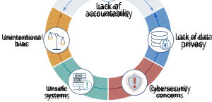
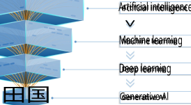
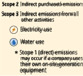
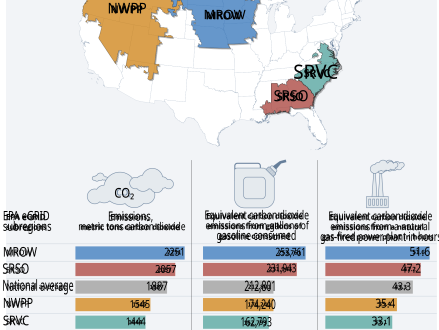
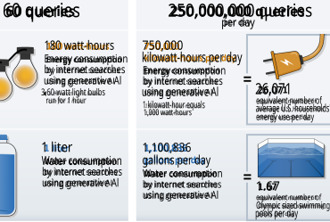
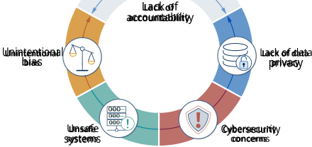

United States Government Accountability Office 

Report to Congressional Requesters 

**April 2025** 

###### TECHNOLOGY ASSESSMENT 

## **Artificial Intelligence** 

Generative AI’s Environmental and Human Effects 

6 

GAO-25-107172 

510 

The cover image displays stylized selected factors to consider in evaluating the environmental and human effects of generative artificial intelligence. 

Cover source: GAO.  |  GAO-25-107172 

### GAO 

Highlights of GAO-25-107172, a report to congressional requesters 

###### April 2025 

###### **Why GAO did this study** 

Generative AI uses large amounts of energy and water. Additionally, generative AI may displace workers, help spread false information, and create or elevate risks to national security. The benefits and risks of generative AI are unclear, and estimates of its effects are highly variable because of a lack of available data. The continued growth of generative AI products and services raises questions about the scale of benefits and risks. 

GAO was asked to conduct a technology assessment of generative AI effects, particularly its risks. GAO examined: (1) potential environmental effects of generative AI technologies, (2) potential human effects of generative AI technologies, and (3) what policy options exist to enhance the benefits or mitigate the environmental and human effects of generative AI technologies. 

**TECHNOLOGY ASSESSMENT** 

###### **Artificial Intelligence Generative AI’s Environmental and Human Effects** 

###### **What GAO found** 

Generative artificial intelligence (AI) could revolutionize entire industries. In the nearer term, it may dramatically increase productivity and transform daily tasks in many sectors. However, both its benefits and risks, including its environmental and human effects, are unknown or unclear. 

Generative AI uses significant energy and water resources, but companies are generally not reporting details of these uses. Most estimates of environmental effects of generative AI technologies have focused on quantifying the energy consumed, and carbon emissions associated with generating that energy, required 

to train the generative AI model. Estimates of water consumption by generative AI are limited. Generative AI is expected to be a driving force for data center demand, but what portion of data center electricity consumption is related to generative AI is unclear. According to the International Energy Agency, U.S. data center electricity consumption was approximately 4 percent of U.S. electricity demand in 2022 and could be 6 percent of demand in 2026. 

While generative AI may bring beneficial effects for people, GAO highlights five risks and challenges that could result in negative human effects on society, culture, and people from generative AI (see figure). For example, unsafe systems may produce outputs that compromise safety, such as inaccurate information, undesirable content, or the enabling of malicious behavior. However, definitive statements about these risks and challenges are difficult to make because generative AI is rapidly evolving, and private developers do not disclose some key technical information. 

**Selected generative artificial antelligence risks and challenges that could result in human effects** 

Source: GAO analysis and illustration. |GAO-25-107172 

View GAO-25-107172. For more information, contact Brian Bothwell at BothwellB@gao.gov or Kevin Walsh at WalshK@gao.gov. 

**United States Government Accountability Office** 

GAO identified policy options to consider that could enhance the benefits or address the challenges of environmental and human effects of generative AI. These policy options identify possible actions by policymakers, which include Congress, federal agencies, state and local governments, academic and research institutions, and industry. In addition, policymakers could choose to maintain the status quo, whereby they would not take additional action beyond current efforts. See below for details on the policy options. 

**Policy options that could enhance the benefits or address the challenges of environmental and human effects of generative artificial intelligence (AI).** 

|**Policy options**|**Example implementation approaches**|**Opportunities and considerations**|
|---|---|---|
|**4.1 Environmental Effects**|||
|**Maintain status quo** (report page29)|• Continue technical innovations in hardware. • Continue technical innovations in algorithms and models. • Continue current federal agency efforts.|• Technical innovations may address some challenges described in this report without additional resources. • Current efforts may not fully address the challenges described in this report, given the existing knowledge gaps and uncertain future demand of generative AI.|
|**Improve data collection** **and reporting** (report page29)|• Encourage industry to share the environmental effects of building and disposing of their equipment. • Developers could provide information such as model details, infrastructure used for training and using generative AI, energy consumption, carbon emissions, and water consumption.|• Efforts to address gaps in understanding of environmental effects can assist policymakers in identifying specific environmental effects to address. • Industry and developers may not wish to release information they view as proprietary. • As generative AI becomes integrated into industry products and services, differentiating between energy and water use by generative AI, other AI, and non-AI capabilities could be difficult.|
|**Encourage innovation** (report page30)|• Government could encourage developers and researchers to create more resource-efficient models and training techniques. • Industry and researchers could increase efforts to develop more efficient hardware and infrastructure to reduce energy and water use.|• Development of technical methods to reduce environmental effects may need improved data collection and reporting by industry. • Industry may resist developing new innovations until development, engineering, and economic costs are better understood.|
|**4.2 Human Effects**|||
|**Maintain status quo** (report page30)|• Government policymakers are taking various policy actions to begin efforts aimed at understanding and addressing human effects of artificial intelligence.|• Existing policy actions relevant to AI in general, some of which are not fully implemented, may not fully address the specific human effects of generative AI challenges identified in this report.|
|**Encourage use of AI** **frameworks**(report page31)|• Developers could create acceptable use policies that inform a product’s user community of policies they must adhere to while using the developer’s product. • Government could encourage the use of available frameworks, such as GAO’s AI Accountability Framework and National Institute of Standards and Technology’s AI Risk Management Framework.|• Developers can use these frameworks to manage risks and challenges of generative AI development and use and to increase public transparency and other trustworthiness characteristics. • Internal testing and external, independent review methods applying frameworks may be insufficient, costly, and time-consuming. • Available frameworks may not sufficiently address human effects brought by new technology developments in generative AI.|
|**Share best practices and** **establish standards** (report page32)|• Industry or other standards-developing organizations could identify the areas in which best practices and standards would be most beneficial across different sectors or applications that use generative AI technologies.|• This could require adoption of knowledge sharing mechanisms to share best practices for the management of human effects challenges. • Consensus from many public- and private-sector stakeholders can be time- and resource-intensive.|

Source: GAO.  |  GAO-25-107172 

**United States Government Accountability Office** 

This is a work of the U.S. government and is not subject to copyright protection in the United States. The published product may be reproduced and distributed in its entirety without further permission from GAO. However, because this work may contain copyrighted images or other material, permission from the copyright holder may be necessary if you wish to reproduce this material separately. 

###### **Table of Contents** 

|Introduction ...................................................................................................................... 1|
|---|
|1 Background .................................................................................................................... 3|
|1.1 Generative AI ..................................................................................................................... 3|
|1.2 Data centers ....................................................................................................................... 4|
|1.3 Measuring environmental effects ..................................................................................... 5|
|1.4 Life cycle assessments ....................................................................................................... 6|
|1.5 Policy environment ............................................................................................................ 8|
|2 Generative AI Uses Significant Resources, but Environmental Effects|
|Are Uncertain .................................................................................................................. 11|
|2.1 Uncertain but large resource costs of training and using generative AI ......................... 11|
|2.2 Lack of data for generative AI infrastructure build activities .......................................... 15|
|2.3 Insufficient information about effects from computing-infrastructure end-of-life issues .......................................................................................................... 16|
|2.4 Unpredictable technological advancements and demand for generative AI .................. 16|
|3 Generative AI Could Have Substantial Human Effects .................................................. 19|
|3.1 Risks and challenges of generative AI development and use .......................................... 19|
|3.2 Common industry mitigation strategies .......................................................................... 23|
|3.3 Human effects of generative AI in selected applications ................................................ 24|
|4 Policy Options for the Environmental and Human Effects of Generative AI ................. 29|
|4.1 Policy options for environmental effects of generative AI .............................................. 29|
|4.2 Policy options for human effects of generative AI .......................................................... 30|
|5 Agency and Expert Comments ..................................................................................... 33|
|Appendix I: Objectives, Scope, and Methodology ........................................................... 34|
|Appendix II: Expert Meeting Participants ........................................................................ 36|
|Appendix III: GAO Contacts and Staff Acknowledgments ................................................ 38|

Generative AI’s Environmental and Human Effects GAO-25-107172   i 

###### **Tables** 

|Table 1: Reported energy consumption and carbon emissions for the training of|
|---|
|selected generative AI models ........................................................................................ 13|
|Table 2: Examples of common mitigation strategies to address risks and challenges|
|of generative artificial intelligence (AI) ........................................................................... 23|

###### **Figures** 

|Figure 1: Generative artificial intelligence (AI) in relationship to other types of AI ........... 4|
|---|
|Figure 2: Life cycle of generative artificial intelligence ...................................................... 7|
|Figure 3: Estimated carbon emissions and energy equivalents for a generative artificial intelligence model requiring 5,000 megawatt-hours of electricity .................... 12|
|Figure 4: Estimated amounts of energy and water consumed to use generative artificial intelligence (AI) for internet searches ............................................................... 14|
|Figure 5: Selected generative artificial intelligence risks and challenges that could result in human effects ................................................................................................... 20|

Generative AI’s Environmental and Human Effects GAO-25-107172   ii 

###### Abbreviations 

|AI|artificial intelligence|
|---|---|
|CO2|carbon dioxide|
|CO2e|carbon dioxide equivalent|
|EO|Executive Order|
|GPU|graphics processing unit|
|IEC|International Electrotechnical Commission|
|ISO|International Organization for Standardization|
|NAIAC|National Artificial Intelligence Advisory Committee|
|NIST|National Institute of Standards and Technology|
|NREL|National Renewable Energy Laboratory|
|NTIA|National Telecommunications and Information Administration|
|OMB|Office of Management and Budget|
|OSTP|Office of Science and Technology Policy|
|PUE|power usage effectiveness|
|WUE|water usage effectiveness|

Generative AI’s Environmental and Human Effects GAO-25-107172   iii 

# GAOU.S. GOVERNMENT ACCOUNTABILITY OFFICE 

441 G St. N.W. Washington, DC  20548 

April 22, 2025 

The Honorable Gary C. Peters Ranking Member Committee on Homeland Security and Governmental Affairs United States Senate 

The Honorable Edward J. Markey United States Senate 

Generative artificial intelligence (AI) could revolutionize entire industries. In the nearer term, it may increase productivity and transform daily tasks in many sectors. However, generative AI may also negatively affect the environment and society. For example, it uses large amounts of energy and water. In addition, it may displace workers, help spread false information, and create or elevate risks to national security. These benefits and risks are unclear, and estimates are highly variable because of a lack of available data. The continued growth of generative AI products and services, and their potential to affect many sectors, raises questions about the scale of benefits and risks. 

This report is the third in a body of work on generative AI.1 In a future report, we plan to assess federal research, development, and adoption of generative AI technologies. For this technology assessment, we were asked to describe generative AI effects, particularly its risks. We examined (1) potential environmental effects of generative AI technologies, (2) potential human effects of generative AI technologies, and (3) what policy options exist to enhance the benefits or mitigate the environmental and human effects of generative AI technologies. 

To answer these questions, we interviewed agency officials and other stakeholders, including industry and academic researchers; held an expert meeting; attended AI conferences; and reviewed agency documents and other literature. See appendix I for a full discussion of our objectives, scope, and methodology, and appendix II for a list of experts who participated in our meeting. 

We conducted our work from November 2023 to April 2025 in accordance with all sections of GAO’s Quality Assurance Framework that are relevant to technology assessments. The framework requires that we plan and perform the engagement to obtain sufficient and appropriate evidence to meet our stated objectives and to discuss any limitations to our work. 

> 1GAO, _Artificial Intelligence: Generative AI Technologies and Their Commercial Applications,_ GAO-24-106946 (Washington, D.C.: June 20, 2024) and _Artificial Intelligence: Generative AI Training, Development, and Deployment Techniques_ , GAO-25-107651 (Washington, D.C.: Oct. 22, 2024). 

Generative AI’s Environmental and Human Effects GAO-25-107172   1 

We believe that the information and data obtained, and the analysis conducted, provide a reasonable basis for any findings and conclusions in this product. 

Generative AI’s Environmental and Human Effects GAO-25-107172   2 

###### **1 Background** 

###### **1.1 Generative AI** 

Generative AI systems generate outputs using algorithms, which are often trained on text and images obtained from the internet. Technological advancements in the underlying systems and model architectures since 2017, combined with the open availability of these tools to the public starting in late 2022, have led to widespread use. Because generative AI could revolutionize entire industries, the technology is an evolving area with new capabilities rapidly emerging. 

Users can solicit output from a generative AI system by using an input called a “prompt.” Many of the available generative AI systems 

allow users to prompt the system in natural language. The ability to create, or generate, novel content sets generative AI apart from other types of AI.2 Generative AI’s relationship to other fields of study in AI is illustrated in figure 1. 

For the purposes of this report, we use “model” to refer to the result of an algorithm “trained” on a set of data. Training is the iterative process of feeding data (called training data) through an optimization process to improve model performance. Training one large generative AI model can take tens of thousands of processors running for months and may cost several hundred million dollars. 

> 2For additional information on generative AI, see GAO-24- 

> 106946, GAO-25-107651, and GAO, _Science & Tech Spotlight: Generative AI_ , GAO-23-106782 (Washington, D.C.: June 13, 

> 2023). 

Generative AI’s Environmental and Human Effects GAO-25-107172   3 

###### Figure 1: Generative artificial intelligence (Al) in relation to other types of Al 

Source: GAO analysis and illustration. | GAO-25-107172 

###### **1.2 Data centers** 

Data centers house the IT infrastructure to build, run, and provide digital applications and services. Generally, the term “data center” refers to a centralized facility purposely designed for the efficient operation of IT infrastructure. 

This large amount of computing equipment inside a data center generates large amounts of heat. To keep the equipment running efficiently, cooling systems work to keep temperatures and humidity within proper ranges. Cooling systems use energy to pump water, cool the air, and remove heat from the IT equipment. 

The specific IT infrastructure within a data center can vary, depending on the types of digital applications and services the data center supports. Generally, a data center contains servers, data storage drives, and networking equipment. The servers contain the hardware responsible for computing power (often called compute). Large data centers, contain at least 5,000 servers. 

Data centers require large amounts of energy to operate. According to one energy research organization, it is not unusual to see new data centers being built with energy needs of 100 to 1000 megawatts, roughly equivalent to powering 80,000 to 800,000 households.3 On average, 40 to 50 percent of the energy used by a data center is used for powering the IT infrastructure. Data center cooling systems 

> 3EPRI, _Powering Intelligence: Analyzing Artificial Intelligence and Data Center Energy Consumption_ (May 28, 2024), https://www.epri.com/research/products/0000000030020289 05. 

Generative AI’s Environmental and Human Effects GAO-25-107172   4 

can account for up to 40 percent of data center energy usage.4 

###### **1.3 Measuring environmental effects** 

There are many ways to measure environmental effects associated with generative AI, including facility-level and model-specific measurements. For example, environmental effects could be considered based on the efficiency of a facility, the resources needed for a particular application, or by the source of greenhouse gas emissions. 

Specific to data centers, measures of interest include power usage effectiveness (PUE) and water usage effectiveness (WUE). PUE is a measurement of how efficiently a data center uses energy. A lower PUE ratio indicates better energy performance. For example, a PUE of 2.0 means that for every watt of IT power, an additional watt is consumed to cool and distribute power to the IT equipment. A PUE closer to 1.0 means nearly all the energy is used for computing. Similarly, WUE is the ratio of the data center’s annual water use to the energy consumed by its IT computing equipment.5 For example, a WUE of 1.80 would indicate that 1.80 liters of water were used for every kilowatt-hour of electricity consumed. Since data centers vary widely in their geographic location, equipment, and 

> 4Department of Energy (DOE),”DOE Announces $40 Million for More Efficient Cooling for Data Centers” (May 9, 2023), https://www.energy.gov/articles/doe-announces-40-millionmore-efficient-cooling-data-centers. 

> 5Per reporting from Lawrence Berkley National Laboratory, there are two WUE metrics: site and source. Site WUE only measures water at the facility level, while source WUE accounts for the water required to generate the electricity that is used by the facility. Including both site and source WUE reflects the true water cost of data centers, but its calculation is complex and highly dependent on the source of electricity. Arman Shehabi et al, _2024 United States Data Center Energy_ 

usage, there are wide ranges of PUE and WUE values. 

Specific to AI algorithms, measures include the energy and water required for training and use, as well as the associated carbon emissions. Carbon emissions are greenhouse gases released by the fuels used to generate electricity.6 Since different fuel sources are used to generate electricity in different regions of the U.S., carbon emissions vary by geographic location. 

The Greenhouse Gas Protocol is a widely used accounting system that includes three categories (known as scopes) for quantifying and managing greenhouse gas emissions.7 

- Scope 1 emissions are from sources that are controlled or owned by an organization such as on-site boilers, furnaces, and generators. 

- Scope 2 emissions are indirect emissions associated with an organization’s purchase of electricity, steam, heat, and cooling. 

- Scope 3 emissions are also indirect and are based on the emissions produced by all other upstream and downstream 

_Usage Report_ , LBNL-2001637 (Berkeley, Calif.: Lawrence Berkeley National Laboratory, Dec. 19, 2024). 

6Carbon emissions are often measured in metric tons of carbon dioxide (CO2) or metric tons of carbon dioxide equivalent (CO2e). CO2e refers to the number of metric tons of CO2 emissions with the same global warming potential as one metric ton of another greenhouse gas. 

7World Resources Institute and World Business Council for Sustainable Development, _The Greenhouse Gas Protocol: A Corporate Accounting and Reporting Standard, Revised Edition_ (Mar. 2004). 

Generative AI’s Environmental and Human Effects GAO-25-107172   5 

activities. Scope 3 emissions roughly represent embodied emissions.8 

As we have previously reported, scientific assessments have shown that reducing carbon dioxide (CO2) emissions—the most abundant greenhouse gas emitted as a result of human activities—could help mitigate the negative effects of climate change.9 

For a data center, Scope 3 emissions might include the greenhouse gases associated with the purchase of computer hardware used in the data center as well as the materials used in construction of the data center. Some commercial generative AI developers issue annual reports detailing greenhouse gas emissions. 

###### **1.4 Life cycle assessments** 

A life cycle assessment is a systematic tool that allows for analysis of CO2 emissions of a system throughout its entire life cycle and for 

> 8Embodied emissions are greenhouse gas emissions associated with the production of goods and services including 

> manufacturing, transportation, installation, maintenance, and disposal. 

assessment of its effect on the environment. The results of a life cycle assessment can depend on the amount and quality of data available as well as the scope of the analysis. Therefore, different assessments of the same product or process can yield different results. A lack of data can also be a challenge when conducting a life cycle assessment. 

As shown in figure 2, a “cradle-to-grave” life cycle for generative AI can include raw materials extraction, compute hardware manufacturing, transportation, data center building construction, generative AI training, generative AI use, and end-of-life hardware disposal or recycling. For the purposes of our report, we consider all activities prior to the compute hardware being used for training an algorithm as infrastructure build. All activities after the data center operator chooses to decommission the compute hardware are considered end-of-life. This may include disposal, repurposing, or recycling the compute hardware. 

> 9GAO, _Decarbonization: Status, Challenges, and Policy Options for Carbon Capture, Utilization, and Storage,_ GAO-22-105274 (Washington, D.C.: Sept. 29, 2022). 

Generative AI’s Environmental and Human Effects GAO-25-107172   6 

###### Figure 2: Life cycle of generative artificial intelligence Infrastructure build Scope 3 

Source: GAO analysis and illustration. | GAO-25-107172 

Generative AI’s Environmental and Human Effects GAO-25-107172   7 

###### **1.5 Policy environment** 

AI has received significant attention from recent presidential administrations and Congresses, including Executive Orders (EO) and legislation to assist agencies in implementing AI in the federal government. For example: 

- In February 2019, the President issued EO 13859, establishing the American AI Initiative, which promoted AI research and development investment and coordination, among other things.10 

- In December 2020, the President issued EO 13960, promoting the use of trustworthy AI, which focused on operational AI and established a common set of principles for the design, development, acquisition, and use of AI in the federal government.11 

- In December 2020, the AI in Government Act of 2020 was enacted as part of the Consolidated Appropriations Act, 2021 to ensure that the use of AI across the federal government is effective, ethical, and accountable by providing resources and guidance to federal agencies.12 

- In January 2021, the National Artificial Intelligence Initiative Act of 2020 was enacted as part of the William M. (Mac) Thornberry National Defense Authorization Act for Fiscal Year 2021.13 This law includes the initiative that directs 

10Exec. Order 13859, Maintaining American Leadership in Artificial Intelligence (Feb. 11, 2019). 

11Exec. Order 13960, Promoting the Use of Trustworthy Artificial Intelligence in the Federal Government (Dec. 3, 2020). 

12Consolidated Appropriations Act, 2021, Pub. L. No. 116-260, Div. U, Title I, 134 Stat. 1182, 2286-89 (2020) (codified at 40 U.S.C. § 11301 note). 

the President and agency heads to sustain support for AI research and development, support AI education and workforce training programs, support interdisciplinary research and education programs, plan and coordinate federal interagency AI activities, conduct outreach to diverse stakeholders, support a network of AI research institute, and support opportunities for international cooperation with strategic allies on AIrelated issues. 

- In October 2022, the White House Office of Science and Technology Policy (OSTP) published the Blueprint for an AI Bill of Rights.14 This blueprint’s five principles and associated practices are intended to help guide the design, use, and deployment of automated systems to protect the rights of the American public. Where existing law or policy—such as sector-specific privacy laws and oversight requirements—do not already provide guidance, the Blueprint can be used to inform AI policy decisions. 

- In December 2022, the Advancing American AI Act was enacted as part of the James M. Inhofe National Defense Authorization Act for Fiscal Year 2023 to encourage agency AI-related programs and initiatives; promote adoption of modernized business practices and advanced technologies across the federal government; and test and harness applied 

13William M. (Mac) Thornberry National Defense Authorization Act for Fiscal Year 2021, Pub. L. No. 116-283, 134 Stat. 3388, 4523 (2020) (codified at 15 U.S.C. §§ 9401-9415). 

14The White House Office of Science and Technology Policy, _Blueprint for an AI Bill of Rights: Making Automated Systems Work for the American People_ , (Washington, D.C.: Oct. 2022). 

Generative AI’s Environmental and Human Effects GAO-25-107172   8 

AI to enhance mission effectiveness, among other things.15 

- In October 2023, the President issued EO 14110, Safe, Secure, and Trustworthy Development and Use of Artificial Intelligence, which aims to advance a coordinated, federal government-wide approach to the development and safe and responsible use of AI.16 This EO was rescinded in January 2025.17 

- In January 2025, the President issued EO Removing Barriers to American Leadership in Artificial Intelligence, which includes direction to develop an Artificial Intelligence Action Plan.18 

Resulting from these actions and attention, the Office of Management and Budget (OMB) has released memorandums specific to AI. For example: 

- In April 2025, OMB issued the memorandum on Accelerating Federal Use of AI through Innovation, Governance, and Public Trust, which includes guidance on federal use of AI.19 This memorandum includes specific guidance for generative AI. 

15James M. Inhofe National Defense Authorization Act for Fiscal Year 2023, Pub. L. No. 117-263, 136 Stat. 2395, 36683676 (2022) (codified at 40 U.S.C. § 11301 note). 

16Exec. Order No. 14110, Safe, Secure, and Trustworthy Development and Use of Artificial Intelligence (Oct. 30, 2023). 

17Exec. Order 14148, Initial Rescissions of Harmful Executive Orders and Actions (Jan 20, 2025). 

18Exec. Order 14179, Removing Barriers to American Leadership in Artificial Intelligence (Jan. 23, 2025). 

- In April 2025, OMB issued the Memorandum on Driving Efficient Acquisition of Artificial Intelligence in Government, which includes guidance for agencies on the acquisition of AI.20 

In June 2021, GAO issued the AI Accountability Framework to help managers ensure accountability and the responsible use of AI in government programs and processes.21 Organized around four complementary principles—governance, data, performance, and monitoring—the AI Accountability Framework emphasizes substantive approaches that those implementing AI, as well as auditors and third-party assessors, can take to ensure responsible and accountable use of AI systems. 

In January 2023, the National Institute of Standards and Technology (NIST) issued an AI Risk Management Framework.22 This guidance document is intended for voluntary use by organizations designing, developing, deploying or using AI systems. The document aims to improve organizations’ ability to incorporate trustworthiness considerations into AI products, services, and systems. 

20Office of Management and Budget, _Driving Efficient Acquisition of Artificial Intelligence in Government_ , M-25-22 (Apr. 3, 2025). 

21GAO, _Artificial Intelligence: An Accountability Framework for Federal Agencies and Other Entities_ , GAO-21-519SP 

(Washington, D.C.: June 30, 2021) 

22National Institute of Standards and Technology, _Artificial Intelligence Risk Management Framework_ , NIST AI 100-1 (July 2023). 

19Office of Management and Budget, _Accelerating Federal Use of AI through Innovation, Governance, and Public Trust_ , M-2521 (Apr. 3, 2025). 

Generative AI’s Environmental and Human Effects GAO-25-107172   9 

Specific to generative AI, in July 2024, NIST developed and issued an AI Risk Management Framework Generative AI Profile.23 This document can help organizations identify unique risks posed by generative AI and proposes actions for generative AI risk management that best aligns with organizations’ goals and priorities. 

> 23National Institute of Standards and Technology, _Artificial Intelligence Risk Management Framework: Generative Artificial Intelligence Profile_ , NIST AI 600-1 (July 2024). 

Generative AI’s Environmental and Human Effects GAO-25-107172   10 

###### **2 Generative AI Uses Significant Resources, but Environmental Effects Are Uncertain** 

Generative AI uses significant energy and water resources, but companies are generally not reporting details of these uses. While data centers’ use of energy and water have received the most attention, recent estimates indicate that manufacturing computing hardware may have the greatest influence on generative AI's environmental effects. With rapidly emerging capabilities, and a lack of details from developers, independent estimates of the environmental effects of generative AI are uncertain.24 This uncertainty is exacerbated by the unknown degree to which generative AI might bring environmental benefits by, for example, improving efficiencies. 

**2.1 Uncertain but large resource costs of training and using generative AI** 

Training and using generative AI can result in substantial energy consumption, carbon emissions, and water usage. There are many uncertainties in calculating any of these values, but limited estimates indicate the potential scope of these environmental effects. 

quantifying the energy consumed, and associated carbon emissions, required to train the generative AI model. However, energy consumed during training is normally not reported by developers. Independent estimates attempting to calculate this information rely on developers to release information on the computing hardware used, the actual average workload power, and the number of hours required to complete the training. Developers may include information about training data in model cards, but they are not currently required to release these data. 

Without energy consumption information, it is difficult to estimate the carbon emissions of generative AI model training. This is further complicated by the geographically variable nature of power grid carbon emissions. For example, if a model is trained in the northwestern U.S. where 44 percent of electricity generation comes from hydropower, the carbon emissions are lower than if the model is trained in the Midwest, where 38 percent of the electricity is generated from coal. See figure 3 for additional information. 

2.1.1 Limited information and estimates exist on training generative AI 

Most estimates of environmental effects of generative AI technologies focus on 

> 24Generative AI’s rapidly emerging capabilities challenge the ability to study and report on its effects. In this report, we focus on studies at the time of our analysis that may not reflect 

the state-of-the-art generative AI capabilities at the time of report issuance. 

Generative AI’s Environmental and Human Effects GAO-25-107172   11 

Figure 3: Estimated carbon emissions and energy equivalents for a generative artificial intelligence model requiring 5,000 megawatt-hours of electricity 

EPA = Environmental Protection Agency eGRID = Emissions & Generation Resource Integrated Database 

###### Sour--   e      o  s e s  2 

Note: The estimates shown above were calculated using 2023 subregion output emission rates from the U.S. Environmental Protection Agency’s (EPA) Emissions & Generation Resource Integrated Database and the EPA’s Greenhouse Gases Equivalencies Calculator-Calculations and References. 

Few commercial developers of generative AI provide information on the power and carbon emissions from training their models. While some estimates have been calculated by academics, uncertainties about the estimates 

and resulting environmental effects exist because estimates lack proprietary information. See table 1 for information about the energy consumption and carbon information when training selected models. 

Generative AI’s Environmental and Human Effects GAO-25-107172   12 

**Table 1: Reported energy consumption and carbon emissions for the training of selected generative AI models** 

|**Developing** **company** **or entity**|**Model**|**Estimated** **parameters** **(billions)**|**Release** **date**|**Energy consumption** **(megawatt-hours [MWh])**|**Metric tons** **carbon dioxide** **equivalent (tCO2e)**|
|---|---|---|---|---|---|
|BigScience|BLOOM|176|July 2022|433.2|50.5a|
|Google|Gemma2|Not availableb|August 2024|Not availableb|1,247.61|
|OpenAI|GPT-3|175|June 2020|1,287|552.1|
|Meta|Llama 3.1 8B|8|July 2024|1,022|420|
|Meta|Llama 3.1 70B|70|July 2024|4,900|2,040|
|Meta|Llama 3.1 405B|405|July 2024|21,588|8,930|

Source: GAO review of literature and industry documentation.  |  GAO-25-107172 

Notes: Carbon emissions are often defined in metric tons of carbon dioxide equivalent (CO2e). CO2e means the number of metric tons of CO2 emissions with the same global warming potential as 1 metric ton of another greenhouse gas. aThis amount accounts for all processes ranging from equipment manufacturing to energy-based operational consumption. bGoogle does not break down consumption data among the three Gemma2 models (2B, 9B, 27B) and does not release energy consumption data. 

Commercial developers have not released information on the amount of water consumed during the training of generative AI models. Some companies include information about their data centers’ water consumption in their publicly released reports, but these reports do not categorize the consumption of water by the type of computation. Although data center water consumption has received increased attention in recent years, estimates related to generative AI are limited. One academic paper estimated that the water consumption of training a particular generative AI model could directly evaporate 700,000 liters of fresh water for cooling in a state-of-art data center.25 This is approximately the same amount of water to 

fill 25 percent of an Olympic sized swimming pool.26 

2.1.2 Effects of using generative AI are not well understood 

The environmental effects of using generative AI have received less attention than the effects of training it. Commercial developers have not released relevant information, and few independent estimates exist. 

One estimate indicates using generative AI could cost 10 times more than a standard keyword search. A standard keyword search, similar to what someone might use an internet search engine for, is estimated to use 0.3 watt-hours (Wh) of electricity; a single 

> 25Li, Pengfei, Jianyi Yang, Mohammad A. Islam, and Shaolei Ren. "Making AI Less “Thirsty”: Uncovering and addressing the secret water footprint of ai models." _arXiv preprint_ (2023), accepted by Communications of the ACM (forthcoming), https://doi.org/10.48550/arXiv.2304.03271. 

> 26An Olympic sized swimming pool holds 2,500,000 liters (approximately 660,400 gallons) of water. 

Generative AI’s Environmental and Human Effects GAO-25-107172   13 

generative AI model interaction could use 3 Wh.27 The use of generative AI for large-scale searching or text generation could contribute significantly to environmental effects if 

generative AI is used in large amounts. See figure 4 for a hypothetical scenario of electricity consumption of using generative AI in an internet search. 

###### ir te te  s   e e  o se tst t Al) for internet searches 

Number of queries 

Source: GAO analysis and illustration. | GAO-25-107172 

Notes: The figure above assumes 1 query to a large generative AI model uses 3 watt-hours of electricity, 30 queries use 0.5 liters of water, and an Olympic sized swimming pool holds approximately 660,000 gallons of water. 

> 27A watt-hour(Wh) is a measure of a unit of energy. 

Generative AI’s Environmental and Human Effects GAO-25-107172   14 

As previously described, carbon emissions are highly geographically variable and dependent on the type of energy used. Without knowing the geographic location and the energy used when the generative AI computation is being performed, it is difficult to accurately estimate carbon emissions of using generative AI. 

As with the training phase of generative AI, estimates of water consumption during the use of generative AI models have received little attention. One widely reported academic paper estimates that a particular generative AI model consumes 0.5 liters (about a pint) of water for every 10 to 50 queries.28 The wide range is partly due to accounting for the different types of data centers with varying levels of efficiencies and for different locations. 

###### **2.2 Lack of data for generative AI infrastructure build activities** 

AI models require supporting hardware, such as the specialized compute hardware required for generative AI. Calculating the effects of infrastructure build activities would include analyzing the associated energy consumption, carbon emissions, water consumption, and the raw materials needed to build these components and systems. 

However, doing so is difficult due to a lack of data. For example, accounting for the energy, carbon, and water involved in mining the 

> 28Li, Yang, Islam, and Ren, “Making AI Less ‘Thirsty.’”. 

> 29As discussed in background, generative AI is subset of machine learning. Carole-Jean Wu, Bilge Acun, Ramya 

> Raghavendra, and Kim Hazelwood, "Beyond Efficiency: Scaling AI Sustainably," _IEEE Micro_ (2024). 

necessary raw materials is complex and often requires many assumptions. 

Although there is a lack of data, there have been proposals to consider the environmental effects of carbon emissions during infrastructure build. These carbon emissions that are associated with the materials and processes involved in producing the hardware infrastructure are counted as scope 3 in the Greenhouse Gas Protocol and roughly represent embodied emissions. For example, a particular server delivered to a data center might have a particular emission cost associated with the mining of the raw materials it incorporates and the energy used to assemble and transport the server to the site. 

Not all AI, machine learning, and data center activities are generative AI technologies, but understanding the environmental effects of this broader set of activities provides insights into the potential environmental effects of generative AI. For example, analysis in one report indicated embodied carbon from hardware manufacturing introduced an additional 50 percent of the carbon-footprint of the emissions from training and using AI.29 

Recent environmental reporting from two generative AI developers reveals increased emissions associated with infrastructure build activities.30 Both reported double-digit emissions increases, in part due to investments in the datacenter infrastructures (Scope 3 emissions). One report emphasized 

> 30Google, _Environmental Report 2024_ (July 2024), https://sustainability.google/reports/google-2024environmental-report/; Microsoft, _2024 Environmental Sustainability Report_ , https://www.microsoft.com/enus/corporate-responsibility/sustainability/report. 

Generative AI’s Environmental and Human Effects GAO-25-107172   15 

the need to work to decarbonize materials used to build data centers, such as steel and concrete.31 

###### **2.3 Insufficient information about effects from computing-infrastructure end-of-life issues** 

Eventually, generative AI hardware infrastructure reaches the end of its operational life. The operational life for individual components and systems within the hardware infrastructure can vary. According to one industry expert, the lifetime of a graphics processing unit (GPU) is 4 years. This means, after 4 years, the GPU’s performance is no longer guaranteed. Components that reach their end of life can be recycled, repurposed, or disposed. Some companies aim to maintain hardware for as long as possible to reduce data center waste. However, as with infrastructure build, a lack of information inhibits analysis of the environmental effects of the end-of-life of hardware supporting generative AI.32 

###### **2.4 Unpredictable technological advancements and demand for generative AI** 

2.4.1 Design practices and technical advancements may reduce environmental effects 

Design practices and technical advancements may reduce the environmental effects from generative AI. For example, technical literature describes practices that can reduce the energy use and carbon emissions of machine learning workloads. These include selecting efficient algorithm architectures and using specialized hardware. 

Using an efficient algorithm architecture can reduce the computation required—saving developers time and money—and can reduce environmental effects. However, algorithm architecture is very complex and may require extensive testing, which could reduce potential savings. Options within algorithm architecture design include pruning and quantization.33 

Another option would be to develop more efficient hardware. In 2024, one hardware developer advertised their new compute platform enabled up to a 25-time reduction in cost and energy consumption than the previous compute platform.34 However, there are concerns that increased efficiency could reduce the costs of generative AI, resulting in 

> 31The process of manufacturing cement from limestone releases large quantities of carbon dioxide. 

> 32Literature reports that understanding the end-of-life is a problem for all information and communications technology. 

> 33Pruning aims to reduce unnecessary elements in the model, which reduces computational complexity. Quantization reduces the numerical precision of computations. 

34NVIDIA, “NVIDIA Blackwell Platform Arrives to Power a New Era of Computing” (Mar. 18, 2024) https://nvidianews.nvidia.com/news/nvidia-blackwellplatform-arrives-to-power-a-new-era-of-computing. 

Generative AI’s Environmental and Human Effects GAO-25-107172   16 

an increased demand. The overall increased demand could result in an energy demand that would outstrip any efficiency gains, thereby increasing total energy demand for generative AI.35 

Technical advancements in the supporting data center infrastructure may also reduce environmental effects. For example, since data center cooling systems can account for up to 40 percent of data center energy usage, companies are exploring and applying new techniques to reduce operational costs, such as liquid cooling. Most liquid-cooled solutions are hybrid technologies, where part of the heat load is removed by the liquid and the remainder is removed by traditional air cooling. Conversely, companies are exploring immersion cooling, where the computing hardware is submerged in a fluid, which removes the need for air cooling.36 

35The idea that efficiency in resource use generates an increase in resource consumption is known as Jevons Paradox. 

36Lawrence Berkeley National Laboratory, “Liquid Cooling,” https://datacenters.lbl.gov/liquid-cooling. 

37Work continues to understand how to measure and mitigate the effects of AI as they relate to data center electricity usage. For example, the National Academies of Sciences, Engineering, and Medicine organized a public workshop to explore trends, drivers, and implications of data center electricity use and greenhouse gas emissions related to AI in November 2024. 

38Microsoft, “Accelerating the addition of carbon-free energy: An update on progress” (Sept. 20, 2024), https://www.microsoft.com/en-us/microsoftcloud/blog/2024/09/20/accelerating-the-addition-of-carbonfree-energy-an-update-on-progress/. 

39Google, “New nuclear clean energy agreement with Kairos Power” (Oct. 14, 2024), https://blog.google/outreachinitiatives/sustainability/google-kairos-power-nuclear-energyagreement/; Amazon, “Amazon signs agreements for innovative nuclear energy projects to address growing energy 

###### 2.4.2 Projected effects of future energy demands for generative AI vary 

Generative AI is expected to be a driving force for AI and data center demand. However, future energy demands to support generative AI are difficult to estimate.37 Nevertheless, in 2024, some technology companies that are also generative AI developers entered into agreements for access to nuclear power. One agreed to purchase power from a nuclear power plant that will be restarted in Pennsylvania.38 Two others agreed to purchase power from companies developing small modular reactors.39 These agreements are in addition to previous arrangements, including collocating a data center to be powered directly by an operational nuclear power plant.40 A separate company aims to add 1–4 gigawatts of nuclear generation capacity in the early 2030s.41 Companies are interested in nuclear power  in part to obtain low-carbon energy, which assists companies’ self-imposed carbon emissions goals. 

demands” (Oct. 16, 2024) 

https://www.aboutamazon.com/news/sustainability/amazonnuclear-small-modular-reactor-net-carbon-zero. A small modular reactor is a nuclear fission reactor that features factory-built-and-assembled modules in a variety of configurations and electricity outputs. Modular designs make it possible to assemble major reactor components in a factory and add reactor modules, as needed. Designers of small modular reactors plan to decrease the overall cost and time for reactor construction, compared with existing large light water reactors, without significantly increasing ongoing operational costs. See GAO, _Technology Assessment: Nuclear Reactors: Status and Challenges in Development and Deployment of New Commercial Concepts_ , GAO-15-652 (Washington, D.C.: July 2015). 

40Amazon, “Amazon signs agreements for innovative nuclear energy projects to address growing energy demands.” 

41Meta, “Accelerating the Next Wave of Nuclear to Power AI Innovation” (Dec. 3, 2024), https://sustainability.atmeta.com/blog/2024/12/03/accelerati ng-the-next-wave-of-nuclear-to-power-ai-innovation/. 

Generative AI’s Environmental and Human Effects GAO-25-107172   17 

The International Energy Agency estimates that U.S. data center electricity consumption was approximately 4 percent of U.S. electricity demand in 2022 and could be 6 percent of demand in 2026.42 Similarly, a May 2024 estimate from an electric industry research organization predicted the use of data centers could grow to consume 4.6 percent to 9.1 percent of U.S. electricity generation by 2030, up from an estimated 4 percent in 2024.43 

42International Energy Agency, “Electricity 2024-Analysis and 

forecast to 2026” (Jan. 2024), 

https://www.iea.org/reports/electricity-2024. 

43EPRI, _Powering Intelligence: Analyzing Artificial Intelligence_ 

_and Data Center Energy Consumption_ . 

44Arman Shehabi et al, _2024 United States Data Center Energy Usage Report_ , LBNL-2001637. 

In December 2024, Lawrence Berkeley National Laboratory estimated the total power demand for data centers could consume 6.7 percent to 12 percent of U.S. electricity consumption in 2028.44 

However, it is unclear what portion of data center electricity consumption is related to AI, or more specifically to generative AI. A May 2024 white paper estimated that AI applications used 10 to 20 percent of data center electricity and that this percentage is growing rapidly.45 One financial research group estimated that AI would use 20 percent of data center electricity by 2030.46 

45EPRI, _Powering Intelligence: Analyzing Artificial Intelligence and Data Center Energy Consumption_ . 

46The Goldman Sachs Group, Inc., _“Generational Growth AI, data centers and the coming US power demand surge”_ (Apr. 28, 2024), https://www.goldmansachs.com/insights/goldmansachs-research/generational-growth-ai-data-centers-and-thecoming-us-power-demand-surge. 

Generative AI’s Environmental and Human Effects GAO-25-107172   18 

###### **3 Generative AI Could Have Substantial Human Effects** 

While generative AI may bring beneficial human effects, we highlight five risks and challenges that could result in negative human effects on society, culture, and people from generative AI. We expand on these in the context of public services, labor markets, education, and research and development, along with the potential benefits in those sectors. This is not a comprehensive list of risks, challenges, or effects, and others may arise that are not highlighted in this report. 

###### **3.1 Risks and challenges of generative AI development and use** 

While generative AI may have many benefits, our review of the literature and discussions with experts and stakeholders also identified many risks and challenges. However, definitive statements about these challenges are difficult to make because generative AI is rapidly evolving, and private developers do not disclose some key technical information. We focus on five risks and challenges, shown in figure 5, that our evidence suggests could result in substantial human effects. We also describe some common mitigation techniques used by commercial developers.47 

> 47We omit some risks and challenges that others have 

> described. For example, the National Institute of Standards and Technology (NIST) AI Generative AI Risk Management Profile defines 12 risks that are novel to or exacerbated by generative AI. Additionally, NIST notes that some generative AI risks are unknown, and are difficult to properly scope or evaluate. NIST, _Artificial Intelligence Risk Management Framework: Generative Artificial Intelligence Profile_ . 

Generative AI’s Environmental and Human Effects GAO-25-107172   19 

###### Figure 5: Selected generative artificial intelligence risks and challenges that could result in human effects 

Source: GAO analysis and illustration. | GAO-25-107172 

###### 3.1.1 Unsafe systems 

Generative AI systems may produce outputs that compromise safety, such as inaccurate information, undesirable content, or the enabling of malicious behavior. Users may be subjected to inaccurate information from deliberate actions (e.g., deepfakes)48 or hallucinations and confabulations (e.g., inaccurate legal or medical advice) from generative AI model behavior. Undesirable 

content may have significant consequences, such as the generation and publication of explicit images of a nonconsenting subject. Bad actors might use generative AI to acquire or distribute instructions on how to create weapons. Catastrophic or existential risks have also been posited, but the National AI Advisory Committee has urged a focus on existing risks and on opportunities for generative AI to benefit society.49 

> 48A deepfake is a video, photo, or audio recording that seems real but has been manipulated with AI. The underlying technology can replace faces, manipulate facial expressions, synthesize faces, and synthesize speech. Deepfakes can depict someone appearing to say or do something that they in fact never said or did. GAO, _Science & Tech Spotlight: Combating Deepfakes_ , GAO-24-107292 (Washington, D.C.: Mar. 11, 2024). 

49The National Artificial Intelligence Advisory Committee (NAIAC) is a group of experts with a broad range of AI-relevant experience tasked with advising the President and National AI Initiative Office on topics related to AI. They provided the following statement on existential risk: “Arguments about existential risk from AI should not detract from the necessity of addressing existing risks of AI. Nor should arguments about existential risk from AI crowd out the consideration of 

Generative AI’s Environmental and Human Effects GAO-25-107172   20 

Assessing the safety of a generative AI system is inherently challenging. These systems largely remain “black boxes,” meaning even the designers do not fully understand how the systems generate outputs. Without a deeper understanding, developers and users have a limited ability to anticipate safety concerns and can only mitigate problems as they arise. 

Limitations in assessment techniques and the choice of metrics may prevent accurate predictions of system capabilities. Alternatively, unintentional or unexpected abilities, sometimes called “emergent abilities,” may not be apparent until a model is fully developed or deployed. Another potential emergent safety risk is loss of control, in which a system may devolve to threatening users with blackmail, claiming to spy on individuals, and conducting other harmful behavior. In contrast, safe AI systems that address these safety concerns do not lead to a state in which human life, health, or the environment is endangered. 

###### 3.1.2 Lack of data privacy 

Generative AI systems could inadvertently disclose users’ personal information. Training data for large generative AI systems often include information from the internet that, while publicly available, could include personal information. These personal data could be inadvertently revealed to any user. 

> opportunities that benefit society.” NAIAC, “STATEMENT: On AI and Existential Risk,” (Oct. 2023). 

> 50For previous reporting on data privacy in health care, see GAO, _Artificial Intelligence in Health Care: Benefits and Challenges of Technologies to Augment Patient Care_ , GAO-217SP (Washington, D.C.: Nov. 30, 2020). 

However, a privacy-enhanced generative AI system would address limits to observation or allows individuals’ consent to disclosure or control over facets of their identities. 

Generative AI could also lead to the disclosure of personal information from the vast amount of data required for these systems. For example, leveraging AI for health care may raise privacy concerns about individuals’ medical data.50 Notably, many existing systems have terms of service that allow companies to reuse user data. These concerns may be particularly pertinent for generative models that could be used with sensitive information, such as advising, therapy health care, legal, or financial services.51 In addition, fair and equitable performance may require disproportionate amounts of data on outlier or rare populations which conflicts with data minimization and protection principles. 

###### 3.1.3 Cybersecurity concerns 

Cybersecurity attacks can circumvent the security safeguards of generative AI systems, facilitating the unsafe and privacycompromising uses described above. Specifically, generative AI systems are vulnerable to prompt injection,52 data 

> 51Congressional Research Service, “Generative Artificial Intelligence and Data Privacy: A Primer,” R47569 (May 23, 2023). 

> 52Prompt injection occurs when a user inputs text that may change the behavior of a generative AI model. Prompt injection attacks enable users to perform unintended or unauthorized actions. GAO, _Artificial Intelligence: Generative AI Training, Development, and Deployment Considerations_ , GAO-25-107651 (Washington, D.C.: Oct. 22, 2024). 

Generative AI’s Environmental and Human Effects GAO-25-107172   21 

poisoning,53 and jailbreaks,54 among other attack types. On the other hand, to address these cybersecurity concerns, a secure AI system would use protocols to avoid, protect against, respond to, or recover from attacks. For example, a secure system could maintain its functions and structure in the face of changes from attacks. 

Generative AI tools may be used to enable or augment cyberattacks. In particular, bad actors have used these systems to: 

conventional content instead of those more relevant to the user context or expectations. In contrast, a fair and impartial system would be free of unintentional bias and provide equitable application, access, and outcomes. 

Bias can also result in inequitable access to the benefits of generative AI. For example, generative AI systems may not work as well for people who do not speak English, because training sets are largely in English. 

###### 3.1.5 Lack of accountability 

- generate more convincing scams, malicious code, and deception; 

- efficiently produce high volumes of convincing text for scammers; and 

- trick users into sharing personal data. 

In addition, future attacks might target critical infrastructure, as conventional cyberattacks already have. 

If harms were to occur because of the above risks or other issues, they would likely be compounded by the challenge of identifying the accountable party. This challenge is rooted in some of the core attributes of generative AI systems, which largely remain “black boxes,” as described above. Further, according to experts, users tend to have limited resources and options for recourse in the event of harm caused by an output. 

###### 3.1.4 Unintentional bias 

Unintentional bias can be present in generative AI systems due to statistical, contextual, historical, and human cognitive biases in the training sources used to develop and maintain the systems. Examples of biased output include text or images that replicate stereotypes or outputs that reproduce 

> 53Data poisoning is a process by which an attacker can change the behavior of a generative AI system through manipulation of its training data or process. There are multiple ways an attacker may “poison” the data to modify a model’s output. GAO-25107651. 

> 54A jailbreak occurs when a user employs prompt injection with the intent to circumvent a generative AI model’s safety and moderation safeguards. By circumventing the model’s safeguards, a user may cause the model to output different types of harms. GAO-25-107651. 

Adding to the black box factor is a lack of information on the source of a generative AI systems training data, known as data provenance.55 Although many companies investigate and report on system behavior, often documented in model or system cards (see section 3.2), they often provide limited information on the training data used in 

55According to a glossary from the National Institute of Standards and Technology, “[i]n the context of computers and law enforcement use, data provenance is an equivalent term to chain of custody. It involves the method of generation, transmission, and storage of information that may be used to trace the origin of a piece of information processed by community resources.” National Institute of Standards and Technology “data provenance,” _Computer Security Resource Center Glossary_ , accessed September 9, 2024, https://csrc.nist.gov/glossary/term/data_provenance. 

Generative AI’s Environmental and Human Effects GAO-25-107172   22 

model development. Without information on the data used to train these models, it is difficult to evaluate the training, which hinders independent research on model behavior and limits transparency. 

A related challenge to accountability can arise from videos and other content generated by deepfakes. As we have previously reported, deepfakes can be used to deceive or to harass people, and it can be difficult to identify deepfakes or trace them to their creators.56 In addition, the content a generative AI system generates can contain personal information included in the training data as discussed section 3.1.2. Conversely, accountability can be enabled if developers communicate about what the generative AI system did (transparency), how the system generated outputs (explainability), and how a user can make sense of outputs (interpretability).57 

###### **3.2 Common industry mitigation strategies** 

Commercial developers use common practices to facilitate responsible development and deployment of generative AI technologies. Table 2 describes some mitigation techniques that commercial developers use to help address the five risks and challenges highlighted above. Although commercial developers published 

documentation and spoke to us about these various practices, we did not evaluate the efficacy of these practices. Furthermore, efficacy of these common practices may not be fully known. Developers have stated that their models are not fully reliable and have cautioned users against blindly accepting model outputs given the potential for providing incorrect information. 

**Table 2: Examples of common mitigation strategies to address risks and challenges of generative artificial intelligence (AI)** 

|**Mitigation** **technique**|**Risks and challenges it** **could address**|**Description**|
|---|---|---|
|Data filtering|Unsafe systems Unintentional bias Lack of data privacy|Developers can filter and curate training data to reduce the use of sensitive content, such as sites that collect personal information.|
|Embedded system instructions|Unsafe systems Lack of data privacy|Predefined instructions, guidelines, and contextual information provided to AI models shape how they respond to user input. They act as a framework for the system to operate within and generate responses that are coherent, relevant, and aligned with the desired outcome.|
|Feedback- based refinement|Unsafe systems Unintentional bias|Generative AI models undergo further training, receiving human evaluations and rankings on generated outputs. The models adjust their parameters to better suit the given preferences.|
|Guardrails|Unsafe systems Cybersecurity concerns Lack of data privacy|Additional controls or boundaries, such as topical, safety, and security, align system behavior with desired policy. Established guardrails can filter undesirable inputs and outputs during use.|
|56GAO-24-107292.||57National Telecommunications and Information Administration, “_AI Accountability Policy Report_” (Mar. 27, 2024).|

Generative AI’s Environmental and Human Effects GAO-25-107172   23 

|**Mitigation** **technique**|**Risks and challenges it** **could address**|**Description**|
|---|---|---|
|Internal AI policies|Unsafe systems Unintentional bias Cybersecurity concerns Lack of data privacy Lack of accountability|Policies guide the development of generative AI technologies. These policies provide general internal guidance on usage of data, curation of data, or prevention of harmful outputs.|
|Red teaming|Unsafe systems Cybersecurity concerns|Commercial developers of generative AI systems state that they employ a wide range of experts across cybersecurity, responsible AI development, and other domains to identify potential risks. While developers vary in their approaches to red teaming, several stated that they test in areas related to autonomous replication, chemical, biological, radiological, and nuclear risks; cyber-capabilities; and cybersecurity.|
|Reporting system behavior|Lack of accountability|Published reports (e.g., model cards) on behavior and performance help users evaluate how and when to use an AI system. This often includes the model’s intended usage, limitations, risks and mitigations, and ethical and safety considerations.|
|Risk management|Unsafe systems Unintentional bias Cybersecurity concerns Lack of data privacy Lack of accountability|AI risk management can drive responsible uses and practices by prompting organizations and their internal teams who design, develop, and deploy AI to think more critically about context and potential or unexpected effects. Understanding and managing the risks of AI systems will help to enhance trustworthiness of AI systems.|
|Test and evaluation|Unsafe systems Unintentional bias Cybersecurity concerns Lack of data privacy|Commercial developers use various internal and benchmark tests to quantitatively evaluate the accuracy of their generative AI models and may use these tests to inform further development.|

Source: GAO analysis of agency documentation.  |  GAO-25-107172 

###### **3.3 Human effects of generative AI in selected applications** 

The following pages describe potential benefits and challenges of generative AI in four areas. 

Generative AI’s Environmental and Human Effects GAO-25-107172   24 

000 010100 

Source: VideoFlow/stock.adobe.com 

##### **PUBLIC SERVICES** 

Generative AI systems could improve the delivery of public services. For example, governments can use generative AI to help summarize statutes and provide information in plain English or in an individual's native language. This could ease users' access to information, improve public service satisfaction, and increase customer-service-agent responsiveness. However, individuals have limited options to dispute or resolve their issues in the event of a harm resulting from actions, decisions, or outcomes informed or produced by generative AI. Therefore, government use of generative AI needs effective assessment and evaluation. 

###### **Potential benefits** 

   - Interactions with the public 

- Address service requests and questions 

- Automate translation to other languages 

- Summarize information in plain language 

   - Assist public service workers 

- Augment customer service and increase responsiveness 

- Expedite authentication of individuals for benefits and services 

- Identify errors in filings and help users navigate forms 

   - Supportive functions 

- Increase accessibility to services 

- Increase information integration across organizations 

###### **Potential challenges** 

###### Risks 

- Lack of accountability makes dispute and recourse unclear 

- Errors and confabulation, public trust and perception 

- Bias and disproportionate effect 

- Collection, storage, and transfer of data 

   - Assessment considerations 

- Custom evaluation and benchmarks 

- More rigorous standards 

- AI and domain experts for evaluation 

   - Workforce 

   - considerations 

- Understanding of capability and limitations 

- Balance of automation and augmentation 

- Data sharing agreements within and between organizations 

###### **Illustrative example** 

A chatbot program designed to help business owners was made available to the public in 2023. The AI-powered chatbot offers generated responses to user questions about navigating city bureaucracy. According to government websites and officials, it provides official business information on topics such as compliance with codes and regulations across 2,000 sources and has accurately addressed thousands of inquiries from individuals. 

The program provides warnings to users that it "may occasionally produce incorrect, harmful or biased content" and not to “use its responses as legal or professional advice." According to news sources, the chatbot does not return the same responses to queries every time and the average user will not know whether what they are reading is accurate. For example, the chatbot said that buildings within the city are not required to accept Section 8 vouchers, while a city government web page clearly states that vouchers are one of many lawful sources of income that landlords are required to accept without discrimination. 

Source: GAO (analysis and icons).  |  GAO-25-107172 

Generative AI’s Environmental and Human Effects GAO-25-107172   25 

215 TB 

AI-20 

KPI 

838363 

Source: greenbutterfly/stock.adobe.com 

##### **LABOR MARKETS** 

Generative AI systems can boost productivity through automation and augmentation. Automation describes when generative AI systems complete tasks with no or little human involvement. Job tasks with higher potential for automation include performing administrative activities and monitoring external affairs, trends, or events. Augmentation describes when generative AI systems enhance human work. Job tasks with higher potential for augmentation include evaluating personnel performance and reviewing patient information to inform care options. 

While the use of generative AI could lead to significant productivity gains, job insecurity and instability concerns may increase as jobs are changed or displaced by AI. Implementation of generative AI systems should include consideration of any training or reskilling for employees and the time required to transition. Different sectors and populations may experience disproportionate effects or increased socioeconomic disparities. For example, amalgamation of worker data can lead to a surveillance-style work environment which can erode worker privacy, dignity, and work quality. 

###### **Potential benefits** 

###### Work scope 

- Wide applicability can produce effects across labor markets 

- Boost productivity through automation and augmentation of tasks 

   - Work content 

- Shift time and attention to tasks deemed of higher value 

- Lessen exposure to harmful content by offloading, in part or whole, content moderation 

###### **Potential challenges** 

###### Risks 

- Appropriate balance of automation and augmentation of tasks 

- Transition pace of generative AI implementation and workforce training 

- Entry-level job displacement’s effect on future generations’ entrance into the workforce 

- Job insecurity and instability 

- Worker’s and manager’s gaps in understanding the capabilities and limitations of generative AI 

- Possible over reliance and loss of human subject matter expertise 

###### **Illustrative example** 

In 2023, scholars studied the effect of generative AI deployed in the customer service sector at a call center. Specifically, they examined the AI chat assistant for a Fortune 500 software firm. The tool monitored customer chats and offered suggestions for how to respond. 

Access to the tool increased issues resolved per hour. New and low-skilled workers experienced the highest improvement, while the experienced and highly skilled saw minimal effect. In addition, this study found that AI systems can improve worker and customer satisfaction, patterns of behavior, and retention. However, scholars postulated that effects may be limited because adding such tools could require additional organizational investments, process changes, and skill development. 

- Exacerbating socioeconomic disparities 

- Surveillance work environments 

Source: GAO (analysis and icons).  |  GAO-25-107172 

Generative AI’s Environmental and Human Effects GAO-25-107172   26 

Source: Gorodenkoff/stock.adobe.com 

##### **EDUCATION** 

Generative AI systems might advance learning and teaching. For example, students could receive personalized learning assistance that could be available 24-7. Generative AI could enhance teaching by automating administrative tasks and creating and revising educational content and delivery methods. 

While generative AI may offer significant potential for improving education, certain limitations and potential for misuse exist. Misuse of generative AI systems may result in plagiarism, manipulation, and speculative research results. Creating an educational system reliant on generative AI systems may result in access inequalities for teachers and students, as not all teachers and students may have equal access to AI resources and tools. 

###### **Potential benefits** 

Learning 

- Personalize learning content 

- On-demand learning assistance 

- Iterative, instant feedback 

- Automate translation for language learning 

#### 二 

   - Teaching 

- Automate administrative tasks 

- Suggestions for how to craft and iterate on educational content 

- Innovate formats and tailor ways to learn 

###### **Potential challenges** 

- Adoption rate may exceed understanding of risks and benefits 

- Gaps in ability to detect or prevent use 

- Dual use of technology: faculty could use to catch cheating or surveillance, students could use to aid learning or cheat 

- Rapid development of generative AI may require additional support for effective use 

- Errors, bias, and confabulation resulting in lack of trust or incorrect learning 

- Equity effects due to systems being primarily in the English language 

###### **Illustrative example** 

An education organization launched a program using a popular generative AI model to power a personal tutor and teaching assistant in early 2023. The system can help students debate a topic, such as whether student debt should be canceled, to sharpen persuasive arguments. It can help students with math concepts, such as the distributive property, asking questions to guide the learner. 

However, developers acknowledge generative AI can still make mistakes (e.g., errors in math or confabulations). In addition, tailoring models can take a lot of extra work. According to the organization, it took six months of prompt engineering for tutoring with an emphasis on math and “a lot” of time to fine-tune the model for their use case. 

- Cost and logistical barriers causing unequal access 

- Over reliance could diminish critical thinking and creative capability 

Source: GAO (analysis and icons).  |  GAO-25-107172 

Generative AI’s Environmental and Human Effects GAO-25-107172   27 

Source: weedezign/stock.adobe.com 

##### **RESEARCH & DEVELOPMENT** 

Generative AI can be used to enhance research and development efforts. For example, it can be used by software developers to generate new software and convert code to another programming language. Generative AI can enable people without software engineering skills to develop software prototypes. However, generative AI could also enable people of all skill levels to develop malicious software. 

O 

AI algorithms could be used to advance research and development in multiple fields of science such as biology, chemistry, and genetics. Access to advanced AI-enabled research resources can be limited for academic researchers, government, and small businesses. Inequitable access to AI resources could limit and adversely skew AI-enabled research in critical areas. 

###### **Potential benefits** O **Potential challenges** 

###### **Illustrative example** 

- Accelerate research and `o` Lack of understanding of development generative AI could inhibit effective use 

- Aid in software development 

   - AI and domain expertise needed for test and evaluation 

- Increase productivity through automation and augmentation of tasks 

   - Extreme cost of development could limit participation and representation 

- Summarize a large volume content 

- Software development capabilities could be repurposed for malicious use 

- AI self-improvement loop could have significant acceleration and downstream effects 

Generative AI can analyze drug compound databases and propose additional purposes. It can also start with a disease and look for or design drugs or chemical compounds to treat the disease. 

A pharmaceutical company uses AI throughout their drug discovery process to identify molecules that a drug could target, generate new drug candidates, and assess how well candidates would bind with a target. This process leverages generative AI models to design new potential drug compounds that target proteins identified by another AI tool. These tools allowed completion of the preclinical drug discovery process for a molecule in about one-tenth the cost and in one-half the time of traditional methods. 

Source: GAO analysis.  |  GAO-25-107172 

Generative AI’s Environmental and Human Effects GAO-25-107172   28 

###### **4 Policy Options for the Environmental and Human Effects of Generative AI** 

We identified policy options, in addition to the status quo, that policymakers could consider to enhance the benefits of generative AI or to address its environmental and human effects. This is not an exhaustive list of policy options. Potential policymakers include legislative bodies, government agencies, and industry. 

###### **4.1 Policy options for environmental effects of generative AI** 

both assess environmental effects of generative AI and encourage innovation. Examples include Department of Energy’s proposed Frontiers in Artificial Intelligence for Science, Security and Technology initiative, NIST’s AI Risk Management Framework: Generative AI Profile, and National Telecommunications and Information Administration’s request for comments on U.S. Data Center Growth. 

###### **Maintain status quo** 

###### <u>Opportunities and considerations</u> 

Understanding and mitigating environmental effects of generative AI is a recognized concern. Research groups in academia, industry, and government are continuing to develop innovations aimed at reducing the environmental effects of generative AI. These efforts include, but are not limited to: 

- Technical innovations may address some challenges described in this report without additional resources. 

- Current efforts may not fully address the challenges described in this report, given the existing knowledge gaps and uncertain future demand of generative AI. 

• **Continue technical innovations in hardware.** Industry has created and continues to develop specialized compute hardware designed for training and using generative AI. This specialized hardware can reduce energy consumption. Other innovations include data center cooling technologies such as liquid cooling. 

- **Continue technical innovations in algorithms and models.** Technical innovations and techniques in model development can generate efficiencies in model training. 

- **Continue current federal agency efforts.** Federal agencies have ongoing efforts to 

###### **Policymakers could expand efforts to improve data collection and reporting** 

###### <u>Potential implementation approaches</u> 

- Government policymakers could encourage industry to share data on the environmental effects of building and disposing of hardware. 

- Developers could provide information, such as model details, infrastructure used for training and using generative AI, energy consumption, carbon emissions, and water consumption. 

Generative AI’s Environmental and Human Effects GAO-25-107172   29 

- Government policymakers could encourage the collection and reporting of data center specific energy and water efficiency information. 

###### <u>Opportunities and considerations</u> 

- Efforts to address gaps in understanding environmental effects can assist government and industry policymakers in identifying and addressing the specific environmental effects. Identifying specific effects could aid in prioritizing innovation efforts. 

- Industry and developers may not wish to release information they view as proprietary. 

- As generative AI becomes integrated into industry products and services, differentiating between energy and water use by generative AI, other AI, and non-AI capabilities could be difficult. 

###### **Policymakers could encourage innovation to reduce environmental effects** 

###### <u>Potential implementation approaches</u> 

- Government policymakers could encourage developers and researchers to create more resource-efficient models and training techniques. 

- Industry and researchers could increase efforts to develop more efficient hardware and infrastructure to reduce energy and water use. 

- Government and industry policymakers could consider increasing efforts to reduce environmental effects, including use of existing energy infrastructure and 

reuse of hardware and supporting infrastructure. 

###### <u>Opportunities and considerations</u> 

- Development of technical methods to reduce environmental effects may need improved data collection and reporting by industry. 

- Industry may resist developing new innovations until development, engineering, and economic costs are better understood. 

- Increased efficiencies could reduce the costs of generative AI, resulting in an increased demand, which could cause an energy demand that would outstrip any efficiency gains. 

- **4.2 Policy options for human effects of generative AI** 

###### **Maintain status quo** 

Amid major technological advancements and investments in AI technologies, government policymakers are taking various policy actions to begin efforts aimed at understanding and addressing human effects of AI. Following the rising popularity and use of generative AI technologies, government policymakers are in the process of taking additional policy actions to understand and address human effects specific to or exacerbated by generative AI. 

###### <u>Opportunities and considerations</u> 

- Some policy efforts are already under way to address the specific challenges related to the human effects of developing and using generative AI. For example, OMB issued a memorandum that requires 

Generative AI’s Environmental and Human Effects GAO-25-107172   30 

federal agencies to establish adequate agency safeguards and oversight mechanisms that allow generative AI use without posing undue risk.58 If these efforts continue, they could help address many of the challenges described earlier and minimize potential negative outcomes of further policy interventions (as described in the considerations for other policy options below). 

- Although some status quo efforts direct agencies to take actions that might address some challenges enumerated in this report, all directed actions are not yet complete, although agencies are making progress. 

- Existing policy actions relevant to AI in general, some of which are not fully implemented, may not fully address the specific human effects of generative AI challenges identified in this report. 

###### **Policymakers could encourage the use of available AI frameworks to inform generative AI use and software development processes** 

###### <u>Potential implementation approaches</u> 

- Government policymakers could encourage the use of available AI frameworks. Frameworks, such as GAO’s AI Accountability Framework and NIST’s AI Risk Management Framework, are publicly available on the agencies’ websites.59 

> 58Office of Management and Budget, _Accelerating Federal Use of AI through Innovation, Governance and Public Trust,_ M-2521. 

- Developers could create acceptable-use policies that inform a product’s user community of policies they must adhere to while using the developer’s product. Generative AI developers we interviewed stated that they maintain and revise these use policies as their products are updated. 

- Developers could use available frameworks to inform their software development processes. For example, developers could increase internal and external independent review of generative AI systems before and after deployment. 

###### <u>Opportunities and considerations</u> 

- Developers can use these frameworks to manage risks and challenges of generative AI development and use and to increase public transparency and other trustworthiness characteristics. 

- Available frameworks can promote the creation of and updates to acceptable use policies and inform developers’ generative AI software development processes. Developers can monitor user adherence to these policies. 

- Standards and best practices could be created through voluntary application of available frameworks. 

- Internal testing and external independent review methods applying frameworks may be insufficient, costly, and time consuming. 

> 59GAO-21-519SP; National Institute of Standards and Technology, _Artificial Intelligence Risk Management Framework_ . 

Generative AI’s Environmental and Human Effects GAO-25-107172   31 

- Available frameworks may not sufficiently address the human effects of new technology developments in generative AI. 

###### **Policymakers could continue to expand efforts to share best practices and establish standards** 

###### <u>Potential implementation approaches</u> 

- Government policymakers could encourage the generative AI technology industry to share best practices60 and establish standards.61 For example, the International Organization for Standardization (ISO) and the International Electrotechnical Commission (IEC) published ISO/IEC 42001:2023 which specifies requirements for establishing, implementing, and maintaining AI management systems that demonstrate responsible use of AI and enhance traceability, transparency, and reliability.62 

- Industry or other standards-developing organizations could identify the areas in which best practices and standards would be most beneficial across different sectors or applications that use generative AI technologies. Then those organizations could develop and periodically update those standards to help ensure that they remain current and relevant. 

60We use the term best practices to refer to procedures that efficiently provide optimal results in a given situation. 

61We use the term standard to refer to a document, established by consensus and approved by a recognized body, which provides—for common and repeated use—rules, guidelines, or characteristics for activities or their results aimed at optimizing order. 

###### <u>Opportunities and considerations</u> 

- Expanding efforts to share best practices could require policymakers to establish new mechanisms to enhance collaboration. For example, efforts could require adoption of knowledge sharing mechanisms to share best practices for the management of human effects challenges. 

- It may not be clear which entities should take the lead in establishing standards for generative AI technologies and application areas. New standards may need to come from an authoritative organization within each application area affected by generative AI technologies. 

- Consensus among many public- and private-sector stakeholders can be timeand resource-intensive. We previously reported that the development of standards requires multiple iterations that can take anywhere from 18 months to 1 decade.63 

- New efforts to share best practices and establish standards may require new funding or reallocation of existing resources. 

- As industry continues rapidly developing generative AI, industry may need to perform and share additional research to identify new risks and challenges before efforts to establish standards begin. 

> 62International Organization for Standardization and International Electrotechnical Commission, _Information technology – Artificial Intelligence – Management system_ , ISO/IEC 42001:2023 (Geneva, Switzerland: Dec. 2023). 

63GAO, National Institute of Standards and Technology: Additional Review and Coordination Could Help Meet Measurement Service Needs and Strengthen Standards Activities, GAO-18-445 (Washington, D.C.: July 26, 2018). 

Generative AI’s Environmental and Human Effects GAO-25-107172   32 

###### **5 Agency and Expert Comments** 

We provided a draft of this report to the Departments of Commerce, Energy, Health and Human Services, and Labor; the Environmental Protection Agency; and the Office of Science and Technology Policy with a request for technical comments. We incorporated agency comments into this report as appropriate. 

We also offered our expert meeting participants the opportunity to review and comment on the draft of this report, consistent with previous technology assessment methodologies. We sent the report to nine of those experts who volunteered to review our report, and incorporated comments from the six experts who responded as appropriate. 

We are sending copies of this report to the appropriate congressional committees, the relevant federal agencies, and other interested parties. This report will be available at no charge on the GAO website at http://www.gao.gov. 

If you or your staff members have any questions about this report, please contact Brian Bothwell at BothwellB@gao.gov or Kevin Walsh at WalshK@gao.gov. Contact points for our Offices of Congressional Relations and Public Affairs may be found on the last page of this report. GAO staff who made key contributions to this report are listed in appendix III. 

###### //SIGNED// 

Brian Bothwell Director 

Science, Technology Assessment, and Analytics 

###### //SIGNED// 

Kevin Walsh Director 

Information Technology and Cybersecurity 

Generative AI’s Environmental and Human Effects GAO-25-107172   33 

###### **Appendix I: Objectives, Scope, and Methodology** 

This report is the third in a body of work looking at generative artificial intelligence (AI).64 For this technology assessment, we were asked to describe generative AI’s environmental and human effects. We examined: 

1. the potential environmental effects of generative AI technologies, 

2. the potential human effects of generative AI technologies, and 

3. the potential solutions or processes (“options”) to enhance the benefits or mitigate the environmental or human effects of generative AI technologies. 

To conduct our work for all three objectives, we did the following: 

- We interviewed officials from the Departments of Energy, Labor, and Health and Human Services and the Environmental Protection Agency. We also interviewed officials from the Department of Commerce, including Census Bureau, National Technical Information Service, U.S. Patent and Trademark Office, National Institute of Standards and Technology, National Telecommunications and Information Administration, and National Oceanic and Atmospheric Administration. We also reviewed written responses from the Office of Science and Technology Policy. 

- We identified and selected for interview nongovernmental individuals with expertise in developing or using generative AI. Discussions included a focus on AI safety. 

- We leveraged GAO’s ongoing body of work on generative AI where interviews for previous reports sought information relevant to this technology assessment. This included interviews with representatives of selected commercial developers of generative AI. We selected the following commercial developers of generative AI: Amazon, Anthropic, Google, Meta, Microsoft, NVIDIA, OpenAI, and Stability. These companies are among the AI organizations that, in 2023, made voluntary commitments to the White House to manage risks posed by AI. We also reviewed relevant publicly available documentation, such as white papers, model cards, and guidance documents, to identify further information regarding the companies’ generative AI products. 

- We reviewed relevant literature identified by agency officials, experts, and stakeholders. 

- We attended the 2023 Neural Information Processing Systems annual conference and the 2024 Association for the Advancement of Artificial Intelligence annual conference. 

- We conducted a virtual meeting with experts and stakeholders from 

> 64GAO, _Artificial Intelligence: Generative AI Training,_ 

> _Development, and Deployment Techniques_ , GAO-25-107651 

> (Washington, D.C.: Oct. 22, 2024) and _Artificial Intelligence:_ 

> _Generative AI Technologies and Their Commercial Applications,_ GAO-24-106946 (Washington, D.C.: June 20, 2024). 

Generative AI’s Environmental and Human Effects GAO-25-107172   34 

government, nongovernmental organizations, academia, and industry to help examine the environmental and human effects of generative AI. This included a focus on policy options to enhance the benefits or mitigate the environmental or human effects of generative AI technologies. In consultation with the National Academies of Sciences, Engineering, and Medicine (the National Academies), we selected experts and stakeholders with technical, legal, or policy expertise representing a balanced and diverse set of views for participation in the set of panel discussions conducted over the course of 3 days. The meeting participants and their affiliations are listed in appendix II. Participants in this set of panel discussions provided documentation of any potential conflicts of interest, and, upon review, we found the group of 

experts as a whole did not have any inappropriate bias. All final decisions regarding meeting substance and expert participation are the responsibility of and were made by GAO. 

We conducted our work from November 2023 to April 2025 in accordance with all sections of GAO’s Quality Assurance Framework that are relevant to technology assessments. The framework requires that we plan and perform the engagement to obtain sufficient and appropriate evidence to meet our stated objectives and to discuss any limitations to our work. We believe that the information and data obtained, and the analysis conducted, provide a reasonable basis for any findings and conclusions in this product. 

Generative AI’s Environmental and Human Effects GAO-25-107172   35 

###### **Appendix II: Expert Meeting Participants** 

We collaborated with the National Academies of Science, Engineering, and Medicine to convene a meeting of experts over 3 days to inform our work on the environmental and human effects of artificial intelligence. The meeting was held virtually on March 26, 27, and 28, 2024. Experts who participated in this meeting are listed below. We corresponded with experts for additional assistance throughout our work and provided our draft report to the experts for their technical review, consistent with previous technology assessment methodologies. 

###### **Emily M. Bender** 

Department of Linguistics University of Washington 

###### **Margaret Mitchell** 

Chief Ethics Scientist 

Hugging Face 

###### **Bill Dally** 

Chief Scientist and Senior Vice President of Research 

###### **Tom Mitchell** 

Professor 

Carnegie Mellon University 

NVIDIA 

**Michael Muller** 

###### **Michael Froomkin** 

Senior Research Scientist 

Laurie Silvers and Mitchell Rubenstein Distinguished Professor of Law 

University of Miami 

###### **Janet Haven** 

Executive Director 

IBM 

###### **David Patterson** 

Pardee Professor of Computer Science, Emeritus University of California, Berkeley 

Data & Society 

###### **Shaolei Ren** 

Associate Professor of Electrical and Computer **Amba Kak** Engineering 

Executive Director 

University of California, Riverside 

AI Now Institute 

###### **Reva Schwartz** 

###### **Sean McGregor** 

Principal Investigator, The Information Director of Advanced Test Research, Digital Technology Laboratory Safety Research Institute 

National Institute of Standards and Technology 

UL Research Institutes 

Generative AI’s Environmental and Human Effects GAO-25-107172   36 

###### **Arman Shehabi** 

Staff Scientist, Energy Analysis and Environmental Impact Division 

Lawrence Berkeley National Laboratory 

###### **Emma Strubell** 

Raj Reddy Assistant Professor, Language Technologies Institute 

Carnegie Mellon University 

###### **Carole-Jean Wu** 

Director of AI Research 

Meta 

Generative AI’s Environmental and Human Effects GAO-25-107172   37 

###### **Appendix III: GAO Contacts and Staff Acknowledgments** 

###### **GAO contacts** 

**Brian Bothwell** , **MS,** Director, Science, Technology Assessment, and Analytics at BothwellB@gao.gov 

**Kevin Walsh** , **MBA,** Director, Information Technology and Cybersecurity at WalshK@gao.gov 

###### **Staff acknowledgments** 

In addition to the contact named above, the following STAA staff made key contributions to this report: 

**R. Scott Fletcher, JD, PhD** , Assistant Director 

**Jessica Steele, MS** , Assistant Director 

**Nathan Hanks** , **MS** , Analyst-in-Charge and Senior General Engineer 

**Owen Baron** , **MS** , Physical Scientist 

**Christopher Cooper** , **MS** , General Engineer 

**Igor Koshelev,** IT Analyst 

**Sean Manzano** , Senior Analyst 

**Whitney Starr,** Senior IT Specialist 

**Wes Wilhelm** , **MS** , Senior Systems Engineer 

###### **These staff also contributed to this work:** 

Douglas G. Hunker, MSPPM, Senior Analyst 

Nacole King, PhD, Senior Physical Scientist Anika McMillon, Visual Communications Analyst Ben Shouse, MS, Lead Communications Analyst Craig Starger, PhD, Senior Biological Scientist Ashley Stewart, JD, Senior Attorney Andrew Stavisky, PhD, Assistant Director Walter Vance, PhD, Assistant Director 

Generative AI’s Environmental and Human Effects GAO-25-107172   38 

###### **GAO’s Mission** 

The Government Accountability Office, the audit, evaluation, and investigative arm of Congress, exists to support Congress in meeting its constitutional responsibilities and to help improve the performance and accountability of the federal government for the American people. GAO examines the use of public funds; evaluates federal programs and policies; and provides analyses, recommendations, and other assistance to help Congress make informed oversight, policy, and funding decisions. GAO’s commitment to good government is reflected in its core values of accountability, integrity, and reliability. 

###### **Obtaining Copies of GAO Reports and Testimony** 

The fastest and easiest way to obtain copies of GAO documents at no cost is through GAO’s website (https://www.gao.gov). Each weekday afternoon, GAO posts on its website newly released reports, testimony, and correspondence. To have GAO e-mail you a list of newly posted products, go to https://www.gao.gov and select “E-mail Updates.” 

###### **Order by Phone** 

The price of each GAO publication reflects GAO’s actual cost of production and distribution and depends on the number of pages in the publication and whether the publication is printed in color or black and white. Pricing and ordering information is posted on GAO’s website, https://www.gao.gov/ordering.htm. 

Place orders by calling (202) 512-6000, toll free (866) 801-7077, or TDD (202) 512-2537. 

Orders may be paid for using American Express, Discover Card, MasterCard, Visa, check, or money order. Call for additional information. 

###### **Connect with GAO** 

Connect with GAO on Facebook, Flickr, Twitter, and YouTube. Subscribe to our RSS Feeds or E-mail Updates. Listen to our Podcasts and read The Watchblog. Visit GAO on the web at https://www.gao.gov. 

###### **To Report Fraud, Waste, and Abuse in Federal Programs** 

Contact: Website: https://www.gao.gov/about/what-gao-does/fraudnet Automated answering system: (800) 424-5454 or (202) 512-7700 

###### **Congressional Relations** 

A. Nicole Clowers, Managing Director, CongRel@gao.gov, (202) 512-4400, U.S. Government Accountability Office, 441 G Street NW, Room 7125, Washington, DC 20548 

###### **Public Affairs** 

Sarah Kaczmarek, Managing Director, Media@gao.gov, (202) 512-4800 U.S. Government Accountability Office, 441 G Street NW, Room 7149, Washington, DC 20548 

###### **Strategic Planning and External Liaison** 

Stephen Sanford, Managing Director, spel@gao.gov, (202) 512-4707 U.S. Government Accountability Office, 441 G Street NW, Room 7814, Washington, DC 20548 

