# **ANNUAL REPORT OF THE** Great Lakes Regional Water Use Database 

**REPRESENTING 2023 WATER USE DATA** 

Prepared by the **Great Lakes Commission** for the **Great Lakes-St. Lawrence River Water Resources Regional Body** and the **Great Lakes-St. Lawrence River Basin Water Resources Council** 

Annual Report of the Great Lakes Regional Water Use Database Representing 2023 Water Use Data 

|Acknowledgments ......................................................................................................................................... 3|
|---|
|Preface .......................................................................................................................................................... 3|
|Overview ....................................................................................................................................................... 4 |
|Improving Data Quality ................................................................................................................... 4|
|Database Upgrades........................................................................................................................... 5|
|Great Lakes Regional Water Use in 2023 ........................................................................................ 6|
|Lake Watershed Summaries ....................................................................................................................... 15|
|Lake Superior ................................................................................................................................. 15|
|Lake Michigan ............................................................................................................................... 18|
|Lake Huron .................................................................................................................................... 21|
|Lake Erie ........................................................................................................................................ 24|
|Lake Ontario .................................................................................................................................. 28|
|St. Lawrence River......................................................................................................................... 31|
|Jurisdiction Reports .................................................................................................................................... 34|
|Illinois ............................................................................................................................................ 34|
|Indiana ........................................................................................................................................... 38|
|Michigan ........................................................................................................................................ 42|
|Minnesota ....................................................................................................................................... 45|
|New York ....................................................................................................................................... 48|
|Ohio ............................................................................................................................................... 52|
|Ontario ........................................................................................................................................... 56|
|Pennsylvania .................................................................................................................................. 60|
|Québec ........................................................................................................................................... 63|
|Wisconsin ....................................................................................................................................... 66|
|Appendices .................................................................................................................................................. 70|
|Appendix A. Water Use Sector Definitions ................................................................................... 70|
|Appendix B. General Definitions from the Compact and Agreement ........................................... 72|
|Appendix C. Interim Cumulative Impact Assessment ................................................................... 73|

2 

Annual Report of the Great Lakes Regional Water Use Database Representing 2023 Water Use Data 

## Acknowledgments 

The Great Lakes Commission thanks the states and provinces for their commitment to collecting and reporting the water use data included in this report. Appreciation is extended to Steve Altman, James Casey and Russell Flinchum (Illinois); Allison Mann (Indiana); Andrew LeBaron (Michigan); Denise Elston, Claudia Hochstein and Sean Hunt (Minnesota); Richard Kruzansky (New York); Bradley Lodge (Ohio); Mimi Santano Carrasco, Darlene Dove, Isaac Noyes and Evan Ronan (Ontario); James Horton (Pennsylvania); Félix-Antoine Aubé, Françoise Auger, Chantale Bourgault, and Anna Scheili (Québec); and Grace Anne Ogle and Shaili Pfeiffer (Wisconsin) for their time and effort put into preparing and reviewing the 2023 water use data included in this report. Special thanks go to the staff of the Great Lakes St. Lawrence Governors & Premiers for their guidance throughout the process and providing input on this report. 

## Preface 

This is the Annual Report of the Great Lakes-St. Lawrence River Regional Water Use Database, representing 2023 water use data. These data are provided by the Great Lakes-St. Lawrence River states and provinces to the Great Lakes Commission (GLC), which serves as the database repository under the Great Lakes-St. Lawrence River Basin Water Resources Compact (Compact) and the Great Lakes-St. Lawrence River Basin Sustainable Water Resources Agreement (Agreement). 

The Great Lakes-St. Lawrence River Regional Water Use Database (the database) has been operational since 1987. It was created by the states and provinces in response to a provision of the 1985 Great Lakes Charter (Charter) that called for the establishment and maintenance of a regional system for the collection of data on major water uses, diversions and consumptive uses in the binational Great Lakes-St. Lawrence River basin (the basin). The Charter (a precursor to the Compact and Agreement) was a nonbinding, “good faith” agreement signed by the Great Lakes governors and premiers that set forth a series of principles and procedures for strengthening water management activities in the basin. The Charter envisioned a centralized database as an important tool to support a regional water resources management program that guides the future development, management and conservation of the water resources of the basin. In 1987, the GLC was selected to serve as the repository for the regional water use database and has operated and maintained the database since that time. 

In 2008, the Great Lakes St. Lawrence Governors & Premiers (GSGP, formerly the Council of Great Lakes Governors) helped to implement necessary improvements in jurisdictional water use data collection and reporting programs. In its role as Secretariat to the Great Lakes-St. Lawrence River Basin Water Resources Council (Compact Council) and the Great Lakes-St. Lawrence River Water Resources Regional Body (Regional Body), and through its Great Lakes Water Use Information Initiative, the GSGP led the states and provinces through a process that culminated in the drafting of new water use data collection and reporting protocols. The Compact Council and Regional Body adopted these protocols in 2009. The protocols offer guidance to ensure that water use data provided to the database by the states and provinces is accurate, of the highest quality and reported in a consistent manner. Modifications to the reporting protocols were instituted via Compact Council and Regional Body resolutions in 2016 to support the advancement of the database. 

3 

Annual Report of the Great Lakes Regional Water Use Database Representing 2023 Water Use Data 

While updating the data reporting protocols was an important step in support of a more robust regional water management regime, it is recognized that improvements in data collection, reporting, quality, accuracy and compatibility must continue to be made. The following section describes the progress made in 2024 to improve data quality and reporting compliance for the 2023 annual report. 

## Overview 

### Improving Data Quality 

Together with the GSGP, the GLC works with the states and provinces to improve data collection, reporting, quality, accuracy and compatibility. To guide the preparation of 2023 water use data and this report, several steps have been taken to improve data quality. 

Starting with the 2014 water use year, the GLC collected information from each jurisdiction that describes water use data and includes information related to data sources, rates of reporting compliance (i.e., the percentage of users submitting the required reports to their respective jurisdiction) by water use sector, the year from which the data was collected, significant changes in the data between the current year and previous years and reasons for those changes. To achieve this, the GLC created an online data management system that assists in the creation of metadata. For this report, the states and provinces submitted metadata along with its associated 2023 water use data to the GLC. Project staff met by phone with representatives from each jurisdiction to discuss changes in compliance rates and reported water use from the previous year. Implementing this process has resulted in improvements to the database in both compliance rates and data quality. 

The GLC will continue to work with the states and provinces to identify additional areas for improvement. While this report contains the best available information as of its publishing date, the states and provinces may continue to update their data in the online water use database (https://waterusedata.glc.org/). Discrepancies between the data online and those summarized in this report may appear. _In all cases, the online database will contain the most current available data_ . 

In compiling this report, the GLC noted specific steps taken by each jurisdiction to improve reporting compliance and data quality. The states and provinces have reporting programs in place that require users to report their water use each year to their respective jurisdictions. Reporting compliance varies across the basin by jurisdiction and sector, affecting the quality of the data. Table 1 summarizes reporting compliance rates by jurisdiction in 2023. Illinois, Minnesota, New York, Ohio, and Pennsylvania each indicated 100% reporting compliance by water users in their respective jurisdictions. 

Beyond compliance, the number of reported users can also vary from year to year due to a change in status as a threshold facility. Only water use data from facilities that withdraw more than 100,000 gallons per day (or 380,000 liters per day) averaged over a 30-day period (referred to as the trigger level for reporting) are included in the database, per the Compact and Agreement. Some facilities that tend to withdraw water in volumes close to the reporting trigger level may therefore change from being a threshold facility (defined as a water user withdrawing water at or above the trigger level) from one year to the next based on weather conditions, business operations or other factors. Water use sectors that see more interannual variability in use (e.g., self-supply irrigation) may have greater changes in the number of threshold facilities than other use sectors. These changes are discussed in the jurisdiction report sections. 

4 

Annual Report of the Great Lakes Regional Water Use Database Representing 2023 Water Use Data 

**Table 1.** 2023 State and Provincial Reporting Compliance Percentage by Water Use Sector* 

|**Sector**|**IL**|**IN**|**MI**|**MN**|**NY**|**OH**|**ON**|**PA**|**QC**|**WI**|
|---|---|---|---|---|---|---|---|---|---|---|
|Public Water Supply|100|92|95|100|100|100|100|100|95|100|
|Self-Supply Commercial & Institutional|100|83|90|100|100|100|100|-|79|95|
|Self-Supply Irrigation|100|88|85|100|100|100|100|100|66|97|
|Self-Supply Livestock|-|89|90|-|100|100|93|100|49|96|
|Self-Supply Industrial|100|82|90|100|100|100|100|-|76|96|
|Self-Supply Thermoelectric Power Production (Once-through cooling)|100|-|100|100|100|100|93|-|-|90|
|Self-Supply Thermoelectric Power Production (Recirculated cooling)|-|100|100|-|100|100|-|-|-|-|
|Off-Stream Hydroelectric Power Production|-|_-_|N/A|100|100|N/A|-|-|N/A|N/A|
|In-Stream Hydroelectric Water Use|-|N/A|N/A|100|100|N/A|100|-|N/A|N/A|
|Other Self Supply|100|82|90|100|100|100|100|-|50|100|

_A blank indicates that the jurisdiction did not report any water use figures for that particular sector. N/A indicates that facilities are not required by jurisdiction policy to report water use for that particular sector. Some jurisdictions updated their compliance reporting methodology starting with the 2022 water use data reporting process; in previous years, some jurisdictions reported numerical compliance rates where blanks or N/As should have been reported._ 

_*For each water use category, the compliance rate measures the percentage of active, registered facilities with the capacity to withdraw 100,000 gallons per day or more averaged over a 30-day period that have reported to the relevant state/provincial program compared with the total number of facilities required to report._ 

### Database Upgrades 

From winter 2023 to summer 2024, the GLC contracted with the Digital Industry Group (DIG)1 to release an updated Great Lakes Water Use Database website that is more secure and makes it easier for the public to access water use data.2 Upgrades to the site include: a streamlined, more intuitive process for water use data managers to report their jurisdictions' data and metadata; an improved public-facing “create a query” tool that allows users to create charts based on their specific data selections; and enhanced security features to better protect data before it is published. 

> 1 Digital Industry Group. https://thedigteam.com/. 

> 2 Great Lakes Regional Water Use Database. https://waterusedata.glc.org/. 

5 

Annual Report of the Great Lakes Regional Water Use Database Representing 2023 Water Use Data 

### Great Lakes Regional Water Use in 2023 

The Great Lakes-St. Lawrence River basin – the world’s largest fresh surface water system – spans an area of about 289,600 square miles (750,000 square kilometers). Its total volume is 6.5 quadrillion gallons (25 quadrillion liters), an amount that would fill almost 10 billion Olympic-size swimming pools.3 

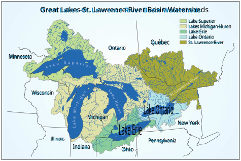**Figure 1.** Great Lakes-St. Lawrence River basin 

#### **Water Withdrawals** 

In 2023, the total reported withdrawal amount for the Great Lakes-St. Lawrence River basin, excluding instream hydroelectric water use, was 35,434 million gallons per day (mgd) or 134,132 million liters per day (mld). Water used for in-stream hydroelectric power production accounted for almost 99% of the water use in the region but is not considered a withdrawal in the traditional sense because it includes “run of the river” use, where the water remains in the water body and has negligible water consumption. Therefore, despite being an important water use for the Great Lakes-St. Lawrence River region (e.g., New York produced more hydroelectric power than any other state east of the Rocky Mountains in 2023)4 , in-stream hydroelectric power use is ordinarily excluded from discussion of water use trends and impacts. 

Water used for off-stream hydroelectric power generation is considered a withdrawal since the water is removed to a retention area or reservoir that serves as a storage system. After being used for power generation, the water is returned to its original source. Both off-stream and in-stream totals are mentioned 

> 3 An Olympic-size swimming pool holds about 660,000 gallons or 2.5 million liters. 

> 4 U.S. Energy Information Administration, Electricity Data Browser. 2023. 

6 

Annual Report of the Great Lakes Regional Water Use Database Representing 2023 Water Use Data 

in the watershed and jurisdiction summaries in this report,5 but only off-stream hydroelectric power generation is typically incorporated in discussion, figures and overall water withdrawal totals. 

The total 2023 water withdrawal amount represents a decrease of about 13% from the total 2022 withdrawal of 40,821 mgd (154,523 mld). It is normal to see some fluctuation in water use from year to year, but some sectors, like self-supply irrigation, may exhibit greater variability due to the influence of weather patterns that increase or decrease seasonal use. It should be noted that withdrawals are not a measure of water consumed or lost to the basin, since much of the withdrawn water is returned to the basin after use. Just over 5% of the total reported withdrawal amount (1,892 mgd or 7,162 mld) was consumed or otherwise lost from the basin. 

Water withdrawals for all water use sectors, excluding the in-stream hydroelectric water use sector, are presented in Figure 2 below. The water use sectors are defined in Appendix A. Self-supply thermoelectric power production (once-through cooling), public water supply, and self-supply industrial are the primary water use sectors (i.e., those withdrawing the largest volumes of water). 

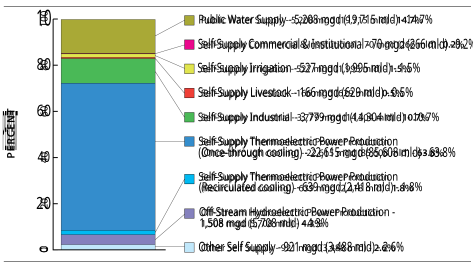**Figure 2.** Basin-wide water withdrawals (excluding in-stream hydroelectric water use) by water use sector in 2023 

> 5 Under the 2009 water use data collection and reporting protocols, the reporting of in-stream hydroelectric power production data is optional, so the database and report do not represent this water use by all jurisdictions. 

7 

Annual Report of the Great Lakes Regional Water Use Database Representing 2023 Water Use Data 

In 2023, the Lake Ontario watershed had the greatest withdrawal amount (representing about 27% of total withdrawals), followed closely by Lake Michigan. Figure 3 shows withdrawals by watershed broken down by water source: Great Lakes surface water (GLSW), other surface water (OSW)6 and groundwater (GW). In most watersheds, Great Lakes surface water was the predominant source of water withdrawals, with the exceptions of the Lake Superior and Lake Huron watersheds, whose main source of water withdrawals was other surface water. 

> WATER SOURCE GLSW OSW GW Total BASINWIDE TOTALS BY WATER SOURCE (mgd) 21,846 12,286 1,302 35,434 

> BASINWIDE TOTALS BY WATER SOURCE (mId) 82,696 46,507 4,929 134,132 

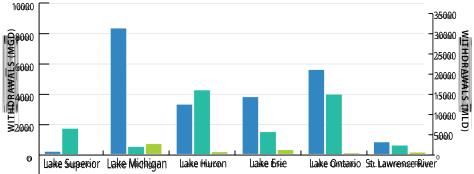**Figure 3.** Water withdrawals (excluding in-stream hydroelectric water use) by watershed in 2023 

Figure 4 shows total water withdrawals, excluding in-stream hydroelectric water use, by jurisdiction. Ontario, which has the largest land area in the basin of the 10 jurisdictions (108,680 square miles or 281,377 square kilometers over five watersheds), was the largest withdrawer of Great Lakes water in 2023. Facilities in Ontario withdrew 15,025 mgd (56,875 mld), accounting for over 42% of the total withdrawal amount across all jurisdictions. In contrast, Pennsylvania, which has the smallest land area in the basin (511 square miles or 1,316 square kilometers), withdrew less than 28 mgd (105 mld) or less than 0.1% of the total withdrawal amount. 

Figure 5 shows total water withdrawals (excluding in-stream hydroelectric water use) by jurisdiction over the past five years. Water use in each jurisdiction has generally stayed steady or decreased over the last five years. Variances from this general trend are typically explained by one or two large water users in those jurisdictions using more or less water from previous years. One exception is Ontario, which saw a drastic increase in withdrawals from 2020 to 2021, deviating from the trend of generally declining withdrawals over time.7 In 2023, Ontario’s water withdrawals decreased back down to typical withdrawal amounts prior to 2021. 

> 6 Other surface water is defined as tributary streams, lakes, ponds and reservoirs within the Great Lakes basin. 

> 7 The increased withdrawals in Ontario between 2020 and 2021 are primarily due to two withdrawals by a large water user in the self-supply thermoelectric power production (once-through cooling) sector, taken under two new permits issued in 2021 through the provincial water taking and reporting system. 

8 

Annual Report of the Great Lakes Regional Water Use Database Representing 2023 Water Use Data 

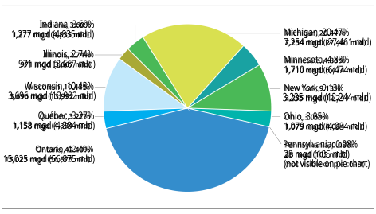**Figure 4.** Water withdrawals (excluding in-stream hydroelectric water use) by jurisdiction in 2023 

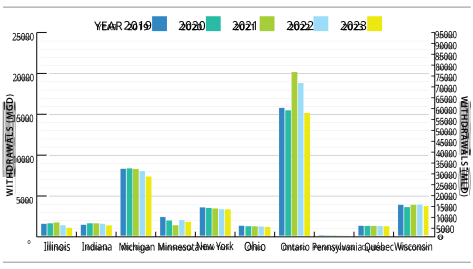**Figure 5.** Water withdrawals (excluding in-stream hydroelectric water use) by jurisdiction over the past five years 

9 

Annual Report of the Great Lakes Regional Water Use Database Representing 2023 Water Use Data 

#### **Diversions and Consumptive Uses** 

Diversions and consumptive uses of water are key components of the regional water use database (see Appendix B for the Compact’s and Agreement’s definitions of these terms). Water use data from diversions and consumptive uses are considered particularly informative for assessing the cumulative hydrologic effects of Great Lakes basin water use since they represent water that is not returned to the source watershed. 

The total reported 2023 diversion out of the basin was 1,062 mgd or 4,021 mld. About 86% (915 mgd or 3,464 mld) of this amount was associated with the Illinois Diversion, which takes water from Lake Michigan and discharges it into the Mississippi River watershed. The reported amount associated with the Illinois Diversion decreased by about 5% from the 2022 reported amount of 965 mgd (3,654 mld). Smaller diversions throughout the region made up the balance of the total, and some of the diverted water was returned to the source watershed as return flow. 

There were also diversions into the basin,8 including the Long Lac and Ogoki diversions (incoming diversions from the Hudson Bay watershed into northern Lake Superior), which contributed 2,376 mgd (8,993 mld) to the basin in 2023; this represents a 38% decrease from the 2022 reported diversion of 3,831 mgd (14,501 mld). Despite this change, both 2022 and 2023 Long Lac and Ogoki diversion amounts are well within the range of flow variability observed from 1944-2015. The flow from these diversions has ranged from 1,643 mgd (6,219 mld) to 5,181 mgd (19,612 mld).9 When conditions in the Long Lac and Lake Nipigon (downstream of Ogoki) watersheds are wet, the diversions are often reduced, and water that otherwise would have been diverted into Lake Superior is instead directed through natural outlets that flow toward Hudson Bay. Conversely, when conditions are dry in the downstream watersheds, the diversion flow may be higher. 

Overall, the net diversion, or outgoing diversions plus incoming diversions and returns (reported as negative numbers), was a gain of 1,347 mgd (5,100 mld), meaning more water was diverted into than out of the basin in 2023. 

Consumptive use is the portion of the water withdrawn or withheld from the basin that is lost from or otherwise not returned to the basin due to evaporation, incorporation into products or other processes. Consumptive use is most often calculated by applying a consumptive use coefficient to the reported withdrawal amount. The database documents whether a consumptive use coefficient was applied, or the consumptive use was determined through measurement for each reported water withdrawal. Figure 6 shows total consumptive use by jurisdiction over the past five years. Because different consumptive use coefficients are employed for each water use sector, changes in the makeup of each jurisdiction’s water withdrawals from year to year can impact its total consumptive use. 

The total reported 2023 consumptive use for the basin was 1,892 mgd (7,162 mld), representing a 2% decrease from the total 2022 consumptive use of 1,928 mgd (7,298 mld). The public water supply sector had the greatest consumptive use, accounting for 33% of the basin’s total consumptive use. The self-supply industrial and self-supply irrigation sectors comprised most of the rest of the consumptive uses, accounting for 25% and 24% of the basin’s total consumptive use, respectively. The Lake Michigan basin had the 

> 8 The Great Lakes Regional Water Use Database records incoming diversions with a negative sign and outgoing diversions with a positive sign. 

> 9 Information on the flow variability of the Long Lac and Ogoki diversions was provided by Ontario Power Generation. 

10 

Annual Report of the Great Lakes Regional Water Use Database Representing 2023 Water Use Data 

largest consumptive use of all watersheds at 699 mgd (2,647 mld), comprising 37% of the Great Lakes basin’s total consumptive use. 

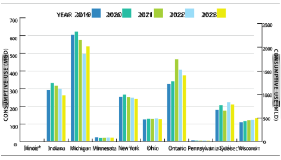**Figure 6.** Consumptive use by jurisdiction over the past five years 

_* Illinois’s consumptive use is negligible. Water loss associated with the Illinois Diversion is reported in Table 2a._ 

Considering both consumptive use and diversions, the basin lost a total of 545 mgd (2,062 mld) in 2023. By comparison, the basin gained a total of 819 mgd (3,100 mld) in 2022. As explained above, the change between 2022 and 2023 is due to a decrease in the diversion from Long Lac and Ogaki into Lake Superior. Tables 2a through 4b summarize the basin’s total 2023 water withdrawals, diversions and consumptive use by watershed, sector and jurisdiction. 

11 

Annual Report of the Great Lakes Regional Water Use Database Representing 2023 Water Use Data 

**Table 2a.** Basin-wide 2023 Water Use Data Summary by Watershed (including in-stream hydroelectric water use) in mgd 

|Watershed||Withd |rawals ||Diver |sions |Consumptive  |
|---|---|---|---|---|---|---|---|
||GLSW|OSW|GW|Total|Intrabasin|Interbasin|Use|
|Lake Superior|165|31,787|17|31,969|0|-2,364|32|
| Lake Michigan|8,295|471|677|9,443|0|886|699|
| Lake Huron|22,131|19,341|142|41,614|41|0|146|
|Lake Erie|53,766|2,075|280|56,122|4,673|-17|425|
|Lake Ontario |46,701|102,169|67|148,936|-4,714|41|352|
|St. Lawrence River|2,125,763|56,868|119|2,182,750|0|5|238|
|Total|2,256,821|212,710|1,302|2,470,833|0|-1,347|1,892|

_In millions of gallons per day; Water Sources: Great Lakes surface water (GLSW), other surface water (OSW) and groundwater (GW); totals may not sum exactly due to rounding._ 

**Table 2b.** Basin-wide 2023 Water Use Data Summary by Watershed (including in-stream hydroelectric water use) in mld 

|Watershed||Withd |rawals ||Diver |sions |Consumptive  |
|---|---|---|---|---|---|---|---|
||GLSW|OSW|GW|Total|Intrabasin|Interbasin|Use|
|Lake Superior|624|120,326|65|121,015|-1|-8,948|121|
|Lake Michigan |31,402|1,782|2,563|35,747|1|3,741|2,647|
|Lake Huron |83,774|73,214|537|157,525|155|0|551|
|Lake Erie|203,527|7,855|1,061|212,444|17,691|-66|1,609|
|Lake Ontario |176,783|386,750|252|563,785|-17,846|153|1,334|
|St. Lawrence River|8,046,888|215,269|451|8,262,607|0|20|899|
|Total|8,542,998|805,196|4,929|9,353,122|0|-5,100|7,162|

_In millions of liters per day; Water Sources: Great Lakes surface water (GLSW), other surface water (OSW) and groundwater (GW); totals may not sum exactly due to rounding._ 

12 

Annual Report of the Great Lakes Regional Water Use Database Representing 2023 Water Use Data 

**Table 3a** . Basin-wide 2023 Water Use Data Summary by Sector (including in-stream hydroelectric water use) in mgd 

|St||Withd|rawals||Dive|rsions|Consumptive |
|---|---|---|---|---|---|---|---|
|ecor|GLSW|OSW|GW|Total|Intrabasi|nInterbasin|Use|
|Public Water Supply Self-Supply Commercial and Institutional|3,743 7|964 56|501 7|5,208 70|0 0|852 2|622 11|
|Self-Supply Irrigation|3|155|370|527|0|0|445|
| Self-Supply Livestock|0|96|70|166|0|0|15|
| Self-Supply Industrial|1,848|1,605|325|3,779|0|36|471|
|Self-Supply Thermoelectric Power Production (Once-through cooling)|15,510|7,103|1|22,615|0|0|214|
|Self-Supply Thermoelectric Power Production (Recirculated cooling) |593|42|4|639|0|0|74|
| Off-Stream Hydroelectric Power Production|0|1,508|0|1,508|0|0|0|
|In-Stream Hydroelectric Water Use|2,234,975|200,424|0|2,435,400|0|-2,376|0|
| Other Self Supply|142|755|24|921|0|138|40|
|Total|2,256,821|212,710|1,302|2,470,833|0|-1,347|1,892|

_In millions of gallons per day; Water Sources: Great Lakes surface water (GLSW), other surface water (OSW) and groundwater (GW); totals may not sum exactly due to rounding._ 

**Table 3b.** Basin-wide 2023 Water Use Data Summary by Sector (including in-stream hydroelectric water use) in mld 

|Sector||Withdr |awals ||Dive|rsions|Consumptive |
|---|---|---|---|---|---|---|---|
||GLSW|OSW|GW|Total|Intrabasi|nInterbasin|Use|
|Public Water Supply Self-Supply Commercial and Institutional|14,168 27|3,651 213|1,897 26|19,715 266|0 0|3,226 7|2,355 42|
|Self-Supply Irrigation|10|586|1,400|1,995|0|0|1,684|
|Self-Supply Livestock|0|365|265|629|0|-1|56|
|Self-Supply Industrial|6,996|6,077|1,231|14,304|0|137|1,783|
|Self-Supply Thermoelectric Power Production (Once-through cooling)|58,714|26,889|5|85,608|0|0|811|
|Self-Supply Thermoelectric Power Production (Recirculated cooling) |2,243|160|15|2,418|0|0|280|
|Off-Stream Hydroelectric Power Production|0|5,708|0|5,708|0|0|0|
|In-Stream Hydroelectric Water Use |8,460,301|758,689|0|9,218,991|0|-8,993|0|
|Other Self Supply|538|2,859|91|3,488|0|523|152|
|Total|8,542,998|805,196|4,929|9,353,122|0|-5,100|7,162|

_In millions of liters per day; Water Sources: Great Lakes surface water (GLSW), other surface water (OSW) and groundwater (GW); totals may not sum exactly due to rounding._ 

13 

Annual Report of the Great Lakes Regional Water Use Database Representing 2023 Water Use Data 

**Table 4a.** Basin-wide 2023 Water Use Data Summary by Jurisdiction (including in-stream hydroelectric water use) in mgd 

|Jurisdiction||Withd |rawals ||Dive |rsions |Consumptive  |
|---|---|---|---|---|---|---|---|
||GLSW|OSW|GW|Total|Intrabasi|nInterbasin|Use|
|Illinois |971|0|0|971|0|915|0|
|Indiana |1,091|87|66|1,277|0|82|259|
|Michigan|5,928|729|598|7,254|0|0|535|
|Minnesota |105|3,256|5|3,366|0|12|20|
|New York |2,099,897|82,220|26|2,182,143|0|43|240|
|Ohio |595|402|82|1,079|0|-25|125|
|Ontario|144,211|125,377|273|269,860|0|-2,376|372|
|Pennsylvania |23|2|3|28|0|0|3|
|Québec |713|365|80|1,158|0|3|208|
|Wisconsin|3,287|272|138|3,696|0|-1|131|
|Total|2,256,821|212,710|1,302|2,470,833|0|-1,347|1,892|

_In millions of gallons per day; Water Sources: Great Lakes surface water (GLSW), other surface water (OSW) and groundwater (GW); totals may not sum exactly due to rounding._ 

**Table 4b.** Basin-wide 2023 Water Use Data Summary by Jurisdiction (including in-stream hydroelectric water use) in mld 

|Jurisdiction||Withd |rawals ||Dive |rsions |Consumptive  |
|---|---|---|---|---|---|---|---|
||GLSW |OSW|GW|Total|Intrabasi|nInterbasin|Use|
|Illinois |3,677|0|0|3,677|0|3,464|0|
|Indiana |4,130|330|376|4,835|0 |311 |980 |
|Michigan |22,440 |2,759|2,262|27,461|0|0|2,026|
|Minnesota |399|12,326|18|12,743|0|45|74 |
|New York |7,948,974|311,236|99|8,260,308|0|163 |907|
|Ohio |2,253|1,523|309|4,084|0 |-96|473 |
|Ontario |545,897|474,603|1,032|1,021,533|0|-8,993|1,409|
|Pennsylvania |88|6|10|105|0|0|11 |
|Québec |2,700|1,383|301|4,384|0|10|786|
|Wisconsin|12,441|1,030|521|13,992|0|-3|494|
|Total|8,542,998|805,196|4,929|9,353,122|0|-5,100|7,162|

_In millions of liters per day; Water Sources: Great Lakes surface water (GLSW), other surface water (OSW) and groundwater (GW); totals may not sum exactly due to rounding._ 

14 

Annual Report of the Great Lakes Regional Water Use Database Representing 2023 Water Use Data 

## Lake Watershed Summaries 

### Lake Superior 

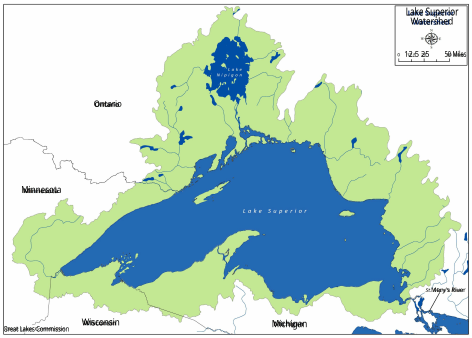**Figure 7.** Lake Superior Watershed 

#### **Overview of Watershed Characteristics** 

Lake Superior is the largest Great Lake and the world’s third-largest freshwater lake by volume, holding about 2,900 cubic miles (12,100 cubic kilometers) of water. Lake Superior could hold all the water in the other Great Lakes, plus three more Lake Eries.10 Its surface area is roughly the size of South Carolina, or approximately 31,700 square miles (82,100 square kilometers). 

> 10 Great Lakes Commission, Lake Superior. 

Basic Stats of Lake Superior Length: 350 mi/563 km Breadth: 160 mi/257 km Elevation: 600 ft/183 m Depth: 483 ft/47 m average, 1,330 ft/406 m maximum Volume: 2,900 cubic mi/12,100 cubic km Lake surface area: 31,700 square mi/ 82,100 square km Watershed drainage area: 49,300 square mi/127,700 square km Outlet: St. Marys River to Lake Huron Retention/replacement time: 191 years Approximate population in watershed : United States - 424,473; Canada - 169,897; Total - 594,370 

15 

Annual Report of the Great Lakes Regional Water Use Database Representing 2023 Water Use Data 

#### **Water Withdrawals** 

Four jurisdictions – Michigan, Minnesota, Ontario and Wisconsin – share the Lake Superior watershed and collectively withdrew 1,857 mgd (7,028 mld) in 2023, excluding the reported in-stream hydroelectric water use of 30,112 mgd (113,987 mld). This represents an 11% decrease from the 2022 total withdrawal amount of 2,098 mgd (7,940 mld). The off-stream hydroelectric power production sector represented 78% of all withdrawals from the watershed at 1,454 mgd (5,504 mld). The self-supply industrial (212 mgd or 803 mld) and self-supply thermoelectric power production (once-through cooling) (106 mgd or 402 mld) sectors made up the bulk of remaining water withdrawals from Lake Superior. 

Other surface water within the Lake Superior watershed was primarily used to generate electricity with instream hydroelectric power. Excluding water used for in-stream hydroelectric power production, 90% (1,674 mgd or 6,339 mld) of the total reported withdrawal amount from the watershed came from other surface water. Of the remaining withdrawals, 9% came directly from Lake Superior (165 mgd or 624 mld) and less than 1% came from groundwater (17 mgd or 65 mld). 

#### **Water Diversions and Consumptive Uses** 

The reported net water gain11 (2,332 mgd or 8,828 mld) in the Lake Superior watershed in 2023 was largely attributable to the Long Lac and Ogoki interbasin diversions in northern Ontario that diverted 2,376 mgd or 8,993 mld into Lake Superior. On average, these diversions into the basin are about twice the volume of the Illinois Diversion out of the basin; in 2023 they were about two and a half times the Illinois Diversion volume. 

Outgoing interbasin diversions totaling 12 mgd (45 mld) were reported in Minnesota, associated almost exclusively with the self-supply industrial sector. A small amount of the outgoing diversion (0.001 mgd or 0.004 mld) was also reported for the self-supply irrigation sector. Additionally, an incoming intrabasin transfer of 0.26 mgd (0.98 mld) associated with Michigan’s public drinking water supply was reported. 

The total consumptive use for all four jurisdictions in the Lake Superior watershed was 32 mgd (121 mld). Self-supply industrial use (22 mgd or 85 mld) was the largest contributor to total consumptive use for the watershed, followed by public water supply (6 mgd or 24 mld). Total consumption in 2023 was almost identical to that in 2022 in the Lake Superior basin. 

> 11 Incoming diversions are reported as negative values in the database and on tables in this report. 

16 

Annual Report of the Great Lakes Regional Water Use Database Representing 2023 Water Use Data 

**Table 5a.** Lake Superior Watershed 2023 Water Use Data Summary in mgd 

|S||Withd|rawals||Dive|rsions|Consumptive|
|---|---|---|---|---|---|---|---|
|ector|GLSW|OSW|GW|Total|Intrabasin|Interbasin|Use|
|Public Water Supply|43|3|12|58|0|0|6|
|Self-Supply Commercial and Institutional|2|1|0|2|0|0|0|
|Self-Supply Irrigation|0|0|1|1|0|0|1|
| Self-Supply Livestock|0|14|3|17|0|0|0|
| Self-Supply Industrial|50|162|1|212|0|12|23|
|Self-Supply Thermoelectric Power Production (Once-through cooling)|71|35|0|106|0|0|2|
|Self-Supply Thermoelectric Power Production (Recirculated cooling)|0|0|0|0|0|0|0|
| Off-Stream Hydroelectric Power Production|0|1,454|0|1,454|0|0|0|
|In-Stream Hydroelectric Water Use|0|30,112|0|30,112|0|-2,376|0|
| Other Self Supply|0|6|0|6|0|0|0|
|Total|165|31,787|17|31,969|0|-2,364|32|

_In millions of gallons per day; Water Sources: Great Lakes surface water (GLSW), other surface water (OSW) and groundwater (GW); totals may not sum exactly due to rounding._ 

**Table 5b.** Lake Superior Watershed 2023 Water Use Data Summary in mld 

|Sector||Withdr|awals||Dive|rsions|Consumptive|
|---|---|---|---|---|---|---|---|
||GLSW|OSW|GW|Total|Intrabasi|nInterbasin|Use|
|Public Water Supply|162|10|46|218|-1|0|24|
|Self-Supply Commercial and Institutional|6|3|0|9|0|0|1|
|Self-Supply Irrigation|0|1|3|5|0|0|4|
|Self-Supply Livestock|0|54|10|64|0|0|0|
| Self-Supply Industrial|187|612|4|803|0|45|85|
|Self-Supply Thermoelectric Power Production (Once-through cooling)|269|132|1|402|0|0|7|
|Self-Supply Thermoelectric Power Production (Recirculated cooling)|0|0|0|0|0|0|0|
|Off-Stream Hydroelectric Power Production|0|5,504|0|5,504|0|0|0|
|In-Stream Hydroelectric Water Use |0|113,987|0|113,987|0|-8,993|0|
| Other Self Supply|0|22|0|22|0|0|0|
| Total|624|120,326|65|121,015|-1|-8,948|121|

_In millions of liters per day; Water Sources: Great Lakes surface water (GLSW), other surface water (OSW) and groundwater (GW); totals may not sum exactly due to rounding._ 

17 

Annual Report of the Great Lakes Regional Water Use Database Representing 2023 Water Use Data 

### Lake Michigan 

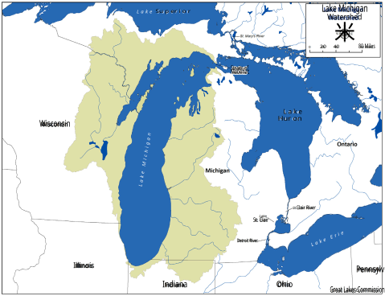**Figure 8.** Lake Michigan Watershed 

#### **Overview of Watershed Characteristics** 

Lake Michigan is the only Great Lake situated entirely within the United States. It is the second largest Great Lake by volume, holding about 1,180 cubic miles (4,918 cubic kilometers) of water. Its surface area is roughly the size of West Virginia at approximately 22,300 square miles (57,753 square kilometers). More than eight million people call the Lake Michigan watershed home.12 

Basic Stats of Lake Michigan Length: 307 mi/494 km Breadth: 118 mi/190 km Elevation: 577 ft/176 m Depth: 279 ft/85 m average, 923 ft/281 m maximum Volume: 1,180 cubic mi/4,918 cubic km Lake surface area: 22,300 square mi/57,753 square km Watershed drainage area: 45,600 square mi/ 118,095 square km Outlet: Straits of Mackinac to Lake Huron Retention/replacement time: 62 years Approximate population in watershed: 8,011,470 

> 12 Previous State of the Great Lakes Technical Reports employed an updated methodology to calculate the population within the Lake Michigan watershed, leading to a discrepancy in estimated population from Annual Reports prior to 2022. Details on the updated methodology can be found in the State of the Great Lakes 2022 Technical Report. 

18 

Annual Report of the Great Lakes Regional Water Use Database Representing 2023 Water Use Data 

#### **Water Withdrawals** 

Four jurisdictions – Illinois, Indiana, Michigan and Wisconsin – share the Lake Michigan watershed and collectively withdrew 9,443 mgd (35,747 mld) in 2023, a 5% decrease from the total 2022 withdrawal of 10,067 mgd (38,108 mld). No in-stream or off-stream hydroelectric water use was reported for the watershed.13 The primary water uses were for self-supply thermoelectric power production (once-through cooling) at 5,978 mgd (22,628 mld), public water supply at 1,490 mgd (5,641 mld), and self-supply industrial use at 1,323 mgd (5,010 mld). 

Lake Michigan surface water was the primary source of withdrawals in the watershed, accounting for 88% of total withdrawals (8,295 mgd or 31,402 mld). Of the remaining withdrawals, 7% came from groundwater (677 mgd or 2,563 mld) and 5% came from other surface water (471 mgd or 1,782 mld). 

#### **Water Diversions and Consumptive Uses** 

The reported net water loss from the Lake Michigan watershed totaled 1,688 mgd (6,390 mld) in 2023. This represents 18% of total Lake Michigan withdrawals and a 2% decrease in water loss from 2022. Water loss primarily consisted of the Illinois Diversion of 915 mgd (3,464 mld) and the watershed’s total consumptive use of 699 mgd (2,647 mld). 

Diversions, including the Illinois Diversion, decreased by 5% from 2022 and consumptive use increased by about 3%. The sectors with the majority of consumptive use in the watershed were self-supply irrigation at 337 mgd (1,277 mld) and self-supply industrial use at 214 mgd (809 mld). 

> 13 This does not necessarily mean no water was used to produce in-stream or off-stream hydroelectric power; jurisdictions are not required to report in-stream hydroelectric power production to the database and some have enacted policies that do not require the jurisdiction to report water used to produce off-stream hydroelectric power production. 

19 

Annual Report of the Great Lakes Regional Water Use Database Representing 2023 Water Use Data 

**Table 6a.** Lake Michigan Watershed 2023 Water Use Data Summary in mgd 

|Sector||Withd|rawals||Dive|rsions|Consumptive |
|---|---|---|---|---|---|---|---|
||GLSW|OSW|GW|Total|Intrabasi|nInterbasin|Use|
|Public Water Supply|1,243|21|225|1,490|0|829|87|
|Self-Supply Commercial and Institutional|4|8|5|16|0|2|1|
|Self-Supply Irrigation|0|52|336|388|0|0|337|
| Self-Supply Livestock|0|15|28|43|0|0|8|
| Self-Supply Industrial|1,073|182|68|1,323|0|25|214|
|Self-Supply Thermoelectric Power Production (Once-through cooling)|5,824|153|1|5,978|0|0|32|
|Self-Supply Thermoelectric Power Production (Recirculated cooling)|19|33|3|61|0|0|21|
| Off-Stream Hydroelectric Power Production|0|0|0|0|0|0|0|
|In-Stream Hydroelectric Water Use|0|0|0|0|0|0|0|
| Other Self Supply|133|1|10|143|0|133|0|
|Total|8,295|471|677|9,443|0|988|699|

_In millions of gallons per day; Water Sources: Great Lakes surface water (GLSW), other surface water (OSW) and groundwater (GW); totals may not sum exactly due to rounding._ 

**Table 6b.** Lake Michigan Watershed 2023 Water Use Data Summary in mld 

|Sector||Withd|rawals||Dive|rsions|Consumptive |
|---|---|---|---|---|---|---|---|
||GLSW|OSW|GW|Total|Intrabasi|nInterbasin|Use|
|Public Water Supply|4,707|81|853|5,641|1|3,140|328|
|Self-Supply Commercial and Institutional|14|29|19|62|0|7|3|
|Self-Supply Irrigation|1|195|1,274|1,470|0|0|1,277|
|Self-Supply Livestock|0|55|106|161|0|0|32|
| Self-Supply Industrial|4,062|690|258|5,010|0|ε3|809|
|Self-Supply Thermoelectric Power Production (Once-through cooling)|22,045|579|4|22,628|0|0|121|
|Self-Supply Thermoelectric Power Production (Recirculated cooling)|70|149|12|232|0|0|78|
|Off-Stream Hydroelectric Power Production|0|0|0|0|0|0|0|
|In-Stream Hydroelectric Water Use |0|0|0|0|0|0|0|
| Other Self Supply|502|4|37|543|0|502|1|
| Total|31,402|1,782|2,563|35,747|1|3,741|2,647|

_In millions of liters per day; Water Sources: Great Lakes surface water (GLSW), other surface water (OSW) and groundwater (GW); totals may not sum exactly due to rounding._ 

20 

Annual Report of the Great Lakes Regional Water Use Database Representing 2023 Water Use Data 

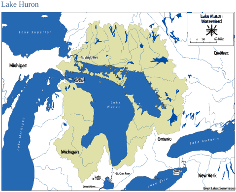**Figure 9.** Lake Huron Watershed 

##### Basic Stats of Lake Huron 

#### **Overview of Watershed Characteristics** 

By surface area, Lake Huron is the second largest of the Great Lakes. It covers 23,000 square miles (59,565 square kilometers), making it the third largest freshwater lake on Earth by surface area. By volume however, Lake Huron is only the third largest Great Lake. The latest population estimates represent the first time the Canadian population is greater than the U.S. population within the Lake Huron watershed.14 

> 14 State of the Great Lakes 2022 – Technical Report. 

Length: 206 mi/332 km Breadth: 183 mi/295 km Elevation: 577 ft/176 m Depth: 195 ft/59 m average, 750 ft/ 229 m maximum Volume: 849 cubic mi/3,538 cubic km Lake Surface Area: 23,000 square mi/ 59,565 square km Watershed Drainage Area: 50,700 square mi/131,303 square km Outlet: St. Clair River to Lake Erie Retention/replacement time: 21 years Approximate population in watershed: United States - 1,563,597; Canada - 1,636,294; Total - 3,199,891 

21 

Annual Report of the Great Lakes Regional Water Use Database Representing 2023 Water Use Data 

#### **Water Withdrawals** 

Only two jurisdictions – Michigan and Ontario – share the Lake Huron watershed and collectively withdrew 7,616 mgd or 28,828 mld in 2023, excluding the reported in-stream hydroelectric water use of 33,998 mgd or 128,697 mld. This constitutes a 33% decrease from the 2022 total withdrawal of 11,426 mgd (43,251 mld). This change is mainly due to a decrease in water used for thermoelectric power production (once through cooling) of 52% in Michigan and 35% in Ontario. Despite this large decrease, self-supply thermoelectric power production (once-through cooling) was still the primary sector in the Lake Huron watershed at 6,981 mgd (26,428 mld), accounting for almost 92% of total withdrawals. Withdrawals for self-supply industrial use (351 mgd or 1,327 mld) and public water supply (207 mgd or 782 mld) made up most of the remaining water use. 

Excluding in-stream hydroelectric water use, other surface water was the primary source of withdrawals in the watershed, accounting for 55% of total withdrawals (4,204 mgd or 15,913 mld). Of the remaining withdrawals, 43% came from Lake Huron surface water (3,270 mgd or 12,378 mld) and 2% came from groundwater (142 mgd or 537 mld). 

#### **Water Diversions and Consumptive Uses** 

The reported net water loss from the Lake Huron watershed was 187 mgd (706 mld) in 2023. Total consumptive use was 146 mgd or 551 mld, accounting for 78% of the net water loss. Most of the consumptive use in the watershed came from the self-supply thermoelectric power production (oncethrough cooling) and self-supply industrial sectors at 43% and 24% of total consumptive use, respectively. Consumptive use decreased by 22%, with most of that change coming from the self-supply thermoelectric power production (once-through cooling sector). 

The remainder of the net water loss consisted of an intrabasin transfer of 41 mgd (155 mld) for public water supply in Ontario. This intrabasin diversion represented a loss from the Lake Huron watershed and a corresponding gain to the Lake Erie and Lake Ontario watersheds, and thus did not have an impact on the overall Great Lakes-St. Lawrence River basin water balance (i.e., all water diverted remained in the basin). Over 97% of the diversion was into the Lake Erie watershed. 

22 

Annual Report of the Great Lakes Regional Water Use Database Representing 2023 Water Use Data 

**Table 7a.** Lake Huron Watershed 2023 Water Use Data Summary in mgd 

|Sector||Withd|rawals||Diver|sions|Consumptive |
|---|---|---|---|---|---|---|---|
||GLSW|OSW|GW|Total|Intrabasin|Interbasin|Use|
|Public Water Supply|116|41|50|207|41|0|25|
|Self-Supply Commercial and Institutional |0|2|0|2|0|0|0|
|Self-Supply Irrigation|0|25|14|33|0|0|20|
| Self-Supply Livestock|0|14|15|29|0|0|1|
| Self-Supply Industrial|19|270|62|351|0|0|36|
|Self-Supply Thermoelectric Power Production (Once-through cooling)|3,134|3,848|0|6,981|0|0|62|
|Self-Supply Thermoelectric Power Production (Recirculated cooling)|0|2|1|3|0|0|2|
| Off-Stream Hydroelectric Power Production|0|0|0|0|0|0|0|
|In-Stream Hydroelectric Water Use|18,861|15,137|0|33,998|0|0|0|
|Other Self Supply|0|2|1|4|0|0|0|
|Total|22,131|19,341|142|41,614|41|0|146|

_In millions of gallons per day; Water Sources: Great Lakes surface water (GLSW), other surface water (OSW) and groundwater (GW); totals may not sum exactly due to rounding._ 

**Table 7b.** Lake Huron Watershed 2023 Water Use Data Summary in mld 

|Sector||Withd|rawals||Diver|sions|Consumptive |
|---|---|---|---|---|---|---|---|
||GLSW|OSW|GW|Total|IntrabasinI|nterbasin|Use|
|Public Water Supply|439|156|188|782|155|0|96|
|Self-Supply Commercial and Institutional|2|6|1|9|0|0|1|
|Self-Supply Irrigation|1|94|53|148|0|0|74|
| Self-Supply Livestock|0|54|55|109|0|0|2|
| Self-Supply Industrial|72|1,021|234|1,327|0|0|135|
|Self-Supply Thermoelectric Power Production (Once-through cooling)|11,863|14,565|0|26,428|0|0|235|
|Self-Supply Thermoelectric Power||||||||
| Production (Recirculated cooling)|0|9|3|11|0|0|8|
|Off-Stream Hydroelectric Power Production|0|0|0|0|0|0|0|
|In-Stream Hydroelectric Water Use|71,396|57,301|0|128,697|0|0|0|
| Other Self Supply|2|8|3|13|0|0|0|
| Total|83,774|73,214|537|157,525|155|0|551|

_In millions of liters per day; Water Sources: Great Lakes surface water (GLSW), other surface water (OSW) and groundwater (GW); totals may not sum exactly due to rounding._ 

23 

Annual Report of the Great Lakes Regional Water Use Database Representing 2023 Water Use Data 

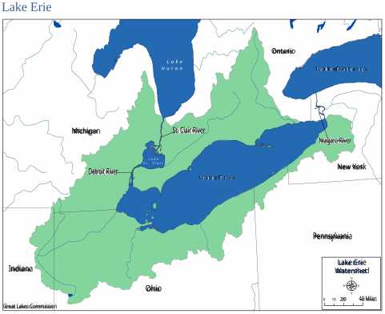**Figure 10.** Lake Erie Watershed 

##### Basic Stats of Lake Erie 

#### **Overview of Watershed Characteristics** 

By surface area, Lake Erie is the 12th largest freshwater lake in the world. The shallowest of the Great Lakes, it has an average depth of 62 feet (19 meters) and a maximum depth of 210 feet (64 meters). The lake holds about 116 cubic miles (483 cubic kilometers) of water. Lake Erie is warmer than the other Great Lakes, which contributes to its biological productivity. However, its small volume relative to the other Great Lakes and overall average shallow depth makes it more ecologically sensitive. The watershed is home to more than 12 million people. 

Length: 241 mi/388 km Breadth: 57 mi/92 km Elevation: 569 ft/173 m Depth: 62 ft/19 m average, 210 ft/64 m maximum Volume: 116 cubic mi/483 cubic km Lake surface area: 9,910 square mi/ 25,655 square km Watershed drainage area: 22,700 square mi/58,788 square km Outlets: Niagara River and Welland Canal Retention/replacement time: 2.7 years Approximate population in watershed: United States - 9,946,913; Canada - 2,452,606; Total - 12,399,519 

24 

Annual Report of the Great Lakes Regional Water Use Database Representing 2023 Water Use Data 

#### **Water Withdrawals** 

Six jurisdictions – Indiana, Michigan, New York, Ohio, Ontario and Pennsylvania – share the Lake Erie watershed and collectively withdrew 5,498 mgd (20,814 mld) in 2023, excluding the reported in-stream hydroelectric water use of 50,623 mgd (191,630 mld). This represents a 9% decrease from the 2022 total withdrawal amount of 6,036 mgd (22,848 mld). Excluding in-stream hydroelectric power generation, the primary water use sectors were self-supply thermoelectric power generation (once-through cooling) at 2,674 mgd (10,121 mld), public water supply at 1,486 mgd (5,623 mld) and self-supply industrial at 1,037 mgd (3,925 mld) in 2023. 

Excluding in-stream hydroelectric water use, Lake Erie surface water was the primary source of withdrawals in the watershed, accounting for 68% of total withdrawals (3,766 mgd or 14,257 mld). Of the remaining withdrawals, 26% came from other surface water (1,452 mgd or 5,496 mld) and 5% came from groundwater (280 mgd or 1,061 mld). 

#### **Water Diversions and Consumptive Uses** 

The reported net water loss from the Lake Erie watershed totaled 5,081 mgd (19,234 mld) in 2023. The largest loss from the Lake Erie watershed was from the Welland Canal intrabasin diversion, which diverted 4,713 mgd (17,842 mld) to the Lake Ontario watershed for navigation purposes. Because this diversion is entirely into Lake Ontario, no water is lost from the Great Lakes-St. Lawrence River basin. The Welland Canal was constructed in 1830 as a ship canal connecting Lake Erie to Lake Ontario. Figure 11 shows the flow through the Welland Canal over the past five years. 

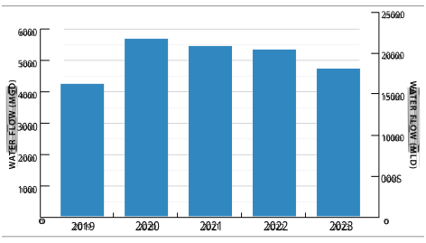**Figure 11.** Water flow through the Welland Canal over the past five years 

25 

Annual Report of the Great Lakes Regional Water Use Database Representing 2023 Water Use Data 

Additionally, incoming intrabasin diversions were reported in Ontario and Michigan for the public water supply sector, totaling 40 mgd or 151 mld, though Michigan’s diversion represented a small portion of the total (about 0.2% ). Interbasin diversions, both into and out of the basin, were also reported, resulting in a net gain of 17 mgd (66 mld) for the Lake Erie watershed and the Great Lakes-St. Lawrence River basin.15 

Consumptive use in the Lake Erie watershed totaled 425 mgd (1,609 mld), a negligible decrease from the 2022 consumptive use of 429 mgd (1,623 mld). The major consumptive uses were from the public water supply (191 mgd or 725 mld) and self-supply industrial (99 mgd or 376 mld) sectors. 

> 15 Incoming diversions are reported as negative values in the database and on tables in this report. 

26 

Annual Report of the Great Lakes Regional Water Use Database Representing 2023 Water Use Data 

**Table 8a.** Lake Erie Watershed 2023 Water Use Data Summary in mgd 

|Sector||Withd|rawals||Diver|sions|Consumptive |
|---|---|---|---|---|---|---|---|
||GLSW|OSW|GW|Total|IntrabasinI|nterbasin|Use|
|Public Water Supply|1,137|218|131|1,486|-40|9|191|
|Self-Supply Commercial and Institutional|1|0|0|1|0|0|0|
|Self-Supply Irrigation|2|44|15|61|0|0|55|
| Self-Supply Livestock|0|7|8|15|0|0|1|
| Self-Supply Industrial|284|639|114|1,037|0|0|99|
| Self-Supply Thermoelectric Power Production (Once-through cooling)|2,158|516|0|2,674|0|0|43|
|Self-Supply Thermoelectric Power Production (Recirculated cooling)|181|1|0|181|0|0|32|
| Off-Stream Hydroelectric Power Production|0|0|0|0|0|0|0|
|In-Stream Hydroelectric Water Use|50,000|623|0|50,623|0|0|0|
| Other Self Supply|4|28|12|44|4,713|-26|4|
|Total|53,766|2,075|280|56,122|4,673|-17|425|

_In millions of gallons per day; Water Sources: Great Lakes surface water (GLSW), other surface water (OSW) and groundwater (GW); totals may not sum exactly due to rounding._ 

**Table 8b.** Lake Erie Watershed 2023 Water Use Data Summary in mld 

|Sector||Withd|rawals||Diver |sions |Consumptive  |
|---|---|---|---|---|---|---|---|
||GLSW|OSW|GW|Total|IntrabasinI|nterbasin|Use|
|Public Water Supply|4,304|825|494|5,623|-151|35|725|
|Self-Supply Commercial and Institutional|3|1|1|5|0|0|1|
|Self-Supply Irrigation|7|165|58|231|0|0|207|
| Self-Supply Livestock|0|26|31|57|0|-1|3|
| Self-Supply Industrial|1,074|2,419|432|3,925|0|0|376|
|Self-Supply Thermoelectric Power Production (Once-through cooling)|8,168|1,953|0|10,121|0|0|164|
|Self-Supply Thermoelectric Power Production (Recirculated cooling)|685|2|0|687|0|0|120|
| Off-Stream Hydroelectric Power Production|0|0|0|0|0|0|0|
|In-Stream Hydroelectric Water Use|189,271|2,359|0|191,630|0|0|0|
| Other Self Supply|15|105|45|166|17,842|-100|13|
|Total|203,527|7,855|1,061|212,444|17,691|-66|1,609|

_In millions of liters per day; Water Sources: Great Lakes surface water (GLSW), other surface water (OSW) and groundwater (GW); totals may not sum exactly due to rounding._ 

27 

Annual Report of the Great Lakes Regional Water Use Database Representing 2023 Water Use Data 

### Lake Ontario 

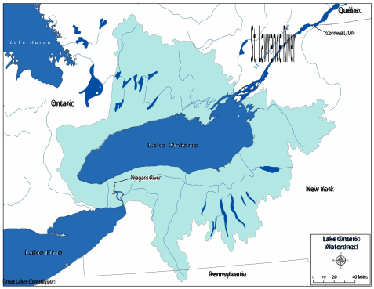**Figure 12.** Lake Ontario Watershed 

#### **Overview of Watershed Characteristics** 

Lake Ontario is the easternmost of the Great Lakes and the smallest in surface area (covering 7,340 square miles or 19,009 square kilometers). It is extremely deep (802 feet or 244 meters maximum) and while smaller than Lake Erie in surface area, it exceeds it in volume by nearly three and a half times (393 cubic miles or 1,639 cubic kilometers). Lake Ontario is the 14th largest lake in the world by surface area and the 11th largest by volume. 

Basic Stats of Lake Ontario Length: 193 mi/311 km Breadth: 53 mi/85 km Elevation: 243 ft/74 m Depth: 283 ft/86 m average, 802 ft/ 244 m maximum Volume: 393 cubic mi/1,639 cubic km Lake surface area: 7,340 square mi/19,009 square km Watershed drainage area: 23,400 square mi/ 60,601 square km Outlet: St. Lawrence River to the Atlantic Ocean Retention/replacement time: six years Approximate population in watershed: United States - 2,997,484; Canada - 8,169,080; Total - 11,166,564 

28 

Annual Report of the Great Lakes Regional Water Use Database Representing 2023 Water Use Data 

#### **Water Withdrawals** 

Three jurisdictions – New York, Ontario and Pennsylvania – share the Lake Ontario watershed and collectively withdrew 9,543 mgd (36,123 mld) in 2023, excluding the in-stream hydroelectric water use of 139,394 mgd (527,662 mld). This constitutes a marginal change from the 2022 total withdrawal of 9,544 mgd (36,126 mld). Excluding in-stream hydroelectric power generation, the primary water uses were for self-supply thermoelectric power generation (once-through cooling) at 6,848 mgd (25,922 mld), public water supply at 971 mgd (3,674 mld) and other self-supply at 715 mgd (2,707 mld) in 2023. 

Excluding in-stream hydroelectric water use, Lake Ontario surface water was the primary source of withdrawals in the watershed, accounting for 58% of total withdrawals (5,558 mgd or 21,038 mld). Of the remaining withdrawals, 41% came from other surface water (3,918 mgd or 14,833 mld) and less than 1% came from groundwater (67 mgd or 252 mld). 

#### **Water Diversions and Consumptive Uses** 

The reported net gain in the Lake Ontario watershed was 4,321 mgd (16,358 mld)16 in 2023, representing a 12% decrease from the 2022 net gain of 4,927 mgd (18,650 mld). The net gain in 2023 was predominately attributable to the Welland Canal (4,713 mgd or 17,842 mld), which diverts water from the Lake Erie watershed to Lake Ontario for navigation purposes. While this represents a net gain for the Lake Ontario watershed, it has a net zero effect on the Great Lakes-St. Lawrence River basin. An additional net intrabasin diversion of 1.2 mgd (4.5 mld) was reported in the Lake Ontario watershed, associated with the public water supply sector in Ontario. 

Outgoing interbasin diversions of 40.5 mgd (153 mld) from Lake Ontario were reported in New York, associated with the Erie Barge Canal and the city of Rome’s public water supply. Consumptive use in the Lake Ontario watershed totaled 352 mgd (1,334 mld), primarily from the public water supply (119 mgd or 452 mld), self-supply thermoelectric power production (once-through cooling) (75 mgd or 283 mld), and self-supply industrial (68 mgd or 258 mld) sectors. 

> 16 Incoming diversions are reported as negative values in the database and on tables in this report. 

29 

Annual Report of the Great Lakes Regional Water Use Database Representing 2023 Water Use Data 

**Table 9a.** Lake Ontario Watershed 2023 Water Use Data Summary in mgd 

|Sector||Withdr|awals||Divers|ions|Consumptive |
|---|---|---|---|---|---|---|---|
||GLSW|OSW|GW|Total|IntrabasinI|nterbasin|Use|
|Public Water Supply|604|348|19|971|-1|9|119|
|Self-Supply Commercial and Institutional |0|37|1|88|0|0|8|
|Self-Supply Irrigation|0|29|1|30|0|0|26|
| Self-Supply Livestock|0|23|6|29|0|0|4|
| Self-Supply Industrial|264|161|40|465|0|0|68|
|Self-Supply Thermoelectric Power Production (Once-through cooling)|4,296|2,552|0|6,848|0|0|75|
|Self-Supply Thermoelectric Power Production (Recirculated cooling)|393|0|0|393|0|0|20|
|Off-Stream Hydroelectric Power Production|0|54|0|54|0|0|0|
|In-Stream Hydroelectric Water Use|41,143|98,250|0|139,394|0|0|0|
| Other Self Supply|0|715|0|715|-4,713|32|32|
|Total|46,701|102,169|67|148,936|-4,714|41|352|

_In millions of gallons per day; Water Sources: Great Lakes surface water (GLSW), other surface water (OSW) and groundwater (GW); totals may not sum exactly due to rounding._ 

**Table 9b.** Lake Ontario Watershed 2023 Water Use Data Summary in mld 

|Sector||Withdr |awals||Divers |ions |Consumptive  |
|---|---|---|---|---|---|---|---|
||GLSW|OSW|GW|Total|IntrabasinI|nterbasin|Use|
|Public Water Supply|2,288|1,316||3,674|-5|32|452|
|Self-Supply Commercial and Institutional|0|141|2|143|0|0|31|
|Self-Supply Irrigation|0|109|4|113|0|0|100|
| Self-Supply Livestock|0|87|23|110|0|0|14|
|Self-Supply Industrial|666|609|153|1,762|0|0|258|
|Self-Supply Thermoelectric Power Production (Once-through cooling)|16,263|9,660|0|25,922|0|0|283|
|Self-Supply Thermoelectric Power Production (Recirculated cooling)|1,488|0|0|1,488|0|0|74|
|Off-Stream Hydroelectric Power Production|0|204|0|204|0|0|0|
|In-Stream Hydroelectric Water Use|155,745|371,917|0|527,662|0|0|0|
| Other Self Supply|0|2,707|0|2,707|-17,842|121|123|
|Total|176,783|386,750|252|563,785|-17,846|153|1,334|

_In millions of liters per day; Water Sources: Great Lakes surface water (GLSW), other surface water (OSW) and groundwater (GW); totals may not sum exactly due to rounding._ 

30 

Annual Report of the Great Lakes Regional Water Use Database Representing 2023 Water Use Data 

### St. Lawrence River 

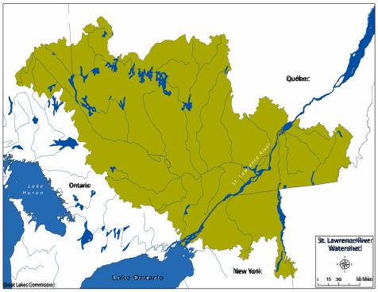**Figure 13.** St. Lawrence River Watershed 

#### **Overview of Watershed Characteristics** 

Running 744 miles (1,197 kilometers) in length, the St. Lawrence River is considered a major river of North America. Mostly located in the province of Québec, it links the Great Lakes to the Atlantic Ocean. 

Basic Stats of the St. Lawrence River Length: 744 mi/1,197 km Elevation: 245 ft/75 m at the source and 0 ft/0 m at the mouth Average annual flow (Montréal) : 7,660 cubic meters/second Volume: 393 cubic mi/1,639 cubic km Watershed drainage area: 519,000 square mi/1,344,200 square km Outlet: Gulf of St. Lawrence/Atlantic Ocean 

31 

Annual Report of the Great Lakes Regional Water Use Database Representing 2023 Water Use Data 

#### **Water Withdrawals** 

Three jurisdictions – New York, Ontario and Québec – share the St. Lawrence River watershed and collectively withdrew 1,477 mgd (5,592 mld) of water in 2023, excluding the in-stream hydroelectric water use of 2,181,273 mgd (8,257,015 mld).17 St. Lawrence River withdrawals decreased by 11% from the 2022 withdrawal total of 1,651 mgd (6,249 mld). Excluding in-stream hydroelectric water use, the primary water uses were for public water supply (998 mgd or 3,776 mld) and self-supply industrial use (390 mgd or 1,447 mld), collectively making up almost 94% of St. Lawrence River withdrawals in 2023. 

Excluding in-stream hydroelectric water use, St. Lawrence River surface water was the primary source of withdrawals in the watershed, accounting for 54% of total withdrawals (792 mgd or 2,997 mld). Of the remaining withdrawals, 38% came from other surface water (566 mgd or 2,144 mld) and 8% came from groundwater (119 mgd or 451 mld). 

#### **Water Diversions and Consumptive Uses** 

The reported net water loss in the St. Lawrence River watershed totaled 243 mgd (919 mld) in 2023, a 5% decrease from the 2022 net water loss of 256 mgd (969 mld). This net loss includes interbasin diversions for public water supply in New York (2.4 mgd or 9.2 mld) and Québec (2.7 mgd or 10.4 mld) and consumptive uses totaling 238 mgd (899 mld). The largest consumptive uses were for public water supply (193 mgd or 731 mld) and self-supply industrial use (32 mgd or 120 mld). 

> 17 Because of an updated calculation method in New York, withdrawals for in-stream hydroelectric power production in the St. Lawrence River basin will appear to be much higher in 2023 than in previous years. In 2022, this value should be 2,267,065 mgd rather than 222,181 mgd as was reported in the 2022 Annual Report. 

32 

Annual Report of the Great Lakes Regional Water Use Database Representing 2023 Water Use Data 

**Table 10a.** St. Lawrence River Watershed 2023 Water Use Data Summary in mgd 

|Sector||Withd|rawals||Diver|sions|Consumptive |
|---|---|---|---|---|---|---|---|
||GLSW|OSW|GW|Total|Intrabasin|Interbasin|Use|
|Public Water Supply|599|334|65|866|0|5|193|
|Self-Supply Commercial and Institutional |1|9|1|10|0|0|2|
|Self-Supply Irrigation|0|5|2|8|0|0|6|
| Self-Supply Livestock|0|23|10|34|0|0|1|
| Self-Supply Industrial|159|192|40|390|0|0|32|
|Self-Supply Thermoelectric Power Production (Once-through cooling)|28|0|0|28|0|0|0|
|Self-Supply Thermoelectric Power Production (Recirculated cooling)|0|0|0|0|0|0|0|
| Off-Stream Hydroelectric Power Production|0|0|0|0|0|0|0|
|In-Stream Hydroelectric Water Use |2,124,971|56,302|0|2,181,273|0|0|0|
|Other Self Supply|5|3|1|10|0|0|4|
|Total|2,125,763|56,868|119|2,182,750|0|5|238|

_In millions of gallons per day; Water Sources: Great Lakes surface water (GLSW), other surface water (OSW) and groundwater (GW); totals may not sum exactly due to rounding._ 

**Table 10b.** St. Lawrence River Watershed 2023 Water Use Data Summary in mld 

|Sector||Withd|rawals||Diver |sions |Consumptive  |
|---|---|---|---|---|---|---|---|
||GLSW|OSW|GW|Total|Intrabasin|Interbasin|Use|
|Public Water Supply|2,268|1,263|245|3,776|0|20|731|
|Self-Supply Commercial and Institutional|2|33|3|38|0|0|6|
|Self-Supply Irrigation|1|21|8|30|0|0|21|
| Self-Supply Livestock|0|88|40|128|0|0|5|
| Self-Supply Industrial|601|726|150|1,477|0|0|120|
|Self-Supply Thermoelectric Power Production (Once-through cooling)|105|2|0|107|0|0|1|
|Self-Supply Thermoelectric Power Production (Recirculated cooling)|0|0|0|0|0|0|0|
|Off-Stream Hydroelectric Power Production|0|0|0|0|0|0|0|
|In-Stream Hydroelectric Water Use |8,043,890|213,125|0|8,257,015|0|0|0|
| Other Self Supply|19|12|5|37|0|0|16|
|Total|8,046,888|215,269|451|8,262,607|0|20|668|

_In millions of liters per day; Water Sources: Great Lakes surface water (GLSW), other surface water (OSW) and groundwater (GW); totals may not sum exactly due to rounding._ 

33 

Annual Report of the Great Lakes Regional Water Use Database Representing 2023 Water Use Data 

## Jurisdiction Reports 

### Illinois 

The Illinois portion of the Lake Michigan watershed is only about 100 square miles, which accounts for less than 0.2% of the total area of the state. The Lake Michigan coastline of Illinois is 63 miles long, which is less than 0.4% of the 1,640 miles of Lake Michigan shoreline. Despite its small size, the Illinois Lake Michigan service area is home to half the total population of Illinois and the lake is the largest public drinking water supply in the state, serving nearly seven million people. 

In 2023, reported water withdrawals from the basin for Illinois totaled 971 mgd (3,677 mld) representing a 25% decrease from 2022 withdrawals (1,299 mgd or 4,918 mld). The largest reported uses of water were for public water supply at 780 mgd or 2,953 mld (80% of the total withdrawal amount) and other selfsupply at 133 mgd or 1,147 mld (14% of the total withdrawal amount). The source for all withdrawals was Lake Michigan surface water, except for a negligible groundwater withdrawal in the self-supply irrigation sector. 

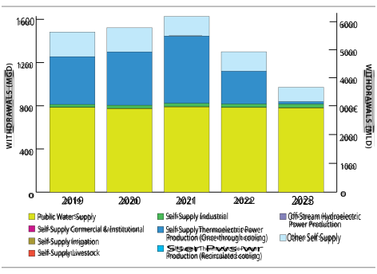**Figure 14.** Illinois water withdrawals by sector over the past five years 

34 

Annual Report of the Great Lakes Regional Water Use Database Representing 2023 Water Use Data 

A total of 915 mgd (3,464 mld) were diverted through the Illinois Diversion in 2023. The Illinois Diversion diverts water from Lake Michigan through the Chicago Area Waterway System (CAWS) into the Mississippi River watershed and is comprised of three elements: public water supply, stormwater runoff and direct diversion. The amount of water diverted for public water supply was 780 mgd (2,953 mld), with an additional 2.3 mgd (8.7 mld) diverted for both the self-supply commercial and institutional and selfsupply industrial sectors. 

Direct diversion occurs at three lakefront structures: the Chicago River Controlling Structure, the O’Brien Lock and Dam and the Wilmette Pumping Station. Direct diversion consists of four elements: lockage, leakage, discretionary flow, and navigational makeup. Lockage is used in moving vessels to and from Lake Michigan through locks and only occurs at the Chicago River Controlling Structure and the O’Brien Lock and Dam. Leakage is water estimated to pass through or around the three lakefront structures. Discretionary flow is used to dilute effluent from sewage discharges and improve water quality in the CAWS. Navigational makeup is used to maintain navigational depths in the CAWS; 133 mgd (502 mld) were diverted for this purpose in 2023. Consumptive use in Illinois is negligible; less than 0.01% of water withdrawn is lost through consumptive use, totaling about 0.1 mgd (0.4 mld) in 2023. 

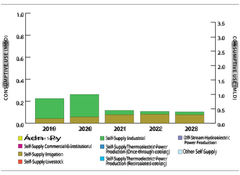**Figure 15** . Illinois consumptive use by sector over the past five years 

35 

Annual Report of the Great Lakes Regional Water Use Database Representing 2023 Water Use Data 

Data collected for this report came from the Illinois State Water Survey and from monthly pumpage reports and annual user reports submitted to the Illinois Department of Natural Resources. These data were generated with a 100% reporting compliance rate from permitted water withdrawal facilities. 

Year-to-year changes from 2022 water use by Illinois facilities include: 

- A 93% (281 mgd or 1,062 mld) decrease in water withdrawn for self-supply thermoelectric power production (once-through cooling), mainly because one power generating station closed in late 2022. 

- A 26% (47 mgd or 176 mld) decrease in the amount of water diverted from the O'Brien lock and dam and the Wilmette pumping station. 

36 

Annual Report of the Great Lakes Regional Water Use Database Representing 2023 Water Use Data 

**Table 11a.** Illinois 2023 Water Use Data Summary in mgd 

|Sector||Withdr |awals ||Diver |sions |Consumptive  |
|---|---|---|---|---|---|---|---|
||GLSW|OSW|GW|Total|Intrabasin|Interbasin|Use|
|Public Water Supply Self-Supply Commercial and Institutional|780 2|0 0|0 0|780 2|0 0|780 2|0 0|
|Self-Supply Irrigation |0|0|0|0|0|0|0|
|Self-Supply Livestock |0|0|0|0|0|0|0|
| Self-Supply Industrial|34|0|0|34|0|1|0|
|Self-Supply Thermoelectric Power Production (Once-through cooling)|23|0|0|23|0|0|0|
|Self-Supply Thermoelectric Power Production (Recirculated cooling) |0|0|0|0|0|0|0|
|Off-Stream Hydroelectric Power Production|0|0|0|0|0|0|0|
|In-Stream Hydroelectric Water Use |0|0|0|0|0|0|0|
|Other Self Supply|133|0|0|133|0|133|0|
|Total|971|0|0|971|0|915|0|

_In millions of gallons per day; Water Sources: Great Lakes surface water (GLSW), other surface water (OSW) and groundwater (GW); totals may not sum exactly due to rounding._ 

**Table 11b.** Illinois 2023 Water Use Data Summary in mld 

|||Withdr|awals||Dive|rsions|Consumptive|
|---|---|---|---|---|---|---|---|
|Sector|GLSW|OSW|GW|Total|Intrabasi|nInterbasin|Use|
|Public Water Supply|2,953|0|0|2,953|0|2,953|0|
| Self-Supply Commercial and Institutional|7|0|0|7|0|7|0|
|Self-Supply Irrigation|0|0|0|1|0|0|0|
| Self-Supply Livestock|0|0|0|0|0|0|0|
| Self-Supply Industrial|130|0|0|130|0|2|0|
| Self-Supply Thermoelectric Power Production (Once-through cooling)|85|0|0|85|0|0|0|
|Self-Supply Thermoelectric Power Production (Recirculated cooling)|0|0|0|0|0|0|0|
| Off-Stream Hydroelectric Power Production|0|0|0|0|0|0|0|
|In-Stream Hydroelectric Water Use|0|0|0|0|0|0|0|
| Other Self Supply|502|0|0|502|0|502|0|
|Total|3,677|0|0|3,677|0|3,464|0|

_In millions of liters per day; Water Sources: Great Lakes surface water (GLSW), other surface water (OSW) and groundwater (GW); totals may not sum exactly due to rounding._ 

37 

Annual Report of the Great Lakes Regional Water Use Database Representing 2023 Water Use Data 

### Indiana 

The state of Indiana uses the water resources of the Lake Michigan and Lake Erie watersheds. Indiana’s portion of the Lake Michigan watershed encompasses a total of 241 square miles. Four Indiana counties lie partially within the Lake Michigan watershed, but three (Lake, Porter and LaPorte counties) constitute more than 99.5% of its land area. Abundant freshwater from Lake Michigan has promoted the development of an extensive urban and industrial belt along Indiana’s coastline. Water supplies in Indiana’s noncoastal counties in the Lake Michigan watershed are drawn primarily from groundwater. Indiana also shares a portion of the Maumee River watershed that flows into Lake Erie. The Maumee River watershed encompasses 1,283 square miles of northeast Indiana. Six Indiana counties lie partially within this watershed. 

In 2023, reported water withdrawals from the basin for Indiana totaled 1,277 mgd (4,835 mld), representing a 14% decrease from 2022 withdrawals (1,486 mgd or 5,624 mld). The largest withdrawals were used for the self-supply industrial (1,011 mgd or 3,829 mld) and public water supply (164 mgd or 622 mld) sectors; together, these two sectors made up 92% of Indiana’s total water withdrawals. 

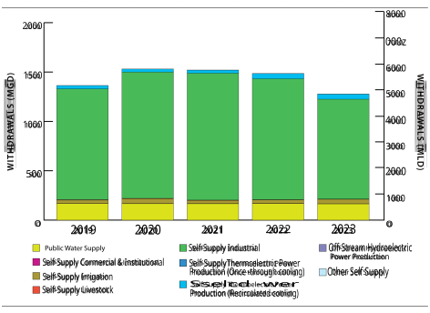**Figure 16.** Indiana water withdrawals by sector over the past five years 

38 

Annual Report of the Great Lakes Regional Water Use Database Representing 2023 Water Use Data 

The total reported interbasin diversion amount for Indiana was 82 mgd (311 mld). Because a 65-squaremile portion of Indiana drains into the Illinois River (as a result of the Illinois Diversion), water transferred from the Lake Michigan watershed into this area is considered a diversion of water from the Great LakesSt. Lawrence River Basin. Most reported diversions for Indiana (49 mgd or 185 mld) were distributed for public water supply purposes from Lake Michigan surface water and discharged to the Illinois Diversion area. Other diversions for public supply included a 1.3 mgd (5 mld) diversion from groundwater in the Lake Michigan watershed. The industrial sector comprised 24 mgd (91 mld) of the reported diversion from the Lake Michigan watershed into the Illinois River. 

In the Lake Erie watershed, a portion of the city of Fort Wayne’s public water supply distribution system is outside of the Great Lakes basin in the Upper Wabash watershed. The water distributed through that portion of the system (about 8 mgd or 30 mld from other surface water) was reported as a diversion from the Lake Erie watershed. 

Consumptive use in Indiana totaled 259 mgd (980 mld) in 2023, with the self-supply industrial sector in the Lake Michigan watershed (186 mgd or 702 mld) representing 72% of all consumptive use. 

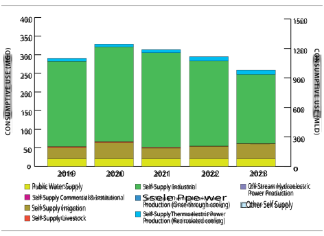**Figure 17.** Indiana consumptive use by sector over the past five years 

39 

Annual Report of the Great Lakes Regional Water Use Database Representing 2023 Water Use Data 

Data collected for this report came from the Indiana Department of Natural Resources. These data were generated from permitted water withdrawal facilities with reporting compliance rates ranging from 82 to 100% depending on the water use sector. Data were not estimated for facilities that did not report. Indiana does not require in-stream hydroelectric water users to register or report their water use. 

Year-to-year changes from 2022 water use by Indiana facilities include: 

- A 21% (8 mgd or 30 mld) increase in the self-supply irrigation sector, particularly from Lake Michigan groundwater, though this increase is not attributable to any specific facility. 

- A 17% (212 mgd or 804 mld) decrease in the self-supply industrial sector, mainly from Lake Michigan surface water withdrawals. 

40 

Annual Report of the Great Lakes Regional Water Use Database Representing 2023 Water Use Data 

**Table 12a.** Indiana 2023 Water Use Data Summary in mgd 

|Sector||Withd|rawals||Diver|sions|Consumptive |
|---|---|---|---|---|---|---|---|
||GLSW|OSW|GW|Total|Intrabasin|Interbasin|Use|
|Public Water Supply |85|36|44|164|0|58|20|
| Self-Supply Commercial and Institutional|0|0|1|1|0|0|0|
|Self-Supply Irrigation|0|5|40|45|0|0|40|
|Self-Supply Livestock|0|0|2|2|0|0|1|
|Self-Supply Industrial|995|8|9|1,011|0|24|186|
|Self-Supply Thermoelectric Power Production (Once-through cooling)|0|0|0|0|0|0|0|
|Self-Supply Thermoelectric Power Production (Recirculated cooling) |12|38|2|52|0|0|12|
|Off-Stream Hydroelectric Power Production|0|0|0|0|0|0|0|
|In-Stream Hydroelectric Water Use|0|0|0|0|0|0|0|
|Other Self Supply|0|0|1|1|0|0|0|
|Total|1,091|87|99|1,277|0|82|259|

_In millions of gallons per day; Water Sources: Great Lakes surface water (GLSW), other surface water (OSW) and groundwater (GW); totals may not sum exactly due to rounding._ 

**Table 12b.** Indiana 2023 Water Use Data Summary in mld 

|St||Withd|rawals||Dive|rsions|Consumptive|
|---|---|---|---|---|---|---|---|
|ecor|GLSW|OSW|GW|Total|Intrabasi|nInterbasin|Use|
|Public Water Supply |320|135|167|622|0|220|76|
| Self-Supply Commercial and Institutional|0|0|5|5|0|0|1|
|Self-Supply Irrigation|0|20|150|170|0|0|153|
| Self-Supply Livestock|0|0|9|9|0|0|3|
| Self-Supply Industrial|3,765|30|34|3,829|0|91|702|
|Self-Supply Thermoelectric Power Production (Once-through cooling)|0|0|0|0|0|0|0|
|Self-Supply Thermoelectric Power Production (Recirculated cooling) |45|144|7|196|0|0|45|
| Off-Stream Hydroelectric Power Production|0|0|0|0|0|0|0|
|In-Stream Hydroelectric Water Use|0|0|0|0|0|0|0|
| Other Self Supply|0|0|3|3|0|0|0|
|Total|4,130|330|376|4,835|0|311|980|

_In millions of liters per day; Water Sources: Great Lakes surface water (GLSW), other surface water (OSW) and groundwater (GW); totals may not sum exactly due to rounding._ 

41 

Annual Report of the Great Lakes Regional Water Use Database Representing 2023 Water Use Data 

### Michigan 

Home to more than 10 million people, Michigan borders four of the Great Lakes (Superior, Michigan, Huron and Erie). Virtually the entire land area of the state lies within the Great Lakes basin and Michigan has over 3,200 miles of Great Lakes shoreline – more freshwater coastline than any other state.18 

In 2023, reported water withdrawals from the basin for Michigan totaled 7,254 mgd (27,461 mld), representing a more than 8% decrease from 2022 withdrawals (7,924 mgd or 29,995 mld). The largest water use was for the self-supply thermoelectric power production (once-through cooling) sector which withdrew 5,316 mgd (20,125 mld), constituting about 73% of Michigan’s total withdrawal. Over 49% of the total withdrawal amount (3,584 mgd or 13,569 mld) came from the Lake Michigan watershed, mainly used for thermoelectric power production. Another 45% of Michigan’s total withdrawal amount came from the Lake Erie watershed (3,257 mgd or 12,329 mld), followed by the Lake Huron watershed at 5% (383 mgd or 1,449 mld) and the Lake Superior watershed at 0.4% (30 mgd or 113 mld). 

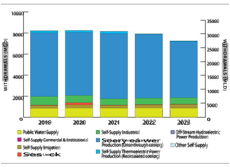**Figure 18** . Michigan water withdrawals by sector over the past five years 

> 18 National Oceanic and Atmospheric Administration (NOAA) Office for Coastal Management, Shoreline Mileage of the United States. https://coast.noaa.gov/data/docs/states/shorelines.pdf 

42 

Annual Report of the Great Lakes Regional Water Use Database Representing 2023 Water Use Data 

Consumptive use in Michigan totaled 535 mgd or 2,026 mld (approximately 7% of total withdrawals) in 2023, with self-supply irrigation being the largest contributor to consumptive use at 293 mgd (1,108 mld). 

**Figure 19** . Michigan consumptive use by sector over the past five years 

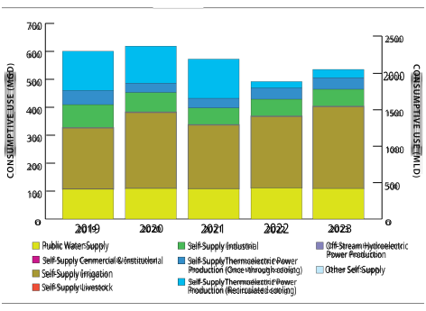Data collected for this report came from user reports to the Michigan Department of Environment, Great Lakes, and Energy, either directly or via the Michigan Department of Agriculture and Rural Development. These data were generated with estimated reporting compliance rates ranging from 85-100% of total water users, depending on the water use sector. Water use for both in-stream and off-stream hydroelectric power generation is exempt from reporting requirements under Michigan statute. 

Year-to-year changes from 2022 water use by Michigan facilities include: 

- A 12% (722 mgd or 2,734 mld) decrease in withdrawals for thermoelectric power production (oncethrough cooling), primarily due to the decommissioning of two power plants in the Lake Erie watershed. 

- A 21% (59 mgd or 222 mld) increase in self-supply irrigation withdrawals, and an accompanying 15% increase in consumptive use (37 mgd or 141 mld), largely due to the addition of over 100 threshold facilities reporting in this sector in 2023. 

43 

Annual Report of the Great Lakes Regional Water Use Database Representing 2023 Water Use Data 

**Table 13a.** Michigan 2023 Water Use Data Summary in mgd 

|St||Withd|rawals||Diver|sions|Consumptive |
|---|---|---|---|---|---|---|---|
|ecor|GLSW|OSW|GW|Total|Intrabasin|Interbasin|Use|
|Public Water Supply Self-Supply Commercial and Institutional|665 0|12 1|196 3|874 4|0 0|0 0|109 0|
|Self-Supply Irrigation|1|77|265|342|0|0|293|
| Self-Supply Livestock|0|9|16|26|0|0|1|
| Self-Supply Industrial|178|331|101|610|0|0|61|
|Self-Supply Thermoelectric Power Production (Once-through cooling)|5,025|291|1|5,316|0|0|41|
|Self-Supply Thermoelectric Power Production (Recirculated cooling) |59|4|2|65|0|0|30|
| Off-Stream Hydroelectric Power Production|0|0|0|0|0|0|0|
|In-Stream Hydroelectric Water Use |0|0|0|0|0|0|0|
| Other Self Supply|0|3|13|17|0|0|0|
| Total|5,928|729|598|7,254|0|0|535|

_In millions of gallons per day; Water Sources: Great Lakes surface water (GLSW), other surface water (OSW) and groundwater (GW); totals may not sum exactly due to rounding._ 

**Table 13b.** Michigan 2023 Water Use Data Summary in mld 

|St||Withd|rawals||Diver|sions|Consumptive|
|---|---|---|---|---|---|---|---|
|ecor|GLSW|OSW|GW|Total|Intrabasin|Interbasin|Use|
|Public Water Supply|2,518|47|742|3,307|0|0|413|
| Self-Supply Commercial and Institutional|2|5|10|17|0|0|0|
|Self-Supply Irrigation|2|290|1,004|1,296|0|0|1,108|
| Self-Supply Livestock|0|36|62|86|0|0|5|
| Self-Supply Industrial|672|1,253|384|2,309|0|0|231|
| Self-Supply Thermoelectric Power Production (Once-through cooling)|19,020|1,100|4|20,125|0|0|157|
|Self-Supply Thermoelectric Power Production (Recirculated cooling) |223|16|8|247|0|0|112|
| Off-Stream Hydroelectric Power Production|0|0|0|0|0|0|0|
|In-Stream Hydroelectric Water Use|0|0|0|0|0|0|0|
| Other Self Supply|2|12|49|63|0|0|0|
|Total|22,440|2,759|2,262|27,461|0|0|2,026|

_In millions of liters per day; Water Sources: Great Lakes surface water (GLSW), other surface water (OSW) and groundwater (GW); totals may not sum exactly due to rounding._ 

44 

Annual Report of the Great Lakes Regional Water Use Database Representing 2023 Water Use Data 

### Minnesota 

The Minnesota portion of the Lake Superior watershed encompasses approximately 6,800 square miles.19 Major river watersheds in the basin include the Cloquet, Nemadji and St. Louis River systems, as well as the north shore tributaries to Lake Superior. 

Excluding in-stream hydroelectric water use (1,656 mgd or 6,269 mld), reported water withdrawals from the basin for Minnesota totaled 1,710 mgd (6,474 mld) in 2023, representing a 12% decrease from the total withdrawal in 2022 (1,939 mgd or 7,341 mld). This decrease in total withdrawals is primarily due to a decrease in water used for off-stream hydroelectric power production, which was the sector with the greatest withdrawal (1,454 mgd or 5,504 mld). The second largest water use was for the self-supply industrial sector at 150 mgd (567 mld). 

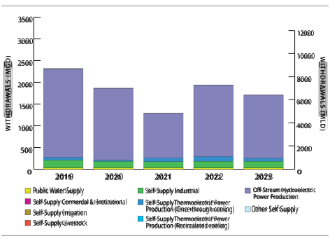**Figure 20** . Minnesota water withdrawals by sector over the past five years (excluding in-stream hydroelectric water use) 

Almost 94% of total withdrawals came from other surface water within the Lake Superior watershed (1,600 mgd or 6,057 mld), while just over 6% (105 mgd or 399 mld) came directly from Lake Superior. Less than 0.3% of withdrawals (5 mgd or 18 mld) were from groundwater. The large relative use of other surface water comes from water withdrawals for off-stream hydroelectric power production along the St. Louis River. 

> 19 Minnesota Pollution Control Agency. https://www.pca.state.mn.us/water/watersheds 

45 

Annual Report of the Great Lakes Regional Water Use Database Representing 2023 Water Use Data 

The total reported interbasin diversion amount of 12 mgd (45 mld) was almost exclusively for self-supply industrial purposes. A small amount of the outgoing diversion (0.001 mgd or 0.004 mld) was also reported for the self-supply irrigation sector. Consumptive use in Minnesota totaled 20 mgd (74 mld) in 2023, the majority of which was for industrial purposes (15 mgd or 57 mld). 

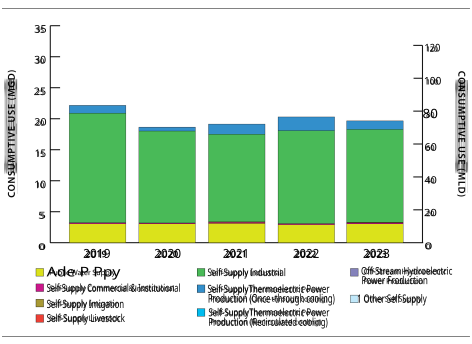**Figure 21** . Minnesota consumptive use by sector over the past five years 

The water use data were provided by the Minnesota Department of Natural Resources, which collected measured water use data from water withdrawal permit holders with 100% reporting compliance from permitted water withdrawal facilities. 

Year-to-year changes from 2022 water use by Minnesota facilities include: 

- An 11% (189 mgd or 714 mld) decrease in water withdrawals for off-stream hydroelectric power production, mainly due to normal fluctuations. 

- A 38% (42 mgd or 159 mld) decrease in water withdrawals for thermoelectric power production (once-through cooling), mainly because withdrawals in this sector were unusually high relative to the last five years in 2022. 

46 

Annual Report of the Great Lakes Regional Water Use Database Representing 2023 Water Use Data 

**Table 14a.** Minnesota 2023 Water Use Data Summary in mgd 

|Sector||Withdr |awals ||Diver |sions |Consumptive  |
|---|---|---|---|---|---|---|---|
||GLSW|OSW|GW|Total|Intrabasin|Interbasin|Use|
|Public Water Supply Self-Supply Commercial and Institutional|25 2|1 0|5 0|30 2|0 0|0 0|3 0|
|Self-Supply Irrigation |0|0|0|0|0|0|0|
|Self-Supply Livestock|0|0|0|0|0|0|0|
| Self-Supply Industrial|46|104|0|150|0|12|15|
|Self-Supply Thermoelectric Power Production (Once-through cooling)|33|35|0|69|0|0|1|
|Self-Supply Thermoelectric Power Production (Recirculated cooling) |0|0|0|0|0|0|0|
| Off-Stream Hydroelectric Power Production|0|1,454|0|1,454|0|0|0|
|In-Stream Hydroelectric Water Use |0|1,656|0|1,656|0|0|0|
|Other Self Supply|0|6|0|6|0|0|0|
|Total|105|3,256|5|3,366|0|12|20|

_In millions of gallons per day; Water Sources: Great Lakes surface water (GLSW), other surface water (OSW) and groundwater (GW); totals may not sum exactly due to rounding._ 

**Table 14b.** Minnesota 2023 Water Use Data Summary in mld 

|St||Withdr|awals||Diver|sions|Consumptive|
|---|---|---|---|---|---|---|---|
|ecor|GLSW|OSW|GW|Total|Intrabasin|Interbasin|Use|
|Public Water Supply|93|5|17|115|0|0|12|
| Self-Supply Commercial and Institutional|6|1|0|7|0|0|1|
|Self-Supply Irrigation|0|0|0|0|0|0|0|
| Self-Supply Livestock|0|0|0|0|0|0|0|
| Self-Supply Industrial|173|393|0|567|0|45|57|
|Self-Supply Thermoelectric Power Production (Once-through cooling)|127|132|1|259|0|0|5|
|Self-Supply Thermoelectric Power Production (Recirculated cooling) Off-Stream Hydroelectric Power Production|0 0|0 5,504|0 0|0 5,504|0 0|0 0|0 0|
|In-Stream Hydroelectric Water Use|0|6,269|0|6,269|0|0|0|
| Other Self Supply|0|22|0|22|0|0|0|
|Total|66ε|12,326|18|12,743|0|45|74|

_In millions of liters per day; Water Sources: Great Lakes surface water (GLSW), other surface water (OSW) and groundwater (GW); totals may not sum exactly due to rounding._ 

47 

Annual Report of the Great Lakes Regional Water Use Database Representing 2023 Water Use Data 

### New York 

Approximately 80% of New York state’s fresh surface water, over 700 miles of shoreline, and nearly 48% of New York’s land area are contained in the watersheds of Lake Erie, Lake Ontario and the St. Lawrence River—including the Lake Champlain and Lake George watersheds. More than four million New Yorkers depend on the fresh water of these watersheds for drinking water.20 

Excluding in-stream hydroelectric water use (2,178,908 mgd or 8,248,064 mld),21 reported water withdrawals from the basin for New York totaled 3,235 mgd (12,244 mld) in 2023, representing a less than 1% decrease from 2022 withdrawals (3,262 mgd or 12,349 mld). New York facilities withdrew the most water from the Lake Ontario watershed, making up 86% of New York’s total withdrawal from the basin at 2,777 mgd (10,511 mld). 

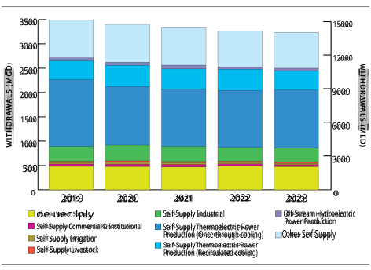**Figure 22** . New York water withdrawals by sector over the past five years (excluding in-stream hydroelectric water use) 

> 20 Great Lakes Basin Advisory Council. 2010. Our Great Lakes Water Resources: Conserving and Protecting Our Water Today for Use Tomorrow Final Report. http://www.dec.ny.gov/docs/regions_pdf/glbacfrpt.pdf 

> 21 Because of an updated calculation method, withdrawals for in-stream hydroelectric power production in New York will appear to be much higher in 2023 than in previous years. In 2022, this value should be 2,133,792 mgd rather than 218,816 mgd as was reported in the 2022 Annual Report. 

48 

Annual Report of the Great Lakes Regional Water Use Database Representing 2023 Water Use Data 

The self-supply thermoelectric power production sectors (both once-through and recirculated cooling) withdrew 1,587 mgd (6,008 mld), constituting 49% of New York’s total withdrawal amount in 2023. Other self-supply was the next largest water use sector, withdrawing 736 mgd (2,784 mld) and accounting for 23% of total withdrawals. Excluding in-stream hydroelectric power production, Great Lakes surface water was the primary source of water for the Lake Erie and Lake Ontario watersheds, while other surface water was the primary source of water for the St. Lawrence River watershed. 

The 2023 net total interbasin diversion amount for New York was 43 mgd (163 mld), the majority of which (32 mgd or 121 mld) was from Lake Ontario for the Erie Barge Canal. The balance of the diversion, 11 mgd or 41 mld, was for public supply. Consumptive use in New York totaled 240 mgd (907 mld) in 2023, with the largest uses attributed to the self-supply industrial sector at 65 mgd (246 mld) and public water supply at 58 mgd (218 mld). 

##### 300 

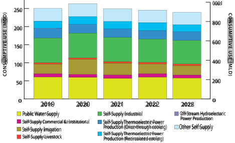**Figure 23** . New York consumptive use by sector over the past five years 

The water use data were provided by the New York State Department of Environmental Conservation which collected water use data with 100% reporting compliance from permitted water withdrawal facilities. New York has focused on enhanced permit management and QA/QC practices, achieving 100% reporting compliance for all sectors among facilities with system capacities above the regulatory threshold each year since 2020. New York’s five-year implementation of initial permits for nonpublic water withdrawals was completed in 2018. New York State has permitted public water supplies since 1905. The permits include 

49 

Annual Report of the Great Lakes Regional Water Use Database Representing 2023 Water Use Data 

an ongoing requirement to report water use annually, which should support continued adherence in compliance. 

Additionally, reporting facilities are required to complete a water conservation program and corresponding report section that includes conservation and efficiency measures. These measures include source metering, water auditing, leak detection and repair, recycling and reuse and reductions during periods of drought. 

Year-to-year changes from 2022 water use by New York facilities include: 

- A 10% (46 mgd or 174 mld) decrease in water withdrawals for the self-supply thermoelectric power production (recirculated cooling) sector due to regular fluctuations in this sector. 

- A 17% (8 mgd or 30 mld) increase in water withdrawals for off-stream hydroelectric power production due to regular fluctuations in this sector. 

50 

Annual Report of the Great Lakes Regional Water Use Database Representing 2023 Water Use Data 

**Table 15a.** New York 2023 Water Use Data Summary in mgd 

|Sector||Withdr|awals ||Diver |sions |Consumptive  |
|---|---|---|---|---|---|---|---|
||GLSW|OSW|GW|Total|Intrabasin|Interbasin|Use|
|Public Water Supply |294|166|16|476|0|11|58|
|Self-Supply Commercial and Institutional |0|39|1|40|0|0|8|
|Self-Supply Irrigation|0|27|1|29|0|0|26|
| Self-Supply Livestock|0|22|3|25|0|0|5|
|Self-Supply Industrial|121|162|5|288|0|0|65|
|Self-Supply Thermoelectric Power Production (Once-through cooling)|1,089|105|0|1,194|0|0|24|
|Self-Supply Thermoelectric Power Production (Recirculated cooling) |393|0|0|393|0|0|20|
|Off-Stream Hydroelectric Power Production|0|54|0|54|0|0|0|
|In-Stream Hydroelectric Water Use |2,098,000|80,908|0|2,178,908|0|0|0|
|Other Self Supply|0|736|0|736|0|32|34|
|Total|2,099,897|82,220|26|2,182,143|0|43|240|

_In millions of gallons per day; Water Sources: Great Lakes surface water (GLSW), other surface water (OSW) and groundwater (GW); totals may not sum exactly due to rounding._ 

**Table 15b.** New York 2023 Water Use Data Summary in mld 

|Sector||Withdr|awals||Diver |sions |Consumptive  |
|---|---|---|---|---|---|---|---|
||GLSW|OSW|GW|Total|Intrabasin|Interbasin|Use|
|Public Water Supply Self-Supply Commercial and Institutional|1,112 0|628 148|62 3|1,802 150|0 0|41 0|218 31|
|Self-Supply Irrigation|1|104|4|109|0|0|98|
|Self-Supply Livestock|0|85|10|95|0|0|17|
| Self-Supply Industrial|457|613|21|1,091|0|0|246|
|Self-Supply Thermoelectric Power Production (Once-through cooling)|4,121|399|0|4,520|0|0|90|
|Self-Supply Thermoelectric Power Production (Recirculated cooling) |1,488|0|0|1,488|0|0|74|
|Off-Stream Hydroelectric Power Production|0|204|0|204|0|0|0|
|In-Stream Hydroelectric Water Use|7,941,794|306,270|0|8,248,064|0|0|0|
| Other Self Supply| 0| 2,784|0|2,784|0|121|130|
|Total|7,948,974|311,236|66|8,260,308|0|163|907|

_In millions of liters per day; Water Sources: Great Lakes surface water (GLSW), other surface water (OSW) and groundwater (GW); totals may not sum exactly due to rounding._ 

51 

Annual Report of the Great Lakes Regional Water Use Database Representing 2023 Water Use Data 

### Ohio 

Ohio’s portion of the Lake Erie watershed drains 11,649 square miles and is home to 4.65 million people. Ohio’s 312-mile shoreline includes the cities of Toledo, Sandusky and Cleveland. Agricultural row crops account for 59% of the land use in the Ohio watersheds draining to Lake Erie, followed by urban residential and commercial land use at a combined 16%. Another 16% are forested lands and wetlands, and pastureland makes up another 5% of total land use.22 

In 2023, reported water withdrawals from the basin for Ohio totaled 1,079 mgd (4,084 mld), representing a 6% decrease from total 2022 withdrawals (1,148 mgd or 4,346 mld). The primary water use sectors were public water supply at 506 mgd or 1,916 mld (47% of total withdrawals), and self-supply thermoelectric power production (once-through and recirculated cooling) at 320 mgd or 1,213 mld (30% of total withdrawals). Lake Erie surface water was the source for 55% of Ohio’s total withdrawal amount. However, within specific sectors, other surface water was the predominant source, comprising 89% of self-supply irrigation water withdrawals and 89% of self-supply thermoelectric power production (once-through cooling) water withdrawals. 

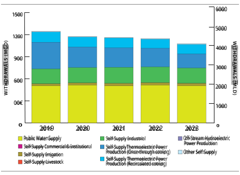**Figure 24.** Ohio water withdrawals by sector over the past five years 

> 22 Ohio Environmental Protection Agency. 2010. Ohio Lake Erie Phosphorus Task Force Final Report. 

> http://www.epa.ohio.gov/portals/35/lakeerie/ptaskforce/Task_Force_Final_Report_April_2010.pdf 

52 

Annual Report of the Great Lakes Regional Water Use Database Representing 2023 Water Use Data 

Ohio’s net total diversion amount was 25 mgd (96 mld) into the Lake Erie watershed.23 Diversions out of the Lake Erie watershed totaled 11 mgd (43 mld), all for public water supply purpose. They were offset by 37 mgd (138 mld) of incoming diversions, primarily associated with the other self-supply sector (26 mgd or 100 mld), and diversion returns. An additional small incoming diversion was reported for the self-supply livestock (0.2 mgd or 0.8 mld) sector. Consumptive use in Ohio totaled 125 mgd (473 mld) in 2023, with 61% attributed to public water supply. 

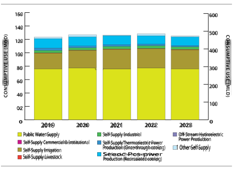**Figure 25** . Ohio consumptive use by sector over the past five years 

> 23 Incoming diversions are reported as negative values in the database and on tables. 

53 

Annual Report of the Great Lakes Regional Water Use Database Representing 2023 Water Use Data 

The water use data were provided by the Ohio Department of Natural Resources, which collected water use data with 100% reporting compliance from permitted water withdrawal facilities. 

Year-to-year changes from 2022 water use by Ohio facilities include: 

- A 24% (61 mgd or 231 mld) decrease in the self-supply thermoelectric power production (oncethrough cooling) sector, primarily due to a 73% (56 mgd or 212 mld) decrease in Lake Erie surface water withdrawals as Ohio continues phasing out coal fired power plants. This change is part of a mostly steady decline of water use in this sector dating back at least to 2012 when withdrawals totaled 1,434 mgd (5,429 mld). 

- A 2% (7 mgd or 28 mld) decrease in Lake Erie surface water used for public supply; while relatively small, this change comes as Governor DeWine's H2Ohio initiative is providing funds to public water supply systems – many in northeast Ohio within the Lake Erie basin – to improve their infrastructure and prevent water loss. 

54 

Annual Report of the Great Lakes Regional Water Use Database Representing 2023 Water Use Data 

**Table 16a.** Ohio 2023 Water Use Data Summary in mgd 

|Sector||Withd|rawals||Diver |sions |Consumptive  |
|---|---|---|---|---|---|---|---|
||GLSW|OSW|GW|Total|Intrabasin|Interbasin|Use|
|Public Water Supply |376|100|31|506|0|1|76|
| Self-Supply Commercial and Institutional|0|0|0|0|0|0|0|
|Self-Supply Irrigation|1|28|3|31|0|0|28|
|Self-Supply Livestock|0|0|1|1|0|0|1|
|Self-Supply Industrial|65|100|43|208|0|0|4|
|Self-Supply Thermoelectric Power Production (Once-through cooling)|21|171|0|192|0|0|2|
|Self-Supply Thermoelectric Power Production (Recirculated cooling) |129|0|0|129|0|0|13|
|Off-Stream Hydroelectric Power Production|0|0|0|0|0|0|0|
|In-Stream Hydroelectric Water Use |0|0|0|0|0|0|0|
|Other Self Supply|4|4|4|12|0|-26|1|
|Total|595|402|82|1,079|0|-25|125|

_In millions of gallons per day; Water Sources: Great Lakes surface water (GLSW), other surface water (OSW) and groundwater (GW); totals may not sum exactly due to rounding._ 

**Table 16b.** Ohio 2023 Water Use Data Summary in mld 

|Sector||Withd|rawals||Dive|rsions|Consumptive |
|---|---|---|---|---|---|---|---|
||GLSW|OSW|GW|Total|Intrabasin|Interbasin|Use|
|Public Water Supply |1,423|378|116|1,916|0|5|287|
|Self-Supply Commercial and Institutional|1|0|0|1|0|0|0|
|Self-Supply Irrigation|2|106|11|119|0|0|107|
|Self-Supply Livestock|0|0|3|3|0|-1|2|
|Self-Supply Industrial|244|379|163|787|0|0|15|
|Self-Supply Thermoelectric Power Production (Once-through cooling)|79|646|0|725|0|0|7|
|Self-Supply Thermoelectric Power Production (Recirculated cooling) |487|0|0|487|0|0|49|
| Off-Stream Hydroelectric Power Production|0|0|0|0|0|0|0|
|In-Stream Hydroelectric Water Use |0|0|0|0|0|0|0|
|Other Self Supply|15|14|16|46|0|-100|5|
|Total|2,253|1,523|30€|4,084|0|-96|473|

_In millions of liters per day; Water Sources: Great Lakes surface water (GLSW), other surface water (OSW) and groundwater (GW); totals may not sum exactly due to rounding._ 

55 

Annual Report of the Great Lakes Regional Water Use Database Representing 2023 Water Use Data 

### Ontario 

More than 98% of Ontario residents live within the Great Lakes-St. Lawrence River basin. Ontario’s portion of the Great Lakes forms the longest freshwater coastline in the world, stretching more than 6,200 miles (10,000 kilometers) across five major watersheds in the Great Lakes-St. Lawrence River system: Lake Superior, Lake Huron, Lake Erie, Lake Ontario and the St. Lawrence River.24 

Excluding in-stream hydroelectric water use (254,836 mgd or 964,658 mld), reported water withdrawals from the basin for Ontario totaled 15,025 mgd or 56,875 mld in 2023, representing a 20% decrease from 2022 water withdrawals (18,717 mgd or 70,853 mld). Water used for self-supply thermoelectric power production (once-through cooling) accounted for 84% of this total withdrawal amount at 12,632 mgd (47,816 mld). The next largest withdrawals were for public water supply at 1,211 mgd (4,584 mld) and the self-supply industrial sector at 1,097 mgd (4,152 mld). 

Water withdrawals from the Lake Huron (7,233 mgd or 27,379 mld) and Lake Ontario (6,766 mgd or 25,613 mld) watersheds collectively accounted for about 93%of Ontario’s total withdrawal amount. Great Lakes surface water was the primary source for withdrawals in the Lake Ontario watershed, while other surface water was the primary source for withdrawals in the Lake Erie, Lake Huron, Lake Superior, and St. Lawrence River watersheds. 

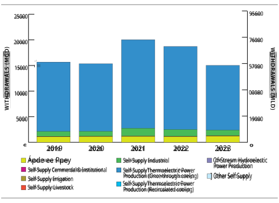**Figure 26.** Ontario water withdrawals by sector over the past five years 

24 Ontario’s Great Lakes Strategy, 2016. https://www.ontario.ca/page/ontarios-great-lakes-strategy 

56 

Annual Report of the Great Lakes Regional Water Use Database Representing 2023 Water Use Data 

No diversions out of the Great Lakes-St. Lawrence River basin were reported for Ontario in 2023, while 2,376 mgd (8,993 mld) of water was diverted into the Lake Superior basin,25 associated with the Long Lac and Ogoki diversions. This represents a decrease of 38% from Long Lac and Ogoki diversions in 2022. The Welland Canal is entirely within Ontario and functions as two intrabasin transfers (one out of the Lake Erie basin and one into the Lake Ontario basin). These transfers effectively cancel each other out, resulting in a net zero intrabasin transfer (meaning no water is lost from the Great Lakes basin). For more information about the volume of these transfers, see the Lake Erie basin section above. Similarly, additional intrabasin diversions for public drinking water supply between Lakes Huron, Erie and Ontario were reported but did not result in a net transfer. 

Consumptive use in Ontario totaled 372 mgd (1,409 mld) in 2023. The three water use sectors with the largest consumptive uses were public water supply at 145 mgd (550 mld), self-supply thermoelectric power production (once-through cooling) at 114 mgd (430 mld), and self-supply industrial at 102 mgd (387 mld). Consumptive use associated with intrabasin diversions for public water supply accounted for just under 2% of the total consumptive use at 6 mgd (24 mld). 

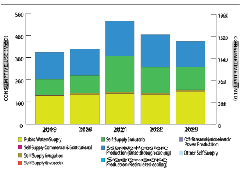**Figure 27.** Ontario consumptive use by sector over the past five years 

> 25 Incoming diversions are reported as negative values in the database and on tables. 

57 

Annual Report of the Great Lakes Regional Water Use Database Representing 2023 Water Use Data 

The water use data were provided by the Ontario Ministry of Natural Resources and the Ontario Ministry of the Environment, Conservation and Parks and were collected primarily through the provincial water taking and reporting system. Reporting compliance varied among water use sectors from 93-100%. 

Year-to-year changes from 2022 water use by Ontario facilities include: 

- A 22% (3,580 mgd or 13,554 mld) decrease in withdrawals for the self-supply thermoelectric power production (once-through cooling) sector, mainly due to the expiration of three large permits. 2023 saw withdrawal levels return closer to the longer-term average for this sector following two years of higher withdrawals, relative to the last five years. 

- A 17% (223 mgd or 842 mld) decrease in withdrawals for the self-supply industrial sector, largely due to high turnover of facilities in this sector meeting the reporting threshold. 

- A 10% (107 mgd or 404 mld) increase in withdrawals for the public water supply sector, primarily because the number of new takings outpaced the number of expired permits in 2023. 

58 

Annual Report of the Great Lakes Regional Water Use Database Representing 2023 Water Use Data 

**Table 17a.** Ontario 2023 Water Use Data Summary in mgd* 

|Sector||Withdr|awals||Dive |rsions |Consumptive  |
|---|---|---|---|---|---|---|---|
||GLSW|OSW|GW|Total|Intrabasi|nInterbasin|Use|
|Public Water Supply |673|431|107|1,211|0|0|145|
|Self-Supply Commercial and Institutional |0|3|1|5|0|0|1|
|Self-Supply Irrigation|1|9|1|12|0|0|10|
|Self-Supply Livestock|0|35|27|62|0|0|0|
|Self-Supply Industrial|278|685|133|1,097|0|0|102|
|Self-Supply Thermoelectric Power Production (Once-through cooling)|6,283|6,349|0|12,632|0|0|114|
|Self-Supply Thermoelectric Power Production (Recirculated cooling) |0|0|0|0|0|0|0|
|Off-Stream Hydroelectric Power ||||||||
|Production|0|0|0|0|0|0|0|
|In-Stream Hydroelectric Water Use |136,975|117,860|0|254,836|0|-2,376|0|
|Other Self Supply|0|3|4|7|0|0|0|
|Total|144,211|125,377|273|269,860|0|-2,376|372|

_In millions of gallons per day; Water Sources: Great Lakes surface water (GLSW), other surface water (OSW) and groundwater (GW); totals may not sum exactly due to rounding._ 

_*The intrabasin diversions reported effectively cancel each other out, resulting in a net zero intrabasin transfer. For more information about the volume of these transfers, see the Lake Watershed Summaries section above._ 

**Table 17b.** Ontario 2023 Water Use Data Summary in mld* 

|St||Withdr|awals||Dive|rsions|Consumptive|
|---|---|---|---|---|---|---|---|
|ecor|GLSW|OSW|GW|Total|Intrabasi|nInterbasin|Use|
|Public Water Supply|2,549|1,630|405|4,584|0|0|550|
| Self-Supply Commercial and Institutional|2|13|3|18|0|0|2|
|Self-Supply Irrigation|3|35|6|44|0|0|37|
| Self-Supply Livestock|0|134|100|235|0|0|2|
| Self-Supply Industrial|1,054|2,594|504|4,152|0|0|387|
|Self-Supply Thermoelectric Power Production (Once-through cooling)|23,782|24,034|0|47,816|0|0|430|
|Self-Supply Thermoelectric Power Production (Recirculated cooling)|0|0|0|0|0|0|0|
| Off-Stream Hydroelectric Power Production|0|0|0|0|0|0|0|
|In-Stream Hydroelectric Water Use |518,507|446,150|0|964,658|0|-8,993|0|
| Other Self Supply|0|12|14|27|0|0|0|
| Total|545,897|474,603|1,032|1,021,533|0|£66'8-|1,409|

_In millions of liters per day; Water Sources: Great Lakes surface water (GLSW), other surface water (OSW) and groundwater (GW); totals may not sum exactly due to rounding._ 

_*The intrabasin diversions reported effectively cancel each other out, resulting in a net zero intrabasin transfer. For more information about the volume of these transfers, see the Lake Watershed Summaries section above._ 

59 

Annual Report of the Great Lakes Regional Water Use Database Representing 2023 Water Use Data 

### Pennsylvania 

The Pennsylvania portion of the Lake Erie watershed spans 511 square miles and is home to approximately 237,000 people concentrated along the 77 miles of Lake Erie coastline.26 Pennsylvania also contains 99 square miles in the Lake Ontario basin, encompassing the headwaters of the Genesee River. Approximately 2,400 people live in Pennsylvania’s portion of the Lake Ontario basin. The largest land uses in Pennsylvania’s portion of the basin are agriculture and forest.27 

In 2023, reported water withdrawals from the basin for Pennsylvania totaled 28 mgd (105 mld), representing an 8% decrease from the 2022 reported withdrawal of 30 mgd (113 mld). Water withdrawals for public water supply totaled 25 mgd (94 mld), accounting for 90% of the total withdrawal amount. 

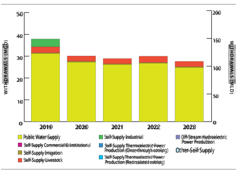**Figure 28.** Pennsylvania water withdrawals by sector over the past five years 

> 26 Pennsylvania Department of Environmental Protection Coastal Resources Management Program, https://www.dep.pa.gov/Business/Water/Compacts%20and%20Commissions/Coastal%20Resources%20Management%20Program/Pages/Aboutthe-Program.aspx 

> 27 Pennsylvania Department of Environmental Protection, Pennsylvania’s Watershed Regions: Great Lakes, http://files.dep.state.pa.us/Water/Division%20of%20Planning%20and%20Conservation/StateWaterPlan/WaterAtlas/05-great_lakes_region.pdf 

60 

Annual Report of the Great Lakes Regional Water Use Database Representing 2023 Water Use Data 

No diversions were reported in Pennsylvania in 2023. Consumptive use in Pennsylvania totaled 3 mgd (11 mld) in 2023. The public water supply sector made up the majority (84%) of the total consumptive use. 

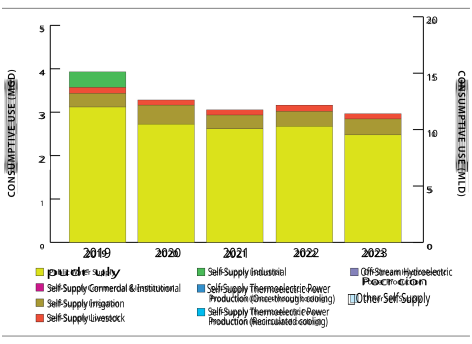**Figure 29.** Pennsylvania consumptive use by sector over the past five years 

The water use data were provided by the Pennsylvania Department of Environmental Protection, which collected water use data with 100% reporting compliance from permitted water withdrawal facilities. Depending upon the sector, withdrawals were metered, partially metered, or calculated. 

Year-to-year changes from 2022 water use by Pennsylvania facilities include: 

- A 7% (2 mgd or 7 mld) decrease in water withdrawn for public supply due to normal fluctuations in use for this sector. 

- A 15% (0.43 mgd or 1.6 mld) decrease in water withdrawn for the self-supply livestock sector due to normal fluctuations in use for this sector. 

61 

Annual Report of the Great Lakes Regional Water Use Database Representing 2023 Water Use Data 

**Table 18a.** Pennsylvania 2023 Water Use Data Summary in mgd 

|Sector||Withd |rawals ||Diver |sions |Consumptive  |
|---|---|---|---|---|---|---|---|
||GLSW|OSW|GW|Total|Intrabasin|Interbasin|Use|
|Public Water Supply |23|0|2|25|0|0|2|
|Self-Supply Commercial and Institutional |0|0|0|0|0|0|0|
|Self-Supply Irrigation|0|0|0|0|0|0|0|
| Self-Supply Livestock|0|1|1|2|0|0|0|
|Self-Supply Industrial|0|0|0|0|0|0|0|
|Self-Supply Thermoelectric Power Production (Once-through cooling)|0|0|0|0|0|0|0|
|Self-Supply Thermoelectric Power Production (Recirculated cooling) |0|0|0|0|0|0|0|
|Off-Stream Hydroelectric Power ||||||||
| Production|0|0|0|0|0|0|0|
|In-Stream Hydroelectric Water Use |0|0|0|0|0|0|0|
|Other Self Supply|0|0|0|0|0|0|0|
|Total|23|2|3|28|0|0|3|

_In millions of gallons per day; Water Sources: Great Lakes surface water (GLSW), other surface water (OSW) and groundwater (GW); totals may not sum exactly due to rounding._ 

**Table 18b.** Pennsylvania 2023 Water Use Data Summary in mld 

|Sector||Withd|rawals||Diver |sions |Consumptive  |
|---|---|---|---|---|---|---|---|
||GLSW|OSW|GW|Total|Intrabasin|Interbasin|Use|
|Public Water Supply|88|0|6|94|0|0|9|
| Self-Supply Commercial and Institutional|0|0|0|0|0|0|0|
|Self-Supply Irrigation|0|1|0|2|0|0|1|
|Self-Supply Livestock|0|5|4|9|0|0|0|
|Self-Supply Industrial|0|0|0|0|0|0|0|
|Self-Supply Thermoelectric Power Production (Once-through cooling)|0|0|0|0|0|0|0|
|Self-Supply Thermoelectric Power Production (Recirculated cooling) |0|0|0|0|0|0|0|
| Off-Stream Hydroelectric Power Production|0|0|0|0|0|0|0|
|In-Stream Hydroelectric Water Use |0|0|0|0|0|0|0|
|Other Self Supply|0|0|0|0|0|0|0|
|Total|88|6|10|105|0|0|11|

_In millions of liters per day; Water Sources: Great Lakes surface water (GLSW), other surface water (OSW) and groundwater (GW); totals may not sum exactly due to rounding._ 

62 

Annual Report of the Great Lakes Regional Water Use Database Representing 2023 Water Use Data 

### Québec 

Much of Québec’s population lives in the Great Lakes-St. Lawrence River watershed. The portion of the St. Lawrence River included in the Great Lakes-St. Lawrence Basin Agreement territory includes the Montréal metropolitan area that represents nearly 50% of Québec’s population. Some of the tributaries with the greatest flow within that portion are the Outaouais (Ottawa) River, the Richelieu River and the St. François River. 

In 2023, reported water withdrawals from the basin for Québec totaled 1,158 mgd (4,384 mld), representing a 3% decrease from the 2022 withdrawal total of 1,198 mgd (4,536 mld). Public water supply made up 72% of total withdrawals at 828 mgd (3,135 mld), while the self-supply industrial sector made up 25% of the total at 290 mgd (1,099 mld). 

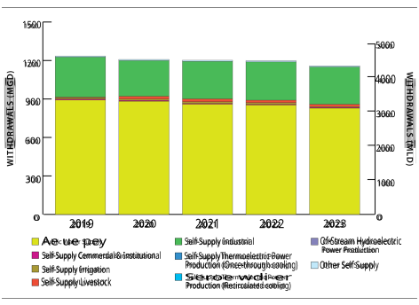**Figure 30.** Québec water withdrawals by sector over the past five years 

The total diversion amount was 2.7 mgd (10 mld) from the St. Lawrence River for public supply purposes. Consumptive use in Québec totaled 208 mgd (786 mld) in 2023, comprising 18% of the total withdrawal amount. The primary water use sectors contributing to the total consumptive use were public supply at 171 mgd (646 mld) and self-supply industrial at 27 mgd (103 mld). 

63 

Annual Report of the Great Lakes Regional Water Use Database Representing 2023 Water Use Data 

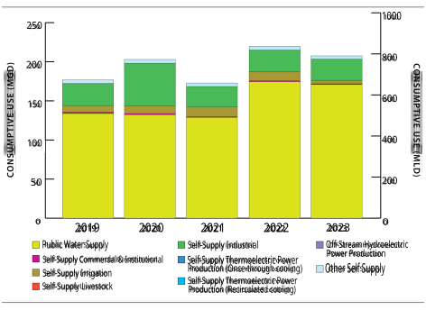**Figure 31.** Québec consumptive use by sector over the past five years 

In 2012, the province of Québec began its data collection program, which gathers estimated or metered water use data reported by water users. Québec began collecting water use reports from irrigation (agricultural users), livestock and aquaculture sectors in 2016. Québec reports that data quality and compliance rates are a continual focus for improvement. Compliance rates varied among water use sectors from 49% in the self-supply livestock sector to 95% for public water supply. 

Year-to-year changes from 2022 water use by Québec facilities include: 

- A 51% (7 mgd or 26 mld) decrease in water withdrawals for the self-supply irrigation sector, mainly due to the high volume of rain in summer 2023. 

- A 3% (25 mgd or 94 mld) decrease in withdrawals for public water supply due to normal fluctuations in this sector. 

- A 3% (23 mgd or 86 mld) decrease in withdrawals from St. Lawrence River surface water. While this change is relatively minor, such withdrawals have decreased by over 9% since 2018, declining steadily each year. 

64 

Annual Report of the Great Lakes Regional Water Use Database Representing 2023 Water Use Data 

**Table 19a.** Québec 2023 Water Use Data Summary in mgd* 

|Sector||Withd|rawals||Diver |sions |Consumptive  |
|---|---|---|---|---|---|---|---|
||GLSW|OSW|GW|Total|Intrabasin|Interbasin|Use|
|Public Water Supply |577|197|54|828|0|3|171|
|Self-Supply Commercial and Institutional |1|5|0|6|0|0|1|
|Self-Supply Irrigation|0|4|2|6|0|0|4|
|Self-Supply Livestock|0|15|3|18|0|0|0|
|Self-Supply Industrial|130|140|20|290|0|0|27|
|Self-Supply Thermoelectric Power Production (Once-through cooling)|0|0|0|0|0|0|0|
|Self-Supply Thermoelectric Power Production (Recirculated cooling) |0|0|0|0|0|0|0|
|Off-Stream Hydroelectric Power Production|0|0|0|0|0|0|0|
|In-Stream Hydroelectric Water Use |0|0|0|0|0|0|0|
|Other Self Supply|5|3|1|9|0|0|4|
|Total|713|365|80|1,158|0|3|208|

_In millions of gallons per day; Water Sources: Great Lakes surface water (GLSW), other surface water (OSW) and groundwater (GW); totals may not sum exactly due to rounding._ 

_*Québec does use water to produce hydroelectricity, but because it is not technically a withdrawal, water used for this purpose is not required to be reported to the Great Lakes Regional Water Use Database._ 

**Table 19b.** Québec 2023 Water Use Data Summary in mld* 

|Sector||Withd|rawals||Diver|sions|Consumptive |
|---|---|---|---|---|---|---|---|
||GLSW|OSW|GW|Total|Intrabasin|Interbasin|Use|
|Public Water Supply|2,185|746|204|3,135|0|10|646|
| Self-Supply Commercial and Institutional|2|20|0|22|0|0|4|
|Self-Supply Irrigation|1|17|7|25|0|0|17|
| Self-Supply Livestock|0|57|13|69|0|0|0|
| Self-Supply Industrial|493|532|74|1,099|0|0|103|
|Self-Supply Thermoelectric Power Production (Once-through cooling)|0|0|0|0|0|0|0|
|Self-Supply Thermoelectric Power Production (Recirculated cooling)|0|0|0|0|0|0|0|
| Off-Stream Hydroelectric Power||||||||
| Production|0|0|0|0|0|0|0|
|In-Stream Hydroelectric Water Use|0|0|0|0|0|0|0|
| Other Self Supply|19|12|3|35|0|0|16|
|Total|2,700|1,383|301|4,384|0|10|786|

_In millions of liters per day; Water Sources: Great Lakes surface water (GLSW), other surface water (OSW) and groundwater (GW); totals may not sum exactly due to rounding._ 

_*Québec does use water to produce hydroelectricity, but because it is not technically a withdrawal, water used for this purpose is not required to be reported to the Great Lakes Regional Water Use Database._ 

65 

Annual Report of the Great Lakes Regional Water Use Database Representing 2023 Water Use Data 

### Wisconsin 

Wisconsin has more than 1,000 miles of Great Lakes shoreline along Lake Michigan and Lake Superior. More than 25% of the state’s land area lies within the basin, where half the population of the state also lives. Over 1.6 million Wisconsin residents get their drinking water from Lake Michigan or Lake Superior.28 

In 2023, reported water withdrawals from the basin for Wisconsin totaled 3,696 mgd (13,992 mld), representing just over a 3% decrease from 2022 withdrawals (3,816 mgd or 14,447 mld). The Lake Michigan watershed comprised 99% of the total withdrawal amount, the majority of which were Lake Michigan surface water withdrawals. The primary water use sectors were self-supply thermoelectric power production (once-through cooling) at 86% of total withdrawals, and public water supply at 8.5% of withdrawals. 

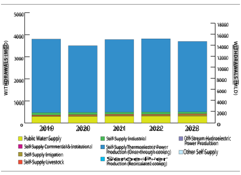**Figure 32.** Wisconsin water withdrawals by sector over the past five years 

The reported net diversion was 0.8 mgd (2.9 mld) into the Lake Michigan watershed. Diversions out of the Lake Michigan watershed totaled 7.8 mgd (30 mld), 98% of which were for public water supply purposes. 

> 28 Wisconsin Department of Natural Resources. 2019. https://storymaps.arcgis.com/stories/746865c012064b6e8f0a89a4affe6499 

66 

Annual Report of the Great Lakes Regional Water Use Database Representing 2023 Water Use Data 

Of the total diversion amount, 8.6 mgd (33 mld) were returned to the Lake Michigan basin, meaning more water was returned to Lake Michigan than was diverted out of it. In fall 2023, the city of Waukesha began diverting water from Lake Michigan, coinciding with a 15% increase in water diverted from Lake Michigan surface water for public supply. The Waukesha diversion returns all diverted water to Lake Michigan by discharging its treated wastewater to the Root River, a tributary of Lake Michigan.29 

Consumptive use in Wisconsin totaled 131 mgd (494 mld) in 2023, primarily coming from the self-supply irrigation, public water supply, and self-supply thermoelectric power production (once-through cooling) sectors. 

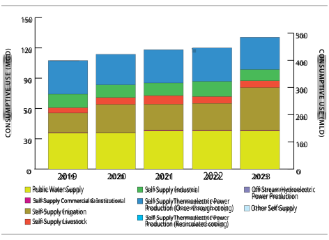**Figure 33.** Wisconsin consumptive use by sector over the past five years 

The water use data were provided by the Wisconsin Department of Natural Resources. Reporting compliance varied among water use sectors from 90-100%. Data were not estimated for the facilities that did not report water use. 

Year-to-year changes from 2022 water use by Wisconsin facilities include: 

> 29 Wisconsin Department of Natural Resources. City of Waukesha Diversion. 

67 

Annual Report of the Great Lakes Regional Water Use Database Representing 2023 Water Use Data 

- In October 2023, the city of Waukesha diversion began; the city diverted approximately 5 mgd from the Lake Michigan basin. All water diverted is returned to Lake Michigan. 

- A 59% (23 mgd or 85 mld) increase in water withdrawals for self-supply irrigation, primarily because 2023 was a drought year. This was the largest withdrawal for irrigation in Wisconsin since 2012. 

- A 16% (18 mgd or 67 mld) decrease in water withdrawals for self-supply industrial use, mainly because most facilities using other surface water in the Lake Michigan basin used less water in 2023 than in 2022. Industrial use in 2023 was also 16% below the average water withdrawal in this sector from 2012-2022. 

68 

Annual Report of the Great Lakes Regional Water Use Database Representing 2023 Water Use Data 

**Table 20a.** Wisconsin 2023 Water Use Data Summary in mgd 

|Sector||Withd|rawals||Diver |sions |Consumptive  |
|---|---|---|---|---|---|---|---|
||GLSW|OSW|GW|Total|Intrabasin|Interbasin|Use|
|Public Water Supply |245|21|47|314|0|-1|38|
|Self-Supply Commercial and Institutional |2|7|1|10|0|0|1|
|Self-Supply Irrigation|0|3|58|61|0|0|43|
|Self-Supply Livestock|0|13|17|29|0|0|7|
|Self-Supply Industrial|2|75|13|90|0|0|11|
|Self-Supply Thermoelectric Power Production (Once-through cooling)|3,037|153|0|3,190|0|0|32|
|Self-Supply Thermoelectric Power Production (Recirculated cooling) |0|0|0|0|0|0|0|
|Off-Stream Hydroelectric Power Production|0|0|0|0|0|0|0|
|In-Stream Hydroelectric Water Use |0|0|0|0|0|0|0|
|Other Self Supply|0|0|1|2|0|0|0|
|Total|3,287|272|138|3,696|0|-1|131|

_In millions of gallons per day; Water Sources: Great Lakes surface water (GLSW), other surface water (OSW) and groundwater (GW); totals may not sum exactly due to rounding._ 

**Table 20b.** Wisconsin 2023 Water Use Data Summary in mld 

|Sector||Withd|rawals||Diver|sions|Consumptive |
|---|---|---|---|---|---|---|---|
||GLSW|OSW|GW|Total|Intrabasin|Interbasin|Use|
|Public Water Supply Self-Supply Commercial and Institutional|928 7|81 26|179 5|1,188 33|0 0|-3 0|143 2|
|Self-Supply Irrigation|0|12|218|230|0|0|161|
| Self-Supply Livestock|0|48|64|111|0|0|26|
| Self-Supply Industrial|8|282|51|341|0|0|42|
|Self-Supply Thermoelectric Power Production (Once-through cooling)|11,498|579|0|12,077|0|0|121|
|Self-Supply Thermoelectric Power Production (Recirculated cooling)|0|0|0|0|0|0|0|
| Off-Stream Hydroelectric Power||||||||
| Production|0|0|0|0|0|0|0|
|In-Stream Hydroelectric Water Use|0|0|0|0|0|0|0|
| Other Self Supply|0|2|4|6|0|0|0|
|Total|12,441|1,030|521|13,992|0|-3|494|

_In millions of liters per day; Water Sources: Great Lakes surface water (GLSW), other surface water (OSW) and groundwater (GW); totals may not sum exactly due to rounding._ 

69 

Annual Report of the Great Lakes Regional Water Use Database Representing 2023 Water Use Data 

## Appendices 

### Appendix A. Water Use Sector Definitions 

#### **Public Water Supply** 

Water distributed to the public through a physically connected system of treatment, storage and distribution facilities serving a group of largely residential customers that may also serve industrial, commercial and other institutional operators. Water withdrawn directly from the basin and not through such a system shall not be considered to be used for Public Water Supply purposes. 

#### **Self-Supply Commercial and Institutional** 

Commercial uses include water used by motels, hotels, restaurants, office buildings and institutions, both civilian and military, that would not otherwise be considered Public Water Supplies. This category also includes water for mobile homes, hospitals, schools, air conditioning and other similar uses not covered under a public supply. In addition, this category includes amusement and recreational water uses such as snowmaking and water slides. 

#### **Self-Supply Irrigation** 

Water artificially applied on lands to assist in the growing of crops and pastures or in the maintenance of recreational lands, such as parks and golf courses. 

#### **Self-Supply Livestock** 

Water used by animals such as horses, cattle, sheep, goats, hogs and poultry. Water used in fish hatchery operations is also included under this category. 

#### **Self-Supply Industrial** 

Industrial water includes water used in the manufacture of metals, chemicals, paper, food and beverage, and other products, as well as water used for mining. Mining water use is that used in the extraction or washing of minerals, including solids, such as coal and ores, and liquids, such as crude petroleum and natural gas. Water used in quarrying and milling is also included in the industrial category. Brine extraction from oil and gas operations is not included. Withdrawals and consumptive uses for industrial and mining purposes (including dewatering operations) recorded under another category (e.g., public supply) will not be recorded here. Once initially reported, water used in a closed cycle (recirculation) will not be reported as a withdrawal. “Make-up water”1 will be reported once upon entering the system. Other situations should be evaluated on a case-by-case basis. 

#### **Self-Supply Thermoelectric Power Production (Once-through Cooling)** 

Cooling water and ancillary water use such as boiler make-up water and contact cooling water at electrical power generating facilities that use once-through cooling systems. Withdrawals and consumptive uses already recorded under another category (e.g., public supply) will not be reported here. 

> 1 For industrial boiler systems, make-up water is the raw water, softened water or demineralized water required for steam generation. 

> http://www.pdhcenter.com/courses/m165/m165content.pdf 

70 

Annual Report of the Great Lakes Regional Water Use Database Representing 2023 Water Use Data 

#### **Self-Supply Thermoelectric Power Production (Recirculated Cooling)** 

Cooling water and ancillary water use such as boiler make-up water and contact cooling water at electrical power generating facilities that use water recirculating cooling tower systems. This category also includes water used at Combined Cycle Gas Turbine (CCGT) power plants. Withdrawals and consumptive uses already recorded under another category (e.g., public supply) will not be reported here. Once initially reported, water used in a closed cycle (recirculation) will not be reported as a withdrawal. “Make-up water” will be reported once upon entering the system. 

#### **Off-Stream Hydroelectric Power Production** 

Water removed from a stream channel and used to drive turbines that generate electric power. This category also includes “off-stream use” for pumped-storage systems [e.g., reservoir storage] that return water to the source. 

#### **In-Stream Hydroelectric Water Use** 

This category includes “run of the river” use, which is not considered a water withdrawal or consumptive use. Reporting for this category is voluntary. 

#### **Other Self-Supply** 

Water used for purposes not reported in the above categories. Examples include, but are not limited to, withdrawals for fish/wildlife, environmental, navigation and water quality purposes. Specifically, this category includes water used for maintaining water levels for navigation, fish and wildlife habitat creation and enhancement (excluding fish hatchery operations included in the self-supply livestock sector), flow augmentation (or diversion), sanitation, pollution confinement, other water quality purposes and agricultural activities (services) other than those directly related to irrigation. 

71 

Annual Report of the Great Lakes Regional Water Use Database Representing 2023 Water Use Data 

### Appendix B. General Definitions from the Compact and Agreement 

**Basin or Great Lakes-St. Lawrence River Basin** means the watershed of the Great Lakes and the St. Lawrence River upstream from Trois-Rivières, Québec. 

**Consumptive Use** means that portion of the water withdrawn or withheld from the basin that is lost or otherwise not returned to the basin due to evaporation, incorporation into products or other processes. 

**Diversion** means a transfer of water from the basin into another watershed, or from the watershed of one of the Great Lakes into that of another by any means of transfer, including, but not limited to, a pipeline, canal, tunnel, aqueduct, channel, modification of the direction of a water course, a tanker ship, tanker truck or rail tanker, but does not apply to water that is used in the basin or a Great Lake watershed to manufacture or produce a product that is then transferred out of the basin or watershed. 

**Divert** has a corresponding meaning. 

**Withdrawal** means the taking of water from surface water or groundwater. 

**Source Watershed** means the watershed from which a withdrawal originates. If water is withdrawn directly from a Great Lake or from the St. Lawrence River, then the source watershed shall be considered to be the watershed of that Great Lake or the watershed of the St. Lawrence River, respectively. If water is withdrawn from the watershed of a stream that is a direct tributary to a Great Lake or a direct tributary to the St. Lawrence River, then the source watershed shall be considered to be the watershed of that Great Lake or the watershed of the St. Lawrence River, respectively, with a preference to the direct tributary stream watershed from which it was withdrawn. 

72 

Annual Report of the Great Lakes Regional Water Use Database Representing 2023 Water Use Data 

### Appendix C. Interim Cumulative Impact Assessment 

#### **Introduction** 

This interim cumulative impact assessment, as part of the 2023 Annual Water Use Report, covers the years 2022 and 2023 and was prepared to fulfill the requirements of the Great Lakes-St. Lawrence River Basin Sustainable Water Resources Agreement and the companion Great Lakes-St. Lawrence River Basin Water Resources Compact following an increase in net water losses from the basin of more than 50 million gallons per day (mgd) from 2022 to 2023. Water loss is defined as consumptive uses and diversions less return flow. It reflects water not being returned to the source watershed. A full cumulative impact assessment covering 2016 to 2020 has been developed by the Great Lakes St. Lawrence Governors & Premiers.1 An updated cumulative impact assessment covering 2021-2025 will be developed in the coming years. 

The approach used for this interim assessment is similar to that of the 2016-2020 Cumulative Impact Assessment. The analysis focuses on the hydrologic effects of consumptive uses and diversions on water supply and flow at both the watershed (i.e., lake basin) and Great Lakes-St. Lawrence River basin scales. Aspects of the water budget from 2022 and 2023 are provided and compared for the assessment, as described below. 

_1. Basin Inflows_ 

The inflows include annual averages for precipitation on the surface of the Great Lakes (obtained from the U.S. Army Corps of Engineers [USACE] monthly hydrologic data), surface water runoff to the Great Lakes (obtained from USACE monthly hydrologic data), incoming diversions (as reported to the Great Lakes Water Use Database), and connecting channel flows (obtained from USACE monthly hydrologic data) into each of the Great Lakes or the St. Lawrence River, except for Lake Superior which is the headwater to the system. Precipitation on the St. Lawrence River is not included in the basin inflows due to the relatively small surface area and lack of available data. Surface runoff to the St. Lawrence River is not included in the water budget due to lack of available data. 

_2. Basin Outflows_ 

Outflows include evaporation from the surface of the Great Lakes (obtained from USACE monthly hydrologic data), connecting channel flows out of each of the lakes and the St. Lawrence River flow (obtained from USACE monthly hydrologic data and Environment and Climate Change Canada), and outgoing diversions and consumptive uses (as reported to the Great Lakes Water Use Database). The St. Lawrence River is the outflow for Lake Ontario and for the entire basin. Evaporation from the St. Lawrence River is not included in the basin inflows due to the relatively small surface area and lack of available data. 

The 2016-2020 Cumulative Impact Assessment includes more detailed information on the definitions, methodology, assumptions, uncertainty, data sources used as well as specific factors affecting each 

> 1 Cumulative Impact Assessment of Withdrawals, Consumptive Uses & Diversions 2016-2020. https://www.glc.org/wp-content/uploads/FinalCumulative-Impact-Assessment-2016-2020-rev.pdf 

73 

Annual Report of the Great Lakes Regional Water Use Database Representing 2023 Water Use Data 

watershed. The report can be referenced for clarification of the methods used in this assessment and is available at http://glslregionalbody.org/ or http://www.glslcompactcouncil.org/. 

The most recent data submitted to the Great Lakes-St. Lawrence Regional Water Use Database indicate that incremental water losses2 to the basin between 2022 to 2023 increased by 1,364 mgd (5,162 mld) or 2,110 cubic feet per second (cfs). In 2022, more water entered the basin from incoming diversions than left from outgoing diversions and consumptive uses, while the basin lost water in 2023 when looking at diversions and consumptive uses. However, for both 2022 and 2023, diversions and consumptive uses were small relative to total inflows or total outflows, including natural inflows and outflows. A more detailed description of the changes from 2022 to 2023 is provided in the diversion and consumptive uses section of the 2023 Annual Water Use Report. 

#### **Approach** 

This interim assessment focuses on the hydrologic effects of consumptive uses and diversions on water supply and flow, relative to other aspects of the water budget, at watershed (i.e., lake basin) and Great Lakes-St. Lawrence River basin scales. Water flows can be natural or artificial, and annual variability can be due to weather, human activities, or both. Although water withdrawals are a component of the water budget, this assessment excludes withdrawals that do not have a hydrologic effect (i.e., those that are returned to the basin/not lost to consumptive use). 

Inflows are presented as positive numbers and outflows are presented as negative numbers.3 This follows scientific convention and allows for flows to be compared across categories and to water supply. It is not intended to communicate a value judgement on the effect of these flows on the basin. All flows are presented in cubic feet per second (cfs). 

#### **Great Lakes-St. Lawrence River Basin** 

Figure A shows diversions and consumptive uses for the basin in 2022 and 2023. Net diversions are positive, mainly due to the Long Lac and Ogoki diversions which divert water – from the Hudson Bay watershed into the Lake Superior watershed for power generation purposes – at a greater rate than all outgoing diversions. As shown on Figure B, in 2022, the total consumptive use was less than the net diversions, meaning consumptive use and diversions had a net positive flow into the basin. The net flow of diversions and consumptive use was negative in 2023, as consumptive use exceeded the net diversion amount. This shift is attributed to a decrease in incoming diversions from 2022 to 2023; net diversions decreased by 2,166 cfs while consumptive use decreased by only 56 cfs. 

> 2 Incremental water loss is defined as the change in the sum of net diversions and consumptive uses. 

> 3 Because the Annual Report focuses on water use, it follows a different convention: withdrawals, consumptive use, and outgoing diversions are reported as positive numbers and incoming diversions are reported as negative numbers. 

74 

Annual Report of the Great Lakes Regional Water Use Database Representing 2023 Water Use Data 

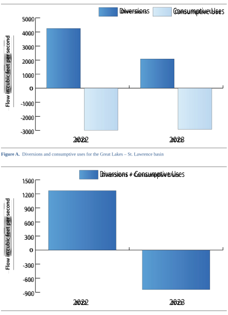**Figure B.** Net diversions and consumptive uses for the Great Lakes – St. Lawrence River basin. 

75 

Annual Report of the Great Lakes Regional Water Use Database Representing 2023 Water Use Data 

The data in Tables A and B and Figure C summarize the components of the Great Lakes – St. Lawrence River basin water budget and the relative hydrologic effect of consumptive uses and diversions in the watershed. 

|**Water Budget Component**|**Average 2022 flow (cfs)**|**Average 2023 flow (cfs)**|
|---|---|---|
|Runoff|172,579|183,195|
|Precipitation|247,015|232,114|
|Evaporation|-203,300|-181,399|
|St. Lawrence River|-416,566|-414,678|
|Interbasin Diversions|4,250|2,085|
|Consumptive Use|-2,983|-2,927|

**Table A** . Water budget average flows for the Great Lakes-St. **L** awrence River basin 

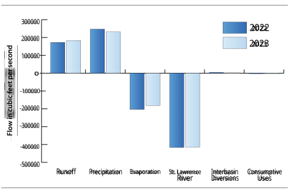**Figure C.** Water budget average flows for the Great Lakes-St. **L** awrence River basin 

76 

Annual Report of the Great Lakes Regional Water Use Database Representing 2023 Water Use Data 

In 2022 and 2023, flow related to consumptive uses and diversions was less than 2% of both other inflows (runoff and precipitation) and other outflows (evaporation and the St Lawrence River) across the Great Lakes-St. Lawrence River basin. The percentage of flow related to consumptive uses and diversions decreased from 2022 to 2023 for both inflows and outflows. 

|**Water Budget Comparison**|**2022**|**2023**|
|---|---|---|
|Consumptive Uses + Diversions as apercentage of other inflows|1.7|1.2|
|Consumptive Uses + Diversions as apercentage of other outflows|1.2|0.8|

**Table B.** Relative hydrologic effect of consumptive uses and diversions in the Great Lakes-St. Lawrence River basin (directional aspect of flow removed) 

#### **Lake Superior Watershed** 

The data in Tables C and D and Figure D summarize the components of the Lake Superior water budget and the relative hydrologic effect of consumptive uses and diversions in the watershed. 

|**Water Budget Component**|**Average 2022 flow (cfs)**|**Average 2023 flow (cfs)**|
|---|---|---|
|Runoff|54,221|50,173|
|Precipitation|92,156|76,186|
|Evaporation|-70,068|-62,945|
|St. Marys River|-76,780|-87,934|
|Diversions|5,907|3,658|
|Consumptive Use|-49|-49|

**Table C.** Water budget average flows for the Lake Superior basin 

In the Lake Superior basin, diversions are an inflow, with more water being diverted into the basin than diverted out. Total consumptive uses in 2023 were almost identical to those in 2022 in the Lake Superior basin; however, net diversions decreased by 38% from 2022 to 2023. In 2022 and 2023, flow related to consumptive uses and diversions was less than 5% of both other inflows (precipitation and surface runoff) and other outflows (evaporation and St. Marys River flow) across the Lake Superior watershed. The percentage of flow related to consumptive uses and diversions decreased from 2022 to 2023 for both inflows and outflows. 

77 

Annual Report of the Great Lakes Regional Water Use Database Representing 2023 Water Use Data 

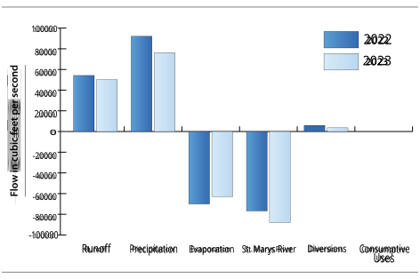**Figure D.** Water budget average flows for the Lake Superior basin 

|**Water Budget Comparison**|**2022**|**2023**|
|---|---|---|
|Consumptive Uses + Diversions as apercentage of other inflows|4.1|2.9|
|Consumptive Uses + Diversions as apercentage of other outflows|4.1|2.5|

**Table D.** Relative hydrologic effect of consumptive uses and diversions in the Lake Superior basin (directional aspect of flow removed) 

78 

Annual Report of the Great Lakes Regional Water Use Database Representing 2023 Water Use Data 

#### **Lake Michigan-Huron Watershed** 

The data in Tables E and F and Figure E summarize the components of the Lake Michigan-Huron water budget and the relative hydrologic effect of consumptive uses and diversions in the watershed.4 

|**Water Budget Component**|**Average 2022 flow (cfs)**|**Average 2023 flow (cfs)**|
|---|---|---|
|St. Marys River|76,780|87,934|
|Runoff|66,515|73,892|
|Precipitation|110,376|105,734|
|Evaporation|-88,334|-77,077|
|St. Clair River|-205,708|-204,237|
|Diversions|-1,673|-1,593|
|Consumptive Use|-1,337|-1,307|

**Table E.** Water budget average flows for the Lake Michigan-Huron basin 

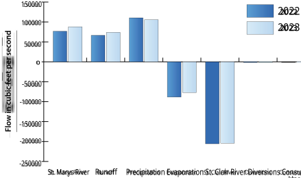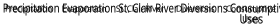**Figure E.** Water budget average flows for the Lake Michigan-Huron basin 

> 4 Because of the unique flow of the Straits of Mackinaw between lakes Michigan and Huron, the two lakes are considered as one hydrological body. https://www.glerl.noaa.gov/res/straits/ 

79 

Annual Report of the Great Lakes Regional Water Use Database Representing 2023 Water Use Data 

In the Lake Michigan-Huron basin, diversions are an outflow, meaning more water is diverted out than enters the basin through return flow or incoming diversions. Consumptive uses decreased by 2% from 2022 to 2023 and diversions decreased by 5%. In 2022 and 2023, flow related to consumptive uses and diversions was less than 2% of both other inflows (precipitation, surface runoff, and St. Marys River flow) and other outflows (evaporation and St. Clair River flow) across the Lake Michigan-Huron watershed. The percentage of flow related to consumptive uses and diversions was consistent from 2022 to 2023 for both inflows and outflows. 

|**Water Budget Comparison**|**2022**|**2023**|
|---|---|---|
|Consumptive Uses + Diversions as apercentage of other inflows|1.2|1.1|
|Consumptive Uses + Diversions as apercentage of other outflows|1.0|1.0|

**Table F.** Relative hydrologic effect of consumptive uses and diversions in the Lake Michigan-Huron basin (directional aspect of flow removed) 

#### **Lake Erie Watershed** 

The data in Tables G and H and Figure F summarize the components of the Lake Erie water budget and the relative hydrologic effect of consumptive uses and diversions in the watershed. 

|**Water Budget Component**|**Average 2022 flow (cfs)**|**Average 2023 flow (cfs)**|
|---|---|---|
|Detroit River|211,918|216,715|
|Runoff|19,815|23,405|
|Precipitation|25,239|30,554|
|Evaporation|-28,559|-26,758|
|Niagara River|-230,105|-227,662|
|Diversions|-8,144|-7,204|
|Consumptive Use|-664|-658|

**Table G.** Water budget average flows for the Lake Erie basin 

Diversions are an outflow in the Lake Erie basin, meaning more water leaves the watershed through outgoing diversions than comes in from returns and incoming diversions. The predominant component of Lake Erie diversions is the Welland Canal intrabasin diversion. Although the Welland Canal affects the Lake Erie water budget, there is no net change or water loss from the Great Lakes-St. Lawrence River basin associated with Welland Canal diversion because the diversion is entirely to Lake Ontario. 

80 

Annual Report of the Great Lakes Regional Water Use Database Representing 2023 Water Use Data 

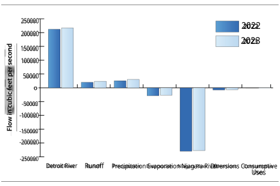**Figure F.** Water budget average flows for the Lake Erie basin 

Consumptive uses changed very little from 2022 to 2023, while diversions decreased by 12 percent. In 2022 and 2023, flow related to consumptive uses and diversions was less than 4% of both other inflows (precipitation, surface runoff, and Detroit River flow) and other outflows (evaporation and Niagara River flow) across the Lake Erie watershed. The percentage of flow related to consumptive uses and diversions decreased slightly from 2022 to 2023 for both inflows and outflows. 

|**Water Budget Comparison**|**2022**|**2023**|
|---|---|---|
|Consumptive Uses + Diversions as apercentage of other inflows|3.4|2.9|
|Consumptive Uses + Diversions as apercentage of other outflows|3.4|3.1|

**Table H.** Relative hydrologic effect of consumptive uses and diversions in the Lake Erie basin (directional aspect of flow removed) 

81 

Annual Report of the Great Lakes Regional Water Use Database Representing 2023 Water Use Data 

#### **Lake Ontario Watershed** 

The data in Tables I and J and Figure G summarize the components of the Lake Ontario water budget and the relative hydrologic effect of consumptive uses and diversions in the watershed. 

|**Water Budget Component**|**Average 2022 flow (cfs)**|**Average 2023 flow (cfs)**|
|---|---|---|
|Niagara River|230,105|227,662|
|Runoff|32,028|35,725|
|Precipitation|19,244|19,639|
|Evaporation|-16,338|-14,619|
|St. Lawrence River|-279,074|-277,809|
|Diversions|8,168|7,232|
|Consumptive Use|-545|-545|

**Table I.** Water budget average flows for the Lake Ontario basin 

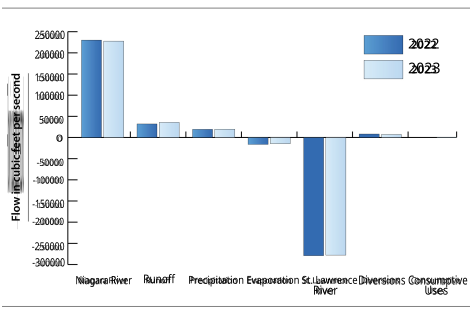**Figure G.** Water budget average flows for the Lake Ontario basin 

82 

Annual Report of the Great Lakes Regional Water Use Database Representing 2023 Water Use Data 

Diversions are an inflow in the Lake Ontario basin, meaning more water enters the watershed through incoming diversions than leaves from outgoing diversions. The predominant component of Lake Ontario diversions is the incoming Welland Canal intrabasin diversion. Although the Welland Canal affects the Lake Ontario water budget, there is no net change or water gain from the Great Lakes-St. Lawrence River basin associated with Welland Canal diversion because the diversion is entirely from Lake Erie. 

Consumptive use in the Lake Ontario basin remained steady from 2022 to 2023 while diversions decreased by 11%. In 2022 and 2023, flow related to consumptive uses and diversions was less than 4% of both other inflows (precipitation, surface runoff, and Niagara River flow) and other outflows (evaporation and St. Lawrence River flow) across the Lake Ontario watershed. The percentage of flow related to consumptive uses and diversions decreased slightly from 2022 to 2023 for both inflows and outflows. 

|**Water Budget Comparison**|**2022**|**2023**|
|---|---|---|
|Consumptive Uses + Diversions as apercentage of other inflows|3.1|2.7|
|Consumptive Uses + Diversions as apercentage of other outflows|2.9|2.7|

**Table J.** Relative hydrologic effect of consumptive uses and diversions in the Lake Ontario basin (directional aspect of flow removed) 

#### **St. Lawrence River Watershed** 

The data in Figure H and Tables K and L summarize the components of the St. Lawrence River water budget and the relative hydrologic effect of consumptive uses and diversions in the watershed. Precipitation, evaporation, and runoff are not included in the water budget due to lack of available data. Therefore, outside of diversions and consumptive uses, the water budget considerations are limited to the inflow and outflow of the St. Lawrence River, measured at Cornwall, Ontario and calculated at Trois-Rivières, Québec, respectively. Average annual inflow data was obtained from the U.S. Army Corps of Engineers, while Environment and Climate Change Canada provided average daily outflow data; however, outflow data were only available from 2016-2020. Data beyond June 2020 was not available for the outflow at Trois-Rivières, Québec; the average flow from 2016 to 2019 was used to estimate monthly flow from July to December 2020 to fill in this data gap and one other 24-day gap. Outflow data for 2022 and 2023 were estimated using percent differences in flow for 2022 and 2023 at Cornwall compared to the average flow from 2016-2020, and then applying that percent difference to flows at Trois Rivieres. 

|**Water Budget Component**|**Average 2022 flow (cfs)**|**Average 2023 flow (cfs)**|
|---|---|---|
|St. Lawrence River at Cornwall|279,074|277,809|
|St. Lawrence River at Trois-Rivières|-416,566|-414,678|
|Diversions|-8|-8|
|Consumptive Use|-388|-367|

**Table K.** Water budget average flows for the St. Lawrence River 

83 

Annual Report of the Great Lakes Regional Water Use Database Representing 2023 Water Use Data 

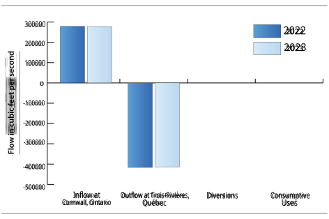**Figure H.** Water budget average flows for the St. Lawrence River 

Diversions are an outflow in the St. Lawrence River basin, meaning more water leaves the watershed through outgoing diversions than comes in from returns and incoming diversions. Consumptive uses decreased by 5% from 2022 to 2023 while diversions held steady. In 2022 and 2023, flow related to consumptive uses and diversions was less than 0.2% of both other inflows (St. Lawrence River flow, measured at Cornwall, Ontario) and other outflows (St. Lawrence River flow, calculated at Trois-Rivières, Québec) across the St. Lawrence River watershed. The percentage of flow related to consumptive uses and diversions stayed consistent from 2022 to 2023 for both inflows and outflows. 

|**Water Budget Comparison**|**2022**|**2023**|
|---|---|---|
|Consumptive Uses + Diversions as apercentage of other inflows|0.1|0.1|
|Consumptive Uses + Diversions as apercentage of other outflows|< 0.1|<0.1|

**Table L.** Relative hydrologic effect of consumptive uses and diversions in the St. Lawrence River basin (directional aspect of flow removed) 

84 

