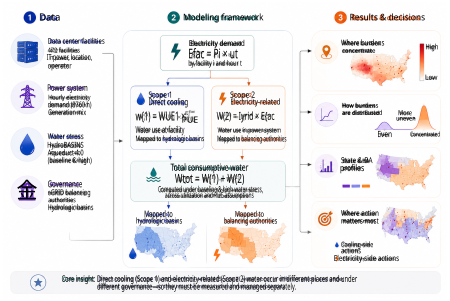
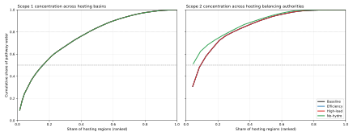
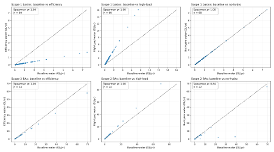

# The Hidden Water Geography of U.S. Hyperscale Data Centers in the AI Era 

Gianluca Guidi1_,∗_ and Francesca Dominici1_,∗_ 

> 1Harvard University. 

> _∗_ Correspondence to: ggianluca@hsph.harvard.edu; fdominic@hsph.harvard.edu. 

**One-sentence summary:** Separating on-site cooling water from electricity-related water reveals that U.S. data centers face two geographically distinct water problems requiring different governance responses. 

#### **Abstract** 

Water use by data centers is routinely reported as a single footprint, but water is consumed through two physically distinct pathways: at the site for cooling and in the power system that generates electricity. We mapped both pathways for 472 U.S. hyperscale facilities by linking facility locations to electricity regions, hydrologic basins, and water-stress data. Under baseline assumptions, operational water consumption totals approximately 300 GL yr_−_1 (range 205–451 across scenarios), with electricity-related water contributing three-quarters of the total. The two pathways produce different hotspot geographies: direct cooling burdens concentrate in stressed western and southcentral basins, whereas electricity-related burdens concentrate in a few eastern grid regions with fossil-heavy supply. Just 3 of 24 hosting balancing authorities account for 59% of electricity-related water. Separating pathways identifies which decisions matter where: cooling design and water sourcing locally, electricity planning and procurement regionally. 

## **Main Text** 

Hyperscale data centers are expanding rapidly as cloud services and artificial intelligence workloads grow. Their electricity demand has received substantial attention from utilities and regulators, but their water use remains harder to measure in a way that guides decisions. The difficulty is not only estimating how much water is consumed. It is also identifying _where_ that water is consumed and _which institutions_ can reduce it. 

Operational water consumption arises through two pathways. Water is consumed at the facility for thermal management, mainly through evaporative cooling; we refer to this as Scope 1, or direct cooling water [1–3]. Water is also consumed in the electricity system that serves the facility, including thermoelectric cooling at fossil-fuel and nuclear plants and, depending on attribution choice, reservoir evaporation associated with hydropower; we 

1 

refer to this as Scope 2, or electricity-related water [4, 5]. Existing studies have advanced understanding of each pathway individually [1, 6–9], but these pathways have not been mapped together in a facility-resolved national analysis. Collapsing them into one footprint hides which problem is local and which is regional. 

Place matters because the same volume of water consumption can imply different levels of risk depending on local hydrology and baseline water stress [10, 11]. Cooling-water intensity also varies with climate, cooling architecture, and operating efficiency [9, 12]. National or state totals alone are therefore insufficient for planning. A site may appear water-light locally but be connected to a water-intensive grid, or it may impose direct cooling demand in a stressed basin even when the electricity supply is less water-intensive. 

We developed a facility-resolved national framework for estimating annual operational water consumption from 472 U.S. hyperscale data centers across the two pathways (Fig. 1). Facility locations were linked to balancing authorities, hydrologic basins, and Aqueduct water-stress indicators through geospatial joins. Scope 1 was estimated using Water Usage Effectiveness (WUE), defined in ISO/IEC 30134-9 as litres of site water consumption per kWh of IT electricity [2]. Scope 2 was estimated by combining facility electricity demand with balancing-authority generation mixes from eGRID [13] and technology-specific water-consumption factors from the literature [4, 5]. Unless otherwise noted, results refer to the baseline scenario; efficiency, high-load, and no-hydro sensitivities are reported in the Supplementary Materials. 

### **Electricity-related water dominates the national total** 

The 472 facilities in the baseline inventory represent 20 041 MW of hyperscale nameplate capacity and approximately 116 TWh yr_−_1 of facility electricity demand. Their operational water consumption totals approximately 300 GL yr_−_1 —nearly 300 billion litres per year— under the baseline scenario (range 205–451 GL yr_−_1 across the efficiency and high-load scenarios; table S2). For reference, this baseline total is comparable to the annual residential water consumption of a metropolitan area of roughly 2–3 million people [14]. Of the baseline total, approximately 74 GL yr_−_1 is direct cooling water (Scope 1) and approximately 226 GL yr_−_1 is electricity-related water (Scope 2). Scope 2 therefore contributes about 75% of the national total, roughly three times the Scope 1 contribution. 

An important methodological caveat applies to the Scope 2 estimate. We attribute reservoir evaporation to hydropower generation at 8.0 L kWh_−_1 in the baseline [4], a convention that is methodologically contested [15]. Under a no-hydro sensitivity that sets this factor to zero, Scope 2 drops from 226 to approximately 128 GL yr_−_1 —a 43% reduction—and the national total falls to approximately 202 GL yr_−_1 (table S2). Even in this conservative case, Scope 2 remains the larger component (63% of the total). We report both the baseline and no-hydro results throughout the Supplementary Materials so that readers can assess the influence of this single assumption. 

As a partial external check, the three largest hyperscale operators (Google, Microsoft, and Meta) collectively reported approximately 25 GL of direct water consumption in their most recent sustainability disclosures [16–18]. These operators represent a substantial but incomplete share of the facilities in our inventory. Scaling by their approximate share of the sample’s total capacity yields a Scope 1 estimate broadly consistent with our baseline, 

2 

Figure 1: **Study design.** Facility inventory, grid generation mix, and hydrologic stress data are linked to each hyperscale facility. Facility electricity demand is translated into two water pathways: Scope 1, consumed at the site and mapped to hydrologic basins, and Scope 2, consumed in the power system and mapped to balancing authorities. Pathway-separated estimates support hotspot maps, concentration analysis, and comparison maps of where different actions would reduce water use most. 

although exact comparison is limited by differences in reporting scope and boundary definitions. 

This national split is important, but it is not the main result. The more consequential finding is that the two pathways create different geographies of burden. Scope 1 is tied to the site, its water source, and the surrounding hydrologic context. Scope 2 is tied to the regional generation mix and the way new electricity demand is served. A single national footprint cannot show which institutions should act in which places. 

### **The two pathways create different hotspots** 

We mapped Scope 1 and Scope 2 on different spatial units because water is consumed in different places. Direct cooling water is consumed at or near the facility, so hydrologic basins are the appropriate geography for identifying where cooling burden overlaps hydrologic stress. Electricity-related water is consumed in the power system, often far from the facility, so balancing authorities—the operational units of the U.S. electricity grid—are the appropriate unit for electricity–water attribution. 

3 

Figure 2: **Direct cooling and electricity-related water produce different hotspot maps. A** , Scope 1 basin classes combine direct cooling-water burden (above-median among hosting basins) with basin water stress (Aqueduct score _≥_ 3 in the basin or a touching neighbor). **B** , Scope 2 balancing-authority classes combine electricity-related water burden (above-median among hosting BAs), fossil-heavy supply (coal + gas _>_ 50%), and stress at hosted facility locations (MW-weighted mean _≥_ 3). The maps show that the places where cooling demand overlaps stressed hydrology are not the same as the places where data-center electricity demand is served by water-intensive power supply. 

Figure 2 shows that these two hotspot geographies diverge. In the Scope 1 map, a hotspot is a basin where direct cooling-water consumption is above the median among hosting basins _and_ Aqueduct baseline water stress is high ( _≥_ 3 on the 0–5 scale, classified by Aqueduct 4.0 as high to extremely high) in the basin or in a touching neighbor [10, 11]. In the Scope 2 map, the most restrictive class identifies balancing authorities where electricity-related water is high, coal and gas provide more than half of annual generation, and hosted facilities are located in high-stress settings. Scope 1 hotspots highlight basins—primarily in the western and south-central U.S.—where data-center cooling demand overlaps stressed hydrology. Scope 2 hotspots highlight grid regions—often in the eastern U.S.—where large data-center loads are served by relatively water-intensive electricity. These are different problems for different decision makers. 

### **Electricity-related water is more concentrated** 

The two pathways also differ in how unevenly their burdens are distributed across regions (Fig. 3). For Scope 1, the top 16 of 85 hosting basins account for 51% of baseline Scope 1 water. For Scope 2, the top 3 of 24 hosting balancing authorities account for 59% of baseline Scope 2 water. Thus, electricity-related water is dominated by a few grid regions, whereas direct cooling water is spread across a larger number of hydrologic basins. 

This concentration has practical consequences. A highly concentrated electricity-side 

4 

Figure 3: **Electricity-related water is more spatially concentrated than direct cooling water. A** , Scope 1 concentration across hydrologic basins hosting hyperscale facilities. **B** , Scope 2 concentration across balancing authorities hosting hyperscale facilities. Bars rank regions by their share of total baseline pathway-specific water; maps show the leading regions. Scope 2 reaches half the national total in far fewer regions than Scope 1. 

problem can in principle be addressed through a relatively small number of utility, procurement, and regional planning decisions. Cooling-water concerns require more local, basinspecific attention. The regions contributing most to Scope 1 are not the same as those contributing most to Scope 2, reinforcing the need to keep the pathways separate. 

### **Different actions matter in different places** 

The hotspot and concentration results show where burdens are large. We next asked where water use would fall most under simple lower-water comparison benchmarks (Fig. 4). The mapped quantity is potential reduction in annual water consumption: the difference between the baseline estimate and the value that would remain if the region moved to the stated benchmark. These are comparison calculations, not forecasts or engineering-feasibility assessments. 

For Scope 1, the benchmark is a lower-water operating case based on the efficiency scenario values of utilization, PUE, and WUE. Because these three parameters are applied uniformly across facilities, the geographic ranking of Scope 1 reduction potential is determined by existing capacity distribution—the same basins that appear large in Fig. 2A also appear large here. The map is therefore most useful for quantifying the _magnitude_ of po- 

5 

tential savings rather than for revealing new geography. A large basin value indicates high current cooling-water consumption and a large gap to that reference point. These basins are where local water managers, permitting authorities, and facility operators should examine cooling-system choices, water sourcing, reclaimed-water use, and drought planning. 

For Scope 2, the benchmark reduces each balancing authority’s grid water intensity to the 25th percentile among hosting balancing authorities (1 _._ 41 L kWh_−_1 in the baseline). Because grid water intensity varies substantially across BAs, the Scope 2 map adds genuine geographic information beyond the burden map: some BAs with large hosted loads already have low grid-water intensity and therefore show small reduction potential, whereas others with large loads and water-intensive supply show large potential. These are the grid regions where utility planners, public utility commissions, balancing authorities, and large electricity buyers should examine lower-water generation, procurement choices, resource plans, and transmission access. 

The high-potential regions differ between panels. The places where cooling-side changes would save the most water are not the places where electricity-side changes would save the most water. This is the central action-oriented result: reducing data-center water use is not one problem with one solution, but two connected problems with different geographies and different decision makers. 

### **Implications** 

Three conclusions follow. First, data-center water governance should address both pathways, not only on-site cooling. Permitting and environmental review often focus on direct water use, but for many facilities the larger operational burden is in the electricity system. A state such as Virginia, the nation’s largest data-center market, should not be evaluated only through local cooling permits when much of its data-center water burden is tied to electricity supply (Fig. S5). Conversely, some western states with Scope 1-dominant profiles need locally tailored cooling and water-sourcing strategies. 

Second, the largest reductions in electricity-related water are concentrated in a small number of grid regions. Because three balancing authorities account for more than half of Scope 2 water, decisions about generation mix, transmission, and procurement in these regions can disproportionately affect the national data-center water footprint. Many hyperscale operators have signed large renewable power-purchase agreements, but our location-based attribution reflects the physical water intensity of the grid as currently operated rather than contractual procurement claims; as these contracts are fulfilled with built generation, the location-based Scope 2 estimates will decline accordingly. 

Third, cooling-water reductions require locally tailored strategies across more basins. Effective actions include less water-intensive cooling systems, reclaimed or non-potable water, and drought-contingency planning, but these choices must be adapted to local hydrologic conditions. The main value of pathway separation is therefore practical: it identifies where water is consumed, through which mechanism, and which decisions are most relevant to reducing it. 

The analysis has limitations that should guide interpretation. It is annual-average and location-based; it does not resolve seasonal drought coincidence, dispatch-level electricity, exact source-water provenance, or facility-specific measured WUE. All facilities receive the 

6 

same scenario-based WUE, so the spatial heterogeneity of Scope 1 reflects capacity distribution and location rather than observed differences in cooling technology across sites. The Scope 1 estimates should therefore be understood as showing where cooling-water _exposure_ is largest given current siting, not as measured consumption at individual facilities. Hydropower attribution remains contested and substantially affects the Scope 2 estimate, as described above. The boundary excludes embodied and supply-chain water. These limitations affect absolute totals more than the main geographic finding: cooling-side and electricity-side water concerns concentrate in different places, and this conclusion holds across all scenarios tested (Figs. S1–S4). 

## **References and Notes** 

## **References** 

- [1] David Mytton. Data centre water consumption. _npj Clean Water_ , 4(1):11, 2021. doi: 10.1038/s41545-021-00101-w. URL `https://doi.org/10.1038/s41545-021-00101-w` . 

- [2] International Organization for Standardization and International Electrotechnical Commission. ISO/IEC 30134-9: Information technology — data centres — key performance indicators — part 9: Water usage effectiveness (WUE), 2022. Standard defining WUE for data centers. 

- [3] U.S. Environmental Protection Agency. WaterSense at work: Best management practices for commercial and institutional facilities. `https://www.epa.gov/watersense/watersense-work` , 2012. Cooling-tower and water-management guidance for facilities. 

- [4] Jordan Macknick, Robin Newmark, Garvin Heath, and Kimberly C. Hallett. Operational water consumption and withdrawal factors for electricity generating technologies: a review of existing literature. _Environmental Research Letters_ , 7(4):045802, 2012. doi: 10.1088/1748-9326/7/4/045802. URL `https://doi.org/10.1088/1748-9326/7/4/045802` . 

- [5] Jordan Meldrum, Syndi Nettles-Anderson, Garvin Heath, and Jordan Macknick. Life cycle water use for electricity generation: a review and harmonization of literature estimates. _Environmental Research Letters_ , 8(1):015031, 2013. doi: 10.1088/17489326/8/1/015031. 

- [6] Pengfei Li, Jianyi Yang, Mohammad A. Islam, and Shaolei Ren. Making AI less “thirsty”: Uncovering and addressing the secret water footprint of AI models. _arXiv preprint arXiv:2304.03271_ , 2023. URL `https://arxiv.org/abs/2304.03271` . 

- [7] Pengfei Li, Jianyi Yang, Mohammad A. Islam, and Shaolei Ren. Making AI less “thirsty”: Uncovering and addressing the secret water footprint of AI models. _Communications of the ACM_ , 2025. doi: 10.1145/3724499. 

7 

- [8] Branislav Risti´c, Kaveh Madani, and Zen Makuch. The water footprint of data centers. _Sustainability_ , 7(8):11260–11284, 2015. doi: 10.3390/su70811260. 

- [9] Arman Shehabi, Sarah Smith, Dale Sartor, Richard Brown, Magnus Herrlin, Jonathan Koomey, Eric Masanet, Nathaniel Horner, Inˆes Azevedo, and William Lintner. United states data center energy usage report. Technical Report LBNL-1005775, Lawrence Berkeley National Laboratory, 2016. 

- [10] World Resources Institute. Aqueduct water risk atlas. `https://www.wri.org/aqueduct` , 2023. Aqueduct 4.0 baseline water-stress indicators. 

- [11] Samantha Kuzma, Marc F. P. Bierkens, Sridevi Lakshman, Tianyi Luo, Liz Saccoccia, Edwin H. Sutanudjaja, and Rens Van Beek. Aqueduct 4.0: Updated decision-relevant global water risk indicators. Technical note, World Resources Institute, Washington, DC, 2023. URL `https://doi.org/10.46830/writn.23.00061` . 

- [12] Nuoa Lei and Eric Masanet. Climate- and technology-specific PUE and WUE estimations for U.S. data centers using open data. _Resources, Conservation and Recycling_ , 182:106323, 2022. doi: 10.1016/j.resconrec.2022.106323. 

- [13] U.S. Environmental Protection Agency. eGRID: Emissions & generation resource integrated database. `https://www.epa.gov/egrid` , 2024. Power-plant emissions and generation data used for grid-based attribution. 

- [14] Peter W. Mayer, William B. DeOreo, Eva M. Opitz, Jack C. Kiefer, William Y. Davis, Benedykt Dziegielewski, and John Olaf Nelson. Residential end uses of water. _American Water Works Association Research Foundation_ , 1999. 

- [15] Mesfin M. Mekonnen and Arjen Y. Hoekstra. The blue water footprint of electricity from hydropower. _Hydrology and Earth System Sciences_ , 16(1):179–187, 2012. doi: 10.5194/hess-16-179-2012. 

- [16] Google. 2024 environmental report. Technical report, Alphabet Inc., 2024. URL `https://sustainability.google/reports/google-2024-environmental-report/` . 

- [17] Microsoft. 2024 environmental sustainability report. Technical report, Microsoft Corporation, 2024. URL `https://www.microsoft.com/en-us/corporate-responsibility/sustainability/report` . 

- [18] Meta. 2024 sustainability report. Technical report, Meta Platforms Inc., 2024. URL `https://sustainability.fb.com/report/` . 

- [19] Gianluca Guidi, Francesca Dominici, Tiziano Squartini, Callaway Sprinkle, Jonathan Gilmour, Kevin Butler, Eric Bell, Scott Delaney, and Falco J. Bargagli-Stoffi. Assessing the carbon emissions and energy consumption of u.s. hyperscale data centers, 2026. URL `https://arxiv.org/abs/2606.05420` . 

8 

- [20] Bernhard Lehner and G¨unther Grill. Global river hydrography and network routing: baseline data and new approaches to study the world’s large river systems. _Hydrological Processes_ , 27(15):2171–2186, 2013. doi: 10.1002/hyp.9740. URL `https://doi.org/10.1002/hyp.9740` . HydroBASINS / HydroSHEDS lineage; used for basin polygon identifiers. 

- [21] Arman Shehabi, Sarah Josephine Smith, Alex Hubbard, Alexander Newkirk, Nuoa Lei, Md Abu Bakar Siddik, Billie Holecek, Jonathan G. Koomey, Eric R. Masanet, and Dale A. Sartor. 2024 United States Data Center Energy Usage Report. Technical Report LBNL-2001637, Lawrence Berkeley National Laboratory, 2024. URL `https://doi.org/10.71468/P1WC7Q` . Prepared to meet the Energy Act of 2020 Congressional request. 

## **Acknowledgments** 

The authors thank colleagues for feedback on earlier versions. **Funding:** Project Number R01MD016054; Project Number U24ES035309, with Michelle Bell and Nicole Deziel as PD/PIs; R01ES037156; and R01ES036731. **Author contributions:** G.G. conceived and implemented the analysis. G.G. and F.D. designed the study, interpreted the results, and wrote the manuscript. **Competing interests:** The authors declare no competing interests. **Data and materials availability:** All code necessary to reproduce the analysis workflow is available at `https://github.com/gianguidi/hyperscale-water-geography` . The version corresponding to this submission is archived at commit `2b8672e8cef27165d3be5c2084946984d0e96c40` . Because the underlying facility-level dataset contains commercially sensitive information, raw facility identifiers, addresses, and coordinates are not publicly released. The repository includes a reproducibility notebook, environment files, configuration templates, and instructions for reproducing the workflow with authorized or synthetic inputs. 

## **Supplementary Materials** 

Materials and Methods Supplementary Text Figs. S1 to S6 Tables S1 to S4 

9 

Figure 4: **Different actions would reduce water use most in different places. A** , Potential Scope 1 reduction by hydrologic basin under a lower-water operating benchmark. Large values indicate both high current direct cooling water and a large gap to the benchmark. Hatching marks high water stress ( _≥_ 3). _Audience: local water managers, facility operators, permitting authorities. Action: less water-intensive cooling, reclaimed water, drought planning._ **B** , Potential Scope 2 reduction by balancing authority if grid water intensity were reduced to the 25th percentile among hosting BAs (1 _._ 41 L kWh_−_1 ). Large values indicate both high hosted load and a large grid-intensity gap. _Audience: electricity regulators, utility planners, large purchasers. Action: less water-intensive generation, revised resource plans, expanded transmission._ The two maps identify different priority regions for cooling-side and electricity-side action. 

10 

Supplementary Materials for 

The Hidden Water Geography of U.S. Hyperscale Data Centers in the AI Era 

Gianluca Guidi and Francesca Dominici 

## **Contents** 

|**S1 Materials and Methods**|**2**|
|---|---|
|S1.1 Study design . . . . . . . . . . . . . . . . . . . . . . . . . .|. . . . . . . . . . 2|
|S1.2 Data sources . . . . . . . . . . . . . . . . . . . . . . . . . .|. . . . . . . . . . 2|
|S1.3 Facility electricity . . . . . . . . . . . . . . . . . . . . . . .|. . . . . . . . . . 2|
|S1.4 Scope 1: direct cooling water . . . . . . . . . . . . . . . . .|. . . . . . . . . . 3|
|S1.5 Scope 2: electricity-related water . . . . . . . . . . . . . .|. . . . . . . . . . 3|
|S1.6 Water stress and aggregation . . . . . . . . . . . . . . . . .|. . . . . . . . . . 3|
|S1.7 Hotspot definitions . . . . . . . . . . . . . . . . . . . . . .|. . . . . . . . . . 3|
|S1.8 Comparison maps in main-text Fig. 4 . . . . . . . . . . . .|. . . . . . . . . . 4|
|S1.9 Scenario windows . . . . . . . . . . . . . . . . . . . . . . .|. . . . . . . . . . 4|
|**S2 Supplementary Text**|**4**|
|S2.1 National scenario sensitivity . . . . . . . . . . . . . . . . .|. . . . . . . . . . 4|
|S2.2 Robustness of hotspot geography . . . . . . . . . . . . . .|. . . . . . . . . . 4|
|S2.3 Concentration and rank stability . . . . . . . . . . . . . .|. . . . . . . . . . 7|
|S2.4 State and balancing-authority profiles . . . . . . . . . . . .|. . . . . . . . . . 7|
|S2.5 Bivariate diagnostic for Scope 2 . . . . . . . . . . . . . . .|. . . . . . . . . . 10|
|**S3 Supplementary Tables**|**10**|

1 

## **S1 Materials and Methods** 

### **S1.1 Study design** 

We estimate annual operational water consumption from U.S. hyperscale data centers using a facility-resolved framework that separates direct cooling water (Scope 1) from electricityrelated water consumption (Scope 2). Scope 1 denotes water consumed directly at the facility for cooling. Scope 2 denotes water consumed off site to generate the electricity used by the facility. The core boundary includes operational water consumption only and excludes embodied and supply-chain water. 

For each facility _i_ , 

$$
W tot i = W (1) i + W (2) i . (S1)
$$

When water-intensity factors are in L kWh_−_1 and electricity is in kWh, the combined expression is 

$$
W tot i = 10-3   Igrid r(i) Efac i,kWh � �� � Scope 2: electricity-related water + WUEi Efac i,kWh PUEi � �� � Scope 1: direct cooling water   , (S2)
$$

where 10_−_3 converts litres to cubic metres. 

### **S1.2 Data sources** 

Facility locations, identifiers, and power attributes come from a facility-level hyperscale inventory and electricity-attribution pipeline [19]. The main analysis uses 472 U.S. hyperscale facilities in the 12-month study window ending in March 2026 that have current nameplatepower estimates and the spatial information needed for grid, basin, and water-stress joins. 

Balancing-authority regions are assigned using point-in-polygon joins between facility coordinates and eGRID balancing-authority polygons [13]. Generation shares by fuel or technology class are obtained from eGRID-linked summaries and normalized to sum to one. Hydrologic basins are assigned using HydroBASINS level-6 polygons [20]. Baseline waterstress indicators are from Aqueduct Water Risk Atlas 4.0 [10, 11]. Facilities without valid spatial assignments for a required layer are excluded from analyses that require that layer; missing grid-mix or stress attributes are not imputed. 

### **S1.3 Facility electricity** 

The facility attribute `current mw` is interpreted as nameplate facility-level power _Pi_ (MW). Annual facility electricity is 

$$
Efac i = Pi \times{}{} 8760 \times{}{} u, (S3)
$$

where _u_ is an annual-average utilization factor. Because _Pi_ represents total facility power, PUE is not applied to scale facility electricity. PUE is used only to recover IT electricity for the WUE-based Scope 1 estimate. Electricity is converted to kWh as 

$$
Efac i,kWh = 1000Efac i . (S4)
$$

2 

### **S1.4 Scope 1: direct cooling water** 

Water Usage Effectiveness (WUE), defined in ISO/IEC 30134-9, is litres of site water use per kWh of IT electricity [2]. IT electricity is recovered as 

$$
EIT i,kWh = Efac i,kWh PUEi , (S5)
$$

and Scope 1 water consumption is 

$$
W (1) i = 10-3 WUEi EIT i,kWh. (S6)
$$

Facility-specific WUE is not consistently disclosed, so the analysis uses scenario windows informed by the literature [1, 6, 9, 21]. 

### **S1.5 Scope 2: electricity-related water** 

Scope 2 water consumption is 

$$
W (2) i = 10-3Igrid r(i) Efac i,kWh, (S7)
$$

where _Ir_grid is the balancing-authority water-consumption intensity. This intensity is calculated from generation shares and operational water-consumption factors: 

$$
Igrid r = � f\in{}{}F sr,fwf, (S8)
$$

where _sr,f_ is the share of generation in region _r_ from fuel or technology class _f_ , and _wf_ is the corresponding operational water-consumption factor [4, 5]. This is a location-based attribution: facilities inherit the average physical water intensity of the regional electricity system associated with their location, not contractual procurement claims. 

### **S1.6 Water stress and aggregation** 

Each facility is assigned an Aqueduct baseline water-stress score _S ∈_ [0 _,_ 5] and classified as high stress if _S ≥_ 3 [10, 11]. Facility-level estimates are aggregated to states, balancing authorities, and hydrologic basins. For balancing-authority stress overlays, we use an MWweighted mean siting-stress metric: 

$$
¯Smw r = � i:r(i)=r PiSi � i:r(i)=r Pi . (S9)
$$

### **S1.7 Hotspot definitions** 

For Scope 1, a basin is high burden if its total Scope 1 water is above the median among basins hosting hyperscale facilities. A basin is stress-qualified if Aqueduct baseline stress is _≥_ 3 in the basin or in a touching neighbor. Scope 1 hotspots satisfy both conditions. 

For Scope 2, a balancing authority is high burden if its total Scope 2 water is at or above the median among hosting balancing authorities. Fossil-heavy supply is defined as coal plus gas generation share greater than 0.5. High stress is defined as _S_¯ _r_mw _≥_ 3. The most restrictive Scope 2 class satisfies all three conditions: high Scope 2 burden, fossil-heavy supply, and high stress. 

3 

### **S1.8 Comparison maps in main-text Fig. 4** 

For Scope 1, the lower-water comparison value is obtained by scaling baseline Scope 1 according to scenario assumptions: 

$$
W (1) i,bench = W (1) i,base ubench ubase WUEbench/PUEbench WUEbase/PUEbase . (S10)
$$

Basin-level potential Scope 1 savings are the sum of facility-level differences within each basin. 

For Scope 2, the comparison sets each balancing authority’s grid water intensity to the minimum of its observed value and the 25th percentile among hosting balancing authorities: 

$$
Itarget r = min{Igrid r , Q0.25(Igrid r )}. (S11)
$$

Potential Scope 2 savings are 

$$
∆W (2) r = 10-3 � Igrid r -Itarget r � Efac r,kWh, (S12)
$$

where _Er,_fac kWhis total annual facility electricity hosted in balancing authority_r_.These bench- marks rank where reductions would be largest under stated assumptions. They are not forecasts, cost curves, or feasibility assessments. 

### **S1.9 Scenario windows** 

The baseline scenario is the central parameter set used in the main text. We also evaluate an efficiency scenario, a high-load scenario, and a no-hydro sensitivity. Under the facility-load interpretation, Scope 2 scales linearly with _u_ , whereas Scope 1 scales with _u ×_ (WUE _/_ PUE). In the no-hydro sensitivity, the hydropower water factor is set to zero to bound the influence of reservoir-evaporation attribution. 

## **S2 Supplementary Text** 

### **S2.1 National scenario sensitivity** 

Table S2 reports national totals across the scenario set. Absolute totals vary substantially, as expected from the scaling equations. Total operational water ranges from 204.91 GL yr_−_1 in the efficiency scenario to 450.60 GL yr_−_1 in the high-load scenario. The no-hydro sensitivity lowers Scope 2 from 225.74 to 128.35 GL yr_−_1 . Scope 2 remains the larger component in all scenarios, although the difference narrows when hydropower attribution is removed. 

### **S2.2 Robustness of hotspot geography** 

Figures S1 and S2 show that the main hotspot geographies are stable to operating assumptions. Scope 1 hotspot geography is visually unchanged across the efficiency, high-load, and no-hydro cases. Scope 2 geography is stable across the efficiency and high-load cases, whereas the no-hydro sensitivity changes the classification of some hydro-heavy western balancing authorities without eliminating the broader geography of electricity-related concern. 

4 

Scope 1 basin hotspots under the no-hydro sensitivity 

Figure S1: **Scope 1 basin hotspot robustness.** Basins are classified using the same rule as in main-text Fig. 2A. The hotspot geography is visually unchanged across scenarios. 

5 

Scope 2 balancing-authority hotspot typology under the no-hydro sensitivity 

Figure S2: **Scope 2 balancing-authority hotspot robustness.** Balancing authorities are classified using the same typology as in main-text Fig. 2B. Operating assumptions primarily rescale Scope 2 burden, whereas the no-hydro sensitivity changes some hydro-heavy western classifications. 

6 

|**Quantity**|**Definition / units**|**Values**|**Notes**|
|---|---|---|---|
|_u_|Annual-average utilization|0.55 / **0.66** / 0.85|Efficiency / baseline / high-load|
|PUE|Facility/IT electricity|1.15 / **1.25** / 1.40|Used only to recover IT electricity|
|WUE|L kWh_−_1 IT|0.2 / **0.8** / 1.5|Direct cooling-water intensity|
|_wf_|L kWh_−_1 by generation class|Coal 1.9; gas 0.7; nu- clear 2.5; hydro 8.0; wind 0.0; solar 0.1; other 1.0|Baseline factor set|
|High stress|Aqueduct score|_S ≥_3|High to extremely high stress|
|Scope 2 benchmark|Grid water-intensity target|_Q_0_._25(_I_grid _r_ )|Lower-water com- parator|

Table S1: Key parameters and scenario values. Baseline values are shown in bold. 

|**Scenario**|**Electricity** **(TWh yr**_−_1**)**|**Scope 1** **(GL yr**_−_1**)**|**Scope 2** **(GL yr**_−_1**)**|**Total** **(GL yr**_−_1**)**|**Scope 1** **(%)**|**Scope 2** **(%)**|**Intensity** **(L kWh**_−_1**)**|
|---|---|---|---|---|---|---|---|
|Efficiency|96.56|16.79|188.11|204.91|8.20|91.80|2.12|
|Baseline|115.87|74.16|225.74|299.89|24.73|75.27|2.59|
|High-load|149.22|159.88|290.72|450.60|35.48|64.52|3.02|
|No-hydro|115.87|74.16|128.35|202.50|36.62|63.38|1.75|

Table S2: National operational water summary across scenarios. Totals may not sum exactly because of rounding. 

### **S2.3 Concentration and rank stability** 

Figures S3 and S4 show that the concentration result and leading-region ranks are robust. Cumulative concentration curves remain close across scenarios. Scope 1 basin rankings are invariant across scenarios, and Scope 2 balancing-authority rankings are invariant across efficiency and high-load cases and only partially altered under no-hydro. 

### **S2.4 State and balancing-authority profiles** 

Figure S5 translates the pathway results into states and balancing authorities, units familiar to many decision makers. States are included because siting, permitting, and utility planning are often discussed at that scale. Balancing authorities are included because they are the operational unit most relevant for electricity-related water. Virginia illustrates a Scope 2- dominant state, whereas Texas and Nevada illustrate Scope 1-dominant or more coolingfocused profiles in the baseline scenario. 

7 

Figure S3: **Concentration robustness across scenarios.** Cumulative concentration curves for Scope 1 across basins and Scope 2 across balancing authorities are shown for all scenarios. Scope 2 remains more spatially concentrated than Scope 1. 

Figure S4: **Rank stability across scenarios.** Each panel compares baseline regional burden with the corresponding burden under an alternative scenario. Spearman correlations show that operating assumptions change absolute totals more than regional rank ordering. 

8 

Figure S5: **State and balancing-authority pathway profiles.** States and balancing authorities are colored by which pathway contributes more to baseline operational water. Ranked panels show low, baseline, and high scenario intervals for the 15 states and 15 balancing authorities with the most installed hyperscale capacity. 

9 

### **S2.5 Bivariate diagnostic for Scope 2** 

Figure S6 combines grid water intensity with MW-weighted mean siting stress. It is not a map of total burden. Instead, it shows where relatively water-intensive electricity supply and stressed hosting exposure co-occur. The baseline and no-hydro panels isolate the role of hydropower attribution. 

## **S3 Supplementary Tables** 

10 

Figure S6: **Bivariate balancing-authority grid water intensity versus siting stress.** Warmer upper-right classes indicate the joint occurrence of high grid water intensity and high siting stress. Excluding hydropower shifts some hydro-heavy western balancing authorities into lower intensity classes, while many elevated regions outside the West remain. 

|State|MW|Scope 1 (GL/yr)|Scope 2 (GL/yr)|Total (GL/|yr) Total (ML/MW-yr)|
|---|---|---|---|---|---|
|Virginia|4,199|6.6 / **29.1** / 62.8|32.4 / **38.9** / 50.0|39.0 / **68.0**|/ 112.8 9 / **16** / 27|
|Ohio|2,621|4.1 / **18.2** / 39.2|20.2 / **24.3** / 31.2|24.3 / **42.4**|/ 70.4 9 / **16** / 27|
|Oregon|2,443|3.8 / **16.9** / 36.5|109.9 / **131.9** / 169.9|113.8 / **148**|**.9** / 206.4 47 / **61** / 84|
|Iowa|1,766|2.8 / **12.3** / 26.4|12.1 / **14.5** / 18.7|14.9 / **26.8**|/ 45.1 8 / **15** / 26|
|Texas|1,193|1.9 / **8.3** / 17.8|4.8 / **5.7** / 7.4|6.7 / **14.0**|/ 25.2 6 / **12** / 21|
|Arizona|835|1.3 / **5.8** / 12.5|6.2 / **7.5** / 9.6|7.5 / **13.3**|/ 22.1 9 / **16** / 26|
|Nebraska|765|1.2 / **5.3** / 11.4|5.1 / **6.1** / 7.9|6.3 / **11.4**|/ 19.4 8 / **15** / 25|
|Georgia|699|1.1 / **4.8** / 10.5|5.6 / **6.8** / 8.7|6.7 / **11.6**|/ 19.2 10 / **17** / 27|
|Indiana|600|0.9 / **4.2** / 9.0|4.6 / **5.6** / 7.2|5.6 / **9.7** /|16.1 9 / **16** / 27|
|Oklahoma|570|0.9 / **4.0** / 8.5|3.8 / **4.6** / 5.9|4.7 / **8.5** /|14.4 8 / **15** / 25|
|Washington|527|0.8 / **3.7** / 7.9|44.3 / **53.2** / 68.5|45.1 / **56.8**|/ 76.4 86 / **108** / 145|
|Illinois|489|0.8 / **3.4** / 7.3|3.8 / **4.5** / 5.8|4.5 / **7.9** /|13.1 9 / **16** / 27|
|North Carolina|406|0.6 / **2.8** / 6.1|4.0 / **4.8** / 6.2|4.6 / **7.6** /|12.2 11 / **19** / 30|
|Nevada|375|0.6 / **2.6** / 5.6|1.2 / **1.4** / 1.8|1.8 / **4.0** /|7.4 5 / **11** / 20|
|Wyoming|322|0.5 / **2.2** / 4.8|3.5 / **4.1** / 5.3|4.0 / **6.4** /|10.2 12 / **20** / 32|

Table S3: Top 15 states ranked by installed hyperscale capacity. Scenario intervals are efficiency / baseline / high-load. 

11 

|BA|MW|Scope 1 (GL/yr)|Scope 2 (GL/yr)|Total (GL/yr)|Total (M|L/MW-yr)|
|---|---|---|---|---|---|---|
|PJM|7,999|12.6 / **55.5** / 119.6|61.7 / **74.0** / 95.3|74.2 / **129.5** / 215.0|9 / **16** /|27|
|MISO|2,116|3.3 / **14.7** / 31.7|14.5 / **17.4** / 22.4|17.8 / **32.1** / 54.1|8 / **15** /|26|
|SPP|1,555|2.4 / **10.8** / 23.3|10.4 / **12.5** / 16.1|12.8 / **23.3** / 39.3|8 / **15** /|25|
|PACW|1,220|1.9 / **8.5** / 18.2|40.0 / **48.0** / 61.8|41.9 / **56.5** / 80.1|34 / **46**|/ 66|
|BPA|1,214|1.9 / **8.4** / 18.2|69.9 / **83.9** / 108.0|71.8 / **92.3** / 126.2|59 / **76**|/ 104|
|ERCOT|1,193|1.9 / **8.3** / 17.8|4.8 / **5.7** / 7.4|6.7 / **14.0** / 25.2|6 / **12** /|21|
|SOCO|699|1.1 / **4.8** / 10.5|5.6 / **6.8** / 8.7|6.7 / **11.6** / 19.2|10 / **17**|/ 27|
|TVA|480|0.8 / **3.3** / 7.2|7.5 / **9.0** / 11.5|8.2 / **12.3** / 18.7|17 / **26**|/ 39|
|SRP|460|0.7 / **3.2** / 6.9|3.9 / **4.7** / 6.1|4.6 / **7.9** / 12.9|10 / **17**|/ 28|
|DUK|406|0.6 / **2.8** / 6.1|4.0 / **4.8** / 6.2|4.6 / **7.6** / 12.2|11 / **19**|/ 30|
|AZPS|375|0.6 / **2.6** / 5.6|2.3 / **2.8** / 3.6|2.9 / **5.4** / 9.2|8 / **14** /|24|
|NEVP|375|0.6 / **2.6** / 5.6|1.2 / **1.4** / 1.8|1.8 / **4.0** / 7.4|5 / **11** /|20|
|GCPD|358|0.6 / **2.5** / 5.4|31.0 / **37.3** / 48.0|31.6 / **39.7** / 53.3|88 / **111**|/ 149|
|WACM|322|0.5 / **2.2** / 4.8|3.5 / **4.1** / 5.3|4.0 / **6.4** / 10.2|12 / **20**|/ 32|
|SCEG|310|0.5 / **2.2** / 4.6|2.5 / **3.0** / 3.8|3.0 / **5.1** / 8.5|10 / **17**|/ 27|

Table S4: Top 15 balancing authorities ranked by installed hyperscale capacity. Scenario intervals are efficiency / baseline / high-load. 

12 

