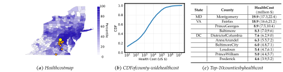
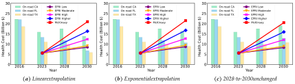
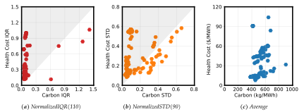

**The Unpaid Toll: Quantifying the Public Health Impact of AI** 

|Yuelin Han|Zhifeng Wu|Pengfei Li|Adam Wierman|Shaolei Ren1|
|---|---|---|---|---|
|_UC Riverside_| _UC Riverside_| _UC Riverside_|_Caltech_|_UC Riverside_|

### **Abstract** 

The surging demand for AI has led to a rapid expansion of energy-intensive data centers, impacting the environment through escalating carbon emissions and water consumption. While significant attention has been paid to AI’s growing environmental footprint, the public health burden, a hidden toll of AI, has been largely overlooked. Specifically, AI’s lifecycle, from chip manufacturing to data center operation, significantly degrades air quality through emissions of criteria air pollutants such as fine particulate matter, substantially impacting public health. This paper introduces a methodology to model pollutant emissions across AI’s lifecycle, quantifying the public health impacts. Our findings reveal that training an AI model of the Llama3.1 scale can produce air pollutants equivalent to more than 10,000 round trips by car between Los Angeles and New York City. The total public health burden of U.S. data centers in 2030 is valued at up to more than $20 billion per year, double that of U.S. coal-based steelmaking and comparable to that of on-road emissions of California. Further, the public health costs unevenly impact economically-disadvantaged communities, where the per-household health burden could be 200x more than that in less-impacted communities. We recommend adopting a standard reporting protocol for criteria air pollutants and the public health costs of AI, paying attention to all impacted communities, and implementing health-informed AI to mitigate adverse effects while promoting public health equity. 

# **1 Introduction** 

The rise of artificial intelligence (AI) has numerous potentials to play a transformative role in addressing grand societal challenges, including air quality and public health [1, 2]. For example, by integrating multimodal data from various sources, AI can provide effective tools and actionable insights for pandemic preparedness, disease prevention, healthcare optimization, and air quality management [1, 3]. However, the surging demand for AI — particularly generative AI, as exemplified by the recent popularity of large language models (LLMs) — has driven a rapid increase in computational needs, fueling the unprecedented expansion of energy-intensive AI data centers. According to McKinsey projections, under a medium-growth scenario [4], the U.S. data centers are anticipated to account for 11.7% of national electricity consumption in 2030, a substantial increase from their current share of less than 4% in 2023. 

The growing electricity demand of AI data centers has not only created significant stress on power grid stability [5,6], but also increasingly impacts the environment through escalating carbon emissions [7,8] and water consumption [9]. These environmental impacts are driven primarily by the “expansion of AI products and services,” as recently acknowledged by Google in its latest sustainability report [10]. To mitigate the challenges posed to both power grids and the environment, a range of strategies have been explored, including grid-integrated data centers [6, 11], energy-efficient hardware and software [12–14], and the adoption of carbon-aware and water-efficient computing practices [9,15–17], among others. 

**The hidden toll of AI.** While the environmental footprint of AI has garnered attention, the public health burden, a hidden toll of AI, has been largely overlooked. Across its entire lifecycle — from chip manufacturing to data center operation — AI contributes substantially to air quality degradation and public health costs through the emission of various criteria air pollutants. These include fine particulate matter (PM2.5, particles measuring 2.5 micrometers or smaller in diameter that can penetrate deep into lungs and cause serious health effects), sulfur dioxide (SO2), and nitrogen dioxide (NO2). Concretely, the AI hardware manufacturing process [18], electricity generation from fossil fuels to power AI data centers, and the maintenance and usage of diesel backup generators to ensure continuous AI data center operation all produce significant amounts of criteria air pollutants. Moreover, the distinct spatial-temporal heterogeneities of emission 

> 1 Yuelin Han and Zhifeng Wu contributed equally and are listed alphabetically. 

> Corresponding authors: Adam Wierman (adamw@caltech.edu) and Shaolei Ren (shaolei@ucr.edu) 

1 

sources suggest that focusing solely on reducing AI’s carbon footprints may not minimize its emissions of criteria air pollutants or the resulting public health impacts (Section 5). 

Exposure to criteria air pollutants is directly and causally linked to various adverse health outcomes,2 including premature mortality, lung cancer, asthma, heart attacks, cardiovascular diseases, strokes, and even cognitive decline, especially for the elderly and vulnerable individuals with pre-existing conditions [20–23]. Moreover, even short-term (hours to days) PM2.5 exposure is harmful and deadly, accounting for approximately 1 million premature deaths per year from 2000 to 2019 and representing 2% of total global deaths [24]. 

Globally, 4.2 million deaths were attributed to ambient (i.e., outdoor) air pollution in 2019 [25]. Air pollution has become the second highest risk factor for noncommunicable diseases [26]. Notably, according to the latest Global Burden of Disease report [27], along with high blood pressure and high blood sugar, ambient particulate matter is placed among the leading risk factors for disease burden globally in every socio-demographic group. 

While the U.S. has generally better air quality than many other countries, 4 in 10 people in the U.S. still live with unhealthy levels of air pollution, according to the “State of the Air 2024” report published by the American Lung Association [28]. In 2019 (the latest year of data provided by the World Health Organization, or WHO, as of November 2024), an estimate of 93,886 deaths in the U.S. were attributed to ambient air pollution [29]. In fact, even compliance with the U.S. Environmental Protection Agency (EPA) air quality standards does not necessarily guarantee healthy air that meets the WHO guidelines. Concretely, the EPA’s recently tightened primary standard for PM2.5 sets an annual average limit of 9 _µg/m_3 , considerably higher than the WHO’s recommended level of 5 _µg/m_3 [30,31]. In addition, the EPA projects that 53 U.S. counties, including 23 in the most populous state of California, would fail to meet the revised national annual PM2.5 standard in 2032 [32]. 

Further, criteria air pollutants are not confined to the immediate vicinity of their emission sources; they can travel hundreds of miles through a dispersion process (i.e., cross-state air pollution) [33,34], impacting public health across vast regions — pollutants from the 2024 Canadian wildfires significantly degraded air quality across much of the U.S. and reached as far as Mexico and Europe [35]. 

Importantly, along with transportation and industrial activities, electricity generation is a major contributor to ambient air pollution with substantial public health impacts [26, 36, 37]. For example, a recent study [38] shows that, between 1999 and 2020, a total of 460,000 _excess_ deaths were attributed to PM2.5 generated by coal-fired power plants alone in the U.S. As highlighted by the U.S. EPA [36], despite years of progress, “fossil fuel-based power plants remain a leading source of air, water, and land pollution that affects communities nationwide.” Moreover, according to the U.S. Energy Information Administration (EIA) projection [39], the coal consumption by the electricity sector in 2050 will still be about 30% of the 2024 level in the baseline reference case, and the number will exceed 50% in the high zero-carbon technology cost case. Indeed, the growing energy demands of AI are already delaying the decommissioning of coal-fired power plants and increasing fossil-fuel plants in the U.S. as well as around the world [6,40,41]. 

The public health outcomes of AI due to its emission of criteria air pollutants lead to various losses, such as hospitalizations, medication usage, emergency room visits, school loss days, and lost workdays. Moreover, these losses can be further quantified in economic costs based on epidemiology and economics research for the corresponding health endpoints [22,42]. In contrast, the environmental impacts of AI, e.g., carbon emission from fossil fuels and water consumption for data center cooling, often do not cause the same immediate health impacts. For instance, while anthropogenic carbon emissions could also pose risks to public health, such impacts are often second- or third-order effects through long-term climate change which can then threaten the human well-being by affecting the food people eat and facilitating the spreading of pests, among others [43]. Nonetheless, despite their immediate and tangible impacts on public health, the criteria air pollutants of AI have remained under the radar, entirely omitted from today’s AI risk assessments and sustainability reports [10,44,45]. 

**Quantifying the public health costs of AI.** In this paper, we uncover and quantify the hidden public health impacts of AI. We introduce a general methodology to model the emission of criteria air pollutants 

> 2While we focus on public health, we note that the impacts of criteria air pollutants extend beyond humans and include harms to environmentally sensitive areas, such as some national parks and wilderness areas which, classified as “Class 1 areas” under the Clean Air Act, require special air protection [19]. 

2 

associated with AI tasks across three distinct scopes: emissions from the maintenance and operation of backup generators (Scope 1), emissions from fossil fuel combustion for electricity generation (Scope 2), and emissions resulting from the manufacturing of server hardware (Scope 3). Then, we analyze the dispersion of criteria air pollutants and the resulting public health impacts across different regions. 

Our main results (Section 4) focus on the scope-2 health impacts of U.S. data centers and, specifically, LLM training.3 Using the reduced-complexity modeling tool COBRA (CO-Benefits Risk Assessment) provided by the EPA [46], our screening analysis demonstrates that driven by the growing demand for AI, the U.S. data centers could contribute to, among others, approximately 600,000 asthma symptom cases and 1,300 premature deaths in 2030, exceeding 1/3 of asthma deaths in the U.S. each year [47]. The overall public health costs could reach more than $20 billion, double that of the U.S. coal-based steelmaking industry [48], and rival or even top those of on-road emissions of the largest U.S. states such as California with _∼_ 35 million registered vehicles [49]. Moreover, depending on the location, training an AI model of the Llama-3.1 scale can produce an amount of air pollutants equivalent to driving a car for more than 10,000 round trips between Los Angeles and New York City (LA-NYC), resulting in a health cost that even exceeds 120% of the training electricity cost. 

Critically, the health costs are unevenly distributed across counties and communities, disproportionately affecting low-income counties (e.g., Meigs County, Ohio) where the per-household health burden could be equivalent to nearly 8 months of electricity bills and more than 200x compared to that in other counties. 

In addition, to highlight the importance of scope-1 and scope-3 health impacts, we consider data center backup generators in Virginia (Scope 1) and semiconductor manufacturing plants in Arizona and Ohio (Scope 3). Our analysis shows that, assuming the actual emissions are only 10% of the permitted level, the data center backup generators registered in Virginia (mostly in Loudoun, Prince William, and Fairfax) could already cause 14,000 asthma symptom cases among other health outcomes and a total public health burden of $220-300 million per year, impacting residents in multiple surrounding states and as far as Florida (Section 2.2.1). If these data centers emit air pollutants at the maximum permitted level, the total public health cost will become 10-fold and reach $2.2-3.0 billion per year. The scope-3 health impact of AI is also substantial. For example, just a single semiconductor facility in Arizona can cause an annual public health cost of $26-39 million, with $14-21 million attributed to the facility’s on-site emissions of criteria air pollutants (Section 2.2.2). Furthermore, relocating the same facility to a planned site in Ohio could almost quadruple the public health cost to $94-156 million, with $23-36 million resulting from on-site emissions. 

Finally, we provide recommendations to address the increasing public health impact of AI (Section 5). Specifically, we recommend technology companies adopt a standard reporting protocol for criteria air pollutants and public health impacts in their AI model cards and sustainability reports, implement healthinformed AI to proactively minimize the adverse health effects of AI data centers, pay attention to all impacted communities, and prioritize reducing the health impact on disadvantaged communities to promote public health equity. 

To summarize, our study sheds light on and quantifies the overlooked public health impact of AI. It can inform the public, policymakers, and technology companies in conducting a more comprehensive costbenefit analysis. We also urge further research to comprehensively address the public health implications when developing powerful and truly responsible AI in the future, ensuring that the growth of AI does not exacerbate the health burden or outweigh the potential benefits AI can provide to improve public health. 

# **2 Background on the Air Quality Impact of AI** 

This section presents an overview of AI’s impact on air quality and contribution to criteria air pollutants throughout its lifecycle, beginning with background on criteria air pollutants and U.S. air quality policies. 

## **2.1 Criteria Air Pollutants** 

Criteria air pollutants, including PM2.5, SO2 and NO2, are a group of airborne contaminants that are emitted from various sources such as industrial activities and vehicle emissions. The direct emission of PM2.5 is called 

> 3Our study focuses on the 48 contiguous U.S. states plus Washington D.C. because the EPA data does not include other regions [46]. If located in countries with higher population densities or less strict air quality standards, the same AI task and data centers would likely contribute to significantly more deaths and other adverse health effects. We recommend further research on the public health impact of AI outside the U.S. 

3 

primary PM2.5, while precursor pollutants such as SO2, NOx, and VOCs, can form secondary PM2.5 and/or ozones [50]. These air pollutants can travel a long distance (a.k.a. cross-state air pollution), posing direct and significant risks to public health over large areas, particularly for vulnerable populations including the elderly and individuals with respiratory conditions [33,34]. 

Long-term exposure to PM2.5, even at a low level, are directly linked to numerous health outcomes, including premature mortality, heart attacks, asthma, stroke, lung cancer, and even cognitive decline [21,22]. These health effects result in various losses, such as hospitalizations, medication usage, emergency room visits, school loss days, and lost workdays, which can be further quantified in economic costs based on public health research for various health endpoints [42]. In addition, short-term (hours to days) PM2.5 exposure is also dangerous, contributing to approximately 1 million premature deaths per year globally from 2000 to 2019 [24]. 

Under the Clean Air Act, the U.S. EPA is authorized to regulate the emission levels of criteria air pollutants, reducing concentrations to comply with the National Ambient Air Quality Standards (NAAQS) [51]. For example, the NAAQS primary standards set the annual average PM2.5 concentration at 9 _µg/m_3 and the 98-th percentile of 1-hour daily maximum NO2 concentration at 100 parts per billion by volume, both counted over three years [31]. In addition, state and local governments may set additional regulations on criteria air pollutants to strengthen or reinforce national standards [52]. 

While CO2 is broadly classified by the EPA as an air pollutant following the U.S. Supreme Court ruling in 2007 [53] and contributes to long-term climate change, it often does not cause the same immediate health impacts as criteria pollutants. In the U.S., CO2 and other greenhouse gases are subject to different EPA regulations from those for criteria air pollutants. Thus, for the sake of presentation in this paper, we use “air pollutants” to solely refer to criteria air pollutants wherever applicable. 

## **2.2 AI’s Contribution to Air Pollutants** 

To understand the impact of AI on air quality, we focus on the three scopes over which AI contributes to criteria air pollutants as well as other toxic materials. The scoping definition in this paper parallels the well-established greenhouse gas protocol [54]. 

### **2.2.1 Scope 1** 

The scope-1 public health impact of AI primarily comes from the emission of operating on-site backup generators. Data centers are mission-critical facilities that are designed to operate with high availability and uptime guarantees. As a result, to maintain operation during emergencies such as grid outages, AI data centers require highly reliable backup power sources [10, 45]. Diesel generators are known to emit significant amounts of air pollutants and even hazardous emissions during operation. For example, they emit 200-600 times more NOx than new or controlled existing natural gas-fired power plants for each unit of electricity produced [55]. Nonetheless, there is limited experience with cleaner backup alternatives that can provide comparable reliability in real-world settings, as highlighted by the U.S. Department of Energy in its recent recommendations regarding AI data center infrastructures [6]. Consequently, AI data centers, including those newly built by major technology companies, primarily depend on on-site diesel generators for backup power [6, 10, 45, 56]. For example, in northern Virginia (mostly in Loudoun, Prince William, and Fairfax), the number of permits for data center diesel generators has increased by about 70% since 2023 compared to the total number of permits issued between 2000 and 2022 [56]. 

While diesel generators need to comply with air quality regulations and typically do not operate over extended periods of time, regular maintenance and testing are essential to ensure their operational reliability. In addition, capacity redundancy is typically followed for diesel generator installations to ensure high availability [58]. Thus, diesel generators represent a major source of on-site air pollutants for data centers and pose a significant health risk to the public [59]. For instance, the total permitted annual emission limits for data centers in northern Virginia are approximately 13,000 tons of NOx, 1,400 tons of VOCs, 50 tons of SO2, and 600 tons of PM2.5, all in U.S. short tons. Assuming that the actual emissions are only 10% of the permitted level, these backup generators could already cause 14,000 asthma symptom cases and 13-19 deaths each year among other health implications, resulting in a total annual public health burden of $220-300 million throughout the U.S. This includes $190-260 million in Virginia, West Virginia, Maryland, Pennsylvania, Delaware, New Jersey, New York, and Washington D.C. We show the county-level health cost and the top-10 counties in Figure 1, while deferring the details of calculations to Appendix A.3. 

4 

**_Figure 1:_** _The county-level total scope-1 health cost of data center backup generators operated in Virginia (mostly in Loudoun County, Fairfax County, and Prince William County) [57]. The backup generators are assumed to emit air pollutants at 10% of the permitted levels per year. The total annual public health cost is $220-300 million, including $190-260 million incurred in Virginia, West Virginia, Maryland, Pennsylvania, New York, New Jersey, Delaware, and Washington D.C. (a) County-level health cost in Virginia, West Virginia, Maryland, Pennsylvania, New York, New Jersey, Delaware, and Washington D.C. Counties with data centers are marked in orange, except for Loudoun County (marked in yellow). (b) CDF of the county-level cost. (c) Top-10 counties by the total health cost._ 

Moreover, due to power grid capacity constraints in many U.S. states, AI data centers are increasingly pressured to vary their loads subject to the grid’s operating conditions, i.e., grid-integrated data centers [6, 60]. This trend may necessitate extended reliance on backup generators, e.g., possibly 15 days per year [6]. Such prolonged usage of diesel generators could substantially elevate AI’s scope-1 air pollution, creating even higher public health costs. Concretely, if the backup generators in northern Virginia emit air pollutants at the maximum permitted level, the total public health cost could reach $2.2-3.0 billion per year. 

What further adds to the public health threat is that many data center generators in a region may operate simultaneously for demand response during grid capacity shortages, potentially resulting in a short-term spike in PM2.5 and NOx emissions that can be particularly harmful [6,24,31]. **2.2.2 Scope 2** 

While technology companies have started implementing various initiatives — such as purchasing renewable energy credits and nuclear power from small modular reactors [5,10,61] — to lower their (market-based) carbon emissions, the vast majority of U.S. data centers remain directly powered by local power grids with a substantial portion of fossil fuel-based energy sources [10]. Thus, just as AI is accountable for scope-2 carbon emissions, it also contributes to scope-2 air pollution through its electricity usage. 

The combustion of fossil fuels for electricity production is a major emitter of criteria air pollutants, releasing large amounts of PM2.5, SO2, NOx, VOCs, and others.4 Critically, the growing energy demands of AI are already delaying the decommissioning of coal-fired power plants and increasing fossil-fuel plants in the U.S. and other countries [6,40]. For example, in addition to keeping 2,099 MW coal generation capacity until 2039 (more than 80% of the 2024 level), Virginia Electric and Power Company plans to install 5,934 MW gas-fired plants to meet the growing energy demand driven by AI data centers [41]. At the national level, per the EIA’s projection, [39], the 2050 natural gas consumption for U.S. electricity generation will be about 80% of the 2024 level in the baseline reference case, and even exceed the 2024 level by 20% if the zero-carbon technology cost is high; for coal consumption by the electricity sector in 2050, the numbers will also be considerably high, about 30% and over 50% of the 2024 level in the baseline reference case and in the high zero-carbon technology cost case, respectively. These projections were published by the EIA at the very beginning of the generative AI boom in early 2023. More recently, it has been reported that AI data centers could even be primarily powered by coal power plants in some countries [40]. As a result, AI’s scope-2 air pollution is expected to remain at a high level for a substantially long time into the future. 

We also note that the practice of using various credits to offset scope-2 carbon emissions [10] may not be 

> 4Wet cooling towers, including those used by data centers [9,10] and carbon-free nuclear power plants, rely on water evaporation for heat rejection and produce PM2.5 due to spray drift droplets [62, 63]. Nonetheless, because of limited data available, we exclude the cooling tower PM2.5 emission from our analysis unless other specified. 

5 

effective for mitigating the scope-2 public health impact. The reason is that the public health impact of using grid electricity is highly location-dependent, e.g., the impact in a populated region may not be mitigated by renewable energy generated elsewhere. 

### **2.2.3 Scope 3** 

The surging demand for AI necessitates large quantities of computational hardware, including graphics processing units (GPUs), thus intensifying the supply chain requirements [64]. However, semiconductor manufacturing generates various criteria air pollutants, wastewater, toxic materials, and hazardous air emissions [18]. Moreover, the energy-intensive nature of semiconductor production further contributes to pollutants from power plants. Combined with other pollution sources such as transportation and electronic waste recycling [65], the supply chain activities form a large portion of AI’s scope-3 impact on public health. 

Although semiconductor manufacturing facilities are subject to air quality regulations [66], they still pose significant risks, affecting populations across large regions. Maricopa County, AZ, has been an EPAdesignated non-attainment area for several years due to its failures to meet federal air quality standards [67]. The establishment of multiple semiconductor facilities in such areas could further exacerbate air quality issues. In 2023–2024, the estimated annual public health impact of a single semiconductor facility was $2639 million, with $14-21 million attributed to direct on-site emissions of air pollutants from the facility, based on COBRA estimates [18, 46]. Moreover, relocating the facility to a planned site in Licking County, Ohio, could nearly quadruple public health costs to $94-156 million, with $23-36 million resulting from direct onsite emissions. This increase is partly due to Ohio’s weather conditions and higher reliance on coal-based power [68]. The details of calculations are available in Appendix A.4. Importantly, the global demand for AI chips in 2030 is projected to be tens of times of the overall production capacity of this single facility [69], further magnifying the overall scope-3 public health impact of AI. It is also worth noting that additional pollutants, including hazardous air pollutants like hydrogen fluoride, may further elevate public health costs but are not included in this analysis. 

# **3 Quantifying the Public Health Impact of AI** 

To quantify the public health impact of AI, we present a general methodology that quantifies AI’s criteria air pollutants at the emission source, models its dispersed air pollutants at different receptors (i.e., destination regions), and finally obtains the public health impact and cost at each receptor. 

For an AI task (e.g., AI model training), we consider _M_ types of criteria air pollutants, _N_ receptor regions of interest (e.g., all the U.S. counties), _H_ types of public health impacts (e.g., mortality, asthma symptoms, school loss days, etc.). We use _p__s_ = ( _p_ 1_s, · · ·, ps_ _M_)and_p_ _i__r_=(_pr_ _i,_ 1_, · · ·, pr_ _i,M_)denotethequantitiesfor_M_ types of air pollutants attributed to the task at the emission source and at the receptor _i_ , respectively, for _i_ = 1 _, · · · , N_ . Additionally, we use _hi_ = ( _hi,_ 1 _, · · · , hi,H_ ) and _ci_ = ( _ci,_ 1 _, · · · , ci,H_ ) to denote the incidences and economic costs associated with _H_ types of health impacts at receptor _i_ , respectively, for _i_ = 1 _, · · · , N_ . With a slight abuse of notations, we reuse these symbols when modeling AI’s public health impacts across the three different scopes. 

## **3.1 Criteria Air Pollutants at the Source** 

We first model AI’s criteria air pollutants at the source across the three different scopes in Section 2.2. 

### **3.1.1 Scope 1** 

On-site backup diesel generators are sized based on the data center power capacity and routinely tested to ensure a high availability of the entire data center. Thus, the overall scope-1 air pollutants should be attributed to each computing task based on its power allocation and duration. Suppose that the overall scope-1 emission by an AI data center under consideration is ¯ _p__s_ = (¯ _p_ 1_s, · · ·,_¯_ps_ _M_), for_M_types of air pollutants, over a timespan of _T_ (e.g., one year). Considering an AI task that is allocated a fraction of _x ∈_ (0 _,_ 1] of the overall data center power capacity and lasts for a duration of _T_ , we express the scope-1 air pollutants attributed to the AI task as _p__s_ =_x · T_ _· p_ ¯_s_ _,_ (1) _T_ 

which attributes the overall emission _p_ ¯_s_ to the task in proportion to its allocated power and duration. 

6 

### **3.1.2 Scope 2** 

AI’s scope-2 air pollutants come from its usage of electricity generated from fossil fuels. Suppose that the power grid serving the AI data center has an emission rate of _γ_ = ( _γ_ 1 _, · · · , γM_ ) for _M_ types of air pollutants to produce each unit of electricity. In practice, the power grid consists of multiple interconnected power plants to supply electricity to many customers over a wide area (e.g., a balancing area [70]). Thus, similar to carbon footprint accounting [71], the air pollutant emission rate _γ_ can be calculated based on either the weighted average emission rate of all the power plants (i.e., _γ_ = <u>��</u> _<u>kk</u>__<u>γk·b·kbk</u>_ where _γk_ and _bk_ are the emission rate and electricity generation of the power plant _k_ ) or the emission rate of the marginal power plant (i.e., the power plant dispatched in response to the next electricity demand increment), which are referred to as average emission rate or marginal emission rate, respectively. The average emission represents a proportional share of the overall air pollutant emission by an electricity consumer, while the marginal emission is useful for quantifying the _additionality_ of air pollutants due to a consumer’s electricity usage. 

Suppose that the electricity consumption by the AI task is _e_ , including the data center overhead captured by the power usage effectiveness. Then, we can write the scope-2 air pollutants as 

$$
ps = e \cdot{}{} γ, (2)
$$

which is either based on either average attribution or marginal attribution. While the marginal emission is typically associated with a single marginal power plant, the average emission is spread across all the interconnected power plants within a wide area such as a power balancing area [70,71]. Thus, when considering the average attribution method, we split the energy consumption _e_ over all the power plants in proportion to their contributions to the grid’s supply and calculate the corresponding per-plant emission. In other words, each involved power plant is an individual pollution source, and the air pollutant emission at the _k_ -th power plant is _p__s_ _k_=_e ·_ <u>�</u> _<u>bkk</u>__bk· γk_, where_bk_is the electricity generation of the_k_-th power plant. 

Since both the average and marginal air pollutant emission rates vary over time and locations to meet the supply-demand balance, we can also refine the calculation of scope-2 air pollutants in (2) by considering the summation of air pollutants over multiple time slots over the AI task’s duration. **3.1.3 Scope 3** 

Following the attribution method for scope-3 carbon emission and water consumption [9,13], we attribute the AI hardware’s air pollutants during the manufacturing process to a specific task based on the task duration. Specifically, let the AI hardware’s expected lifespan be _T_ 0 and the AI task lasts a duration of _T_ . Considering that the _M_ types of air pollutants for manufacturing the AI hardware are _p_ ¯0_s_= (¯_ps_ 0 _,_ 1_, · · ·,_¯_ps_ 0 _,M_) and excluding other miscellaneous pollutants (e.g., transportation), we obtain AI’s scope-3 air pollutants as 

$$
ps = T T 0 \cdot{}{} ¯ps 0. (3)
$$

As an AI server cluster includes multiple hardware components (e.g., GPU and CPU) manufactured in different locations, we apply (3) to estimate the scope-3 air pollutants for each component manufactured in a different location. 

## **3.2 Air Quality Dispersion Modeling** 

Once emitted from their sources, criteria air pollutants can travel long distances, impacting multiple states along their paths. Unlike carbon emissions that have a similar effect on climate change regardless of the emission source locations, the public health impact of criteria air pollutants heavily depends on the location of the emission source. Generally, the closer a receptor is to the source, the greater the air quality impact. Furthermore, the dispersion of air pollutants is influenced by meteorological conditions, such as wind speed and direction. 

The movement of air pollutants can be modeled using mathematical equations to simulate the atmospheric processes governing the dispersion, known as dispersion modeling. By incorporating emission data and meteorological inputs, dispersion modeling can predict pollutant concentrations at selected receptor locations [72]. We consider a general dispersion model ( _p_ 1_r, · · ·, pr_ _N_)=_Dθ_(_ps_),which yields the amount of _M_ types of air pollutants _pi__r_=(_pr_ _i,_ 1_, · · ·, pr_ _i,M_)atthereceptorregion_i_=1_, · · ·, N_.Theparameter_θ_cap- tures the geographical conditions, emission source characteristics (e.g., height), and meteorological data if 

7 

applicable [73]. We apply the dispersion model to each scope of air pollutants (Section 3.1) to estimate the corresponding pollutant concentrations at receptor regions. 

In practice, many dispersion modeling tools are available, including AERMOD, CTDMPLUS, PCAPS and InMAP with a reduced complexity [22,72,74,75]. For example, PCAPS (Pattern Constructed Air Pollution Surfaces), an advanced reduced-complexity model that provides representations of both primarily emitted PM2.5 and secondarily formed PM2.5 and ozone, is used in COBRA as a quick assessment of otherwise lengthy iterations and simulations of various pollution scenarios in terms of the annual average PM2.5 and seasonal average maximum daily average 8-hour ozone [22, 75]. Even compared with state-of-the-science photochemical grid models, PCAPS provides similar prediction accuracies and can realistically capture the change in air pollution due to changing emissions [75]. More specifically, for electric power sectors and on-road/highway vehicle sectors (the two sectors we consider in Section 4), the prediction results of PCAPS compare very well with photochemical model predictions, with Pearson correlation coefficients of 0.92 and 0.94, respectively [22,75]. 

## **3.3 Converting Health Outcomes to Economic Costs** 

By assessing pollutant levels _pi__r_=(_pr_ _i,_ 1_, · · ·, pr_ _i,M_)andpopulationsizeateachreceptorregion_i_,wecan estimate the incidences of health outcomes _hi_ = ( _hi,_ 1 _, · · · , hi,H_ ) and the corresponding public health cost _ci_ = ( _ci,_ 1 _, · · · , ci,H_ ). The relations between _pi__r_and_hi_andbetween_hi_and_ci_canbeestablishedbasedon epidemiology research [22]. For example, the premature mortality rate can be modeled as a log-linear function in terms of the PM2.5 level [23]. 

Further, by summing up the economic costs, we obtain quantitative estimates of the public health burden at both regional and national levels. It is important to note that the public health cost is not necessarily an out-of-pocket expense incurred by each individual, but rather reflects the estimated economic burden on a population to mitigate the adverse effects of pollutants within a specific region. Therefore, it is a quantitative scalar measure of the public health impact resulting from a particular pollutant-producing activity. 

## **3.4 Implementation** 

We now briefly describe the specific implementation we use to study the public health impact of U.S. data centers and AI training. The details are available in Appendix A. 

Due to the limited data available for scope-1 and scope-3 impacts, we mainly focus on the scope-2 health impacts from electricity consumption. To account for future uncertainties, we use the U.S. data center electricity consumption data provided by EPRI [5] and McKinsey [4] under various growth-rate scenarios, excluding cryptocurrency servers. Unless otherwise specified, we consider the average attribution method by default, i.e., attribute the overall health impact within an electricity region to data centers in proportion to their electricity consumption. 

To model the air pollutant dispersion and quantify health impacts, we use the latest COBRA (Desktop v5.1, as of October 2024) provided by the U.S. EPA [46]. COBRA integrates reduced-complexity air dispersion modeling (including both primarily emitted PM2.5 and secondly formed PM2.5 and ozone [75]) with various concentration-response functions [22], offering a quantitative screening analysis particularly suitable for large-scale health impacts. The same or similar reduced-complexity modeling tools have been commonly used in the literature to examine the health impacts of various industries over a large area [74,76], including electric vehicles [77], bitcoin mining [78], and inter-region electricity imports [79], among others. While each health impact model used by COBRA considers 95% confidence intervals, the high-end and low-end estimates provided by COBRA are based on different models instead of the 95% confidence interval of a single model [22]. COBRA provides data for county-level population, health incidence, and valuation projections in 2030, but the baseline emissions are missing [46]. Thus, to account for model uncertainties, we estimate the 2030 baseline emission by extrapolating the COBRA data for 2016, 2023, and 2028 using three extrapolation methods (Linear, Exponential, and Unchanged) as detailed in Appendix A.1. 

We only consider the contiguous U.S. and simply refer to it as the U.S. For consistency with COBRA, cities considered county-equivalents for census purposes are also referred to as “counties” in our paper. All our monetary values are for one year (or one AI task if applicable) and in 2023 U.S. dollars. 

8 

# **4 Results** 

We now present our estimates of the public health impacts caused by the U.S. data centers in aggregate and by training a large generative AI model at specific locations. Our results demonstrate that in 2030, the scope2 pollutants of U.S. data centers alone could cause, among others, approximately 600,000 asthma symptom cases and 1,300 premature deaths, exceeding 1/3 of asthma deaths in the U.S. each year [47]. The overall public health costs of U.S. data centers could rival or even exceed those of on-road emissions of the largest U.S. states such as California. Moreover, depending on the locations, training an AI model of the Llama-3.1 scale can produce an amount of air pollutants equivalent to driving a passenger car for more than 10,000 LA-NYC round trips, resulting in a health cost that even exceeds 120% of the training electricity cost. Importantly, the health costs are disproportionately distributed across counties and communities, particularly affecting low-income counties that could experience more than 200x per-household health costs than others. 

## **4.1 Public Health Impact of U.S. Data Centers in 2023** 

We first show in Table 1 the public health cost of U.S. data centers in 2023 as a reference.5 Even at the beginning of the generative AI boom, the U.S. data centers have already resulted in a total public health cost of about $5.6 billion, or $39.7 per household, in 2023. This is equivalent to 43% of the data centers’ total electricity cost. By considering marginal attribution, the U.S. data centers’ public health cost increases to about $7.6 billion in 2023, due to the heavy reliance on fossil fuels by many marginal generators [70]. This suggests that, by powering the U.S. data centers using alternative energy sources (e.g., geothermal) off the main grid, the U.S. could have seen a public health benefit of $7.6 billion in 2023. Additional results can be found in Appendix B, including county-wide total and per-household health costs that demonstrate the uneven distribution of health impacts across different communities. 

**_Table 1:_** _The public health cost of U.S. data centers in 2023._ 

|**Attribution** **Method**|**Electricity** (TWh)|**Electricity Cost** (billion $)|**Mortality**|**Health Cost** (billion $)|**% of Electricity** **Cost**|**Per-Household** **Health Cost($)**|**Months of** **Electricity Bill**|**% of CA On-road** **Health Cost**|
|---|---|---|---|---|---|---|---|---|
|Average|152.1|13.0|**360** (270,460)|**5.6** (4.2,7.0)|43%|**39.7** (29.6,49.8)|**0.29** (0.22,0.36)|35%|
|Marginal|152.1|13.0|**490** (360,620)|**7.6** (5.7,9.4)|58%|**53.8** (40.5,67.2)|**0.39** (0.30,0.49)|47%|

Mobile sources, including vehicles, marine engines, and generators, collectively account for more than half of the air pollutants in the U.S., with vehicles being a primary contributor [80,81]. Thus, we contextualize the data centers’ public health cost by comparing it to that of on-road emissions of California, which has about 35 million registered vehicles and exhibits the highest public health cost resulting from on-road emissions among all the U.S. states [46,49]. On-road emissions are categorized as the “Highway Vehicles” sector in COBRA and include both tailpipe exhaust and tire and brake wear. The details of calculating onroad emissions and the corresponding health costs are available in Appendix A.1. We see from Table 1 that in 2023, the total public health cost of U.S. data centers exceeds 1/3 of that of California’s on-road emissions. 

## **4.2 Public Health Impact of U.S. Data Centers in 2030** 

This section presents our projections of the public health cost of the U.S. data centers in 2030. 

We first show in Fig. 2 the health costs of U.S. data centers and compare them with top-3 state on-road emissions in 2030 by using different extrapolation methods. More detailed results are available in Table 2. Due to the tightening air pollutant regulations [82], the health costs of on-road emissions — a primary source of air pollutants in the U.S. — have generally decreased from 2016 to 2030. In contrast, the surging demand for AI data centers in the U.S. has outweighed the power plant emission efficiency improvement, potentially quadrupling the public health cost from 2023 to 2030. Under McKinsey’s projection with a medium growth rate, the scope-2 pollutants of U.S. data centers in 2030 alone could cause, among others, approximately 600,000 asthma symptom cases and 1,300 deaths, exceeding 1/3 of asthma deaths in the U.S. each year [47]. Importantly, the public health costs of U.S. data centers could rival or even exceed those of onroad emissions of the largest U.S. states including California, suggesting a need for urgent attention to the health impact of U.S. data centers beyond on-road emissions. 

> 5We use the “mid (low, high)” format to represent the midrange, low and high estimates offered by COBRA. When presenting a single value or a ratio (e.g., health-to-electricity cost ratio), we use the midrange by default. 

9 

**_Figure 2:_** _The health costs of U.S. data centers and top-3 state on-road emissions from 2016 to 2030 based on different extrapolations for 2030 baseline emissions._ 

**_Table 2:_** _The public health cost of U.S. data centers in 2030 based on EPRI’s energy demand projection [5]. “__†_ _” denotes McKinsey’s projection under a medium growth rate [4]._ 

|**Extrapolation** **Method**|**Projected** **Growth**|**Electricity** (TWh)|**Electricity Cost** (billion $)|**Mortality**|**Health Cost** (billion $)|**% of Electricity** **Cost**|**Per-Household** **Health Cost($)**|**Months of** **Electricity Bill**|**% of CA On-road** **Health Cost**|
|---|---|---|---|---|---|---|---|---|---|
||Low|196.3|16.8|**490** (360, 610) |**8.3** (6.3, 10.3) |49%|**55.3** (41.9, 68.8) |**0.40** (0.31, 0.50) |43%|
||Moderate|214.0|18.3|**530** (390, 660)|**9.0** (6.8, 11.1)|49%|**59.9** (45.4, 74.5)|**0.44** (0.33, 0.54)|47%|
|Unchanged|High|296.4|25.4|**710** (530, 890)|**12.1** (9.2, 15.1)|48%|**80.9** (61.3, 100.6)|**0.59** (0.45, 0.74)|63%|
||Higher |403.9|34.6|**940** (700, 1180)|**16.0** (12.1, 19.8)|46%|**106.7** (80.8, 132.6)|**0.78** (0.59, 0.97)|84%|
||Medium_†_|519.3|44.5|**1210** (900, 1510)|**20.5** (15.5, 25.5)|46%|**137.2** (103.9, 170.5)|**1.00** (0.76, 1.25)|107%|
||Low|196.3|16.8|**500** (370, 630)|**8.5** (6.4, 10.5)|50%|**56.5** (42.6, 70.5)|**0.41** (0.31, 0.51)|61%|
||Moderate|214.0|18.3|**540** (400, 680)|**9.2** (6.9, 11.4)|50%|**61.3** (46.2, 76.3)|**0.45** (0.34, 0.56)|66%|
|Linear|High|296.4|25.4|**730** (540, 920)|**12.4** (9.3, 15.4)|49%|**82.7** (62.4, 103.1)|**0.60** (0.46, 0.75)|90%|
||Higher |403.9|34.6|**960** (710, 1210)|**16.3** (12.3, 20.3)|47%|**109.0** (82.2, 135.9)|**0.80** (0.60, 0.99)|118%|
||Medium_†_|519.3|44.5|**1230** (920, 1550)|**21.0** (15.8, 26.1)|47%|**140.2** (105.7, 174.7)|**1.02** (0.77, 1.28)|152%|
||Low|196.3|16.8|**510** (380, 640)|**8.7** (6.6, 10.8)|52%|**58.0** (43.8, 72.3)|**0.42** (0.32, 0.53)|53%|
||Moderate|214.0|18.3|**550** (410, 700)|**9.4** (7.1, 11.7)|51%|**62.9** (47.4, 78.3)|**0.46** (0.35, 0.57)|57%|
|Exponential|High|296.4|25.4|**750** (560, 940)|**12.7** (9.6, 15.8)|50%|**84.9** (64.1, 105.7)|**0.62** (0.47, 0.77)|78%|
||Higher |403.9|34.6|**990** (730, 1240)|**16.7** (12.6, 20.9)|48%|**111.9** (84.4, 139.4)|**0.82** (0.62, 1.02)|102%|
||Medium_†_|519.3|44.5|**1270** (940, 1590)|**21.5** (16.2, 26.8)|48%|**143.9** (108.6, 179.2)|**1.05** (0.79, 1.31)|132%|

Next, we show in Fig. 3 the county-level per-household health cost of U.S. data centers in 2030 based on exponential extrapolation under McKinsey’s medium-growth forecast. We see that the health cost is highly disproportionately distributed across different counties and communities, particularly affecting low-income communities. The ratio of the highest county-level per-household health cost to the lowest cost could be more than 200. Crucially, all the top-10 counties in the U.S. and 9 out of top-10 counties in Virginia (which has the largest concentration of data centers in the U.S. [4,5]) have lower median household incomes than the national median value. Moreover, many of the hardest-hit communities do not have large data centers or directly receive economic benefits from AI data centers such as tax revenues. Yet, compared to the national average of about 1 month of electricity bill per year, the households in these communities could each suffer from health impacts equivalent to up to _∼_ 8 months of their electricity bills. The high degree of disparity across different communities in terms of the public health cost suggests that we must examine the local and regional health impacts of AI data centers and improve public health equity to enable truly responsible AI. 

We also show the county-level total public health cost in Fig. 4. Compared to the per-household health cost distribution in Fig. 3, the county-level total health cost distribution is more aligned with the population distribution — despite the low per-household health cost, populous counties in California have a high total health cost. Nonetheless, some less populous counties (e.g., Hamilton County, Ohio) near coal and/or natural gas power plants are still significantly impacted and even more so than those (e.g., Loudoun County, Virginia) that have high concentrations of data centers. 

## **4.3 Public Health Impact of Generative AI Training** 

We now study the health impact of training a generative AI model. Specifically, we consider the training of an LLM and assume that the electricity consumption is the same as training Llama-3.1 recently released by Meta [84]. While we use Meta’s Llama-3.1 training electricity consumption and U.S. data center locations as an example, our results should be interpreted as the estimated public health impact of training a general LLM with a comparable scale of Llama-3.1. 

We show the results in Table 3. It can be seen that the total health cost can even exceed 120% of the 

10 

|**State**|**County**|**Per-household** **Health Cost** ($)|**Months of** **Electricity Bills**|**County-to-nation** **Income Ratio**|**County**|**Per-household** **Health Cost** ($)|**Months of** **Electricity Bills**|**County-to-nation** **Income Ratio**|
|---|---|---|---|---|---|---|---|---|
|WV|Mason|**986.4** (782.3, 1190.5)|**7.1** (5.6, 8.6)|0.71|Emporia City|**510.4** (369.2, 651.6)|**3.6** (2.6, 4.6)|0.55|
|OH|Meigs|**981.1** (744.5, 1217.7)|**7.9** (6.0, 9.8)|0.62|Lancaster|**509.5** (405.5, 613.6)|**3.6** (2.9, 4.3)|0.83|
|WV|Marion|**977.0** (783.2, 1170.9)|**7.1** (5.7, 8.5)|0.80|Staunton City|**502.7** (386.3, 619.2)|**3.5** (2.7, 4.4)|0.79|
|WV|Marshall|**974.0** (759.0, 1189.0)|**7.0** (5.5, 8.6)|0.77|Buena Vista City|**490.5** (378.8, 602.3)|**3.5** (2.7, 4.3)|0.65|
|OH|Gallia|**939.6** (710.7, 1168.6)|**7.5** (5.7, 9.4)|0.74|Highland|**466.0** (367.9, 564.1)|**3.3** (2.6, 4.0)|0.76|
|WV|Taylor|**890.1** (722.9, 1057.2)|**6.4** (5.2, 7.6)|0.70|Buchanan|**463.2** (362.3, 564.0)|**3.3** (2.6, 4.0)|0.53|
|PA|Fayette|**874.9** (694.0, 1055.7)|**6.1** (4.8, 7.4)|0.74|Fairfax City|**462.8** (344.9, 580.8)|**3.3** (2.4, 4.1)|1.71|
|WV|Brooke|**861.6** (660.5, 1062.7)|**6.2** (4.8, 7.7)|0.69|Dickenson|**454.0** (354.2, 553.9)|**3.2** (2.5, 3.9)|0.53|
|PA|Greene|**837.9** (687.2, 988.5)|**5.9** (4.8, 6.9)|0.88|Tazewell|**441.8** (344.8, 538.8)|**3.1** (2.4, 3.8)|0.62|
|WV|Jackson|**753.2**(610.5, 895.9)|**5.4**(4.4, 6.5)|0.73|Colonial Heights City|**435.5**(340.3, 530.7)|**3.1**(2.4, 3.7)|0.96|

**_(c)_** _Top-10 counties by per-household health cost_ 

**_Figure 3:_** _The county-level per-household health cost of U.S. data centers in 2030 based on exponential extrapolation of baseline emissions (McKinsey’s medium-growth forecast). The income data is based on the 2018-2022 American Community Survey 5-year estimates provided by [83]._ 

**_Figure 4:_** _The county-level total health cost of U.S. data centers in 2030 based on exponential extrapolation of baseline emissions (McKinsey’s medium-growth forecast)._ 

**_Table 3:_** _The public health cost of training an AI model of the Llama-3.1 scale in Meta’s U.S. data centers._ 

|**Location**|**Electricity Price** (¢/kWh)|**Electricity Cost** (million $)|**Health Cost** (million $)|**% of Electricity** **Cost**|**Emissi** **PM2.5** (LA-NYC)|**on** (Metric Ton) **NOx** (LA-NYC)|**SO2**|
|---|---|---|---|---|---|---|---|
|Huntsville,AL|7.11|2.1|**0.70** (0.54,0.87)|33%|0.61(13800)|2.80(2500)|2.72|
|Stanton Springs,GA|6.88|2.0|**0.85** (0.65,1.04)|41%|0.69(15500)|3.37(3000)|3.35|
|DeKalb,IL|8.20|2.4|**1.92** (1.41,2.42)|79%|1.25(28100)|7.31(6600)|7.83|
|Altoona,IA|6.91|2.1|**2.51** (1.84,3.17)|122%|1.52(34000)|11.78(10600)|14.76|
|Sarpy,NE|7.63|2.3|**1.54** (1.16,1.92)|68%|1.13(25300)|13.5(12200)|18.51|
|Los Lunas,NM|5.75|1.7|**0.73** (0.56,0.90)|43%|0.78(17500)|8.36(7500)|9.84|
|Forest City,NC|7.15|2.1|**1.07** (0.85,1.30)|50%|0.72(16200)|5.72(5200)|3.27|
|New Albany,OH|7.03|2.1|**1.61** (1.20,2.03)|77%|1.13(25200)|5.15(4600)|4.44|
|Prineville,OR|7.52|2.2|**0.23** (0.19,0.28)|10%|0.59(13300)|4.67(4200)|2.40|
|Gallatin,TN|6.23|1.9|**0.32** (0.24,0.40)|17%|0.41(9200)|1.21(1100)|0.93|
|Fort Worth,TX|6.60|2.0|**0.51** (0.38,0.65)|26%|0.47(10500)|3.02(2700)|3.81|
|Eagle Mountain,UT|6.99|2.1|**0.24** (0.19,0.29)|12%|0.60(13300)|4.82(4300)|2.52|
|Henrico,VA|8.92|2.7|**1.61** (1.20,2.03)|61%|1.13(25200)|5.15(4600)|4.44|

11 

electricity cost and vary widely depending on the training data center locations. For example, the total health cost is only $0.23 million in Oregon, whereas the cost will increase dramatically to $2.5 million in Iowa due to various factors, such as the wind direction and the pollutant emission rate for electricity generation [70]. Additionally, depending on the locations, training an AI model of the Llama-3.1 scale can produce an amount of air pollutants equivalent to more than 10,000 LA-NYC round trips by car. 

The results highlight that the public health impact of AI model training is highly location-dependent. Combined with the spatial flexibility of model training, they suggest that AI model developers should take into account potential health impacts when choosing data center locations for training. 

# **5 Our Recommendations** 

We provide our recommendations to address the increasing public health impact of AI. 

## **Recommendation 1: Standardization of Reporting Protocols** 

Despite their immediate and tangible impacts on public health, criteria air pollutants have been entirely overlooked in AI model cards and sustainability reports published by technology companies [10, 44, 45]. The absence of such critical information adds substantial challenges to accurately identifying specific AI data centers as a key root cause of public health burdens and could potentially pose hidden risks to public health. To enhance transparency and lay the foundation for truly responsible AI, we recommend standardization of reporting protocols for criteria air pollutants and the public health impacts across different regions. Concretely, criteria air pollutants can be categorized into three different scopes (Section 2.2), and reported following the greenhouse gas protocol widely adopted by technology companies [10,45,85]. 

Just as addressing scope-2 and scope-3 carbon emissions is important for mitigating climate change, it is equally crucial to address scope-2 and scope-3 criteria air pollutants to promote public health throughout the power generation and hardware manufacturing processes in support of AI. For instance, power plants are dispatched based on real-time energy demand to ensure grid stability. As a result, only focusing on regulating scope-2 air pollutants at the power plant level fails to address the root cause — electricity consumption — and overlooks the potential of demand-side solutions. In contrast, recognizing scope-2 air pollutants and their associated public health impacts enables novel opportunities for health-informed AI, which, as detailed below, taps into demand-side flexibilities to holistically reduce AI’s adverse public health impacts. 

## **Recommendation 2: Health-informed AI** 

Data centers, including those operated by major technology companies [10,45], predominantly rely on grid electricity due to the practical challenges of installing on-site low-pollutant and low-carbon energy sources at scale. However, the spatial-temporal variations of scope-2 health costs (Fig. 5) open up new opportunities to reduce the public health impact by exploiting the high scheduling flexibilities of AI training and inference workloads. For example, as further supported by EPRI’s recent initiative on maximizing data center flexibility for demand response [11], AI training can be scheduled in more than one data center, while multiple AI models with different resource-performance tradeoffs are often available to serve AI inference requests. To date, the existing data centers have mostly exploited such scheduling flexibilities for reducing electricity costs [86], carbon emissions [15], water consumption [87], and/or environmental inequity [88]. Nonetheless, the public health impact of AI significantly differs from these environmental costs or metrics. 

Concretely, despite sharing some common sources (e.g., fossil fuels) with carbon emissions, the public health impact resulting from the dispersion of criteria air pollutants is highly dependent on the emission source location and only exhibits a weak correlation with carbon emissions. For example, the same quantity of carbon emissions generally results in the same climate change impacts regardless of the emission source; in contrast, criteria air pollutants have substantially greater public health impacts if emitted in densely populated regions compared to sparsely populated or unpopulated regions, emphasizing the importance of considering spatial variability. 

To further confirm this point, we analyze the scope-2 marginal carbon intensity and public health cost for each unit of electricity generation across all the 114 U.S. regions between October 1, 2023, and September 30, 

12 

**_Figure 5:_** _Analysis of marginal scope-2 carbon emission rates and public health costs over 114 U.S. regions between October 1, 2023 and September 30, 2024 [71]. (a) In 110 out of the 114 U.S. regions (96%), the normalized IQR of marginal health cost is higher than that of marginal carbon intensity. (b) In 90 out of the 114 U.S. regions (79%), the normalized standard deviation of marginal health cost is higher than that of marginal carbon intensity. (c) The Pearson correlation between the per-region yearly average marginal health cost and carbon intensity is 0.292._ 

2024, provided by [71].6 The time granularity for data collection is 5 minutes. We show in Fig. 5a the regionwise normalized interquartile ranges (IQR divided by the yearly average) for both public health costs and carbon emissions. The normalized IQR measures the spread of the time-varying health and carbon signals. Specifically, in 110 out of the 114 U.S. regions (96%), the normalized IQR of health cost is higher than that of the carbon intensity for each unit of electricity consumption. Moreover, the normalized IQR for carbon emissions is less than 0.2 in most of the regions. This implies that health costs exhibit a greater temporal variation than carbon emissions in 110 out of the 114 U.S. regions. Likewise, in Fig. 5b, the greater temporal variation of health costs is also supported by its greater normalized standard deviation (STD divided by the yearly average) in 90 out of the 114 U.S. regions (79%). Next, we show in Fig. 5c the weak spatial correlation (Pearson correlation coefficient: 0.292) between the yearly average health cost and carbon intensity across the 114 regions. Furthermore, the normalized IQR of the health cost spatial distribution is 3.62x that of carbon emission spatial distribution (1.05 vs. 0.29), while the health-to-carbon ratio in terms of the spatial distribution’s normalized STD is 3.37 (0.64 vs. 0.19). In other words, the health cost has a greater spatial spread than the carbon emission. 

These findings highlight that leveraging spatial-temporal variations in a health-aware manner could significantly reduce AI’s public health costs while still maintaining climate benefits. As a result, we advocate for a new research direction — health-informed AI. Specifically, decisions regarding the siting of AI data centers and the runtime scheduling of AI tasks should explicitly address their public health impacts. By judiciously accounting for and exploiting the spatial-temporal diversity of health costs, AI data centers can be optimized to minimize adverse public health impacts while supporting sustainability goals. 

Additionally, as the public health awareness serves as an effective implicit incentive (e.g., as demonstrated in the context of residential energy conservation [89]), AI data center operators can also leverage this approach by informing end users about the public health impacts of their AI usage. This may help extract additional user-side demand flexibilities as part of the recent efforts to maximize the overall data center load flexibility [11]. 

## **Recommendation 3: Attention to All** 

Counties and communities located near AI data centers or supplying electricity to them often experience most significant health burdens. Nonetheless, these health impacts can extend far beyond the immediate vicinity, affecting communities hundreds of miles away [33, 34]. For example, the health impact of 

> 6The health cost signal provided by [71] only considers mortality from PM2.5, while COBRA includes a variety of health outcomes including asthma, lung cancer, and mortality from ozone, among others [22]. 

13 

backup generators in northern Virginia can affect several surrounding states (Fig. 1a) and even reach as far as Florida. 

While the health impact on communities where data centers operate is increasingly recognized, there has been very little, if any, attention paid to other impacted communities that bear substantial public health burdens. This disconnect leaves those communities to shoulder the public health cost of AI silently without receiving adequate support. To fulfill their commitment to social responsibility, we recommend technology companies holistically evaluate the _cross-state_ public health burden imposed by their operations on all impacted communities, when deciding where they build data centers, where they get electricity for their data centers, and where they install renewables. 

Additionally, to quantify the health effects on impacted communities with greater accuracy for potential regulatory actions, we recommend further interdisciplinary research such as cross-state air quality dispersion, health economics, and health-informed computing. 

## **Recommendation 4: Promoting Public Health Equity** 

The public health impact of AI is highly unevenly distributed across different counties and communities in the U.S., often disproportionately affecting low-income communities and potentially exacerbating socioeconomic inequities [37,90]. For example, as shown in Table 3c and 3d, all the top-10 counties in the U.S. and 9 out of top-10 counties in Virginia have lower median household incomes than the national median value. The ratio of the highest county-level per-household health cost to the lowest cost could be more than 200. Critically, minimizing the total health cost without considering equity can even reinforce existing inequities, similar to the way environmental inequities have been amplified [88]. Therefore, it is imperative to address the substantial health impact disparities across communities and ensure that AI fosters public health equity rather than exacerbating inequities. 

# **6 Conclusion** 

In this paper, we uncover and quantify the overlooked public health impact of AI. We present a general methodology to model air pollutant emissions across AI’s lifecycle, from chip manufacturing to data center operation. Our findings demonstrate that under McKinsey’s projection with a medium-growth scenario, the U.S. data centers in 2030 could contribute to nearly 1,300 deaths annually, resulting in a public health burden of more than $20 billion which could even exceed that of on-road emissions of California. Importantly, these public health costs are unevenly distributed and disproportionately impact low-income communities, where the per-household health burden could be equivalent to nearly 8 months of electricity bills and 200x compared to other less-impacted counties. We recommend adopting a standard reporting protocol for criteria air pollutants and public health costs, paying attention to impacted communities, and implementing health-informed AI to mitigate these effects while promoting public health equity. 

Our study provides novel insights for the public, policymakers, and technology companies, enabling a more comprehensive cost-benefit analysis of AI’s impacts on society. We also call for further research to fully address the public health implications when developing powerful and responsible AI in the future. It is crucial to prioritize public health and ensure that the growth of AI does not exacerbate health burdens or negate the potential benefits AI can bring in improving public health. 

# **Acknowledgement** 

The authors would like to thank Susan Wierman for providing comments on an initial draft of this paper. 

# **References** 

- [1] U.S. Centers for Disease Control and Prevention. Artificial intelligence and machine learning: Applying advanced tools for public health. `https://www.cdc.gov/surveillance/data-modernization/ technologies/ai-ml.html` . 

- [2] Mary Tran. U.S. Department of State DipNote: New air quality dashboard uses AI to forecast pollution levels. `https://www.state.gov/ new-air-quality-dashboard-uses-ai-to-forecast-pollution-levels/` , May 2024. 

14 

- [3] Mihaela Van der Schaar, Ahmed M Alaa, Andres Floto, Alexander Gimson, Stefan Scholtes, Angela Wood, Eoin McKinney, Daniel Jarrett, Pietro Lio, and Ari Ercole. How artificial intelligence and machine learning can help healthcare systems respond to COVID-19. _Machine Learning_ , 110:1–14, 2021. 

- [4] McKinsey. How data centers and the energy sector can sate AI’s hunger for power. _White Paper on Private Capital Practice_ , September 2024. 

- [5] EPRI. Powering intelligence: Analyzing artificial intelligence and data center energy consumption. _White Paper on Technology Innovation Report_ , 2024. 

- [6] U.S. Department of Energy. Recommendations on powering artificial intelligence and data center infrastructure, Jul. 2024. 

- [7] Carole-Jean Wu, Ramya Raghavendra, Udit Gupta, Bilge Acun, Newsha Ardalani, Kiwan Maeng, Gloria Chang, Fiona Aga, Jinshi Huang, Charles Bai, et al. Sustainable AI: Environmental implications, challenges and opportunities. In _Proceedings of Machine Learning and Systems_ , volume 4, pages 795–813, 2022. 

- [8] Udit Gupta, Young Geun Kim, Sylvia Lee, Jordan Tse, Hsien-Hsin S. Lee, Gu-Yeon Wei, David Brooks, and Carole-Jean Wu. Chasing carbon: The elusive environmental footprint of computing. _IEEE Micro_ , 42(4):37–47, jul 2022. 

- [9] Pengfei Li, Jianyi Yang, Mohammad A. Islam, and Shaolei Ren. Making AI less “thirsty”: Uncovering and addressing the secret water footprint of AI models. _Communications of the ACM_ , 2024 (accepted). 

- [10] Google. Environmental report. `https://sustainability.google/reports/` , 2024. 

- [11] EPRI. DCFlex initiative. `https://msites.epri.com/dcflex` , 2024. 

- [12] Samyam Rajbhandari, Conglong Li, Zhewei Yao, Minjia Zhang, Reza Yazdani Aminabadi, Ammar Ahmad Awan, Jeff Rasley, and Yuxiong He. Deepspeed-MOE: Advancing mixture-of-experts inference and training to power next-generation AI scale. In _ICML_ , 2022. 

- [13] Jennifer Switzer, Gabriel Marcano, Ryan Kastner, and Pat Pannuto. Junkyard computing: Repurposing discarded smartphones to minimize carbon. In _Proceedings of the 28th ACM International Conference on Architectural Support for Programming Languages and Operating Systems, Volume 2_ , ASPLOS 2023, page 400–412, New York, NY, USA, 2023. Association for Computing Machinery. 

- [14] Jaylen Wang, Daniel S. Berger, Fiodar Kazhamiaka, Celine Irvene, Chaojie Zhang, Esha Choukse, Kali Frost, Rodrigo Fonseca, Brijesh Warrier, Chetan Bansal, Jonathan Stern, Ricardo Bianchini, and Akshitha Sriraman. Designing cloud servers for lower carbon. In _2024 ACM/IEEE 51st Annual International Symposium on Computer Architecture (ISCA)_ , pages 452–470, 2024. 

- [15] Ana Radovanovi´c, Ross Koningstein, Ian Schneider, Bokan Chen, Alexandre Duarte, Binz Roy, Diyue Xiao, Maya Haridasan, Patrick Hung, Nick Care, Saurav Talukdar, Eric Mullen, Kendal Smith, MariEllen Cottman, and Walfredo Cirne. Carbon-aware computing for datacenters. _IEEE Transactions on Power Systems_ , 38(2):1270–1280, 2023. 

- [16] Andrew A Chien, Liuzixuan Lin, Hai Nguyen, Varsha Rao, Tristan Sharma, and Rajini Wijayawardana. Reducing the carbon impact of generative AI inference (today and in 2035). In _Proceedings of the 2nd Workshop on Sustainable Computer Systems_ , HotCarbon ’23, New York, NY, USA, 2023. Association for Computing Machinery. 

- [17] Walid A. Hanafy, Qianlin Liang, Noman Bashir, Abel Souza, David Irwin, and Prashant Shenoy. Going green for less green: Optimizing the cost of reducing cloud carbon emissions. In _Proceedings of the 29th ACM International Conference on Architectural Support for Programming Languages and Operating Systems, Volume 3_ , ASPLOS ’24, page 479–496, New York, NY, USA, 2024. Association for Computing Machinery. 

15 

- [18] Intel. 2024 H1 semi-annual monitoring report (Intel Ocotillo facility). `https://www.exploreintel. com/ocotillo` , 2024. 

- [19] UC Davis Air Quality Research Center. Interagency monitoring of protected visual environments. `https://airquality.ucdavis.edu/improve` . 

- [20] U.S. EPA. Research on health effects from air pollution. `https://www.epa.gov/air-research/ research-health-effects-air-pollution` . 

- [21] Giulia Grande, Jing Wu, Petter LS Ljungman, Massimo Stafoggia, Tom Bellander, and Debora Rizzuto. Long-term exposure to PM 2.5 and cognitive decline: A longitudinal population-based study. _Journal of Alzheimer’s Disease_ , 80(2):591–599, 2021. 

- [22] U.S. EPA. User’s manual for the co-benefits risk assessment (COBRA) screening model. `https://www. epa.gov/cobra/users-manual-co-benefits-risk-assessment-cobra-screening-model` . 

- [23] Qian Di, Yan Wang, Antonella Zanobetti, Yun Wang, Petros Koutrakis, Christine Choirat, Francesca Dominici, and Joel D. Schwartz. Air pollution and mortality in the medicare population. _New England Journal of Medicine_ , 376(26):2513–2522, 2017. 

- [24] Wenhua Yu, Rongbin Xu, Tingting Ye, Michael J Abramson, Lidia Morawska, Bin Jalaludin, Fay H Johnston, Sarah B Henderson, Luke D Knibbs, Geoffrey G Morgan, et al. Estimates of global mortality burden associated with short-term exposure to fine particulate matter (PM2.5). _The Lancet Planetary Health_ , 8(3):e146–e155, 2024. 

- [25] World Health Organization. Air pollution is responsible for 6.7 million premature deaths every year. `https://www.who.int/teams/environment-climate-change-and-health/ air-quality-and-health/health-impacts/types-of-pollutants` . 

- [26] World Health Organization. Ambient (outdoor) air pollution. `https://www.who.int/news-room/ fact-sheets/detail/ambient-(outdoor)-air-quality-and-health` , 2024. 

- [27] Institute for Health Metrics and Evaluation (IHME). Global burden of disease 2021: Findings from the GBD 2021 study. `https://www.healthdata.org/research-analysis/library/ global-burden-disease-2021-findings-gbd-2021-study` , May 2024. 

- [28] American Lung Association. State of the air. _Report_ , 2024. 

- [29] World Health Organization. Ambient air pollution attributable deaths. `https://www.who.int/data/ gho/data/indicators/indicator-details/GHO/ambient-air-pollution-attributable-deaths` , 2024. 

- [30] World Health Organization. WHO global air quality guidelines. `https://www.who.int/ publications/i/item/9789240034228` . 

- [31] U.S. EPA. National ambient air quality standards (NAAQS) table. `https://www.epa.gov/ criteria-air-pollutants/naaqs-table` . 

- [32] U.S. EPA. Projection of counties with monitors that would not meet in 2032. `https://www.epa.gov/ system/files/documents/2024-02/2024-pm-naaqs-final-2032-projections-map.pdf` , February 2024. 

- [33] U.S. EPA. What is cross-state air pollution? `https://www.epa.gov/Cross-State-Air-Pollution/ what-cross-state-air-pollution` . 

- [34] Jian Zhang and S. Trivikrama Rao. The role of vertical mixing in the temporal evolution of ground-level ozone concentrations. _Journal of Applied Meteorology_ , 38(12):1674–1691, 1999. 

- [35] Wikipedia. 2024 Canadian wildfires. `https://en.wikipedia.org/wiki/2024_Canadian_wildfires` , 2024. 

16 

- [36] U.S. EPA. Human health and environmental impacts of the electric power sector. `https://www.epa. gov/power-sector/human-health-environmental-impacts-electric-power-sector` . 

- [37] U.S. EPA. Power plants and neighboring communities. `https://www.epa.gov/power-sector/ power-plants-and-neighboring-communities` . 

- [38] Lucas Henneman, Christine Choirat, Irene Dedoussi, Francesca Dominici, Jessica Roberts, and Corwin Zigler. Mortality risk from united states coal electricity generation. _Science_ , 382(6673):941–946, 2023. 

- [39] U.S. Energy Information Administration. Annual energy outlook 2023. `https://www.eia.gov/ outlooks/aeo` . 

- [40] Reuters. Data center reliance on fossil fuels may delay clean-energy transition. `https://www.reuters.com/technology/artificial-intelligence/ how-ai-cloud-computing-may-delay-transition-clean-energy-2024-11-21/` , November 2024. 

- [41] Virginia Electric and Power Company. Integrated resource plan. `https://www.dominionenergy.com/ -/media/pdfs/global/company/IRP/2024-IRP-w_o-Appendices.pdf` , October 2024. 

- [42] U.S. EPA. Benefits and costs of the Clean Air Act 1990-2020, the second prospective study. `https://www.epa.gov/clean-air-act-overview/ benefits-and-costs-clean-air-act-1990-2020-second-prospective-study` , March 2011. 

- [43] U.S. EPA. Climate change and human health. `https://www.epa.gov/climateimpacts/ climate-change-and-human-health` . 

- [44] Meta Llama. Model information. `https://github.com/meta-llama/llama-models/blob/main/ models/llama3_1/MODEL_CARD.md` . 

- [45] Meta. Sustainability report. `https://sustainability.atmeta.com/2024-sustainability-report/` , 2024. 

- [46] U.S. EPA. Co-benefits risk assessment health impacts screening and mapping tool (COBRA). `https: //cobra.epa.gov/` . 

- [47] U.S. National Center for Health Statistics. Factstats: Asthma. `https://www.cdc.gov/nchs/fastats/ asthma.htm` . 

- [48] Industrious Labs. Dirty steel, dangerous air: The health harms of coal-based steelmaking. _Report_ , October 2024. 

- [49] California DMV. Vehicles registered by county. `https://www.dmv.ca. gov/portal/dmv-research-reports/research-development-data-dashboards/ vehicles-registered-by-county/` . 

- [50] Neil M. Donahue, Allen L. Robinson, and Spyros N. Pandis. Atmospheric organic particulate matter: From smoke to secondary organic aerosol. _Atmospheric Environment_ , 43(1):94–106, 2009. 

- [51] U.S. EPA. Summary of the Clean Air Act. `https://www.epa.gov/laws-regulations/ summary-clean-air-act` . 

- [52] California Air Resources Board. Laws and regulations. `https://ww2.arb.ca.gov/resources/ documents/laws-and-regulations` . 

- [53] John P. Stevens and Supreme Court of The United States. U.S. reports: Massachusetts v. EPA, 549 U.S. 497. _The Library of Congress_ , 2007. 

- [54] Greenhouse Gas Protocol. Standards and guidance. `https://ghgprotocol.org/` . 

- [55] California Air Resources Board. Fact sheet on emergency backup generators. `https://www.aqmd.gov/ home/permits/emergency-generators` . 

17 

- [56] Virginia Department of Environmental Quality. Issued air permits for data centers. `https://www. deq.virginia.gov/permits/air/issued-air-permits-for-data-centers` . 

- [57] Piedmont Environmental Council. Data centers, diesel generators and air quality – PEC web map. `https://www.pecva.org/uncategorized/ data-centers-diesel-generators-and-air-quality-pec-web-map/` . 

- [58] Uptime Institute. Explaining the Uptime Institute’s tier classification system (April 2021 update). `https://journal.uptimeinstitute.com/ explaining-uptime-institutes-tier-classification-system/` . 

- [59] U.S. EPA. Controlling air pollution from stationary engines. `https://www.epa.gov/ stationary-engines` . 

- [60] National Academies. Implications of artificial intelligence-related data center electricity use and emissions: A workshop, 2024. 

- [61] Google. New nuclear clean energy agreement with Kairos Power. `https://blog.google/ outreach-initiatives/sustainability/google-kairos-power-nuclear-energy-agreement/` , October 2024. 

- [62] Government of Canada. Wet cooling towers: Guide to reporting. `https://www.canada.ca/en/ environment-climate-change/services/national-pollutant-release-inventory/report/ sector-specific-tools-calculate-emissions/wet-cooling-tower-particulate-guide.html` . 

- [63] Anthony S. Wexler, Chris D. Wallis, Patrick Chuang, and Mason Leandro. Assessing particulate emissions from power plant cooling towers. _California Energy Commission Final Project Report (CEC-5002023-048)_ , July 2013. 

- [64] Jovan Stojkovic, Chaojie Zhang, Inigo Goiri, Josep Torrellas, and Esha Choukse. DynamoLLM: Designing LLM inference clusters for performance and energy efficiency. In _IEEE International Symposium on High-Performance Computer Architecture (HPCA)_ , 2025. 

- [65] Peng Wang, Ling-Yu Zhang, Asaf Tzachor, and Wei-Qiang Chen. E-waste challenges of generative artificial intelligence. _Nature Computational Science_ , 2024. 

- [66] U.S. EPA. Semiconductor industry. `https://www.epa.gov/eps-partnership/ semiconductor-industry` . 

- [67] U.S. EPA. Arizona nonattainment/maintenance status for each county by year for all criteria pollutants. `https://www3.epa.gov/airquality/greenbook/anayo_az.html` , 2024. 

- [68] U.S. EIA. State profiles and energy estimates. `https://www.eia.gov/state/` . 

- [69] McKinsey. Generative AI: The next S-curve for the semiconductor industry? _White Paper_ , March 2024. 

- [70] U.S. EPA. Avoided emissions and generation tool (AVERT). `https://www.epa.gov/avert` . 

- [71] WattTime. `https://watttime.org/` . 

- [72] U.S. EPA. Air quality dispersion modeling. `https://www.epa.gov/scram/ air-quality-dispersion-modeling` . 

- [73] Richard T. McNider and Arastoo Pour-Biazar. Meteorological modeling relevant to mesoscale and regional air quality applications: A review. _Journal of the Air & Waste Management Association_ , 70(1):2– 43, 2020. 

- [74] Christopher W. Tessum, Jason D. Hill, and Julian D. Marshall. InMAP: A model for air pollution interventions. _PloS ONE_ , 12(4):e0176131, 2017. 

18 

- [75] Kirk R. Baker, Heather Simon, Barron Henderson, Colby Tucker, David Cooley, and Emma Zinsmeister. Source–receptor relationships between precursor emissions and O3 and PM2.5 air pollution impacts. _Environmental Science & Technology_ , 57(39):14626–14637, 2023. 

- [76] U.S. EPA. Publications that cite COBRA. `https://www.epa.gov/cobra/publications-cite-cobra` . 

- [77] Jean Schmitt, Marianne Hatzopoulou, Amir FN Abdul-Manan, Heather L MacLean, and I Daniel Posen. Health benefits of US light-duty vehicle electrification: Roles of fleet dynamics, clean electricity, and policy timing. _Proceedings of the National Academy of Sciences_ , 121(43):e2320858121, 2024. 

- [78] Gianluca Guidi, Francesca Dominici, Nat Steinsultz, Gabriel Dance, Lucas Henneman, Henry Richardson, Edgar Castro, Falco J Bargagli-Stoffi, and Scott Delaney. The environmental burden of the United States’ bitcoin mining boom. `https://pubmed.ncbi.nlm.nih.gov/39502776/` , 2024. 

- [79] Eleanor M. Hennessy, Jacques A. de Chalendar, Sally M. Benson, and Inˆes ML Azevedo. Distributional health impacts of electricity imports in the United States. _Environmental Research Letters_ , 17(6):064011, 2022. 

- [80] U.S. National Park Service. Where does air pollution come from? `https://www.nps.gov/subjects/ air/sources.htm` . 

- [81] U.S. EPA. Clean Air Act vehicle and engine enforcement case resolutions. `https://www.epa.gov/ enforcement/clean-air-act-vehicle-and-engine-enforcement-case-resolutions` . 

- [82] U.S. EPA. Final rule: Multi-pollutant emissions standards for model years 2027 and later light-duty and medium-duty vehicles. `https://www.epa.gov/regulations-emissions-vehicles-and-engines/ final-rule-multi-pollutant-emissions-standards-model` , April 2024. 

- [83] U.S. Census Bureau. Quick facts. `https://www.census.gov/quickfacts/` . 

- [84] Meta. Introducing Llama 3.1: Our most capable models to date. `https://ai.meta.com/blog/ meta-llama-3-1/` . 

- [85] Microsoft. Environmental sustainability report. `https://www.microsoft.com/en-us/ corporate-responsibility/sustainability/report` , 2024. 

- [86] Asfandyar Qureshi, Rick Weber, Hari Balakrishnan, John Guttag, and Bruce Maggs. Cutting the electric bill for internet-scale systems. In _Proceedings of the ACM SIGCOMM 2009 Conference on Data Communication_ , SIGCOMM ’09, page 123–134, New York, NY, USA, 2009. Association for Computing Machinery. 

- [87] Mohammad A. Islam, Kishwar Ahmed, Hong Xu, Nguyen H. Tran, Gang Quan, and Shaolei Ren. Exploiting spatio-temporal diversity for water saving in geo-distributed data centers. _IEEE Transactions on Cloud Computing_ , 6(3):734–746, 2018. 

- [88] Pengfei Li, Jianyi Yang, Adam Wierman, and Shaolei Ren. Towards environmentally equitable AI via geographical load balancing. In _e-Energy_ , 2024. 

- [89] Omar I. Asensio and Magali A. Delmas. Nonprice incentives and energy conservation. _Proceedings of the National Academy of Sciences_ , 112(6):E510–E515, 2015. 

- [90] U.S. EPA. About the U.S. electricity system and its impact on the environment. `https://www.epa. gov/energy/about-us-electricity-system-and-its-impact-environment` . 

- [91] U.S. Department of Transportation. Estimated U.S. average vehicle emissions rates per vehicle by vehicle type using gasoline and diesel. _National Transportation Statistics Table 4-43_ , June 2024. 

- [92] U.S. EIA. Electric power plants, capacity, generation, fuel consumption, sales, prices and customers. `https://www.eia.gov/electricity/data.php` , 2023. 

- [93] Intel. Ocotillo campus. `https://www.exploreintel.com/ocotillo` , 2024. 

19 

- [94] Intel. 2023-24 corporate responsibility report, 2024. 

- [95] WattTime. Signal: Health damage. `https://watttime.org/data-science/data-signals/ health-damage/` . 

20 

# **Appendix** 

# **A Implementation Details** 

We describe the evaluation methodology used for our empirical analysis. We use the latest COBRA (Desktop v5.1, as of October 2024) provided by the U.S. EPA [46] to study the public health impact of U.S. data centers in both 2023 and 2030. While COBRA uses a reduced-complexity air quality dispersion model based on a source-receptor matrix for rapid evaluation, its accuracy has been validated and the same or similar model has been commonly adopted in the literature for large-area air quality and health impact analysis [74, 76, 78, 79]. We consider county-level air pollutant dispersion throughout the contiguous U.S., which is the area currently supported by COBRA [46]. Note that cities considered county-equivalents for census purposes are also referred to as “counties” in COBRA. Throughout the paper, we use “county” without further specification. 

All the monetary values are presented in the 2023 U.S. dollars unless otherwise stated. We set the discount rate as 2% in COBRA as recommended by the EPA based on the U.S. Office of Management and Budget Circular No. A-4 guidance [46]. When presenting a single value or a ratio (e.g., health-to-electricity cost ratio) if applicable, we use the midrange of the low and high estimates provided by COBRA. 

## **A.1 Estimation of 2030 Baseline Emissions** 

For estimates in 2030, COBRA provides data for county-level population, health incidence, and valuation, but the baseline emissions are missing [46]. Thus, we estimate the 2030 baseline emission by extrapolating the data for 2016, 2023, and 2028 provided by COBRA. Specifically, we consider three different extrapolation methods as follows. 

_•_ **Linear:** For each pollutant type (e.g., PM2.5, SO2, and NOx) at each source, we apply a linear model _y_ = _a · t_ + _b_ , where _t_ is the year, to fit the 2016, 2023, and 2028 values and use the linear model to estimate the 2030 value. We also calculate the coefficient of determination, or _R_2 score for each linear model. If _R_2 is less than 0.5, we set the predicted 2030 value equal to the 2028 value. In addition, if the value is missing for a pollutant type at a source for any of the three years (2016, 2023, and 2028), we directly use the 2028 value as the 2030 value. 

_•_ **Exponential:** The exponential extrapolation method is similar to the linear method. When the model _y_ = _a ·_ (1 + _r_ )_t_ shows an exponentially decreasing trend from 2016 to 2028 (i.e., _r <_ 0), we apply the model to estimate the 2030 value. Nonetheless, when the trend from 2016 to 2028 is increasing (i.e., _r >_ 0), we roll back to a linear model for conservative estimates to avoid over-estimates resulting from an exponential model. 

_•_ **Unchanged:** We directly apply the 2028 baseline emission data to 2030. 

We show in Table 4 and Table 5 the estimated total baseline emissions of air pollutants for electricity generation and on-road traffic in 2030 using different extrapolation methods. We also show the baseline emissions for 2016, 2023, and 2028 as provided by COBRA [46]. By reducing a state’s on-road emissions to zero in COBRA, we obtain the corresponding public health cost in that state. 

**_Table 4:_** _U.S. electricity generation baseline emissions from 2016 to 2030_ 

|**Year**|**Electricity**|**Generation E**|**mission** (Met|ric Ton)|
|---|---|---|---|---|
||NOx|SO2|PM2.5|VOC|
|2016|1100575.41|1369417.44|111604.62|30250.76|
|2023|711746.94|717409.25|110878.22|34311.54|
|2028|695495.34|733437.11|110279.40|34446.71|
|2030(Linear)|682541.75|726267.77|119326.10|36903.77|
|2030 (Exponential)|707846.63|751245.61|120870.45|37488.27|

On-road emissions are categorized as the “Highway Vehicles” sector in COBRA and include both tailpipe exhaust and tire and brake wear. Thus, following the EPA and U.S. Department of Transportation classification [22,91], PM2.5 resulting from road dust is not counted as emissions of highway vehicles in our study. If the PM2.5 from paved road dust (categorized as “Miscellaneous _→_ Other Fugitive Dust _→_ Paved Roads” in COBRA) is considered, California is still projected to have the highest state-wide public health cost of on-road vehicles among all the U.S. states in 2030. For example, by assuming exponential extrapolation and 

21 

**_Table 5:_** _U.S. and California on-road baseline emissions from 2016 to 2030_ 

||**U.S.**|**On-road Emi**|**ssion** (Metric|Ton)|**California**|**On-road E**|**mission** (M|etric Ton)|
|---|---|---|---|---|---|---|---|---|
|**Year**|NOx|SO2|PM2.5|VOC|NOx|SO2|PM2.5|VOC|
|2016|3293579.05|25001.53|106828.36|1680342.17|202427.66|1438.07|10197.26|89087.60|
|2023|1588423.83|11325.07|65742.16|996965.92|98095.76|1280.27|8144.83|54141.57|
|2028|1130369.84|10616.37|53455.43|758508.40|86573.30|1154.27|8276.27|44586.45|
|2030(Linear)|594848.10|6402.84|40555.54|545983.16|52560.36|1109.71|7583.01|33840.13|
|2030 (Exponential)|925971.64|9009.44|47978.65|653737.61|68881.37|1122.56|7910.51|38536.35|

including $7.6 billion attributed to paved road dust PM2.5, California is projected to have a total health cost of $23.9 billion. Nonetheless, even by including paved road dust PM2.5, our finding still indicates that the public health cost of U.S. data centers (e.g., $21.5 billion based on McKinsey’s projection) could be comparable to that of California’s on-road emissions in 2030. 

## **A.2 Evaluation of AI’s Public Health Impact (Scope 2)** 

Due to the limited data available for scope-1 and scope-3 impacts, we mainly focus on the scope-2 health impacts unless otherwise specified. Thus, the locations of emission sources depend on the power plants supplying electricity to data centers. To evaluate the public health impacts of U.S. data centers, we consider both average attribution and marginal attribution methods for 2023. Nonetheless, since it is difficult, if not impossible, to obtain the marginal emission rate without knowing the actual dispatch decisions for the future, we only use the average attribution method for 2030. The two attribution methods are described as follows. 

_•_ **Average attribution:** We first calculate the total data center electricity consumption _eDC_ and the overall electricity consumption (including non-data center loads) _eT otal_ within each electricity region. The U.S. electricity grid is divided into 14 regions following the AVoided Emissions and geneRation Tool (AVERT, the latest version v4.3 as of October 2024) provided by the EPA [70]. We use the state-level electricity consumption data for 2023 and 2030 provided by EPRI [5], and distribute state-level electricity consumption to relevant electricity regions following the state-to-region electricity apportionment used by AVERT. Note that the actual state-to-region electricity apportionment in 2030 may vary from the assumption in AVERT. Thus, we also consider an alternative apportionment to further evaluate the public health impact of U.S. data centers. Specifically, we consider a state-level electricity apportionment scenario in which each state is viewed as an electricity region. The evaluation results are shown in Appendix C and further reinforce our key finding that the health impact of U.S. data centers could rival that of on-road emissions in some of the largest U.S. states such as California. 

We calculate the percentage _x_ % = _eeT otalDC_of the data center electricity consumption with respect to the overall electricity consumption for each electricity region. The relationship between the health impact and emission reduction in COBRA is approximately linear. Thus, we apply a reduction by _x_ % to the baseline emissions of all the power plants within the respective electricity region in COBRA and estimate the corresponding county-level health impacts, including health outcomes and costs. 

When assessing the health impact of generative AI training, we follow the same approach, except for changing the total data center electricity consumption to the AI model training electricity consumption. 

Assuming a medium growth rate, McKinsey projects that the U.S. data center electricity demand (excluding cryptocurrency) will reach 606 TWh, or 11.7% of the U.S. national electricity demand, in 2030 [4]. When using McKinsey’s projection, we only use its projected percentage of 11.7%. That is, we consider the EPRI’s projection of non-data center loads and scale up the EPRI’s projection of data center electricity demand to match the percentage of 11.7%. As a result, the 2030 U.S. data center electricity demand is 519 TWh, instead of 606 TWh, in our study under McKinsey’s projection. Nonetheless, as we apply a reduction by _x_ % to the baseline emissions in COBRA, what matters most is the percentage, rather than the absolute electricity consumption by data centers. 

_•_ **Marginal attribution:** We only consider marginal attribution for 2023. Specifically, we use the statelevel data center electricity consumption [5] and run AVERT to calculate the resulting county-level marginal air pollutant reduction [70]. AVERT allows a maximum of 15% electricity reduction within an electricity region during each hour. For regions where the data center electricity demand exceeds the 15% reduction threshold for certain hours in 2023, we cap the reduction at 15%, which results in a conservative estimate 

22 

(i.e., the actual health impact of data centers is slightly higher). The county-level emission reduction data provided by AVERT is then applied to COBRA to estimate the county-level health outcomes and costs. 

**Electricity price.** When estimating the electricity cost for data centers in 2023 and 2030, we use the statelevel average price for industrial users in [92]. The projected U.S. nominal electricity price for industrial users remains nearly the same from 2023 to 2030 (24.96 $/MMBtu in 2023 vs. 23.04 $/MMBTu in 2030) in the baseline case per the EIA’s Energy Outlook 2023 [39]. Thus, our estimated health-to-electricity cost ratio will be even higher if we further adjust inflation. Similarly, to estimate the household electricity bills, we use the state-level average price for residential users and county-level average household electricity consumption in [92]. 

**Location-based emission.** There are two types of scope-2 carbon emissions associated with electricity consumption: location-based and market-based [10]. Specifically, location-based carbon emissions refer to the physical carbon emissions attributed to an electricity consumer connected to the power grid, while market-based carbon emissions are net emissions after applying reductions due to contractual arrangements and other credits (e.g., renewable energy credits). In this paper, similar to location-based carbon emissions commonly studied in the literature [8], we focus on criteria air pollutants for AI data centers without considering market-based pollution reduction mechanisms. 

While data centers, including large technology companies, often use various credits to reduce their market-based carbon emissions [10], it is likely less effective to apply this practice to mitigate the public health impact. The reason is that, unlike carbon emissions that have a similar effect on climate change regardless of the emission source locations, the public health impact of criteria air pollutants heavily depends on the location of the emission source. For example, the public health impact of using grid power from a populated region may not be effectively mitigated by the renewable energy credits generated elsewhere. 

## **A.3 Public Health Impact of Backup Generators in Virginia** 

Virginia has issued a total of 174 air quality permits for data center backup generators as of December 1, 2024 [56]. More than half of the data center sites are within Loudoun County. We collect a dataset of the air quality permits: permits issued before January 1, 2023, from [57], and permits issued between January 1, 2023 and December 1, 2024, from [56]. The total permitted site-level annual emission limits are approximately 13,000 tons of NOx, 1,400 tons of VOCs, 50 tons of SO2, and 600 tons of PM2.5, all in U.S. short tons. By assuming that the actual emissions are 10% of the permitted level, the data centers in Virginia could already cause approximately 14,000 asthma symptom cases and 13-19 deaths each year, among other health implications, resulting in a total annual public health burden of $220-300 million, including $190-260 million incurred in Virginia, West Virginia, Maryland, Pennsylvania, New York, New Jersey, Delaware, and Washington D.C., as estimated by COBRA under the “Fuel Combustion: Industrial” sector. 

## **A.4 Public Health Impact of a Semiconductor Facility** 

We consider a semiconductor manufacturing facility located in Ocotillo, a neighborhood in Chandler, Arizona [93]. By averaging the rolling 12-month air pollutant emission levels listed in the recent air quality monitoring report (as of October, 2024) [18], we obtain the annual emissions as follows: 150.4 tons of NOx, 82.7 tons of VOCs, 1.1 tons of SO2, and 28.9 tons of PM2.5. By applying these on-site emissions to COBRA under the “Other Industrial Processes” sector, we obtain a total public health cost of $14-21 million. Additionally, the total annual energy consumption by the facility is 2074.88 million kWh as of Q2, 2024 [93]. Assuming 84.2% of the energy comes from the electricity based on the company’s global average [94], we obtain the facility’s annual electricity consumption as 1746.63 million kWh. By using the average attribution method, we further obtain an estimated health cost of $12-17 million associated with the electricity consumption. Thus, the total health cost of the facility is $26-39 million. 

By relocating the facility from Chandler, Arizona, to a planned site in Licking County, Ohio, and assuming the same emission level and electricity consumption, we can obtain the total health cost of $94-156 million, including $23-36 million attributed to direct on-site emissions and $70-120 million attributed to electricity consumption. 

## **A.5 Energy Consumption for Training a Generative AI Model** 

We consider Llama-3.1 as an example generative AI model. According to the model card [44], the training process of Llama-3.1 (including 8B, 70B, and 405B) utilizes a cumulative of 39.3 million GPU hours of 

23 

computation on H100-80GB hardware, and each GPU has a thermal design power of 700 watts. Considering Meta’s 2023 PUE of 1.08 [45] and excluding the non-GPU overhead for servers, we estimate the total training energy consumption as approximately 30 GWh. 

## **A.6 Average Emission for Each LA-NYC Round Trip by Car** 

We use the 2023 national average emission rate for light-duty vehicles (gasoline) provided by the U.S. Department of Transportation [91]. The emission rate accounts for tailpipe exhaust, tire wear and brake wear. Specifically, the average PM2.5 emission rate is 0.008 grams/mile (including 0.004 grams/mile for exhaust, 0.003 grams/mile for brake wear, and 0.001 grams/mile for tire wear), and the average NOx emission rate is 0.199 grams/mile for exhaust. We see that half of PM2.5 for light-duty vehicles comes from brake and tire wear (0.004 gram/miles), which are also produced by other types of vehicles including electric vehicles. The distance for a round-trip between Los Angeles, California, and New York City, New York, is about 5,580 miles. Thus, the average auto emissions for each LA-NYC round trip are estimated as 44.64 grams of PM2.5 and 1110.42 grams of NOx. 

# **B Public Health Impact of U.S. Data Centers in 2023** 

We show in Fig. 6 the state-wide data center electricity consumption in 2023 [5]. It can be seen that Virginia, Texas and California have the highest data center electricity consumption in 2023. 

Next, we show in Fig. 7 the county-level per-household (scope-2) health cost caused by the U.S. data centers in 2023. We see that the health cost is highly disproportionately distributed across different counties and communities, particularly affecting low-income communities. The ratio of the highest county-level perhousehold health cost to the lowest cost is more than 100. Crucially, all the top-10 counties in the U.S. have lower median household incomes than the national median value. Moreover, by comparing Fig. 7 and Fig. 6, we see that many of the hardest-hit communities do not have large data centers or directly receive economic benefits from AI data centers such as tax revenues. We also show in Fig. 8 the county-level total health costs of U.S. data centers in 2023. 

**_Figure 6:_** _State-level electricity consumption of U.S. data centers in 2023 [5]._ 

We show in Fig. 9 the per-household health cost of U.S. data centers in 2023 by considering the marginal attribution method. The health cost using marginal attribution means the public health burden resulting from the additional loads of the U.S. data centers connected to the grid in 2023. In other words, if the U.S. data centers had been powered using off-grid sources (e.g., on-site renewables) in 2023, the per-household public health benefit would be valued at up to $319 and the total public health benefit would be $7.6 billion. 

# **C Public Health Impact of U.S. Data Centers in 2030 (State-level Electricity Apportionment)** 

AVERT [70] divides the U.S. electricity grid into 14 regions. Since the actual state-to-region electricity apportionment in 2030 may vary from the assumption in AVERT, we now consider an alternative apportionment 

24 

**_Figure 7:_** _The county-level per-household health cost of U.S. data centers in 2023._ 

**_Figure 8:_** _The county-level health cost of U.S. data centers in 2023._ 

**_Table 6:_** _The public health cost of U.S. data centers in 2030. “__†_ _” denotes McKinsey’s projection under a medium growth rate (excluding energy consumption for cryptocurrency) [4]. State-level electricity apportionment._ 

|**Extrapolation** **Method**|**Projected** **Growth**|**Electricity** (TWh)|**Electricity Cost** (billion $)|**Mortality**|**Health Cost** (billion $)|**% of Electricity** **Cost**|**Per-Household** **Health Cost($)**|**Months of** **Electricity Bill**|**% of CA On-road** **Health Cost**|
|---|---|---|---|---|---|---|---|---|---|
||Low|196.3|16.8|**370** (270, 460)|**6.3** (4.8, 7.8)|37%|**42.0** (31.8, 52.1)|**0.31** (0.23, 0.38)|33%|
||Moderate|214.0|18.3|**400** (300, 500)|**6.8** (5.1, 8.4)|37%|**45.4** (34.4, 56.3)|**0.33** (0.25, 0.41)|36%|
|Unchanged|High|296.4|25.4|**530** (400, 660)|**9.0** (6.9, 11.2)|36%|**60.4** (45.8, 75.0)|**0.44** (0.33, 0.55)|47%|
||Higher |403.9|34.6|**690** (510, 860)|**11.8** (8.9, 14.6)|34%|**78.6** (59.6, 97.6)|**0.57** (0.44, 0.71)|62%|
||Medium_†_|519.3|44.5|**890** (660, 1110)|**15.1** (11.5, 18.8)|34%|**101.0** (76.6, 125.4)|**0.74** (0.56, 0.92)|79%|
||Low|196.3|16.8|**370** (280, 460)|**6.3** (4.8, 7.8)|38%|**42.2** (32.0, 52.4)|**0.31** (0.23, 0.38)|46%|
||Moderate|214.0|18.3|**400** (300, 500)|**6.8** (5.2, 8.5)|37%|**45.6** (34.5, 56.6)|**0.33** (0.25, 0.41)|49%|
|Linear|High|296.4|25.4|**530** (400, 670)|**9.1** (6.9, 11.3)|36%|**60.7** (46.0, 75.5)|**0.44** (0.34, 0.55)|66%|
||Higher |403.9|34.6|**690** (520, 870)|**11.8** (9.0, 14.7)|34%|**79.0** (59.8, 98.2)|**0.58** (0.44, 0.72)|86%|
||Medium_†_|519.3|44.5|**890** (660, 1120)|**15.2** (11.5, 18.9)|34%|**101.6** (76.9, 126.2)|**0.74** (0.56, 0.92)|110%|
||Low|196.3|16.8|**380** (290, 480)|**6.5** (4.9, 8.1)|39%|**43.6** (33.0, 54.2)|**0.32** (0.24, 0.40)|40%|
||Moderate|214.0|18.3|**410** (310, 520)|**7.0** (5.3, 8.8)|38%|**47.1** (35.7, 58.5)|**0.34** (0.26, 0.43)|43%|
|Exponential|High|296.4|25.4|**550** (410, 690)|**9.4** (7.1, 11.7)|37%|**62.7** (47.5, 78.0)|**0.46** (0.35, 0.57)|57%|
||Higher |403.9|34.6|**720** (530, 900)|**12.2** (9.2, 15.2)|35%|**81.6** (61.8, 101.4)|**0.60** (0.45, 0.74)|75%|
||Medium_†_|519.3|44.5|**920** (690, 1160)|**15.7** (11.9, 19.5)|35%|**104.9** (79.4, 130.4)|**0.77** (0.58, 0.95)|96%|

25 

**_Figure 9:_** _The county-level per-household health cost of U.S. data centers in 2023. Marginal attribution._ 

to further evaluate the public health impact of U.S. data centers in 2030. Specifically, we hypothesize a state-level electricity apportionment scenario in which each state is viewed as an electricity region (i.e., data centers are powered by in-state electricity). We show the results in Table 6, Fig. 10, and Fig. 11. While the actual values slightly differ from those in Section 4.2, the key message remains the same: the health impact of U.S. data centers could rival that of on-road emissions in some of the largest U.S. states such as California, and disproportionately affect low-income communities. As we consider in-state electricity to power data centers, 9 out of 10 most-effected counties in terms of the per-household public health burden are in Virginia which has the largest concentration of data centers [5]. 

**_Figure 10:_** _The health costs of U.S. data centers and top-3 state on-road emissions from 2016 to 2030 based on different extrapolations for 2030 baseline emissions. (State-level electricity apportionment.)_ 

26 

**_Figure 11:_** _The county-level per-household health cost of U.S. data centers in 2030 based on exponential extrapolation of baseline emissions (McKinsey’s medium-growth forecast). The income data is based on the 2018-2022 American Community Survey 5-year estimates provided by [83]. (State-level electricity apportionment.)_ 

27 

|**Location**|**Pearson** ||**Normalized** |**IQR** | |**Normalized** |**STD** |
|---|---|---|---|---|---|---|---|
||**Correlation**|Health|Carbon|Health Carbon Ratio|Health|Carbon|Health Carbon Ratio|
|Loudoun County,VA|0.427|0.158|0.065| 2.409|0.131|0.059| 2.222|
|Central Ohio,OH|0.479|0.160|0.065|2.441|0.137|0.066|2.064|
|The Dalles,OR|0.326|0.957|0.099|9.614|0.546|0.103|5.296|
|Douglas County,GA|0.756|0.507|0.093|5.418|0.293|0.075|3.913|
|MontgomeryCounty,TN|0.760|0.289|0.067|4.320|0.195|0.046|4.236|
|Papillion,NE|0.736|0.748|0.840|0.891|0.487|0.553|0.881|
|StoreyCounty,NV|0.584|0.178|0.057|3.132|0.168|0.042|4.004|
|Ellis County,TX|0.474|0.196|0.082|2.384|0.232|0.361|0.641|
|BerkeleyCounty,SC|0.416|0.156|0.054|2.911|0.105|0.044|2.405|
|Council Bluffs,IA|0.361|0.185|0.111|1.671|0.129|0.311|0.415|
|Henderson,NV|0.584|0.178|0.057|3.132|0.168|0.042|4.004|
|Jackson County,AL|0.760|0.289|0.067|4.320|0.195|0.046|4.236|
|Lenoir,NC|0.240|0.176|0.059|2.982|0.129|0.046|2.800|
|Mayes County, OK|0.617|0.122|0.049|2.495|0.171|0.222|0.772|

**_Table 7:_** _Correlation analysis of marginal carbon emissions and health impacts for Google’s U.S. data center locations between October 1, 2023, and September 30, 2024 [71]. According to the region classification of WattTime [95], the two data centers in Storey County, NV, and Henderson, NV, belong to the same power grid region, and so do those in Jackson County, AL, and Montgomery County, TN._ 

# **D Health-informed AI** 

We now provide additional results to highlight the importance of health-informed AI. 

## **D.1 Correlation Analysis of Marginal Carbon Intensity and Health Impact for Google’s U.S. Data Center Locations** 

In addition to the analysis in Section 5, we study the scope-2 marginal carbon intensity and public health cost for each unit of electricity generation across Google’s U.S. data center between October 1, 2023, and September 30, 2024, provided by [71]. The health cost signal provided by [71] only considers mortality from PM2.5, while COBRA includes a variety of health outcomes including asthma, lung cancer, and mortality from Ozone, among others [22]. The time granularity for data collection is 5 minutes. 

We present the results Table 7, further confirming that carbon intensities and health impacts are not always aligned and that health impacts vary more significantly than carbon intensities in almost all the locations. This suggests that, by judiciously accounting for and exploiting the spatial-temporal diversity of health costs, AI data centers can be optimized to minimize adverse public health impacts while supporting sustainability goals. 

## **D.2 Location-dependent Public Health Impact** 

We now show the location-dependent public health impacts of two technology companies based on Google’s and Meta’s U.S. data center locations in 2023, excluding their leased colocation data centers whose locations are proprietary. Due to the lack of information about the per-data center electricity consumption, we uniformly distribute Google’s North America electricity consumption over its U.S. data center locations based on Google’s latest sustainability report [10]. Meta discloses its per-location electricity usage [45]. We consider criteria air pollutants without accounting for renewable energy credits these two companies apply to offset their grid electricity consumption (see “Location-based emission” in Appendix A.2). As a consequence, although we consider the U.S. data center locations of Google and Meta, our results should not be interpreted as a quantitative evaluation of these two specific companies’ actual public health impacts. We also emphasize that our goal is to highlight the locational dependency of public health impacts and to motivate the need for health-informed siting of data centers. In our results, we refer to Google and Meta as Company A and Company B, respectively, to avoid potential misunderstandings. 

We first see from Table 8 that while the two companies have different public health costs due to their different electricity consumption, their health-to-electricity cost ratios are similar at the national level. Nonetheless, we notice from Fig. 12 that the two companies have significant differences in terms of the per-household health cost distribution and most-affected counties. This is primarily due to the two companies’ different data center locations, and highlights the locational dependency of public health impacts. That is, unlike carbon emissions that have a similar effect on climate change regardless of the emission source locations, the public health impact of criteria air pollutants heavily depends on the location of the emission source. 

28 

**_Table 8:_** _The public health costs based on two technology companies’ U.S. data center electricity consumption in 2023._ 

||**Company** **(Attribution)** **Electricity** (TWh) **Electricity Cost** (billion $) **Health Cost** (billion $)|**% of Electricity** **Cost** **Per-Household** **Health Cost($)**||
|---|---|---|---|
||A(Average) 185 14 **063**(047078)|45% **45**(3455)||
|| . . **.** .,. A(Marginal) 18.5 1.4 **0.97** (0.75,1.20)|**.** .,. 70% **6.9** (5.3,8.6)||
||B(Average) 10.6 0.8 **0.38** (0.29,0.48)|51% **2.7** (2.0,3.4)||
||B(Marginal) 10.6 0.8 **0.53** (0.41,0.66)|71% **3.8** (2.9,4.7)||
||>=15||>=15|
||11 13||11 13|
||9 US||9 US|
||7 $||7 $|
||5||5|
||3||3|
||<=1||<=1|
||**_(a)_**_Per-household health cost (Company A)_|**_(b)_**_Per-household health cos_|_t (Company B)_|
||0.8 1.0 0.8 1.0|||
||0.4 0.6 CDF 0.4 0.6 CDF|||
||00 0.2 00 0.2|||
||100 101 102 . .|100 101|102|
||Health Cost (US $)|Health Cost (US $)||
||**_(c)_**_CDF of per-household health cost (Company A)_ **_(d)_**_CDF_|_of per-household health cost (Co_|_mpany B)_|
|**State**|**County** **Per-household** **Health Cost** ($) **County-to-nation** **Income Ratio** **State**|**County** **Per-household** **Health Cost** ($)|**County-to-nation** **Income Ratio**|
|TX|Marion **33.8** (27.2,40.4) 0.64 TX|Marion **21.1** (17.0,25.3)|0.64|
|VA|Mecklenburg **23.7** (19.3,28.1) 0.68 TX|Cass **13.3** (10.4,16.3)|0.72|
|VA|Halifax **23.5** (18.8,28.1) 0.65  WV|Marion **12.4** (9.9,15.0) |0.80|
|NC|Person **23.5** (19.4,27.6) 0.81 GA|Pickens **12.4** (10.1,14.6)|0.97|
|VA |Martinsville City **22.5** (18.6,26.5) 0.52      WV |Marshall **12.1** (9.2,14.9)  |0.77 |
|VA|Danville City **21.7** (17.3,26.1) 0.55 WV|Mason **12.0** (9.4,14.6)|0.71|
|TX|Cass **21.2** (16.5,25.8) 0.72 TX|Gregg **12.0** (9.6,14.5)|0.85|
|GA|Pickens **21.1** (17.3,24.9) 0.97 TX|Harrison **12.0** (9.7,14.3)|0.84|
|WV|Marion **20.5** (16.3,24.6) 0.80 TX|Morris **12.0** (9.3,14.6)|0.69|
|VA|Henry **20.4**(15.9, 24.8) 0.58 OH|Gallia **11.9**(8.9, 14.9)|0.74|

**_(e)_** _Top-10 counties by per-household health cost (Company A)_ 

**_(f)_** _Top-10 counties by per-household health cost (Company B)_ 

**_Figure 12:_** _The county-level per-household health cost of two companies in 2023. The income data is based on the 2018-2022 American Community Survey 5-year estimates provided by [83]. Average attribution._ 

Thus, technology companies should account for public health impacts when deciding where they build data centers, where they get electricity for their data centers, and where they install renewables in order to best mitigate the adverse health effects while promoting equity. 

29 

