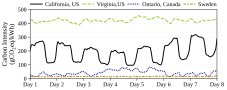
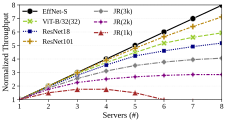
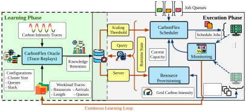
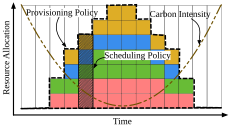
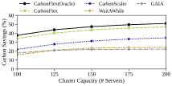
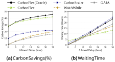
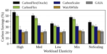
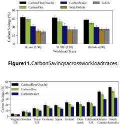

# **_CarbonFlex_ : Enabling Carbon-aware Provisioning and Scheduling for Cloud Clusters** 

Walid A. Hanafy 

University of Massachusetts Amherst 

USA 

David Irwin 

University of Massachusetts Amherst USA 

## **Abstract** 

Accelerating computing demand, largely from AI applications, has led to concerns about its carbon footprint. Fortunately, a significant fraction of computing demand comes from batch jobs that are often delay-tolerant and elastic, which enables schedulers to reduce carbon by suspending/resuming jobs and scaling their resources down/up when carbon is high/low. However, prior work on carbon-aware scheduling generally focuses on optimizing carbon for individual jobs in the cloud, and not provisioning and scheduling resources for many parallel jobs in cloud clusters. 

To address the problem, we present CarbonFlex, a carbonaware resource provisioning and scheduling approach for cloud clusters. CarbonFlex leverages continuous learning over historical cluster-level data to drive near-optimal runtime resource provisioning and job scheduling. We implement CarbonFlex by extending AWS ParallelCluster to include our carbon-aware provisioning and scheduling algorithms. Our evaluation on publicly available industry workloads shows that CarbonFlex decreases carbon emissions by ∼57% compared to a carbon-agnostic baseline and performs within 2.1% of an oracle scheduler with perfect knowledge of future carbon intensity and job length. 

## **1 Introduction** 

Data centers’ energy demand is growing at unprecedented levels [63], raising concerns about their carbon emissions and environmental impact. For example, a recent report predicts that global data center energy consumption will reach 1000 terrawatt-hours (TWh) by 2026 [31], or the equivalent of the average annual energy consumption of ∼33 million U.S. homes. This energy demand is expected to rise to 6-12% of the total U.S. electricity demand in the next 3-5 years [63]. Beyond the technical challenges in satisfying surging data center demand [42], their operations are also raising environmental and health concerns [25]. The Information and Communication Technologies (ICT) sector is now responsible for an estimated 1.5-4% of global carbon emissions, with data centers contributing the largest share [79]. Indeed, Google recently reported a 48% increase in its carbon footprint over the past five years [21]. To address the problem, data center 

Li Wu 

University of Massachusetts Amherst 

USA 

Prashant Shenoy 

University of Massachusetts Amherst USA 

operators, particularly large hyperscalers, have begun taking steps to reduce their carbon footprint by optimizing their energy sources and operations. 

Data centers and cloud providers have long used _supplyside_ approaches to decrease their emissions by procuring low-carbon energy in the market [9]. For example, cloud providers often make power purchase agreements (PPAs) with low-carbon energy suppliers, such as wind farms, to procure sufficient low-carbon energy to match their annual energy consumption [15, 48]. However, PPAs do not eliminate carbon emissions, as data centers still rely on grid energy and may consume high-carbon energy whenever their demand exceeds the supply of low-carbon energy, which is often from intermittent renewables [11]. 

To complement supply-side strategies, researchers have proposed _demand-side_ optimizations that reduce carbon by leveraging computing’s flexibility and adapting its demand to increase the use of low-carbon energy. For example, a significant fraction of computing demand comes from batch jobs that are often delay-tolerant and elastic, which enables schedulers to reduce carbon by suspending/resuming jobs and scaling their resources down/up when carbon is high/low [3, 16, 22, 27, 59, 67]. 

Given the potential above, there has been significant recent work on leveraging demand-side optimization to reduce carbon emissions of parallel batch jobs in the cloud [27, 39, 66, 78]. For example, recent work leverages batch jobs’ delaytolerance to reduce carbon by simply suspending them when energy’s carbon intensity is high, i.e., above some threshold, and resuming them otherwise [78]. Other work leverages parallel jobs’ elasticity to reduce carbon by scaling their resources down and up when energy’s carbon intensity goes up and down, respectively. However, prior work has generally focused on optimizing carbon emissions for individual parallel jobs in the cloud, and not provisioning and scheduling resources for many parallel jobs in cloud clusters [27]. 

Designing a carbon-aware scheduler for multiple parallel jobs in cloud clusters poses new challenges not addressed by previous scheduling approaches. First, clusters have a capacity limit that prior work on optimizing individual jobs in the cloud does not consider. Considering a capacity limit is important to avoid a “thundering herd” problem [60] where 

1 

Conference’17, July 2017, Washington, DC, USA 

Hanafy et al. 

all jobs defer their execution to the same low-carbon time and potentially exceed the cluster’s capacity. Second, prior per-job approaches often assume that important job characteristics, such as job length, are known _a priori_ . However, batch schedulers in practice generally do not know such detailed job-level information. For example, prior work has shown that accurately estimating per-job resource usage and duration is challenging [37]. Third, per-job approaches generally focus on minimizing carbon emissions while meeting the job deadline, while cluster schedulers often optimize other metrics, such as mean waiting time, makespan, and throughput. 

Beyond per-job scheduling, prior work at the cluster level has explored carbon-aware cluster capacity provisioning [28, 41, 59, 85, 86]. Given their low average utilization [63, 64, 72], prior work adapts the cluster’s resource capacity based on energy’s carbon intensity—by opportunistically scaling cluster capacity up when carbon is low. For example, Google defines a Variable Capacity Curve (VCC) [59] that determines a cluster’s time-varying capacity limit. This approach implicitly shifts jobs to run when the carbon intensity is low. However, prior cluster-level techniques for reducing carbon emissions focus on resource provisioning and overlook more efficient scheduling decisions, which can lead to higher carbon emissions and job completion times [27, 66]. 

To address these limitations, we present _CarbonFlex_ , a carbon-aware resource manager. _CarbonFlex_ views cluster resource management as two distinct tasks: capacity provisioning and job scheduling, and applies the principle of _elastic scaling_ to both its provisioning and scheduling decisions. In particular, _CarbonFlex_ leverages the elastic scaling capabilities available in many parallel batch jobs (e.g., scientific simulations [20, 46, 71] and machine learning training), where scaling their allocated resources up or down according to the carbon intensity is beneficial in carbon optimization. Moreover, when such elastic scheduling is done in conjunction with cluster-level capacity provisioning, where the entire cluster capacity is also scaled in a similar fashion, _CarbonFlex_ can further decrease carbon emissions. 

_CarbonFlex_ ’s elastic scaling and scheduling generalizes the notion of resource scaling introduced in CarbonScaler [27], by combining elastic scaling of parallel batch jobs with timevarying cluster capacity provisioning. Unlike CarbonScaler, which requires _a priori_ knowledge of job length, _CarbonFlex_ ’s algorithms operate without this information and achieve greater savings. Furthermore, the separation of resource provisioning from job scheduling in _CarbonFlex_ allows integration with alternative provisioning strategies–such as the VCC approach [59]–or the use of _CarbonFlex_ ’s capacity provisioning approach with other cluster schedulers. 

A key insight in _CarbonFlex_ is the use of continuous historical learning—learning over historical data—to drive its provisioning and scheduling decisions. Specifically, we utilize theoretical results that provide the basis for optimal 

carbon-aware scheduling of batch jobs in an offline setting where full future knowledge of job arrival, job lengths, and carbon intensity variations is known. In practice, while the future is unknown, the history of job arrivals, job characteristics, and carbon intensity is known. _CarbonFlex_ uses this information to “simulate” the offline optimal algorithm over past time windows to learn the scheduling and provisioning decisions and then uses parameters from this simulated execution for its runtime scheduling and provisioning. When the distributions of job characteristics and carbon intensity variations are stable, _CarbonFlex_ ’s decisions achieve carbon savings that are close to the optimal algorithm and are significantly better than other baseline methods. Moreover, by continuously learning from historical data in this manner, _CarbonFlex_ can adapt to changes in both job characteristics and carbon intensity variation patterns over time. Our hypothesis is that _continuous learning of optimal provisioning and scheduling decisions over historical job traces is an effective approach for carbon-aware provisioning and scheduling of elastic parallel batch jobs in cloud clusters._ 

In designing, implementing, and evaluating _CarbonFlex_ , our paper makes the following contributions. 

1. We present the design of _CarbonFlex_ , a resource manager for cloud clusters that optimizes operational carbon emissions by continuously learning provisioning and scheduling decisions from historical traces. 

2. We implement a prototype of _CarbonFlex_ on AWS ParallelCluster [4], a cloud HPC environment, using CPU and GPU clusters, and demonstrate its efficacy for a wide range of elastic MPI-based scientific and ML training jobs. 

3. We evaluate _CarbonFlex_ using publicly available cluster traces, job profiles, and carbon intensity traces from different geographical regions. Our evaluation results show that _CarbonFlex_ decreases carbon emissions by more than 57.5%, compared to a carbon-agnostic baseline and performs within 2.1% of a carbon-aware scheduling oracle. 

## **2 Background** 

This section presents background on data center carbon emissions, carbon-aware scheduling, and elastic batch jobs. 

### **2.1 Data Centers and the Electricity Grid** 

Data centers have traditionally focused on optimizing their energy efficiency through a variety of infrastructure-level and operational-level optimizations [6, 49]. For example, innovations in cooling (e.g., open-air cooling) have yielded significant reductions in their Power Usage Effectiveness (PUE), a metric that captures data centers’ energy efficiency. However, since data center energy efficiency has become highly optimized, further optimizations are expected to yield diminishing marginal improvements. Thus, cloud operators have begun to focus directly on the environmental and carbon impact of data center infrastructure [3, 59]. The carbon 

2 

Conference’17, July 2017, Washington, DC, USA 

_CarbonFlex_ 

**Figure 1.** Carbon Intensity Variations in four locations in the first week of April 2022. 

**Table 1.** Summary of prior work 

|**Approach**|**Multiple** **Jobs**|**Unknown** **Job Length**|**Capacity** **Scaling**|**Carbon-aware** **Scheduling**|**Resource** **Scaling**|
|---|---|---|---|---|---|
|Wait Awhile [78]|✘|✔|✘|✔|✘|
|DTPR [39]|✘|✘|✘|✔|✘|
|Wait and Scale [66]|✘|✔|✘|✔|✔|
|Carbon Scaler [27]|✘|✘|✘|✔|✔|
|GAIA [28]|✔|✔|✔|✔|✘|
|Green [81]|✔|✔|✘|✔|✔|
|Risk-Aware [55]|✔|✘|✔|✔|✘|
|Google VCC [59]|✔|✔|✔|✘|✘|
|Adaptive Capacity [41]|✔|✔|✔|✘|✘|
|_CarbonFlex_|✔|✔|✔|✔|✔|

### **2.2 Carbon-Aware Scheduling** 

impact of data centers consists of two main components: (i) _operational emissions_ , which comprise the emissions generated from the energy consumed by the hardware and infrastructure during its operations, and (ii) _embodied emissions_ , which consist of the emissions generated during the manufacturing and transporting of the computing hardware and other infrastructure components [24, 68]. Our work focuses on optimizing operational emissions through demand-side workload shifting methods, as it constitutes the majority of data center carbon emissions [44, 61]. 

Demand-side shifting methods, such as temporal and spatial shifting, are feasible in data centers because the carbon emissions from the consumption of a unit of electricity are not constant and vary continuously over time and across geographic regions. These variations are captured by energy’s carbon intensity (CI), measured in grams of CO2 per kWh of electricity or g·CO2eq/kWh, which captures the greenhouse gas (GHG) emissions per unit of electricity generated. The emissions from a unit of electricity generated depend on the source of generation, with fossil-based sources (e.g., natural gas and coal) having a high carbon intensity, while renewable sources (e.g., wind, solar, and hydro) have a low or zero carbon intensity. 

Figure 1 shows an example of four regions — with different energy sources — representing carbon intensity exhibited by cloud data centers. As shown, the figure highlights that the carbon intensity varies widely among locations with up to a ∼400g·CO2eq/kWh difference between Virginia and Canada, Ontario, two regions equally distant from customers in the northeast of the US. Moreover, the figure shows that even at a given location, carbon intensity fluctuates over time. For instance, the figure shows that the carbon intensity in California varies daily by ∼100g·CO2eq/kWh, resulting in different carbon footprints as per the time of execution. Workload-shifting techniques exploit these spatial and temporal variations by opportunistically performing more work at low-carbon periods or regions to reduce their operational emissions[3, 16, 22, 27, 59, 67]. 

Carbon-aware scheduling has focused on temporal shifting approaches that schedule jobs according to the carbon intensity and provisioning approaches that change the cluster size as per the carbon intensity. 

**_Temporal Shifting._** The temporal variations in carbon intensity have motivated researchers to utilize the inherent temporal flexibility of batch jobs by running them during lowcarbon periods and suspending them during high-carbon periods [3, 28, 39, 66, 67, 78]. In addition, researchers have proposed elastic scheduling methods, where jobs are typically scaled at low carbon periods and suspended at high carbon periods, eliminating the need to extend the deadline, or increasing the savings compared to typical suspend-resume approaches [27, 66]. The key issue for these approaches is that they typically focus on the scheduling of individual jobs. In doing so, these approaches either utilize a threshold-based approach [66, 78], which requires significant manual tuning to select a proper threshold and scale that balances the carbon savings and performance or assume full knowledge of the job length [27, 39], which is typically known to be error prone in practice [5, 37]. Moreover, these individual job approaches do not consider the data center-wide capacity constraints, resulting in demand bursts at low carbon periods [28], also known as the stampede or the thundering herd problems. Table 1 depicts a summary of these approaches’ key assumptions and mechanisms. 

**Cluster Schedulers.** At a cluster-level, carbon optimizations utilize the ability to vary the cluster capacity as well as the low average utilization of data centers [63, 64, 72], to change the cluster capacity based on temporal variations in carbon intensity [28, 41, 55, 59, 85, 86]. The key idea behind these approaches is varying the cluster size based on the carbon intensity of electricity—by opportunistically using larger cluster capacities in low carbon periods. For example, Google’s variable capacity curve (VCC) [59] computes a timevarying capacity limit for a data center cluster and then uses batch scheduling to schedule jobs in this variable capacity cluster, which forces batch jobs to move to lower carbon periods while ensuring the daily demand is met. However, despite the benefits of these approaches, they tend to focus 

3 

Conference’17, July 2017, Washington, DC, USA 

Hanafy et al. 

**Figure 2.** Elastic scaling profiles of different MPI and machine learning jobs that depict the marginal increase in throughput for each additional server. 

on varying the cluster capacity rather than job scheduling. For instance, these approaches do not utilize application elasticity or explicitly address the demand bursts in low-carbon periods. Table 1 summarizes the state-of-the-art approaches carbon-aware provisioning and scheduling. In this paper, we explore the benefits of utilizing carbon-aware provisioning and scheduling, where we vary the cluster size while scheduling jobs to reduce carbon emissions further. 

### **2.3 Elastic Batch Jobs and Scaling Profiles** 

Elastic scaling, also referred to as malleability [46, 71], is the ability to change the allocated resources seamlessly and has been shown to be applicable to a broad class of distributed batch jobs. For instance, machine learning frameworks (e.g., Pytorch [51]), Data Processing frameworks (e.g., Spark [84]), Parallel Programming Frameworks (e.g., MPI [12] and Charm++[35]) allow applications to adapt resources dynamically. Elastic scaling capabilities have enabled cluster operators to increase the utilization of cluster resources and avoid head-of-line blocking, fault-tolerance, and decrease energy consumption [14, 23, 33, 54, 56, 58, 71, 80]. In contrast, we focus on elastic scaling to optimize clusters’ operational emissions. 

Elastic scaling of a batch job must consider its scaling characteristics — since batch jobs rarely scale linearly with the number of allocation servers. Typically, the scaling behavior of a distributed job depends on its compute and communication characteristics [27, 33, 40]. The greater the communication per unit compute, the less likely the job’s throughput will scale with increasing resources. This is because communication bottlenecks increase when the computational resources are scaled up, resulting in diminishing increases in performance. Figure 2 shows the elastic scaling profiles of different batch applications. The setup for these profiles is detailed in Section 6.1. As shown, applications exhibit varying elastic scaling behaviors as per their compute-to-communication ratios. For example, EffNet-S has 8.37 GFLOPs and is 82.7 

MB, while ResNet18 has 1.81 GFLOPs and is 44.7MB1 , making the communication (model memory footprint) per unit compute 9.8MB/GFLOPs, 24.6MB/GFLOPs for EffNet-S and ResNet18, respectively, yielding higher scalability of EffNet-S as depicted in the figures. 

## **3 Carbon-aware Cluster Resource Management** 

This section describes the carbon-aware cluster provisioning and scheduling problem addressed in this paper. 

Our work assumes a homogeneous cloud clusters consisting of either CPU or GPU servers and aims to optimize the operational carbon footprint of parallel batch jobs. We assume that the cluster capacity can be dynamically varied over time — using cloud interfaces to acquire or release server instances — and that the maximum allowed cluster capacity is capped by a configurable parameter _𝑀_ . Similar to batch cluster schedulers, the cluster is assumed to support multiple submission queues (e.g., by job priority), where we assume that each queue has a pre-configured maximum delay _𝑑𝑖_ associated with it. This delay parameter _𝑑𝑖_ indicates the maximum duration (“slack”) the job can wait or be paused during its execution. Users submit their batch jobs to a specific queue according to their willingness to delay their jobs in exchange for potentially higher carbon savings. 

Our work targets elastic distributed (or parallel) batch jobs that run concurrently on multiple servers and potentially communicate across components during execution. Each job _𝑗_ has an arrival time _𝑎 𝑗_ and is submitted to job queue _𝑖_ that is configured with maximum delay _𝑑𝑖_ . The number of servers _𝑘_ allocated to the job can be varied at run-time between an upper and lower bound: _𝑘_ ∈[ _𝑘__𝑚𝑖𝑛_ _𝑗 ,𝑘__𝑚𝑎𝑥_ _𝑗_ ] where _𝑘__𝑚𝑖𝑛_ and _𝑘__𝑚𝑎𝑥_ denote the minimum and maximum numbers _𝑗 𝑗_ of servers that can be allocated to that job. Our model also supports non-elastic workloads (i.e., _𝑘__𝑚𝑖𝑛_ _𝑗_ = _𝑘__𝑚𝑎𝑥_ _𝑗_ ), where only the cluster capacity is scaled (see Section 6.4). Further, we assume that a job’s elastic scaling profile is known, which can be learned from profiling or performance models that consider the communication and computation patterns of jobs [8, 34, 50, 53, 54, 57, 65]. Our work considers a normalized elastic scaling profile, where the profile of a job _𝑗_ , denoted as _𝑝 𝑗_ , captures the normalized throughput increase (i.e., marginal throughput) for each additional server _𝑘_ where _𝑘_ ∈[ _𝑘__𝑚𝑖𝑛_ _𝑗 ,𝑘__𝑚𝑎𝑥_ _𝑗_ ], and _𝑝 𝑗_ ( _𝑘__𝑚𝑖𝑛_ _𝑗_ ) = 1. 

Under this scenario, at each time slot _𝑡_ , given the set of queued up and currently executing jobs _𝑁𝑡_ , maximum cluster capacity _𝑀_ , delay configurations _𝐷_ , and carbon intensity _𝐶𝐼 𝑡_ , our goal is to make two decisions: (i) provisioning decision: what should be the cloud cluster capacity for the next time step and (ii) scheduling decision: how many servers should be allocated to queued and running jobs, subject to the maximum allowed cluster capacity. The objective is to minimize 

> 1Data acquired from https://pytorch.org/vision/stable/models.html 

4 

Conference’17, July 2017, Washington, DC, USA 

_CarbonFlex_ 

the operational carbon emissions of the entire cluster while completing jobs within their queue-specific slacks. 

## **4 CarbonFlex Design** 

This section presents _CarbonFlex_ ’s design and its elastic scaling-driven provisioning and scheduling algorithms. 

### **4.1** **_CarbonFlex_ Overview** 

_CarbonFlex_ is a carbon-aware resource manager for batchoriented cloud clusters. The design of _CarbonFlex_ is based on three key principles: 

1. **Separate Provisioning from Scheduling:** _CarbonFlex_ views cluster resource management as two distinct tasks: provisioning and scheduling. The provisioning policy _𝜙_ (·) determines how many servers to acquire from the cloud for the entire clusters, while the scheduling policy _𝜓_ (·) determines which batch jobs to run on the available servers and how many servers to allocate to each. This separation of provisioning and scheduling is similar to other frameworks such as Mesos [30]. 

2. **Elastic Scaling:** _CarbonFlex_ applies the principle of elastic scaling to both its provisioning and scheduling policies, but with a carbon-aware focus. _CarbonFlex_ dynamically adjusts the cluster capacity and scale of batch jobs in response to carbon intensity variations, workload demand, and workloads’ scalability. 

3. **Historical Learning:** Lastly, _CarbonFlex_ uses a historical learning approach to derive its provisioning and scheduling decisions. To do so, _CarbonFlex_ simulates an offline oracle algorithm over past job arrivals to determine how such an optimal algorithm (which has full knowledge of job characteristics, carbon intensity, and future arrivals) would schedule jobs in a carbon-efficient manner. _CarbonFlex_ continuously learns key parameters for provisioning and scheduling from this historical analysis and uses them to derive its provisioning and scheduling decisions. We argue that _under the presence of a stable workload distribution, mimicking the decisions of an oracle provides similar carbon savings at runtime without any knowledge of job characteristics or future arrivals._ We handle workload changes through continuous learning, which enables adaption to distribution shifting by “relearning” the parameters needed for scheduling and provisioning. 

Figure 3 depicts _CarbonFlex_ ’s architecture and shows how the design principles above are instantiated through the learning and execution phases. In doing so, _CarbonFlex_ employs a two-step approach: 1) a Learning Phase, where _CarbonFlex_ employs continuous historical learning phase over the most recent cluster execution traces and captures the key decisions at different runtime states, and 2) an Execution phase, where _CarbonFlex_ utilizes such knowledge to enhance its provisioning and scheduling, which we detail below. 

**Algorithm 1:** `CarbonFlex_Oracle_Algorithm()` 

||**Input:**Jobs_𝑁_, Max Resources_𝑀_, Carbon Intensities CI. **Output:**Schedule_𝑆_|
|---|---|
|**1 **|**Initialization:**_𝑆_←{_𝑠_1_, ...,𝑠𝑁_} and_𝐿_←[ ];|
|**2 **|**for** _𝑗_∈_𝑁_**do**|
|**3**|**for**_𝑡_∈[_𝑎𝑗,𝑎𝑗_+_𝑙𝑗_+_𝑑𝑗_] **do** |
|**4**|**for**_𝑘_∈[_𝑘__𝑚𝑖𝑛_ _𝑗_ _,𝑘__𝑚𝑎𝑥_ _𝑗_ ] **do**|
|**5**|_𝐿_.append(_𝑗,𝑡,𝑘, 𝑝𝑗_(_𝑘_)/_𝐶𝐼𝑡,𝑎𝑗_+_𝑙𝑗_+_𝑑𝑗_);|
|**6**|_𝐿_←Sort(_𝐿_) ;`// w.r.t.` _𝑝𝑗_(_𝑘_)/_𝐶𝐼𝑡_`then` _𝑎𝑗_+_𝑙𝑗_+_𝑑𝑗_|
|**7 **|**while** |_𝐿_| _>_0**do**|
|**8**|_𝑗,𝑡,𝑘,_∗_,_∗←_𝐿.𝑝𝑜𝑝_();`// next highest` _𝑝𝑗_(_𝑘_)/_𝐶𝐼𝑡_|
|**9**|**if** � _𝑗_′∈_𝑁_\_𝑗__𝑠__𝑗_′ [_𝑡_] +_𝑘>_=_𝑀_**then**|
|**10**|continue;`// I cannot scale the current job.`|
|**11**|**if**_𝑝𝑟𝑜𝑔𝑟𝑒𝑠𝑠_(_𝑠𝑗_) _<_100%**then** `// Job not done.`|
|**12**|_𝑠𝑗_[_𝑡_] =_𝑘_;`// allocation of` _𝑗_`in slot` _𝑡_`as` _𝑘_`.`|
|**13 **|**for**_𝑠𝑗_∈_𝑆_**do**|
|**14**|**if**_𝑝𝑟𝑜𝑔𝑟𝑒𝑠𝑠_(_𝑠𝑗_) _<_100%**then**|
|**15** **16 **|**return**None`// Non Feasible`  **return**_𝑆_|

### **4.2 Learning Phase** 

The _CarbonFlex_ ’s learning phase (see Figure 3) employs continuous historical learning on recent cluster execution logs by replaying them to an offline oracle algorithm and learning from its provisioning and scheduling decisions. The process involves periodically (e.g., daily) tracking the job arrival logs and carbon intensity traces over a window of length _𝑇_ and replaying those traces to a simulated oracle algorithm. Note that the oracle algorithm can not be employed in practice since it requires full knowledge of the job arrival sequence, job characteristics, and carbon intensity variations. However, since the learning phase operates over historical traces, the entire arrival trace, characteristics of the jobs, and carbon intensity traces are known over the window _𝑇_ , making it possible to simulate an oracle over this past window. The oracle’s decisions can be viewed as mappings from the overall system state at each time _𝑡_ to the cluster capacity used for that state and the scheduling behavior in that case. 

As an example, consider a simplified system state described using two parameters: a carbon intensity value at time _𝑡_ , denoted by _𝐶𝐼 𝑡_ , and a job vector _𝑁𝑡_ that captures the number of jobs (running and queued) in each job queue. In this case, the tuple mapping ( _𝐶𝐼 𝑡, 𝑁𝑡_ ) ↦→( _𝑚𝑡, 𝜌_ ) denotes the cluster capacity _𝑚𝑡_ that was provided by the oracle for that system state, while _𝜌_ denotes the lowest marginal throughput across all scheduled jobs, indicating that no jobs with elastic scaling curves below this threshold were chosen for execution. The tuple mappings from the oracle’s simulated decisions at each time step _𝑡_ are then stored in a knowledge base that is later consumed during the execution phase. **_CarbonFlex_ Oracle.** The oracle, depicted in Algorithm 1, is a greedy algorithm that generates an execution schedule and a time-varying cluster capacity required to execute that 

5 

Conference’17, July 2017, Washington, DC, USA 

Hanafy et al. 

**Figure 3.** Overview of the learning and execution phases of _CarbonFlex_ . 

**Figure 4.** Representing the decisions made by _CarbonFlex(Oracle)_ as a provisioning and scheduling policy. 

schedule over a past window _𝑇_ . The algorithm takes historical job traces of _𝑇_ -length (e.g., a week) containing _𝑁_ jobs. Each job is characterized by an arrival time _𝑎 𝑗_ , job length _𝑙 𝑗_ , allowed delay _𝑑 𝑗_ (based on the selected job queue), and a scaling profile _𝑝 𝑗_ , as explained in Section 3. Using a resource at time slot _𝑡_ : _𝑡_ ∈[0 _,𝑇_ ] incurs a constant cost _𝐶𝐼 𝑡_ (e.g., carbon intensity), where CI = { _𝐶𝐼_ 1 _,𝐶𝐼_ 2 _, ...𝐶𝐼𝑇_ } is the set of carbon intensities for the _𝑇_ -length window. The algorithm then creates the execution schedule that optimizes the cluster’s total carbon emissions by creating a schedule _𝑠_ for each job while respecting its arrival and delay constraints, as well as the maximum cluster capacity _𝑀_ . 

Algorithm 1 uses a greedy approach for elastically scaling and scheduling jobs. The key insight is that for any given carbon intensity value, doing more work per unit of energy (i.e., greedily choosing jobs with higher marginal throughput) yields better energy and carbon efficiency [27, 33]. The algorithm starts by computing the marginal throughput per unit of carbon by considering all jobs, the time allowed for each job (from _𝑎 𝑗_ to _𝑎 𝑗_ + _𝑙 𝑗_ + _𝑑 𝑗_ ), and allowed scales [ _𝑘__𝑚𝑖𝑛_ _𝑗 ,𝑘__𝑚𝑎𝑥_ _𝑗_ ]. 

Then, it sorts the list (Line 6) in descending order of marginal throughput per carbon unit, using deadlines as a tie-breaking rule. For example, when two jobs have the same scalability (e.g., both at scale one), the job with the earliest deadline is prioritized. Since _𝑝 𝑗_ ( _𝑘__𝑚𝑖𝑛_ _𝑗_ ) = 1 ∀ _𝑗_ , all jobs are assigned _𝑘__𝑚𝑖𝑛_ _𝑗_ before scaling, which also ensures that no jobs are starved. The algorithm then iterates over the list, greedily assigning resources to jobs while respecting the maximum capacity until the job is completed, using the _𝑝𝑟𝑜𝑔𝑟𝑒𝑠𝑠_ (·) function. Finally, it verifies that all jobs have completed; otherwise, it marks the schedule as infeasible for the specified cluster capacity and job delays. In this case, we repeat the algorithm while extending the deadline for jobs that were not finished. **Runtime Complexity and Optimality.** Algorithm 1 runs in polynomial time. To schedule a trace with _𝑁_ jobs and _𝐾_ scaling states on a cluster of _𝑀_ servers, the complexity of computing the marginal throughput per unit of carbon (Lines 2-5) is O( _𝑁_ · _𝐾_ · _𝑇_ ), marginal throughput list sorting (Line 6) is O( _𝑁_ · _𝐾_ · _𝑇_ · log( _𝑁_ · _𝐾_ · _𝑇_ )), and iterating over possible resource allocations (Lines 7-13) is O( _𝑁_ · _𝐾_ · _𝑇_ ), and finally, the time complexity of job completion validation (Lines 14-16) is O( _𝑁_ ). The total time complexity is O( _𝑁_ · _𝐾_ · _𝑇_ + _𝑁_ · _𝐾_ · _𝑇_ · log( _𝑁_ · _𝐾_ · _𝑇_ ) + _𝑁_ ) ≃O( _𝑁_ · _𝐾_ · _𝑇_ · log( _𝑁_ · _𝐾_ · _𝑇_ )). 

**Theorem 4.1.** _Algorithm 1 yields optimal carbon savings for homogeneous clusters and monotonically decreasing marginal throughput profiles._ 

_Proof._ Algorithm 1 maps the carbon-aware scheduling problem to marginal throughput scheduling for which a greedy algorithm yields an optimal solution [19]. This optimality requires the following assumption: 1) scalability profiles featuring a monotonically decreasing marginal throughput curve (i.e., _𝑝 𝑗_ ( _𝑘_ ) _> 𝑝 𝑗_ ( _𝑘_ + 1) ∀ _𝑗,𝑘_ ), 2) the time-varying cost (carbon intensity in our case) is non-negative and bounded, and 

6 

Conference’17, July 2017, Washington, DC, USA 

_CarbonFlex_ 

**Table 2.** State representations and output decisions collected by _CarbonFlex_ from the offline Oracle. 

|**State**|**Explanation**|
|---|---|
|_𝐶𝐼𝑡_ _𝐶𝐼__𝐺_ _𝑡_ _𝐶𝐼__𝑅_ _𝑡_|Carbon Intensity in g·CO2eq/kWh. Gradient of the CI curve at_𝑡_. Rank of slot_𝑡_compared to day-ahead CI.|
|Queue Length|Number of jobs (paused + running) per queue.|
|Elasticity|Average elasticity across all jobs in the system.|
|**Decision**|**Explanation**|
|_𝑚𝑡_|The cluster capacity at time_𝑡_.|
|_𝜌_|The minimum used marginal throughput.|

3) switching cost (energy/emissions to scale the cluster or workloads) is negligible.2 □ 

**Retaining Oracle decisions.** The output of the offline oracle algorithm is visually depicted in Figure 4 and can be viewed as (i) the provisioned cluster capacity at time _𝑡_ , which varies over time, and (ii) how these servers are assigned among jobs, where jobs are not scaled until all jobs are assigned a single resource. Given these decisions over the past time window _𝑇_ , _CarbonFlex_ learns the provisioning policy as a mapping from the current system state at each time step _𝑡_ to the cluster size chosen at that step, i.e., a function that maps _𝑆𝑇𝐴𝑇𝐸_ ↦→ _𝑚𝑡_ . As discussed, the simplest representation of the current system state is the state of the job queues (e.g., the number of queued and running jobs in each queue) and the current carbon intensity values ( _𝐶𝐼𝑡, 𝑁𝑡_ ). 

In practice, our approach uses several other parameters to fully capture the current state, as shown in Table 2. These include carbon intensity gradient (whether the carbon intensity is increasing or decreasing), the day-ahead ranking of the _𝐶𝐼𝑡__𝑅_(how favorable the current slot is compared to the future CI forecast3 ), the number of jobs per queue, and the mean elasticity of all jobs in the system. Similarly, the scheduling threshold is computed as a mapping _𝑆𝑇𝐴𝑇𝐸_ ↦→ _𝜌_ , which indicates that the oracle scheduling policy only schedules jobs with higher marginal throughput than the threshold. The provisioning and scheduling policy decisions per state mappings are then stored in a knowledge base that is later used in the execution phase. Finally, older mappings from the knowledge base are aged out over a rolling window to adapt to seasonal variations in carbon intensity and any changes in the workload distribution over time. 

> 2Our experiments in §6 show that even when some of these optimality conditions do not hold in practice, the oracle still provide significant (but not necessarily optimal) savings, allowing our learning-based approach to effective at runtime. 

> 3 _CarbonFlex_ assumes a carbon information service such as ElectricityMaps 

> [45] that provides day-ahead CI forecasts. 

### **Algorithm 2:** _`CarbonFlex`_ `Provisioning` _<u>𝜙</u>_ ( _._ ) 

**Input:** _𝑆𝑇𝐴𝑇𝐸_ , k, Delay violations _𝑣_ , Expected distance _𝛿_ , Violation tolerance _𝜖_ **Output:** Provisioning Resources _𝑚𝑡_ **1** ℜ←match( _𝑆𝑇𝐴𝑇𝐸_ , k) **2 if** _Distances(_ ℜ) _> 𝛿 AND 𝑣 > 𝜖_ **then 3 return** M **4 else if** _𝑣 > 𝜖_ **then 5 return** Max(ℜ _.𝑚𝑡_ ) **6 return** Mean(ℜ _.𝑚𝑡_ ) **Algorithm 3:** _`CarbonFlex`_ `Scheduling` _<u>𝜓</u>_ ( _._ ) **Input:** Current time _𝑡_ , Current jobs _𝑁𝑡_ , Available resources _𝑚𝑡_ , Marginal throughput threshold _𝜌_ . **Output:** Resource allocation _𝑆𝑡_ **1 Initialization:** _𝑆_ ←{} and _𝐿_ ←[ ]; **2 for** _𝑗_ ∈ _𝑁𝑡_ **do 3 for** _𝑘_ ∈[ _𝑘__𝑚𝑖𝑛_ _𝑗 ,𝑘__𝑚𝑎𝑥_ _𝑗_ ] **do 4 if** _𝑝 𝑗_ ( _𝑘_ ) _> 𝜌_ **then 5** _𝐿_ .append( _𝑗,𝑘, 𝑝 𝑗_ ( _𝑘_ ) _,𝑎 𝑗_ + _𝑑 𝑗_ − _𝑡_ ); **6** _𝐿_ ← Sort( _𝐿_ ) ; `// w.r.t.` _𝑝 𝑗_ ( _𝑘_ ) `then` _𝑎 𝑗_ + _𝑑 𝑗_ − _𝑡_ **7 while** | _𝐿_ | _>_ 0 _and_� _𝑗_ ∈ _𝑁𝑡__𝑆_ _𝑗_[_𝑡_]_< 𝑚_ _𝑡_**do** **8** _𝑗,𝑘,_ ∗ _,_ ∗← _𝐿.𝑝𝑜𝑝_ (); `// next highest` _𝑝 𝑗_ ( _𝑘_ ) **9** _𝑆_ [ _𝑗_ ] = _𝑘_ ; `// increase allocation of` _𝑗_ **10 return** _𝑆_ 

### **4.3 Run-time Provisioning and Scheduling** 

_CarbonFlex_ ’s execution phase implements runtime provisioning and scheduling algorithms that optimize carbon emissions while respecting the queue-specific delays. These algorithms use knowledge derived from the oracle’s decisions during the offline learning phase to make real-time decisions. At runtime, users submit their jobs to the cluster by selecting a job queue, e.g., by job length. At the start of each time slot _𝑡_ , the _CarbonFlex_ computes the current system state, using the attributes in Table 2, and queries the knowledge base for the top-k closest matches in terms of similar system states that were seen in the past. _CarbonFlex_ then mimics the decisions of these situations while considering the utility of these decisions in previous time slots. 

Algorithm 2 lists how _CarbonFlex_ determines the cluster capacity _𝑚𝑡_ to provision for the next time slot. First, _CarbonFlex_ uses the current state tuple and queries the knowledge base for the top-k best matches (e.g., using Euclidean distance). It then computes the mean provisioned capacity for the top-k matches and provisions the cluster size accordingly. Before doing so, it checks the average delay violations _𝑣_ experienced by recently completed jobs (e.g., in the last hour). If the violation exceeds a certain percentage _𝜖_ , and the distance between the _𝑆𝑇𝐴𝑇𝐸_ and the closest cases is larger than _𝛿_ , the provisioning function falls back to carbon-agnostic execution and provisions the maximum cluster capacity _𝑀_ . 

After “right-sizing” the cluster at the start of the time slot _𝑡_ , the scheduling algorithm in Algorithm 3 then decides 

7 

Conference’17, July 2017, Washington, DC, USA 

Hanafy et al. 

which jobs to schedule and how much to allocate to each scheduled job at run (e.g., every Δ _𝑡_ or whenever a job arrives or finishes). To do so, the algorithm iterates over the current jobs and selects all jobs with marginal throughput larger than _𝜌_ . It also computes marginal throughput at each scale and the available delay budget for each job. Then, it sorts assignments according to their marginal throughput and available delays (Line 6). Finally, the algorithm iterates over the list of schedules, choosing jobs until the current capacity _𝑚𝑡_ is filled. Similar to Algorithm 1, jobs are not scaled until all jobs are given _𝑘__𝑚𝑖𝑛_ _𝑗_ resources, ensuring high efficiency and avoiding starvation. 

submits a new job based on the new scale, resuming the progress. We report on these overheads in Section 6.8. **_Energy and Carbon Monitoring:_** As stated earlier, _CarbonFlex_ ’s focuses on operational emissions, which constitute the majority of emissions in datacenters [44, 79]. Considering embodied emissions in carbon-aware scheduling, is subject to the sunk cost fallacy [7]. We compute the operational carbon emissions of the cluster at time _𝑡_ , denoted as C _𝑡_ , as follows: 

$$
C𝑡= 𝑁𝑡 \sum{}{}︁ 𝑗 𝐸𝑗𝑠\times{}{} 𝑐𝑡 (1)
$$

$$
𝐸𝑗𝑠= 𝐸𝑅 𝑗𝑠+ 𝐸𝑛𝑒𝑡 𝑗𝑠 (2)
$$

## **5 CarbonFlex Implementation** 

We implement _CarbonFlex_ using AWS ParallelCluster [4], a cluster management tool that deploys and manages highperformance computing (HPC) Slurm [82] clusters in the cloud. AWS ParallelCluster uses EC2 instances that span various hardware configurations, networks, and accelerators. We implement _CarbonFlex_ using PySlurm [1] as a Slurm interface that submits workloads to the cluster according to our underlying provisioning and scheduling policies. Our prototype, available at (https://github.com/umassos/CarbonFlex), has the following components: 

**_Continuous Learning:_** We implement our _CarbonFlex(Oracle)_ on a simulation environment using Python. The _CarbonFlex(Oracle)_ utilizes the historical workload traces, scheduling profiles, configurations, and historical carbon intensity data to calculate the carbon optimal schedule and compute the historical ( _𝑆𝑇𝐴𝑇𝐸_ ↦→ _𝑚𝑡, 𝜌_ ) mappings. **_Runtime Provisioning:_** At the start of each slot, which we set as 1 hour, _CarbonFlex_ computes the number of provisioned servers and scheduling configurations by following the decisions made by the offline oracle. Our implementation relies on Case-Based Reasoning that finds solutions by establishing similarities between current and historical states and executing similar actions while retaining the ability to interpret or understand confidence in the recommended solution [76]. Our implementation finds similar states using KNN from the Scikit-learn library [52], where we utilize Euclidean distance and represent the historical cases in a KD-Tree for fast access, select the nearest five instances k = 5 and combine them as detailed in Algorithm 2. 

**_Elastic Scaling and Scheduling:_** After computing available capacity, _CarbonFlex_ schedules workloads based on their marginal capacity, as detailed in Section 4.3. When the capacity or number of queued jobs changes or every Δ _𝑡_ , e.g., 5 minutes, _CarbonFlex_ computes each job’s resource assignment and scale using Algorithm 3, which can be efficiently implemented using a binary tree. To run a job, _CarbonFlex_ submits it as a Slurm job to the appropriate job queue using PySlurm. Finally, to scale jobs, _CarbonFlex_ uses the `scancel` command, which signals the job to checkpoint its state and 

$$
𝐸𝑛𝑒𝑡 𝑗𝑠 = 𝜂𝑛𝑒𝑡\times{}{} 𝑀𝑒𝑚𝑗𝑠 (3)
$$

where _𝐸 𝑗𝑠_ represents the energy consumption by job _𝑗_ at scale _𝑠_ , which consists of compute and network components, denoted as _𝐸__𝑅_ _𝑗𝑠_and_𝐸𝑛𝑒𝑡_ _𝑗𝑠_, respectively.4_𝐸𝑅_ _𝑗𝑠_takes into account the number of compute resources (e.g., CPU cores) and can be augmented to include energy consumption for memory, base power, and PUE. However, due to the challenges in accurately assessing power consumption per tenant in data centers, our CPU experiments involve clusters where these numbers are often not known, and we assume a fixed value per resource, a common approach in carbon accounting [18, 22, 38]. Further, our results emphasize normalized savings, making absolute energy or carbon values less significant. In contrast, for GPU experiments, we utilize `nvidia-smi` , which allows us to measure the energy usage for each GPU and aggregate it across the scale employed by this job. 

To account for the network cost _𝐸__𝑛𝑒𝑡_ _𝑗𝑠_, we utilize the net- work energy efficiency ( _𝜂𝑛𝑒𝑡_ ) measured in _𝑊_ / _𝐺𝑏𝑝𝑠_ and _𝑀𝑒𝑚 𝑗𝑠_ is the amount of data transferred by the job _𝑗_ at scale _𝑠_ . Since _𝜂𝑛𝑒𝑡_ widely varies in prior work, by up to three orders of magnitude (e.g., due to network type and topology) [32, 69, 74], our experiments utilize a value of 0.1 _𝑊_ / _𝐺𝑏𝑝𝑠_ . Lastly, we compute _𝑀𝑒𝑚 𝑗𝑠_ based on the communication paradigm used for the workload as per its implementation and memory requirements (e.g., distributed training [51] uses `Ring-Allreduce` ). 

**_Simulation Environment:_** Lastly, we integrate the online and offline scheduling policies and the baselines into a simulation environment, denoted as _CarbonFlex-Simulator_ , which enables year-long evaluation. 

## **6 Experimental Evaluation** 

This section evaluates the performance of our _CarbonFlex_ prototype and its provisioning and scheduling policies based on its carbon savings and delay under different scenarios. We evaluate _CarbonFlex_ ’s carbon emissions using real-world CPU and GPU clusters on AWS ParallelCluster [4]. Then, we 

> 4A job can take multiple scales or utilize part of the time slot, details we omitted in this model for clarity. 

8 

Conference’17, July 2017, Washington, DC, USA 

_CarbonFlex_ 

**Figure 5.** Diversity in selected Carbon Intensity traces. 

**Table 3.** Details of the elastic workloads in evaluation. 

|**Workload**|**Impl.**|**Comm. Size**|**Scalability**|
|---|---|---|---|
|_𝑁_-body(_𝑁_=100_𝑘_) [2]|MPI|5.3 MB∗|High|
|_𝑁_-body(_𝑁_=10_𝑘_) [2]|MPI|0.53 MB∗|High|
|_𝑁_-body(_𝑁_=3_𝑘_) [2]|MPI|0.16 MB∗|Moderate|
|_𝑁_-body(_𝑁_=2_𝑘_) [2]|MPI|0.1 MB∗|Moderate|
|Jacobi(_𝑁_=3_𝑘_) [75]|MPI|51.2 MB∗|Low|
|Jacobi(_𝑁_=2_𝑘_) [75]|MPI|28.6 MB∗|Low|
|Jacobi(_𝑁_=1_𝑘_) [75]|MPI|7.16 MB|Low*|
|AlexNet [36]|Pytorch|233.1 MB|Low|
|ResNet18 [29]|Pytorch|44.7 MB|Low|
|ResNet50[29]|Pytorch|97.8 MB|Moderate|
|ResNet101[29]|Pytorch|170.5 MB|High|
|EffNet-S [70]|Pytorch|82.7 MB|High|
|ViT-B/32[17]|Pytorch|336.6 MB|Moderate|

> <u>∗</u> This application present our least scalable workload (See Figure 2). 

augment our prototype evaluation with additional simulations that leverage _CarbonFlex-Simulator_ . Lastly, we present a sensitivity analysis and system overheads. 

### **6.1 Experimental Setup** 

**_Workload Traces._** Our experiments use three workload traces: a month-long _Azure_ trace [13]; a two-month _AlibabaPAI_ trace [77]; and a year-long _SURF Lisa-HPC_ trace [10], each of which has different arrival patterns and job lengths. In our experiments, we focused on hour+ workloads, as shorter jobs have minor contributions to the total compute time, and they are usually not delay-tolerant. Then, we sample these traces by creating _historical_ and _evaluation_ traces. We split the _historical_ trace into two week-long traces and used them for the learning phase, while the _evaluation_ trace is a week-long trace used to evaluate our proposed approaches. We sample these traces from different parts of the trace. For instance, we utilize the first two weeks of the _Azure_ for sampling the _historical_ trace and the third week to sample the _evaluation_ trace. In contrast, for more extended traces such as _Alibaba-PAI_ traces that span two months, we utilized the first 7 weeks for learning and the 8th week for evaluation. Finally, unless otherwise stated, we randomly assign the elasticity profiles (see Table 3) to the workloads. 

**_Elastic Workloads_** Table 3 describes our CPU and GPU workloads implemented using MPI [47] and Pytorch [51], respectively. The table presents the workload names, communication sizes in MB, and scalability, categorizing applications as High, Moderate, or Low scalability jobs. We obtain 

profiles through one-time profiling that iterates over possible nodes between [ _𝑘__𝑚𝑖𝑛_ _,𝑘__𝑚𝑎𝑥_ ] and runs for a brief duration (typically a few minutes). In our current experiments, we profiled workloads on AWS at various scales. CPU loads were profiled between [ _𝑘__𝑚𝑖𝑛_ = 1 _,𝑘__𝑚𝑎𝑥_ = 16] CPU cores, while GPU loads were profiled from [ _𝑘__𝑚𝑖𝑛_ = 1 _,𝑘__𝑚𝑎𝑥_ = 8] due to limitations in GPU capacity. 

**_Carbon Traces._** We used hourly carbon intensity traces from Electricity Maps [45] for December 2021 to December 2022 for 10 geographical regions. Figure 5 shows the mean carbon intensity and daily variability, measured by the Coefficient of Variation (CoV) throughout this period, where regions with higher CoV often depend on intermittent energy sources such as renewables. As shown, the selected regions represent possible situations of average carbon intensity and daily variability in carbon intensity. Finally, we assume knowledge of day-ahead carbon intensity, as prior work demonstrates that such forecasts are highly accurate [43]. 

**_Baselines._** We compare our _CarbonFlex_ with 5 state-of-theart carbon-aware scheduling baselines for homogeneous resources. For fairness, we assume that all baselines have access to historical traces and can use the mean job length for computing the schedule: 

1. **_Carbon-Agnostic_** : This policy represents the status quo, where jobs are scheduled FCFS without elastic scheduling. We use this policy as a baseline to compute the carbon savings for all other policies. 

2. **_GAIA_** [28]: We utilize GAIA’s Lowest-Window Policy, which schedules jobs in a non-elastic manner by selecting the best start time based on the mean job length within a time window _𝑑_ to minimize carbon emissions. We augment the policy with resource limits and use FCFS when multiple jobs want to run in the same time slot. 

3. **_Wait Awhile_** [78]: We implement the threshold version of the _Wait Awhile_ policy, which operates the job in a suspend-resume fashion according to carbon intensity. The threshold is determined by the 30th percentile of carbon intensity predictions for the next 24 hours. To meet SLO requirements, the job runs to completion after the permitted delay. We use FCFS when multiple jobs want to run in the same time slot. 

4. **_CarbonScaler_** [27]: We adapted the _CarbonScaler_ algorithm to run at a multi-job cluster, where the schedule is computed based on historical job length. In addition, to respect the cluster-wide capacity, we prioritize scaling jobs with higher marginal throughput. Lastly, when the job surpasses its allowed delay, it runs until completion. 

5. **_CarbonFlex(Oracle)_** : Finally, we added the offline oracle as a baseline that implements Algorithm 1 and assumes full knowledge of carbon intensity and job length. 

**_Deployment._** We deployed _CarbonFlex_ in AWS and evaluated it on a CPU and GPU cluster. In our CPU cluster, we utilize 

9 

Conference’17, July 2017, Washington, DC, USA 

Hanafy et al. 

**Figure 6.** Carbon emissions (a) and delay (b) across carbon-aware scheduling approaches for the CPU cluster. 

150 `C8` VMs, yielding a mean utilization of ∼50%, the common utilization across clusters [63]. In contrast, for the GPU cluster, our resource quota only allowed for 15 `G6` GPUs, so we limited the sampling to ensure similar utilization for this cluster size. To simulate the behavior of _CarbonFlex(Oracle)_ , specifically the learning phase, we replay the available historical trace with different start times, a step that helps improve the performance of _CarbonFlex_ . Finally, we augment our evaluation with year-long assessments using _CarbonFlexSimulator_ to evaluate many different scenarios and settings. Note that, in all experiments, unless otherwise stated, we utilize the carbon intensity trace of South Australia; clusters have 50% utilization as reported utilization in real-world clusters [63, 64, 72], which results in a maximum cluster capacity of 150 for CPU clusters and 15 for GPU clusters; and that the cluster has three length-based queues with _𝑑_ = 6 _ℎ𝑟𝑠,_ 24 _ℎ𝑟𝑠_ , and 48 _ℎ𝑟𝑠_ for short ( _𝑙_ ≤ 2hrs), medium (2 _< 𝑙_ ≤ 12hrs) and long ( _𝑙 >_ 12hrs) jobs. 

### **6.2 Optimizing Carbon Emissions** 

In this section, we evaluated _CarbonFlex_ ’s ability to optimize a cluster’s carbon emissions under different configurations and compute types. 

**_CPU Cluster._** First, we evaluate the performance of _CarbonFlex_ using our prototype on AWS using the `C8` instances CPU-cluster, with _𝑀_ = 150. Figure 6 shows the total carbon emissions of our cluster under different scheduling baselines. As shown, _CarbonFlex_ can reduce the carbon emissions by 51.4% (only 6.6% away from the _CarbonFlex(Oracle)_ ) and achieves 17.4%, 31%, and 33.3% higher savings than _CarbonScaler_ , _Wait Awhile_ , and _GAIA_ , respectively. In addition, the results show that approaches that use scaling (e.g., _CarbonFlex_ and _CarbonScaler_ ) offer higher savings as they can better utilize variations in carbon savings, while approaches that use suspend-resume scheduling (e.g., _Wait Awhile_ ) perform better than those that do not consider preemption. 

Figure 6b shows the delay experienced across baselines, where the _Carbon-Agnostic_ baseline exhibits no waiting and _CarbonFlex(Oracle)_ respects all SLOs. As shown, policies typically respect the delay, where all approaches are configured to run to completion once the allowed delay period is over. 

**Figure 7.** Carbon emissions and savings (on-top) across carbon-aware scheduling approaches in a GPU cluster. 

The highest delays, however, are exhibited by scale-based approaches (e.g., _CarbonFlex_ and _CarbonScaler_ ) as the use of provisioning in _CarbonFlex_ may limit the cluster capacity and limit how jobs are scheduled, leading to an average delay of 17.5 hours. In addition, _CarbonScaler_ may under-predict job length and delay it beyond the allowed delay, requiring the job to run beyond its allowed delay, leading to an average delay of 22.3 hours. Finally, it is worth noting that _CarbonFlex_ will often have a lower average delay, as _CarbonFlex(Oracle)_ can be aggressive in its carbon-aware scheduling decisions, delaying the jobs to the maximum possible time. 

**_GPU Cluster_** Figure 7 shows the carbon emissions and savings using our prototype evaluation on 15 `G6` GPU cluster on AWS. As shown, _CarbonFlex_ significantly reduces carbon emissions, achieving 57.5% savings, which is 2.1% from the _CarbonFlex(Oracle)_ . As in the CPU cluster, _CarbonFlex_ is able to reduce carbon emissions by 20.8%, 44%, and 47.2% compared to _CarbonScaler_ , _Wait Awhile_ , and _GAIA_ . Interestingly, the results reveal that in our GPU cluster — where applications exhibit inherently heterogeneous power consumption — approaches that use scaling can achieve higher carbon savings than the baseline methods relying on temporal shifting techniques. This occurs because scaling approaches prioritize workloads with higher marginal throughput during lowcarbon periods (i.e., low communication per unit compute), which typically consume more power. Consequently, directing applications with higher power usage to low-carbon periods further enhances our savings. 

10 

Conference’17, July 2017, Washington, DC, USA 

_CarbonFlex_ 

**Figure 8.** Impact of the maximum cluster capacity on the carbon savings. 

**_Key Takeaways:_** _On CPU and GPU clusters, CarbonFlex yields carbon savings up to 57.5% and 20.8% compared to CarbonAgnostic and CarbonScaler, respectively._ 

### **6.3 Effect of Configurations** 

This section demonstrates how cluster configurations (e.g., delay) affect the carbon savings and _CarbonFlex_ ’s ability to adapt its decisions per these configurations. 

**_Effect of Cluster Capacity_** The maximum cluster capacity represents the headroom available to stack workloads during low-carbon periods, reducing the total carbon emissions. Figure 8 demonstrates the effect of headroom represented in terms of the maximum allowed cluster capacity limit, denoted as _𝑀_ , where _𝑀_ = 100, 150, and 200, which represents ∼75%, ∼50%, and ∼37% utilization, respectively. As shown, _CarbonFlex_ closely follows _CarbonFlex(Oracle)_ across all cluster capacities, achieving between ∼3.7% from the _CarbonFlex(Oracle)_ . In addition, _CarbonFlex_ outperforms other approaches, such as _CarbonScaler_ with up to 12.5% savings. Moreover, the figure shows that using elastic scheduling can better utilize the available capacity and further reduce carbon emissions. In contrast, approaches that only rely on temporal shifting increase the carbon savings by 8.4%. Moreover, the results show that increasing the cluster size comes with diminishing returns, where increasing the maximum cluster capacity from 100 to 200 by 13.2% and 13% from the _CarbonFlex(Oracle)_ and _CarbonFlex_ , respectively. Lastly, as detailed in the previous work [26, 27], elastic scaling introduces cost overheads, where increasing the cluster comes with increases in the total operational cost as applications run with lower marginal throughput. However, such overheads were negligible where the carbon overheads across all methods and cluster sizes were lower than 3.2%. 

**_Effect of Delay_** The delay represents the scheduling flexibility of workloads, a key aspect of carbon savings. Figure 9 shows the impact of extending the delay on the carbon savings and waiting time of _CarbonFlex_ and other baselines, assuming that queues have the same delay. We change the allowed delay per job from 0 hrs (using only elasticity) to 36hrs. Figure 9a shows that increasing the allowed 

**Figure 9.** Impact of the allowed delay (slack) on the carbon savings (a) and waiting time (b). 

delay to _𝑑_ = 36hrs results in carbon savings of 18.3% and 13.8% for _CarbonFlex(Oracle)_ and _CarbonFlex_ , respectively. Notably, the figure shows that _CarbonFlex_ follows the _CarbonFlex(Oracle)_ , where it achieves carbon savings within 3.6% of _CarbonFlex(Oracle)_ ’s savings. The figure also shows how other baselines behave under different temporal flexibilities. For instance, approaches such as _Wait Awhile_ , which only depend on temporal shifting, result in no carbon savings when _𝑑_ = 0 and only reduce carbon savings by 19.7% when _𝑑_ = 36. In contrast, approaches that utilize elasticity (e.g., _CarbonFlex(Oracle)_ ) achieve much higher savings compared to non-elastic baselines. 

Figure 9b shows the average waiting time across the cluster across different baselines. As expected, as the allowed delay increases, so does the waiting time. The figure shows that for the small allowed delays, _CarbonFlex_ and _CarbonScaler_ violate the allowed delay by 3.4 and 1.6 hours, which explains the increase of carbon savings over _CarbonFlex_ in Figure 9a. Moreover, although not visible, some of the jobs in the oracle also exceed the deadline (i.e., a non-feasible schedule), which we fix by extending the delay for these specific jobs. However, as the allowed delay increases, _CarbonFlex_ requires less delay as it greedily schedules resources at the first possible moment resources are available. Lastly, the figure shows that, across baselines, increasing the delay increases carbon savings but with diminishing returns [27, 67]. 

**_Key Takeaways:_** _CarbonFlex can incorporate different configurations in its provisioning and scheduling decisions, outperforming other baselines and achieving savings that are within 3.6% of the CarbonFlex(Oracle)._ 

### **6.4 Effect of Workload Characteristics** 

Besides the scheduling configuration, the characteristics of the workload traces (e.g., arrival rates or job scalability) affect the potential carbon savings. In this section, we assess the impact of workloads’ elasticity and workload traces. **_Effect of Jobs Elasticity_** The elasticity of workloads is crucial for achieving significant carbon savings, as it enables 

11 

Conference’17, July 2017, Washington, DC, USA 

Hanafy et al. 

**Figure 10.** Workload elasticity impact on carbon. 

workloads to take advantage of periods of low carbon intensity. Figure 10 illustrates the impact of workload elasticity, comparing carbon savings across workloads with varying characteristics. We explore three scenarios in which we assume that all jobs exhibit specific scaling behaviors using _𝑁_ - body( _𝑁_ =100 _𝑘_ ), _𝑁_ -body( _𝑁_ =2 _𝑘_ ), and Jacobi( _𝑁_ =1 _𝑘_ ) denoted as high, moderate, and low elasticity, (see Table 3). Additionally, we use our primary scenario of randomly assigning profiles to workloads, referred to as “Mix,” and a “NoScaling” scenario, which highlights the benefits of _CarbonFlex_ ’s resource provisioning, in situations where jobs can only be paused but not scaled. As demonstrated, workloads with enhanced scaling can attain greater carbon savings, reducing carbon savings of up to 56.1% and 49.5% for the highly scalable workloads under _CarbonFlex(Oracle)_ , and _CarbonFlex_ , respectively. In addition, aside from the scaling profile, _CarbonFlex_ resembles _CarbonFlex(Oracle)_ ’s performance, achieving within 3.4% and 6.6% of its savings. 

Moreover, the figure shows the benefits of _CarbonFlex_ ’s historical learning approach, where even without scaling, _CarbonFlex_ can achieve higher carbon savings than baselines, achieving 1.4% more savings than _CarbonScaler_ , which acts suspend-resume. Lastly, the figure illustrates how different approaches perform under different elasticity profiles. For instance, it shows that _CarbonScaler_ cannot take advantage of high elasticity, performing significantly worse than other baselines. The reason is that all workloads adopt similar schedules, causing them to run during higher carbon periods and default to the lowest scale run-to-completion behavior. In contrast, baselines that do not use scaling (e.g., _Wait Awhile_ ) have a consistent behavior apart from the workloads’ elasticity behavior. 

**_Workload Traces_** The characteristics of the trace (e.g., average job length) dictate the potential carbon savings and the benefits of elastic scaling. Figure 11 illustrates the carbon savings across the _Azure_ trace [13], _Alibaba_ trace [77], and _SURF_ trace [10], where a maximum cluster capacity is selected to achieve 50% utilization. As shown, _CarbonFlex_ can attain significant carbon savings across traces, ranging from 43.7% (3.6% from _CarbonFlex(Oracle)_ ) for the _Azure_ trace to 36.9% (5.7% from _CarbonFlex(Oracle)_ ) for the _Alibaba_ 

**Figure 12.** Carbon Savings (%) across locations under multiple job queues. 

**Figure 13.** Impact of distribution shifts. 

trace. The reason for these differences can be traced back to variations in job length, as _Azure_ has a higher average job length compared to the other traces. This is also reflected in the disparities between elastic and non-elastic scheduling approaches, as shorter jobs do not benefit from scaling or interruptibility. This is evident in the difference in carbon savings between _CarbonFlex_ and _GAIA_ , which decreases from 22.3% in _Azure_ to 11.6% in _Alibaba_ , as well as between _Wait Awhile_ and _GAIA_ . 

**_Key Takeaways:_** _CarbonFlex achieves high carbon savings across workloads with different elasticity and length distributions. Our results demonstrate that our historical learning approach is beneficial without elastic scaling._ 

12 

Conference’17, July 2017, Washington, DC, USA 

_CarbonFlex_ 

**Figure 14.** Comparing _CarbonFlex_ with carbon-aware capacity provisioning. 

### **6.5 Effect of Cloud Location** 

As noted in Section 2.1, the supply mix significantly affects optimizing carbon emissions, where locations with a variable carbon intensity typically result in higher carbon savings. Figure 12 shows the carbon savings across ten locations sorted by the achievable carbon savings. As shown, _CarbonFlex_ highly matches the carbon savings of _CarbonFlex(Oracle)_ , where it achieves 0.9% and 6.31% within its carbon savings. Moreover, as shown, the carbon savings are strictly a function of the carbon intensity variability, where locations with highly variable carbon intensity (see Figure 5) have higher savings than locations such as Virginia, US, where in 2022, 85% of its electricity consumption came from non-variable sources (Natural Gas 54% and Nuclear 31%) [73], resulting in limited saving opportunities. Lastly, the figure also shows that as the variability increases, the difference between _CarbonFlex_ and _CarbonScaler_ also increases, highlighting the impact of _CarbonFlex_ in reducing carbon. 

### **6.6 Effect of Workload Distribution Shifts** 

Another key assumption in _CarbonFlex_ is that historical and real-time workload traces share some resemblance. Although this is mostly true, _CarbonFlex_ ’s continuous learning strategy will quickly pick up on such changes. Figure 13 illustrates the case where we alter distribution shifts by increasing the inter-arrival rate and job length between -20% and 20%, leading to changes in cluster utilization, where zero means the original trace. As shown, the decreases in arrival rates and job lengths allow _CarbonFlex_ to reduce carbon emissions further as the average utilization of the cluster becomes lower, where carbon savings increase by 10.1%. In contrast, when the arrival rate is higher, the potential carbon savings decrease, reaching 26%. 

### **6.7 Carbon-aware Provisioning** 

In addition to carbon-aware scheduling approaches, researchers have proposed carbon-aware provisioning to reduce the total emissions of data centers, which include both interactive and batch applications [59] and demonstrate the impact of load shifting on the grid [41]. Despite the differences in scope, we illustrate that _CarbonFlex_ is interoperable with other provisioning approaches, which highlights the 

benefit of _CarbonFlex_ ’s separation of provisioning and scheduling. Figure 14 presents the performance of carbon-aware provisioning approaches. Our baselines include a carbonaware provising approach, which computes the provisioning based on the VCC approach [59] and schedules workloads in an FCFS manner, and VCC (Scaling) that creates a VCC curve while allowing elastic scaling. We include the results from _CarbonFlex_ (where we set the delay for 24 hours for all jobs to ensure a fair comparison) for reference. As shown, our proposed elastic scaling approaches enhance the performance of VCC by lowering the carbon emissions by 1.6%, while decreasing the average waiting time by 36%. 

### **6.8 System Overheads** 

Lastly, we used our prototype to quantify the cost and system overheads of _CarbonFlex_ . We found that running the offline oracle for a week-long trace typically took between 2 and 10 minutes, depending on the trace size and the number of jobs. Matching the current system state with the closest states from the oracle required between 1 and 2 ms. Our one-time profiling of workloads used 30 seconds for each of the maximum allowed 16 servers for CPU workloads and 1 minute for the maximum allowed 8 GPU workloads, resulting in 8 minutes per workload and totaling approximately 2 hours. The overhead of Checkpoint/Restore utilized in scaling depends on the application’s memory footprint [62]. The application with the highest memory usage, ViT-B/32 (see Table 3), took 2 seconds and 0.3 seconds for checkpoint and restore, respectively. Lastly, provisioning EC2 instances incurs time overheads, taking 3 minutes for our `C8` CPU instances and 5 minutes for our `G6` GPU instances. 

## **7 Related Work** 

We discuss related work in carbon-aware and elastic workload scheduling. 

**Carbon-aware Scheduling.** Prior work has implemented carbon-aware schedulers for batch workloads, where researchers proposed workload-shifting methods to optimize the carbon emissions of an individual job [16, 27, 39, 66, 67, 78], a data center [41, 55, 59, 85], or cloud clusters [28]. In contrast to these approaches, which either focus on carbonaware scheduling or capacity provisioning, _CarbonFlex_ , combines these approaches to optimize carbon emissions further. **Elastic Workload Scheduling.** Previous work utilized elastic scheduling [23, 56, 71], to optimize the makespan and job completion [14, 33, 54, 58, 80], energy consumption [14, 81, 83] of compute clusters. However, _CarbonFlex_ prioritizes carbon-aware scheduling, which often conflicts with the traditional makespan, as highlighted in earlier work [26, 28]. Moreover, _CarbonFlex_ focuses on cloud clusters, where both the workload and cluster can be scaled dynamically. Furthermore, in contrast to conventional clusters that are often heterogeneous, cloud users typically opt for homogeneous 

13 

Conference’17, July 2017, Washington, DC, USA 

Hanafy et al. 

clusters by deliberately selecting the most efficient and costeffective resources. Lastly, we note that, although our continuous learning-based approach can work for heterogeneous clusters, by expanding the decision criteria to include the number of resources per type, evaluating this approach is left for future work. 

## **8 Conclusion** 

This paper presented _CarbonFlex_ , a carbon-aware resource manager for cloud clusters. _CarbonFlex_ employs a continuous learning approach to guide near-optimal scheduling and provisioning decisions while supporting elastic CPU and GPU workloads. Our evaluation showed that _CarbonFlex_ reduces carbon emissions by 57% and performs within 2.1% of an oracle scheduler. In the future, we plan to extend our carbon-aware provisioning and scheduling approaches with batch and interactive workloads and distributed cluster settings. 

## **References** 

- [1] 2023. https://github.com/PySlurm/pyslurm. 

- [2] J. Sverre Aarseth. 1985. 12 - Direct Methods for N-Body Simulations. In _Multiple Time Scales_ . Academic Press, 377–418. https://doi.org/10. 1016/B978-0-12-123420-1.50017-3 

- [3] Bilge Acun, Benjamin Lee, Fiodar Kazhamiaka, Kiwan Maeng, Udit Gupta, Manoj Chakkaravarthy, David Brooks, and Carole-Jean Wu. 2023. Carbon Explorer: A Holistic Framework for Designing Carbon Aware Datacenters. In _Proceedings of the 28th ACM International Conference on Architectural Support for Programming Languages and Operating Systems, Volume 2_ (Vancouver, BC, Canada) _(ASPLOS 2023)_ . 118—-132. https://doi.org/10.1145/3575693.3575754 

- [4] Amazon Web Services. 2024. ParallelCluster. https://docs.aws.amazon. com/parallelcluster/. 

- [5] Pradeep Ambati, Noman Bashir, David Irwin, and Prashant Shenoy. 2021. Good Things Come to Those Who Wait: Optimizing Job Waiting in the Cloud. In _Proceedings of the ACM Symposium on Cloud Computing_ (Seattle, WA, USA) _(SoCC ’21)_ . Association for Computing Machinery, New York, NY, USA, 229–242. https://doi.org/10.1145/3472883.3487007 

- [6] Luiz Andre Barroso and Urs Hölzle. 2007. The Case for EnergyProportional Computing. _Computer_ (2007). 

- [7] Noman Bashir, Varun Gohil, Anagha Belavadi Subramanya, Mohammad Shahrad, David Irwin, Elsa Olivetti, and Christina Delimitrou. 2024. The Sunk Carbon Fallacy: Rethinking Carbon Footprint Metrics for Effective Carbon-Aware Scheduling. In _Proceedings of the 2024 ACM Symposium on Cloud Computing_ (Redmond, WA, USA) _(SoCC ’24)_ . Association for Computing Machinery, New York, NY, USA, 542–551. https://doi.org/10.1145/3698038.3698542 

- [8] Ermao Cai, Da-Cheng Juan, Dimitrios Stamoulis, and Diana Marculescu. 2017. Neuralpower: Predict and Deploy Energy-efficient Convolutional Neural Networks. In _Asian Conference on Machine Learning_ . 

- [9] Carbon Offset Guide. 2024. Understanding Carbon Offsets. https://www.offsetguide.org/understanding-carbon-offsets/carbonoffset-programs/mandatory-voluntary-offset-markets/. 

- [10] Xiaoyu Chu, Daniel Hofstätter, Shashikant Ilager, Sacheendra Talluri, Duncan Kampert, Damian Podareanu, Dmitry Duplyakin, Ivona Brandic, and Alexandru Iosup. 2024. Generic and ML Workloads in an HPC Datacenter: Node Energy, Job Failures, and Node-Job Analysis. In _2024 IEEE 30th International Conference on Parallel and Distributed Systems (ICPADS)_ . 710–719. https://doi.org/10.1109/ICPADS63350. 2024.00097 

- [11] Wesley J Cole, Danny Greer, Paul Denholm, A Will Frazier, Scott Machen, Trieu Mai, Nina Vincent, and Samuel F Baldwin. 2021. Quantifying the challenge of reaching a 100% renewable energy power system for the United States. _Joule_ 5, 7 (2021), 1732–1748. 

- [12] Isaías Comprés, Ao Mo-Hellenbrand, Michael Gerndt, and HansJoachim Bungartz. 2016. Infrastructure and API Extensions for Elastic Execution of MPI Applications. In _Proceedings of the 23rd European MPI Users’ Group Meeting_ (Edinburgh, United Kingdom) _(EuroMPI ’16)_ . 82–97. https://doi.org/10.1145/2966884.2966917 

- [13] Eli Cortez, Anand Bonde, Alexandre Muzio, Mark Russinovich, Marcus Fontoura, and Ricardo Bianchini. 2017. Resource Central: Understanding and Predicting Workloads for Improved Resource Management in Large Cloud Platforms. In _Proceedings of the 26th Symposium on Operating Systems Principles_ (Shanghai, China) _(SOSP ’17)_ . Association for Computing Machinery, New York, NY, USA, 153–167. https://doi.org/10.1145/3132747.3132772 

- [14] Marco D’Amico, Ana Jokanovic, and Julita Corbalan. 2019. Holistic Slowdown Driven Scheduling and Resource Management for Malleable Jobs. In _Proceedings of the 48th International Conference on Parallel Processing_ (Kyoto, Japan) _(ICPP ’19)_ . Article 31, 10 pages. https://doi. org/10.1145/3337821.3337909 

- [15] Alyssa Daniels. 2020. Environmental Leader, Google Signs PPA for 140MW from Solar Farm in Texas. https://www.environmentalleader. com/2020/09/google-candela-texas-solar-ppa/. 

- [16] Jesse Dodge, Taylor Prewitt, Remi Tachet des Combes, Erika Odmark, Roy Schwartz, Emma Strubell, Alexandra Sasha Luccioni, Noah A. Smith, Nicole DeCario, and Will Buchanan. 2022. Measuring the Carbon Intensity of AI in Cloud Instances. In _Proceedings of the 2022 ACM Conference on Fairness, Accountability, and Transparency_ (Seoul, Republic of Korea) _(FAccT ’22)_ . 1877–1894. https://doi.org/10.1145/ 3531146.3533234 

- [17] Alexey Dosovitskiy, Lucas Beyer, Alexander Kolesnikov, Dirk Weissenborn, Xiaohua Zhai, Thomas Unterthiner, Mostafa Dehghani, Matthias Minderer, Georg Heigold, Sylvain Gelly, Jakob Uszkoreit, and Neil Houlsby. 2021. An Image is Worth 16x16 Words: Transformers for Image Recognition at Scale. arXiv:2010.11929 [cs.CV] https://arxiv.org/abs/2010.11929 

- [18] Teads Engineering. 2021. Carbon Footprint Estimator for AWS Instances. https://engineering.teads.com/sustainability/carbonfootprint-estimator-for-aws-instances/ Accessed: 2025-01-17. 

- [19] Awi Federgruen and Henri Groenevelt. 1986. The Greedy Procedure for Resource Allocation Problems: Necessary and Sufficient Conditions for Optimality. _Oper. Res._ 34, 6 (dec 1986), 909–918. 

- [20] William Fox, Devarshi Ghoshal, Abel Souza, Gonzalo P. Rodrigo, and Lavanya Ramakrishnan. 2017. E-HPC: a library for elastic resource management in HPC environments. In _Proceedings of the 12th Workshop on Workflows in Support of Large-Scale Science_ (Denver, Colorado) _(WORKS ’17)_ . Article 1, 11 pages. https://doi.org/10.1145/3150994. 3150996 

- [21] Google. 2024. Enviromental Report 2024. https://www.gstatic.com/ gumdrop/sustainability/google-2024-environmental-report.pdf. 

- [22] Viktor Urban Gsteiger, Pin Hong (Daniel) Long, Yiran (Jerry) Sun, Parshan Javanrood, and Mohammad Shahrad. 2024. Caribou: FineGrained Geospatial Shifting of Serverless Applications for Sustainability. In _Proceedings of the ACM SIGOPS 30th Symposium on Operating Systems Principles_ (Austin, TX, USA) _(SOSP ’24)_ . 403–420. https://doi.org/10.1145/3694715.3695954 

- [23] Abhishek Gupta, Bilge Acun, Osman Sarood, and Laxmikant V. Kalé. 2014. Towards Realizing the Potential of Malleable Jobs. In _2014 21st International Conference on High Performance Computing (HiPC)_ . 1–10. https://doi.org/10.1109/HiPC.2014.7116905 

14 

Conference’17, July 2017, Washington, DC, USA 

_CarbonFlex_ 

- [24] Udit Gupta, Mariam Elgamal, Gage Hills, Gu-Yeon Wei, Hsien-Hsin S. Lee, David Brooks, and Carole-Jean Wu. 2022. ACT: Designing Sustainable Computer Systems With An Architectural Carbon Modeling Tool. In _Proceedings of the 49th Annual International Symposium on Computer Architecture_ (New York, New York) _(ISCA ’22)_ . Association for Computing Machinery, New York, NY, USA, 784–799. https://doi.org/10.1145/3470496.3527408 

- [25] Yuelin Han, Zhifeng Wu, Pengfei Li, Adam Wierman, and Shaolei Ren. 2024. The Unpaid Toll: Quantifying the Public Health Impact of AI. arXiv:2412.06288 [cs.CY] https://arxiv.org/abs/2412.06288 

- [26] Walid A. Hanafy, Roozbeh Bostandoost, Noman Bashir, David Irwin, Mohammad Hajiesmaili, and Prashant Shenoy. 2023. The War of the Efficiencies: Understanding the Tension between Carbon and Energy Optimization. In _Proceedings of the 2nd Workshop on Sustainable Computer Systems_ (Boston, MA, USA) _(HotCarbon ’23)_ . Article 19, 7 pages. https://doi.org/10.1145/3604930.3605709 

- [27] Walid A. Hanafy, Qianlin Liang, Noman Bashir, David Irwin, and Prashant Shenoy. 2023. CarbonScaler: Leveraging Cloud Workload Elasticity for Optimizing Carbon-Efficiency. _Proc. ACM Meas. Anal. Comput. Syst._ 7, 3, Article 57 (dec 2023), 28 pages. https://doi.org/10. 1145/3626788 

- [28] Walid A. Hanafy, Qianlin Liang, Noman Bashir, Abel Souza, David Irwin, and Prashant Shenoy. 2024. Going Green for Less Green: Optimizing the Cost of Reducing Cloud Carbon Emissions. In _Proceedings of the 29th ACM International Conference on Architectural Support for Programming Languages and Operating Systems, Volume 3 (ASPLOS’24)_ . 479—-496. https://doi.org/10.1145/3620666.3651374 

- [29] Kaiming He, Xiangyu Zhang, Shaoqing Ren, and Jian Sun. 2016. Deep Residual Learning for Image Recognition. In _Proceedings of the IEEE Conference on Computer Vision and Pattern Recognition (CVPR)_ . 770– 778. https://doi.org/10.1109/CVPR.2016.90 

- [30] Benjamin Hindman, Andy Konwinski, Matei Zaharia, Ali Ghodsi, Anthony Joseph, Randy Katz, Scott Shenker, and Ion Stoica. 2011. Mesos: A Platform for Fine-grained Resource Sharing in the Data Center. In _USENIX Symposium on Networked Systems Design and Implementation (NSDI)_ . 

- [31] International Energy Agency. 2024. _Electricity 2024_ . Technical Report. IEA, Paris. https://www.iea.org/reports/electricity-2024 

- [32] Romain Jacob and Laurent Vanbever. 2023. The Internet of Tomorrow Must Sleep More and Grow Old. _SIGENERGY Energy Inform. Rev._ 3, 3 (Oct. 2023), 27–32. https://doi.org/10.1145/3630614.3630620 

- [33] Suhas Jayaram Subramanya, Daiyaan Arfeen, Shouxu Lin, Aurick Qiao, Zhihao Jia, and Gregory R. Ganger. 2023. Sia: Heterogeneity-aware, goodput-optimized ML-cluster scheduling. In _Proceedings of the 29th Symposium on Operating Systems Principles_ (Koblenz, Germany) _(SOSP ’23)_ . 642–657. https://doi.org/10.1145/3600006.3613175 

- [34] Daniel Justus, John Brennan, Stephen Bonner, and Andrew Stephen McGough. 2018. Predicting the Computational Cost of Deep Learning Models. In _2018 IEEE International Conference on Big Data (Big Data)_ . 

- [35] Laxmikant V Kale and Sanjeev Krishnan. 1993. Charm++ a portable concurrent object oriented system based on c++. In _Proceedings of the eighth annual conference on Object-oriented programming systems, languages, and applications_ . 91–108. 

- [36] Alex Krizhevsky, Ilya Sutskever, and Geoffrey E Hinton. 2012. ImageNet Classification with Deep Convolutional Neural Networks. In _Advances in Neural Information Processing Systems_ , Vol. 25. Curran Associates, Inc. https://proceedings.neurips.cc/paper_files/paper/2012/ file/c399862d3b9d6b76c8436e924a68c45b-Paper.pdf 

- [37] Michael Kuchnik, Jun Woo Park, Charles D. Cranor, Elisabeth Moore, Nathan Debardeleben, and George Amvrosiadis. 2019. _This is why ML-driven cluster scheduling remains widely impractical_ . Technical Report. CMU-PDL-19-103. 

- [38] Loïc Lannelongue, Jason Grealey, and Michael Inouye. 2021. Green Algorithms: Quantifying the Carbon Footprint of Computation. _Advanced Science_ 8, 12 (2021), 2100707. https://doi.org/10.1002/advs. 202100707 

- [39] Adam Lechowicz, Nicolas Christianson, Jinhang Zuo, Noman Bashir, Mohammad Hajiesmaili, Adam Wierman, and Prashant Shenoy. 2023. The Online Pause and Resume Problem: Optimal Algorithms and An Application to Carbon-Aware Load Shifting. _Proceedings of the ACM on Measurement and Analysis of Computing Systems_ 7, 3, Article 53 (Dec 2023), 36 pages. 

- [40] Wenxue Li, Xiangzhou Liu, Yuxuan Li, Yilun Jin, Han Tian, Zhizhen Zhong, Guyue Liu, Ying Zhang, and Kai Chen. 2024. Understanding Communication Characteristics of Distributed Training. In _Proceedings of the 8th Asia-Pacific Workshop on Networking_ (Sydney, Australia) _(APNet ’24)_ . 1–8. https://doi.org/10.1145/3663408.3663409 

- [41] Liuzixuan Lin and Andrew A. Chien. 2023. Adapting Datacenter Capacity for Greener Datacenters and Grid. In _Proceedings of the 14th ACM International Conference on Future Energy Systems_ (Orlando, FL, USA) _(e-Energy ’23)_ . 200–213. https://doi.org/10.1145/3575813.3595197 

- [42] Liuzixuan Lin, Rajini Wijayawardana, Varsha Rao, Hai Nguyen, Emmanuel Wedan GNIBGA, and Andrew A. Chien. 2024. Exploding AI Power Use: an Opportunity to Rethink Grid Planning and Management. In _Proceedings of the 15th ACM International Conference on Future and Sustainable Energy Systems (e-Energy’24)_ . 434––441. https://doi.org/10.1145/3632775.3661959 

- [43] Diptyaroop Maji, Prashant Shenoy, and Ramesh K. Sitaraman. 2022. CarbonCast: Multi-Day Forecasting of Grid Carbon Intensity. In _Proceedings of the 9th ACM International Conference on Systems for EnergyEfficient Buildings, Cities, and Transportation_ (Boston, Massachusetts) 

   - _(BuildSys ’22)_ . 198–207. https://doi.org/10.1145/3563357.3564079 

- [44] Jens Malmodin, Nina Lövehagen, Pernilla Bergmark, and Dag Lundén. 2024. ICT sector electricity consumption and greenhouse gas emissions – 2020 outcome. _Telecommunications Policy_ 48, 3 (2024), 102701. https: //doi.org/10.1016/j.telpol.2023.102701 

- [45] Electricity Maps. 2022. Electricity Map. https://www.electricitymap. org/map. 

- [46] Iker Martín-Álvarez, José I. Aliaga, Maribel Castillo, and Sergio Iserte. 2024. Proteo: a framework for the generation and evaluation of malleable MPI applications. _J. Supercomput._ 80, 15 (July 2024), 23083–23119. https://doi.org/10.1007/s11227-024-06277-5 

- [47] Message Passing Interface Forum. 1994. _MPI: A Message-Passing Interface Standard_ . Technical Report. USA. 

- [48] Rich Miller. 2022. Cloud Titans Were the Largest Buyers of Renewable Energy in 2021. https://www.datacenterfrontier.com/featured/article/ 11427604/cloud-titans-were-the-largest-buyers-of-renewableenergy-in-2021. 

- [49] Anne-Cecile Orgerie, Marcos Dias de Assuncao, and Laurent Lefevre. 2014. A Survey on Techniques for Improving the Energy Efficiency of Large-Scale Distributed Systems. _ACM Comput. Surv._ 46, 4, Article 47 (mar 2014), 31 pages. https://doi.org/10.1145/2532637 

- [50] Yosuke Oyama, Akihiro Nomura, Ikuro Sato, Hiroki Nishimura, Yukimasa Tamatsu, and Satoshi Matsuoka. 2016. Predicting Statistics of Asynchronous SGD Parameters for a Large-scale Distributed Deep Learning System on GPU Supercomputers. In _2016 IEEE International Conference on Big Data (Big Data)_ . 

- [51] Adam Paszke, Sam Gross, Francisco Massa, Adam Lerer, James Bradbury, Gregory Chanan, Trevor Killeen, Zeming Lin, Natalia Gimelshein, Luca Antiga, Alban Desmaison, Andreas Kopf, Edward Yang, Zachary DeVito, Martin Raison, Alykhan Tejani, Sasank Chilamkurthy, Benoit Steiner, Lu Fang, Junjie Bai, and Soumith Chintala. 2019. PyTorch: An Imperative Style, High-Performance Deep Learning Library. In _Advances in Neural Information Processing Systems (NIPS’19)_ . 

- [52] F. Pedregosa, G. Varoquaux, A. Gramfort, V. Michel, B. Thirion, O. Grisel, M. Blondel, P. Prettenhofer, R. Weiss, V. Dubourg, J. Vanderplas, 

15 

Conference’17, July 2017, Washington, DC, USA 

Hanafy et al. 

   - A. Passos, D. Cournapeau, M. Brucher, M. Perrot, and E. Duchesnay. 2011. Scikit-learn: Machine Learning in Python. _Journal of Machine Learning Research_ 12 (2011), 2825–2830. 

- [53] Ziqian Pei, Chensheng Li, Xiaowei Qin, Xiaohui Chen, and Guo Wei. 2019. Iteration Time Prediction for CNN in Multi-GPU Platform: Modeling and Analysis. _IEEE Access_ (2019). 

- [54] Yanghua Peng, Yixin Bao, Yangrui Chen, Chuan Wu, and Chuanxiong Guo. 2018. Optimus: An Efficient Dynamic Resource Scheduler for Deep Learning Clusters. In _Proceedings of the Thirteenth EuroSys Conference_ (Porto, Portugal) _(EuroSys ’18)_ . Article 3, 14 pages. https://doi.org/10.1145/3190508.3190517 

- [55] Lucas Perotin, Chaojie Zhang, Rajini Wijayawardana, Anne Benoit, Yves Robert, and Andrew Chien. 2023. Risk-Aware Scheduling Algorithms for Variable Capacity Resources. In _Proceedings of the SC ’23 Workshops of The International Conference on High Performance Computing, Network, Storage, and Analysis_ (Denver, CO, USA) _(SC-W ’23)_ . 1306–1315. https://doi.org/10.1145/3624062.3624194 

- [56] Suraj Prabhakaran, Marcel Neumann, Sebastian Rinke, Felix Wolf, Abhishek Gupta, and Laxmikant V. Kale. 2015. A Batch System with Efficient Adaptive Scheduling for Malleable and Evolving Applications. In _2015 IEEE International Parallel and Distributed Processing Symposium_ . 429–438. https://doi.org/10.1109/IPDPS.2015.34 

- [57] Qi, Evan R. Sparks, and Ameet S. Talwalkar. 2017. Paleo: A Performance Model for Deep Neural Networks. In _The International Conference on Learning Representations (ICLR’17)_ . 

- [58] Aurick Qiao, Sang Keun Choe, Suhas Jayaram Subramanya, Willie Neiswanger, Qirong Ho, Hao Zhang, Gregory R. Ganger, and Eric P. Xing. 2021. Pollux: Co-adaptive Cluster Scheduling for GoodputOptimized Deep Learning. In _15th USENIX Symposium on Operating Systems Design and Implementation (OSDI 21)_ . USENIX Association, 1–18. https://www.usenix.org/conference/osdi21/presentation/qiao 

- [59] Ana Radovanović, Ross Koningstein, Ian Schneider, Bokan Chen, Alexandre Duarte, Binz Roy, Diyue Xiao, Maya Haridasan, Patrick Hung, Nick Care, Saurav Talukdar, Eric Mullen, Kendal Smith, MariEllen Cottman, and Walfredo Cirne. 2023. Carbon-Aware Computing for Datacenters. _IEEE Transactions on Power Systems_ 38, 2 (2023), 1270–1280. https://doi.org/10.1109/TPWRS.2022.3173250 

- [60] Lawrence M. Ruane. 1990. Process synchronization in the UTS kernel. _Computing systems_ 3, 3 (1990), 387–421. 

- [61] Ian Schneider, Hui Xu, Stephan Benecke, David Patterson, Keguo Huang, Parthasarathy Ranganathan, and Cooper Elsworth. 2025. LifeCycle Emissions of AI Hardware: A Cradle-To-Grave Approach and Generational Trends. arXiv:2502.01671 [cs.AR] https://arxiv.org/abs/ 2502.01671 

- [62] Prateek Sharma, Tian Guo, Xin He, David Irwin, and Prashant Shenoy. 2016. Flint: Batch-Interactive Data-Intensive Processing for Transient Servers. In _ACM European Conference on Computer Systems (EuroSys) (EuroSys ’16)_ . ACM, London, United Kingdom, Article 6, 15 pages. 

- [63] Arman Shehabi, Sarah J. Smith, Alex Hubbard, Alex Newkirk, Nuoa Lei, Md Abu Bakar Siddik, Billie Holecek, Jonathan Koomey, Eric Masanet, and Dale Sartor. 2024. _2024 United States Data Center Energy Usage Report_ . Technical Report LBNL-2001637. Lawrence Berkeley National Lab (LBL) - Energy Analysis & Environmental Impacts Division. https://eta-publications.lbl.gov/sites/default/files/2024-12/lbnl2024-united-states-data-center-energy-usage-report.pdf 

- [64] Arman Shehabi, Sarah Josephine Smith, Dale A. Sartor, Richard E. Brown, Magnus Herrlin, Jonathan G. Koomey, Eric R. Masanet, Nathanial Horner, Ines Lima Azevedo, and William Linter. 2016. _United States Data Center Energy Usage Report_ . Technical Report LBNL-1005775. Lawrence Berkeley National Lab (LBL). https://www.osti.gov/biblio/ 1372902 

- [65] Shaohuai Shi, Qiang Wang, and Xiaowen Chu. 2018. Performance Modeling and Evaluation of Distributed Deep Learning Frameworks on GPUs. In _2018 IEEE 16th Intl Conf on Dependable, Autonomic and Secure_ 

   - _Computing, 16th Intl Conf on Pervasive Intelligence and Computing, 4th Intl Conf on Big Data Intelligence and Computing and Cyber Science and Technology Congress(DASC/PiCom/DataCom/CyberSciTech)_ . 949– 957. https://doi.org/10.1109/DASC/PiCom/DataCom/CyberSciTec. 2018.000-4 

- [66] Abel Souza, Noman Bashir, Jorge Murillo, Walid Hanafy, Qianlin Liang, David Irwin, and Prashant Shenoy. 2023. Ecovisor: A Virtual Energy System for Carbon-Efficient Applications. In _Proceedings of the 28th ACM International Conference on Architectural Support for Programming Languages and Operating Systems, Volume 2_ (Vancouver, BC, Canada) _(ASPLOS 2023)_ . 252–265. https://doi.org/10.1145/3575693. 3575709 

- [67] Thanathorn Sukprasert, Abel Souza, Noman Bashir, David Irwin, and Prashant Shenoy. 2024. On the Limitations of Carbon-Aware Temporal and Spatial Workload Shifting in the Cloud. In _Proceedings of the Nineteenth European Conference on Computer Systems_ (Athens, Greece) _(EuroSys ’24)_ . 924–941. https://doi.org/10.1145/3627703.3650079 

- [68] Jennifer Switzer, Gabriel Marcano, Ryan Kastner, and Pat Pannuto. 2023. Junkyard Computing: Repurposing Discarded Smartphones to Minimize Carbon. In _Proceedings of the 28th ACM International Conference on Architectural Support for Programming Languages and Operating Systems, Volume 2_ (Vancouver, BC, Canada) _(ASPLOS 2023)_ . 400–412. https://doi.org/10.1145/3575693.3575710 

- [69] Seyedali Tabaeiaghdaei, Simon Scherrer, Jonghoon Kwon, and Adrian Perrig. 2023. Carbon-Aware Global Routing in Path-Aware Networks. In _Proceedings of the 14th ACM International Conference on Future Energy Systems_ (Orlando, FL, USA) _(e-Energy ’23)_ . Association for Computing Machinery, New York, NY, USA, 144–158. https://doi.org/ 10.1145/3575813.3595192 

- [70] Mingxing Tan and Quoc Le. 2021. EfficientNetV2: Smaller Models and Faster Training. In _International conference on machine learning_ . PMLR, 10096–10106. 

- [71] Ahmad Tarraf, Martin Schreiber, Alberto Cascajo, Jean-Baptiste Besnard, Marc-André Vef, Dominik Huber, Sonja Happ, André Brinkmann, David E. Singh, Hans-Christian Hoppe, Alberto Miranda, Antonio J. Peña, Rui Machado, Marta Garcia-Gasulla, Martin Schulz, Paul Carpenter, Simon Pickartz, Tiberiu Rotaru, Sergio Iserte, Victor Lopez, Jorge Ejarque, Heena Sirwani, Jesus Carretero, and Felix Wolf. 2024. Malleability in Modern HPC Systems: Current Experiences, Challenges, and Future Opportunities. _IEEE Transactions on Parallel and Distributed Systems_ 35, 9 (2024), 1551–1564. https: //doi.org/10.1109/TPDS.2024.3406764 

- [72] Muhammad Tirmazi, Adam Barker, Nan Deng, Md E. Haque, Zhijing Gene Qin, Steven Hand, Mor Harchol-Balter, and John Wilkes. 2020. Borg: The Next Generation. In _Proceedings of the Fifteenth European Conference on Computer Systems_ (Heraklion, Greece) _(EuroSys ’20)_ . Article 30, 14 pages. https://doi.org/10.1145/3342195.3387517 

- [73] U.S. Energy Information Administration. 2025. Virginia State Energy Profile. https://www.eia.gov/state/?sid=VA Accessed: 2025-01-21. 

- [74] Ward Van Heddeghem, Filip Idzikowski, Willem Vereecken, Didier Colle, Mario Pickavet, and Piet Demeester. 2012. Power consumption modeling in optical multilayer networks. _Photonic Network Communications_ 24, 2 (2012), 86–102. https://doi.org/10.1007/s11107-011-0370-7 

- [75] Jan Verschelde. 2016. Parallel Iterative Methods for Linear Systems. https://homepages.math.uic.edu/~jan/mcs572f16/mcs572notes/ lec19.html. Lecture notes for MCS 572, Numerical Methods for Partial Differential Equations, University of Illinois at Chicago. 

- [76] Ian Watson and Farhi Marir. 1994. Case-based reasoning: A review. _The Knowledge Engineering Review_ 9, 4 (1994), 327–354. https://doi. org/10.1017/S0269888900007098 

- [77] Qizhen Weng, Wencong Xiao, Yinghao Yu, Wei Wang, Cheng Wang, Jian He, Yong Li, Liping Zhang, Wei Lin, and Yu Ding. 2022. MLaaS in the Wild: Workload Analysis and Scheduling in Large-Scale Heterogeneous GPU Clusters. In _19th_ { _USENIX_ } _Symposium on Networked_ 

16 

Conference’17, July 2017, Washington, DC, USA 

_CarbonFlex_ 

   - _Systems Design and Implementation (_ { _NSDI_ } _22)_ . USENIX Association, New York, NY, USA, 945–960. 

- [78] Philipp Wiesner, Ilja Behnke, Dominik Scheinert, Kordian Gontarska, and Lauritz Thamsen. 2021. Let’s Wait Awhile: How Temporal Workload Shifting Can Reduce Carbon Emissions in the Cloud. In _Proceedings of the 22nd International Middleware Conference_ (Québec city, Canada) _(Middleware ’21)_ . 260–272. https://doi.org/10.1145/3464298. 3493399 

- [79] World Bank. 2023. _Green Digital Transformation: How to Sustainably Close the Digital Divide and Harness Digital Tools for Climate Action_ . World Bank, Washington, DC. http://hdl.handle.net/10986/40653 

- [80] Wencong Xiao, Shiru Ren, Yong Li, Yang Zhang, Pengyang Hou, Zhi Li, Yihui Feng, Wei Lin, and Yangqing Jia. 2020. AntMan: Dynamic Scaling on GPU Clusters for Deep Learning. In _14th USENIX Symposium on Operating Systems Design and Implementation (OSDI 20)_ . USENIX Association, 533–548. https://www.usenix.org/conference/osdi20/ presentation/xiao 

- [81] Kaiqiang Xu, Decang Sun, Han Tian, Junxue Zhang, and Kai Chen. 2025. GREEN: Carbon-efficient Resource Scheduling for Machine Learning Clusters. In _22nd USENIX Symposium on Networked Systems Design and Implementation (NSDI 25)_ . USENIX Association, Philadelphia, PA, 999– 1014. https://www.usenix.org/conference/nsdi25/presentation/xukaiqiang 

- [82] Andy B Yoo, Morris A Jette, and Mark Grondona. 2003. Slurm: Simple Linux Utility for Resource Management. In _Workshop on Job Scheduling Strategies for Parallel Processing_ . Springer, New York, NY, USA, 44–60. 

- [83] Jie You, Jae-Won Chung, and Mosharaf Chowdhury. 2023. Zeus: Understanding and Optimizing GPU Energy Consumption of DNN Training. In _20th USENIX Symposium on Networked Systems Design and Implementation (NSDI 23)_ . USENIX Association, Boston, MA, 119–139. https://www.usenix.org/conference/nsdi23/presentation/you 

- [84] Matei Zaharia, Mosharaf Chowdhury, Tathagata Das, Ankur Dave, Justin Ma, Murphy McCauly, Michael J. Franklin, Scott Shenker, and Ion Stoica. 2012. Resilient Distributed Datasets: A Fault-Tolerant Abstraction for In-Memory Cluster Computing. In _9th USENIX Symposium on Networked Systems Design and Implementation (NSDI 12)_ . USENIX Association, San Jose, CA, 15–28. https://www.usenix.org/conference/ nsdi12/technical-sessions/presentation/zaharia 

- [85] Chaojie Zhang and Andrew A. Chien. 2021. Scheduling Challenges for Variable Capacity Resources. In _Job Scheduling Strategies for Parallel Processing_ , Dalibor Klusáček, Walfredo Cirne, and Gonzalo P. Rodrigo (Eds.). Springer International Publishing, Cham, 190–209. 

- [86] Jiajia Zheng, Andrew A. Chien, and Sangwon Suh. 2020. Mitigating Curtailment and Carbon Emissions through Load Migration between Data Centers. _Joule_ 4, 10 (2020), 2208–2222. https://doi.org/10.1016/j. joule.2020.08.001 

17 

