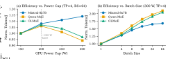
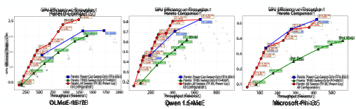
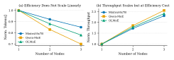
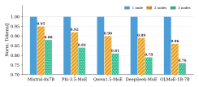
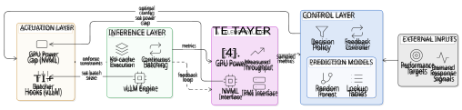
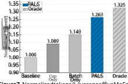
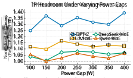
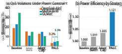
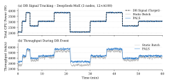
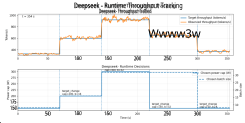

# **PALS: Power-Aware LLM Serving for Mixture-of-Experts Models** 

Can Hankendi 

Boston University 

Electrical and Computer Engineering Department Boston, MA, USA hankendi@bu.edu 

Minlan Yu 

Harvard University School of Engineering and Applied Sciences Cambridge, MA, USA minlanyu@g.harvard.edu 

## **Abstract** 

Large language model (LLM) inference has become a dominant workload in modern data centers, driving significant GPU utilization and energy consumption. While prior systems optimize throughput and latency by batching, scheduling, and parallelism, they largely treat GPU power as a static constraint rather than a controllable resource. 

In this paper, we present a power-aware runtime for LLM serving, PALS, that treats GPU power caps as a first-class control knob and jointly optimizes them with software parameters such as batch size. The system combines lightweight offline power–performance models with a feedback-driven controller to select configurations that satisfy throughput targets while maximizing energy efficiency. 

We implement PALS within an existing LLM serving framework, vLLM, demonstrating that it requires no model retraining or API changes. Across multi-GPU systems and both dense and mixture-of-experts (MoE) models, PALS improves energy efficiency by up to 26.3%, reduces QoS violations by 4×–7× under power constraints, and tracks dynamic power budgets. These results highlight the potential of integrating power control directly into LLM inference runtimes, enabling energy-proportional and grid-interactive AI systems. 

## **1 Introduction** 

Large language model (LLM) inference has rapidly emerged as a dominant workload in modern data centers, driving an unprecedented demand for GPU resources and electricity. Unlike traditional batch-oriented workloads, LLM serving is latency-sensitive, bursty, and increasingly deployed at scale across heterogeneous multi-GPU systems [14, 22, 36]. As a result, operators must simultaneously meet strict performance targets while managing increasing energy costs and power constraints [5, 8, 17]. 

Rana Shahout 

Harvard University 

School of Engineering and Applied Sciences Cambridge, MA, USA ranash.cs@gmail.com 

Ayse K. Coskun 

Boston University Electrical and Computer Engineering Department Boston, MA, USA acoskun@bu.edu 

these mechanisms largely assume fixed power provisioning and treat GPU power as an external constraint rather than a controllable resource. In practice, operators rely on coarse power provisioning and static power caps to remain within rack- or cluster-level limits, but lack runtime mechanisms that can precisely and rapidly trade performance for power in response to changing workload conditions. This leads to inefficient operation, as systems either over-provision power, wasting energy, or under-provision, resulting in degraded throughput and quality-of-service (QoS) violations [5, 8, 17]. 

Data centers are increasingly becoming subject to facilitylevel power caps, real-time electricity pricing, and demandresponse signals from the grid [2, 28, 38]. At the same time, carbon-aware computing introduces additional incentives to modulate energy consumption over time and across locations [2, 28]. As LLM inference becomes increasingly energyintensive, improving efficiency has become as important as maximizing throughput. These trends require inference systems to treat power not as a fixed constraint, but as a controllable resource that can be dynamically adjusted to balance performance, efficiency, and external signals. 

In this paper, we argue that GPU power caps should be treated as a first-class control primitive in LLM inference runtimes. We present a power-aware runtime that jointly optimizes hardware-level power limits and software-level parameters such as batch size and parallelism. By coordinating these knobs, the system exposes a controllable trade-off between throughput, latency, and energy efficiency. 

However, enabling such control is challenging. The relationship between power, performance, and efficiency in LLM inference is highly non-linear and depends on workload characteristics, batching behavior, and system bottlenecks such as compute and communication. As a result, configurations that are efficient under one workload may become suboptimal as conditions change, making static or offline 

Recent systems introduced batching, request scheduling, and model-parallel execution to improve LLM inference throughput and latency [14, 16, 22, 29, 30, 33, 36]. However, 

1 

Can Hankendi, Rana Shahout, Minlan Yu, and Ayse K. Coskun 

tuning insufficient. Effective control, therefore, requires lightweight predictive models and fast feedback mechanisms that operate at runtime. 

Our design is guided by three observations: increasing power yields diminishing returns beyond model-dependent thresholds, batch size dominates efficiency, and the optimal degree of parallelism depends on the compute–communication balance. These observations are particularly pronounced in mixture-of-experts (MoE) models [11, 31]. In MoE architectures, tokens are dynamically routed to a subset of experts, introducing significant communication alongside computation. This leads to highly variable and often communicationbound execution, where performance depends on routing patterns, load imbalance, and interconnect bandwidth. Consequently, increasing power caps may amplify communication overhead rather than useful computation, further complicating the relationship between power and performance. 

To address this challenge, we design a power-aware runtime that combines offline power–performance modeling with a feedback-driven control loop. The system continuously selects configurations that meet performance targets while maximizing efficiency, and adapts to workload changes and dynamic power budgets with low overhead. Importantly, our approach is plug-and-play: it integrates into existing LLM serving frameworks (e.g., vLLM) without requiring changes to model architectures or inference APIs. Our specific contributions are as follows: 

- We identify and quantify previously unexploited crosslayer interactions between GPU power caps, batching, and parallelism in LLM inference, showing that independent optimization is fundamentally suboptimal. 

- We design a closed-loop control system that jointly tunes hardware (power caps) and software (batching) knobs under QoS constraints, enabling energyproportional LLM serving under dynamic power budgets. 

- We implement our design in vLLM without modifying model architectures or inference APIs, demonstrating a practical and deployable approach. 

- We show that treating power as a first-class scheduling primitive expands the achievable Pareto frontier beyond what is possible with either dynamic voltage and frequency scaling (DVFS) or batching alone, achieving up to 26.3% efficiency improvement and 4×-7× reduction in QoS violations. 

Prior work on GPU power management and DVFS treats power as a low-level hardware knob, while LLM serving systems focus on batching, scheduling, and parallelism under fixed power budgets. These two layers are optimized independently. In contrast, we show that for modern LLM inference, especially MoE models, power caps fundamentally interact with batching and parallelism through compute/communication tradeoffs, creating operating regimes 

**Figure 1.** (a) tokens/J vs. power cap showing divergent behavior: compute-bound Mixtral continues to improve while communication-bound Qwen-MoE and OLMoE peak at 200 W and decline. (b) tokens/J vs. batch size: efficiency gains are substantial for all model families. 

that cannot be captured by either layer alone. This paper introduces the first LLM serving runtime that jointly optimizes hardware power limits and software scheduling knobs under explicit QoS constraints, enabling dynamic navigation of the power–performance–efficiency space at runtime. We show that treating power as a first-class control dimension expands the achievable efficiency–performance Pareto frontier beyond what is possible with batching or DVFS alone. Across multi-GPU systems and both dense and MoE models, our runtime improves energy efficiency by up to 26.3%, reduces QoS violations by 4×-7× under power constraints. 

## **2 Motivation** 

LLM inference has emerged as a sustained, high-power workload in modern data centers, requiring systems to meet strict throughput and latency targets under growing power constraints. In practice, deployments are increasingly subject to facility-level power limits, electricity price variability, and external signals such as demand response and carbon-aware operation [2, 5, 28, 38]. 

Despite these constraints, existing LLM serving frameworks do not explicitly incorporate power into runtime decision-making. GPU power is typically provisioned statically, leading to either over-provisioning and energy inefficiency or under-provisioning and QoS degradation. Critically, these systems lack mechanisms to dynamically adjust power consumption in response to workload conditions and performance objectives. 

To understand this gap, we conduct an empirical study of LLM inference across diverse models and configurations. Our analysis reveals that the relationship between power, performance, and efficiency is highly non-linear and strongly dependent on workload characteristics. These findings motivate the need for a runtime that treats power as a first-class control dimension and jointly optimizes it with softwarelevel parameters. 

**2.1 Key Empirical Insights from Offline Profiling** Our experiments reveal three consistent trends across models and configurations. 

2 

PALS: Power-Aware LLM Serving for Mixture-of-Experts Models 

**_Insight 1: Power caps exhibit diminishing returns at model-dependent thresholds._** Figure 1(a) shows tokens/J vs. power cap of three models: Mixtral, Qwen-MoE and OLMoE. While increasing power initially improves throughput, beyond a workload-dependent threshold (typically 150–200 W), efficiency gains diminish. This behavior varies across models depending on whether they are compute-bound or communication-bound. Compute-bound models (e.g., Mixtral) continue to benefit from higher power caps, as additional power increases SM clock frequency and compute throughput. In contrast, communication-bound models (e.g., Qwen-MoE and OLMoE) reach peak efficiency at lower power levels. Beyond this point, additional power primarily accelerates communication overhead (e.g., NCCL all-to-all traffic over NVLink) rather than useful computation, resulting in lower tokens/J. Contrary to common practice, operating GPUs at maximum power is often suboptimal for LLM inference, particularly for communication-bound workloads. 

**_Insight 2: Batch size dominates power efficiency._** Figure 1(b) shows tokens/J normalized to batch size 1. Increasing batch size from 1 to 64 improves efficiency by 1 _._ 7×–2 _._ 1× across all models. This improvement arises from amortizing fixed per-step overheads, including kernel launches, attention computation, and communication setup, across more tokens, thereby increasing SM utilization and effective arithmetic intensity. 

The magnitude of this effect depends on model characteristics. Compute-bound models (e.g., Mixtral) saturate efficiency gains at smaller batch sizes, while communication-bound models (e.g., Qwen-MoE and OLMoE) continue to benefit at larger batch sizes due to additional amortization of routing and communication overheads. For example, the marginal gain from increasing batch size from 32 to 64 is only 2% for Mixtral, but remains 7% for Qwen-MoE. 

**_Insight 3: Compute-communication ratio determines optimal parallelism._** Figure 2 breaks down inference time into compute and communication components across different models and configurations. The results show that the effectiveness of power scaling depends strongly on the relative contribution of these components. 

For compute-bound workloads (e.g., Mixtral under moderate parallelism), increasing GPU power caps directly improves throughput by raising SM clock frequency and accelerating arithmetic operations. As a result, higher power levels can translate into both higher throughput and improved efficiency, up to a saturation point. 

In contrast, communication-bound workloads (e.g., QwenMoE and OLMoE under high expert parallelism) derive limited benefit from increased power. In these regimes, a significant portion of inference time is spent on communication operations such as expert routing and all-to-all exchanges over NVLink or PCIe. 

As a result, the optimal operating point shifts toward lower power caps for communication-bound configurations. Furthermore, the same power configuration can yield fundamentally different efficiency outcomes depending on the communication/computation ratio, making static configurations inherently suboptimal. 

### **2.2 Pareto Frontier Expansion via HW-SW Knob Combination** 

We quantify the benefit of jointly controlling hardware and software parameters by comparing the achievable efficiency frontier against configurations that vary only one class of knobs. Figure 3 shows the impact of combining hardware and software control knobs on the achievable efficiency frontier. To illustrate this, we construct three Pareto frontiers for each model, each corresponding to a different set of available control knobs. 

1. **SW only** : We vary batch size over {1 _,_ 4 _,_ 8 _,_ 16 _,_ 32 _,_ 64} and Tensor Parallelism (TP) over {1 _,_ 2 _,_ 4} without applying power caps. This represents the operating range available without hardware-level power control. 

2. **HW only** : We vary the GPU power cap over its allowable range while fixing batch size and parallelism. This captures the effect of hardware-level power scaling in isolation, corresponding to what DVFS alone can achieve. 

3. **HW+SW (cap** × **batch** × **TP)** : We jointly vary power cap, batch size, and parallelism configurations, capturing the full space of available control knobs. 

**HW-only and SW-only frontiers are largely nonoverlapping.** Power capping alone (HW only) shifts operating points toward lower throughput with improved efficiency, it trades performance for power. Batch size alone (SW only) shifts toward higher throughput and higher efficiency simultaneously, but is capped by the fixed 300 W budget. The two frontiers occupy different regions of the throughput-efficiency plane and are therefore _complementary_ , not interchangeable. 

**Combining HW+SW strictly dominates either alone.** The joint (cap × batch × TP) frontier envelops both individual 

**Figure 2.** Compute vs. communication time breakdown by model and configuration. Mixtral remains compute-bound; Qwen-MoE and OLMoE become communication-bound at higher TP and batch size. 

3 

Can Hankendi, Rana Shahout, Minlan Yu, and Ayse K. Coskun 

**Figure 3.** Pareto frontier expansion for three MoE models (single node, 4×A100). Four frontiers are shown: SW only (batch sweep, fixed cap), HW only (cap sweep, fixed batch), HW+SW (joint cap×batch), and full joint (HW+SW+TP). The full frontier dominates any single-knob approach; gains are model-dependent and follow the compute/communication ratio. 

frontiers: it achieves the high-throughput end of the SW-only frontier _and_ the high-efficiency end of the HW-only frontier, with new configurations filling the gap in between. 

**The expansion is model-dependent and follows the compute-communication ratio.** For Mixtral-8x7B (computebound), the efficiency gain from adding TP as a third degree of freedom is substantial. Higher TP at larger batch sizes unlocks operating points that neither cap nor batch adjustment can reach alone (+15% efficiency gain at the frontier tip vs. HW+SW alone). For Qwen-MoE (communication-bound), the marginal gain from TP is smaller, TP=2 already suffices at most batch sizes because increasing TP adds extra all-reduce overhead. OLMoE behaves similarly to Qwen-MoE in this regard. 

The full joint frontier improves peak efficiency by 1 _._ 18× (Mixtral), 1 _._ 13× (Qwen-MoE), and 1 _._ 14× (OLMoE) over SWonly optimization—gains that are practically significant at data-center scale but invisible to any system that treats HW and SW knobs in isolation. 

### **2.3 Multi-Node Scaling Behavior** 

_MoE models do not always scale efficiently simply by adding more nodes._ Figure 4 shows normalized tokens/J and throughput as node count increases from 1 to 3. Qwen-MoE suffers a 30% efficiency drop at 3 nodes because its inter-node all-to-all traffic saturates InfiniBand bandwidth. Mixtral scales more smoothly (15% drop at 3 nodes) due to higher per-expert compute density. This means the optimal configuration strategy changes with node count and static offline policies are not sufficient. 

These observations collectively reveal a fundamental limitation of existing inference systems, where no single control knob, whether batching, parallelism, or power, can achieve optimal performance and efficiency across workloads. Instead, effective operation requires coordinated control across hardware and software layers, with the ability to dynamically adapt to workload conditions and external constraints. This motivates the design of a power-aware runtime system that jointly manages GPU power caps and inference parameters to achieve energy-efficient, QoS-aware execution. 

### **2.4 Impact of Expert Parallelism Across Nodes** 

**Figure 4.** Multi-node scaling: (a) efficiency drops as node count grows, especially for communication-bound QwenMoE; (b) throughput grows but at diminishing efficiency returns. 

We evaluate the impact of expert parallelism (EP) on energy efficiency as the system scales from one to multiple nodes. Figure 5 shows normalized tokens per joule (tokens/J) for representative MoE models under increasing node counts. 

Across all models, efficiency decreases as EP extends across nodes. This degradation is primarily driven by increased communication overhead, including expert routing and all-to-all exchanges, which grow with the number of participating GPUs and nodes. While EP improves model capacity and throughput scalability, these gains are offset by communication costs at larger scales. 

The rate of efficiency degradation is strongly model dependent. Compute heavy models such as Mixtral degrade more 

4 

PALS: Power-Aware LLM Serving for Mixture-of-Experts Models 

gradually, as a larger fraction of execution time remains dominated by arithmetic operations. In contrast, communicationsensitive models such as Qwen and OLMoE experience steeper efficiency declines, reflecting their higher sensitivity to routing and synchronization overheads. 

Overall, these findings confirm that scaling MoE inference through expert parallelism introduces a trade-off between capacity and efficiency. This further motivates the need for runtime mechanisms that adapt parallelism and system configuration based on workload characteristics and system constraints. 

## **3 PALS Runtime Design** 

We present a power-aware runtime for LLM inference, PALS, that dynamically coordinates hardware-level power control with software-level inference parameters. It is designed to meet performance targets while maximizing energy efficiency under dynamic workload conditions and power constraints. 

Figure 6 illustrates the design of PALS, which consists of three key components: (1) a telemetry layer that collects real-time performance and power metrics, (2) a control layer that selects configurations based on predictive models and feedback signals, and (3) an actuation layer that enforces decisions by adjusting GPU power caps and inference parameters such as batch size. 

At a high level, the runtime operates as a closed-loop controller. During each control interval, telemetry data is used to estimate current system performance. A model-guided decision module selects candidate configurations that satisfy performance targets, while a feedback controller corrects for modeling errors and runtime variability. The selected configuration is then applied through hardware and software actuation mechanisms. This design enables the runtime to continuously adapt to workload dynamics and external signals, such as power budgets or demand-response events, while maintaining stable and efficient operation. 

**Figure 5.** Energy efficiency under expert parallelism across different node counts. Each group shows normalized tokens/J for a given model at 1, 2, and 3 nodes. Models with higher communication intensity exhibit larger efficiency degradation as parallelism increases. 

**_Telemetry layer._** The telemetry layer monitors system state in real time, including GPU power consumption, throughput (tokens/s) and GPU utilization. These signals are obtained through standard interfaces such as NVML and runtime instrumentation. The collected telemetry provides the basis for both performance estimation and feedback control. 

**_Control layer._** The control layer is responsible for selecting configurations that satisfy performance targets while optimizing energy efficiency. It combines two complementary mechanisms. First, a model-driven selection process uses lightweight power-performance model to predict the throughput and efficiency of candidate configurations. Second, a feedback controller adjusts decisions based on observed deviations from target performance, enabling robust operation under modeling inaccuracies and workload variability. 

At each control interval (i.e., 500ms) , the controller evaluates feasible configurations that are defined by power caps and software-level parameters such as batch size and selects the configuration that maximizes efficiency subject to performance constraints. This process enables continuous adaptation to workload dynamics and external signals such as power budgets, performance targets or demand-response events. 

**_Actuation layer._** The actuation layer applies control decisions by interfacing with both hardware and software mechanisms. Hardware-level actuation adjusts GPU power caps using vendor-supported interfaces (e.g., NVML). Softwarelevel actuation modifies inference parameters such as batch size and request scheduling behavior within the serving framework. These adjustments are lightweight and can be applied at runtime without interrupting ongoing inference. 

**_Closed-loop operation._** Together, these components form a closed-loop control system. Telemetry is continuously collected and used to estimate system performance, the control layer selects updated configurations, and the actuation layer enforces these decisions. This loop operates at 500ms timescale, enabling the system to respond rapidly to workload fluctuations and changing power constraints. 

This design decouples system-level decision making from the underlying inference engine, allowing our approach to be plug-and-play, integrated with existing LLM serving systems without requiring changes to model architectures or inference APIs. 

### **3.1 Power–Performance Modeling** 

**_Methodology._** To enable power-aware runtime optimization, we construct an offline power-performance model from systematic profiling experiments across a wide range of inference configurations. The goal of this process is to construct 

5 

Can Hankendi, Rana Shahout, Minlan Yu, and Ayse K. Coskun 

**Figure 6.** PALS runtime design. Telemetry from inference execution is aggregated and fed to a controller that predicts feasible operating points and issues hardware- and software-level actuation decisions. 

a dataset that captures the mapping from inference configurations to performance and power, which is later used to train predictive models for runtime control. 

We perform controlled parameter sweeps over the following dimensions: 

- **Power caps.** GPU power limits are varied across the allowable platform range (i.e., 100-400W) using vendorprovided interfaces (i.e., NVML, nvidia-smi) [23, 24]. This allows us to characterize performance scaling under various power budgets. 

- **Batch sizes.** Continuous batching [14, 36] is evaluated over a wide range (e.g., batch sizes 1-64) to capture utilization scaling effects. This range reflects realistic serving scenarios where batch sizes fluctuate with request arrival patterns. 

- **Parallelism configurations.** We evaluate tensor parallelism (TP), expert parallelism (EP), and data parallelism (DP) where applicable. These configurations affect both compute efficiency and communication overhead, making them important factors in power-performance tradeoffs. 

Table 1 summarizes the five tunable parameters. We evaluate three static (require model reload) (i.e., TP, EP, DP) and two dynamic (i.e., batch size, power cap) knobs. During each experiment, we collect GPU power consumption (via NVML/IPMI), throughput in tokens-per-second ( _𝑡𝑜𝑘𝑒𝑛𝑠_ / _𝑠_ ), latency metrics, and system-level telemetry. This range of configurations spans both low-utilization and saturation regimes, capturing the non-linear behavior of throughput and efficiency across different operating points. This dataset serves as the foundation for the predictive models described in the next section. 

**_System-Level Power Estimation._** We estimate systemlevel power from GPU telemetry by fitting a linear model between aggregate GPU power and IPMI measurements: _𝑃_ sys = _𝛼_ ∑ _𝑃_ GPU _,𝑖_ + _𝛽_ . Across configurations, we obtain _𝛼_ ≈ 1 _._ 05 and _𝛽_ ≈ 340–350 W, with high accuracy ( _𝑅_2 ≈ 0 _._ 98, MAE 12–27 W). This enables reliable system-level energy estimation without continuous IPMI polling. 

**Table 1.** HW and SW control knobs. 

|**Knob**|**Cat.**|**Adj.**|**Values tested**|
|---|---|---|---|
|Power Cap|HW|Runtime|150,200,250,300,350,400 W|
|Batch Size|SW|Runtime|1,4,8,16,32,64|
|TP|SW|Static|1, 2, 4|
|EP|SW|Static|1, 4, 8|
|DP|SW|Static|1, 2, 3 nodes|

### **3.2 Prediction Model** 

The prediction model maps a configuration 

- _𝑐_ = (cap _,_ batch _,_ parallelism _, . . ._ ) 

to predicted performance and power metrics, including tokens/s, average power consumption ( _𝑃_ ), and derived efficiency metrics such as tokens-per-watt. The prediction model is trained offline, while the runtime policy uses it for fast decision-making with feedback correction. The model is used to score discrete candidate configurations rather than to directly control the runtime. At inference time, the controller queries the model to estimate throughput and power for feasible operating points and ranks them according to the optimization objective. 

We use a lightweight regression model to predict throughput and power as a function of configuration parameters. We evalaute various machine learning algorithms, such as XGBoost, gradient boosting and random forest. We empirically determine that random forest provide the most accurate for both MoE and dense models. Random forest model is able to capture non-linear relationships between configuration parameters and system performance while maintaining low inference overhead. These relationships arise from interactions between batching, power scaling, and communication overhead, which vary across model architectures and parallelism configurations. The model provides fast, approximate predictions of performance and power for candidate configurations, enabling efficient exploration of the configuration space at runtime. We evaluate the accuracy of the offline prediction model using held-out configurations. Across all 

6 

PALS: Power-Aware LLM Serving for Mixture-of-Experts Models 

workloads, the random forest model achieves a mean absolute percentage error (MAPE) of 6.8% for throughput prediction and 4.5% for power prediction. Furthermore, feature importance analysis shows that batch size is the dominant predictor of efficiency, followed by power cap and tensor parallelism degree. This aligns with our empirical observations in Section 2, where batching provides the largest gains. 

This modeling approach provides sufficiently accurate estimates for candidate ranking while avoiding costly online exploration. While the offline predictor provides fast estimates of throughput and power, residual error and workload variability are handled by the online controller described in the next section. 

### **3.3 Runtime Control Policy** 

At runtime, the controller uses the offline prediction model to evaluate feasible configurations and select operating points that satisfy performance constraints while maximizing energy efficiency. 

**_Control Problem._** We formulate power-aware LLM inference as a constrained optimization problem over a discrete configuration space. At each control interval, the runtime selects a configuration, _𝑐_ , that determines both hardware-level power limits and software-level execution parameters. 

The objective is to maximize energy efficiency, measured in tokens per joule, while satisfying performance constraints. Formally, we seek to solve: 

$$
max 𝑐\in{}{}𝐶(𝑡) Eff(𝑐) s.t. 𝑇(𝑐) \geq{}{}𝑇target.
$$

where _𝐶_ ( _𝑡_ ) denotes the set of feasible configurations at control interval _𝑡_ . In practice, system dynamics and workload variability make it difficult to directly solve this problem online. The mapping from configuration to performance is non-linear and workload-dependent, and optimal configurations may shift over time as request patterns and system conditions change. 

These challenges motivate a model-guided control approach that combines offline prediction with online feedback correction. The offline model provides fast estimates of throughput and power for candidate configurations, while the feedback controller compensates for prediction error and workload variability during runtime. 

**_Decision Policy._** To approximately solve the control problem online, the runtime combines model-guided candidate selection with feedback-driven correction. Algorithm 1 summarizes the runtime decision loop. At each control interval, the controller enumerates feasible configurations and queries the offline model to estimate throughput and power. It then constructs the subset _𝐶_ ok of configurations that satisfy the throughput target. If _𝐶_ ok ≠ ∅, the controller selects the configuration with the highest predicted efficiency; otherwise, 

### **Algorithm 1** PALS Runtime Control 

- 1: **Input:** _𝐶_ , _𝑇_ target, _𝜖_ 2: **while** every control interval **do** 3: Measure throughput _𝑇_ meas 4: _𝑒_ ← _𝑇_ target − _𝑇_ meas 5: _𝐶𝑡_ ← feasible configurations 6: **for all** _𝑐_ ∈ _𝐶𝑡_ **do** 7: ( _𝑇_ ( _𝑐_ ) _, 𝑃_ ( _𝑐_ )) ← Model( _𝑐_ ) 8: **end for** 9: _𝐶_ ok ←{ _𝑐_ | _𝑇_ ( _𝑐_ ) ≥ _𝑇_ target} 

- 10: **if** _𝐶_ ok ≠ ∅ **then** _𝑇_ <u>(</u> _𝑐_ <u>)</u> 

- 11: _𝑐_∗ ← arg max _𝑐_ ∈ _𝐶_ ok _𝑃_ ( _𝑐_ ) 12: **else** 13: _𝑐_∗ ← arg max _𝑐_ ∈ _𝐶𝑡 𝑇_ ( _𝑐_ ) 14: **end if** 15: **if** | _𝑒_ | _> 𝜖_ **for sustained intervals then** 16: Apply _𝑐_∗ 

- 17: **end if** 18: **end while** 

it falls back to the configuration with the highest predicted throughput. 

**_Model-guided selection._** At each control interval, the controller evaluates feasible candidate configurations using the offline predictor and discards those that do not satisfy the throughput target. Among the remaining candidates, it selects the configuration with the highest predicted efficiency. 

**_Feedback adjustment._** As the offline predictor is approximate, the runtime continuously compares predicted behavior against measured throughput and applies correction based on throughput error using a PID controller. This improves robustness to modeling error and workload variability by compensating for steady-state mismatch and transient deviations. To avoid oscillations, configuration updates are applied only when deviations persist beyond a threshold (5%) or when external constraints, such as power budgets or throughput targets, change. This prevents frequent reconfiguration in response to transient fluctuations. 

## **4 Evaluation Methodology** 

### **4.1 Experimental Setup** 

We evaluate PALS on multi-GPU server nodes equipped with NVIDIA A100 GPUs. Each node consists of 4×A100 GPUs interconnected via NVLink. This setup allows us to evaluate both compute-bound and communication-bound inference regimes. 

We evaluate both dense and MoE models to capture a range of compute–communication characteristics. Experiments are conducted under both steady-state and dynamic conditions, including scenarios with time-varying power budgets. 

7 

Can Hankendi, Rana Shahout, Minlan Yu, and Ayse K. Coskun 

|**Model**|**Tot ** (B)|**Act ** (B)|**Exp** _𝑘_|**Type**|
|---|---|---|---|---|
|GPT-2|0.12|0.12|– –|Dense|
|Llama-2-7B|6.74|6.74|– –|Dense|
|Mistral-7B|7.25|7.25|– –|Dense|
|OLMoE-1B-7B|6.92|1.30|64 8|MoE|
|Qwen1.5-MoE‡|14.3|2.70|64 4|MoE|
|DeepSeek-MoE† |16.4|2.80|66 6|MoE|
|Phi-3.5-MoE|41.9|6.60|16 2|MoE|
|Mixtral-8x7B|46.7|12.9|8 2|MoE|

**Table 2.** Model summary. **Tot** and **Act** denote total and active parameters (in billions). For MoE models, **Exp** is the number of experts per layer and _𝑘_ is the number of selected experts (top- _𝑘_ ). Dense models activate all parameters (Tot = Act), while MoE models activate only a subset, leading to lower effective compute despite larger total size. 

Workloads consist of request streams with configurable arrival rates and sequence lengths, simulating realistic inference serving conditions. We use Poisson arrival processes to model bursty request patterns commonly observed in production LLM services. 

Our implementation is built on top of the vLLM inference framework [14]. We extend the runtime scheduler to expose batch size as a dynamically controllable parameter, while GPU power caps are enforced through NVML interfaces. The control loop operates externally to the core execution engine and periodically updates runtime parameters without modifying model execution logic. We evaluate the system using standard benchmark datasets, including HellaSwag and GSM8K [9, 37], to generate realistic inference workloads with diverse sequence lengths and reasoning complexity. 

### **4.2 Workloads** 

We evaluate PALS across a diverse set of LLMs, including both dense and MoE architectures. Table 2 summarizes the evaluated models, including total parameter count, active parameters per token, and parallelism characteristics. The workload set includes representative models including GPT2 [27], Llama-2-7B [34], Mistral-7B [12], Mixtral–8x7B [13], Qwen1.5-MoE [26], OLMoE-1B-7B [20], DeepSeek-MoE [10], and Phi-3.5-MoE [1]. These models span a wide range of compute and communication behaviors, enabling evaluation under both compute-bound and communication-bound regimes. 

### **4.3 Baselines** 

We compare PALS against four representative control strategies that isolate different dimensions of runtime adaptation. The _Baseline_ uses a fixed 400W power cap and maximum batch size, reflecting a throughput-optimized production configuration without dynamic adaptation. _Adaptive Batch_ 

keeps the power cap fixed while selecting batch size using the offline prediction model, capturing software-level optimization in isolation. _Adaptive Cap_ dynamically adjusts GPU power caps based on QoS requirements while keeping batch size fixed, representing hardware-level control without coordination with batching. In contrast, _PALS_ jointly adapts both power caps and batch size using model-guided selection combined with feedback control. Finally, we include an _Oracle_ that performs an exhaustive offline search over all configurations, providing an upper bound on achievable efficiency. All methods are implemented within the same vLLM serving framework, only the control policy differs. 

### **4.4 Metrics** 

We evaluate system performance using a set of complementary metrics that capture both service quality and efficiency. Throughput, measured in tokens per second, reflects the overall inference performance of the system. To quantify service reliability, we measure the QoS violation rate, defined as the fraction of time the system fails to meet target throughput thresholds. Under constrained operation, we also evaluate power tracking error, which measures the deviation between actual and target power consumption. Finally, we assess energy efficiency in terms of tokens per joule, enabling comparison across configurations with different power budgets and capturing the effectiveness of joint power–performance optimization. 

## **5 Results** 

We evaluate PALS along three dimensions: (1) single-node efficiency, (2) QoS under power-constrained multi-node operation, and (3) responsiveness to dynamic power signals in demand-response scenarios. These experiments validate that jointly controlling hardware (power caps) and software (batching) expands the achievable operating space and enables robust performance under power constraints. 

### **5.1 Single-Node Efficiency** 

We first evaluate whether joint control of power caps and batching improves energy efficiency on a single node. Figure 7 compares five configurations on five MoE models in Table 2: (1) Baseline (400W, BS=64), (2) Cap Only (modelselected power cap, fixed batch), (3) Batch Only (maximum power cap, model-selected batch size), (4) PALS (jointly optimized power cap and batch size), and (5) Oracle (exhaustive offline optimum). 

PALS achieves 1.26× normalized efficiency, capturing 95% of the oracle headroom. Batch-only adaptation (1.14×) accounts for most of the improvement, indicating that batching is the dominant factor in efficiency. Power cap adaptation provides an additional gain when combined with batching. 

This behavior reflects the Pareto frontier expansion observed in Section 2.2, where jointly controlling hardware and 

8 

PALS: Power-Aware LLM Serving for Mixture-of-Experts Models 

software knobs enables operating points that are not achievable with either knob alone. Consistent with our empirical observations, batching improves utilization by amortizing overheads, while power caps exhibit diminishing returns beyond model-dependent thresholds. 

Overall, these results show that while batching drives most efficiency gains, power control provides a complementary benefit, and joint optimization is necessary to approach nearoptimal operating points. 

**5.1.1 Near-Optimality Under Runtime-Feasible Knobs.** PALS adapts only runtime-feasible knobs, namely GPU power caps and batch size, while tensor parallelism (TP) is fixed at deployment time. To quantify the resulting gap, we compare a fixed-TP configuration against the best offline TP choice at each power cap. Figure 8 shows the efficiency headroom for models with TP sensitivity. For many models, fixed TP achieves near-optimal efficiency across all power caps, indicating that runtime adaptation alone captures most gains. However, for a subset of models, the gap widens under lower power caps. This trend reflects a shift toward communication-sensitive regimes under constrained power, where the optimal compute-communication balance depends on TP. Overall, PALS achieves near-optimal efficiency using only runtime-feasible knobs, with remaining headroom attributable to deployment-time parallelism choices. 

### **5.2 QoS Under Multi-node Power Constraints** 

We next evaluate whether PALS maintains QoS under constrained power budgets in a multi-node setting. We consider a three-node deployment, where each node runs a different model (e.g., DeepSeek-MoE, Mixtral-8x7B, and OLMoE) under a maximum cluster-wide power budget of 4,800W. Each model is assigned a QoS constraint, defined as a target throughput relative to its unconstrained performance (e.g., 90%, 60%, and 75% for DeepSeek-MoE, Mixtral, and OLMoE, respectively). Workloads follow a Poisson arrival process 

**Figure 7.** Normalized tokens/J, average of five MoE models and three dense models. PALS achieves 26.3% improvement over baseline and reaches 95% of oracle efficiency. 

**Figure 8.** Efficiency headroom from TP under varying power caps. Each curve shows the gap between a fixed-TP deployment and the best offline TP choice. Headroom varies with changing power caps, indicating that the benefit of TP selection is power-dependent. 

over 60-minute runs. We compare four strategies corresponding to different levels of control: no adaptation (Baseline), software-only adaptation (Adaptive Batch), hardware-only adaptation (Adaptive Cap), and joint hardware–software optimization (PALS). Figure 9(a) shows QoS violation rates. The baseline exhibits high violation rates (18.7%-35.2%), reflecting its inability to adapt under constrained power. Adaptive batch and adaptive cap reduce violations modestly, but remain insufficient. 

In contrast, PALS reduces QoS violations to 3.2%-5.3%, achieving a 4×–7× improvement across all models. At the same time, it improves aggregate energy efficiency by 12.1% (Figure 9(b)). Adaptive batch alone cannot compensate when models become power-constrained, while adaptive power capping assumes a simplified relationship between power and performance that does not hold in practice. These limitations explain the gap between partial adaptation strategies and the full joint controller. 

Overall, these results demonstrate that the key benefit of PALS is not simply adapting to power constraints, but maintaining QoS while doing so. Joint optimization of power and batching is required to simultaneously satisfy QoS targets and achieve efficient operation under constrained power budgets. 

### **5.3 Grid-Interactive Demand Response** 

We evaluate whether PALS can operate as a grid-interactive workload by dynamically adapting to external power signals. We simulate a demand-response (DR) scenario over 1-hour on a 3-node system running DeepSeek-MoE. We compare a static-batch baseline (i.e., fixed BS=64, dynamic cap only) against PALS, which jointly adapts power cap and batch size. 

Figure 10(a) shows that both approaches are able to follow the target power signal. However, Figure 10(b) shows a key difference: PALS maintains significantly higher throughput at lower power targets by dynamically adjusting batch size to match available compute capacity. In contrast, the static 

9 

Can Hankendi, Rana Shahout, Minlan Yu, and Ayse K. Coskun 

**Figure 9.** Multi-node power-constrained evaluation (3 nodes, 60 min). (a) QoS violation rates: PALS reduces violations by 4×–7×. (b) Normalized aggregate efficiency by strategy. 

baseline, while able to track the power signal, suffers from underutilization at low power levels, as large batch sizes become inefficient under constrained power. PALS improves throughput by up to 22% at low power targets compared to the static-batch baseline. 

## **6 Discussion** 

PALS’ predictive models are built from offline profiling over a fixed set of configurations and a representative set of prompts. When the online workload deviates significantly, for example, due to unusually long prompts, adversarial inputs, or shifts in output length distribution, the offline model may mispredict throughput or efficiency, leading to suboptimal configuration selection. The PID feedback controller partially compensates for such errors by correcting steady-state deviations, but it cannot anticipate sudden load changes. Incorporating lightweight online model updates or uncertainty-aware prediction could reduce this gap. 

PALS operates at the node level and is designed to complement, not replace, cluster-level energy management systems such as DynamoLLM [18]. Cluster-level systems are wellsuited to coarse-grained decisions, such as instance counts, routing policies, and aggregate power budgets, but cannot 

**Figure 10.** Grid demand-response tracking (1-hour, DeepSeek-MoE, 3-nodes). PALS maintains higher throughput at low power targets by co-adapting batch size. PALS improves throughput by up to 22% at low power targets compared to the static-batch baseline. 

**Figure 11.** PALS is able to track throughput target by dynamically tuning batch size and power cap decisions at runtie. 

react to sub-second workload fluctuations within a single serving node. Our solution fills this gap, as the main scheduler sets per-node power budgets and throughput targets as external signals, which PA-vLLM tracks with its closed-loop controller. This division of responsibility, the cluster decides _where and how much_ , the node runtime decides _how_ enables coordinated control across timescales without requiring either layer to solve the full joint optimization problem, providing a practical path toward grid-interactive LLM serving at scale. 

## **7 Related Work** 

**LLM inference serving systems.** A substantial line of work focus on improving LLM inference performance by optimizing scheduling, memory management, and parallelism under fixed power budgets. Orca [36] introduce iterationlevel scheduling and selective batching, enabling continuous batching that keeps GPUs saturated across diverse request streams. vLLM [14] propose a technique to eleminate KVcache fragmentation via PagedAttention, allowing larger effective batch sizes and 2-4× throughput gains over staticbatch systems. Sarathi-Serve [3] further decoupled prefill and decode latency through chunked prefills and stall-free scheduling. DistServe [39] disaggregates prefill and decode onto separate GPU pools, independently optimizing time-tofirst-token and per-token generation latency. AlpaServe [16] uses statistical multiplexing with model parallelism to improve GPU utilization across concurrent bursty workloads. FlexGen [32] maximizes throughput under tight memory constraints by orchestrating offloading across GPU, CPU, and disk via a linear-programming policy. Helix [19] serves LLMs on heterogeneous GPU clusters by formulating placement and request routing as a max-flow problem. All of these systems treat GPU power as a fixed constraint; PA-vLLM introduces power caps as a first-class scheduling dimension that expands the achievable efficiency frontier beyond software-only optimization. 

**Model parallelism for large-scale LLM execution.** Megatron-LM [22, 33] defines the standard composition of 

10 

PALS: Power-Aware LLM Serving for Mixture-of-Experts Models 

**Table 3.** Comparison with closely related systems. 

|**System**|**Scope**|**Objective**|**Knobs**|**MoE**|**Key result**|
|---|---|---|---|---|---|
|**PALS (this work)**|Node/multi-node infer- ence|Max tokens/J under power + QoS|Power cap + batch (runtime)|✓|+26.3% eff.; 4×–7×QoS improvement|
|DynamoLLM [18]|Cluster routing + in- stance mgmt|Min energy/cost/carbon w/ SLOs|Routing, GPU freq, instance cnt|×|52% energy; 38% carbon savings|
|TAPAS [6]|VM placement in GPU clusters|Reduce TCO via cool- ing/power|VM placement, routing|×|Thermal/power throt- tling reduction|
|Zeus [8]|Single-GPU DNN train-|Energy-time trade-off|Power limit + batch (offline)|×|15-76% training energy|
||ing||||savings|

tensor, pipeline, and data parallelism for training and serving multi-billion-parameter models on multi-GPU clusters. These works show that parallelism configurations critically affect the compute-communication balance, a relationship PA-vLLM directly exploits: our profiling reveals that the optimal power cap depends on how compute- or communicationbound a given parallelism configuration renders a model, particularly in MoE architectures. 

**Mixture-of-Experts inference.** Sparsely-gated MoE [31] introduce conditional computation via learned routing, scaling model capacity without proportional increases in active parameters. Switch Transformers [11] scales this approach to trillion-parameter regimes, highlighting load-balancing and communication as primary system challenges. GShard [15] targets distributed MoE training with expert parallelism across accelerators, and DeepSpeed-Inference [4] optimizes MoE inference at scale via kernel fusion and communication scheduling. Expert offloading [35] reduces memory pressure by paging inactive experts to CPU. 

**GPU power management and DVFS for ML workloads.** Dynamic voltage and frequency scaling (DVFS) has long been studied as a hardware knob for energy-performance tradeoffs in processors [5]. Zeus [8] applies joint power-limit and batch-size optimization to DNN training on a single GPU, achieving 15-76% energy savings through offline exploration. Nabavinejad et al. [21] propose BatchDVFS, a runtime system that coordinates batch size and DVFS to meet power caps in single-GPU DNN inference, demonstrating that the achievable power range via DVFS alone depends on batchdetermined utilization. PA-vLLM extends this cross-layer insight to multi-GPU LLM serving, where continuous batching, autoregressive generation, and MoE communication overhead create fundamentally different power-performance dynamics that batch-size and frequency tuning in isolation cannot capture. Unlike BatchDVFS, PA-vLLM incorporates parallelism as a third control dimension, operates under a closed-loop feedback controller that responds to dynamic external power budgets, and integrates into a production serving framework targeting QoS-constrained inference. Patel et al. [25] characterize LLM power consumption patterns in production cloud clusters and proposed POLCA, a power 

oversubscription framework that safely deploys 30% more inference servers within fixed datacenter power budgets. PAvLLM is complementary to POLCA, where POLCA targets cluster-level provisioning, PA-vLLM operates within a single inference node and dynamically co-adapts per-GPU power caps and batch size at 500ms granularity to maintain QoS while maximizing tokens per joule. 

**Cluster-level LLM energy management.** DynamoLLM reduces energy and carbon cost at the cluster level by dynamically reconfiguring instance counts, routing policies, and GPU frequencies to meet latency SLOs, however operates at the granularity of minutes and does not address subsecond variability within a running inference instance [17] . TAPAS [7] reduces total cost of ownership through thermaland power-aware VM placement in GPU clusters, treating power as an infrastructure-level capacity constraint. PAvLLM operates at the node level and complements both systems: a cluster scheduler sets per-node budgets and throughput targets, which PA-vLLM tracks with its local controller, enabling coordinated control across timescales without either layer solving the full joint optimization. 

**_Distinguishing characteristics of Power-Aware vLLM._** Compared to prior work, Power-Aware vLLM makes three key departures. First, it elevates GPU power caps to a firstclass runtime control primitive and integrates them directly into the inference scheduling loop, rather than treating power as a static provisioning constraint. Second, it explicitly models the interaction between power, batching, and the communication/computation ratio of LLM inference, enabling stable control even in communication-bound regimes common in multi-GPU and MoE deployments. Third, it targets production LLM serving scenarios, requiring sub-second response times, negligible overhead, and zero changes to model architectures or inference APIs. 

Together, these differences position Power-Aware vLLM as the first system to provide fine-grained, communicationaware power control for multi-GPU LLM inference at runtime, complementing existing job-level, cluster-level, and data center–level energy management solutions. 

11 

Can Hankendi, Rana Shahout, Minlan Yu, and Ayse K. Coskun 

## **8 Conclusion** 

In this paper, we present a plug-and-play power-aware runtime that treats GPU power caps as a first-class control knob, jointly optimizing them with batch size and parallelism inside an unmodified LLM engine deployment. Our characterization reveals that power efficiency exhibits modeldependent diminishing returns, that batch size dominates tokens per joule, and that the compute-communication ratio determines whether additional power aids computation or amplifies overhead, particularly in MoE models. Jointly controlling hardware and software knobs expands the achievable efficiency frontier beyond what either alone can reach. 

We implement our approach within vLLM. Across singleand multi-node evaluations on dense and MoE models, our runtime improves energy efficiency by up to 26.3%, reduces QoS violations by 4×–7× under multi-node power budgets, and tracks dynamic demand-response signals without requiring changes to model architectures or inference APIs. These results establish GPU power as a practical runtime control dimension for LLM inference, opening a path toward energy-proportional, grid-interactive AI serving at scale. 

## **9 Acknowledgments** 

Authors used generative AI tools to assist with light editing and refinement of the text. 

## **References** 

- [1] Marah Abdin, Jyoti Aneja, Hany Awadalla, Ahmed Awadallah, Ammar Ahmad Awan, Nguyen Bach, Amit Bahree, Arash Bakhtiari, Jianmin Bao, Harkirat Behl, et al. 2024. Phi-3 Technical Report: A Highly Capable Language Model Locally on Your Phone. _arXiv preprint arXiv:2404.14219_ (2024). 

- [2] Bilge Acun, Benjamin Lee, Fiodar Kazhamiaka, Kiwan Maeng, Udit Gupta, Manoj Chakkaravarthy, David Brooks, and Carole-Jean Wu. 2023. Carbon Explorer: A Holistic Framework for Designing Carbon Aware Datacenters. In _Proceedings of the 28th ACM International Conference on Architectural Support for Programming Languages and Operating Systems (ASPLOS ’23)_ . 118–132. doi:10.1145/3575693.3575754 

- [3] Amey Agrawal, Nitin Kedia, Ashish Panwar, Jayashree Mohan, Nipun Kwatra, Bhargav Gulavani, Alexey Tumanov, and Ramachandran Ramjee. 2024. Taming Throughput-Latency Tradeoff in LLM Inference with Sarathi-Serve. In _18th USENIX Symposium on Operating Systems Design and Implementation (OSDI ’24)_ . USENIX Association, 117–134. 

- [4] Reza Yazdani Aminabadi, Samyam Rajbhandari, Minjia Zhang, Ammar Ahmad Awan, Cheng Li, Du Li, Elton Zheng, Jeff Rasley, Shaden Smith, Olatunji Ruwase, and Yuxiong He. 2022. DeepSpeed-Inference: Enabling Efficient Inference of Transformer Models at Unprecedented Scale. In _SC22: International Conference for High Performance Computing, Networking, Storage and Analysis_ . 

- [5] Luiz André Barroso, Urs Hölzle, and Parthasarathy Ranganathan. 2019. _The Datacenter as a Computer: Designing Warehouse-Scale Machines_ (3rd ed.). Morgan & Claypool Publishers. 

- [6] Rishabh Bhoria, Anubhav Sehgal, Divyanshu Saxena, Debadatta Mishra, and Purushottam Kulkarni. 2025. TAPAS: Thermal and PowerAware Scheduling for GPU Clusters. In _Proceedings of the 30th ACM International Conference on Architectural Support for Programming Languages and Operating Systems_ . 

- [7] Rishabh Bhoria, Anubhav Sehgal, Divyanshu Saxena, Debadatta Mishra, and Purushottam Kulkarni. 2025. TAPAS: Thermal and PowerAware Scheduling for GPU Clusters. In _Proceedings of the 30th ACM International Conference on Architectural Support for Programming Languages and Operating Systems (ASPLOS ’25)_ . 

- [8] Jae-Won Chung, Yile Gu, Insu Jang, Luoxi Meng, Nikhil Bansal, and Mosharaf Chowdhury. 2023. Zeus: Understanding and Optimizing GPU Energy Consumption of DNN Training. In _20th USENIX Symposium on Networked Systems Design and Implementation (NSDI ’23)_ . USENIX Association, 119–139. 

- [9] Karl Cobbe, Vineet Kosaraju, Mohammad Bavarian, Mark Chen, Heewoo Jun, Lukasz Kaiser, Matthias Plappert, Jerry Tworek, Jacob Hilton, Reiichiro Nakano, Christopher Hesse, and John Schulman. 2021. Training Verifiers to Solve Math Word Problems. _arXiv preprint arXiv:2110.14168_ (2021). 

- [10] Damai Dai, Chengqi Deng, Chenggang Zhao, R. X. Xu, Huazuo Gao, Deli Chen, Jiashi Li, Wangding Zeng, Xingkai Yu, Y. Wu, Zhenda Xie, Y. K. Li, Panpan Huang, Fuli Luo, Chong Ruan, Zhifang Sui, and Wenfeng Liang. 2024. DeepSeekMoE: Towards Ultimate Expert Specialization in Mixture-of-Experts Language Models. _arXiv preprint arXiv:2401.06066_ (2024). 

- [11] William Fedus, Barret Zoph, and Noam Shazeer. 2022. Switch Transformers: Scaling to Trillion Parameter Models with Simple and Efficient Sparsity. _Journal of Machine Learning Research_ 23, 120 (2022), 1–39. 

- [12] Albert Q. Jiang, Alexandre Sablayrolles, Arthur Mensch, Chris Bamford, Devendra Singh Chaplot, Diego de las Casas, Florian Bressand, Gianna Lengyel, Guillaume Lample, Lucile Saulnier, Lélio Renard Lavaud, Marie-Anne Lachaux, Pierre Stock, Teven Le Scao, Thibaut Lavril, Thomas Wang, Timothée Lacroix, and William El Sayed. 2023. Mistral 7B. _arXiv preprint arXiv:2310.06825_ (2023). 

- [13] Albert Q. Jiang, Alexandre Sablayrolles, Antoine Roux, Arthur Mensch, Blanche Savary, Chris Bamford, Devendra Singh Chaplot, Diego de Las Casas, Emma Bou Hanna, Florian Bressand, Gianna Lengyel, Guillaume Bour, Guillaume Lample, Lélio Renard Lavaud, Lucile Saulnier, Marie-Anne Lachaux, Pierre Stock, Sandeep Subramanian, Sophia Yang, Szymon Antoniak, Teven Le Scao, Théophile Gervet, Thibaut Lavril, Thomas Wang, Timothy Lacroix, and William El Sayed. 2024. Mixtral of Experts. https://arxiv.org/abs/2401.04088 

- [14] Woojin Kwon, Zhuohan Li, Siyuan Zhuang, Ying Sheng, Lianmin Zheng, Cody Hao Yu, Joseph E. Gonzalez, Hao Zhang, and Ion Stoica. 2023. Efficient Memory Management for Large Language Model Serving with PagedAttention. In _Proceedings of the ACM SIGOPS 29th Symposium on Operating Systems Principles_ . doi:10.1145/3600006.3613165 

- [15] Dmitry Lepikhin, HyoukJoong Lee, Yuanzhong Xu, Dehao Chen, Orhan Firat, Yanping Huang, Maxim Krikun, Noam Shazeer, and Zhifeng Chen. 2020. GShard: Scaling Giant Models with Conditional Computation and Automatic Sharding. _arXiv preprint arXiv:2006.16668_ (2020). 

- [16] Zhuohan Li, Lianmin Zheng, Yinmin Zhong, Vincent Liu, Ying Sheng, Xin Jin, Yanping Huang, Zhifeng Chen, Hao Zhang, Joseph E. Gonzalez, and Ion Stoica. 2022. AlpaServe: Statistical Multiplexing with Model Parallelism for Deep Learning Serving. In _16th USENIX Symposium on Operating Systems Design and Implementation (OSDI 22)_ . 663–679. 

- [17] Rohan Mahajan, Minsung Jang, Arjun Singhvi, Krishnan Kutty, Aditya Akella, and Shivaram Venkataraman. 2025. DynamoLLM: Designing LLM Inference Clusters for Performance and Energy Efficiency. In _2025 IEEE International Symposium on High-Performance Computer Architecture (HPCA ’25)_ . 

- [18] Rohan Mahajan, Minsung Jang, Arjun Singhvi, Krishnan Kutty, Aditya Akella, and Shivaram Venkataraman. 2025. DynamoLLM: Designing LLM Inference Clusters for Performance and Energy Efficiency. In _2025 IEEE International Symposium on High-Performance Computer Architecture (HPCA)_ . 

12 

PALS: Power-Aware LLM Serving for Mixture-of-Experts Models 

- [19] Yixuan Mei, Yonghao Zhuang, Xupeng Miao, Juncheng Yang, Zhihao Jia, and Rashmi Vinayak. 2025. Helix: Serving Large Language Models over Heterogeneous GPUs and Network via Max-Flow. In _Proceedings of the 30th ACM International Conference on Architectural Support for Programming Languages and Operating Systems (ASPLOS ’25)_ . 1–17. doi:10.1145/3669940.3707215 

- [20] Niklas Muennighoff, Luca Soldaini, Dirk Groeneveld, Kyle Lo, Jacob Morrison, Sewon Min, Weijia Shi, Pete Walsh, Oyvind Tafjord, Nathan Lambert, Yuling Gu, Shane Arora, Akshita Bhagia, Dustin Schwenk, David Wadden, Alexander Wettig, Binyuan Hui, Tim Dettmers, Douwe Kiela, Ali Farhadi, Noah A. Smith, Pang Wei Koh, Amanpreet Singh, and Hannaneh Hajishirzi. 2024. OLMoE: Open Mixture-of-Experts Language Models. _arXiv preprint arXiv:2409.02060_ (2024). 

- [21] Seyed Morteza Nabavinejad, Sherief Reda, and Masoumeh Ebrahimi. 2022. Coordinated Batching and DVFS for DNN Inference on GPU Accelerators. _IEEE Transactions on Parallel and Distributed Systems_ 33, 10 (2022), 2496–2508. doi:10.1109/TPDS.2021.3137867 

- [22] Deepak Narayanan, Mohammad Shoeybi, Jared Casper, Patrick LeGresley, Mostofa Patwary, Vijay Anand Korthikanti, Dmitri Vainbrand, Prethvi Kashinkunti, Julie Bernauer, Bryan Catanzaro, Amar Phanishayee, and Matei Zaharia. 2021. Efficient Large-Scale Language Model Training on GPU Clusters Using Megatron-LM. In _Proceedings of the International Conference for High Performance Computing, Networking, Storage and Analysis (SC ’21)_ . doi:10.1145/3458817.3476209 

- [23] NVIDIA Corporation 2024. _NVIDIA Management Library (NVML) API Reference Guide_ . NVIDIA Corporation. https://docs.nvidia.com/ deploy/nvml-api/index.html Version R550. 

- [24] NVIDIA Corporation 2024. _nvidia-smi: NVIDIA System Management Interface_ . NVIDIA Corporation. https://developer.nvidia.com/nvidiasystem-management-interface 

- [25] Pratyush Patel, Esha Choukse, Chaojie Zhang, Íñigo Goiri, Brijesh Warrier, Nithish Mahalingam, and Ricardo Bianchini. 2024. Characterizing Power Management Opportunities for LLMs in the Cloud. In _Proceedings of the 29th ACM International Conference on Architectural Support for Programming Languages and Operating Systems (ASPLOS ’24)_ . 207–222. doi:10.1145/3620666.3651329 

- [26] Qwen Team. 2024. Qwen1.5-MoE: Matching 7B Model Performance with 1/3 of the Parameters. _Qwen Blog_ (2024). https://qwenlm.github. io/blog/qwen-moe/ 

- [27] Alec Radford, Jeffrey Wu, Rewon Child, David Luan, Dario Amodei, and Ilya Sutskever. 2019. Language Models are Unsupervised Multitask Learners. _OpenAI Blog_ 1, 8 (2019), 9. https://openai.com/research/ language-unsupervised 

- [28] Ana Radovanovic, Ross Koningstein, Ian Schneider, Bokan Chen, Alexandre Duarte, Binz Roy, Diyue Xiao, Maya Haridasan, Patrick Hung, Nick Care, Saurav Talukdar, Eric Mullen, Kendal Smith, MariEllen Cottman, and Walfredo Cirne. 2023. Carbon-Aware Computing for Datacenters. _IEEE Transactions on Power Systems_ 38, 2 (2023), 1270–1280. doi:10.1109/TPWRS.2022.3173250 

      - Large Language Models with a Single GPU. In _Proceedings of the 40th International Conference on Machine Learning (ICML ’23)_ , Vol. 202. PMLR, 31094–31116. 

   - [33] Mohammad Shoeybi, Mostofa Patwary, Raul Puri, Patrick LeGresley, Jared Casper, and Bryan Catanzaro. 2019. Megatron-LM: Training Multi-Billion Parameter Language Models Using Model Parallelism. In _arXiv preprint arXiv:1909.08053_ . 

   - [34] Hugo Touvron, Louis Martin, Kevin Stone, Peter Albert, Amjad Almahairi, Yasmine Babaei, Nikolay Bashlykov, Soumya Batra, Prajjwal Bhargava, Shruti Bhosale, Dan Bikel, Lukas Blecher, Cristian Canton Ferrer, Moya Chen, Guillem Cucurull, David Esiobu, Jude Fernandes, Jeremy Fu, Wenyin Fu, Brian Fuller, Cynthia Gao, Vedanuj Goswami, Naman Goyal, Anthony Hartshorn, Saghar Hosseini, Rui Hou, Hakan Inan, Marcin Kardas, Viktor Kerkez, Madian Khabsa, Isabel Kloumann, Artem Korenev, Punit Singh Koura, Marie-Anne Lachaux, Thibaut Lavril, Jenya Lee, Diana Liskovich, Yinghai Lu, Yuning Mao, Xavier Martinet, Todor Mihaylov, Pushkar Mishra, Igor Molybog, Yixin Nie, Andrew Poulton, Jeremy Reizenstein, Rashi Rungta, Kalyan Saladi, Alan Schelten, Ruan Silva, Eric Michael Smith, Ranjan Subramanian, Xiaoqing Ellen Tan, Binh Tang, Ross Taylor, Adina Williams, Jian Xiang Kuan, Puxin Xu, Zheng Yan, Iliyan Zarov, Yuchen Zhang, Angela Fan, Melanie Kambadur, Sharan Narang, Aurelien Rodriguez, Robert Stojnic, Sergey Edunov, and Thomas Scialom. 2023. Llama 2: Open Foundation and Fine-Tuned Chat Models. _arXiv preprint arXiv:2307.09288_ (2023). 

   - [35] Runxin Wu, Yushi Bai, Siyang He, Shengding Hu, Yukun Zhou, Zhiyuan Liu, Furu Wei, and Maosong Sun. 2024. Fast Inference of Mixture-of-Experts Language Models with Offloading. _arXiv preprint arXiv:2312.17238_ (2024). 

   - [36] Gyeong-In Yu, Joo Seong Jeong, Geon-Woo Kim, Soojeong Kim, and Byung-Gon Chun. 2022. Orca: A distributed serving system for {Transformer-Based} generative models. In _16th USENIX symposium on operating systems design and implementation (OSDI 22)_ . 521–538. 

   - [37] Rowan Zellers, Ari Holtzman, Yonatan Bisk, Ali Farhadi, and Yejin Choi. 2019. HellaSwag: Can a Machine Really Finish Your Sentence?. In _Proceedings of the 57th Annual Meeting of the Association for Computational Linguistics (ACL ’19)_ . 4791–4800. doi:10.18653/v1/P19-1472 

   - [38] Zhuoran Zhang, Daniel Wang, and Ayse K. Coskun. 2021. HPC Data Center Participation in Demand Response: An Adaptive Policy with QoS Assurance. _IEEE Transactions on Sustainable Computing_ 8, 3 (2021), 754–768. doi:10.1109/TSUSC.2021.3079166 

   - [39] Yinmin Zhong, Shengyu Liu, Junda Chen, Jianbo Hu, Yibo Zhu, Xuanzhe Liu, Xin Jin, and Hao Zhang. 2024. DistServe: Disaggregating Prefill and Decoding for Goodput-Optimized Large Language Model Serving. In _18th USENIX Symposium on Operating Systems Design and Implementation (OSDI ’24)_ . USENIX Association, 193–210. 

- [29] Rana Shahout, Cong Liang, Shiji Xin, Qianru Lao, Yong Cui, Minlan Yu, and Michael Mitzenmacher. 2024. Fast inference for augmented large language models. _arXiv preprint arXiv:2410.18248_ (2024). 

- [30] Rana Shahout, Eran Malach, Chunwei Liu, Weifan Jiang, Minlan Yu, and Michael Mitzenmacher. 2024. Don’t Stop Me Now: Embedding Based Scheduling for LLMs. _arXiv preprint arXiv:2410.01035_ (2024). 

- [31] Noam Shazeer, Azalia Mirhoseini, Krzysztof Maziarz, Andy Davis, Quoc V. Le, Geoffrey E. Hinton, and Jeff Dean. 2017. Outrageously Large Neural Networks: The Sparsely-Gated Mixture-of-Experts Layer. In _5th International Conference on Learning Representations (ICLR ’17)_ . https://openreview.net/forum?id=B1ckMDqlg 

- [32] Ying Sheng, Lianmin Zheng, Binhang Yuan, Zhuohan Li, Max Ryabinin, Daniel Y. Fu, Zhiqiang Xie, Beidi Chen, Clark W. Barrett, Joseph E. Gonzalez, Percy Liang, Christopher Ré, Ion Stoica, and Ce Zhang. 2023. FlexGen: High-Throughput Generative Inference of 

13 

