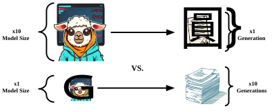
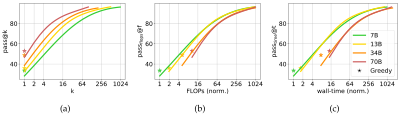
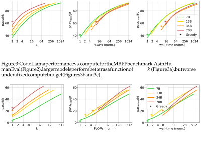
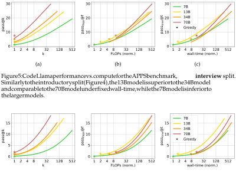
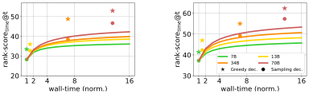
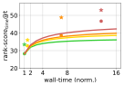
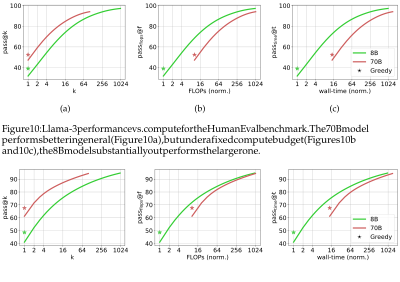

Published as a conference paper at COLM 2024 

# **The Larger the Better? Improved LLM Code-Generation via Budget Reallocation** 

**Michael Hassid**1,2_∗_ **, Tal Remez**1_∗_ **, Jonas Gehring**1 **, Roy Schwartz**2 **, Yossi Adi**1,2 1FAIR Team, Meta 2The Hebrew University of Jerusalem 

_{_ `michael.hassid` _}_ `@mail.huji.ac.il` 

## **Abstract** 

It is a common belief that _large_ language models (LLMs) are better than smaller-sized ones. However, larger models also require significantly more time and compute during inference. This begs the question: _what happens when both models operate under the same budget?_ (e.g., compute, run-time). To address this question, we analyze code generation LLMs of various sizes and make comparisons such as running a 70B model once vs. generating five outputs from a 13B model. We consider a standard unit-test setup, which can be used to select the correct output from the smaller model. Our findings reveal that the repeated use of smaller models can yield consistent improvements, with gains of up to 15% across five tasks. On the other hand, in scenarios where unit-tests are unavailable, a ranking-based selection of candidates from the smaller model falls short of the performance of a single output from larger ones. Our results highlight the potential of using smaller models instead of larger ones, and the importance of studying approaches for ranking LLM outputs.1 

## **1 Introduction** 

A common wisdom in deep learning, and language modeling in particular, is that investing more compute leads to improved performance (Kaplan et al., 2020). The standard way of implementing this principle is training larger models. A simpler, yet often overlooked way to increase compute budget is to run a smaller model multiple times, and select the best output using some metric (Chen et al., 2021). In this work we systematically compare between these two approaches: we ask whether, given a fixed compute budget, it is best to run a large model once, or a smaller model multiple times (Figure 1). Our results show that, perhaps surprisingly, given the same compute budget, running 7B or 13B models can not only match the performance of a 70B model, but also substantially surpass it. 

Addressing our research question requires a method for selecting the best LLM output from a given set of candidates. In this work we focus on execution based code-generation tasks, which assume the availability of unit-tests (Chen et al., 2021; Austin et al., 2021; Hendrycks et al., 2021). We consider the widely-used pass@ _k_ metric (Kulal et al., 2019), which evaluates a model’s performance on code generation problems by generating _k_ outputs and assigning a point if any of them passes all tests. To adapt this metric for our purposes, we take models of different sizes, and for each generate as many outputs as possible given a fixed compute budget, e.g., floating point operations (FLOPs) or wall-time. 

We apply this setup to evaluate the Code Llama (Roziere et al., 2023) model family (7B, 13B, 34B, and 70B) across five tasks: HumanEval (Chen et al., 2021), MBPP (Austin et al., 2021), and the three splits of APPS (Hendrycks et al., 2021). For the HumanEval and MBPP benchmarks, we additionally use the recent Llama-3 (AI@Meta, 2024) model family (8B and 70B). Surprisingly, we find that for the two popular tasks, HumanEval and MBPP, the 

> _∗_ Equal contribution 

> 1 Data is avalible at `https://github.com/slp-rl/budget-realloc` 

1 

Published as a conference paper at COLM 2024 

Figure 1: Different ways to improve LLM performance by increasing compute budget. Top: the standard approach of increasing model size, while generating a single output. Bottom: our approach—using a small model to generate multiple outputs, and select the best one. 

smaller models (7B, 8B and 13B) outperform the larger ones (34B and 70B) by a margin of up to 15%. Importantly, this is observed using both budget types (FLOPs and wall-time) and across all computation budgets. When considering the challenging APPS benchmark, we find that the 13B model performs best across almost all budgets, with a consistent margin of 5% when considering the hardest split—competition. 

We then proceed to examine the scenario where unit-tests are _unavailable_ , such as in an IDE code-completion setup. In such cases, an efficient policy is required to select a single solution from all generated ones. We consider a simple LLM-based policy, which ranks solutions based on the negative log likelihood of the LLM. We also augment this policy with a variant of a recent ranking approach—LEVER (Ni et al., 2023). We experiment with the 7B model, and rank its outputs using each of the models. Our results show that, as expected, ranking-based selection improves with the increase in compute budget, and with the size of the ranking LLM. Nonetheless, this procedure still falls short of the performance achieved by running the larger model independently with the same budget. 

Our results highlight the potential of using smaller models instead of larger ones, a practice that has many benefits. First, small models are far computationally cheaper to pre-train.2 Further, at inference time, they are considerably more hardware-friendly: a 13B model can be accommodated on a single A100 GPU, a feat unachievable for a 70B model (Dettmers et al., 2022). Finally, as we have shown, when controlling for the compute budget, smaller models may actually outperform larger ones. 

Our findings also emphasize the importance of developing effective ranking approaches for LLM outputs. This is especially important in cases where no unit-tests or other verification methods are available (Zou et al., 2021; Uesato et al., 2022; Sun et al., 2023). To support such research direction, we release 2, 000 Code Llama 7B outputs for each example in HumanEval and MBPP—a total of more than 1M outputs.1 

## **2 Evaluation under Compute Restrictions** 

To study our main research question—what is the optimal way of using a given LLM compute budget—we consider a code-generation setup with unit-tests (Chen et al., 2021; Austin et al., 2021; Hendrycks et al., 2021). Below we discuss our methodology for code generation evaluation under computational restrictions. We begin by describing pass@ _k_ (Kulal et al., 2019), the current main approach for evaluating code generation tasks (Section 2.1). We then transition to describe our variant of code generation metrics under computational restrictions (Section 2.2). 

> 2E.g., Llama-2 7B was _≈_ 10 _X_ faster to pre-train compared to the 70B variant (Touvron et al., 2023). 

2 

Published as a conference paper at COLM 2024 

### 2.1 Standard Code Generation Evaluation 

To evaluate LLM code-generation abilities, a common setup assumes a set of coding questions, each with a set of unit-tests. The LLM is fed with each question, and a fixed number of output generations (labelled _k_ ) are sampled. The evaluation protocol considers each question for which at least one output passes all unit-tests as correct. To estimate the performance of a model that generates _k_ outputs, it is common to generate a larger number of outputs _n_ ( _> k_ ) and compute: 

$$
pass@k := E Problems � 1 -(n-c k ) (n k) � , (1)
$$

where _c ≤ n_ is the number of examples that pass the unit-tests. The above mentioned metric results in an unbiased estimator as was shown by Chen et al. (2021). 

### 2.2 Comparing LLMs of Different Sizes under a Fixed Budget 

Our goal is to compare between LLMs of different sizes under a fixed compute budget. To do so, we allow smaller models, which consume fewer resources, to generate more outputs. This results in models of different sizes requiring roughly the same amount of compute. 

We consider two types of compute budgets: the number of FLOPs and wall-time. For each type, a specific resource limit is set (e.g., 10k Tera-FLOPs or 8 seconds), and the model generates examples up to the point where the compute limit is reached. That is: 

$$
passflops@f := pass@k where: k = max flops(k′)\leq{}{}f k′, (2)
$$

$$
passtime@t := pass@k where: k = max time(k′)\leq{}{}t k′, (3)
$$

where flops( _k_ ) and time( _k_ ) are functions that return the FLOPs/wall-time usage of a given model that generates _k_ outputs. Notably, the FLOPs restriction is a more theoretical computational restriction, as it assumes perfect utilization of the hardware. On the other hand, the wall-time restriction is more realistic, but is hardware specific, and thus not directly comparable across different machines. 

## **3 Experimental Setup** 

In this section we describe our experimental setup, focusing on the code benchmarks used (Section 3.1), our metrics (Section 3.2), and our experiments (Section 3.3). 

### 3.1 Benchmarks 

We experiment with three python code benchmarks: HumanEval (Chen et al., 2021), MBPP (Austin et al., 2021) and APPS (Hendrycks et al., 2021). The HumanEval benchmark consists of 164 function declarations alongside their documentation. The Code-LLM’s task is to complete the function according to the provided documentation. MBPP consists of 500 test examples, each one is an instruction for a code function. Here, the Code-LLM is required to generate the full function. Lastly, the test subset of APPS is composed of 5k programming problems at various levels of difficulty: introductory (1k), interview (3k) and competition (1k). In the APPS tasks, the Code-LLM is required to generate the complete python file, which includes import declarations, class definitions, and so on. 

### 3.2 Metrics 

Computing the passflops@ _f_ and passtime@ _t_ metrics requires an estimation of the flops( _k_ ) and time( _k_ ) functions from Equations (2) and (3). To estimate FLOPs usage, we use the calflops library (xiaoju ye, 2023), with input sequence length of 128. We measure wall-time while 

3 

Published as a conference paper at COLM 2024 

Table 1: Code Llama FLOPS and wall-time usage per model size, along with normalized values with respect to the 7B model. 

|Model Size|FLOPs (Teras)|FLOPs (norm.)|wall-time (seconds)|wall-time (norm.)|
|---|---|---|---|---|
|7B|1.69|1.00|395|1.00|
|13B|3.29|1.95|667|1.69|
|34B|8.58|5.08|2,994|7.58|
|70B|17.60|10.41|5,605|14.19|

assuming optimal throughput utilization of the hardware. Specifically, we use a node of 8 A100 GPUs, optimize the batch size per model and measure the time it takes each model to generate a subset of _≈_ 1k examples from our datasets. We report the Code Llama results in Table 1, for readability we also report the normalized factor with respect to the 7B model.3 

### 3.3 Experiments 

We experiment with the Code Llama family (Roziere et al., 2023), a finetuned version of Llama (Touvron et al., 2023). Code Llama comes in various sizes, which we use for our experiments: 7B, 13B, 34B and 70B. For the smaller benchmarks, HumanEval and MBPP, we also consider the Llama-3 family (8B and 70B). 

We follow Roziere et al. (2023), and use a zero-shot setting for HumanEval, a 3-shot prompting strategy for MBPP and 2-shot prompts for APPS, and limit the generation length to 512/256/256 tokens for HumanEval/MBPP/APPS. For the sampling process, we use nucleus sampling (Holtzman et al., 2019) with top- _p_ = 0.95 and a temperature of 0.8/0.8/0.6 for HumanEval/MBPP/APPS, with all models sizes (Roziere et al., 2023). Finally, we also report, the pass@1 results using a greedy decoding method for all models. 

To compare models in varying sizes, we select the maximal number of generations for each model with respect to the values in Table 1. Specifically, for the smaller benchmarks, HumanEval and MBPP, we generate _n_ = 2, 000/1, 000/400/200 answers for the 7-8B/13B/34B/70B models, respectively. For the larger benchmarks, the three splits of APPS, we use _n_ = 1, 000/500/200/100. To get a robust estimation of these measures, we follow Chen et al. (2021) and Roziere et al. (2023), and report for all benchmarks a maximal value of _k_ =_<u>n</u>_ 2for the pass@_k_metric, while using all available unit-tests. 

## **4 Small Models Outperform Large Ones under a Fixed Compute Budget** 

Results for **HumanEval** and **MBPP** using the Code Llama models are presented in Figures 2 and 3, respectively.4 The corresponding results for the Llama-3 models can be found in Figures 10 and 11 (Appendix A). We first note that, as expected, the pass@ _k_ metric improves both with model scale, and with the number of generations _k_ (sub-figure (a) in all figures). However, perhaps surprisingly, when considering the passflops@ _f_ and passtime@ _t_ metrics (sub-figures (b) and (c)), we see a different trend—given a fixed compute budget, smaller models yield better results than larger ones. Specifically, the 7B/8B/13B models outperform the larger models across all compute budgets. Particularly, in the small budget regime (up to 32 normalized FLOPs units and 64 wall-time units) the performance gap reaches 5—15%. 

Another way of looking at our results is by observing that smaller models match the performance of larger ones using substantially lower budgets. For instance, in HumanEval, the Code Llama 7B and 13B models achieve a score of 60% using one quarter of the time it takes the larger models to reach that score. This efficiency gap further increases with the 

> 3Llama-3 8B/70B presents similar usage to Code Llama 7B/70B, with a difference of up to 7%. 

> 4Tables 2 and 3 in Appendix B presents detailed results. 

4 

Published as a conference paper at COLM 2024 

Figure 2: Code Llama performance (Y axis) as a function of compute (X axis, in exponential scale) for the HumanEval benchmark. Larger models perform better in general (Figure 2a), but under a fixed compute budget (Figures 2b and 2c), smaller models (7B and 13B) substantially outperform larger ones (34B and 70B). Greedy decoding is marked by a star. 

Figure 3: Code Llama performance vs. compute for the MBPP benchmark. As in HumanEval (Figure 2), larger models perform better as a function of _k_ (Figure 3a), but worse under a fixed compute budget (Figures 3b and 3c). 

Figure 4: Code Llama performance vs. compute for the APPS benchmark, **introductory** split. The 13B model is superior to the 34B model and comparable to the 70B model under fixed budget. In contrast, the 7B model underperforms the larger models. 

Llama-3 models (Figure 10c). Finally, we compare small models to greedy decoding with larger models, which generally performs better than sampling. We observe that even in this setup, using the smaller models several times is equivalent or preferable in all cases. 

We next turn to discuss the Code Llama results over the three splits of the **APPS** benchmark (Figures 4 to 6).5 We first consider the 13B model, and observe the same trends as in HumanEval and MBPP: this model achieves the best performance in almost all fixed compute budgets. Specifically for the competition split (Figures 6b and 6c), the most challenging APPS split, the 13B model outperforms all other models in all compute budgets, with a consistent margin of _≈_ 5% from the 70B model when considering the wall-time budget. We 

> 5Table 4 in Appendix B presents detailed results. 

5 

Published as a conference paper at COLM 2024 

Figure 5: Code Llama performance vs. compute for the APPS benchmark, **interview** split. Similarly to the introductory split (Figure 4), the 13B model is superior to the 34B model and comparable to the 70B model under fixed wall-time, while the 7B model is inferior to the larger models. 

Figure 6: Code Llama performance vs. compute for the APPS benchmark, **competition** split (the most challenging one). The 13B model is superior to both 34B and 70B models under fixed wall-time, and comparable to the 70B under fixed number of FLOPs. 

further observe that the 13B model achieves similar or better performance as the greedy approach of all models in all three splits. Finally, when fixing the performance, the 13B model is 2–4 times more efficient than the 70B model (both for FLOPs and wall-time). 

We next observe that the 7B model is also competitive with larger models in small budget regimes (up to 8 normalized FLOPs units and 16 wall-time units). Nonetheless, it slightly underperforms the other models on larger budgets. This can be attributed to the 7B model’s inability to generate a sufficient number of correct answers for the task, and may suggest that there is a minimum size requirement for a certain level of task difficulty. 

Our results indicate that small models can match or even outperform large ones under a fixed compute budget, assuming the availability of unit-tests. An intriguing aspect of our research question is what happens when unit-tests are _unavailable_ , and a single selection among several generations must be made. We delve into this topic in the following section. 

## **5 Evaluating Code Generation without Unit-tests** 

We examine the scenario where unit-tests are not available (e.g., IDE code-completion setup). In this case, an efficient selection policy strategy may be used to select one answer from the model’s generations. In the previous cases (Section 2), unit-tests served as this policy. Here we investigate using ranking as a selection policy. In Section 5.1 we show how to estimate the performance of a model given such a strategy, and in Section 5.2 we analyze the performance of larger models as rankers for a small model. 

6 

Published as a conference paper at COLM 2024 

1 <mark>`def rank_score_at_k (n, k, pass_sorted):`</mark> 2 <mark>`"""`</mark> 3 <mark>`:param n: total number of samples`</mark> 4 <mark>`:param k: k in rank -score@k`</mark> 5 <mark>`:param pass_sorted: a binary list of pass scores. The list is sorted by the ranks assigned to examples by a ranker.`</mark> 6 <mark>`"""`</mark> 7 <mark>`numerator_sum = 0`</mark> 8 <mark>`for i in range (1, n-k+2):`</mark> 9 <mark>`numerator_sum += math.comb(n-i, k-1) * scores_and_pass [i-1]`</mark> 10 <mark>`score = (numerator_sum / math.comb(n, k)) * 100`</mark> 11 <mark>`return score`</mark> 

Figure 7: A Python implementation of rank-score@ _k_ as presented in Equation (4). 

### 5.1 Evaluating Rankers 

We assume a model that generates _k_ outputs, and a policy that ranks them. To estimate the performance of such setup, we count the number of groups containing _k_ generations where the highest-ranked generation within them is a correct one. That is: 

$$
rank-score@k := E Problems � 1 (n k) \cdot{}{} � n-k+1 \sum{}{} i=1 �n -i k -1 � \cdot{}{} passi �� , (4)
$$

where _n_ ( _>k_ ) is the number of answers generated for the estimation, and [pass1, pass2, . . . , pass _n_ ] _∈{_ 0, 1 _}__n_ are the pass scores sorted according to the ranking policy. That is, pass _i_ is 1 if the example ranked _i_ according to the policy is correct, and 0 otherwise. See Figure 7 for a python implementation of rank-score@ _k_ . 

Similarly to Equations (2) and (3), we also define: 

$$
rank-scoreflops@f := rank-score@k where: k = max flops(k′)\leq{}{}f k′, (5)
$$

$$
rank-scoretime@t := rank-score@k where: k = max time(k′)\leq{}{}t k′, (6)
$$

where flops( _k_ ) and time( _k_ ) are the same functions as in Section 2.2. Next, we evaluate the performance of large models as rankers using the above metrics. 

### 5.2 Large Language Models as Rankers 

We examine the usage of LLMs as rankers. To produce a ranking order over a set of generations, we use the averaged Negative Log Likelihood (NLL) the LLM assigns to each generation (excluding the prompt), and rank the generations according to that score. It should be noted that extracting the NLL of a model over a given generation can be done in a parallel manner (i.e., non-autoregressively), which is substantially faster than traditional token-by-token generation. The score given by a model to a generation _G_ = ( _w_ 1, . . . , _wl_ ) given a prompt _P_ is: 

$$
scoremodel = NLLmodel(G|P) = -1 l l \sum{}{} i=1 log � pmodel(wi|wi-1, . . . , w1, P) � . (7)
$$

To study the performance of LLMs as rankers we use the HumanEval and MBPP benchmarks. We use 2, 000 generations produced by Code Llama 7B as described in Section 3.3. As rankers we use all four Code Llama model sizes. We discard any generation that fails to complete, i.e. reached the maximal number of generated tokens without producing an end-of-sequence token. We also report the performance of running each model independently with one generation budget (both greedy and sampling). 

7 

Published as a conference paper at COLM 2024 

Figure 8: rank-scoretime@ _t_ as a function of wall-time for HumanEval (left) and MBPP (right), using different rankers (different lines). Greedy sampling is marked as a star, and top-p sampling as a circle. While ranking results improve with the size of the ranker and with compute budget, they still fall short of greedy decoding with larger models. 

Our results are presented in Figure 8. As can be seen, using LLMs as rankers over generations obtained from smaller models improves performance. Interestingly, we observe that using a 7B model as a ranker for itself can enhance its generation even further than the greedy approach, albeit with the cost generating several outputs. We also find that using larger models as rankers results in better perfomance. When considering a fixed compute budget, we find that it is sometimes comparable to use LLMs as rankers instead of sampling from them, as can be seen with the 13B and 34B models. However, this is not the case for the greedy approach which consistently outperforms ranking multiple generations from a smaller model given a fixed compute budget. 

To further check the use of external verifiers, we integrate the LEVER verifier model (Ni et al., 2023) with the Code Llama models. The LEVER approach aims to enhance code generation by learning to verify generated programs. The full LEVER pipeline involves using the NLL produced by the code generation model, error pruning based on execution, and a verifier trained on code generations with execution results. However, since we assume that no tests are available in our setting, execution pruning and execution results cannot be used. LEVER released a trained verifier over the MBPP benchmark, which we use along with the NLL scores of each model. As shown in Figure 9, the LEVER verifier does not improve the results in the test-less setting, which is expected given that one of the main components of the approach relies on execution over unit-tests. 

Figure 9: rank-scoretime@ _t_ as a function of wall-time for MBPP, using the LEVER verfier with different NLL rankers. Results are similar to Figure 8. 

In summary, there remains a gap to bridge between using LLMs as rankers for smaller models and using them as generators. To further promote this line of research, we release the 2, 000 generations per example produced by the 7B model for both HumanEval and MBPP (a total of 1, 328, 000 generations). 

## **6 Related Work** 

### 6.1 Model Scaling 

Model scaling was found to be one of the key elements in the success of LLMs (Dehghani et al., 2023; Gu et al., 2023; Hassid et al., 2023; Rae et al., 2021; Chowdhery et al., 2023; Touvron et al., 2023), with Wei et al. (2022) demonstrating how specific abilities emerge mainly after reaching a specific scale. The way language models behave when they are scaled up and their ability to adjust have been a significant factor in the creation of LLMs (Hernandez et al., 2021). Kaplan et al. (2020) investigated the optimal model size to train for a given 

8 

Published as a conference paper at COLM 2024 

compute budget, while Hoffmann et al. (2022) demonstrated how scaling both model and dataset sizes improves performance across various tasks. Clark et al. (2022) analyzed the scaling properties of mixture-of-experts models, showing that scaling with the number of experts diminishes as model size increases. Recently, Gadre et al. (2024) provided a scaling law analysis considering downstream tasks rather than next-token prediction loss. They related the perplexity of a language model to its downstream task performance via a power law and used it to predict the top-1 error averaged over the evaluated downstream tasks. Our work differs from all of the above, as we do not claim to provide new scaling laws but rather suggest that when fixing the budget, smaller models can provide comparable or superior results to larger ones. 

Recent studies by Shi et al. (2024) and Mei et al. (2024) have demonstrated that under constrained compute budgets, smaller vision models can surpass their larger counterparts. Specifically, Shi et al. (2024) found advantages in using multiple image scales, whereas Mei et al. (2024) observed that smaller diffusion models perform better than larger ones when the compute budget is fixed. Our approach, which generates multiple text outputs from a small model, aligns with these findings. 

### 6.2 Verifiers and Rankers 

LLM verifiers and rankers is a growing trend, which leverages LLMs to verify and rank generations obtained from weaker and smaller models (Cobbe et al., 2021b; Uesato et al., 2022; Saha et al., 2024; Havrilla et al., 2024). Both Cobbe et al. (2021b) and Uesato et al. (2022) leveraged an external classifier to rank LLM outputs. Specifically, in both setups the authors proposed to generate many candidate solutions and select the one ranked highest by the verifier. The authors demonstrated the applicability of using such verifiers in solving math word problems (Cobbe et al., 2021a). Qin et al. (2023) demonstrated that LLMs can serve as efficient text rankers when considering pairwise ranking. 

Another line of work leveraged LLMs to evaluate the quality of smaller models (Saha et al., 2024; Dubois et al., 2023; Zheng et al., 2023; Oren et al., 2024). Although providing a promising alternative, such evaluation suffers from biases in the larger model (Zheng et al., 2023) and reliance on hand-designed evaluation plans that impact the method’s ability to generalize (Liu et al., 2023). Large models also serve as verifiers of small ones in a speculative decoding setup, with the goal of speeding-up LLM generation (Leviathan et al., 2023; Kim et al., 2023; Chen et al., 2023). It is also common to distill knowledge from a large model into a smaller one in order to improve efficiency (Hinton et al., 2015; Sanh et al., 2019; Xu et al., 2024), see Treviso et al. (2023) for a survey on efficient methods in NLP. 

In this work, we explore the potential of LLMs as selectors of the best output of a smaller model in a fixed budget setup. Similarly to ours, Li et al. (2024) found that smaller sized LMs (7B parameters) already exhibit strong mathematical abilities when selecting the best response from _k_ different generations. When considering code generation models, AlphaCode Team (2023) presented impressive results on challenging coding contests tasks while generating 1M samples, and later on filtering and ranking them using Gemini-Pro LLM (Team et al., 2023). Dou et al. (2024) proposed a method to improve code-generation models by learning a policy model using reinforcement learning methods. Lastly, Shi et al. (2022) and Ni et al. (2023) used execution feedback in order to filter code-generations, while Shi et al. (2022) used non-learned approaches, Ni et al. (2023) trained an external verifier on top of the generation and the execution feedback. 

## **7 Discussion & Limitations** 

Our results show that using smaller models with the same amount of compute can improve LLM code-generation performance. An interesting question we do not fully address is whether, given enough compute, the larger models will overtake the smaller ones, or perhaps they will all saturate at a similar performance level at some point. Our HumanEval and MBPP results seem to slightly support the latter hypothesis (as all models begin to saturate, see Figures 2 and 3). However, unfortunately, due to compute constraints, our 

9 

Published as a conference paper at COLM 2024 

setting is restricted to exploring only a limited number of generations per model.6 We note that despite this limitation, in practice, due to these costs our conclusions apply to most practical use-cases. We defer more expensive experiments to future work. 

## **8 Conclusion** 

In this work, we compared large language models with smaller-sized models under fixed budget constraints (i.e., FLOPs and wall-time). We evaluated the models using executionbased code-generation tasks, which provide access to unit-tests. Our findings reveal that generating multiple outputs from a 13B model may lead to gains of up to 15% over a single generation from a 70B model across five tasks. This highlights the potential of using smaller models instead of larger ones. In scenarios where unit tests or other solution verifiers are unavailable, we explored a simple ranking-based approach for candidate selection. We found the proposed ranking approach falls short in performance compared to a single output from the larger model. Our findings emphasize the importance of studying approaches for ranking LLM outputs, which hold great potential to not only improve model performance but also improve budget allocation. To further enhance this research direction we release over 1M samples from the Code Llama 7B models spanning both HumanEval and MBPP benchmarks. 

## **9 Acknowledgments** 

We thank Miri Varshavsky Hassid for the great feedback and moral support. 

## **References** 

- AI@Meta. Llama 3 model card. 2024. URL `https://github.com/meta-llama/llama3/ blob/main/MODEL_CARD.md` . 

- Google DeepMind AlphaCode Team. Alphacode 2 technical report, 2023. URL `https://storage.googleapis.com/deepmind-media/AlphaCode2/AlphaCode2_Tech_ Report.pdf` . 

- Jacob Austin, Augustus Odena, Maxwell Nye, Maarten Bosma, Henryk Michalewski, David Dohan, Ellen Jiang, Carrie Cai, Michael Terry, Quoc Le, et al. Program synthesis with large language models, 2021. URL `https://arxiv.org/abs/2108.07732` . arXiv:2108.07732. 

- Charlie Chen, Sebastian Borgeaud, Geoffrey Irving, Jean-Baptiste Lespiau, Laurent Sifre, and John Jumper. Accelerating large language model decoding with speculative sampling, 2023. URL `https://arxiv.org/abs/2302.01318` . arXiv:2302.01318. 

- Mark Chen, Jerry Tworek, Heewoo Jun, Qiming Yuan, Henrique Ponde de Oliveira Pinto, Jared Kaplan, Harri Edwards, Yuri Burda, Nicholas Joseph, Greg Brockman, Alex Ray, Raul Puri, Gretchen Krueger, Michael Petrov, Heidy Khlaaf, Girish Sastry, Pamela Mishkin, Brooke Chan, Scott Gray, Nick Ryder, Mikhail Pavlov, Alethea Power, Lukasz Kaiser, Mohammad Bavarian, Clemens Winter, Philippe Tillet, Felipe Petroski Such, Dave Cummings, Matthias Plappert, Fotios Chantzis, Elizabeth Barnes, Ariel Herbert-Voss, William Hebgen Guss, Alex Nichol, Alex Paino, Nikolas Tezak, Jie Tang, Igor Babuschkin, Suchir Balaji, Shantanu Jain, William Saunders, Christopher Hesse, Andrew N. Carr, Jan Leike, Josh Achiam, Vedant Misra, Evan Morikawa, Alec Radford, Matthew Knight, Miles Brundage, Mira Murati, Katie Mayer, Peter Welinder, Bob McGrew, Dario Amodei, Sam McCandlish, Ilya Sutskever, and Wojciech Zaremba. Evaluating large language models trained on code, 2021. URL `https://arxiv.org/abs/2107.03374` . arXiv:2107.03374. 

- Aakanksha Chowdhery, Sharan Narang, Jacob Devlin, Maarten Bosma, Gaurav Mishra, Adam Roberts, Paul Barham, Hyung Won Chung, Charles Sutton, Sebastian Gehrmann, 

> 6For instance, generating 1, 000 answers for the 5, 000 examples of the APPS benchmark with a 7B model takes about 20 days using a node of 8 A100 GPUs. 

10 

Published as a conference paper at COLM 2024 

et al. Palm: Scaling language modeling with pathways. _Journal of Machine Learning Research_ , 24(240):1–113, 2023. 

- Aidan Clark, Diego de Las Casas, Aurelia Guy, Arthur Mensch, Michela Paganini, Jordan Hoffmann, Bogdan Damoc, Blake Hechtman, Trevor Cai, Sebastian Borgeaud, et al. Unified scaling laws for routed language models. In _International conference on machine learning_ , pp. 4057–4086. PMLR, 2022. 

- Karl Cobbe, Vineet Kosaraju, Mohammad Bavarian, Mark Chen, Heewoo Jun, Lukasz Kaiser, Matthias Plappert, Jerry Tworek, Jacob Hilton, Reiichiro Nakano, Christopher Hesse, and John Schulman. Training verifiers to solve math word problems, 2021a. URL `https://arxiv.org/abs/2110.14168` . arXiv:2110.14168. 

- Karl Cobbe, Vineet Kosaraju, Mohammad Bavarian, Mark Chen, Heewoo Jun, Lukasz Kaiser, Matthias Plappert, Jerry Tworek, Jacob Hilton, Reiichiro Nakano, et al. Training verifiers to solve math word problems, 2021b. URL `https://arxiv.org/abs/2110.14168` . arXiv:2110.14168. 

- Mostafa Dehghani, Josip Djolonga, Basil Mustafa, Piotr Padlewski, Jonathan Heek, Justin Gilmer, Andreas Peter Steiner, Mathilde Caron, Robert Geirhos, Ibrahim Alabdulmohsin, et al. Scaling vision transformers to 22 billion parameters. In _International Conference on Machine Learning_ , pp. 7480–7512. PMLR, 2023. 

- Tim Dettmers, Mike Lewis, Younes Belkada, and Luke Zettlemoyer. LLM.int8(): 8-bit matrix multiplication for transformers at scale. In _Advances in Neural Information Processing Systems_ , 2022. 

- Shihan Dou, Yan Liu, Haoxiang Jia, Limao Xiong, Enyu Zhou, Junjie Shan, Caishuang Huang, Wei Shen, Xiaoran Fan, Zhiheng Xi, et al. Stepcoder: Improve code generation with reinforcement learning from compiler feedback, 2024. URL `https://arxiv.org/ abs/2402.01391` . arXiv:2402.01391. 

- Yann Dubois, Chen Xuechen Li, Rohan Taori, Tianyi Zhang, Ishaan Gulrajani, Jimmy Ba, Carlos Guestrin, Percy S Liang, and Tatsunori B Hashimoto. Alpacafarm: A simulation framework for methods that learn from human feedback. In _Advances in Neural Information Processing Systems_ , 2023. URL `https://arxiv.org/abs/2305.14387` . 

- Samir Yitzhak Gadre, Georgios Smyrnis, Vaishaal Shankar, Suchin Gururangan, Mitchell Wortsman, Rulin Shao, Jean Mercat, Alex Fang, Jeffrey Li, Sedrick Keh, et al. Language models scale reliably with over-training and on downstream tasks, 2024. URL `https: //arxiv.org/abs/2403.08540` . arXiv:2403.08540. 

- Yile Gu, Prashanth Gurunath Shivakumar, Jari Kolehmainen, Ankur Gandhe, Ariya Rastrow, and Ivan Bulyko. Scaling laws for discriminative speech recognition rescoring models, 2023. URL `https://arxiv.org/abs/2306.15815` . arXiv:2306.15815. 

- Michael Hassid, Tal Remez, Tu Anh Nguyen, Itai Gat, Alexis Conneau, Felix Kreuk, Jade Copet, Alexandre Defossez, Gabriel Synnaeve, Emmanuel Dupoux, et al. Textually pretrained speech language models. _Advances in Neural Information Processing Systems_ , 36, 2023. 

- Alex Havrilla, Yuqing Du, Sharath Chandra Raparthy, Christoforos Nalmpantis, Jane Dwivedi-Yu, Maksym Zhuravinskyi, Eric Hambro, Sainbayar Sukhbaatar, and Roberta Raileanu. Teaching large language models to reason with reinforcement learning, 2024. URL `https://arxiv.org/abs/2403.04642` . arXiv:2403.04642. 

- Dan Hendrycks, Steven Basart, Saurav Kadavath, Mantas Mazeika, Akul Arora, Ethan Guo, Collin Burns, Samir Puranik, Horace He, Dawn Song, and Jacob Steinhardt. Measuring coding challenge competence with APPS. In _Advances in Neural Information Processing Systems_ , 2021. 

- Danny Hernandez, Jared Kaplan, Tom Henighan, and Sam McCandlish. Scaling laws for transfer, 2021. URL `https://arxiv.org/abs/2102.01293` . arXiv:2102.01293. 

11 

Published as a conference paper at COLM 2024 

- Geoffrey Hinton, Oriol Vinyals, and Jeff Dean. Distilling the knowledge in a neural network. _arXiv preprint arXiv:1503.02531_ , 2015. 

- Jordan Hoffmann, Sebastian Borgeaud, Arthur Mensch, Elena Buchatskaya, Trevor Cai, Eliza Rutherford, Diego de Las Casas, Lisa Anne Hendricks, Johannes Welbl, Aidan Clark, et al. Training compute-optimal large language models, 2022. URL `https://arxiv.org/ abs/2203.15556` . arXiv:2203.15556. 

- Ari Holtzman, Jan Buys, Li Du, Maxwell Forbes, and Yejin Choi. The curious case of neural text degeneration. In _International Conference on Learning Representations_ , 2019. 

- Jared Kaplan, Sam McCandlish, Tom Henighan, Tom B Brown, Benjamin Chess, Rewon Child, Scott Gray, Alec Radford, Jeffrey Wu, and Dario Amodei. Scaling laws for neural language models, 2020. URL `https://arxiv.org/abs/2001.08361` . arXiv:2001.08361. 

- Sehoon Kim, Karttikeya Mangalam, Suhong Moon, Jitendra Malik, Michael W Mahoney, Amir Gholami, and Kurt Keutzer. Speculative decoding with big little decoder. In A. Oh, T. Neumann, A. Globerson, K. Saenko, M. Hardt, and S. Levine (eds.), _Advances in Neural Information Processing Systems_ , volume 36, pp. 39236–39256. Curran Associates, Inc., 2023. URL `https://proceedings.neurips.cc/paper_files/paper/2023/file/ 7b97adeafa1c51cf65263459ca9d0d7c-Paper-Conference.pdf` . 

- Sumith Kulal, Panupong Pasupat, Kartik Chandra, Mina Lee, Oded Padon, Alex Aiken, and Percy S Liang. Spoc: Search-based pseudocode to code. In H. Wallach, H. Larochelle, A. Beygelzimer, F. d'Alche-Buc,´ E. Fox, and R. Garnett (eds.), _Advances in Neural Information Processing Systems_ , volume 32. Curran Associates, Inc., 2019. URL `https://proceedings.neurips.cc/paper_files/paper/2019/file/ 7298332f04ac004a0ca44cc69ecf6f6b-Paper.pdf` . 

- Yaniv Leviathan, Matan Kalman, and Yossi Matias. Fast inference from transformers via speculative decoding. In _Proc. of ICLR_ , 2023. URL `https://arxiv.org/abs/2211.17192` . 

- Chen Li, Weiqi Wang, Jingcheng Hu, Yixuan Wei, Nanning Zheng, Han Hu, Zheng Zhang, and Houwen Peng. Common 7B language models already possess strong math capabilities, 2024. URL `https://arxiv.org/abs/2403.04706` . arXiv:2403.04706. 

- Yang Liu, Dan Iter, Yichong Xu, Shuohang Wang, Ruochen Xu, and Chenguang Zhu. G- Eval: NLG evaluation using GPT-4 with better human alignment, 2023. URL `https: //arxiv.org/abs/2303.16634` . arXiv:2303.16634. 

- Kangfu Mei, Zhengzhong Tu, Mauricio Delbracio, Hossein Talebi, Vishal M Patel, and Peyman Milanfar. Bigger is not always better: Scaling properties of latent diffusion models. _arXiv preprint arXiv:2404.01367_ , 2024. 

- Ansong Ni, Srini Iyer, Dragomir Radev, Veselin Stoyanov, Wen-tau Yih, Sida Wang, and Xi Victoria Lin. Lever: Learning to verify language-to-code generation with execution. In _International Conference on Machine Learning_ , pp. 26106–26128. PMLR, 2023. 

- Matanel Oren, Michael Hassid, Yossi Adi, and Roy Schwartz. Transformers are multi-state RNNs, 2024. URL `https://arxiv.org/abs/2401.06104` . arXiv:2401.06104. 

- Zhen Qin, Rolf Jagerman, Kai Hui, Honglei Zhuang, Junru Wu, Jiaming Shen, Tianqi Liu, Jialu Liu, Donald Metzler, Xuanhui Wang, and Michael Bendersky. Large language models are effective text rankers with pairwise ranking prompting, 2023. URL `https: //arxiv.org/abs/2306.17563` . arXiv:2306.17563. 

- Jack W Rae, Sebastian Borgeaud, Trevor Cai, Katie Millican, Jordan Hoffmann, Francis Song, John Aslanides, Sarah Henderson, Roman Ring, Susannah Young, et al. Scaling language models: Methods, analysis & insights from training gopher, 2021. URL `https: //arxiv.org/abs/2112.11446` . arXiv:2112.11446. 

- Baptiste Roziere, Jonas Gehring, Fabian Gloeckle, Sten Sootla, Itai Gat, Xiaoqing Ellen Tan, Yossi Adi, Jingyu Liu, Tal Remez, Jer´ emy´ Rapin, et al. Code llama: Open foundation models for code, 2023. URL `https://arxiv.org/abs/2308.12950` . arXiv:2308.12950. 

12 

Published as a conference paper at COLM 2024 

- Swarnadeep Saha, Omer Levy, Asli Celikyilmaz, Mohit Bansal, Jason Weston, and Xian Li. Branch-solve-merge improves large language model evaluation and generation. In _Proc. of NAACL_ , 2024. URL `https://arxiv.org/abs/2310.15123` . 

- Victor Sanh, Lysandre Debut, Julien Chaumond, and Thomas Wolf. Distilbert, a distilled version of bert: smaller, faster, cheaper and lighter. _arXiv preprint arXiv:1910.01108_ , 2019. 

- Baifeng Shi, Ziyang Wu, Maolin Mao, Xin Wang, and Trevor Darrell. When do we not need larger vision models?, 2024. URL `https://arxiv.org/abs/2403.13043` . arXiv:2403.13043. 

- Freda Shi, Daniel Fried, Marjan Ghazvininejad, Luke Zettlemoyer, and Sida I. Wang. Natural language to code translation with execution. In Yoav Goldberg, Zornitsa Kozareva, and Yue Zhang (eds.), _Proceedings of the 2022 Conference on Empirical Methods in Natural Language Processing_ , pp. 3533–3546, Abu Dhabi, United Arab Emirates, December 2022. Association for Computational Linguistics. doi: 10.18653/v1/2022.emnlp-main.231. URL `https://aclanthology.org/2022.emnlp-main.231` . 

- Weiwei Sun, Lingyong Yan, Xinyu Ma, Shuaiqiang Wang, Pengjie Ren, Zhumin Chen, Dawei Yin, and Zhaochun Ren. Is ChatGPT good at search? investigating large language models as re-ranking agents. In Houda Bouamor, Juan Pino, and Kalika Bali (eds.), _Proceedings of the 2023 Conference on Empirical Methods in Natural Language Processing_ , pp. 14918–14937, Singapore, December 2023. Association for Computational Linguistics. doi: 10.18653/v1/ 2023.emnlp-main.923. URL `https://aclanthology.org/2023.emnlp-main.923` . 

- Gemini Team, Rohan Anil, Sebastian Borgeaud, Yonghui Wu, Jean-Baptiste Alayrac, Jiahui Yu, Radu Soricut, Johan Schalkwyk, Andrew M Dai, Anja Hauth, et al. Gemini: a family of highly capable multimodal models, 2023. URL `https://arxiv.org/abs/2312.11805` . arXiv:2312.11805. 

- Hugo Touvron, Louis Martin, Kevin Stone, Peter Albert, Amjad Almahairi, Yasmine Babaei, Nikolay Bashlykov, Soumya Batra, Prajjwal Bhargava, Shruti Bhosale, et al. Llama 2: Open foundation and fine-tuned chat models, 2023. URL `https://arxiv.org/abs/2307.09288` . arXiv:2307.09288. 

- Marcos Treviso, Ji-Ung Lee, Tianchu Ji, Betty van Aken, Qingqing Cao, Manuel R. Ciosici, Michael Hassid, Kenneth Heafield, Sara Hooker, Colin Raffel, Pedro H. Martins, Andre´ F. T. Martins, Jessica Zosa Forde, Peter Milder, Edwin Simpson, Noam Slonim, Jesse Dodge, Emma Strubell, Niranjan Balasubramanian, Leon Derczynski, Iryna Gurevych, and Roy Schwartz. Efficient methods for natural language processing: A survey. _Transactions of the Association for Computational Linguistics_ , 11:826–860, 2023. doi: 10.1162/tacl ~~a 0~~ 0577. URL `https://aclanthology.org/2023.tacl-1.48` . 

- Jonathan Uesato, Nate Kushman, Ramana Kumar, Francis Song, Noah Siegel, Lisa Wang, Antonia Creswell, Geoffrey Irving, and Irina Higgins. Solving math word problems with process-and outcome-based feedback, 2022. URL `https://arxiv.org/abs/2211.14275` . arXiv:2211.14275. 

- Jason Wei, Yi Tay, Rishi Bommasani, Colin Raffel, Barret Zoph, Sebastian Borgeaud, Dani Yogatama, Maarten Bosma, Denny Zhou, Donald Metzler, Ed H. Chi, Tatsunori Hashimoto, Oriol Vinyals, Percy Liang, Jeff Dean, and William Fedus. Emergent abilities of large language models. _Transactions on Machine Learning Research_ , 2022. ISSN 2835-8856. URL `https://openreview.net/forum?id=yzkSU5zdwD` . Survey Certification. 

- xiaoju ye. calflops: a flops and params calculate tool for neural networks in pytorch framework, 2023. URL `https://github.com/MrYxJ/calculate-flops.pytorch` . 

- Xiaohan Xu, Ming Li, Chongyang Tao, Tao Shen, Reynold Cheng, Jinyang Li, Can Xu, Dacheng Tao, and Tianyi Zhou. A survey on knowledge distillation of large language models. _arXiv preprint arXiv:2402.13116_ , 2024. 

13 

Published as a conference paper at COLM 2024 

- Lianmin Zheng, Wei-Lin Chiang, Ying Sheng, Siyuan Zhuang, Zhanghao Wu, Yonghao Zhuang, Zi Lin, Zhuohan Li, Dacheng Li, Eric Xing, et al. Judging LLM-as-a-judge with MT-bench and chatbot arena. In _Advances in Neural Information Processing Systems: Datasets and Benchmarks Track_ , 2023. 

- Lixin Zou, Shengqiang Zhang, Hengyi Cai, Dehong Ma, Suqi Cheng, Shuaiqiang Wang, Daiting Shi, Zhicong Cheng, and Dawei Yin. Pre-trained language model based ranking in baidu search. In _Proceedings of the 27th ACM SIGKDD Conference on Knowledge Discovery & Data Mining_ , pp. 4014–4022, 2021. 

14 

Published as a conference paper at COLM 2024 

Figure 10: Llama-3 performance vs. compute for the HumanEval benchmark. The 70B model performs better in general (Figure 10a), but under a fixed compute budget (Figures 10b and 10c), the 8B model substantially outperforms the larger one. 

Figure 11: Llama-3 performance vs. compute for the MBPP benchmark. As in HumanEval (Figure 10), larger models perform better as a function of _k_ (Figure 11a), but worse under a fixed compute budget (Figures 11b and 11c). 

## **A Llama-3 Results** 

We present Llama-3 results for the HumanEval and MBPP benchmarks in Figures 10 and 11, respectively. 

## **B Detailed pass@** _k_ **Results** 

In Tables 2 to 4 presents precise pass@ _k_ results for the datasets examined (HumanEval, MBPP and APPS, respectively). Due to the infeasibility of reporting results for all _k_ , we provide results for selected _k_ values. Nevertheless, it is important to note that all relevant _k_ values were calculated and used in the computation of the figures. 

Table 2: Precise models’ pass@ _k_ results for several _k_ values over the HumanEval benchmark. 

|Model _k_for pass@_k_|1|2|4|16|64|128|256|500|1000|
|---|---|---|---|---|---|---|---|---|---|
|Code Llama 7B|28.2|38.5|48.9|68.7|83.9|89.0|92.7|95.0|96.3|
|Code Llama 13B|32.7|44.4|56.2|77.0|89.0|92.3|94.8|96.5|–.-|
|Code Llama 34B|38.6|51.4|63.4|81.8|91.7|94.3|–.-|–.-|–.-|
|Code Llama 70B|46.7|61.1|73.2|87.3|94.4|–.-|–.-|–.-|–.-|
|Llama-3 8B|31.8|43.1|54.4|74.0|86.9|90.9|94.0|96.0|97.3|
|Llama-3 70B|47.3|59.3|69.8|84.7|92.8|–.-|–.-|–.-|–.-|

15 

Published as a conference paper at COLM 2024 

Table 3: Precise models’ pass@ _k_ results for several _k_ values over the MBPP benchmark. 

|Model _k_for pass@_k_|1|2|4|16|64|128|256|500|1000|
|---|---|---|---|---|---|---|---|---|---|
|Code Llama 7B|37.3|48.0|57.3|71.6|81.1|84.8|87.9|90.3|92.4|
|Code Llama 13B|42.3|53.4|62.5|75.3|84.0|87.4|90.4|92.8|–.-|
|Code Llama 34B|49.2|60.1|68.6|79.2|85.8|88.7|–.-|–.-|–.-|
|Code Llama 70B|57.3|67.7|74.8|83.7|90.0|–.-|–.-|–.-|–.-|
|Llama-3 8B|41.1|52.4|61.8|75.5|84.4|87.7|90.5|92.8|94.7|
|Llama-3 70B|61.2|71.5|78.7|87.2|92.9|–.-|–.-|–.-|–.-|

Table 4: Precise models’ pass@ _k_ results for several _k_ values over the different splits of the APPS benchmark. 

|Model _k_for pass@_k_|1|2|4|16|32|64|128|256|500|
|---|---|---|---|---|---|---|---|---|---|
|||APPS-|introd|uctory||||||
|Code Llama 7B|4.5|7.7|12.1|23.0|28.6|34.0|39.3|44.4|49.0|
|Code Llama 13B|10.3|16.3|23.1|36.3|42.3|47.8|52.8|–.-|–.-|
|Code Llama 34B|12.6|19.7|27.4|40.8|46.8|52.5|–.-|–.-|–.-|
|Code Llama 70B|22.6|30.5|38.1|52.5|58.5|–.-|–.-|–.-|–.-|
|||APP|S-inter|view||||||
|Code Llama 7B|0.9|1.6|2.7|6.1|8.3|10.8|13.6|16.4|19.2|
|Code Llama 13B|2.2|3.8|5.9|11.6|14.8|18.3|21.9|–.-|–.-|
|Code Llama 34B|2.9|4.9|7.6|14.4|18.1|22.0|–.-|–.-|–.-|
|Code Llama 70B|5.5|8.7|12.6|21.8|26.6|–.-|–.-|–.-|–.-|
|||APPS|-compe|tition||||||
|Code Llama 7B|0.1|0.3|0.5|1.6|2.6|4.1|6.1|8.6|11.6|
|Code Llama 13B|0.6|1.2|2.1|5.3|7.8|10.9|14.4|–.-|–.-|
|Code Llama 34B|0.7|1.3|2.3|6.1|9.0|12.6|–.-|–.-|–.-|
|Code Llama 70B|1.7|3.0|4.9|11.1|15.3|–.-|–.-|–.-|–.-|

16 

