# **Energy and AI** 

lea 

World Energy Outlook Special Report 

## **INTERNATIONAL ENERGY AGENCY** 

The IEA examines the full spectrum of energy issues including oil, gas and coal supply and demand, renewable energy technologies, electricity markets, energy efficiency, access to energy, demand side management and much more. Through its work, the IEA advocates policies that will enhance the reliability, affordability and sustainability of energy in its 32 Member countries, 13 Association countries and beyond. 

Please note that this publication is subject to specific restrictions that limit its use and distribution. The terms and conditions are available online at www.iea.org/terms 

This publication and any map included herein are without prejudice to the status of or sovereignty over any territory, to the delimitation of international frontiers and boundaries and to the name of any territory, city or area. 

**IEA M ember countries:** 

Australia Austria Belgium Canada Czech Republic Denmark Estonia Finland France Germany Greece Hungary Ireland Italy Japan Korea Latvia Lithuania Luxembourg Mexico Netherlands New Zealand Norway Poland Portugal Slovak Republic Spain Sweden Switzerland Republic of Türkiye United Kingdom United States 

The European Commission also participates in the work of the IEA 

**IEA A ssociation countries:** 

Argentina Brazil China Egypt India Indonesia Kenya Morocco Senegal Singapore South Africa Thailand Ukraine 

Source: IEA. International Energy Agency Website: www.iea.org 

_Foreword_ 

In recent years, artificial intelligence (AI) has soared to the top of the political and business agenda. Once a mostly academic pursuit, it has evolved into an industry with trillions of dollars at stake. Despite significant uncertainties, it is now very clear: AI is coming. In many sectors, it is already here. 

This has major consequences for the global energy sector. There is no AI without energy – specifically electricity. At the same time, AI has the potential to transform the sector’s future. However, policy makers and the market have often lacked the tools to fully understand these wide-ranging impacts. Recognising this gap, the International Energy Agency (IEA) stepped up to address it by leveraging our expertise in data collection and analysis, as well as our convening power, to inform and strengthen the global dialogue on these issues. 

We began a new workstream on the nexus of energy and AI over a year ago, which has resulted in a series of key activities and outputs, culminating in this special report. In December 2024, we held the Global Conference on Energy and AI, the largest international gathering on the matter to date, at our headquarters in Paris. It brought together policy makers, the tech sector, the energy industry and international experts to discuss the critical issues at play. This helped lay groundwork for the AI Action Summit, co-chaired by President Emmanuel Macron of France and Prime Minister Narendra Modi of India, in February 2025 – an event to which the IEA made crucial contributions. 

This special report advances the conversation further. It is the first comprehensive global analysis examining all aspects of the links between energy and AI – from pathways to securely and sustainably meeting energy demand for AI, to how AI itself could transform the production, consumption and transport of energy around the world. The analysis explores the implications of the rise of AI on energy security, investment, emissions and more – providing a strong factual basis for those thinking through the challenges and opportunities ahead. 

This report shows that electricity demand for AI is growing fast globally, even if other sources of demand are growing faster. In some parts of the world, the effects of AI on electricity systems are set to be very significant. With this in mind, we suggest three pillars countries should bear in mind as they plan for the future. 

The first is the importance of finding the right mix of energy sources to deliver the uninterrupted power supply that data centres need to support AI. According to our analysis, there is a role for established technologies such as renewables and natural gas, as well as emerging technologies like small modular nuclear reactors (SMRs) and advanced geothermal. Deciding which options to prioritise may depend on other policy priorities. 

Yet a sole focus on increasing electricity generation won’t be enough. To deliver the energy for AI, countries must also think about their infrastructure. That will mean accelerating investment in grids – and working to ensure that data centres, as well as the wider electricity system, are as efficient and flexible as possible. 

**Foreword** 

**3** 

Making this a reality will hinge on the final pillar: bolstering dialogue between policy makers, the tech sector and energy industry. This is an area in which the IEA is proud to have taken a leadership role – and will continue to do so. 

AI could also be an incredibly powerful tool for the energy sector. It is already helping energy companies optimise their approaches to exploration, production, maintenance and safety – and if AI tools are applied broadly, huge amounts of electricity transmission capacity could be unleashed without building a single new line. Yet our analysis shows the sector must do more to seize the moment. This, too, will require strong collaboration between the public and private sector on key issues such as building digital skills in the energy workforce. 

The unknowns that remain – from macroeconomic uncertainties to what the most popular AI applications will be – cannot stand in the way of action. As the digitalisation of the global economy advances, the energy sector and the tech industry will become increasingly intertwined. Our hope is that this report will help those preparing for this new era. 

I would like to commend the talented IEA team behind this analysis – with special thanks to lead authors Thomas Spencer and Siddharth Singh, overseen by our Director of Sustainability, Technology and Outlooks Laura Cozzi. Their work demonstrates the IEA’s aptitude for tackling key emerging topics with authority and providing stakeholders around the world with the energy information they need the most. 

**Dr Fatih Birol Executive Director International Energy Agency** 

International Energy Agency | **Energy and AI** 

**4** 

_Acknowledgements_ 

This report was designed and directed by **Laura Cozzi** , Director for Sustainability, Technology and Outlooks, of the International Energy Agency (IEA), in co-operation with other directorates and offices in the IEA. The lead authors and co-ordinators of the report were **Thomas Spencer** and **Siddharth Singh** . 

The lead authors of the analysis were: **Davide D'Ambrosio** (data centre demand), **Hugh Hopewell** (energy sector optimisation), **Vincent Jacamon** (data centre demand), **Alex Martinos** (energy sector optimisation), **Nicholas Salmon** (innovation), and **Brent Wanner** (electricity supply). 

Key contributions were from: **Oskaras Alsauskas** (transport), **Simon Bennett** (innovation), **James Bragg** (investment), **Ethan Burkley** (geospatial analysis), **Daniel Crow** (resilience), **Julie Dallard** (hourly matching), **Amrita Dasgupta** (critical minerals), **Shobhan Dhir** (critical minerals and battery innovation) **, Darlain Edeme** (geospatial analysis), **Roland Gladushenko** (buildings), **Gyubin Hwang** (innovation and critical minerals), **Teo Lombardo** (batteries innovation) **, Martin Kueppers** (industry), **Rena Kuwahata** (grids), **Isabella Notarpietro** (developing economies), **Apostolos Petropoulos** (transport), **Alana Rawlins Bilbao** (grids), **Rebecca Ruff** (jobs and skills), **Gabriel Saive** (policy analysis), **Max Schoenfisch** (electricity supply), **Ryota Taniguchi** (electricity supply), **Courtney Turich** (oil and gas), **Anthony Vautrin** (buildings and data centre flexibility) and **Hazel Yeo** (policy analysis). 

Other contributions were from: **Eren Çam** , **Gyuri Cho** , **Tanguy de Bienassis** , **Victor García Tapia** , **Sangitha Harmsen, Pablo Hevia-Koch** , **Bruno Idini** , **YuJin Jeong, Konstantina Kalogianni** , **Rosa Lawrence** , **Agnieszka Koscielniak** , **Luca Lo Re** , **Christophe McGlade** , **John Moloney, Brieuc Nerincx** , **Aloys Nghiem** , **Alessio Pastore, Nikolaos Papastefanakis, Ksenia Petrichenko** , **Vera O'Riordan** , **Roberta Quadrelli** , **Brendan Reidenbach** , **Diana Perez Sanchez, Alessia Stedile** , **Cecilia Tam** , **Wieland Uecker, Qi Wang, Daniel Wetzel** , and **Peter Zeniewski** . 

**Marina Dos Santos** and **Dylan Marecak** provided essential support. 

**Justin French-Brooks** carried editorial responsibility. **Adam Majoe** was the copy-editor. **Wonjik Yang** and **Poeli Bojorquez** led on graphic design. **Salvatore Carluccio** led on the creation of the AI agent for this report. 

Valuable comments and feedback were provided by members of senior management and numerous other colleagues within the IEA. In particular, Alessandro Blasi, Dan Dorner, Rebecca Gaghen, Tim Gould, Timur Gül, Dennis Hesseling, Rebecca McKimm, Brian Motherway, Deniz Ugur. 

Essential support was provided by the IEA’s Communications and Digital Office, notably Jethro Mullen, Julia Horowitz, Sam Tarling and Rob Stone. IEA’s Office of the Legal Counsel, Office of Management and Administration and Energy Data Centre provided assistance throughout the preparation of the report. Valuable input to the analysis and drafting was provided by George Kamiya (independent consultant). 

**Acknowledgements** 

**5** 

The work could not have been completed without the support and co-operation provided by many government bodies, organisations and companies worldwide, notably contributions from: Google, Iberdrola, Microsoft, ReNew, Schneider Electric (Sustainability Research Institute), Siemens Energy. 

Two events were organised to provide input to this study. The participants provided valuable insights, feedback and data. 

- **4 December 2024** : a technical-level **Forum on Energy and AI** , bringing together key experts from across government, industry and academia. 

- **5 December 2024** : **High-Level Roundtable on Energy and AI** with global decisionmakers from government, the tech sector and the energy industry. 

#### **_Peer reviewers_** 

Many senior government officials and international experts provided input and reviewed preliminary drafts of the report. Their comments and suggestions were of great value. They include: 

|Abhijit Abhyankar|Indian Institute of Technology Delhi|
|---|---|
|Sara Axelrod|Crusoe|
|Harmeet Bawa|Hitachi Energy|
|Anna Blomborg|Alfa Laval|
|Johannes Böhner|Tennet|
|Matthew Carr|Luffy.ai|
|John Catillaz|GE Vernova|
|Alexandre Catta|Department of Natural Resources, Canada|
|Ewa Chmura-Golonka|Permanent Representation of Poland to the OECD|
|Seong Choi|National Renewable Energy Laboratory, United States|
|Christina Christopoulou|Amazon Web Services|
|Adam Cohen|OpenAI|
|Vlad Coroama|Roegen Centre for Sustainability, Switzerland|
|Page Crahan|X, The Moonshot Factory|
|Naoko Doi|The Institute of Energy Economics, Japan|
|Priya Donti|Massachusetts Institute of Technology|
|Delphine Eyraud|Permanent Delegation of France to the OECD|
|Antonia Gawel|Google|
|Lilybeth Go|Siemens Energy|
|Simon Hinterholtzer|Borderstep Institute|
|Sanjog Jolly|Infosys|

International Energy Agency | **Energy and AI** 

**6** 

|Mariah Kennedy|Microsoft|
|---|---|
|Jonathan Koomey|Koomey Analytics|
|Vladimir Kubeček|ČEPS|
|Alp Kucukelbir|Columbia University|
|Francisco Laveron|Iberdrola|
|Andy Lawrence|Uptime Institute|
|Gregory Lebourg|OVH Cloud|
|Sasha Luccioni|Hugging Face|
|Jens Malmodin|Ericsson|
|Victor Martin|TotalEnergies|
|Lou Martinez|Westinghouse|
|Eric Masanet|University of California Santa Barbara|
|Robert Murphy|Othersphere|
|Sunaina Ocalan|Hess Corp.|
|Kentaro Oe|Permanent Delegation of Japan to the OECD|
|Aidan O'Sullivan|University College London|
|Remi Paccou|Schneider Electric|
|Joshua Parker|Nvidia|
|Brendan Pierpont|Energy Innovation|
|Daniel Propp|Department of State, United States|
|David Sandalow|Columbia University|
|Oliver Sartor|Voltalis|
|Annika Schäfers|Ministry for Economic Affairs and Climate Action, Germany|
|Robert Schwiers|Chevron|
|Jesse Scott|Hertie School|
|Colin R. Seward|Cisco|
|Arman Shehabi|Lawrence Berkeley National Laboratory, United States|
|Abhishek Singh|Ministry of Electronics and Information Technology, India|
|Phil Spring|IBM|
|Stavros Stamatoukos|Directorate-General for Energy, European Commission|
|Suangna Singh|ReNew|
|Claude Turmes|Independent consultant|
|Christian Vorländer|Danfoss|
|Tom Wilson|EPRI|
|Carole-Jean Wu|Meta|

**Acknowledgements** 

**7** 

The work reflects the views of the International Energy Agency Secretariat but does not necessarily reflect those of individual IEA member countries or of any particular funder, supporter or collaborator. None of the IEA or any funder, supporter or collaborator that contributed to this work makes any representation or warranty, express or implied, in respect of the work’s contents (including its completeness or accuracy) and shall not be responsible for any use of, or reliance on, the work. 

This document and any map included herein are without prejudice to the status of or sovereignty over any territory, to the delimitation of international frontiers and boundaries and to the name of any territory, city or area. 

**Comments and questions are welcome and should be addressed to:** Laura Cozzi Directorate of Sustainability, Technology and Outlooks International Energy Agency 9, rue de la Fédération 75739 Paris Cedex 15 France E-mail: EnergyAI@iea.org 

International Energy Agency | **Energy and AI** 

**8** 

_Table of Contents_ 

|Foreword ......|............|............................................................................................................... 3|
|---|---|---|
|Acknowledge|ments ..|............................................................................................................... 5|
|Executive sum|mary ..|............................................................................................................. 13|
|**_The_** **1**|**_rise of_**|**_AI and its nexus with energy_** **_19_**|
|1.1|Introd|uction ................................................................................................... 20|
|1.2|The ris|e of AI .................................................................................................. 21|
||1.2.1|Surging expectations in financial markets ......................................... 22|
||1.2.2|How do households and businesses use AI? ..................................... 24|
|1.3|What i|s AI?..................................................................................................... 28|
||1.3.1|Types of AI ......................................................................................... 29|
||1.3.2|The AI supply chain ............................................................................ 30|
||1.3.3|Types of AI infrastructure .................................................................. 32|
||1.3.4|How capable is AI and can we measure it?........................................ 34|
|1.4|Energy|for AI and AI for energy ..................................................................... 37|
||1.4.1|AI model life cycle and energy consumption ..................................... 39|
|**_Ene_** **2**|**_rgy for_**|**_AI_** **_49_**|
|2.1|Introd|uction ................................................................................................... 50|
||2.1.1|Case design ........................................................................................ 50|
||2.1.2|Key definitions and concepts ............................................................. 51|
|2.2|Electri|city consumption of data centres ........................................................ 54|
||2.2.1|Historical electricity consumption of data centres ............................ 54|
|2.3|Outloo|k for electricity consumption from data centres ................................ 62|
||2.3.1|Outlook in the Base Case ................................................................... 62|
||2.3.2|Outlook in the sensitivity cases ......................................................... 66|
|2.4|Implic|ations of AI for ICT sector energy use .................................................. 71|
||2.4.1|Drivers and outlook for edge applications of AI ................................ 72|
|2.5|Electri|city supply to meet data centre demand ............................................ 75|
||2.5.1|Procurement strategies of technology companies ............................ 75|
||2.5.2|Matching electricity supply with data centre demand ...................... 79|
||2.5.3|Electricity supply in the Base Case ..................................................... 86|
||2.5.4|Electricity supply in the sensitivity cases ........................................... 91|
|2.6|Data c|entre interactions with the electricity grid .......................................... 93|
||2.6.1|Is there a risk of delays in connecting data centres to the grid? ....... 93|

**Table of Contents** 

**9** 

||2.6.2 Data centre locational flexibility ................................................|........ 96|
|---|---|---|
||2.6.3 Data centre operational flexibility .............................................|...... 100|
||2.6.4 Optimising interactions with power system operators and planners .....................................................................................|...... 105|
|**_AI f_** **3**|**_or energy optimisation_**|**_109_**|
|3.1|Introduction ...........................................................................................|...... 110|
|3.2|The role of AI in the energy system .......................................................|...... 112|
|3.3|AI for energy and minerals supply .........................................................|...... 114|
||3.3.1 AI for oil and gas supply .............................................................|...... 115|
||3.3.2 AI for critical minerals supply ....................................................|...... 120|
|3.4|AI for the electricity sector ....................................................................|...... 122|
||3.4.1 AI applications for power system operations ............................|...... 122|
||3.4.2 AI applications for power plants and storage ............................|...... 124|
||3.4.3 AI for electricity networks .........................................................|...... 129|
|3.5|AI for energy end uses ...........................................................................|...... 134|
||3.5.1 AI for industry ............................................................................|...... 134|
||3.5.2 AI for transport ..........................................................................|...... 143|
||3.5.3 AI for buildings ...........................................................................|...... 150|
|3.6|AI for energy system resilience .............................................................|...... 159|
|3.7|Barriers to the adoption of AI for energy optimisation .........................|...... 162|
|**_AI f_** **4**|**_or energy innovation_**|**_165_**|
|4.1|Introduction ...........................................................................................|...... 166|
|4.2|What can we learn from patents and start-ups? ...................................|...... 168|
|4.3|How can AI accelerate solutions to energy innovation challenges?......|...... 172|
||4.3.1 Overview of the innovation cycle ..............................................|...... 172|
||4.3.2 Integrating AI into the innovation process ................................|...... 173|
||4.3.3 What energy technology areas will be accelerated by AI? ........|...... 175|
|4.4|Focus on four selected technology areas ..............................................|...... 177|
||4.4.1 Batteries ....................................................................................|...... 177|
||4.4.2 Catalysts for synthetic fuel production ......................................|...... 181|
||4.4.3 CO2capture materials ................................................................|...... 185|
||4.4.4 Cement production ....................................................................|...... 190|
||4.4.5 Summary ....................................................................................|...... 194|
|4.5|Policies to accelerate AI innovation ......................................................|...... 198|

International Energy Agency | **Energy and AI** 

**10** 

||4.5.1|Innovation funding .........................................................................|. 198|
|---|---|---|---|
||4.5.2|Data, models and computing infrastructure ..................................|. 200|
||4.5.3|Conclusions and future directions ..................................................|. 203|
|**_Eme_** **5**|**_rging_**|**_themes on energy and AI_**|**_205_**|
|5.1|Introd|uction ................................................................................................|. 206|
|5.2|Energy|security in the age of AI ..................................................................|. 207|
||5.2.1|Applications of AI that enhance energy security ............................|. 207|
||5.2.2|The security of energy sector supply chains for AI .........................|. 209|
||5.2.3|Smart integration of data centres to mitigate risks ........................|. 215|
|5.3|Enhan indust|cing the dialogue between the technology sector and the energy ry.......................................................................................................|. 217|
||5.3.1|Better understanding the outlook for demand ..............................|. 217|
||5.3.2|Leveraging the innovation potential of the digital sector ..............|. 219|
|5.4|Implic|ations for investment........................................................................|. 222|
||5.4.1|Data centre investment ..................................................................|. 222|
||5.4.2|Potential for data centres to support electricity investment .........|. 226|
||5.5|Are digital skills in the energy sector a bottleneck? .......................|. 229|
||5.5.1|Demand for AI and digital skills in the energy sector .....................|. 229|
||5.5.2|Barriers to developing AI literacy in energy firms ..........................|. 231|
|5.6|Bridgi develo|ng the digital divide: The energy-AI nexus in emerging market and ping economies ................................................................................|. 233|
||5.6.1|Power reliability as a barrier in emerging market and developing economies ......................................................................................|. 234|
||5.6.2|The role of AI applications in the energy sector in emerging market and developing economies ................................................|. 235|
||5.6.3|Overcoming diverse barriers and laying the policy groundwork for inclusive AI in energy ................................................................|. 237|
|5.7|The AI|and energy policy landscape ...........................................................|. 238|
||5.7.1|The enabling role of government in AI development .....................|. 238|
||5.7.2|Energy and AI policy frameworks ...................................................|. 240|
|5.8|An exp emissi|loratory approach to determine the potential impact of AI on ons ....................................................................................................|. 244|
||5.8.1|Contextualising emissions growth from data centres ....................|. 246|
||5.8.2|The role of AI in reducing emissions from energy use ....................|. 249|
||5.8.3|The uncertain impacts of rebound effects from AI .........................|. 251|

**Table of Contents** 

**11** 

#### **Annexes** 

|Annex A. Methodology and data tables .............................................................................. 255|
|---|
|Annex B. Definitions ............................................................................................................ 261|
|Annex C. References ........................................................................................................... 275|

International Energy Agency | **Energy and AI** 

**12** 

_Executive Summary_ 

**_The transformative potential of AI depends on energy_** 

**There has been a step change in the capabilities of artificial intelligence (AI), driven by falling computation costs, a surge in data availability and technical breakthroughs.** AI is the science of making machines capable of learning to perform tasks that traditionally required human intelligence. AI is emerging as a general-purpose technology, much like electricity. Today, it can generate text and videos, accelerate scientific discovery in fields like medicine or materials science, make manufacturing robots smarter and more productive, drive commercial taxis in complex city landscapes, and detect threats to critical infrastructure. 

**In the past few years, AI has gone from an academic pursuit to an industry with trillions of dollars of market capitalisation and venture capital at stake** . The market capitalisation of AI-related firms in the S&P 500 has grown by around USD 12 trillion since 2022. While there are several uncertainties about its uptake and impact, AI’s rapid development and huge potential have made it central to corporate strategies, economic policies and geopolitics. 

**However, there is no AI without energy; at the same time, AI has the potential to transform the energy sector.** Affordable, reliable and sustainable electricity supply will be a crucial determinant of AI development, and countries that can deliver the energy needed at speed and scale will be best placed to benefit. Training and deploying AI models takes place in large and power-hungry data centres. A typical AI-focused data centre consumes as much electricity as 100 000 households, but the largest ones under construction today will consume 20 times as much. 

**_Policy makers and markets have lacked the tools to assess implications_** 

**The energy sector is therefore at the heart of one of the most important technological revolutions today.** However, there is still a lack of understanding of the stakes and implications of this deepening connection between energy and AI. Consistent with its strong track record of identifying and exploring emerging issues in the energy sector, this new International Energy Agency (IEA) special report seeks to fill this gap with the most comprehensive, data-driven analysis on the topic to date. Based on a new global model and comprehensive dataset of data centre electricity demand, its analysis was also enriched by an in-depth process of consultation with policy makers, the tech sector, the energy industry and other experts. 

**_Data centres account for a small share of global electricity consumption today, but their local impacts are far more pronounced_** 

**Global investment in data centres has nearly doubled since 2022 and amounted to half a trillion dollars in 2024.** This investment boom has led to growing concerns about skyrocketing electricity demand. 

**Executive Summary** 

**13** 

**Data centres accounted for around 1.5% of the world’s electricity consumption in 2024, or 415 terawatt-hours (TWh).** The United States accounted for the largest share of global data centre electricity consumption in 2024 (45%), followed by China (25%) and Europe (15%). Globally, data centre electricity consumption has grown by around 12% per year since 2017, more than four times faster than the rate of total electricity consumption. AI-focused data centres can draw as much electricity as power-intensive factories such as aluminium smelters, but they are much more geographically concentrated. Nearly half of data centre capacity in the United States is in five regional clusters. The sector accounts for substantial shares of electricity consumption in local markets. 

#### **_Electricity demand for data centres more than doubles by 2030_** 

**Data centre electricity consumption is set to more than double to around 945 TWh by 2030.** This is slightly more than Japan’s total electricity consumption today. AI is the most important driver of this growth, alongside growing demand for other digital services. The United States accounts for by far the largest share of this projected increase, followed by China. In the United States, data centres account for nearly half of electricity demand growth between now and 2030. By the end of the decade, the country is set to consume more electricity for data centres than for the production of aluminium, steel, cement, chemicals and all other energy-intensive goods combined. Uncertainties widen further after 2030, but our Base Case sees global data centre electricity consumption rising to around 1 200 TWh by 2035. 

**_A diverse range of sources will be needed to meet demand_** 

**Renewables and natural gas take the lead in meeting data centre electricity demand, but a range of sources are poised to contribute.** Half of the global growth in data centre demand is met by renewables, supported by storage and the broader electricity grid. Renewables generation is projected to grow by over 450 TWh to meet data centre demand to 2035, building on short lead times, economic competitiveness and the procurement strategies of tech companies. Dispatchable sources, led by natural gas, also have a crucial role to play, with the tech sector helping to bring forward new nuclear and geothermal technologies as well. Natural gas expands by 175 TWh to meet growing data centre demand, notably in the United States. Nuclear contributes about the same amount of additional generation to meet data centre demand, notably in China, Japan and the United States. The first small modular reactors come online around 2030. 

**_Data centres are one of several drivers of accelerated electricity demand growth in the Age of Electricity_** 

**Data centres account for around one-tenth of global electricity demand growth to 2030, less than the share from industrial motors, air conditioning in homes and offices, or electric vehicles.** However, the significance of data centres in driving electricity demand differs by country. Emerging and developing economies are already experiencing rapid electricity 

International Energy Agency | **Energy and AI** 

**14** 

demand growth. In these countries, data centres account for around 5% of the increase in electricity demand to 2030. Advanced economies, on the other hand, have seen several decades of essentially stagnant electricity demand. In this group of countries, data centres account for more than 20% of demand growth to 2030, presenting a wake-up call on the need to put the electricity sector on a growth footing again. 

**_Smarter is faster when it comes to integrating data centres in electricity grids_** 

**Electricity grids are already under strain in many places: we estimate that unless these risks are addressed, around 20% of planned data centre projects could be at risk of delays.** Grid connection queues for both supply and consumption projects, including data centres, are long and complex. Building new transmission lines can take four to eight years in advanced economies and wait times for critical grid components such as transformers and cables have doubled in the past three years. Generation equipment is also in high demand. Turbine deliveries for new gas-fired power plants now face lead times of several years, potentially delaying their commissioning beyond 2030. If the electricity sector does not step up, there is a risk that meeting data centre load growth could entail trade-offs with other goals such as electrification, manufacturing growth or affordability. 

**Key options to mitigate these risks include locating new data centres in areas of high power and grid availability, and operating either data centre servers or their onsite power generation and storage assets more flexibly.** These strategies are still underexplored. An AIfocused data centre is 10 times more capital-intensive than an aluminium smelter, which means curtailing its operations to provide flexibility to the grid is very costly. But many data centres operate with a buffer of spare server capacity. Regulators could explore measures to incentivise data centre operators to use spare server capacity or their backup power generation or storage assets more flexibly. Grid operators could also examine incentives to locate data centres in areas where grids are less constrained. We find that 50% of data centres under development in the United States are in pre-existing large clusters, potentially raising risks of local bottlenecks. 

**_There are large uncertainties in the outlook for AI-related electricity demand_** 

**There are uncertainties in how quickly AI will be adopted, how capable and productive it will become, how fast efficiency improvements will occur, and whether bottlenecks in the energy sector can be resolved.** These uncertainties are explored in sensitivity cases. A LiftOff Case assumes higher rates of AI uptake and proactive action to reduce energy sector bottlenecks. A Headwinds Case incorporates bottlenecks – including macroeconomic headwinds – in the uptake of AI and the buildout of energy infrastructure to power it. Our High Efficiency Case highlights the potential for even stronger gains in the efficiency of AIrelated hardware and AI models. In this case, electricity demand from data centres is 20% lower in 2035 than in the Base Case. By 2035, the range of data centre electricity demand across our cases spans from 700 to 1 700 TWh. The increase in gas-fired power to meet data 

**Executive Summary** 

**15** 

centre demand in our Lift-Off Case is four times higher than in our Headwinds Case. Growth in nuclear output to meet data centre demand varies even more. 

**_AI could unlock major efficiency and operational gains for the energy sector_** 

**AI is already being deployed by energy companies to transform and optimise energy and mineral supply, electricity generation and transmission, and energy consumption.** There are numerous objectives in play, including reducing costs, enhancing supply, extending asset lifetimes, reducing downtime and lowering emissions. 

**The oil and gas industry has been an early adopter of AI, using it to optimise exploration, production, maintenance and safety.** In exploration and development, AI can make the evaluation of resources more reliable and reduce predrilling uncertainty. In operations, it is being used to optimise and automate production processes, detect leaks, predict maintenance needs, and support efforts to reduce methane emissions. 

**AI can help to balance electricity networks that are growing more complex, decentralised and digitalised.** AI can improve the forecasting and integration of variable renewable energy generation, reducing curtailment and emissions. AI-based fault detection can help rapidly identify and precisely pinpoint grid faults, reducing outage durations by 30-50%. Remote sensors and AI-based management can increase the capacity of transmission lines. Up to 175 gigawatts (GW) of transmission capacity could be unlocked if these tools are applied, without any new lines being built. This is more than the increase in the data centre power load to 2030 in the Base Case. 

**The industry of the future will be increasingly digitalised and automated; countries and companies that take the lead in integrating AI into manufacturing will jump ahead** . AI applications can accelerate product development, lower costs and increase quality. Widespread adoption of existing AI applications to optimise processes in industry can lead to energy savings equivalent to more than the total energy consumption of Mexico today. European companies have over half of the market share for industrial automation solutions, which are the critical enabler for industrial AI deployment. 

**AI applications in transport can improve efficiency and save costs, but they could also increase demand for personal mobility.** AI applications are being used to manage traffic, optimise routes, predict maintenance needs and develop autonomous vehicles. The widespread adoption of AI applications across the transport sector could lead to energy savings equivalent to the energy used by 120 million cars. While autonomous vehicles operate more efficiently than conventional ones, they might also attract people away from public transport as costs fall and availability increases, leading to rebound effects. 

**In buildings, there is significant potential for AI-led optimisations to make heating and cooling systems more efficient and electricity use in buildings more flexible.** Barriers to realising this potential include fragmented ownership of buildings, lack of digitalisation and inadequate incentives. If scaled up, existing AI-led interventions could lead to global 

International Energy Agency | **Energy and AI** 

**16** 

electricity savings of around 300 TWh, equivalent to annual electricity generation today for Australia and New Zealand combined. 

**_Accelerated innovation could be one of the most significant longer-term impacts of AI on the energy sector_** 

**AI is emerging as a powerful tool for scientific discovery, helping researchers to find, test and commercialise innovations faster** . In biomedicine, for example, AI led to a 45 000-fold acceleration in the mapping of protein structures – critical for designing new drugs. Innovation lead times for new energy technologies often span decades. Reducing this period will be key to achieving energy sector goals such as sustainability and competitiveness. Yet only 2% of the equity raised by energy start-ups has gone to companies with an AI-related value proposition. 

**Energy innovation challenges are characterised by the kinds of problems AI is good at solving** . For example, only 0.01% of next-generation solar PV materials have been experimentally produced, leaving a huge set of possible materials still to be explored. AI could allow scientists to dramatically accelerate the process of finding and testing promising materials, battery chemistries and carbon capture molecules. Policy will be required to support AI-led invention and also accelerate commercialisation, which is often a bigger impediment to new products than the discovery phase. 

**_The energy sector is not yet making the most of AI_** 

**Energy is amongst the most complex and critical sectors in the world today, yet it can and should do more to seize the potential benefits of harnessing AI** . The energy sector faces barriers to realising the widespread adoption of AI, including missing or inadequate access to data and digital infrastructure and skills, as well as persistent digital and physical security concerns, which often trump potential efficiency gains. The prevalence of AI-related skills is much lower in the energy sector compared with other sectors. Policy and regulatory changes will be needed to enable the energy sector to seize the benefits of AI. 

**_AI could sharpen some energy security concerns and help address others_** 

**The supply chains for the components going into data centres are complex and globalised.** For example, gallium is an increasingly critical metal used in cutting-edge computer chips and power electronics, offering significant efficiency benefits compared with traditional siliconbased semiconductor designs. China currently accounts for around 99% of global refined gallium supply. Our estimates indicate that in 2030, demand for gallium for data centres could reach over 10% of today's supply. 

**AI compounds some energy security risks, but it also offers solutions in both the cyber and physical domains.** As AI capabilities increase, so does the capacity for them to be used and misused by various actors. Cyberattacks on energy utilities have tripled in the past four years and have become more sophisticated because of AI. At the same time, AI is becoming a 

**Executive Summary** 

**17** 

critical tool to defend against them. In the physical domain, AI-equipped satellites and sensors can detect incidents in critical energy infrastructure 500 times faster than traditional ground-based methods and at high spatial resolutions. As the nature of energy security evolves, the IEA will continue to monitor this critical issue. 

#### **_Emerging and developing economies can leapfrog to AI solutions_** 

**Emerging and developing economies other than China account for 50% of the world’s internet users but less than 10% of global data centre capacity** . Countries with a record of reliable and affordable power will be best placed to unlock data centre growth, localise the computing power that is critical to homegrown AI development, and spur the IT industry more generally. Data centres can also be anchors for new low-emissions power projects. However, in regions with frequent power outages or power quality issues, maintaining a data centre can be risky or costly, making overseas hosting more appealing for businesses. There have also been promising use cases of AI in developing economies that have helped unlock new efficiencies and optimise processes. Overcoming barriers to digitisation can help such economies leapfrog to AI solutions that offer cost and time savings. 

**_Concerns that AI could accelerate climate change appear overstated, as do expectations that AI alone will address the issue_** 

**Emissions from electricity use by data centres grows from 180 million tonnes (Mt) today to 300 Mt in the Base Case by 2035, and up to 500 Mt in the Lift-Off Case.** While these emissions remain below 1.5% of the total energy sector emissions in this period, data centres are among the fastest growing sources of emissions. 

**The widespread adoption of existing AI applications could lead to emissions reductions that are far larger than emissions from data centres – but also far smaller than what is needed to address climate change.** We estimate that emissions reductions from the broad application of existing AI-led solutions to be equivalent to around 5% of energy-related emissions in 2035. Various barriers to AI adoption will need to be overcome to unlock these gains. Rebound effects – for example from modal shifts away from public transport to autonomous cars – could undercut some of these benefits. AI can be a tool in reducing emissions, but it is not a silver bullet and does not remove the need for proactive policy. 

#### **_With energy and tech now on a journey together, collaboration is key_** 

**The tech sector and energy industry are more intertwined than ever before** . There are large uncertainties on the path ahead, but these should not get in the way of concerted action. Delivering the energy for AI, and seizing the benefits of AI for energy, will require even deeper dialogue and collaboration between the tech sector and the energy industry. Along the way, there will be risks to manage. The IEA will continue to provide data and robust analysis to inform decision making and help the energy and technology sectors be better prepared as the adoption of AI unfolds. 

International Energy Agency | **Energy and AI** 

**18** 

_Chapter 1_ 

**The rise of AI and its nexus with energy** A new paradigm emerges 

**~~<mark>S U M M A R Y</mark>~~** 

- Artificial intelligence (AI) is emerging as one of the most consequential technologies of the 21st century. Recent breakthroughs have injected enormous momentum. The amount of computation used to train a state-of-the-art AI model has increased by around 350 000 times since 2014. AI can already generate text, videos and audio; predict complex systems like the weather; make robots smarter and more flexible; automate online workflows; and sense and interpret the physical world. 

- As models have become much more capable, AI has become an industry with billions of dollars of annual investment and trillions of dollars of financial market value at stake. Of the USD 16 trillion increase in market capitalisation of S&P 500 companies since 2022, USD 12 trillion has come from AI-related companies. 

- Among large companies, AI adoption rates rose from slightly over 15% of firms using AI in 2020 to nearly 40% in 2024. However, smaller firms use AI much less, with missing expertise appearing to be a key constraint. Among households, AI use is highly globalised: over 40% of online populations in countries as diverse as Brazil, India, Indonesia and the United States report regularly using generative AI. 

- AI is a product of extremely complex supply chains. The machine tools used to make high-end chips are among the most complex machines in existence today, and their production is dominated by Europe. Chip production is concentrated in East Asia, with the largest company holding a 65% share. The United States dominates AI model development and deployment, although China has also made strides recently. 

- The rise of AI has huge implications for energy. AI model training and use takes place in large data centres, with global investment in these facilities doubling since 2022. A large data centre can consume as much electricity as 100 000 households. The largest currently under construction could consume as much as 2 million households. 

- Hardware and software efficiencies of AI models are improving rapidly. In test conditions, we estimate that querying an AI model currently takes around 2 watthours for language generation, at least twice that for large reasoning models like DeepSeek-R1, and around 25 times as much to generate a short video. Real-world implementation may be more efficient, but lack of data on the energy consumption of commercial models inhibits assessment. 

- This report explores how much energy AI will need, what the uncertainties are in the outlook, and what sources will help meet this demand. It addresses how AI can be applied in the energy sector and how it can contribute to making the energy system more secure, affordable and sustainable. It also explores the broader ramifications for energy security, innovation and investment, and the energy policy landscape. 

**Chapter 1** | The rise of AI and its nexus with energy 

**19** 

### **1.1 Introduction** 

Artificial intelligence (AI) is emerging as one of the most consequential technologies of the 21st century. It has the potential to transform society and the economy. It also has significant implications for the energy sector. The world – including the energy sector – may be on the cusp of changes as significant as those brought about by electricity or the Internet. 

Seizing the potential benefits of AI will depend on a better understanding of both the risks and opportunities – and this holds for the energy sector too. On the one hand, rapidly growing investment in data centres is already straining grids in some places and raising concerns about the ability of the electricity system to meet a surge in demand. On the other hand, there are many potentially beneficial use cases for AI in the energy sector, from accelerating technological innovation and optimising the operation of electricity systems to making resource exploration more efficient and improving weather forecasting and the resilience of energy systems to disruptions. 

The International Energy Agency (IEA) has been working on the nexus between energy and digitalisation and data centres for several years. The IEA first published a special report on digitalisation and energy in 2017 (IEA, 2017), and has been expanding its analytical and modelling capacities, data collection and policy recommendations in this field since then. Recognising the need for global dialogue on energy and AI, the IEA organised the Global Conference on Energy and AI in December 2024, the largest-ever gathering of the technology and energy industries, governments and civil society to discuss the energy sector implications of the rise of AI. This conference in turn contributed to the AI Action Summit held in Paris in February 2025. 

This special report on energy and AI analyses further the major themes that emerged from the conference. It aims to answer two related questions. First, how much energy will AI need and what sources will help meet this demand? And second, how can applying AI in the energy sector contribute to making the energy system more secure, affordable and sustainable? 

The report is divided into five chapters: 

- This introductory chapter looks at the broader context of the rise of AI and makes the link between energy and AI. 

- Chapter 2 analyses the trends in energy demand from data centres and how to meet it. 

- Chapter 3 looks at the application of AI to optimise the energy sector. 

- Chapter 4 addresses the role of AI in advancing technology innovation in the energy sector. 

- Chapter 5, the final chapter, discusses the implications of these trends for governments, industry and people. 

International Energy Agency | **Energy and AI** 

**20** 

1 

### **1.2 The rise of AI** 

AI has a long history, dating back to at least the 1950s. Over time, it has seen a series of alternating periods of optimism and pessimism (so-called “AI winters”). In recent years, however, AI has been dramatically boosted by several developments and breakthroughs in techniques, costs and technology that have led to the rise of AI in its modern form that we are familiar with today, in particular generative AI. These developments include (Figure 1.1): 

- The massive increase in computing power and decline in cost due to exponential improvements in computing hardware performance. Comparing today with 2006, the cost of a graphics processing unit (GPU – a specialised computer chip widely used for AI) per unit of computation has decreased by more than 99%. 

- The exponential increase in the availability and quality of data used to train AI models due to the rise of the Internet and connectivity. The amount of data used to train stateof-the-art AI models has increased by nearly 30 000 times since 2008. 

- Breakthroughs in the architectures and algorithms behind AI models, notably the rise of deep neural networks (section 1.3), enabling the development of exponentially larger and more capable models. The amount of computational power used to train state-ofthe-art AI models has increased by around 350 000 times since 2014. 

These advancements have led to AI models that are becoming ever more powerful, capable and flexible. In the last few years, AI has gone from a field of academic research to an industry driving hundreds of billions of dollars of investment annually and with trillions of dollars of financial market value at stake. 

**Figure 1.1** ⊳ **GPU computation cost, 2006-2024, and notable AI model computational training size, 2014-2024** 

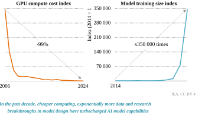Sources: IEA analysis based on data from EpochAI (2024), and Coyle and Hampton (2024). 

**Chapter 1** | The rise of AI and its nexus with energy 

**21** 

#### **_1.2.1 Surging expectations in financial markets_** 

Capitalising on the perceived potential of AI, technology companies have come to dominate the stock market – notably in the United States, which hosts some of the world’s largest technology companies. From November 2022 – when ChatGPT launched – to the end of 2024, 65% of the growth in market capitalisation of the S&P 500 came from companies that either deploy AI or integrate AI into their core operations. That is, of the USD 16 trillion rise in market capitalisation of S&P 500 companies, USD 12 trillion came from AI-related companies alone. This period was marked by a surge in AI-related investor expectations, before the recent volatility in financial markets. AI-focused start-ups in the United States have also grown in value faster than non-AI start-ups (Figure 1.2). In 2024, by the time startups reached their fourth round of funding, AI-focused start-ups had an average valuation five times higher than that of other start-ups. 

**Figure 1.2** ⊳ **Market capitalisation of S&P 500 companies, November 2022 and November 2024, and median valuations of United Statesbased start-ups, 2024** 

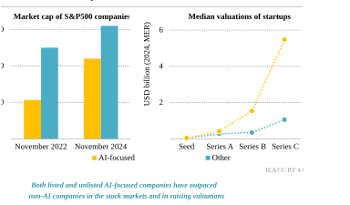Notes: MER = market exchange rate. AI-focused S&P 500 companies include technology companies that have key AI offerings or have integrated AI into their operations in a significant way. Valuations of start-ups are premoney, and rise with the stage of investment, from seed (initial funding, often to get the company operations started) to series A (first major round of funding that establishes a business model and helps the company scale), series B (second major funding round that helps companies scale further) and series C (usually for wellestablished companies looking to accelerate expansion). 

Sources: IEA analysis based on data from Bloomberg Terminal (n.d.) and Crunchbase (n.d.). 

These large public and private valuations have led to a surge in investment in AI-related infrastructure. Technology majors Alphabet, Amazon, Meta Platforms, and Microsoft were 

International Energy Agency | **Energy and AI** 

**22** 

1 

reported to be planning as much as USD 300 billion in AI-related capital expenditure in 2025. This is over 20% higher than the total power sector investment in the United States. Box 1.1 explores the interplay between AI-driven investment in data centres and its implications for the energy sector. 

###### **Box 1.1** ⊳ **Rising ICT investment: a longer-term perspective** 

Investment in capital- and energy-intensive data centres depends, among other factors, on expectations for future AI demand and future earnings from AI monetisation. For this reason, the energy sector has an important stake in the debate on the economic outlook for AI. Surging investment, high equity prices and lofty valuations for unlisted start-ups have raised concerns about whether AI could be a “bubble”. 

In recent years, information and communication technology (ICT) investment as a share of gross domestic product (GDP) in the United States has been at the highest it has been in three decades. The previous peak was in 2000, during the “dotcom bubble” (Figure 1.3). The recent uptick seen since 2015 has been led by a rise in investment in corporate software and in data centres and networks. 

**Figure 1.3** ⊳ **Investment in ICT-related assets and infrastructure as a share of GDP, United States, 1995-2023** 

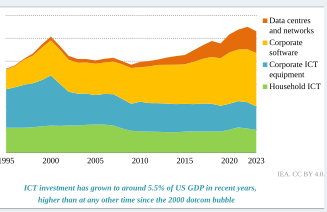Source: IEA analysis based on data from US Bureau of Economic Analysis (2024). 

Historically, several major technological innovations have been accompanied by large waves of capital investment. In some cases, exuberant investment temporarily ran ahead of demand, but the resulting infrastructure ultimately proved highly productive. The diffusion of transformative technologies can take time, requiring adaptation of enabling 

**Chapter 1** | The rise of AI and its nexus with energy 

**23** 

infrastructure, adjustment of business models or an upgrading of skills. For example, from Nikola Tesla’s invention of the alternating current electric motor in 1887, it took nearly 40 years for electricity to overtake steam power as the largest source of mechanical power in US factories (Divine, 1983). This was despite factory electrification doubling the rate of annual productivity improvement in US manufacturing. 

For the energy sector, lead times for assets and infrastructure are much longer than for data centres (see Chapter 2). To enable robust decision making and avoid stranded asset risk, the energy sector needs a clearer understanding of the outlook for AI-related electricity demand, while acknowledging unavoidable uncertainties. This includes the economics, uptake and service demand outlook for AI. 

#### **_1.2.2 How do households and businesses use AI?_** 

The application of AI is becoming pervasive in modern life and the economy. This has been enabled by growing access to high-speed Internet. Globally, there are over 90 mobile broadband subscriptions per 100 people, up from 75 subscriptions per 100 people five years ago. Half of the world’s population now lives in areas covered by a 5G mobile network. As a result, Internet traffic has been growing strongly. Total Internet traffic – both fixed and mobile broadband – has increased more than three times since 2019 (Figure 1.4). This growing digitalisation of the world economy provides the foundation for AI. 

**Figure 1.4** ⊳ **Global digital connectivity indicators and internet traffic, 2019-2024** 

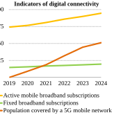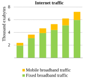IEA. CC BY 4.0. 

**_The growing digitalisation of the world economy provides the foundation for AI; since 2019, total Internet traffic has increased more than three times_** 

Source: IEA analysis based on data from ITU (n.d.). 

International Energy Agency | **Energy and AI** 

**24** 

1 

Since 2022 and the launch of ChatGPT, the breakthrough commercial product for generative AI, the use of generative AI, such as text- or image-based tools, has surged. Within two years of ChatGPT’s launch, around 40% of households in the United States and the United Kingdom were using such tools. ChatGPT had 400 million weekly active users globally in February 2025. Building on infrastructure availability, ownership of computing devices and familiarity with software, it was able to reach its first 1 million users within five days of launch, compared with 2-10 months for popular social media applications. AI tools are now being widely integrated into mainstream software applications, including email, chat and social media. 

AI uptake is already quite globalised. As a share of the online population, over 50% of survey respondents report using generative AI at least weekly in countries like Brazil, India, Indonesia, Kenya and Pakistan. Among people who are already online, the adoption rate of generative AI is _higher_ among lower-income countries. However, a significant share of the population in lower-income countries does not have regular access to the Internet (less than one in three in Kenya and Pakistan, for example), so overall adoption at the population level remains lower. The role of AI in emerging market and developing economies is explored further in Chapter 5. 

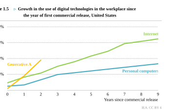**_There has been a rapid uptake of generative AI applications in the workplace, enabled by the widespread adoption of personal computers and the Internet in US workplaces_** 

Note: For personal computers, year zero is 1981, the year the first IBM Personal Computer was released; for the Internet, year zero is 1995, the year the Internet first carried commercial traffic; for generative AI, year zero is 2022. 

Sources: IEA analysis based on data from Bick et al. (2024). 

**Chapter 1** | The rise of AI and its nexus with energy 

**25** 

Firms are increasingly deploying AI for a variety of use cases, from data analysis and forecasting to process automation, text generation and analysis, and cybersecurity. Official surveys of AI use in firms highlight several interesting trends. First, AI adoption is increasing rapidly. There has been a rapid uptake of AI applications in the workplace, enabled by the widespread adoption of personal computers and the Internet (Figure 1.5). Among large firms in Organisation for Economic Co-operation and Development (OECD) countries, AI adoption rates increased from slightly over 15% in 2020 to nearly 40% in 2024 (Figure 1.6). Second, there is a significant gap in adoption rates between small and large firms, and this gap appears to be widening. In 2020, adoption rates were around 12 percentage points higher in large firms than in small firms; by 2024, this had widened to nearly 30 percentage points. Third, AI adoption rates are higher in firms based in higher-income countries. For firms based in countries with a GDP per capita above USD 60 000 at purchasing power parity, adoption rates are nearly 10 percentage points higher in small firms and nearly 20 percentage points higher in large firms compared to the OECD average. 

**Figure 1.6** ⊳ **AI adoption rates by firm size in OECD countries and AI adoption rates by firm size compared to GDP per capita of the firm’s home country** 

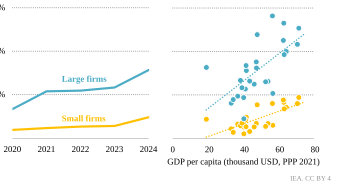**_AI adoption rates are increasing, but larger firms and firms in higher-income countries tend to use AI more than smaller firms and firms in lower-income countries_** 

Note: PPP = purchasing power parity. Sources: IEA analysis based on data from OECD (2024) and World Bank (2024). 

International Energy Agency | **Energy and AI** 

**26** 

1 

Official surveys unfortunately provide limited information on what AI is being used for in firms and what barriers inhibit further adoption. One exception is a digital trends survey in the European Union (Figure 1.7). The survey shows that AI use by application type is quite broad, with language and data analysis being the most popular applications, followed by process automation. In terms of business function, ICT security reports the highest rate of AI adoption, followed by applications in core production processes. AI use for robotics, research and development (R&D), and logistics is non-negligible but lags behind other categories (likely partly due to the structure of the sample of firms, which covers all sectors including the dominant service sector). Chapter 3 of this report covers AI applications in the energy sector, while Chapter 4 focuses on AI for energy innovation. 

**Figure 1.7** ⊳ **Percentage of large firms reporting using AI by application type and business function, European Union, 2024** 

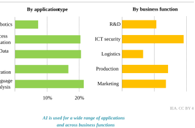Source: IEA analysis based on data from Eurostat (2025). 

The data also give a window into factors hindering the wider use of AI. The top constraint by some margin was missing expertise (the data presented here are for firms employing more than 250 people). Chapter 5 discusses the risk that skills gaps may hold back the broader adoption of AI in the energy sector. Privacy and legal concerns also rated highly as impediments (Figure 1.8). Chapter 3’s discussion of AI uptake in the energy sector highlights the potential need for adjustments in regulatory and policy regimes to facilitate the broader use of AI tools. The high cost of AI tools or their absence of utility to the firm did not rate highly as barriers to adoption. 

**Chapter 1** | The rise of AI and its nexus with energy 

**27** 

**Figure 1.8** ⊳ **Percentage of large firms reporting not using AI by reason, European Union, 2024** 

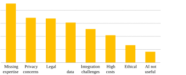IEA. CC BY 4.0. 

**_Missing expertise is the dominant reason that firms do not adopt AI today, followed by privacy and legal concerns_** 

Source: IEA analysis based on data from Eurostat (2025). 

### **1.3 What is AI?** 

There is no single and universally accepted definition of AI. The understanding of what it constitutes has evolved with the development of the technology. In simple terms, AI can be defined as the science of making machines that are capable of learning to perform tasks that are traditionally considered to require human intelligence. Today, AI differs from traditional computational techniques that solely rely on explicitly programmed instructions. AI, by contrast, focuses on learning from data to find patterns, make predictions and perform actions. AI systems improve over time through training. 

The development of AI over the years can be structured into three archetypes: 

 **Rules-based or symbolic AI:** This is one of the earliest approaches to AI, which refers to AI systems that use explicitly programmed rules and logic to process information, make decisions or solve problems. This approach was rooted in the belief that intelligence could be captured in formal rules and symbolic logic. While both traditional computing and symbolic AI rely on explicitly programmed rules, symbolic AI can handle more complex and less well-defined tasks. This form of AI dominated research in this field for several decades until the 1990s. Chess engines such as DeepBlue, which defeated chess world champion Gary Kasparov in 1997, are examples of rules-based AI. However, rulesbased systems proved difficult to scale, brittle in the face of unexpected or open-ended situations and highly labour intensive to develop. 

International Energy Agency | **Energy and AI** 

**28** 

1 

- **Machine learning and reinforcement learning:** Machine learning refers to algorithms that learn patterns and make decisions from data without being explicitly programmed to do so. Instead of relying on predefined rules as in rules-based AI, machine learning systems build statistical models to identify patterns, predict outcomes and improve their performance over time through experience. Reinforcement learning refers to machine learning systems that learn to achieve specific objectives through trial and error. 

- **Neural networks and deep learning:** A neural network is a computational model inspired by the way the human brain works. Neural networks – a type of model under the machine learning umbrella – consist of layers of interconnected nodes or “neurons” that receive and process information. The network receives information from an external stimulus (e.g. an image of the number nine), processes that information by passing it through the nodes in each layer of the neural network, and the final layer provides the calculated output (e.g. recognises that the numeral in the image is the number nine). Deep learning refers to neural networks that have multiple “hidden” computational layers between the input and output layers. One of the first practical applications of neural networks was a numeral recognition network deployed to read the numbers on bank cheques in the early 1990s. 

More powerful neural networks were held back by the high computational requirements of training and running them, the algorithmic challenges of training multilayered networks to learn from data and the lack of data for training. In the 2000s, breakthroughs in training algorithms, improvements in computing performance and the proliferation of data led to the take-off of neural networks as the dominant paradigm in AI. Today’s neural networks can be massive, with hundreds of billions of parameters trained on trillions of data points in training runs that can encompass more than a trillion trillion (1024 ) calculations. 

Today’s AI-based systems and applications such as AI chatbots are often built on a combination of techniques, and there is therefore no black-and-white distinction between the approaches described above. 

#### **_1.3.1 Types of AI_** 

AI can also be classified in terms of the kinds of tasks it can perform. Although, again, there are overlaps among these categories, today’s AI systems can be usefully classified under the following commonly used terms: 

**Predictive AI:** Predictive AI refers to the use of AI models to predict future outcomes. It has applications in scientific modelling, weather forecasting, predictive maintenance of energy infrastructure and finance. A recent application of predictive AI that has gained prominence is AlphaFold, which predicts the three-dimensional structures of proteins based on their twodimensional sequence of amino acids. Given that the three-dimensional structures of proteins determine their behaviour, predicting these structures can accelerate drug discovery (see Chapter 4). Another example of a predictive AI model is GraphCast, which combines the rules of classical physics with machine learning to develop faster, cheaper and more accurate weather forecasts. 

**Chapter 1** | The rise of AI and its nexus with energy 

**29** 

**Generative AI:** Generative AI refers to applications that focus on generating new content, such as text, images, audio and video. ChatGPT, referred to previously, is an example of a generative AI application, although there is a plethora of such applications in use today. Their popularity has brought into focus the energy needs of data centres used to train and run such models (see Chapter 2). While generative AI can be further categorised into numerous different variants, the following categories are worth noting: 

- **Language models** take text inputs and generate text outputs. 

- **Multimodal models** can also process inputs in one or more non-text forms, such as image, video or audio, and provide outputs in various forms (e.g. video generation). 

- **Large reasoning models** are variations of language models that use longer and more structured reasoning steps to provide more accurate answers. They perform particularly well on complex, multistep but well-structured problems like coding or mathematics. This practice of deploying longer reasoning chains to answer questions is known as “inference-time scaling” or “test-time scaling”. OpenAI’s o1 model and DeepSeek’s R1 model are examples of large reasoning models. 

**Computer vision:** Computer vision focuses on enabling machines to interpret and understand visual data, such as images and videos, in a way that mimics human vision. Computer vision leverages AI techniques, particularly deep learning and machine learning, to perform tasks like object detection, facial recognition, image classification and image interpretation. It is widely used in applications such as self-driving cars, medical imaging, security and augmented reality. 

**Physical AI:** Physical or embodied AI refers to systems that physically interact with the real world, such as autonomous cars, robots and drones. Whereas classical industrial robots are programmed to perform only one task in a highly controlled environment, the machine learning capacities of modern AI systems are expanding the capability of physical AI systems to learn from their environment and operate in more open-ended and uncertain situations. In the energy sector, applications of physical AI include autonomous cars, automated drones to inspect energy infrastructure for faults and highly automated (self-driving) laboratories to test new energy technologies such as battery chemistries (see Chapter 4). 

**Agentic AI:** Agentic AI is a broad term encompassing autonomous “agents” designed to execute specific tasks, particularly in virtual environments. It helps to automate workflows and business processes. For example, the virtual voice assistants that are commonly seen on mobile devices are instances of agentic AI. In the energy sector, examples of agentic AI include systems that use AI to dynamically control energy consumption in buildings or the charging of electric vehicles. 

#### **_1.3.2 The AI supply chain_** 

The supply chain that ultimately leads to the application and deployment of AI is highly complex, geographically concentrated and yet very international. It involves several 

International Energy Agency | **Energy and AI** 

**30** 

1 

components, including massive data centres that can consume as much electricity as a small town; critical and rare earth minerals required for the components found in these data centres; individual chips that can have tens or even hundreds of billions of transistors (or switches); and complex lithography machines costing hundreds of millions of dollars that etch microscopic patterns at atomic scales onto silicon chips, which in turn are made out of high-purity sand. 

As companies across sectors globally are beginning to deploy AI in their systems, it is worthwhile exploring the processes that enable the use of AI in the first place. Large-scale AI models trained on vast datasets are being developed by companies such as OpenAI, Meta, Google (Alphabet), MistralAI, NVIDIA and Baidu. While some of these companies are based in Europe and Asia, AI-focused technology companies based in the United States hold a dominant position in the market. 

The training for these models involves the use of massive datasets, substantial computing power, specialised hardware and dedicated systems. AI model training and use can take place on-device, such as on laptops and smartphones or in smart cars (known as “at the edge”), or remotely in data centres. Larger AI models are too complex to be trained or run on laptops and mobile phones and are therefore processed in data centres. These data centres consist of servers (which integrate the computing chips), memory drives, highbandwidth networks (moving huge amounts of data between chips and memory or between servers), cooling systems keeping the servers at optimal temperature and backup power systems to ensure reliability (see Chapter 2). A large share of these specialised data centres are based in the United States, with hubs in Northern Virginia, Texas and California, but many are also located in hubs such as Shanghai in China, or Paris, Dublin, London and Frankfurt in Europe. 

The fundamental physical building blocks of AI infrastructure are computer chips. Traditional computing in laptops and desktops is dominated by central processing units (CPUs). AIrelated computing has been built around graphics processing units (GPUs) and other specialised chips, such as tensor processing units (TPUs). GPUs, which currently dominate AIrelated computations, are designed for extremely rapid parallel processing, which results in much faster and more energy-efficient processing for AI training and deployment. Most GPU manufacturers offer specialised models with significantly increased performance for AI training. Dominant players that design these chips include NVIDIA, Broadcom, AMD and Intel. The market leaders among chip designers are also largely based in the United States. These chips, once designed, are manufactured either by the integrated device manufacturers that both design and manufacture them, such as Intel, or foundries that specialise in manufacturing them, such as TSMC and Samsung Foundry. Most chips used in AI-focused data centres are manufactured in foundries based in Chinese Taipei and Korea. TSMC currently holds a dominant position in the market, with a commanding 65% share of foundry revenue in 2024. 

**Chapter 1** | The rise of AI and its nexus with energy 

**31** 

**Figure 1.9** ⊳ **Select AI infrastructure and types of applications** 

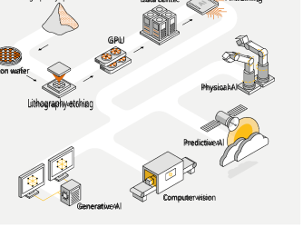IEA. CC BY 4.0. 

**_AI is supported by a highly complex global supply chain_** 

These AI-focused chips, in turn, are manufactured using highly complex machines. Advanced extreme ultraviolet lithography machines, such as those produced by ASML, are crucial for creating the intricate circuit patterns on AI-focused chips. This process involves using light to etch switches onto silicon wafers. ASML, headquartered in the Netherlands, is the market leader in manufacturing these machines. The optical systems – which are among the most critical of the core components of ASML’s lithography machines – are, in turn, manufactured by the German company Carl Zeiss. These are only a few of the key components that enable AI. The supply chains of various other parts of the puzzle, such as silicon wafers and data centre cooling systems, are also highly international. AI is therefore a global enterprise, even as parts of it are heavily concentrated in certain regions. 

#### **_1.3.3 Types of AI infrastructure_** 

Conventional data centres house general-purpose servers that support a wide range of applications, from cloud computing and web hosting to financial transactions. These facilities typically prioritise reliability, energy efficiency and low latency (i.e. the time delay between input and output). Because of the premium placed on low latency in traditional data centre 

International Energy Agency | **Energy and AI** 

**32** 

1 

services, such as video streaming and web hosting, data centres tended to cluster close to final demand and population centres. This also tended to limit their size. 

**Table 1.1** ⊳ **Characteristics of selected types of computing infrastructure** 

||**Traditional** **supercomputer**|**AI training cluster**|**AI inference cluster**|**Cloud computing and** **web content servers**|
|---|---|---|---|---|
|**Primary** **purpose**|Scientific discovery, national security|AI model training|AI model deployment and use| Hosting and delivering web media|
|**Example** **use cases**|Climate modelling, nuclear simulations, oil and gas exploration, molecular modelling|Large language model training| AI chatbots and generative AI applications|Video streaming|
|**Computing** **architecture**|CPU-centric, extremely high parallelism, high- performance interconnect|GPU-centric, extremely high parallelism, high- performance interconnect|Heterogeneous (mix of CPU/GPU/TPU/ ASIC), moderate latency|CPU-centric, distributed caching, load balancing, edge computing|
|**Optimisation** **objective**|Maximise sustained computing across a highly parallel system|Maximise aggregate computing and data throughput across a massively parallel system|Maximise throughput and efficiency; latency tolerance depends on the application but is generally higher| Minimise latency, maximise uptime, ensure scalability|
|**Datasets**|Large, often structured datasets (e.g. experimental data, climate models)|Massive, often unstructured datasets (e.g. text or image corpora)|High volume of individual requests (e.g. search queries and individual recommendations)|Large-scale structured/ unstructured data (e.g. user content, media assets, web pages)|
|**Performance** **metrics**|FLOPS, sustained performance|Single- and half- precision FLOPS|Queries per second, latency, performance per watt|Requests per second, uptime, bandwidth utilisation, response time|
|**Resource** **requirements**| High capital expenditure, specialised facilities, skilled workforce|Extremely high capital expenditure, specialised facilities, skilled workforce|Moderate to high capital expenditure, depending on scale|Scalable cloud infrastructure, distributed data centres, moderate to high capital expenditure|
|**Example** **systems**|Frontier (ORNL), Fugaku (RIKEN), Leonardo (CINECA)|NVIDIA DGX SuperPOD, xAI Colossus|Amazon Inferentia|Amazon CloudFront Web Servers|

Note: ASIC = application-specific integrated circuit; CPU = central processing unit; FLOPS = floating-point operations per second; GPU = graphics processing unit; TPU = tensor processing unit. 

As AI workloads have grown more complex, specialised computing infrastructure has emerged to handle the unique demands of training and deploying AI models. AI training clusters are optimised for deep learning to process massive datasets in parallel and maintain high fault tolerance. AI training is less latency-sensitive than traditional data centre workloads, leading to the development of data centres outside existing clusters. Once 

**Chapter 1** | The rise of AI and its nexus with energy 

**33** 

models are trained, they are deployed for real-world use. Different kinds of AI use cases have different latency tolerances. For example, in autonomous vehicles, the latency tolerance is close to zero because of the need for instantaneous decision making and, thus, models are typically run on hardware in the car itself. Conversely, queries to a generative AI model like ChatGPT have higher latency tolerance, allowing the data centres processing these queries to be more distributed. 

Table 1.1 provides an overview of four types of computing infrastructure, namely traditional high-performance supercomputers for scientific applications, AI training clusters, AI inference clusters, and cloud computing and web content servers. In addition, there are other categories of computing infrastructure that we do not explore further, such as telecommunications and 5G core network nodes, and units dedicated to processing blockchain and cryptography. 

**_1.3.4 How capable is AI and can we measure it?_** 

AI capabilities have been evolving rapidly. AI models and applications have been steadily adding new capabilities, giving users access to tools that approach or even exceed humanlevel capabilities on some tasks and in some contexts. Ultimately, energy demand from AI will depend on, among other factors, the speed and scale of uptake, which in turn depends on AI’s usefulness and impact. The energy sector therefore needs to grapple with the capabilities of AI systems as it considers the outlook for AI adoption. This section presents a brief synthesis while acknowledging that the field is moving very fast. 

It is critical to note that significant caution must be applied when comparing human capabilities with those of AI. In its current state, AI is trained and optimised to do specific tasks, while human intelligence is adaptive, flexible and generalised across domains. AI focuses on pattern recognition and can only mimic thought and reasoning. There are also several challenges in defining benchmarks to test even restricted cognitive skills. For these reasons, any comparison between AI and humans should focus on the skills and outcomes related to specific tasks and take into account the difficulty of designing effective test benchmarks. 

AI systems were first able to approach and then exceed human capabilities in domainspecific, highly data-intensive fields with clear rules and goals. The archetypal example of such a domain is games that involve strategy. One example is the game of Go, which is far more complex than chess – too complex for the approach taken by traditional chess engines based on “brute force” calculation and pre-programmed game rules. Modern AI capabilities were fully on display in 2016 when AlphaGo beat the Go world champion. This was a significant moment in the development of AI as it demonstrated the ability of mainstream AI techniques (reinforcement learning and neural networks) to exceed human capabilities in a game that involved intuition and strategy. The highest-rated Go player has a rating of 3 890, while AI model AlphaGo Zero has reached a rating of 5 185. These abilities to model vast but structured solution spaces extend to scientific domains, such as modelling the complex properties of materials or molecules. 

International Energy Agency | **Energy and AI** 

**34** 

###### **Figure 1.10** ⊳ **AI performance in selected archetypal benchmarks, 2024** 

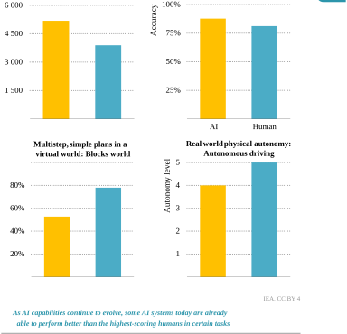Notes: Go = the game of Go; Elo rating = a ranking system for players in games like chess and Go; GPQA = the Graduate-Level Google-Proof Q&A Benchmark, consisting of highly challenging multiple-choice questions in biology, physics and chemistry; Blocks world = a benchmark involving simple planning challenges in a simulated physical environment. For the Blocks world AI score, we have chosen to give the score for Mystery blocks world. For autonomous driving, level 4 = full autonomy in a limited set of contexts, level 5 = full autonomy in all contexts. 

Sources: IEA analysis based on data from EpochAI (2025a), Silver, et al. (2018), Valmeekam et al. (2023, 2024). 

In recent years, frontier AI systems have begun to approach or exceed human-level capabilities on tasks related to knowledge classification, summarisation and retrieval. For these tasks, their huge knowledge bases result in high performance (i.e. close to or above expert human level) across multiple academic disciplines. For example, the best AI systems 

**Chapter 1** | The rise of AI and its nexus with energy 

**35** 

match human PhD level on the Graduate-Level Google-Proof Q&A (GPQA) benchmark, which consists of highly challenging multiple-choice questions in biology, physics and chemistry. 

AI systems are also rapidly making progress on tasks related to reasoning and planning in well-characterised domains with clear goals and well-structured processes, such as coding and mathematics. Some of the leading AI systems have begun to approach expert humanlevel abilities in these areas. However, in tasks related to reasoning and planning in more open-ended, multistep domains, current AI systems still fall short of human capabilities and struggle to generalise when subjected to unexpected problems and more complex cognitive environments (e.g. simulated work or social environments or multistep novel plans). 

Tasks requiring meta-cognition (i.e. thinking about thinking), the generalisation of logic to novel situations and social intelligence are complex challenges, and AI models currently fall short of human capabilities. While some models are making progress, AI systems are largely not able to verify the correctness of their outputs or recognise when they are wrong or a problem is unsolvable, resulting in so-called “hallucinations” even when performing relatively simple tasks. They have trouble tracking and predicting the consequences of causal effects across multiple steps or in more complicated open-ended situations. 

Another area where AI systems currently fall short of human capabilities, but have been making steady progress, is interacting with the physical world. This includes understanding, predicting and acting in physical causal chains, particularly in novel situations. For example, at present, fully autonomous vehicles are only being commercially deployed in certain cities that have been minutely mapped in advance of deployment, as in this way, they can meet certain thresholds on safety. Today’s autonomous taxis achieve an autonomy level of 4 after learning across 20 million real-world miles, while human drivers are quickly able to achieve an autonomy level of 5 after around 70 hours of practice.1 Progress, however, is being made, with autonomous systems in vehicles and robots being able to increasingly navigate complex and unfamiliar terrains in demonstration projects. Part of the challenge holding back physical AI relates as much to hardware as software, as robot “muscles” (i.e. motors) and sensors still lack the precision and flexibility of human motor and sensory functions. 

Various AI benchmarks and standardised tests have attempted to gauge the accuracy, efficiency, speed of response and other capabilities of various models, and how they have evolved over time. They have focused on language understanding and reasoning, the ability to classify images, processing and comprehension of conversational speech, code generation capabilities and even advanced reasoning capabilities at the frontiers of human expertise. AI benchmarks, however, have limitations that necessitate a cautious approach to assessing their implications. First, the AI models might have been trained and optimised to perform well on such tests, or the benchmarks could form part of their training data (so-called data leakage). Second, benchmarks tend to focus on testing capabilities in specific tasks rather than holistic intelligence, creativity and adaptability in complex, open-ended, real-world settings. There are also several other constraints around safety, bias and ethical blind spots. 

> 1 For autonomous driving, level 4 = full autonomy in a limited set of contexts, level 5 = full autonomy in all contexts. 

International Energy Agency | **Energy and AI** 

**36** 

1 

Ultimately, while AI capabilities seek to mimic human abilities, benchmark tests do not yet help us comprehensively measure how AI models might perform vis-à-vis a human. Yet, for all their limitations, benchmarks offer a window into the evolving capabilities of AI models that can complement data on real-world deployment. 

**Figure 1.11** ⊳ **Accuracy of AI models in selected benchmarks, 2018-2024** 

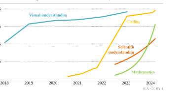**_While AI benchmarks have several limitations and must be carefully interpreted, AI models have been showing improved performance on key benchmark tests over time_** 

Notes: The y-axis refers to the accuracy of models in the benchmark test under consideration. It does not compare the ability of a model vis-à-vis a human. The benchmark test measuring coding ability is HumanEval (Code Generation). The benchmark test measuring scientific understanding is the Graduate-Level GoogleProof Q&A Benchmark (GPQA). The benchmark test measuring mathematics is the Mathematics Assessment of Textual Heuristics (MATH) Level 5. The benchmark test measuring visual understanding is Visual Commonsense Reasoning (VCR). 

Sources: IEA analysis based on data from EpochAI (2025a), Papers With Code (2025), and Stanford University (2024). 

### **1.4 Energy for AI and AI for energy** 

In the energy sector, AI has numerous applications that can improve efficiency, reduce costs and drive innovation. Examples include faster, cheaper and more accurate weather forecasting for predicting the output of wind and solar photovoltaic plants, real-time monitoring and optimisation of transmission lines and the use of AI to discover new battery chemistries. Chapters 3 and 4 of this report explore extensively the application of AI for the optimisation of today’s energy system and innovation in novel energy technologies. 

At the same time, AI is also energy intensive. Globally, data centres consumed around 1.5% of electricity consumption in 2024. AI is only one of a range of workloads that data centres perform, but in anticipation of growing demand for AI-related services, investment in data 

**Chapter 1** | The rise of AI and its nexus with energy 

**37** 

centres is growing rapidly (see Chapter 5) and the size of the largest data centres is increasing. In terms of power draw, a conventional data centre may be around 10-25 megawatts (MW) in size. A hyperscale, AI-focused data centre can have a capacity of 100 MW or more, consuming as much electricity annually as 100 000 households. AI-focused data centres are increasing in size to accommodate larger and larger models and growing demand for AI services. Historically, data centres have been highly concentrated in spatial terms, posing significant challenges to local grids given their substantial power draw. 

###### **Figure 1.12** ⊳ **Data centre annual electricity consumption in household electricity consumption equivalents and the spatial concentration of various facilities versus proximity to urban areas** 

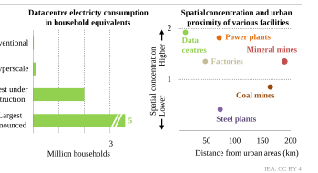**_Data centres tend to be geographically concentrated and located around cities; a 100 MW data centre can consume as much electricity as 100 000 households_** 

Notes: km = kilometre. The conventional data centre capacity considered is 25 MW. The hyperscale data centre capacity considered is 100 MW. The largest under-construction data centre capacity considered is around 2 000 MW. The largest planned data centre capacity considered is 5 000 MW. The spatial concentration is calculated as the inverse of the linearised Nearest Neighbour Index, which is a mathematical representation of how clustered or dispersed each category is, calculated via the ratio of the observed mean distance to the expected mean distance. 

As a result, in regions where data centres are concentrated, the share of electricity demand going to data centres is disproportionately high (Figure 1.12). In Ireland, for example, data centres consume around 20% of the metered electricity supply. There are 6 states in the United States where data centres already consume over 10% of the electricity supply, with Virginia leading at 25%. Data centres serve multiple types of workloads but expected demand growth from AI is driving rapid investment. The following section details the energy consumption pattern of AI models across their life cycle. 

International Energy Agency | **Energy and AI** 

**38** 

1 

**Figure 1.13** ⊳ **Global map of large data centre clusters, 2024** 

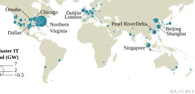Notes: GW = gigawatt. We define a data centre cluster as a group of data centres located within 100 km of each other. The ten largest clusters have been named. The Pearl River Delta encompasses the combined capacity of Guangzhou, Shenzhen and Hong Kong (China). 

Source: IEA analysis based on data from OMDIA (2025). 

#### **_1.4.1 AI model life cycle and energy consumption_** 

##### _Hardware manufacturing_ 

The manufacturing of hardware for AI is energy intensive but along the life cycle accounts for less energy than the operation phase. The most energy-intensive part is the manufacturing of chips used in GPUs but also in server storage. For example, manufacturing the latest state-of-the-art 3 nanometre (nm) chip requires around 2.3 megawatt hours (MWh) per wafer (Garcia Bardon, et al., 2021). For a typical high-performance server configuration, this amounts to more than 10 MWh for manufacturing compared with more than 80 MWh for operation in a five-year lifetime (Figure 1.14). Of the energy needed for manufacturing, 60% is estimated to be for wafer and semiconductor production, where deposition, lithography and etching consume the majority. The remaining 40% is used for auxiliary processes such as water preparation or cooling in the facility. 

The energy required for manufacturing also depends on the computing power of the product. In particular, the higher complexity of metal layers in the latest generation of chips increases manufacturing electricity demand despite overall efficiency gains in the manufacturing process. Conversely, continued improvement in the computing power of chips increases the number of operations being executed by single units so that the embodied energy per operation decreases (Schneider, et al., 2025). 

**Chapter 1** | The rise of AI and its nexus with energy 

**39** 

**Figure 1.14** ⊳ **Electricity intensity of wafer production by process step and node type and server electricity demand** 

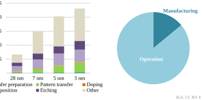**_New, more complex chip types require more energy, especially for lithography and deposition, but manufacturing amounts to less than 20% of the total life-cycle demand_** 

Notes: nm = nanometre. “Other” includes auxiliary processes, e.g. for cooling and water preparation in the factory. “Operation” considers a server lifetime of five years. 

Sources: IEA analysis based on Garcia Bardon, et al. (2021), Boavizta (2021), and Dell (2019). 

The production of chips is highly concentrated geographically. More than 70% is located in East Asia (BCG and SIA, 2021). Globally, the semiconductor industry is currently estimated to consume more than 100 terawatt hours (TWh) of electricity per year (Greenpeace, 2023), equivalent to around 1% of global industrial electricity demand. However, the impact is much higher in certain geographies: for example, TSMC consumed more than 20 TWh in 2023, which accounted for almost 10% of electricity consumption in Chinese Taipei. Most semiconductors are used for other purposes, but data centres and especially AI are expected to be the key drivers of semiconductor demand in the years to come. 

Indirect emissions from the consumption of electricity are the most significant component of emissions from hardware manufacturing. The high share of coal-fired electricity generation in many important manufacturing countries leads to a high emissions footprint for indirect emissions. Minor use of fossil fuels, usually around 5%, and process gases are the main sources of direct emissions. 

The construction of data centres and transport of intermediate materials in the supply chain have a minor impact on the hardware footprint. The data centre construction, including the materials required, accounts for less than 2% of life-cycle emissions. 

International Energy Agency | **Energy and AI** 

**40** 

1 

##### _Model training_ 

Model training refers to the process of the model learning from data to identify relationships and patterns. Given a set of inputs, the model learns to generate an output, prediction or action that aligns with the patterns identified in the training data and with the model’s overarching objectives. In the last few years, the amount of data and calculations required to train state-of-the-art AI models has grown exponentially. For example, estimates put the training data for GPT-4 at around 4.9 trillion data points, and the training compute at around 22 trillion trillion calculations (that is, 2.2e25). 

Training is a time-consuming and energy-intensive process. Training calculations are performed on specialised computer chips such as GPUs. A single GPU can have a maximum rated power consumption of 1 000 watts in the case of the latest and most powerful chip. This is about as much as the power draw of a toaster. Large, state-of-the-art models are trained on clusters of many GPUs. For example, GPT-4 was trained on 25 000 GPUs with a combined rated power of around 10 MW (EpochAI, 2024). Additional power demand comes from information technology (IT) equipment operating alongside the GPUs in the servers used to train these models, such as CPUs, memory, networking equipment and switches.2 Adding the power demand of additional IT equipment and the cooling equipment gives a total rated power of the equipment used to train GPT-4 of around 22 MW. This is equivalent to the power draw of around 150 high-power electric vehicle charging stations. 

It is estimated that GPT-4 was trained for around 14 weeks. Taking a load factor of 84% (Shehabi, et al., 2024), this results in a training energy demand of around 42.4 gigawatt hours (GWh), or around 0.43 GWh per day of training. This is equivalent to the daily electricity consumption of around 28 500 households in advanced economies, or 70 500 households in emerging market and developing economies. After training, models may undergo a process of fine tuning, which is much less computationally intensive than training and therefore less energy intensive as well. 

Energy consumption for training varies substantially depending on the model size and complexity and the hardware configuration. Comprehensive training data are not available for all significant AI models. However, we have made an estimate of the energy consumption of all large AI models developed since 2020 (Figure 1.15), using the following methodology: 

- We took the dataset of 283 large AI models maintained by EpochAI (EpochAI, 2025b).3 Given that training energy consumption scales with the computational intensity of training, an estimate based only on large AI models is likely to cover the bulk of training energy consumption. 

> 2 In the documentation to its dataset, EpochAI explains its methodology for calculating the total power draw from model training. It multiplies the GPU power draw by 2.03 to account for non-GPU server hardware (networking, switches and CPUs), based on the specifications of NVIDIA DGX H100 servers, and by a further 

> 1.09 to account for non-IT load. See: https://epoch.ai/data/notable-ai-models-documentation#estimatingpower-draw 

> 3 Large AI models are defined as those with a training compute of 1023 FLOP. The number of models in the database is as of 24 March 2025. 

**Chapter 1** | The rise of AI and its nexus with energy 

**41** 

- For models with data on maximum training power draw and estimated training duration, we computed the total training electricity consumption by multiplying these values by a load factor of 84% (Shehabi, et al., 2024). Calculated this way, the largest AI model in this dataset had a maximum training power draw of around 154 MW4 and a training electricity consumption of around 310 GWh. 

- We then used this data to fit a statistical relationship between training compute intensity and training electricity intensity. We used this relationship to model the electricity consumption of models in the EpochAI dataset for which compute intensity estimates are available. 

- Finally, we were left with the models in the EpochAI dataset for which neither compute intensity nor maximum training power draw and training duration data were available. For these models, we extrapolated the training electricity consumption by assuming that these models have the average electricity consumption of all models estimated and modelled under the preceding two steps. 

In the absence of better data, this gives us at least an order of magnitude for the total training electricity consumption of the large frontier AI models in the EpochAI dataset, which comes to around 1 700 GWh (1.7 TWh). This is equivalent to around 0.001% of global electricity consumption during this period from all sources, or 0.1% of the global electricity consumption of data centres during these years. 

**Figure 1.15** ⊳ **Estimated training-related maximum power draw, electricity consumption and cumulative electricity consumption for a set of large AI models since 2020** 

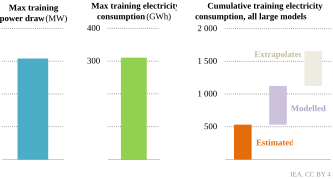**_Training the largest AI model today requires a power draw of around 154 MW; cumulative training consumption for large AI models collectively is estimated at around 1 700 GWh_** 

> 4 In practice, servers never hit their maximum designed power. 

International Energy Agency | **Energy and AI** 

**42** 

1 

##### _Model use_ 

After training and fine tuning, the model is deployed. Each time a user queries the model – such as asking a question of ChatGPT – the model solves an enormous number of calculations to develop its answer. These calculations are performed on similar high-specification GPUaccelerated servers as are used during the training phase. How much electricity is used during the query (or “inference”) phase depends on numerous factors: 

- **Input query size and output answer length:** longer input queries and output answers require more compute and therefore consume more electricity. 

- **Model size:** larger models require more compute to process inputs and outputs, and are therefore more electricity intensive, all other things being equal. 

- **Input and output mode:** video and image generation are generally much more compute intensive, and therefore electricity intensive, than text generation (Figure 1.16). 

- **Implementation of algorithmic efficiencies:** different strategies are being deployed to reduce the computational intensity of inference, for example by using mixture of experts (MoE) models. At inference time, MoE models selectively activate only the parts of the model most pertinent to solving the query in question, thereby saving on computation and hence energy costs while preserving model performance. 

- **Degree of inference-time scaling:** recently released models, such as OpenAI’s o1 model or DeepSeek’s R1 model, use what is known as inference-time scaling or inference scaling to improve performance, notably on tasks involving reasoning or planning. In intuitive terms, this involves the model “thinking” more intensively about its answer before responding. Inference scaling can dramatically increase the computational and energy cost of inference. 

- **Hardware implementation:** the specialised hardware used to run AI models has seen consistent improvements in energy efficiency with each generation. For example, the current state-of-the-art B200 GPU is 60% more energy efficient in terms of FLOP/watt than the previous generation’s H100, which is in turn 80% more efficient than the previous A100 generation (EpochAI, 2025c). Specific hardware implementation can substantially influence energy intensity. 

The energy consumption of different kinds of devices, machines or processes often depends on context. For example, factors such as tyre pressure, road surface, temperature, wind speed, driving speed and style, and air conditioning or heating use can have a large impact on the fuel economy of cars. Real-world measurements suggest that the fuel consumption and carbon dioxide emissions of internal combustion engine vehicles are around 20% higher than Worldwide Harmonised Light Vehicles Test Procedure values, and around 3.5 times higher for plug-in electric hybrid vehicles, largely because drivers do not charge and drive in full-electric mode frequently (European Commission, 2024). 

Similar caveats hold for estimates of the energy intensity of AI models, which are influenced by numerous factors, including model and task type, hardware set-up, and operational optimisations such as batch sizes, key-value cache management and attention 

**Chapter 1** | The rise of AI and its nexus with energy 

**43** 

management.5 There is also a lack of transparency regarding the size and implementation of most user-facing commercial AI models, which makes it impossible to measure their compute requirements and ensuing energy demands. This lack of data makes it hard to estimate energy consumption for the field of AI as a whole and for users and companies to make informed choices when it comes to energy efficiency. Nonetheless, it is beneficial for policy makers and consumers of AI models to have some benchmarks to understand the electricity intensity of different kinds of models and tasks. 

###### **Box 1.2** ⊳ **Did DeepSeek change the outlook for AI electricity demand?** 

Chinese company DeepSeek released its large reasoning model, DeepSeek-R1, on 20 January 2025. Markets took some time to digest the news, but one week later both AI-related technology and energy stocks had fallen substantially. Key AI chip designer companies were down 20% a week later, while the leading chip manufacturing equipment provider was down 6%. Meanwhile, the stocks of key energy companies fell by around 20% in the same period as a result of the uncertainty triggered by DeepSeek. Many actors in the market asked whether the apparent efficiencies achieved by DeepSeek changed the outlook for AI-related electricity demand. 

DeepSeek uses a sophisticated MoE approach (see above), which reduces the activated model size by 95% while preserving performance. This is equivalent to the model having a large knowledge base but efficiently accessing only a small part of it to answer a given question. It also uses an innovative approach to process much more efficiently the contextual relationships between the different elements of the input question, focusing only on the most important words of the question and paying less attention to the rest.6 Finally, DeepSeek calculates output words in parallel, not sequentially.7 Given the input “the cat sat”, DeepSeek would calculate the output, “on the mat”, as a single computational step, rather than “on”, “the”, “mat” sequentially. 

These innovations drive down the computational, financial and energy cost of training and use. However, several countervailing factors also need to be considered. First, lower costs may incentivise greater use. Second, despite the computational efficiencies achieved, reasoning models such DeepSeek-R1 and OpenAI’s o1 model are substantially more energy intensive than other large language models. This is because reasoning models “think” more intensively while developing their answers (known as “inferencetime scaling”). While this can result in better answers on reasoning or planning problems, it is far more energy intensive than traditional large language models and extremely inefficient for knowledge retrieval or summarisation problems. 

> 5 Batching refers to maximising the parallel processing power of GPUs by grouping tasks and running them together rather than sequentially; it is analogous to running a dishwasher fully loaded. Key-value cache management refers to techniques that optimise the efficient use of GPU memory, because reading and writing data into memory is energy intensive. Attention management techniques include flash attention, which breaks input data into separate, more efficient chunks for processing. 

> 6 This approach is called multi-head latent attention (MLA). 

> 7 This is known as multi-token prediction (MTP). 

International Energy Agency | **Energy and AI** 

**44** 

1 

This discussion highlights three themes that run through this report. First, substantial progress has been made in making models more efficient, and this is certain to continue: efficiency is both a software and a hardware issue. Second, cheaper, more efficient models are likely not only to incentivise greater use but also more compute use to improve performance, i.e. the rebound effect. Third, incentivising the efficient use of models (i.e. the right model for the right task) will have a large impact on the energy pathway of AI. This is likely to depend on the price and information environment that users face, on the business models developed to amortise model training and deployment, and on the regulatory and policy environment. 

We therefore conducted an assessment of the energy intensity of different open-source models across a variety of generative AI tasks.8 Initially, we present the results for isolated tests taking into account only the GPU energy costs, as the GPU is the most energy-intense part of the computation. Tests were performed on H100 GPUs. The results presented in Figure 1.16 and Figure 1.17 should be seen as highly controlled experimental results – realworld implementations are likely to differ. Further down in Figure 1.18, we present the effects of operational optimisations that are implemented in the real world, such as batching. 

**Figure 1.16** ⊳ **Indicative inference electricity consumption for selected generative AI tasks in experimental conditions and the electricity consumption of charging consumer electronics** 

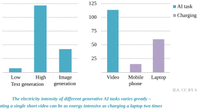Notes: Text generation, low = Yi-1.5 9B model with 9 billion parameters. Text generation, high = Llama 3.3 with 70 billion parameters. Image generation = SD-XL 1.0-base model. Video generation = CogVideoX-5b. For video generation, the videos are 6 seconds long and 8 frames per second. Only the GPU electricity consumption is shown in the figure as this is the metric for which the measurement is the most reliable. 

> 8 We are thankful to Dr Sasha Luccioni for her collaboration on this analysis. All errors, omissions and conclusions drawn from this analysis are those of the IEA alone. 

**Chapter 1** | The rise of AI and its nexus with energy 

**45** 

Figure 1.16 shows the GPU energy consumption of different model tasks under test conditions. Text generation using a small language model takes around 0.3 Wh. Using a medium-sized language model consumes around 5 Wh. Image generation takes around 1.7 Wh per task. Video generation, however, is two orders of magnitude more energy intensive, taking around 115 Wh to generate a short, relatively low-quality video (6 seconds in length, at 8 frames per second). To put these numbers into perspective, charging a mobile phone or laptop requires around 15 Wh and 60 Wh, respectively. 

**Figure 1.17** ⊳ **Indicative inference electricity consumption across different model types for text generation tasks in experimental conditions** 

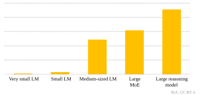Notes: LM = language model; MoE = mixture of experts. Very small LM = SmolLM2-1.7B-Instruct. Small LM = Yi-1.5. Medium-sized LM = Llama 3.3 with 70 billion parameters. Large MOE = Mixtral-8x 22B. Large reasoning model = DeepSeek-R1. Only the GPU electricity consumption is shown in this graph as this is the metric for which measurement is the most reliable. The large reasoning model electricity consumption was estimated based on the relationship in electricity consumption observed between DeepSeek and a language model of the same size for a specific sample of prompts (O'Donnell, 2025). 

However, it is also important to note that AI models come in many different sizes and setups. Larger models tend to perform better in terms of accuracy and quality. However, they also consume much more energy. To explore the importance of model size and set-up for energy consumption, we performed the same text generation task on several different language models. The very small language model tested had 1.7 billion parameters and consumed 0.1 Wh for the task. The medium-sized language model tested had around 40 times more parameters and used more than 40 times more electricity to perform the task (around 4 Wh). The MoE model tested had two-and-a-half times more parameters than the medium-sized language model but consumed only around 45% more electricity on the task. We also estimated a large reasoning model (DeepSeek-R1, see Box 1.2). As noted above, reasoning models “think” more when developing their responses, using inference-time scaling to give better answers on reasoning-intensive problems like maths and coding. 

International Energy Agency | **Energy and AI** 

**46** 

1 

However, using a reasoning model on a simple text generation task uses twice as much electricity as a model of a comparable size (Figure 1.17). While these tests isolate the issue of model performance, they clearly highlight that model design and choice have large impacts on electricity intensity. 

In the real world, inferences are often processed through batching. This means grouping different independent inputs together and processing them in parallel. By handling multiple inputs simultaneously, batching allows for more efficient utilisation of GPU computing capabilities that would otherwise be underutilised, thereby increasing per-token energy consumption. 

**Figure 1.18** ⊳ **Impact of batching on electricity consumption per task for inference across various generative AI models** 

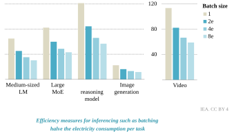Notes: LM = language model; MoE = mixture of experts; e = estimated. Only the GPU electricity consumption is shown in this graph as this is the metric for which measurement is the most reliable. Efficiency gains are estimated based on the relationship observed between batch size, number of parameters of the model and normalised GPU electricity consumption per token (Argerich and Patiño-Martinez, 2024). 

Figure 1.18 shows estimates of the efficiency gains achievable through batching. It is worth mentioning that such gains have diminishing returns with increasing batch size. Batching is also constrained by the memory capacity of the hardware, making large batch sizes impractical for very large models or for hardware with a smaller memory size. 

**Chapter 1** | The rise of AI and its nexus with energy 

**47** 

**Box 1.3** ⊳ **A bag of heuristics to go from tasks to TWh** 

Humans use heuristics (rules-of-thumb) as important tools in our reasoning processes. There is some evidence that AI models do too. Heuristics can be useful, but care needs to be taken to ensure that they are not overly simplified and are applied in the right situation. Here we use heuristics to understand the relationship between electricity demand from data centres and their potential output. 

Looking ahead, electricity demand from data centres, driven in particular by AI, is projected to grow by several hundred TWh (see Chapter 2). This box tries to answer the question: how much inference demand for generative AI would it take to consume 100 TWh of electricity? For reference, in 2023, the largest four hyperscalers (Google, Amazon, Meta and Microsoft) had a combined data centre electricity consumption in the order of 90 TWh. 

- A large language model, with optimised implementation, could generate more than 4 250 trillion words of output with 100 TWh of input. For comparison, this is equivalent to around 110 million copies of the Encyclopaedia Britannica. 

- An image generation model could generate around 55 trillion images with around 100 TWh of input. 

- A video generation model could generate in the order of 950 million hours of videos with 100 TWh of input. To put this in perspective, Netflix viewers streamed around 94 billion hours of content in the second half of 2024. 

These numbers provide rough orders of magnitude of the scale of generative AI outputs that could be produced with 100 TWh of electricity input. They highlight that this scale of generative-AI driven electricity demand is plausible once multimodal outputs are stacked together (text, image, video). These estimates should be seen as rough approximations, because real-world model implementations may be more efficient than the experimental conditions that were used for this report. On the other hand, commercial models also tend to be more powerful and therefore possibly more energy intensive than the open-source models we tested in this report. 

International Energy Agency | **Energy and AI** 

**48** 

_Chapter 2_ 

### **Energy for AI** 

The evolution of energy demand and how to meet it 

**~~<mark>S U M M A R Y</mark>~~** 

- Artificial intelligence (AI) model training and deployment occur mainly in data centres. In total, electricity consumption from data centres is estimated to amount to around 415 terawatt hours (TWh), or about 1.5% of global electricity consumption in 2024. It has grown at 12% per year over the last five years. 

- Our Base Case projections for data centre electricity consumption are grounded in the latest industry expectations for server shipments. Three sensitivity cases (Lift-Off, High Efficiency and Headwinds) capture uncertainties in efficiency improvements in hardware and software, AI uptake and energy sector bottlenecks. 

- In the Base Case, electricity consumption from data centres rises to around 945 TWh by 2030, more than doubling from the 2024 level. The United States sees by far the largest absolute growth, followed by China and Europe. Data centres still account for less than 10% of the growth in global electricity consumption to 2030. 

- The Lift-Off Case assumes stronger AI uptake and limited local constraints on data centre buildout. In this case, consumption reaches over 1 260 TWh by 2030. The High Efficiency Case is driven by energy savings in both software and hardware; consumption reaches around 800 TWh by 2030. In the Headwinds Case, it reaches around 670 TWh. By 2035, the spread of uncertainty widens further, spanning 700 TWh to 1 720 TWh across the four cases. 

- Natural gas generation to meet data centre demand increases by around 175 TWh from today’s level to 2035 in the Base Case, mostly concentrated in the United States. In the Lift-Off Case, it grows by 290 TWh. Renewables provide the largest contribution to meet data centre demand, increasing by 450 TWh to 2035 in the Base Case. This reflects their broad availability, short development times, economic competitiveness and technology sector procurement strategies. Nuclear power also contributes. 

- Grid congestion and connection queues are growing in many regions, and supply chains for key components like transformers and gas turbines are stretched. In our analysis and modelling of these factors, we estimate that around 20% of the projected data centre additions by 2030 in our Base Case could be at risk of delay. 

- Avoiding this risk will require a range of actions from both the energy and technology sectors. Permitting times for new projects need to be cut. Grid operators should streamline the confusing tangle of data centre connection applications. The technology sector should maximise the buildout of data centres in areas of high power and grid availability and explore strategies to incentivise their operational flexibility. Better management of the growing data centre load could be facilitated by better data on both grid constraints and the data centre demand outlook. 

**Chapter 2** | Energy for AI 

**49** 

### **2.1 Introduction** 

Investment in new data centres has surged, increasing by nearly 70% in the last two years at the global level. One of the main drivers of this investment has been the rise of artificial intelligence (AI), alongside the deepening digitalisation of the global economy. The rapid increase in data centre investment is raising concerns about the ability of electricity systems to meet growing demand in a timely, secure and sustainable way. 

Data centres – at least at the scale seen today – are relatively new actors in the energy system at the global level, and data collection and reporting on their electricity consumption remain limited. There is therefore substantial uncertainty about both their current and future consumption. Moreover, AI models are highly heterogeneous, and data on their uptake and electricity intensity are limited (see Chapter 1). As a result, it is challenging to analyse the link between AI demand and data centre electricity consumption. 

On the electricity supply side of the equation, the sector is facing several challenges. Electricity demand is already growing strongly in emerging market and developing economies, driven especially by economic growth, industrialisation, increased adoption of appliances, and surging needs for cooling. Advanced economies are also returning to growth in electricity demand after two decades of stagnation. However, the electricity sector faces several bottlenecks, including permitting times and tangled supply chains. 

This chapter explores these issues across the following sections: 

- Section 2.2 sets the scene by describing the determinants of data centre electricity consumption and how much electricity data centres consume today. 

- Section 2.3 presents new International Energy Agency (IEA) modelling on the outlook for electricity demand from data centres. 

- Section 2.4 places data centres within the broader context of the information and communication technology (ICT) sector and discusses how the uptake of AI may influence the energy consumption of the ICT sector beyond data centres. 

- Section 2.5 examines electricity supply scenarios to meet the demand growth from data centres. 

- Section 2.6 discusses how data centres interact with grids and what can be done to avert the risk of project delays due to electricity sector constraints. 

#### **_2.1.1 Case design_** 

The uncertainty surrounding future data centre electricity demand requires a scenario-based approach to explore alternative pathways and provide perspectives on timelines relevant to energy sector decision making. While the technology sector moves quickly and a data centre can be operational in two to three years, the broader energy system requires longer lead times to schedule and build infrastructure, which often requires extensive planning, long build times and high upfront investment. At the same time, information on the project 

International Energy Agency | **Energy and AI** 

**50** 

2 

pipeline for new data centres extends only a few years into the future. Industry forecasts for key variables – such as chip and server production and shipments – are likewise short term (three to five years), reflecting the rapid pace of innovation and inherent uncertainties surrounding key drivers of data centre demand, notably AI uptake. 

For these reasons, we present our cases across two timeframes. Section 2.3.1 focuses on projections to 2030 and the results of our Base Case (see below). Section 2.3.2 takes a slightly longer-term, exploratory approach, presenting results to 2035 and for a wider range of cases. The underlying assumptions of these four cases are briefly described as follows, with more details provided in sections 2.3.1 and 2.3.2: 

- The **Base Case** explores the trajectory of electricity consumption in data centres under current regulatory conditions and industry projections. The key driver in this case in the near term is industry projections for server shipments to 2028 and a continuation of this trend after 2028. Efficiency improvements are expected to continue playing a pivotal role in limiting strong growth in energy consumption, despite increasing demand for digital services. 

- The **Lift-Off Case** assumes stronger growth in AI adoption than in the Base Case. A more resilient supply chain and greater flexibility in data centre location, powering and operations enable faster data centre deployment. 

- The **High Efficiency Case** shares similar constraints and drivers with the Base Case but assumes stronger progress on energy efficiency in software, hardware and infrastructure. As a result, the same level of demand for digital services and AI is met with a reduced electricity consumption footprint. 

- The **Headwinds Case** captures the impact of a downside in the outlook for data centre deployment, particularly due to slower than expected AI adoption. The emergence of local bottlenecks, along with a tight supply chain, causes delays in capacity expansion compared to the most ambitious industry projections. 

Given the novelty and technical specificity of data centres as actors in the energy system, the next section presents a brief set of definitions to help readers navigate the rest of the chapter. Readers more familiar with the sector may wish to skip this section and move directly to section 2.2.1, where we present the historical trends in data centre electricity consumption. 

#### **_2.1.2 Key definitions and concepts_** 

There are several types of data centres. In this report, we use the following categorisations: 

- **Enterprise** data centres are run by businesses or institutions for their own use. They are typically smaller and less efficient than other types of data centres and represent around 28% of data centre capacity today. Their share has been steadily decreasing over time, from 85% in 2005. 

**Chapter 2** | Energy for AI 

**51** 

- **Colocation and service provider** data centres lease space to customers to house their own computing and storage equipment (colocation) or provide both the space and computing equipment (service providers). Both types of data centres can accommodate hundreds or thousands of customers; an estimated 36% of capacity falls into this category today. 

- **Hyperscale** data centres are massive facilities operated by major technology companies, such as Amazon Web Services, Google, Meta and Microsoft. They use scalable, highly efficient infrastructure to support cloud services, web hosting and, increasingly, AI services. Their role has grown quickly from around 10% of data centre capacity in 2010 to 37% today. 

**Figure 2.1** ⊳ **Data centre components** 

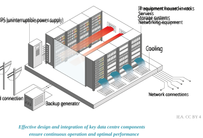Data centres are facilities used to house servers, storage systems, networking equipment and associated components that are typically installed in racks and organised into rows (Figure 2.1). This information technology (IT) equipment, and the range of auxiliary equipment required to keep it in working order, comprises the following: 

- **Servers** are computers that process and store data. They can be equipped with central processing units (CPUs) and specialised accelerators, such as graphics processing units (GPUs). On average they account for around 60% of electricity demand in modern data centres, although this varies greatly between data centre types (Figure 2.2). 

- **Storage systems** are devices used for centralised data storage and backup and account for around 5% of electricity consumption. 

International Energy Agency | **Energy and AI** 

**52** 

2 

- **Networking equipment** includes switches to connect devices within the data centre, routers to direct traffic and load balancers to optimise performance. Networking equipment accounts for up to 5% of electricity demand. 

- **Cooling and environmental controls** consist of equipment that regulates temperature and humidity to keep IT equipment operating at optimal conditions. The share of cooling systems in total data centre consumption varies from about 7% for efficient hyperscale data centres to over 30% for less-efficient enterprise data centres. 

- **Uninterruptible power supply batteries and backup power generators** keep the data centre powered during outages. These are rarely used but are necessary to ensure the extremely high levels of reliability that data centres must meet. 

- **Other infrastructure** includes lighting and office equipment for onsite staff, etc. 

The share of these different components in data centre electricity consumption varies greatly by data centre type, depending on the nature and efficiency of the equipment installed. Figure 2.2 presents the typical breakdown for different data centre types in operation today. 

**Figure 2.2** ⊳ **Share of electricity consumption by data centre and equipment type, 2024** 

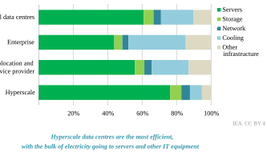Several technical characteristics determine data centre electricity consumption: 

- **Installed IT capacity** refers to the operating servers, storage and networking devices and is measured in megawatts (MW). **Total installed capacity** includes both IT capacity and the power capacity of auxiliary equipment. In many cases, data centres are only partially filled with servers. **Maximum designed capacity** refers to the maximum capacity of a data centre if it is filled with servers; in many instances, it is smaller than the total installed capacity. 

**Chapter 2** | Energy for AI 

**53** 

- The **utilisation rate** of IT equipment measures how much of the available computing resources are actively being used over a given period. Smaller and less-efficient enterprise data centres have average utilisation rates below 20%, while hyperscale data centres with optimised loads can have average utilisation rates of up to 50%. 

- **Idle power** is the amount of electricity a device consumes to perform essential background operations when not actively processing workloads. It is typically expressed as a percentage of maximum rated power. A lower idle power is more efficient. Idle power has improved from around 60% in 2010 to around 35% of rated power in modern servers. 

- **Power usage effectiveness (PUE)** is the ratio of total facility electricity consumption to the electricity consumption of the IT equipment (PUE = total consumption/IT consumption). It is commonly used as an important indicator of the energy efficiency of a data centre, with a focus on minimising infrastructure electricity consumption (such as cooling and lighting) compared to the electricity consumption of IT equipment. This measure can vary widely from around 2 (meaning 1 kilowatt hour [kWh] of electricity used for cooling and auxiliary equipment for every 1 kWh of electricity used by IT equipment) for enterprise data centres to just under 1.15 for hyperscale data centres (0.15 kWh used for cooling and auxiliary equipment for every 1 kWh used by IT equipment). 

Data centre servers deploy several kinds of chips and server architectures: 

- **Central processing units (CPUs)** are the primary components of a computer that carry out instructions from programs by performing operations. 

- **Graphics processing units (GPUs)** and other “accelerators”, such as tensor processing units, are optimised for parallel computations, enabling faster processing of certain tasks. 

- **Accelerated servers** are specialised servers equipped with GPUs or similar accelerator chips to enhance computing performance for specific tasks. They are particularly important for AI training and deployment. 

- **2.2 Electricity consumption of data centres** 

#### **_2.2.1 Historical electricity consumption of data centres_** 

_A sharp acceleration in recent years_ 

The Internet revolution took off in the 1990s, and early growth in the demand for digital services was strong. The electricity consumption of data centres in the United States almost doubled between 2000 and 2005, raising concerns about runaway growth (Koomey, 2007). An inflection point occurred around 2007-2008, when slowing growth in data centre electricity consumption indicated a decoupling from the still-booming demand for digital services. Several factors contributed to this slowdown in global data centre electricity 

International Energy Agency | **Energy and AI** 

**54** 

2 

consumption, including the migration of service demand to more efficient, larger data centres (colocation, service provider and hyperscale), but also continued improvements in hardware efficiency and operating efficiency (declining idle power ratios, for example). 

**Figure 2.3** ⊳ **Total data centre electricity consumption by equipment type and data centre type, 2005-2024** 

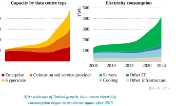Note: GW = gigawatt; TWh = terawatt hour. 

Sources: IEA analysis based on data from IDC (2024a), OMDIA (2025), and SemiAnalysis (2025). 

However, a sharp acceleration in data centre electricity consumption took place from around 2017 onwards. Important drivers of this step change were the growth of cloud computing, the shift to online media consumption, the wider use of social media platforms and the rise of AI, which increased the demand for high-performance computing, facilitated by the rise of accelerated servers. Between 2015 and 2024, the capacity of accelerated servers grew four times faster than the total capacity of servers. While accelerated servers are much more efficient on a per-task basis, they also unlocked many new tasks, that were not possible on conventional servers. These new capabilities, among other factors, drove an increase in service demand that outstripped the pace of continued efficiency improvements. 

Figure 2.4 provides another view of the drivers of electricity consumption by data centres from 2005 to 2015 and then from 2015 to 2023. From 2005 to 2015, global Internet Protocol (IP) traffic, mobile broadband subscriptions and active social media accounts grew by more than 25% per year. These are proxies for the rapid initial growth in demand for digital services. Growth rates moderated in the period from 2015 to 2023. In contrast, the growth rate of the total stock of servers in data centres accelerated from an annual growth rate of 4% seen in the period 2005 to 2015 to 8% per year from 2015 to 2023. Several key indicators 

**Chapter 2** | Energy for AI 

**55** 

of efficiency saw faster improvements from 2005 to 2015, including the rate of the shift from less-efficient enterprise data centres to more-efficient hyperscale, colocation and service provider data centres. As a result of these trends, data centre electricity consumption growth accelerated from 3% annually from 2005 to 2015 to 10% annually from 2015 to 2024. 

**Figure 2.4** ⊳ **Average annual change in key drivers of data centre electricity consumption globally, 2005-2015 and 2015-2023** 

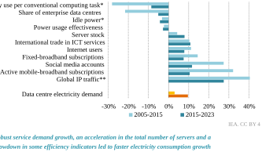* Data starts in 2007. ** Data ends in 2022, estimated for 2022. 

Sources: IEA analysis based on data from Cisco (2008), Cisco (2015), Cisco (2019), ITU (2025), Meltwater (2024), SPEC (2024), and World Bank (2024a). 

###### **Box 2.1** ⊳ **What share of data centre electricity demand comes from AI?** 

How much electricity demand comes from AI specifically is a challenging question to answer. AI is only one of the workloads that run on data centres, and as AI becomes increasingly pervasive, a clear distinction between AI-related and non-AI-related workloads becomes more challenging. There is no comprehensive data on the share of different kinds of workloads, and service providers or colocation data centre operators often have limited visibility over the specific workloads running in their facilities. Moreover, there are often differences in the definition of AI, with some traditional AI sometimes being excluded. In this context, the range of estimates for the share of AI in total data centre electricity consumption is very wide (Figure 2.5). 

As a second-best approach, estimates often rely on the electricity consumption of accelerated servers as a proxy for the share of AI in total electricity consumption from data centres. Accelerated servers accounted for 24% of server electricity demand and 15% of total data centre demand in 2024. 

International Energy Agency | **Energy and AI** 

**56** 

2 

**Figure 2.5** ⊳ **Estimated data centre electricity demand due to AI, 2020-2030** 

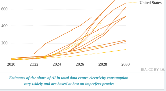Sources: IEA analysis based on data from Deloitte (2024), Gartner (2024), Goldman Sachs (2024), Schneider Electric (2024), SemiAnalysis (2024), and Shehabi, et al., (2024). 

However, this is an imperfect proxy for total AI electricity consumption. AI workloads, especially training, are often run on this type of specialised hardware, but some AI inferencing tasks also run on conventional servers, and some non-AI related tasks, such as high-performance scientific computing, are run on accelerated servers. Looking ahead, some AI inferencing workloads could move from data centres to end-user devices such as mobile phones and laptops (see section 2.4), further increasing uncertainty about AI-related electricity demand. 

_Data centre electricity consumption is not spread evenly around the world_ 

The United States, Europe and China account for around 85% of global electricity consumption from data centres today. In the United States, electricity consumption from data centres grew by around 12% a year between 2015 and 2024. Data centres accounted for around 180 TWh of electricity consumption in 2024 in the United States, nearly 45% of the global total and more than 4% of US electricity consumption from all sources (Figure 2.6). 

In China, the data centre sector started to expand significantly from 2015 onwards, with electricity demand growing 15% per year between 2015 and 2024, more than twice the rate seen between 2005 and 2015. Over the same period, electricity consumption across all sectors grew at an annual rate of around 7%. As of today, data centres account for approximately 100 TWh of electricity consumption, roughly equivalent to that of electric vehicles in China. The country accounts for around 25% of global data centre electricity consumption, up from less than 20% a decade ago. However, substantial data gaps make it challenging to accurately estimate China’s data centre electricity consumption (IEA, 2025). 

**Chapter 2** | Energy for AI 

**57** 

**Figure 2.6** ⊳ **Electricity consumption of data centres by region, 2005-2024** 

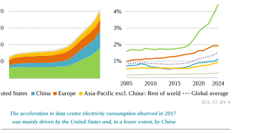Data centres account for slightly less than 2% of Europe’s electricity consumption, a share that is higher than China’s (1.1%). However, in absolute terms, Europe’s consumption is lower, at an estimated 70 TWh in 2024. Europe’s share of the global electricity consumption of data centres has decreased over the past decade but still represents slightly above 15%. In Japan, we estimate that data centres account for less than 20 TWh of electricity consumption (about 2% of Japan’s total consumption, on a par with Europe). We estimate that data centres account for around 9 TWh of consumption in India (Box 2.2), or about 0.5% of total consumption. However, the sector appears poised for rapid growth. 

###### **Box 2.2** ⊳ **Country focus: India** 

India has a thriving ICT sector, with the value of IT exports steadily growing to over USD 200 billion in 2024. By comparison, the world’s largest oil exporter earned USD 220 billion on export revenues that year. India is also home to around 950 million Internet users. Spurred by data localisation requirements in some sectors, India is now emerging as a rapidly growing data centre market. As of June 2024 India had 2 GW of total installed data centre capacity in operation, together consuming electricity equivalent to 6.5 million Indian households. India’s total installed data centre capacity has doubled in only four years, and over 2 GW of further maximum designed capacity is in the pipeline and planned to come online over the next two years. This means that total installed capacity is on track to reach nearly 5 GW by 2030 (Figure 2.7). 

The government’s IndiaAI Mission, with a budget of USD 1.2 billion, consists of several objectives, including the development of an AI computing ecosystem with over 18 000 GPUs to support AI start-ups and research. In addition, there are incentives from 

International Energy Agency | **Energy and AI** 

**58** 

2 

state governments for data centres; for instance, Uttar Pradesh announced a 100% exemption on electricity duty and transmission charges for ten years for new data centres. 

Electricity consumption from data centres is contributing to India’s electricity demand growth at a time when India is already among the world’s fastest-growing electricity markets. Coal fuels 74% of electricity generation in India today, providing much of the firm power to the grid, and the dominance of coal in the mix is likely to continue beyond 2030. However, since India’s “open access” rules enable the direct purchase of power from generators, several technology companies are signing power purchase agreements (PPAs) directly with renewable energy generation companies to reduce their emissions. For example, the data centre subsidiary of Indian telecommunications major Bharti Airtel announced it would procure 140 GWh of renewable energy annually and has been working with generation companies to set up captive solar photovoltaic (PV) and wind capacity for their data centres. 

To ensure that the upcoming wave of new data centre construction remains on target, India will need to address long-standing issues of grid reliability to capitalise on data centre and AI growth. In the current context, backup and captive power generation for data centres remains a critical consideration owing to the risk of power supply interruptions from the grid. Grid infrastructure creation and upgrades will also need to keep track of new data centre construction. Data centres are proving to be important energy consumers in India, creating additional demand for power generation, notably from solar PV and wind, and driving investment in power backup options (including battery storage) and transmission infrastructure upgrades. 

**Figure 2.7** ⊳ **India’s total data centre capacity and electricity generation mix, 2020-2030** 

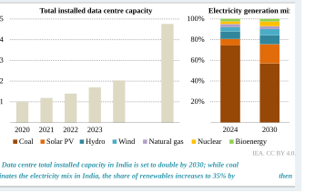**Chapter 2** | Energy for AI 

**59** 

_Data centre electricity consumption from a broader perspective_ 

With the rapid growth seen in recent years, the data centre sector accounted for around 4% of global growth in electricity consumption between 2014 and 2024. However, other drivers, such as growing appliance adoption in buildings and industrial electrification, were more significant. Data centres accounted for around 250 TWh of incremental electricity consumption in this period, roughly equivalent to the electricity demand of Spain. In comparison, the electricity consumption of space cooling grew by around 700 TWh (Figure 2.8). 

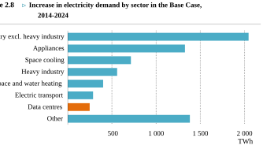IEA. CC BY 4.0. 

**_Over the past decade, growth in electricity demand for data centres increased by almost as much as for transport_** 

_All historical data are estimates, not measurements_ 

Currently, very few governments mandate reporting and publication of comprehensive statistics on data centre electricity consumption (see Chapter 5). As a result, all data on the historical consumption of data centres at the global level are the result of estimates based on a variety of sources. These sources come with different challenges and gaps; combined with the lack of common definitions (Masanet, Lei and Koomey, 2024), this results in widely divergent estimates, even for historical consumption. 

Often, companies and institutions that track or report on data centre capacity, including real estate companies, consulting companies and data centre operators, do not use a consistent scope or definitions. A key distinction is between the maximum designed capacity and the actual installed IT capacity. Data centres are often not filled to their maximum designed capacity, and IT capacity is usually ramped up progressively in new data centres. Access to detailed data on the installed capacity of data centres requires subscriptions to expensive third-party data services, an option that is often not available to many actors. 

International Energy Agency | **Energy and AI** 

**60** 

2 

Several recent studies rely on outdated or overly simplistic PUE assumptions due to a lack of high-quality, publicly available data for different data centre types and regions. The load factor of data centres is also marked by uncertainty. This metric is determined by IT equipment utilisation rates and idle server power consumption, both of which vary greatly across different workloads and hardware configurations. Combined with a lack of available data, this complicates aggregate load factor estimations, leading to significant discrepancies in consumption estimates. 

The rapid adoption of GPUs and other accelerated server designs further compounds these challenges. There are limited available data on annual shipments and the installed stock of accelerated servers. This has a large impact on demand estimations, as accelerated servers are much more power intensive than conventional servers. Finally, companies operating in the sector, including hyperscale and colocation providers, largely do not report their data centre electricity consumption specifically. 

As a consequence, all historical data regarding global data centre electricity consumption are modelled estimates, not measured data, and the range of estimates is wide (Figure 2.9). Triangulating multiple data sources does lead to broadly converging estimates that align with the IEA estimates provided in this chapter (Kamiya and Coroamă, 2025a). However, the process is intensive in time, resources and expertise. The data and methodological annex to this report provides more details on the methodology used by the IEA to estimate data centre electricity consumption from data centres. 

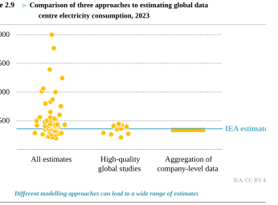Source: IEA analysis based on data from Kamiya and Coroamă (2025a). 

**Chapter 2** | Energy for AI 

**61** 

### **2.3 Outlook for electricity consumption from data centres** 

Our modelling approach relies on a bottom-up methodology developed by Lawrence Berkeley National Laboratory, using IT equipment shipments as a key driver of data centre energy demand (Shehabi, et al., 2024). The rise of AI is accelerating the deployment of highperformance accelerated servers, leading to greater power density in data centres. Understanding the pace and scale of accelerator adoption is critical, as it will be a key determinant of future electricity demand. The key input to our modelling is therefore nearterm industry projections for server shipments, considering the outlook for demand and supply constraints (IDC, 2024a). Readers interested in more methodological details can find these in the data and methodological annex to this report. 

#### **_2.3.1 Outlook in the Base Case_** 

##### _Key drivers_ 

In the Base Case, AI adoption alongside continuously deepening digitalisation drives the expansion of the data centre sector. The key drivers of electricity consumption from data centres evolve as follows in the Base Case: 

- The total stock of servers is projected to increase by more than 60% by 2030, with around a third of this increase due to the extended lifetime of servers. The total stock of accelerated servers increases even more strongly, but the share of accelerated servers in the total stock of servers remains below 10%. 

- The total installed capacity of data centres, which includes all installed IT equipment, cooling systems and auxiliary equipment, increases by more than the increase in the stock of servers, because the power intensity of servers (watts/server) increases substantially. This is due to the increase in the size and number of accelerated servers. A key driver of the increase in the average wattage of accelerated servers is the rising number of accelerators per server, with servers containing eight accelerators representing a significant share of the stock of accelerated servers by the end of the decade. The rated power of such servers can cross the 10 kilowatt (kW) mark; in comparison, the rated power of servers with two accelerators is below 2 kW. In the Base Case, the total installed capacity of data centres more than doubles from around 100 GW today to around 225 GW in 2030. The total capacity of accelerated servers grows by almost five times, compared to an increase of 1.8 times for conventional servers. 

- Cooling efficiency continues to improve in the Base Case. This is driven primarily by advancements in cooling technologies and data centre operational management, rather than a strong shift from enterprise data centres to more efficient colocation or hyperscale facilities. In the Base Case, the share of server capacity hosted by enterprise data centres slowly declines below 20% from 2024 to 2030. The global weighted average PUE is projected to improve, decreasing from 1.41 to 1.29 on average, saving around 

International Energy Agency | **Energy and AI** 

**62** 

2 

90 TWh of electricity demand. This represents around a 30% reduction in cooling requirements per unit of IT electricity used. 

- Continuous hardware development has driven ongoing improvements in energy efficiency, a trend expected to persist. However, the operational efficiency gains of accelerated servers may be reaching their limit due to high utilisation and limited scope for further idle power reductions. In contrast, conventional servers are expected to see significant efficiency improvements over the next decade, particularly through reductions in idle power consumption. Nonetheless, the Base Case factors in continued improvements in hardware efficiency of both conventional and accelerated servers. 

**Figure 2.10** ⊳ **Breakdown of the factors driving electricity demand growth in data centres in the Base Case, 2024-2030** 

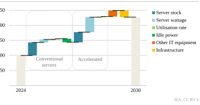**_The main drivers of growth in electricity consumption from data centres are the increases in the stock and wattage of servers_** 

##### _Global results_ 

Global electricity consumption by data centres is projected to reach around 945 TWh by 2030 in the Base Case, representing just under 3% of total global electricity consumption in 2030. This is more than double the estimated approximately 415 TWh for 2024 (Figure 2.10), which accounted for around 1.5% of today’s global electricity demand. From 2024 to 2030, data centre electricity consumption grows by around 15% per year, more than four times faster than the growth of total electricity consumption from all other sectors. However, in the wider context, a 3% share in 2030 means that the data centre share in global electricity demand remains limited. 

Electricity consumption in accelerated servers, which is mainly driven by AI technology adoption (Box 2.1), is projected to grow by 30% annually in the Base Case, while conventional server electricity consumption growth is slower at 9% per year. Accelerated servers account 

**Chapter 2** | Energy for AI 

**63** 

for almost half of the net increase in global data centre electricity consumption, while conventional servers account for only around 20%. Other IT equipment and infrastructure (cooling and other infrastructure) account for around 10% and 20% of the net increase, respectively (Figure 2.11). All three types of data centres – enterprise, colocation and server provider, and hyperscale – contribute to the growth in electricity consumption. 

**Figure 2.11** ⊳ **Global data centre electricity consumption in the Base Case, 2020-2030** 

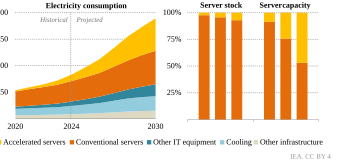**_Around 70% of the growth in electricity demand from servers between 2025 and 2030 comes from accelerated servers_** 

##### _Regional results_ 

The United States, China and Europe are projected to remain the largest regions for data centre electricity demand over the coming years. However, other regions are experiencing strong growth in data centre development, positioning them to play increasingly important roles in the global data centre landscape. A notable example is Southeast Asia, where electricity demand from data centres is expected to more than double by 2030, partially due to the presence of a regional hub in Singapore and southern Malaysia (Johor province). 

China and the United States are the most significant regions for data centre electricity consumption growth, accounting for nearly 80% of global growth to 2030. Consumption increases by around 240 TWh (up 130%) in the United States, compared to the 2024 level (Figure 2.12). In China it increases by around 175 TWh (up 170%). In Europe it grows by more than 45 TWh (up 70%). Japan increases by around 15 TWh (up 80%). 

Comparing data centre electricity consumption normalised per capita can give a sense of the importance of this sector in different economies. Africa has the lowest consumption at less than 1 kWh of data centre electricity consumption per capita in 2024, rising to slightly less than 2 kWh per capita by the end of the decade. However, there are strong differences within 

International Energy Agency | **Energy and AI** 

**64** 

2 

the region, with South Africa showing strong growth and per-capita consumption more than 15 times larger than the continental average in 2030, with an intensity higher than 25 kWh per capita. By contrast, the United States has the highest per-capita data centre consumption, at around 540 kWh in 2024. This is projected to grow to over 1 200 kWh per capita by the end of the decade, which is roughly as much as 10% of the annual electricity consumption of a US household. This intensity is also one order of magnitude higher than any other region in the world. 

An interesting trend is observed in China, where data centre consumption normalised per capita – at around 70 kWh in 2024 – is poised to overtake that of Europe (slightly less than 100 kWh). By 2030, per-capita consumption in China reaches around 200 kWh, slightly less than the level seen in Japan (270 kWh) but more than the level in Europe (165 kWh). Per-capita consumption in India remains an order of magnitude lower, at around 15 kWh. 

**Figure 2.12** ⊳ **Data centre electricity consumption and data centre electricity consumption per capita by region in the Base Case, 2020-2030** 

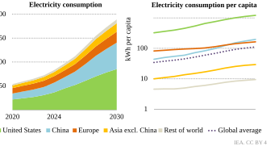**_The United States and China combined account for 80% of the growth in data centre consumption_** 

_The growth of data centre consumption in the Base Case within the broader context_ 

Despite the strong increase, data centre electricity demand growth accounts for less than 10% of global electricity demand growth between 2024 and 2030 in the Base Case (Figure 2.13). Other key drivers, such as industry output growth and electrification, the deployment of electric vehicles and the adoption of air conditioning, lead the way. However, while the absolute growth may appear smaller, data centres, unlike electric vehicles, tend to concentrate in specific locations (see section 2.6.2), making their integration into the grid potentially more challenging. 

**Chapter 2** | Energy for AI 

**65** 

**Figure 2.13** ⊳ **Increase in electricity demand by sector in the Base Case, 2024-2030** 

**_Data centres contribute more to global electricity demand growth than heavy industry or space and water heating_** 

#### **_2.3.2 Outlook in the sensitivity cases_** 

In this section, we present the results of our longer-term exploratory modelling of different potential outcomes for electricity demand. The results are presented to 2035, notably to inform the energy sector about possible outcomes on timelines consistent with energy sector planning horizons. These numbers serve as exploratory scenarios to inform technology and policy choices. It is crucial to consider the wide range of uncertainties, including the scale of AI adoption and the efficiency with which this additional service demand will be met (Luers, et al., 2024). 

##### _Lift-Off Case_ 

This case explores the impact of stronger AI adoption and increased global demand for digital services, leading to even stronger deployment of data centre facilities than in the Base Case. This drives higher demand for accelerated servers to handle complex, power-hungry workloads. It is assumed that the supply chain will be highly adaptable, with scalable production capacity and minimal inertia. This would prevent shortages of high-performance chips. 

Importantly, it is assumed that various actions mitigate the local constraints on data centre development. First, data centres are assumed to have greater location flexibility than in the Base Case. The increased share of workloads with low latency requirements (e.g. AI training and several kinds of AI inference) reduces the need for proximity to customers. Instead, locational decisions can prioritise factors like generation capacity, grid availability and land accessibility. This shift reduces the risk of local project concentration and, in turn, opposition to new developments. Second, higher structural flexibility is assumed to make grid 

International Energy Agency | **Energy and AI** 

**66** 

2 

integration less challenging. Combined with operational flexibility, the Lift-Off Case assumes a trend towards higher reliance on onsite generation for data centre demand, with the grid serving as backup. This approach could mitigate grid saturation risks. While clean power generation, such as renewables or even small modular nuclear reactors in the future, can be deployed for onsite generation, natural gas is also deployed for this purpose in the Lift-Off Case (see section 2.5.4). 

The Lift-Off Case trajectory sees global electricity demand from data centres in 2035 that is around 45% higher than in the Base Case, exceeding the 1 700 TWh mark and reaching 4.4% of global electricity demand (Figure 2.14). 

**Figure 2.14** ⊳ **Global data centre electricity consumption by sensitivity case, 2020-2035** 

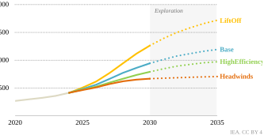**_The outlook for data centre electricity demand is highly uncertain, driven by factors including efficiency improvements, AI uptake and potential energy sector bottlenecks_** 

##### _High Efficiency Case_ 

In this case we assume that AI and digital services demand follows the same trajectory as in the Base Case. However, several efficiency strategies are implemented to counterbalance the increased energy demand resulting from the higher adoption of digital technologies, particularly AI. Efficiency improvements are primarily driven by a shift from enterprise data centres to colocation and service provider facilities, including highly efficient hyperscale data centres. This results in a reduction in the aggregated PUE, which falls to around 1.13 by 2035 compared with 1.21 in the Base Case. 

Alongside these improvements, greater software efficiency plays a crucial role in the High Efficiency Case. This relies on approaches such as reducing energy demand per task through code optimisation and innovative algorithms, similar to past trends where improvements in algorithm efficiency significantly limited the growth of conventional computing demand. This 

**Chapter 2** | Energy for AI 

**67** 

scenario assumes that models are “right-sized” for different tasks, with the technology sector aiming to reduce inference costs and consumers facing an information and incentive environment that supports decision making. OpenAI’s GPT-4.5 roadmap can be seen as a step in this direction, as it introduces the ability to adjust model compute use based on query complexity, thereby optimising resource use without compromising performance (OpenAI, 2025). Additional improvements are also projected on the hardware side, for example through the penetration of full- and semi-custom integrated circuits, application-specific integrated circuits and field-programmable gate arrays, which is higher than in the Base Case, enabling significant energy savings. These specialised processors deliver far better energy performance compared to general-purpose processors like GPUs (see the Spotlight below on the future of computing). 

All these efficiency improvements result in a smaller installed IT capacity than in the Base Case, but one that still meets the same service demand. In aggregate, the High Efficiency Case unlocks energy savings of more than 15%, with global electricity demand from data centres reaching around 970 TWh by 2035. As a result, 2.6% of global electricity demand goes to data centres. 

##### _Headwinds Case_ 

In this case, service demand does not grow as fast as in other scenarios, and AI sees a slower uptake. Difficulties in monetisation lead to a pullback in investment. This case also assumes stronger local constraints. Additional limitations, such as in the electricity supply chain (see Chapter 5), cause delays in data centre development in this case. As a result, the total installed IT stock by the end of the decade is projected to be smaller than in the Base Case, with growth plateauing beyond 2030 (this still means growing service demand, as the stock of IT equipment becomes more efficient over time). Similar to trends seen in the early 2010s, the improvements in efficiency are expected to offset most of the impact of increased IT stock utilisation, leading to a plateau in energy demand at around 700 TWh, limiting the growth of the data centre share of global electricity demand to less than 2% in 2035. 

**~~<mark>S P O T L I G H T</mark>~~ The future of computing** 

Energy efficiency has played a fundamental role in curbing energy demand growth from data centres over the past 20 years. Despite the massive growth in Internet users, data traffic and the digital intensity of the economy (Figure 2.3), data centre consumption as a share of global electricity demand has only increased from 1% in 2005 to 1.5% in 2024. 

However, with the shift away from enterprise data centres mostly tapped, AI servers already being highly optimised and utilised, and the approaching limits to semiconductor miniaturisation, this raises questions over further energy efficiency opportunities in data centres and the extent to which technologies and approaches can help curb energy demand growth to 2030 and beyond. 

International Energy Agency | **Energy and AI** 

**68** 

2 

Researchers have explored the opportunity of improvements in software, algorithms and hardware architectures (Leiserson, et al., 2020). These opportunities – some of which are specific to AI and others broadly across data centres and computing – can be generally categorised into hardware, software and cross-cutting approaches, which are briefly explained below. Table 2.1 outlines their current adoption levels, likely level of deployment in 2030 and scale of energy savings potential. These do not consider rebound effects that could counteract such energy efficiency improvements. 

##### _Hardware_ 

- **Low-power processors:** processors designed to minimise power consumption, e.g. ARM-based CPUs, Intel Atom processors. 

- **AI accelerators:** specialised hardware that can perform AI tasks quickly and efficiently, e.g. servers (Nvidia GPU, Google TPU) and devices (NPU, Apple Neural Engine). 

- **Task-optimised hybrid processors:** processors that combine specialised processing units (“chiplets”) for specific tasks within a single package to maximise performance and energy efficiency, e.g. AMD Epyc CPUs. 

- **Photonic integrated circuits:** using light (photons) instead of electricity (electrons) to process information, reducing energy waste and enabling faster, more efficient data handling. 

- **Energy-efficient memory and storage:** using memory and storage technologies that minimise power consumption, e.g. low-power DDR5 memory and NVMe solid-state drives. 

- **Memory proximity:** placing data closer to the processor to reduce data transfer distances and energy consumption, e.g. high-bandwidth memory integrated with GPUs. 

- **Innovative cooling technologies:** advanced cooling methods to remove heat from data centres more efficiently, reducing energy use for cooling, e.g. liquid cooling systems (direct-to-chip, immersion). 

##### _Software_ 

- **Energy-efficient algorithms:** developing AI algorithms that require less energy. 

- **Task-specific models:** smaller and more specialised AI models that are tailored to specific tasks rather than large, general-purpose models. 

- **Model and code optimisation:** refining existing model architectures, code and software to reduce computational resource and energy use. 

##### _Cross-cutting_ 

- **Co-design of software/hardware:** co-designing software and hardware to leverage synergies to maximise energy efficiency and performance. 

**Chapter 2** | Energy for AI 

**69** 

- **Edge computing:** running AI inference closer to end-users (devices, edge servers), reducing data transmission and running smaller models on more energy-efficient ondevice processors and distributing energy use over many distributed devices. 

- **Virtualisation:** running multiple virtual machines on a single physical server to increase utilisation rates and reduce the number of physical servers needed. 

- **Intelligent energy management:** intelligent power and task management, e.g. allocating tasks to energy-efficient hardware, using AI to monitor and adjust cooling and computational resource allocation to reduce energy use at the data centre level. 

- **Quantum computing:** computing that uses quantum mechanics to perform vastly more complex computation than classical computing techniques, e.g. IBM Quantum, Google Willow, Microsoft Majorana 1 and Amazon Ocelot. 

- **Neuromorphic computing:** computing that mimics the brain’s neural architecture to process data and computations more efficiently compared to classical computing, e.g. IBM TrueNorth and Intel Loihi 2. 

**Table 2.1** ⊳ **Current and potential 2030 energy savings in data centres from key technologies and approaches** 

|**Technology/approach**|**Current** **adoption**|**Expected adoption** **in 2030**|**Scale of energy** **savings potential**|
|---|---|---|---|
|**Hardware**||||
|Low-power processors|●●|●●●|●●●●|
|AI accelerators|●●●|●●●●|●●|
|Task-optimised hybrid processors|●●|●●●|●●|
|Photonic integrated circuits|●|●●|●●●|
|Energy-efficient memory and storage|●●●|●●●●|●●|
|Memory proximity|●●|●●●|●●|
|Innovative cooling technologies|●●|●●●●|●●|
|**Software**||||
|Energy-efficient algorithms|●●|●●●●|●●●●|
|Task-specific models|●●|●●●●|●●●●|
|Model and code optimisation|●●|●●●|●●●|
|**Cross-cutting**||||
|Codesign of software/hardware|●●|●●●|●●|
|Edge computing|●●|●●●|●●●|
|Virtualisation|●●●●|●●●●|●●|
|Intelligent energy management|●●●|●●●●|●●|
|Quantum computing|●|●|●●●|
|Neuromorphic computing|●|●●|●●●●|

Note: A greater number of dots indicates a higher scale. 

International Energy Agency | **Energy and AI** 

**70** 

2 

### **2.4 Implications of AI for ICT sector energy use** 

Data centres are part of the broader ICT sector,1 which also includes telecommunication networks and end-user devices such as laptops and smartphones (ITU, 2018). The implications of AI for energy use in data centres – and in the broader ICT sector – depend largely on how generative AI is adopted and deployed, both of which are highly uncertain. This section explores possible scenarios and their implications. 

Consuming around 360 TWh of electricity in 2023, data centres accounted for one-third of overall ICT sector electricity use, estimated at over 1 000 TWh2 in 2023, equivalent to 4% of global electricity use (Figure 2.15). Telecommunication networks, including fixed and mobile access and core networks, consumed around 280 TWh, while personal computers, mobile phones and other connected devices used around 440 TWh. 

**Figure 2.15** ⊳ **Global electricity demand from data centres, data transmission networks, devices and cryptocurrency mining, 2015-2023** 

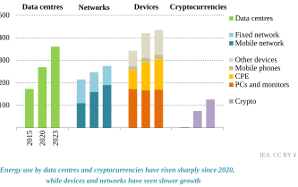Notes: CPE = customer premises equipment, including routers and modems; PCs = personal computers, including laptops and desktops. Networks include core and access networks. Other devices include the Internet of Things and surveillance cameras. 

Sources: IEA analysis based on data from Malmodin and Lundén (2018); IEA (2023); GSMA (2024) World Bank, (2024b); Malmodin, et al. (2024); Kamiya and Coroamă (2025); Cambridge Centre for Alternative Finance (2025), and company reports. 

> 1 According to the ITU-T L.1450 Recommendation, the ICT sector includes ICT end-user goods, ICT network goods, data centres and ICT services (e.g. software). User devices intended primarily for entertainment, such as televisions and gaming consoles, are accounted for in the entertainment and media sector. 

> 2 This figure excludes cryptocurrencies as well as the entertainment and media sector (including televisions, gaming consoles, cable television networks and content production), which are considered outside the ICT sector footprint. 

**Chapter 2** | Energy for AI 

**71** 

Cryptocurrencies and televisions are large energy users often associated with the ICT sector but are technically outside the sector scope according to definitions from the International Telecommunications Union. Cryptocurrencies – primarily from Bitcoin mining – consumed around 125 TWh in 2023 (0.5% of global electricity), while televisions, peripherals and cable television networks consumed around 500 TWh (2% of global electricity). 

Data centres have contributed most to ICT sector energy growth since 2020, increasing by over 90 TWh between 2020 and 2023. Energy used for cryptocurrency mining has also increased strongly, growing by over 50 TWh since 2020. 

Energy use by telecommunication networks has grown slightly, driven by strong growth in 5G mobile networks but partially offset by reductions in fixed networks from the switch from copper to fibre optic networks. Energy use by devices decreased in the early 2010s due to efficiency gains (e.g. switching from personal computers to laptops and telephones and from cathode ray tubes to liquid crystal displays) but has since increased, driven by the growth in the number of devices and new segments, such as the Internet of Things and surveillance cameras. There is considerable uncertainty around overall energy use by devices due to a lack of comprehensive data regarding use patterns and stocks. 

#### **_2.4.1 Drivers and outlook for edge applications of AI_** 

Most AI-related energy demand currently comes from large, centralised cloud and hyperscale data centres – both for training and inference (Kaack, et al., 2022). Some inference tasks are already conducted on user devices, as well as hybrid approaches where initial processing is done on the device and the final request is sent to a data centre. A broader shift towards AI inference at the “edge” of the network (closer to end-users) could have important implications for energy use – both in terms of where energy is consumed and how much is needed to support AI applications. 

Moving AI inference applications to the edge – to edge data centres and end-user devices such as laptops and smartphones – can be advantageous for use cases where fast response (reduced latency) is critical (Chen and Ran, 2019). On-device AI inference may also be important for operational resilience in situations where network connectivity is poor or when handling large volumes of data (e.g. video analysis). In addition, on-device AI inferencing offers improved data privacy by avoiding the transfer of sensitive data to centralised data centres. 

To facilitate on-device AI inferencing, device manufacturers are increasingly integrating AI acceleration hardware into laptops and smartphones, such as neural processing units (NPUs), Google’s Tensor chip, and Apple’s neural engine (ANE). This specialised hardware consumes much less power than CPUs and GPUs for AI tasks and can offload tasks from CPUs and GPUs to save power. However, compared to large data centres, edge devices face important resource constraints on computation, storage and power, limiting the type and size of the AI models they can run (Box 2.3). 

International Energy Agency | **Energy and AI** 

**72** 

**Box 2.3** ⊳ **Which AI models can run on smartphones and laptops?** 

2 

AI models that can run on user devices are smaller and more efficient versions of their cloud-based counterparts. Given the computational and energy constraints of smartphones and laptops, these models are compressed and optimised to have fewer parameters, require less memory and use less power, and often involve trade-offs between efficiency and accuracy. 

Many new smartphones sold today have processors that are capable of handling models with hundreds of millions of parameters, allowing them to complete tasks such as enhanced voice recognition and natural language processing for virtual assistants, realtime object detection and tracking for augmented reality, computational photography and some generative AI capabilities. 

The latest flagship smartphones have processors that can handle models with well over a billion parameters, such as Google’s Tensor G4 (30 to 45 tokens per second for a model with over 3 billion parameters) and Qualcomm’s Snapdragon 8 Gen 3 (15 tokens per second for a 10 billion parameter model). AI acceleration hardware on flagship phones has become increasingly powerful. For example, the Apple A18 chip used in the iPhone 16 series (introduced in 2024) is capable of 35 trillion operations per second, around six times more powerful than the A13 Bionic on the iPhone 11 from 2019. 

Laptops, edge servers and other devices with significant processing power (e.g. automated vehicles) can handle even larger models and complex tasks with higher accuracy. Nvidia announced its USD 249 Jetson Orin Nano Super computer in December 2024, capable of 67 trillion operations per second while consuming 25 watts (W). In January 2025, the company announced Project DIGITS, offering 1 petaflop of AI performance, enabling it to support AI models with up to 200 billion parameters. DIGITS will sell for USD 3 000 from May 2025. 

Early studies estimate that NPUs on laptops consume in the range of 1 W to 5 W for most AI tasks. For example, generating 25 images with Stable Diffusion V2.1 consumed around 2 W to 4 W per image (Weinbach and Bajarin, 2024). Another study compared the power consumption of CPUs, GPUs and NPUs using the YOLOv5 object detection model at varying model sizes and precisions (Delli Abo, 2024). The NPU was found to use the least power (1.8 W to 2.5 W) compared with the CPU (27 W) and GPU (23 W to 51 W). Even factoring in the longer inference time, the NPU was still the most energy efficient, followed by the powerintensive but faster GPU. The power consumption of an NPU on a smartphone was estimated to be around 0.5 W, around 80% lower than the CPU (Tan and Cao, 2023). 

Laptops typically consume between 20 W and 60 W during active use, making any incremental energy consumption from AI inference (1 W to 5 W) relatively small. With smaller and more optimised models at the edge, the shift towards AI inference at the edge is likely to reduce energy use in data centres with only a limited increase in energy use by 

**Chapter 2** | Energy for AI 

**73** 

devices. Shifting inference tasks to edge devices can also help electricity systems by distributing power demand across different locations and time. 

Beyond the likely net energy savings from edge AI, there are potential negative indirect energy and environmental impacts from manufacturing AI-enabled devices. On-device AI capabilities and minimum hardware requirements for increasingly prevalent AI-powered applications could accelerate device replacement cycles in the near term. This could reverse the slowing of turnover rates over the past decade, with average replacement cycles for smartphones reaching 3.5 years (GSMA, 2025). International Data Corporation projects sales of generative AI smartphones (with NPUs capable of 30 trillion operations per second) to grow by 80% annually to 2028, reaching around 900 million units (70% market share) (IDC, 2024b). Combined with the fact that AI acceleration hardware requires more energy to manufacture than conventional (non-AI) counterparts, shorter device lifespans and new demand for AI-enabled devices could increase manufacturing-related energy use and contribute to e-waste generation, particularly in the near term. 

The impacts of widespread generative AI adoption on data traffic and the energy use of data transmission networks are highly uncertain. Ericsson predicts that most of the traffic increase from AI – particularly from uplink data – will be due to video-based generative interactions using smartphone cameras, smart glasses, or extended reality devices to engage their environment or ask questions to a video-based large language model (Ericsson, 2024). It also predicts that most of these AI workloads will be executed in the cloud in real time or prerendered to generate hyper-personalised content. Some medium-complexity AI workloads may migrate to smartphones, mitigating some traffic growth. 

However, the extent to which increased data traffic would affect network energy use is uncertain. Recent studies have demonstrated that fixed and core networks generally use the same amount of energy regardless of data traffic (Mytton, Lundén and Malmodin, 2024). In the case of mobile networks, capacity is just one factor that affects energy use, with coverage also being an important driver (Rouphael, et al., 2023). Within the context of other larger drivers of data traffic and connections – notably streaming video, the Internet of Things and extended reality – AI is unlikely to have a noticeable impact on network energy use, especially in the near term. 

In addition to AI inferencing at the edge, training on edge devices could have impacts on energy use across the ICT sector. Federated learning enables AI models to be trained on decentralised data using edge devices such as smartphones and laptops. Instead of bringing the data to a central server, federated learning brings the model training to the data source. Early studies have shown the potential for federated learning to reduce energy use and emissions associated with AI training (Qiu, et al., 2021). 

International Energy Agency | **Energy and AI** 

**74** 

2 

### **2.5 Electricity supply to meet data centre demand** 

#### **_2.5.1 Procurement strategies of technology companies_** 

Procuring electricity supplies that are reliable and cost-effective is crucial to meeting the rapidly growing electricity demand from data centres. Many technology companies and large data centre operators have set ambitious goals for reducing emissions and procuring clean energy (Table 2.2). To meet these objectives, data centre operators use various procurement strategies. These vary by company and region, with liberalised electricity markets generally offering more procurement choices than regulated markets. In addition to sourcing the grid electricity mix, procurement strategies include acquiring electricity through PPAs. Many companies also purchase renewable energy certificates to meet their clean energy targets. 

The recent surge in data centre electricity demand has led to significant interest in additional natural gas-fired power generation, largely in the United States, where natural gas is a lowcost fuel. Gas turbine manufacturers are reporting an uptick in orders, and several large data centre operators have announced partnerships with utilities and energy companies developing new gas-fired power capacity. In Louisiana, for example, Entergy Louisiana is planning more than 2 GW of additional gas-fired power generation to provide power for Meta data centres. NextEra Energy and GE Vernova also aim to develop natural gas-fired power generation projects across the United States, primarily to meet the growing electricity demand of data centres. At the same time, many US utilities are currently revising their integrated resource plans to account for rising data centre electricity demand, proposing additional natural gas-fired capacity to meet it. To bring down emissions, some data centre operators are considering fitting natural gas-fired plants with carbon capture in the long run. 

Most renewable energy PPAs are financial agreements for annual volumes of electricity and are not tied to the hour-to-hour consumption profile of a data centre or the generation profiles of the renewable assets, which can also be located in different regions. While these PPAs help data centre operators meet their clean energy targets, the separation of renewable generation and data centre consumption often means other sources, like natural gas or coal, are used to meet physical electricity needs. This results in a physical electricity mix that differs from the procured, or “financial”, electricity mix. 

To enhance their sustainability strategies and further support decarbonised grids where they operate, some technology companies are concluding PPAs with hourly matching. This means that some or all of their electricity consumption is matched hour-by-hour by a portfolio of renewable energy and storage assets, or other types of low-emissions power generators located in the same region. For instance, Google seeks to achieve hourly matching, and Microsoft has signed hourly PPAs in support of its goal to be carbon negative by 2030. In order to achieve these goals, they are moving to deploy portfolios of renewable energy and storage projects that can increase hourly matching, as well as signing PPAs with dispatchable sources of low-emissions electricity, such as hydro, nuclear, geothermal or natural gas with carbon capture. In September 2024, for example, Microsoft and Constellation Energy concluded a 20-year PPA for the restart of the Three Mile Island nuclear plant. 

**Chapter 2** | Energy for AI 

**75** 

**Table 2.2** ⊳ **Emissions reduction and clean energy targets of corporate data centre operators** 

|**Company**|**Estimated** **data centre** **capacity**(MW)|**Net zero** **emissions** **target year**|**Corporate clean,** **green or renewable** **electricity target***|**Current** **share**|**Hourly** **matching** **target***|
|---|---|---|---|---|---|
|Meta|9 780|2030|100% renewable since 2020|100%||
|Google|8 960|2030|100% renewable since 2017|100%|100% by 2030|
|Amazon|7 660|2040|100% renewable since 2023|100%||
|Microsoft|6 970|2030|100% renewable by 2025|100%|100% by 2030|
|Digital Realty|2 740|||66%||
|Equinix|1 850|2030|100% renewable by 2030|96%||
|Tencent|1 760|2030|100% green by 2030|12%||
|Alibaba Cloud|1 660|2030|100% clean by 2030**|56%***||
|Aligned|1 290|2040|100% renewable since 2020|100%||
|Huawei|1 260|2040||> 50%||
|Apple|1 240|2020|100% renewable since 2018|100%||
|Vantage|1 180|2030||58%||
|CyrusOne|1 120|2030|100% carbon-free energy by2030|62%||
|NTT Data|1 110|2035|100% renewable by 2030**|49%||
|QTS Data Centers|1 060|||65%***|*|
|Baidu|980|2030||5%||
|GDS|980|2030|100% renewable by 2030|36%||
|Chindata|900|2060|100% renewable by 2040**|7%||
|Switch|660|2021|100% renewable since 2016|100%||
|Princeton Digital|620|2030|100% green by 2030|14%||

* Only targets with specified years are included. ** Target covers data centres only. *** Percentage of clean electricity consumed at Alibaba Cloud’s self-built data centres. **** Percentage of low-emissions electricity utilised by QTS’ facilities. 

Notes: Data centre operators are ranked by their total estimated data centre capacity as of the end of the first half of 2024, based on OMDIA (2025). The OMDIA database may not be complete but was used to provide a consistent source across diverse companies for installed capacity. The net zero targets are for Scope 1 and Scope 2 emissions. 

As part of these strategies, technology companies are also supporting the development and commercialisation of innovative low-emissions baseload technologies, such as small modular reactors (SMRs) and next-generation geothermal. To date, plans to build up to 25 GW of SMR capacity associated with supplying the data centre sector have been announced worldwide, almost all of them in the United States, although projects are at varying stages of maturity and certainty. The first projects are expected to start to materialise only towards the end of this decade. 

International Energy Agency | **Energy and AI** 

**76** 

2 

Advances in geothermal technology, including horizontal drilling and hydraulic fracturing pioneered by the oil and gas industry, are promising to increase the number of locations in which geothermal energy could be harnessed to provide a cost-competitive source of baseload electricity. Google has partnered with Fervo Energy, which developed a 3.5 MW first-of-its-kind next-generation geothermal power pilot project in Nevada. This project started feeding electricity into the grid in November 2023. In June 2024, Google and NV Energy, Nevada’s utility, entered into a power supply agreement for Fervo’s 115 MW Corsac next-generation geothermal project, which is currently under development. Meta has signed an agreement with Sage Geosystems for 150 MW of capacity to power its data centres from 2027, while Microsoft and partner G42 are planning the construction of a data centre campus powered by geothermal power in Kenya. 

As an alternative to procuring electricity from utilities or through PPAs, some technology companies are co-locating data centres with power generation facilities, enabling them to generate some or most of their own electricity directly. The primary benefit of co-locating generation is potentially faster development times, as this approach can allow them to downsize or opt for an interruptible grid connection, saving costs and helping to alleviate grid congestion. The downsides are higher complexity, increased permitting requirements, higher investment costs, potentially lower reliability and a greater maintenance burden. 

Recent years have seen rising interest in co-locating data centres and generation assets. Google is partnering with Intersect Power and TPG Rise Climate to develop co-located clean energy projects with data centres, aiming for completion by 2027. Chevron and Engine No. 1 are partnering with GE Vernova, with plans to supply up to 4 GW of natural gas capacity to co-located data centres, aiming to start operations by the end of 2027. Amazon and Talen Energy have signed a 10-year PPA for 300 MW to 960 MW of nuclear energy from the Susquehanna nuclear plant to supply a co-located data centre, although a recent Federal Energy Regulatory Commission ruling on the repurposing of existing grid-connected power plants to directly provide power to co-located loads halted plans to expand the electricity supply beyond the initially awarded 300 MW. The commission has recently initiated a process to examine the colocation policy. 

###### **Box 2.4** ⊳ **Data centre operators are leading the corporate PPA push** 

A PPA is a long-term contract in which an electricity generator sells power to a buyer at a fixed price for a specified period. In regulated markets, green tariffs can serve a similar role, with a utility acting as an intermediary. To date, nearly 120 GW of operational renewables capacity has been procured through corporate PPAs globally (Figure 2.16). Technology companies operating data centres account for over 30% of this capacity. In 2024, technology companies’ renewables PPAs were sufficient to cover roughly 20% of the estimated 415 TWh of global electricity demand from data centres. 

An additional 60 GW of PPA-related capacity is currently under development – meaning projects for which financing and/or permits have been secured or which are under 

**Chapter 2** | Energy for AI 

**77** 

construction. Almost 40% of this capacity is contracted by data centre operators. Data centre operators have also been responsible for the lion’s share of recent announcements, accounting for almost 60% of the 34GW of the renewables capacity for which corporate PPAs have been announced but which has not yet entered the development stage. Projects that are under development or have been announced would provide sufficient capacity to cover approximately 15% of the projected electricity demand growth from data centres to 2030. 

**Figure 2.16** ⊳ **Global renewables capacity contracted through corporate PPAs by development status, offtaker and technology** 

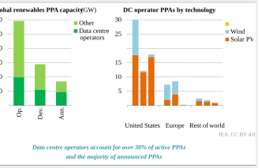Notes: Op. = operational; Dev. = under development; Ann. = announced; DC = data centre; PPA = power purchase agreement. The cut-off date is February 2025. Only individual known projects are considered. Other includes bioenergy and geothermal. 

Source: IEA analysis based on data from BNEF (2025). 

Of the operational renewables PPA capacity contracted by data centre operators, 75% is located in the United States, with nearly 20 GW of solar PV and about 12 GW of onshore wind under contract there, followed by Europe with 20%. Over 50% of the capacity under development is also located in the United States – almost of all of it solar PV, while Europe accounts for around 35%. In the European Union and United Kingdom, offshore wind farms account for most of the under-development capacity contracted by data centre operators in the region. Announcements for additional PPAs have so far focused mostly on the United States, with nearly 90% of the announced capacity. While there has recently been an increase in announcements from other parts of the world, including Southeast Asia and India, significant regulatory hurdles continue to limit the deployment of PPAs, in particular in emerging market and developing economies. 

International Energy Agency | **Energy and AI** 

**78** 

2 

#### **_2.5.2 Matching electricity supply with data centre demand_** 

Electricity supply to meet data centre demand can come from a wide set of sources, each with unique characteristics related to technical performance, cost, emissions, the development process and lead times. Consideration of these options, either to be developed onsite or connected through the grid, is critical to scaling up electricity supply to meet data centre demand. 

**Table 2.3** ⊳ **Sources of electricity to match the needs of data centres** 

|**Electricity** **source**|**Construction** **period**|**Variable or** **dispatchable**|**Global average CO₂** **intensity** (g CO₂/kWh)|**Global average** **LCOE** (USD/MWh)|
|---|---|---|---|---|
|Utility solar PV|1-4 years|Variable|0|60|
|Wind onshore|2-5 years|Variable|0|50|
|Wind offshore|3-7 years|Variable|0|110|
|Hydropower plant|5-15 years|Variable (run-of-river) Dispatchable(reservoir)|0|80|
|Conventional geothermal|3-8 years|Dispatchable|0|80|
|Nuclear (new)|5-15 years|Dispatchable|0|90|
|Nuclear (restart)|2-5 years|Dispatchable|0|60|
|Coal|3-6 years|Dispatchable|960|80|
|Gas CCGT|2-4 years|Dispatchable|390|80|
|Gas GT|1-3 years|Dispatchable|620|220|
|Grid connection|3-7+ years|Dispatchable|United States: 350 China: 600 Southeast Asia: 610 Europe: 240 World: 460|-|

Notes: CO2 = carbon dioxide; g CO₂/kWh = grammes of carbon dioxide per kilowatt hour; CCGT = combinedcycle gas turbine; GT = gas turbine; LCOE = levelised cost of electricity; MWh = megawatt hour. Construction period refers to typical projects, excluding supply chain equipment delays. Average emissions intensity is assessed on direct emissions from the average mix between 2021 and 2023. Other assumptions come from the _WEO-2024_ (IEA, 2024). Nuclear (new) includes small modular reactors. 

As data centres are projected to grow rapidly over the years to come, the strategy to build out and ensure a stable and efficient source of electricity becomes crucial. Currently, the only reliable electricity sources that can be developed within a short timeframe – ideally one to two years (Table 2.3) – are solar PV and gas turbines, aligning with the typical construction timeline of data centres. Even in these cases, supply chain delays or tight supplies can further extend development times (Box 2.5). Wind turbines could also be a viable option in terms of deployment speed; however, lengthy permitting processes often extend their timeline to around five years, a similar development time to conventional geothermal, or longer. Other dispatchable technologies, such as large-scale nuclear reactors or hydropower plants, 

**Chapter 2** | Energy for AI 

**79** 

typically require closer to a decade or more to complete. Once SMRs or next-generation geothermal become commercial, they may also offer medium-length development times of approximately three to five years. 

###### **Box 2.5** ⊳ **Will strained supply chains slow down the growth of natural gas-fired power generation?** 

Low fuel costs, high reliability and the ability to operate at high load factors make natural gas-fired generation an attractive option for data centre operations in the United States, in particular. Several gigawatts of new capacity targeting the data centre market have been announced by developers in late 2024 and early 2025. These announcements come on top of the substantial volumes of new gas-fired capacity planned by utilities to meet overall electricity demand growth. 

As a result, orders for new gas turbines from utilities and project developers have surged over the past two years. However, this sudden increase in orders is hitting a global gas turbine supply chain that has seen limited investment in manufacturing capacity due to years of stagnant electricity demand in advanced economies and a recent slowdown in global additions of gas-fired power. Global additions of natural gas plants peaked at nearly 110 GW in 2002, have averaged around 60 GW per year since then and have fallen to an average of 40 GW per year since 2020. 

Three main manufacturers – GE Vernova, Siemens Energy and Mitsubishi Power – supply turbines for about two-thirds of the gas-fired power plants currently under construction globally and are reporting growing backlogs. Turbine deliveries for new power plants now face delays of several years in many instances. The uptick in activity has meant that other elements of supply chains, including labour and other goods, are also tight, potentially delaying the commissioning of new gas-fired power plants beyond 2030. 

These extended delivery timelines cast doubt on the ability of utilities and energy companies to scale up natural gas-fired generation as quickly as planned to meet rising demand, especially in the near term. They are also driving up capital costs for the developers of new gas-fired plants. High demand and constrained supply increase the pricing power of the turbine manufacturers. Longer delivery timelines lead to increased financing costs and can disrupt construction schedules, increasing the risk of cost overruns. Consequently, some developers are opting to pay premiums to move to the front of the queue for turbine deliveries. 

The strained supply chain is also affecting existing plants. Servicing activity and new unit production compete for factory capacity, and as manufacturers prioritise the production of new turbines, this reduces the availability of refurbishment capacity and component parts, raising the risk of plant outages. Additionally, the increased demand has driven up the cost of new long-term gas turbine maintenance contracts, raising plant operating expenses. 

International Energy Agency | **Energy and AI** 

**80** 

2 

The projected growth in electricity demand means that there is a need for additional secure capacity to ensure the reliability of the electricity supply. In the United States, the revised integrated resource plans of the country’s utilities call for an additional 84 GW of natural gas-fired capacity by 2035 (see Box 2.6 for more details). The limited availability of gas turbines may require utilities and project developers to explore alternatives to new natural gas-fired plants to address near-term growth in the demand for electricity and secure capacity. This includes upgrading existing plants to enhance their electrical output, although tight supply chains have seen lead times for such measures go up as well. Technical improvements, such as retrofitting better turbine blades, water injection and inlet air cooling, can increase the efficiency and raise the capacity of simple opencycle gas turbines by 3-10%. If applied to the United States’ fleet of existing open-cycle gas turbines, such refurbishments could provide about 4 GW to 15 GW of additional capacity. If sufficient space is available at the site, open-cycle gas plants can also be upgraded to combined-cycle through the addition of a heat recovery steam generator and steam turbine. A combined-cycle gas turbine power plant can produce up to 50% more electricity from the same amount of fuel. 

Technology costs are another important factor in considering supply options to meet data centre demand. Wind and solar PV technologies are currently among the cheapest sources of electricity. Additionally, in regions where natural gas prices are low, such as the United States and the Middle East, gas turbines offer an alternative. To be comparable with dispatchable sources of electricity, solar PV and wind need to be paired with storage to increase their availability throughout the day, but the cost comparison remains valid. Coalfired power can be one of the lowest-cost sources of electricity in places where prices on CO2 emissions are low or zero, but development times for coal plants can be quite long outside China. 

Emissions at the point of electricity generation are an important factor, especially in light of the sustainability targets set by many technology companies and national and international climate goals. Coal-fired power has the highest emissions intensity of the potential options (oil-fired power is of a similar level), with natural gas-fired power plants emitting roughly half as much CO2 per unit of electricity output. Excluding indirect emissions from their life cycle – such as extraction, manufacturing and decommissioning – renewable energy and other lowemissions sources like nuclear energy have no direct CO₂ emissions. 

##### _Hourly matching: What does it really take?_ 

The most common arrangements for procuring renewable electricity are based on annual volume matching. Annual matching means that enough capacity is procured to meet 100% of the user’s electricity demand over the course of the year, without consideration of precisely when demand and supply occur. Conventional “annual matching” PPAs can help drive the installation of new renewables capacity. However, hourly matching of lowemissions electricity PPAs ensures that electricity consumption in each hour of the year is met by low-emissions energy sources. 

**Chapter 2** | Energy for AI 

**81** 

Dispatchable sources of electricity generation, such as hydro, geothermal and nuclear, can generally match hourly demand throughout the year, but this is not the case with variable renewables. For example, where solar PV alone is procured to cover 100% of annual demand, the share of hourly demand covered can average 35-45%. Effectively this means that on an hourly basis, solar PV output is only able to meet 35-45% of data centre demand due to its output profile. In the hours when the procured solar PV is above data centre demand, the excess can be available to the grid and other consumers. In the hours when solar PV output is below hourly data centre demand, the remaining demand must be met by other sources. Again, this results in a physical electricity mix that differs from the procured, or “financial”, electricity mix. The associated CO2 emissions for the electricity supply to meet data centre demand depend on the extent to which low-emissions sources cover data centre demand and the emissions intensity of the grid electricity. 

**Figure 2.17** ⊳ **Daily average electricity generation profiles of wind, solar PV and battery storage to meet baseload demand in Virginia, United States** 

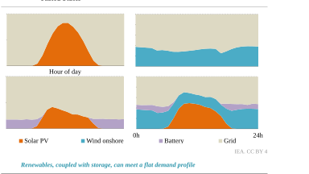Note: The graphs depict four different use cases considering 1.5 GW of solar PV, wind or both, and a 1 GW battery with 4 GWh of storage. 

Hourly matching of the procured electricity supply to the data centre electricity demand is an approach pursued by several large technology companies, but achieving this ambition with variable renewables comes with challenges. Solar PV and wind generation are inherently variable. Solar PV varies across the day and seasons. Wind production is less variable on average but can vary quickly from hour to hour, with extended periods of low or high generation. However, hybrid projects combining solar PV, wind and storage offer a better match to baseload demand, with storage helping to smooth out variable output from 

International Energy Agency | **Energy and AI** 

**82** 

2 

renewables. Solar PV combined with battery storage has the advantage that it can be deployed quickly and provides a more constant supply. Combining solar PV, wind and battery storage results in an even flatter supply (see Figure 2.18). To align with baseload demand on an hourly basis, the installed capacity of renewable sources must be higher than the average demand. 

In order to analyse the ability of solar PV, wind and battery storage to meet baseload demand, a new analysis of over 1 000 use cases covering eight configurations in more than 100 regions was carried out. The regions include European countries, each state of the United States and each province of China. Different procurement strategy configurations were tested, resulting in different combinations of renewable and storage technologies. The remaining portion of electricity demand not covered by renewable sources was assumed to come from the grid at the average industry retail price. The analysis measures the hourly matching of supply and demand, the average cost and the associated CO2 emissions. 

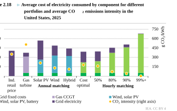**_80% hourly matching low-emissions portfolios are comparable in costs with annual volume matching projects in the United States._** 

Notes: MER = market exchange rate; Ind. = industrial; CCGT = combined-cycle gas turbine. Annual matching = portfolio of wind and/or solar PV optimised to meet 100% of annual demand; 50% hourly matching = portfolio of wind, solar PV and batteries to reach at least 50% hourly matching with demand;  80% hourly matching = to reach at least 80% hourly matching with demand; 90% hourly matching = to reach at least 90% hourly matching with demand; 99%+ hourly matching = to reach at least 99% hourly matching with demand. Assumptions for the industry retail price of electricity are taken from 2023 historical data. Assumptions for gas turbine costs are based on a natural gas price of USD 19/MWh and an 85% capacity factor for CCGT technology with 60% efficiency. Assumptions for capital expenditures and operational expenditures for solar PV, onshore and offshore wind, and battery storage are taken from IEA (2024) for the year 2025. 

**Chapter 2** | Energy for AI 

**83** 

In the “annual match” configuration where solar PV alone is procured to cover 100% of annual demand, the share of hourly demand covered averages about 40% in the United States in most locations (see Figure 2.18). Where onshore wind alone is procured, hourly coverage averages almost 65% but ranges from 55% to 75% depending on the US state. In Europe and China, solar PV alone covers an average of 40%, with a wide range across countries and provinces, and wind alone covers similar shares to the United States. In China the range across provinces is wider for wind alone, ranging from 40% to 80%. 

We assessed the optimal sizing of solar PV, onshore wind and hybrid projects to minimise costs while meeting annual electricity demand in volume (referred to as the “hybrid annual matching” configuration). For hybrid projects that combine wind and solar PV to meet annual electricity demand, the average hourly coverage share is 70%, with a range from 40% to 80% across different states of the United States. In Europe, the share of demand covered by renewables in the hybrid annual matching configuration averages 70% and ranges from 40% to 85% in countries with the best renewable potential. In China, the annual matching configuration for hybrid projects usually covers 65% of baseload demand, ranging from 40% to almost 85% across provinces. 

We also explored the cost optimal configuration of wind, solar PV, battery storage and purchasing of grid electricity. The assessment is based on resource potential and grid electricity costs, without specific constraints on volume or demand coverage. In this “cost optimal” configuration, renewables cover an average of 50% of demand in the United States, ranging from 25% to 70% in the most resource-rich states. 

The last portfolios focused on the optimal sizing of wind, solar PV and battery storage portfolios to achieve a specific target of hourly matching between renewables supply and baseload demand. The analysis finds that ensuring 80% hourly matching of renewable sources with baseload demand is comparable in cost to the annual matching configuration in the United States, with the added benefit of guaranteeing 80% hourly matching with lowemissions sources. This 80% guarantee configuration aligns with the grid retail price in the United States at USD 80 per megawatt hour (MWh) (without including grid fixed costs like connection charges). Achieving nearly full hourly matching with hybrid projects adds a premium to overall costs, over 50% above the grid electricity price for industry in the case of the United States, because of the required additional capacity in both supply and storage. However, a higher share of hourly matching reduces exposure to electricity market price volatility, protecting consumers from high prices. 

Looking across regions, we find several similar results, including that 80% hourly matching portfolios are comparable in cost and even more affordable than annual matching hybrid projects. Annual matching hybrid projects can be more expensive because of their lack of storage and greater reliance on grid electricity. In many countries in Europe and provinces in China, the respective average costs of USD 100/MWh and USD 70/MWh for the “80% hourly matching” configuration are below the 2023 average industry retail electricity price. 

International Energy Agency | **Energy and AI** 

**84** 

2 

The analysis also revealed several regional differences. In the cost optimal configuration for Europe, the share of demand covered by wind, solar PV and battery averages 80%, which is notably higher than for the United States due to a generally more expensive electricity price. In China, the coverage share averages 70% and ranges between 30% and more than 90% in some provinces in the most cost-effective case because of the lower investment costs compared to the United States. When full hourly matching is the target, the cost premium in China is 5% above the 2023 average grid cost. In Europe, 90% hourly matching can be achieved for USD 105/MWh and 99% coverage for less than USD 150/MWh on average (see Figure 2.19). 

**Figure 2.19** ⊳ **Total cost of electricity per unit consumed for hybrid options of wind, solar PV and battery in the United States, Europe and China** 

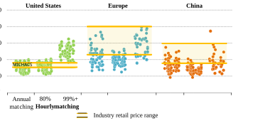**_Hybrid wind, solar PV and battery portfolios can meet 80% of baseload demand at an average cost competitive with industry retail prices in the United States, Europe and China_** 

Notes: MER = market exchange rate. Annual matching = portfolio of wind and solar PV optimised to meet annual volume demand target; 80% hourly matching = portfolio of wind, solar PV and batteries to reach at least 80% hourly matching with demand; 99%+ hourly matching = to reach at least 99% hourly matching with demand _._ Each dot represents a different use case based on the renewable potential of various locations in the United States, Europe and provinces in China. Assumptions for the industry retail price for electricity are taken from the minimum and maximum values across historical data between 2014 and 2023 for each country in Europe, US state and province of China. Assumptions for capital expenditures and operational expenditures for solar PV, onshore and offshore wind, and battery storage are taken from IEA (2024) for the year 2025. 

Constant baseload demand for data centres does not necessarily imply conventional dispatchable power sources. As variable renewables are now cheaper and faster to deploy in many regions compared to other technologies, pairing them with storage can increase their alignment with baseload-type demand. Hybrid portfolios of wind, solar PV and storage can cover a relatively high share of demand on an hourly basis at a competitive price. Aiming for a very high share of hourly matching raises the costs, which can exceed the average 

**Chapter 2** | Energy for AI 

**85** 

industry retail price depending on the region. Compared with conventional annual matching PPAs, hourly matching PPAs with a high share of low-emissions sources provide a higher guarantee of covering electricity demand, reducing CO2 emissions and mitigating the volatility risk associated with electricity prices. The role of renewables should also be analysed at the broader system level to better assess the balance of the variability. 

#### **_2.5.3 Electricity supply in the Base Case_** 

Global electricity generation to supply data centres is projected to grow from 460 TWh in 2024 to over 1 000 TWh in 2030 and 1 300 TWh in 2035 in the Base Case. Renewables meet nearly half of the additional demand to 2030, followed by natural gas and coal, with nuclear starting to play an increasingly important beyond 2030 (Figure 2.20). 

**Figure 2.20** ⊳ **Global electricity generation for data centres and the associated CO2 emissions in the Base Case, 2020-2035** 

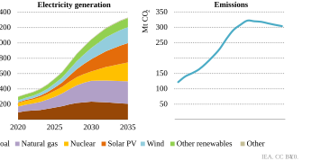**_Between now and 2030, renewables meet nearly half of the increase in global data centre electricity demand, followed closely by natural gas and coal-fired electricity generation_** 

Coal, with a share of about 30%, is the largest source of electricity, though this varies significantly by region, with the highest contribution found in China. Renewables – primarily wind, solar PV and hydro – currently supply about 27% of the electricity consumed by data centres globally. Natural gas is the third-largest source today, meeting 26% of the demand, followed by nuclear with 15%. It should be noted that this analysis considers the fuel mix of the electricity physically consumed by data centres (considering both onsite generation and electricity received through the grid, taking into account the fuel mix of the local electricity systems they are located in) rather than the contractual mix of different data centre operators. 

International Energy Agency | **Energy and AI** 

**86** 

2 

Taken together, renewables remain the fastest-growing source of electricity for data centres, with total generation increasing at an annual average rate of 22% between 2024 and 2030, meeting nearly 50% of the growth in data centre electricity demand. This growth is primarily driven by the rising deployment of wind and solar PV in power systems across the globe, with some of the new capacity financed through PPAs with technology companies. Some data centre operators also invest directly in co-located renewables. Even so, new demand from data centres is a significant near-term driver of growth for natural gas-fired and coal-fired generation, through both higher utilisation of existing assets and new power plants. Natural gas and coal together are expected to meet over 40% of the additional electricity demand from data centres until 2030. After 2030, SMRs enter the mix, providing a source of baseload low-emissions electricity to data centre operators. Currently, hyperscalers are among the key corporate backers of SMR development. Coupled with the ongoing growth of renewable electricity generation, the resulting increase in nuclear electricity generation leads to an absolute decline in coal-fired generation for data centre operations by 2035. Consequently, CO2 emissions from electricity generation for data centres peak at around 320 Mt CO2 by 2030, before entering a shallow decline to around 300 Mt CO2 by 2035. Despite rapid growth, data centres remain a relatively small part of the overall power system, rising from about 1% of global electricity generation today to 3% in 2030, accounting for less than 1% of total global CO2 emissions (see Chapter 5 for more details). 

##### _Regional outlook_ 

The United States and China are by far the largest data centre markets today. In both countries, most of the electricity consumed by data centres is produced from fossil fuels, which also meet most of the increase to 2030. However, the rising deployment of renewables, and later nuclear, is expected to slow the growth of fossil fuel power generation after 2030. 

With a share of over 40%, natural gas is currently the biggest source of electricity for data centres in the **United States** , followed by renewables – mostly solar PV and wind – at 24%, as well as nuclear and coal power with shares of around 20% and 15%, respectively. As demand growth is particularly rapid over the next five years, natural gas is the largest source of additional supply, adding over 130 TWh of annual generation until 2030. Utilities are revising their integrated resource plans, with the construction of additional gas-fired power plants planned across the country, some of them to support the increase in data centre loads (see Box 2.6). Furthermore, some data centre operators are partnering with utilities and energy companies to expand gas-fired capacity, some of it directly co-located with data centres. Renewables are the second-largest source of additional electricity supply, adding 110 TWh to data centre electricity supply between 2024 and 2030. This is mainly due to the continuing increase in the share of wind and solar PV in the electricity mix of most states, as well as some data centre operators investing in co-located renewables. 

Nuclear power plays a significant role in meeting data centre electricity demand in the United States, particularly after 2030 when the first SMRs are expected to be commissioned. 

**Chapter 2** | Energy for AI 

**87** 

Technology companies have plans to finance more than 20 GW of SMRs to date, though successful development of the technology could open up even larger opportunities. Together with the ongoing increase in renewable electricity generation, the expansion of SMRs reduces the need for additional natural gas-fired generation so that by 2035, low-emissions sources account for over 55% of the US data centre electricity supply mix (Figure 2.21). Beyond 2035, the addition of carbon capture to some natural gas-fired power plants is expected to further boost the supply of low-emissions electricity to data centres. 

**Figure 2.21** ⊳ **Electricity generation for data centres in the United States and China in the Base Case, 2020-2035** 

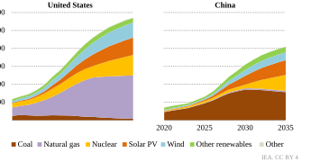**_Natural gas is set to continue to dominate the near-term data centre electricity supply in the United States, with coal predominant in China_** 

In **China** , as data centres are located mostly in the east of the country, their electricity supply is dominated by coal with a share of about 70%, followed by renewables with nearly 20%, nuclear close to 10% and natural gas accounting for the remainder. Between 2024 and 2030 both coal and renewables – mostly solar PV and wind – add about 90 TWh to the data centre electricity supply. The increase in renewables is supported by their rising share in the grid electricity mix, provincial colocation mandates and policies to prioritise the construction of data centres in renewables-rich western China. After 2030, the introduction of SMRs significantly boosts the nuclear share of the data centre electricity mix. Between 2030 and 2035, the rise in renewables and nuclear pushes coal into decline. By 2035, both sources together make up 60% of China’s data centre electricity supply (Figure 2.21). 

In **Europe** , renewables and nuclear are set to supply most of the additional electricity required, with their combined share rising to 85% by 2030. **Japan** and **Korea** together account for about 5% of global data centre electricity demand today, a share they are expected to retain to 2030. Renewables and nuclear are set to provide nearly 60% of the 

International Energy Agency | **Energy and AI** 

**88** 

2 

electricity consumed by data centres in 2030, up from 35% today. The rest of the world is responsible for about 10% of total data centre electricity generation, with **Southeast Asia** and **India** accounting for a significant portion of that. In both regions, coal remains a key pillar of the data centre electricity supply, but renewables are projected to eclipse it by 2035. 

###### **Box 2.6** ⊳ **How are utilities in the United States planning to meet additional electricity demand?** 

Over the course of 2024, many US utilities revised their load growth projections, anticipating a significant increase in electricity demand from data centres, manufacturing and – to a lesser degree – electric vehicles and electric heating. They are seeking to meet this additional demand primarily by building new natural gas-fired power plants and expanding the capacity of low-emissions sources of electricity, most notably wind and solar PV, as well as battery storage to facilitate the integration of variable renewables. In its updated integrated resource plan for North Carolina, Duke Energy, for example, has announced plans to build 7 GW of renewables capacity,  3.6 GW of  natural gas-fired capacity, 1.8 GW of pumped storage hydro and 1.1 GW of battery storage until 2035, while Dominion Energy plans to add 21 GW of low-emissions power generation, including 1.3 GW of SMRs, as well as 5.9 GW of gas-fired capacity and 4.5 GW of battery storage across Virginia and North Carolina until 2039. 

Integrated resource plans are comprehensive, regularly updated plans that utilities employ to outline their generation requirements over periods ranging from 5 to more than 20 years, identifying the necessary resources to meet anticipated demand and ensure reliable service while balancing economic, environmental and regulatory constraints and objectives. They are essential for planning and are mandated by regulatory authorities in 33 states. 

As of Q4 2024, the integrated resource plans of the United States’ utilities call for the installation of an additional 260 GW of wind and solar PV capacity until 2035, 20 GW less than planned at the end of last year. Gas-fired capacity is set to grow by 84 GW over the same period, 32 GW higher than planned at the end of 2023 (RMI, 2025). Utilities cite grid constraints and low reserve margins in several systems, as well as the high reliability needs of data centres, as primary reasons for the renewed dash for gas. 

Modernising and expanding the grid to facilitate the integration of variable renewables and ensure reliability is another key feature of many integrated resource plans. Grid modernisation involves upgrading infrastructure, rolling out smart grid technologies and enhancing cybersecurity measures. The goal is to manage electricity flows efficiently and minimise the risk of outages. 

In the Base Case, the growth in global data centre electricity consumption sees the installation of over 320 GW of additional electricity generating capacity between 2024 and 2035, including around 45 GW of battery storage, nearly 80% of it in the United States and 

**Chapter 2** | Energy for AI 

**89** 

China. Renewables account for nearly two-thirds of this additional capacity. Natural gas-fired capacity also grows, driven primarily by the expansion of natural gas plants to supply data centres in the United States. Gas turbines could also be deployed as a backup power source for large data centres receiving electricity from the grid (Box 2.7). More than half of the additional gas-fired capacity is installed before 2030 to meet immediate electricity needs, while after 2030, growth in nuclear picks up so that, together with renewables, lowemissions sources cover all of the additional demand growth. Nearly 20 GW of new nuclear capacity is commissioned between 2030 and 2035, mostly from SMRs in the United States and China (Figure 2.22). 

**Figure 2.22** ⊳ **Annual average data centre power supply capacity additions by fuel and region in the Base Case, 2024-2030 and 2031-2035** 

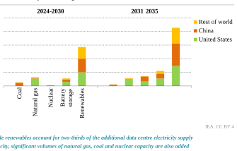###### **Box 2.7** ⊳ **Backup power for data centres** 

Backup power sources for data centres are critical in ensuring uninterrupted operations during power outages. The primary technologies employed include batteries, diesel generators, gas generators and gas turbines. For additional redundancy, data centre operators also usually request a minimum of two lines to connect their facilities to the electricity grid. 

Battery-based uninterruptible power supply systems provide instantaneous power during outages, thereby preventing operational disruptions. They frequently also offer protection against power surges and voltage fluctuations. However, the duration of power supply from these systems is typically limited, ranging from a few minutes to an hour. The system is therefore usually only designed to bridge the time it takes for alternative backup power sources to start up. 

International Energy Agency | **Energy and AI** 

**90** 

2 

Diesel generators can deliver sustained power for extended outages. Their reliability and ability to handle substantial power loads are crucial for data centre operations. However, diesel generators emit pollutants. Additionally, they generate significant noise and require onsite storage of fuel, which can be a constraint in urban environments. 

Gas generators provide a cleaner alternative to diesel, emitting fewer pollutants and generally exhibiting higher fuel efficiency. However, they are dependent on a continuous gas supply, which can be a vulnerability if the supply is disrupted. The initial capital expenditure associated with gas generators is also higher compared with diesel generators. 

Gas turbines are another potential option. They offer a reliable and continuous power source, essential for maintaining operations during prolonged outages. Gas turbines are more efficient and less emissions-intensive than diesel generators. However, the initial investment for gas turbines, which tend to be significantly larger than generators, is substantial, and permitting burdens can be more significant. Their size and the need to combine several units to achieve the necessary reliability required of a backup power source make them suitable only for very large data centres. Just like gas generators, they are reliant on an uninterrupted supply of gas. As start-up times are longer than for gas or diesel engines (around one minute for aeroderivative turbines and five minutes for single-shaft, utility-size gas turbines), the battery backup will need to be sized for longer runtimes accordingly. 

Each backup power technology must be evaluated according to the specific requirements and constraints of the data centre, especially the specified availability levels. A combination of different technologies can enhance the robustness and reliability of backup systems. Section 2.6.3 looks at the possibility of leveraging backup power systems for flexibility. 

#### **_2.5.4 Electricity supply in the sensitivity cases_** 

The sensitivity cases examine the uncertainties surrounding future electricity demand from data centres and the implications for electricity generation over the next five to ten years. Across all cases, renewables play a pivotal role in meeting the growing electricity demand. However, fossil fuels remain important for meeting the near-term surge in demand up to 2030. 

Across all cases, **renewables** meet most of the additional electricity demand from data centres to 2035. In the High Efficiency Case and the Headwinds Case, global data centrerelated electricity generation grows more slowly than in the Base Case. In the High Efficiency Case it rises to about 1 100 TWh by 2035, more than 15% lower than in the Base Case. In the Headwinds Case it reaches 790 TWh, more than 40% lower than in the Base Case. In both of these cases, renewables meet 55% or more of the increase in data centre electricity demand to 2035, compared with around 50% in the Base Case, although in both cases, the increase is smaller in absolute terms. In the Lift-Off Case, where global electricity generation 

**Chapter 2** | Energy for AI 

**91** 

associated with data centres surges to nearly 2 000 TWh by 2035, 45% higher than in the Base Case, around 45% more renewable electricity generation is added between 2024 and 2035, but long grid connection queues mean that most of the additional increase beyond that is met by fossil fuels. 

Across the outlook period, fossil fuels, particularly **coal** and **natural gas** , remain crucial for addressing potential demand spikes (2.24). In the Lift-Off Case, between 2024 and 2030, nearly 50% of the additional electricity generated for data centres comes from fossil fuels. Natural gas-fired power generation grows about 1.5 times faster than in the Base Case, with the United States experiencing the most significant absolute increase. Similarly, coal-fired generation grows twice as fast, with China contributing most of the additional generation. For the period between 2024 and 2035, fossil fuels account for about 35% of the additional electricity consumed by data centres globally. In the High Efficiency Case and the Headwinds Case, fossil fuels respectively supply around 35% and 15% of the additional electricity, as opposed to 28% in the Base Case. The share of fossil fuels in total electricity generation for data centres in 2035 remains at about 40% across all cases. 

**Figure 2.23** ⊳ **Electricity generation for data centres by fuel and case, 2035** 

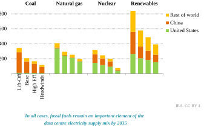Note: High Eff.  = High Efficiency. 

The Base, High Efficiency and Lift-Off Cases all see an increase in the contribution of **nuclear** power to the data centre electricity supply between 2030 and 2035, driven mainly by the commissioning of SMRs in the United States and China, which together account for over 80% of total global nuclear electricity generation for data centres. The share of nuclear in the data centre electricity mix ranges between 16% and 18% in the Base, High Efficiency and Lift-Off Cases. It is only in the Headwinds Case, with its less favourable environment for AI and data centre operators, that these investments do not materialise, and nuclear electricity is 

International Energy Agency | **Energy and AI** 

**92** 

2 

sourced entirely from large-scale reactors connected to the grid, with the nuclear share dropping to about 10% of the data centre electricity supply mix by 2035. 

**Figure 2.24** ⊳ **CO2 emissions associated with electricity generation for data centres by case, 2030 and 2020-2035** 

IEA. CC BY 4.0. 

**_Data centre electricity supply-related CO2 emissions peak at 215 Mt CO2 to 320 Mt CO2 in all cases except the Lift-Off Case, which sees a plateau at around 475 Mt CO2 in the 2030s_** 

In the Base, High Efficiency and Headwinds Cases, CO2 emissions from electricity generation for data centres peak around or before 2030. However, in the Lift-Off Case, which sees significantly higher levels of fossil fuel-based electricity generation, they continue to increase until the early 2030s, peaking at nearly 1.5 times the maximum emissions level of the Base Case. 

In the Headwinds Case, emissions peak earlier than in the Base Case, dropping to about 215 Mt CO2 in 2030. This is primarily due to the lower data centre electricity demand growth. In 2030, CO2 emissions in the High Efficiency Case are around 265 Mt CO2, nearly 20% lower than in the Base Case and roughly 55% of the CO2 emissions of the Lift-Off Case. 

### **2.6 Data centre interactions with the electricity grid** 

#### **_2.6.1 Is there a risk of delays in connecting data centres to the grid?_** 

The global expansion of data centre capacity faces risks from grid connection delays, particularly in regions experiencing high concentrations of demand growth. Connection queues for new data centres can already be long in many key regions (Table 2.4). In recent years, several jurisdictions have placed moratoriums on new data centres while system operators process the backlog of connection requests and assess the capacity of the grid to meet additional connections. 

**Chapter 2** | Energy for AI 

**93** 

**Table 2.4** ⊳ 

###### **Reported connection queues for new data centres in selected jurisdictions** 

|**Jurisdiction**|**Average time in queue**|
|---|---|
|United States|1-3 years|
|North Virginia (United States)|Up to 7 years|
|California (United States)|3 years|
|Germany|Up to 7 years|
|United Kingdom|5-7 years|
|Netherlands|Up to 10 years|
|Kanto (Japan)|More than 5 years|
|Malaysia|Under 3 years|
|Queensland (Australia)|More than 2 years|
|Italy|Under 3 years|
|Spain|3-5 years|
|Ireland|In Dublin, paused until 2030|

Sources: IEA analysis based on energy.gov (United States), datacenterdynamics.com (Virginia, Netherlands, United Kingdom), electricalreview.co.uk (Germany), businesspost.ie (Ireland) and IEA survey results (Australia, Italy, Japan, Malaysia, Spain). 

**Figure 2.25** ⊳ **Transmission grid congestion costs and congestion volumes in selected markets, 2019-2023** 

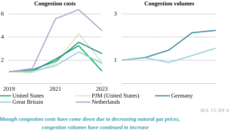Notes: PJM is a regional transmission organisation on the east coast of the United States where congestion costs have trended higher than the national average in recent years. Congestion volumes for the United States and the Netherlands are not available. 

Sources: IEA analysis based on Grid Strategies Transmission Congestion Report (for United States and PJM) Grid Strategies (2024); German Federal Network Agency Monitoring Reports (German) Bundesnetzagentur (2025); National Energy System Operator, Daily Balancing Services Use of System (BSUoS) Cost Data and Constraint breakdown (Great Britain) NESO (n.d.); Tennet Annual Market Update 2023 (Netherlands) Tennet (2024). 

International Energy Agency | **Energy and AI** 

**94** 

2 

Processing grid connection applications more quickly can help reduce waiting times. However, the problem is not solely bureaucratic: when power grids are congested, even priority applications cannot be approved. As seen in Figure 2.25, grid congestion is becoming worse in many countries. In Germany, the United States and Great Britain, the costs of managing congestion tripled between 2019 and 2022. In the Netherlands, the costs increased sixfold during the same period. In 2023, congestion costs went down because natural gas became cheaper. However, data from Germany and Great Britain reveal that physical grid congestion volumes have continued to increase year on year, highlighting the growing pressure on existing infrastructure. 

While grid congestion remains a significant challenge, it is not the only bottleneck hampering connection applications. Suboptimal connection and queue management processes contribute substantially to delays. For instance, Great Britain’s enormous connection queue contains numerous generation projects that are not progressing, prompting reforms to queue management. Additionally, system operators often lack sufficient resources, and the industry faces a shortage of skilled labour to deliver connections. 

**Figure 2.26** ⊳ **Change in transformer backlog, transformer price index and grid infrastructure lead times** 

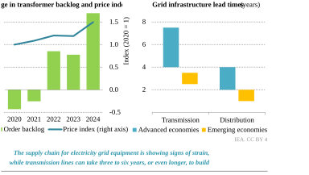Mitigating grid congestion is challenged by the long lead times for new transmission projects. Building new transmission lines can take four to eight years in advanced economies and two to four years in emerging economies. This is not just a problem of permitting and construction; supply chains for grid equipment are also showing strain. Order backlogs for transformers grew by more than 30% in 2024, after two years of growth above 15%. Reflecting this, the price index for power transformers has increased by 1.5 times since 2020 

**Chapter 2** | Energy for AI 

**95** 

(Figure 2.26). Chapter 5 looks in more detail at the security implications of supply chains for grid infrastructure. 

To understand the extent to which data centres might face connection delays, we examined the current congestion levels, grid policies and connection timelines. Based on a locationspecific analysis of upcoming data centres, we developed different scenarios for the possible number of data centres that may be delayed in connecting to the grid. Our analysis reveals that grid constraints could delay around 20% of the global data centre capacity planned for construction by 2030. This raises the question of what can be done to ensure that data centres come online in a timely way and that the electricity system does not create a critical bottleneck in this regard. 

**Figure 2.27** ⊳ **Global data centre capacity in the Base Case and capacity at risk of connection delay due to grid constraints, 2025-2030** 

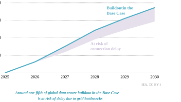#### **_2.6.2 Data centre locational flexibility_** 

One critical option to avoid grid constraints is to locate data centres in places with adequate grid and generation capacity. However, up until now, the dominant trend observed in the siting of data centres has been for them to cluster around markets and within geographies that have the requisite infrastructure, policy frameworks and workforces. As a result, gigawatt-scale clusters have emerged in specific regions in North America, Europe and Asia Pacific, in some cases creating issues for grid congestion. Concerns around power availability and increasing prices have led utilities and policy makers to consider temporary moratoriums on development, with notable examples implemented in cities like Amsterdam, Dublin, Santa Clara in California and Singapore. 

International Energy Agency | **Energy and AI** 

**96** 

2 

While key siting parameters vary depending on the type of data centre, the general criteria are reliable power supplies, competitive electricity prices, sufficient connection capacity and access to land, in addition to access to the core broadband transmission network, skilled construction and operation workforces, as well as favourable policy frameworks. Data sovereignty is also an important consideration. The saturation of established data centre markets is shifting development towards new geographies. Siting considerations also differ between different kinds of data centre workloads. AI training and some kinds of inference are less sensitive to latency than traditional workloads, creating the potential to site data centres in locations with better access to grid and generation capacity but not necessarily near data centre users. 

However, the existing infrastructure, policy frameworks and talent pools that enabled the top markets to flourish have created momentum that continues to draw development and justify investment in the expansion of supporting infrastructure. As a result, more than 15% of data centre capacity under development globally falls within the top ten largest data centre markets by installed capacity, indicating the continued attractiveness of these hubs (Figure 2.28). Northern Virginia in particular illustrates how the convergence of these factors can lead to a boom in data centre development (Box 2.8). 

**Figure 2.28** ⊳ **Top ten data centre markets by installed capacity versus share of capacity under development, 2024** 

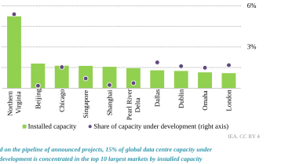Notes: The Pearl River Delta encompasses the combined capacity of Guangzhou, Shenzhen and Hong Kong, China. The geographies considered represent the ten largest clusters in the world. Capacity under development is based on announced projects. 

Source: IEA analysis based on data from OMDIA (2025). 

**Chapter 2** | Energy for AI 

**97** 

There is some evidence of a shift in data centre locations in the United States, although established hubs are attracting the majority of the capacity under development (Figure 2.29). Las Vegas in Nevada and El Paso in Texas provide examples of this emerging trend. Together, these locations have less than 500 MW of installed capacity today, but developers have announced large-scale developments in both locations due to their affordable land, cheap renewable power and tax incentives for data centre development. Nevertheless, half of the capacity under development in the United States is being built in markets with over 1 GW of installed capacity. 

**Figure 2.29** ⊳ **Data centre hubs by installed capacity and capacity under development in the continental United States, 2024** 

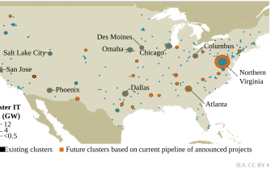**_Data centre development is expanding into new locations, but around 50% of the capacity under development in the United States is in markets with over 1 GW of installed capacity_** 

Notes: We define a data centre cluster as a group of data centres located within 100 kilometres of each other. The ten largest clusters have been named. Only future clusters greater than 500 MW are shown. Source: IEA analysis based on data from OMDIA (2025). 

Conversely, demand growth in saturated markets is being cited as justification for investment to expand generation and transmission capacity. Building this capacity quickly enough to meet the rapid growth projections poses a challenge. While electrical utilities have an obligation to meet the demand within their service territories, they are not required to provide service immediately upon request and may delay data centres’ grid connections until enough generation and transmission capacity is available. 

International Energy Agency | **Energy and AI** 

**98** 

**Box 2.8** ⊳ **Why does Northen Virginia dominate the data centre market?** 

2 

Loudoun and Prince William Counties in Northern Virginia, both within the Washington, DC metropolitan area, are together the world’s largest and fastest-growing data centre market by far, with over 5 GW of installed capacity and more than 3 GW under development. Installed capacity in the region – commonly referred to as “Data Centre Alley” – has grown more than 500% over the past ten years (Magnum Economics, 2024). 

The region’s rise is a recent development that illustrates the fast-moving dynamics of the data centre market. The area only became the top market by installed capacity in 2016, and installed capacity proceeded to grow 20% annually (Magnum Economics, 2024). While the region’s central role in the early stages of the Internet’s development gave it a head start as a key data centre hub, its growth can largely be attributed to the region’s favourable policy environment, affordable power and highly skilled workforce. 

Northern Virginia’s selection as one of the four original Network Access Points during the commercialisation of the Internet in the 1990s led it to become a major intersection of the fibre optic backbone network. Following the loss of a USD 1 billion data centre project to neighbouring North Carolina in 2009, Virginia significantly expanded its tax exemption for the sale and use of data centre equipment, and the Virginia General Assembly recently extended these incentives to 2035. Streamlining the municipal government’s approval process in co-ordination with electric utilities’ proactive capacity planning has been instrumental to accommodating the sector’s growth (JLARC, 2024). 

Data centres’ long-term PPAs have supported the buildout of over 6 GW of solar power capacity in the state, and their growing demand has been cited as a key motivation behind the development of the Coastal Virginia Offshore Wind project, the largest offshore wind project in the United States. The high concentration of data centres has also supported the development of a highly skilled workforce with expertise in data centre construction and operation. With over 500 colleges and universities in the Mid-Atlantic region, including many of the world’s highest-ranked institutions, local collaborations have emerged between data centre operators and academic institutions to offer scholarships and align academic curricula with the evolving needs of data centre operations. 

While the jobs and tax revenue that data centres provide generally result in a positive net impact for local communities, they are large industrial facilities that can significantly affect their surroundings, and there is growing public opposition to further development stemming from concerns about declining property values due to their visual impact as well as the constant noise from cooling units and backup generators. 

**Chapter 2** | Energy for AI 

**99** 

#### **_2.6.3 Data centre operational flexibility_** 

Data centres are emerging as major players in the energy system. In the United States, the country with the largest buildout of data centres, their share of system-wide peak electricity demand is set to increase from 6% today to 13% by 2030. As data centres take on a larger role in electricity systems, ensuring their smart integration becomes critical, both to enhance grid stability and support their continued deployment. 

In capacity-constrained regions, connection queues have led data centre operators to explore flexibility measures to shorten lead times for grid access. Grid congestion or insufficient generating capacity restricts the addition of new loads, but such constraints usually occur during a limited number of hours every year. In this context, electricity system flexibility will be critical to cater for growing demand and integrate increasingly variable sources of supply and demand. This section focuses on possible flexibility contributions from data centres within broader efforts to enhance electricity system flexibility from storage, other kinds of demand response, grids and dispatchable resources. 

**Figure 2.30** ⊳ **Data centre capacity additions to 2035 and feasible integration into the current electricity system under different flexibility cases** 

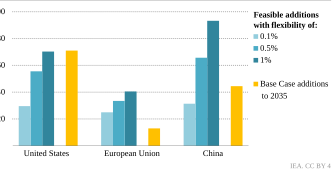**_Current electricity systems can already integrate all data centre additions to 2035 if a mix of backup activation and workload management reduces grid demand 1% of the time_** 

Note: Capacity additions are considered feasible if their operation does not increase system peak demand, measured as the top 100 hours over ten years of weather conditions. Base Case additions include colocation, service provider and hyperscale data centres. 

Our analysis finds that if data centres are flexible for 0.1-1% of the time, there is enough room in current electricity systems to integrate all new data centre capacities to 2035 (Figure 2.30). In the United States, up to 70 GW of new data centre capacity could be integrated within the current system if operators reduce grid demand for just 1% of the time – enough to cover all colocation, service provider and hyperscale additions in the Base Case. 

International Energy Agency | **Energy and AI** 

**100** 

2 

In China, data centre additions would need to be flexible for 0.2% of the time to fit within the existing system capacity, the equivalent of 20 hours per year on average.3 Other studies find similar headroom in existing electricity systems, with flexibility rates below 1% (Nicholas Institute for Energy, Environment & Sustainability, 2025). 

These episodes of grid stress would be short, lasting between three to five hours on average. They align with existing peak periods, occurring for a few hours in the evening or during the day, usually prompted by regional heat or cold waves. Even during these episodes of stress on the electricity system, the grid can still supply some electricity to the data centre. In 80% of the hours of grid stress, more than half of the usual grid electricity supply to the data centre would still be available. In 50% of these hours, around four-fifths of the grid capacity would be available. In other words, even if the data centre is flexible for 1% of the hours of the year, only 0.3% of its total grid electricity consumption would need to be actively managed. 

Although needed for only a limited number of hours each year, providing this degree of flexibility would still require solutions not developed at scale today. These include higher utilisation of onsite generation, the installation of additional batteries and the management of computational workloads. 

In this context, there is a growing focus on understanding the potential for data centre flexibility. In 2024, the Electric Power Research Institute launched the DCFlex initiative to develop large-scale flexibility hubs, demonstrating innovative grid integration strategies for data centres. The initiative fosters strategic collaboration between utilities, data centre operators and policy makers. Earlier that year, the US Department of Energy published recommendations on powering data centres, advocating the development of a flexibility taxonomy and framework to explore financial incentives and policy changes that could drive more flexible operations. In the European Union, data centres fall under the scope of the Energy Performance of Buildings Directive, which mandates the installation of building automation and control systems. This requirement aims to enhance grid compatibility, enabling data centres to better respond to external grid signals and support flexibility markets. 

Several strategies exist to develop data centre flexibility (Table 2.5). While some of these imply additional investment, recent surveys indicate that most hyperscalers and data centre developers are willing to pay more if they can access grid capacity faster. 

Onsite batteries are a relevant flexibility option given the short duration of stress events. Batteries do not need to match the full capacity of the data centre; in most stress hours, more than half of the grid capacity remains available to the facility. The trade-off between battery cost and the facilitated grid connection could be improved if batteries are also operated for arbitrage in electricity markets. However, developers note that revenues from 

> 3 This analysis does not mean that grid reinforcement or new peak capacities are unnecessary to meet medium-term growth but rather shows how flexible loads can tap the existing potential and reduce connection times. 

**Chapter 2** | Energy for AI 

**101** 

flexibility services remain modest compared to the overall operating costs (though faster grid access can help avoid high opportunity costs). 

**Table 2.5** ⊳ **Options for data centre flexibility** 

|**Category**|**Description**|**Example**|
|---|---|---|
|Onsite batteries|Balancing energy supply during peak demand and providing backup power to the data centre. Batteries can also contribute to grid stability.|• Google installed onsite batteries (2.75 MW/5.5 MWh) at its data centre campus in Belgium. • A Microsoft data centre in Dublin employs batteries as part of its uninterruptible power supply system to provide backup power and assist in balancing grid frequency.|
|Backup generation|Running backup generators during grid stress events to reduce reliance on the grid.|• Enchanted Rockis developing a natural gas plant for a Microsoft data centre in California. • American Electric Power secured an agreement to purchase up to 1 GW of Bloom Energy’s solid oxide fuel cells.*|
|Cooling|Adjusting cooling load temporarily to optimise energy use, including using “cold batteries”, such as thermal storage.|• CIV France in Lille utilises a 50 m³ ice storage system, equivalent to a 700 kW chiller, capable of operating for 30 minutes. • The Tidel Park facility in India employs ice- based energy storage to manage its cooling load|
|Workload temporal management|Shifting computational tasks to times of lower grid demand or higher renewable generation availability.|• Google deployed a “carbon-aware” scheduling system to shift workloads to times when renewable energy is abundant.|
|Workload spatial management|Moving computing tasks between geographically distributed data centres to optimise energy costs, availability and sustainability.|• Google is piloting programmes to dynamically shift workloads to locations with cleaner energy sources.|

* In this use case, fuel cells are purchased as a power source to run as base load. Other fuel cell configurations could provide flexibility. 

Note: GW = gigawatt; kW = kilowatt; MW = megawatt; MWh = megawatt hour; m³ = cubic metre. 

Backup generation is typically already installed to cover grid outages. If utilised for flexibility purposes, runtimes would increase and data centres should prioritise low-emissions fuels, such as biofuels, natural or renewable gas, or low-emissions technologies such as fuel cells. However, this requires addressing complex challenges related to fuel availability and storage. While backup generators could offer a convenient flexibility solution, they are not designed to function as power plants and are usually subject to regulations regarding noise and air pollution. Currently, backup power is likely to provide only limited scope to increase data centre flexibility. 

Cooling accounts for between 10% and 30% of a data centre’s load. When paired with thermal storage that has a few hours of capacity, the data centre can reduce its real-time consumption for cooling and shift it to off-peak hours. 

International Energy Agency | **Energy and AI** 

**102** 

2 

Additionally, workloads can be shifted over time and across data centres. Virtualisation allows scheduling based on grid conditions, prioritising times or locations with lower congestion. This flexibility is particularly beneficial for AI training and some kinds of AI inference that are not sensitive to latency. However, any such scheduling needs to balance the financial goal of maximising GPU utilisation rates (Box 2.9). This flexibility option does not apply equally across all data centres, with those hosting third-party applications having lower control over their workloads. 

Such workload management strategies are still in their infancy, but the industry does have some experience with analogous practices. For example, when they face low utilisation rates, Microsoft, Amazon and Google offer spare capacity at discounts of up to 90%, in exchange for the flexibility of interruptibility without notice. Shifting workloads across European data centres increases video call latency by only 10%, a negligible impact for most applications (Kelly, et al., 2016). Moreover, studies suggest that 30-50% of workloads are delay tolerant, a figure likely to rise with the uptake of AI training and inference (BNEF, 2021). 

**Figure 2.31** ⊳ **Technical daily flexibility potential from data centres,** 

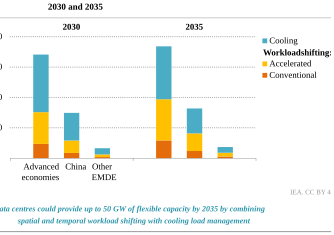Note: EMDE = emerging market and developing economies. 

In addition to providing peak shaving services, in the future, data centres may be able to provide more frequent flexibility services to support the integration of variable renewables, for example. Our analysis finds that around 50 GW of data centre capacity could have the potential for flexibility by 2035, assuming that 25% of accelerated workloads could be spatially or temporally shifted during daily demand peaks, and 10% of conventional workloads (Figure 2.31). One-third of the flexible capacity would come from the scheduling of workloads on accelerated servers. Cooling contributes to around 25 GW of flexibility, and 

**Chapter 2** | Energy for AI 

**103** 

its share decreases over time as PUE ratios improve. In advanced economies in 2030, data centre flexibility potential is equivalent to the average charging load from the electric car fleet. Incentivising data centre flexibility can contribute to both system security and renewables integration. 

Policy makers need to develop innovative frameworks to incentivise flexibility. While the value of these strategies for data centre developers lies in accessing capacity more quickly, clear rules on engagement are necessary for participation in flexibility programmes. Further developing data centre flexibility requires stronger integration between grid operators and data centres, including early communication on upcoming stress events and proactive workload planning, particularly for tasks like AI training. Developing a playbook to incentivise more flexibility from data centres will require a better understanding of the economic, operational and contractual constraints that data centres face (Box 2.9). 

###### **Box 2.9** ⊳ **How much does flexibility cost for accelerated servers?** 

AI workloads may not be as constrained by latency issues as traditional workloads, and some AI workloads can be scheduled in advance (for instance, AI training). However, they run on accelerated servers that are very capital intensive – investment costs can reach USD 30 000/kW, around ten times higher than an aluminium smelter and 50 times higher than an air conditioner. Data centre operators are therefore incentivised to maximise their server utilisation rate and run their servers at near-full capacity whenever possible. In this context, any curtailment of workloads carries an opportunity cost, as it would reduce overall utilisation. 

While the utilisation rate of accelerated servers is much higher than conventional servers, reaching around 90%, some capacity remains unused. Where spare capacity already exists, the headroom could present an opportunity to redistribute workloads across time and space at no additional opportunity cost. However, specifically overbuilding the capacity of accelerated servers in order to offer flexibility services would have high additional costs. Given the high cost of accelerated servers, we estimate that overbuilding data centre capacity and rescheduling workloads would entail an additional cost of approximately USD 700/MWh of energy consumption shifted (Figure 2.32). 

While this cost is prohibitive for daily electricity market arbitrage, it aligns with the economics of specific flexibility events in certain markets. For example, in Texas, electricity prices have consistently exceeded USD 700/MWh at some point in each of the past seven years, with more than 50 hours higher than this threshold in most years. 

A comparable investment in battery storage designed for similar flexibility events – operating for around 50 hours annually – would incur similar capital costs per unit of energy shifted. However, batteries typically cycle more frequently, for instance aligning with solar PV generation patterns. Assuming around 300 cycles per year, the effective cost per MWh falls below USD 100. 

International Energy Agency | **Energy and AI** 

**104** 

2 

From a theoretical economic perspective, the feasibility of data centre operational flexibility depends on the actual opportunity cost of changing the utilisation patterns of extremely capital-intensive equipment. However, there are additional operational and contractual constraints, such as the need to reserve capacity for unpredictable but already contracted workloads. 

**Figure 2.32** ⊳ **Flexibility activation cost of selected technologies and electricity prices in Texas** 

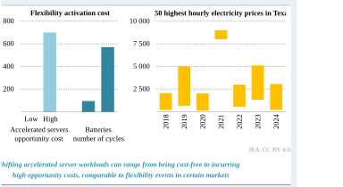Notes: The low and high opportunity costs of accelerated servers reflect, respectively, the spare capacity and the need for additional investment to create sufficient headroom. Battery low and high costs are computed, respectively, for 300 and 50 cycles a year. Electricity prices are for the Texas, Houston area. 

#### **_2.6.4 Optimising interactions with power system operators and planners_** 

Mitigating congestion and the long connection queues in some regions, as discussed previously, requires an understanding of the interactions between data centres and system operators. Data centres engage with system operators and planners throughout deployment and operation, starting with grid connection applications. Key considerations for grid operators include infrastructure upgrade cost recovery and allocation. Once operational, the interactions of data centres with the grid and their potential impacts on its stability become essential (Box 2.10). 

_Grid connection applications and waiting queues_ 

Several solutions can reduce waiting times in grid connection queues, with clarifying the connection pipeline being a critical approach. Amid uncertainty on connection timelines, some data centres submit duplicate and speculative connection requests, artificially inflating queue lengths. The situation is compounded by the scarcity of grid capacity and lack of clear 

**Chapter 2** | Energy for AI 

**105** 

connection timelines at a time when an increasing number of connection requests are being made by various other projects, such as renewables and batteries. 

In some regions, waiting periods for data centre connection have extended to a decade. While viable projects risk delays as a result, grid operators also risk overbuilding capacity for projects that may never materialise. Implementing stronger verification requirements, milestone-based progression systems and improved application tracking would help operators identify duplications. This approach would provide planners with a more accurate assessment of genuine demand, reducing pressure to build for theoretical peak loads that substantially exceed realistic needs. By requiring more substantive evidence of commitment, operators can establish a more efficient connection pipeline that properly aligns with actual growth patterns. A structured capacity commitment framework can achieve this by requiring long-term contracts between data centre projects and utilities, payments for a minimum percentage of contracted capacity and financial assurances. Contracts can include provisions for phased capacity ramp-ups, cost-recovery mechanisms and penalties for early termination or significant capacity reductions (American Electric Power, 2025). 

Transmission system operators can also alleviate the issue of large connection queues due to limited grid capacity by implementing incentive structures that encourage data centres to be built in areas without grid congestion. Transparency between grid operators and prospective customers plays a critical role in grid optimisation, such as providing maps to visualise the hosting capacity of transmission lines for large loads to identify the most favourable connection point. Optimising the location of data centres is described in section 2.6.2. 

System planners plan for grid investments according to comprehensive electricity load forecasts. In a situation where various data centre projects in the connection queue do not materialise due to speculative and duplicate applications, the planners may be at risk of overestimating demand and overbuilding capacity, incurring additional costs. The European Union Agency for the Cooperation of Energy Regulators reported in their 2024 Monitoring Report (ACER, 2024), for a general case, that a 10% overestimation of demand leads to a 10% rise in total grid costs. At the same time, such costs could be highly location specific. If the predicted data centre load does not materialise, the costs and risks of these grid investments are often socialised across other ratepayers. The way that these costs are managed can have distributive impacts if costs are recuperated through increased utility bills for all customers in an area, including residents and small businesses, disproportionally affecting low-income households. 

Typically, when a transmission system operator connects a data centre to the grid, the data centre pays for the high-voltage line to make the connection. If infrastructure upgrades are needed within the broader grid to manage increased electricity demand, grid operators in Western Europe and the United States usually recover these costs through electricity tariffs applied to all customers (ENTSO-E, 2022; CRS, 2023). However, US regulators are shifting towards data centres bearing more of the upgrade costs directly (Utility Dive, 2024). Once a capacity request is accepted, that capacity is contractually reserved for the customer and 

International Energy Agency | **Energy and AI** 

**106** 

2 

cannot be sold to new customers, even if it is unused (Mytton, et al., 2023). In areas with limited grid capacity, unused reserved power for data centres can restrict availability for other projects, contributing to longer connection waiting times. 

###### **Box 2.10** ⊳ **Potential technical impacts of data centres on grids during operation** 

There have been reports that data centres may affect power quality on the grid. According to a survey conducted by the Electric Power Research Institute, utilities, primarily in North America, have experienced operational impacts from existing data centres (EPRI, 2024). Among the 23 respondents, the reported issues included thermal violations (22%), voltage violations (17%), harmonic concerns (9%), fault ride-through issues (9%), ramp rate issues (26%) and rapid variations causing forced oscillations (4%). Two utilities reported experiencing harmonic concerns, thermal violations, voltage violations and ramp rate issues, while two others reported both thermal violations and voltage violations. The phenomenon of data centres possibly being associated with harmonic distortion is also mentioned in various other sources (Bloomberg, 2024). 

In addition to the above-mentioned impacts, the potential for data centre load loss can be a challenge for power grid operators and planners, especially as data centre power capacities become larger. A power grid disturbance may prompt a data centre to switch to backup power (employing an uninterruptible power supply, for example), which removes a large amount of load from the grid. This may in turn cause changes in the grid voltage or frequency, which may be exacerbated if multiple data centres shift load simultaneously. This essentially initiates a short feedback loop whereby a grid disturbance prompts a reaction from a data centre, which in turn results in another grid disturbance. In an incident review, the North American Electric Reliability Corporation documented the impact of simultaneous data centre load loss following a fault on a transmission line in the Eastern Interconnection (NERC, 2025). 

The reconnection of large data centre loads also poses potential risks to system stability if not managed in a controlled manner. Balancing authorities and transmission system operators face significant challenges in maintaining system balance during these reconnections, as ramp rates for load are just as critical as those for generation. Reliability risks associated with the voltage ride-through characteristics of data centre loads are particularly important, though this is not unique to data centres and is also relevant for other large loads. 

AI workloads potentially present unique challenges for power grid operators due to their distinct characteristics at different operational stages: training and inference. Training demands high GPU utilisation, leading to sustained high power consumption with periodic surges and dips from data loading, preprocessing and checkpointing. Inference, while generally less power intensive, can cause rapid fluctuations in demand based on user interactions and external events. Installing onsite power-smoothing technologies is a relevant option to cope with these challenges (Li, et al., 2024). 

**Chapter 2** | Energy for AI 

**107** 

_Chapter 3_ 

### **AI for energy optimisation** 

Applications in today’s energy system 

**~~<mark>S U M M A R Y</mark>~~** 

- The energy system is complex and evolving. It is becoming increasingly electrified, digitalised, connected and decentralised, with mounting cost pressures. These drivers have encouraged energy companies to deploy applications that utilise artificial intelligence (AI) to optimise systems, improve production, reduce costs, raise efficiency, cut emissions and enhance safety. In this chapter, we estimate the sectorwide impacts of _known_ AI applications on a range of optimisations in a Widespread Adoption Case, to explore the impacts of optimistic uptake of AI in the energy sector. 

- Oil and gas companies have been among the earliest adopters of new technologies to boost exploration and production. The number of supercomputers deployed in the sector has doubled since 2010 and total computing capacity has grown at almost 70% annually. In the Widespread Adoption Case, AI could reduce costs in oilfield development and operations, potentially improving the affordability of fuels, but it could also have broader ramifications, including increased emissions. 

- AI could also have a major impact in electricity systems owing to the complexity of supply, transmission and demand profiles. In the Widespread Adoption Case, the application of AI in power plant operations and maintenance yields potential cost savings of up to USD 110 billion annually by 2035 from avoided fuels and lower costs. AI also enables greater integration of renewable electricity into the grid. 

- The applications of AI in end-use sectors are varied but have significant potential. In industry, AI is being used to optimise production processes. In the Widespread Adoption Case, energy savings of around 8% could be achieved by 2035 in light industry, such as the manufacturing of electronics or machinery. AI in transport can enhance vehicle operation and management, which could cut energy consumption by up to 20%; it also has applications in reducing contrails and improving electric vehicle ranges. In buildings, the potential is limited by the rate of digitalisation, but there are compelling illustrations of impact, such as on efficiency and demand response. 

- Accurate weather forecasts and analysis of changing weather patterns in a warming world are essential to optimise the operation, planning and resilience of energy systems. AI has been improving the accuracy of weather forecasts and also reducing computational demand. 

- The adoption of such AI applications at a sector-wide level, however, is not a given. Various barriers are limiting the extent to which existing AI applications can be implemented, hindering the pace of change. These include unfavourable regulation, lack of access to data, inaccessibility, interoperability concerns, critical gaps in skills, the paucity of digital infrastructure and, in some cases, a general resistance to change. 

**Chapter 3** | AI for energy optimisation 

**109** 

### **3.1 Introduction** 

Artificial intelligence (AI) is being deployed across various parts of the global energy system, where AI applications are suited to meeting a wide variety of objectives, including cutting costs, integrating a growing share of variable renewables, making systems more efficient, enhancing fuel supply, ensuring timely maintenance of infrastructure and reducing emissions. This chapter focuses on where AI is being used, and could be used, to optimise or accelerate the deployment of _existing_ technologies and processes used in the energy system. Chapter 4 examines the use of AI in the innovation process for _novel_ technologies. 

The energy system is highly complex, with multiple sources of energy following a web of flows and transformations to many end-uses. AI thrives on complexity like this, identifying patterns that can be leveraged to improve efficiencies. It is already having an impact on the energy sector but only in a limited, nascent way. Alongside greater electrification and digitalisation, AI is well placed to support a more resilient, affordable and sustainable energy future. 

**Figure 3.1** ⊳ **Energy supply, transformation and end-use, 2024** 

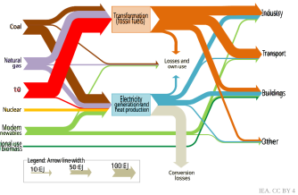**_The global energy system is large and complex; fossil fuels still dominate primary energy supply, but their share is set to decline, while in end-uses the role of electricity is growing_** 

The energy system can be understood in three broad parts: 

- **Primary energy supply** includes the extraction or mining of energy resources. 

- **Transformation and transmission** refers to the processing of primary energy sources into appropriate forms, such as the generation of electricity or the refining of crude oil, together with their transportation to consumers. 

International Energy Agency | **Energy and AI** 

**110** 

3 

- **End-use consumption** represents the final consumption of energy for a desired outcome by consumers, such as to run a vehicle, heat something in a factory or cool a building. We categorise the end-use sectors as industry, transport, buildings and other. 

Within each of these stages lie many applications, processes and techniques, each with its own set of challenges and opportunities for greater efficiency, security and sustainability. 

In this chapter, we explore AI applications for energy resources (oil and gas, and mineral mining), electricity generation networks, and the end-use sectors of industry, transport and buildings. The chapter also discusses AI applications in weather forecasting and climate science and adopts a novel approach to understanding the broader sector-wide impacts of AI towards a wide range of optimisations. This approach is discussed in Box 3.1. 

###### **Box 3.1** ⊳ **Methodology adopted to assess AI’s impact on the energy sector** 

Many of the desired goals of AI’s application in the energy sector – such as cost reductions, enhanced reliability and improved resilience – are challenging to quantify at a broader sectoral level, beyond the confines of individual case studies. It is also challenging to predict the nature, adoption and impact of AI applications that might emerge in the future. 

Given these limitations, this chapter introduces a new **Widespread Adoption Case** , which explores the impact that _known_ AI applications could have at the sectoral level by 2035, assuming the widespread adoption of the application or technology. This case hinges on three considerations: 

- The Widespread Adoption Case considers only existing AI-led interventions informed by real-world case studies that can be scaled to the sectoral level. 

- It assumes that many of the existing barriers to the sector-wide adoption of these AI-led interventions (such as limited data availability and a lack of interoperability standards) are overcome. 

- It stops short of considering the full theoretical potential of AI-led interventions, as it factors in certain insurmountable structural issues that would block their complete adoption. For example, we consider variations in adoption by region by factoring in the availability of enabling digital infrastructure. 

Importantly, it is not a given that the Widespread Adoption Case will be achieved. Existing barriers, such as constraints on access to data and a lack of digital infrastructure and skills (discussed further in section 3.7), will continue to prevent widespread adoption in the absence of regulatory changes and incentives. Therefore, the Widespread Adoption Case is an ambitious pathway for the uptake of existing AI applications. 

Note also that for the purpose of this analysis, we do not consider the impact of rebound effects. This issue is discussed further in Chapter 5, section 5.8. We also do not consider futuristic applications or interventions of AI in the sector, as their impacts are unknown. 

**Chapter 3** | AI for energy optimisation 

**111** 

### **3.2 The role of AI in the energy system** 

The energy sector is in a constant state of flux. The energy system is currently seeing rapid change that creates new challenges and opportunities – many of which are well suited to AI applications. The key trends in the energy sector include: 

- **Rising electrification:** The overall share of total final energy consumption met by electricity has been steadily rising and is projected to accelerate. 

- **Growing digitalisation:** Energy systems are becoming more digitalised and integrated through the proliferation of connected devices and appliances, electric vehicles (EVs), smart meters, and smart sensors in industrial and commercial applications. 

- **Rising complexity:** The evolution of the energy system is resulting in greater complexity in supply, demand and energy flow patterns. On the supply side, electricity generation from variable sources, such as wind and solar, is growing fast. Generation is also becoming more distributed as smaller and more dispersed generation sources, such as rooftop solar, grow. On the consumption side, the number of connected appliances, vehicles and industrial facilities has been increasing. The result is a rise in the number of elements to manage both on the supply side and the demand side (Figure 3.2). 

- **Pressure on costs:** The last few years have been challenging for energy consumers around the world, with high energy prices putting significant pressure on the cost of living. With new entrants in the market on both the supply and end-use sides, the energy sector has also become more competitive. These factors have been placing pressure on corporate finances, encouraging companies to find new ways to increase efficiencies and reduce costs. 

In addition to these structural trends, the energy sector is subject to several important policy objectives. International targets aim to make the energy sector more efficient and sustainable. The energy sector is the largest source of greenhouse gas emissions, which cause climate change. Energy sector emissions have continued to rise, reaching 37.8 gigatonnes of carbon dioxide (Gt CO2) in 2024 – the hottest year on record (with 2023 the second hottest). Energy also needs to be reliable, affordable, secure and resilient. These imperatives have been cast into sharp focus by the energy market turmoil of recent years. 

AI can help advance progress on these critical challenges, but its successful deployment is likely to depend on several key criteria. Typically, for AI applications to be deployed, they require the availability of digital infrastructure and skills. Widespread use of sensors, analytics and control systems allows for the collection of the extensive datasets that AI needs, with increased scope for automation. Where advanced software systems are already in place, AI capabilities can be rapidly deployed – but this is often inconsistent with the slow turnover of capital equipment in the energy sector. 

The deployment of AI to solve energy challenges will also depend in part on the alignment of incentives. Uptake is likely to be strongest where the use of AI is in line with motives like 

International Energy Agency | **Energy and AI** 

**112** 

3 

finding or harnessing more resources, reducing operational costs, cutting emissions, increasing resilience and boosting safety. 

**Figure 3.2** ⊳ **Shares of renewable power and electrification, and number of connected devices** 

**_The energy system is electrifying and becoming more complex as renewable sources grow; the number of connected devices is set to double from 2024 to 2030_** 

Notes: Wind and solar show the share of global power generation; electrification shows the share of total final energy consumption that comprises electricity; pathway based on a scenario guided by today’s policy settings. Connected devices shows the global stock of network-connected automation appliances. 

Source: IEA 4E EDNA Total Energy Model V2.0 for Connected Devices (right graph). 

The technological capabilities of AI continue to evolve. Currently, applications excel at learning from large and complex systems and applying their learnings to improve those systems (such as finding new resources) or enhance the control of them (such as daily operations). The system-wide, holistic aspect of these strengths suggests that AI applications will be most beneficial where implemented at scale, for example in interconnected power grids, large industrial facilities and commercial buildings. By contrast, for smaller, older assets with limited digital connections – such as many individual vehicles or residential homes – the role of AI may be more indirect or limited. 

The range of potential applications of AI in the energy sector as surveyed in this chapter is broad (Table 3.1). At the simplest level, these applications can be summarised into two types: those that help to identify resources and design, plan and build facilities, and those that help to optimise, refine and automate the operation of energy systems. These can be applicable across the broad sweep of the energy sector – from identifying and harnessing resources, including fossil fuels and critical minerals for energy technologies, to the generation, transmission and distribution of electrical power and the use of energy in the buildings, industry and transport sectors. Indeed, many applications of AI have the potential to be 

**Chapter 3** | AI for energy optimisation 

**113** 

deployed across multiple sectors: for example, AI-enhanced digital twins or predictive maintenance can help optimise the design and operation of oil and gas platforms, large power plants and major industrial facilities. AI can also enhance the capabilities and accuracy of climate and weather science, yielding further potential energy sector benefits. 

**Table 3.1** ⊳ **AI applications for energy optimisation and their applicability by sector** 

|**Category**|**Oil and** **gas**|**Critical** **minerals**|**Power**|**Grids**|**Industry**|**Transport**|**Buildings**|
|---|---|---|---|---|---|---|---|
|**Resource** **management**|● Applications including fos geothermal)|● related to the sil fuels, critic and CCUS.|● assessmen al minerals,|n.a. t, characte renewabl|● risation and es (e.g. wind,|n.a. extraction of solar, hydro a|n.a. resources, nd|
|**Design and** **development**|● Applications to extract, ha of energy.|● related to the rness, transf|● design, pla orm and tra|● nning, dev nsport res|● elopment an ources, and a|● d constructio ssets that are|● n of assets end-users|
|**Operational** **optimisation**|● Applications related to th end-use sect|● that enhance e extraction, ors.|● the efficien generation,|● cy and ou transform|● tput of a proc ation and tra|● ess (or set of nsport of ener|● processes) gy, or in|
|**Automation and** **autonomy**|● Applications process.|● that remove|● significant e|● lements o|● f human inter|● action within|n.a. a system or|

**Legend:** n.a. = not applicable; ● = limited relevance; ● = moderate relevance; ● = highly applicable Note: CCUS = carbon capture, utilisation and storage. 

The rest of this chapter explores existing applications of AI across key parts of the energy system and their potential within each sector. 

### **3.3 AI for energy and minerals supply** 

The extraction and supply of fossil fuels, nuclear fuel and the critical minerals needed for the components of energy equipment are the bedrock of the energy system. In this section, we explore the application of AI in optimising processes in the oil, gas and mineral extraction sectors. 

Digitalisation in the oil and gas sector has progressed rapidly in recent years. Oil and gas companies were among the earliest adopters of supercomputers to boost prospects for oil and natural gas exploration and reduce costs. Mining companies have increasingly developed digital technologies in recent years. The growth of AI opens up the potential to expand on 

International Energy Agency | **Energy and AI** 

**114** 

3 

this, helping companies to explore and identify additional volumes of oil, gas and minerals and plan their development, reduce costs, improve safety and reduce environmental impacts (Figure 3.3). 

#### **_3.3.1 AI for oil and gas supply_** 

The oil and gas industry has been a technology pioneer for more than 150 years and is now a complex global industry that can overcome large geological and engineering challenges. Continued investment in oil and gas supply will remain an essential element of energy transitions, even if demand were to decline in line with climate goals. This is because natural declines in oil and gas production from existing sources of supply are generally much sharper than declines in demand (a detailed discussion on this is provided in the IEA report, _The Oil and Gas Industry in Net Zero Transitions_ (IEA, 2023)). AI applications in oil and gas supply can therefore help play a role in energy transitions by ensuring that sufficient supplies are available at lower cost and with lower emissions (Table 3.2). 

**Table 3.2** ⊳ **Applications of AI in the oil and gas sector** 

|**Application**|**Description**|**Impact on energy**|**Example**|
|---|---|---|---|
|**Resource managemen**|**t**|||
|**Exploration and** **development**|More reliable resource evaluation; reduced predrilling uncertainty|●**High:**Reduced costs; faster development times|Subsurface data processing; reservoir simulation|
|**Operational optimisat**|**ion**|||
|**Operations and** **safety**|Optimising and automating production and processes; leveraging digitalised set-ups|●**High:**Lower costs; greater reliability and resiliency through simplified supply chains; safer working conditions; fewer failures and environmental impacts|Remote operations; predictive maintenance; regulatory compliance|
|**Emissions reduction**|Better identify and mitigate leaks, both existing and at-risk|● **High:**More robust supply through improved leak detection, repair and prevention; long-term carbon storage certainty|Leak detection and repair automation and prediction; sensor data integration|

In 2000, 11 supercomputers operated by oil and gas companies ranked among the world’s 500 fastest. By 2024, this number had increased to 24, and total computing capacity has grown at almost 70% annually, outpacing the broader supercomputing industry. Companies including TotalEnergies, Petrobras and Saudi Aramco recently announced that they were developing new supercomputer capabilities for applications across exploration and 

**Chapter 3** | AI for energy optimisation 

**115** 

production, operations and safety, and emissions management; ENI’s latest supercomputer is currently the fifth fastest in the world. 

Oil and gas companies are also investing and partnering with AI experts to develop bespoke tools for their industry. For example, bp Ventures has made several investments in AI companies providing geological services since 2017, and ADNOC announced the completion of a 90-day trial of an AI agent based on a 70-billion-parameter large language model that it indicated improved the accuracy of seismic processing by 70%, along with other improvements (JPE, 2025). The Society of Petroleum Engineers, in collaboration with Aramco for financing, is delivering its catalogue of books and papers to a large language model, which will be commercially available in the near future. 

##### _Exploration and development_ 

An essential part of exploring for and developing a new oil and gas deposit is characterising the subsurface by acquiring, processing and interpreting the results from seismic surveys. This is a data-intensive exercise – in the United Kingdom alone, the National Data Repository contains more than 130 terabytes (TB) of data from over 5 000 seismic surveys and other sources. The use of AI in seismic processing improves interpretation and image quality and makes it up to 90% better at classification (Araya-Polo, et al., 2017). After deciding to develop a project, companies need to decide where precisely to drill production wells, and this involves the collection of additional data from well logs and other images. The synthesis and interpretation of these datasets are increasingly being assisted by digital tools, such as machine learning, to help assess where the oil and gas may be present in sufficiently large accumulations. 

Successful operations rely on simulating the behaviour of rocks and fluids during oil and gas production. Reservoir simulation models now use 2 TB to 10 TB of data and require systems capable of 100 teraflops to 1 000 teraflops of processing speed. AI can significantly enhance the accuracy and speed of these processes. The use of deep learning algorithms has allowed faster loading and processing of large volumes of data from multiple sources, including well logs, seismic data and production information, which are entered into simulation models. Physics-informed machine learning has enhanced the ability to model more complex reservoir behaviour (Anson, 2024). For example, Chevron combines field data with physicsbased models and machine learning to predict well performance and production forecasts more accurately (JPT, 2022). This allows geological models of hydrocarbon reservoirs to be created in hours rather than months. 

##### _Operations and safety_ 

Production forecasting is a critical component of the oil and gas industry, enabling companies to optimise operations and manage resources effectively. Traditional methods have been ever-present in the computational requirements of the industry, and they rely on many assumptions and oversimplifications. AI-driven forecasting methods have been evolving to overcome these challenges and improve results. Various AI and machine learning techniques 

International Energy Agency | **Energy and AI** 

**116** 

3 

are being applied to production forecasting. For example, a hybrid AI model for oil production showed significant improvements in accuracy compared to traditional methods (Abdullayeva and Imamverdiyev, 2019), and a recent comparative analysis of machine learning techniques predicted oil production to a much higher degree of accuracy (Omotosho, 2024). Recently, ExxonMobil’s AI-powered demand forecasting model was reported to have reduced forecast errors by 25% (Kuang, et al., 2021). 

The use of AI can also significantly increase the potential for operations, monitoring and control to be carried out remotely. A typical oil platform operates tens of thousands of sensors (measuring aspects such as the temperature, pressure, and flow rates of produced liquids), which generate terabytes of data. Analysing and utilising these data streams from a centralised, remote location can increase efficiency and safety and reduce the costs of operations, which AI can assist in the management of (Figure 3.3). For example, cloud computing allows for the remote analysis of datasets, remote operational decisions and the creation of digital twins, such as Aker BP’s recent streamlining of operations with digital twins. 

**Figure 3.3** ⊳ **AI applications in oilfield operations** 

IEA. CC BY 4.0. 

**_Many AI applications require input from sensors and the ability to process data remotely and quickly, supported by networks enabling data flows across geographies and systems_** 

**Chapter 3** | AI for energy optimisation 

**117** 

_Assessing sector-wide impacts on costs_ 

It is unlikely that AI can reduce the costs of all oil and gas production as things stand: many facilities around the world were installed some time ago and do not necessarily have the appropriate infrastructure to accommodate AI (retrofitting these facilities would carry additional costs, making the application of AI less attractive). Nonetheless, we can illustrate the potential of AI to reduce costs for new facilities by considering an example of new deepwater offshore oil development. 

Producing oil from a new field involves labour, drilling, materials, and data processing and storage costs at each of the exploration, development and operations stages. A new offshore deepwater oil development today, with 25 million barrels of recoverable hydrocarbons, would cost around USD 10 per barrel in development and USD 15 per barrel during operations. 

**Figure 3.4** ⊳ **Cost of exploration, development and operations today and in the Widespread Adoption Case for a new oil deepwater project** 

**_In the Widespread Adoption Case, AI-led interventions could reduce the costs of finding, developing and operating a new deepwater offshore project by up to 10%_** 

Note: WAC = Widespread Adoption Case. 

We estimate that the widespread use of AI would mean drilling operations would become more efficient (e.g. fewer exploration wells would be required and production wells could be better targeted) (Figure 3.4). There would also be reduced labour needs (e.g. by allowing some operations to be carried out more remotely), and overall expenditure on materials would be lower (e.g. from more streamlined materials supply chains and less waste). Data processing and storage needs would increase substantially, but computing costs would become less expensive per unit of activity given economies of scale and the adoption of AI 

International Energy Agency | **Energy and AI** 

**118** 

3 

processes. Overall, we estimate that in the Widespread Adoption Case (introduced in Box 3.1) deepwater costs could be reduced by up to 10%. 

The reduction in the cost of oil production – in deepwater areas or elsewhere – does not necessarily imply a proportional reduction in the price of fuels at the pump, as that is determined by wider market forces as well as duties and taxes. Nonetheless, a marginal reduction in the oil price could lead to increased oil use, which in turn would have broader implications for greenhouse gas emissions. Section 5.8 in Chapter 5 includes discussion and analysis of these impacts. 

_Methane emissions reduction and carbon capture_ 

The production and use of oil, gas and coal currently results in around 140 million tonnes (Mt) of methane emissions per year, or 4.2 gigatonnes of carbon dioxide equivalent (Gt CO2-eq). This is around one-third of current anthropogenic methane emissions. A growing number of oil and gas companies have set methane targets, joining initiatives such as the Oil and Gas Methane Partnership 2.0 (OGMP 2.0), the Oil and Gas Climate Initiative (OGCI), and the Oil and Gas Decarbonization Charter (OGDC). 

Despite commitments by countries and companies around the world, flaring and methane emissions from fossil fuel operations remain near record levels (IEA, 2024a). AI is now being deployed to boost data processing techniques to detect and quantify total emissions, both from major leaks over large areas and smaller leaks at the facility level. For example, automated AI-driven methane emitter monitoring systems using two satellites (Sentinel-2 and Landsat) were recently deployed at the International Methane Emissions Observatory’s Methane Alert and Response System. 

One particularly promising area is in rapidly detecting fugitive emissions, which comprise around 20% of methane emissions from oil and gas operations. These leaks can usually be repaired quickly once they are found, and the main challenge is finding them in an efficient and low-cost manner. Leak detection and repair programmes seek to do this, involving either equipping trained staff with optical gas imaging cameras or the use of airborne and satellite observations. AI can significantly improve the design and implementation of both of these approaches, including by reducing labour intensity and costs and improving the likelihood of finding leaks (Xia, Strayer and Ravikumar, 2024). 

For the oil and gas industry, deep learning approaches enabled by AI allow data processing to classify emissions more quickly and predict future emissions to prevent leaks altogether (Bo, Zhang, and Liu, 2024; Aljameel et al., 2024; Wang et al., 2020). For airborne and satellite observations, AI allows the large amounts of data collected to be processed much more quickly to derive leak size and persistence. The use of remote sensing equipment also opens the possibility of continuously monitoring production facilities. 

If the widespread adoption of AI could allow for continuous monitoring to take place at a far larger number of facilities and pipelines than is currently the case, this could help reduce emissions significantly, often at low cost. Based on data from the IEA’s Global Methane 

**Chapter 3** | AI for energy optimisation 

**119** 

Tracker (IEA, 2024a), we estimate that if continuous leak detection and repair were to be implemented at sites that can currently only be examined quarterly or less frequently, this could avoid nearly 2 Mt of methane emissions globally (equivalent to around 60 Mt CO2-eq). The costs of doing this would be around USD 1.6 per million British thermal units (MBtu), much lower than the average cost of USD 2.3 per MBtu of quarterly leak detection and repair programmes.1 

Another important possible deployment of AI is to improve the planning of carbon capture, utilisation and storage (CCUS) projects. Effective CCUS relies on subsurface knowledge and reservoir simulation. By enhancing reservoir models, additional computing power and AI can provide more certainty around the efficacy and costs of long-term CO2 storage. Several oil and gas operators and service providers have been partnering with AI companies to improve carbon management, including Cerebras, a semiconductor and AI company that has partnered with TotalEnergies to improve carbon storage simulations (Cerebras, 2022). 

#### **_3.3.2 AI for critical minerals supply_** 

In the mineral mining sector, machine learning and AI techniques already play a significant role in exploration, mine operations and extractive metallurgy (Table 3.3). Many AI techniques in mineral exploration parallel those in upstream oil and gas industries, where machine learning has long been used for subsurface data interpretation, reservoir simulation and reducing uncertainty (Box 3.2). AI can be used to process geophysical data to improve anomaly detection and orebody prediction, lowering costs and boosting resource confidence while reducing sampling needs. 

Once an ore deposit is identified, AI can contribute to improving productivity, safety and cost-efficiency in mining operations. Autonomous haulage systems allow for high-utilisation operations, reducing labour costs while increasing safety and fuel efficiency. Predictive maintenance algorithms analyse sensor data from heavy machinery to anticipate failures before they occur, helping to reduce unplanned downtime and extend equipment lifespans. AI is also being applied to ore tracking systems that monitor material movement from blasting through processing, ensuring that high-grade material is prioritised while minimising waste and environmental impacts. 

Refining and metallurgical processes can also benefit from AI, which is driving gains in efficiency and recovery rates. Machine learning algorithms analyse real-time plant data, such as temperature, pressure and flow rates, to fine-tune processing conditions dynamically. Sensor-based sorting systems use AI to distinguish valuable ore from waste, improving pre-concentration and reducing the volume of material. Computer vision technology is being applied in flotation circuits to optimise mineral separation and recovery rates. 

> 1 These costs do not include the potential savings that accrue in many instances because the additional methane gas that is captured can often be sold or used. 

International Energy Agency | **Energy and AI** 

**120** 

3 

**Table 3.3** ⊳ **Key applications of AI across the mining life cycle** 

|**Application**|**Description**|**Impact on energy**|**Example**|
|---|---|---|---|
|**Resource manag**|**ement**|||
|**Exploration**|Enhanced resource discovery, assessment and characterisation|●**Low:**Higher discovery success rates, lower costs, faster exploration timelines|Geophysical data analysis, remote sensing, geochemical modelling, drill target optimisation|
|**Operational opti**|**misation**|||
|**Mine** **operations**|Enhanced automation and assessment of operations to improve efficiencies|●**Low:**Increased productivity and safety, reduced downtime and operational costs|Predictive maintenance, fleet dispatch, ore grade control|
|**Processing and** **metallurgy**|Enhanced use of data from real-time processing operations to gain efficiencies|●**Medium:**Higher recovery rates, lower energy and reagent consumption, improved process efficiency|Process automation, sensor-based sorting, machine vision in flotation, metallurgical modelling|
|**Automation and**|**autonomy**|||
|**Mine** **operations**|Removal of human operation of haulage vehicles|●**Medium:**Increased productivity and safety, reduced downtime and operational costs, higher fuel efficiency|Autonomous haulage|

###### **Box 3.2** ⊳ **Reducing uncertainty in mineral exploration with AI** 

The Mingomba copper deposit in Zambia ranks among the largest undeveloped copper deposits in the world. It is estimated to contain about 250 million metric tonnes of copper at a grade of 3.6%, around seven times the grade of the average copper mine. (Lobito Corridor Investment Promotion Authority, 2024) 

It was first discovered in the 1970s and planned as an extension to the Lubambe mine, located in the heart of the Zambian Copperbelt. Commercial copper mining in the region has been ongoing for more than a century, relying on its large, high-grade orebodies. Despite the resource potential indicated by the deposit’s proximity to existing reserves and commercial operations, the depth of the orebody – more than a kilometre underground – presented challenges in resource characterisation and recovery. 

In 2022, KoBold Metals, a company specialising in AI-driven mineral exploration, acquired a stake in the Mingomba project and began applying its machine-learning and data-driven geoscience methodologies. In 2024, KoBold validated the conclusions of a 2020 concept study commissioned by Lubambe. Unlike conventional greenfield exploration, Mingomba provided a rich legacy dataset – including seismic surveys and historic drill core logs – which KoBold used to train its AI models. 

Rather than relying on costly, high-density drilling, the AI model focused surveying efforts on areas that would yield the most useful data. This iterative process, comprising data 

**Chapter 3** | AI for energy optimisation 

**121** 

acquisition, model refinement and expert decision making, allowed geologists to improve resource estimates while minimising costs and environmental impact. 

This illustrates the ongoing technological advances in mineral exploration in which AI and machine learning are augmenting geologists’ decision making. As high-grade, nearsurface deposits are depleted, expanding and rapidly assessing the search space for mineral resources is essential for secure, affordable mineral supplies. 

AI models trained on multimodal datasets – including geophysical, hyperspectral and drilling data – can detect patterns imperceptible to traditional methods, improving the likelihood of success of both greenfield exploration and the reassessment of complex deposits. Most models are currently trained on specific geologies based on the available data, making the identification of significant resources elsewhere in the world beyond their capability. 

### **3.4 AI for the electricity sector** 

#### **_3.4.1 AI applications for power system operations_** 

The electricity sector is on the brink of a significant transformation, facilitated by the rapid advancements in AI. Over the next decade, AI has the potential to play a pivotal role in the way power is generated, distributed and consumed, leading to increased efficiency, sustainability and resilience. 

The power system has become increasingly complex in many countries, as the production of electrical power has shifted from large, centralised power plants to a multitude of small, distributed sources (Figure 3.5). In parallel, a digitalisation revolution is producing large pools of data, which in turn can be used to manage the complexity of the whole system. The integration of AI into the electricity sector could bring significant system-wide benefits with its ability to process huge amounts of data and provide optimisations based on trained models rather than predetermined rules. AI has the potential to play a critical role in managing the complexities of integrating renewable energy sources into the grid. AIenhanced control systems could allow plants and facilities to operate at their rated performance for longer periods, improving efficiency while minimising downtime. 

Managing the electricity system through traditional methods and rules – for example, direct communication with power plants to manage operations or the tiered response approach to frequency control – may still work in increasingly complex environments but would not take advantage of the potential of new technologies. As the number of sources of power system flexibility increases substantially, either in the form of energy storage or demand-side response, operational approaches need to be upgraded. Further examples are the fast-acting converters that are part of any solar photovoltaic (PV) array or wind turbine, and battery storage installations, which could be called on to a greater degree with more automated systems. 

International Energy Agency | **Energy and AI** 

**122** 

3 

**Figure 3.5** ⊳ **AI applications in electricity generation and transmission** 

IEA. CC BY 4.0. 

**_Power systems are increasingly complex, with more distributed sources and a wider set of flexibility sources, requiring more advanced operation methods that would benefit from AI_** 

An important AI application at the system level is to enhance the forecasting of electricity demand and supply from variable renewables in order to optimise the use of power sector assets, including dispatchable power plants, energy storage and demand-side flexibility, and ultimately improve the overall efficiency of the power system. AI is already applied at the system level. For example, from the IEA Survey (see section 3.4.3) RTE in France and Elia in Belgium apply AI for real-time forecasting to assess system imbalances. The Nostradamus AI tool from Hitachi Energy provides accessible load, market price and renewable forecasts (Hitachi Energy, 2024). IBM Research established the GridFM working group to enhance power grid operations and planning with AI, focusing on resilience, efficiency and renewables integration using pre-trained optimal power flow models and multimodal data for outage prediction and load forecasting (IBM, 2024). 

Advanced AI-driven weather and demand prediction models allow grid operators to anticipate fluctuations more accurately, minimising the curtailment of wind and solar PV in conjunction with demand shifting or storage. AI can significantly improve the accuracy of 

**Chapter 3** | AI for energy optimisation 

**123** 

weather forecasts by analysing vast amounts of historical and real-time meteorological data, which can also improve the resilience of energy systems (see section 3.6). For example, DeepMind’s wind power forecast was found to increase the financial value of wind energy by as much as 20% (Google DeepMind, 2019). 

Machine learning models can predict local weather conditions, such as wind speeds and solar radiation, with high precision. These accurate predictions help anticipate the output of wind and solar farms at specific locations. For example, in the United Kingdom, AI improved the National Grid ESO solar forecast significantly for up to 8 hours ahead (Fulton, et al., 2024), and KEPCO in Korea uses AI for wind speed prediction and to simulate real-time weather impacts on generation capabilities. Additionally, by optimising the integration of renewable energy sources, the reliance on fossil fuel-based power generation can be reduced. For example, reducing global average curtailment by a single percentage point in 2035 could cut demand by about 28 million tonnes of coal equivalent (Mtce) of coal and 14 billion cubic metres (bcm) of natural gas, avoiding approximately 120 Mt of CO2 emissions. 

The above applications of AI at the power system level can also enhance the efficiency of fossil fuel power plants. Thermal power plants, traditionally designed for continuous operation with high capacity factors, are experiencing a major shift in their operations. With increasing shares of wind and solar PV in many systems, the role of thermal power plants is evolving, with more emphasis on flexibility, which reduces their average efficiency. Such efficiency reductions can be minimised where the application of AI to power system operations allows improved scheduling so that flexibility-enabled thermal power plants can operate at higher utilisation rates. A single percentage point improvement in efficiency could reduce the fuel consumption and emissions of a coal-fired plant by 2.5% and a natural gasfired plant by 2%. These measures not only optimise resource utilisation but also lower system costs and enhance grid stability. 

#### **_3.4.2 AI applications for power plants and storage_** 

The synergy between AI and digitalisation has the potential to lead to significant gains in the operation of power plants and storage. Potential applications of AI in power generation with significant impacts include faster research, process optimisation, dispatch prediction and service interventions (Table 3.4). Additionally, AI could enable better management of energy storage systems, ensuring that renewable power is effectively stored and released into the grid when needed. 

AI-driven data analytics could improve planning, project design and real-time operational decisions, resulting in reduced fuel consumption, lower CO2 emissions and extended asset lifetimes. Below are several examples of AI use cases in power plants and storage at different project stages. 

International Energy Agency | **Energy and AI** 

**124** 

3 

**Table 3.4** ⊳ **Potential applications of AI in power generation** 

|**Application** **Design and deve** |**Description** **lopment** |**Impact on energy** |**Example** |
|---|---|---|---|
|**Planning and** **design**|Selecting the optimal equipment, siting and infrastructure planning for power plants and storage projects|●**Medium:**Maximise asset performance, lifetime operation and returns on investment|AI used to optimise the design of renewable projects such as wind and solar PV farms|
|**Process** **optimisation**|Processes necessary to deploy generation installations involve repetitive tasks|●**Low:**Productivity increases, generally resulting in cost savings|Generative AI analyses tender documents and supports the creation of proposals|
|**Operational opti**|**misation**|||
|**Dispatch** **prediction**|Operators need to decide when to activate their assets|●**Medium:**Increases efficiency of the market, enables players to improve their business models|Market models representing the merit order system use AI to predict day-ahead market prices|
|**Anomaly** **detection**|Operational data need to be analysed both online and offline for unusual patterns|●**Medium:**Relieves human experts from routine tasks, increases productivity|AI is trained with normal signal patterns, as well as patterns from irregular events, and raises the alarm upon detecting irregularities|
|**Service** **interventions**|Service moving from predetermined inspection and maintenance schedules to more flexibles ones|●**High:**Potential to reduce number of inspections during lifetime and/or extend lifetime of equipment|AI uses operational data from heat recovery steam generators to predict wear and corrosion status, thus reducing on-site inspection needs|
|**Autonomous** **operation**|Plants able to be maintained and operated with reduced staff|●**High:**Several intermediate stages exist to achieve fully autonomous operation; cost benefits increase with each step|AI uses sensor data, expert knowledge and even data collected by maintenance robots or drones to ensure safe and reliable remote or autonomous operation|

##### _Improving planning and design choices_ 

At the earliest stage of a power plant or storage project, AI can be applied to make better choices concerning the planning and designs. For renewable energy projects, AI is being applied to design solar and wind projects, including the selection of primary equipment (solar panels or wind turbines), the siting of the equipment (orientation of panels, available areas and spacing of turbines) and the planning of supporting infrastructure, all to optimise performance and returns on investment. Examples of AI tools to optimise renewable project designs include the Wind Plant Graph Neural Network from the US National Renewable Energy Laboratory, the Sedar project by Iberdrola with the Barcelona Supercomputing Centre, Aurora Solar and the Google Maps Platform Solar API. For nuclear energy, AI is being 

**Chapter 3** | AI for energy optimisation 

**125** 

developed to improve reactor design and performance, benefiting from previous designs and experience, with the aim of reducing construction costs, extending operating lives, raising operational flexibility and enhancing safety. For battery storage, AI is being applied to optimise charging cycles and defect monitoring in order to extend asset lifetimes, reduce costs and maximise value. 

The application of AI in the planning phase of thermal power plants relies on the digital data created during the operation of existing units. The typical number of sensors for a gas-fired power plant is more than 6 000. Depending on the sensor type, time resolution ranges from milliseconds to hours, and the amount of data points produced can be anywhere from a few thousand to several million per year for each sensor. 

While rule-based algorithms can already extract much useful information from the pool of data produced by a power plant, using the data to train AI models adds many more potential use cases. Digital twins, which are virtual replicas of physical assets or processes, can benefit from AI’s ability to make up for deficiencies in the representation, for example insufficient numbers of sensors, straying material properties or manufacturing tolerances. 

##### _Streamlining permitting and construction_ 

In the next phase of a project, AI can also be applied to accelerate permitting and licensing processes, which often span several years and require thousands of pages of documents to be drafted by applicants and processed by regulators. Lengthy permitting times have been flagged as a concern for countries seeking to reach their policy ambitions, including for renewables. Recent efforts have been made to shorten timelines, including a rule in the European Union targeting a maximum limit of two years for wind power projects. AI tools can benefit from previous permitting processes and environmental data, enabling faster processes and better outcomes. For example, in the United States, a project is underway to train AI tools with information from over 28 000 documents related to close to 3 000 environmental impact statements (PNNL, 2024). 

During the construction phase of power plants and storage, AI can be applied to streamline complex logistics and project planning, reducing construction times and costs. For example, wind turbine logistics are complex as a result of their size – a single blade can exceed 100 metres even for onshore projects. An AI machine learning tool from GE Vernova is targeting a 10% reduction in the logistical cost of installing wind turbines. Broader gains in technology supply chains would reduce construction times for a wide range of power plants and storage assets (GE Vernova, 2022). 

##### _Improving operational decisions_ 

Once built, AI can be applied to improve the operation and maintenance of power plants and storage assets, offering the potential to increase uptime, improve efficiencies, reduce maintenance and fuel costs and even reduce stress on the asset. Predictive and conditionbased maintenance strategies can potentially yield benefits in all these areas. These approaches rely on AI models trained with historic and asset-specific operational data. AI can 

International Energy Agency | **Energy and AI** 

**126** 

3 

also facilitate the development of digital twins, such as those available from Siemens Energy, which have the potential to enable real-time monitoring and simulation of power sector assets, allowing for proactive maintenance and performance optimisation. AI could also be applied to key component inspections, with AI models trained to support visual screening by human experts. 

AI can also be applied to optimise the operation of individual assets by using local weather and wholesale market predictions for demand and prices. Two examples of improved local weather forecasting are the MeteoFlow project by Iberdrola to optimise renewable energy output, applying big data, machine learning and AI (Iberdrola, 2016), and the Myst AI tool used by Enel to rapidly create highly accurate forecasts of renewable output (Enel, 2022). AI can also be used to predict hydropower inflow and generation, both in the short term (Sapitang, et al., 2020) and in the longer term, taking into account the effects of climate change (Salomon, et al., 2022). In the current energy landscape, thermal power plants are increasingly being utilised for load-following operations. This means that instead of operating at a constant output, these plants adjust their power generation to match the electricity demand. During periods of high renewable energy output, thermal plants reduce their output, and conversely, they ramp up production when renewable sources are insufficient to meet demand. This flexibility is crucial for maintaining grid stability and ensuring a reliable supply of electricity. Improved accuracy of predictions over minutes, hours, days and months could enable more optimal use of thermal and storage assets, enabling more continuous and efficient operations (Hanley and McGuire, 2023). 

##### _Expanding capabilities of power plants_ 

Beyond the normal operation of power plants, AI has the potential to expand their accessible technical capabilities. Regulations governing the power sector and power plants have been developed over decades, including detailed codes and standards related to their technical capabilities. One example of this is the power factor requirement for an electric generator. Frequently, the generator rating (in mega-volt amperes) is required to be up to 25% above the driving turbine’s capability (in megawatts). While there are scenarios that do require a certain margin, such as grid disturbances, most assets’ mega-volt ampere utilisation is only a few percentage points above the turbine rating. AI tools could be applied to assess the realtime requirements in the grid surroundings and enable a reduction in the margin in many individual cases. This would allow smaller generators to be specified at lower cost. 

Power plants are also governed by customary requirements in tender documents that sometimes inhibit technical progress, like the application of AI. To unlock the extent of these opportunities, codes, standards and tender documents should be reviewed and adapted where appropriate. 

##### _Potential impacts of widespread adoption of AI in power generation_ 

The widespread adoption of known AI applications in power plant operations and maintenance can yield substantial benefits. In the Widespread Adoption Case (see Box 3.1 

**Chapter 3** | AI for energy optimisation 

**127** 

for the methodology), AI has the potential to reduce operations and maintenance (O&M) costs by up to 10%, resulting in annual savings of approximately USD 40 billion (Figure 3.6). This is based on the assumption that 80% of costs are fixed O&M and 20% are variable O&M, with savings of 5% in fixed O&M through process automation and 10% in variable O&M through operation optimisation. 

**_The integration of today’s AI applications in power plant operations and maintenance can yield potential cost savings of up to USD 110 billion annually worldwide to 2035_** 

Note: MER = market exchange rate. 

Efficiency improvements in fossil fuel power generation also play a crucial role. By optimising plant O&M schedules, average efficiency could increase by 3%, leading to annual savings of 200 Mtce of coal and 95 bcm of gas in the Widespread Adoption Case, while preventing an additional 850 Mt of CO2 emissions. Enhancing efficiency to achieve 6-8% more electricity output per unit of fuel could be translated into fuel savings of around USD 40 billion per year, with 65% of the total savings coming from coal-fired power generation. 

Extending the operational lifetime of power plants through AI could lead to considerable cost savings due to lower investment requirements. By prolonging the service life of all power plants by four years, the retirement of 435 gigawatts (GW) of capacity could be postponed by 2035, including 120 GW of wind and 50 GW of solar PV plants. This also includes the option of delaying the retirement of 170 GW of coal-fired plants and 60 GW of gas-fired plants, which could help avoid locking in new assets for decades. Consequently, up to 7% of cumulative investment in new power plants could be deferred during this period, amounting to USD 760 billion. This would save up to USD 35 billion annually in capital recovery payments (annual payments to recover the initial investment). 

International Energy Agency | **Energy and AI** 

**128** 

3 

#### **_3.4.3 AI for electricity networks_** 

Electricity grids are essential infrastructure that form the backbone of modern power systems, delivering electricity to homes, businesses and industries. These networks are evolving rapidly from traditional centralised systems into complex, digitalised networks that must safely accommodate variable renewable energy sources and distributed resources. Because these systems cannot tolerate failures – as interruptions can have widespread impacts on essential services – grid optimisation is increasingly important to improve efficiency and performance across operational parameters. The increasing complexity of grids demands significant investment in modernisation, expansion and digitalisation to prevent them from becoming bottlenecks to secure energy transitions. This includes deploying new transformers, power lines and pylons across both advanced economies and emerging market and developing economies to meet growing demand, replace ageing infrastructure and enhance resilience against extreme weather events and other disruptions. 

**Table 3.5** ⊳ **Potential applications of AI in the real-time operations of electricity networks** 

|**Application** **Operational opt** |**Description** **imisation** |**Impact on energy** |**Example** |
|---|---|---|---|
|**Dynamic** **operating** **envelope**|Framework that sets real- time, adjustable operating limits for grid-connected devices based on current network conditions to maximise available capacity while maintaining security; includes dynamic security assessment|●**High:**Reduces congestion costs, increases renewable integration, defers grid reinforcement investment and optimises existing infrastructure utilisation without breaching security limits|A grid operator increases line capacity by 15-30% during cooler weather conditions, safely accommodating additional renewable generation|
|**Fault** **detection and** **localisation**|Uses sensors and AI algorithms to quickly identify and pinpoint grid faults, reducing outage duration and improving response times|●**High:**Reduces outage duration by 30-50%, improves system reliability metrics (SAIDI/SAIFI), lowers restoration costs and enhances customer satisfaction|A distribution system operator detects a fault within seconds and precisely locates it within a 100-metre section, immediately dispatching repair crews to the exact location|
|**State** **estimation and** **automation**|Employs advanced algorithms to monitor distribution grid conditions in real time by inferring from measured points the electrical parameters at points without direct observability, enabling automated responses to maintain stability and optimise performance|●**High:**Improves grid stability during variable renewable generation, reduces operating margins, enables higher distributed renewables integration and decreases manual intervention requirements|An AI system continuously monitors voltage levels across the distribution network, automatically adjusting transformer tap settings to maintain optimal voltage profiles|

Note: SAIDI = system average interruption duration index; SAIFI = system average interruption frequency index. 

**Chapter 3** | AI for energy optimisation 

**129** 

While AI delivers value across grid management, its most significant impact comes from short-term operational applications (Table 3.5). The increasing complexity of power systems demands advanced tools for two distinct challenges. First is ensuring human safety: real-time grid operations must prioritise human safety and reliable electricity supply above all else. Second is system optimisation: AI can help optimise the available capacity in the system – balancing generation, consumption and grid utilisation more efficiently in an increasingly variable environment. This approach delivers faster and potentially more cost-effective improvements without requiring new infrastructure investment. For long-term planning, AI helps navigate the substantial uncertainties in future electricity demand driven by widespread electrification, as well as the unpredictable evolution of power system technologies – from sophisticated grid solutions to emerging generation options – all while accounting for interactions with broader energy system developments. 

_Current AI adoption patterns in electricity networks_ 

Despite higher potential benefits, short-term applications face greater resistance to AI adoption among grid operators. Our survey of grid operators from 13 countries, comprising Australia, Belgium, the People’s Republic of China, Czechia, France, Germany, Ireland, Italy, Japan, Korea, Malaysia, the Netherlands and the United States, shows that only 23% use AI for real-time operations, while 54% have implemented AI for grid development planning and nearly 70% for asset maintenance and operation planning. AI applications in real-time operations focus on determining system imbalances, and load and generation forecasting, especially for renewables. Some operators expressed concerns about using AI in real-time operations, avoiding AI applications or limiting them to auxiliary assistants that advise operators in decision making. Operators use AI in asset operation planning to define and calibrate maintenance policies and activity planning, such as optimised scheduling and operation mode. 

While real-time validation mechanisms for AI-driven grid decisions remain an emerging field with few established benchmarks or industry standards, there is greater receptivity to AI applications with extended decision time frames. Post-mortem analysis – the detailed investigation of power system failures and incidents to determine the root causes – allows for unhurried validation of AI-generated insights without operational time pressure. For example, 8% of respondents use generative AI for fault diagnosis. 

Similarly, long-term scenario planning leverages AI’s capacity to process datasets and identify patterns within complex energy system interactions across different time frames. Tapestry’s Grid Planning Tool (Google X, 2024) enables large-scale, long-term grid simulations with high resolution, allowing grid planners to efficiently plan and reliably integrate renewable energy sources. 

By using AI to run simulations, the power system operator in Chile can explore a wider range of scenarios and make informed decisions about grid investments and operations. AI effectively balances multiple competing objectives and criteria, a critical advantage in complex grid planning. From the survey, examples of Transmission System Operators (TSOs) 

International Energy Agency | **Energy and AI** 

**130** 

3 

applying AI for planning include KEPCO in Korea, which uses AI for optimal energy planning and site selection and Elia in Belgium utilising graphics processing unit-based load flow computations for network planning. 

**Figure 3.7** ⊳ **Utilities using AI applications by category, 2024** 

In asset management, AI helps optimise maintenance schedules and equipment replacement based on condition monitoring, with decisions that can be methodically evaluated and refined. The survey results show that around 30% of respondents use image recognition AI to monitor and manage assets, including signal processing and the tracking of vegetation growth. For example, the State Grid Corporation of China (State Grid) applies reinforcement learning and AI to optimise scheduling and operation modes – advanced AI techniques that help manage complex trade-offs in grid asset operations. Among the TSOs, TEPCO in Japan, RTE in France, State Grid and the Elia Group all reported successful implementation of AI image analysis for asset monitoring and management, particularly for vegetation management. Hitachi Energy is one provider of such solutions (Hitachi Energy, n.d.). EirGrid is also exploring machine learning for predictive maintenance. Such applications could extend the operational lifespans of networks. For example, just two additional years in lifespan would defer the construction of over 3 000 km of new lines by 2035, reducing cumulative grid investment by USD 300 billion and saving around USD 15 billion annually in capital recovery payments. 

However, adoption remains limited in system-critical operations despite their higher potential value. While some TSOs employ “auxiliary AI assistants” for decision support, realtime operations continue to rely on conventional tools and human expertise, with hesitancy 

**Chapter 3** | AI for energy optimisation 

**131** 

to implement AI solutions in time-sensitive scenarios, even where clear benefits have been demonstrated. As a result, some of AI’s most valuable potential contributions remain underutilised in daily grid operations. Such caution is understandable for critical infrastructure. TSOs prioritise human oversight while gradually leveraging AI capabilities, maintaining essential reliability standards for the power system. Nevertheless, a balance is needed to preserve the necessary safeguards for critical infrastructure while accelerating adoption where appropriate to benefit from the efficiency gains and technological advancements that more comprehensive AI integration could deliver. 

##### _Implementation challenges and the way forward for AI in grids_ 

The barriers to AI adoption in grid operations are common to those faced by all parts of the energy sector, as further discussed in section 3.7. Specific to grid operations, the barriers are predominantly institutional rather than technical, reflecting broader challenges in deploying new technologies rather than AI specifically. While some TSOs have embraced dynamic line rating (DLR) solutions, the majority of grid operators lag behind, despite DLR’s proven ability to safely increase transmission capacity with clear technical benefits (see Box 3.3). This illustrates a potential pattern of resistance to innovation stemming from multiple factors: a cautious operational culture that favours maintaining current reliable practices over adopting new approaches, challenges faced in developing internal expertise that can bridge traditional power system knowledge and emerging technological capabilities, and a shortage of AI-skilled talent coupled with insufficient knowledge sharing. 

Beyond institutional barriers, there are significant technical challenges with AI itself. In particular, AI systems often disregard physical laws and constraints, whereas electric utilities must adhere to these laws. The development of more mature and physically constrained AI solutions remains an area requiring improvement. 

Regulatory frameworks further compound these challenges as they lack incentives for grid optimisation and struggle to evaluate novel technologies. Traditional regulatory models inadequately assess and manage risks from new approaches, while the transition from pilot projects to standard practice lacks structured support. Despite initiatives like regulatory sandboxes, TSOs receive insufficient backing for the R&D investments needed to establish new operational standards, creating a persistent innovation gap. 

One of the significant limitations of relying solely on AI is that it falls short of providing transparent and auditable decision-making processes, as required by regulations. For example, event reports are mandated to document why human operators made specific decisions, but current AI systems lack the capability to articulate their own decision-making logic or provide a clear rationale for their actions in written documents. 

Implementation requires thoughtful human integration. While AI excels at analysing datasets and recognising patterns, it cannot fully replicate human judgment in complex operational decisions. Historical data may not capture emerging system behaviours in evolving power systems. Explainability is key: engineers need to easily understand the underlying data and 

International Energy Agency | **Energy and AI** 

**132** 

3 

assumptions to trust and act upon AI recommendations. Human expertise remains essential for understanding system-wide implications and managing unexpected situations, with ethical considerations and accountability necessitating clear human oversight. The challenge is to combine AI’s analytical strengths with operators’ contextual understanding to create robust, reliable systems. 

Building on these implementation principles, accelerating AI adoption in grid operations could benefit from addressing several barriers simultaneously. Grid operators could consider creating dedicated teams with both power system and data science knowledge to address the data quality issues. EDP’s Digital Factory (EDP, n.d.) has successfully integrated these skill sets to develop AI-based predictive maintenance and grid flexibility solutions. Knowledge sharing through peer networks and case studies offers ways to spread successful approaches across the sector. Examples include GO15 (GO15, n.d.), IEEE Power & Energy Society (IEEE, n.d.), Cigre  (Cigre, 2022), the International System Operator Network (AEMO, n.d.), the Energy Systems Integration Group (ESIG, n.d.) and the Neural Information Processing Systems Foundation (Neural Information Processing Systems Foundation, n.d.), with which the French TSO RTE has been involved through its Learning to Run a Power Network competitions. 

Beyond traditional funding, regulatory frameworks could evolve to include incentives rewarding improved grid capacity utilisation while maintaining reliability standards, as with the European Union Agency for the Cooperation of Energy Regulators (ACER, n.d.), Australian Energy Regulator (AER, n.d.) and the Federal Energy Regulatory Commission (United States, FERC, 2021). Well-designed regulatory testing environments, such as those in the United Kingdom (Ofgem, n.d.) and Singapore (EMA, 2024), present opportunities to bring new solutions to market more quickly. Training programmes combining power system fundamentals with AI literacy can help operators maintain appropriate control while benefiting from AI’s analytical capabilities. These complementary approaches recognise that successful AI integration depends on both technical excellence and human expertise working in concert. 

###### **Box 3.3** ⊳ **Dynamic line rating in power grids: Unlocking unused capacity** 

Dynamic line rating (DLR) technology enables transmission lines to carry more electricity than their rated capacity. Instead of always using the same fixed limit, grid operators can adjust and safely expand the limit when weather conditions are conducive. For example, when it is cold or windy, the lines become physically cooler, allowing them to carry more electricity. Global experience shows that typically, transmission lines can safely carry 2030% additional capacity above their maximum rating for around 90% of the time in any given year. 

The value of AI with DLR lies in maximising the benefit of this additional capacity. When available, AI assists power system operators in deciding how to optimally use this capacity against other options, such as having to curtail renewables because of a lack of 

**Chapter 3** | AI for energy optimisation 

**133** 

grid transfer capacity, or building a whole new line in order to accommodate new peak flows. DLR technology does not necessarily rely on AI and has been tested and implemented by grid companies worldwide. However, real-time monitoring is crucial as actual conditions can occasionally fall below static ratings, creating undetected safety risks – making direct measurement vital for equipment safety. 

This untapped resource could be mobilized quickly. DLR systems could activate 115-175 GW of additional global transmission capacity at a fraction of the $35-52 billion cost of equivalent new power lines. DLR’s core value comes from its ability to accommodate new power flows from increased demand or generation sources, effectively preventing bottlenecks that would otherwise require costly interventions. Nonetheless, barriers remain, including resistance from conservative utility cultures and the lack of regulatory incentives for efficiency innovations. 

Not all lines require DLR, as bottlenecks are typically concentrated in specific sections. The French grid operator RTE estimates that equipping only 20 lines from its transmission fleet would maximise benefits. Grid operators should conduct cost-benefit analysis to identify priority candidates, considering deployment costs – typically a few hundred thousand dollars per line – against potential value. The economic calculation for determining how benefits are distributed among generators, consumers and operators varies by market structure and regulatory framework. For example, in the United States, on implementing DLR, PPL Electric Utilities (PPL, 2023) saved USD 65 million in one year by avoiding congestion costs on a single line (PV Magazine, 2025). In Belgium, socioeconomic benefits of several thousands of euros have been reported in just hours, particularly when DLR enabled access to cheaper imports during periods of supply constraint (CURRENT, 2021). 

For distribution circuits, the cost-benefit ratio has traditionally been less favourable due to lower electricity volumes. However, distribution grid companies like Arva in Norway managed to save EUR 30 million by avoiding a line upgrade to connect a wind farm by using a DLR system from Heimdall Power (Heimdall Power, 2022). 

### **3.5 AI for energy end-uses** 

In addressing AI for end-users of energy, this report focuses on AI applications for energy optimisation in industry, transport and buildings. These sectors together account for around 95% of global end-use energy demand and have become increasingly digitalised and connected, unlocking the potential for AI-led optimisation. 

#### **_3.5.1 AI for industry_** 

The industry sector accounts for 39% of energy end-use and 45% of CO2 emissions from energy. Energy-intensive industries account for more than two-thirds of industrial energy demand, using energy in processes to produce basic materials such as steel, cement, primary 

International Energy Agency | **Energy and AI** 

**134** 

3 

chemicals, aluminium and paper, many of which require high temperatures. Light industries produce higher-value goods, such as electronics, machines and transport equipment, accounting for more than three-quarters of the total value added of the industry sector. 

In industrial settings, the main driver of AI uptake is the reduction in production cost by increasing productivity, reducing plant downtime and reducing operating costs, especially for materials and energy. AI can also accelerate the development of new products. So far, only early adopters (less than 20% of companies) have introduced industrial AI tools, but recent technological breakthroughs, especially with large language models, have raised awareness of AI’s potential. These breakthroughs, alongside advancements in hardware and software, have driven increased interest in AI in industry, with many companies reporting plans to implement AI solutions in the coming years (Reuters Events, 2024). 

AI applications in the industrial sector can be divided into seven categories. Three of them – predictive maintenance, robots and quality control – are AI applications that are usually directly incorporated into the physical manufacturing process (Figure 3.8). A further three – 

**Chapter 3** | AI for energy optimisation 

**135** 

generative design, digital twins and supply chain management – are applications that can improve the product development process and general operations. The final category is the optimisation of production processes, which combines both aspects by collecting data from sensors in the physical process and evaluating the data to optimise operations. 

**Table 3.6** ⊳ **Applications and potential impact of AI in industry in the short term** 

|**Application** **Design and deve** |**Description** **lopment** |**Impact on energy** |**Example** |
|---|---|---|---|
|**Generative** **design** **Operational opt**|Generate and test various designs or digital prototypes using AI algorithms **imisation**|● **High indirect:**Products can be designed to be more energy efficient; production can be established faster for new technologies|Improved design of gas turbines, shortening development time with increased turbine efficiency (Siemens, 2023)|
|**Process** **optimisation**|Holistic optimisation of the production process through collected data|● **High:**Energy efficiency gains through optimisation|Improved fuel mix for cement production (CarbonRe, 2024)|
|**Quality control**|Quality check, e.g. through image recognition of input and output materials and products, leading to an adjustment in the production process|● **Medium**to● **High:** Energy consumption can be optimised for the desired output quality and material needs can be reduced|Optimise scrap use for steel production based on quality (Fero Labs, 2024)|
|**Predictive** **maintenance**|Early identification of potential issues enabling maintenance without unplanned downtime|● **Medium:**Equipment can be operated more efficiently|Detecting stress on mechanical elements|
|**Digital twin**|Virtual representation of a process/factory allowing simulation of new configurations|● **Medium:**Accelerate energy-efficient plant set- ups and identify process optimisation|Real-time simulation of new plant configurations|
|**Supply chain** **management**|Various applications of AI to optimise the supply chain|● **Low:**More efficient supply chain|Optimising demand, price forecasting or transport|
|**Automation and**|**autonomy**|||
|**Robots**|Improved management of robot automation; better handling of variations in items and processes; more efficient working alongside humans|● **Low direct:**Minor gains through efficient movements; ● **Medium indirect:**May lead to faster product cycles and lower costs for manufactured goods|Fully automated smart factories, robots|

All of these applications affect the energy demand of industrial processes directly or indirectly (Table 3.6). Optimising production processes often directly targets a reduction in energy demand and therefore has the highest direct impact. However, other applications, such as quality control, predictive maintenance and robots, can also have considerable 

International Energy Agency | **Energy and AI** 

**136** 

3 

impacts on energy demand, even though their primary goal is to improve product quality, reduce downtime and increase productivity. 

The digitalisation of production processes is a key enabler of AI applications in industry. Once a plant’s performance is effectively measured through sensors, stored as accessible data, and those data are well-structured and labelled, important productivity and energy gains can be achieved. AI algorithms can be implemented to enhance the analysis, especially to convert high volumes of collected data into useful information. If the digital infrastructure is in place, there is usually a convincing business case for adopting AI. 

##### _The optimisation of production processes has the highest impact on energy demand_ 

In the industry sector, the AI application with the highest direct impact on energy demand is process optimisation. Energy use is usually one of the key parameters to be optimised to reduce costs but often also to reach sustainability targets. Optimisation is generally based on the collection of data through sensors in the process, which enables the application of AI algorithms to a long history of collected data in order to either improve physical models or detect inefficiencies. A key requirement is therefore the general digitalisation of the production line, after which data need to be gathered for a certain period to be able to train models. Following an increasing deployment of digitalisation in industry, widespread adoption of existing AI applications could save around 8 exajoules (EJ) of industry energy demand by 2035, equivalent to more than the total energy demand of Mexico today. 

In energy-intensive industries, use cases suggest that AI can enable additional efficiency savings in single-digit percentages. In these industries, digitalisation and automated control of processes are widespread, and AI can be applied without significant extra effort, saving around 2-6% of energy demand depending on the industry and use case. 

Cost reductions through AI-enabled energy savings can help to increase the competitiveness of energy-intensive industries. As the upfront investment is often low and payback periods are short, this can be very attractive, especially in regions with higher energy costs. Such costs in these industries account for a significant share of production costs, so energy savings can have an important impact on reducing overall costs. We estimate that total energy savings from process optimisation in energy-intensive industries through the widespread adoption of known AI applications could be around 3 EJ by 2035 (Figure 3.9). Three-quarters of these savings are in China and emerging market and developing economies, mainly following the geographical distribution of these industries. 

We have based our estimation of the potential on existing published use cases and deployment rates (see methodology note in Box 3.1). For example, in the steel industry, the second-largest steel producer, ArcelorMittal, has achieved 3% savings at a steel plant in Luxembourg and is aiming to reach around 5% in a subsequent project in Belgium. In both cases, AI algorithms are being used to assess and optimise the plant’s energy performance in real time. The payback time of the project in Luxembourg is estimated to be less than two years (ArcelorMittal, 2024). Similar savings have been achieved by use cases in the cement industry. For example, in a joint project, HeidelbergMaterials, CarbonRE and ABB 

**Chapter 3** | AI for energy optimisation 

**137** 

managed to reduce the energy consumption of a plant in Czechia by 2.2%, leading to a 4.1% reduction in fuel costs. Energy savings in further projects can reach around 5% (CarbonRe, 2024). AI algorithms can also help to substitute fossil fuels efficiently with alternative fuels without a reduction in cement output quality. In the paper industry, case studies in Canada and Morocco on optimising control systems and steam flows identified potential savings of more than 5% (Batouta, Aouhassi and Mansouri, 2024; Nadim, et al. 2023). 

**Figure 3.9** ⊳ **Energy savings in the Widespread Adoption Case from optimising production processes, 2035** 

**_Light industries show a higher relative savings potential as energy use is less optimised; in heavy industries, AI can still improve energy efficiency and thereby also competitiveness_** 

Note: EMDE = emerging market and developing economies. 

Based on an evaluation of existing use cases, the potential savings from applying AI-based process optimisation in non-energy-intensive industries are even higher. In many of these industries, energy accounts for a lower share of total production costs, meaning energy use is not always optimised. Additionally, the share of small and medium-sized enterprises is higher, and these often have a lower degree of digitalisation due to the high level of investment needed to digitalise production, lower access to digital infrastructure and lower skill levels. Low levels of digitalisation are a barrier to harvesting the potential of AI in these sectors. 

The high potential impact of AI means the total energy savings it can achieve in non-energyintensive industries are higher than in energy-intensive industries, even though they account for less than a third of total industrial energy demand. In the Widespread Adoption Case, the scaling up of known AI applications could reduce energy demand in “other industry” by up to 5.2 EJ by 2035, 70% more than in energy-intensive industries. These savings impact electricity demand in particular, reducing it by almost 700 terawatt hours (TWh) globally, as electricity accounts for around a third of energy demand in other industry. Advanced 

International Energy Agency | **Energy and AI** 

**138** 

3 

economies contribute slightly more to the savings for light industries than for energyintensive industries because light industries are projected to grow more in those regions and because of their higher digitalisation rates and technological leadership (Box 3.4). 

The difference between the Widespread Adoption Case and the full theoretical potential underlines the importance of digitalisation: with full digitalisation, savings could reach around 7.5 EJ, almost 50% higher than in the Widespread Adoption Case. The difference between the two cases is also more significant for light industries than for energy-intensive industries. 

###### **Box 3.4** ⊳ **Which regions lead the way in the uptake of industrial AI?** 

Advanced economies currently have a competitive advantage in many of the technologies required for digitalisation and automation. Across three core segments – industrial automation, industrial software and robotics – the vast majority of leading global companies are headquartered in advanced economies (Figure 3.10). Europe is leading on automation and North America on industrial software, with each having more than half the market share in their respective segments. Asia is clearly leading on robots, hosting around two-thirds of the top 40 companies by market share. 

**Figure 3.10** ⊳ **Top 40 companies by headquarter location and technology** 

Note: For automation, the analysis uses the revenues of the top 40 companies in 2023, and for robots and industrial software the revenues in 2022. 

Sources: IEA analysis based on Control (2024); Statista (2022); IOT Analytics (2022). 

The competitive advantage of existing market shares can be strengthened by company strategies and also by policies to support the growth of industrial AI. Alongside clear regulatory and legislative frameworks, the availability of models, data and digital 

**Chapter 3** | AI for energy optimisation 

**139** 

infrastructure are important preconditions for industrial AI deployment. With the rise of AI, there are also new players – not just start-ups but also software companies – entering markets dominated by established companies in the industrial sector. Collaborations between different players can be beneficial for leveraging expertise, such as in the case of a cement plant in Czechia, with the start-up CarbonRe working with ABB (CarbonRe, 2024). 

High-tech manufacturing contributes most to the savings potential in light industries. The machinery, electronics and transport equipment sectors in particular are more digitalised and have high overall optimisation potential through AI. Existing process optimisation often currently focuses on single elements of the production process, but AI can help to optimise the factory as a whole. This whole-of-factory optimisation can improve the right-sizing of production components, such as drives and motors, and can reduce the use of heaters and cooling in certain periods of the day. Use cases – such as the Siemens Erlangen factory, the Nvidia factory in Guadalajara and the Schneider Electric factory in Wuxi – show energy intensity improvements of 25-42% through the application of AI for process optimisation, alongside other AI approaches such as digital twins or robotics (WEF, 2025a; Nvidia, 2024). 

_Applying AI to quality control to optimise material balance in production processes_ 

Quality control of material flows through image recognition can play an important role in industries where the quality of input and output materials is an important factor in the production process. Better classification of input materials can enable optimisation of the downstream process parameters, including energy use, while respecting output quality constraints. Alternatively, the demand for input materials can decrease if their quality is better controlled. 

In the production of steel, aluminium and cement, recycled or alternative materials can be used to displace primary production, which reduces energy demand (Figure 3.11). AI solutions such as image recognition can measure the quality of these secondary materials to maximise their use, helping to reach a higher share of secondary production, enhancing circularity and acting as a key mitigation measure to reduce emissions intensities in these sectors. For aluminium and steel, the availability of recycled scrap is limited globally and by region, but AI can make its use more efficient. Increasing the scrap share by 5 percentage points can save on average around 650 terajoules per average steel plant per year. For cement, the availability of alternative materials that can replace clinker (the core cement constituent) varies significantly by region, but quality control of these alternative materials can enable equivalent cement performance at lower clinker-to-cement ratios. At a standard cement plant producing 1 Mt per year, improving the clinker ratio by 5 percentage points would reduce energy consumption by around 200 terajoules and emissions by around 40 000 t CO2 per year. 

International Energy Agency | **Energy and AI** 

**140** 

3 

**Figure 3.11** ⊳ **Energy intensity of steel production depending on scrap use and cement production depending on the clinker factor by region** 

These technologies have already been implemented by industry. Brazilian steelmaker Gerdau, together with Fero Labs, reduced quality variations by 15% by optimising its material balance. The quality and efficiency of its ferroalloy consumption were also improved, reducing the need for upstream mining and processing of manganese, carbon, niobium and vanadium (Fero Labs, 2024). For cement production, AI-based solutions are readily available to change the input composition of cement. The solution developed by German startup Alcemy reduced the clinker factor by around 3.5% on average, with even greater reductions possible through the introduction of new cement compositions, while at the same time reducing variations in output quality. This solution is now in use in more than one-third of all German cement plants and in more than 30 plants worldwide (alcemy, 2024). 

_Indirect impact of AI applications in industry: Bringing down the cost of clean energy technologies_ 

The improvement of manufacturing processes with AI can have an indirect impact on the energy sector by reducing the production costs of energy technologies. This is especially relevant for clean energy technologies as it can improve their cost competitiveness. Clean technology manufacturing has become a growth driver in the industry sector. Input materials and components are the most important cost contributors to manufacturing processes (Figure 3.12). EVs, heat pumps and wind turbine manufacturing have the highest input material and component costs as a proportion of the production cost, at least 80%. Energy costs are most relevant for solar PV, electrolyser and battery production. 

**Chapter 3** | AI for energy optimisation 

**141** 

**Figure 3.12** ⊳ **Levelised cost of production for clean technology manufacturing** 

IEA. CC BY 4.0. 

**_Reducing material costs through AI shows the highest potential for EV and wind turbine manufacturing, while optimising energy costs has a high potential for solar PV_** 

Note: CAPEX = capital expenditure; OPEX = operating expenditure. Source: IEA (2024b). 

Material and energy costs are the most important components for solar PV manufacturing. For energy costs, efficiency gains through AI of 10% – which appear possible for high-tech industry according to a range of use cases – can reduce production costs on average by around 3%, saving around USD 5 per kilowatt. However, these savings strongly depend on the prevailing energy prices and can be higher in regions with higher prices. Upstream cost reductions from AI can bring down costs for the most important input materials (aluminium, glass and silicon), and generative design could enable lower-cost alternative materials. Finally, quality control is a highly relevant application for solar PV manufacturing as cracks can be identified _in situ_ , which is particularly relevant for regions with high quality standards. A similar approach applied to wind turbine manufacturing has led to a 20% reduction in quality defects (WEF, 2025a). 

Materials and components are clearly the most important determinants of cost for battery electric vehicles. Around a third of the total costs are from batteries, where AI can help in the short term to improve the manufacturing process and in the long term to innovate new battery technologies (section 4.4.1). For many years, the use of robots has been growing in final car assembly, but AI has further increased the precision of robots and can lead to cost decreases in a market with tight margins and high throughputs. 

International Energy Agency | **Energy and AI** 

**142** 

3 

#### **_3.5.2 AI for transport_** 

The transport sector accounts for over 55% of global oil demand and more than 20% of CO₂ emissions in the energy sector. Road vehicles currently dominate global energy demand in transport, accounting for 75% of the total, while aviation contributes over 10% and shipping around 10%. 

AI is already transforming the transport sector through applications such as traffic management systems, route optimisation for various transport modes using real-time data and predictive analytics, operation optimisation, predictive maintenance, autonomous vehicles in restricted settings and contrail reduction (Table 3.7). These applications make AI particularly well suited for large fleet operators, where AI integration can be streamlined and applied at scale, such as in road freight, public transport and ride-hailing services. The same holds true for large shipping and aviation companies, where fuel costs account for a significant portion of their operating expenditures. The widespread adoption of existing AI applications across transport modes could save over 4.5 EJ by 2035 – equivalent to the energy consumption of around 120 million cars. 

**Table 3.7** ⊳ **Potential applications of AI in the transport sector** 

|**Application**|**Description**|**Impact on energy**|**Example**|
|---|---|---|---|
|**Operational op**|**timisation**|||
|**Operational** **efficiencies**|Enhanced operation and management of vehicles|● **High:**Efficiency gains of 5-20%, depending on the mode of transport|Reduced idle times, optimised routes, more efficient driver behaviour, vehicle maintenance|
|**Capacity** **utilisation**|Increasing load factors|●**Medium**to● **High:** Inefficiencies can be reduced, potentially considerably, by optimising capacity utilisation|In the European Union, 20% of road freight distances are travelled by empty vehicles, and passenger vehicle occupancy is particularly low during commuting hours|
|**Automation an**|**d autonomy**|||
|**Autonomous** **vehicles**|Reduce or remove entirely the need for human operation of vehicles|●**Low**to● **Medium:**While the long-term impact could be significant, adoption is currently limited by low penetration rates by the mid- 2030s and fleet turnover ratios|Autonomous vehicles can promote eco-driving and fundamentally alter business models by enabling a shift from private vehicle ownership to ride-sharing|

_AI applications in road transport_ 

AI-led optimisation is being applied in various aspects of road transport, including for route optimisation, predictive maintenance and improved capacity utilisation. Urban logistics are particularly well positioned to benefit from AI due to their complexity, lower predictability in operations compared to fixed-route services and lower operational speeds compared to long-haul transport, which in turn increase fuel consumption and vehicle wear. AI-enabled 

**Chapter 3** | AI for energy optimisation 

**143** 

route optimisation can leverage real-time data and algorithms to optimise routes, using GPS, traffic, weather and historical data for improved operational sustainability. Studies suggest that AI-based route optimisation in road transport can reduce fuel consumption and emissions by around 2-15% (WEF, 2025b; Miller, et al., 2024). For example, Greenplan, a DHL Express-funded start-up in Germany, developed an AI tool that reduces fuel costs by up to 20% (DHL, 2020). Route optimisation can also help overcome infrastructure challenges, including limited charging point availability for electric trucks, by reducing charging needs or optimising routes around infrastructure availability. 

Predictive maintenance for freight fleets is another area where AI can help reduce energy use and costs. AI applications can monitor asset health, forecast failures and optimise maintenance, detecting issues like engine wear or tyre degradation to prevent costly repairs and improve efficiency. For instance, Walmart uses AI for predictive maintenance to improve fuel efficiency by 5-7% and reduce maintenance costs (Fleetpoint, 2025). Similar to route optimisation, AI-based predictive maintenance also supports EV growth. By predicting EV battery lifespans with up to 95% accuracy, AI can help optimise battery charging and prevent degradation, which is essential for electric truck fleets. When combined with battery swapping technology, it can optimise the performance and lifetimes of large-scale electric truck fleets and provide grid flexibility at battery swapping stations. 

Furthermore, AI can improve capacity utilisation in road freight by predicting demand, optimising loading and suggesting routes to minimise empty space. For example, if smart capacity utilisation strategies were implemented across the US trucking industry, empty capacity could be reduced by up to 50%. AI-powered capacity utilisation solutions have the potential to cut around 5% of global road freight emissions (WEF, 2025b). AI solutions can also reduce fuel demand by optimising truck schedules to minimise idle time. 

Certain driving styles, such as aggressive acceleration or braking, can increase fuel consumption by up to 23% in trucks (Mohammadnazar, Khattak and Khattak, 2024). AI can use real-time data and machine learning to monitor driving behaviour and external factors, offering feedback to optimise driving performance and reduce fuel consumption. As such, eco-driving could reduce fuel use by 2-10% (WEF, 2025b). Electric trucks and other modern vehicles with software capabilities are ideally positioned to benefit. 

Some vehicle types are better-suited to benefit from AI integration, with autonomous trucks being an ideal candidate for enhanced AI-driven demand reduction in road freight. They can fully integrate AI solutions for operational optimisation and capacity utilisation. For example, TuSimple, a self-driving start-up, demonstrated that autonomous trucks can reduce fuel consumption by 10-20%, with the greatest gains occurring at lower speeds (FreightWaves, 2019). 

The proliferation of AI applications in the road freight sector has the potential to reduce energy demand from heavy-duty trucks by over 1 EJ by 2035 in the Widespread Adoption Case. Light commercial vehicles could also benefit from AI-enabled efficiencies, reducing energy demand by approximately 0.5 EJ (Figure 3.13). Combined, these achieve energy 

International Energy Agency | **Energy and AI** 

**144** 

3 

demand reductions that are around 4% of total road freight energy demand in 2035 in a pathway that accounts for today’s policy settings. The full theoretical potential, should barriers to AI’s implementation be overcome, could see total AI-driven demand reductions in the road freight sector of over 3 EJ by 2035 – equivalent to the total energy demand of Argentina today. 

**_By 2035 AI-driven reductions in energy demand for road freight could reach over 1.5 EJ, or 4% of total road freight energy demand in 2035 under today’s policy settings_** 

Beyond road freight, AI could revolutionise how passengers meet their mobility needs. AI is already being implemented in public transport (e.g. Transport for London uses AI for traffic management) (Transport for London, 2021) and is well positioned to play a key role in the future, enabling smart scheduling, demand prediction and better resource allocation, reducing unnecessary trips and potentially reducing fuel consumption by 12-20% (Miller, et al., 2024). Similar to commercial freight fleets, AI can improve public transport fleets with predictive maintenance, enhancing efficiency and vehicle lifespans and enhancing the benefits of electrification for bus operators. 

For passenger cars, AI-enabled eco-driving presents significant potential, offering up to 20% reduction in fuel consumption (Igliński and Babiak, 2017). However, this is only achievable when vehicles are equipped with intelligent software that provides real-time feedback to drivers. 

Autonomous vehicles (AVs) offer the greatest untapped potential in the passenger car segment, although with a high degree of uncertainty. AVs optimise fuel consumption through eco-driving algorithms, reduced idling, smarter routing and predictive maintenance, and by 

**Chapter 3** | AI for energy optimisation 

**145** 

co-ordinating with infrastructure and other vehicles. Studies suggest that optimised AVs can cut fuel consumption by over 20% compared to conventional cars (University of Michigan, 2024). They can also boost occupancy rates through shared mobility, especially for commuting trips, potentially cutting urban car ownership by 20-40% (Zhang, Guhathakurta and Khalil, 2018; Henderson and Spencer, 2016). Autonomous ride-hailing is already growing, with Waymo, an autonomous taxi company, now matching Lyft’s 22% market share in San Francisco, having completed a total of over 5 million driverless trips – 4 million in 2024 alone (The Driverless Digest, 2024; Waymo, 2024). However, while AVs can lead to energy savings for individual rides, they may significantly raise road transport energy demand in aggregate if service demand is boosted by travel cost reductions and improvements in productivity and driving comfort (Bhat, Asmussen and Mondal, 2022). This section does not consider the potential for AVs to increase transport service demand, but planning may be needed to mitigate rebound effects (see Box 3.5). 

###### **Box 3.5** ⊳ **How AI could enable smart cities** 

AI can be especially useful in complex transport environments like cities. Sensory networks in urban areas collect data on passenger numbers, congestion and key routes for charging and refuelling. For instance, the European Union is working on AI-driven traffic management to prevent idling in traffic jams (ERTICO, 2024) and port automation for truck platooning and AI-supported living labs (5GLOGINNOV, 2024).2 

In urban design, AI helps city managers create predictive models for various scenarios, such as optimising waste collection routes and anticipating autonomous vehicle services. For instance, the Google Environmental Insights Explorer enhances fuel-efficient routing and analyses energy consumption data in cities worldwide (Google, 2025). AI can also accelerate design timelines for urban infrastructure upgrades, such as metro expansions, cycle lanes, bus route optimisation and public transport. For example, a Berlin case study used AI-driven methods to identify key locations for bike sharing and upgraded cycling infrastructure (Kaiser, Klein and Kaack, 2024). Setting sustainability and safety criteria in the design of automated system rules ensures pedestrians and vulnerable users are prioritised in these smart cities. 

AI also enhances urban transport efficiency by using big data. For example, a German case study showed that precise roadway data and spatial planning in urban spaces could reduce material intensity and associated greenhouse gas emissions significantly by suggesting ideal locations for optimal access to services. Providing location-specific recommendations at the city and street levels reduces the need for car use, heavy infrastructure and material consumption (Milojevic-Dupont and Creutzig, 2021). Detailed 

> 2 The living labs are testbeds for interconnected freight hubs. Under the 5G-LOGINNOV project this comprises a range of port-driven technological and societal innovations, tailored to realise objectives including automation for ports, generation of data on trucking and shipping emissions, automated truck platooning and the involvement of high-tech SMEs. 

International Energy Agency | **Energy and AI** 

**146** 

3 

datasets on routes and interactions between taxi drivers can enable more efficient ridehailing services, lowering emissions by optimising shared taxi rides and reducing the need for individual cars. Demand prediction and smart scheduling of public transport could lead to significant energy efficiency gains using AI-powered data analysis (Miller, et al., 2024). An overview of the opportunities for optimised energy end-uses through AI in cities is shown in Figure 3.14. 

**Figure 3.14** ⊳ **AI applications in transport** 

However, it is important to note that AI’s energy demand outcomes can be mixed. For example, automated vehicles may increase demand for ride-hailing, displacing journeys from public transport to private vehicles, which could result in higher energy consumption and more road space requirements (IPCC, 2022a). AI applications in urban areas must be dynamic, adaptable and transparent to mitigate adverse energy rebound effects and ensure long-term infrastructure sustainability. 

**Chapter 3** | AI for energy optimisation 

**147** 

The current rise of EVs paves the way for potential synergies with AV growth as electrification enhances digitalisation in vehicles, thus enabling AI integration. EVs, with more drive-by-wire components, simplify vehicle automation. Although costlier upfront, they offer lower fuel and maintenance costs, making them ideal for running high annual mileages, as in shared autonomous fleets. A number of companies, such as BYD, Renault, Tesla and Hyundai (partnering with Waymo), are investing in autonomous-ready EVs, with around 10 automakers currently working on advanced level autonomous driving systems. AIintegrated AVs also hold considerable potential for grid security support. Shared, automated and electric vehicle fleets can optimise charging infrastructure use, accelerate investment returns on infrastructure and enhance vehicle-to-grid integration, benefiting both grid stability and fleet operators (see section 3.5.3). Furthermore, these fleets are managed by fleet operators who can ensure that the vehicles are strategically positioned to meet immediate transport demands as well as longer-duration charging and vehicle-to-grid operations, while co-ordinated fleet dispatch minimises idle time. 

**Figure 3.15** ⊳ **Energy savings in passenger vehicles in the Widespread Adoption Case, 2035** 

**_AI-driven reductions in energy demand for passenger vehicles reach over 1.5 EJ by 2035, accounting for over 3% of total road passenger demand under today’s policy settings_** 

AI applications for passenger cars could cut energy demand by nearly 1.5 EJ in 2035 in the Widespread Adoption Case (see Box 3.1 for the methodology), with a large proportion of the savings coming from operational optimisation, mainly eco-driving. AI-driven efficiencies, such as smart scheduling and demand prediction, could also reduce bus energy demand by close to 0.3 EJ – over 5% of the total energy demand in road public transport in 2035 in a pathway consistent with today’s policy settings (Figure 3.15). However, if AI were integrated into the passenger transport system at full scale, with barriers to deployment overcome, the technical potential energy demand reduction could reach 7 EJ by 2035. 

International Energy Agency | **Energy and AI** 

**148** 

3 

_AI applications in air, shipping and rail_ 

In aviation, AI-driven flight route optimisation systems show the potential to reduce fuel consumption by 5-12% per flight (Alaska Airlines, 2024; McKinsey & Company, 2017). In shipping, AI-based navigation platforms with voyage optimisation tools can reduce fuel consumption by up to 10% by minimising extreme manoeuvres and travel distances (Orca AI, 2024). They can also benefit shipping operations by taking advantage of favourable currents and winds. Maersk, for example, has utilised such AI-based tools since 2010 to map out optimal routes, factoring in real-time data on weather conditions, port congestion and fuel efficiency (Medium, 2024). AI-based autonomous navigation systems can reduce fuel consumption by up to 15% (Miller, et al., 2024). AI-powered energy optimisation systems enabled Carnival Corporation, the world’s largest cruise line operator, to achieve a 5% reduction in fuel consumption across its fleet (Sailor Speaks, 2024). 

Rail is the most electrified transport mode, with over two-thirds of activity currently electrified, and yet AI may offer even greater energy savings. AI-based operation optimisation systems, including routing and predictive maintenance tools, can reduce rail energy demand by up to 20%. VIA Rail Canada, SNCF and Deutsche Bahn use AI-enabled ecodriving systems to reduce energy consumption, with expected reductions of 10-15% (UIC, 2024). Autonomous trains with GoA3-level automation can achieve even higher fuel consumption reductions by increasing system capacity and optimising network operations. 

**Figure 3.16** ⊳ **Energy savings in non-road transport modes in the Widespread Adoption Case, 2035** 

In the Widespread Adoption Case, energy demand reductions in non-road modes could reach around 1.5 EJ by 2035, with aviation accounting for half of these savings. In rail, the high level 

**Chapter 3** | AI for energy optimisation 

**149** 

of system electrification ensures that energy savings are close to 8% of total rail energy demand in 2035 in a pathway consistent with today’s policy settings (Figure 3.16). If the full theoretical potential of existing AI applications were realised, energy savings by 2035 could reach nearly 4 EJ, equivalent to the energy demand of the transport sector in Brazil today. 

###### **Box 3.6** ⊳ **How AI could reduce contrails** 

Contrails, or condensation trails, form on the basis of several factors, including ambient temperature, humidity and water vapour content, and the aircraft’s engine efficiency and the energy content of the fuel (IATA, 2024). Clouds created by contrails may account for nearly 60% of aviation’s global warming effect, although the exact impact remains uncertain (IPCC, 2022b). While contrails usually disappear within seconds, they can persist if aircraft fly through regions with sufficient water vapour to form ice clouds but with insufficient solid particles for condensation. 

Contrail creation is highly concentrated, with 3% of global flights accounting for 80% of contrail warming in 2019 (Teoh, et al., 2024). By identifying the regions of extremely cold and humid air, aircraft can be rerouted to reduce contrail creation. AI offers a scalable and cost-effective solution for achieving this. As contrail navigational avoidance is an operational change, it does not require capital costs for equipment modifications and can be implemented quickly. Since contrails form in ice-saturated air below a critical temperature threshold, they can be avoided by altering flight paths. AI can predict when and where contrails are likely to form by analysing weather, satellite and flight data, enabling airlines to optimise routes by redirecting aircraft to different altitudes. AI can predict when and where contrails are likely to form by analysing weather, satellite and flight data, enabling airlines to optimise routes by redirecting aircraft to different altitudes (The Guardian, 2023). 

American Airlines tested Google’s AI-driven predictions to avoid contrail-prone routes, reducing contrails by 54% at a cost of USD 5-25/tCO₂-eq. Flights that avoided contrails consumed an additional 2% fuel. However, since only a fraction of flights produce contrails, the overall increase in fuel consumption across an airline’s fleet would be less than 0.5% (Google, 2023). Another study developed an algorithm to detect contrails using satellite images, air traffic data and meteorological data, helping to identify aircraft responsible for contrail formation (Riggi-Carrolo, et al., 2024). Reducing contrails is crucial and should be paired with fuel switching, efficiency gains and demand management to cut aviation CO₂ emissions. 

#### **_3.5.3 AI for buildings_** 

Despite the transformational growth of digital technologies in recent decades, buildings have largely continued to be constructed and used without benefiting from such technologies. Buildings have remained passive actors in the energy system, often resulting in energy wastage and suboptimal indoor environments. However, several encouraging trends are 

International Energy Agency | **Energy and AI** 

**150** 

3 

emerging that could change this status quo. First, the energy performance of new buildings and existing commercial buildings has seen steady improvement in the past decade, including through greater uptake of digital solutions. Second, retrofit activity has also increased, although largely in advanced economies. Third, flexible electricity tariffs are being rolled out in many parts of the world, providing the right incentives for consumers to install intelligent systems. Finally, the electrification of heating has been accelerating, which offers much greater system flexibility and controllability. To complement these trends, new AI-led solutions for buildings are emerging that could help make building construction and operation more energy efficient, more cost-effective and user-friendly (Table 3.8). 

**Table 3.8** ⊳ **Potential applications of AI in buildings** 

|**Application**|**Description**|**Impact on energy**|**Example**|
|---|---|---|---|
|**Design and developme** |**nt** |||
|**Design and** **construction**|Optimise design, materials and construction techniques for more efficient buildings|●**Low:**Reduces heating and/or cooling needs due to improved insulation|Better material choice, lower heat transfer to environment, lower construction costs|
|**Operational optimisati**|**on**|||
|**Efficient** **management of** **technical buildings** **systems**|Use of sensor data from digitalised buildings to gain efficiencies; predictive maintenance of HVAC equipment|●**High:**Reduces energy consumption; supports affordability; ensures user comfort ●**Low:**Reduces downtime; improves performance of systems|Optimised HVAC operation through learning the building physics and forecasting occupancy and usage|
|**Unlocked potential** **for demand flexibility**|Optimise energy use in real time by better assessing energy needs in tandem with grid capabilities|●**Medium:**Supports renewables integration and peak management; reduces household energy bills|Active management of electricity consumption in thousands of buildings, providing flexibility to the system while learning individual building behaviour|

Note: HVAC = heating, ventilation and air conditioning. 

_AI in operation: Efficient management of technical building systems_ 

Building energy management systems (BEMS) have been around for decades, used mainly in commercial buildings and large residential developments. As the computational power of these systems has increased over time, BEMS have gained accuracy in optimising energy consumption based on weather forecasts and occupancy data, among other factors. AI is now enabling a new generation of BEMS that surpass the performance of legacy systems. AI-powered BEMS can process a far greater number of data points and undergo regular retraining, ensuring heating, ventilation and air conditioning (HVAC) controls are calibrated more frequently to better pre-empt user needs. Machine learning algorithms can use real- 

**Chapter 3** | AI for energy optimisation 

**151** 

time weather, occupancy and indoor temperature data to map the physical properties of a building, which in turn enables AI models to discover thermodynamic equations that most accurately forecast the future needs of occupants. Since AI-enhanced BEMS rely on cloudcomputing resources, these systems can make better use of external data points, such as electricity prices, grid frequency, weather forecasts, solar irradiance, outdoor air quality and local traffic density. All of this allows AI-enabled BEMS to deliver more comfortable energy services with less energy and lower costs. 

In Sweden, a municipal real estate company managing over 600 schools switched from conventional BEMS to more sophisticated AI-enhanced BEMS, which resulted in around 10% electricity savings (Paccou and Roussilhe, 2024). The new system uses data from nearly 10 000 sensors throughout the school network, before complementing this database with weather data, energy tariffs and social data. An AI model is then used to create a digital twin of each building and to determine the optimal HVAC control set points every 15 minutes. In India, a multinational IT services and consulting company introduced AI-powered BEMS in a campus that accommodates over 30 000 people in a variety of buildings, including offices, food courts, car parks, a hotel and a data centre (Infosys, 2024). This highly efficient campus was already Leadership in Energy and Environmental Design Platinum certified prior to the intervention. Despite this, AI-powered BEMS achieved a further 7% increase in energy efficiency. 

In some cases, substantial savings have not required investment in new hardware. A technology manufacturer in Singapore hired an external service provider to optimise the existing BEMS used to manage its 27 000-square metre regional headquarters. Using one year of historical data from the existing BEMS, an AI model optimised controls and identified savings of 23% in cooling energy use (Industrial Analytics, 2024). AI algorithms excel at detecting unusual patterns in buildings data and adapting controls accordingly, which can lead to exceptionally high energy savings in buildings that experience extreme weather conditions. When AI-enhanced BEMS was introduced in the Monte Rosa Hut, sitting at an altitude of 2 883 metres in the Swiss Alps, a 30% reduction in energy consumption was attained (Siemens, 2025). 

While full BEMS – covering HVAC, lighting, electrics, plug loads, shading and on-site power generation from a single control interface – are only used in a small share of commercial buildings, network-enabled HVAC controls that provide similar functionalities are commonplace in the sector. In advanced economies, over half of all commercial floorspace is equipped with automated HVAC controls and can benefit from AI solutions with minimal investment in additional hardware. Meanwhile, only a small share of residential buildings are in the same position (Figure 3.17). This reflects not only the higher level of digitalisation and turnover of HVAC systems in commercial buildings but also their higher level of electrification. Technologies powered by electricity, such as air conditioners and heat pumps, are far more likely to include automated controls compared to HVAC systems powered by fossil fuels. 

International Energy Agency | **Energy and AI** 

**152** 

3 

**Figure 3.17** ⊳ **Share of floorspace with digitalised HVAC, Widespread Adoption Case and theoretical potential, 2024, 2035** 

**_Much non-residential floorspace already features some form of automation, mostly in advanced economies; residential floorspace lacks automation but a lot can be achieved_** 

Notes: AE = advanced economies; EMDE = emerging market and developing economies. Non-residential includes commercial, industrial and public buildings. 

In the Widespread Adoption Case, AI solutions are used to optimise operations in buildings that use digitalised, electrically powered HVAC systems, based on current digitalisation and electrification trends. The theoretical potential remains far greater, demonstrating what could be achieved if the vast majority of electrically powered HVAC systems were networkenabled. When assessing the theoretical potential, electrification is maintained at levels achieved in a pathway incorporating today’s policy settings. It is this electrification rate that limits the potential for AI-ready floorspace in advanced economies more than any other factor. It is also the reason why advanced economies see relatively little growth in AI-ready commercial floorspace compared to China and other emerging market and developing economies, where greater expansion is driven by increased cooling access. 

Although electrification trends are more positive in China and other emerging market and developing economies, the potential for digitalisation in these countries is held back by the prominence of conventional room air conditioners that lack automated controls and cannot be connected to the Internet. Lack of access to cooling services further reduces this potential in emerging market and developing economies outside China. In 2035, only 38% of floorspace in these regions benefits from cooling, compared with 46% in advanced economies and 56% in China. 

These countries are also characterised by lower rates of digitalisation in buildings today. For example, the majority of buildings in advanced economies and China are equipped with smart meters, whereas coverage in emerging market and developing economies typically ranges between 5% and 20%. Consumers in these countries are also less likely to purchase 

**Chapter 3** | AI for energy optimisation 

**153** 

highly efficient air conditioner models that typically include network-enabled scheduling options. Such air conditioners make up less than a half of sales in these markets, compared with over 90% of sales in advanced economies and China. 

Based on current digitalisation trends, the widespread use of AI in buildings saves more than 300 TWh in global electricity demand in 2035, equivalent to 5% of the total consumption of electricity for heating and cooling. Commercial buildings in advanced economies and China are responsible for the bulk of these savings. If the full theoretical potential were exploited, savings rise to nearly 500 TWh thanks to the greater role of digitalised residential buildings, especially in emerging market and developing economies (Figure 3.18). 

**Figure 3.18** ⊳ **AI-enabled energy savings in buildings, Widespread Adoption Case and theoretical potential, 2035** 

**_AI contributes to energy savings mostly in non-residential buildings in advanced economies by 2035, but the theoretical potential is much larger_** 

Note: EMDE = emerging market and developing economies. 

The theoretical potential of AI can be achieved by ensuring that all new HVAC systems sold are network-enabled, and by creating incentives for consumers and companies to complement existing electrified systems with network-enabled hardware. Hardware requirements for transforming conventionally electrified buildings into digitalised buildings vary substantially, depending primarily on the intended results. At the bare minimum, a gateway or a “Wi-Fi module” is needed to connect HVAC controls to the Internet (Figure 3.19). Beyond that, the number of control sensors installed throughout the property determines just how effective energy optimisation software will be. A wider network of sensors provides more accurate data on user behaviour as well as monitoring and control over individual systems. For instance, software operating a home with only two sensors would fail to register when a user opens a window in a third room or enters home from the 

International Energy Agency | **Energy and AI** 

**154** 

3 

garage. It would also fail to detect when one of the devices is not performing as expected. AI algorithms excel at fault detection and diagnosis. In one comparative study, AI-enhanced fault detection and diagnosis software showed a 30% improvement in prediction accuracy compared with conventional tools. Costs of Internet of Things sensors have seen a steady decrease over time, falling by more than 50% globally between 2010 and 2020, depending on the market. Once a gateway is set up, the marginal cost of installing additional sensors is rather limited. In some markets, companies offering demand flexibility services will cover the cost of installing gateways and sensors for new customers. 

**Figure 3.19** ⊳ **AI applications in buildings that lack network-enabled HVAC controls** 

##### _AI in operation: Unlocking potential for demand flexibility_ 

Buildings consume half of the electricity generated globally, but they remain largely passive consumers with little ability to adjust in response to grid conditions or price signals. As a result, they place a substantial burden on power systems: the sector contributes to 70% of peak electricity demand on average in advanced economies, and this share is set to increase 

**Chapter 3** | AI for energy optimisation 

**155** 

in the near future with the electrification of heat, increased cooling access and EV charging. Consumption patterns in buildings are particularly misaligned with renewable generation, and in the early evening, electricity demand surges to levels as high as twice the night-time average. During heat or cold waves, consumption from buildings can become a major threat to grid stability. 

Existing projects already tap into the flexibility potential of buildings, but AI can unlock new opportunities with increased accuracy, more effective grid integration and greater scale. With its capacity to learn complex patterns in large-scale datasets, machine learning algorithms can understand individual household consumption behaviour, aggregate thousands of buildings into a virtual resource and deliver robust and reliable flexibility services. AI unlocks new potential by learning from individuals but operating as a system: as with a hive, the response robustness comes from the averaging of individual uncertainty within the group. 

This potential can also be deployed for individual large-scale buildings. Where existing systems require large sets of sensors combined with strong configuration to provide flexibility services, machine learning algorithms can effectively co-ordinate EV chargers, HVAC equipment and on-site generation with real-time grid status and electricity prices. 

In residential buildings, Voltalis provides households with a free device equipped with a smart switch, a sensor and a gateway, allowing its AI-supported remote platform to optimise the operation of electric heaters based on market conditions, ultimately reducing household electricity bills without compromising comfort (Voltalis, 2025). This case study shows that the rollout of relatively simple hardware can be scaled quickly without requiring upfront investment from the consumer. Similarly, in the United States, over 15 million households are already benefiting from smart thermostats, such as those enabled by Nest. These services leverage AI to adjust heating and cooling in response to grid signals, helping to lower energy consumption and costs, although a Nest thermostat is required to partake in the programme. 

Despite the growing availability of automated charging features, they remain heavily underutilised. Most EV charging point manufacturers offer scheduling options, and over half of the United Kingdom’s EV chargers are now smart. Yet, most UK households still charge their EVs upon arriving home – coinciding with peak electricity demand. Additionally, over two-thirds of UK EV owners do not subscribe to an EV tariff or a time-of-use tariff (DESNZ, 2024). Cloudbased services powered by AI algorithms can address this without any installation costs. These solutions, often hardware-agnostic and compatible with Open Charge Point Protocol chargers, optimise charging based on grid conditions. Further efficiencies can be gained by integrating building sensors that feed AI algorithms with data to better forecast user behaviour. 

We estimate that the adoption of AI in digitalised buildings has the potential to deliver significant flexibility capacity. In the Widespread Adoption Case, buildings add more than 400 GW of flexible capacity to the electricity system, equivalent to 10% of peak demand on average. If the full theoretical potential is exploited, demand flexibility from buildings 

International Energy Agency | **Energy and AI** 

**156** 

3 

reaches 700 GW, equally distributed between space and water heating, cooling and EV charging (Figure 3.20). That capacity can be operated to support power system needs, such as peak management, saving on expensive fuel, avoiding peak electricity capacity additions and supporting renewables integration. Where the building’s thermal inertia could act as a constraint on multiple-hour flexibility, AI can co-ordinate across the set of buildings and bring reliable flexibility services over long durations with no significant temperature variation. 

**Figure 3.20** ⊳ **AI-enabled flexible demand capacity by end-use and share of peak demand, 2035** 

Notes: AE = advanced economies; EMDE = emerging market and developing economies. Heating includes water heating. 

_AI in building design and construction_ 

AI is transforming the construction industry and building design by enhancing efficiency and accuracy, reducing costs and fostering innovation across various project design phases. 

AI facilitates the optimised selection of passive design strategies, such as daylighting, ventilation and shading systems, and low-carbon building materials to reduce a building’s energy loads and embodied carbon while still ensuring high levels of thermal comfort for building occupants. These early-stage optimisations can reduce the need for costly postconstruction modifications and achieve up to an 85% reduction in a future building’s energy consumption (Manmatharasan, Bitsuamlak and Grolinger, 2025). 

Natural language processing enables AI systems to interpret and extract relevant information from a large number of construction project documents, while machine learning algorithms can process extensive data from building sensors on past energy usage and environmental 

**Chapter 3** | AI for energy optimisation 

**157** 

conditions, uncovering patterns, relationships and best practices that might be missed by human analysis (Szalai, et al., 2023). The following are some examples: 

- AI-enhanced surrogate modelling can be used instead of computationally expensive physics-based simulations, with machine learning models that can quickly predict building performance. These models can help optimise choices of construction material, building size and orientation to minimise heating and cooling loads (Manmatharasan, Bitsuamlak and Grolinger, 2025). 

- Deep reinforcement learning AI frameworks are able to iteratively improve building envelope configurations. These models can be trained on past weather data to improve design choices and achieve higher performance of building envelopes, taking into account a variety of parameters, including climatic conditions and the energy needs of occupants. The results from a study on the deployment of such models demonstrated a reduction in building energy usage of up to 20% (Karimi, et al., 2024). 

- AI-driven generative design tools, such as those integrated with Autodesk’s platforms, allow architects to input specific design goals and constraints, including requirements for a certain level of building energy performance, embodied carbon and resilience. The AI tools are able to explore numerous design variations to identify optimal solutions that balance aesthetics, functionality and sustainability (Soto, 2024). This generative design approach can lead to cost savings of up to 15% in materials and labour (Market.us Scoop, 2024). 

By analysing data and patterns quickly and effectively, AI algorithms can also help identify potential issues in buildings design, ensuring that the resulting building aligns with project requirements and specifications. This can help facilitate compliance with buildings regulations and speed up and enhance the accuracy of building energy performance assessments, which is crucial for energy audits and building energy certification. 

AI can help tackle cost overruns in the construction industry, where it is estimated that about 75% of projects exceed budgets, with an average 15% cost increase due to mid-project changes (Abdelalim, et al., 2025). As projects grow in complexity, managing costs effectively becomes more challenging. AI-driven predictive analytics and optimisation models can identify risks early, improve budget forecasting and streamline decision making, ensuring projects stay on time, are within budget and meet quality standards. AI-powered tools can also help reduce costs in a building’s design phase, while automation of repetitive tasks reduces labour costs (Usman, 2024). 

AI can also help reduce wastage of construction materials, thereby reducing embodied carbon emissions from buildings. Estimates indicate that up to 50% of material waste can be avoided using AI tools (Usman, 2024). 

Real-life projects already demonstrate the benefits of AI tools for more sustainable building design and construction: 

International Energy Agency | **Energy and AI** 

**158** 

3 

- The Shanghai West Bund AI Tower incorporated AI-driven simulation technology early in its design process to predict wind flows and optimise building energy performance. The building’s aerodynamic design makes use of passive strategies, such as natural ventilation, daylighting, sun-shading vertical fins and operable windows, reducing reliance on mechanical cooling and artificial lighting (ArchDaily, 2023). The building is expected to achieve energy savings of over 35% compared to a similar conventional building (WSP, 2025). 

- In Australia, AI-integrated 3D printing is being pioneered to construct homes rapidly and cost-effectively. The first 3D-printed multi-storey house in the southern hemisphere was built in a Melbourne suburb in just five weeks – a fraction of the time that would be required for traditional construction methods (Blair, 2025). AI-based reinforcement learning algorithms were used to maintain the quality of each printed layer, ensuring not only aesthetic appeal but also structural integrity, optimising layer placement for durability and accuracy (Luyten, 2025). 

- AI models were utilised to generate concrete mixes that reduce cement usage without compromising the material’s strength in the construction of Meta’s data centre in DeKalb, Illinois (Miller, et al., 2022). The AI-designed concrete mixes demonstrated up to 40% lower carbon emissions in relation to conventional concrete (Ge, et al., 2022). 

### **3.6 AI for energy system resilience** 

Resilience in energy systems underpins energy security and affordability. A significant risk to energy system resilience lies in the impacts of weather conditions. Both demand and supply fluctuate as weather systems sweep across the globe, and the effects are multiple and varied. Temperature variations affect energy demand, such as heating and cooling demand in buildings or the efficiencies of industrial processes and transport. Energy supply is affected not just by sources directly dependent on meteorological conditions – including solar and wind power – but also by factors such as the availability of water for power stations or grid network efficiencies being impacted by temperatures. 

Accurate weather forecasts and the analysis of changing weather patterns in a warming world are essential to optimise the operation (see section 3.4), planning and resilience of energy systems. AI has recently been applied to weather forecasting, with promising results. In 2025, the European Centre for Medium-Range Weather Forecasts (ECMWF) launched its Artificial Intelligence Forecasting System, which runs multiple times daily and generates public forecast data. Most AI approaches rely on physics-based methods to generate reanalysis data from weather observations for training, meaning that AI methods will probably complement rather than replace physics-based numerical weather prediction in the future. 

**Chapter 3** | AI for energy optimisation 

**159** 

Key benefits that AI could bring to weather forecasting include the following: 

- **Reduced computational demand:** Standard numerical weather prediction is extremely expensive computationally, with a typical 10-day forecast runtime of several hours on a high-performance facility. By contrast, AI forecasts can be generated in minutes on a single graphics processing unit. This has implications for energy use: the Artificial Intelligence Forecasting System model uses about one-thousandth of the electricity to run a single forecast than its numerical weather prediction equivalent (ECMWF, 2025).3 

- **Better representation of uncertainty:** Modern numerical weather prediction forecasts are typically built from ensembles that present a range of future weather possibilities. AI could be used to increase the number of ensemble members, better representing high-risk, low-probability events such as extreme weather. 

- **Better local forecasting:** A key challenge for traditional forecasting methods is the increase in computational demand from higher spatial resolution. AI could be used to combine local observations with ensemble outputs from global forecasts to generate better local forecasts (Harris, et al., 2022). 

Progress on using AI for climate modelling has been slower than for weather forecasting, largely due to limited training data and the “out-of-sample” nature of climate change, which creates changes to weather patterns that are absent from historical records. However, there has been progress in applying AI to the development of climate “emulators”, which can shrink calculation times from months or even years for a single scenario using physics-based models to minutes (Balaji, et al., 2017; Watt-Meyer, et al., 2024). AI has also been used to downscale the outputs of physics-based models from around 100 km to 12-25 km, as well as to better understand extreme climate-related events (Rampal, et al., 2024; Camps-Valls, et al., 2025). 

##### _Energy system resilience and recovery_ 

A better understanding of how extreme weather events play out at the local level can improve the resilience of energy systems, reducing rebuild costs and the economic losses associated with blackouts, particularly in emerging market and developing economies (Hao, et al., 2023). AI-based tools have been developed to enable the spatial downscaling of climate model outputs and satellite data in order to generate climate risk indicators related to flooding, wildfires, droughts, wind and rainfall. These tools can achieve spatial resolutions ranging from 25 km to less than 100 metres (Mitiga Solutions, 2025; Jupiter Intelligence, 2025). 

AI is well suited to help at the different stages of extreme weather management. An improved representation of extreme weather events in conjunction with data harvested from drones, satellites and sensors can enable AI to pinpoint vulnerabilities in energy 

> 3 This does not include electricity use for training the AI model, which can be significant: for example, training Google DeepMind GraphCast model takes about four weeks on 32 Cloud TPU devices (Lam, et al., 2023). 

International Energy Agency | **Energy and AI** 

**160** 

3 

systems, identify necessary reinforcements, provide early warnings and optimise the damage appraisal of assets. 

Machine learning platforms are being developed that use short-term weather forecasts to anticipate potential outages caused by extreme weather events. For example, Enedis, the distribution system operator in France, is using a machine learning tool to predict outages on the distribution grid caused by windstorms with an accuracy of 90% (ENEDIS, 2024). 

AI can help build better early warning systems. For instance, Pano AI uses AI with ultra-highdefinition cameras and geosatellite data to detect wildfires. This system is already deployed on Xcel Energy’s infrastructure in the United States. AI-equipped miniature cube satellites have also been developed that can detect fires 500 times faster than traditional ground methods (Lu, et al., 2024); Google’s new FireSat project aims to detect wildfires measuring just 5 metres by 5 metres in under 20 minutes. Beyond detection, AI also outperforms traditional models for wildfire forecasting, spread prediction and the prevention of fires started by faults in electricity grids (Oulad, Mousannif and Al Moatassime, 2019; Huot, et al., 2022; PG&E, 2024). 

Floods can severely damage energy infrastructure and can cause widespread and prolonged power outages when substations are inundated. Faster AI-enabled forecasting supports timely protective measures. For example, Google has developed an AI-based tool utilising satellite imagery and short-term weather forecasts to provide riverine flood predictions up to seven days in advance, outperforming current state-of-the-art modelling systems (Nearing, et al., 2024). This tool may be especially useful in emerging market and developing economies by enabling better prediction of water levels in rivers where monitoring is scarce or absent. 

AI is increasingly being used for asset inspection and damage detection after weather events, relying on drones (including autonomous drones), satellites and fixed cameras imagery. A growing number of companies offer these solutions for energy infrastructure, including power grids and solar plants, and report significant inspection cost reductions. Utilities worldwide are adopting these technologies, such as Florida Power & Light in the United States, National Grid in the United Kingdom and Enedis in France. These tools could prove to be particularly beneficial to gain access to remote zones, especially in emerging market and developing economies. For example, the Vietnamese TSO, the National Power Transmission Corporation, recently deployed drones and fixed cameras coupled with AI to conduct transmission network inspections. It drastically cut the time needed per inspection from several hours to just 20 minutes. Similar platforms are also employed to monitor vegetation around powerlines, which is considered to be one of the largest O&M expenses for most utilities (Charles, et al., 2020). High-risk corridors are detected, and maintenance schedules are optimised by AI tools utilising satellite, drone and camera data. Case studies reported significant reductions in inspection costs, along with a decrease in tree-related outages of more than 30% (Aidash, 2024). 

**Chapter 3** | AI for energy optimisation 

**161** 

AI-driven approaches are also being used for wind turbine inspections. Methods typically combine AI with drone imagery or other methods, such as ultrasonic testing, vibration monitoring and thermal imaging. Among these, drones stand out as one of the most advanced and promising approaches. They enable blade fatigue testing, damage detection and structural reliability analysis at accuracies exceeding 90% (Memari, et al., 2024) and can pinpoint defects as small as 15 centimetres (Movsessian, García and Tcherniak, 2021). Replacing rope-access inspections with drones can reduce related costs by up to 70% (Khristopher, Crowther and Barnes, 2021). Beyond the cost savings, these AI-enabled inspection technologies significantly lower accident risks, enhance prediction accuracy and boost overall productivity. 

### **3.7 Barriers to the adoption of AI for energy optimisation** 

AI technologies already offer major potential benefits across the energy system, but their implementation faces a range of hurdles (Table 3.9). The pace of uptake of AI applications will vary according to the benefits they bring but also according to the case-specific barriers. We explore some of these potential limiting factors here. 

**Table 3.9** ⊳ **Potential barriers to the adoption of AI applications in energy** 

|**Barrier** **Potent**|**ial impact on success**|**Effort to overcome**|
|---|---|---|
|Access to data|●|●|
|Access to digital infrastructure|●|●|
|Skills and training|●|●|
|Regulation|●|●|
|Security|●|●|
|Culture and social trust|●|●|
|●Low●Moderate|●High●Very high||

Access to data represents a significant barrier to unlocking AI’s potential in the energy sector. Large parts of the energy system are fragmented – individual companies and organisations do not necessarily share data and may be reluctant to do so for confidentiality or competitive reasons. Establishing data-sharing mechanisms, such as standards, data spaces and consortia, is a means to overcome this. 

In tandem with data access is the issue of data quality, since this impacts the quality of the AI model that can be produced. Data quality is often thought of in terms of completeness, coverage, accuracy and timeliness. AI can be used to address quality issues, such as improving completeness by inferring data points to fill in gaps. However, the inferred data could have inaccuracies and be less valuable than the true measurements that AI models ideally consume. High-quality data can be expensive to produce, involving resource-intensive work, such as mapping together disparate datasets or cleaning out noise. High-quality data 

International Energy Agency | **Energy and AI** 

**162** 

3 

are likely to be less accessible, in part due to their innate value but also since their worth could be eroded if used to train AI models. 

The extent of digitalisation varies greatly by sector and region, placing some at a disadvantage in the push to gain from AI’s potential benefits (see Chapter 5). A low level of digitalisation can impact not just data availability but also the ability to implement AI applications. This is particularly important for applications that require network communications to access remote computing resources. Developing economic regions, such as parts of sub-Saharan Africa, have built mobile networks, bypassing the development phase of building a high-bandwidth fibre optic telecommunication system. This potentially places them at a disadvantage as it limits their ability to accommodate the information bandwidths to and from data centres that some AI applications require. Furthermore, a lack of data centre developments in some regions causes reliance on long-distance communication to far-away locations, with inherent latency issues. The alternative of communications via satellite may be more costly and restrictive. 

AI applications require a skilled workforce familiar with handling data and building models tuned to the needs of the energy system (see Chapter 5). Cross-pollination of knowledge and skills between the technology and energy sectors will accelerate progress. There has already been some beneficial exchange in parts of the energy sector where digitalisation and large data quantities have provided energy operators with an incentive to sharpen their technology skills (e.g. in the oil and gas sector). However, other parts lag behind. 

The implementation of AI solutions will face regulatory hurdles. This is already evident in several areas, such as the restrictions placed on autonomous vehicle testing. The scale of regulatory barriers will vary by geography, sector and use. Barriers in areas where safety or security could be compromised (such as aviation or electricity networks) are likely to be particularly stringent. The desire to preserve some element of human control is likely to persist. Where AI is deployed in connection with consumer end-use devices and personal data, the risk of privacy breaches will need to be considered. Regulators will need to examine regulatory and certification processes and, where feasible and beneficial, adjust them to enable the application of AI-driven solutions. This will also require the upskilling of regulators, including on aspects related to cybersecurity (see Chapter 5). 

A broader challenge that the expansion of AI could face is resistance from a lack of social trust. This would especially be the case for applications where there are safety concerns (e.g. autonomous vehicles) or the potential for impacts on finances (e.g. building energy management). Social trust may also be challenged if the choice of individual consumers to opt in or out is not always preserved as AI applications become pervasive. How this evolves depends on implementation across all sectors, not just within energy, which will together form the overall perception of how AI performs. 

**Chapter 3** | AI for energy optimisation 

**163** 

_Chapter 4_ 

**AI for energy innovation** 

The potential of AI to accelerate innovation 

**~~<mark>S U M M A R Y</mark>~~** 

- Innovation is essential to achieving secure, affordable and sustainable energy. The energy sector continues to innovate: from 2010 to 2024, driven by technology growth and lower costs, unconventional oil and gas went from 10% to 25% of global oil and gas supply; solar photovoltaic (PV) went from 30 terawatt hours (TWh) of annual generation to around 2 000 TWh; and electric cars went from 0.01% to over 20% of global sales. 

- Innovation takes time. For energy technologies ranging from internal combustion engines and air conditioning to lithium-ion batteries and solar PV, time from invention to first commercialisation averaged over 30 years, and mass market uptake 20 further years. The core technology of today’s artificial intelligence (AI), the artificial neural network, took 35 years to progress from prototype to first commercialisation. 

- AI is increasingly central to innovation pipelines. In medicine, AI led to a 45 000-fold acceleration in the scientific rate of discovery of the three-dimensional structures of proteins, the functional building blocks of human cells. 

- Patent and start-up data suggest that AI-first approaches to innovation are underrepresented in the energy sector. Around 1% of energy-related patents reference the use of AI as part of the patented innovation; this share is similar across fossil fuels and clean energy. Only 2.3% of energy start-ups have an AI-related value proposition, lower than the 7% for life sciences and 4.3% for agriculture. 

- However, many areas of energy innovation are characterised by the kinds of problems AI is good at solving: highly complex design spaces, the need to balance performance trade-offs for an optimal outcome and rich datasets. For example, the discovery of a perovskite that is stable and easy to manufacture could accelerate cheaper and less space-intensive solar PV, and yet less than 0.01% of possible perovskite materials have been experimentally produced. AI could dramatically accelerate this process. 

- A core challenge of energy innovation is integrating new innovations into complex products and new products into industrial-scale supply chains. AI can help here, too. A battery gigafactory can produce up to 10 billion data points per day. Analysing these with AI models can help to detect faults, predict performance and diagnose problems, reducing the risks, costs and timelines for innovative chemistries. 

- Policy has an important role to play in leveraging AI’s potential to accelerate energy innovation. A first step is a more comprehensive inventory of promising technology areas and available AI tools (models and databases). Public policy should support data production and dissemination. AI can dramatically accelerate the phase of hypothesis generation: investment in high-throughput or automated laboratories, and faster regulatory processes, will be needed to ensure testing and certification keep pace. 

**Chapter 4** | AI for energy innovation 

**165** 

### **4.1 Introduction** 

Innovation is a key pillar for achieving various goals, including energy security, climate change mitigation, competitiveness and economic growth. In recent years the energy sector has witnessed an accelerating pace of change, driven by a virtuous circle of cheaper and betterperforming new technologies and stronger policies incentivising their adoption. 

- In 2010, unconventional oil and gas made up 10% of the global oil and gas supply; today their share stands at over 25%, while their production costs per unit energy have fallen. Innovations in hydraulic fracturing are starting to spill over into geothermal production, potentially opening up much larger, previously uncompetitive resources (IEA, 2024a). 

- In 2010, solar photovoltaic (PV) made up around 5% of global power generation capacity additions and only slightly more than 32 terawatt hours (TWh) of annual generation. In 2024, solar PV accounted for more than half of global capacity additions and produced around 2 000 TWh of electricity. This has been facilitated by a more than 70% drop in the levelised cost of solar PV, driven by substantial reductions in material intensity, improvements in cell efficiencies and huge gains in manufacturing productivity. 

- In 2010, electric vehicles (EVs) made up 0.01% of global car sales and lithium-ion (Li-ion) battery prices averaged nearly USD 1 300 per kilowatt hour (kWh). In 2024, they accounted for over 20% of global sales and Li-ion battery prices had fallen to USD 115/kWh. Innovation delivered new battery chemistries, such as lithium iron phosphate (LFP) and sodium-ion, with lower costs and lower use of critical raw materials. 

While these gains have been impressive, in several respects, the pace of energy sector innovation remains slow. For example, there are sectors, such as aviation and cement, where currently there are no large-scale, commercially available low-emissions technologies. Innovation is also important for improving energy security, for example as electricity systems become more dynamic, distributed and digitised. Innovation is also a core component of competitiveness in international markets, and scientific and engineering progress in energy technologies can trigger innovation breakthroughs in adjacent economic sectors. Systems developed for the _in situ_ performance measurement of wind turbine blades, for instance, are being adapted to monitor aircraft wings. Nuclear research has also made important contributions to the development of touch screens that underpin the consumer electronics revolution. 

Innovation, however, takes time and resources (Figure 4.1). Solar PV, for example, took almost 30 years to go from prototype in the 1950s to first utility scale deployment in electricity generation in the 1980s. Today, it accounts for 6% of global electricity generation (up from 3% in 2020). Lithium-ion batteries took more than ten years to go from invention in 1977 to commercialisation in 1991 (Winter, Barnett and Xu, 2018), and a further 30 years before electric vehicles made up 5% of the global car market. In the technologies studied in Figure 4.1, the simple average of the time from invention to first commercialisation was over 

International Energy Agency | **Energy and AI** 

**166** 

4 

30 years, and from first commercialisation to mass market uptake, over 20 years. These timelines must be compressed if energy and climate goals are to be met. 

**Figure 4.1** ⊳ **Innovation timelines for selected energy technologies and artificial neural networks** 

Notes: CCGT = combined-cycle gas turbine power plant; PEM = proton exchange membrane; US = United States. Invention refers to the first instance of a technology that meaningfully resembles its modern iteration. Mass market uptake refers to the time taken to achieve a 20% share of a relevant first-mover market, shown in parentheses. PEM electrolysis has not yet achieved that milestone. 

AI is becoming increasingly integral to basic research and innovation. For example, it took almost 50 years of global research efforts from scientists to painstakingly map about 0.1% of known proteins, which are critical for drug design. However, in 2022, AlphaFold, an AI model developed by Google DeepMind, generated accurate structure predictions for over 200 million proteins, a 45 000-fold acceleration in the rate of discovery. 

Today, there are several examples of AI driving research in energy technologies, but the promise still lies mainly in the future. Some of the technologies the future could hold include dramatically more energy-efficient carbon dioxide (CO2) capture, long-duration flow batteries that are less reliant on – or entirely avoid – critical minerals, and low-cost, highly efficient desalination technologies for an increasingly water-stressed world. 

This chapter builds on the extensive work of the International Energy Agency (IEA) in tracking energy innovation (IEA, 2020) and aims to provide a systematic understanding of how and where AI could accelerate energy innovation. It is structured around four sections: 

- Section 4.2 looks at data from patents and start-up funding to examine the degree to which AI is being applied to energy innovation today. 

**Chapter 4** | AI for energy innovation 

**167** 

- Section 4.3 develops a framework for understanding how AI could accelerate energy innovation. 

- Section 4.4 analyses how AI could be applied to accelerate innovation in four critical but contrasting energy technologies: batteries, catalysts, carbon capture materials and cement. 

- Section 4.5 analyses the policy landscape relating to energy innovation and AI. 

### **4.2 What can we learn from patents and start-ups?** 

Patent and venture capital (VC) funding data provide information about innovation and commercialisation in novel technologies (Figure 4.2). Patent filings in both the AI and energy industries have surged since 2015, reflecting ongoing technological advances. From 2015 to 2022, the energy sector added 330 000 patents, 70% ahead of the AI sector. As well as the differences in size and scope of the two sectors, this likely also reflects the higher prevalence of hardware products among energy sector innovations, making their inventors more likely to try to protect the underlying intellectual property. 

**Figure 4.2** ⊳ **Patents and VC funding by sector** 

IEA. CC BY 4.0. 

**_While both AI- and energy-related technologies have seen consistent growth in patents, venture capital funding in energy has lagged AI and the broader digital field_** 

Notes: IPFs = international patent families. The digital sector represents companies whose primary activities are centred around the use of digital technologies, including mobile applications, web platforms, Internet of Things devices and computer-based solutions. 

However, when it comes to commercialisation – denoted by VC investment flows – the two sectors have followed different trajectories. In the last few years, the level of VC investment in energy has lagged far behind that of AI. This shift is visible in 2024 investment trends – while AI start-ups increased their fundraising to reach one-third of total VC investments, 

International Energy Agency | **Energy and AI** 

**168** 

4 

fundraising for energy start-ups declined to less than 10%. The difference is even more marked when the broader digital sector is included: since 2020, AI and digital start-ups have attracted two-thirds of global VC funding, compared with 8% for the energy sector. 

One reason for the disparity in sectoral innovation may lie in the fundamental differences in market structure and innovation dynamics. The energy sector is marked by high barriers to entry, such as capital intensity, long project lead times and the need for extensive physical infrastructure. These factors disadvantage disruptive new entrants – indeed, 80% of the global oil supply still comes from about 400 companies tracing their origins to before the invention of the integrated circuit in 1959. As discussed in Chapter 3, upstream energy firms make extensive use of data and supercomputing capabilities. These are, however, deployed in support of primary business objectives rather than the innovation of novel technologies. 

In contrast, the digital sector operates in a very different innovation environment. Many technology start-ups can scale rapidly with relatively low capital requirements. Softwaredriven solutions allow for faster iteration cycles, enabling companies to bring products to market quickly and adjust to emerging trends. Despite the increased capital investment required to train and run consumer AI models, data centre investments are modular and easier to redeploy for other uses. 

As a result, recent successful disruptor companies in the energy sector have adopted a faster iteration model familiar to the digital industry, including Tesla, CATL, Octopus Energy and Mitchell Energy. 

The share of AI-related patents in total energy sector patents can give an indicator of the extent to which AI is being used as a tool for energy-related innovation. Between 2020 and 2022, only around 1% of energy-related patents referenced the use of AI as part of the patented innovation. There is little difference in this regard between the clean energy and fossil fuel sectors (Figure 4.3). The rate of AI use in energy patents is about one-quarter of that in the medical devices and imaging sector. 

Similarly to patents, AI-related start-up funding as a share of total energy sector start-up funding gives an indicator of the penetration of AI approaches in energy innovation. In the energy sector, this share is around 2% for the period 2020-2024, lower than the 7% share for life sciences and the 4% share for agriculture. This is substantially lower than the AI-related share of all VC funding (15% between 2020 and 2024) and across start-ups in the digital sector (23%). 

The lower shares of fundraising attracted by AI-first start-ups relating to energy compared with other technology areas may be attributed to several factors. First, the convergence of energy and advanced software technologies, including AI, is a relatively new phenomenon. Traditionally, energy infrastructure design and operation have prioritised reliability and safety above rapid innovation, leading to a more conservative culture that does not adopt the fast-paced, iterative approach common in the AI world. This often results in a dynamic where AI expertise is brought into existing energy companies, rather than energy expertise driving the creation of new AI-centric ventures. 

**Chapter 4** | AI for energy innovation 

**169** 

**Figure 4.3** ⊳ **Share of AI in patents and VC funding by sector** 

**_The energy sector has not seen the rapid increase in AI innovation and commercialisation that sectors such as digital technologies and medical devices have_** 

Second, a significant “perception gap” exists. Many companies integrating AI into their energy operations or innovation pipelines do not explicitly brand themselves as AI companies. An example of this is Mitra Chem, a Li-ion battery cathode manufacturer that employs AI approaches to guide innovation. It focuses on its objective of innovating and commercialising iron-based battery cathode materials without drawing attention to the innovation methodology. This may lead to incomplete data and a potential underestimation of AI’s true presence in the sector. Combined with the inherent attractiveness and scale of consumer-facing AI applications, these factors may lead investors to overlook the less immediately visible applications of AI in energy production and infrastructure. 

Consequently, publicly available data on patents and early-stage funding may be underrepresenting the real potential of AI applications in energy. Established companies with resources and infrastructure are already developing and deploying AI solutions. Data suggests that AI is used to enhance existing energy infrastructure in applications including grid management, predictive maintenance, demand forecasting and battery energy trading. 

There is however limited evidence of AI being applied yet to generate innovations embedded in products in energy production, storage or distribution. This reinforces the idea that, at least for now, AI’s potential in energy is largely being realised through incremental improvements to operations rather than through the emergence of entirely new, AI-driven product designs. 

International Energy Agency | **Energy and AI** 

**170** 

4 

#### **~~<mark>S P O T L I G H T</mark>~~** 

**Chapter 4** | AI for energy innovation 

**171** 

Lessons from the biomedical sector highlight broad themes in AI-driven innovation: 

- First, the importance of large, high-quality datasets. AlphaFold's success was only possible due to the availability of the PDB, an open-access, high-quality dataset assembled over 50 years of global collaboration. 

- Second, the need for rigorous, human-driven validation before deployment. AI predictions must be rigorously evaluated to ensure they are accurate and reliable. While AI can identify patterns and generate insights at scale, human oversight remains essential to assess causality, interpretability and unintended consequences. 

- Third, the challenge of translating AI advances into commercial applications – even when AI accelerates discovery or problem-solving, real-world implementation is often constrained by technical or regulatory barriers. 

The breakthrough of AlphaFold has generated a huge amount of interest in AI-driven innovation (it could be described as the “ChatGPT moment” of the field). While it holds important lessons, care needs to be taken in applying the paradigm of one sector to another. As we shall see throughout this chapter, the challenges of energy sector innovation are sometimes characterised by similar extremely complex searches for a “needle in a haystack”: a new material, molecule or enzyme, for example. However, often the challenge lies as much, or more, in integrating this new material, catalyst or molecule into highly complex products like batteries; integrating new products into large, complex and slow-moving industrial supply chains; and concurrently addressing myriad enabling conditions, including infrastructure, policy support and consumer preferences. 

### **4.3 How can AI accelerate solutions to energy innovation challenges?** 

#### **_4.3.1 Overview of the innovation cycle_** 

Although innovation pathways are complex, they broadly progress through the following phases: 

- Applied research focuses on understanding, measuring and manipulating the fundamental physical, chemical or biological foundation of a technology. This early phase broadly corresponds to Technology Readiness Levels (TRLs) 1 to 4.1 This phase is sometimes characterised by the painstaking search for promising molecules, materials or chemistries. 

- The outcomes of applied research enable the development of prototypes (TRLs 5-6). A key challenge here is the integration of new concepts developed in the laboratory into more complex working devices. 

> 1 TRLs are a scale from 1 to 9 used for reporting on the level of maturity of new technologies. Originally conceived by the National Aeronautics and Space Administration, they are now widely used as a measure of innovation. 

International Energy Agency | **Energy and AI** 

**172** 

4 

- Prototypes are then scaled up during the demonstration phase (TRLs 7-8), where fullscale commercial units are operated in real-world conditions. During this phase, scaleup can falter under the weight of rising costs and implementation risks. 

- After demonstration, the gap between costs and revenues begins to fall, but new energy technologies may still remain unprofitable. However, purchases by early adopters (TRL 9) can begin to build a durable market. 

- As products enter the mainstream, their users and manufacturers continue to see opportunities for improvement, generating both modest design adjustments and additional low-TRL ideas to be tested and scaled up as potential successors. 

In this chapter, the stages of innovation are broadly grouped together into two phases: proving (up to TRL 6) and scaling (from TRL 7). 

#### **_4.3.2 Integrating AI into the innovation process_** 

The full extent of the domains of many scientific fields makes exhaustive experimental searches impractical. There are, for instance, more potential inorganic compounds with four unique atoms than there are people on earth. Historically, researchers have relied on laborious and expensive trial-and-error processes to navigate these vast design spaces. For example, in developing catalytic synthesis processes to make ammonia – now the secondmost widely used industrial chemical globally – researchers at BASF spent over three years systematically screening more than 2 500 catalysts. 

AI can accelerate the search for candidate molecules, materials or chemistries in a number of ways (see Figure 4.5): 

- First, predictive AI models can learn from available experimental data on catalyst designs, perovskite materials or battery chemistries to make predictions about which candidates could meet desired performance characteristics. Examples of this include the use of AI models for protein simulation in drug discovery (see Spotlight above). 

- Second, generative AI models can propose novel options (e.g. materials that have never been synthesised) that can be explored and tested both computationally and experimentally. For example, Microsoft’s MatterGen diffusion model can propose novel, stable and unique materials with desirable properties when trained on existing databases of relevant materials. 

- Finally, large language models can help scientists access and organise vast bodies of academic literature and extract information on existing technologies, approaches and candidate designs. 

Once a promising candidate is identified, the AI model’s assessment of its characteristics must be validated. This validation can be achieved using high-throughput experimentation (HTE), which also closely resembles the approach taken by the BASF designers of the ammonia synthesis catalysts: once they had narrowed their pool of materials down to a subset of iron-based materials, they developed standardised laboratory-scale reactors and 

**Chapter 4** | AI for energy innovation 

**173** 

conducted parallel tests across multiple candidates, dramatically accelerating the refinement process. Modern HTE is more mechanised and performed on a larger scale but is based on the same fundamental principles. 

**Figure 4.5** ⊳ **Conceptual approaches to searching large solution spaces, conventionally and led by AI** 

|Convention discovery I|al Al-driven discovery|Number of candidates More candidates  generated in a shorter time|Examples of Al technologies  Generative tools trained on large but incomplete datasets propose novel candidates.|
|---|---|---|---|
||Targets for further development identified||Predictive tools rapidly assess the performance of novel candidates in the large design space.|
||Leads screened more effectively|| Physical tools like self-driving laboratories enable repeatable, rapid and scalable assessment of short-listed candidates.|
||Selected option has superior performance and is deployed|sooner|Predictive tools can identify defective products (e.g. in battery manufacturing) to continuously improve online operation.|
|Indicati|ve time|||

IEA. CC BY 4.0. 

**_AI-led design approaches can use existing information to systematically expand the search space to consider more options than could ever be experimentally feasible_** 

AI can itself be integrated into this process using self-driving laboratories, which represent the next step in the evolution of HTE. They use iterative decision making to further accelerate the prototyping process. By automating both the execution of experiments and the selection of the next set of candidates to test, self-driving laboratories enable continuous, repeatable iterations that would be impractical with human-led experimentation alone. The physical AI system that guides this process can retrain itself with the outcomes of each experiment, guiding the research towards promising directions. The Canadian firm Telescope Innovation, for example, has combined robotic automation, process analytics and machine learning to demonstrate new production methods for battery materials. 

The A-Lab at the US Government’s Lawrence Berkeley National Laboratory provides a compelling demonstration of the potential of self-driving laboratories for accelerating materials innovation. This system synthesised 41 materials – initially predicted by the Materials Project, an open-access database of material properties – without prior knowledge of their structure by leveraging a knowledge base of more than 24 000 scientific publications. The entire workflow, from synthesis to characterisation, was automated through robotic 

International Energy Agency | **Energy and AI** 

**174** 

4 

handling, with the system autonomously adjusting parameters when experiments failed. This iterative approach shortened the feedback loop between hypothesis and characterisation from weeks to days, ensuring that underperforming experiments contributed more effectively to the development cycle (Szymanski, et al., 2023). Although very promising, these tools have yet to reach the stage of complete autonomy, and human researchers are still required for comprehensive characterisation, and purity and defect control (Peplow, 2024). 

Despite their transformative potential, several significant barriers limit the widespread uptake of self-driving laboratories in energy innovation. The most immediate challenge is cost – developing a self-driving laboratory requires substantial investment in both robotics and machine learning infrastructure, with costs potentially reaching tens of millions of dollars. Given the field’s nascent state, these systems remain largely bespoke, further increasing the complexity and expense of implementation. The quality and design of experiments – determining which variables to test and how to structure the exploration of the solution space – remain heavily dependent on human expertise and intuition. 

#### **_4.3.3 What energy technology areas will be accelerated by AI?_** 

Despite the substantial opportunities for AI to accelerate energy innovation, its impact across different fields of scientific research will vary. Technology areas most suited to high-impact applications of AI in the innovation process include: 

- Diverse solution spaces that have high levels of combinatorial complexity that cannot be explored by trial-and-error experimentation but for which a large number of potential candidates are well-described in the training data. Catalyst design and pharmaceutical sectors are thus obvious candidates for AI-powered innovation because of the permutational complexity of different atomic combinations. 

- Structured and high-quality data for building effective AI models. For example, perovskite materials hold promise for solar PV applications, with over 10 million possible perovskite structures. However, only about 1 000 have been synthesised, limiting the training data available for AI models. While machine learning can estimate properties of unexplored perovskites, its reliability remains constrained by the low availability of highquality, real-world data. 

- Straightforward testing and verification. Training datasets are, by their nature, incomplete and often exclude important metrics, such as energy efficiency and manufacturing costs. AI-proposed reverse osmosis membranes, for instance, can be tested using standard seawater in laboratory conditions; by comparison, plastics recycling is complicated by the wide variety of potential input materials, which are difficult to replicate prior to deployment. 

- A receptive market and infrastructure environment that requires neither changes in regulation nor behaviour and does not need investment in new assets in adjacent sectors. Applying AI to technology problems that are likely to yield “drop-in” solutions could produce faster impacts than applying AI to energy sector challenges that face more complicated market conditions 

**Chapter 4** | AI for energy innovation 

**175** 

Table 4.1 applies these four criteria to key energy technology areas, showing specific examples of innovations that could be transformative within those areas, and highlighting the extent to which the innovation challenges correspond to the criteria. Many energy technology challenges have a high degree of complexity, but many also lack adequate data for AI to process that complexity. As with the scale-up of new energy technologies today, almost all products of AI-driven innovation will face some hurdles in incorporation into existing, interconnected energy systems. 

**Table 4.1** ⊳ **Illustrative assessment of the potential for AI to accelerate progress against selected key energy technology challenges** 

|**Technology challenge**|**Solution** **space** **complexity**|**Structured** **data** **availability**|**Pre-** **deployment** **verification**|**Integration** **and** **scaling**|
|---|---|---|---|---|
|**Synthetic fuels -**Catalysts with high efficiency, selectivity and stability|⬤|⬤|⬤|⬤|
|**Hydrogen electrolysis -**Low-cost, highly efficient and durable electrolyser catalysts|⬤|⬤|⬤|⬤|
|**Carbon capture, utilisation and storage -**Stable CO2 capture materials with high affinity and low energy penalty|⬤|⬤|⬤|⬤|
|**Electric vehicles -**Novel battery chemistries using cheap materials (e.g. sodium-ion, solid-state)|⬤|⬤|⬤|⬤|
|**High-temperature heat storage -**Stable phase change materials with high conductivity and latent heat|⬤|⬤|⬤|⬤|
|**Desalination -**Productive, stable and energy efficient reverse osmosis membranes|⬤|⬤|⬤|⬤|
|**Advanced biofuels -**Improved performance of enzymes and yeasts for 2nd/3rdgeneration biofuels|⬤|⬤|⬤|⬤|
|**Solar photovoltaics -**Efficient, stable, scalable perovskite cells without critical mineral inputs|⬤|⬤|⬤|⬤|
|**High-temperature heat pumps -**Identification of working fluids which phase change at high temperatures|⬤|⬤|⬤|⬤|
|**Long-duration energy storage -**Cheaper, efficient redox-flow or other long-duration batteries|⬤|⬤|⬤|⬤|
|**Decarbonised cement -**Cement production from calcium silicate raw materials|⬤|⬤|⬤|⬤|
|**Plastics recycling -**Energy-efficient upgrading of pyrolysis oils|⬤|⬤|⬤|⬤|
|**Effective nuclear fusion -**Fusion reaction control|⬤|⬤|⬤|⬤|

⬤ High     ⬤ Medium    ⬤ Low 

Note: Green indicates a high degree of alignment between the criteria and the technology challenge, suggesting AI is more likely to have meaningful impact in the sector; orange indicates some alignment, and that innovation in the sector could benefit from AI; red indicates low alignment, suggesting a possible hurdle to AI deployment. 

International Energy Agency | **Energy and AI** 

**176** 

4 

### **4.4 Focus on four selected technology areas** 

This section provides a more detailed focus on four technology areas that have the potential to be improved by AI: batteries, synthetic fuel catalysts, carbon storage materials and cement. Of course, the opportunities to deploy AI in technology and material design stretch far beyond these four focus areas; they are selected as representative examples of how AI might be deployed for innovation and the potential barriers to deployment. 

#### **_4.4.1 Batteries_** 

Modern batteries exemplify both a rapidly advancing technology and a major industrial product. Continuous advancements in the field are pushing the boundaries of performance and efficiency, but AI could further enhance them. 

The deployment of batteries in the transport and power sectors brings clear environmental advantages (IEA, 2024b). However, the growth of battery demand hinges on low prices and high performance to make new technologies like electric cars cheaper or more attractive than their equivalent conventional technologies. Beyond performance metrics, supply chain concentration has also raised security concerns. 

New battery technologies include solid-state, sodium-ion, lithium-sulphur, iron-air and redox-flow batteries. Some of them, like iron-air and redox-flow batteries, target different applications than established Li-ion technologies, such as longer-duration storage. Others, like solid-state and lithium-sulphur batteries, could also accelerate adoption in sectors that would benefit from or require higher energy densities, such as long-haul electric trucks or short-haul shipping and aviation. Technologies like sodium-ion batteries aim to reduce dependence on lithium. However, improvements in already widely commercialised technologies can also have substantial and rapid market impacts, and should not be overlooked by policy makers. 

##### _Core scientific challenges to battery development_ 

Batteries are highly complicated devices, whose operation depends not only on the materials employed but also on their exact combination and interactions. Their performance depends on design at several scales – from the crystal structure of the active materials at the nanometre scale and the microstructure of the electrodes, up to the cell and battery pack at the macroscale. Innovation in batteries is an exercise in trade-offs, and a one-size-fits-all technology that can revolutionise the sector is unlikely. However, AI can be applied to and accelerate a large spectrum of battery innovations, from materials discovery to production and battery operation optimisation. 

The interactions between different materials, scales and battery operations create an optimisation space with hundreds of dimensions, the entirety of which is practically impossible to navigate. Researchers, therefore, use prior knowledge and chemical intuition to study only the options they believe to be the most promising. AI tools, however, are wellpositioned to handle a far greater diversity of data types and scales. 

**Chapter 4** | AI for energy innovation 

**177** 

_AI applications in battery innovation_ 

AI is already advancing battery innovation (Figure 4.6), from materials discovery and testing to performance predictions, production optimisation, battery management system optimisation and end-of-life management. 

It is challenging to discover new battery material contenders that can reach commercially viable performance (energy density, rate and cycle life), be practically synthesised at scale and be cost competitive. Materials discovery is one of the most significant areas of AI application in battery development. It includes the design of cathodes, anodes, and liquid and solid electrolytes. Many examples of AI deployment already exist. SES AI developed a new cylindrical Li-ion cell using a new electrolyte discovered by its AI system, with improved low-temperature operation, durability and safety, with key applications in drones and robotics (SES AI, 2025a). The company also recently signed USD 10 million worth of contracts with automotive original equipment manufacturers to develop AI-enhanced lithium-metal and Li-ion batteries for EVs (SES AI, 2025b). 

**Figure 4.6** ⊳ **AI applications for batteries** 

**_The key applications for AI in batteries innovation revolve around six core areas along the innovation cycle, from materials discovery through to operational optimisation_** 

International Energy Agency | **Energy and AI** 

**178** 

4 

Aionics, another AI battery start-up, developed the world’s first AI-powered battery design platform to screen thousands of candidate materials in seconds for potential new electrolyte designs (Aionics, 2024). Microsoft and Pacific Northwest National Laboratory used AI to screen over 30 million materials for their potential use as solid electrolytes in less than a week and synthesised the most promising ones (Microsoft, 2024; Chen, C. et al., 2024). IBM Research has used AI to develop a new chemistry free of nickel and cobalt but has provided little detail on the chemistry (IBM, 2025). Despite intense research activity, AI has yet to demonstrate significant breakthroughs of new battery materials with clear data-evidenced success, and the path to commercialisation remains long. 

AI also brings major opportunities for automation in both battery testing and materials analysis. In combination with robotics, AI has been utilised to greatly increase the throughput of testing and analysing new material and electrolyte samples (Adarsh, et al., 2022). Automation is seen as a major area of potential for AI to accelerate battery development timelines. 

The computational modelling of batteries and materials has been a powerful tool for battery development, primarily on two levels. First, at the material level, density functional theory (DFT) can be used to discover new materials and predict their properties. Second, mesoscale cell-level modelling can predict the behaviour and performance of novel chemistries in realistic cell formats before large-scale prototypes are made. AI can greatly enhance these modelling efforts by increasing computational efficiency for modelling complex systems (Yao, et al., 2022; Magdău, et al., 2023; Jie, et al., 2019). 

Factories of 50 gigawatt hour capacity can produce up to 10 million cylindrical or hundreds of thousands of prismatic EV battery cells per day,2 generating vast and immensely valuable datasets with hundreds to thousands of data points per cell. AI-based analytics are already part of the toolkit used by the leading incumbent manufacturers and are becoming essential to be competitive. For example, the world’s largest battery manufacturer, CATL, uses AI for image-based defect analysis on its most advanced production lines (CATL, 2025). This approach enables the early detection of defects and their root causes, improving production yields and reducing scrap rates, which are key scale-up challenges for new players (Milne, John and Novik, 2024). 

AI can also have a significant impact on battery diagnosis and prognosis. This includes improving cycle-life and performance prediction, enhancing failure forecasting, facilitating the design of more precise warranties, anticipating maintenance and reducing costs for manufacturers (Rahmanian, et al., 2024; Cao, et al., 2025). On the diagnostic side, AI can facilitate the analysis of failed cells to pinpoint failure modes and support their repurposing in second-life applications or recycling (Tao, et al., 2023). Finally, during battery operation, AI can play an important role in optimising battery management systems to ensure longer, safer and more efficient performance (Attia, et al., 2020). 

> 2 Assuming an average plant utilisation factor of 85% over the year, a cell voltage of 4 volts and cell capacity of 60 ampere hours (prismatic) and 3 ampere hours (cylindrical). 

**Chapter 4** | AI for energy innovation 

**179** 

##### _Other battery innovation barriers_ 

Battery production relies on complex supply chains, spanning from mineral extraction and refining to the production of key components, such as cathode active materials, additives, electrolytes and separators. Different battery chemistries require distinct supply chains, and establishing one that meets the industry’s performance, quality and safety standards can take up to a decade and require significant investment. 

The many industrial applications of batteries create the additional challenge of translating AI-accelerated laboratory results to an industrial scale. Laboratory-scale tests are often free of the key limitations that govern practical applications, which can lead to excessively optimistic claims or over-extrapolation, which can hurt investors and the image of the industry as a whole (Frith, Lacey, and Ulissi, 2023). 

A range of elements are needed in the battery sector to foster AI in battery research (ElBousiydy, et al., 2021): more transparent and reproducible testing; standards in reporting experimental data; a sufficient number of tests to assess their statistical relevance; and accessible databases (Open Source Battery Data, 2025; Ruifeng, et al., 2025; Haowei, et al., 2023; Shengyu, et al., 2025). However, a key challenge is that some of the AI applications in battery innovation that are likely to have the highest impacts, such as improving production efficiency, are located closer towards the commercialisation part of the innovation process, which may limit incentives to build open datasets. 

##### _Innovation timeline compression_ 

The identification and testing of new battery materials can take many years. AI-driven approaches, combined with HTE and self-driving laboratories, have the potential to reduce this timeline by up to one order of magnitude – potentially cutting it down to just a few months (The Chemical Engineer, 2024; Chen, et al., 2024). However, the effectiveness of AI in materials discovery depends heavily on the availability of high-quality data, which must first be collected through laboratory research or computer modelling. Also, discovering new and promising materials is only the first step. The main cathode materials currently used in EVs and battery storage, nickel manganese cobalt oxides (NMC) (Liu, Yu, and Lee, 1999) and lithium iron phosphate (LFP) (Padhi, Nanjundaswamy, and Goodenough, 1997), were both discovered more than 25 years ago, and it took about a decade before they reached largescale commercialisation. 

Scaling up battery production and industrialisation is complex, slow and capital intensive (see Figure 4.7). To meet the stringent requirements of the auto industry, battery manufacturers must be capable of delivering large volumes of high-quality cells with minimal defects (fewer than 10 defective cells per million). To achieve quality metrics of safety, performance and manufacturability, tens of thousands of samples need to be produced across a range of testing phases (from A- to D-samples) in which different metrics are assessed. Advancing from the smallest to the largest testing phases can take several years, or even up to a decade for smaller, less capital-intensive start-ups or batteries requiring new manufacturing processes. Battery production also requires a complex supply chain involving dozens of suppliers, and delays and bottlenecks in securing materials at scale can further impede 

International Energy Agency | **Energy and AI** 

**180** 

4 

industrialisation and commercialisation. In addition, after having reached commercial scale, battery producers must still undergo a rigorous production part approval process (PPAP) to serve the automotive sector, which can take up to an additional year. While AI and automation can streamline innovation production, stringent safety and performance testing requirements (from A-samples to PPAP), along with the development of the necessary supply chain, are likely to remain a major bottleneck in bringing new products to market. 

**Figure 4.7** ⊳ **Potential to accelerate battery innovation with AI** 

**_AI can decrease the time for materials discovery and increase production efficiency once at commercial scale – but bringing new products to industrial scale will remain challenging_** 

#### **_4.4.2 Catalysts for synthetic fuel production_** 

Several sectors remain dependent on hydrocarbon fuels due to their high energy density, including aviation, shipping and long-distance trucking. Transitions to low-emissions energy systems will require substituting these fuels. While electricity is making inroads, including in long-distance trucking, energy-dense fuels are likely to be indispensable for some use cases, such as aviation. One option is biofuels, but sustainability concerns limit the total volume of available biomass feedstock. An alternative is synthetic hydrocarbons, made by combining a climate-neutral carbon source with low-emissions hydrogen. 

Almost no low-emissions synthetic fuels are used today. In strong climate mitigation scenarios, synthetic fuels play a major role, for example as sustainable aviation fuel (Figure 4.8). Existing sustainable aviation fuel production relies on the hydroprocessed esters and fatty acids (HEFA) pathway, but this pathway is constrained by the availability of biogenic feedstock, necessitating alternative chemical processes that can produce synthetic fuels from a broader range of carbon sources. These alternatives include Fischer-Tropsch (FT) synthesis, which combines hydrogen and carbon monoxide to form long hydrocarbon chains. 

**Chapter 4** | AI for energy innovation 

**181** 

###### **Figure 4.8** ⊳ **Bio- and synthetic kerosene production under today’s policy settings and a pathway incorporating national ambitions, 2023-2050** 

Notes: FT = Fischer-Tropsch synthesis; ATJ = alcohol-to-jet; HEFA = hydroprocessed esters and fatty acids. National ambitions include targets made by countries for the energy sector, the climate, and net zero emissions ambitions. 

##### _Core scientific challenges to catalyst development_ 

FT synthesis is very energy intensive. CO2 needs to be reduced to carbon monoxide (CO). Because CO2 is chemically inert, high temperatures or high voltages are needed to push the reaction forward, which creates energy losses that make even state-of-the-art approaches very inefficient. Current state-of-the-art FT processes involve energy losses of around 30%. Better catalyst designs narrow the gap between the energy needed to produce synthetic fuels and the energy recovered when those fuels are used. 

Beyond breaking up the inert CO2 molecule, catalysts are also needed to reformulate the reactants into long hydrocarbon chains. Historically, FT synthesis has not targeted the production of aviation fuel specifically, which is made from longer carbon chains than gasoline. Achieving a high degree of selectivity towards the right chain length is directly related to the product cost, as it makes more efficient use of the input feedstock, i.e. CO2. Sustainable sources of CO2, such as that extracted directly from the atmosphere, are expensive, so more efficient use of CO2 inputs is critical to lowering FT synthesis costs. 

However, achieving the right distribution of chain lengths is complicated because it depends on the affinity between the carbon compound and the catalyst surface – too weak, and the carbon chains will be too short; too strong, and they will make heavy waxes that are not 

International Energy Agency | **Energy and AI** 

**182** 

4 

useful fuels. More selective catalysts are often less reactive. To compensate, larger and more expensive equipment is needed to ensure all the feedstock is converted into product, creating a difficult trade-off between selectivity and conversion. 

There are many other complications for researchers: 

- The combinatorial space is large because different intermediate molecules can be used on the path between CO2 and synthetic fuels, performed in single or multiple reactors. 

- Catalyst performance depends not only on the metal or alloy used as a catalyst but also on the support structure, further expanding the potential design space. 

- Many catalysts become deactivated easily, so stability needs to be characterised and understood. 

- Promising performance is sometimes only achieved using precious metals, but the performance improvement may not justify the material costs. 

Designing better catalysts for FT synthesis could lead to lower energy and capital costs, but there is a huge design space and multiple and often conflicting optimisation criteria. Conventional approaches are time consuming and expensive. 

_AI applications in catalyst R&D_ 

Applied researchers in the catalyst sector are already making substantial use of AI, but there is potential to go much further. Integrating different types of AI into the different phases of the design process is needed to unlock its full value. 

The most common existing use case for AI in the sector is to predict catalyst performance at the molecular level. This is enabled by the performance of traditional quantum physics-based modelling approaches, such as density functional theory (DFT). Although DFT is extremely computationally expensive and cannot be deployed on a large scale, it is well suited to producing training datasets for predictive AI. These predictive AI applications, which are usually based on machine learning or neural networks, are hundreds or even thousands of times faster at estimating catalyst performance at a molecular level than DFT. The automated Materials Discovery for Electrochemical Systems (AutoMat) tool from US researchers, for instance, accelerated some catalyst design calculations by a factor of almost 200 – from hours to seconds – by deploying predictive models trained on DFT calculations (Annevelink, et al., 2022). The Material Generation with Efficient Global Chemical Space Search (MAGECS) tool from the Key Laboratory of Quantum Materials and Devices, when applied to alloy electrocatalysts, generated over 250 000 structures, from which five were synthesised and demonstrated to have high performance at the laboratory scale (Song, et al., 2025). 

More advanced uses than performance prediction are beginning to be reported. These draw from techniques developed in biochemistry: generative models are trained on existing data to propose entirely new candidate catalyst materials that are likely to meet the pre-specified performance criteria. 

**Chapter 4** | AI for energy innovation 

**183** 

Training data are widely and openly available. The Open Catalyst Project, created by Meta and Carnegie Mellon University, contains data for 19 000 molecules in 1.3 million different configurations, rigorously calculated using DFT. The dataset has been used to train predictive models to estimate the activity of catalyst surfaces and how tightly different molecules bind to those surfaces. Similarly, the Catalyst Hub reports detailed information relating to over 100 000 catalytic reactions calculated using DFT. 

Although these open-source data are useful, the presently available training data remain incomplete: 

- The mesoscale structure and porosity of the catalyst support can affect performance but are not captured by DFT simulations at the molecular scale, which make up the majority of open-source data. 

- Where experimental data beyond the microscale are available, they are not present in sufficient volumes to train deep-learning modules, although AI tools that are less datareliant can be deployed in some contexts. 

- Some materials are not well represented in existing data, such as FT synthesis catalysts. Many machine learning approaches applied to FT synthesis have relied on datasets of fewer than 200 catalysts, which lack the richness to assess a wide array of performance characteristics. 

Because of these limitations, laboratory validation is generally needed to assess the broader suite of catalytic properties at the mesoscale for materials proposed by generative AI. Selfdriving laboratories can accelerate this phase: for the development of hydrogen catalysts, robots have been used to search for proposed molecules, guided by predictive AI approaches that can minimise the number of experiments needed to find the best performers. Although expensive and time consuming to build initially, these self-driving laboratories can reduce the research time by a factor of 1 000, delivering results in days instead of years. However, these closed-loop experiment designs are more complex to deploy in applications like FT synthesis because the high temperatures and multiple phases present make robot design more complex. 

Even where AI models can effectively propose and verify new catalyst designs with high efficiency or selectivity at the laboratory scale, it is complex to translate the predicted performance outcomes at an industrial scale. Predictive AI can eventually help bridge the gap: given adequate operating data, predictive AI can be trained to model catalyst performance at the scale of real-world industrial applications. 

_Other innovation barriers in catalysis_ 

Producing synthetic fuels is inherently an energy-intensive process, and there are thermodynamic limits on how much more efficient it can become. Compared to production based on current state-of-the-art technology, even very much improved catalysts could at best halve energy consumption. Lower energy consumption can translate into lower costs, but the costs of the input CO2 and upfront capital costs will remain large. The policy framework is therefore critical to increasing the scale of synthetic fuel deployment. Carbon 

International Energy Agency | **Energy and AI** 

**184** 

4 

prices and synthetic fuel mandates, as in the European Union, can improve the business case for investment. Because room for improvement is limited by the energy demands of the process, the catalyst design of synthetic fuels may only slightly accelerate the scaling of synthetic fuel deployment, even though it has significant potential to improve research during applied science and prototyping phases (Figure 4.9). 

**_There are many catalytic reactions reported in open-source data that AI can leverage to accelerate innovation, but investment remains a hurdle to scaling up_** 

Although AI can be helpful in identifying catalysts with improved performance, those catalysts themselves need to be synthesised, which can be a costly and complex process. This process is quite different from assessing the performance of the catalyst itself but may also be subject to improvement from AI. In some cases, it is not possible to synthesise the molecules proposed by generative AI. 

#### **_4.4.3 CO2 capture materials_** 

Carbon capture, utilisation and storage (CCUS) has important use cases across power generation, industry and hydrogen production, and the removal of historical emissions from the atmosphere. It can also be used to provide CO2 from a sustainable source for the production of chemicals and synthetic fuels (see Section 4.4.2). Current deployment of CCUS is low, with annual capture of only around 50 million tonnes of CO2, or only 0.1% of global emissions from the energy sector. Innovating new materials could reduce the process energy consumption and costs associated with CCUS; this section considers how AI could accelerate the development of those materials. Discussions of how AI could be applied to optimise complex engineering projects are captured in Chapter 3. 

**Chapter 4** | AI for energy innovation 

**185** 

_Core scientific challenges to carbon capture materials development_ 

The fundamental challenge of carbon capture is to extract pure CO2 from gas mixtures in which the CO2 itself is sometimes very dilute. New carbon capture materials therefore need to strike a delicate balance. On the one hand, they need to attract CO2 sufficiently strongly so that they do not collect other gases like nitrogen. On the other hand, the stronger the attraction to CO2, the greater the regeneration energy required to subsequently release the CO2 so that the material can be continually reused and the captured CO2 permanently sequestered. 

Existing materials do not strike the optimal balance and therefore CCUS is, at present, a capital expenditure (CAPEX)- and energy-intensive process. Current performance is several times more energy-intensive than the theoretical minimum (Figure 4.10). Innovation is needed to find capture materials that are highly selective to CO2 and have low regeneration energy needs while performing well in the specific contexts of different energy sector applications. 

**Figure 4.10** ⊳ **Best-in-class energy consumption for CCUS technologies by context** 

IEA. CC BY 4.0. 

**_The efficiency of CCUS technologies has been improving but remains far from the theoretical limit_** 

Notes: GJ per t CO2 = gigajoules per tonne of carbon dioxide; DAC = direct air capture; NG = natural gas. Market refers to commercially available solvents. Lab refers to the best materials reported in the academic literature. Theory refers to the thermodynamic minimum energy demand, which is shown as a work equivalent. If supplied as heat, this energy demand could be significantly higher. Solid sorbent technologies typically use lower-quality heat than liquid solvents for DAC. 

Source: IEA based on data from An, et al. (2023). 

The task is further complicated by a host of other challenges in chemistry, physics and engineering: 

- Both CO2 and nitrogen are chemically inert, making it difficult to separate the two. 

International Energy Agency | **Energy and AI** 

**186** 

4 

- CO2 sources – both the atmosphere and point sources like flue gases – have low densities, meaning equipment to process them needs to be large and CAPEX-intensive. 

- The composition of real flue gas streams is variable by application and over time; materials that perform well on more concentrated streams from coal gas plants (10-15% CO2) may be less effective on more dilute streams from natural gas power plants (4-5% CO2) and less effective again in direct air capture (DAC) (about 0.04% CO2). 

- Often, the release of CO2 from the material in which it is captured, and thus the recycling of that material for further use, requires high-temperature heat. Availability of the required heat can be limited on industrial sites, requiring auxiliary boilers that further increase CAPEX and operational costs and pose logistical challenges on spaceconstrained brownfield sites. 

- Existing CO2 capture materials like monoethanolamine are corrosive and degrade under the high temperatures needed for solvent regeneration. 

Because of these challenges, progress to date has been slow. While there have been incremental improvements in the energy consumption of technologies based on commercial capture solvents (from around 4 megajoules per kilogramme of CO2 [MJ/kg CO2] to 2.3 MJ/kg CO2 for capture from natural gas), development in the past two decades has not led to step changes in performance. 

Alternative capture processes that do not require high-temperature heat to operate, such as solid adsorption on metal organic frameworks (MOFs) and membrane separation, could offer a step change in performance. This is particularly needed for processes that capture directly from the air, for which the minimum work of CO2 separation is the highest. The search space for these materials is very large – at least 1 million MOFs have already been proposed in silica, and there is significant space for further exploration (White, et al., 2024). 

_AI applications in CO2 capture materials innovation_ 

AI approaches have already been widely deployed to improve solvent design in the amine absorption processes that dominate existing approaches to CCUS. The design of amine-based processes is not trivial: the solubility properties of CO2 in amine solutions are complex, and the facility design involves a significant amount of heat integration and recycling. 

Typical AI approaches have used predictive models to substitute for more computationally intensive process simulations. These process simulations can be used to generate training data to improve the performance of the AI model. However, to date, these models have generally focused on relatively small training datasets, which has only allowed for partial characterisation of the candidate molecules. For instance, the MDLab created by IBM Research applied machine learning approaches to integrate existing open-source datasets for amines used in CO2 capture with broader proprietary chemical databases to identify a wider range of candidate molecules. However, the training dataset of amines that had been tested for CO2 capture contained only 167 molecules, which limited the output of the trained 

**Chapter 4** | AI for energy innovation 

**187** 

model to estimates of absorption capacity and not other key performance metrics like regeneration energy. 

Beyond amine-based technologies, MOFs are less developed but have significant potential as a CO2 capture material. They are a type of advanced material whose properties (e.g. surface area, pore size and reactivity) can be precisely controlled by changing the constituent molecules and crystal structure. Computational data on MOFs are widely available in general materials databases, and the Open DAC 2023 Dataset produced by Meta and GeorgiaTech focuses on MOFs specifically, including around 9 000 potential candidates (Sriram, et al., 2024). However, datasets for MOFs produced exclusively by means of computer modelling may include high rates of chemically invalid structures that are not useful for training AI models (White, et al., 2024; Friedman, 2024). 

Recent advances in this field have seen the deployment of generative AI models. The Argonne National Laboratory proposed a workflow that generated 120 000 MOFs using AI and then used a range of predictive AI approaches and conventional computational chemistry to identify the top-performing candidates with valid chemistries (Park, et al., 2024); this process is similar to that used for catalysts as described in Section 4.4.2. The Korean Advanced Institute of Science and Technology has developed a large language model called ChatMOF, which can interpret textual inputs and propose MOFs that meet certain property specifications (Kang and Kim, 2024). These techniques have manageable computational loads, and the entire training and inference process can be done using only conventional cloud computing. Generating and estimating the properties of entire MOF datasets takes in the order of hours to days, which represents a significant acceleration compared with the approximately 100 000 MOFs that have been experimentally synthesised in the last 50 years of academic research and which represent only a small fraction of the total number of feasible MOFs. 

Although the advances in material design facilitated by AI have been impressive, the training datasets report molecular CO2 affinities and not actual CCUS plant operating data. Some open-source datasets that report these data are beginning to become available from publicly funded sources like Technology Centre Mongstad in Norway and the National Carbon Capture Center in the United States. However, these only include operating CCUS facilities that are based on solvents and do not include advanced solid-state materials, like MOFs, that have yet to be deployed. These data sources can help to bridge the gap between material performance in the laboratory and that at an industrial scale. Training AI models on these data can make them better at predicting performance in industrial settings, reducing timeconsuming and expensive iteration to optimise real-world performance. For example, models trained on these data could estimate a wider range of important material properties, such as heat capacity, thermal conductivity, density, surface tension and viscosity, and assess trade-offs between these kinds of performance parameters and business case drivers (such as upfront investment requirements and the levelised capture cost per tonne). 

International Energy Agency | **Energy and AI** 

**188** 

4 

_Other innovation barriers in CCUS_ 

AI can help ameliorate the energy penalty associated with CCUS at a technical level; however, there are other substantial hurdles to deployment that will delay the introduction of new CCUS materials to the market (Figure 4.11). For instance, translating new technologies from laboratories to industry is challenging. AI has already been deployed to identify highly performant MOFs, and verifying the properties of these materials at the laboratory scale typically requires only milligrammes to grammes of material (Wright, et al., 2024). In contrast, expanding production into the order of hundreds of tonnes per year itself requires substantial research, equipment and investment. 

**Figure 4.11** ⊳ **Innovation acceleration from AI in CO2 capture materials** 

**_AI is well positioned to tackle the computational challenges of selecting new CO2 capture materials – but integrating it into the broader energy system remains complex_** 

A share of the deployment of CCUS in the electricity and industrial sectors will be in plants that have already been built. Adding complex end-of-pipe equipment to these brownfield facilities is not straightforward. Innovation in CCUS materials can reduce the need for additional on-site equipment but not remove these complexities altogether. Industrial facilities are not always co-located with suitable storage geographies, requiring significant infrastructure investment – including CO2 pipelines, CO2 injection facilities and, in some cases, CO2 shipping. AI can reduce the time and costs of this investment by helping optimise brownfield site layout and heat integration, and identifying the sites most suitable for CCUS retrofitting. 

Beyond these hurdles, the regulatory and permitting environment is complex. CCUS projects exist in a complex investment environment; viability may depend strongly on uncertain carbon prices, and there can be significant upfront capital investment. Even superior CCUS technology will struggle if investors cannot translate technological value into market value. 

**Chapter 4** | AI for energy innovation 

**189** 

#### **_4.4.4 Cement production_** 

Cement is a critical building block of modern, urbanised, industrialised economies. Excluding water, global demand for concrete is greater than all other materials combined. Because of its scale, the cement industry‘s energy consumption and CO2 production are substantial. It accounts for 6% of global energy-related CO2 emissions3 , 60% of which are process emissions that cannot be abated by switching to clean energy. Although demand for cement and concrete has peaked in advanced economies, consumption remains high, and growth will continue in many emerging market and developing economies. Sustainable solutions need to be found, but these must also be applicable at a huge scale and low cost. 

_Core scientific challenges to cement decarbonisation_ 

Cement is difficult to decarbonise because most of its emissions come from calcium carbonate, one of the core raw materials from which it is made. Calcium carbonate is fired in kilns at high temperatures, releasing CO2 and reacting with other raw materials to form clinker. Clinker is the primary component of ordinary Portland cement (OPC). Clinker binds together the aggregate material in concrete to attain high compressive strength. Clinker is useful because it hardens at the right rate: slowly enough that it can be poured into the desired shape within hours of mixing but quickly enough that it acquires moderate compressive strength within a week and high compressive strength within a month. 

One option to eliminate process emissions from clinker production is to use CCUS. However, this may be held back by high costs, the cost-sensitivity of consumers in emerging market and developing economies, and the wide spatial dispersal of the approximately 2 500 cement kilns operating today, necessitating expensive pipeline infrastructure to bring captured CO2 to storage sites. 

An alternative to CCUS is producing clinker from raw materials that do not contain carbon (non-carbonate materials). However, the search space for non-carbonate materials is strongly constrained by the small subset of materials available on earth that can be produced at the scale required to meet cement demand. It is further constrained by the need to minimise costs: cement is – by a significant margin – the cheapest material produced by heavy industry on a per-tonne basis. 

A third option, which can reduce but not eliminate process emissions, is clinker substitution using supplementary cementitious materials (SCMs). These are already in widespread use for cement production because they are far less energy intensive than conventional clinker. Coal fly ash and steel blast furnace slag are the dominant supplementary cementitious materials today, but their availability is constrained and would fall in the future in strong climate mitigation scenarios. 

Despite the considerable scientific challenges to developing new materials, and the need to reduce clinker content in cement, research and development (R&D) spending in the sector is low. As a percentage of their revenue, cement companies invested less than 1% in R&D in 

> 3 This includes CO2 emissions from fuel combustion, industrial processes, and fugitive (flaring). 

International Energy Agency | **Energy and AI** 

**190** 

4 

the 15 years leading up to 2020, leading to total aggregate R&D far below other sectors with comparable CO2 profiles, such as the steel and automotive sectors. Research into new cement technologies itself needs to be low cost. 

_AI applications in cement R&D_ 

Industry and academia have adopted AI to model the strength of new cement blends. Predictive AI models can be useful for advancing clinker substitution because they allow prediction of the development of compressive strength, taking into account the time since the concrete was poured and the contents of the concrete, including the concentration of supplementary cementitious materials. However, the number of data points available for training is very small compared with other technologies. A widely cited training dataset, the Concrete Compressive Strength dataset of the UCI Machine Learning Repository, contains just 1 030 entries, for which it reports only nine variables per entry. It was created in 1998 and remains in common use for training models. This contrasts strongly with other sectors like catalysis where new experimental data have continuously become available. 

The applicability of existing data to novel applications is low: the only SCMs included in most datasets are fly ash and steel slag; alternative emerging approaches are not represented, and this limits the scope for AI. There are many promising alternatives: calcined clay-based cements (LC3s) can reduce clinker content to around 50%; ultra-low-clinker cements can go further – down to around 25% – by careful tuning of the concrete and cement blend; carbonating calcium silica cements (CCSCs), like the Solidia technology under development by Holcim, have a different chemical structure that requires less carbonate addition, but these are not suitable for all applications. If data availability improves, AI could accelerate these technologies – not just for emissions abatement but also to reduce energy consumption. 

Expanding the reach of cement datasets to include these clinker reduction approaches is necessary to better train AI models to predict the compressive strength development of these new cement blends. The data required include, at least, a more complete breakdown of the supplementary cementitious materials used; the type and quantity of chemicals added during concrete mixing to enhance strength (admixtures); and the complete particle size distribution of the aggregate, which can impact the performance of ultra-low-clinker cements. Models trained on these data could reduce the amount of laboratory testing required to identify new performant cement blends. 

Non-carbonate cements show great promise for reducing process emissions but have low TRLs that could benefit from acceleration by AI. Research interest in the area is active: two US start-ups, Sublime and Brimstone, are entering pilot-phase production using novel processes to produce cements from these silicates. There are also unexplored opportunities with magnesium-based cements, which have been deployed in niche applications, but which were formulated from magnesium carbonates that produce even more process emissions than conventional cement. Non-carbonate alternatives, such as magnesium silicates, may have adequate geological availability in some regions, but they have no substantially developed technology routes that could be adopted for large-scale production. 

**Chapter 4** | AI for energy innovation 

**191** 

**Figure 4.12** ⊳ **Technology readiness levels and process emissions associated with novel cement technologies** 

IEA. CC BY 4.0. 

**_Novel cement types can offer significantly lower process emissions but require ongoing innovation to reach the market_** 

Notes: OPC = ordinary Portland cement; LC350 = limestone calcined clay cements with a clinker content of 50%; CCSCs = carbonating calcium silica cements; Mg = magnesium. OPC is a mature technology with a TRL greater than 9. Sequestration effects during the carbonation of CCSCs are not counted in the estimation of their process emissions. 

AI may enable these technologies to achieve a high level of industrial maturity rapidly to compete with the 100 years of industrial optimisation that have been applied to conventional cement production. Opportunities for the optimisation of non-carbonate production go beyond the reduction of process emissions – non-carbonate cements can also be more efficient than the current best-in-class technology used for OPC. If achieved globally, the potential for energy reduction is around 6 000 petajoules, or about 50% of today’s consumption within the sector. 

Both electrochemical and hydro/pyrometallurgical pathways have been proposed to process non-carbonate materials,4 creating a complex solution space. The electrochemical route faces similar technical challenges to other electrochemical processes in which AI has already been widely deployed for efficiency optimisation. The methods for electrochemical catalyst design, outlined in Section 4.4.2, can also be applied to non-carbonating cement materials to design electrolytic cells that are efficient, affordable and stable. Hydro/pyrometallurgical pathways are affected by a range of interacting parameters – pH, temperature, residence 

> 4 Electrochemical pathways use an electrolytic cell (like those used to produce hydrogen) to enable decomposition of the raw materials using electricity. Hydro/pyrometallurgical pathways first decompose the raw materials into calcium salts using several phases of acid leaching (hydrometallurgy) then subsequently process them into cement by kiln firing (pyrometallurgy). 

International Energy Agency | **Energy and AI** 

**192** 

4 

time and particle size distribution – which can be complex and non-linear, and which could be better handled by AI tools. 

Overcoming the limitations of data availability for this novel technology is challenging but not impossible. In the catalyst research space, machine learning models have been effectively trained on small datasets, emphasising the importance of the information content of datasets beyond merely their volume or size. Using data collected in previously unexplored scientific contexts, or using experimental designs close to known high-performing examples, may hold more value for training AI than unsystematically gathered data.5 Alternatively, datasets for catalyst materials that are applicable to all electrochemical processes are very large. Targeted experimentation and computational chemistry can be used to adapt these datasets so that they can be used to train AI to specifically propose materials for producing cements from non-carbonate materials. 

Because of the global scale of cement production, meaningful uptake of new technologies to produce cement from non-carbonating raw materials requires participants from many sectors of government and across all regions, including emerging market and developing economies in particular. Although AI may not have been used by first-generation innovators for want of data availability, second- and third-generation innovators will benefit from increasing data volumes and superior AI models and can, therefore, bring new opportunities to the market more quickly. 

_Other innovation barriers in cement production_ 

AI, aided by adequate data, can accelerate the maturation of these technologies and therefore reduce energy use and process emissions; however, even these high-performance innovations will struggle to rapidly transform the sector simply because of the market’s scale (Figure 4.13). For comparison, the largest electrochemical process in heavy industry today is primary aluminium, which generates about 110 million tonnes of product per year. If the entire capacity of aluminium production by weight was replicated and applied to the electrochemical synthesis of cement from non-carbonate materials, it would still represent less than 4% of global demand. Appetite for capital investment in new plants is low. In most advanced economies, and in the People’s Republic of China (hereafter, China), cement demand is in decline, which has the potential to create production overcapacity. Replacement technologies may need to wait for conventional plants to be retired, but industrial plant lifetimes can be long (> 25 years). 

The scale of the sector informs the broader regulatory and business environment. Because of concrete’s ubiquity, regulators need to be convinced of the safety performance of new market entrants, which requires rigorous testing. The testing environment itself can be 

> 5 Data with high information content can be gathered during experimentation phases by using active learning approaches, such as uncertainty sampling, entropy and query-by-committee, to guide testing into areas of particular weakness for AI models, enabling increases in sampling efficiency by a factor of between three and ten. 

**Chapter 4** | AI for energy innovation 

**193** 

challenging for new entrants: demonstration-scale plants need to be run for a long period to produce sufficient material for standard tests. 

New investment also needs to integrate dispersed and complex supply chains, which include quarries, cement plants, concrete grinding and a wide range of use cases like prefabrication, ready-mix and on-site mixing. Different technologies will require changes at different points along the supply chain, each with unique complexities. For example, non-carbonate routes can produce cements that are drop-in substitutes for existing cement, which may help them clear the hurdles of regulatory approval, reducing the need for adaptation across the downstream supply chain. Conversely, the upstream supply chain relies on the quarrying of different feedstock, and the electrochemical pathway needs significant electricity generation and transmission infrastructure to supply energy to cement producers. 

**Figure 4.13** ⊳ **Innovation acceleration from AI in cement** 

IEA. CC BY 4.0. 

**_There are exciting innovations in the cement sector, which AI could help prepare for the market, but scaling them to make a dent in the huge cement market is challenging_** 

#### **_4.4.5 Summary_** 

Across the four focus areas, AI is already used in the search for molecules, chemistries and materials (i.e. at the nano/microscale). Here, the scientific complexity is high, and AI is wellplaced to generate candidates that meet specific optimisation criteria. The large number of open-source databases on materials properties has facilitated the rise in use of AI models. However, blind spots remain where AI deployment has not lived up to its potential, such as in sectors like cement. Even at this scale, datasets can hinder AI progress: in the catalyst space, for example, many reactions have been reported and stored in open repositories, but useful data available to train a model targeting a specific reaction may be limited. 

International Energy Agency | **Energy and AI** 

**194** 

4 

Despite the opportunities for AI at the microscale, a major portion of the innovation challenge relates to the integration of new materials into new products (i.e. at the mesoscale). AI also has a role to play here – the battery sector, for instance, has deployed it to improve the modelling of new cell types – but the challenge of data availability for training AI models is more acute at the mesoscale, where data on molecular properties are less relevant. Opportunities are emerging to train on more useful datasets – like the data on real CCUS facilities published by some government bodies. However, these data are based on prototypes and pilots, can be expensive to generate, and are more commercially sensitive. Public policy has a role to play in encouraging the generation of useful databases at this scale and facilitating more widespread access. 

For some technologies, AI also has a role to play at the macroscale as new products are integrated into new processes within the energy system. For mass-manufactured products like batteries, AI is already used to accelerate production-scale timelines and de-risk investment. Training data can be created from existing digitalised facilities, noting that they are not generally open source. However, in some contexts, even with adequate training data, the impact of AI is likely to be much more limited; in cement, for instance, the scale of the existing industry will be tricky to displace. 

As innovations come to market, the scale of the design challenge increases. At first, innovations focus on individual molecules. This grows into incorporating these molecules into small prototypes or demonstrations before they are deployed at scale. To be useful, AI tools need data across these different scales that relate to both the thimblefuls of materials used to test new catalyst designs and the operation of mega-factories where new batteries are produced. As an innovation evolves, the training data need to evolve with it (Table 4.2). 

**Table 4.2** ⊳ **Properties of datasets at different innovation scales** 

|**Data scale**|**Nano/Micro**|**Meso**|**Macro**|
|---|---|---|---|
|**Example**|Molecular properties of battery electrodes|Performance of battery cells (e.g. efficiency, degradation)|Operational data for battery manufacturing facilities|
|**Innovation phase**|Applied research|Prototyping, demonstration plants|Early adoption|
|**Typical number** **of entries**|> 1 million|Approximately 100-1 000|> 1 million|
|**Modes of** **origination**|Simulation, generative AI, experiment|Pilot plants, experiment|Proprietary from operating plants|
|**Key use cases of** **AI for innovation**|Rapid material screening, comprehensive data repository|Prototype development|Faster troubleshooting for new designs|
|**Key limitation**|Some key scaling effects are not included|Expensive to gather|Rarely open source|

**Chapter 4** | AI for energy innovation 

**195** 

#### **~~<mark>S P O T L I G H T</mark>~~** 

**A radical long-term vision: From innovator’s tool to innovation engine** 

Today’s applications of AI to energy technology innovation demonstrate its tremendous potential as a tool for innovators. However, as AI techniques improve and are integrated more deeply into industrial machines and consumer goods, AI could become a more fundamental source of innovation. History counsels against attempts to predict precisely where the technology frontier will lie decades from now, but, equally, it suggests that we will underestimate the pace of change if we think only of how AI can undertake the tasks performed by individual research teams today. 

Without major advances in prediction and testing, the ability of AI to make materials discovery millions of times faster may only marginally improve the rate of change of product efficiency. Once tested, the speed of uptake of a higher-performing device or more efficient manufacturing process will still face familiar challenges of immature supply chains, customers who steeply discount their future savings, unfamiliarity among installers and risk-averse buyers. Recent history is littered with unsold new products intended to optimise energy use for rational economic actors. There is no reason to believe that the behavioural barriers and co-ordination market failures that limited their adoption will fall away quickly. 

A key question is whether AI can help develop new technologies that unblock some of the major bottlenecks to more efficient energy use. Each year, roughly 4 exajoules (EJ) of energy, similar to the final energy demand of Thailand, is used to produce ammonia for fertiliser that ultimately leaches into the environment rather than being taken up by crops. Around 30 EJ more energy than necessary is used to heat buildings that are poorly insulated or rely on inefficient technologies. About 7 EJ of electricity is generated but never reaches consumers due to grid losses, equivalent to the final energy demand of Indonesia. Around 45 EJ of extra energy (nearly double the final energy demand of Africa) is used to move vehicles rather than the people inside them. Across these four cases, technologies already exist to save a substantial amount of the wasted energy, but they are not used. 

Today, researchers are asking AI to solve known challenges relating to the capital or operational costs for components of existing types of devices. However, key aspects of energy technology innovation often relate to how new inventions integrate into wider technical and social systems. To deliver a step change in its ability to outperform or supercharge human-led innovation, AI would need to solve challenges in a much broader and more imprecise set of parameters, including lifetime costs, financing, culture and traditions. 

Long-term projects for data scientists and energy researchers could consider what it would take for future AI tools to help propose, test and roll out technologies that trigger the following outcomes. Our inability to imagine the ways in which these challenges could 

International Energy Agency | **Energy and AI** 

**196** 

4 

be unlocked by technology is inherent to their salience, but our realisation that AI could generate solutions that humans cannot invent alone makes them exciting. 

- High-precision application of tailored fertilisers in optimal quantities on the world’s approximately 500 million small-scale and subsistence farms. 

- Integrated design and construction of millions of highly desirable and affordable buildings each year that guarantee zero external energy needs on a net annual basis. 

- Automated public transport vehicles and associated logistics that practically eliminate urban congestion and facilitate universal access to rural services. 

- Rapidly modifiable and competitive industrial processes that can adjust to different inputs and outputs according to economic conditions with very low levels of material and energy waste. 

- A means of deactivating radioactive waste and making it safe for low-cost disposal without the need for centuries of monitoring and verification. 

###### **Box 4.1** ⊳ **How can AI accelerate the innovation of nuclear energy technologies?** 

As the world enters a new Age of Electricity, interest in nuclear power has grown to a 50-year high (IEA, 2025). The technology sector is making important investments and commitments to nuclear power (see Chapter 2). New technologies such as small modular reactors (SMRs) remain to be demonstrated at scale but hold promise for the fastgrowing industry because they have lower upfront investment than conventional plants, which could be more attractive to private investors (most SMRs under development are expected to cost less than 2 billion USD, compared to greater than 10 billion USD for conventional nuclear in some markets). However, high levelised costs and regulatory hurdles remain significant barriers to deployment. 

Nuclear fission reactors are complex systems with multidisciplinary challenges. AI can bring about improvement both by better integrating components within those systems and by improving the components themselves. Generative AI has accelerated material design by better handling the large design space of advanced alloys, more accurately predicting material properties, and improving defect detection via image processing (Sainju, et al., 2022). Machine learning models have optimised reactor geometry to improve temperature control (Sobes, et al., 2021). Predictive AI has modelled strategies for fuel loading and management to simplify operational processes (Huang, et al., 2023). The monitoring of fission reactors can produce even more data than conventional industries; AI can process these vast datasets better than humans and use them to execute online condition modelling to inform predictive maintenance. Large language models have been used to translate identified faults into transparent explanations for operators at demonstration plants. 

**Chapter 4** | AI for energy innovation 

**197** 

While fission is entering a phase of renewed growth, nuclear fusion remains in the experimental stage. AI therefore plays a different role: rather than primarily improving efficiency and automation, it is being used to address fundamental scientific challenges. In fusion reactions, maintaining stable plasma at extreme temperatures is a key challenge where even small instabilities can be disruptive. Research at both the Swiss Plasma Centre and the Joint European Torus in the United Kingdom has shown that reinforcement learning algorithms can dynamically adjust magnetic fields to stabilise plasma. AI-driven simulations and high-performance computing are also accelerating the development of smaller, modular reactor designs for fusion. Commonwealth Fusion Systems, for example, is using AI to refine reactor components before physical prototyping and to optimise machine component geometry to improve efficiency and manufacturability. 

As in many sectors, data availability plagues AI deployment for nuclear power. In fusion, data is limited because large-scale facilities conduct relatively few trials, and each operates under unique conditions. In fission, while extensive operational data exist, access is limited by security and commercial concerns. Therefore, the clearest AI opportunities are those that emerge from more general research, such as material design, or that can be developed in-house by existing players, such as machine learning for system control. 

Despite data challenges, AI has already been widely adopted by the nuclear industry. However, the recent wave of AI growth is not likely to further accelerate nuclear fusion deployment, or to bring SMR deployment to before 2030, because – as in many sectors explored in this chapter – there are major non-technical bottlenecks. These are, in particular, regulatory approval bottlenecks, long build times and challenges related to building out new industrial supply chains. Reactor licensing and testing cycles, for instance, are much slower than for other sources like renewables. Establishing supply chains for the higher-purity fuel needed for SMRs also presents an emerging challenge. 

Therefore, while AI holds promise for scientific development in a complex field, its impact is constrained by the broader regulatory, economic and geopolitical factors that define the nuclear industry. Over time, AI may also help overcome these barriers, but at present, it appears unlikely to offer a silver bullet either for new fission reactor designs or fusion reactors. 

### **4.5 Policies to accelerate AI innovation** 

#### **_4.5.1 Innovation funding_** 

As highlighted in this chapter, AI has the potential to significantly reduce the time associated with energy innovation and, as a result, the cost. This is starting to be reflected in government funding. The United States alone increased federal research, development and 

International Energy Agency | **Energy and AI** 

**198** 

4 

demonstration (RD&D) support to USD 170 billion in 2023, a 27% increase compared with 2019, while in China, RD&D support rose to USD 80 billion in the same period (although tracking innovation support in China is challenging given its mixed economy). 

Budgets for RD&D programmes relating to information and digital technologies have risen in the last five years. The US Networking and Information Technology Research and Development (NITRD) close to double its budget between 2019 and 2023, reaching close to USD 11 billion. The European Union, beyond Horizon Europe, created the Digital Europe programme in 2021 focused on bringing digital technology to businesses, citizens and public administrations with around USD 1.2 and 1.1 billion allocated in the EU budget for 2024 and 2025 respectively. 

**Figure 4.14** ⊳ **Share of AI in selected government information and digital RD&D programmes** 

Note: NITRD = US Networking and Information Technology Research and Development; NSFC = National Natural Science Foundation of China. 

Alongside the increase in digital-focused RD&D budgets, allocations to AI-focused RD&D also grew. In the United States, AI-related projects accounted for about 17% of RD&D budgets in 2019 and grew by up to 30% in the 2023 budget, driven by the support of the Executive Order on Artificial Intelligence for the American People in 2019. In the European Union, Horizon 2020 and the subsequent Horizon Europe programmes gave awards to more AI-related projects, growing from nearly a third to 45% of overall EU spending on digital projects. The Natural Science Foundation of China (NSFC) has seen relatively slower growth in the AI share. 

Specific programmes targeted at AI applications in the energy sector are yet to emerge. Canada’s Digital Accelerator funds foster the development of energy infrastructure 

**Chapter 4** | AI for energy innovation 

**199** 

embedded with AI and digital applications, while the US NITRD instead funds specific agencies, including the Department of Energy receiving between USD 110 million and USD 180 million annually since 2019. 

**Figure 4.15** ⊳ **Share of AI and energy projects in US NITRD programmes** 

Note: 2024e = estimated values for 2024. 

#### **_4.5.2 Data, models and computing infrastructure_** 

High-quality, publicly funded datasets form the foundation of virtually all significant AI breakthroughs across fields such as biology, materials science and weather modelling. These datasets enable AI models to learn from vast scientific knowledge and make predictions that drive advancements in drug discovery, materials design and climate forecasting. 

Scientific datasets are generated through various methods: some, like the Protein Data Bank (PDB), rely on global contributions from researchers, while others, like the ERA5 hourly climate and weather dataset, are developed by specific organisations and made publicly available for follow-on research. By reducing the need for individual research groups to generate their own costly datasets, these open resources facilitate global collaboration and accelerate scientific discovery. 

However, maintaining and expanding these large-scale open databases comes with significant costs, which can vary depending on the method of data acquisition. Experimentally derived datasets, such as the PDB, require extensive laboratory work and specialised equipment. The cost of experimentally determining each protein structure in the PDB is estimated at approximately USD 100 000, implying a total replacement cost of around USD 20 billion for the entire database. 

International Energy Agency | **Energy and AI** 

**200** 

4 

**Figure 4.16** ⊳ **Indicative number of open-access databases available for AI training by the scale of the innovation problem** 

Note: The bubble area represents the typical number of entries per dataset. 

In chemistry and materials science, the cost of producing each entry in a materials database can be significantly lower, at about USD 10 to USD 1 000 per data point, depending on the complexity of experiments. For this reason, there are a number of computationally derived datasets at the molecular or microscale that have lower costs per entry (Figure 4.16), such as the Open Quantum Materials Database. The overall cost, however, can still be high, requiring substantial infrastructure investment, including high-performance computing resources, expert labour and ongoing maintenance. Using physical experimentation rather than computation to generate datasets is more expensive per entry; the cost of acquiring data for the National Renewable Energy Laboratory’s High Throughput Experimental Materials Database is estimated at about USD 200 per data point for its 140 000 entries. 

These costs can greatly outweigh the costs of training scientific models. This cost structure can drive a strategic shift in resource allocation for innovation. Rather than mirroring the computing-intensive approach of consumer AI, scientific innovation would benefit more from concentrated investment in high-quality data collection, curation and validation. 

The challenge extends beyond cost. While publicly funded research produces vast amounts of scientific data, often on small operating systems at the useful mesoscale for innovation, much of it remains unstructured, unstandardised or difficult to access. At this scale, datasets do not need to be very large to be valuable – less than a thousand entries can be effective in training or fine-tuning predictive AI to understand how new materials incorporated into actual devices could behave. Simultaneously, valuable commercial and industrial datasets at 

**Chapter 4** | AI for energy innovation 

**201** 

the macroscale remain siloed behind proprietary barriers. Without the scientific collaboration that comes from open access to this macroscale data, new innovations that exploit AI using open-access datasets at the molecular scale can flounder. Creating interoperability between public, private and academic data resources through standardised formats and collaborative frameworks would dramatically enhance both the scope and accuracy of scientific AI models. However, ensuring that these datasets remain open, wellmaintained and accessible requires substantial and sustained public investment. 

The expansion and upkeep of public scientific databases will continue to demand significant computational infrastructure, including traditional supercomputers, cloud-based platforms and AI-specific accelerators. Leading scientific supercomputers can cost upwards of USD 500 million, a fraction of the cost of the largest commercial generative AI training clusters. 

**Figure 4.17** ⊳ **Cost breakdown of scientific versus consumer AI models** 

IEA. CC BY 4.0. 

**_While scientific AI models have lower training and inference costs than consumer generative AI, they rely on scientific data that are costly to reproduce and validate_** 

While public funding for AI has largely focused on the development of AI models and direct support for data centre development, ensuring the long-term success of AI-driven scientific innovation requires a more strategic approach that goes beyond hardware investment. 

This suggests that research ecosystems must incentivise continuous additions of empirical data to open repositories. This means creating frameworks where experimental results from both academic and industrial sources – successful and unsuccessful – are fed back into publicly accessible datasets, enriching the knowledge base for future AI applications. Ensuring that results and datasets augment one another in virtuous cycles is key to supporting AI-driven innovation in scientific fields. 

International Energy Agency | **Energy and AI** 

**202** 

4 

#### **_4.5.3 Conclusions and future directions_** 

The analysis in this chapter makes the case for using policy to accelerate AI-driven energy innovation for the achievement of energy and climate goals, economic growth, improved security and greater affordability. The following conclusions are aimed at guiding policy makers towards this goal: 

- While they are only partial indicators of innovation activity, data on patents and startups suggest that AI-first approaches to innovation are currently under-represented in the energy sector. Similarly, although government research, development and innovation spending dedicated to AI has seen an increase, available data suggest that energy-related AI applications remain under-represented. 

- The potential for AI to accelerate energy innovation is great but poorly mapped. A few applications, notably battery chemistries, have garnered most of the public attention. However, potentially transformative energy technologies where AI could play a role in accelerating innovation are numerous (see Table 4.1 for an indication). A first step would be the more comprehensive mapping of promising technology areas and the development of a corresponding inventory of current AI-based tools (datasets, models, etc.). The analysis in this chapter represents a step in this direction, but there is far more to do. 

- AI approaches currently excel at accelerating the discovery of things like molecules, enzymes and catalysts, that is, domains where AI models can be built to understand and simulate highly complex but deterministic physical or chemical interactions. Data availability for model development is higher in these fields, but there are still numerous gaps. Public investment in data generation, research consortia and open-source data curation will be needed. 

- Even after promising new technology components are identified, much of the effort and risk of energy innovation lies in their integration into new products and the integration of new products into industries. Here AI can play a strong role but one that needs public policy support as well. Investment in energy-specific high-throughput experimentation equipment and self-driving laboratory technologies is likely to be highly beneficial. Public policies to support the generation and publication of datasets at the level of product integration (e.g. battery prototypes) would support researchers in testing and scaling promising new products more quickly. 

- Finally, regulators and downstream users will need to reflect on what needs to be adapted in their processes. As AI provides increasingly powerful prediction tools, adapting testing and certification protocols may be important. 

**Chapter 4** | AI for energy innovation 

**203** 

_Chapter 5_ 

**Emerging themes on energy and AI** Implications for economies, businesses and people 

**~~<mark>S U M M A R Y</mark>~~** 

- Artificial intelligence (AI) applications address various dimensions of energy security, including adequacy of energy, affordability, system resilience and the system’s ability to emerge from shocks or disruptions. For example, AI-driven simulations have helped reduce operational costs in various processes. Predictive maintenance is being deployed to reduce infrastructure downtime and improve operational efficiency. Predictive analytics has been helping improve grid stability. 

- Simultaneously, the security of energy supply chains is itself critical for the roll-out of AI. The electricity system is subject to several critical bottlenecks. These include stretched supply chains for critical components, long lead times for generation and transmission projects, and complex and time-consuming permitting processes. A key consideration is the demand for critical minerals, the supply of which is highly concentrated. For example, in 2030, data centre demand for gallium could equal up to 11% of today’s supply, and China accounts for 98% of gallium refining. 

- Data centres are new actors in electricity systems – at least at the scale of the projections being driven by AI deployment. In the United States, the installed capacity of data centres is projected to consume a similar share of peak power demand as the entire industrial sector by 2035 in the Base Case (as introduced in Chapter 2). The energy industry and technology sector need to deepen dialogue to develop a shared “playbook” for how to efficiently integrate data centres into electricity grids. 

- Cumulative data centre investment totals USD 4.2 trillion to 2030 in the Base Case. To cater for data centre growth, power sector investment will need to cumulatively reach USD 480 billion over the next five years globally, with nearly half of that taking place in the United States. Data centre-related power sector investment in the United States is over 15% of its total power sector capital expenditure in this period. 

- Emerging market and developing economies face several barriers to the scaling up of data centre capacity on the one hand and AI-led solutions in the energy sector on the other. By improving the quality of power supply, fostering local data collection, developing talent and creating robust policy frameworks, such economies can harness AI to drive more inclusive, future-proof growth. 

- Data centres are on track to account for 3% of the power sector and 1% of total energy sector emissions by 2030. They are among the few sectors that show emissions growth to 2030. Widespread adoption of today’s AI applications could lead to emissions savings in other sectors that exceed data centre emissions in 2035. However, such AI adoption is not guaranteed and could be negated by rebound effects and increased consumption of fossil fuels induced by AI-enabled lower prices. 

**Chapter 5** | Emerging themes on energy and AI 

**205** 

### **5.1 Introduction** 

Global discussion on the rise of artificial intelligence (AI) has been dominated by themes of energy demand from data centres, specifically AI-related compute, the sustainability of meeting this demand, and AI-led advancements in science and innovation. These themes were covered in depth in the preceding chapters. This final chapter brings together these emerging themes of energy for AI, and AI for energy. They include the policy and regulatory landscape that affects AI and energy; the impact of AI on energy security and the energy security concerns that may affect the future of AI; the net impact of AI on emissions; the role of AI-related skills in the energy sector; the specific issues of emerging market and developing economies; and the investment implications of the rise of AI. 

AI is being deployed in a broader social, political, geopolitical and economic context. The impacts of the energy needed for AI, and of AI on the energy sector, will go beyond firstorder issues of demand and supply. Factors external to the energy sector – including industrial supply chains, investment frameworks and capital availability, and digitalisation trends in different economies – will also influence the outlook. Indeed, some of these connections are surprising and highlight the links between different policy areas. For example, it is generally not well understood that data centres depend on complex, stretched and often concentrated supply chains for critical minerals or power transformers. 

This report has been made as comprehensive as possible, covering the demand outlook, supply scenarios and AI applications across energy optimisation and innovation. However, a consistently reoccurring theme across it is the need for further work to understand the uncovered issues in more detail. To return to the example noted above: despite the importance of critical mineral use in data centres and the associated infrastructure, there are very limited and often highly contradictory publicly available data on the mineral intensity of data centres as a whole and of individual data centre components. This is a major gap. 

Even on the demand side, which has been well studied, there is a difference of more than a factor of seven between the highest and lowest published projections for global data centre electricity demand. The broader literature on demand projections is – to put it mildly – highly divergent, difficult to interpret and confusing for policy makers and investors. Although some uncertainty is inevitable, particularly in a new, fast-moving technology field, more must be done to narrow it and equip all actors with the tools needed to make informed decisions. 

Another emerging theme of the report is the importance of enhancing the dialogue between the technology sector and the energy industry. Both are complex, multifaceted sectors, subject to their own constraints, incentive structures, and infrastructural and policy systems. However, the rise of data centres as a major actor within the energy sector is a new trend – at least at the scale being seen today. Addressing the challenges and opportunities that AI brings will require both sides of this equation to deepen their engagement even further. 

International Energy Agency | **Energy and AI** 

**206** 

5 

### **5.2 Energy security in the age of AI** 

The nexus between energy and AI has implications for energy security. There are at least two broad dimensions to this relationship. The first arises from the impact of AI on energy security. AI can be – and indeed already is being – applied to address specific challenges relating to energy security concerns. At the same time, greater digitalisation and connectivity in the energy sector – which enable the use of AI – can create new energy security challenges. The second dimension arises from the need to mitigate energy sector-related supply chain risks, which have implications for the scaling up of data centres to meet the growing demand for AI. 

#### **_5.2.1 Applications of AI that enhance energy security_** 

Energy security is characterised by several elements that include, but are not limited to, first, reliable access to energy to meet an economy’s needs; second, the affordability of this energy with limited volatility in prices; and third, resilience against energy market shocks – or the ability of the energy system to quickly recover from them. AI applications that address one or more of these dimensions include: 

- **Reducing energy costs:** AI applications are being used in a range of applications, including in resource evaluation and the optimisation of processes, leading to the acceleration of development times and reduction of costs. For example, the application of AI-driven simulations has been estimated to reduce costs by nearly 10% in offshore oil operations. Similar outcomes are observed with renewables, for example where AI models have been deployed to optimise wind farm operations, leading to a reduction in operational costs. 

- **Securing critical energy infrastructure:** AI has applications in ensuring the security of critical energy infrastructure in places that are typically hard for humans to access. For example, following the sabotage of the Nord Stream pipeline in 2022, NATO’s Critical Undersea Infrastructure Coordination Cell has been exploring the use of unmanned maritime systems enabled by AI that could help identify suspicious underwater activity and prevent disruptions to energy supply (WSJ, 2025). 

 **Energy system resilience through better weather forecasting:** Accurate weather forecasts and analysis of changing weather patterns in a warming world are essential to optimise the operation, planning and resilience of energy systems. Weather forecasting computation times can be cut from several hours to just a minute by AI applications, using one-thousandth of the electricity (discussed further in section 3.6). 

- **Predictive maintenance to enhance reliability:** AI-based predictive maintenance is revolutionising energy infrastructure management by ensuring reduced downtime and improved operational efficiency. 

- **Predictive analytics for grid stability and enhanced integration of renewables:** As the share of variable renewable electricity generation rises, AI algorithms can improve the 

**Chapter 5** | Emerging themes on energy and AI 

**207** 

dispatch of energy resources, crucial for handling electricity systems with a high share of renewables. The enhanced integration of domestically generated renewable energy also reduces dependence on imported fuels. 

 **Cybersecurity enhancements to protect critical infrastructure:** As energy systems are becoming increasingly electrified, integrated and connected, their vulnerability to cyberattacks has also increased. AI-enabled cybersecurity features, such as enhanced threat detection and more responsive protection, can help secure energy systems. On the flip side, AI can also be used to make systems more vulnerable, as discussed in Box 5.1. 

These are just a selection of the categories of AI-led interventions that work to enhance energy security, unlocking greater affordability, resilience and reliability and ensuring adequate supplies to meet domestic demand. There are yet others that work towards the same outcomes, such as reduced import dependence through greater energy efficiency and enhanced domestic generation of electricity. 

###### **Box 5.1** ⊳ **AI and cybersecurity in the energy sector: A two-way street** 

As the energy sector has become more electrified, digitalised and connected, it has also grown increasingly vulnerable to cybersecurity threats. This vulnerability is compounded by the presence of legacy information technology (IT) infrastructure, automation, cloud computing and reliance on third-party vendors that might not have secure systems (IEA, 2021a). Intrusions by malicious actors have exposed critical infrastructure to disruptions, with implications for the economy, safety and geopolitical tensions. There have been multiple instances of attacks on energy systems since the first known instance where a cyberattack led to a blackout in Ukraine in 2015 affecting 225 000 people (IEA, 2020). These include a malware attack on Mumbai’s electrical grid that led to blackouts in India’s financial capital in 2020 (India Today, 2021), and the cyber ransom attack in 2021 that led to the disruption of operations at the world’s largest oil pipeline system, which supplies 40-45% of fuel in the eastern United States (IEA, 2021b). Analysis shows that a typical gas and electricity utility faced over 1 500 attacks per week in 2024 (Checkpoint, 2025), triple the number four years earlier (IEA, 2023a). 

These episodes underscore the need for energy systems to become more resilient to cyberattacks. AI acts as a force multiplier in both directions, enhancing threat detection and enabling more responsive protection on the one hand while simultaneously empowering adversaries with tools for sophisticated attacks on the other. AI applications can enable real-time threat detection, automated responses to incidents and enhanced phishing defences. On the flip side, AI-based tools can also be exploited to automate attacks and evade detection. Generative AI tools have been documented as being used by malicious actors for reconnaissance to target organisations, obtain deeper access to target networks, and for malicious scripting and evasion techniques (Google, 2025). In view of these evolving threats, the deployment of more proactive AI-enabled 

International Energy Agency | **Energy and AI** 

**208** 

5 

cybersecurity systems that are quick to respond to threats is critical for ensuring the resilience of the energy sector. Upskilling, threat mapping and expertise sharing will be essential for keeping the energy sector ahead of the curve. 

Source: Checkpoint (2025). 

#### **_5.2.2 The security of energy sector supply chains for AI_** 

Securing the supply of affordable and reliable power for data centres is at the heart of the challenge of energy for AI. This section will explore the security of supply chains for AI, including electricity generation, transmission, power equipment and critical mineral supply. 

##### _Electricity supply for AI_ 

While renewables currently supply over a quarter of data centre electricity, natural gas and coal still play significant roles, especially in the United States and China. To meet growing demand in the future, some technology companies have been supporting new supply options, including nuclear, advanced geothermal and long-duration storage. Section 2.5 in Chapter 2 contains an in-depth discussion on meeting the energy demand from data centres. 

Meanwhile, some energy companies have been proactively planning dedicated power generation facilities or energy supply to meet data centre demand. For example, US oil and gas supermajor Chevron has partnered with Engine No. 1 to develop 4 gigawatt (GW) gaspowered “power foundries” with turbines from GE Vernova in the United States, bypassing transmission grids. The initiative also leaves open the option of incorporating carbon capture and storage, and renewable energy. Similarly, Exxon Mobil is considering a similar model, 

**Chapter 5** | Emerging themes on energy and AI 

**209** 

with a 1.5 GW gas-fired power plant to supply hyperscaler data centres, and plans to add carbon capture and storage that could potentially capture over 90% of the emissions. Box 5.2 explores the wider implications for international gas markets of US gas meeting the demand from data centres. 

###### **Box 5.2** ⊳ **Natural gas for data centres in the United States** 

Natural gas demand to power data centres is expected to grow by nearly 35 billion cubic metres (bcm) globally between 2024 and 2035 in the Base Case and as high as 55 bcm in the Lift-Off Case. Most of the additional demand in both cases arises in the United States, which continues to enjoy abundant resources from its shale gas and tight oil plays. The prolific Permian, Haynesville and Marcellus Basins have underpinned recent growth in US natural gas production, which reached nearly 1 200 bcm in 2024. Around 80% of this supply was consumed domestically, with 10% exported as liquefied natural gas and the remainder as pipeline exports. 

We assessed the economics of gas in the United States to consider the impact of additional demand from data centres on break-even prices. We considered dry shale plays as a proxy for the wider market, even though some of the incremental gas could in practice come from resources that are cheaper (i.e. associated gas) or more expensive (such as conventional or tight gas), depending on where the demand centres are located. Because the US shale gas supply curve is long and shallow – that is, the resource base is abundant and most of it relatively cheap to develop – the increase in the break-even price that is needed to meet the additional demand from data centre usage in the Lift-Off Case is very small; we estimate that it is less than 1.5% of the Henry Hub price in 2035, which we project to be USD 4 per million British thermal units. The US gas resource base thus appears well placed to absorb the demand increases from data centres. 

However, it is important that gas suppliers have clear visibility of the scale of data centre demand growth. For example, in the Lift-Off Case, if gas-fired power generation met the entire increase from data centre demand in the United States over the next decade, it would require over 100 bcm by 2035, an amount larger than the planned increase in liquefied natural gas export capacity during this period. Price impacts could therefore be far larger if this additional demand were not planned for in the form of sufficient upstream investment, pipeline takeaway capacity or supply agreements with utilities and data centre operators. 

##### _Grid infrastructure for AI_ 

In addition to energy supply for data centres, the availability of power transmission infrastructure is also a key determinant of energy security for AI. As discussed in Chapter 2, data centres have seen long queues for connections to the grid, with delays as long as 10 years in some key markets. Around one-fifth of global data centre buildout in the Base Case is at risk of delay due to grid bottlenecks. Section 5.2.3 explores how the smart deployment of data centres can help mitigate transmission-related risks. 

International Energy Agency | **Energy and AI** 

**210** 

5 

_Power equipment supply chains for AI_ 

The growing expansion of AI data centres has amplified the urgency of addressing power equipment supply chain constraints. Infrastructure expansion across multiple regions has placed considerable pressure on the supply chain for key grid components. The heightened demand extends beyond equipment for high-voltage transmission to include low-voltage solutions, the integration of variable energy resources and new consumer demand, making supply chain resilience more critical than ever. 

A survey by the IEA shows that high demand for cables and power lines has significantly driven up prices. Cable prices have nearly doubled over the past five years; they stabilised in 2022 before rising again due to increased demand for high-voltage cables in major infrastructure projects. Power transformer prices have also surged since 2022, with costs varying widely according to complexity and design, in some cases reaching 2.6 times prepandemic levels in real terms. Challenging installation conditions further escalate costs. These price increases are adding pressure to already strained supply chains and investment plans for transmission infrastructure. Transformer lead times have nearly doubled in the past two to three years, with major manufacturers facing record order backlogs. 

**Figure 5.2** ⊳ **Increase in power transformer order backlog in selected manufacturing companies, 2020-2024** 

Note: Based on order backlogs of Hitachi Energy, Schneider Electric, Siemens Energy, GE Vernova. 

The global market has responded positively to the demand surge in power equipment, announcing capacity expansion plans and new investment. However, scaling up manufacturing capacity for key components takes time, typically requiring three to four years for a cable manufacturing facility, for example. While investment in capacity expansion is underway, long lead times for new capacity, material price volatility and 

**Chapter 5** | Emerging themes on energy and AI 

**211** 

international trade dependencies pose challenges. Ensuring long-term visibility of future demand, strategic sourcing and supply chain resilience will be key to meeting the escalating demands of the AI energy landscape. 

Power transformer manufacturers have increased capacity, with international trade gaining relevance. Between 2018 and 2023, global trade in power transformers increased by 80%, with China, Italy, Korea and Türkiye collectively accounting for half of the total trade and China alone contributing a quarter. On the import side, both the United States and Europe have more than doubled their trade value for power transformers since 2018, with the United States primarily sourcing from Mexico, Europe and Korea. 

**Figure 5.3** ⊳ **Value of transformer imports from top three exporters by importing country or region, 2024** 

The demand for grid infrastructure has driven up component costs, alongside other factors such as inflation, disruption to global logistics, material price volatility and rising energy costs in some markets. 

The need for essential materials includes copper, steel, grain-oriented electrical steel and aluminium. Grain-oriented electrical steel alone represents around 20% of the cost of a power transformer, while insulation, copper and aluminium together constitute around half of the total expense. Material prices surged in 2022, particularly for aluminium, before stabilising in 2023 as supply outpaced demand. Grain-oriented electrical steel prices doubled between 2021 and 2023, adding further cost pressures onto manufacturers; it is 60% more expensive today than it was four years ago. Copper prices were relatively stable throughout the period. 

International Energy Agency | **Energy and AI** 

**212** 

5 

This increasing strain on power equipment supply chains has significant implications for the development of the infrastructure needed to support AI-driven energy demand. Ensuring supply chain resilience through long-term planning and strategic policy support will be essential for meeting the demands of AI infrastructure. 

##### _Critical mineral supply chains for AI_ 

Besides the additional electricity demand, a major consideration related to the rapid growth of AI and data centres is the demand for critical minerals. Apart from bulk materials like steel and concrete, the construction of data centres requires sizeable amounts of several minerals and metals, such as copper, aluminium, silicon, gallium, rare earth elements and battery minerals. There is a significant overlap between the minerals needed for building new data centres and those that are critical to energy technologies (IEA, 2024a). 

Copper is one of the most essential building blocks for data centres due to its excellent conductivity and durability. It is used in power distribution systems (cables, busbars and switchgear), in high-performance networking and data cables, and in cooling infrastructure for heat exchangers and pipes. Silicon, especially ultrapure silicon, is the main semiconducting material used in processors and high-speed memory and storage components. Gallium, usually in the form of gallium nitride or gallium arsenide, is increasingly being used for high-frequency and high-efficiency power converters and radio frequency components. Aluminium plays a key role in structural components, such as server racks, casings and mounting structures, as well as in heat sinks and cooling plates in cooling systems thanks to its light weight and superior thermal conductivity. Rare earth elements, particularly neodymium, praseodymium, dysprosium and terbium, find applications in highperformance magnets for motors in cooling fans, precision actuators, hard drive assemblies and, in much smaller quantities, optical components. Battery minerals are used for lithiumion batteries that are contained in uninterruptible power supplies and backup energy storage components. 

As in the case of energy or water use, the lack of granular data pertaining to the design, type and volume of specific components (chips, processors, cooling equipment, storage systems etc.) used in different types of data centres is an obstacle to assessing precisely the impact of the rapid growth of AI on the implied critical mineral demand. Our estimates indicate that the demand for minerals from projected data centre capacity expansions in 2030 as a share of their total demand in 2024 could reach up to 2% for copper and silicon respectively, over 3% for rare earth elements and 11% for gallium (Figure 5.4). Although data centres do not represent a major share of the total demand for these minerals, the absolute volumes in 2030 still reach 512 kilotonnes (kt) of copper and 75 kt of silicon, so project developers have good reason to pay attention to supply security. 

Mineral supplies in the coming decade need to account for the additional demand from data centres. Several sectors, such as defence, clean energy technology manufacturing, construction, aviation and data centres, will be competing for the supply of these critical minerals in the future. Some minerals, such as copper, face a looming gap between projected 

**Chapter 5** | Emerging themes on energy and AI 

**213** 

demand and expected supply from announced projects – a challenge that could be further exacerbated by additional demand from data centres (IEA, 2024a). 

**Figure 5.4** ⊳ **Demand for critical minerals required to meet the growth in data centre capacity in 2030 as a share of their total demand in 2024** 

**_Data centre growth to 2030 will have varied impacts on mineral demand; the share of total demand is small for traditional metals, but security of the mineral supply will still be critical_** 

Note: The bands for each mineral represent the estimated range of their demand from AI data centres in 2030 as a share of their total demand in 2024. 

The geographical concentration of the supply of most critical minerals is another key concern. In 2024 nearly 60% of the refined supply of copper, around 90% of aluminium and over 90% of silicon, magnet rare earths and gallium originated from the top three producing countries (Figure 5.5). This high market concentration highlights significant vulnerabilities to supply shocks if, for any reason, supply from large producers were to be disrupted, whether from extreme weather events, industrial accidents, trade disruptions or geopolitics. 

In recent months, trade restrictions affecting critical minerals have proliferated, notably in the form of export controls. In December 2024, China restricted the export of gallium, germanium and antimony – key minerals for semiconductor production – to the United States. Latest reports show that gallium prices outside China more than doubled between July 2023 and December 2024 (Financial Times, 2024). At the same time, China announced further export controls on graphite (essential for lithium-ion battery anodes). These were followed by additional export control announcements in February 2025 on a range of materials, including tungsten, tellurium, bismuth, indium and molybdenum – key minerals primarily used in high-technology and defence applications, including data centres (micro-processors and diodes). These developments underscore the need for vigilance of the security risks arising from high supply concentration. Disruptions to critical mineral supply 

International Energy Agency | **Energy and AI** 

**214** 

5 

can have major impacts on technology and equipment costs for data centre development, with ripple effects for consumers and the broader economy (IEA, 2025a). 

**Figure 5.5** ⊳ **Geographical concentration of the supply of selected refined critical minerals needed for data centre expansion, 2024** 

**_The supply of many refined minerals essential to the construction of data centres is highly concentrated in a handful of regions, making supply chains vulnerable to disruptions_** 

Note: DRC = Democratic Republic of the Congo. 

#### **_5.2.3 Smart integration of data centres to mitigate risks_** 

Even in the Base Case, the buildout of data centres is remarkably rapid. In the United States, the region most affected, data centre total installed capacity increases from 6% of systemwide peak electricity demand today to 13% by 2030. In the Lift-Off Case this rises to 16%. Data centres are poised to go from peripheral to central actors within the electricity system, with their share of peak demand comparable to that of the entire industrial sector of the United States in some of the cases (Figure 5.6). 

Although the absolute scale of the electricity supply and grid investments needed is not the most pressing issue, the speed of development is. The electricity system is subject to several critical bottlenecks that may make building out the system and connecting new data centres a challenge. These include stretched supply chains for critical components (see above), long lead times for generation and transmission projects, and complex and time-consuming permitting processes. Looking at these bottlenecks together, our analysis finds that around one-fifth of global data centre capacity additions could be delayed if they are not addressed. Connection queues for data centres are already long in several geographies. 

**Chapter 5** | Emerging themes on energy and AI 

**215** 

**Figure 5.6** ⊳ **Data centres’ share of peak electricity demand and industry’s share of peak demand, United States** 

IEA. CC BY 4.0. 

**_The installed capacity of data centres exceeds 10% of peak electricity demand in the United States in 2030 and exceeds that of the entire industrial sector in some cases_** 

Several actions are necessary to overcome these challenges: 

- **Clarifying the connection queue and capacity ramps of data centres:** Grid operators are often faced with multiple connection requests of uncertain credibility, as data centre developers seek approval in multiple markets. For data centres that are approved, the roll-out schedule for IT equipment within the data centre is often unclear, meaning that transmission system operators face an uncertain trajectory for actual demand. Utilities should implement policies and incentives that support the rationalisation of the connection pipeline and work together with developers to develop better visibility of roll-out schedules. Grid operators can also contribute to a robust information environment for investment decisions by providing tools such as grid capacity maps and clear grid expansion plans. 

- **Accelerating permitting for new generation and grids:** Recent years have seen a sharp policy focus in many jurisdictions on reducing permitting times for new electricity sector assets, and there has been some progress in this regard. However, there is still more to do. Regulators need to ensure they have adequate staff, resources and expertise and that permitting processes are clear and timely. They can also explore the potential role of AI tools in accelerating these processes. Identifying priority areas for data centre deployment and special procedures for project approvals within these areas could also be explored. Likewise, it is critically important that grid operators undertake robust longterm planning and anticipate future load growth in their investment programmes and outlooks. 

International Energy Agency | **Energy and AI** 

**216** 

5 

 **Integrating data centres into the grid:** Recent pilot projects highlight several areas that could be explored to make data centres more grid-friendly actors, and therefore facilitate their deployment. They include incentivising more grid-friendly locational choices, in particular for latency-tolerant AI loads; exploring the deployment of backup power, energy storage assets or captive power assets to reduce or make more flexible the connection with the grid; innovating new technologies that could be integrated into data centres to make them more flexible, such as thermal energy storage for cooling load management; and making data centre workloads more flexible, where possible. However, data centres are new actors in the electricity grid – at least at the scale being seen today. There is a need to enhance understanding among energy regulators and policy makers of their technical constraints, operational characteristics and sensitivity to policy incentives. It will be important for the energy sector to work with the technology sector to develop a shared “playbook” that respects the unique constraints faced by both actors while facilitating smarter integration of this important new load into electricity systems. 

### **5.3 Enhancing the dialogue between the technology sector and the energy industry** 

- **_5.3.1 Better understanding the outlook for demand_** 

The energy sector is faced with substantial uncertainty about how the demand outlook for AI and data centres will evolve. In all published scenarios for global data centre electricity demand, even for those published since 2020, there is a wide range of projections (Figure 5.7). Even data for the most recent years vary greatly: for 2023, the highest estimate published in these studies is three times the IEA’s estimate for global electricity demand from data centres in that year. For 2030, the highest scenario in these published studies is close to twice that in the IEA’s Lift-Off Case; and in the scenario literature, the highest is nearly seven times that of the lowest for 2030. 

This level of uncertainty in the outlook makes investment, infrastructure planning and policy making challenging. This is exacerbated by the difference in lead times between energy infrastructure and data centres. Some uncertainty in the outlook is inevitable, even for more established sectors such as renewable electricity generation; policies change, technologies evolve in non-linear ways, and economic or geopolitical events hold surprises. The problem is not so much uncertainty but rather the limited understanding of the current situation on the ground and what factors influence the outlook. Better understanding of these drivers would enable more coherent interpretations of real-world events and avoid sudden revisions in expectations (as the market saw with the release of DeepSeek-R1). 

**Chapter 5** | Emerging themes on energy and AI 

**217** 

**Figure 5.7** ⊳ 

**Third-party scenarios of data centre electricity demand compared to IEA cases published in this report, 2010-2030** 

Notes: TWh = terawatt hour. For an explanation of the cases used in this report (Base Case, Lift-Off Case, High Efficiency Case and Headwinds Case), please see Chapter 2, section 2.1.1. 

Source: IEA analysis based on Kamiya and Coroamă (2025). 

To mitigate uncertainty, stronger dialogue between the energy and technology sectors will be required on several topics: 

- **Better characterising the link between AI demand and energy demand:** Currently, comprehensive data are scarce on both the electricity consumption of different kinds of AI services, levels of real-world uptake and the future outlook for AI service demand. This makes it difficult for analysts to establish a link between real-world developments in AI (such as the release of DeepSeek-R1) and the outlook for energy demand. Projections for data centre electricity demand are only indirectly connected to AI via second-order variables, such as server shipments or gigawatts of installed data centre capacity. 

- **Establishing methodologies for projecting electricity consumption from data centres:** There is a wide divergence in assumptions for critical variables in modelling data centre electricity consumption, and frequent misinterpretation of the important variables, such as installed IT capacity versus maximum designed capacity, both in the media and in analytical studies.1 The technology and energy sectors need to come together to develop and share common methodologies and definitions, catering for different levels of complexity, from the media discourse to academic studies. Some of these 

> 1 See Chapter 2, section 2.1.2 for definitions. 

International Energy Agency | **Energy and AI** 

**218** 

5 

assumptions need to be informed by closer dialogue with the technology sector, but many are available in the academic literature, albeit in a dispersed and often nonharmonised manner. The data and methodological annexes to this report are an effort in this direction. 

 **Better data for analysis and decision making:** Analysts looking to estimate or project data centre electricity consumption are hampered by a lack of data on numerous points. Most critical are shipments of both accelerated and conventional servers, historical data on the installed IT power of data centres and data on the data centre project pipeline. These data are available, but often only partially, and typically through expensive data licences from one or more third-party providers, which limits access and dissemination. Commercial operational data, such as power usage effectiveness, utilisation rates and idle power ratios, are useful, but for the purposes of energy modelling, industry averages by type of data centre and country are needed. Efforts are needed to gather and publicise this data to enable more robust analysis. 

#### **_5.3.2 Leveraging the innovation potential of the digital sector_** 

The digital sector is an important actor in energy sector innovation. Since 2015, it has been responsible for around 5% of total venture capital going to energy-related start-ups, although in some years its share has been as high as 20% (Figure 5.8). In recent years, digital sector venture capital spending has declined, following the broader trend of lower venture capital spending in energy start-ups in the face of tighter monetary conditions. 

**Figure 5.8** ⊳ **Venture capital investment by the digital sector in energyrelated start-ups, 2015-2024** 

IEA. CC BY 4.0. 

**_Since 2015, the digital sector has been responsible for around 5% of venture capital funding going to the energy sector_** 

**Chapter 5** | Emerging themes on energy and AI 

**219** 

Interesting patterns emerge when exploring more detailed allocations (Figure 5.89). Since 2020, over two-thirds of digital sector corporate venture capital going to energy has focused on electrified transport and adjacent sectors such as lithium-ion batteries. Despite their growing importance as power consumers, only around 15% of digital sector venture capital has gone to electricity-related applications, and of this, the largest share went to nuclear fusion. Around 4% went to start-ups working on efficiency in data centres and information and communications technology (ICT) equipment. Digital sector venture capital investors are likely to be focused on technology areas where the potential for disruption using data-driven business models is perceived to be high. 

The digital sector innovates in other ways beyond its corporate venture capital spending, and its high capital expenditure incentivises innovation by others. The “big six” US-based digital companies spent around USD 250 billion on research and development (R&D) in 2024, up from USD 50 billion in 2015. They are also active in acquiring companies, some of which are energy-related (e.g. Waymo and Nest Labs were both acquired by Google). Their procurement strategies drive innovation in the electricity system (see Chapter 2). 

**Figure 5.9** ⊳ **Venture capital investments by digital firms in energy-related start-ups, detailed breakdown, 2020-2024** 

IEA. CC BY 4.0. 

In the medium term, the digital sector will play a greater role in the energy sector as demand from data centres rises. Chapter 2 noted the challenges facing the electricity system in accommodating the rapid rise of data centres but also the opportunities for innovations at the system level (e.g. peak shaving and flexible data centre operations) and at the product level (e.g. thermal storage technologies) to help in this integration challenge. Leveraging the innovative firepower of the digital sector in this regard would benefit from closer dialogue with the energy sector to identify promising technologies and collaborations. 

International Energy Agency | **Energy and AI** 

**220** 

5 

###### **Box 5.3** ⊳ **The technology sector, voluntary decarbonisation commitments and carbon credit markets** 

Many technology companies have made strong commitments to sustainability, aiming to reduce their own emissions and those of their supply chains. Alongside low-emissions electricity procurement, investments in promising energy start-ups and their own R&D budgets, some technology companies are also buying carbon credits to offset their remaining emissions. 

**Figure 5.10** ⊳ **Credit retirements and advance purchase commitments of the top technology companies, 2020-2023** 

Notes: CDRs = carbon dioxide removals; NBS = nature-based solutions. Dates reported are based on fiscal years observed in the United States. Results for Microsoft in fiscal year 2023 apply to 30 June 2023; results for Apple to 30 September 2023. Data on retirements include transactions made on the following registries: Verra's Verified Carbon Standard (VCS), Gold Standard, Climate Action Reserve and American Carbon Registry. Some retirements are anonymous, so the reported data may be underestimated. Data on coalitions include the collective pledges made by the coalitions, namely Frontier (Stripe, Google, Shopify, McKinsey & Company, Autodesk, H&M, JP Morgan Chase & Co., Workday and Salesforce), Symbiosis (Google, McKinsey & Company, Meta, Microsoft and Salesforce) and LEAF (Microsoft). Sources: IEA analysis based on Apple (2025), Microsoft (2024), Quantum Commodity Intelligence (2025), and CDR.fyi (2025). 

Technology companies have notably purchased carbon removal credits or made forward purchase commitments, with a mixed portfolio of technology-based removals (such as direct air carbon capture and storage) and nature-based solutions (such as reforestation projects). For instance, Microsoft has a goal to be carbon negative by 2030, intending to reduce and then remove the remaining carbon from the atmosphere that it emits, and to eliminate by 2050 all carbon emissions it has produced since its founding in 1975. Google has also committed to becoming net zero in 2030, and in 2024, it contracted for over USD 100 million worth of carbon removal for future delivery. 

**Chapter 5** | Emerging themes on energy and AI 

**221** 

Technology companies are also participating in coalitions of buyers of credits, which intend to drive the market forward by signalling a greater demand for high-quality carbon removal credits. Examples include Frontier, comprising Google, Shopify and Stripe, among others, which made an advance market commitment to buy USD 1 billion of technology-based removals by 2030, and Symbiosis, comprising Google, Meta and Microsoft, among others, which pledged to purchase 20 million future nature-based solution credits by 2030. In March 2025 Amazon also launched its Sustainability Exchange initiative, which enables Amazon’s suppliers and other eligible signatories to purchase high-quality removal credits vetted by Amazon’s due diligence. 

Through their advance purchase commitments and coalitions, technology companies can play an important role in catalysing investment in carbon removal technologies. However, enabling policy frameworks and government support are still paramount for ensuring credible market development and scale. 

### **5.4 Implications for investment** 

#### **_5.4.1 Data centre investment_** 

Investment is surging in new data centres and the capital-intensive IT equipment used for training and running AI models. An additional 64 GW of greenfield data centre IT load was built over the past decade, causing annual investment to grow from around USD 100 billion in 2015 to over USD 500 billion in 2024. Growth is expected to continue in the Base Case, albeit at a slower rate, surpassing USD 800 billion per annum before 2030 to accommodate another doubling of capacity in the next five years. As shown in Figure 5.11, this translates into USD 4.2 trillion of cumulative investment from 2025 to 2030 in the Base Case, and an additional USD 480 billion in energy capex. 

Data centre investment captures three categories of capital expenditure (capex), namely: 

- **IT capex:** Servers, networking, memory, and storage. 

- **Non-IT capex** : Building shell and other mechanical and electrical installations, such as cooling, transformers and uninterruptible power supplies. 

- **Energy capex:** New generation capacity, battery storage, and transmission and distribution to service additional energy demand from data centres. 

Non-IT-related capex is highly influenced by location and hence represents a variable component in total investment. The combined cost of construction and installations ranges from USD 6 000 per kilowatt of IT load in some emerging market and developing economies to over USD 10 000 in many advanced economies (Turner & Townsend, 2024). 

Higher spending on IT equipment – accelerated servers, in particular – is the key factor behind the marked acceleration of investment in recent years. With a relatively limited number of key suppliers, higher server prices are less affected by project location and are typically 10-30 times more expensive than conventional servers (SemiAnalysis, 2023). Data on IT equipment costs are rarely disclosed by companies and are highly project-specific, but 

International Energy Agency | **Energy and AI** 

**222** 

5 

examples such as Amazon’s Mississippi data centre construction project demonstrate how quickly costs can escalate to accommodate expensive IT configurations: the total capital expenditure for the project was revised upwards by 60% only a year after its initial announcement in 2024 (Bloomberg, 2025). Compounding this trend is the relatively short lifetime of IT equipment. Whereas a transformer will typically last 30 years (IEA, 2023b), IT equipment can become obsolete four to six years after installation due to rapid technological progress, especially in frontier AI applications. This is shown in Figure 5.12 where capital outlay for the replacement of accelerated servers grows over time as the stock of brownfield data centres grows. 

**Figure 5.11** ⊳ **Global annual investment in data centres in the Base Case,** 

Note: MER = market exchange rate. 

Source: IEA analysis based on SemiAnalysis (2023 and 2025). 

Figure 5.12 also shows how annual accelerated server investment by hyperscalers has grown from around USD 4 billion in 2015 to nearly USD 100 billion in 2024, with Microsoft, Meta, Amazon and Apple alone having earmarked over USD 300 billion in capex in 2025, primarily for the construction of data centres and IT equipment procurement (Financial Times, 2025). Accelerated server investment has also been rapidly growing for co-location and service providers. 

As shown in Figure 5.13, the largest investments in data centres are in the United States. Numerous factors contribute to this, including fiscal benefits for construction, proximity to technology and financial hubs, relatively inexpensive electricity and existing fibre connectivity. In the Base Case, cumulative data centre investment in the United States amounts to USD 2.4 trillion by 2030. This is more than 5% of the total fixed capital investment across this period. In the Lift-Off and Headwinds Cases, data centre investment is 

**Chapter 5** | Emerging themes on energy and AI 

**223** 

approximately 30% higher and 36% lower, respectively, than in the Base Case. China, home to its own set of hyperscalers, such as Alibaba, Baidu, Huawei and Tencent, is expected to be the next-largest investor in data centres in the Base Case. China sees cumulative data centre investment of about USD 1.3 trillion in the Base Case to 2030 (just over 2% of China’s total fixed capital investment in this period). The rest of the world amounts to USD 1 trillion in the Base Case. 

**Figure 5.12** ⊳ **Share of global data centre investment by item in the Base Case, 2015-2030** 

**_The share of total investment attributable to accelerated server capex increases from 10% in 2015 to 45% in 2030 as greenfield data centre building slows_** 

Notes: IT equipment costs, such as networking, storage, memory and server cooling, are allocated to the server level. Electrical and cooling includes uninterruptible power supplies; building cooling and heating, ventilation and air conditioning; transformers and switchgears; power distribution units and other electrical installations, such as lighting. Other includes backup generators and all other mechanical installations not covered under electrical. Non-hyperscaler includes co-location and internal data centres. Capex includes both greenfield and brownfield investment spending. 

Source: IEA analysis based on SemiAnalysis (2023 and 2025). 

Figure 5.13 also highlights that investment in additional generation capacity and transmission and distribution lines for data centres is expected to remain marginal relative to capital expenditure on data centre IT and non-IT equipment. This demonstrates how data centres are more capital intensive than energy intensive, which keeps their share of total power system costs low. Moreover, it also shows how capital expenditure specifically to reduce emissions from electricity consumption, such as through renewables and battery storage, is comparatively small next to the overall expected cost of a data centre. In total, the additional energy needs for data centres over the next five years equate to less than 4% of cumulative power sector investment, barring the United States where – due to the sheer volume of new IT load – data centres drive more than 15% of total power sector investment, as shown in Figure 5.14. 

International Energy Agency | **Energy and AI** 

**224** 

5 

**Figure 5.13** ⊳ **Cumulative additional investment in data centres and energy for data centres by case and by region, 2025-2030** 

Notes: MER = market exchange rate. Includes investment in utility-scale generation capacity, battery storage, transmission and distribution. 

**Chapter 5** | Emerging themes on energy and AI 

**225** 

#### **_5.4.2 Potential for data centres to support electricity investment_** 

In total, technology sector companies were the financiers or acquirers of utility-scale lowemissions power assets worth at least USD 1.5 billion between 2010 and the second quarter of 2024, contributing about one-quarter of the total financing for these projects (BNEF, 2025). Although this number is likely to represent an underestimate, it is clear that owning power assets is not the preferred business model for data centre operators; instead, as shown in Figure 5.15, these companies more commonly support new clean energy projects indirectly by acting as an offtaker in corporate power purchase agreements (PPAs). Direct financing is therefore a small fraction of the total investment in new generation projects tied to corporate PPAs for data centres, implying that these assets are more commonly financed by conventional financial intermediaries and project developers. 

**Figure 5.15** ⊳ **Renewable power corporate PPAs by region and company type,** 

Notes: PPA = power purchase agreement; EMDE excl. China = emerging market and developing economies excluding China; GW = gigawatt. China is not shown as its corporate PPA market is nascent. Values for each year correspond to the PPA start date, not PPA signing date. 

Source: IEA analysis based on BNEF (2025) Renewable Energy Project Database. 

Securing long-term and affordable finance is a major obstacle for emerging market and developing economies, where heightened macroeconomic risks and domestic capital constraints exacerbate challenges inherent to the cashflow profile of renewables projects. For example, insights from the IEA’s cost of capital observatory show that the cost of capital for clean energy projects in these economies is at least twice as high as it is in advanced economies and China (IEA, 2024b), often making financing prohibitively costly. Corporate PPAs have the potential to alleviate some of these challenges by providing project developers and financiers with more predictable cashflows. Although the strike price of corporate PPAs 

International Energy Agency | **Energy and AI** 

**226** 

5 

is seldom disclosed, there is some evidence that technology companies are willing to pay a premium for low-emissions electricity (IEA, 2025b), and, as shown in Figure 5.16, most renewable capacity under PPAs in emerging market and developing economies has a tenure of at least 16 years and over 80% greater than 10 years. This provides more certainty to investors, but it can also create new risks for the renewable project developers.  For example, if a renewable project experiences a shortfall in generation, the renewable power generation company would need to purchase electricity at wholesale prices and pay the difference if it exceeds the PPA strike price. Hence, PPAs should be carefully designed or bundled into a portfolio of assets to manage any unexpected shortfalls in electricity generation. 

**Figure 5.16** ⊳ **Credit ratings for selected corporate PPAs and tenure of all corporate PPAs in EMDE** 

Notes: EMDE = emerging market and developing economies. The left graph represents distinct corporate PPAs in EMDE where (a) a data centre company is serving as the primary offtaker and (b) the local currency longterm issuer default rating is available for the electricity distribution company. All credit ratings refer to issuer default ratings using the latest data available from Fitch Ratings or S&P Global Ratings, converted to the S&P Global Ratings scale. The bubble size corresponds to the project generation capacity in MW. The right graph includes all corporate PPAs signed in EMDE irrespective of the offtaker type for PPAs where the tenure is disclosed. 

Sources: IEA analysis based BNEF (2025) Renewable Energy Project Database and Fitch Ratings (2019, 2024a, and 2024b). 

In certain contexts, corporate PPAs can also support market development by reducing offtaker risk. The credit worthiness of offtakers is a crucial factor for determining the cost of finance or whether a project receives a final investment decision at all, especially when borrowing is conducted in a foreign currency – most likely US dollars. Figure 5.16 provides multiple examples of corporate PPAs signed in Latin America, South Africa and Indonesia, which all show considerable differences in the credit rating of the corporate offtaker relative 

**Chapter 5** | Emerging themes on energy and AI 

**227** 

to traditional offtakers. For example, as shown in Figure 5.16, over 500 megawatts (MW) of PPAs saw a 6 (AA vs. BBB) to 12 (AA vs. B) notch difference between the default rating of the corporate offtaker (a technology company) and that of the local electricity distribution company. In cases such as these, data centres could attract new sources of private finance to regions where it is needed, thereby providing a helpful pull from the demand side to develop nascent markets for mature technologies such as solar and wind. 

Nevertheless, data centres are unlikely to fundamentally alter the environment for renewables investment in most emerging market and developing economies, and supportive policies will also be required. Figure 5.17 shows that transmission and distribution projects account for a greater share of energy capital expenditure than new generation capacity. Due to their size, long payback periods, tariff structures, complicated regulatory environments, and a lack of investor familiarity, these projects only magnify risks and hence are uniquely challenging to finance. State-owned enterprises are often the primary sponsors of grid projects, and development finance institutions have provided an average of 3-7% of annual finance for transmission and distribution in emerging market and developing economies other than China since 2015. Data centres might be a catalyst for greater private sector involvement in grid financing. For example, in the United States, energy utilities are adjusting tariff structures to include long-term financial commitments from large-load customers, such as data centres, to help pay for additional infrastructure costs (American Electric Power, 2024). However, the need for additional infrastructure underscores the importance of creating an enabling environment to deploy timely finance at scale. 

**Figure 5.17** ⊳ **Implications of additional data centre load for cumulative power sector investment for selected cases and regions, 2025-2030** 

Notes: EMDE = emerging market and developing economies. For an explanation of the cases used in this report (Base Case, Lift-Off Case, High Efficiency Case and Headwinds Case), see Chapter 2, section 2.1.1. 

International Energy Agency | **Energy and AI** 

**228** 

5 

### **5.5 Are digital skills in the energy sector a bottleneck?** 

In recent years AI systems have advanced rapidly, and while businesses and individuals are increasingly adopting them, their exact applications and the skills required to harness their potential remain uncertain. Ensuring that the energy sector has AI-literate workers, whether within organisations or as external collaborators, will be essential for recognising and developing potential use cases (see Chapter 3). This section explores how AI skills are being integrated into the energy sector today, as well as the challenges and barriers the industry may face in acquiring and developing them. 

#### **_5.5.1 Demand for AI and digital skills in the energy sector_** 

Demand for AI and digital skills is growing in the energy sector but more slowly than elsewhere in the economy. The call for digital skills within the energy sector was already high and on the rise before the significant uptick in attention on AI. Labour market indicators, such as job postings (a proxy measure for the demand for selected skills), reflect the growing demand for digital skills in the energy sector. For example, the share of job postings requiring 

at least one digital skill in four key energy sectors – batteries, utilities, wind and energy efficiency – increased on average by 20% between 2018 and 2023 in the United States and the United Kingdom (Figure 5.18). 

**Figure 5.18** ⊳ **Share of job postings requiring at least one digital skill, United States and United Kingdom, 2018 and 2023** 

IEA. CC BY 4.0. 

**_The demand for digital skills has been growing in recent years in key energy sectors_** 

Notes: EV = electric vehicle. Skills are extracted and categorised from job postings using natural language processing, identifying mentions of skills from the job descriptions. To identify jobs related to the chosen technologies (batteries and EVs, utilities, energy efficiency and wind), data were extracted using a combination of text search in the job title and a filter on the occupational code. 

Source: IEA analysis based on Lightcast data (2024). 

**Chapter 5** | Emerging themes on energy and AI 

**229** 

While demand for AI and digital skills is increasing in the energy industry, it is not rising as fast as in other sectors. Analysis of job postings that require AI skills as a percentage of all job postings in the United States reveals that selected energy sectors have been slower to post a significant share of jobs requiring AI skills (such as machine learning or natural language processing) than some sectors such as public administration. One reason for this may be that energy employers are not yet prioritising AI and digital skills in hiring due to unclear use cases and applications of AI. This also comes at a time when many parts of the energy sector are reporting an acute shortage of hard technical skills related to project design, engineering and operation. This is reflected in a survey conducted by the IEA with over 190 energy companies, where technical skills were identified as the most important hiring criterion, ranking above both soft skills and digital skills (IEA, 2024c). 

As a result, the prevalence of workers with AI skills in the energy sector ranks lower than in other parts of the economy. Analysis on the concentration of AI talent, measured from selfreported skills on LinkedIn, showed that utilities and the oil, gas and mining sectors saw lower levels of AI skills than other sectors across 43 countries (Figure 5.19). Between 2018 and 2024, the concentration of AI talent in utilities and oil, gas and mining was on average 40% lower than in education, financial services, professional services, and technology, information and media. 

**Figure 5.19** ⊳ **AI talent concentration by selected country and sector, 2024** 

Notes: TIM = technology, information and media. A LinkedIn member is considered “AI talent” if they have explicitly added at least two AI skills to their profile and/or they have been employed in an AI job. AI skills include, among others, machine learning, artificial intelligence, image processing, neural networks, natural language processing, predictive modelling and deep learning. “AI talent concentration” is calculated by dividing the counts of AI talent in a country by the counts of LinkedIn members in that respective country (LinkedIn, 2025). 

Source: IEA analysis based on LinkedIn data (2025). 

International Energy Agency | **Energy and AI** 

**230** 

5 

#### **_5.5.2 Barriers to developing AI literacy in energy firms_** 

Unclear use cases and high costs are creating barriers to developing AI literacy in energy firms. Greater AI literacy within energy firms will be important for developing and identifying compelling use cases and implementing them appropriately. This is because identifying valuable AI use cases requires both industry knowledge to recognise operational challenges, as well as digital expertise to evaluate and implement the right AI solutions – or reject them if they are unsuitable. At the economy-wide level, European firms cited the lack of expertise as the main issue holding back the adoption of AI (Eurostat, 2025). In the IEA’s employer survey, only half of the respondents perceived that candidates are meeting the growing demand for digital skills. Digital and AI literacy training within firms could accelerate the uptake of AI in the energy sector, as could integrating similar training into energy-related curriculums and certifications. 

**Figure 5.20** ⊳ **Median entry-level salaries by occupation in technology and energy companies in the United States and Canda, 2024** 

**_Salary discrepancies between technology and energy companies may hinder the direct hiring of workers with AI-related skills in the energy sector_** 

Notes: ML and AI = machine learning and artificial intelligence. Technology refers to companies such as Microsoft, Google, Amazon and Salesforce. Energy refers to energy and automotive companies such as ExxonMobil, BP, Shell, Toyota and Tesla. 

Source: IEA analysis based on Levels.fyi (2025). 

However, making a case for attracting and retaining AI specialists within the energy sector is difficult given that use cases can be opaque, as are the potential economic benefits of bringing these skills into the sector. Key occupations essential to the development of AI projects, such as software engineers and machine learning specialists, are often drawn to the technology sector, where salaries tend to be more competitive. For example, analysis of four key occupations in the United States and Canada revealed that entry-level salaries are 

**Chapter 5** | Emerging themes on energy and AI 

**231** 

on average 30% higher in the technology sector than in energy companies (Figure 5.20). Some companies may be better positioned than others to access skilled AI specialists – oil and gas, for instance, offer salaries much more comparable to the technology industry, while regulated utilities may be at a disadvantage. Consultancy-based models may emerge as one pathway for a wider range of energy firms to access AI specialists. 

Some parts of the energy sector have identified viable use cases and are beginning to implement AI tools (see Chapter 3). As with any wave of technological improvement, this may yield changes in the types of skills required of energy workers in the future. AI integration can affect the workforce in various ways, ranging from job displacement to upskilling and reskilling. While automation could reduce labour needs and labour costs in some areas, increased productivity and quality have emerged as the primary expected benefits based on today’s known AI capability. Most energy companies surveyed by the IEA identified increased output and shorter project development cycles as the most significant outcome of AI (Figure 5.21). In addition, the automation of tasks does not necessarily result in job losses or redundancies but rather a shift in the nature of work, requiring individuals and organisations to rethink job roles. This transformation calls for reskilling and upskilling initiatives to equip workers with new competencies. An inventory of potential AI-related use cases could be an important input to inform future workforce and skills development planning exercises carried out by firms, as well as strategic planning for other stakeholders, including education, government and labour representation. 

**Figure 5.21** ⊳ **Energy company views on the greatest long-term benefits expected from expanded AI use** 

**_Over 190 energy companies identified increased productivity and quality as the primary expected benefits of AI use based on existing applications_** 

Source: IEA (2024c). 

International Energy Agency | **Energy and AI** 

**232** 

5 

### **5.6 Bridging the digital divide: The energy-AI nexus in emerging market and developing economies** 

Emerging market and developing economies encompass a wide spectrum of countries – from those with cutting-edge technology hubs to those with limited basic infrastructure. Many are still grappling with limited Internet connectivity, prohibitively high data costs and low digital literacy. While the extent of these issues differs greatly across regions and countries, among emerging market and developing economies, only around 60% of the population currently have access to reliable Internet, and households spend on average 10 times more of their income on fixed broadband than in advanced economies. These constraints pose major hurdles for AI applications in energy – from remote sensor monitoring to advanced analytics – where continuous data exchange and reliable Internet access are often prerequisites. 

**Figure 5.22** ⊳ **Key economic and ICT-related metrics in advanced economies, China and other EMDE, 2024** 

**_While emerging market and developing economies make up the majority of the world’s Internet users, advanced economies dominate the ICT sector and data centres_** 

Notes: EMDE = emerging market and developing economies. GDP = gross domestic product; ICT = information and communication technology. Value added (ICT) is the difference between the gross output and intermediate consumption in the ICT sector in US dollars. Further information on the data and economies included in value added (ICT) can be found at World Bank (2023). 

Source: IEA analysis based on World Bank (2023). 

Digital and energy infrastructure often reinforce one another. While around two-thirds of the global population reside in emerging market and developing economies excluding China, these countries account for less than a third of global electricity generation, underscoring a lag in energy infrastructure development (Figure 5.22). Digital infrastructure is also lagging, with advanced economies overwhelmingly dominating the AI supply chain, from ICT value added in manufacturing and services to installed data centre capacity. Unlocking AI’s potential in emerging market and developing economies requires careful co-ordination in 

**Chapter 5** | Emerging themes on energy and AI 

**233** 

building up energy and digital capacities. This synergy is particularly pertinent in regions such as Africa, where large and growing youth populations are spurring demand for digital services and new job opportunities. With baseline contexts varying immensely between countries, tailored approaches are needed to harness AI’s potential. 

#### **_5.6.1 Power reliability as a barrier in emerging market and developing economies_** 

Data centres are the bedrock of AI services, but many emerging market and developing economies face electricity supply challenges that complicate local hosting. In regions with frequent outages (Figure 5.23), maintaining a data centre often demands costly backup power systems, making overseas hosting or cloud services more appealing for businesses. While cutting-edge hardware is not always essential – some AI tasks can run on oldergeneration chips and IT equipment – dependable electricity is non-negotiable for any data infrastructure. 

**Figure 5.23** ⊳ **End-user power supply interruption indicators by country/region, 2016-2020 average** 

**_Emerging market and developing economies experience significantly higher power supply interruptions, with some regions facing outages exceeding 700 hours per year_** 

Notes: EMDE = emerging market and developing economies; SAIDI = system average interruption duration index. Other EMDE excludes high-outage EMDE. High-outage EMDE comprises all countries with more than 100 annual outage hours on average per customer over the 2016-2020 period. EIA data were used for the United States, and World Bank data were used for all other countries. World Bank data are based on surveys. US data include interruptions from major events. Given the possible differences in reporting standards and coverage, the values presented refer to general trends and do not necessarily reflect precise comparisons between countries. 

Sources: IEA analysis based on World Bank (2020) and US EIA (2023). 

There is also consideration of the impacts of data centre energy demand on the broader electricity system. In some Latin American and African countries, for example, a stark contrast exists between large-scale data centre investments and everyday energy challenges. 

International Energy Agency | **Energy and AI** 

**234** 

5 

In some such countries, it is not unusual for remote communities to experience severe power scarcity, even as new data centre investments intensify competition for local energy demand. This reality underscores the critical need for reliable, locally sourced electricity to bridge the digital and energy divides in emerging markets. 

Emerging market and developing economies that seek to establish domestic data centres – for AI and otherwise – therefore need to address power reliability and affordability issues. Scaling up power generation capacity to meet demand from all consumers, and specifically for data centres, becomes vital. Furthermore, in the context of ambitions stated by governments in various emerging market and developing economies to scale up renewable energy projects, technology companies may be able to provide a demand anchor for renewable power projects. Major technology firms in advanced economies have already demonstrated how long-term PPAs can catalyse large-scale solar and wind installations. Similar models could be replicated in middle-income countries, where data centres serve as anchor customers, stabilising demand for clean energy. Nonetheless, the feasibility of these partnerships depends on local grid conditions, investment climates and regulatory environments, all of which differ significantly across these countries. 

#### **_5.6.2 The role of AI applications in the energy sector in emerging market and developing economies_** 

Much like in advanced economies, AI applications have the potential to help the energy sector in emerging market and developing economies achieve a wide range of optimisations. For example, many of these countries contend with ageing grids and inefficient distribution networks, leading to high technical losses. AI-enabled tools – such as predictive maintenance and advanced load forecasting – can help cut these losses, reduce operating costs and integrate more renewables, which are the lowest-cost generation options for most countries. The share of renewable electricity generation capacity in such countries is on track to rise to almost three quarters (55% if excluding China) over the next decade. Even incremental improvements in grid management can have considerable benefits, particularly in countries with strained public finances and growing energy demand. In emerging market and developing economies excluding China, electricity demand is on track to rise faster than in advanced economies over the next decade, with EV sales set to increase nearly sixfold, the stock of air conditioners set to grow by more than half a billion units and a surge in the sales of devices, battery storage and more. As this reshapes load profiles, AI will be essential for managing complexity, improving supply and demand balancing and supporting demand-side management. 

We explored the impact of the widespread adoption of known AI applications (see Box 3.1 in Chapter 3 for the methodology) on energy savings as one metric of energy sector optimisations in emerging market and developing economies. Owing to a range of challenges, the role of AI applications in achieving energy savings remains lower than activity levels in the three key end-use sectors of industry, buildings and transport (Figure 5.24). These challenges include the lack of digitalisation, the lack of competition to bring in new 

**Chapter 5** | Emerging themes on energy and AI 

**235** 

technologies and approaches, the lack of ambitious energy efficiency regulation to incentivise the adoption of new technologies and so on. 

**Figure 5.24** ⊳ **Share of energy savings from AI applications in the Widespread Adoption Case, 2035** 

**_Due to a range of barriers, energy savings from the widespread adoption of known AI applications in the energy sector in EMDE remain lower than activity levels_** 

Note: EMDE = emerging market and developing economies. 

Another major challenge is that AI models are often trained on datasets from advanced economies and designed for applications in those contexts, which may not fully capture the realities of emerging market and developing economies. Investing in local data collection will be fundamental to accelerating AI adoption in such economies, bridging the gap with more advanced markets and ensuring they fully benefit from AI-driven innovation and development. This mismatch can introduce biases or inaccuracies, limiting the effectiveness of off-the-shelf AI solutions. Conversely, AI can help fill critical data gaps by leveraging satellite imagery, remote sensing and local sensor data to map underserved regions and refine demand projections. These capabilities can be pivotal for countries striving to expand off-grid solutions or plan new transmission lines more effectively. 

More recently built factories, infrastructure and buildings could also enable emerging market and developing economies to leapfrog older developments by applying AI solutions faster. In certain cases, it can be easier to equip a new factory or building with sensors and energy management systems rather than retrofitting much older stock with long lifetimes in advanced economies. There are already promising use cases: for example, in India, a multinational IT company introduced an AI-powered building energy management system (Infosys, 2024), and Dorf Ketal, a chemical company, optimised the furnace run length in a steam cracker by applying AI (Digital Refining, 2024). In Morocco, AI algorithms have been used to optimise processes in the paper industry (Batouta, Aouhassi and Mansouri, 2024). 

International Energy Agency | **Energy and AI** 

**236** 

5 

#### **_5.6.3 Overcoming diverse barriers and laying the policy groundwork for inclusive AI in energy_** 

Despite considerable potential, AI uptake in the energy sectors of emerging market and developing economies faces a range of hurdles – limited local expertise, high capital costs and uneven connectivity among them. Some economies have relatively mature ICT sectors that could readily adopt AI tools, while others require more foundational investments in power and broadband infrastructure before AI can be deployed at scale. 

Survey data on household adoption of generative AI reveals that adoption is globalised – where the Internet and other supportive infrastructure are available. As a share of the online population, over 50% of survey respondents report using generative AI at least weekly, even in many emerging market and developing economies (Figure 5.25). Indeed, it seems that people in such economies use generative AI _more_ than people in advanced economies – at least when the survey sample is restricted to people who are already online. However, a significant share of the population in lower-income countries does not have regular access to the Internet. When the survey results are adjusted to reflect this, unsurprisingly, usage rates of ChatGPT fall in lower-income countries. The results suggest that access to generative AI has become highly globalised only a few years after the release of the first genuinely massmarket application, being widely adopted across different cultural contexts, subject to access to enabling infrastructure. 

**Figure 5.25** ⊳ **Share of the population reporting at least weekly use of ChatGPT in selected countries versus GDP per capita** 

Note: PPP = purchasing power parity. 

Sources: IEA analysis based on GPO-AI (2024) and World Bank (2024a, 2024b). 

**Chapter 5** | Emerging themes on energy and AI 

**237** 

As people and businesses in emerging market and developing economies remain open to adopting the latest available tools in their daily lives and processes, the prospect of leapfrogging older technologies remains alluring. Just as the mobile phone revolution bypassed landline expansion, AI-driven applications may enable some of these economies to sidestep legacy systems and adopt cutting-edge energy management solutions directly. Governments can encourage this by integrating AI objectives into national energy strategies, promoting local AI skills development through partnerships with universities, training centres and research centres, and offering clear incentives for private-sector involvement. Blended finance mechanisms – combining concessional loans, guarantees and private capital – could also help mitigate risks for projects aiming to build both digital and energy infrastructure. 

Ultimately, each country requires customised solutions that reflect its unique mix of resources, markets and regulatory contexts. For some, attracting data centres through reliable green power could be a catalyst for modernisation; for others, the priority might be smaller-scale digital tools that bolster rural electrification or reduce transmission losses. In all cases, addressing both energy and digital connectivity gaps together is crucial. By fostering local data collection, developing talent and creating robust policy frameworks, emerging market and developing economies can harness AI to drive more inclusive, future-proof growth – growth that integrates renewable energy expansion, meets rapidly rising demand and supports new industries in the process. 

### **5.7 The AI and energy policy landscape** 

The growing role of AI in the global economy in recent years has led to an evolving policy landscape. As of 2025, most economies have adopted a national AI strategy. Recently adopted strategies have focused notably on creating frameworks to foster AI development and use in national economies, including the energy sector. This section looks at national policy frameworks and their impacts on the AI–energy nexus. 

#### **_5.7.1 The enabling role of government in AI development_** 

National AI strategies often involve government financial support for the emergence of an AI industry. As it stands, support generally focuses on three main components: the development of AI models and use through research and development (R&D) programmes, direct support for data centre development, and domestic incentives for manufacturing chips and semiconductors. For example, Japan invested USD 13 billion in 2023 alone to build the foundations of a semiconductor and AI-related technology sector (Japan, Ministry of Finance, 2024) part of its pledge to invest JPY 10 trillion (USD 65 billion) by 2030 (The Japan Times, 2024). 

R&D has grown sharply in recent years, with close to USD 7 billion of disbursement from governments for AI-related R&D projects in 2023, close to three times the amount spent in 2018. This growth can be attributed to three main regions: the United States, the European Union and China (see Chapter 4). However, future plans indicate a broadening of 

International Energy Agency | **Energy and AI** 

**238** 

this trend. Brazil recently published its Artificial Intelligence Plan 2024-2028, with a key objective to boost its R&D in this area by earmarking USD 4.6 billion in the next four years (Brazil, Ministry of Science, Technology and Innovation, 2024). Egypt also released its Second National AI Strategy in 2025, with the objective of creating a national AI fund equivalent to USD 430 million to USD 860 million (Egypt, The National Council for Artificial Intelligence, 2025). 

In 2024, India facilitated the creation of three AI Centres of Excellence worth USD 120 million (India, Ministry of Electronics and IT, 2025) and launched the IndiaAI Mission and its Semicon India programme, with an initial budget of USD 9.2 billion to accelerate the uptake of AI infrastructure and necessary components such as microchips (India, Ministry of Electronics & IT, 2024). 

**Figure 5.26** ⊳ **Government R&D for AI-related projects in digital software and innovation** 

Notes: R&D = research and development. Government R&D includes primary and secondary AI projects. 

Sources: IEA analysis based on the respective government websites and Archaya and Arnold (2019), and China Central Government (n.d.). 

Korea’s Restriction of Special Tax Treatment Act incentivises data centre development through tax credits of up to 12% of facility investment costs for AI and cloud companies (Ministry of Economy and Finance of Korea, 2023). China also provides significant tax breaks with its High and New-Technology Enterprise status, which involves reduced corporate income tax rates from 25% to 15% (The State Council of the People's Republic of China, 2019). Thailand’s Board of Investment offers substantial long-term tax incentives, up to 13 years of tax exemption from machinery to raw material import duties (Thailand Board of Investment, 2025). 

**Chapter 5** | Emerging themes on energy and AI 

**239** 

#### **_5.7.2 Energy and AI policy frameworks_** 

As noted above and in Chapter 2, data centres bring both opportunities and challenges for the grid. Policy frameworks have started being developed to incentivise data centre development outside areas of grid congestion (W Media, 2023a). The Korean Government offers a 50% discount on the electricity facility levy to data centres built outside the Seoul metropolitan area (W Media, 2023b). Beyond incentives, some jurisdictions impose stricter rules on data centre expansion, for example through energy performance requirements or a moratorium in some cases. In 2018, Beijing banned the construction or expansion of data centres in the city, except for cloud computing data centres with a power usage effectiveness (PUE) of 1.5 or less (The People's Government of Beijing Municipality, 2018). The Netherlands and Singapore imposed a moratorium on data centres in 2019 as they were reconsidering their data centre strategies with the influx of data centres – both moratoriums have since been lifted (Data Centre Dynamics, 2022; The Straits Times, 2022). In South Africa, the National Policy on Data and Cloud has designated locations for data centres to reduce stress on the national grid (Republic of South Africa, 2024). The Electric Reliability Council of Texas recently enabled a Large Load Revision Request Package requiring certain information about all loads to ensure a more rational load queue and encourage flexibility (The National Law Review, 2025). 

Several countries have mandated minimum energy performance standards. These performance standards specifically focus on the PUE, or the ratio between the power consumption of the whole facility against the consumption of the IT equipment. The National Australian Built Environment Rating System, in place since January 2025, is the first and only mandatory labelling programme for data centres, ranging between a PUE of 1.07 (6 stars – market leading) to 2.42 (1 star – making a start). Requirements can be downscaled to ITspecific equipment like data storage, network equipment and servers (NABERS, 2024). The 2019 EU regulation on ecodesign requirements for servers and data storage products imposes both power efficiency requirements (gradually increasing between March 2020 and January 2023) and material efficiency requirements for data storage devices, memory and processors. Germany expanded the scope of the energy reuse factor, which only accounts for reused heat and energy, requiring facilities to reach 10% in 2026 and 15% by 2028 (Germany, Federal Ministry for Economic Affairs and Climate Action, 2023). 

**Table 5.1** ⊳ **Data centre energy efficiency mandates for selected economies** 

|**Region**|**PUE (2023)**|**PUE mandate**|
|---|---|---|
|Australia|1.44|1.4 by 2025|
|China|1.56|1.5 by 2025|
|France|1.36|40% building energy use reduction by 2030|
|Germany|1.42|1.2 by 2026 (new), 1.3 by 2030 (existing)|
|Japan|1.53|1.4 by 2022|
|California (United States)|1.21|1.5 by 2014|
|**Global**|**1.43**|**-**|

Note: PUE = power usage effectiveness. 

Sources: Based on government websites and Masanet (2024). 

International Energy Agency | **Energy and AI** 

**240** 

5 

**Table 5.2** ⊳ **Policy landscape in selected economies** 

|**Economy**|**National** **strategy**| **fin**|**Governmen** **ancial supp** **Data**|**t** **ort**|**Reporting r**|**equirements** **Electricit**|**Perfor** **man**|**mance** **dates**|
|---|---|---|---|---|---|---|---|---|
|||**R&D**| **centres**|**Chips**|**Emissions**|**y** **consumption**|**PUE**|**WUE**|
|Argentina|⬤||||||||
|Australia|⬤|⬤|⬤||⬤|⬤|⬤||
|Brazil|⬤|⬤|⬤|⬤|||||
|Canada|⬤|⬤|⬤|⬤|⭘|⭘|||
|China|⬤|⬤|⬤|⬤||⬤|⬤|⬤|
|European Union|⬤|⬤|⬤|⬤|⬤|⬤|||
|France|⬤|⬤||⬤|⬤||⬤||
|Germany|⬤|⬤||⬤|⬤|⬤|⬤||
|India|⬤|⬤|⭘|⬤|||||
|Indonesia|⬤|⬤|⬤|⬤|||||
|Italy|⬤|⬤||⬤|⬤||||
|Japan|⬤|⬤|⬤|⬤|⬤|⬤|⬤||
|Korea|⬤|⬤|⬤|⬤|||||
|Mexico|⬤||||||||
|Russian Federation|⬤|⬤|⬤||⬤||||
|Saudi Arabia|⬤|⬤|⬤|⬤|||||
|South Africa|⬤|⬤|||||||
|Türkiye|⬤|⬤|⬤|⬤|⬤||||
|United Kingdom|⬤|⬤|⬤|⬤|⬤|⬤|||
|United States|⬤|⬤|⬤|⬤|⭘|⭘|⭘||

Notes: ⭘ = subnational only; PUE = power usage effectiveness; WUE = water usage effectiveness. 

Reporting requirements for data centres are on a voluntary basis in most jurisdictions as of 2025, but some mandatory schemes are being developed (see Table 5.1 and 5.2). The EU Corporate Sustainability Reporting Directive notably entered into force in 2023 and requires direct and indirect greenhouse gas emissions reporting from large and listed companies, that is, including emissions from electricity consumption or data provider subsidiaries. The Energy Efficiency Directive sets annual reporting obligations across 31 metrics for data centre owners and operators, and the implementation of certified energy management systems, such as ISO 50001, for large energy users, replacing the previous four-year audit requirement. The Delegated Regulation 2024/1364 set reporting requirements for data centres specifically on PUE and a water usage effectiveness (WUE) metric (Box 5.4 contains a discussion on water use by data centres). Singapore reformed its Green Data Centre Standard in 2020 to meet the ISO 50001 standard for energy management. Canada’s Energy Star voluntary programme provides its own certificate for each piece of data centre equipment, including data storage, large network equipment, servers and uninterruptible power supplies. 

**Chapter 5** | Emerging themes on energy and AI 

**241** 

Hardware efficiency is key, yet software efficiency is discussed only in a handful of countries. Mitigating the rise in data centre energy demand could focus on fostering the efficiency of AI services themselves. This can take various forms, from smaller models requiring fewer parameters to optimised AI model training. In June 2024, France published benchmarks for measuring and reducing the environmental impact of AI, with 26 recommendations and best practices for the conception and development of AI models. 

###### **Box 5.4** ⊳ **Water use by data centres: How thirsty is AI?** 

Data centres require large amounts of water – both directly for cooling onsite as well as indirectly for water consumption associated with semiconductor manufacturing and energy supply. Water use varies significantly by data centre, depending on the cooling technology, the local climate and the source of electricity supply. For example, direct expansion cooling (which accounts for around four-fifths of cooling in enterprise data centres) is many times less water intensive than airside economiser and adiabatic cooling with water-cooled chillers (used in about half of hyperscale data centres).2 Based on estimates of the current breakdown of cooling technologies, we estimate that on average a 100 MW hyperscale data centre in the United States consumes around 2 million litres per day in total – equivalent to about 6500 households – with over 60% of this being indirect water use. 

We estimate that global water consumption for data centres is currently around 560 billion litres per year, and this could rise to around 1200  billion litres per year in 2030 in the Base Case (Figure 5.27). Global water withdrawals3 for data centres show a similar steep increase to 2030. About two-thirds of the consumption in 2023 was associated with primary energy supply and electricity generation, a further one-quarter with direct cooling and the remainder for water used in semiconductor and microchip manufacturing. 

A number of factors determine overall water intensity, and this changes the relative water demands associated with direct and indirect operations over time. For energy supply, water withdrawals depend heavily on the mix of technologies used for electricity generation, with solar PV and wind using one-hundredth of the water that fossil sources use, or less (IEA, 2016). This means that the water use associated with energy supply is growing more slowly than data centre electricity demand, as more electricity is being generated from renewable sources. Conversely, at the manufacturing stage, almost 90% of water consumption is associated with ultra-pure water production, needed to produce 

> 2 In direct expansion cooling, refrigerant circulates directly through indoor coils to cool the data centre air.  In airside economiser and adiabatic cooling with water-cooled chiller cooling, water evaporates directly to provide cooling supplemented by water-cooled chiller systems, which use cool water drawn from natural resources or produced by cooling towers. 

> 3 Withdrawals are the total amount of water withdrawn from sources including surface water and groundwater. Consumption represents the portion of withdrawals not returned to the original water source after use but lost, e.g. through evaporation. 

International Energy Agency | **Energy and AI** 

**242** 

5 

microchips from semiconductors. In the Base Case, water consumption from chip manufacturing for data centres grows more than 50% from 2023 levels to around 70 billion litres in 2030 – faster than new servers are added to data centres – driven by an increasing number of accelerated servers, which tend to contain more chips than conventional servers.4 

**Figure 5.27** ⊳ **Water withdrawals and consumption by data centres in the Base Case, 2023 and 2030** 

Notes: Assumes a fixed water use per area of wafer area between 2023 and 2030. Assumes direct WUE by cooling technologies equivalent to 2023. Water requirements are quantified for “source-to-carrier” primary energy production (oil, gas, coal and hydrogen), a definition which includes production, processing and transport. Water withdrawals and consumption for bioenergy account for water use for processing. For electricity generation, freshwater requirements are for the operational phase, including cleaning, cooling and other process-related needs. Electricity generation includes fossil fuels, nuclear, modern bioenergy and renewables waste, solar PV, concentrating solar power, wind and geothermal. 

Sources: IEA modelling and analysis based on Harris, et al. (2019), Hamed et al. (2022), IEA (2016), Lei, et al. (2025), Lei and Masanet (2022), and Shehabi, et al. (2024). 

In some countries, such as the United States, withdrawals for data centres today equate to less than 10% of annual municipal water withdrawals, but elsewhere, the water demands of data centres could compete with water for agricultural irrigation and municipal uses and even impact the supply chains that underpin microchip manufacturing. In Chinese Taipei, for example, semiconductor manufacturers were subject to water restrictions during a drought in 2021, requiring water use reduction strategies to be implemented. Around half of the consumption by 2030 is in Asia Pacific 

> 4 While recycling efforts and water efficiency measures could reduce water use, there is also evidence that advanced chip manufacturing has higher than average water intensity, and large chip manufacturers have reported increased water use per wafer since 2020. 

**Chapter 5** | Emerging themes on energy and AI 

**243** 

countries, where a typically warm and humid climate makes cooling more water intensive. For instance, Microsoft estimated that the water use effectiveness (WUE)5 for direct cooling in Asia Pacific was 1.65 litres per kilowatt hour (kWh) – more than three times the global average of its data centres of around 0.5 litres per kWh (Microsoft, 2022). In Europe, the Climate Neutral Data Centre Pact, signed by 97 operators and associations, targets a reduction in WUE to less than 0.4 litres per kWh by 2040 (Climate Neutral Data Center, 2023). 

The number of people exposed to water stress is set to increase by at least 50% by 2050 with climate change (Munia, et al., 2020). Siting new data centres in areas of low water stress is a straightforward way to ensure sustainability ambitions are met, but innovation could also help quench the water needs of data centres and ensure that data centres are not adding to water stress risks in a warming climate. For example, direct liquid cooling (where liquid coolants circulate directly through servers with a coupling to a heat exchanger) and immersion cooling (where servers are submerged in a non-conducting dielectric fluid) can reduce direct water consumption significantly (Kong, et al., 2024). Operators including AWS and Google have pledged to be “water positive” by 2030, by combining recycling and replenishment programs with reductions in the direct WUE of their operations. (Google, 2024; Amazon, 2023). 

Semiconductor manufacturing facilities are also making headway. By adjusting the design of rinse tanks, ultra-pure water use can be reduced and, increasingly, manufacturers are installing onsite water recycling technologies. AI can also play a role in improving WUE by dynamically adjusting cooling requirements based on real-time data and predictive algorithms. AI has applications in desalination technologies (see Chapter 4), which could help expand the supply of usable water for cooling in coastal regions. AI could also help address water stress risks in the economy as a whole via improved resource management, such as predictive analytics for leak detection, smart irrigation and the optimisation of water infrastructure. 

### **5.8 An exploratory approach to determine the potential impact of AI on emissions** 

The world is on track to witness a global temperature rise of 2.4 °C by 2100 under a trajectory determined by prevailing policy settings as of October 2024. This is substantially higher than the Paris Agreement goal to pursue efforts to limit the global temperature rise to 1.5 °C 

> 5 WUE is the ratio of total direct water use to IT electricity consumption.  The 2024 United States Data Center Energy Usage Report estimates an average WUE value of 0.36 litres per kWh in the United States for 2023; several data centre operators have reported significantly higher values in the range of 1-1.5 litres per kWh for their global operations (Shehabi, et al., 2024; Equinix, 2023; Google, 2024). Disclosure of WUE in company reports is less common than for similar sustainability metrics relating to energy use or greenhouse gas emissions, increasing the uncertainty in current and projected water use by the industry as a whole. 

International Energy Agency | **Energy and AI** 

**244** 

5 

above pre-industrial levels. The emergence of AI has both raised concerns that AI-fuelled data centre growth might fuel climate change and also raised expectations that AI applications in the energy sector could help reduce emissions by unlocking new optimisations and efficiencies. As over 100 countries – and the European Union – have targets to reach net zero emissions between 2030 and 2070, it is pertinent to explore what AI’s impact on emissions could potentially be. 

The net impact of AI on emissions is dependent on three broad factors: first, the rise in emissions from fossil fuel use associated with growth in AI training and use; second, emissions reductions brought about by efficiencies and innovations that AI brings to the energy system and the economy at large (discussed at length in Chapter 3); and third, increased emissions from the rebound effects of AI use through inducing new consumption, such as from cost reductions in oil and gas, or inducing a modal shift away from public transport to autonomous vehicles. 

An analysis of these three factors, however, is characterised by several uncertainties and unknowns. These include a lack of credible indicators that can help determine the uptake of existing AI applications, the unknown nature of AI applications that might arise even in the near future and uncertainty about how the rebound effects might play out. In addition, there is a lack of both consistency in methodologies and comprehensive data, the result of which is wide variances, even in historic estimates of emissions from the ICT sector (Bremer, et al., 2023). 

For these reasons, this publication adopts an exploratory approach to estimating the impact of AI on emissions. This approach consists of the following parts: 

- We estimate and contextualise the current and future emissions from all data centres, including all workloads, as AI is an unknown subset within it. 

- Next, we estimate the future emissions reductions arising from the efficiencies and optimisations resulting from existing AI applications – if their adoption were to be scaled up to the sectoral level. 

- Finally, we explore the nature of rebound effects, although we do not estimate the upper bounds of the effects due to their uncertain nature. 

Our analysis finds, first, that while data centres (all workloads, including AI) are among the largest sources of growth in emissions, the emissions peak and decline after 2030 and remain at nearly 1% of aggregate energy sector emissions between 2030 and 2035 in the Base Case. Second, while the potential emissions reductions through the widespread adoption of AI are significantly larger than the emissions from data centres, these potential emissions reductions remain at around 4% of total energy sector emissions in 2035. There is currently no existing momentum of AI adoption that would unlock these emissions reductions to this degree. Third, the magnitude of emissions increases from rebound effects (including higher fossil fuel consumption from the AI-enabled cost reductions) remains uncertain. These impacts therefore become a key determinant of where AI stands in balance on emissions. 

**Chapter 5** | Emerging themes on energy and AI 

**245** 

#### **_5.8.1 Contextualising emissions growth from data centres_** 

Global fuel combustion CO2 emissions are estimated to reach 35 000 million tonnes (Mt) in 2024. Data centres account for around 180 Mt of indirect CO2 emissions today from the consumption of electricity, not including any emissions from backup power generation. This includes all workloads by data centres, of which AI is a subset. Data centres therefore account for a small share of emissions: 0.5% of combustion emissions today (Figure 5.28). Indirect emissions from data centres grow by almost 80% over the course of the decade, rising to 1% in the Base Case. They grow 2.5 times to reach 1.4% of combustion emissions in the Lift-Off Case. 

**Figure 5.28** ⊳ **Indirect data centres CO2 emissions and CO2 emissions growth by sector (not considering AI impacts), 2024-2030** 

**_Data centres are on track to be responsible for 3% of electricity generation and 1% of total combustion emissions by 2030; they are among the few sectors that show growth to 2030_** 

Notes: Gt = gigatonne; Mt = million tonnes. Base = Base Case, Lift-Off = Lift-Off Case. For an explanation of the cases used in this report, please see Chapter 2, section 2.1.1. Future CO2 emissions are based on a scenario guided by today’s policy settings; the impacts of AI-led optimisations in the Widespread Adoption Case are not factored in. CO2 emissions growth includes emissions from fuel combustion and indirect emissions from electricity and heat consumption, but exclude process emissions. 

Owing to the variances in the electricity generation mix, there is an expected variance in emissions from data centres by region. In the United States, for example, data centre emissions grow by 70% over the next decade in the Base Case, reaching 3.3% of national combustion CO2 emissions. In the Lift-Off Case, US data centre emissions are 4.5% of combustion emissions by 2035. In China, emissions grow rapidly, reaching more than 3% of combustion emissions in the Lift-Off Case, while in the European Union, they remain under 0.5% of combustion emissions, even in the Lift-Off Case. 

International Energy Agency | **Energy and AI** 

**246** 

5 

While the share of data centres in aggregate emissions may appear small, data centres are among the few sectors – along with road transport and aviation – that see an increase in their direct and indirect emissions to 2030. In the Lift-Off Case (discussed in Chapter 2, section 2.3.2), data centres see the largest emissions growth among all sectors. 

However, there is a use case that could help data centres reduce emissions in the broader energy system in some regions, notably in parts of Europe and China. Data centres can also provide waste heat as an input to district heating, helping decarbonise the sector to some degree (Box 5.5). 

###### **Box 5.5** ⊳ **Data centre heat reuse to help decarbonise district heating** 

Effectively all the electricity consumed by a data centre’s IT equipment is converted into heat. As the data centre market has grown to meet the increasing demand for computation, so has the opportunity to recover and reuse this heat. 

For the most part, the technology needed for data centres to recover their excess heat and transport it to offtakers is well established, and the adoption of new technologies – such as liquid cooling – provides an opportunity to increase the amount of heat recovered. Specific configurations vary depending on the cooling system employed, but all essentially involve using a heat exchanger to heat a working fluid, increasing the temperature using a heat pump if necessary and then piping it to an offtaker, such as a district heat network or nearby industrial facility. Air-cooled systems often require a heat pump to upgrade the heat to a usable temperature, but liquid cooling systems can provide higher-temperature heat – from 40 °C to 80 °C – which can directly supply existing district heating networks. 

Process engineering firms have demonstrated the ability to capture waste heat from data centres and supply district heating networks at EUR 190 000 to EUR 250 000 per MW of heat supplied, versus over EUR 730 000 per MW for an unabated natural gas combined heat and power plant. However, for data centre operators, the incentives for implementing heat recovery are not entirely financial. Often, they deploy these systems to improve PUE and secure a social licence to operate from the surrounding communities. There is growing interest among governments in increasing the use of heat recovery. In several countries – such as Germany and the Netherlands – it is now mandated that new data centres integrate heat recovery, and the European Union’s latest Energy Efficiency Directive requires data centres with a total energy consumption over 1 MW utilize waste heat recovery or show that such recovery is technically or economically unfeasible (Uptime Institute, 2023). 

While the technology to recover heat from data centres already exists, there are notable obstacles to overcome. These include the operational challenges of incorporating decentralised generation into legacy district heating networks, the need for clear business models that delineate responsibilities for installing and maintaining infrastructure, establishing firm offtake agreements with clear tariff structures, and 

**Chapter 5** | Emerging themes on energy and AI 

**247** 

aligning data centre and district heating construction schedules. Nevertheless, several initiatives have proven the viability of coupling data centre heat recovery with district heating systems. Notably, Stockholm Data Parks – a joint venture led by the City of Stockholm, district heating utility Stockholm Exergi, power grid operator Ellevio and dark fibre provider Stokab – has connected over 20 data centres to the network, meeting 1.5% of system demand and reducing emissions by 50 grammes of CO2 per kWh of heat supplied (Covenant of Mayors, 2023). 

**Figure 5.29** ⊳ **Proximity of buildings space heating demand to data centres, and potential data centre heat supply in Europe, 2030** 

**_Reused heat from data centres can meet about 300 TWh of heating demand within a few kilometres by 2030, equivalent to 10% of European space heating needs_** 

Notes: TWh = terawatt hour. The data centre heat supply range is estimated based on possible heat recovery rates and the coefficient of performance of the heat pumps. 

Even in a strong heat coupling scenario, data centres would only be able to meet a fraction of residential heat demand. In Europe – a region with well-developed heat networks – space heating demand is over 9 times larger than the total waste heat of the world’s data centres. Nonetheless, IEA geospatial analysis of heat demand and data centre locations indicates that heat coupling could make a small but meaningful contribution to decarbonising buildings space heating in Europe. Around 10% of Europe’s buildings space heat demand is located within 5 kilometres of a data centre that is within a district heating system’s service area, which could offset nearly 5 Mt of CO2 if connected. While the largest data centres are unlikely to be sited near existing district heating networks and would require the installation of new, long-distance piping, opportunities exist to collocate other industrial offtakers nearby, especially in the case of new builds. 

International Energy Agency | **Energy and AI** 

**248** 

5 

#### **_5.8.2 The role of AI in reducing emissions from energy use_** 

AI applications in the energy sector are being used for a wide range of optimisations, as explored in Chapter 3. Some of these applications lead to emissions reductions, whether directly through reduced energy needs or otherwise. They cut across fuel and mineral supply, power generation and energy end-use in buildings, transport and industry. Examples include: 

- **Methane emissions reductions** in oil and gas operations – a large source of this sector’s methane emissions come from leaks; AI can facilitate detection so that repairs can happen sooner, for example through better identification using satellite monitoring systems. 

- **Power sector emissions reductions** by improving efficiencies at fossil fuel-powered plants; for example, by ensuring process conditions within a natural gas-powered plant are closer to those for optimal efficiency. 

- **Industry emissions reductions** by optimising manufacturing processes for their energy needs, therefore lowering related emissions; for example, improving the fuel mix for cement production can improve energy efficiency by more than 2%. 

- **Transport emissions reductions** through more efficient vehicle operations and utilisation; for example, improved route choice or driving characteristics lead to efficiency gains of 5-10% and hence reduce emissions. 

- **Buildings emissions reductions** by optimising energy consumption in buildings equipped with management systems; for example, an optimised heating, ventilation and air conditioning control can save around 10% in energy consumption. 

Such examples highlight AI’s potential to lower emissions, although they are quite marginal in their aggregate impact today. AI’s impact on emissions depends on its uptake, driven by several factors: affordability and compelling use cases, a supportive regulatory environment, necessary digital infrastructure and the emergence of future AI capabilities, among others. The outlook for these factors, however, is highly uncertain. 

Therefore, we have conducted sectoral analyses that explore the extent of change in the outlook in the coming decade, considering only known AI applications informed by real-world case studies to guide our modelling. In this analysis, we consider the impact of the widespread adoption of AI on end-use sectors, taking into account the impacts that _known_ AI applications could have if they were implemented or rolled out at the sectoral level. This is captured in the Widespread Adoption Case, introduced and discussed in Chapter 3, Box 3.1. 

This exploratory analysis reveals that existing AI applications in end-use sectors could lead to 1.4 gigatonnes of CO2 emissions reductions in 2035 in the Widespread Adoption Case. This does not include any breakthrough discoveries that may emerge thanks to AI in the next decade. These potential emissions reductions, if realised, would be three times larger than the total data centre emissions in the Lift-Off Case, and nearly five times larger than those in the Base Case. For emissions reductions from AI to match the total emissions from data centres in the Base Case, these existing AI applications would need to be scaled up to around 

**Chapter 5** | Emerging themes on energy and AI 

**249** 

a third of energy-intensive industries, a quarter of high-tech industries and 15% of other light industries. Rebound effects, however, are uncertain and can change the equation, as discussed in the next section. 

It is vital to note that there is currently no momentum that could ensure the widespread adoption of these AI applications. Therefore, their aggregate impact, even in 2035, could be marginal if the necessary enabling conditions are not created. Barriers include constraints on access to data, the absence of digital infrastructure and skills, regulatory and security restrictions, and social or cultural obstacles. Nonetheless, this analysis provides a flavour of the potential. 

**Figure 5.30** ⊳ **Direct and indirect emissions reductions in end-use sectors in the Widespread Adoption Case and emissions reductions contextualised with total emissions** 

**_Industry and transport have the largest potential for emissions reductions by 2035 under the Widespread Adoption Case; however, emissions reductions remain at around 4% of the total_** 

In the Widespread Adoption Case, one-third of the AI-enabled CO2 emissions reduction potential in the **industrial sector** comes from direct emissions – mainly in energy-intensive industries in which high digitalisation rates enable high deployment rates, and incremental savings in the range of 2-6% can be reached. The remaining two-thirds are indirect emissions savings through reduced electricity demand, mainly in light industry, where savings strongly depend on the digitalisation of plants. The assumed deployment varies between high deployment in high-technology subsectors such as transport equipment and machinery, which can reach savings in the double-digit percentage range, and other subsectors, such as wood products or mining, in which lower deployment and savings are assumed. 

In **transport** , road transport accounts for around two-thirds of the total emissions savings. About half of these savings result from the optimisation of road freight transport fleets, with deployment rates varying by country (50-70%). The other half comes from cars and buses, including autonomous driving. The impact of autonomous vehicles is constrained due to the 

International Energy Agency | **Energy and AI** 

**250** 

5 

limited possibility of retrofitting existing fleets, primarily involving new vehicles. AI-based operational optimisation of routes in aviation, shipping and rail contributes to the remaining one-third of emissions savings. Since these modes are already heavily digitalised and require relatively low retrofitting costs compared to fuel savings, higher deployment rates are assumed. 

In **buildings** , improvements in building management systems – mainly optimising the use of heating, ventilation and air conditioning but also other end-uses – lead to the most important savings from AI impacting electricity demand. As these savings strongly depend on the digitalisation of buildings, savings from services are higher given their higher deployment rates than the residential sector, where the installation of sensors and management systems is assumed to be much lower. In particular, the role of AI remains limited in emerging market and developing economies due to constraints on digitalisation over the coming decade, as significant buildings infrastructure continues to remain out of the realm of connectivity. 

**_5.8.3 The uncertain impacts of rebound effects from AI_** 

Applications of AI in various sectors of the economy seek to make outcomes more efficient, cheaper, less emissions-intense and optimised in other ways. However, such outcomes could trigger behavioural and structural changes that could lead to increased activity adoption, usage and workloads. In turn, this can negate the energy savings and emissions reductions from the AI applications achieved in the first place (Luccioni, Strubell and Crawford, 2025). Such outcomes – when efficiency gains lead to an increase in consumption, reducing but not completely negating the expected savings – are known as “rebound effects”. A more direct form of the rebound effect is known as the Jevons paradox. This is when increased consumption fully offsets, or even surpasses, the expected savings from improvements in efficiency. 

Such rebound effects could take several forms; for example, cheaper oil and gas could directly induce greater demand and, therefore, higher emissions; the rise of autonomous vehicle use could trigger modal shifts away from public transport use; cheaper inference of generative AI models could lead to significantly higher use in daily life; and the proliferation of robots could similarly drive energy demand higher. 

Take the case of the potential reduction in oil prices. Under prevailing conditions, a USD 10 per barrel decrease in crude oil prices leads to a decline in oil product prices by 2-11%, depending on the region. The price elasticity of transport fuels, such as gasoline and diesel, ranges from -0.1 to -0.3, with lower elasticity in regions like the United States and higher elasticity in Europe (Centre for Transport Studies, 2015). Additionally, there is a distinction between gasoline and diesel: gasoline tends to be more elastic, as it is primarily used by consumers, whereas diesel has lower elasticity due to its role in freight transport (FridstrømLasse and Østli Vegard, 2021). Similarly, in the case of kerosene, consumers are more price sensitive when it comes to leisure travel but less reactive when traveling for workrelated purposes (Mumbower, Garrow and Higg, 2014). Our estimates show that a fall of USD 10 in a barrel of crude oil could result in increased fuel consumption, leading to a rise in global CO2 emissions equivalent to the emissions from 20 million cars. Note that this assumed 

**Chapter 5** | Emerging themes on energy and AI 

**251** 

reduction in oil prices is illustrative, and not a result from our analysis on the widespread adoption of AI in oil extraction and supply. 

In the case of autonomous vehicles, through optimised fuel consumption from eco-driving algorithms, reduced idling and smarter routing, vehicle fuel consumption could be cut by over 20% compared to conventional cars. However, with falling costs and increased availability, autonomous vehicles might become the preferred mode of travel in some cities, even attracting people away from public transport (Fagnant and Kockelman, 2014). Studies estimate that the increased adoption of autonomous vehicles leads to the rise of the total distance travelled by cars, which in turn has implications for emissions – depending on, among other factors, the share of electric vehicles in the stock of cars and low-emissions sources in the electricity generation mix. 

These are two of a large set of direct and indirect rebound effects that could arise as a result of the proliferation of AI. The upper bound of the rise in emissions from such rebound effects therefore remains uncertain. In our analysis, we consider both low and high rebound effects, which have materially different outcomes on the net impact of AI on emissions. While the Widespread Adoption Case in end-use sectors is associated with emissions reductions that are far in excess of emissions from data centres, it is worth repeating that these emissions reductions are not on track to materialise without regulatory and other interventions. Furthermore, the presence of rebound effects might negate some of the emissions reductions from these AI interventions. 

The net impact of AI on emissions – and therefore climate change – would depend on how AI applications are rolled out, what incentives and business cases arise, and how regulatory frameworks respond to the evolving AI landscape. 

**Figure 5.31** ⊳ **Indirect emissions from data centres in selected cases and an exploratory analysis of AI impacts on emissions, 2035** 

IEA. CC BY 4.0. 

**_While the widespread adoption of AI leads to emissions savings in excess of data centre emissions, such AI adoption is not guaranteed and could be negated by rebound effects_** 

International Energy Agency | **Energy and AI** 

**252** 

7 

_Annex A_ 

### **Methodology and data tables** 

### **Methodology for data centre energy demand** 

The modelling of data centre electricity demand relies on a bottom-up approach developed by the Lawrence Berkeley National Laboratory over the past two decades. In this modelling approach, IT equipment shipments are the key driver of data centre electricity demand. We analyse three types of IT equipment: servers, storage systems, and network equipment1 . The last category refers to network equipment hosted within data centre facilities to connect servers and storage devices to the data network. It should not be confused with the data transmission network, which connects data centres and end-users (for example, 5G network towers). The latter falls outside the scope of the modelling of data centre electricity consumption in this study. 

The central input to the model is the annual shipment of servers. These come from: 

- IDC’s (International Data Corporation), which provides shipment projections for the period 2019-2028 (IDC, 2024) 

- These are triangulated with additional data inputs from Omdia (OMDIA, 2025), SemiAnalysis (SemiAnalysis, 2025), and Borderstep Institute (Hintemann, Hinterholtzer, and Konrat, 2024), and additional literature (Koomey, 2007), (Koomey, 2011), (Shehabi, et al., 2024), (Shehabi, 2018), (Shehabi, et al., 2016), (Gartner, 2014a, 2014b, 2014c, 2015a, 2015b, 2015c, 2015d, 2016a, 2016b, 2017a, 2017b, 2017c, 2018a, 2018b, 2020), (Masanet, et al., 2020), (Malmodin, et al., 2024). 

The stock of storage drives is derived from hard-disk drive shipment data from Forbes (Forbes, 2021) and the split between HDDs and solid-state drives from (SSDs) (Shehabi, et al., 2024). The stock of network equipment is estimated based on server port density. 

We distinguish three types of data centres, which serve as archetypes in this model: enterprise data centres, colocation and service provider data centres, and hyperscale data centres. 

The technical characteristics of the server stock, such as lifetime and power consumption, as well as operational characteristics like idle power ratio and utilisation rates, are based on estimates from the United States (Shehabi, et al., 2024). Similarly, for storage drives, the split between storage technologies and average utilisation rates is also based on US estimates. The characteristics of storage drives are assumed to be constant across all data centre types. The network port distribution is also assumed to be constant, with one exception: specific InfinityBand-like network equipment, whose stock depends solely on accelerated servers. 

Based on these datasets and input assumptions, we estimate the installed capacity for each type of IT equipment. It is important to note that these values differ from the maximum 

1 See definitions in section 2.1. 

**Annex A** | Methodology and data tables 

**255** 

designed capacity, as they consider only the installed units of each IT equipment type and do not reflect total rack capacity. 

The regional allocation of global installed IT capacities relies on several factors. The primary driver is the regional breakdown provided by our third-party data provider (IDC), which is based on market dynamics in each region. To achieve finer regional granularity, we also consider the level of digitalisation of economies based on the digital adoption index (World Bank, 2016) and the development of the local data centre market, using publicly available data on data centre market revenues (Statista, 2024), (Turner&Townsend, 2024). 

Network equipment is assumed to have a 100% utilisation rate. Storage systems utilisation rates are considered constant. Idle power assumptions are based on trends observed in the SERT database for conventional servers and estimates from the literature for accelerated servers (SPEC, 2024), (Shehabi, et al., 2024). 

Aggregation of utilisation rates is conducted by data centre type. The equation for the electricity consumption of servers is as follows: **𝑚 𝑖 𝑖 𝑖** 

𝐸𝐸= (𝑃𝑃𝑚 **𝑚** 𝑚𝑚 −𝑃𝑃𝑖 **𝑖** 𝑖 **𝑖** ) ∗ 𝑢𝑢+ 𝑃𝑃𝑖 **𝑖** 𝑖 **𝑚** 

- Where: **𝑚 𝑖 𝑖 𝑖**  rated power, especially for accelerated servers). 𝑃𝑃𝑚 **𝑚** 𝑚𝑚 is the maximum power draw of an operating server (distinct from the maximum 

-  𝑃𝑃𝑖 **𝑖** 𝑖 **𝑖** is the power drawn by a server when not processing useful tasks. 𝑢𝑢 is the server utilisation rate. 

- For each region and data centre type, IT electricity demand is multiplied by the 

Where: **𝑚** 

For each region and data centre type, IT electricity demand is multiplied by the corresponding Power Usage Effectiveness (PUE) to obtain the total electricity demand of the infrastructure and hosted IT equipment. 

PUE primarily accounts for cooling equipment, power supply equipment, and lighting. Power supply equipment and lighting are collectively referred to as “auxiliary equipment”. Data centre type influences PUE due to variations in infrastructure efficiency, climate also affects PUE by directly impacting cooling requirements. PUE estimates are based on regional climate and data centre type (enterprise, colocation and service provider, and hyperscale) (Lei and Masanet, 2022). We assume that regional differences within the same data centre category arise from variations in cooling needs. The relative evolution of PUE over time is informed by improvements reported in company-level data (Google, 2025). 

$$
plified equation for data centre electricity demand in each region is as follo 𝐸𝐸𝑑𝑑𝑑𝑑𝑑𝑑𝑑𝑑 𝑐𝑐𝑐𝑐𝑐𝑐𝑐𝑐𝑐𝑐𝑐𝑐= � (𝐸𝐸𝑠𝑠𝑠𝑠𝑠𝑠𝑠𝑠𝑠𝑠𝑠𝑠,𝑖𝑖+ 𝐸𝐸𝑠𝑠𝑠𝑠𝑠𝑠𝑠𝑠𝑠𝑠𝑠𝑠𝑠𝑠,𝑖𝑖+ 𝐸𝐸𝑛𝑛𝑛𝑛𝑛𝑛𝑛𝑛𝑛𝑛𝑛𝑛𝑛𝑛,𝑖𝑖 ) ∗𝑃𝑃𝑃𝑃𝐸𝐸𝑖𝑖 𝑖𝑖 = 𝑑𝑑𝑑𝑑𝑑𝑑𝑑𝑑 𝑐𝑐𝑐𝑐𝑐𝑐𝑐𝑐𝑐𝑐𝑐𝑐 𝑡𝑡𝑡𝑡𝑡𝑡𝑡𝑡
$$

The simplified equation for data centre electricity demand in each region is as follows: **𝑃** 

International Energy Agency | **Energy and AI** 

**256** 

### **Data tables** 

##### _General note to the tables_ 

This annex includes the following datasets: 

- **Table A.1 - World Data centres by case:** Includes global historical and projected data by case and data centre type (hyperscale, colocation and service provider and enterprise) for the following metrics: 

   - Total and IT installed capacity (GW) 

   - Power usage effectiveness 

   - Load factor (%) 

   - Total and IT electricity consumption (TWh) 

- **Table A.2 - Data centres installed capacity by region:** Includes regional historical and projected total and IT installed capacity (GW) for the Base Case 

- **Table A.3: Data centres power usage effectiveness and load factor by region** 

- **Table A.4: Data centres electricity consumption by region** 

Tables A.2 A.3 and A.4 include data for these regions: world, North America, United States, Central and South America, Europe, Africa, Middle East, Asia Pacific and China. The definitions for regions are in Annex B. 

Both in the text of this report and in these annex tables, rounding may lead to minor differences between totals and the sum of their individual components. 

##### _Annex A licencing_ 

Subject to the IEA Notice for CC-licensed Content, this Annex A to this report is licensed under a Creative Commons Attribution-NonCommercial-ShareAlike 4.0 International Licence. 

<mark>①S0</mark> 

A 

**Annex A** | Methodology and data tables 

**257** 

**Table A.1: World data centres by case** 

||2020|2023|2024|Ba 2030|se 2035*|Lift 2030|-Off 2035*|High Eff 2030|iciency 2035*|Head 2030|winds 2035*|
|---|---|---|---|---|---|---|---|---|---|---|---|
|Installed capacity (GW)||||||||||||
|Total|60|83|97|226|277|305|404|185|221|158|160|
|Hyperscale|20|31|36|85|103|108|139|89|103|62|64|
|Colocation and service provider|19|27|35|86|116|118|172|93|115|59|66|
|Enterprise|20|25|27|55|58|78|93|3|3|36|31|
|IT|38|57|68|174|228|233|330|153|196|122|132|
|Hyperscale|17|27|31|77|94|98|127|81|95|56|58|
|Colocation and service provider|11|17|23|65|96|89|142|70|100|44|54|
|Enterprise|10|13|14|32|38|46|61|2|2|21|20|
|Power usage effectiveness||||||||||||
|Total|1.53|1.43|1.41|1.29|1.21|1.30|1.22|1.21|1.13|1.28|1.20|
|Hyperscale|1.19|1.15|1.14|1.10|1.09|1.10|1.09|1.10|1.09|1.10|1.09|
|Colocation and service provider|1.67|1.56|1.53|1.33|1.21|1.33|1.21|1.32|1.15|1.33|1.21|
|Enterprise|2.05|1.95|1.92|1.71|1.54|1.72|1.54|1.67|1.46|1.71|1.53|
|Load factor (%)||||||||||||
|Total|51|49|49|48|49|47|49|49|50|48|50|
|Hyperscale|56|54|53|51|52|50|51|51|52|51|53|
|Colocation and service provider|50|48|48|47|48|47|48|47|49|48|50|
|Enterprise|48|46|45|45|46|44|46|45|47|45|48|
|Electricity consumption (TWh)||||||||||||
|Total|269|361|416|946|1 193|1 264|1 719|792|972|669|707|
|Hyperscale|100|148|166|378|466|479|626|397|472|279|293|
|Colocation and service provider|85|112|144|355|493|482|721|385|490|246|285|
|Enterprise|85|100|106|213|234|303|372|10|10|144|128|
|IT|176|252|295|733|985|972|1 409|657|864|522|587|
|Hyperscale|84|129|146|342|427|434|574|360|432|253|269|
|Colocation and service provider|51|72|94|266|406|361|594|291|425|185|235|
|Enterprise|42|51|55|124|153|176|242|6|7|84|84|

*2035 numbers serve as exploratory scenarios given the high level of uncertainty around data centre demand growth. 

International Energy Agency | **Energy and AI** 

**258** 

A 

**Table A.2: Data centres installed capacity by region** 

|||||Base Case|
|---|---|---|---|---|
||2020|2023|2024|2030|
|Total installed capacity (GW)|||||
|World|60|83|97|226|
|North America|24|35|43|102|
|United States|23|35|42|100|
|Central and South America|0.3|0.4|0.4|0.8|
|Europe|13|15|16|27|
|Africa|0.3|0.3|0.4|0.7|
|Middle East|0.3|0.3|0.4|0.7|
|Asia Pacific|21|30|36|92|
|China|14|20|24|67|
|IT installed capacity (GW)|||||
|World|38|57|68|174|
|North America|17|26|32|82|
|United States|17|26|31|81|
|Central and South America|0.2|0.2|0.2|0.5|
|Europe|8|10|11|21|
|Africa|0.1|0.2|0.2|0.5|
|Middle East|0.1|0.2|0.2|0.4|
|Asia Pacific|12|19|24|67|
|China|8|13|16|49|

**Table A.3: Data centres power usage effectiveness and load factor by region** 

|||||Base Case|
|---|---|---|---|---|
||2020|2023|2024|2030|
|Power usage effectiveness|||||
|World|1.53|1.43|1.41|1.29|
|North America|1.39|1.32|1.32|1.24|
|United States|1.39|1.31|1.32|1.23|
|Central and South America|1.82|1.73|1.70|1.50|
|Europe|1.57|1.47|1.45|1.29|
|Africa|1.97|1.85|1.81|1.59|
|Middle East|2.06|1.96|1.92|1.70|
|Asia Pacific|1.68|1.55|1.50|1.35|
|China|1.67|1.56|1.50|1.35|
|Load factor (%)|||||
|World|51|49|49|48|
|North America|53|51|50|48|
|United States|53|51|50|49|
|Central and South America|50|48|47|46|
|Europe|51|49|48|48|
|Africa|49|46|46|45|
|Middle East|49|46|46|45|
|Asia Pacific|50|48|48|47|
|China|50|48|48|47|

**Annex A** | Methodology and data tables 

**259** 

###### **Table A.4: Data centres electricity consumption by region** 

|||||Base Case|
|---|---|---|---|---|
||2020|2023|2024|2030|
|Total electricity consumption (TWh)|||||
|World|269|361|416|946|
|North America|112|158|187|434|
|United States|108|154|183|426|
|Central and South America|1.5|1.5|1.7|3.3|
|Europe|57|66|68|113|
|Africa|1.1|1.3|1.4|2.9|
|Middle East|1.1|1.3|1.5|3.0|
|Asia Pacific|93|128|150|378|
|China|62|84|102|277|
|IT electricity consumption (TWh)|||||
|World|176|252|295|733|
|North America|80|120|142|351|
|United States|78|117|139|345|
|Central and South America|0.8|0.8|1.0|2.2|
|Europe|36|45|47|88|
|Africa|0.6|0.7|0.8|1.8|
|Middle East|0.5|0.7|0.8|1.7|
|Asia Pacific|55|82|100|281|
|China|37|54|68|205|

**260** 

International Energy Agency | **Energy and AI** 

_Annex B_ 

### **Definitions** 

This annex provides general information on terminology used throughout this report including: units and general conversion factors; definitions of fuels, processes and sectors; regional and country groupings; and abbreviations and acronyms. 

#### **_Units_** 

|**Batteries**|Wh/kg|watt hours per kilogramme|
|---|---|---|
|**Coal**|Mtce|million tonnes of coal equivalent (equals 0.7 Mtoe)|
|**Distance**|km|kilometre|
|**Emissions**|ppm|parts per million (by volume)|
||t CO2|tonnes of carbon dioxide|
||Gt CO2-eq|gigatonnes of carbon-dioxide equivalent (using 100-year global warming potentials for different greenhouse gases)|
||kg CO2-eq|kilogrammes of carbon-dioxide equivalent|
||g CO2/kWh|grammes of carbon dioxide per kilowatt-hour|
||kg CO2/kWh|kilogrammes of carbon dioxide per kilowatt-hour|
|**Energy**|EJ|exajoule (1 joule x 1018)|
||PJ|petajoule (1 joule x 1015)|
||TJ|terajoule (1 joule x 1012)|
||GJ|gigajoule (1 joule x 109)|
||MJ|megajoule (1 joule x 106)|
||kWh|kilowatt-hour|
||MWh|megawatt-hour|
||GWh|gigawatt-hour|
||TWh|terawatt-hour|
|**Gas**|bcm|billion cubic metres|
||MBtu|million British thermal units|
|**Mass**|kg|kilogramme|
||t|tonne (1 tonne = 1 000 kg)|
||kt|kilotonne (1 tonne x 103)|
||Mt|million tonne (1 tonne x 106)|
|**Monetary**|USD million|1 US dollar x 106|
||USD billion|1 US dollar x 109|
||USD trillion|1 US dollar x 1012|
||USD/tCO2|US dollars per tonne of carbon dioxide|
|**Power**|W|watt (1 joule per second)|
||kW|kilowatt (1 watt x 103)|
||MW|megawatt (1 watt x 106)|
||GW|gigawatt (1 watt x 109)|
||TW|terawatt (1 watt x 1012)|

**Annex B** | Definitions 

**261** 

#### **_Definitions_** 

**Accelerated server:** A specialised server equipped with hardware accelerators such as graphics processing units (GPUs) or tensor processing units (TPUs), to significantly boost computational performance for parallelisable and compute-intensive workloads. These servers are particularly critical for applications such as AI model training, inference, and highperformance computing. 

**Aviation:** This transport mode includes both domestic and international flights and their use of aviation fuels. Domestic aviation covers flights that depart and land in the same country; flights for military purposes are included. International aviation includes flights that land in a country other than the departure location. 

**Back-up generation capacity:** Households and businesses connected to a main power grid may also have a source of back-up power generation capacity that, in the event of disruption, can provide electricity. Back-up generators are typically fuelled with diesel or gasoline. Capacity can be as little as a few hundred watts. Such capacity is distinct from mini-grid and off-grid systems that are not connected to a main power grid. 

**Battery storage:** Energy storage technology that uses reversible chemical reactions to absorb, store and release electricity on demand. 

**Bioenergy:** Energy content in solid, liquid and gaseous products derived from biomass feedstocks and biogas. It includes solid bioenergy, liquid biofuels and biogases. Excludes hydrogen produced from bioenergy, including via electricity from a biomass-fired plant, as well as synthetic fuels made with CO2 feedstock from a biomass source **.** 

**Buildings:** The buildings sector includes energy used in residential and services buildings. Services buildings include commercial and institutional buildings (e.g. schools, hospitals, public offices.) and other non-specified buildings. Building energy use includes space heating and cooling, water heating, lighting, appliances and cooking equipment. 

**Carbon capture, utilisation and storage** (CCUS) **:** The process of capturing carbon dioxide emissions from fuel combustion, industrial processes or directly from the atmosphere. Captured CO2 emissions can be stored in underground geological formations, onshore or offshore, or used as an input or feedstock in manufacturing. 

**Carbon dioxide** (CO2) **:** A gas consisting of one part carbon and two parts oxygen. It is an important greenhouse (heat-trapping) gas. 

**Central processing unit** (CPU) **:** A central processing unit is the primary component of a computer that carries out instructions from programs by performing operations. 

**Cloud computing:** Cloud computing is the provision of computing services via the internet (“the cloud”). It enables users to access scalable and flexible services on demand, without the need to manage physical infrastructure directly. 

**Coal:** Consists of both primary coal, i.e. lignite, coking and steam coal, and derived fuels, e.g. patent fuel, brown-coal briquettes, coke-oven coke, gas coke, gas works gas, coke-oven gas, blast furnace gas and oxygen steel furnace gas. Peat is also included. 

International Energy Agency | **Energy and AI** 

**262** 

B 

**Colocation and service provider data centres:** These facilities either lease space to customers to house their own computing and storage equipment (colocation) or provide both the space and computing equipment (service providers). 

**Concentrating solar power** (CSP) **:** Thermal power generation technology that collects and concentrates sunlight to produce high temperature heat to generate electricity. 

**Conventional server:** A conventional server relies solely on central processing units (CPUs) for processing, without the use accelerator chips. It handles general computing tasks using standard memory, storage, and networking components. 

**Critical minerals:** A wide range of minerals and metals that are essential in clean energy technologies and other modern technologies and have supply chains that are vulnerable to disruption. Although the exact definition and criteria differ among countries, critical minerals for clean energy technologies typically include chromium, cobalt, copper, graphite, lithium, manganese, molybdenum, nickel, platinum group metals, zinc, rare earth elements and other commodities. 

**Decomposition analysis:** A statistical method that decomposes an aggregate indicator to quantify the relative contribution of a set of pre-defined factors leading to a change in the aggregate indicator. The _World Energy Outlook_ uses an additive index decomposition of the type Logarithmic Mean Divisia Index (LMDI). 

**Demand-side integration** (DSI) **:** Consists of two types of measures: actions that influence load shape such as energy efficiency and electrification; and actions that manage load such as demand-side response measures. 

**Demand-side response** (DSR) **:** Describes actions which can influence the load profile such as shifting the load curve in time without affecting total electricity demand, or load shedding such as interrupting demand for a short duration or adjusting the intensity of demand for a certain amount of time. 

**Direct air capture** (DAC) **:** A type of CCUS technology that captures CO2 directly from the atmosphere using liquid solvents or solid sorbents. It is generally coupled with permanent storage of the CO2 in deep geological formations or its use in the production of fuels, chemicals, building materials or other products. When coupled with permanent geological CO2 storage, DAC is a carbon removal technology, and it is known as direct air capture and storage (DACS). 

**Dispatchable generation:** Electricity from technologies whose power output can be readily controlled up to the nameplate capacity, i.e. increased to maximum rated capacity or decreased to zero, in order to help match supply with demand. 

**Electric vehicles** (EVs) **:** Electric vehicles comprise of battery electric vehicles (BEVs) and plugin hybrid electric vehicles (PHEVs). 

**Electricity demand:** Defined as total gross electricity generation less own use generation, plus net trade (imports less exports), less transmission and distribution losses. 

**Annex B** | Definitions 

**263** 

**Electricity generation:** Defined as the total amount of electricity generated by power only or combined heat and power plants including generation required for own use. This is also referred to as gross generation. 

**End-use sectors:** Include industry, transport, buildings, agriculture and other non-energy use. **Energy demand:** See total energy supply. 

**Energy-intensive industries:** Includes production and manufacturing in the branches of iron and steel, chemicals, non-metallic minerals (including cement), non-ferrous metals (including aluminium), and paper, pulp and printing. 

**Energy-related and industrial process CO2 emissions:** Carbon dioxide emissions from fuel combustion, industrial processes, and fugitive and flaring CO2 from fossil fuel extraction. Unless otherwise stated, CO2 emissions in the _World Energy Outlook_ refer to energy-related and industrial process CO2 emissions. 

**Energy sector greenhouse gas** (GHG) **emissions:** Energy-related and industrial process CO2 emissions plus fugitive and vented methane (CH4) and nitrous dioxide (N2O) emissions from the energy and industry sectors. 

**Energy services:** A personal or societal gain from the use of energy. Include, _inter alia,_ heating, cooling, lighting, entertainment, mobility, nourishment, hygiene and education. Also see useful energy. 

**Enterprise data centres:** These facilities are run by businesses or institutions for their own use. They are typically smaller and less efficient than other types of data centres. 

**Fischer-Tropsch synthesis:** Catalytic process to produce synthetic fuels, e.g. diesel, kerosene or naphtha, typically from mixtures of carbon monoxide and hydrogen (synthesis gas or syngas). The inputs to Fischer-Tropsch synthesis can be from biomass, coal, natural gas, or hydrogen and CO2. 

**Floating-point operation** (FLOP) **:** A floating-point operation is an arithmetic calculation involving floating-point numbers, such as addition, subtraction, multiplication, or division. It is commonly used as a unit for measuring computational workload. Floating-point operations per second (FLOPS) is a common metric for evaluating the performance of accelerated servers. 

**Fossil fuels:** Consist of coal, oil and natural gas. Total fossil fuel use is equal to unabated fossil fuels plus fossil fuels with CCUS plus non-energy use of fossil fuels. 

**Geothermal:** Heat derived from the sub-surface of the earth, usually using a working fluid such as water and/or steam to bring the energy to the surface. Depending on its characteristics, geothermal energy can be used for heating and cooling purposes or be harnessed to generate clean electricity if the temperature is adequate. 

**Graphics processing unit** (GPU) **:** Graphics processing units (GPUs) and other accelerators, such as tensor processing units (TPUs), are optimised for parallel computations, enabling faster processing of certain tasks. These types of processors are pivotal for AI model training, inference, and high-performance computing. 

International Energy Agency | **Energy and AI** 

**264** 

**Heat** (end-use) **:** Can be obtained from the combustion of fossil or renewable fuels, direct geothermal or solar heat systems, exothermic chemical processes and electricity (through resistance heating or heat pumps which can extract it from ambient air and liquids). This category refers to the wide range of end-uses, including space and water heating, and cooking in buildings, desalination and process applications in industry. It does not include cooling applications. 

**Heat** (supply) **:** Obtained from the combustion of fuels, nuclear reactors, large-scale heat pumps, geothermal or solar resources. It may be used for heating or cooling, or converted into mechanical energy for transport or electricity generation. Commercial heat sold is reported under total final consumption with the fuel inputs allocated under power generation. 

**Heavy industries:** Iron and steel, chemicals and cement. 

**Hydrogen:** Hydrogen is used in the energy system as an energy carrier, as an industrial raw material, or is combined with other inputs to produce hydrogen-based fuels. Unless otherwise stated, hydrogen in this report refers to low-emissions hydrogen. 

**Hydrogen-based fuels:** Include ammonia and synthetic hydrocarbons (gases and liquids) that derive their energy content from a pure (or nearly pure) hydrogen feedstock. If produced from low-emissions hydrogen, these fuels are low-emissions hydrogen-based fuels. 

**Hydropower:** Refers to the electricity produced in hydropower projects, with the assumption of 100% efficiency. It excludes output from pumped storage and marine (tide and wave) plants. 

**Hyperscale data centres:** These are massive facilities operated by major technology companies, such as Amazon Web Services, Google, Meta, and Microsoft. They use scalable, highly efficient infrastructure to support cloud services, web hosting and, increasingly, AI services. 

**Idle power:** Idle power refers to the amount of electricity a device consumes to perform essential background operations when it is not actively processing workloads. The idle power ratio is the same metric, expressed as a percentage of the device's maximum rated power. Lower levels of idle power indicate higher operational efficiency. 

**Industry:** The sector includes fuel used within the manufacturing and construction industries. Key industry branches include iron and steel, chemicals and petrochemicals, cement, aluminium, and paper, pulp and printing. Use by industries for the transformation of energy into another form or for the production of fuels is excluded and reported separately under other energy sector. There is an exception for fuel transformation in blast furnaces and coke ovens, which are reported within iron and steel. Consumption of fuels for the transport of goods is reported as part of the transport sector, while consumption of fuels by off-road vehicles is reported under the specific sector. For instance, fuels consumed by bulldozers as a part of industrial operations is reported in industry. 

B 

**Annex B** | Definitions 

**265** 

**Inference:** Inference is the process of deploying a trained model to analyse new or real-time data in order to generate outputs such as predictions, classifications, decisions, or responses. Unlike training, which involves learning from data, inference focuses on using learned patterns to perform tasks in production environments. 

**Installed IT capacity:** In a data centre, installed IT capacity refers to the total rated capacity of servers, storage, and networking devices and is measured in megawatts (MW). 

**Investment:** Investment is the capital expenditure in energy supply, infrastructure, end-use and efficiency. Fuel supply investment includes the production, transformation and transport of oil, gas, coal and low-emissions fuels. _Power sector_ investment includes new construction and refurbishment of generation, electricity grids (transmission, distribution and public electric vehicle chargers), and battery storage. _Energy efficiency_ investment includes efficiency improvements in buildings, industry and transport. _Other end-use_ investment includes the purchase of equipment for the direct use of renewables, electric vehicles, electrification in buildings, industry and international marine transport, equipment for the use of low-emissions fuels, and CCUS in industry and direct air capture. Data and projections reflect spending over the lifetime of projects and are presented in real terms in year-2024 US dollars converted at market exchange rates unless otherwise stated. Total investment reported for a year reflects the amount spent in that year. 

**Latency:** Network latency is a measure of the time that data takes to be communicated across the network. Networks with a longer delay or lag have high latency, while those with fast response times have low latency. 

**Levelised cost of electricity** (LCOE) **:** An indicator of the expected average production cost for each unit of electricity generated by a technology over its economic lifetime. The LCOE combines into a single metric all the cost elements directly associated with a given power technology, including construction, financing, fuel, maintenance and costs associated with a carbon price. It does not include network integration or other indirect costs 

**Light industries:** Include non-energy-intensive industries: food and tobacco; machinery; mining and quarrying; transportation equipment; textiles; wood harvesting and processing and construction. 

**Low-emissions electricity:** Includes output from renewable energy technologies, nuclear power, fossil fuels fitted with CCUS, hydrogen and ammonia. 

**Maximum designed capacity:** In a data centre, this refers to the maximum theoretical capacity the facility can support when fully populated with IT equipment and operating at its design limits. This includes constraints such as power delivery, cooling infrastructure and rack space. In practice, the total installed capacity is often lower due to redundancy requirements, operational safety margins, or partial buildouts. 

**Mini-grids:** Small electric grid systems, not connected to main electricity networks, linking a number of households and/or other consumers. 

International Energy Agency | **Energy and AI** 

**266** 

**Natural gas:** A gaseous fossil fuel, consisting mostly of methane. Occurs in deposits, whether liquefied or gaseous. In IEA analysis and statistics, it includes both non-associated gas originating from fields producing hydrocarbons only in gaseous form, and associated gas produced in association with crude oil production, as well as methane recovered from coal mines (colliery gas). Natural gas liquids, manufactured gas (produced from municipal or industrial waste, or sewage) and quantities vented or flared are not included. Natural gas has a specific energy content of 44.09 MJ/kg on a higher heating value basis. Natural gas data in cubic metres are expressed on a gross calorific value basis and are measured at 15 °C and at 760 mm Hg (Standard Conditions). Natural gas data expressed in tonnes of oil equivalent, mainly to allow comparison with other fuels, are on a net calorific basis. The difference between the net and the gross calorific value is the latent heat of vapourisation of the water vapour produced during combustion of the fuel. 

**Non-energy-intensive industries:** See other industry. 

**Non-energy use:** The use of energy products as raw materials for the manufacture of nonenergy products, e.g. natural gas used to produce fertiliser, as well as for direct uses that do not involve using the products as a source of energy, or as a transformation input e.g. lubrication, sealing, roading surfacing, preservation or use as a solvent. 

**Nuclear power:** Refers to the electricity produced by a nuclear reactor, assuming an average conversion efficiency of 33%. 

**Offshore wind:** Refers to electricity produced by wind turbines that are installed in open water, usually in the ocean. Includes fixed offshore wind (fixed to the seabed) and floating offshore wind. 

**Oil:** A liquid fuel. Usually refers to fossil fuel mineral oil. Includes oil from both conventional and unconventional oil production. Petroleum products include refinery gas, ethane, liquid petroleum gas, aviation gasoline, motor gasoline, jet fuel, kerosene, gas/diesel oil, heavy fuel oil, naphtha, white spirits, lubricants, bitumen, paraffin, waxes and petroleum coke. 

**Other energy sector:** Covers the use of energy by transformation industries and the energy losses in converting primary energy into a form that can be used in the final consuming sectors. It includes losses in low-emissions hydrogen and hydrogen-based fuels production, bioenergy processing, gas works, petroleum refineries, coal and gas transformation and liquefaction. It also includes energy own use in coal mines, in oil and gas extraction and in electricity and heat production. Transfers and statistical differences are also included in this category. Fuel transformation in blast furnaces and coke ovens are not accounted for in the other energy sector category. 

**Other industry:** A category of industry branches that includes construction, food processing, machinery, mining, textiles, transport equipment, wood processing and remaining industry. It is sometimes referred to as non-energy-intensive industry. 

B 

**Annex B** | Definitions 

**267** 

**Passenger car:** A road motor vehicle, other than a moped or a motorcycle, intended to transport passengers. It includes vans designed and used primarily to transport passengers. Excluded are light commercial vehicles, motor coaches, urban buses and mini-buses/minicoaches. 

**Power generation:** Refers to electricity generation and heat production from all sources of electricity, including electricity-only power plants, heat plants, and co-generation (i.e. combined heat and power) plants. Both main activity producer plants and small plants that produce fuel for their own use (auto-producers) are included. 

**Power usage effectiveness** (PUE) **:** The power usage effectiveness is the ratio of total facility electricity consumption to the electricity consumption of the IT equipment (PUE = total consumption/IT consumption). It is commonly used as a key indicator of how efficiently a data centre uses energy. It focuses on the amount of energy used by computing equipment, rather than electricity consumption by other facility infrastructure (such as cooling and lighting). A low level of PUE indicates a high level of energy efficiency. 

**Process emissions:** CO2 emissions produced from industrial processes which chemically or physically transform materials. A notable example is cement production, in which CO2 is emitted when calcium carbonate is transformed into lime, which in turn is used to produce clinker. 

**Rare earth elements** (REEs) **:** A group of seventeen chemical elements in the periodic table, specifically the fifteen lanthanides plus scandium and yttrium. REEs are key components in some clean energy technologies, including wind turbines, electric vehicle motors and electrolysers. 

**Renewables:** Include modern bioenergy, geothermal, hydropower, solar photovoltaics, concentrating solar power, wind, marine (tide and wave) energy, and renewable waste. 

**Residential:** Energy used by households including space heating and cooling, water heating, lighting, appliances, electronic devices and cooking. 

**Road transport:** This refers to all road vehicle types (passenger cars, two/three-wheelers, light commercial vehicles, buses and medium and heavy freight trucks). 

**Services:** A component of the buildings sector. It represents energy used in commercial facilities, e.g. offices, shops, hotels, restaurants and in institutional buildings, e.g. schools, hospitals, public offices. Energy use in services includes space heating and cooling, water heating, lighting, appliances, cooking and desalination. 

**Solar:** Includes solar photovoltaics (PV), concentrating solar power (CSP), and solar heating and cooling. 

**Solar photovoltaics** (PV) **:** Electricity produced from solar photovoltaic cells including utilityscale and small-scale installations. 

International Energy Agency | **Energy and AI** 

**268** 

**Total energy supply** (TES) **:** Represents domestic demand only and is equivalent to electricity and heat generation plus the other energy sector, excluding electricity, heat and hydrogen, plus total final consumption, excluding electricity, heat and hydrogen. TES does not include ambient heat from heat pumps or electricity trade. 

**Total final consumption** (TFC) **:** Is the sum of consumption by the various end-use sectors. TFC is broken down into energy demand in the following sectors: industry (including manufacturing, mining, chemicals production, blast furnaces and coke ovens); transport; buildings (including residential and services); and other (including agriculture and other nonenergy use). It excludes international marine and aviation bunkers, except at world level where it is included in the transport sector. 

**Total installed capacity:** In a data centre, total installed capacity refers to both IT capacity and the power capacity of auxiliary equipment. In practice, this is often lower than the maximum designed capacity due to redundancy requirements, operational safety margins, or partial buildouts. 

**Transport:** Includes fuels and electricity used in the transport of goods or people within the national territory irrespective of the economic sector within which the activity occurs. This includes: fuel and electricity delivered to vehicles using public roads or for use in rail vehicles; fuel delivered to vessels for domestic navigation; fuel delivered to aircraft for domestic aviation; and energy consumed in the delivery of fuels through pipelines. Energy consumption from marine and aviation bunkers is presented only at the world level and is excluded from the transport sector at a domestic level. 

**Variable renewable energy** (VRE): Sources of renewable energy (usually electricity) where the maximum output of an installation at a given time depends on the availability of fluctuating environmental inputs. VRE includes a broad array of technologies such as wind power, solar PV, run-of-river hydro, concentrating solar power (where no thermal storage is included) and marine (tidal and wave). 

**Uninterruptible power supply** (UPS) **:** An uninterruptible power supply is equipment used to maintain power to a data centre during outages. UPS systems are crucial to ensuring the extremely high levels of reliability that data centres must meet. 

**Utilisation rate:** The utilisation rate of IT equipment measures the proportion of the available computing resources actively used over a given period. 

B 

**Annex B** | Definitions 

**269** 

#### **_Regional and country groupings_** 

**Advanced economies:** OECD regional grouping and Bulgaria, Croatia, Cyprus1,2 , Malta and Romania. 

**Africa:** North Africa and sub-Saharan Africa regional groupings. 

**Asia Pacific:** Southeast Asia regional grouping and Australia, Bangladesh, Democratic People’s Republic of Korea (North Korea), India, Japan, Korea, Mongolia, Nepal, New Zealand, Pakistan, The People’s Republic of China (China), Sri Lanka, Chinese Taipei, and other Asia Pacific countries and territories.3 

**Caspian:** Armenia, Azerbaijan, Georgia, Kazakhstan, Kyrgyzstan, Tajikistan, Turkmenistan and Uzbekistan. 

**Central and South America:** Argentina, Plurinational State of Bolivia (Bolivia), Bolivarian Republic of Venezuela (Venezuela), Brazil, Chile, Colombia, Costa Rica, Cuba, Curaçao, Dominican Republic, Ecuador, El Salvador, Guatemala, Guyana, Haiti, Honduras, Jamaica, Nicaragua, Panama, Paraguay, Peru, Suriname, Trinidad and Tobago, Uruguay and other Central and South American countries and territories.4 

**China:** Includes (the People's Republic of) China and Hong Kong, China. 

**Developing Asia:** Asia Pacific regional grouping excluding Australia, Japan, Korea and New Zealand. 

**Emerging market and developing economies:** All other countries not included in the advanced economies regional grouping. 

**Eurasia:** Caspian regional grouping and the Russian Federation (Russia). 

**Figure C.1** ⊳ **Main country groupings** 

Note: This map is without prejudice to the status of or sovereignty over any territory, to the delimitation of international frontiers and boundaries and to the name of any territory, city or area. 

International Energy Agency | **Energy and AI** 

**270** 

B 

**Europe:** European Union regional grouping and Albania, Belarus, Bosnia and Herzegovina, Gibraltar, Iceland, Israel5 , Kosovo, Montenegro, North Macedonia, Norway, Republic of Moldova, Serbia, Switzerland, Türkiye, Ukraine and United Kingdom. 

**European Union:** Austria, Belgium, Bulgaria, Croatia, Cyprus1,2 , Czech Republic, Denmark, Estonia, Finland, France, Germany, Greece, Hungary, Ireland, Italy, Latvia, Lithuania, Luxembourg, Malta, Netherlands, Poland, Portugal, Romania, Slovak Republic, Slovenia, Spain and Sweden. 

**IEA** (International Energy Agency) **:** Australia, Austria, Belgium, Canada, Czech Republic, Denmark, Estonia, Finland, France, Germany, Greece, Hungary, Ireland, Italy, Japan, Korea, Lithuania, Luxembourg, Mexico, Netherlands, New Zealand, Norway, Poland, Portugal, Slovak Republic, Spain, Sweden, Switzerland, Türkiye, United Kingdom and United States. 

**Latin America and the Caribbean** (LAC) **:** Central and South America regional grouping and Mexico. 

**Middle East:** Bahrain, Islamic Republic of Iran (Iran), Iraq, Jordan, Kuwait, Lebanon, Oman, Qatar, Saudi Arabia, Syrian Arab Republic (Syria), United Arab Emirates and Yemen. 

**Non-OECD:** All other countries not included in the OECD regional grouping. 

**Non-OPEC:** All other countries not included in the OPEC regional grouping. 

**North Africa:** Algeria, Egypt, Libya, Morocco and Tunisia. 

**North America:** Canada, Mexico and United States. 

**OECD** (Organisation for Economic Co-operation and Development) **:** Australia, Austria, Belgium, Canada, Chile, Colombia, Costa Rica, Czech Republic, Denmark, Estonia, Finland, France, Germany, Greece, Hungary, Iceland, Ireland, Israel, Italy, Japan, Korea, Latvia, Lithuania, Luxembourg, Mexico, Netherlands, New Zealand, Norway, Poland, Portugal, Slovak Republic, Slovenia, Spain, Sweden, Switzerland, Türkiye, United Kingdom and United States. 

**OPEC** (Organization of the Petroleum Exporting Countries) **:** Algeria, Bolivarian Republic of Venezuela (Venezuela), Equatorial Guinea, Gabon, Iraq, Islamic Republic of Iran (Iran), Kuwait, Libya, Nigeria, Republic of the Congo (Congo), Saudi Arabia and United Arab Emirates. 

**OPEC+:** OPEC grouping plus Azerbaijan, Bahrain, Brunei Darussalam, Kazakhstan, Malaysia, Mexico, Oman, Russian Federation (Russia), South Sudan and Sudan. 

**Southeast Asia:** Brunei Darussalam, Cambodia, Indonesia, Lao People’s Democratic Republic (Lao PDR), Malaysia, Myanmar, Philippines, Singapore, Thailand and Viet Nam. These countries are all members of the Association of Southeast Asian Nations (ASEAN). 

**Sub-Saharan Africa:** Angola, Benin, Botswana, Cameroon, Côte d’Ivoire, Democratic Republic of the Congo, Equatorial Guinea, Eritrea, Ethiopia, Gabon, Ghana, Kenya, Kingdom of Eswatini, Madagascar, Mauritius, Mozambique, Namibia, Niger, Nigeria, Republic of the 

**Annex B** | Definitions 

**271** 

Congo (Congo), Rwanda, Senegal, South Africa, South Sudan, Sudan, United Republic of Tanzania (Tanzania), Togo, Uganda, Zambia, Zimbabwe and other African countries and territories.6 

##### _Country notes_ 

1 Note by Republic of Türkiye: The information in this document with reference to “Cyprus” relates to the southern part of the island. There is no single authority representing both Turkish and Greek Cypriot people on the island. Türkiye recognises the Turkish Republic of Northern Cyprus (TRNC). Until a lasting and equitable solution is found within the context of the United Nations, Türkiye shall preserve its position concerning the “Cyprus issue”. 

2 Note by all the European Union Member States of the OECD and the European Union: The Republic of Cyprus is recognised by all members of the United Nations with the exception of Türkiye. The information in this document relates to the area under the effective control of the Government of the Republic of Cyprus. 

3 Individual data are not available and are estimated in aggregate for: Afghanistan, Bhutan, Cook Islands, Fiji, French Polynesia, Kiribati, Macau (China), Maldives, New Caledonia, Palau, Papua New Guinea, Samoa, Solomon Islands, Timor-Leste, Tonga and Vanuatu. 

4 Individual data are not available and are estimated in aggregate for: Anguilla, Antigua and Barbuda, Aruba, Bahamas, Barbados, Belize, Bermuda, Bonaire, Sint Eustatius and Saba, British Virgin Islands, Cayman Islands, Dominica, Falkland Islands (Malvinas), Grenada, Montserrat, Saint Kitts and Nevis, Saint Lucia, Saint Pierre and Miquelon, Saint Vincent and Grenadines, Saint Maarten (Dutch part), Turks and Caicos Islands. 

5 The statistical data for Israel are supplied by and under the responsibility of the relevant Israeli authorities. The use of such data by the OECD and/or the IEA is without prejudice to the status of the Golan Heights, East Jerusalem and Israeli settlements in the West Bank under the terms of international law. 

6 Individual data are not available and are estimated in aggregate for: Burkina Faso, Burundi, Cabo Verde, Central African Republic, Chad, Comoros, Djibouti, Gambia, Guinea, Guinea-Bissau, Lesotho, Liberia, Malawi, Mali, Mauritania, Sao Tome and Principe, Seychelles, Sierra Leone and Somalia. 

#### **_Abbreviations and acronyms_** 

|**AI**|artificial intelligence|
|---|---|
|**ASIC**|application-specific integrated circuit|
|**AV**|autonomous vehicle|
|**BEMS**|building energy management systems|
|**CAPEX**|capital expenditure|
|**CCSC**|carbonating calcium silica cement|
|**CCUS**|carbon capture, utilisation and storage|
|**CPU**|central processing unit|
|**DAC**|direct air capture|
|**DFT**|density functional theory|
|**DLR**|dynamic line rating|
|**EMDE**|emerging market and developing economies|
|**EV**|electric vehicle|
|**FDD**|fault detection and diagnosis|
|**FLOP**|floating-point operation|
|**FLOPS**|floating-point operations per second|
|**FT**|Fischer-Tropsch|

International Energy Agency | **Energy and AI** 

**272** 

B 

|**GDP**|gross domestic product|
|---|---|
|**GOES**|grain-oriented electrical steel|
|**GPQA**|Graduate-Level Google-Proof Q&A|
|**GPU**|graphics processing unit|
|**HEFA**|hydroprocessed esters and fatty acids|
|**HTE**|high-throughput experimentation|
|**ICT**|information and communications technology|
|**IoT**|internet of things|
|**IP**|Internet Protocol|
|**IRP**|integrated resource plan|
|**IT**|information technology|
|**LDAR**|leak detection and repair|
|**LFP**|lithium iron phosphate|
|**Li-ion**|lithium-ion|
|**LM**|language model|
|**LLM**|large language model|
|**MBtu**|million British thermal units|
|**MER**|market exchange rates|
|**MoE**|mixture of experts|
|**MOF**|metal organic framework|
|**NITRD**|Networking and Information Technology Research and Development|
|**NPU**|neural processing unit|
|**NSFC**|National Natural Science Foundation of China|
|**NWP**|numerical weather prediction|
|**O&M**|operations and maintenance|
|**OECD**|Organisation for Economic Co-operation and Development|
|**OPC**|ordinary Portland cement|
|**OPEX**|operational expenditure|
|**PDB**|Protein Data Bank|
|**PPP**|purchasing power parity|
|**PUE**|power usage effectiveness|
|**PV**|photovoltaic|
|**R&D**|research and development|
|**RD&D**|research, development and demonstration|
|**SCM**|supplementary cementitious material|
|**SLM**|small language model|
|**SMR**|small modular reactor|
|**TPU**|tensor processing unit|
|**TRL**| Technology Readiness Level|
|**TSO**|transmission system operator|
|**UPS**|uninterruptible power supply|
|**VC**|venture capital|
|**XR**|extended reality|

**Annex B** | Definitions 

**273** 

_Annex C_ 

### **References** 

#### **_Chapter 1: The rise of AI and its nexus with energy_** 

Argerich, M. F. and Patiño-Martinez, M. (2024), Measuring and improving the energy efficiency of large language models inference, IEEE, https://doi.org/10.1109/ACCESS.2024.3409745 

BCG and SIA (Boston Consulting Group and Semiconductor Industry Association) (2021), Strengthening the Global Semiconductor Supply Chain in an Uncertain Era, https://www.semiconductors.org/strengthening-the-global-semiconductor-supply-chainin-an-uncertain-era/ 

Bick et al. (2024), The Rapid Adoption of Generative AI, https://www.nber.org/papers/w32966 

Bloomberg Terminal (n.d.), (database) accessed February 2025, http://bloomberg.com/professional/solution/bloomberg-terminal 

Boavizta (2021), Digital & environment : How to evaluate server manufacturing footprint, beyond greenhouse gas emissions?, 

https://boavizta.org/en/blog/empreinte-de-la-fabrication-d-un-serveur 

Coyle, D. and Hampton, L. (2024), 21st century progress in computing, Science, https://doi.org/10.1016/j.telpol.2023.102649 

Crunchbase (n.d.), (database) accessed January 2025, https://www.crunchbase.com/ 

Dell (2019), Life Cycle Assessment of Dell R74, https://www.delltechnologies.com/asset/enus/products/servers/technical-support/Full_LCA_Dell_R740.pdf 

Divine, W. (1983), From Shafts to Wires: Historical Perspective on Electrification, The Journal of Economic, History, vol. 43, Issue 2, pp. 347-372, https://doi.org/10.1017/S0022050700029673 

EpochAI (2025a), AI Benchmarking Hub, https://epoch.ai/data/ai-benchmarking-dashboard 

EpochAI (2025b), Large-Scale AI Models, https://epoch.ai/data/large-scale-ai-models 

EpochAI (2025c), Machine Learning Hardware, https://epoch.ai/data/machine-learning-hardware 

EpochAI (2024), Notable AI Models, https://epoch.ai/data/notable-ai-models#data-insights 

European Commission (2024), Real world CO2 emissions from new cars and vans, https://climate.ec.europa.eu/news-your-voice/news/publication-real-world-co2-emissionsand-fuel-consumption-cars-and-vans-collected-2022-2024-07-26_en 

Eurostat (2025), Artificial intelligence by size class of enterprise, 

https://ec.europa.eu/eurostat/databrowser/view/isoc_eb_ai/default/table?lang=en&categ ory=isoc.isoc_e.isoc_eb 

**Annex C** | References 

**275** 

Garcia Bardon, M., et al. (2021), DTCO including Sustainability: Power-Performance-AreaCost Environmental score (PPACE) Analysis for Logic Technologies, IEEE, https://doi.org/10.1109/IEDM13553.2020.9372004 

Greenpeace (2023), Invisible Emissions, https://www.greenpeace.org/eastasia/invisible-emissions/ 

IEA (International Energy Agency) (2017), Digitalisation and Energy, https://www.iea.org/reports/digitalisation-and-energy 

ITU (International Telecommunications Union) (n.d.), Statistics (database) accessed January 2025), https://www.itu.int/en/ITU-D/Statistics/pages/stat/default.aspx 

O'Donnell, J. (2025), DeepSeek might not be such good news for energy after all, MIT Technology Review, https://www.technologyreview.com/2025/01/31/1110776/deepseekmight-not-be-such-good-news-for-energy-after-all/ 

OECD (Organisation for Economic Cooperation and Development) (2024), ICT Access and Usage by Businesses, https://data-explorer.oecd.org/?lc=en 

OMDIA (2025), Data Center Building and Investment Intelligence Service, 

https://omdia.tech.informa.com/advance-your-business/cloud-and-data-center/datacenter-building-and-investment-intelligence-service 

Papers With Code, (2025), Code Generation on HumanEval, 

https://paperswithcode.com/sota/code-generation-on-humaneval 

Schneider, I., et al. (2025), Life-Cycle Emissions of AI Hardware: A Cradle-To-Grave Approach and Generational Trends, Arxiv, https://arxiv.org/abs/2502.01671 

Shehabi, A. et al. (2024), 2024 United States Data Center Energy Usage Report, https://eta-publications.lbl.gov/sites/default/files/2024-12/lbnl-2024-united-states-datacenter-energy-usage-report.pdf 

Silver, D. et al. (2018), A general reinforcement learning algorithm that masters chess, shogi, and Go through self-play, https://www.science.org/doi/10.1126/science.aar6404 

Stanford University (2024), The 2024 AI Index Report. Stanford, CA: AI Index Steering Committee, Institute for Human-Centered AI, https://hai.stanford.edu/ai-index/2024-ai-index-report 

US Bureau of Economic Analysis (2024), (database) accessed January 2025, https://www.bea.gov/ 

Valmeekam et al. (2024), LLMs Still Can't Plan; Can LRMs? A Preliminary Evaluation of OpenAI's 01 on PlanBench, https://arxiv.org/pdf/2409.13373 

Valmeekam et al. (2023), On the Planning Abilities of Large Language Models (A Critical Investigations with a Proposed Benchmark), https://arxiv.org/pdf/2302.06706 

World Bank (2024), World Development Indicators, 

https://databank.worldbank.org/source/world-development-indicators 

International Energy Agency | **Energy and AI** 

**276** 

C 

#### **_Chapter 2: Energy for AI_** 

ACER (European Union Agency for the Cooperation of Energy Regulators) (2024), Electricity infrastructure development to support a competitive and sustainable energy system 2024 Monitoring Report, https://www.acer.europa.eu/sites/default/files/documents/ Publications/ACER_2024_Monitoring_Electricity_Infrastructure.pdf 

American Electric Power (2025), Indiana Michigan Power Receives Order in Large Load Settlement, https://www.aep.com/news/stories/view/10037/ 

Bloomberg (2024), AI Needs So Much power, It’s Making Yours Worse, https://www.bloomberg.com/graphics/2024-ai-power-home-appliances/ 

BNEF (Bloomberg New Energy Finance) (2025), Renewable Energy Project Database, https://www.bnef.com/assets/power 

BNEF (2021), Data Centers and Decarbonization, https://www.eaton.com/content/dam/eaton/company/news-insights/energytransition/documents/bnef-eaton-statkraft-data-center-study-en-us.pdf 

Bundesnetzagentur (Federal Network Agency - Germany) (2025), Monitoring report 2024, https://www.bundesnetzagentur.de/EN/Areas/Energy/DataCollection_Monitoring/ start.html 

Cambridge Centre for Alternative Finance (2025), Cambridge Bitcoin Electricity Consumption Index, https://ccaf.io/cbnsi/cbeci 

Chen, J. and Ran, X. (2019), Deep Learning With Edge Computing: A Review, Proceedings of the IEEE, vol. 107(8), pp. 1655–1674, https://doi.org/10.1109/JPROC.2019.2921977 

Cisco (2008), Cisco Visual Networking Index Cisco Visual Networking Index Forecast 20072012, Retrieved from https://www.cisco.com/c/dam/en_us/about/ac78/docs/ IPTrafficStudy_current_speakerseries_APAC.pdf 

Cisco (2015), Global - 2015 Year in Review, https://www.cisco.com/c/dam/m/en_us/ solutions/service-provider/vni-forecast-highlights/pdf/Global_2015_Year_in_Review.pdf 

Cisco (2019), Cisco VNI Forecast update, https://www.ieee802.org/3/ad_hoc/bwa2/ public/calls/19_0624/nowell_bwa_01_190624.pdf 

CRS (Congressional Research Service) (2023), Electricity Transmission: What is the role of Federal Government?, https://crsreports.congress.gov/product/pdf/R/R47862 

Delli Abo, M. (2024), An Efficiency Comparison of NPU, CPU, and GPU When Executing an Object Detection Model YOLOv5, https://kth.diva-portal.org/smash/ record.jsf?pid=diva2%3A1886212&dswid=9457 

Deloitte (2024), Powering artificial intelligence - A study of AI's environmental footprint - today and tomorrow, 

https://www.deloitte.com/global/en/issues/climate/powering-ai.html 

**Annex C** | References 

**277** 

ENTSO-E (European Network of Transmission System Operators for Electricity) (2022), Overview of Transmission Tariffs in Europe: Synthesis 2020, 

https://eepublicdownloads.entsoe.eu/clean-documents/mc-documents/l_entso-e_TTOReport_2020_03.pdf#:~:text=Sweden%20Deep%20Generators%20or%20consumers,First% 20connection%20charges 

EPRI (Electric Power Research Institute) (2024), Utility Experiences and Trends Regarding Data Centers: 2024 Survey, 

https://www.epri.com/research/products/000000003002030643 

Ericsson (2024), Impact of GenAI on mobile network traffic, https://www.ericsson.com/4acd55/assets/local/reports-papers/mobilityreport/documents/2024/emr-november-2024-genai-article.pdf 

Gartner (2024), Gartner Predicts Power Shortages Will Restrict 40% of AI Data Centers By 2027, https://www.gartner.com/en/newsroom/press-releases/2024-11-12-gartnerpredicts-power-shortages-will-restrict-40-percent-of-ai-data-centers-by-20270 

Goldman Sachs (2024), Generational growth, AI/data center's global power surge and the Sustainability impact, https://www.goldmansachs.com/insights/goldman-sachsresearch/gs-sustain-generational-growth-ai-data-centers-global-power 

Grid Strategies (2024), 2023 Transmission Congestion Report, 

https://gridstrategiesllc.com/wp-content/uploads/Grid-Strategies_2023-TransmissionCongestion-Report.pdf 

GSMA (2025), Rethinking Mobile Phones: The Business Case for Circularity, https://www.gsma.com/solutions-and-impact/connectivity-for-good/externalaffairs/climate/rethinking-mobile-phones/ 

GSMA (2024), Mobile Net Zero 2024: State of the Industry on Climate Action, 

https://www.gsma.com/solutions-and-impact/connectivity-for-good/external-affairs/wpcontent/uploads/2024/02/Mobile-Net-Zero-2024-State-of-the-Industry-on-ClimateAction.pdf 

IDC (International Data Corporation) (2024a), Datacenter Trends: Sustainable Builds and CO2 Emissions, https://www.idc.com/getdoc.jsp?containerId=IDC_P33186 

IDC (2024b),The Future of Next-Gen AI Smartphones, https://blogs.idc.com/2024/02/19/the-future-of-next-gen-ai-smartphones/ 

IEA (International Energy Agency) (2025), Electricity 2025, https://www.iea.org/reports/electricity-2025 

IEA (2024), World Energy Outlook 2024, https://www.iea.org/reports/world-energy-outlook-2024 

IEA (2023), Data Centres and Data Transmission Networks, https://www.iea.org/ 

energy-system/buildings/data-centres-and-data-transmission-networks 

International Energy Agency | **Energy and AI** 

**278** 

ITU (2025), DataHub, https://datahub.itu.int/query/ 

ITU (2018), L.1450: Methodologies for the assessment of the environmental impact of the information and communication technology sector, https://www.itu.int/rec/T-REC-L.1450-201809-I/en 

JLARC (Joint Legislative Audit and Review Commission) (2024), Data Centers in Virginia, https://jlarc.virginia.gov/landing-2024-data-centers-in-virginia.asp 

Kaack, L. H. et al. (2022), Aligning artificial intelligence with climate change mitigation, Nature Climate Change, vo. 12(6), pp. 518–527, https://doi.org/10.1038/s41558-022-01377-7 

Kamiya, G., & Coroamă, V. C. (2025), Data Centre Energy Use: Critical Review of Models and Results, https://www.iea-4e.org/edna/publications/ 

Kelly, C. et al (2016), Balancing Power Systems With Datacenters Using a Virtual Interconnector, https://ieeexplore.ieee.org/stamp/stamp.jsp?arnumber=7452537 

Koomey, J. G. (2007), Estimating total power consumption by servers in the U.S. and the world, http://uploadi.www.ris.org/editor/1203418697svrpwrusecompletefinal.pdf 

Leiserson, C. E. et al. (2020), There’s plenty of room at the Top: What will drive computer performance after Moore’s law?, Science, vol. 368, https://doi.org/10.1126/science.aam9744 

Li, Y. et al. (2024), The Unseen AI Disruptions for Power Grids: LLM-Induced Transients, https://doi.org/10.48550/arXiv.2409.11416 

Luers, A. et al. (2024), Will AI accelerate or delay the race to net-zero emissions?, Nature, vol. 628, pp. 718-720, https://doi.org/10.1038/d41586-024-01137-x 

Magnum Economics (2024), The Impact of Data Centers on Virginia’s State and Local Economies 5th Biennial Report, Northern Virginia Technology Council, https://info.nvtc.org/acton/attachment/45522/f-1c3915e6-b8b1-4914-818e9fae14877a3d/1/-/-/-/-/2024%20NVTC%20Data%20Center%20Report.pdf 

Malmodin, J. and Lundén, D. (2018), The energy and carbon footprint of the global ICT and E&M sectors 2010–2015, Sustainability, https://doi.org/10.3390/su10093027 

Malmodin, J. et al. (2024), ICT sector electricity consumption and greenhouse gas emissions – 2020 outcome, Telecommunications Policy, vol. 48, https://doi.org/10.1016/j.telpol.2023.102701 

Masanet, E., Lei, N. and Koomey, J. (2024), To better understand AI's growing energy use, analysts need a data revolution, Joule, 8(9), pp. 2427-2436, https://doi.org/10.1016/j.joule.2024.07.018 

Meltwater (2024), Digital 2025 Global Overview Report, https://www.meltwater.com/en/global-digital-trends 

C 

**Annex C** | References 

**279** 

Mytton D. et al. (2023), Stretched grid? Managing data center energy demand and grid capacity, Oxford Open Energy, vol. 2, https://doi.org/10.1093/ooenergy/oiad014 

Mytton, D., Lundén, D. and Malmodin, J. (2024), Network energy use not directly proportional to data volume: The power model approach for more reliable network energy consumption calculations. Journal of Industrial Ecology, vol. 28(4), pp. 966-980, https://doi.org/10.1111/jiec.13512 

NERC (North American Electric Reliability Corporation) (2025), Incident Review Considering Simultaneous Voltage-Sensitive Load Reductions, https://www.nerc.com/pa/rrm/ea/Documents/Incident_Review_Large_Load_Loss.pdf 

NESO (National Energy System Operator – United kingdom) (n.d.), Daily Balancing Services Use of System (BSUoS) Cost Data, https://www.neso.energy/data-portal/daily-balancingcosts-balancing-services-use-system 

Nicholas Institute for Energy, Environment & Sustainability (2025), Rethinking Load Growth: Assessing the Potential for Integration of Large Flexible Loads in US Power Systems, https://nicholasinstitute.duke.edu/sites/default/files/publications/rethinking-loadgrowth.pdf 

OMDIA (2025), Data Center Building and Investment Intelligence Service, https://omdia.tech.informa.com/advance-your-business/cloud-and-data-center/datacenter-building-and-investment-intelligence-service 

OpenAI (2025), OpenAI Roadmap and characters, https://community.openai.com/t/openai-roadmap-and-characters/1119160 

Qiu, X. et al. (2021), Can Federated Learning Save The Planet?, https://doi.org/10.48550/arXiv.2010.06537 

RMI (Rocky Mountain Institute) (2025), The State of Utility Planning, 2024 Q4, 

https://rmi.org/the-state-of-utility-planning-2024-q4/ 

Rouphael, R. B. et al. (2023), The Impact of Networks in the Greenhouse Gas Emissions of a Major European CSP, https://doi.org/10.1109/ICECET58911.2023.10389498 

Schneider Electric (2024), Artificial Intelligence and Electricity: A System Dynamics Approach, https://www.se.com/ww/en/insights/sustainability/sustainability-researchinstitute/artificial-intelligence-electricity-system-dynamics-approach/ 

Semianalysis (2025), Custom Market Intelligence, https://semianalysis.com/datacenter-industry-model/ 

SemiAnalysis (2024), AI Datacenter Energy Dilemma - Race for AI Datacenter Space // Gigawatt Dreams and Matroyshka Brains Limited By Datacenters Not Chips, https://semianalysis.com/2024/03/13/ai-datacenter-energy-dilemma-race/ 

Shehabi, A. et al. (2024), 2024 United States Data Center Energy Usage Report, https://eta-publications.lbl.gov/sites/default/files/2024-12/lbnl-2024-united-states-datacenter-energy-usage-report.pdf 

International Energy Agency | **Energy and AI** 

**280** 

C 

SPEC (2024), SPECpower_ssj2008 Results, https://www.spec.org/power_ssj2008/results/power_ssj2008/ 

Tan, T. and Cao, G. (2023), Deep Learning on Mobile Devices With Neural Processing Units, Computer, vol. 56(8), pp. 48–57, https://doi.org/10.1109/MC.2022.3215780 

TenneT (n.d.) TenneT publiceert de Annual Market Update 2023 [TenneT publishes the Annual Market Update 2023], 

https://www.tennet.eu/nl/nieuws/tennet-publiceert-de-annual-market-update-2023 

Utility Dive (2024), Can regulators protect small customers from rising transmission costs for big data centers?, https://www.utilitydive.com/news/regulators-protect-smallcustomers-rising-transmission-costs-data-centers/735155/ 

Weinbach, M. and Bajarin, B. (2024), The NPU Wattage Advantage, 

https://creativestrategies.com/research/white-paper-the-npu-wattage-advantage/ 

World Bank (2024a), Individuals using the Internet (% of population) (database) accessed February 2025, https://data.worldbank.org/indicator/IT.NET.USER.ZS 

World Bank (2024b). Measuring the Emissions & Energy Footprint of the ICT Sector: Implications for Climate Action, 

http://documents.worldbank.org/curated/en/099121223165540890 

#### **_Chapter 3: AI for energy optimization_** 

5GLOGINNOV (2024), Using 5G technologies to innovate logistics and ports for a sustainable future, https://5g-loginnov.eu/ 

Abdelalim, M. A. et al. (2025), An Analysis of Factors Contributing to Cost Overruns in the Global Construction Industry, Buildings, vol. 15(1)(18), https://www.mdpi.com/2075-5309/15/1/18 

Abdullayeva, F. and Imamverdiyev, Y. (2019), Development of Oil Production Forecasting Method based on Deep Learning, Statistics, Optimization, and Information Computing, https://www.semanticscholar.org/paper/Development-of-Oil-Production-ForecastingMethod-on-Abdullayeva-Imamverdiyev/4558ab6a3c1abb70e12d8c3bc7a3d84af 08af1e2 

ACER (European Union Agency for the Cooperation of Energy Regulators) (n.d.), ACER-FSR report launch: benefit sharing to promote more efficient investments in energy infrastructure, https://www.acer.europa.eu/public-events/acer-fsr-report-launch-promotemore-efficient-investments-energy-infrastructure 

AEMO (n.d.), International system operator collaboration, https://aemo.com.au/ 

initiatives/major-programs/international-system-operator-collaboration 

AER (Australian Energy Regulator) (n.d.), 

https://www.aer.gov.au/system/files/4.%20AER%20explanatory%20statement%20%20efficiency%20benefit%20sharing%20scheme%20-%20November%202013.pdf 

**Annex C** | References 

**281** 

Aidash (2024), National Grid delivers tangible value with IVMS, https://www.aidash.com/resource/national-grid-delivers-tangible-value-with-ivms/ 

Alaska Airlines (2024), How AI is helping Alaska Airlines plan better flight routes and lower emissions, https://news.alaskaair.com/sustainability/how-ai-is-helping-alaska-airlines-planbetter-flight-routes-and-lower-emissions/ 

alcemy, (2024). Germany’s Fifth-Largest Cement Manufacturer Achieves 65% Emissions Reduction Using AI from Deeptech Startup alcemy, 

https://drive.google.com/file/d/18WA1Ht0-Q8Dx4oiazrd-ukj2__Xi2chA/view 

Aljameel, S.S. et al. (2024), Oil and Gas Pipelines Leakage Detection Approaches: A Systematic Review of Literature, International Journal of Safety and Security Engineering, http://dx.doi.org/10.18280/ijsse.140310 

Anson, A. (2024), Technology Focus: Reservoir Simulation, Journal of Petroleum Technology, https://doi.org/10.2118/0724-0066-JPT 

Araya-Polo, M. et al. (2017), Automated fault detection without seismic processing, The Leading Edge, pp. 208-214, https://doi.org/10.1190/tle36030208.1 

ArcelorMittal (2024), ArcelorMittal chooses Energiency’s artificial intelligence to save energy in steel coils processing, https://belgium.arcelormittal.com/en/arcelormittalchooses-energiencys-artificial-intelligence-to-save-energy-in-steel-coils-processing/ 

ArchDaily (2023), Shanghai West Bund AI Tower & Plaza / Nikken Sekkei, 

https://www.archdaily.com/1009546/shanghai-west-bund-ai-tower-and-plaza-nikkensekkei 

Balaji, V. et al. (2017), CPMIP: measurements of real computational performance of Earth system models in CMIP6, https://gmd.copernicus.org/articles/10/19/2017/ 

Batouta, K., Aouhassi, S. and Mansouri, K. (2024), Energy saving potential in steam systems: A techno-economic analysis of a recycling pulp and paper mill industry in Morocco, Scientific African, https://doi.org/10.1016/j.sciaf.2024.e02375 

Bhat, C. R., Asmussen, K. E. and Mondal, A. (2022), Adoption of partially automated vehicle technology features and impacts on vehicle miles of travel (VMT), https://www.sciencedirect.com/science/article/pii/S0965856422000441?via%3Dihub 

Blair, A. (2025), Australia’s first 3D printed multi-storey home might be an answer to housing crisis, https://www.news.com.au/technology/innovation/australias-first-3dprinted-multistorey-home-might-be-an-answer-to-housing-crisis/newsstory/20a95db06b45200e5e14abe446420f60 

Bo, Y., Zhang, B. and Liu, Y. (2024) Fast search for toxic gas leakage on offshore platforms based on deep learning methods, Petroleum Science and Technology, https://doi.org/10.1080/10916466.2024.2436627 

Camps-Valls, G. et al. (2025), Artificial intelligence for modeling and understanding extreme weather and climate events, https://doi.org/10.1038/s41467-025-56573-8 

International Energy Agency | **Energy and AI** 

**282** 

CarbonRe (2024), Heidelberg Materials improves performance by integrating Carbon Re’s AI on top of ABB Ability Expert Optimizer, https://carbonre.com/heidelberg-materialsimproves-performance-by-integrating-carbon-re-ai 

Cerebras (2022), https://www.cerebras.ai/customer-spotlights/totalenergies 

Charles F. et al. (2020), Climate change impacts and costs to U.S. electricity transmission and distribution infrastructure, https://doi.org/10.1016/j.energy.2020.116899 

Cigre (2022), Potential and challenges of AI-powered decision support for short-term system operations, https://www.e-cigre.org/publications/detail/c2-10352-2022-potentialand-challenges-of-ai-powered-decision-support-for-short-term-system-operations.html 

Control (2024),Top 50 automation suppliers, 

https://www.controlglobal.com/control/article/55235510/top-50-automation-suppliers 

CURRENT (2021), Accelerating the Energy Transition: Dynamic Line Ratings for an 

Optimized Grid, https://www.currenteurope.eu/wp-content/uploads/2021/01/currENTDLR-Webinar-Slides-Final.pdf 

DESNZ (United Kingdom Department for Energy Security and Net Zero) (2024), DESNZ Public Attitudes Tracker: Energy Bills and Tariffs, 

https://www.gov.uk/government/statistics/desnz-public-attitudes-tracker-winter2024/desnz-public-attitudes-tracker-energy-bills-and-tariffs-winter-2024-uk 

DHL (2020), Greenplan - the best way: Logistics experts launch powerful algorithm for individual route optimization, 

https://group.dhl.com/en/media-relations/press-releases/2020/greenplan-the-best-waylogistics-experts-launch-powerful-algorithm-for-individual-route-optimization.html 

ECMWF (European Centre for Medium-Range Weather Forecasts) (2025), ECMWF’s AI forecasts become operational, https://www.ecmwf.int/en/about/mediacentre/news/2025/ecmwfs-ai-forecasts-become-operational 

EDP (n.d.), Our digital transformation, 

https://www.edp.com/en/innovation/our-digital-transformation 

EMA (2024), Singapore's Future Grid Capabilities Roadmap to Pave the Way for a Resilient and Sustainable Energy Future, 

https://www.ema.gov.sg/news-events/news/media-releases/2024/sg-future-gridcapabilities-roadmap-to-pave-way-for-resilient-sustainable-energy-future 

ENEDIS (2024), Windy Smart Grid, https://www.edsoforsmartgrids.eu/content/ 

uploads/2024/10/33.-e.dso-success-cases_enedis_windy-smart-grid-final.pdf 

Enel (2022), Enel and Myst AI: Optimizing energy forecasts, 

https://openinnovability.enel.com/stories/articles/2022/04/mystai-powering-sustainableai 

C 

**Annex C** | References 

**283** 

ERTICO (2024), ERTICO Perspectives on Artificial Intelligence in the Domain of Transport & Mobility, https://erticonetwork.com/ertico-publishes-white-paper-on-perspectives-onartificial-intelligence-in-the-domain-of-transport-mobility/ 

ESIG (Energy Systems Integration Group) (n.d.), https://www.esig.energy/ 

Fero Labs (2024), Use Case: Ferroalloy Additive Minimization, https://www.ferolabs.com/insights/post/use-case-ferroalloy-additive-minimization 

Fleetpoint (2025), Predictive fleet maintenance driving down costs in the US, https://www.fleetpoint.org/maintenance/predictive-fleet-maintenance-driving-downcosts-in-the-us/ 

FreightWaves (2019), Study finds TuSimple trucks at least 10% more fuel efficient than traditional trucks, 

https://www.freightwaves.com/news/study-finds-tusimple-trucks-10-more-efficient 

Fulton, J. et al. (2024), Forecasting regional PV power in Great-Britain with a multi-model late fusion network, https://s3.us-east-1.amazonaws.com/climate-change-ai/papers/iclr2024/46/paper.pdf 

GE Vernova (2022), GE Using AI/ML to Reduce Wind Turbine Logistics and Installation Costs, https://www.gevernova.com/news/press-releases/ge-using-aiml-to-reduce-windturbine-logistics-and-installation-costs 

Ge, X. et al. (2022), Accelerated Design and Deployment of Low-Carbon Concrete for Data Centers, COMPASS '22: Proceedings of the 5th ACM SIGCAS/SIGCHI Conference on Computing and Sustainable Societies, pp. 340 - 352, Association for Computing Machinery Digital Library, https://dl.acm.org/doi/abs/10.1145/3530190.3534817 GO15 (n.d.), https://www.go15.org/ 

Google (2025), Environmental Insights Explorer, https://insights.sustainability.google/ Google (2023), How AI is helping airlines mitigate the climate impact of contrails, https://blog.google/technology/ai/ai-airlines-contrails-climate-change/ 

Google DeepMind (2019), Machine learning can boost the value of wind energy, https://deepmind.google/discover/blog/machine-learning-can-boost-the-value-of-windenergy/ 

Google X (2024), How Tapestry Came to Support a Stronger, Cleaner Grid in Chile, https://x.company/blog/posts/tapestry-cen-planning/ 

Hanley, K. and McGuire, D. (2023), The Dispatcher's Dilemma: Orchestrating Hybrid Energy Systems With Modern Energy Management, Process Industry Informer, pp. 36-39, https://magazine.processindustryinformer.com/books/ugtw/#p=37 

Hao C. et al. (2023), How will power outages affect the national economic growth: Evidence from 152 countries, 

https://ideas.repec.org/a/eee/eneeco/v126y2023ics0140988323005534.html 

International Energy Agency | **Energy and AI** 

**284** 

Harris, L. et al. (2022), A Generative Deep Learning Approach to Stochastic Downscaling of Precipitation Forecasts, 

https://agupubs.onlinelibrary.wiley.com/doi/full/10.1029/2022MS003120 

Heimdall Power (2022), The largest DLR-deployment of its kind, https://heimdallpower.com/largest-dlr-project/ 

Henderson, J. and Spencer, J. (2016), Autonomous Vehicles and Commercial Real Estate, https://blog.realestate.cornell.edu/2016/05/26/autonomous-vehicles-and-commercialreal-estate/ 

Hitachi Energy (2024), Nostradamus® AI Energy Forecasting Software, https://www.hitachienergy.com/products-and-solutions/energy-portfoliomanagement/market-analysis/nostradamus-ai-energy-forecasting-software 

Hitachi Energy (n.d.), Helping Utility Companies Leverage Digital and Green Technologies to Achieve a More Sustainable World, https://social-innovation.hitachi/en-us/thinkahead/energy/digital-technology-for-infrastructure-asset-management/ 

Huot, F. et al. (2022), Next Day Wildfire Spread: A Machine Learning Dataset to Predict Wildfire Spreading From Remote-Sensing Data, IEEE Transactions on Geoscience and Remote Sensing, https://ieeexplore.ieee.org/abstract/document/9840400 

IATA (International Air Transport Association) (2024), Aviation contrails and their climate effect Tackling uncertainties and enabling solutions, https://www.iata.org/contentassets/ 726b8a2559ad48fe9decb6f2534549a6/aviation-contrails-climate-impact-report.pdf 

Iberdrola (2016), MeteoFlow Project, 

https://www.iberdrola.com/innovation/meteoflow-project 

IBM (International Business Machines Corporation) (2024), An IBM-led team is exploring how AI can prepare the electrical grid for the low-carbon era, https://research.ibm.com/ blog/how-ai-can-prepare-the-electrical-grid-for-the-low-carbon-era 

IEA (International Energy Agency) (2024a), Global Methane Tracker 2024, https://www.iea.org/reports/global-methane-tracker-2024 

IEA (2024b), Energy Technology Perspectives 2024, 

https://www.iea.org/reports/energy-technology-perspectives-2024 

IEA (2023), The Oil and Gas Industry in Net Zero Transitions, 

https://www.iea.org/reports/the-oil-and-gas-industry-in-net-zero-transitions 

IEEE (n.d.), About, https://cmte.ieee.org/pes-aitrpsr/about/ 

Igliński, H. and Babiak, M. (2017) Analysis of the potential of autonomous vehicles in reducing the emissions of greenhouse gases in road transport, https://doi.org/10.1016/j.proeng.2017.06.061 

Industrial Analytics (2024), The Future of Building Efficiency, 

C 

https://industrial-analytics.io/industries/hvac 

**Annex C** | References 

**285** 

Infosys (2024), The Energy Agenda - Partner Content: An AI-first Approach to a Cleaner Greener Mega Campus, https://www.ons.no/article/partner-content-an-ai-first-approachto-a-cleaner-greener-mega-campus 

IOT Analytics (2022), The top 10 industrial software companies, 

https://iot-analytics.com/industrial-software-companies/ 

IPCC (Intergovernmental Panel on Climate Change) (2022a), Climate Change 2022: Mitigation of Climate Change, 

https://www.ipcc.ch/report/sixth-assessment-report-working-group-3/ 

IPCC (2022b), Chapter 10: Transport, 

https://www.ipcc.ch/report/ar6/wg3/chapter/chapter-10/ 

Jupiter Intelligence (2025), ClimateScore Global, https://www.jupiterintel.com/ 

JPE (Journal of Petroleum Engineering) (2025), ADNOC and AIQ Successfully Complete Trial Phase of Agentic AI, 

https://jpt.spe.org/adnoc-and-aiq-successfully-complete-trial-phase-of-agentic-ai 

JPT (Journal of Petroleum Technology) (2022), Chevron Work flow Reinforces Importance of Simulation to Predictive Behaviors, https://jpt.spe.org/chevron-workflow-reinforcesimportance-of-simulation-to-predictive-behaviors 

Kaiser, S., Klein, N. and Kaack, L. (2024), From Counting Stations to City-Wide Estimates: Data-Driven Bicycle Volume Extrapolation, https://arxiv.org/pdf/2406.18454 

Karimi, H. et al. (2024), Harnessing Deep Learning and Reinforcement Learning Synergy as a Form of Strategic Energy Optimization in Architectural Design: A Case Study in Famagusta, North Cyprus. Buildings, 14(5), https://www.mdpi.com/2075-5309/14/5/1342 

Khristopher, K., Crowther, W. and Barnes, M. (2021), Estimating the impact of drone-based inspection on the Levelised Cost of electricity for offshore wind farms, https://doi.org/10.1016/j.rineng.2021.100201 

Kuang, L. et al. (2021), Application and development trend of artificial intelligence in petroleum exploration and development, Petroleum Exploration and Development, https://doi.org/10.1016/S1876-3804(21)60001-0 

Lam, R. et al. (2023), Learning skillful medium-range global weather forecasting, Science, vol. 382, Issue 6677, pp. 1416-1421, https://doi.org/10.1126/science.adi2336 

Lobito Corridor Investment Promotion Authority (2024), $2 Billion Copper Mine in the Lobito Corridor Could be the Largest "Discovery" in 100 Years in Zambia, https://www.lobitocorridor.org/post/2-billion-copper-mine-in-the-lobito-corridor-couldbe-the-largest-discovery-in-100-years-in-zambi 

Lu, S. et al. (2024), Onboard AI for Fire Smoke Detection Using Hyperspectral Imagery: An Emulation for the Upcoming Kanyini Hyperscout-2 Mission, IEEE Journal of Selected Topics in Applied Earth Observations and Remote Sensing, pp. 1-13, 

http://dx.doi.org/10.1109/JSTARS.2024.3394574 

International Energy Agency | **Energy and AI** 

**286** 

Luyten (2025), First 3D Printed Multi-Storey Home in Australia, https://www.luyten3d.com/multi-storey-3d-printed-home 

Manmatharasan, P., Bitsuamlak, G. and Grolinger, K. (2025), AI-driven design optimization for sustainable buildings: A systematic review, Energy and Buildings, vol. 332, https://doi.org/10.1016/j.enbuild.2025.115440 

Market.us Scoop (2024), Generative AI In Construction Market Soar to USD 2,855.1 Mn by 2033, https://scoop.market.us/generative-ai-in-construction-market-new/ 

McKinsey & Company (2017), Artificial Intelligence the Next Digital Frontier?, 

https://www.mckinsey.com/~/media/mckinsey/industries/advanced%20electronics/our%2 0insights/how%20artificial%20intelligence%20can%20deliver%20real%20value%20to%20c ompanies/mgi-artificial-intelligence-discussion-paper.pdf 

Medium (2024), Transforming the Seas: How AI Powers Innovation in Shipping and Fleet Management, https://medium.com/@dirsyamuddin29/transforming-the-seas-how-aipowers-innovation-in-shipping-and-fleet-management-8f4d18ad0f3e 

Memari, M. et al. (2024), Review on the Advancements in Wind Turbine Blade Inspection: Integrating Drone and Deep Learning Technologies for Enhanced Defect Detection, IEEE Access, https://ieeexplore.ieee.org/document/10453577 

Miller, T. et al. (2024), The Emerging Role of Artificial Intelligence in Enhancing Energy Efficiency and Reducing GHG Emissions in Transport Systems. Energies, https://doi.org/10.3390/en17246271 

Miller, R. (2022), Meta Using AI to Create Greener Concrete for its Data Centers, https://www.datacenterfrontier.com/machine-learning/article/11427419/meta-using-aito-create-greener-concrete-for-its-data-centers 

Milojevic-Dupont, N. and Creutzig, F. (2021), Machine learning for geographically differentiated climate change mitigation in urban areas, Sustainable Cities and Society, https://doi.org/10.1016/j.scs.2020.102526 

Mitiga Solutions (2025), EarthSca, https://www.mitigasolutions.com/#EarthScan 

Mohammadnazar, A., Khattak, Z. and Khattak, A. (2024), Assessing driving behavior influence on fuel efficiency using machine-learning and drive-cycle simulations. Transportation Research Part D: Transport and Environment, vol. 126, https://doi.org/10.1016/j.trd.2023.104025 

Movsessian, A., García, D. and Tcherniak, D. (2021), An artificial neural network methodology for damage detection: Demonstration on an operating wind turbine blade, https://doi.org/10.1016/j.ymssp.2021.107766 

Nadim, K. et al. (2023), Learn-to-supervise: Causal reinforcement learning for high-level control in industrial processes, Engineering Applications of Artificial Intelligence, https://doi.org/10.1016/j.engappai.2023.106853 

C 

**Annex C** | References 

**287** 

Nearing, G. et al. (2024), Global prediction of extreme floods in ungauged watersheds, Nature, vol. 627, pp. 559-563, https://doi.org/10.1038/s41586-024-07145-1 

Neural Information Processing Systems Foundation (n.d.), NeurIPS 2025, https://neurips.cc/ 

Nvidia (2024), Foxconn Expands Blackwell Testing and Production With New Factories in U.S., Mexico and Taiwan, https://blogs.nvidia.com/blog/foxconn-blackwell-omniverse/ 

Ofgem (n.d.), Energy Regulation Sandbox, 

https://www.ofgem.gov.uk/energy-regulation-sandbox 

Omotosho, T. (2024), Oil Production Prediction Using Time Series Forecasting and Machine Learning Techniques, 

https://onepetro.org/SPENAIC/proceedings-abstract/24NAIC/24NAIC/547876 

Orca AI (2024), ROI Exploration: Quantifying the Impact of AI on Shipping Efficiency, https://www.orca-ai.io/blog/roi-exploration-quantifying-the-impact-of-ai-on-shippingefficiency/ 

Oulad, Y., Mousannif, H. and Al Moatassime, H. (2019), Predictive modeling of wildfires: A new dataset and machine learning approach, Fire Safety Journal, https://doi.org/10.1016/j.firesaf.2019.01.006 

Paccou, R. and Roussilhe, G. (2024), AI-powered HVAC in educational buildings: A net digital impact use case, https://www.se.com/ww/en/insights/sustainability/sustainabilityresearch-institute/ai-powered-hvac-in-educational-buildings/ 

PG&E (2024), Electric Program Investment Charge (EPIC), 

https://www.pge.com/assets/pge/docs/about/corporate-responsibility-andsustainability/pge-epic-project-3.45.pdf 

PNNL (Pacific Northwest National Laboratory) (2024), Faster, More Informed Environmental Permitting with AI-Guided Support, https://www.pnnl.gov/newsmedia/faster-more-informed-environmental-permitting-ai-guided-support 

PPL (2023), PPL Electric Utilities' first-of-its-kind innovation improves reliability, reduces costs, https://news.pplweb.com/2023-07-11-PPL-Electric-Utilities-first-of-its-kindinnovation-improves-reliability,-reduces-costs 

PV Magazine (2025), https://pv-magazine-usa.com/2025/01/31/dynamic-line-ratings-asmart-business-decision 

Rampal, N. et al. (2024), Enhancing Regional Climate Downscaling through Advances in Machine Learning, 

https://journals.ametsoc.org/view/journals/aies/3/2/AIES-D-23-0066.1.xml 

Reuters Events (2024), A New Pace of Change, https://assets.new.siemens.com/siemens/assets/api/uuid:920c58c5-1b3f-4280-84a36e58f02f68e5/A-New-Pace-of-Change-Report.pdf 

International Energy Agency | **Energy and AI** 

**288** 

Riggi-Carrolo, E. et al. (2024), AI-Driven Identification of Contrail Sources: Integrating Satellite Observations and Air Traffic Data, https://hal.science/hal-04672478v1/document 

Sailor Speaks (2024), How the World’s Leading Sectors are utilising AI for Energy Management, https://sailorspeaks.com/2024/01/30/how-ai-is-transforming-energydistribution-for-every-industry-an-effort-towards-better-efficiency-and-sustainability/ 

Salomon O. et al. (2022), Modeling climate change impact on inflow and hydropower generation of Nangbeto dam in West Africa using multi-model CORDEX ensemble and ensemble machine learning, Applied Energy, https://doi.org/10.1016/j.apenergy.2022.119795 

Sapitang, M. et al. (2020), Machine Learning Application in Reservoir Water Level Forecasting for Sustainable Hydropower Generation Strategy, Sustainability, https://doi.org/10.3390/su12156121 

Siemens (2025), Taking energy and operational efficiency to new heights, 

https://xcelerator.siemens.com/global/en/products/buildings/building-x/resources/monterosa-hut.html 

Siemens (2023), Siemens revolutionizes engineering simulation with HEEDS AI Simulation Predictor and Simcenter Reduced Order Modeling, https://newsroom.sw.siemens.com/en-US/heeds-ai-simulation-predictor-simcenter-rom/ 

Soto, C. (2024), How to Use AI in Construction: 15 Examples & Benefits, 

https://openasset.com/blog/how-to-use-ai-in-construction/ 

Statista (2022), The Giants of Industrial Robotics, 

https://www.statista.com/chart/32239/global-market-share-of-industrial-roboticscompanies/ 

Szalai, D. et al. (2023), Application of Parametric Design and Artificial Intelligence in Energy Analysis of Buildings – A Review, CHEMICAL ENGINEERING TRANSACTIONS, vol. 107, https://doi.org/10.3303/CET23107004 

Teoh, R. et al. (2024), Global aviation contrail climate effects from 2019 to 2021, https://acp.copernicus.org/articles/24/6071/2024/ 

The Driverless Digest (2024), 

https://www.thedriverlessdigest.com/p/waymos-market-share-is-now-equal 

The Guardian (2023), AI helps airline pilots avoid areas that create polluting contrails, https://www.theguardian.com/environment/2023/aug/09/ai-helps-airline-pilots-avoidareas-that-create-polluting-contrails 

Transport for London (2021), Innovative new technology set to make roads in London safer and smarter, https://tfl.gov.uk/info-for/media/press-releases/2021/august/innovativenew-technology-set-to-make-roads-in-london-safer-and-smarter 

C 

**Annex C** | References 

**289** 

UIC (International Union of Railways) (2024), The journey toward AI-enabled railway companies, https://shop.uic.org/fr/autres-rapports/14797-the-journey-toward-ai-enabledrailway-companies.html 

University of Michigan (2024), Autonomous Vehicles Factsheet, 

https://css.umich.edu/publications/factsheets/mobility/autonomous-vehicles-factsheet 

United States, FERC (Federal Energy Regulatory Commission) (2021), FERC Rule to Improve Transmission Line Ratings Will Help Lower Transmission Costs, 

https://www.ferc.gov/news-events/news/ferc-rule-improve-transmission-line-ratings-willhelp-lower-transmission-costs 

Usman (2024, September 30). AI in Construction Estimation – Smarter, Faster, and More Accurate, https://constructestimates.com/ai-in-construction-estimation/ 

Voltalis (2025), À quoi sert le boîtier Voltalis ? [What is the Voltalis box used for?], https://www.voltalis.com/faq/a-quoi-sert-le-boitier-voltalis 

Wang, J. et al. (2020), Machine vision for natural gas methane emissions detection using an infrared camera, Applied Energy, https://doi.org/10.1016/j.apenergy.2019.113998 

Watt-Meyer, O. et al, (2024), ACE2: Accurately learning subseasonal to decadal atmospheric variability and forced responses, https://doi.org/10.48550/arXiv.2411.11268 

Waymo (2024), Waymo’s 2024 Year in Review, 

https://waymo.com/blog/2024/12/year-in-review-2024 

WEF (World Economic Forum) (2025a), Global Lighthouse Network: The Mindset Shifts Driving Impact and Scale in Digital Transformation, 

https://www.weforum.org/publications/global-lighthouse-network-the-mindset-shiftsdriving-impact-and-scale-in-digital-transformation/ 

WEF (2025b), Intelligent Transport, Greener Future: AI as a Catalyst to Decarbonize Global Logistics, 

https://reports.weforum.org/docs/WEF_Intelligent_Transport_Greener_Future_2025.pdf 

WSP (2025), Shanghai West Bund AI Tower: A Digital Strategy for Intuitive Connection, https://www.wsp.com/en-th/projects/shanghai-west-bund-ai-tower 

Xia H., Strayer A. and Ravikumar A.P. (2024), The role of emission size distribution on the efficacy of new technologies to reduce methane emissions from the oil and gas sector, Environmental Science and Technology, pp. 1088 – 1096, https://doi.org/10.1021/acs.est.3c05245 

Zhang, W., Guhathakurta, S. and Khalil, E. (2018), The impact of private autonomous vehicles on vehicle ownership and unoccupied VMT generation, Transportation Research Part C: Emerging Technologies, vol. 90, pp. 156-165, 

https://doi.org/10.1016/j.trc.2018.03.005 

International Energy Agency | **Energy and AI** 

**290** 

C 

#### **_Chapter 4: AI for energy innovation_** 

Adarsh, D. et al. (2022), Autonomous optimization of non-aqueous Li-ion battery electrolytes via robotic experimentation and machine learning coupling, Nature, vol. 13, https://www.nature.com/articles/s41467-022-32938-1 

AIonics (2024), Aionics Unveils Expansion into Aviation Batteries Fueled by Strategic Investments and Industry Partnerships, https://www.globenewswire.com/newsrelease/2024/12/05/2992366/0/en/Aionics-Unveils-Expansion-into-Aviation-BatteriesFueled-by-Strategic-Investments-and-Industry-Partnerships.html 

An, K. et al. (2023), A comprehensive review on regeneration strategies for direct air capture, Journal of CO2 utilization, vol. 76, https://doi.org/10.1016/j.jcou.2023.102587 

Annevelink, E. et al. (2022), AutoMat: Automated Materials Discovery, https://arxiv.org/pdf/2011.04426 

Attia, P. et al. (2020), Closed-loop optimization of fast-charging protocols for batteries with machine learning, Nature, pp. 397-402, https://doi.org/10.1038/s41586-020-1994-5 

Cao, R. et al. (2025), Model-constrained deep learning for online fault diagnosis in Li-ion batteries over stochastic conditions, Nature, https://doi.org/10.1038/s41467-025-56832-8 

CATL (2025), Smart Manufacturing, https://www.catl.com/en/manufacture/ 

Chen, C. et al. (2024), Accelerating Computational Materials Discovery with Machine Learning and Cloud High-Performance Computing: from Large-Scale Screening to Experimental Validation, Journal of the American Chemical Society, https://pubs.acs.org/doi/abs/10.1021/jacs.4c03849 

El-Bousiydy, H. et al. (2021), What Can Text Mining Tell Us About Lithium-Ion Battery Researchers’ Habits?, https://doi.org/10.1002/batt.202000288 

Friedman, J. (2024), Artificial Intelligence for Climate Change Mitigation Roadmap, https://www.energypolicy.columbia.edu/publications/icef-2024-roadmap-on-icef-artificialintelligence-for-climate-change-mitigation-roadmap-second-edition/ 

Frith, J., Lacey, M. and Ulissi, U. (2023), A non-academic perspective on the future of lithium-based batteries, Nature, vol. 14, https://doi.org/10.1038/s41467-023-35933-2 

Haowei, H. et al. (2023), EVBattery: A Large-Scale Electric Vehicle Dataset for Battery Health and Capacity Estimation. Cornell University, https://arxiv.org/abs/2201.12358 Huang, Q. et al. (2023), A review of the application of artificial intelligence to nuclear reactors: Where we are and what's next, Heliyon, https://doi.org/10.1016/j.heliyon.2023.e13883 

IBM (International Business Machines Corporation) (2025), Accelerated Discovery of Battery Materials, https://research.ibm.com/projects/accelerated-discovery-of-battery-materials 

**Annex C** | References 

**291** 

IEA (International Energy Agency) (2025), The Path to a New Era for Nuclear Energy, https://www.iea.org/reports/the-path-to-a-new-era-for-nuclear-energy 

IEA (2024a), The Future of Geothermal Energy, https://www.iea.org/reports/the-future-of-geothermal-energy 

IEA (2024b), EV Life Cycle Assessment Calculator, 

https://www.iea.org/data-and-statistics/data-tools/ev-life-cycle-assessment-calculator 

IEA (2020), Clean Energy Innovation, https://www.iea.org/reports/clean-energy-innovation 

Jie, B. et al. (2019), Machine Learning Coupled Multi-Scale Modeling for Redox Flow Batteries, Advanced Theory and Simulations, 

https://advanced.onlinelibrary.wiley.com/doi/abs/10.1002/adts.201900167 

Kang, Y. and Kim, J. (2024), ChatMOF: an artificial intelligence system for predicting and generating metal-organic frameworks using large language models, Nature, https://doi.org/10.1038/s41467-024-48998-4 

Liu, Z., Yu, A. and Lee, J. (1999), Synthesis and characterization of LiNi1−x−yCoxMnyO2 as the cathode materials of secondary lithium batteries, Journal of Power Sources, pp. 416419, https://doi.org/10.1016/S0378-7753(99)00221-9 

Magdău, I. et al. (2023), Machine learning force fields for molecular liquids: Ethylene Carbonate/Ethyl Methyl Carbonate binary solvent, Nature, 

https://www.nature.com/articles/s41524-023-01100-w 

Microsoft (2024), Accelerating the discovery of battery materials with AI, Science, 

https://www.science.org/content/article/ai-driven-collaboration-rapidly-identifies-newbattery-material 

Milne, R., John, J. and Novik, M. (2024), How Europe’s battery champion descended into crisis, FT, https://www.ft.com/content/1e7ab9cc-bedd-4c59-bd02-31530e7c1002 

Open Source Battery Data (2025), https://github.com/lappemic/open-source-battery-data 

Padhi, A., Nanjundaswamy, K. and Goodenough, J. (1997), Phospho ‐ olivines as Positive ‐ Electrode Materials for Rechargeable Lithium Batteries, Journal of The Electrochemical Society, vol. 1188, 

https://ui.adsabs.harvard.edu/link_gateway/1997JElS..144.1188P/doi:10.1149/1.1837571 

Park, H. et al. (2024), A generative artificial intelligence framework based on a molecular diffusion model for the design of metal-organic frameworks for carbon capture, Communications Chemistry, https://doi.org/10.1038/s42004-023-01090-2 

Peplow, M. (2024), Robot chemist sparks row with claim it created new materials, Nature, https://doi.org/10.1038/d41586-023-03956-w 

Rahmanian, F. et al. (2024), Attention towards chemistry agnostic and explainable battery lifetime prediction, https://doi.org/10.1038/s41524-024-01286-7 

International Energy Agency | **Energy and AI** 

**292** 

C 

Ruifeng, T. et al. (2025), BatteryLife: A Comprehensive Dataset and Benchmark for Battery Life Prediction, Cornell University, https://arxiv.org/abs/2502.18807 

Sainju, R. et al. (2022), DefectTrack: a deep learning-based multi-object tracking algorithm for quantitative defect analysis of in-situ TEM videos in real-time, Scientific Reports, https://doi.org/10.1038/s41598-022-19697-1 

SES AI (2025a), SES AI Unveils an AI-Enhanced 2170 Cylindrical Cell for Humanoid Robotics and Drone Applications at CES 2025, https://investors.ses.ai/news/news-details/2025/SESAI-Unveils-an-AI-Enhanced-2170-Cylindrical-Cell-for-Humanoid-Robotics-and-DroneApplications-at-CES-2025/default.aspx 

SES AI (2025b), SES AI signs contracts totaling up to $10 million to develop AI-enhanced LiMetal and Li-ion batteries for EVs with two automotive OEM partners, https://investors.ses.ai/news/news-details/2025/SES-AI-Unveils-an-AI-Enhanced-2170Cylindrical-Cell-for-Humanoid-Robotics-and-Drone-Applications-at-CES-2025/default.aspx 

Shengyu, T. et al. (2025), PulseBat: A field-accessible dataset for second-life battery diagnostics from realistic histories using multidimensional rapid pulse test, Cornell University, https://arxiv.org/abs/2502.16848 

Sobes, V. et al. (2021), AI-based design of a nuclear reactor core, Nature, https://doi.org/10.1038/s41598-021-98037-1 

Song, Z., et al. (2025), Inverse design of promising electrocatalysts for CO2 reduction via generative models and bird swarm algorithm, Nature, https://doi.org/10.1038/s41467-024-55613-z 

Sriram, A. et al. (2024), The Open DAC 2023 Dataset and Challenges for Sorbent Discovery in Direct Air Capture, ACS Central Science, pp. 923-941, https://doi.org/10.1021/acscentsci.3c01629 

Szymanski, N. et al. (2023), An autonomous laboratory for the accelerated synthesis of novel materials, Nature, https://doi.org/10.1038/s41586-023-06734-w 

Tao, S. et al. (2023), Collaborative and privacy-preserving retired battery sorting for profitable direct recycling via federated machine learning, Nature, https://doi.org/10.1038/s41467-023-43883-y 

The Chemical Engineer (2024), AI put to work in push for rapid battery development, https://www.thechemicalengineer.com/news/ai-put-to-work-in-push-for-rapid-batterydevelopment/ 

White, A. et al. (2024), Alarming structural error rates in MOF databases used in data driven workflows identified via a novel metal oxidation state-based method, Chemrxiv, https://chemrxiv.org/engage/chemrxiv/article-details/6706b96312ff75c3a1fb0365 

Winter, M., Barnett, B., Xu, K. (2018), Before Li Ion Batteries, https://doi.org/10.1021/acs.chemrev.8b00422 

**Annex C** | References 

**293** 

Wright, A. et al. (2024), Transitioning metal–organic frameworks from the laboratory to market through applied research, Nature Materials, pp. 178-187, https://doi.org/10.1038/s41563-024-01947-4 

Yao, N. et al. (2022), Applying Classical, Ab Initio, and Machine-Learning Molecular Dynamics Simulations to the Liquid Electrolyte for Rechargeable Batteries, Chemical Reviews, 10970-11021, https://doi.org/10.1021/acs.chemrev.1c00904 

#### **_Chapter 5: Emerging themes on energy and AI_** 

Amazon (2023), Water Stewardship, https://sustainability.aboutamazon.com/natural-resources/water 

American Electric Power (2024), I&M and Stakeholders File Large Load Settlement to Advance Grid Reliability and Support Economic Growth, https://www.aep.com/news/stories/view/9883/IM-and-Stakeholders-File-Large-LoadSettlement-to-Advance-Grid-Reliability-and-Support-Economic-Growth-/ 

Apple (2025), 2024 Environmental Progress Report, https://www.apple.com/environment/ 

Archaya, A. and Arnold, Z. (2019), Chinese Public AI R&D Spending: Provisional Findings, https://doi.org/10.51593/20190031 

Batouta, K., Aouhassi, S. and Mansouri, K. (2024), Energy saving potential in steam systems: A techno-economic analysis of a recycling pulp and paper mill industry in Morocco, Scientific African, http://dx.doi.org/10.1016/j.sciaf.2024.e02375 

Bloomberg (2025), Price Tag for Amazon's Mississippi Data Centers Jump to $16 billion, https://www.bloomberg.com/news/articles/2025-01-31/amazon-mississippi-data-centercosts-jump-to-16-billion 

BNEF (Bloomberg New Energy Finance) (2025), Renewable Energy Transactions, https://www.bnef.com/interactive-datasets/2d5d59acd9000028?tab=Transactions%20%20All%20Deals&view=c0cce78b-1e63-4e16-a087-5a788cec9471 

Brazil, Ministry of Science, Technology and Innovation (2024), Plano Brasileiro de Inteligência Artificial (PBIA) 2024-2028 [Brazilian Artificial Intelligence Plan (PBIA) 20242028], https://www.gov.br/lncc/pt-br/assuntos/noticias/ultimas-noticias-1/planobrasileiro-de-inteligencia-artificial-pbia-2024-2028 

Bremer, C. et al. (2023), Assessing Energy and Climate Effects of Digitalization: Methodological Challenges and Key Recommendations. Network for the Digital Economy and the Environment, https://papers.ssrn.com/sol3/papers.cfm?abstract_id=4459526 

CDR.fyi (2025), Leaderboards (database) accessed February 2025, https://www.cdr.fyi/leaderboards 

Centre for Transport Studies (2015), Explaining “peak car” with economic variables, https://www.transportportal.se/swopec/CTS2016-13.pdf 

International Energy Agency | **Energy and AI** 

**294** 

C 

Checkpoint (2025), Cyber Security Report, http://checkpoint.com/security-report/?flzcategory=items&flz-item=report--cyber-security-report-2025 

China Central Government (n.d.), China Statistical Year Book, https://www.stats.gov.cn/english/Statisticaldata/yearbook/ 

Climate Neutral Data Center (2023), Climate Neutral Data Center Working Groups, https://www.climateneutraldatacentre.net/working-groups/#water 

Covenant of Mayors (2023), Heat recovery from data centres, https://eu-mayors.ec.europa.eu/sites/default/files/2023-10/ 2023_CoMo_CaseStudy_Stockholm_EN.pdf 

Data Centre Dynamics (2022), Dutch government halts hyperscale data centers, pending new rules, https://www.datacenterdynamics.com/en/news/dutch-government-haltshyperscale-data-centers-pending-new-rules 

Digital Refining (2024), Optimising furnace run length in a steam cracker using AI, https://www.digitalrefining.com/article/1003092/optimising-furnace-run-length-in-asteam-cracker-using-ai 

Egypt, The National Council for Artificial Intelligence (2025), Egypt National Artificial Intelligence Strategy Second Edition (2025-2030), 

https://ai.gov.eg/SynchedFiles/en/Resources/AIstrategy%20English%2016-1-2025-1.pdf 

Equinix (2023), Sustainability Report FY2023, https://sustainability.equinix.com/wpcontent/uploads/2024/07/Equinix-Inc_2023-Sustainability-Report.pdf 

Eurostat (2025), Artificial intelligence by size class of enterprise, 

https://ec.europa.eu/eurostat/databrowser/product/page/isoc_eb_ai__custom_15180193 

Fagnant, D. and Kockelman, K. (2014), The travel and environmental implications of shared autonomous vehicles, using agent-based model scenarios, Transportation Research Part C: Emerging Technologies, https://doi.org/10.1016/j.trc.2013.12.001 

Financial Times (2025), Big Tech lines up over $300bn in AI spending for 2025, https://www.ft.com/content/634b7ec5-10c3-44d3-ae49-2a5b9ad566fa 

Financial Times (2024), How the US can overcome China’s gallium ban, https://www.ft.com/content/85c875f7-f7c7-41d6-b635-fd7a51074a34 

Fitch Ratings (2024a), Fitch Affirms Indonesia's Perusahaan Listrik Negara at 'BBB'; Outlook Stable, https://www.fitchratings.com/research/corporate-finance/fitch-affirms-indonesiaperusahaan-listrik-negara-at-bbb-outlook-stable-16-09-2024/dodd-frank-disclosure 

Fitch Ratings (2024b), Eskom Holdings SOC Ltd., 

https://www.fitchratings.com/entity/eskom-holdings-soc-ltd-80464056 

Fitch Ratings (2019), Fitch Affirms Enel Brasil and Its Subsidiaries' Ratings; Outlook Stable, https://www.fitchratings.com/research/corporate-finance/fitch-affirms-enel-brasil-itssubsidiaries-ratings-outlook-stable-18-09-2019 

**Annex C** | References 

**295** 

Fridstrøm, L. and Østli , V. (2021), Direct and cross price elasticities of demand for gasoline, diesel, hybrid and battery electric cars: the case of Norway, European Transport Research Review, vol. 13, https://doi.org/10.1186/s12544-020-00454-2 

Germany, Federal Ministry for Economic Affairs and Climate Action (2023), Bundestag adopts Energy Efficiency Act, https://www.bmwk.de/Redaktion/EN/Pressemitteilungen/2023/09/20230921-bundestagadopts-energy-efficiency-act-a-clear-legal-framework-for-energy-efficiency.html 

Google (2025), Adversarial Misuse of Generative AI, https://cloud.google.com/blog/topics/threat-intelligence/adversarial-misuse-generative-ai Google (2024), Environmental Report 2024, https://www.gstatic.com/gumdrop/sustainability/google-2024-environmental-report.pdf GPO-AI (2024), Global Public Opinion on AI https://srinstitute.utoronto.ca/public-opinion-ai 

IEA (International Energy Agency) (2025a), Growing geopolitical tensions underscore the need for stronger action on critical minerals security, https://www.iea.org/commentaries/growing-geopolitical-tensions-underscore-the-needfor-stronger-action-on-critical-minerals-security 

IEA (2025b), The Path to a New Era for Nuclear Energy, https://www.iea.org/reports/the-path-to-a-new-era-for-nuclear-energy 

IEA (2024a), Global Critical Minerals Outlook 2024, https://www.iea.org/reports/global-critical-minerals-outlook-2024 IEA (2024b), Reducing the Cost of Capital, https://www.iea.org/reports/reducing-the-cost-of-capital 

IEA (2024c), World Energy Employment, https://www.iea.org/reports/world-energy-employment-2024 

IEA (2023a), Cybersecurity – is the power system lagging behind?, https://www.iea.org/commentaries/cybersecurity-is-the-power-system-lagging-behind 

IEA (2023b), Electricity Grids and Secure Energy Transitions, https://www.iea.org/reports/electricity-grids-and-secure-energy-transitions IEA (2021a), Enhancing cyber resilience in electricity systems, https://www.iea.org/reports/enhancing-cyber-resilience-in-electricity-systems 

IEA (2021b), Colonial pipeline outage in the United States underscores risks to energy supplies, https://www.iea.org/commentaries/colonial-pipeline-outage-in-the-unitedstates-underscores-risks-to-energy-supplies 

IEA (2020), Power Systems in Transition, 

https://www.iea.org/reports/power-systems-in-transition 

IEA (2016), World Energy Outlook, 

https://www.iea.org/reports/world-energy-outlook-2016 

International Energy Agency | **Energy and AI** 

**296** 

India, Ministry of Electronics & IT (2025), India's AI Revolution, https://pib.gov.in/PressReleasePage.aspx?PRID=2108810 

India, Ministry of Electronics & IT (2024), Cabinet Approves Ambitious IndiaAI Mission to Strengthen the AI Innovation Ecosystem, https://www.pib.gov.in/PressReleaseIframePage.aspx?PRID=2012357 

India Today (2021), Maharashtra cyber cell submits report on Mumbai power outage, confirms malware attack hit power grid, https://www.indiatoday.in/india/story/ maharashtra-cyber-cell-mumbai-power-outrage-1774522-2021-03-01 

Infosys (2024), The Energy Agenda - Partner Content: An AI-first Approach to a Cleaner 

Greener Mega Campus, https://www.ons.no/article/partner-content-an-ai-first-approachto-a-cleaner-greener-mega-campus 

Japan, Ministry of Finance (2024), 令和７年度経済産業省関連予算のポイント（概要） [Key Points of the FY2025 METI-related Budget (Summary)], https://www.mof.go.jp/ policy/budget/budger_workflow/budget/fy2025/seifuan2025/08.pdf 

Kamiya, G. and Coroamă, V.C. (2025), Data Centre Energy Use: Critical Review of Models and Results, https://www.iea-4e.org/edna/publications/ 

Kong, R. et al. (2024), Enhancing data center cooling efficiency and ability: A comprehensive review of direct liquid cooling technologies, https://www.sciencedirect.com/science/article/pii/S0360544224026203 

Lei, N. and Masanet, E. (2022), Climate- and technology-specific PUE and WUE estimations for U.S. data centers using a hybrid statistical and thermodynamics-based approach, https://www.sciencedirect.com/science/article/pii/S0921344922001719 

Lei, N. et al. (2025), The Water Footprint of Data Center Workloads: A Review of Key Determinants, https://doi.org/10.21203/rs.3.rs-4159702/v1 

Levels.fyi (2025), (database) accessed February 2025, https://www.levels.fyi/ 

Lightcast (2024), (database) accessed January 2025, https://lightcast.io/products/data/overview 

LinkedIn (2025), Technical Note - LinkedIn Methodology, 

https://economicgraph.linkedin.com/content/dam/me/economicgraph/en-us/PDF/ai-datapartnerships-methodology.pdf 

Luccioni, A., Strubell, E. and Crawford, K. (2025), From Efficiency Gains to Rebound Effects: The Problem of Jevons' Paradox in AI's Polarized Environmental Debate, https://arxiv.org/abs/2501.16548v1 

Masanet, E. (2024), Review and complication of best available data and modeling approaches for assessing the infrastructure energy use of data centers and artificial intelligence in energy demand models. 

Microsoft (2024), 2024 Environmental Sustainability Report - Data Fact Sheet, 

C 

https://www.microsoft.com/en-us/corporate-responsibility/sustainability/report 

**Annex C** | References 

**297** 

Microsoft (2022), How Microsoft measures datacenter water and energy use to improve Azure Cloud sustainability, https://azure.microsoft.com/en-us/blog/how-microsoftmeasures-datacenter-water-and-energy-use-to-improve-azure-cloud-sustainability/ 

Ministry of Economy and Finance of Korea (2023), **법인세 공제감면** [Corporate tax deduction and reduction], https://www.nts.go.kr/nts/cm/cntnts/cntntsView.do?cntntsId=7987&mi=6561 

Mumbower, S., Garrow, L. and Higg, M. (2014), Estimating flight-level price elasticities using online airline data: A first step toward integrating pricing, demand, and revenue optimization, Transportation Research Part A: Policy and Practice, https://doi.org/10.1016/j.tra.2014.05.003 

Munia, H. A. et al. (2020), Future Transboundary Water Stress and Its Drivers Under Climate Change: A Global Study, https://doi.org/10.1029/2019EF001321 

NABERS (2024), https://www.nabers.gov.au/ Quantum Commodity Intelligence (2025), Carbon (database) accessed February 2025, https://www.qcintel.com/carbon/data/ 

Republic of South Africa (2024), National Policy on Data and Cloud, https://www.datalaw.africa/wp-content/uploads/2024/06/South-Africas-National-Cloudand-Data-Policy-20240531.pdf SemiAnalysis (2025), Datacenter Anatomy Part 2 – Cooling Systems, https://semianalysis.com/2025/02/13/datacenter-anatomy-part-2-cooling-systems/ 

SemiAnalysis (2023), AI Server Cost Analysis – Memory Is The Biggest Loser, https://semianalysis.com/2023/05/29/ai-server-cost-analysis-memory-is/ 

Shehabi, A. et al. (2024), 2024 United States Data Center Energy Usage Report, https://eta.lbl.gov/publications/2024-lbnl-data-center-energy-usage-report 

Thailand Board of Investment (2025), Investment Promotion Guide, https://www.boi.go.th/upload/content/BOI_A_Guide_EN.pdf 

The Japan Times (2024), Japan unveils ¥10 trillion plan to aid domestic chip industry, https://www.japantimes.co.jp/business/2024/11/11/tech/chip-industry-plan/ 

The National Law Review (2025), Texas Senate Bill 6 and Impacts on Large Load Development in ERCOT, https://natlawreview.com/article/texas-senate-bill-6-and-impactslarge-load-development-ercot 

The People's Government of Beijing Municipality (2018), 北京市人民政府办公厅关于印发市发 展改革委等部门制定的《北京市新增产业的禁止和限制目录(2022年版)》的通知 [Notice of the General Office of the Beijing Municipal People's Government on Printing and Distributing the "Catalogue of Prohibitions and Restrictions on New Industries in Beijing (2022 Edition)" formulated by the Municipal Development and Reform Commission and other departments], https://www.beijing.gov.cn/zhengce/zhengcefagui/201905/t20190522_61514.html 

International Energy Agency | **Energy and AI** 

**298** 

C 

The State Council of the People’s Republic of China (2019), 关于高新技术 企 业 的所得税 优 惠政 策了解一下 [Learn more about the preferential income tax policies for high-tech enterprises], https://www.gov.cn/fuwu/2019-11/15/content_5452259.htm 

The Straits Times (2022), Singapore pilots sustainable way to grow data centre capacity, https://www.straitstimes.com/tech/singapore-pilots-new-scheme-to-grow-data-centrecapacity-with-green-targets 

Turner & Townsend (2024), Data centre cost index 2024, https://www.turnerandtownsend.com/insights/data-centre-cost-index-2024/ 

Uptime Institute (2023), Heat Reuse: A Management Primer, https://uptimeinstitute.com/ resources/research-and-reports/heat-reuse-a-management-primer 

US EIA (United States Energy Information Administration) (2023), Table 11.1 Reliability Metrics of U.S. Distribution System, 

https://www.eia.gov/electricity/annual/html/epa_11_01.html 

W Media (2023a), Japan Plans to Subsidize Data Center Construction in Hokkaido and 

Kyushu, https://w.media/japan-plans-to-subsidize-data-center-construction-in-hokkaidoand-kyushu/ 

W Media (2023b), Korea Provides Incentives to Data Centers Built in Non-Capital Areas, https://w.media/south-korean-govt-provides-incentives-to-data-centers-being-built-innon-capital-areas/ 

World Bank (2024a), World Development Indicators. https://databank.worldbank.org/source/world-development-indicators# 

World Bank (2024b), Digital Progress and Trends Report 2023, 

https://www.worldbank.org/en/publication/digital-progress-and-trends-report 

World Bank (2023), Digital Progress and Trends Report 2023, https://openknowledge.worldbank.org/handle/10986/40970 

World Bank (2020), DataBank: Doing Business (database) accessed February 2025, https://databank.worldbank.org/reports.aspx?source=3001&series=IC.ELC.SAID.XD.DB1619 

WSJ (The Wall Street Journal) (2025), How AI Can Protect Vital Pipelines and Cables Deep in the Ocean, https://www.wsj.com/tech/ai/ai-military-applications-mapping-aca7f486 

#### **_Annex A: Methodology and data tables_** 

Forbes (2021), In 2020 HDD Companies Shipped Over 1ZB of Storage Capacity, 

https://www.forbes.com/sites/tomcoughlin/2021/02/07/in-2020-hdd-companies-shippedover-1zb-of-storage-capacity/ 

Gartner (2020), Gartner Says Worldwide Server Revenue Grew 5.1% in the Fourth Quarter of 2019, While Shipments Increased 11.7%, https://www.gartner.com/en/newsroom/ press-releases/2020-03-19-gartner-says-worldwide-server-revenue-grew-5-percent-in-thefourth-quarter-of-2019-while-shipments-increased-11-percent 

**Annex C** | References 

**299** 

Gartner (2018a), Gartner Says Worldwide Server Revenue Grew 25.7 Percent in the Fourth Quarter of 2017, While Shipments Increased 8.8 Percent, https://www.gartner.com/en/newsroom/press-releases/2018-03-08-gartner-saysworldwide-server-revenue-grew-in-the-fourth-quarter-of-2017 

Gartner (2018b), Gartner Says Worldwide Server Revenue Grew 33.4 Percent in the First Quarter of 2018, While Shipments Increased 17.3 Percent, 

https://www.gartner.com/en/newsroom/press-releases/2018-06-11-gartner-saysworldwide-server-revenue-grew-33-percent-in-the-first-quarter-of-2018-while-shipmentsincreased-17-percent 

Gartner (2017a), Gartner Says Worldwide Server Revenue Grew 16 Percent in the Third Quarter of 2017; Shipments Grew 5.1 Percent, 

https://www.gartner.com/en/newsroom/press-releases/2017-12-11-gartner-saysworldwide-server-revenue-grew-16-percent-in-third-quarter-of-2017 

Gartner (2017b), Gartner Says Worldwide Server Shipments Declined 4.2 Percent in the 

First Quarter of 2017; Revenue Declined 4.5 Percent, https://www.gartner.com/en/newsroom/press-releases/2017-06-07-gartner-saysworldwide-server-shipments-declined-4-percent-in-the-first-quarter-of-2017-revenuedeclined-4-percent 

Gartner (2017c), Gartner Says Worldwide Server Shipments Grew 2.4 Percent in the Second Quarter of 2017; Revenue Grew 2.8 Percent, 

https://www.gartner.com/en/newsroom/press-releases/2017-09-12-gartner-saysworldwide-server-shipments-grew-2-percent-in-the-second-quarter-of-2017-revenuegrew-2-percent 

Gartner (2016a), Gartner Says Worldwide Server Revenue Declined 0.8 Percent in the Second Quarter of 2016, While Shipments Increased 2 Percent, 

https://www.gartner.com/en/newsroom/press-releases/2016-09-14-gartner-saysworldwide-server-revenue-declined-1-percent-in-the-second-quarter-of-2016-whileshipments-increased-2-percent 

Gartner (2016b), Gartner Says Worldwide Server Revenue Grew 8.2 Percent in the Fourth Quarter of 2015, While Shipments Increased 9.2 Percent, https://www.gartner.com/en/ newsroom/press-releases/2016-03-09-gartner-says-worldwide-server-revenue-grew-8percent-in-the-fourth-quarter-of-2015-while-shipments-increased-9-percent 

Gartner (2015a), Gartner Says Worldwide Server Market Grew 4.8 Percent in Shipments, While Revenue Increased 2.2 Percent in Fourth Quarter of 2014, https://www.gartner.com/ en/newsroom/press-releases/2015-03-03-gartner-says-worldwide-server-market-grew-4percent-in-shipments-while-revenue-increased-2-percent-in-fourth-quarter-of-2014 

Gartner, (2015b), Gartner Says Worldwide Server Revenue Grew 7.5 Percent in the Third Quarter of 2015, While Shipments Increased 9.2 Percent, https://www.gartner.com/en/ newsroom/press-releases/2015-12-02-gartner-says-worldwide-server-revenue-grew-7percent-in-the-third-quarter-of-2015-while-shipments-increased-9-percent 

International Energy Agency | **Energy and AI** 

**300** 

C 

Gartner (2015c), Gartner Says Worldwide Server Shipment Market Grew 8 Percent in the Second Quarter of 2015, While Revenue Increased 7.2 Percent, https://www.gartner.com/ en/newsroom/press-releases/2015-08-26-gartner-says-worldwide-server-shipmentmarket-grew-8-percent-in-the-second-quarter-of-2015-while-revenue-increased-7-percent 

Gartner (2015d), Gartner Says Worldwide Server Shipments Grew 13 Percent in the First Quarter of 2015, While Revenue Increased 17.9 Percent, https://www.gartner.com/en/ newsroom/press-releases/2015-05-28-gartner-says-worldwide-server-shipments-grew-13percent-in-the-first-quarter-of-2015-while-revenue-increased-18-percent 

Gartner (2014a), Gartner Says Worldwide Server Shipments Grew 1 Percent in the Third Quarter of 2014 While Revenue Increased 1.7 Percent, https://www.gartner.com/en/ newsroom/press-releases/2014-12-03-gartner-says-worldwide-server-shipments-grew-1percent-in-the-third-quarter-of-2014-while-revenue-increased-1-percent 

Gartner (2014b), Gartner Says Worldwide Server Shipments Market Grew 1.3 Percent in the Second Quarter of 2014 While Revenue Increased 2.8 Percent, 

https://www.gartner.com/en/newsroom/press-releases/2014-08-27-gartner-saysworldwide-server-shipments-market-grew-1-percent-in-the-second-quarter-of-2014-whilerevenue-increased-2-percent 

Gartner, (2014c), Gartner Says Worldwide Server Shipments Market Grew 1.4 Percent in the First Quarter of 2014, While Revenue Declined 4.1 Percent, https://www.gartner.com/ en/newsroom/press-releases/2014-05-28-gartner-says-worldwide-server-shipmentsmarket-grew-1-percent-in-the-first-quarter-of-2014-while-revenue-declined-4-percent 

Google (2025), Google DataCenters: Efficiency, https://datacenters.google/efficiency/ 

Hintemann, R., Hinterholtzer, S. and Konrat, F. (2024), Server Stock Data — A Basis for Determining the Energy and Resource Requirements of Data Centres, 2024 Electronics Goes Green 2024+ (EGG), pp. 1-5, https://ieeexplore.ieee.org/abstract/document/10631194 

IDC (2024), Datacenter Trends: Sustainable Builds and Carbon Emissions, https://www.idc.com/getdoc.jsp?containerId=IDC_P33186 

Koomey, J. (2011), Growth in data center electricity use 2005 to 2010. A report by Analytical Press, completed at the request of The New York Times, https://alejandrobarros.com/wp-content/uploads/old/Growth_in_Data_Center_Electricity _use_2005_to_2010.pdf 

Koomey, J. G. (2007), Estimating total power consumption by servers in the U.S. and the world, http://uploadi.www.ris.org/editor/1203418697svrpwrusecompletefinal.pdf 

Lei, N. and Masanet, E. (2022), Climate- and technology-specific PUE and WUE estimations for U.S. data centers using a hybrid statistical and thermodynamics-based approach, https://www.sciencedirect.com/science/article/pii/S0921344922001719 

Malmodin, J. et al. (2024), ICT sector electricity consumption and greenhouse gas emissions – 2020 outcome, https://www.sciencedirect.com/science/article/pii/S0308596123002124 

**Annex C** | References 

**301** 

Masanet, E. et al. (2020), Recalibrating global data center energy-use estimates. Science, vol. 367(6481), pp. 984-986, https://www.science.org/doi/abs/10.1126/science.aba3758 

OMDIA (2025), Data Center Building and Investment Intelligence Service, https://omdia.tech.informa.com/advance-your-business/cloud-and-data-center/datacenter-building-and-investment-intelligence-service 

SemiAnalysis (2025), Custom Market Intelligence, 

https://semianalysis.com/datacenter-industry-model/ 

Shehabi, A., et al. (2024), 2024 United States Data Center Energy Usage Report, 

https://eta-publications.lbl.gov/sites/default/files/2024-12/lbnl-2024-united-states-datacenter-energy-usage-report.pdf 

Shehabi, A., et al. (2018), Data center growth in the United States: decoupling the demand for services from electricity use, 

https://iopscience.iop.org/article/10.1088/1748-9326/aaec9c 

Shehabi, A., et al. (2016), United States Data Center Energy Usage Report, https://eta.lbl.gov/publications/united-states-data-center-energy 

SPEC (2024), SPECpower_ssj 2008, https://www.spec.org/power_ssj2008/results/ 

Statista (2024), Data Center – Worldwide, 

https://www.statista.com/outlook/tmo/data-center/worldwide 

Turner & Townsend (2024), Data centre cost index 2024, 

https://reports.turnerandtownsend.com/dcci-2024/ 

World Bank (2016), World Development Report 2016: Digital Dividends, 

https://www.worldbank.org/en/publication/wdr2016 

International Energy Agency | **Energy and AI** 

**302** 

##### **International Energy Agency (IEA)** 

This work reflects the views of the IEA Secretariat but does not necessarily reflect those of the IEA’s individual Member countries or of any particular funder or collaborator. The work does not constitute professional advice on any specific issue or situation. The IEA makes no representation or warranty, express or implied, in respect of the work’s contents (including its completeness or accuracy) and shall not be responsible for any use of, or reliance on, the work. 

cc C① BY 

Subject to the IEA’s Notice for CC-licenced Content, this work is licenced under a Creative Commons Attribution 4.0 International Licence. 

The annex A is licensed under a Creative Commons Attribution-NonCommercialShareAlike 4.0 International Licence. 

Unless otherwise indicated, all material presented in figures and tables is derived from IEA data and analysis. 

IEA Publications International Energy Agency Website: www.iea.org Contact information: www.iea.org/contact 

Typeset in France by IEA - April 2025 Cover design: IEA Photo credits: © Gettyimages 

#### **Energy and AI** 

##### **World Energy Outlook Special Report** 

The development and uptake of artificial intelligence (AI) has accelerated in recent years – elevating the question of what widespread deployment of the technology will mean for the energy sector. There is no AI without energy – specifically electricity for data centres. At the same time, AI could transform how the energy industry operates if it is adopted at scale. However, until now, policy makers and other stakeholders have often lacked the tools to analyse both sides of this issue due to a lack of comprehensive data. 

This report from the International Energy Agency (IEA) aims to fill this gap based on new global and regional modelling and datasets, as well as extensive consultation with governments and regulators, the tech sector, the energy industry and international experts. It includes projections for how much electricity AI could consume over the next decade, as well as which energy sources are set to help meet it. It also analyses what the uptake of AI could mean for energy security, emissions, innovation and affordability. 

