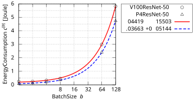
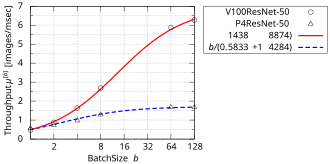
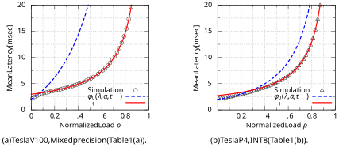
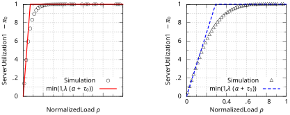
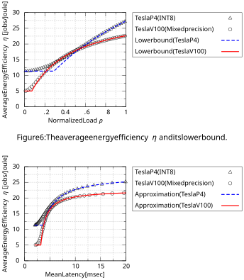
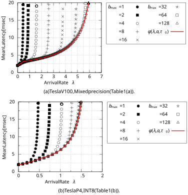
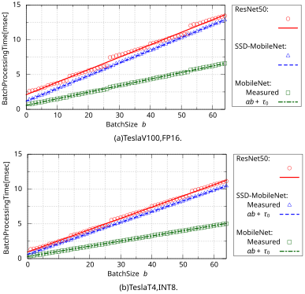
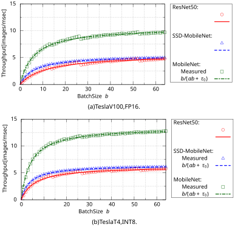
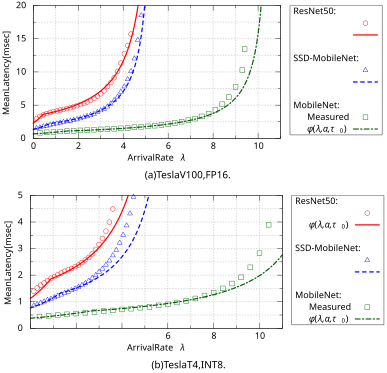

# Queueing Analysis of GPU-Based Inference Servers with Dynamic Batching: A Closed-Form Characterization 

Yoshiaki Inoue∗ 

January 13, 2021 

##### **Abstract** 

GPU-accelerated computing is a key technology to realize high-speed inference servers using deep neural networks (DNNs). An important characteristic of GPU-based inference is that the computational efficiency, in terms of the processing speed and energy consumption, drastically increases by processing multiple jobs together in a batch. In this paper, we formulate GPU-based inference servers as a batch service queueing model with batch-size dependent processing times. We first show that the energy efficiency of the server monotonically increases with the arrival rate of inference jobs, which suggests that it is energy-efficient to operate the inference server under a utilization level as high as possible within a latency requirement of inference jobs. We then derive a closed-form upper bound for the mean latency, which provides a simple characterization of the latency performance. Through simulation and numerical experiments, we show that the exact value of the mean latency is well approximated by this upper bound. We further compare this upper bound with the latency curve measured in real implementation of GPU-based inference servers and we show that the real performance curve is well explained by the derived simple formula. 

_Keywords_ : Machine learning inference, GPU servers, Dynamic batching, Batch-service queue, Stochastic orders 

## **1 Introduction** 

Deep neural networks (DNNs) have become increasingly popular tools to implement artificial intelligence (AI) related capability, such as image classification and speech recognition, into mobile applications. Because executing inference with DNNs is computationally heavy for mobile devices, inference jobs are typically offloaded to a cloud (or fog) server. From the server’s perspective, many inference jobs originating a large number of different mobile devices arrive, and the server should process them within latency requirements of the applications. To realize high-speed DNN inference, such a server usually utilizes the parallel computing capability of a GPU, which largely accelerate the inference process [1, 25]. 

GPU-based inference has an interesting characteristic that batching many jobs drastically increases the computing efficiency in terms of the processing speed and energy consumption [1, 7, 25]. Table 1 shows measurement results of the computing performance for two different GPUs (Tesla V100 and Tesla P4) and precision (FP16/FP32 Mixed precision and INT8), which are reported in [1]. A DNN called ResNet-50 is employed for these measurements, which is a winner of ImageNet Large Scale 

> ∗Y. Inoue is with Department of Information and Communications Technology, Graduate School of Engineering, Osaka University, Suita 565-0871, Japan. (E-mail: yoshiaki@comm.eng.osaka-u.ac.jp). 

1 

Table 1: Measurement results for inference performance using ResNet-50 reported in [1]. See [1, Pages 23–24] for more details of the measurement methodology. 

||(a) Tesla V|100 (Mixed precisi|on).|
|---|---|---|---|
|Batch Size|Throughput [images/sec]|Average Board Power [Watt]|Throughput/Watt [images/sec/Watt]|
|1|476|120|4|
|2|880|109|8.1|
|4|1,631|132|12.4|
|8|2,685|153|17.5|
|64|5,877|274|21.4|
|128|6,275|285|22|

|Batch Size|(b) T Throughput [images/sec]|esla P4 (INT8). Average Board Power [Watt]|Throughput/Watt [images/sec/Watt]|
|---|---|---|---|
|1|569|44|12.9|
|2|736|44|16.7|
|4|974|49|19.9|
|8|1,291|57|22.6|
|64|1,677|63|26.6|
|128|1,676|62|27|

Visual Recognition Competition 2015 (ILSVRC2015). Note that the energy efficiency is represented as the number of inference jobs per unit time which is able to be processed with unit power (measured in Watt). We can also interpret this quantity as the average number of inference jobs processed with unit energy (measured in Joule). In each case of Table 1, we see that the throughput and the energy efficiency largely increase by batching multiple jobs. 

Because of this characteristic of GPU-based inference, it is efficient for a server to combine multiple inference jobs arriving from different devices into a batch, and process them simultaneously. Such a dynamic batching procedure is indeed supported by DNN server-application libraries such as TensorFlow-Serving [21] and TensorRT Inference Server [2]. 

Despite the importance of GPU inference servers, there have been few studies focusing on the mathematical analysis of their performance, which may be due to the fact that the training process has been given far more weight than the inference process in the machine-learning community. In [6], a predictive framework called NeuralPower is proposed, which provides a prediction of the inference time and energy consumption for each layer based on the sparse polynomial regression. A prediction method for the inference time is also proposed in [9], which looks up a database of per-operator execution times and sums them up for all operations involved. These previous studies focus only on the execution time of a single inference, which corresponds to the service time in the queueing theoretic terminology. To the best of our knowledge, there are no previous studies on GPU inference servers that analyze _the system latency_ including the queueing delay. 

The main purpose of this paper is to introduce a queueing theoretic perspective on GPU-based DNN inference systems with dynamic batching. We formulate an inference server as a batch-service queueing model with batch-size dependent processing times and we present a novel analytical method 

2 

for this model. As an initial study, this paper mainly focuses on the derivation of _a closed-form formula_ that can characterize the latency performance of GPU-based inference servers. Although the analysis of batch-service queues is a well-studied subject of the queueing theory [4, 5, 10, 11, 12, 14, 16, 18, 19, 20], most of them assume that the processing time distribution is independent of the batch size. This assumption does not hold for GPU-based inference servers because the processing times of inference jobs increase with the batch size. Batch-service queues with batch-size dependent processing times are analyzed in [18], [19], [20, Section 4.2], where computational procedures to numerically obtain several performance metrics are given. In particular, the matrix-analytic method developed in [20] provides a unified way to perform an algorithmic analysis of a wide range of batch service queueing models. However, the main weakness of numerical approaches such as matrix analysis methods is that they are algorithmic in nature and do not yield closed-form formulas. We note that batch-size dependent processing times make the system dynamics complicated and it is difficult to obtain a closed-form formula even in the M/M/1 model [8]. 

In this paper, we first show that the energy-efficiency of the system monotonically increases with the arrival rate of inference jobs (i.e., the system load), by means of the stochastic comparison techniques [17, 23]. This result suggests that it is energy-efficient to operate the server under a utilization level as high as possible within a latency requirement. We then derive a closed-form upper bound of the mean latency, which provides a simple characterization to the latency performance of GPU-based inference servers. 

The key idea of our approach is to model the system as a batch-service queueing model with _infinite maximum batch size_ and batch processing times that linearly increase with the batch size, where the latter assumption is a specific feature of GPU-based inference servers as we will validate in this paper. Note that the finiteness assumption on the maximum batch size is essential in approaches based on the matrix-analytic method, because it is a necessary condition for the system being formulated by a Markov chain with block upper or lower Hessenberg transition probability matrix. As we will see, however, the assumptions of the infinite maximum batch size and linear batch processing times enable us to derive a simple closed-form upper bound of the mean latency. Furthermore, it is shown through numerical and simulation experiments that the mean latency is quite well-approximated by this closed-form upper bound, even for the case with finite maximum batch size. Therefore, the derived closed-form upper bound can be regarded as a simple and accurate approximation formula for the mean latency. We also conduct experiments using real implementation of GPU inference servers based on MLPerf inference benchmark [22] and we show that the simple formula we derive explains the real performance curve quite well. 

The rest of this paper is organized as follows. In Section 2, we introduce the mathematical model considered in this paper. In Section 3, we first show the monotonicity of the energy-efficiency with respect to the system load under a relatively general setting, and then derive a closed-form upper bound for the mean latency assuming linear batch processing times. In Section 4, we perform numerical evaluation to discuss the tightness of the derived upper bound and to validate the obtained results with real implementation of GPU servers. Finally, we conclude this paper in Section 5. 

## **2 Model** 

We model an inference server with dynamic batching as a single-server batch-service queueing model with infinite buffer. We assume that arrivals of inference jobs follow a Poisson process with rate _λ_ . The server can process multiple inference jobs simultaneously in a batch, and processing times of batches are assumed to be independent following a probability distribution depending on their batch sizes. 

3 

Let _H_[_b_] ( _x_ ) ( _x ≥_ 0, _b_ = 1 _,_ 2 _, . . ._ ) denote the cumulative distribution function (CDF) of the processing time for a batch of size _b_ . Let _H_[_b_] ( _b_ = 1 _,_ 2 _, . . ._ ) denote a generic random variable following the CDF _H_[_b_] ( _x_ ). We define _µ_[_b_] ( _b_ = 1 _,_ 2 _, . . ._ ) as the mean throughput (the number of inference jobs processed per time unit) for a batch size _b_ : 

$$
µ[b] = b E[H[b]]. (1)
$$

Throughout this paper, we make the following assumption: 

#### **Assumption 1.** 

_(i) µ_[_b_1] _≤ µ_[_b_2] _(b_ 1 _≤ b_ 2 _), i.e., the mean throughput µ_[_b_] _is non-decreasing with the batch size b. (ii)_ lim _b→∞ µ_[_b_] _> λ._ 

Assumption 1 (i) reflects the characteristic of the GPU-based inference that the computing efficiency increases with the batch size. Note that under Assumption 1 (i), the limit lim _b→∞ µ_[_b_] is always well-defined. Clearly, Assumption 1 (ii) is a necessary (and sufficient in the batching scheme described below) condition for the system to be stable. 

In order to construct a tractable model, we assume the following simple dynamic batching scheme: whenever the server is idle and there is at least one waiting job in the buffer, all of the waiting jobs are incorporated into a single batch, and its processing is immediately initiated. To be more specific, suppose that the server is idle and the buffer is empty at time 0. Let _Bn_ ( _n_ = 1 _,_ 2 _, . . ._ ) denote the size of the _n_ th batch processed after time 0. Also, let _L_ D _,n_ ( _n_ = 1 _,_ 2 _, . . ._ ) denote the number of waiting inference jobs just before the departure of the _n_ th batch. For convenience, we define _L_ D _,_ 0 = 0. Under the batching scheme described above, all waiting jobs are put into the next batch, so that _Bn_ +1 = _L_ D _,n_ if _L_ D _,n >_ 0. If _L_ D _,n_ = 0, on the other hand, the ( _n_ + 1)st batch contains only one inference job which have arrived at the empty system. Therefore, it follows that 

$$
Bn+1 = LD,n + 1{LD,n=0}, n = 0, 1, . . . , (2)
$$

where 1 _{·}_ denotes an indicator function. 

In the next section, we will derive analytical results for the batch-service queueing system described so far. 

## **3 Queueing Analysis** 

### **3.1 Preliminaries** 

Let _An_ ( _n_ = 1 _,_ 2 _, . . ._ ) denote the number of inference jobs arriving in the processing time of the _n_ th batch. By definition, the probability function of _An_ ( _n_ = 1 _,_ 2 _, . . ._ ) is given by 

$$
Pr(An = k | Bn = b) = �\infty{}{} 0 e-λx(λx)k k! dH[b](x), = a[b] k , k = 0, 1, . . . , (3)
$$

where _a_[_b_] _k_(_k_= 0_,_1_, . . ._,_b_= 1_,_2_, . . ._)isdefinedas 

$$
a[b] k = �\infty{}{} 0 e-λx(λx)k k! dH[b](x). (4)
$$

4 

It is readily verified that the number of waiting jobs _L_ D _,n_ ( _n_ = 1 _,_ 2 _, . . ._ ) at the _n_ th processing completion satisfies 

$$
LD,n = An,
$$

so that we obtain from (2), 

$$
Bn+1 = An + 1{An=0}. (5)
$$

It then follows from (3) and (5) that the sequence of processed batch sizes ( _Bn_ ) _n_ =1 _,_ 2 _,..._ forms a discretetime Markov chain on state space _{_ 1 _,_ 2 _, . . .}_ , whose transition probability matrix **_P_** is given by 

$$
P =       a[1] 0 + a[1] 1 a[1] 2 a[1] 3 \cdot{}{} \cdot{}{} \cdot{}{} a[2] 0 + a[2] 1 a[2] 2 a[2] 3 \cdot{}{} \cdot{}{} \cdot{}{} a[3] 0 + a[3] 1 a[3] 2 a[3] 3 \cdot{}{} \cdot{}{} \cdot{}{} ... ... ... ...       . (6)
$$

Note that this Markov chain is of GI/G/1-type, i.e, there is no skip-free structure in the transition matrix **_P_** . In general, it is difficult to characterize the exact stationary distribution of the GI/G/1type Markov chain, and one has to resort to numerical approximation methods such as the truncation techniques [13, 24, 15]. As we will see in Section 3.3, however, we can obtain a closed-form upper bound of the mean latency, by assuming linearly increasing batch processing times. 

In the rest of this subsection, we derive some basic relations among key performance metrics in steady state. Let _B_ denote a generic random variable following the stationary distribution of ( _Bn_ ) _n_ =1 _,_ 2 _,..._ . Let _L_ denote a generic random variable for the stationary number of inference jobs in the system at an arbitrary time instant. Further let _A_[_b_] ( _b_ = 1 _,_ 2 _, . . ._ ) denote a generic random variable following the probability function _a_[ _k__b_](_k_=0_,_1_, . . ._).Itisreadilyverifiedfrom(4)thatthefirsttwo moments of _A_[_b_] are given by 

$$
E[A[b]] = λE[H[b]], E[(A[b])2] = λ2E[(H[b])2]. (7)
$$

We define _π_ ( _z_ ) and _a_[_b_] ( _z_ ) ( _|z| ≤_ 1) as the probability generating functions (PGFs) of _L_ and _A_[_b_] : 

$$
π(z) = E[zL] = \infty{}{} � n=0 Pr(L = n)zn, (8) a[b](z) = E[zA[b]] = \infty{}{} � n=0 Pr(A[b] = n)zn.
$$

**Lemma 1.** _π_ ( _z_ ) _(|z| ≤_ 1 _) satisfies_ 

$$
π(z) = \infty{}{} � b=1 b Pr(B = b) E[B] \cdot{}{} 1 -zb b(1 -z) \cdot{}{} a[b](z). (9)
$$

_Proof._ Let _Lt_ ( _t ≥_ 0) denote the number of inference jobs in the system at time _t_ . By definition, each sample-path of ( _Lt_ ) _t≥_ 0 is given by a step function with unit upward jumps (arrivals of customers) and downward jumps of magnitude _Bn ∈{_ 1 _,_ 2 _, . . .}_ (completions of batch processing). For convenience, we assume that each sample-path of ( _Lt_ ) _t≥_ 0 is constructed so that it is right-continuous with left limits. Because the system is stable, there is a one-to-one correspondence between an upward jump and _the contribution of an inference job to a downward jump_ (see Fig. 1). To be more specific, let _tn_ and _t__′_ _n_ 

5 

Figure 1: A sample-path of the queue-length process _Lt_ . 

denote the arrival and departure times of the _n_ th arriving job ( _n_ = 1 _,_ 2 _, . . ._ ). We define _L_ˆ A _,n_ and _L_ˆ D _,n_ as 

$$
ˆLA,n = lim δt\rightarrow{}{}0+ Ltn-δt, ˆLD,n = |{k > n; t′ k = t′ n}| + Lt′n, (10)
$$

i.e., _L_ˆ A _,n_ denotes the number of inference jobs in the system seen by the _n_ th inference job on arrival, and _L_ˆ D _,n_ denotes the number of inference jobs arrived in the sojourn time of the _n_ th inference job which are in the system just before its departure. It is then verified that for each sample path, there is a bijection _ψ_ : _{_ 1 _,_ 2 _, . . .} →{_ 1 _,_ 2 _, . . .}_ such that _L_ˆ A _,n_ = _L_ˆ D _,ψ_ ( _n_ ). 

Let _L_ˆ A (resp. _L_ˆ D) denote a generic random variable for _L_ˆ A _,n_ (resp. _L_ˆ D _,n_ ) in steady state. Owing to PASTA and the observation above, we obtain 

$$
L =st ˆLA =st ˆLD, (11)
$$

where =st denotes equality in distribution. We then consider the distribution of _L_ˆD to prove (9). 

Let _B_ˆ denote a generic random variable for the size of a batch in which a randomly chosen inference job is processed. It is readily verified that _B_ˆ follows the length-biased batch size distribution, i.e., 

$$
Pr( ˆB = b) = b Pr(B = b) E[B] . (12)
$$

We then obtain from (10) and (11), 

$$
π(z) = E[z ˆLD] = \infty{}{} � b=1 Pr( ˆB = b) �b-1 � k=0 1 b \cdot{}{} zk � a[b](z),
$$

which implies (9). 

Let _W_ denote the latency (sojourn time) of a randomly chosen inference job. We define _H_ (resp. _H_ ˆ ) as a generic random variable for the processing time of a randomly chosen batch (resp. a randomly chosen inference job). Note that the distributions of _H_ and _H_ˆ are given by (cf. (12)) 

$$
Pr(H \leq{}{}x) = \infty{}{} � b=1 Pr(B = b) Pr(H[b] \leq{}{}x), (13) Pr( ˆH \leq{}{}x) = \infty{}{} � b=1 b Pr(B = b) E[B] \cdot{}{} Pr(H[b] \leq{}{}x). (14)
$$

6 

Figure 2: The amount of energy consumption for processing a batch (calculated from Table 1). 

**Lemma 2.** _The mean latency_ E[ _W_ ] _is given by_ 

$$
E[W] = E[B2] -E[B] 2λE[B] + E[ ˆH]. (15)
$$

_Proof._ Taking the derivative of (9) and letting _z →_ 1, we have 

$$
E[L] = \infty{}{} � b=1 b Pr(B = b) E[B] �b -1 2 + λE[H[b]] � = E[B2] -E[B] 2E[B] + λE[ ˆH], (16)
$$

where we used (7) in the first equality and (14) in the second equality. (15) thus follows from Little’s law E[ _L_ ] = _λ_ E[ _W_ ]. 

**Remark 1.** _We can verify that the first term (resp. the second term) on the right-hand side of (15) represents the mean waiting (resp. processing) time of a randomly chosen inference job._ 

### **3.2 Monotonicity of the Energy Efficiency** 

In this subsection, we show that the larger the system load, the more energy efficient this system is, under some additional assumptions. Let _c_[_b_] ( _b_ = 1 _,_ 2 _, . . ._ ) denote the amount of energy consumed for processing a batch of size _b_ . _c_[_b_] is calculated from Table 1 by the product of the average board power and the batch processing time (i.e., the batch size divided by the throughput). For each case in Table 1, _c_[_b_] is well-fitted by a linear function (with the least squares method, we have the coefficient of determination _R_2 _≃_ 0 _._ 99978 for Tesla V100 and _R_2 _≃_ 0 _._ 99998 for Tesla P4). See Fig. 2 for _c_[_b_] plotted as a function of _b_ . 

We thus make the following assumption on _c_[_b_] : 

**Assumption 2.** _c_[_b_] _(b_ = 1 _,_ 2 _, . . .) is given by_ 

$$
c[b] = βb + c0, (17)
$$

_for some β >_ 0 _and c_ 0 _≥_ 0 _._ 

7 

In steady state, the server processes _λ/_ E[ _B_ ] batches per unit time with energy consumption � _∞b_ =1Pr(_B_=_b_)_c_[_b_]onaverage.Wethendefinetheaverageenergyefficiency_η_ofthesystemas 

$$
η := λ λ E[B] \infty{}{} � b=1 Pr(B = b)c[b] , (18)
$$

i.e., the mean number of inference jobs processed with unit energy. Under Assumption 2, (18) is rewritten as 

$$
η = 1 β + c0/E[B]. (19)
$$

In what follows, we show that the energy efficiency _η_ is non-decreasing with respect to the arrival rate _λ_ . To establish this monotonicity result for _η_ , we need an additional assumption on the batch processing time distribution _H_[_b_] ( _x_ ) ( _b_ = 1 _,_ 2 _, . . ._ ): 

**Definition 1** ([23, Eq. (1.A.1)]) **.** _Let X and Y denote non-negative random variables. X is said to be smaller than Y in the usual stochastic order if and only if_ 

$$
Pr(X > x) \leq{}{}Pr(Y > x), for all x \geq{}{}0.
$$

**Remark 2** ([23, Eq. (1.A.7)]) **.** _X ≤_ st _Y holds if and only if_ 

$$
E[φ(X)] \leq{}{}E[φ(Y )],
$$

_for any non-decreasing function φ_ ( _x_ ) _(x ≥_ 0 _) provided the expectations exist. In particular, X ≤_ st _Y ⇒_ E[ _X_ ] _≤_ E[ _Y_ ] _._ 

**Assumption 3.** _H_[_b_] _≤_ st _H_[_b′_] _holds for any b ≤ b__′_ _._ 

Although Assumption 3 is a strong assumption on the batch processing time distribution, it is reduced to the condition about only their the mean value in several probability distributions, as shown in the following example: 

**Example 1.** _In the following cases, we have_ E[ _H_[_b_] ] _≤_ E[ _H_[_b′_] ] _⇒ H_[_b_] _≤_ st _H_[_b′_] _(cf. Remark 2):_ 

$$
(a) H[b] (b = 1, 2, . . .) follows an exponential distribution, i.e.,
$$

$$
Pr(H[b] > x) = e-x/E[H[b]], x \geq{}{}0.
$$

_(b) H_[_b_] _(b_ = 1 _,_ 2 _, . . .) follows a gamma distribution with a fixed coefficient of variation c, i.e.,_ 

$$
Pr(H[b] > x) = 1 -γ(1/c2, x/(c2E[H[b]]) Γ(1/c2) , x \geq{}{}0.
$$

_where_ Γ( _x_ ) _and γ_ ( _x, y_ ) _denotes the gamma function and the lower incomplete gamma function. (c) H_[_b_] _(b_ = 1 _,_ 2 _, . . .) takes a constant value, i.e.,_ 

$$
Pr(H[b] > x) = 1{E[H[b]]>x}, x \geq{}{}0.
$$

Let _B__⟨λ⟩_ and _η__⟨λ⟩_ ( _λ >_ 0) denote the stationary batch size and the energy efficiency represented as functions of the arrival rate _λ_ . 

8 

**Theorem 1.** _Under Assumption 3, the stationary batch size B__⟨λ⟩_ _(λ >_ 0 _) increases with the arrival rate λ in the usual stochastic order, i.e.,_ 

$$
B⟨λ1⟩\leq{}{}st B⟨λ2⟩, for any λ1 \leq{}{}λ2. (20)
$$

_Proof._ Let _P__⟨λm⟩_ ( _m_ = 1 _,_ 2) denote the transition probability matrix of ( _Bn_ ) _n_ =1 _,_ 2 _,..._ given _λ_ = _λm_ , and let _p__⟨_ _i,j__λm⟩_ ( _i, j_ = 1 _,_ 2 _, . . ._ ) denote the ( _i, j_ )th element of _P__⟨λm⟩_ . To prove (20), it is sufficient to show that in the sense of usual stochastic order, the probability distribution _p__⟨_ _i,__λ_ _·_1_⟩_ increases with _i_ , and _p__⟨_ _i,__λ_ _·_1_⟩_ is smaller than _p__⟨_ _i,__λ_ _·_2_⟩_ [17, Pages 186–187], i.e., 

$$
\infty{}{} � j=k p⟨λ1⟩ i,j \leq{}{} \infty{}{} � j=k p⟨λ1⟩ i′,j , i \leq{}{}i′, k = 1, 2, . . . , (21)
$$

and 

$$
\infty{}{} � j=k p⟨λ1⟩ i,j \leq{}{} \infty{}{} � j=k p⟨λ2⟩ i,j , i = 0, 1, . . . , k = 1, 2, . . . . (22)
$$

Using (6), we rewrite (21) and (22) as 

$$
\infty{}{} � j=k a[i],⟨λ1⟩ j \leq{}{} \infty{}{} � j=k a[i′],⟨λ1⟩ j , i \leq{}{}i′, k = 2, 3, . . . , (23)
$$

and 

$$
\infty{}{} � j=k a[i],⟨λ1⟩ j \leq{}{} \infty{}{} � j=k a[i],⟨λ2⟩ j , i = 1, 2, . . . , k = 2, 3, . . . , (24)
$$

$$
where a[i],⟨λm⟩ j (m = 1, 2) is defined as (cf. (4))
$$

$$
a[i],⟨λm⟩ j := �\infty{}{} 0 e-λmx(λmx)j j! dH[i](x).
$$

Let _A_[_i_]_,⟨λm⟩_ ( _m_ = 1 _,_ 2) denote a generic random variable satisfying Pr( _A_[_i_]_,⟨λm⟩_ = _j_ ) = _a_[ _j__i_]_,⟨λm⟩_ ( _j_ = 0 _,_ 1 _, . . ._ ). 

Note that the Poisson distribution is increasing in the usual stochastic order with respect to its mean [23, Example 8.A.2], so that we have from Assumption 3 and [23, Theorem 1.A.6], 

$$
A[i],⟨λ1⟩\leq{}{}st A[i′],⟨λ1⟩, i \leq{}{}i′,
$$

and from [23, Theorem 1.A.3 (d)], 

$$
A[i],⟨λ1⟩\leq{}{}st A[i],⟨λ2⟩, λ1 \leq{}{}λ2, i = 0, 1, . . . .
$$

Therefore, we obtain (23) and (24), which completes the proof. 

**Corollary 1.** _Under Assumptions 2 and 3, the energy efficiency η__⟨λ⟩_ _is non-decreasing with the arrival rate λ._ 

_Proof._ Corollary 1 immediately follows from Theorem 1 and (19). 

Corollary 1 suggests that it is energy-efficient to operate the inference server under a utilization level as high as possible within a latency requirement of inference jobs. In the following subsection, we derive a closed-form upper bound of the mean latency, assuming linearly increasing batch processing times. 

9 

Figure 3: Throughput characteristics in Table 1 and corresponding curves plotted by Eq. (26). 

### **3.3 Deterministic Linear Batch Processing Times** 

In Lemma 2, we showed that the mean latency E[ _W_ ] is given in terms of the stationary distribution of the Markov chain ( _Bn_ ) _n_ =1 _,_ 2 _,..._ of batch sizes. As mentioned above, an exact analysis of the stationary distribution of the GI/GI/1 type Markov chain ( _Bn_ ) _n_ =1 _,_ 2 _,..._ is difficult, and only its numerical approximation is known in the literature. 

In this subsection, it is shown that we can obtain a closed-form upper bound of the mean latency E[ _W_ ] by assuming a specific structure in batch processing times. Specifically, we make the following assumption throughout this subsection: 

#### **Assumption 4.** 

_The batch processing time H_[_b_] _(b_ = 1 _,_ 2 _, . . .) takes a constant value equal to τ_[_b_] _, which is given by_ 

$$
τ [b] = αb + τ0, (25)
$$

_for some α >_ 0 _and τ_ 0 _≥_ 0 _._ 

The deterministic distribution is a natural choice to model batch inference times because most DNNs take a vector of fixed size (input dimension times the batch size) as its input, and the output is computed by applying a predefined sequence of operations to it such as matrix multiplications and nonlinear activation functions, so that the computational steps are invariant regardless of the input vector. Furthermore, we see that the linearity assumption (25) is consistent with the measurement results in Table 1: with the least squares method, we have the coefficient of determination _R_2 _≃_ 0 _._ 99975 (resp. _R_2 _≃_ 0 _._ 99986) with _α_ = 0 _._ 1438 and _τ_ 0 = 1 _._ 8874 (resp. _α_ = 0 _._ 5833, _τ_ 0 = 1 _._ 4284) for batch processing times calculated from the data in Table 1 (a) (resp. Table 1 (b)) by dividing batch sizes by throughputs (cf. (1)). Note that under Assumption 4, the throughput _µ_[_b_] ( _b_ = 1 _,_ 2 _, . . ._ ) is written as 

$$
µ[b] = b αb + τ0 . (26)
$$

As shown in Fig. 3, the throughput characteristics in Table 1 are well-fitted by this simple rational function. More validation results on this assumption will be provided later in Section 4, using real implementation of GPU inference servers. 

10 

We can readily verify from (26) that Assumption 4 ensures Assumption 1 (i). Furthermore, (26) implies 

$$
lim b\rightarrow{}{}\infty{}{}µ[b] = 1 α,
$$

so that the stability condition stated in Assumption 1 (ii) is rewritten as 

$$
ρ := λα < 1. (27)
$$

In view of this relation, the normalized load _ρ_ represents the ratio of the arrival rate to the server’s processing capacity, which corresponds to the traffic intensity in ordinary single-server queueing models. 

Assumption 4 simplifies the analysis mainly because under this assumption, E[ _H_ ], E[ _H_2 ], and E[ _H_ˆ ] (see (13) and (14)) are given in terms of the first two moments E[ _B_ ] and E[ _B_2 ] of the stationary batch size distribution: 

$$
E[H] = αE[B] + τ0, (28)
$$

$$
E[H2] = α2E[B2] + 2ατ0E[B] + τ 2 0 , (29)
$$

$$
E[ ˆH] = α \cdot{}{} E[B2] E[B] + τ0. (30)
$$

**Lemma 3.** _Let A denote a generic random variable for An in steady state (cf. (3)):_ 

$$
Pr(A = k) = \infty{}{} � b=1 Pr(B = b)a[b] k , k = 0, 1, . . . .
$$

_Under Assumption 4,_ E[ _B_ ] _and_ E[ _B_2 ] _are given in terms of_ Pr( _A_ = 0) _by_ 

$$
E[B] = λτ0 + Pr(A = 0) 1 -λα , (31) E[B2] = (1 + 2λ2ατ0)E[B] + λ2τ 2 0 1 -λ2α2 . (32)
$$

_Proof._ From (7) and (13), we have 

$$
E[A] = \infty{}{} � b=1 Pr(B = b)λE[H[b]] = λE[H], (33) E[A2] = \infty{}{} � b=1 Pr(B = b) � λE[H[b]] + λ2E[(H[b])2] � = λE[H] + λ2E[H2]. (34)
$$

It then follows from (5), (28), and (33) that 

$$
E[B] = E[A] + Pr(A = 0) = λ(αE[B] + τ0) + Pr(A = 0),
$$

so that we obtain (31). Similarly, it follows from (5), (29), and (34) that 

$$
E[B2] = E[A2] + Pr(A = 0) = λ(αE[B] + τ0) + λ2(α2E[B2] + 2ατ0E[B] + τ 2 0 ) + Pr(A = 0).
$$

We then obtain (32) by rearranging terms of this equation. 

11 

**Lemma 4.** _Under Assumption 4, the mean latency_ E[ _W_ ] _is given in terms of the probability π_ 0 := Pr( _L_ = 0) _that the server is idle by_ 

$$
E[W] = α + τ0 + λ(1 + 2λα) � 2ατ0 + α2 + (1 -π0 -λα)τ0 λ � 2(1 -λ2α2) . (35)
$$

_Proof._ It follows from (15), (30), (31), and (32) that 

$$
E[W] = τ0 + (1 + 2λα)E[B2] -E[B] 2λE[B] = α + τ0 + (1 + 2λα)(E[B2] -E[B]) 2λE[B] . (36)
$$

Note here that (31) and (32) imply 

$$
E[B2] -E[B] λE[B] = (2λ2ατ0 + λ2α2)E[B] + λ2τ 2 0 (1 -λ2α2)λE[B] = λ � 2ατ0 + α2 + τ 2 0 E[B] � 1 -λ2α2 . (37)
$$

In addition, owing to Little’s law, the server utilization (i.e., the mean number of batches being served in steady state) is equal to the product of the number of batches processed per unit time and the mean batch processing time: 

$$
1 -π0 = λ E[B] \cdot{}{} E[H] = λα + λτ0 E[B], (38)
$$

where we used (28) for the second equality. Therefore, we obtain (35) from (36), (37), and (38). 

**Remark 3.** _By definition, we have π_ 0 = _π_ (0) _(see (8))._ 

Even under Assumption 4, it seems difficult to determine the exact value of _π_ 0. However, we have the following simple lower bound for this quantity: 

**Lemma 5.** _Under Assumption 4, π_ 0 _is bounded below by_ 

$$
π0 \geq{}{}max(0, 1 -λ(α + τ0)). (39)
$$

_Proof._ Because _B ≥_ 1 holds with probability one, E[ _B_ ] _≥_ 1 holds. We then have from (38), 

$$
π0 \geq{}{}1 -λ(α + τ0),
$$

which and _π_ 0 _≥_ 0 imply (39). 

**Remark 4.** _If λ_ ( _α_ + _τ_ 0) _<_ 1 _, the quantity_ 1 _− λ_ ( _α_ + _τ_ 0) _is equal to the probability that the server is idle in a stationary single-service M/D/1 queue with the arrival rate λ and the processing time H_[1] = _α_ + _τ_ 0 _, where arriving inference jobs are processed one by one._ 

**Remark 5.** _It follows from (38) that_ E[ _B_ ] _≥_ max(1 _, λτ_ 0 _/_ (1 _−λα_ )) _, so that if Assumption 2 is satisfied, we have (cf. (19))_ 

$$
η \geq{}{} 1 β + c0/ max(1, λτ0/(1 -λα)). (40)
$$

12 

We are in a position to obtain the main result of this paper: 

**Theorem 2.** _Under Assumption 4, the mean latency_ E[ _W_ ] _is bounded above by_ 

$$
E[W] \leq{}{} α + τ0 2(1 -λα) � 1 + 2λτ0 + 1 -λτ0 1 + λα � =: φ0(λ, α, τ0), (41) and
$$

$$
E[W] \leq{}{}3 2 \cdot{}{} τ0 1 -λα + α 2 \cdot{}{} λα + 2 1 -λ2α2 =: φ1(λ, α, τ0). (42)
$$

_In addition, we have φ_ 0( _λ, α, τ_ 0) _≤ φ_ 1( _λ, α, τ_ 1) _if and only if λ ≤_ 1 _/_ ( _α_ + _τ_ 0) _._ 

_Proof._ As stated in Lemma 5, we have two lower bounds for _π_ 0. Using _π_ 0 _≥_ 1 _− λ_ ( _α_ + _τ_ 0) and (35), we have 

$$
E[W] \leq{}{}α + τ0 + λ(1 + 2λα)(α + τ0)2 2(1 -λ2α2) = α + τ0 2(1 -λα) \cdot{}{} 2 + λα + λτ0 + 2λ2ατ0 1 + λα ,
$$

which implies (41). On the other hand, we have (42) from _π_ 0 _≥_ 0 and (35) as follows: 

$$
E[W] \leq{}{}α + τ0 + (1 + 2λα) � λατ0 + λα2 + τ0 � 2(1 -λ2α2) = α + τ0 + (1 + 2λα)τ0 2(1 -λα) + (1 + 2λα)λα2 2(1 -λ2α2) = 3τ0 2(1 -λα) + λα2 + 2α 2(1 -λ2α2).
$$

The relation _φ_ 0( _λ, α, τ_ 0) _≤ φ_ 1( _λ, α, τ_ 1) _⇔ λ ≤_ 1 _/_ ( _α_ + _τ_ 0) is thus obvious from these derivations. 

Theorem 2 provides a surprisingly simple upper bound for the mean latency E[ _W_ ]. For convenience, let 

$$
φ(λ, α, τ0) := min(φ0(λ, α, τ0), φ1(λ, α, τ0)). (43)
$$

Even though this upper bound is obtained by replacing the idle probability _π_ 0 with its almost trivial lower bound in (39), it provides a quite good approximation to the exact value of the mean latency E[ _W_ ], as we will see in the next section. 

## **4 Numerical Evaluation** 

In this section, we numerically validate the applicability of the derived mathematical formulas to GPUbased inference servers. Throughout this section, we concentrate on the model considered in Section 3.3 where processing times are deterministic and linearly increase with the batch size. We first conduct simulation experiments to examine how well the exact mean latency E[ _W_ ] is approximated by the closed-form upper bound _φ_ ( _λ, α, τ_ 0), assuming both infinite and finite maximum batch sizes. For the simulation experiments, we employ the model parameters _α_ and _τ_ 0 estimated in Section 3.3 from Table 1; see the paragraph just after Assumption 4 for more detail. We then show the usefulness of the closedform expression of _φ_ ( _λ, α, τ_ 0) by comparing it to the measured latency in real-world implementation 

13 

Figure 4: The mean latency E[ _W_ ] and its upper bound (in milliseconds). 

of GPU-based inference servers. We use two types of GPUs for this experiment, NVIDIA Tesla V100 and Tesla T4, which are available on the Amazon Elastic Compute Cloud (Amazon EC2). Also, the MLPerf inference benchmark [22] is used for load generation and time measurement. The GPU inference servers are set up using NVIDIA’s implementation of the MLPerf inference benchmark v0.5, which is publicly available on GitHub [3]. 

Fig. 4 shows simulation results for the mean latency E[ _W_ ] and its upper bounds _φ_ 0( _λ, α, τ_ 0) and _φ_ 1( _λ, α, τ_ 0) given in (41) and (42) (recall that the normalized load _ρ_ is defined in (27)). We observe that the combination (43) of these upper bounds quite well approximates the exact curve of E[ _W_ ]. In particular, except for small values of _ρ_ , E[ _W_ ] takes fairly close values to _φ_ 1( _λ, α, τ_ 0). The reasons for this remarkable accuracy of approximation can be explained as follows. Recall that the upper bound _φ_ 1( _λ, α, τ_ 0) is obtained by replacing the idle probability _π_ 0 with its trivial lower bound 0. In Fig. 5, the server utilization 1 _− π_ 0 is plotted as a function of the normalized load _ρ_ . As a reference, we also plot its upper bound min(1 _, λ_ ( _α_ + _τ_ 0)) (cf. (39)). From this figure, we see that _the server utilization takes a value close to_ 1 _even for a moderate value of ρ_ , which is quite different from ordinary single-server queues, where the server utilization is equal to the traffic intensity. This phenomenon comes from the fact that the server’s processing speed largely increases as the batch size increases, so that _the system is overloaded for small batch sizes_ even under a moderate load level _ρ_ . Because of this behavior of the server utilization, the upper bound _φ_ 1( _λ, α, τ_ 0) is a good approximation to the mean latency E[ _W_ ] for a wide range of _ρ_ . On the other hand, for small _ρ_ , the upper bound _φ_ 0( _λ, α, τ_ 0) is a good approximation to E[ _W_ ]. Note that _φ_ 0( _λ, α, τ_ 0) is obtained by replacing the mean batch size E[ _B_ ] with its trivial lower bound 1. Therefore, E[ _W_ ] _≃ φ_ 0( _λ, α, τ_ 0) implies that the mean batch size E[ _B_ ] _≃_ 1, i.e., the server does not sufficiently leverage its batch-processing capability in such a region. 

We next discuss the energy efficiency using the linear model (17) considered in Section 3.2. Recall that the average energy efficiency _η_ is defined as (18), which represents the mean number of jobs processed with unit energy. In Fig. 6, simulation results for _η_ and its lower bound (40) are plotted as functions of the normalized load _ρ_ . From this figure, we observe that the energy efficiency can be largely enhanced by letting the server adequately loaded. Also, the energy-efficiency _η_ is wellapproximated by the lower bound (40) except for small values of _ρ_ . Fig. 7 shows the energy-latency tradeoff, where the relation between _η_ and the mean latency E[ _W_ ] is plotted with parameter _ρ_ . In this figure, we also plot approximation curves obtained by combining (40) and (43). We see that the 

14 

(a) Tesla V100, Mixed precision (Table 1 (a)). 

Figure 5: The server utilization 1 _− π_ 0 and its upper bound. 

Figure 7: The parametric curve of the average energy efficiency _η_ and the mean latency E[ _W_ ] with parameter _ρ_ . The approximation curves are plotted using (40) and (43). 

15 

Figure 8: The mean latency in the case of finite maximum batch sizes _b_ max, plotted with the closedform upper bound _φ_ ( _λ, α, τ_ 0) for the case of _b_ max = _∞_ . 

closed-form bounds (40) and (43) are useful to determine an adequate operating point of the server, taking the energy-latency tradeoff into consideration. 

We then discuss the relation between the model considered in this paper and a corresponding batchservice queue with _finite maximum batch size b_ max. As mentioned in Section 1, the mean latency in the case of finite _b_ max can be numerically obtained with results in [20, Section 4.2]. Fig. 8 shows that if _b_ max is sufficiently large, the mean latency is well approximated by our closed-form upper bound _φ_ ( _λ, α, τ_ 0) given by (43). If _b_ max is small, on the other hand, the mean latency deviates from _φ_ ( _λ, α, τ_ 0) for the arrival rate _λ_ near the stability boundary _λ_ = _µ_[_b_max] = _b_ max _/_ ( _αb_ max + _τ_ 0). However, we observe from this figure that even for small values of _b_ max, the mean latency is still well-approximated by (43) if the system is moderately loaded, i.e., _λ_ is sufficiently small compared to _µ_[_b_max] . 

Finally, we compare the derived closed-form expression _φ_ ( _λ, α, τ_ 0) to the mean latency measured in a real GPU-based inference server implemented with MLPerf inference benchmark. Three types of networks are used in this experiment: MobileNet, ResNet50, and SSD-MobileNet. We use the two GPUs, Tesla V100 and Tesla T4 as mentioned above. We set the computing precision in Tesla 

16 

Figure 9: The median of batch processing times measured using MLPerf MultiStream Scenario. 

V100 to FP16 and that in Tesla T4 to INT8. We also set the maximum batch size _b_ max = 64 in all experiments. First, the batch processing time for each batch size _b_ is measured using MultiStream Scenario of MLPerf inference benchmark. For each _b_ , we collect 100 samples of batch processing times and we use their median as the representative value. Fig. 9 shows the batch processing time as a function of the batch size for the six cases in total, where _α_ and _τ_ 0 are fitted by the least squares method. We observe that batch processing times linearly increase with the batch size as we assumed in the mathematical analysis. In ResNet50, however, we observe additional stair-like increases in the processing time at several places. Fig. 10 shows the corresponding throughput curves plotted as functions of the batch size. We observe that the stair-like increases in processing times result in discontinuous decreases in the throughput. 

Regardless of such an irregular behavior of batch processing times, the latency performance is still well explained by the mathematical formula we have derived in this paper. We use MLPerf Server Scenario to measure the mean latency E[ _W_ ], where the load generator sends inference requests to the GPU server according to a Poisson process of a given arrival rate _λ_ . The measurement for each parameter are run for 10 seconds. Fig. 11 shows the mean latency plotted as a function of the arrival rate of requests. We observe that each latency curve is well explained by the closed-form expression 

17 

Figure 10: The median of batch processing times measured using MLPerf MultiStream Scenario. 

18 

Figure 11: The mean latency measured using MLPerf Server Scenario, plotted with the closed-form upper bound _φ_ ( _λ, α, τ_ 0). 

19 

_φ_ ( _λ, α, τ_ 0), except for the region near the stability boundary. Also, we observe that in Tesla T4, the measured mean latency starts to deviate from the theoretical curve _φ_ ( _λ, α, τ_ 0) from a relatively small value of _λ_ . This phenomenon is due to a hardware limit of the Tesla T4: this GPU is designed to operate at a low power of 70 [W], which in turn causes the operating clock to be forcibly lowered (by the SW Power Cap mechanism) when the computational load becomes excessive. Since it is not reasonable to operate the server under such an excessive load, we can conclude that for the both GPUs and all networks considered, our closed-form formula explains the mean latency quite well in practical operating ranges. 

## **5 Conclusion** 

In this paper, we introduced a queueing model representing GPU-based inference servers with dynamic batching. We modeled an inference server as a batch-service queueing model with infinite maximum batch sizes and batch-size dependent processing times. We first showed that the energy efficiency of the server increases with the arrival rate of inference jobs, which suggests that it is energy-efficient to operate the server under a traffic load as large as possible, within a latency requirement of inference jobs. We then derived a simple closed-form upper bound for the mean latency in Theorem 2, under the assumption that the batch processing time linearly increases with the batch size. Through numerical and simulation experiments, we showed that the exact value of the mean latency is well-approximated by this simple upper bound. We further compared this formula with the latency curve measured in real implementation of GPU-based inference servers, which showed that the real performance curve is also well explained by the derived simple formula. 

## **Acknowledgements** 

The author would like to thank the anonymous reviewers for their helpful comments. This work was supported in part by JSPS KAKENHI Grant Number 18K18007. 

## **References** 

- [1] Nvidia AI Inference Platform, Giant Leaps in Performance and Efficiency for AI Services, from the Data Center to the Network’s Edge. https://www.nvidia.com/en-us/datacenter/resources/inference-technical-overview/ (accessed 06-Dec-2019). 

- [2] Nvidia TensorRT Inference Server. https://docs.nvidia.com/deeplearning/sdk/tensorrt-inference-server-guide/docs/ (accessed 06Dec-2019). 

- [3] MLPerf inference v0.5 results. https://github.com/mlperf/inference ~~r~~ esults ~~v~~ 0.5/ (accessed 13-Sep-2020). 

- [4] N. T. J. Bailey, On queueing processes with bulk service, J. Roy. Stat. Soc. B 16 (1954) 80–87. 

- [5] G. Bri´ere and M. L. Chaudhry, Computational analysis of single-server bulk-service queues, M/G_Y_ /1, Adv. Appl. Prob. 21 (1989) 207–225. 

20 

- [6] E. Cai, D.-C. Juan, D. Stamoulis, and D. Marculescu, “NeuralPower: Predict and deploy Energyefficient convolutional neural networks,” in Proc. of The 9th Asian Conference on Machine Learning (ACML 2017), 2017. 

- [7] D. Crankshaw, X. Wang, G. Zhou, M. J. Franklin, J. E. Gonzalez, and I. Stoica, Clipper: A lowlatency online prediction serving system, in Proc. of 14th USENIX Symposium on Networked Systems Design and Implementation, 2017, 613–627. 

- [8] G. L. Curry and R. M. Feldman, “An M/M/1 queue with a general bulk service rule”. Naval Res. Logist. 32 (1985) 595–603. 

- [9] X. Dai et al., “ChamNet: Towards efficient network design through platform-aware model adaptation,” in Proc. of 2019 IEEE/CVF Conference on Computer Vision and Pattern Recognition (CVPR), 2019, 11390–11399. 

- [10] R. K. Deb and R. F. Serfozo, Optimal control of batch service queues, Adv. Appl. Prob. 5 (1973) 340–361. 

- [11] F. Downton, Waiting time in bulk service queues, J. Roy. Stat. Soc. B 17 (1955) 256–261. 

- [12] F. Downton, On limiting distributions arising in bulk service queues, J. Roy. Stat. Soc. B 18 (1956) 265–274. 

- [13] D. Gibson and E. Seneta, Augmented truncations of infinite stochastic matrices, J. Appl. Prob. 24 (1987) 600–608. 

- [14] N. K. Jaiswal, Time-dependent solution of the bulk-service queueing problem, Oper. Res. 8 (1960) 773–781. 

- [15] Y. Liu, Augmented truncation approximations of discrete-time markov chains, Oper. Res. Lett. 38 (2010) 218–222. 

- [16] J. Medhi, Waiting time distribution in a Poisson queue with a general bulk service rule, Manag. Sci. 21 (1975) 777–782. 

- [17] A. M¨uller and D. Stoyan, Comparison Methods for Stochastic Models and Risks, John Wiley & Sons, Chichester, UK, 2002. 

- [18] M. F. Neuts, The busy period of a queue with batch service, Oper. Res. 13 (1965) 815–819. 

- [19] M. F. Neuts, A general class of bulk queues with Poisson input, Ann. Math. Stat. 38 (1967) 759–770. 

- [20] M. F. Neuts, Structured Stochastic Matrices of M/G/1 Type and Their Applications, Marcel Dekker, New York, 1989. 

- [21] C. Olston, N. Fiedel, K. Gorovoy, J. Harmsen, L. Lao, F. Li, V. Rajashekhar, S. Ramesh, and J. Soyke, TensorFlow-Serving: Flexible, high-performance ML serving, in Proc. of Workshop on ML Systems at NIPS 2017, 2017. 

- [22] V. J. Reddi et al., “MLPerf Inference Benchmark,” in Proc. of 2020 ACM/IEEE 47th Annual International Symposium on Computer Architecture (ISCA), 2020, 446–459. 

21 

- [23] M. Shaked and J. G. Shanthikumar, Stochastic Orders, Springer, New York, NY, 2007. 

- [24] R. L. Tweedie, Truncation approximations of invariant measures for markov chains, J. Appl. Prob. 35 (1998) 517–536. 

- [25] R. Xu, F. Han, and Q. Ta, Deep learning at scale on NVIDIA V100 accelerators in Proc. of 2018 IEEE/ACM Performance Modeling, Benchmarking and Simulation of High Performance Computer Systems (PMBS18), 2017. 

22 

