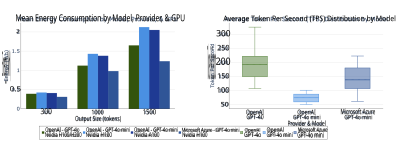
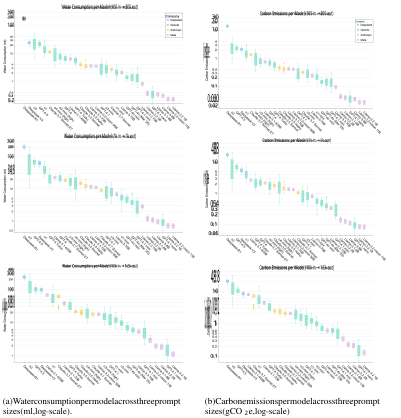
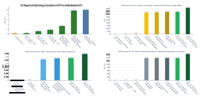
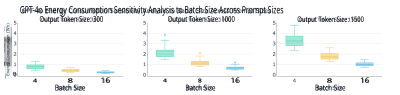
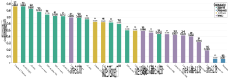

# **How Hungry is AI? Benchmarking Energy, Water, and Carbon Footprint of LLM Inference** 

**Nidhal Jegham****1 2** **Marwan Abdelatti****1 3** **Lassad Elmoubarki****2** **Abdeltawab Hendawi****1**_∗_ 

1University of Rhode Island 2University of Tunis 3Providence College 

{nidhal.jegham, hendawi}@uri.edu lassad.elmoubarki@tbs.rnu.tn mabdelat@providence.edu 

Live Dashboard Link: **Power BI Dashboard** 

## **Abstract** 

This paper introduces a novel infrastructure-aware benchmarking framework for quantifying the environmental footprint of LLM inference across 30 state-of-the-art models as deployed in commercial data centers. Our framework combines public API performance data with region-specific environmental multipliers and statistical inference of hardware configurations. We additionally utilize cross-efficiency Data Envelopment Analysis (DEA) to rank models by performance relative to environmental cost. Our results show that o3 and DeepSeek-R1 emerge as the most energy-intensive models, consuming over 33 Wh per long prompt, more than 70 times the consumption of GPT-4.1 nano, and that Claude-3.7 Sonnet ranks highest in eco-efficiency. While a single short GPT-4o query consumes 0.42 Wh, scaling this to 700 million queries/day results in substantial annual environmental impacts. These include electricity use comparable to 35,000 U.S. homes, freshwater evaporation matching the annual drinking needs of 1.2 million people, and carbon emissions requiring a Chicago-sized forest to offset. These findings illustrate a growing paradox: Although AI is becoming cheaper and faster, its global adoption drives disproportionate resource consumption. Our study provides a standardized, empirically grounded methodology for benchmarking the sustainability of LLM deployments, laying a foundation for future environmental accountability in AI development and sustainability standards. 

## **1 Introduction** 

Large language models (LLMs) have moved beyond research labs and are now embedded in search engines, virtual assistants, education platforms, and enterprise tools [1, 2, 3, 4]. Models like GPT-4o [5] and Claude-3.7 Sonnet [6] represent state-of-the-art systems, while open-source alternatives such as LLaMA-3 [7] and DeepSeek-V3 [8] reflect growing accessibility and experimentation. On top of that, the emergence of reasoning models such as DeepSeek-R1 [9], o1 [10], and o3-mini [11] marks a shift toward multi-step logic and chain-of-thought reasoning. 

However, the advancement of LLMs does involve shortcomings in environmental aspects. Training GPT-3 is estimated to consume 1,287 megawatt-hours (MWh) of electricity and emit over 550 metric tons of CO2e [12], while requiring more than 700 kiloliters (kL) of water for cooling alone [13], enough to fill two-thirds of an Olympic-sized swimming pool. Yet while training has been the focus of sustainability discussions, inference is emerging as the primary contributor to environmental costs. In contrast to training, which is conducted once or at intervals, inference occurs consistently and on a large scale. Recent estimates suggest inference can account for up to 90% of a model’s total lifecycle energy use [14, 15]. 

> _∗_ Corresponding author. 

Despite the growing environmental footprint of large-scale model deployment, a standard method to quantify the cost of inference at the prompt level remains absent. Existing frameworks [15, 19, 20] either lack the ability to benchmark proprietary models, the real-time granularity needed for deployment-specific prompt-level benchmarking, or are constrained to local setups, failing to capture the infrastructure complexity of production-scale inference. A core obstacle to developing more accurate assessments is the lack of information from commercial AI providers, as they do not disclose model-specific inference data, and existing environmental reports tend to aggregate emissions across entire cloud infrastructures without disaggregating by model or workload [17, 18]. This opacity hinders independent verification and undermines both scientific benchmarking and policy efforts aimed at regulating AI’s true environmental cost. 

To address these issues, we introduce a novel benchmarking framework to quantify the operational environmental footprint of LLM inference at the per-prompt level. Unlike existing studies [13, 15, 19], our method adopts a more comprehensive strategy by integrating performance metrics such as latency and throughput from public APIs with published GPU and system power specifications. Furthermore, we scale these combined data points using region-specific multipliers, including Power Usage Effectiveness (PUE) [21, 22], Water Usage Effectiveness (WUE) [21, 22], and Carbon Intensity Factors (CIF) [23, 24] to account for infrastructural overhead. This method enables us to evaluate the energy, water, and carbon effects of both open-source and proprietary models, a gap that, to our knowledge, has not been comprehensively explored in prior research. Additionally, we employ statistical analysis, including ANOVA and Tukey HSD, to estimate underlying hardware configurations. This framework’s effectiveness is shown by its use in more than 30 commercially deployed models and assessments across various infrastructure scenarios. Moreover, to contextualize resource use relative to model capability, we apply cross-efficiency Data Envelopment Analysis (DEA) to assess how effectively each model converts environmental inputs into performance. As a key application of this framework, we perform a case study to estimate the annual footprint of GPT-4o text generation based on scaled usage data. Our framework enables infrastructure-aware decision-making, empowers accountability, and provides a foundational step toward sustainability standards in AI deployment. 

The remainder of the paper is organized as follows. Section 2 reviews existing studies on the environmental impact of LLMs. Section 3 introduces key concepts, including hardware configurations and environmental multipliers. Section 4 details our framework for estimating inference-phase cost. Section 5 presents findings across 30 models. Section 6 provides a focused analysis of GPT4o’s annual environmental footprint. Section 7 outlines key insights and implications. Section 8 summarizes the main takeaways and limitations and directions for future work. 

## **2 Related Work** 

The environmental impact of AI systems has garnered increasing attention in recent years, with a growing body of work attempting to quantify the energy, carbon, and water costs associated with training and deploying LLMs. 

Li et al. [13] analyzed GPT-3’s freshwater consumption, estimating over 5 million liters used during training and projecting that AI-related withdrawals could reach 6.6 trillion liters annually by 2027. Although their spatiotemporal methodology is a significant early contribution, it overlooks carbon emissions, depends on an outdated model, and requires previous knowledge of energy usage, which restricts its scalability. In parallel, Strubell et al. [25] estimated carbon emissions from training BERT and GPT-2 by accounting for GPU, CPU, and DRAM power draw alongside PUE adjustments. However, their analysis excludes inference and infrastructural overhead. Similar limitations appear in Meta’s LLaMA reports [7, 26, 27], which provide carbon footprints based on GPUs’ TDPs but disregard water use, system-wide energy consumption, and the inference phase entirely. 

Regarding inference, Husom et al. [19] (MELODI) measure real-time energy consumption of GPUs and CPUs at the prompt level, but they neglect carbon emissions, water usage, and infrastructure overhead, only concentrating on small-scale open-source models. Samsi et al. [20] measure GPU power draw across prompt lengths but exclude proprietary systems and broader environmental factors, lacking a standardized scaling method for production-level inference. Yang et al. [28] evaluate over 1,200 vision models and introduce an energy-efficiency score. However, their analysis does 

2 

not include LLMs, API-based deployments, or essential infrastructure considerations like PUE and WUE. 

Complementary studies, including Luccioni et al. [29], assess general-purpose and task-specific models in the A100 systems. While they provide valuable cross-model insights, they do not consider proprietary models, water usage, or carbon emissions. CodeCarbon [15] calculates carbon footprints based on device-level data and regional carbon intensity, but it lacks the granularity needed for prompt-level analysis and does not work with API-based inferences. On a larger scale, Harding et al. [30] connect AI adoption to national productivity, allowing for extrapolation of energy and carbon effects. Though this provides a useful overarching view, it overlooks variability in per-prompt inference, the behavior of specific models, and the infrastructure used for deployment. 

Most efforts focus on training and local model evaluation, lacking standardized, scalable methods, ignoring infrastructural overhead, and omitting resource categories such as water consumption and carbon emissions. Our work addresses these gaps by integrating API-based performance metrics with GPU and system power specifications and environmental multipliers to estimate the environmental impact of LLM inference at the prompt level in data centers. We infer deployment infrastructure through statistical analysis and apply DEA to contextualize environmental impact versus performance. Additionally, we conduct a case study estimating GPT-4o’s annual environmental footprint based on scaled usage data, providing the first infrastructure-aware, prompt-level benchmark of inference sustainability at scale. 

## **3 Preliminaries** 

To capture infrastructure-level overhead in data center operations, we apply three standard environmental multipliers: Power Usage Effectiveness (PUE) [21, 22], Water Usage Effectiveness (WUE) [21, 22], and Carbon Intensity Factor (CIF) [23, 24]. 

**PUE** accounts for non-computational energy overheads such as cooling, lighting, and power distribution. Defined as the ratio of total data center energy consumption to IT-specific energy use. 

**WUE** captures the water used per kilowatt-hour of IT energy, encompassing on-site cooling (Scope 1), off-site electricity generation (Scope 2), and embodied water from hardware manufacturing and transport (Scope 3). WUE can be computed based on either water withdrawal (the total volume drawn from natural or municipal sources) or water consumption (the portion of withdrawn water permanently lost, primarily through evaporation). 

**CIF** measures carbon emissions per kilowatt-hour of energy consumed, largely driven by the regional electricity mix. Emissions are categorized as direct on-site combustion (Scope 1), off-site electricity generation (Scope 2), and embodied emissions from manufacturing and transport (Scope 3). 

## **4 Methodology** 

This section presents our novel methodology for estimating the environmental footprint of LLM inference. Our framework integrates model-specific performance metrics with infrastructure-level environmental multipliers to calculate operational energy consumption, water usage, and carbon emissions per query. We also evaluate eco-efficiency using DEA, mapping sustainability trade-offs against a composite performance benchmark. 

### **4.1 Model Selection and Hardware Estimation** 

We analyze 30 large language models across OpenAI, Anthropic, Meta, and DeepSeek. Table 1 summarizes each model’s deployment context, including provider, cloud host, hardware type and specifications, and regional environmental multipliers (PUE, WUE, CIF). All models are usually run on NVIDIA DGX systems using A100, H100, H200, or H800 GPUs [35, 31, 32, 33, 34]. U.S.-based providers such as OpenAI and Anthropic have acquired large volumes of H200 and H100 chips [38, 47, 48], making them the most probable choice for recent deployments. DeepSeek, which operates under U.S. export restrictions, uses the H800, NVIDIA’s export-compliant GPU for the Chinese market [44, 50]. Both the H200 and H800 retain the same Hopper architecture and peak power draw as the H100, with system-level energy characteristics that are nearly identical [51]. While 

3 

Table 1: Deployment and infrastructure specifications of models. 

|**Model**|**Launch** **Date**|**Company**|**Host**|**Hardware**|**Critical** **Power** **(kW)**|**PUE**|**WUE** **(on-site, L/kWh)**|**WUE** **(off-site, L/kWh)**|**CIF** **(kgCO2e/kWh)**|
|---|---|---|---|---|---|---|---|---|---|
|GPT-4.1 GPT-4.1 mini|Apr, 2025 Apr, 2025|||||||||
|GPT-4.1 nano o4-mini (high) GPT-4.5 o3 o3-mini (high) o3-mini o1 o1-mini|Apr, 2025 Apr, 2025 Feb, 2025 Apr, 2025 Jan, 2025 Jan, 2025 Dec, 2024 Sep, 2024|OpenAI|Microsoft Azure|DGX H200/H100 [35, 38]|10.20 [39]|1.12 [40]|0.30 [41]|3.142 [42]|0.3528 [37]|
|GPT-4o(Mar ’25)|May,2024|||||||||
|GPT-4o mini|July, 2024|||||||||
|GPT-4 Turbo GPT-4|Nov, 2023 Mar,2023|OpenAI|Microsoft Azure|DGX A100*|6.50[43]|1.12|0.30|3.142|0.3528|
|DeepSeek-R1 DeepSeek-V3|Jan, 2025 Dec,2024|Deepseek|Deepseek|DGX H800 [8]|10.20 [44]|1.27 [45]|1.20 [45]|6.016 [42]|0.6 [46]|
|Claude-3.7 Sonnet|Feb, 2025|||||||||
|Claude-3.7 Sonnet ET† Claude-3.5 Sonnet|Feb, 2025 Jun, 2024|Anthropic|AWS|DGX H200/H100 [47, 48]|10.20|1.14 [49]|0.18 [49]|3.142|0.385 [26]|
|Claude-3.5 Haiku| Nov,2024|||||||||
|LLaMA-3.3 70B|Dec, 2024|||||||||
|LLaMA-3.2-vision 90B| Sep, 2024|||||||||
|LLaMA-3.2-vision 11B| Sep, 2024|||||||||
|LLaMA-3.2 3B LLaMA-3.2 1B LLaMA-3.1-405B LLaMA-3.1-70B| Sep, 2024 Sep, 2024 Jul, 2024 Jul, 2024|Meta|AWS|DGX H200/H100|10.20|1.14|0.18|3.142|0.385|
|LLaMA-3.1-8B LLaMA-3-70B LLaMA-3-8B|Jul, 2024 Apr, 2024 Apr,2024|||||||||

*DGX A100 was estimated for GPT-4o mini, GPT-4 Turbo, and GPT-4. Justification and estimation details are provided in Section 4.3.1. †Extended Thinking (ET). 

the H200 achieves greater energy efficiency due to faster memory and higher bandwidth, and the H800 may exhibit reduced performance due to export-related firmware limitations, both maintain the same peak power draw, thermal design profile, and system-level utilization characteristics as the H100 [44, 51]. These architectural differences affect throughput and latency, resulting in higher or lower energy consumed per token, but do not impact total system power demand under load. We therefore treat H100, H200, and H800 as equivalent in our power modeling, since our estimates are based on power draw and utilization rather than task-level performance. 

Environmental multipliers such as PUE, WUE, and CIF are assigned based on the cloud provider and regional deployment environments. OpenAI models, hosted on Microsoft Azure, use Azure-reported PUE, site-level WUE, and CIF values, supplemented by U.S. national averages for source WUE. For AWS-hosted Anthropic and Meta models, we apply AWS-reported PUE and site-level WUE, using U.S. national averages for source WUE and CIF due to limited public disclosures. For DeepSeek, we use Chinese data centers’ national averages for all multipliers. 

### **4.2 Per-Query Energy Consumption Estimation** 

To estimate the per-query energy consumption, we introduce a formula that serves as the core of our infrastructure-aware framework. This model integrates performance data [52], which evaluates LLMs under standardized conditions. For each model, we extract latency and tokens-per-second (TPS) across three prompt configurations that represent real-world use: Short-form (100 input, 300 output tokens), medium (1,000 input, 1,000 output), and long-form (10,000 input, 1,500 output). Metrics are reported as distributions over the 5th, 25th, 50th (median), 75th, and 95th percentiles, reflecting variability across multiple test runs for each model and prompt configuration. We compute runtime estimates by pairing available latency and TPS quantiles to construct a joint distribution that captures decoding throughput and fixed overhead variability. This modeling ensures that downstream energy calculations reflect the stochastic nature of inference workloads. Our model computes the per-query energy as: 

$$
Equery (kWh) = �Output Length TPS + Latency 3600 � � �� � Total inference time (hours) \cdot{}{}   PGPU \times{}{} UGPU � �� � GPU power (kW) + Pnon-GPU \times{}{} Unon-GPU � �� � Non-GPU power (kW)   \cdot{}{} PUE (1)
$$

, where _P_ GPU and _P_ non-GPU represent the maximum rated GPU and non-GPU system power, respectively, measured at the node level. _U_ GPU denotes the aggregate GPU power draw, incorporating both 

4 

the number of GPUs assigned and their per-GPU load, while _U_ non-GPU similarly reflects the aggregate power utilization of non-GPU components. Latency refers to the time to first token generation, which corresponds to the time required to process the input prompt. TPS represents the generation rate of output tokens; therefore, dividing the output length by TPS yields the time required to generate the response. The formula is evaluated across all quantile pairs and output lengths to produce a range of energy estimates per model configuration and output size, incorporating the PUE factor to account for data center-level overheads. 

### **4.3 Hardware-Class Attribution** 

We stratify LLMs into five hardware classes based on model size: **Nano** (<7B), **Micro** (7–20B), **Small** (20–40B), **Medium** (40–70B), and **Large** (>70B), assigning 1, 2, 4, or 8 GPUs accordingly. Models that do not disclose parameter counts, such as OpenAI and Anthropic flagship models (e.g., GPT-4o, Claude-3.7 Sonnet), are classified as **Large** , OpenAI Mini variants (e.g., GPT-4o mini) as **Medium** , and models labeled “Nano” such as GPT-4.1 nano as **Small** based on reported model performance (e.g., TPS, latency, and reasoning capabilities) [52]. 

AI companies and cloud providers typically rely on dynamic batching to optimize GPU utilization while maintaining low latency [53]. Although actual batch sizes fluctuate depending on incoming demand, they are generally constrained to a narrow range below 16 to preserve responsiveness. Benchmarks [52] show that even for large prompts, most models maintain a first-token latency below one second. Moreover, prior studies [54, 55] show that these latency values are consistent with batch sizes in the range of 4 to 16. This suggests that real-world deployments prioritize small, latencysensitive batches over maximal throughput. Accordingly, we adopt a batch size of 8 for all primary calculations, as it represents a practical midpoint between common deployment scenarios. A detailed sensitivity analysis exploring the impact of alternative batch sizes is provided in Appendix A. The number of GPUs and their allocated power draw utilization rates for H100 systems are estimated from Splitwise [55], the Latency Processing Unit study [56], and LLM-Inference-Bench [54]. For A100 systems, we adopt measurements from Patel et al. and Kakolyris et al.’s work [57, 58]. Per-request GPU and non-GPU utilization rates are calculated as: 

$$
UGPU total = G \times{}{} DGPU N \times{}{} B , Unon-GPU total = G \times{}{} Dnon-GPU N \times{}{} B (2)
$$

where _G_ is the number of GPUs assigned per model, _N_ = 8 is the number of GPUs per node, and _B_ = 8 is the batch size. _D_ GPU denotes the assigned GPUs’ power draw, expressed as a fraction of their maximum power draw, while _D_ non-GPU = 0 _._ 5 represents the conservatively assigned fixed utilization fraction for non-GPU components (e.g., CPU, memory, storage, cooling), relative to their peak power draw [39]. We exclude idle power consumption from unutilized GPUs in partially loaded nodes, as deployment-specific telemetry is unavailable to determine whether such capacity is reassigned, load-balanced, or remains idle. Table 2 summarizes GPU and non-GPU power utilization rates across model classes. Values are rounded to typical intervals observed during inference, accounting for input processing spikes, output length, decoding complexity, and a batch size of 8 parallel requests. 

Table 2: Estimated node-level GPU and non-GPU utilization by model class for H100 and A100. 

|**Class**|**GPU** **Count**|**DGPU** **(H100)**|**DGPU** **(A100)**|**UGPU total** **(H100)**|**UGPU total** **(A100)**|**Unon-GPU total**|
|---|---|---|---|---|---|---|
|Nano|1|35–65%|80–90%|0.55–1.00%|1.25–1.5%|0.87%|
|Micro|1|50–80%|90–100%|0.75–1.25%|1.5–1.6%|0.87%|
|Small|2|55–80%|N/A|1.70–2.50%|N/A|1.6%|
|Medium|4|50–70%|100–110%|3.00–4.50%|6.25–7%|3.125%|
|Large|8|45–60%|100–120%|5.50–7.50%|12.5–15.0%|6.25%|

### **4.3.1 GPT-4, GPT-4 Turbo, and GPT-4o mini Hardware Estimation** 

In our experiment, we observed a performance discrepancy: GPT-4o mini showed significantly lower throughput and higher latency on OpenAI’s API compared to Microsoft Azure under identical prompt settings, as shown in Figure 1. Both variants also underperformed relative to OpenAI’s GPT-4o, with 60% and 27% lower TPS, respectively. Given GPT-4o mini’s smaller size and H200’s 

5 

Figure 1: (Left) Mean energy consumption of GPT-4o and GPT-4o mini across providers and GPU types, measured by output size. (Right) Distribution of TPS (averaged across output sizes) 

architectural advantages, its performance would be expected to match or exceed GPT-4o if served on H200 infrastructure. The observed gap is inconsistent with H200 deployment and suggests that GPT-4o mini is running on A100 or H100 systems. Notably, Azure’s version outperforms OpenAI’s by 47% on average, further supporting the likelihood that Azure uses H100 and OpenAI retains A100. Therefore, to validate our hardware estimations, we tested this hypothesis using two-way ANOVA and Tukey HSD (Table 3). At 300-token prompts, energy consumption was statistically similar across platforms, as expected given the small computational load. However, at larger output sizes, significant differences emerged: OpenAI’s presumed A100 deployment differed from Azure’s H100 deployment with _p <_ 0 _._ 05, and Azure’s H100 also outperformed OpenAI’s assumed H100 with _p <_ 0 _._ 05, reinforcing the likelihood that OpenAI’s GPT-4o mini is not served on H100. We therefore consider GPT-4o mini to be running on A100. Additionally, with reports that GPT-4 was trained and deployed on A100 systems [59], and given the architectural continuity between GPT-4 and GPT-4 Turbo and their low throughput, high latency, and impending deprecation [60], we also consider they are running on A100 architecture since it is unlikely that they have migrated to newer hardware. 

Table 3: Tukey HSD Adjusted _p_ -values for energy consumption differences by provider, GPU system, and prompt size 

|**Provider (System)**|**Provider (System)**|**300 tokens**|**1000 tokens**|**1500 tokens**|
|---|---|---|---|---|
|Azure (H100)|OpenAI (A100)|0.979|0.0009|_<_0.0001|
|Azure (H100)|OpenAI (H100)|0.951|0.0001|_<_0.0001|

### **4.4 Per-Query Water Consumption and Carbon Emissions Estimation** 

This study focuses exclusively on operational emissions and resource consumption during the inference phase of the model. Accordingly, embodied emissions and water use from hardware manufacturing and supply chains (Scope 3) are excluded due to their limited relevance to real-time deployment and the risk of inflating per-query estimates when applied without deployment-specific attribution or when model lifecycles remain ongoing. For water usage, we focus solely on water consumption (water permanently removed from the source). For carbon emissions, we exclude Scope 1 emissions as they are generally negligible compared to Scope 2 emissions due to the infrequent use of on-site fuel combustion for backup generators and facility heating in data centers [36]. For example, Scope 1 emissions accounted for only 1.6% of Microsoft’s Scope 2 emissions in 2023 [37], a figure that includes executive air travel, ground transportation, refrigerant leakage, and on-site fuel use, further diminishing the share attributable to data center operations. Accordingly, our analysis focuses exclusively on Scope 2 emissions, which capture the carbon intensity of electricity consumed during inference. A more detailed discussion of these considerations is provided in Appendix B. 

Water consumption and carbon emissions per query are calculated as: 

6 

$$
Water (L) = Equery PUE \cdot{}{} WUEsite � �� � On-site cooling + Equery \cdot{}{} WUEsource � �� � Off-site electricity (3)
$$

$$
Carbon (kgCO2e) = Equery \cdot{}{} CIF (4)
$$

### **4.5 Eco-Efficiency via Data Envelopment Analysis (DEA)** 

We apply cross-efficiency DEA to evaluate the effectiveness of each model in converting environmental resources into functional intelligence. Inputs include per-query energy consumption, PUE, WUEsource, WUEsite, and CIF. The output is the Artificial Intelligence Index, a composite score weighted across multiple benchmark domains [52]. Specifically, reasoning and knowledge tasks (MMLU-Pro [61], HLE [62], GPQA [63]) collectively contribute 50% of the index (1/6 each); mathematical proficiency (MATH-500 [64], AIME [65]) contributes 25% (1/8 each); and coding ability (SciCode [66], LiveCodeBench [67]) accounts for the remaining 25% (1/8 each). 

In contrast to standard Charnes-Cooper-Rhodes (CCR) or Banker-Charnes-Cooper (BCC) models, which enable each model to choose its optimal weightings, sometimes inflating performance, crossefficiency assesses each model based on its own and all peer weightings. This approach reduces self-evaluation bias and recognizes models that maintain strong performance from various efficiency viewpoints. The resulting scores offer a more robust and comparative measure of eco-efficiency. Full results and additional discussion are provided in Appendix C. 

## **5 Experimental Evaluation** 

We benchmark the environmental footprint of 30 LLMs across three modalities: Energy consumption, water usage, and carbon emissions, based on equations 1, 3, and 4, respectively. For the long-form query evaluation, GPT-4 and LLaMA-3 (8B and 70B) are excluded due to context window limitations. 

### **5.1 Energy Consumption** 

Figure 2 and Table 4 highlight how energy consumption scales with prompt length and model architecture, revealing substantial disparities across systems. GPT-4.1 nano remains the most efficient overall, requiring only 0.454 Wh for long prompts (approximately 7,000 words of input and 1,000 words of output). In contrast, o3 consumes 39.223 Wh, while DeepSeek-R1 and GPT-4.5 consume 33.634 Wh and 30.495 Wh, respectively, which is over seventy times the energy use of GPT-4.1 nano. To contextualize, a single long query to o3 or DeepSeek-R1 may consume as much electricity as running a 65-inch LED television ( _≈_ 130 W) for roughly 20–30 minutes. Although o3 and DeepSeek-R1 rely heavily on chain-of-thought prompting, GPT-4.5 stands out for its relatively high energy use, despite not being a multi-step reasoning model. This suggests inefficiencies rooted in model architecture. 

Claude-3.7 Sonnet ET presents a notable exception. While it supports chain-of-thought reasoning, it consumes only 17.045 Wh for long-form input, which is less than half the energy of o3. Similarly, GPT-4o, OpenAI’s current default model, demonstrates strong energy efficiency, requiring just 1.788 Wh for long prompts and 0.42 Wh for short ones. Interestingly, GPT-4o mini, although substantially smaller in parameter count, consumes slightly more energy per query than GPT-4o due to its deployment on less efficient A100 hardware instead of H100s or H200s, illustrating that deployment infrastructure can overshadow model size in determining real-world energy use. 

### **5.2 Water and Carbon Emissions** 

Figure 3 showcases the water consumption and carbon emissions of models across all prompt sizes. The most resource-efficient systems, including GPT-4.1 nano, LLaMA-3.2 1B, and LLaMA-3.2 3B, maintain carbon emissions below 0.3 grams per query while using less than 2 milliliters of water across all input lengths. 

By contrast, models such as DeepSeek-R1, DeepSeek-V3, o3, and GPT-4.5 exhibit substantially larger environmental footprints across all input sizes. DeepSeek-R1 consistently emits over 14 grams 

7 

||Energy Consumption per Model (100 in → 300 out) |||||
|---|---|---|---|---|---|
||目|||||
|(4m) uogds||Table 4: E|nergy cons|umption (|mean ± std|
|100|Energy Consumption per Model (1k in → 1k out)|dev) per m (Wh).|odel acro|ss three pr|ompt size|
||||**Energy Consumption**|**Energy Consumption**|**Energy Consumption**|
|||**Model**| **(100 inut-300 outut)**| **(1k inut-1k outut)**| **(10k inut-15k outut)**|
||||**p p** **(Wh)** |**p p** **(Wh)** |**p. p** **(Wh)** |
|||GPT-4.1 GPT-4.1 mini|0.918 ± 0.498 0.421 ± 0.197|2.513 ± 1.286 0.847 ± 0.379|4.233 ± 1.968 1.590 ± 0.801|
|||GPT-4.1 nano|0.103 ± 0.037|0.271 ± 0.087|0.454 ± 0.208|
||| o4-mini (high) GPT-4.5 | 2.916 ± 1.605 6.723 ± 1.207 | 5.039 ± 2.764 20.500 ± 3.821 | 5.666 ± 2.118 30.495 ± 5.424 |
|||o3 o3-mini (high)|7.026 ± 3.663 2.319 ± 0.670|21.414 ± 14.273 5.128 ± 1.599|39.223 ± 20.317 4.596 ± 1.453|
|||o3-mini o1|0.850 ± 0.336 4446 ± 1779|2.447 ± 0.943 12100 ± 3922|2.920 ± 0.684 17486 ± 7701|
|03||o1-mini ’|.  . 0.631 ± 0.205 |.  . 1.598 ± 0.528 |.  . 3.605 ± 0.904 |
|. ||GPT-4o (Mar 25) |0.421 ± 0.127 |1.214 ± 0.391 |1.788 ± 0.363 |
|0.2||GPT-4o mini GPT-4 Turbo GPT-4|0.421 ± 0.082 1.656 ± 0.389 1978 ± 0419|1.418 ± 0.332 6.758 ± 2.928 6512 ± 1501|2.106 ± 0.477 9.726 ± 2.686 —|
|||DSkR1|.  . 23815 ± 2160|.  . 29000 ± 3069|33634 ± 3798|
|||eepee- DeepSeek-V3 |.  . 3.514 ± 0.482 |.  . 9.129 ± 1.294 |.  . 13.838 ± 1.797 |
|||Claude-3.7 Sonnet|0.836 ± 0.102|2.781 ± 0.277|5.518 ± 0.751|
|||Claude-3.7 Sonnet ET|3.490 ± 0.304|5.683 ± 0.508|17.045 ± 4.400|
|||LLaMA-3-8B LLaMA-3-70B|0.092 ± 0.014 0636 ± 0080|0.289 ± 0.045 2105 ± 0255|— —|
||Energy Consumption per Model (10k in → 15k out)|LLMA318B|.  . 0103  0016|.  . 0329  0051|0603  0094|
||.|a-.- LLaMA-3.1-70B |. ± . 1.101 ± 0.132 |. ± . 3.558 ± 0.423 |. ± . 11.628 ± 1.385 |
|8840||LLaMA-3.1-405B LLaMA-3.2 1B LLaMA-32 3B|1.991 ± 0.315 0.070 ± 0.011 0115 ± 0019|6.911 ± 0.769 0.218 ± 0.035 0377 ± 0066|20.757 ± 1.796 0.342 ± 0.056 0573 ± 0098|
|||. LLaMA-3.2-vision 11B |.  . 0.071 ± 0.011 |.  . 0.214 ± 0.033 |.  . 0.938 ± 0.163 |
|||LLaMA-3.2-vision 90B |1.077 ± 0.096 |3.447 ± 0.302 |5.470 ± 0.493 |
|||LLaMA-3.3 70B|0.247 ± 0.032|0.857 ± 0.113|1.646 ± 0.220|
||83 na-3.1-4058|||||

Table 4: Energy consumption (mean ± std dev) per model across three prompt sizes (Wh). 

Figure 2: Energy consumption per model across three prompt sizes (Wh, log-scale). 

of carbon dioxide and consumes more than 150 milliliters of water per query. For reference, this is equivalent to driving 50 meters in a gasoline-powered car and using two-thirds of a standard water cup. These figures suggest that environmental impacts are shaped not only by model architecture but also by deployment strategies and regional infrastructure conditions. In particular, the elevated emissions and water usage observed in DeepSeek models likely reflect inefficiencies in their data centers, including higher PUE and suboptimal cooling technologies. 

While these per-query values may seem modest when isolated, their impact becomes considerable at scale. A single model, such as GPT-4o, serving hundreds of millions of daily requests, can emit as much carbon as thousands of transatlantic flights and consume water equivalent to the annual drinking needs of millions of people. We revisit this scaling analysis in greater detail in Section 6. 

## **6 GPT-4o Case Study** 

### **6.1 Energy Cost of a Single GPT-4o User Session** 

Based on Reuters [68], the average ChatGPT user sends approximately eight queries per day as of April 2025. Based on this, we quantify the per-user energy impact of GPT-4o interactions against familiar digital activities as presented in Figure 4. A single short GPT-4o query consumes 0.42 

8 

Figure 3: Water consumption and carbon emissions per model. 

Wh ( _±_ 0 _._ 13 Wh), exceeding the footprint of a Google search (0.30 Wh) by approximately 40%. Scaling to a typical daily usage pattern, the cumulative energy reaches 3.73 Wh ( _±_ 0 _._ 358 Wh). For medium-length queries, this increases to 9.71 Wh ( _±_ 1 _._ 106 Wh). These results highlight that even limited daily engagement with GPT-4o can impose an energy cost comparable to charging two smartphones to full capacity (approximately 10 Wh), illustrating the tangible environmental footprint of conversational AI. While the individual per-query costs appear modest, their aggregation across millions of users introduces a rapidly compounding, largely invisible load on the environment. 

### **6.2 Estimated 2025 Annual Energy Consumption of GPT-4o Inference** 

To estimate the annual energy demand of GPT-4o in 2025, we consider a baseline of 1 billion queries per day across all ChatGPT deployments, a figure reported by OpenAI as of December 2024 [69]. Given GPT-4o’s status as the default model, we conservatively attribute 700 million daily queries to GPT-4o. To simulate real-world usage dynamics, we apply a monthly prompt growth rate of 20% from January to May 2025, reflecting the documented increase in ChatGPT’s weekly active user base from 300 million to 800 million between December 2024 and April 2025 [70]. This is followed by a decaying growth pattern from June to December, yielding a total of approximately 772 billion GPT-4o queries in 2025, which is around 15% of the annual number of Google searches in 2024 [71]. 

9 

Figure 4: (Top Left) Per-query and daily energy consumption of GPT-4o. (Top Right) Estimated total annual energy usage of GPT-4o in 2025. (Bottom Left) The estimated 2025 annual water consumption of GPT-4o. (Bottom Right) The estimated 2025 annual carbon emissions of GPT-4o. 

Within these queries, we conservatively assume an 80%/20% split between short and medium-length prompts based on typical usage patterns. Scaling the per-query energy estimates accordingly, we find that GPT-4o inference would require approximately 391,509 MWh annually at minimum and 463,269 MWh at maximum, as seen in Figure 4. These values exceed the total electricity consumption of 35,000 U.S. residential households (377,685 MWh), 50 inpatient hospitals (381,550 MWh), and even 325 universities (390,650 MWh) annually. 

### **6.3 Estimated 2025 Annual Water Footprint of GPT-4o Inference** 

As showcased in Figure 4, we translate estimated cooling and infrastructure-related water usage into real-world benchmarks. Based on scaled inference volumes, GPT-4o’s annual water consumption is projected to be between 1,334,991 kiloliters (kL) and 1,579,680 kL. These quantities are roughly equivalent to filling over 500 Olympic-sized swimming pools (1,250,000 kL). Importantly, this consumption refers to evaporated freshwater permanently removed from local ecosystems rather than recycled. GPT-4o alone is responsible for evaporating an amount of freshwater equivalent to the annual drinking needs of almost 1.2 million people. 

### **6.4 Estimated 2025 Annual Carbon Footprint of GPT-4o Inference** 

We further examine GPT-4o’s environmental footprint through estimated carbon emissions from electricity usage, as seen in Figure 4. Our projections indicate annual emissions of approximately 138,125 tons of CO2e at minimum and 163,441 tons at maximum. These figures are comparable to the annual emissions of 30,000 gasoline-powered cars or the cumulative emissions from approximately 2,300 transatlantic flights between Boston and London. In sequestration terms, offsetting GPT-4o’s annual emissions would require over 138,000 acres of average U.S. forest, an area roughly equivalent to the size of Chicago. These results showcase that the aggregation of hundreds of millions of requests per day can already impose a substantial environmental burden. This burden is only expected to grow as AI usage continues to scale. 

## **7 Discussion and Policy Implications** 

### **7.1 The Critical Role of Infrastructure in AI Sustainability** 

Our findings indicate that infrastructure is a crucial determinant of AI inference sustainability. While model design enhances theoretical efficiency, real-world outcomes can substantially diverge based 

10 

on deployment conditions and factors such as renewable energy usage and hardware efficiency. For instance, GPT-4o mini, despite its smaller architecture, consumes approximately 20% more energy than GPT-4o on long queries due to reliance on older A100 GPU nodes. Similarly, DeepSeek models exhibit disproportionately high water footprints, not solely due to model characteristics but due to data center inefficiencies. These observations suggest that true sustainability will depend on integrating more efficient hardware, sustainable cooling strategies, renewable energy sourcing, evaluation practices, and deployment infrastructures. 

### **7.2 Rebound Effects and the Jevons Paradox** 

Although large language models consume significantly less energy, water, and carbon per task than human labor [72], these efficiency gains do not inherently reduce overall environmental impact. As per-task efficiency improves, total AI usage expands far more rapidly, amplifying net resource consumption, a phenomenon aligned with the Jevons Paradox [73], where increased efficiency drives systemic demand. The acceleration and affordability of AI remove traditional human and resource constraints, enabling unprecedented levels of usage. Consequently, the cumulative environmental burden threatens to overwhelm the sustainability baselines that AI efficiency improvements initially sought to mitigate. As such, sustainable AI deployment must focus on systemic frameworks that assess how well models balance capability with environmental cost. In response, we propose DEA as a principled method for benchmarking model-level eco-efficiency. 

### **7.3 Policy Implications** 

As AI systems scale globally, ensuring environmental sustainability requires both model-level optimizations and systemic regulation of infrastructure. Government agencies should encourage thresholds on the permissible environmental footprint per inference regarding energy, water, and carbon emissions that AI models must not exceed. These thresholds can be met through architectural innovations, such as sparsity and quantization, or through infrastructure-level optimizations like more efficient hardware, cleaner energy sourcing, and improved cooling systems. Our methodology offers a standardized, scalable framework to quantify these efforts. Incorporating technologies like dielectric liquid cooling offers a promising path to reduce or eliminate water use in data centers drastically [75]. Transparency must also be elevated through system-level reporting of per-inference energy, water, and carbon metrics. Additionally, deployment strategies, such as batching, should be integrated into sustainability planning, as larger batch sizes can reduce per-query energy use by improving hardware utilization with only minimal impact on latency. 

## **8 Conclusion, Limitations, and Future Work** 

This paper introduces the first large-scale, infrastructure-aware framework for benchmarking the environmental footprint of LLM inference, integrating API performance, environmental multipliers, and statistical inference to assess energy, water, and carbon costs under real-world conditions. By applying cross-efficiency DEA, we contextualize environmental impact in terms of functional performance, revealing that eco-efficiency hinges not only on model design but also on infrastructure. Our GPT-4o case study emphasizes the Jevons Paradox: As AI becomes cheaper and faster, total usage expands, intensifying environmental strain despite gains in per-query efficiency. Without structural shifts in how LLMs are designed and deployed, these invisible costs will continue to rise, threatening to offset the societal benefits that made these systems valuable in the first place. This work establishes a standardized, scalable framework for benchmarking the environmental footprint of LLM inference in real-world data center deployments, providing a basis for transparent, infrastructure-aware sustainability assessment and future regulation. 

Our work inherits certain limitations that we acknowledge; we avoid overstating model-specific footprints by conservatively including only the energy drawn by actively assigned GPUs. This is due to the lack of means to determine whether unused GPUs’ capacity is reassigned, load-balanced, or left inactive. Isolating non-GPU power consumption was also difficult. We applied a fixed utilization estimate from prior studies, acknowledging that their variation across inference workloads is typically significantly lower than that of GPUs. Where facility-specific data were unavailable, we used regional or national averages for PUE, WUE, and CIF. Moreover, for proprietary models without disclosed size, we classified their scale based on observed API performance. Future work should 

11 

address these limitations as more detailed telemetry and facility-level reporting become available. Additionally, future studies should also extend beyond text generation to evaluate image, video, and audio generation, which are likely to impose greater environmental costs due to higher computational intensity. 

## **References** 

- [1] Google Inc. How google is integrating generative ai into search. `https://blog.google/ products/search/generative-ai-search-update/` , 2023. Google Blog. Accessed: April 2025. 

- [2] Chong Qin, Zheng Liu, Huisi Wang, Wanchuan Zhou, Xipeng Sun, and Xuanjing Qiu. Toolllm: Facilitating language models to master 160+ tools. _arXiv preprint arXiv:2309.12288_ , 2023. 

- [3] Erin Hannan and Shuguang Liu. Ai: new source of competitiveness in higher education. _Competitiveness Review: An International Business Journal_ , 33(2):265–279, 2023. 

- [4] Pranav Rajpurkar, James Yang, Henry Hope, and Yongqun Yu. The ai-assisted doctor: The impact of large language models on medicine. _Nature Medicine_ , 29(4):592–600, 2023. 

- [5] OpenAI. Gpt-4o: Openai’s multimodal flagship model. `https://openai.com/index/gpt4o` , 2024. Accessed: April 2025. 

- [6] Anthropic. Claude 3: Next-generation language models from anthropic. `https://www. anthropic.com/news/claude-3-family` , 2024. Accessed: April 2025. 

- [7] Aaron Grattafiori, Abhimanyu Dubey, Abhinav Jauhri, Abhinav Pandey, Abhishek Kadian, Ahmad Al-Dahle, Aiesha Letman, Akhil Mathur, Alan Schelten, Alex Vaughan, et al. The llama 3 herd of models. _arXiv preprint arXiv:2407.21783_ , 2024. 

- [8] DeepSeek AI. Deepseek v3: Open-source llms for multilingual and multimodal tasks. `https: //deepseek.com` , 2024. Accessed: April 2025. 

- [9] Daya Guo, Dejian Yang, Haowei Zhang, Junxiao Song, Ruoyu Zhang, Runxin Xu, Qihao Zhu, Shirong Ma, Peiyi Wang, Xiao Bi, et al. Deepseek-r1: Incentivizing reasoning capability in llms via reinforcement learning. _arXiv preprint arXiv:2501.12948_ , 2025. 

- [10] OpenAI. Gpt-o1 model card. `https://openai.com/o1/` , 2024. Accessed: April 2025. 

- [11] OpenAI. Gpt-o3 and o3-mini: Multimodal instruction-tuned models by openai. `https: //openai.com/index/openai-o3-mini/` , 2025. Accessed: April 2025. 

- [12] David Patterson, Joseph Gonzalez, Quoc V. Le, Chen Liang, Xinlei Chen, and Andrew Ng. Carbon emissions and large neural network training. _arXiv preprint arXiv:2104.10350_ , 2021. 

- [13] Shaolei Li. Making ai less “thirsty”: Uncovering and addressing the secret water footprint of ai models. _arXiv preprint arXiv:2304.03271_ , 2023. 

- [14] Radosvet Desislavov, Fernando Martínez-Plumed, and José Hernández-Orallo. Trends in ai inference energy consumption: Beyond the performance-vs-parameter laws of deep learning. _Sustainable Computing: Informatics and Systems_ , 38:100857, 2023. 

- [15] Alexandre Lacoste, Alexandra Luccioni, Victor Schmidt, and Thomas Dandres. Codecarbon: Estimate and track carbon emissions from machine learning training. `https://github.com/ mlco2/codecarbon` , 2022. GitHub Repository. Accessed: April 2025. 

- [16] Alex de Vries. The growing energy footprint of artificial intelligence. _Joule_ , 7(10):2191–2194, 2023. 

- [17] Microsoft Corporation. 2024 environmental sustainability report. `https://www.microsoft. com/en-us/corporate-responsibility/sustainability/report` , May 2024. Accessed: April 2025. 

12 

- [18] Google. 2024 environmental report. `https://sustainability.google/reports/google2024-environmental-report/` , July 2024. Accessed: April 2025. 

- [19] Erik Johannes Husom, Arda Goknil, Lwin Khin Shar, and Sagar Sen. The price of prompting: Profiling energy use in large language models inference. _arXiv preprint arXiv:2407.16893_ , 2024. 

- [20] Siddharth Samsi, Dan Zhao, Joseph McDonald, Baolin Li, Adam Michaleas, Michael Jones, William Bergeron, Jeremy Kepner, Devesh Tiwari, and Vijay Gadepally. From words to watts: Benchmarking the energy costs of large language model inference. In _2023 IEEE High Performance Extreme Computing Conference (HPEC)_ , pages 1–9. IEEE, 2023. 

- [21] The Green Grid. PUE™: A Comprehensive Examination of the Metric. February 2012. White Paper 49. 

- [22] International Organization for Standardization (ISO) and International Electrotechnical Commission (IEC). Information technology – Data centres – Key performance indicators – Part 2: Power usage effectiveness (PUE), April 2016. URL `https://www.iso.org/standard/ 63211.html` . 

- [23] U.S. Environmental Protection Agency (EPA). Emissions & Generation Resource Integrated Database (eGRID). `https://www.epa.gov/egrid` , 2025. 

- [24] International Energy Agency (IEA). Emissions Factors. 2025. 

- [25] Emma Strubell, Ananya Ganesh, and Andrew McCallum. Energy and policy considerations for modern deep learning research. In _Proceedings of the AAAI conference on artificial intelligence_ , volume 34, pages 13693–13696, 2020. 

- [26] Hugo Touvron, Thibaut Lavril, Gautier Izacard, Xavier Martinet, Marie-Anne Lachaux, Timothée Lacroix, Baptiste Rozière, Naman Goyal, Eric Hambro, Faisal Azhar, et al. Llama: Open and efficient foundation language models. _arXiv preprint arXiv:2302.13971_ , 2023. 

- [27] Hugo Touvron, Louis Martin, Kevin Stone, Peter Albert, Amjad Almahairi, Yasmine Babaei, Nikolay Bashlykov, Soumya Batra, Prajjwal Bhargava, Shruti Bhosale, et al. Llama 2: Open foundation and fine-tuned chat models. _arXiv preprint arXiv:2307.09288_ , 2023. 

- [28] Zeyu Yang, Karel Adamek, and Wesley Armour. Double-exponential increases in inference energy: The cost of the race for accuracy. _arXiv preprint arXiv:2412.09731_ , 2024. 

- [29] Sasha Luccioni, Yacine Jernite, and Emma Strubell. Power hungry processing: Watts driving the cost of ai deployment? In _Proceedings of the 2024 ACM conference on fairness, accountability, and transparency_ , pages 85–99, 2024. 

- [30] Anthony Harding and Juan Moreno-Cruz. Watts and bots: The energy implications of ai adoption. _arXiv preprint arXiv:2409.06626_ , 2024. 

- [31] NVIDIA Corporation. _NVIDIA DGX SuperPOD: Data Center Design Featuring NVIDIA DGX H100 Systems – Electrical Specifications_ , October 2024. Accessed: 2025-04-16. 

- [32] Arman Shehabi, Sarah J. Smith, Nathaniel Horner, Inês Azevedo, Richard Brown, Jonathan Koomey, Eric Masanet, Dale Sartor, Magnus Herrlin, and William Lintner. 2024 united states data center energy usage report. Technical report, Lawrence Berkeley National Laboratory, December 2024. Accessed: 2025-04-16. 

- [33] Rani Borkar. Microsoft and nvidia partnership continues to deliver on the promise of ai. `https://azure.microsoft.com/en-us/blog/microsoft-and-nvidiapartnership-continues-to-deliver-on-the-promise-of-ai/` , March 2024. Microsoft Azure Blog. 

- [34] NVIDIA. Project ceiba. `https://resources.nvidia.com/en-us-dgx-cloud/projectceiba-video?ncid=so-twit-266831&ncid=no-ncid` , 2023. 

- [35] Dallin Grimm. Nvidia ceo hand-delivers world’s fastest ai system to openai. `https://www. tomshardware.com/tech-industry/artificial-intelligence/` , April 2024. 

13 

- [36] Tu˘gana Aslan, Peter Holzapfel, Lutz Stobbe, Andreas Grimm, Nils F Nissen, and Matthias Finkbeiner. Toward climate neutral data centers: Greenhouse gas inventory, scenarios, and strategies. _iScience_ , 28(1), 2025. 

- [37] Microsoft Corporation. 2024 environmental sustainability report data fact sheet. `https: //cdn-dynmedia-1.microsoft.com/is/content/microsoftcorp/microsoft/msc/ documents/presentations/CSR/2024-Environmental-Sustainability-ReportData-Fact.pdf` , May 2024. Comprehensive environmental metrics including greenhouse gas emissions, energy consumption, water usage, waste management, and land protection for fiscal year 2023. 

- [38] NVIDIA. NVIDIA Hopper GPUs Expand Reach as Demand for AI Grows. `https://nvidianews.nvidia.com/news/nvidia-hopper-gpus-expand-reachas-demand-for-ai-grows` , March 2023. Accessed: 2025-04-22. 

- [39] Imran Latif, Alex C. Newkirk, Matthew R. Carbone, Arslan Munir, Yuewei Lin, Jonathan Koomey, Xi Yu, and Zhihua Dong. Single-node power demand during ai training: Measurements on an 8-gpu nvidia h100 system. _IEEE Access_ , 13:61740–61747, 2025. doi: 10.1109/ACCESS. 2025.3554728. 

- [40] Noelle Walsh. How microsoft measures datacenter water and energy use to improve azure cloud sustainability. `https://azure.microsoft.com/blog/how-microsoft-measuresdatacenter-water-and-energy-use-to-improve-azure-cloud-sustainability/` , April 2022. Microsoft Azure Blog. 

- [41] Steve Solomon. Sustainable by design: Next-generation datacenters consume zero water for cooling. `https://www.microsoft.com/en-us/microsoft-cloud/blog/2024/12/09/ sustainable-by-design-next-generation-datacenters-consume-zero-waterfor-cooling/` , December 2024. Microsoft Cloud Blog. 

- [42] World Resources Institute. Guidance for calculating water use embedded in purchased electricity. Technical report, World Resources Institute, 2024. Accessed April 2025. 

- [43] NVIDIA Corporation. Nvidia dgx a100: The universal system for ai infrastructure. `https://images.nvidia.com/aem-dam/Solutions/Data-Center/nvidia-dgxa100-datasheet.pdf` , 2020. Datasheet detailing specifications and features of the NVIDIA DGX A100 system. 

- [44] NVIDIA Corporation. Nvidia dgx h800 system. `https://viperatech.com/shop/nvidiadgx-h800-systems/` , 2024. High-performance AI system featuring 8x NVIDIA H800 GPUs, 640 GB HBM3 memory, and up to 32 petaFLOPS FP8 performance. 

- [45] Hequan Wu. Academician hequan wu: Green and low-carbon development of data centers requires multi-dimensional coordination of “source, grid, load, and storage”. `https://www. cace.org.cn/News/NContent?key=04e714e4e006d433617f5d7148df2eb0` , April 2024. China Communications Enterprise Association News. 

- [46] Wenli Ni, Xiurong Hu, Hongyang Du, Yulin Kang, Yi Ju, and Qunwei Wang. Co2 emissionmitigation pathways for china’s data centers. _Resources, Conservation and Recycling_ , 202: 107383, 2024. 

- [47] AWS News Blog. New amazon ec2 p5 instances powered by nvidia h100 tensor core gpus for accelerating generative ai and hpc applications. `https://aws.amazon.com/blogs/aws/ new-amazon-ec2-p5-instances-powered-by-nvidia-h100-tensor-core-gpusfor-accelerating-generative-ai-and-hpc-applications/` . 

- [48] AWS News Blog. New amazon ec2 p5e instances with nvidia h200 tensor core gpus and efav3 networking. `https://aws.amazon.com/blogs/aws/new-amazon-ec2-p5eninstances-with-nvidia-h200-tensor-core-gpus-and-efav3-networking` , 2024. 

- [49] Amazon.com, Inc. 2023 amazon sustainability report. Technical report, Amazon.com, Inc., 2024. Accessed April 2025. 

14 

- [50] The New York Times. Nvidia’s h20 chip faces new u.s. export restrictions to china. `https://www.nytimes.com/2025/04/15/technology/nvidia-h20-chipchina-restrictions.html` , April 2025. Accessed: 2025-04-22. 

- [51] NVIDIA Corporation. _NVIDIA DGX H100/H200 System User Guide_ , 2025. Accessed: 202504-29. 

- [52] Artificial Analysis. Artificial analysis: Ai model & api providers analysis. `https:// artificialanalysis.ai` , 2025. Accessed: 2025-04-22. 

- [53] NVIDIA. Triton inference server user guide: Dynamic batching. `https: //docs.nvidia.com/deeplearning/triton-inference-server/user-guide/docs/ user_guide/batcher.html` , 2024. Accessed: 2025-05-03. 

- [54] Krishna Teja Chitty-Venkata, Siddhisanket Raskar, Bharat Kale, Farah Ferdaus, Aditya Tanikanti, Ken Raffenetti, Valerie Taylor, Murali Emani, and Venkatram Vishwanath. Llminference-bench: Inference benchmarking of large language models on ai accelerators. In _SC24-W: Workshops of the International Conference for High Performance Computing, Networking, Storage and Analysis_ , pages 1362–1379. IEEE Computer Society, 2024. 

- [55] Ankit Vora, Avik Chaudhuri, Deepak Narayanan, and Matei Zaharia. Splitwise: Efficient generative llm inference using phase-splitting. In _Proceedings of the 51st Annual International Symposium on Computer Architecture (ISCA)_ . IEEE, 2024. 

- [56] Xing Chen, Daniel Lo, Sitao Xiang, Daniel Kang, and Kunle Olukotun. A latency processing unit: A latency-optimized and highly scalable processor for large language model inference. In _Proceedings of the 51st Annual International Symposium on Computer Architecture (ISCA)_ . IEEE, 2024. 

- [57] P. Patel et al. Characterizing power management opportunities for llms in the cloud. In _Proceedings of the 29th International Conference on Architectural Support for Programming Languages and Operating Systems (ASPLOS)_ , 2024. 

- [58] Andreas Kosmas Kakolyris, Dimosthenis Masouros, Sotirios Xydis, and Dimitrios Soudris. Slo-aware gpu dvfs for energy-efficient llm inference serving. _IEEE Computer Architecture Letters_ , 2024. 

- [59] Dylan Patel and Gerald Wong. Gpt-4 architecture, infrastructure, training dataset, costs, vision, moe. `https://semianalysis.com/2023/07/10/gpt-4-architectureinfrastructure/` , July 2023. Accessed: 2025-04-22. 

- 

- [60] OpenAI. Deprecations openai api. `https://platform.openai.com/docs/ deprecations` , 2025. Accessed: 2025-04-30. 

- [61] Yubo Wang, Xueguang Ma, Ge Zhang, Yuansheng Ni, Abhranil Chandra, Shiguang Guo, Weiming Ren, Aaran Arulraj, Xuan He, Ziyan Jiang, et al. Mmlu-pro: A more robust and challenging multi-task language understanding benchmark. _Advances in Neural Information Processing Systems_ , 37:95266–95290, 2025. 

- [62] Dan Hendrycks et al. Humanity’s last exam. _arXiv preprint arXiv:2501.14249_ , 2025. URL `https://arxiv.org/abs/2501.14249` . 

- [63] David Rein et al. Gpqa: A graduate-level google-proof q&a benchmark. _arXiv preprint arXiv:2311.12022_ , 2023. 

- [64] HuggingFaceH4. Math-500 dataset. `https://huggingface.co/datasets/ HuggingFaceH4/MATH-500` , 2024. 

- [65] Maxwell-Jia. Aime 2024 dataset. `https://huggingface.co/datasets/Maxwell-Jia/ AIME_2024` , 2024. 

- [66] Minyang Tian, Luyu Gao, Shizhuo Zhang, Xinan Chen, Cunwei Fan, Xuefei Guo, Roland Haas, Pan Ji, Kittithat Krongchon, Yao Li, et al. Scicode: A research coding benchmark curated by scientists. _Advances in Neural Information Processing Systems_ , 37:30624–30650, 2024. 

15 

- [67] Fanjia Yan et al. Livecodebench: Holistic and contamination free evaluation of llms for code. _arXiv preprint arXiv:2403.07974_ , 2024. 

- [68] Reuters. Openai’s weekly active users surpass 400 million. `https://www.reuters.com/ technology/artificial-intelligence/openais-weekly-active-users-surpass400-million-2025-02-20/` , February 2025. 

- [69] Emma Roth. Chatgpt now has over 300 million weekly users. `https://www.theverge.com/ 2024/12/4/24313097/chatgpt-300-million-weekly-users` , December 2024. 

- [70] Shubham Singh. Chatgpt statistics (2025): Dau & mau data worldwide. `https://www. demandsage.com/chatgpt-statistics/` , April 2025. Accessed April 29, 2025. 

- [71] Anthony Cardillo. How many google searches are there per day? (march 2025). `https: //explodingtopics.com/blog/google-searches-per-day` , April 2025. Last updated April 23, 2025; Accessed April 29, 2025. 

- [72] Shaolei Ren, Bill Tomlinson, Rebecca W Black, and Andrew W Torrance. Reconciling the contrasting narratives on the environmental impact of large language models. _Scientific Reports_ , 14(1):26310, 2024. 

- [73] John M Polimeni and Raluca Iorgulescu Polimeni. Jevons’ paradox and the myth of technological liberation. _Ecological Complexity_ , 3(4):344–353, 2006. 

- [74] Cheryl Tevis. Iowa’s water needs protection from aquifer raiders. _Iowa Capital Dispatch_ , June 2024. 

- [75] Aleksandar Ristic-Smith and Daniel J. Rogers. Compact two-phase immersion cooling with dielectric fluid for pcb-based power electronics. _IEEE Open Journal of Power Electronics_ , 5: 1107–1118, 2024. doi: 10.1109/OJPEL.2024.3432989. 

16 

Table 5: Estimated node-level GPU and non-GPU utilization by batch size for GPT-4o. 

|Batch Size|_D_GPU|_U_GPU total|_U_non-GPU total|
|---|---|---|---|
|4|40-55%|10-13.5%|12.5%|
|8|45-60%|5.5-7.5%|6.25%|
|16|55-70%|3.5-4.5%|3.125%|

## **Appendices** 

## **A Batch Size Sensitivity Analysis (GPT-4o)** 

In our main analysis, we adopt a batch size of 8 for all per-prompt energy estimations. This choice reflects a middle ground in real-world deployments, where AI providers typically batch requests in the range of 4 to 16 to balance latency constraints with energy efficiency. However, the specific batch size used during inference can significantly influence energy consumption due to changes in GPU and system utilization. 

To assess this effect, we present a sensitivity analysis using GPT-4o as a representative model. The only parameter varied is batch size, allowing us to examine how plausible batching configurations can significantly shift energy outcomes. This variation underscores the rationale behind our use of batch size 8 as a representative midpoint in real-world deployments. 

Figure 5: GPT-4o per-prompt energy consumption (Wh) across batch sizes and prompt lengths. 

Table 5 summarizes the utilization rates applied to each batch size, following the same method used in our methodology section 4, which drives the corresponding per-prompt energy estimates shown in Figure 5. 

The results show substantial efficiency gains with higher batching: moving from batch size 4 to 8 reduces energy per prompt by approximately 45%, while increasing from 8 to 16 yields a further 43% reduction. If we had used a batch size of 4 throughout our study, energy estimates would have been significantly higher, overstating the environmental footprint of LLM inference. Conversely, using a batch size of 16 would have resulted in notably lower energy values, possibly underestimating the footprint in more latency-constrained or low-traffic scenarios. 

These differences highlight the critical role that batching decisions play in shaping the environmental footprint of large-scale LLM deployments. As AI models utilize dynamic batching to address traffic and latency issues, adjusting the batch size can significantly impact the environmental footprint of each prompt. Large-scale providers like OpenAI have a significant advantage in this regard, as their high traffic volume allows them to rely on higher batch sizes without sacrificing latency to the same extent as smaller or less active deployments. 

## **B Scope 3 Considerations** 

While this study focuses on operational emissions and resource consumption during inference (Scopes 1 and 2), it is important to briefly discuss the Scope 3 impacts associated with the manufacturing, transportation, and end-of-life disposal of the hardware used to power LLMs. 

Scope 3 emissions are typically the most significant contributor to the lifecycle footprint of data center infrastructure, encompassing embodied carbon from GPU fabrication, water usage in semiconductor 

17 

Figure 6: Cross efficiency DEA scores. Bar labels show the AI Index (top) and cross-efficiency score (bottom). 

manufacturing, emissions from global logistics, and hardware retirement. For instance, Microsoft’s Scope 3 CO2e emissions in 2023 accounted for 66% of the total emissions [17]. Yet, these values are highly variable across vendors, manufacturing locations, and fabrication nodes, and they lack deployment-specific attribution when applied to real-time inference tasks. 

Moreover, given that many large-scale models are continually updated and deployed across evolving infrastructures, ascribing a fixed fraction of embodied emissions or water per query is both methodologically fragile and likely to result in overestimation. Applying complete hardware manufacturing footprints to ongoing inference, without amortizing them over the expected hardware lifespan or query volume, risks artificially inflating per-query environmental costs. 

In light of this, we excluded Scope 3 from our prompt-level framework, as its inclusion would introduce non-trivial uncertainty and potentially distort comparative eco-efficiency across models. Nevertheless, the long-term sustainability of AI infrastructure will depend on extending lifecycle accountability beyond the inference phase; future work is encouraged to adopt comprehensive lifecycle analyses (LCA) that integrate Scope 3 considerations once transparent and standardized data become available. 

## **C Cross-effficiency DEA Results** 

Before presenting the eco-efficiency results, it is worth noting that GPT-4, GPT-4 Turbo, and LLaMA3.2 Vision 11B were excluded due to the lack of benchmark results on certain tests due to model limitations. Since cross-efficiency requires complete inputs and outputs, these models could not be fairly evaluated. 

As shown in Figure 6, Anthropic’s newest model dominates the eco-efficiency frontier. Claude-3.7 Sonnet scored highest (0.886), combining strong reasoning with an efficient infrastructure footprint. OpenAI’s o4-mini (high) (0.867) and o3-mini (0.840) also performed well, offering solid multi-step reasoning at lower resource cost. These results suggest that downsizing reasoning models can yield substantial sustainability gains with minimal performance trade-offs. 

At the opposite end, DeepSeek-R1 (0.058) and DeepSeek-V3 (0.060) had the lowest scores. Despite high intelligence ratings, their energy, water, and carbon demands are disproportionately high, indicating severe infrastructural inefficiencies. Among OpenAI models, GPT-4.1 mini (0.802) and GPT-4o (0.762) were strong performers, balancing intelligence and environmental impact. In contrast, GPT-4.5 ranked among the least efficient, showing that newer architectures do not always yield more sustainable outcomes. LLaMA models clustered near 0.5, limited by weaker reasoning scores. Although resource-efficient, their modest performance kept overall eco-efficiency low. 

In summary, eco-efficiency relies on both output quality and environmental cost. Anthropic’s newest model and OpenAI’s smaller reasoning models excel in both areas, while DeepSeek and LLaMa models demonstrate the limitations of concentrating on capability or sustainability alone. 

18 

