# **Carbon- and Precedence-Aware Scheduling for Data Processing Clusters** 

Adam Lechowicz _University of Massachusetts Amherst_ 

Noman Bashir _Massachusetts Institute of Technology_ 

Adam Wierman _California Institute of Technology_ 

Rohan Shenoy _University of California Berkeley_ 

Mohammad Hajiesmaili _University of Massachusetts Amherst_ 

Christina Delimitrou _Massachusetts Institute of Technology_ 

## **Abstract** 

As large-scale data processing workloads continue to grow, their carbon footprint raises concerns. Prior research on carbon-aware schedulers has focused on shifting computation to align with availability of low-carbon energy, but these approaches assume that each task can be executed independently. In contrast, data processing jobs have precedence constraints (i.e., outputs of one task are inputs for another) that complicate decisions, since delaying an upstream “bottleneck” task to a low-carbon period will also block downstream tasks, impacting the entire job’s completion time. In this paper, we show that carbon-aware scheduling for data processing benefits from knowledge of both time-varying carbon and precedence constraints. Our main contribution is PCAPS, a carbon-aware scheduler that interfaces with modern ML scheduling policies to explicitly consider the precedence-driven importance of each task in addition to carbon. To illustrate the gains due to fine-grained task information, we also study CAP, a wrapper for any carbon-agnostic scheduler that adapts the key provisioning ideas of PCAPS. Our schedulers enable a configurable priority between carbon reduction and job completion time, and we give analytical results characterizing the trade-off between the two. Furthermore, our Spark prototype on a 100node Kubernetes cluster shows that a moderate configuration of PCAPS reduces carbon footprint by up to 32.9% without significantly impacting the cluster’s total efficiency. 

## **1 Introduction** 

Concerns about the climate impact of machine learning (ML) and artificial intelligence (AI) have primarily revolved around the carbon footprint during the training phase [28, 63] or, in some cases, the inference phase [37] of their life cycle. However, as the data requirements of foundation models have ballooned, the _data processing_ tasks that must be completed before training account for almost one-third of the cumulative computation for an AI model during its life cycle [64]. Furthermore, foundation model _finetuning_ generally trains a 

model on a narrower data set that may require additional data processing [51] – as the finetuning of general purpose models (e.g., Llama) for specific tasks [41, 42] has gained traction, the comparative fraction of computational demand borne by data processing tasks is expected to grow. 

Therefore, efforts towards responsible and sustainable development in AI must consider and optimize the carbon footprint of data processing. Even beyond sustainability, companies such as Microsoft have implemented _internal carbon pricing_ for short- and long-term decisions [19, 57] that put financial responsibility on business divisions for each metric ton of operational CO2 that they emit. In the data center context, most current schedulers do not consider the time-varying aspect of carbon intensity and the resulting compute-carbon impact – this must change to accommodate additional operational concerns such as carbon pricing. 

Data processing frameworks (e.g., Apache Spark) ingest workloads that are composed of _precedence-constrained tasks_ , where e.g., the outputs of one operation are the inputs to another [66]. There is a rich literature studying scheduling algorithms for this case of precedence-constrained tasks (e.g., represented as a directed acyclic graph (DAG)) that characterize large-scale data processing. From the theoretical side, optimal scheduling of precedence-constrained tasks (in terms of total completion time) is known to be NPhard [36]. Although there has been progress in approximation techniques [11, 14, 15, 32, 39, 47, 58, 59], the hardness of the problem necessitates simple settings with relatively strong assumptions. From an experimental perspective, there have been several studies proposing data-driven and/or evolutionary approaches for scheduling, both in the general precedence-constrained tasks case and the specific data processing case [10, 16, 26, 30, 38, 48, 52, 65, 68]. In recent years, such works have leveraged learning techniques such as graph neural networks (GNNs) and reinforcement learning (RL) to learn an improved scheduling policy, showing significant improvements in experiments. However, owing to the complexities of these approaches, theoretical guarantees for learning-based approaches have proven difficult to obtain. 

1 

Beyond the singular objective of job completion time, a select few works have considered settings that are closer to the carbon-aware problem we study in this paper [24, 43, 59]. These _multi-objective_ scheduling environments balance the objectives of e.g., reducing job completion time alongside another metric of interest, such as cost. For instance, several works have considered energy efficiency in tandem with job completion time, from both theoretical and experimental perspectives. Su et al. [59] study _energy-aware_ list scheduling for precedence constrained tasks, giving theoretical bounds for an combined objective of energy consumption and performance. GreenHadoop [24] is a MapReduce framework for data centers with local renewable sources that predicts the future availability of carbon-free (“green”) electricity and schedules jobs accordingly, subject to deadlines for individual jobs. Liu et al. [43] consider job scheduling for low-carbon data center operation in a general model with both DAG and non-DAG jobs – they develop an RL-based scheduler that focuses primarily on increasing energy-efficiency. 

Despite these previous works, focusing on _carbonefficiency_ rather than energy-efficiency requires different techniques. In particular, while carbon-efficiency and energyefficiency are sometimes complementary objectives, they are often contradictory [27] – for instance, due to the _time-varying_ nature of carbon intensity, it may be advantageous to scale up during low-carbon periods (i.e., sacrificing energy efficiency) in exchange for the ability to scale down during high-carbon periods. Works that _do_ consider carbon emissions (e.g., GreenHadoop) use abstractions, such as job-level deadlines and “green” vs. “brown” energy, that do not adequately model the current m.o. in data centers. 

To address this multi-objective setting while catering to realistic scenarios, we propose that a middle-ground approach is needed – namely, by drawing on techniques from the theoretical literature for precedence-constrained and carbon-aware scheduling, and simultaneously considering experimental advances, we seek a simple and interpretable framework that comes with guarantees in terms of the _trade-off_ between job completion time and carbon savings. 

In this paper, we propose PCAPS ( **P** recedence- and **C** arbon- **A** ware **P** rovisioning and **S** cheduling), a carbon-aware scheduler for data processing clusters. PCAPS is theoreticallyinspired, leveraging a paradigm of interpretable and configurable _threshold-based design_ that informs decisions at each time step based on e.g., the current carbon intensity and/or carbon price. In keeping with this inspiration, we give analytical results that characterize the trade-off between job completion time and carbon savings. PCAPS is also practically relevant, drawing on recent insights from ML-based DAG schedulers (e.g., Decima [48], LACHESIS [68], and others [26, 38, 65]). By interfacing with a score or probability distribution over available tasks, PCAPS defines a notion of _relative importance_ (i.e., compared to other tasks) – this allows it to make finegrained carbon-aware decisions that take the DAG’s structure 

into account, such as continuing to schedule bottleneck tasks even if carbon intensity is high. See Section 4.1 for a formal description of PCAPS’s design. 

As a simplification of PCAPS, we additionally propose and study CAP ( **C** arbon- **A** ware **P** rovisioning), which takes the provisioning ideas of PCAPS and generalizes them to interoperate with any carbon-agnostic scheduler. Without explicitly considering inter-task dependencies, CAP changes the resources available to the cluster, capturing an intuition that clusters should _throttle down_ during high-carbon periods and vice versa [28, 54] – see Section 4.2 for a description. 

We have implemented PCAPS and CAP as modules for Spark on Kubernetes and as extensions for a high-fidelity simulator [48]. Our experiments consider real and synthetic data processing workloads from Alibaba traces and TPCH [1, 60], alongside real carbon intensity traces from six power grids [18]. In our prototype implementation, we evaluate PCAPS and CAP on a 100-node Spark cluster. We report the impact of carbon-aware policies on both job completion time and carbon savings, showing that PCAPS and CAP’s configurable design enables notable carbon reduction for mild increases in _end-to-end completion time_ , which measures the total time to complete all jobs in a given experiment, measuring the system’s overall throughput and efficiency. We summarize our key contributions as follows: 

1. PCAPS, a carbon-aware scheduler that interfaces with a probability distribution over stages of a DAG, such as those provided by ML schedulers. PCAPS incorporates carbon into decisions that arbitrage between stages of a job at a granular level, obtaining a favorable trade-off between carbon savings and job completion time. 

2. CAP, a carbon-awareness module that dynamically adjusts cluster resources without replacing an existing scheduler (see Section 4.2). Compared to PCAPS, it obtains a worse trade-off between carbon and completion time in exchange for flexibility and ease of implementation. 

3. We analyze the _carbon stretch factor_ for PCAPS and CAP, which bounds the increase in job completion time due to carbon-aware actions (e.g., see Theorems 4.5 and 4.3). 

4. We implement PCAPS and CAP as extensions for a highfidelity Spark simulator, alongside proof-of-concept prototypes for Spark on Kubernetes (see Section 5). We evaluate our proposed carbon-aware schedulers against baselines and a state-of-the-art ML scheduler (see Section 6). 

## **2 Problem and Motivation** 

This section formalizes the carbon-aware scheduling problem <u>and motivates insights to contextualize our desiderata.</u> 

Our experiment code is available at https://github.com/umass-solar/ carbon-aware-dag/. 

2 

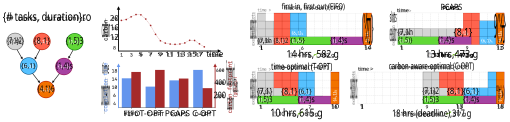Figure 1: Four scheduling policies for a motivating DAG and 18-hour-long carbon intensity trace (on the left hand side). Compared to a carbon-agnostic FIFO scheduler, the time-optimal approach (T-OPT) prioritizes starting the green and purple stages early to reduce completion time. A carbon-aware-optimal approach (C-OPT) with a _deadline_ to finish the DAG within 18 hours reduces carbon emissions by 51.2%, at the expense of increasing time by 28.5% compared to FIFO. By prioritizing green and purple stages during high-carbon periods, PCAPS reduces carbon emissions by 23.1% and still completes the job 7% earlier compared to FIFO. 

## **2.1 Carbon-aware DAG scheduling problem** 

Each job is represented as a directed acyclic graph (DAG) _J_ = _{V ,E}_ , where each node in _V_ is one of _n_ tasks, and each edge in _E_ encodes precedence constraints between tasks – e.g., for tasks _j, j__′_ _∈ V_ , an edge _j → j__′_ indicates that _j__′_ cannot start until after _j_ has completed. A typical data processing cluster includes _K ≥_ 1 machines (or executors). More than one job can simultaneously run on a cluster – e.g., given a set of current jobs _{J }_ , the scheduler assigns tasks to machines over time while respecting precedence and capacity constraints. We index continuous time by _t ≥_ 0. 

The goal of a typical scheduler is _performance_ , e.g., in terms of throughput, utilization, and average job completion time. In this work, we additionally consider the goal of _carbonawareness_ – with respect to a time varying carbon signal given by a function _c_ ( _t_ ) : _t ≥_ 1, a carbon-aware scheduler’s objective is to minimize a combination of typical metrics (i.e., job completion time) and the overall carbon footprint (on both a per-job and a global, cluster basis). 

Although future values of this carbon signal are unknown to the scheduler, in the rest of the paper, we follow prior work [5, 33] and assume that it is bounded by constants _L_ and _U_ that are known to the scheduler, where _L ≤ c_ ( _t_ ) _≤ U_ . In practice, the values of _L_ and _U_ can capture e.g., short-term forecasts of the best and worst carbon conditions on a given electric grid over the next 24 or 48 hours. 

## **2.2 Prior work and motivation** 

Scheduling directed acyclic graphs (DAGs), or more broadly, precedence-constrained tasks, has been extensively studied. Classic results establish the difficulty of this problem: even in its simplest forms, DAG scheduling is NP-hard [36]. To address this, prior work has developed heuristic methods and approximation algorithms [11, 14, 15, 32, 39, 47, 58, 59], ranging from the well-known list scheduling algorithm [25], priority-based algorithms [55], to more complex approaches 

such as genetic programming [10, 16, 52]. These methods often rely on simplifying assumptions, such as fixed task durations or centralized knowledge of the task graph. 

In recent years, DAG scheduling has become a key problem in _data processing frameworks_ such as Apache Airflow, Beam, and Spark, which use DAGs to represent workflows. In Spark, each node of a job’s DAG corresponds to a _stage_ , which encapsulates operations ( _tasks_ ) that can be executed in parallel over partitions of input data. Inter-stage dependencies impose precedence constraints: a stage can only begin once all “parent” stages have completed. Frameworks such as Spark typically implement simple scheduling strategies such as first-in, first-out (FIFO) and fair-share scheduling [22] – these are explainable and efficient in terms of overhead, but suboptimal in terms of job completion time. 

Recent works that revisit scheduling for data processing have explored learning-based techniques, such as reinforcement learning (RL) methods that dynamically learn scheduling policies [26, 30, 38, 48, 65, 68]. Although these methods outperform default policies and hand-tuned heuristics in terms of job completion time, theoretical results for these techniques have proven difficult to obtain. 

Carbon awareness adds a new dimension to the DAG scheduling problem – an online scheduler must consider the time-varying carbon intensity while choosing to assign resources to specific nodes in the job DAG(s), with an overarching goal of reducing carbon footprint, combined with traditional metrics such as job completion time – see Fig. 1 for an illustration of this desired behavior for PCAPS, FIFO, and optimal schedules. As discussed above, the state-of-the-art for carbon-agnostic DAG scheduling falls into two categories: theoretical models that focus on provably near-optimal schedules under idealized assumptions, and heuristic or learningbased methods that do not provide theoretical bounds but perform well in practice. In adding carbon-awareness to the problem, we consider a _middle ground_ that balances between design goals of simplicity, interpretability, configurability, and 

3 

performance. In particular, we seek a carbon-aware scheduler that is tractable for theoretical insight, offering provable bounds on, e.g., the trade-off between carbon and job completion time while not sacrificing the efficiency gains that come from, e.g., learning DAG structure. 

## **3 Theoretical Foundations** 

This section details theoretical underpinnings and intuition for our design in Section 4. Recent literature has studied carbon-aware scheduling problems with a theoretical lens [5, 33, 34, 35], spanning relatively simple suspendresume [33] to settings considering scaling and uncertainty in job lengths [5]. In these online carbon-aware scheduling problems, the key challenge is the inherent uncertainty in future carbon intensity values due to the proliferation of intermittent renewable energy sources. 

A common approach to manage this uncertainty is _threshold-based design_ [4, 33, 63], that uses a predetermined and parameterized threshold function to inform decisions. Among studies that use this design paradigm, a common theoretical performance metric is _competitive ratio_ , which is the worst-case ratio ( _≥_ 1) between the cost of an online algorithm vs. that of an optimal solution. Algorithms designed using this metric are known to be pessimistic in practice [46, 53]. Moreover, existing theoretical studies on carbon-aware scheduling focus on simple settings where, e.g., the job is bound by a deadline, the objective is only to reduce carbon, and precedence constraints are not considered. However, thresholdbased algorithms have been demonstrated to work well in practice: they are often close to optimal provided their inputs are reasonably accurate [13]. 

Carbon-aware DAG scheduling exhibits an inherent tradeoff between carbon savings and job completion time (JCT). Although worst-case metrics (i.e., bounds with respect to an intractable offline solution) have limited utility in this setting, it is still useful to quantify a trade-off between carbon and JCT – to this end, we introduce two metrics that we use in the following sections. We start by introducing some notation: let OPT _K_ ( _J_ ) denote the optimal makespan for job _J_ , and let ALG _K_ ( _J_ ) denote the makespan for the schedule generated by some scheduler ALG (all using a maximum of _K_ machines). 

**Definition 3.1** (Carbon Stretch Factor (CSF)) **.** _Given a scheduling policy (e.g., FIFO), let_ AG _denote the regular (i.e., carbon-agnostic) scheduling policy, and let_ CA _denote a carbon-aware variant of the same scheduling policy. If a is an upper bound such that_ AG _K_ ( _J_ ) _≤ a ·_ OPT _K_ ( _J_ ) : _∀J , and b is an upper bound such that_ CA _K_ ( _J_ ) _≤ b ·_ OPT _K_ ( _J_ ) : _∀J , where b ≥ a, then the_ **_carbon stretch factor_** _is defined as__b_ _/a, which indicates (multiplicatively) how much worse the makespan of_ CA _is compared to_ AG _. Note that__b_ _/a ≥_ 1 _._ 

To quantify carbon savings, we define _C_ ALG( _t_ ) as the instantaneous carbon emissions at time _t_ due to decisions by scheduler 

ALG. It is a function of the number of executors active in ALG’s schedule at time _t_ (denoted by _E_ ALG( _t_ )) and the current carbon intensity: _C_ ALG( _t_ ) := _c_ ( _t_ ) _E_ ALG( _t_ ). 

**Definition 3.2** (Carbon Savings) **.** _Let_ AG _and_ CA _denote a carbon-agnostic and carbon-aware scheduler as outlined in Def 3.1. For a job J , if_ AG _runs from time step_ 0 _until T (its completion time), and_ CA _operates from time_ 0 _to T__′_ _, then_ CA _’s_ **_carbon savings_** _are given by_ �0 _T__C_AG(_t_)_−_ �0 _T ′__C_CA(_t_)_._ 

Using CSF and carbon savings, we describe the desired behavior of a carbon-aware scheduler for data processing. A basic intuition in threshold-based designs is “hedging” between completing tasks now and waiting for lower-carbon periods that may arrive. To do this, thresholds rely on the _range_ of carbon intensities that are expected to appear in the near future (i.e., _L_ and _U_ ). In the context of CSF, this translates into two conditions that a scheduler should satisfy: 

**i)** If the fluctuation of carbon intensity is _low_ (e.g., _L_ and _U_ are close), the CSF should be close to 1, i.e., JCT should be close to that of the carbon-agnostic algorithm. 

**ii)** If the fluctuation is _high_ (e.g., _L_ and _U_ are not close), the CSF should be _finite_ , i.e., the scheduler does not wait indefinitely to complete the job. In threshold-based designs, this is often met by imposing a _deadline_ on the job [24, 33]. 

In the context of the DAG scheduling for data processing workloads, additional unique challenges exist. For instance, in the single job settings considered by prior work, specifying a deadline for each job is straightforward [5, 33]. However, on a cluster scale that considers multiple jobs of unknown length and different arrival times, setting a proper deadline quickly becomes complicated. Instead, our schedulers (see Section 4) guarantee a minimum amount of job progress whenever there are outstanding tasks in the queue. 

Due to precedence constraints, carbon-aware scheduling actions that do not consider the structure of the DAG may inadvertently block bottleneck tasks from processing, having a large negative impact on JCT. This gives a third condition: 

**iii)** When fluctuation is _high_ (i.e., _L_ and _U_ are not close) and the system is in a high-carbon period, a scheduler should carefully consider the _structure_ of a job’s DAG, prioritizing _bottleneck_ tasks to use the limited cluster resources. Conditions **i - iii)** summarize the desired high-level behavior of a carbon-aware scheduler for data processing workloads. In the following section, we present PCAPS that takes into account the above conditions in its design. 

## **4 Design** 

In this section, we present PCAPS, our Precedence- and Carbon-Aware Provisioning and Scheduling system, and then, as a flexible and easy-to-implement alternative, we present CAP (Carbon-Aware Provisioning). 

4 

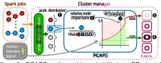Figure 2: PCAPS interfaces with a probabilistic (PB) scheduling policy. Given a probability distribution over nodes ➊, PCAPS computes a _relative importance_ score ➋ that is used to determine which nodes should run based on the current carbon intensity ➌ – e.g., bottleneck nodes impeding job completion run regardless of carbon ➍, while less important nodes can be deferred for lower carbon periods ➎. 

## **4.1 PCAPS** 

From the discussion in Section 3, we seek an interpretable and configurable scheduler that satisfies the conditions **i - iii)** . To this end, we introduce PCAPS (Precedence- and CarbonAware Provisioning and Scheduling), which interfaces with a probabilistic DAG scheduler such as Decima [48]. 

PCAPS’s key idea is a metric of _relative importance_ (Def. 4.2) that is implicitly embedded in a probability distribution over tasks. We define a configurable carbon and importanceaware threshold function that uses the _relative importance_ metric to make per-task fine-grained scheduling decisions – as illustrated in Fig. 2. Next, we detail how the theoretical literature on threshold-based algorithms inspires PCAPS, describe its operation, and discuss analytical results that characterize the trade-off between carbon savings and JCT. 

**PCAPS design.** We first formalize a class of _probabilistic schedulers_ that PCAPS interfaces with, giving a concrete example of an ML scheduler in this class. 

**Definition 4.1** (Probabilistic Scheduler) **.** _At each_ **_scheduling event_** _,_1 _a probabilistic scheduler generates a distribution {pv,t_ : _v ∈ At }, where At denotes the set of tasks that are ready to be executed at time t._ 

One example of a probabilistic scheduler is Decima [48], an RL-based scheduler for data processing workloads. Decima learns actions in the form of scores for each task – a masked softmax is applied to these scores to obtain a probability distribution over _At_ , and the next scheduled task is sampled from this distribution. Recall the motivation behind PCAPS: in addition to ramping down during high-carbon periods and ramping up during low-carbon periods, bottleneck tasks (i.e., tasks with a large score) should be scheduled even if the carbon intensity is high to reduce JCT. To this end, we define a notion of _relative importance_ that compares the probability mass assigned to a single task _v_ against other tasks in _At_ . 

> 1Scheduling events include job arrivals, task completions, and machines becoming available. 

**Algorithm 1** PCAPS (Precedence- and Carbon-Aware Provisioning and Scheduling) 

|1:|**input:**hyperparameterγ, threshold functionΨγ(_·_), probabilistic (carbon-agnostic) schedulerPB|
|---|---|
|2:|**define:**a_scheduling event_occurs wheneverPBis invoked or the carbon intensity_c_(_t_)changes|
|3:|**while**cluster active at time_t ≥_0**do**|
|4:|**if**scheduling event at time_t_ **then**|
|5:|Sample_v ∈At_ and probabilities _pv,t_ :_v ∈At_ fromPB |
|6:|Compute relative importance_rv,t_ = _pv,t_ max_u∈At pu,t_ |
|7:|**if**Ψγ(_rv,t_)_≥c_(_t_)**or**no machines currently busy**then**|
|8:|Send task_v_to an available machine at time_t_|
|9:|**else**|
|10:|Idle until next scheduling event|

**Definition 4.2** (Relative Importance) **.** _Given a time t ≥_ 0 _and node v ∈ At , the relative importance rv,t is defined:_ 

$$
rv,t := pv,t maxu\in{}{}At pu,t \in{}{}[0,1].
$$

If a task’s relative importance is closer to 1, the task is relatively _more important_ , and a value closer to 0 implies the opposite. Note that if _|At |_ = 1 (i.e., only one task can be scheduled), the importance of that task is 1. Leveraging inspiration from threshold-based design, we define scheduling decisions using a threshold function Ψγ that considers the current carbon intensity and the relative importance of a task. γ _∈_ [0 _,_ 1] is a carbon-awareness parameter that controls the “strictness” of the function: γ = 0 recovers carbon-agnostic actions, while γ = 1 is maximally carbon-aware for tasks with low relative importance. We define Ψγ as: 

$$
Ψγ(r) := (γL+(1-γ)U)+[U -(γL+(1-γ)U)] exp(γr)-1 exp(γ)-1 ,
$$

The function Ψγ( _._ ) exhibits an exponential dependence on _r_ , the relative importance of a task. This draws on continuous versions of online search [17, 69], where an exponential trade-off is derived by balancing the marginal reward of the current price against the risk that better prices exist in the future. We interpret relative importance analogously: highimportance tasks are scheduled regardless of carbon intensity to avoid the negative impact of not scheduling them, while low-importance tasks can be deferred to wait for lower-carbon periods with less impact on JCT. This threshold function is used in a _carbon-awareness filter_ of sampled tasks before they are scheduled– we formalize this in Algorithm 1: PCAPS’s carbon-awareness filter accomplishes all three of the motivation points defined in Section 2.2. It schedules (or defers) tasks based on the current carbon intensity _c_ ( _t_ ), with the effect of reducing execution during high-carbon periods. Furthermore, the likelihood of a task being scheduled irrespective of the current carbon intensity is proportional to its importance in the DAG (i.e., in terms of precedence constraints). Note that Ψγ(1) = _U_ – tasks with high relative importance are always scheduled. While deferring a task has a negative 

5 

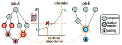Figure 3: Illustrating PCAPS’s carbon-awareness filter. Jobs A and B are DAGs found in TPC-H queries and Alibaba traces, respectively [1, 60]. Highlighted nodes explain two scheduling outcomes. In job A, the sampled node has low relative importance, so it is deferred. In contrast, job B’s sampled node is a _bottleneck_ task with high relative importance: even when the current carbon intensity is high, such tasks are scheduled to avoid increasing job completion time. 

impact on an individual job’s JCT, PCAPS is optimized for the case where multiple DAGs share a cluster. Prioritizing outstanding bottleneck tasks across all jobs helps to manage the system’s _end-to-end completion time_ (ECT) for e.g., a set of jobs. In Fig. 3, we illustrate the intuitions behind PCAPS’s carbon-awareness filter using two sample job DAGs. 

**Analytical results.** We analyze the _carbon stretch factor_ (Def. 3.1) and _carbon savings_ (Def. 3.2) for PCAPS, with full proofs in Appendix B.1. PB denotes a carbon-agnostic probabilistic scheduler throughout. For an arbitrary job _J_ , we let _D_ (γ _,_ **c** ) _∈_ [0 _,_ 1] denote a function that depends on the _expected amount of deferrals_ (i.e., the tasks that PCAPS prevents from being scheduled, which depends on the carbon signal **c** ). See Appendix B.1.1 for a formal definition. 

**Theorem 4.3.** _For time-varying carbon intensities given by_ **c** _, the carbon stretch factor of_ PCAPS _is_ 1 +_D_ 2<u>(</u> _−_<u>γ</u>_<u>,</u>_**c** _<u>K</u>_<u>1)</u>_K._ 

At a high level, _D_ (γ _,_ **c** ) describes the fraction of tasks (in terms of total runtime) that are deferred by PCAPS with a given γ and carbon trace **c** . It is _≤_ 1 for any γ, and _D_ (0 _,_ **c** ) = 0 for any **c** . As γ grows and PCAPS becomes “more carbon-aware”, _D_ (γ _,_ **c** ) grows and CSF increases accordingly. 

We also analyze the _carbon savings_ of PCAPS. Suppose PB’s schedule finishes at time _T_ , and PCAPS’s finishes at time _T__′_ (where _T ≤ T__′_ ). We let _W_ denote the _excess work_ that PCAPS must “make up” with respect to PB’s schedule (i.e., due to deferrals) – note that this implicitly depends on the carbon stretch factor. We let _<u>s</u>_~~(~~ _−_0_,T_) , _<u>s</u>_~~(~~ +0_,T_) , and _<u>c</u>_(_T,T ′_) denote weighted average carbon intensity values based on the schedules of PB and PCAPS. In short, _<u>s</u>_( _−_0_,T_) captures the carbon emissions that PCAPS avoids due to deferrals between time 0 and time _T_ , _<u>s</u>_( +0_,T_) captures the extra carbon (if any) incurred by PCAPS due to higher utilization relative to PB between time 0 and time _T_ , while _<u>c</u>_~~(~~_T,T ′_) captures the emissions that PCAPS incurs after time _T_ . See Appendix B.1.1 for formal definitions of these quantities. 

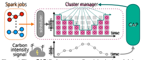Figure 4: The CAP (Carbon-Aware Provisioning) module interacts directly with a _cluster manager_ to specify the _amount of resources_ (e.g., no. of machines) that can be used at any given time, based on a _carbon intensity signal_ . CAP can be implemented without changes to an existing scheduling policy and/or the cluster manager. 

**Theorem 4.4.** _For time-varying carbon intensities given by_ **c** _,_ PCAPS _yields carbon savings of W_ <u>(</u> _<u>s</u>_( _−_0_,T_) _−_ _<u>s</u>_~~(~~ +0_,T_) _−_ _<u>c</u>_~~(~~_T,T ′_) ) _._ 

Taken together, Theorem 4.3 and 4.4 characterize the carbontime trade-off for PCAPS, implying that a larger CSF unlocks greater potential carbon savings. 

## **4.2 Carbon-aware provisioning (CAP)** 

While PCAPS captures all three intuition points in Section 3 by interfacing with a probabilistic scheduler, many existing data processing schedulers use simple policies such as FIFO [22]. This naturally prompts the question of how PCAPS can be _simplified_ to retain many of the same qualities, while interoperating with _any_ scheduler. In particular, PCAPS implicitly performs _resource provisioning_ , changing the amount of resources available to the cluster based on carbon – this is a key technique used by prior work in carbon-aware scheduling [28, 54]. In this section, we introduce CAP (Carbon-Aware Provisioning), a simplified policy that applies a time-varying resource quota to the cluster and coexists with any underlying scheduler. In what follows, we motivate the design and discuss analytical results on its carbon-JCT trade-off. **CAP design.** Given a cluster with _K_ machines, the possible resource quotas are given by _{_ 0 _,_ 1 _,..., K}_ . This set calls to mind the _k_ -search problem [45], where an online player must choose when to purchase _k_ items over a deadlineconstrained sequence of time-varying prices. Variants of _k_ - search have been applied to carbon-aware scheduling with deadlines [27, 33]. CAP uses the _k_ -search threshold set, which captures the trade-off between executing now and waiting for better carbon intensities. Instead of using a deadline, CAP frames the problem of determining a resource quota as _repeated rounds_ of ( _K − B_ )-search, where a minimum quota _B ∈{_ 1 _,..., K}_ always allows the cluster to use _≤ B_ machines, ensuring continuous progress on jobs. The thresholds are given by: 

$$
ΦB =U; Φi+B =U -U -U α 1+ 1 (K -B)α i-1 : i \in{}{}{1,...,K-B}, where α is the solution to 1+ 1 (K-B)α (K-B) = U-L U(1-1 α ). Each
$$

6 

of these thresholds corresponds to a carbon intensity, and a quota is set based on how many values are _above_ the current carbon intensity. Formally, the resource quota at time _t_ is _r_ ( _t_ ) _←_ argmax _i∈R_ Φ _i_ : Φ _i ≤ c_ ( _t_ ). For ease of implementation, this quota is enforced without preemption; when machines become available, new task assignments are only allowed if _r_ ( _t_ ) is greater than the number of busy machines. 

**Analytical results.** We analyze the _carbon stretch factor_ (Def. 3.1) and _carbon savings_ (Def. 3.2) for CAP, with full proofs in Appendix B.2. AG denotes a carbon-agnostic baseline scheduler throughout. Suppose CAP’s schedule completes at time _T__′_ . We let _M_ ( _B,_ **c** ) denote the minimum resource cap specified by CAP at any point in its schedule (note this depends on the carbon signal **c** ). Formally, _M_ ( _B,_ **c** ) := argmax _i∈_ [ _K_ ] Φ _i_ : Φ _i ≤ c_ ( _t_ ) _∀t ∈_ [0 _, T__′_ ]. 

Theorem 4.5. For time-varying carbon intensities given by c,
the carbon stretch factor of CAP is
�
K
M (B,c)
�2 2M (B,c)−1
2K−1
.

We also analyze the _carbon savings_ of CAP. If AG’s schedule finishes at time _T_ (where _T ≤ T__′_ ), we use _W_ as shorthand to denote the _excess work_ that CAP must complete after time _T_ (i.e., after AG has completed). As in Theorem 4.4, we let _<u>s</u>_(0_,T_) and _<u>c</u>_~~(~~_T,T ′_) denote weighted average carbon intensity values based on the schedules of AG and CAP, respectively – in short, _<u>s</u>_~~(~~0_,T_) captures the carbon emissions that CAP avoids by deferring _W_ amount of work relative to AG, while _<u>c</u>_~~(~~_T,T ′_) captures the emissions that CAP incurs after time _T_ . See Appendix B.2.2 for formal definitions of all three quantities. 

**Theorem 4.6.** _For time-varying carbon intensities given by_ **c** _,_ CAP _yields carbon savings of W_ <u>(</u> _<u>s</u>_(0_,T_) _−_ _<u>c</u>_(_T,T ′_) ) _._ 

Theorem 4.5 and 4.6 imply that a larger CSF unlocks greater carbon savings for CAP. We explore the relative performance of PCAPS vs. CAP in our experiments, in Section 6. 

## **5 Implementation** 

We have implemented proof-of-concepts of PCAPS and CAP for Apache Spark on Kubernetes – see Section 5.1 for details. We also conduct large-scale experiments in a realistic Spark simulator – see Section 5.2 for how we extend an existing simulator [48] to evaluate carbon-aware scheduling policies. 

## **5.1 Spark and Kubernetes integration** 

**Resource scaling & stage scheduling.** In Spark deployed on a Kubernetes cluster, each application is submitted to the API server [6] that creates a “driver” running in a pod. We use Spark’s dynamic allocation feature, which enables the driver to create executor pods dynamically as needed by the application – these executors connect with the driver and execute application code. Kubernetes handles the scheduling of (driver and executor) pods for each application, while the Spark driver selects stages to execute within an application. 

To implement CAP, we develop a Python daemon that gets carbon intensity from an API (e.g., Electricity Maps [18]) and adjusts the resources available to Spark. CAP sets a _resource quota_ [2] within a dedicated namespace for Spark apps – our implementation adjusts _CPU and memory_ quotas to correspond with a maximum number of executors. When the quota is _lowered_ , existing pods are _not_ preempted, but new pods are not scheduled until usage falls below the quota. We implemented PCAPS as a pluggable scheduling service that coordinates between Spark and Kubernetes. The service includes inference for Decima [48]. PCAPS gets carbon intensity from an API and collects context about the cluster and job states from Kubernetes and Spark. 

While CAP can be implemented without modifications to Spark or Kubernetes, we made two key changes for PCAPS. First, we implemented a Kubernetes _scheduler plugin_ [12] that communicates with PCAPS to determine which application should receive available resources. This builds on source code APIs exposed by the default kube-scheduler and requires building/configuring a custom scheduler pod. We restrict the scope of our plugin to a dedicated namespace for Spark apps. Next, we made changes to Spark [67] such that each application communicates with PCAPS before choosing the next stage for execution – Spark provides scripts to build a pod Docker image [50] based on a custom build. 

**Setting level of parallelism.** In a Spark DAG, each _stage_ (i.e., node) includes multiple tasks that are parallelizable over multiple executors. Setting a _parallelism limit_ (number of executors working on a stage) is a key component of Spark scheduling (e.g., see [48, Section 5.2]). More executors are not necessarily better: assigning many executors to a stage that does not benefit from parallelism _blocks_ them from working on other jobs in the queue. For _carbon-aware_ scheduling, we enable PCAPS and CAP to set new parallelism limits for the current job each time a stage is scheduled, and particularly to set _lower_ limits during high-carbon periods (e.g., see conditions **i)** and **ii)** , Section 3). 

In PCAPS, if a stage is deferred, it _idles_ (see Alg. 1) the newly freed executors that prompted a scheduling event. Otherwise, the stage’s parallelism limit is set to _P__′_ := _⌈P ·_ min _{_ exp(γ( _L − ct_ )) _,_ (1 _−_ γ) _}⌉_ , where _P_ is the limit chosen by Decima. This mirrors the exponential trade-off in PCAPS’s design – e.g., when the current carbon _ct_ is close to _L_ the limit is set to _⌈_ (1 _−_ γ) _P⌉_ , and as _ct_ grows, the limit decreases exponentially to 1. For CAP, given that the underlying scheduler specifies a parallelism limit _P_ , CAP first attempts to schedule a stage with _P__′_ = _⌈P ·__r_(_t_) _/K⌉_ , where_r_(_t_) _/K_ is the ratio of the resource quota vs. the total number of executors. If the number of available executors is less than _P__′_ , the current stage takes all of the remaining available executors. 

## **5.2 Spark simulator environment** 

Mao et al. [48] developed a simulator that is a faithful rep- 

7 

Table 1: Summary of carbon intensity trace characteristics, including the duration, granularity, minimum, maximum, mean, and coefficient of variation ( _higher value implies more variation_ <u>) for carbon intensities.</u> 

|Gr|id||Avg. C _(in gC_|arbon In _O_2_eq./kW_|tensity _h)_[18]||
|---|---|---|---|---|---|---|
|Co|de|Duration|Min.|Max.|Mean|Coeff. Var.|
||**PJM**|01/01/2020-|293|567|425|0.110|
||**CAISO**|12/31/2022|83|451|274|0.309|
||**ON**|Hourly|12|179|50|0.654|
||**DE**|granularity|130|765|440|0.280|
|~~超~~|**NSW**|26,304|267|817|647|0.143|
|~~K~~|**ZA**|data points|586|785|713|0.046|

resentation of Spark’s _standalone mode_ (i.e., where Spark is the cluster manager), achieving an error (i.e., in run times) of within 5% [48, Fig. 18]. This simulator captures all first-order effects of Spark execution (e.g., delays in executor movement, parallelism overheads) – it has since seen wide use in Spark contexts [3, 23, 29, 40, 49, 56]. We implement PCAPS and CAP as extensions to this simulator, which provides fast evaluation and flexibility. We make the following modifications: 

▶ _Carbon accounting:_ Each job’s carbon footprint is measured _ex post facto_ to avoid impacting simulator fidelity. Once an experiment is complete, existing computations (e.g., executor times) and a carbon trace are used to tally the footprint. ▶ CAP _:_ We implement CAP as a wrapper over three carbonagnostic schedulers in the simulator: FIFO, Decima, and Weighted Fair (a heuristic tuned for the simulator’s test jobs). ▶ PCAPS _:_ We implement PCAPS to interface with Decima, which provides a probability distribution over tasks. With these modifications, the simulator allows us to quickly test many scenarios with a high degree of accuracy. 

## **6 Evaluation** 

We evaluate our carbon-aware schedulers in a prototype cluster and a realistic Spark simulator, using workloads from TPCH benchmarks [60] and Alibaba production DAG traces [1]. We answer the following questions: 

1. How do PCAPS and CAP navigate the trade-off between carbon emissions and job completion time? 

2. How do PCAPS and CAP adapt to changes in carbon intensity characteristics and workload characteristics? 

## **6.1 Experimental setup** 

**Carbon intensity traces.** We use historical carbon traces from six regions [18] – each trace provides hourly carbon intensity data in grams of CO2 equivalent per kilowatt-hour (gCO2eq./kWh). The chosen power grids represent different energy generation mixes and thus different characteristics in 

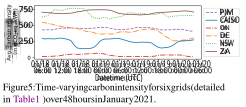terms of average carbon intensity and variability; we evaluate how these impact the behavior of PCAPS and CAP. In Table 1 and Fig. 5, we give snapshots of each region, showing how grid characteristics impact time-varying carbon intensity. Larger _coefficients of variation_ (the ratio of the standard deviation to the mean) correspond to greater renewable penetration – for instance, a large fraction of CAISO’s capacity is solar PV, while the capacity in ZA is predominantly coal. 

To better observe the behavior of our carbon-aware schedulers, we follow prior work [24] and scale time in our experiments such that 1 minute of _real time_ corresponds to 1 hour of _experiment time_ – since carbon intensity is reported hourly, this approximates a scenario where each job works with large amounts of data and runs for several hours, as is becoming common in e.g., data curation for LLMs [7, 8, 9, 44, 61]. **Workload traces.** For workloads, we use TPC-H benchmarks [60] and real DAG traces from a production Alibaba cluster [1]. We construct workloads such that the inter-arrival times follow a Poisson distribution while specific jobs are randomly picked from the respective traces. In the main body, we consider an average inter-arrival time of 30 minutes (30 real-time seconds), with additional experiments measuring the impact of this parameter in Appendix A.2. 

The TPC-H queries we experiment with operate on synthetic data with scales of 2 GB, 10 GB, and 50 GB – these correspond to average real durations of 180 seconds, 386 seconds, and 1,261 seconds when given a single executor. In our prototype experiments, we also construct workloads based on DAG information from the Alibaba trace [1]. These DAGs exhibit a realistic power law distribution (many DAGs of short duration, few DAGs of long duration), they have 66 nodes on average, and an average total duration (on one executor) of 7,989 seconds. We scale all durations by1 _/_ 60 to match our experiment scale – this yields jobs that take 2.2 real-time minutes to complete on average. 

In the simulator, each experiment is run over a full carbon trace (spanning three years of data). In the prototype, each experiment is run for several trials, where each starts at a uniformly randomly chosen time in the carbon trace, and new carbon intensities are reported once per (real-time) minute. In both implementations, the upper and lower bounds of _U_ and _L_ correspond to the maximum and minimum forecasted carbon intensities over a lookahead window of 48 hours. **Baselines.** We compare against the following baselines: 

▶ **Default Spark/Kubernetes behavior (default)** : The 

8 

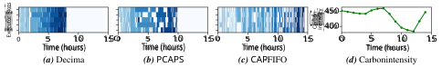Figure 6: Visualizing executor usage over time for three schedulers, _(a)_ Decima, _(b)_ PCAPS, and _(c)_ CAP-FIFO in a small simulator cluster with 5 executors and 20 TPC-H jobs, over a 15 hour period in the DE grid. _(d)_ In the executor plots, each job is a unique shade of blue, while “idle” executors are indicated by a white background. 

default behavior of Spark on Kubernetes – Spark uses first in, first out (FIFO) to choose stages within a job, while the Kubernetes scheduler mediates between pods of each job during execution [21]. In the simulator’s Spark standalone mode, this baseline implements only the FIFO scheduling. 

▶ **Decima** : An RL scheduler for Spark that is optimized for job completion time [48]. We use the simulator’s training environment to train Decima for 20,000 epochs. 

▶ **Weighted Fair** : A heuristic that assigns executors proportionally to each job’s workload, with tuned weights to improve performance on the simulated workloads [48]. 

▶ **GreenHadoop:** A MapReduce framework proposed to leverage green energy by matching workloads with the availability of solar [24]. This framework predates Spark, so we adapt its key ideas for DAG scheduling in the simulator – see Appendix A.1 for implementation details. 

**Metrics.** We use three metrics to evaluate the fidelity of our approach in reducing carbon footprint without significantly impacting the completion time. 

▶ **Carbon Footprint** : We report the carbon footprint for various scheduling policies as a percentage decrease of the carbon-agnostic default baseline unless stated otherwise. The values are in the range of [-100%, ∞), with negative values indicating a carbon reduction and positive values indicating an increase relative to the baseline. 

▶ **Job Completion Time (JCT)** : We report the average job completion time across all the jobs in each experimental run. We report JCT as a fraction of the average JCT for the carbon-agnostic default baseline unless stated otherwise. The values can be in the (0, ∞) range, with below 1 indicating a reduction in JCT and above 1 indicating an increase in JCT. 

▶ **End-to-end Completion Time (ECT)** : We report the total time to complete all the jobs in a given experiment as the end-to-end completion time (ECT) as a fraction of the ECT for carbon-agnostic default. Its values lie in the same range as JCT. However, while JCT focuses on individual jobs, ECT represents the system’s throughput and efficiency. Also, as PCAPS and CAP focus on minimizing the total carbon footprint for a set of jobs and not the instantaneous rate of carbon consumption, ECT is a better metric for performance with respect to time in our case. 

## **6.2 Carbon-aware schedulers in action** 

Before moving to our main results, we demonstrate the carbonaware behavior of our schedulers in Fig. 6, which visualizes the schedules generated by Decima, PCAPS and CAP-FIFO during a short period in the DE grid on the simulator. PCAPS makes fine-grained scheduling decisions, idling specific executors during the high-carbon period ( _t_ = (5 _,_ 8)) while keeping bottleneck tasks running, achieving the lowest carbon footprint of the three schedules shown. This is in contrast to CAP-FIFO, which applies a resource quota uniformly across the cluster without consideration of bottlenecks – note the gaps in CAPFIFO’s schedule that are straight vertical lines across multiple executors. Just before _t_ = 5, a large gap in the schedule indicates that CAP-FIFO cannot run tasks because it did not prioritize bottleneck tasks early on. 

Table 2: Summary of prototype results averaged over all six carbon traces. Each metric is normalized with respect to the Spark / Kubernetes default. PCAPS and CAP are configured to be moderately carbon aware. 

|**_Metric normalized_** **_w.r.t. Default_**|**Default**|**Decima**[48]|**CAP**|**PCAPS**|
|---|---|---|---|---|
|CO2 Reduction (%)|0%|1.2%|24.7%|**32.9%**|
|Avg. ECT|1.0|0.857|1.126|**1.013**|
|Avg. JCT|1.0|0.852|1.996|**1.381**|

## **6.3 Prototype experiments** 

Our prototype is deployed on an OpenStack cluster running Kubernetes v1.31 and Spark v3.5.3 (both modified per Section 5) in Chameleon Cloud [31]. Our testbed consists of 51 m1.xlarge virtual machines, each with 8 VCPUs and 16GB of RAM. One VM is designated as the control plane node, while the remaining 50 are workers, each hosting two executor pods. Our Spark configuration allocates 4 VCPUs and 7GB of RAM to each of the 100 executors2 . To avoid a known issue with Spark’s dynamic allocation feature that can cause it to hang on Kubernetes [21], we configure an upper limit of 25 executors that can be allocated to any single job. We implement a carbon intensity API that replays historical traces to test our carbon-aware schedulers in the prototype. In our prototype, we implement default and Decima as the 

> 2Spark’s default _memory overhead factor_ is 10%. The difference between 7GB ( _×_ 2) and the 16GB RAM of each worker is to accommodate this [20]. 

9 

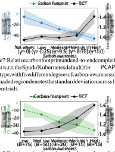Figure 7: Relative carbon footprint and end-to-end completion times (w.r.t. the Spark/Kubernetes default) for PCAPS in the prototype, with five different degrees of carbon-awareness (γ). The shaded region denotes the standard deviation across 10 random trials. 

Figure 8: Relative carbon footprint and end-to-end completion times (w.r.t. the Spark/Kubernetes default) for CAP in the prototype, with five different degrees of carbon-awareness ( _B_ ). The shaded region denotes the standard deviation across 10 random trials. 

baselines. Unless stated otherwise, the results are averaged over the batch sizes of 25, 50, and 100 jobs. Furthermore, the results for each experimental configuration are averaged over 10 trials. 

**Results.** Table 2 presents the results for our prototype experiments. PCAPS and CAP configured to be _moderately carbonaware_ (CAP is configured with _B_ = 20 and PCAPS is configured with γ = 0 _._ 5) achieve average carbon reductions of 32.8% and 24.6% compared to the default baseline, respectively. Compared to Decima, PCAPS reduces carbon by 32.1%. 

In terms of JCT, PCAPS performs significantly worse than the default and Decima baselines; JCT increases by 38.1% and 62% with respect to the default and Decima, respectively. This is expected since Decima targets minimizing average JCT. However, the key objective of PCAPS is to reduce the total carbon footprint without increasing ECT. PCAPS increases average ECT by only 12.4% compared to Decima and 1.3% compared to the default. CAP also performs well and increases average ECT by 12.6% on top of the default. 

**Trade-offs between carbon and job completion time.** We next test several parameter settings for PCAPS and CAP to configure their carbon awareness in the DE grid region with batches of 50 TPC-H or Alibaba jobs. Fig. 7 plots the carbon-time trade-off for five settings of PCAPS relative to the Spark/Kubernetes default. Increasing the carbon awareness of PCAPS improves carbon savings at the expense of longer ECT, with a most pronounced effect for values of γ 

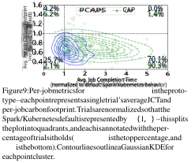approaching 1. Conversely, Fig. 8 plots the same carbon-time trade-off for five settings of CAP; CAP sacrifices more in ECT (relative to PCAPS) for the same amount of carbon savings. 

On a per-job level, we observe similar trends in Fig. 9, which plots average JCT and average _per-job_ carbon footprint across trials of prototype experiments where PCAPS and CAP are configured to be moderately carbon-aware. Contour lines represent Gaussian kernel density estimators of the _outcome distribution_ – note that the location of each “hot spot” represents the scheduler average. Splitting the plot into quadrants, we observe that PCAPS improves on the baseline scheduler’s per-job carbon footprint in 95.8% of trials, corresponding to the lower two quadrants. PCAPS improves on _both_ carbon and completion time in 25.7% of cases, while CAP does so in only 2.1% of cases. 

**Effects of carbon intensity trace characteristics.** Next, we analyze the effect of grid characteristics on the carbon-time trade-offs of our carbon-aware schedulers using subsets of each carbon trace (via 30 trials with 25, 50, and 100 jobs). 

Fig. 10 plots the carbon reduction and average ECT of PCAPS, CAP, and Decima. Decima is carbon-agnostic and shows a minimal reduction in carbon that stays relatively constant across all regions. PCAPS and CAP incorporate grid behavior into their decisions, and we observe a positive relationship between the variability of a carbon trace and the resulting carbon reduction. For example, in ZA where carbon is relatively constant, high-carbon periods do not prompt PCAPS to defer tasks since the _future potential reductions_ are insignificant. In contrast, high-carbon periods in the CAISO grid correspond to nighttime scenarios on the grid, where the prospect of daytime solar bolsters future potential reductions. These interactions are further illustrated through ECT – grid regions with more intermittent and variable energy mixes drive increases in ECT in exchange for more carbon reduction, since PCAPS and CAP _wait_ for potential reductions. 

10 

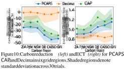## **6.4 Simulator experiments** 

In the simulator, we evaluate PCAPS and CAP using TPCH workloads, comparing them against **Weighted Fair** and **GreenHadoop** baselines, in addition to the Decima and default baselines from prototype experiments. We renamed the default baseline as FIFO for simulation-based experiments for accurate representation. 

**Simulator fidelity.** To establish the fidelity of our simulator, we illustrate the granular effect of differences for a batch of 50 TPC-H jobs in Appendix A.1.2. A notable difference between the prototype and the simulator is the relative performance of the main baseline (FIFO in the simulator, Spark/Kubernetes default in the prototype). In short, the simulator’s FIFO scheduler _over-assigns_ executors to individual jobs, blocking others from entering service (thus increasing JCT) – this also increases its relative carbon footprint compared to the default behavior of our prototype. 

**Results.** Table 3 presents our top-line results showing PCAPS and CAP achieve significant reductions in carbon emissions compared to the baselines. Configured to be moderately carbon-aware, PCAPS achieves an average reduction of 23.1% compared to Decima, and a reduction of 39.7% compared to FIFO. CAP achieves an average carbon reduction of 22.7% when implemented on top of FIFO, 25.1% on top of Weighted Fair, and 14.5% on top of Decima. For 25, 50, and 100 jobs, PCAPS increases average end-to-end completion time (ECT) by 7.7% with respect to Decima, which is only a 4.5% degradation compared to FIFO. For CAP, average ECT increases by 10.8% when implemented on top of (and compared to) FIFO, 4.0% on top of Weighted Fair, and 9.3% on top of Decima. 

At a per-job level, PCAPS increases the average job completion time (JCT) by 119.57% compared to Decima. Similarly, CAP increases average JCT by 127.4%, 86.6%, and 126.8% when implemented with FIFO, Weighted Fair, and Decima respectively. Larger increases in JCT relative to ECT happen because PCAPS allows more queue build-up during high-carbon periods, but “makes up for lost time” in low-carbon periods. **Trade-offs between carbon and job completion time.** In the results summary, we observe positive carbon reduction in exchange for degradation in JCT and ECT. Since PCAPS and CAP can be configured to be more or less carbon-aware, we 

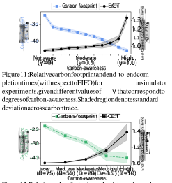Figure 12: Relative carbon footprint and end-to-end completion times (with respect to FIFO) for CAP-FIFO in simulator experiments, given different values of _B_ that correspond to degrees of carbon-awareness. Shaded region denotes standard deviation across carbon trace. 

explore this _trade-off_ in the DE grid with batches of 50 jobs. We vary hyperparameters γ (PCAPS) and _B_ (CAP) to measure the impact of configuration on both carbon and JCT. 

In Fig. 11, we illustrate this trade-off for PCAPS compared against FIFO. As the carbon-awareness of PCAPS increases (indicated by the value of γ), the carbon savings of PCAPS improve at the expense of longer ECT. This effect is most pronounced for large values of γ approaching 1, because PCAPS defers many tasks to lower carbon periods. Conversely, Fig. 12 illustrates the trade-off for CAP-FIFO, showing a similar trend of improving carbon at the expense of longer ECT. Compared to Fig. 11, CAP-FIFO sacrifices more in terms of ECT for the same or lower amounts of carbon savings, and the increase in completion time begins earlier (at lower degrees of carbonawareness). 

**Advantages of relative importance.** Between PCAPS and CAP-Decima, the carbon-agnostic scheduler is identical – thus, performance differences can be attributed to the key ideas behind PCAPS, namely relative importance (see Section 4.1). In what follows, we examine this in detail using the DE grid region with batches of 50 jobs. We configure PCAPS and CAP-Decima with ten parameter settings for varying carbonawareness. Fig. 13 plots the result of this experiment, where each dot denotes the outcome of one trial. We fit a cubic polynomial to the outcomes of both methods to illustrate the key trend: PCAPS exhibits a strictly better trade-off between carbon footprint and ECT. For trials where either method achieves 

11 

Table 3: Summary of results for simulator experiments averaged over all 6 tested carbon traces. Each metric is normalized with respect to the default Spark FIFO behavior. PCAPS and CAP are configured to be moderately carbon-aware, and end-to-end completion time measures the total flow time for batches of jobs arriving continuously. 

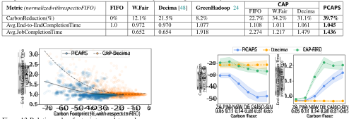Figure 13: Relative carbon footprint vs. end-to-end completion time for PCAPS and CAP-Decima in simulator experiments, given varying parameters γ _∈_ [0 _._ 1 _,_ 1 _._ 0] and _B ∈{_ 5 _,_ 10 _,...,_ 85 _}_ that correspond to degrees of carbonawareness. Each dot represents an individual trial, and lines represent a cubic polynomial of best fit. 

carbon savings between 35% and 45%, PCAPS increases ECT by an average of 7.9%, while CAP-Decima increases it by an average of 42.7%. Conversely, for those trials where either method increases ECT by between 0% and 10%, PCAPS achieves average carbon savings of 35.6%, while CAP-Decima achieves an average savings of only 20.1%. 

**Effects of carbon intensity trace characteristics.** The top-line results in Table 3 average over all six grid regions. We configure both schedulers to be moderately carbon-aware and characterize each carbon trace based on its _coefficient of variation_ . In Fig. 14, we plot the carbon reduction and ECT for each of CAP-FIFO, PCAPS, and Decima. Decima’s carbon reduction relative to the default is higher relative to that observed in the prototype – this is due to differences between Spark’s standalone FIFO scheduler and the Spark/Kubernetes behavior of our prototype (see Appendix A.1.2). Similarly, PCAPS’s “baseline” carbon reductions increase alongside Decima’s, and CAP gains relative ground compared to CAP-FIFO in the simulator. We observe similar trends overall – grid regions with more intermittent and variable energy mixes due to renewables drive increases in both carbon reduction and ECT, as observed in Fig. 10. 

Figure 14: Carbon reduction _(left)_ and increase in end-to-end completion time _(right)_ for CAP, PCAPS, and Decima (relative to FIFO) in six grid regions. Shaded areas denote the standard deviation across a carbon trace. 

25.1% with respect to the scheduler it is implemented on, in exchange for slightly larger increases in ECT. While CAP does not take dependencies into account and is suboptimal in terms of the carbon-time trade-off (see Fig. 13), it is easier to implement and more general than PCAPS. Intuitively, the performance of all carbon-aware techniques exhibits a dependence on the time-varying behavior of the power grid. Greater carbon savings can be achieved in regions with more renewables (thus more variability) in carbon intensity. 

## **7 Conclusion** 

PCAPS demonstrates that an augmented scheduler that directly takes both the carbon cost of computation and precedence constraints (e.g., in the DAG of a data processing job) into consideration can achieve a favorable trade-off between carbon savings and completion time. Through experiments, we show that PCAPS’s configurability enables a scheduling policy that meaningfully reduces the carbon footprint of data processing without prohibitive increases in completion time. Furthermore, our detailed analytical and experimental study of CAP provides another avenue towards configurable carbon-aware scheduling that is broadly applicable and easy-to-implement. 

## **6.5 Takeaways** 

Through evaluation in a realistic simulator and a prototype cluster, we show that a moderately carbon-aware PCAPS reduces carbon emissions by up to 39.7% in exchange for modest increases ( _<_ 10%) in ECT for batches of 25, 50, and 100 data processing jobs. CAP configured to be moderately carbonaware ( _B_ = 20) is also effective, reducing carbon by up to 

## **References** 

- [1] Alibaba. Cluster data collected from production clusters in alibaba for cluster management research, 2018. URL https://github.com/alibaba/clusterdata/ tree/master/cluster-trace-v2018. 

- [2] The Kubernetes Authors. Resource Quotas – kuber- 

12 

netes documentation. https://kubernetes.io/docs/ concepts/policy/resource-quotas/, 2025. [Accessed 23-01-2025]. 

- [3] Vivek Bengre, M Reza HoseinyFarahabady, Mohammad Pivezhandi, Albert Y Zomaya, and Ali Jannesari. A learning-based scheduler for high volume processing in data warehouse using graph neural networks. In _International Conference on Parallel and Distributed Computing: Applications and Technologies_ , pages 175– 186. Springer, 2021. 

- [4] Roozbeh Bostandoost, Walid A. Hanafy, Adam Lechowicz, Noman Bashir, Prashant Shenoy, and Mohammad Hajiesmaili. Data-driven Algorithm Selection for Carbon-Aware Scheduling. In _Proceedings of the 3rd Workshop on Sustainable Computer Systems_ , HotCarbon ’24, July 2024. 

- [5] Roozbeh Bostandoost, Adam Lechowicz, Walid A. Hanafy, Noman Bashir, Prashant Shenoy, and Mohammad Hajiesmaili. LACS: Learning-Augmented Algorithms for Carbon-Aware Resource Scaling with Uncertain Demand. In _Proceedings of the 15th ACM International Conference on Future and Sustainable Energy Systems_ , e-Energy ’24, page 27–45, New York, NY, USA, 2024. Association for Computing Machinery. ISBN 9798400704802. doi: 10.1145/3632775.3661942. URL https://doi.org/10.1145/3632775.3661942. 

- [6] Eric Brewer. Kubernetes and the path to cloud native. Santa Clara, CA, July 2015. USENIX Association. 

- [7] Tom B. Brown, Benjamin Mann, Nick Ryder, Melanie Subbiah, Jared Kaplan, Prafulla Dhariwal, Arvind Neelakantan, Pranav Shyam, Girish Sastry, Amanda Askell, Sandhini Agarwal, Ariel Herbert-Voss, Gretchen Krueger, Tom Henighan, Rewon Child, Aditya Ramesh, Daniel M. Ziegler, Jeffrey Wu, Clemens Winter, Christopher Hesse, Mark Chen, Eric Sigler, Mateusz Litwin, Scott Gray, Benjamin Chess, Jack Clark, Christopher Berner, Sam McCandlish, Alec Radford, Ilya Sutskever, and Dario Amodei. Language models are few-shot learners, 2020. URL https://arxiv.org/abs/2005. 14165. 

- [8] Maximilian Böther, Dan Graur, Xiaozhe Yao, and Ana Klimovic. Decluttering the data mess in llm training. Austin, 2024. HotInfra 2024. doi: 10.3929/ ethz-b-000717691. 2nd Workshop on Hot Topics in System Infrastructure (HotInfra 2024); Conference Location: Austin, TX, USA; Conference Date: November 3, 2024. 

- [9] Daoyuan Chen, Yilun Huang, Zhijian Ma, Hesen Chen, Xuchen Pan, Ce Ge, Dawei Gao, Yuexiang Xie, 

Zhaoyang Liu, Jinyang Gao, Yaliang Li, Bolin Ding, and Jingren Zhou. Data-juicer: A one-stop data processing system for large language models. In _Companion of the 2024 International Conference on Management of Data_ , SIGMOD/PODS ’24, page 120–134, New York, NY, USA, 2024. Association for Computing Machinery. ISBN 9798400704222. doi: 10.1145/3626246.3653385. URL https://doi.org/10.1145/3626246.3653385. 

- [10] Runwei Cheng, Mitsuo Gen, and Yasuhiro Tsujimura. A tutorial survey of job-shop scheduling problems using genetic algorithms—i. representation. _Computers & industrial engineering_ , 30(4):983–997, 1996. 

- [11] Fabián A Chudak and David B Shmoys. Approximation algorithms for precedence-constrained scheduling problems on parallel machines that run at different speeds. _Journal of Algorithms_ , 30(2):323–343, February 1999. ISSN 0196-6774. doi: 10.1006/jagm.1998.0987. URL http://dx.doi.org/10.1006/jagm.1998.0987. 

- [12] Kubernetes Community. Scheduler plugins, 2021. URL https://github.com/kubernetes-sigs/ scheduler-plugins. 

- [13] Mohammadreza Daneshvaramoli, Helia Karisani, Adam Lechowicz, Bo Sun, Cameron Musco, and Mohammad Hajiesmaili. Competitive algorithms for online knapsack with succinct predictions, 2024. URL https: //arxiv.org/abs/2406.18752. 

- [14] Sami Davies, Janardhan Kulkarni, Thomas Rothvoss, Jakub Tarnawski, and Yihao Zhang. Scheduling with communication delays via lp hierarchies and clustering, 2020. URL https://arxiv.org/abs/2004.09682. 

- [15] Sami Davies, Janardhan Kulkarni, Thomas Rothvoss, Jakub Tarnawski, and Yihao Zhang. _Scheduling with Communication Delays via LP Hierarchies and Clustering II: Weighted Completion Times on Related Machines_ , page 2958–2977. Society for Industrial and Applied Mathematics, January 2021. ISBN 9781611976465. doi: 10.1137/1.9781611976465.176. URL http://dx. doi.org/10.1137/1.9781611976465.176. 

- [16] Lawrence Davis. Job shop scheduling with genetic algorithms. In _Proceedings of the first International Conference on Genetic Algorithms and their Applications_ , pages 136–140. Psychology Press, 2014. 

- [17] Ran El-Yaniv, Amos Fiat, Richard M. Karp, and G. Turpin. Optimal Search and One-Way Trading Online Algorithms. _Algorithmica_ , 30(1):101–139, May 2001. 

- [18] Electricity Maps. Electricity Map. https://www. electricitymap.org/map, Accessed September 2023. 

13 

- [19] Jessica Fan, Werner Rehm, Giulia Siccardo, and McKinsey & Company. The state of internal carbon pricing. https://www.mckinsey.com/capabilities/ strategy-and-corporate-finance/ our-insights/the-state-of-internal-carbon-pricing, 2021. 

   - [28] Walid A. Hanafy, Qianlin Liang, Noman Bashir, David Irwin, and Prashant Shenoy. CarbonScaler: Leveraging Cloud Workload Elasticity for Optimizing CarbonEfficiency. _Proc. of the ACM on Measurement and_ 

   - , _Analysis of Computing Systems_ , 7(3), Dec 2023. 

   - [29] Zhibo Hu, Chen Wang, Helen, Paik, Yanfeng Shu, and Liming Zhu. Learning interpretable scheduling algorithms for data processing clusters, 2024. URL https://arxiv.org/abs/2405.19131. 

- [20] The Apache Software Foundation. Configuration – Spark Documentation. https://spark.apache.org/ docs/3.5.3/configuration.html, 2024. [Accessed 12-12-2024]. 

   - [30] Muhammed Tawfiqul Islam, Shanika Karunasekera, and Rajkumar Buyya. Performance and cost-efficient spark job scheduling based on deep reinforcement learning in cloud computing environments. _IEEE Transactions on Parallel and Distributed Systems_ , 33(7):1695–1710, 2021. 

- [21] The Apache Software Foundation. Running Spark on Kubernetes – Spark Documentation. https://spark.apache.org/docs/3.5.3/ running-on-kubernetes.html, 2024. [Accessed 12-12-2024]. 

- [22] The Apache Software Foundation. Job Scheduling – Spark Documentation. https://spark.apache.org/ docs/3.5.3/job-scheduling.html, 2024. [Accessed 12-12-2024]. 

   - [31] Kate Keahey, Jason Anderson, Zhuo Zhen, Pierre Riteau, Paul Ruth, Dan Stanzione, Mert Cevik, Jacob Colleran, Haryadi S. Gunawi, Cody Hammock, Joe Mambretti, Alexander Barnes, François Halbach, Alex Rocha, and Joe Stubbs. Lessons learned from the chameleon testbed. In _Proceedings of the 2020 USENIX Annual Technical Conference (USENIX ATC ’20)_ . USENIX Association, July 2020. 

- [23] Arkadiy Gertsman. A faster reinforcement learning approach to efficient job scheduling in apache spark. Master’s thesis, University of Illinois at Urbana-Champaign, 2023. 

- [24] Íñigo Goiri, Kien Le, Thu D. Nguyen, Jordi Guitart, Jordi Torres, and Ricardo Bianchini. GreenHadoop: Leveraging Green Energy in Data-Processing Frameworks. In _Proceedings of the 7th ACM European Conference on Computer Systems_ , EuroSys ’12, page 57–70, New York, NY, USA, 2012. Association for Computing Machinery. ISBN 9781450312233. doi: 10.1145/2168836.2168843. URL https://doi.org/ 10.1145/2168836.2168843. 

   - [32] Alexandra Anna Lassota, Alexander Lindermayr, Nicole Megow, and Jens Schlöter. Minimalistic predictions to schedule jobs with online precedence constraints. In Andreas Krause, Emma Brunskill, Kyunghyun Cho, Barbara Engelhardt, Sivan Sabato, and Jonathan Scarlett, editors, _Proceedings of the 40th International Conference on Machine Learning_ , volume 202 of _Proceedings of Machine Learning Research_ , pages 18563–18583. PMLR, 23–29 Jul 2023. URL https://proceedings. mlr.press/v202/lassota23a.html. 

- [25] R. L. Graham. Bounds for certain multiprocessing anomalies. _The Bell System Technical Journal_ , 45 (9):1563–1581, 1966. doi: 10.1002/j.1538-7305.1966. tb01709.x. 

   - [33] Adam Lechowicz, Nicolas Christianson, Jinhang Zuo, Noman Bashir, Mohammad Hajiesmaili, Adam Wierman, and Prashant Shenoy. The Online Pause and Resume Problem: Optimal Algorithms and An Application to Carbon-Aware Load Shifting. _Proc. of the ACM on Measurement and Analysis of Computing Systems_ , 7(3), Dec 2023. 

- [26] Nathan Grinsztajn, Olivier Beaumont, Emmanuel Jeannot, and Philippe Preux. Geometric deep reinforcement learning for dynamic dag scheduling. In _2020 IEEE Symposium Series on Computational Intelligence (SSCI)_ , page 258–265. IEEE, December 2020. doi: 10.1109/ssci47803.2020.9308278. URL http://dx. doi.org/10.1109/SSCI47803.2020.9308278. 

   - [34] Adam Lechowicz, Nicolas Christianson, Bo Sun, Noman Bashir, Mohammad Hajiesmaili, Adam Wierman, and Prashant Shenoy. Online Conversion with Switching Costs: Robust and Learning-augmented Algorithms. In _Proc. of the 2024 SIGMETRICS/Performance Joint International Conference on Measurement and Modeling of Computer Systems_ , New York, NY, USA, June 2024. Association for Computing Machinery. 

- [27] Walid A. Hanafy, Roozbeh Bostandoost, Noman Bashir, David Irwin, Mohammad Hajiesmaili, and Prashant Shenoy. The War of the Efficiencies: Understanding the Tension between Carbon and Energy Optimization. In _Proc. of the 2nd Workshop on Sustainable Computer Systems_ . ACM, Jul 2023. 

14 

- [35] Adam Lechowicz, Nicolas Christianson, Bo Sun, Noman Bashir, Mohammad Hajiesmaili, Adam Wierman, and Prashant Shenoy. Chasing Convex Functions with Long-term Constraints. In _Proceedings of the 41st International Conference on Machine Learning_ , ICML’24. JMLR, 2024. 

- [36] J. K. Lenstra and A. H. G. Rinnooy Kan. Complexity of scheduling under precedence constraints. _Operations Research_ , 26(1):22–35, 1978. ISSN 0030364X, 15265463. URL http://www.jstor.org/stable/ 169889. 

- [37] Baolin Li, Siddharth Samsi, Vijay Gadepally, and Devesh Tiwari. Clover: Toward Sustainable AI with Carbon-Aware Machine Learning Inference Service. In _Proceedings of the International Conference for High Performance Computing, Networking, Storage and Analysis_ , SC ’23, New York, NY, USA, 2023. Association for Computing Machinery. ISBN 9798400701092. doi: 10.1145/3581784.3607034. URL https://doi.org/ 10.1145/3581784.3607034. 

- [38] Hongjian Li, Liang Lu, Wenhu Shi, Gangfan Tan, and Hao Luo. Energy-aware scheduling for spark job based on deep reinforcement learning in cloud. _Computing_ , 105(8):1717–1743, March 2023. ISSN 1436-5057. doi: 10.1007/s00607-023-01171-z. URL http://dx.doi. org/10.1007/s00607-023-01171-z. 

- [39] Shi Li. Scheduling to minimize total weighted completion time via time-indexed linear programming relaxations. In _2017 IEEE 58th Annual Symposium on Foundations of Computer Science (FOCS)_ , page 283–294. IEEE, October 2017. doi: 10.1109/focs.2017.34. URL http://dx.doi.org/10.1109/FOCS.2017.34. 

- [40] Xinran Li and Zhaohao Ding. Cost efficient job scheduling scheme for large scale data center. In _2023 IEEE/IAS Industrial and Commercial Power System Asia (I&CPS Asia)_ , pages 2267–2272, 2023. doi: 10.1109/ICPSAsia58343.2023.10294452. 

- [41] Xinyu Lin, Wenjie Wang, Yongqi Li, Shuo Yang, Fuli Feng, Yinwei Wei, and Tat-Seng Chua. Data-efficient fine-tuning for llm-based recommendation. In _Proceedings of the 47th International ACM SIGIR Conference on Research and Development in Information Retrieval_ , SIGIR ’24, page 365–374, New York, NY, USA, 2024. Association for Computing Machinery. ISBN 9798400704314. doi: 10.1145/3626772.3657807. URL https://doi.org/10.1145/3626772.3657807. 

- [42] Qidong Liu, Xian Wu, Xiangyu Zhao, Yuanshao Zhu, Derong Xu, Feng Tian, and Yefeng Zheng. When moe meets llms: Parameter efficient fine-tuning for multitask medical applications. In _Proceedings of the 47th International ACM SIGIR Conference on Research and_ 

_Development in Information Retrieval_ , SIGIR ’24, page 1104–1114, New York, NY, USA, 2024. Association for Computing Machinery. ISBN 9798400704314. doi: 10.1145/3626772.3657722. URL https://doi.org/ 10.1145/3626772.3657722. 

- [43] Wenyu Liu, Yuejun Yan, Yimeng Sun, Hongju Mao, Ming Cheng, Peng Wang, and Zhaohao Ding. Online job scheduling scheme for low-carbon data center operation: An information and energy nexus perspective. _Applied Energy_ , 338:120918, 2023. 

- [44] Yiheng Liu, Hao He, Tianle Han, Xu Zhang, Mengyuan Liu, Jiaming Tian, Yutong Zhang, Jiaqi Wang, Xiaohui Gao, Tianyang Zhong, Yi Pan, Shaochen Xu, Zihao Wu, Zhengliang Liu, Xin Zhang, Shu Zhang, Xintao Hu, Tuo Zhang, Ning Qiang, Tianming Liu, and Bao Ge. Understanding llms: A comprehensive overview from training to inference, 2024. URL https://arxiv.org/abs/ 2401.02038. 

- [45] Julian Lorenz, Konstantinos Panagiotou, and Angelika Steger. Optimal Algorithms for k-Search with Application in Option Pricing. _Algorithmica_ , 55(2):311–328, August 2008. 

- [46] Thodoris Lykouris and Sergei Vassilvtiskii. Competitive Caching with Machine Learned Advice. In Jennifer Dy and Andreas Krause, editors, _Proc. of the 35th International Conference on Machine Learning_ , volume 80 of _Proc. of Machine Learning Research_ , pages 3296–3305. PMLR, 10–15 Jul 2018. 

- [47] Biswaroop Maiti, Rajmohan Rajaraman, David Stalfa, Zoya Svitkina, and Aravindan Vijayaraghavan. Scheduling precedence-constrained jobs on related machines with communication delay, 2020. URL https:// arxiv.org/abs/2004.10776. 

- [48] Hongzi Mao, Malte Schwarzkopf, Shaileshh Bojja Venkatakrishnan, Zili Meng, and Mohammad Alizadeh. Learning Scheduling Algorithms for Data Processing Clusters. In _Proceedings of the ACM Special Interest Group on Data Communication_ , SIGCOMM ’19, page 270–288, New York, NY, USA, 2019. Association for Computing Machinery. ISBN 9781450359566. doi: 10.1145/3341302.3342080. URL https://doi.org/ 10.1145/3341302.3342080. 

- [49] Yamini Mathur. Torgraphina: A scheduler for data processing during high-frequency job arrival using upside down reinforcement learning. Master’s thesis, Iowa State University, 2023. 

- [50] Dirk Merkel. Docker: lightweight linux containers for consistent development and deployment. _Linux journal_ , 2014(239):2, 2014. 

15 

- [51] Marius Mosbach, Maksym Andriushchenko, and Dietrich Klakow. On the stability of fine-tuning {bert}: Misconceptions, explanations, and strong baselines. In _International Conference on Learning Representations_ , 2021. URL https://openreview.net/forum?id= nzpLWnVAyah. 

scheduling for precedence-constrained tasks. _ACM Trans. Model. Perform. Eval. Comput. Syst._ , 2024. doi: 10.1145/3680278. URL https://doi.org/10.1145/ 3680278. 

   - [60] TPC-H. The tpc-h benchmarks, 2018. URL https: //www.tpc.org/tpch/. 

- [52] Ferdinando Pezzella, Gianluca Morganti, and Giampiero Ciaschetti. A genetic algorithm for the flexible job-shop scheduling problem. _Computers & operations research_ , 35(10):3202–3212, 2008. 

   - [61] Pablo Villalobos, Anson Ho, Jaime Sevilla, Tamay Besiroglu, Lennart Heim, and Marius Hobbhahn. Will we run out of data? limits of llm scaling based on humangenerated data, 2024. URL https://arxiv.org/abs/ 2211.04325. 

- [53] Manish Purohit, Zoya Svitkina, and Ravi Kumar. Improving Online Algorithms via ML Predictions. In S. Bengio, H. Wallach, H. Larochelle, K. Grauman, N. Cesa-Bianchi, and R. Garnett, editors, _Advances in Neural Information Processing Systems_ , volume 31. Curran Associates, Inc., 2018. 

   - [62] WattTime. WattTime. https://www.watttime.org, Accessed June 2024. 

   - [63] Philipp Wiesner, Ilja Behnke, Dominik Scheinert, Kordian Gontarska, and Lauritz Thamsen. Let’s Wait Awhile: How Temporal Workload Shifting Can Reduce Carbon Emissions in the Cloud. In _Proceedings of the 22nd International Middleware Conference_ , Middleware ’21, page 260–272, New York, NY, USA, 2021. Association for Computing Machinery. ISBN 9781450385343. doi: 10.1145/3464298.3493399. URL https://doi.org/10.1145/3464298.3493399. 

- [54] Ana Radovanovic, Ross Koningstein, Ian Schneider, Bokan Chen, Alexandre Duarte, Binz Roy, Diyue Xiao, Maya Haridasan, Patrick Hung, Nick Care, et al. CarbonAware Computing for Datacenters. _IEEE Transactions on Power Systems_ , 2022. 

- [55] Veronique Sels, Nele Gheysen, and Mario Vanhoucke. A comparison of priority rules for the job shop scheduling problem under different flow time-and tardiness-related objective functions. _International Journal of Production Research_ , 50(15):4255–4270, 2012. 

   - [64] Carole-Jean Wu, Ramya Raghavendra, Udit Gupta, Bilge Acun, Newsha Ardalani, Kiwan Maeng, Gloria Chang, Fiona Aga, Jinshi Huang, Charles Bai, et al. Sustainable AI: Environmental Implications, Challenges and Opportunities. _Proceedings of Machine Learning and Systems (MLSys)_ , 4:795–813, 2022. 

- [56] Jungeun Shin, Diana Arroyo, Asser Tantawi, Chen Wang, Alaa Youssef, and Rakesh Nagi. Cloud-native workflow scheduling using a hybrid priority rule, dynamic resource allocation, and dynamic task partition. In _Proceedings of the 2024 ACM Symposium on Cloud Computing_ , SoCC ’24, page 830–846, New York, NY, USA, 2024. Association for Computing Machinery. ISBN 9798400712869. doi: 10.1145/3698038.3698551. URL https://doi.org/10.1145/3698038.3698551. 

   - [65] Qing Wu, Zhiwei Wu, Yuehui Zhuang, and Yuxia Cheng. _Adaptive DAG Tasks Scheduling with Deep Reinforcement Learning_ , page 477–490. Springer International Publishing, 2018. ISBN 9783030050542. doi: 10.1007/ 978-3-030-05054-2_37. URL http://dx.doi.org/ 10.1007/978-3-030-05054-2_37. 

   - [66] Matei Zaharia, Mosharaf Chowdhury, Tathagata Das, Ankur Dave, Justin Ma, Murphy McCauley, Michael J. Franklin, Scott Shenker, and Ion Stoica. Resilient distributed datasets: a fault-tolerant abstraction for inmemory cluster computing. In _Proceedings of the 9th_ , 

   - _USENIX Conference on Networked Systems Design and Implementation_ , NSDI’12, page 2, USA, 2012. USENIX Association. 

- [57] Brad Smith and Microsoft Corporation. We’re [66] Matei increasing our carbon fee as we double down on sustainability. https://blogs. Franklin, Scott microsoft.com/on-the-issues/2019/04/15/ memory cluster computing. 

- were-increasing-our-carbon-fee-as-we-double-down-on-sustainability/, 2019. 

- [58] Yu Su, Shai Vardi, Xiaoqi Ren, and Adam Wierman. Communication-aware scheduling of precedenceconstrained tasks on related machines. _Operations Research Letters_ , 51(6):709–716, 2023. ISSN 0167-6377. doi: https://doi.org/10.1016/j.orl.2023. 11.001. URL https://www.sciencedirect.com/ science/article/pii/S0167637723001815. 

   - [67] Matei Zaharia, Reynold S. Xin, Patrick Wendell, Tathagata Das, Michael Armbrust, Ankur Dave, Xiangrui Meng, Josh Rosen, Shivaram Venkataraman, Michael J. Franklin, Ali Ghodsi, Joseph Gonzalez, Scott Shenker, and Ion Stoica. Apache spark: a unified engine for big data processing. _Commun. ACM_ , 59(11):56–65, October 2016. ISSN 0001-0782. doi: 10.1145/2934664. URL https://doi.org/10.1145/2934664. 

- [59] Yu Su, Vivek Anand, Jannie Yu, Jian Tan, and Adam Wierman. Learning-augmented energy-aware list 

16 

- [68] Yunfan Zhou, Xijun Li, Jinhong Luo, Mingxuan Yuan, Jia Zeng, and Jianguo Yao. Learning to optimize dag scheduling in heterogeneous environment. In _2022 23rd IEEE International Conference on Mobile Data Management (MDM)_ , pages 137–146, 2022. doi: 10.1109/MDM55031.2022.00040. 

- [69] Yunhong Zhou, Deeparnab Chakrabarty, and Rajan Lukose. Budget Constrained Bidding in Keyword Auctions and Online Knapsack Problems. In _Lecture Notes in Computer Science_ , pages 566–576. Springer Berlin Heidelberg, 2008. 

17 

## **Appendix** 

## **A Evaluation Supplements** 

In this section, we give additional experiment setup details and results that are deferred from the main body (i.e., in Section 6) 

## **A.1 Deferred setup details** 

### **A.1.1 GreenHadoop [24] adaptation and implementation** 

This implementation begins by considering green (renewable) energy and brown (non-renewable) energy values available in the carbon traces obtained from Electricity Maps [18]. The system derives a "green window" by iterating over future minutes and summing the portion of executor capacity that can be powered purely by renewable energy sources until it meets the outstanding workload. Similarly, a "brown window" is derived by computing the number of executor minutes to finish the outstanding workload, assuming the system is run at maximum executor capacity. These two windows bracket the best-case scenarios of optimizing purely for carbon and for time. 

To balance carbon usage and JCT, the system derives a final window size via a convex combination of the green and brown windows, modulated by a tunable parameter, θ, which details the carbon-awareness of the system. By default, θ is set to 0 _._ 5, which balances between 0 (carbon-agnostic) and 1 (fully-carbon-aware) At each scheduling decision, the system utilizes all of the available green energy in the future timesteps, and computes the fraction of available brown energy required to complete all jobs by the end of our convex window. Within that determined executor limit, tasks are dispatched using a standard FIFO queue, similar to how inter-job dependencies are managed in Hadoop. While this approach separates the carbon-aware resource provisioning from the job ordering logic, it does not embed the carbon-importance of tasks within each job. 

### **A.1.2 Differences between Spark standalone FIFO baseline and default Spark / Kubernetes behavior** 

In the main body, in Section 6.3, we discuss some notable differences between the _baselines_ in the prototype experiments and the simulator experiments. In the simulator experiments, we use the default Spark standalone cluster scheduler (i.e., FIFO) as a baseline. In contrast, as the prototype is implemented on top of Spark and Kubernetes, we use the combined default behavior of the Spark DAG scheduler and Kubernetes scheduler as a baseline. 

The difference between these baselines is particularly pronounced when comparing e.g., the relative carbon footprint of Decima against the primary baseline – in the simulator, Decima’s carbon footprint is a 21.5% improvement over FIFO, while in the prototype Decima improves on the default behavior by only 1.2% – similar trends are evident in average job completion time. This difference in performance can be attributed to a difference in how per-job parallelism limits are set by the FIFO scheduler in the simulated Spark standalone environment vs. the Spark/Kubernetes behavior configured on our prototype cluster. In the Spark standalone mode of operation, the default FIFO behavior assigns up to _N_ executors to each stage of a job, where _N_ is the number of tasks within said stage. In contrast, our Spark/Kubernetes cluster scheduler is configured to assign up to 25 executors across all stages of any job to avoid an issue where executors from previously completed stages continue to use cluster resources, causing Spark to hang. 

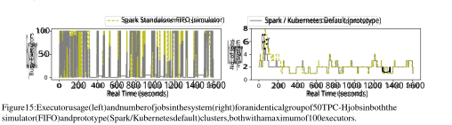In Fig. 15, we illustrate the granular effect of these different policies for an experiment of 50 TPC-H jobs with identical ordering and identical interarrival times in the simulator and prototype, respectively. The left-hand side plots the number of busy executors, while the right-hand side plots the number of jobs in the system. Note that the number of busy executors in the Spark / 

18 

Kubernetes prototype more frequently drops below 100, particularly when the number of jobs in the system is low (e.g., between 1000 - 1200 seconds). This corresponds to the executor cap configured for the Spark / Kubernetes default behavior, which results in more efficient executor usage and reduced blocking (i.e., when a job enters the system, it is more likely that there will be free executors to work on it). As a result, the Spark / Kubernetes behavior improves on the Spark standalone FIFO scheduler by 18.8% in carbon footprint and 22.1% in average job completion time in an experiment with 50 TPC-H jobs, mirroring the broader trends observed in our simulator and prototype experiments. 

## **A.2 Deferred experiments** 

In this section, we present the results of additional experiments in the simulator and the prototype that are omitted from the main body due to space considerations. 

### **A.2.1 Impact of total number of jobs** 

In the main results presented in Section 6, we evaluate the performance of tested algorithms under experiments with 25, 50, and 100 continuously arriving jobs. We explore the impact of varying this number of jobs in each experiment below, with PCAPS and CAP configured to be moderately carbon-aware, in the DE grid region. 

Fig. 16 plots the average carbon reduction, end-to-end completion time, and average per-job completion time with respect to FIFO for PCAPS, Decima, and CAP on top of FIFO in the simulator environment, using experiments with 12, 25, 50, 100, and 200 jobs. We find that the relative ordering of all three techniques largely stays constant, although measuring results for a small number of jobs (e.g., 12, 25) is intuitively prone to more variance as the end-to-end results are more easily impacted by e.g., one or two random jobs. Out of the three metrics, carbon footprint is the most stable. As the number of jobs increases, all metrics “converge” to some average behavior. One interesting exception is CAP-FIFO – due to the “blocking” behavior of the FIFO scheduler in the simulator that is more prone to queue build-up (e.g., see Appendix A.1.2), a larger total number of jobs results in longer job completion times for CAP-FIFO. 

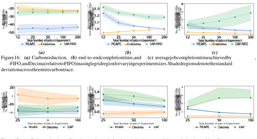Figure 16: **_(a)_** Carbon reduction, **_(b)_** end-to-end completion time, and **_(c)_** average job completion time achieved by PCAPS, CAP-FIFO, and Decima (relative to FIFO) in a single grid region for varying experiment sizes. Shaded regions denote the standard deviation across the entire carbon trace. 

Figure 17: **_(a)_** Carbon reduction, **_(b)_** end-to-end completion time, and **_(c)_** average job completion time achieved by PCAPS, CAP, and Decima (relative to the Spark/Kubernetes default) in a single grid region for varying experiment sizes. Shaded regions denote the standard deviation across 10 random trials. 

In Fig. 17, we plot the same metrics with respect to the default Spark/Kubernetes scheduler in the prototype implementation for PCAPS, Decima, and CAP, using experiments with 25, 50, and 100 jobs. These results generally mirror those shown in the 

19 

simulator above, although CAP implemented on top of the default Spark/Kubernetes behavior does not exhibit the same increase in per-job completion time for larger experiment sizes that CAP-FIFO does in the simulator – this is because the blocking behavior of FIFO is more pronounced than in the default Spark/Kubernetes scheduler (e.g., see Appendix A.1.2). 

### **A.2.2 Impacts of submission rate** 

In the main results presented in Section 6, we evaluate the performance of tested algorithms under continuous job arrivals following a Poisson process with an average interarrival time of1 _/_ λ = 30 minutes (30 seconds in real time). In what follows, we explore the impact of varying this interarrival time below, where note that smaller interarrival times imply that the cluster is more heavily utilized. PCAPS and CAP algorithms are both configured to be moderately carbon-aware, and the tested grid region is DE. 

In Fig. 18, we plot the average carbon reduction, end-to-end completion time, and average per-job completion time with respect to FIFO for PCAPS, Decima, and CAP-FIFO in the simulator environment. We find that the relative ordering of algorithm performance remain largely the same, but differences arise particularly for small interarrival times – in these scenarios where the cluster is more heavily utilized, we find that both PCAPS and Decima benefit from more intelligent scheduling decisions with respect to FIFO, which manifests in higher carbon reductions relative to FIFO and lower end-to-end completion times. 

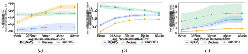Figure 18: **_(a)_** Carbon reduction, **_(b)_** end-to-end completion time, and **_(c)_** average job completion time achieved by PCAPS, CAP-FIFO, and Decima (relative to FIFO) in a single grid region for varying Poisson interarrival times. Shaded regions denote the standard deviation across the entire carbon trace. 

In Fig. 19, we plot the same metrics with respect to the default Spark/Kubernetes scheduler in the prototype implementation for PCAPS, Decima, and CAP. These results largely mirror those shown in the simulator above – the most notable change is the improved performance of PCAPS and Decima (in terms of both end-to-end completion time and carbon footprint) for small interarrival times, i.e., when the cluster is heavily utilized. 

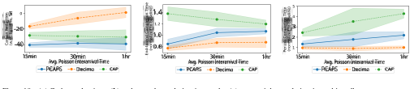Figure 19: **_(a)_** Carbon reduction, **_(b)_** end-to-end completion time, and **_(c)_** average job completion time achieved by PCAPS, CAP, and Decima (relative to the Spark/Kubernetes default) in a single grid region for varying Poisson interarrival times. Shaded regions denote the standard deviation across 10 random trials. 

### **A.2.3 Carbon-awareness logic latency** 

The logic of PCAPS and CAP naturally introduce latency due to the overhead required to make carbon-aware decisions. We quantify this _scheduling overhead_ for FIFO, Decima, CAP-FIFO, and PCAPS in the simulator below, in the DE grid region over 1000 simulated trials. Note that we report the latency in real-time (i.e., without the scaling mentioned in Section 6.1). These measurements do not include the latency of e.g., calls to an external carbon intensity API. 

20 

In Fig. 20(a), we plot the average latency (in milliseconds) of invoking each scheduler once, given that there is exactly _{_ 1 _,_ 5 _,_ 10 _,_ 25 _,_ 50 _,_ 75 _,_ 100 _}_ outstanding TPC-H jobs in the queue. We find that simple decision rule policies (FIFO and CAP-FIFO) exhibit consistently low latencies below 5 milliseconds, where CAP adds an overhead of a few milliseconds. In contrast, Decima and PCAPS, which both use a GNN+RL model to run inference at each invocation, intuitively exhibit latency that grows as a function of the number of outstanding jobs. Relative to Decima, PCAPS adds an overhead of a few milliseconds at each invocation, and this overhead is constant (i.e., it does not grow with the number of jobs in the queue). 

In Fig. 20(b), we plot the average latency over a full experiment, where the initial number of jobs in the queue is one of _{_ 1 _,_ 5 _,_ 10 _,_ 25 _,_ 50 _,_ 75 _,_ 100 _}_ – note that this latency goes down over time as jobs are completed. It is computed as a ratio between the total time spent in the scheduler and the number of scheduler invocations over the experiment length. The findings in this metric are largely similar, with lower overall averages due to the averaging over a full experiment (as opposed to averaging over a single queue length). Overall, these results imply that the latency impact of carbon-awareness is minimal – in the context of long-running big-data workloads, the sub-20 millisecond latencies observed are likely to be insignificant compared to other overheads on the cluster. 

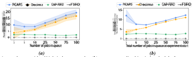Figure 20: **_(a)_** Average latency with _N_ jobs in the queue and **_(b)_** average normalized time in the scheduler for PCAPS, CAP-FIFO, Decima, and FIFO in a single grid region for varying experiment sizes. Shaded region denotes the standard deviation across all 1000 trials. 

## **B Deferred Analytical Results and Discussion** 

In this section, we give full proofs for analytical results and detailed discussion for the PCAPS and CAP scheduler designs introduced in Section 4. 

## **B.1 Deferred Proofs and Discussion from Section 4.1 (Precedence- and carbon-aware provisioning and scheduling)** 

In this section, we discuss and prove the analytical results for the PCAPS scheduler, introduced in Section 4.1. Throughout this section, we let PB denote a _carbon-agnostic, probabilistic_ baseline scheduler, as outlined in Def. 4.1. 

For the sake of analysis, in the following results we leverage the classic makespan bound of Graham’s list scheduling algorithm [25], which is known to produce a schedule that is a (2 _−_1 _/K_ )-approximation for the optimal makespan on _K_ identical machines. Note that any carbon-agnostic probabilistic scheduler is an instance of list scheduling where the list (of tasks) is random, and the next task is assigned to a machine as soon as it becomes idle. 

Recall the definition of PCAPS’s carbon-awareness filter, parameterized by the Ψγ function (see Algorithm 1). Ψγ exhibits an exponential dependence on _r_ , the relative importance of a task. This is inspired by literature on one-way trading and related online problems [17, 69], where such an exponential trade-off is derived by balancing the marginal reward of the current price against the risk that better prices may arrive in the future. For DAG scheduling, we interpret relative importance in an analogous way: tasks with high importance have a substantial negative impact if they are not scheduled, so they are almost always scheduled at the current “price” (i.e., carbon intensity). On the other hand, tasks with low relative importance (e.g., short tasks) may not significantly affect the DAG’s completion time if they are deferred to start later, so they can “wait” for better carbon intensities. 

To analyze the carbon stretch factor of PCAPS, we define _D_ (γ _,_ **c** ) _∈_ [0 _,_ 1], a quantity that describes the fraction of tasks (in terms of total runtime) that are deferred by PCAPS when scheduling with a given value of γ and given carbon trace **c** . It is _≤_ 1 for any value of γ, and _D_ (0 _,_ **c** ) = 0 for any **c** . As γ grows and PCAPS becomes “more carbon-aware”, _D_ (γ _,_ **c** ) grows in expectation. 

21 

### **B.1.1 Proof of Theorem 4.3** 

We are ready to prove Theorem 4.3, which states that for a given carbon intensity trace **c** , PCAPS’s carbon stretch factor is 1 +_D_<u>(γ</u>_<u>,</u>_**c**<u>)</u>_K_ 2 _−_ _<u>K</u>_<u>1</u>. 

_Proof._ Let PB _K_ ( _J_ ) denote the schedule produced by the carbon-agnostic probabilistic baseline scheduler (e.g., Decima) using _K_ machines, and let PCAPS _K_ ( _J_ ) denote the schedule produced by PCAPS for the same job _J_ with _n_ tasks and a maximum of _K_ machines. We denote the carbon intensity trace by **c** := _{c_ ( _t_ ) : _t ≥_ 0 _}_ . 

We henceforth use PBD Kto denote the instance of PB that PCAPS interfaces with. 

Consider the perspective of a single node _v_ : suppose that PB samples node _v_ to be scheduled at time _t ≥_ 0, where node _v_ has probability _pv,t >_ 0 and _v ∈ At_ . By definition of PB, as soon as a task (node) is sampled, it runs on the available machine in PB’s schedule. 

Now we consider the same node sampled by PBD K. We denote_Dv_as a random variable that denotes the number of times that node _v_ is _not_ scheduled (i.e., deferred) when it is sampled by PBD K. It is defined as: 

$$
Dv = \sum{}{} t\in{}{}Tv I{c(t) > Ψγ(rv,t)},
$$

where _Tv_ denotes the times at which node _v_ is sampled by PBD K. In the worst-case, observe that whenever a task_v_is sampled but not scheduled, a deferral increases the total makespan by at most _Xv_ , where _Xv_ is the runtime of task _v_ . Consider the edge case where all other tasks in _At_ (i.e., all other tasks that are ready to run at the same time as task _v_ ) are scheduled on other machines at time _t_ , and all further tasks (i.e., tasks that have not yet been completed but also were not in _At_ ) are successors of _v_ (i.e., they cannot run until _v_ is completed). 

In this case, assuming that the other tasks in _At_ run to completion, there will be some time step _t__′_ _> t_ such that _At′_ = _{v}_ – i.e., the only task available to run is task _v_ . As soon as this is the case, _v_ will run – this is because the _relative importance_ of any task in a set of size 1 is always 1. Thus, in the worst-case, the schedule length increases by exactly _Xv_ – this is the case if all of the other tasks in _At_ finish at the same time _t__′_ (i.e., no overlap with _v_ ). 

This gives the following makespan bound in terms of _Dv_ : 

$$
E[PCAPSK(J )] \leq{}{}E[PBK(J )]+E � \sum{}{} v\in{}{}J DvXv �
$$

By linearity of expectation, we have: 

$$
E[PCAPSK(J )] \leq{}{}E[PBK(J )]+ \sum{}{} v\in{}{}J E[Dv]Xv
$$

Consider the _total_ number of deferrals _D_ = ∑ _v∈J Dv_ , and note that _D_ must be _≤ n −_ 1 – since at least one machine is active at all times, the maximum number of deferrals is that which causes the schedule to drop to a single machine across the entire time interval. This immediately implies that E[ _D_ ] _≤ n −_ 1. Define a sorted list _{Xi__′_:_i ∈n}_such that_X_ 0_′_= max_v∈A Xv,...,X_ _n__′_= min _v∈A Xv_ , and note that we can upper bound the above as follows: 

$$
E[PBK(J )]+ \sum{}{} v\in{}{}J E[Dv]Xv \leq{}{}E[PBK(J )]+ E[D] \sum{}{} i=0 X′ i ,
$$

Note that this is a worst-case assumption – in reality, the tasks with low relative importance (that are likely to be deferred) are unlikely to be the longest tasks for any reasonable scheduler PB. Note that ∑_n_ _i_ =0_X_ _i__′_= ∑ _v∈J_= OPT1(_J_), i.e., the optimal makespan using a single machine. To simplify the above bound, we can define a function _D_ (γ _,_ **c** ) as follows: 

$$
D(γ,c) = \sum{}{} E[D] i=0 X′ i OPT1(J ).
$$

Note that _D_ (γ _,_ **c** ) _≤_ 1 for any γ and any **c** , and _D_ (0 _,_ **c** ) = 0 for any **c** . In practice, E[ _D_ ] can be estimated from e.g., historical carbon traces and the characteristic behavior of PB (i.e., in terms of relative importance). We have the following bound: 

E[PCAPS _K_ ( _J_ )] _≤_ E[PB _K_ ( _J_ )]+ _D_ (γ _,_ **c** )OPT1( _J_ ) _._ 

22 

This gives insight into the tuning of hyperparameter γ – for a low-carbon period **c**_′_ where a practitioner desires full throughput, one should tune γ such that _D_ (γ _,_ **c**_′_ ) _≈_ 0. 

Since PB follows the list scheduling paradigm of scheduling tasks in an order that respects precedence constraints, it inherits the following worst-case theoretical bound on its makespan: 

$$
E[PBK(J )] \leq{}{} � 2-1 K � OPTK(J ).
$$

From the proof of Theorem 4.5, we also have the following bound for OPT1( _J_ ): 

$$
OPT1(J ) \leq{}{}K \cdot{}{}OPTK(J ).
$$

Combining these results, we have the following: 

$$
E[PCAPSK(J )] \leq{}{} � 2-1 K +D(γ,c)K � OPTK(J ). Combined with the bound for PB, this shows that PCAPS has a carbon stretch factor of 1+ D(γ,c)K 2-1 K .
$$

We now turn to the question of carbon savings, and the result stated in Theorem 4.4. First, for ease of analysis, we define a _discretized time model_ that is motivated by the empirical fact that carbon intensities are reported in discrete time intervals [18, 62]. Assuming that new carbon intensity values arrive at integers in continuous time, we define a discretized carbon signal for any discrete time step _t_ as _ct_ := _c_ ( _t__′_ ) : _t__′_ _∈_ [ _t,t_ + 1), where note that _c_ ( _t__′_ ) does not change on the interval _t ∈_ [ _t,t_ + 1). 

Slightly abusing notation, we let _C_ PCAPS( _t_ ) denote the carbon emissions of PCAPS’s schedule during discrete time step _t_ , and let _C_ PB( _t_ ) denote the carbon emissions of PB at discrete time step _t_ , respectively. The schedules generated by PCAPS and PB each use a certain number of machines during any discrete time interval – to capture this, we let _Et_PCAPS : _t__′_ _∈_ [ _t,t_ + 1) denote the number of active machines during discrete time step _t_ in PCAPS’s schedule, and _Et_PB _≤ K_ denotes the same for PB’s schedule. In what follows, we use _W_ as shorthand to denote the _excess work_ that PCAPS must “make up” with respect to PB’s schedule (i.e., due to deferral actions). Formally, _W_ = ∑_T_ _i_ =0max_{E_ _t_PB _− Et_PCAPS _,_ 0 _}_ . 

### **B.1.2 Proof of Theorem 4.4** 

In what follows, we prove Theorem 4.4, which states that for a given carbon intensity trace **c** , PCAPS yields carbon savings of _W_ _<u>s</u>_~~(~~ _−_0_,T_) _−_ _<u>s</u>_~~(~~ +0_,T_) _−_ compared to a carbon-agnostic baseline PB. � _<u>c</u>_(_T,T ′_)� 

_Proof._ We let _Cs_ ( _t_ ) denote the _carbon savings_ of PCAPS at discrete time step _t_ . Formally, we have: 

$$
Cs(t) = � CPB(t)-CPCAPS(t) 1 \leq{}{}t \leq{}{}T, -CPCAPS(t) T < t \leq{}{}T ′.
$$

By definition, we have the following by substituting for the carbon emissions of PB and PCAPS: 

$$
Cs(t) = � EPB t ct -EPCAPS t ct 1 \leq{}{}t \leq{}{}T, -EPCAPS t ct T < t \leq{}{}T ′.
$$

Summing over all time steps, we have that the carbon savings is given by: 

$$
T ′ \sum{}{} i=0 Cs(i) = T \sum{}{} i=0 (EPB i -EPCAPS i )ci - T ′ \sum{}{} i=T+1 EPCAPS i ci
$$

Note that because of PCAPS’s job-specific decisions, it is not necessarily the case that _Et_PB _≥ Et_PCAPS for any _t ≤ T_ – namely, if PB’s schedule is constrained by a bottleneck task during a low-carbon time step, PCAPS’s schedule may use that low-carbon time step to schedule deferred tasks from previous time steps. 

23 

Thus, to begin simplifying this expression, we consider two cases for the sum from 0 to _T_ as follows: 

$$
T ′ \sum{}{} i=0 Cs(i) = T \sum{}{} i=0 (EPB i -EPCAPS i )ciI(EPB i \geq{}{}EPCAPS i ), - T \sum{}{} i=0 (EPCAPS i -EPB i )ciI(EPB i < EPCAPS i )- T ′ \sum{}{} i=T+1 EPCAPS i ci.
$$

We define three terms that capture the _weighted average_ carbon intensity per unit of work that is deferred, opportunistically completed, or completed later as follows. Note that ∑_T_ _i_ =0(_E_ _i_PB_−E_ _i_PCAPS ) = ∑_T_ _i_ =_′_ _T_ +1_E_ _i_PCAPS . We let _<u>s−</u>_~~(~~0_,T_) denote the weighted average carbon intensity of the machine time (work) that is _deferred_ in PCAPS’s schedule (i.e., carbon saved due to PCAPS’s carbon-aware filtering): 

$$
s(0,T) = \sum{}{}T i=0(EPB i -EPCAPS i )ci W I(EPB i \geq{}{}EPCAPS i )
$$

Furthermore, we let _<u>s</u>_( +0_,T_) denote the weighted average carbon intensity of the machine time (work) that is _opportunistically completed_ in PCAPS’s schedule (i.e., when PCAPS does more work than PB, likely during a low-carbon period): 

$$
s(0,T) + = \sum{}{}T i=0(EPB i -EPCAPS i )ci W I(EPB i < EPCAPS i )
$$

Finally, we let _<u>c</u>_(_T,T ′_) denote the weighted average carbon intensity of the work completed by PCAPS after time _T_ : 

$$
c(T,T ′) = \sum{}{}T ′ i=T+1 EPCAPS i ci W
$$

Under the above definitions, we can pose the total carbon savings as: 

$$
T ′ \sum{}{} i=0 Cs(i) = W � s(0,T) - -s(0,T) + -c(T,T ′)�
$$

We note that an adversary could construct instances such that PCAPS uses more carbon than a carbon-agnostic baseline – for instance, consider the case where the carbon intensity at each time step is strictly increasing over time. In such a scenario, the “carbon-optimal” solution simply finishes the job as soon as it can, and such a scenario implies that _<u>c</u>_~~(~~_T,T ′_) + _<u>s</u>_ +~~(~~0_,T_) _>_ _<u>s−</u>_(0_,T_) , meaning that PCAPS’s carbon savings are negative. However, we note such scenarios for the carbon intensity on the grid are unrealistic. In reality, grid carbon intensity exhibits _diurnal (i.e., daily) patterns_ that mediate this effect – see Fig. 5 for an example. 

The above result contextualizes the total carbon savings achieved by PCAPS for a single job, but we also consider the average carbon savings at each (discrete) carbon intensity interval as follows. 

Let ρPCAPS( _c_ ) denote the average machine utilization for PCAPS’s schedule conditioned on the fact that the current carbon intensity is _c_ = _ct_ . Denoting the set of discrete time steps with carbon intensity _c_ by _Tc_ , we have the following: ρPCAPS( _c_ ) = ∑ _<u>i∈Tc</u>__E_ _i_PCAPS _<u>/K</u>_ lim _T →_ ∞ _|Tc|_ . Note that ρPCAPS( _c_ ) can be estimated based on e.g., the observed relative importances of tasks produced by PB – this _distribution_ of relative importances maps (via Ψγ) into a distribution of carbon intensity values – the fraction of these values that lie below _c_ is proportional to ρPCAPS( _c_ ), since the fraction of values above _c_ correspond to tasks that would be deferred by PCAPS. 

**Corollary B.1.** _In a setting where there are always jobs with outstanding tasks in the data processing queue, the average carbon savings of_ PCAPS _at any given discrete time step t is given by_ (ρPB _K −_ ρPCAPS( _ct_ ) _K_ ) _ct ._ 

_Proof._ In this setting, the expression of the _average_ carbon savings at any given discrete time step simplifies as follows: 

<u>∑</u>_T_ _<u>i</u>_ <u>=0</u>_E_ _<u>i</u>_PB_<u>/K</u>_ Let ρPB denote the average machine utilization of PB’s schedule, i.e., ρPB = lim _T →_ ∞ _T_ . 

Then by Theorem 4.4, the average carbon savings _Cs_ at any time step _t_ is given by the following: 

$$
Cs(t) = (ρPBK -ρPCAPS(ct)K)ct.
$$

24 

## **B.2 Deferred Proofs and Discussion from Section 4.2 (Carbon-aware provisioning (CAP))** 

In this section, we discuss and prove the analytical results for CAP, introduced in Section 4.2. Throughout this section, we let AG denote a _carbon-agnostic_ baseline scheduler. 

For the sake of analysis, in the following results we leverage the classic makespan bound of Graham’s list scheduling algorithm [25], which is known to produce a schedule that is a (2 _−_1 _/K_ )-approximation for the optimal makespan on _K_ identical machines. Note that FIFO is an instance of list scheduling where the list (of tasks) is a FIFO queue, and the next task is assigned to a machine as soon as it becomes idle. 

Suppose that for a job _J_ , CAP’s schedule completes it at time _T__′_ _≥_ 0. Note that if _c_ ( _t_ ) = _L_ for all time steps, the schedule of CAP is identical to that of AG because CAP always sets _r_ ( _t_ ) = _K_ . Otherwise, we let OPT _K_ ( _J_ ) denote the optimal makespan on _K_ machines, and let _M_ ( _B,_ **c** ) denote the minimum resource cap specified by CAP at any point in its schedule (note this depends on the carbon signal **c** ). Formally, we let: _M_ ( _B,_ **c** ) = argmax _i∈_ [ _K_ ] Φ _i_ : Φ _i ≤ c_ ( _t_ ) _∀t ∈_ [0 _, T__′_ ]. 

### **B.2.1 Proof of Theorem 4.5** 

We are now ready to prove Theorem 4.5, which states that CAP’s carbon stretch factor is � _M_ ( _<u>KB,</u>_ **c** ) �2 2 _M_ 2( _KB−,_ **c** 1) _−_ 1 . We prove the statement by first showing that CAP’s makespan is at most <u>2</u> _<u>K K</u>_ OPT _K_ ( _J_ ). � _M_ ( _B,_ **c** )_−_ _M_ ( _B,_ **c** )2 � 

_Proof._ Let CAP _K_ ( _J | M_ ( _B,_ **c** )) denote the makespan of CAP given _K_ machines conditioned on the value of _M_ ( _B,_ **c** ), and let AG _K_ ( _J_ ) denote the makespan of AG (i.e., Graham’s list scheduling with _K_ machines). First, note that the following holds by [25]: 

$$
AGK(J ) \leq{}{} � 2-1 K � OPTK(J ).
$$

Second, note that the makespan of CAP _K_ ( _J | M_ ( _B,_ **c** )) is upper-bounded by that of AG _M_ ( _B,_ **c** )( _J_ ). By definition of _M_ ( _B,_ **c** ), CAP always has _M_ ( _B,_ **c** ) machines available, which is the same as AG _M_ ( _B,_ **c** )( _J_ ). If any other machines become available and process jobs during the schedule of CAP _K_ ( _J | M_ ( _B,_ **c** )), these _strictly help_ the makespan with respect to AG _M_ ( _B,_ **c** )( _J_ ). Thus, we have: 

$$
CAPK(J | M (B,c)) \leq{}{}AGM (B,c)(J )
$$

Furthermore, we have the following relationship between the optimal makespans (for the same job) when given different amounts of machines. Letting _M_ ( _B,_ **c** ) _≤ K_ , we have that: 

$$
OPTM (B,c)(J ) \leq{}{} K M (B,c)OPTK(J ).
$$

To observe this, consider the limiting case as _M_ ( _B,_ **c** ) _→_ 1. When _M_ ( _B,_ **c** ) = 1, the optimal makespan contains no “gaps”, in the sense that the single machine is always being utilized. If the job is perfectly parallelizable and subdividable, we have that OPT _M_ ( _B,_ **c** )( _J_ ) = _M_ ( _<u>KB,</u>_ **c** )OPT_K_(_J_) by a geometric proof (i.e., OPT_K_(_J_) has a makespan that is1_/K_as long as OPT1(_J_)). For any other job, as the number of machines increases, the utilization of machines worsens. 

We give a visual example of such a job _J_ with _N_ = 10 tasks in Fig. 21 – observe that respecting the precedence constraints in the case with _K_ = 3 machines necessarily forces a makespan that is greater than the hypothetical best makespan if jobs are perfectly parallelizable and subdividable. Thus, we have that scaling OPT _K_ ( _J_ ) by _M_ ( _<u>KB,</u>_ **c** )is always an upper bound on the optimal makespan OPT _M_ ( _B,_ **c** )( _J_ ). 

Combining the above bounds, we obtain the following: 

$$
CAPK(J | M (B,c)) \leq{}{}AGM (B,c)(J ),
$$

$$
\leq{}{} � 2- 1 M (B,c) � OPTM (B,c)(J ), \leq{}{} � 2K M (B,c) - K M (B,c)2 � OPTK(J ). 3.1) of CAP is given by � K M (B,c) �2 2M (B,c)-1 2K-1 .
$$

This gives that the carbon stretch factor (Definition 3.1) of CAP is given by 

25 

$$
OPT3(F) := \geq{}{} t = 0 F OPT1(g) :=
$$

Figure 21: An example to contextualize how the optimal makespan differs when a job is given different amounts of machines. In the case of a single machine (i.e., OPT1( _J_ )), the precedence constraints defined by the DAG on the right-hand side of the figure are non-binding – there is always one or more tasks that are ready to execute. As the number of machines increases, situations arise where some machines must be idle (e.g., in OPT3( _J_ )), indicated by “blank slots” in the optimal schedule. The relation between makespans is then formalized by considering a hypothetical schedule (in brackets) that ignores precedence constraints and subdivides individual tasks across machines – while this is an infeasible schedule, it forms a _lower bound_ on the makespan of any feasible one. 

We now turn to the question of carbon savings, and the result stated in Theorem 4.6. For ease of analysis, we again consider a _discretized time model_ as defined in Appendix B.1.2. 

Slightly abusing notation, we let _C_ CAP( _t_ ) denote the carbon emissions of CAP’s schedule during discrete time step _t_ , and let _C_ AG( _t_ ) denote the carbon emissions of AG at discrete time step _t_ , respectively. Schedules generated by CAP and AG each use a certain number of machines during any discrete time interval – to capture this, we let _Et_CAP _≤ r_ ( _t__′_ ) : _t__′_ _∈_ [ _t,t_ + 1) denote the number of active machines during discrete time step _t_ in CAP’s schedule. Note that _r_ ( _t__′_ ) is constant on the interval _t ∈_ [ _t,t_ + 1), and that _Et_CAP _need not be_ an integer – i.e., if a machine is active for only half of the discrete time interval, that machine contributes fractionally to _Et_CAP . We let _Et_AG _≤ K_ denote the same quantity for AG’s schedule. On a per-job basis, let _T_ denote the makespan of AG (i.e., _T_ = AG _K_ ( _J_ )), where note that _T ≤ T__′_ . In what follows, we use _W_ as shorthand to denote the _excess work_ that CAP must complete after time _T_ (i.e., after AG has completed). Formally, _W_ = ∑_T_ _i_ =0_E_ _t_AG _− Et_CAP . We also define quantities _<u>s</u>_~~(~~0_,T_) and _<u>c</u>_~~(~~_T,T ′_) , which are weighted averages based on a combination of the carbon intensity and schedules of AG and CAP, respectively. These can be interpreted as the realization of carbon intensities that CAP “waited for” – in other words, it deferred some work in between time 0 and time _T_ (saving _<u>s</u>_(0_,T_) amount of carbon), so it must make up the difference after time _T_ . 

### **B.2.2 Proof of Theorem 4.6** 

We are ready prove Theorem 4.5, which states that CAP yields carbon savings compared to a carbon-agnostic baseline of _W_ _<u>s</u>_~~(~~0_,T_) _−_ _<u>c</u>_~~(~~_T,T ′_) . 

_Proof._ Slightly abusing notation, we let _Cs_ ( _t_ ) denote the _carbon savings_ of CAP at discrete time step _t_ . Formally, we have: 

$$
Cs(t) = CAG(t)-CCAP(t) 1 \leq{}{}t \leq{}{}T, -CCAP(t) T < t \leq{}{}T ′.
$$

By definition, we have the following by substituting for the carbon emissions of ECA and CAP: 

$$
Cs(t) = EAG t ct -ECAP t ct 1 \leq{}{}t \leq{}{}T, -ECAP t ct T < t \leq{}{}T ′.
$$

Summing over all time steps, we have that the carbon savings is given by: 

$$
T ′ \sum{}{} i=0 Cs(i) = T \sum{}{} i=0 (EAG i -ECAP i )ci - T ′ \sum{}{} i=T+1 ECAP i ci
$$

To simplify this expression, we define two terms that capture the _weighted average_ carbon intensity per unit of work completed/deferred. First, note that ∑_T_ _i_ =0(_E_ _i_AG_−E_ _i_CAP ) = ∑_T_ _i_ =_′_ _T_ +1_E_ _i_CAP = _W_ . 

26 

Formally, we let _<u>s</u>_(0_,T_) denote the weighted average carbon intensity of the deferred work _W_ that is completed by AG before time _T_ but must be completed after time _T_ by CAP: 

$$
s(0,T) = \sum{}{}T i=0(EAG i -ECAP i )ci/W
$$

Similarly, we let _<u>c</u>_(_T,T ′_) denote the weighted average carbon intensity of the deferred work _W_ that is completed by CAP after time _T_ : 

$$
c(T,T ′) = \sum{}{}T′ i=T+1 ECAP i ci/W
$$

Under the above definitions, we can pose the total carbon savings as: 

$$
T ′ \sum{}{} i=0 Cs(i) = W � s(0,T) -c(T,T ′)�
$$

The above result contextualizes the total carbon savings achieved by CAP for a single job, but we may also consider the average carbon savings at each (discrete) carbon intensity interval as follows. We let ρAG _∈_ [0 _,_ 1) denote the average cluster utilization of AG, and we let ρCAP _∈_ [0 _,_ 1) denote the average cluster utilization of CAP. In general, since CAP allows jobs to use less than or equal the amount of resource that AG allows, we expect ρAG _≤_ ρCAP as for the same number of jobs submitted (e.g., during a given period), jobs will take up a greater proportion of the resources that CAP allows. 

**Corollary B.2.** _In a setting where there are always jobs with outstanding tasks in the data processing queue, the average carbon savings of_ CAP _at any given discrete time step t is given by_ (ρAG _K −_ ρCAP _rt_ )Φ _rt_ + _B._ 

_Proof._ In a setting where there are always jobs with outstanding tasks in the data processing queue, the expression of the _average_ carbon savings at any given discrete time step simplifies as follows: 

<u>∑</u>_T_ _<u>i</u>_ <u>=0</u>_E_ _<u>i</u>_AG_<u>/K</u>_ Let ρAG denote the average machine utilization of AG’s schedule, i.e., ρAG = lim _T →_ ∞ _T_ , and let ρCAP denote the same for <u>∑</u>_T_ _<u>i</u>_ <u>=0</u>_E_ _<u>i</u>_CAP _<u>/ji</u>_ CAP’s schedule, i.e., ρCAP = lim _T →_ ∞ _T_ 

Then the average carbon savings _Cs_ at any time step _t_ is given by the following, where _rt_ := _r_ ( _t__′_ ) : _t__′_ _∈_ [ _t,t_ + 1): 

$$
Cs(t) = (ρAGK -ρCAPrt)ct, \geq{}{}(ρAGK -ρCAPrt)Φrt+B.
$$

27 

