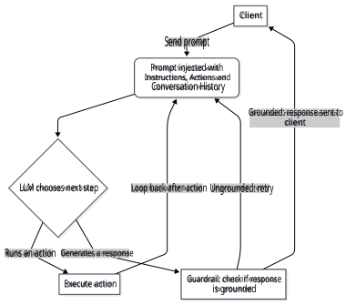
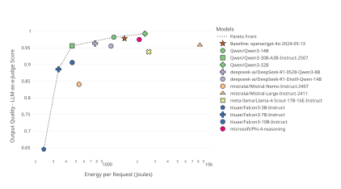
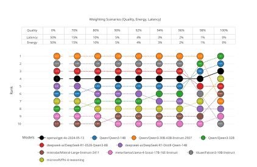
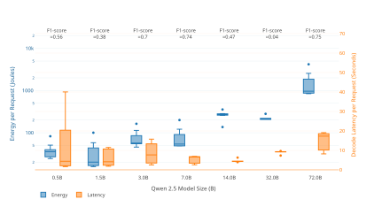
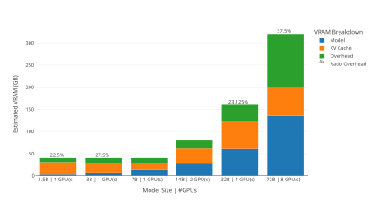
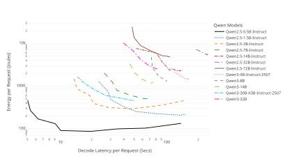
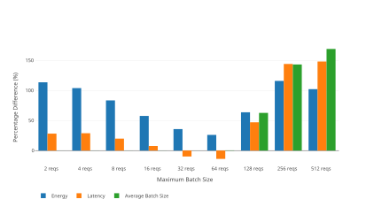
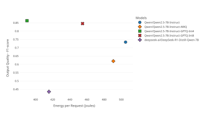

BALANCING SUSTAINABILITY AND PERFORMANCE: THE ROLE OF SMALL-SCALE LLMS IN AGENTIC ARTIFICIAL INTELLIGENCE SYSTEMS 

A PREPRINT 

**Anh-Khoa Ngo-Ho Martin Chauvin Simon Gosset** Capgemini Invent, France Capgemini Invent, France Capgemini Invent, France `anh-khoa.ngo-ho@capgemini.com` **Philippe Cordier Boris Gamazaychikov** Capgemini Invent, France Salesforce, France 

# **ABSTRACT** 

As large language models become integral to agentic artificial intelligence systems, their energy demands during inference may pose significant sustainability challenges. This study investigates whether deploying smaller-scale language models can reduce energy consumption without compromising responsiveness and output quality in a multi-agent, real-world environments. We conduct a comparative analysis across language models of varying scales to quantify trade-offs between efficiency and performance. Results show that smaller open-weights models can lower energy usage while preserving task quality. Building on these findings, we propose practical guidelines for sustainable artificial intelligence design, including optimal batch size configuration and computation resource allocation. These insights offer actionable strategies for developing scalable, environmentally responsible artificial intelligence systems. 

# **1 Introduction** 

The integration of large language models (LLMs) into agentic artificial intelligence (AI) systems is rapidly expanding, driven by the demand for intelligent automation, personalized interactions, and AI-driven decision-making. As LLMs become central to multi-agent architectures, concerns about their environmental footprint, particularly during inference, are gaining prominence [Maliakel et al., 2025]. Recent work by Desroches et al. [2025] reports a quadratic relationship between the adoption rate of agentic AI systems and associated energy consumption. Building on this context, our study explores the sustainability implications of LLM size in the deployment of AI agents at scale. Specifically, it investigates how model size reduction can mitigate energy consumption while keeping acceptable levels of performance and user experience. 

This research navigates a tri-objective optimization space defined by **Environmental Impact** , **User Experience** , and **Output Quality** . First, **Environmental Impact** quantifies the computational energy savings realized by transitioning to smaller-scale LLMs. Second, **User Experience** evaluates latency, determining if reduced model architectures can maintain, or improve, responsiveness in agentic systems. Finally, **Output Quality** measures the degree to which smaller models preserve the semantic accuracy and reliability essential for large-scale enterprise applications. 

To the best of our knowledge, few studies have comprehensively examined the trade-offs between all three objectives across different model sizes and compression strategies, particularly in real-world deployment scenarios. Most existing research addresses only partial aspects of this multi-objective trade-off. Some studies focus exclusively on a single dimension, such as output quality [Lee et al., 2025], user experience metrics like latency or token generation speed [Agrawal et al., 2025], or energy consumption [Luccioni et al., 2024, Chung et al., 2025, Jegham et al., 2025]. Others explore pairwise trade-offs, for example, accuracy versus latency or throughput [Kurtic et al., 2025], or energy efficiency versus accuracy [Reus et al., 2024, Jin et al., 2025]. However, only a limited number of works attempt to 

Balancing Sustainability and Performance 

A PREPRINT 

jointly analyze all three dimensions [Yang et al., 2024b, Shi and Ding, 2025, Maliakel et al., 2025]. Notably, these works primarily evaluate LLM performance in controlled research settings using curated datasets, rather than in realworld deployment environments. Additionally, the scope of these studies is often constrained. Some focus solely on quantized models [Yang et al., 2024b, Shi and Ding, 2025], while others limit their analysis to specific model sizes or families [Nguyen et al., 2024, Jin et al., 2025, Maliakel et al., 2025]. In contrast, our work aims to provide a more holistic perspective by evaluating the trade-offs among output quality, user experience, and environmental impact across a diverse set of LLMs (varying in size, architecture, and the application of compression techniques). To address these objectives and bridge the identified research gap, we conducted a comparative analysis of open-weights LLMs of varying sizes against a baseline closed-source model commonly used in real-world deployments (i.e., GPT-4o). Evaluations were performed under conditions representative of real-world AI agent deployments. This experimental design enables a critical assessment of whether smaller-scale open-weights models can realistically challenge the dominance of closed-source LLMs. Furthermore, the proposed method is replicable for conducting similar analyses across other AI systems. Our findings offer actionable insights into the trade-offs between model efficiency and performance, contributing to the development of more sustainable, scalable, and responsible AI systems for enterprise use. 

# **2 Related Works** 

In the case of energy consumption, Lacoste et al. [2019] evaluated the CO2-equivalent emissions during the training phase of a machine learning model, by considering several factors: the server’s location and the energy grid it utilizes, the duration of the training process, and model of the hardware used. Building on this work, Lannelongue et al. [2020] developed a freely available online tool that also considers the memory requested. Additionally, Henderson et al. [2022] provided a lightweight framework for easily tracking the energy usage and carbon impact of a machine learning model. Another well-known offline tracker is CodeCarbon [Courty et al., 2024], which measures the energy consumption and carbon footprint of CPUs, GPUs, and RAM. Cloud Carbon Footprint [Thoughtworks, 2020] is an attempt that calculates CO2 emissions using usage data (e.g., compute, storage, networking, etc.) from popular cloud providers such as AWS, Google Cloud, and Microsoft Azure. Several studies have directly measured energy consumption and prompt-level metrics on AI accelerator hardware, including Luccioni et al. [2022], Samsi et al. [2023], Luccioni et al. [2025], Chung et al. [2025]. Several studies have attempted to estimate the energy consumption of closed-source models, including those by Jegham et al. [2025], Desroches et al. [2025]. Moreover, there are several initiatives to collect the energy consumption of AI models, such as LLM-Perf Leaderboard1 , ML.ENERGY Leaderboard2 and AI Energy Score3 . Chung et al. [2025] introduced ML-Energy Benchmark, a benchmarking framework designed to evaluate the intricate balance between energy usage, latency, and model architecture. Their method replicates realistic API-based deployment conditions by monitoring energy consumption for each individual or batched request, both on the user’s device and the remote server hosting the large-scale models. Additionally, the study highlights that batch size is a crucial configuration parameter, as it has a significant impact on both generation latency and energy consumption. Given its ability to simulate real-world deployment conditions for LLMs, we adopt this framework as the foundation of our study. Maliakel et al. [2025] explored the energy-performance trade-offs of LLM inference, highlighting the impact of input complexity and hardware-level optimizations. By analyzing prompt features and GPU configurations, the study identifies strategies (e.g., Dynamic Voltage and Frequency Scaling, supported by modern GPUs like the NVIDIA A100) that can reduce energy consumption by up to 30% without degrading output quality, contributing to more sustainable LLM deployment. To mitigate the large computational and parameter overhead associated with LLMs, a variety of model compression techniques have been developed in recent years. These methods focus on three areas: sparsification, quantization, and knowledge distillation [Yang et al., 2024b]. Model sparsification is a technique designed to drop redundant weights or activations to produce a sparse model, thereby reducing both the parameter count and computational load of LLMs. Quantization involves reducing the bit precision of model parameters to lower computational requirements while keeping acceptable inference accuracy. Knowledge Distillation is a method used to transfer learned representations from a large, complex model (the teacher) to a smaller, more efficient model (the student). Yang et al. [2024b] provided a fair benchmark framework LLMCBench for compression methods by tracking accuracy (via compression performance, generalization ability, model trustworthiness), user experience and environmental impact (via training-inference consumption and hardware acceleration). It evaluates the two well-known compression methods (model sparsification and quantization) applied for four model families including LLaMA, Vicuna, OPT, and ChatGLM include different model sizes ranging from 6B to 70B. Recently, Shi and Ding [2025] analyzed the trade-offs between latency, energy, and accuracy in quantization methods for Llama models. They concluded that no single quantization method excels across all metrics and performance varies by task, model size, and precision. 

> 1 `https://huggingface.co/spaces/optimum/llm-perf-leaderboard` 

> 2 `https://ml.energy/leaderboard` 

> 3 `https://huggingface.co/spaces/AIEnergyScore/Leaderboard` 

2 

Balancing Sustainability and Performance 

A PREPRINT 

# **3 Benchmark** 

## **3.1 Evaluated Agent** 

Our analysis centers on the reasoning engine embedded within a real-world multi-agent framework, which orchestrates the behavior of LLM-based agents in response to end user interactions. Figure 1 illustrates a simplified workflow of the framework interacting with a client. It starts when the client sends a prompt, which is enriched with instructions, actions, and conversation history. The LLM then decides the next step: either generating a response or executing an action. After generating a response, a validation mechanism checks if the response is grounded (accurate and appropriate). If grounded, the response is sent back to the client; if ungrounded, the system retries. This mechanism is designed to uphold system integrity and mitigate hallucinations which is an inherent challenge in LLM systems. 

Figure 1: Workflow of a multi-agent framework interacting with a client. 

In this study, we evaluate this validation mechanism which decides whether a generated response is contextually grounded or hallucinated. This component works using a tailored prompt to classify responses as grounded, ungrounded, or small talk. It receives a structured JSON input including the context, conversation history, and the generated response, and returns a JSON output containing a classification label (“grounded”, “ungrounded”, or “small talk”), justification, and supporting evidence drawn from the input context and history (see Table 1). We additionally incorporate outputs from a real-world deployment of the agent, powered by the closed-source GPT-4o model. This allows us to assess behavioral changes in the agent when substituting the closed-source model with smaller-scale open-weights alternatives. 

## **3.2 Benchmarking Metrics** 

Based on the objectives mentioned above, we define a set of metrics to evaluate our benchmark across three key dimensions: environmental impact, user experience, and output quality. 

3 

Balancing Sustainability and Performance 

A PREPRINT 

Table 1: Examples of JSON outputs evaluated by the reference models 

{ "result": "GROUNDED", "sources": ["context[2]", "functions[1]"], "reason": "A function was called to verify a refund is allowed. The claim in the response about the order being eligible for return is grounded." } { "result": "UNGROUNDED", "sources": [], "reason": "The response was not grounded in the resources because the claim about the policy is not supported by the context, function_history or conversation_history." } 

**Environmental Impact via Energy Consumption Per Request:** We quantify the average energy consumption per request on GPU s, measured in joules, using the ML-Energy Benchmark [Chung et al., 2025]. This measurement reflects energy usage under steady-state and production-like conditions, where GPU use is maximized. 

**User Experience via Decode Latency Per Request:** User experience is evaluated through latency, which reflects both system responsiveness and perceived service speed from the user’s perspective [Huang et al., 2025]. Inference includes both the prefill phase (i.e., prompt processing) and the decode phase (i.e., token generation) [Patel et al., 2024]. In this study, we focus on the duration of the decode phase because, in the multi-agent system, the validation mechanism must complete its response before subsequent tasks can proceed, making this metric a strong indicator of overall service speed. Prefill latency primarily captures initial responsiveness, which is more critical when users expect immediate feedback (i.e., the first generated token) [Wang et al., 2025]. Additionally, decode latency correlates with output length, and our initial experiments revealed substantial variation in the number of generated tokens across models. 

**Output quality:** We evaluate output quality using two complementary approaches. 

- **F1-score** : The agent’s output includes a classification label (“grounded”, “ungrounded”, or “small talk”), along with justification and supporting evidence from the conversation context, formatted in JSON. The classification label is the most critical component. To assess whether the evaluated LLMs produce correctly formatted outputs with accurate labels, we compute the F1-score. If outputs are JSON-unserializable or contain labels outside the predefined set, they are marked as “Error”. Reference labels are derived from a real-world deployment using the GPT-4o model, enabling direct comparison with smaller-scale open-weights alternatives. In this context, the F1-score quantifies the alignment between the classification labels predicted by the open-weights LLMs and those produced by the reference model, thereby capturing discrepancies in prediction accuracy. The reference model assigns 916 samples as “grounded”, 20 samples as “ungrounded”, and 64 samples as “small talk”. Since the dataset exhibits class imbalance and a bias toward the majority class, we use the Macro F1-score for evaluation. 

- **LLM-as-a-Judge** : We also use a LLM as an independent evaluator to assess the general quality of responses from s maller-scale models. For this purpose, we adopt the Rubric-Based Criteria Scoring Metric implemented in Ragas [Es et al., 2025], where an LLM (i.e., GPT-5) assigns scores based on predefined descriptions. We define three scoring levels: 

1. The response is factually incorrect, misleading, or irrelevant to the input. 

2. The response is partially correct or relevant but contains notable inaccuracies, ambiguities, or lacks clarity. 

3. The response is factually accurate, relevant, and clearly addresses the input without significant issues. 

Finally, all scores are normalized to a 0-1 scale to ensure consistency across evaluations, where 0 corresponds to level (1), 0.5 to level (2), and 1 to level (3). 

We follow the approach of [Yang et al., 2024b] to compute the Overall Metric (OM), which provides a unified score for ranking alternatives to the reference model (GPT-4o) across three dimensions: output quality, decode latency, and energy consumption. The metric is defined as: 

$$
OM = � wQuality(QualityE QualityR )2 + wLatency(LatencyR LatencyE )2 + wEnergy(EnergyR EnergyE )2 (1)
$$

4 

Balancing Sustainability and Performance 

A PREPRINT 

where _w_ Quality, _w_ Latency, _w_ Energy are the importance weights assigned to each dimension, summing to 1, and reflecting their relative significance in the evaluation. Here, E denotes the evaluated model, while R refers to the reference model. For the quality objective, we use LLM-as-a-Judge as the evaluation metric. A higher OM shows better overall performance, and values greater than one signify performance superior to the reference model. 

# **4 Experiment Settings** 

## **4.1 Evaluated LLMs** 

In our experiments, we evaluated 28 open-weights LLMs4 with 7 compressed models to understand their behavior across different model sizes. Specifically, we examined the Qwen 2.5 Instruct series (one of the most size-diverse model families available) which includes seven models with parameter sizes of 0.5B, 1.5B, 3B, 7B, 14B, 32B, and 72B [Yang et al., 2024a]. This allowed us to analyze performance trends within a single model family as model size varies. To investigate the impact of model compression, we focused on the Qwen 2.5 7B model and applied two common compression techniques: quantization and knowledge distillation (KD). For quantization, we utilized the publicly released versions of Qwen2.5-7B-Instruct with Activation-aware Weight Quantization (AWQ) [Lin et al., 2024], as well as post-training quantized variants using GPTQ in 4-bit and 8-bit formats [Frantar and Alistarh, 2023]. For knowledge distillation, we evaluated the DeepSeek-R1-Distill-Qwen models [DeepSeek-AI et al., 2025] at 1.5B and 7B parameter scales. These experiments allow us to assess whether compression techniques can effectively reduce energy consumption while maintaining acceptable output quality. Because the performance of these techniques is highly sensitive to hyperparameter choices, we primarily relied on publicly released configurations. This approach reflects real-world deployment practices, where pre-trained and well-tested versions are often preferred over custom tuning. To explore the feasibility of replacing the reference model (i.e., the closed-source GPT-4o model) used in real-world deployments, we extended the evaluation to include 20 additional LLMs. These include: 

- Qwen 3: Dense models (4B-Instruct-2507, 8B, 14B, 32B) and a mixture-of-experts (MoE) model (30B-A3B) 

- Distilled variants of Qwen using DeepSeek-R1 [DeepSeek-AI et al., 2025]: DeepSeek-R1-Distill-Qwen-14B and DeepSeek-R1-0528-Qwen3-8B. 

- Gemma 3: Instruction-tuned models with 4B, 12B, and 27B parameters. 

- Mistral: Instruction-tuned models including Nemo-Instruct-2407 (12B parameters), Small-24B-Instruct-2501 (24B parameters), and Large-Instruct-2411 (123B parameters). 

- Falcon 3: Instruction-tuned LLMs with 1B, 3B, 7B and 10B parameters. 

- Phi 4: Version of reasoning and reasoning-plus (14B). 

- Llama-4-Scout-17B-16E-Instruct: A MoE model including 16 experts with 17B activated parameters, resulting in a total of approximately 109B parameters. 

## **4.2 Benchmark Dataset** 

We evaluated these LLMs using prompts extracted from a representative sample of conversations within a multiagent system deployed in a real-world application. The evaluation dataset consists of 1,000 requests, each averaging approximately 8,000 tokens, with the longest request reaching up to 25,500 tokens. Using the reference model GPT-4o, accessed via API, the evaluated agent produced responses averaging 66 tokens in length, with a maximum response length of 118 tokens. All experimental results are publicly available at `https://doi.org/10.5281/zenodo. 17802868` . 

## **4.3 Evaluation Environment** 

We conducted our experiments using the ML-Energy Benchmark framework5 [Chung et al., 2025], which enables measurement of inference time and energy consumption across different model configurations. The framework integrates Zeus6 , a programmatic energy measurement library, to collect energy usage data. Since individual requests often overlap due to iteration-level batching, direct per-request energy attribution is not feasible. To address this, the framework identifies a steady state (i.e., a period during which the server operates at its maximum batch size) to 

> 4All open-weights LLMs used in our experiments were sourced from the Hugging Face Model Hub. 

> 5We reused the code corresponding to the October 16, 2024 version available at `https://github.com/ml-energy/ leaderboard/commits/master/benchmark/llm_text_generation/chat` . 

> 6 `https://ml.energy/zeus/` 

5 

Balancing Sustainability and Performance 

A PREPRINT 

Table 2: Number of GPUs Needed to Deploy Each Large Language Model 

|Number of GPUs|LLMs|
|---|---|
|1|Nano LLMs. Qwen2.5-Instruct (0.5B, 1.5B, 3B, 7B), Qwen3 (4B- Instruct-2507, 8B), DeepSeek-R1-Distill-Qwen (1.5B, 7B), DeepSeek- R1-0528-Qwen3-8B, gemma-3-4b-it, Falcon3-Instruct (1B, 3B, 7B, 10B)|
|2|Micro LLMs. Qwen2.5-14B-Instruct, Qwen3-14B, DeepSeek-R1- Distill-Qwen-14B, gemma-3-12b-it, Mistral-Nemo-Instruct-2407, Phi- 4-reasoningand its -plus version|
|3|Small LLMs. Qwen2.5-32B-Instruct, Qwen3-32B, Qwen3-30B-A3B- Instruct-2507, gemma-3-27b-it,Mistral-Small-24B-Instruct-2501|
|4|Large LLMs. Qwen2.5-72B-Instruct, Mistral-Large-Instruct-2411, Llama-4-Scout-17B-16E-Instruct|

approximate real-world deployment conditions. During this phase, the average energy consumption per token is computed and used to estimate per-request energy usage based on the number of output tokens. Building on the findings of Chung et al. [2025] which emphasize batch size as a key factor influencing both decode latency and energy consumption, we evaluated our LLMs under varying maximum batch sizes. Specifically, we experimented with maximum batch sizes of 2, 4, 8, 16, 32, 128, 256, and 512 to assess their impact on performance and efficiency. 

The framework uses vLLM v0.5.47 , a high-performance inference and serving engine that supports most popular openweights models hosted on the Hugging Face platform8 . To accommodate recently released models such as Qwen 3 and Gemma 3, we upgraded the vLLM version and modified the benchmark codebase9 . For the reference model GPT4o, accessed via API, we estimated energy consumption and decode latency based on the methodology proposed by Jegham et al. [2025], due to the lack of direct access to hardware-level measurements. All experiments were conducted on an AWS p4d.24xlarge instance10 , equipped with 8 NVIDIA A100 Tensor Core GPUs, each with 40 GB of memory. This instance type is widely recognized as a standard for large-scale LLM experimentation. Drawing inspiration from hardware classifications based on model size [Jegham et al., 2025], we grouped the evaluated LLMs into four distinct hardware classes. Table 2 summarizes the number of GPUs used for each hardware class. 

## **4.4 Result and Discussion** 

## **4.5 Open-Weights LLM Alternatives for Reducing Environmental Impact** 

Table 3 displays the output quality (measured by F1-score and LLM-as-a-Judge11 ) alongside decode latency and energy consumption per request for the ten best-performing open-weights LLMs against the reference model, GPT-4o. Model selection was driven by both output quality scores, and the reported scores correspond to the configuration with the lowest energy consumption among the tested maximum batch sizes (see Table 4 in Annex). As previously noted, the energy consumption and decode latency values for GPT-4o are manually estimated based on the methodology from Jegham et al. [2025]12 . Among the evaluated models, the Qwen3 family consistently delivers the highest performance. Qwen3-30B-A3B-Instruct-2507 (a mixture-of-experts model) and Qwen3-32B achieve output quality most comparable to GPT-4o, with only a 10% reduction in F1-score. Interestingly, the LLM-as-a-Judge metric assigns even higher scores to Qwen3-32B (0.992) and Qwen3-14B (0.981) compared to GPT-4o (0.978). Substituting GPT4o with Qwen-3-30B-A3B-Instruct-2507 (-2.2% in LLM-as-a-Judge) offers a substantial efficiency gain, achieving a 70% reduction in energy consumption per request. This improvement stems from its mixture-of-experts architecture, which activates just 3.3B parameters during inference. Despite the smaller active parameter count, the quality reduction remains minimal. This can be attributed to the model’s fine-grained expert segmentation and the global-batch load balancing loss applied during training [Yang et al., 2025]. Figure 2 further illustrates the Pareto front, highlighting 

> 7 `https://github.com/vllm-project/vllm` 

> 8 `https://huggingface.co` 

> 9Following the ML-Energy Benchmark framework, we integrated Zeus into the upgraded vLLM codebase to measure steadystate energy consumption. 

> 10 `https://aws.amazon.com/fr/ec2/instance-types/p4/` 

> 11In certain cases, the sum of the mean and the standard deviation of LLM-as-a-Judge exceeds 1 because the distribution is significantly skewed to the right. 

> 12Decode Latency for GPT-4o is estimated as number of output tokens _÷_ 113 _._ 7 _tokens/s_ ; energy consumption (Joules) is calculated as 7 _._ 7 _kW ×_ (0 _._ 5 + _decodelatency_ ) _×_ 0 _._ 18 _PUE ×_ 1000, where 7 _._ 7 _kW_ is GPU power, 0 _._ 18 is Power Usage Effectiveness, and 0 _._ 5 seconds is the average prefill duration. Values are based on Artificial Analysis ( `https://artificialanalysis.ai` ). 

6 

Balancing Sustainability and Performance 

A PREPRINT 

Table 3: Energy Consumption, Decode Latency, and Output Quality (per request) of Open-Weights LLMs Compared to GPT-4o. Scores shown for the lowest-energy configuration among tested batch sizes. The best values for each metric among the open-weights LLMs are highlighted in **bold** . 

|**Models**|**Energy**(Joules)|**Decode Latency** (Secs)|**Output** **LLM-as-a-** **Judge**|**Quality** **F1-score**|
|---|---|---|---|---|
|Baseline: gpt-4o-2024-05-13|1499_±_287|**0.58**_±_**0.1**|0.978_±_0.116|1.0|
|Qwen3-32B|2382_±_725|85_±_26|**0.992**_±_**0.064**|**0.918**|
|Qwen3-14B|1177_±_820|71_±_49|0.981_±_0.101|0.876|
|Qwen3-30B-A3B-Instruct-2507|456_±_97|50_±_10|0.956_±_0.156|0.917|
|DeepSeek-R1-0528-Qwen3-8B|769_±_640|56_±_47|0.962_±_0.143|0.862|
|DeepSeek-R1-Distill-Qwen-14B|1104_±_296|55_±_14|0.955_±_0.160|0.854|
|Mistral-Large-Instruct-2411|8281_±_2199|21_±_5|0.958_±_0.165|0.786|
|Mistral-Nemo-Instruct-2407|534_±_358|24_±_16|0.840_±_0.301|0.747|
|Falcon3-10B-Instruct|458_±_305|11_±_7|0.905_±_0.246|0.773|
|Falcon3-7B-Instruct|**335**_±_**348**|17_±_17|0.885_±_0.245|0.910|
|Phi-4-reasoning|2094_±_1618|117_±_90|0.975_±_0.122|0.488|

Qwen3 models and Falcon (3B, 7B) as optimal for balancing performance and efficiency. Beyond a certain point (near Qwen3-30B-A3B-Instruct-2507) additional energy expenditure yields minimal gains in output quality. **Therefore, substituting a closed-source model with an open-weights alternative is feasible following careful evaluation, as it can substantially reduce energy consumption with minimal impact on output quality.** 

Figure 2: Output Quality versus Energy Consumption of the Best-performing Open-Weights LLMs. Scores shown for the lowest-energy configuration among tested batch sizes. Colors denote LLM families, while symbols represent model sizes. To simplify visualization, a single symbol may correspond to multiple closely related sizes (e.g., circles for 10B, 12B, and 14B; crosses for 7B and 8B). 

The decline in output quality is primarily due to two factors: (1) the models occasionally fail to generate correctly formatted JSON outputs, and (2) they sometimes include additional explanations not required by the task. For decode latency, the reference models accessed via API show the shortest response times. One contributing factor is that the evaluated models often generate longer outputs compared to the reference model. This behavior may be influenced by the fact that we reused prompts optimized for GPT-4o, the reference model, which could lead to inefficiencies when applied to smaller-scale alternatives. Mitigating these issues may require prompt tuning and/or fine-tuning each model. 

7 

Balancing Sustainability and Performance 

A PREPRINT 

Additionally, decode latency may be influenced by the inference framework. In this study, we used vLLM to host all evaluated LLMs locally with default parameters. A potential improvement is to fine-tune vLLM hyperparameters. Exploring alternative frameworks (e.g., TensorRT-LLM13 , llama.cpp14 ) is also promising, as each employs distinct optimization strategies for inference performance. Notably, Chitty-Venkata et al. [2024] report that TensorRT-LLM delivers the highest performance and lowest power consumption on NVIDIA platforms. 

Figure 3: Ranking of models under different weighting scenarios. The y-axis represents the rank of each model, while the table indicates the corresponding weighting scenario ( _wQuality_ , _wEnergy_ and _wLatency_ ). Node colors represent different LLMs, and the numbers inside each node indicate their overall metrics. The baseline GPT-4o is shown with solid lines, while evaluated models are shown with dotted lines. 

We rank the alternatives to GPT-4o based on the OM under different weighting scenarios. A higher OM shows better aggregate performance, while values exceeding 1 denote superiority over GPT-4o. In Figure 3, we vary the weight assigned to output quality to analyze its impact. Key observations include: (1) Increasing the weight on output quality reduces the score dispersion across models. This occurs because differences in decode latency and energy efficiency are generally larger than differences in output quality. (2) When decode latency and energy weights occupy at least 2% each, rankings remain stable. The top three models (i.e., Qwen3 30B A3B Instruct 2507, Falcon3 10B Instruct, and DeepSeek R1 0528 Qwen3 8B ) consistently outperform GPT4o. As the output quality weight increases, these models’ overall scores decline, while lower-ranked models improve. This suggests the top models excel primarily in decode latency and energy efficiency rather than output quality. (3) Ranking shifts occur only when output quality dominates ( _wQuality_ = 100% ). In this scenario, the previous top models lose their advantage. Qwen3 32B rises from 8th to 1st place, and Qwen3 14B moves from 6th to 2nd, followed by GPT 4o. This highlights the trade-off between efficiency (energy consumption and decode latency) and output quality. Moreover, when decode latency dominates the weighting (i.e., >90%), GPT-4o stays the top choice; otherwise, Qwen3-30B-A3B-Instruct-2507 continues to lead. 

## **4.6 Scaling Behavior of Qwen 2.5: Impact of Model Size Reduction** 

When experimenting with Qwen 2.5 models of varying sizes and varying maximum batch size, two key observations appear. First, increasing model size does not consistently lead to higher output quality. As shown in Figure 4, the 7B parameter model achieves better output quality than the 14B and 32B models. Second, both energy consumption and 

> 13 `https://github.com/NVIDIA/TensorRT-LLM` 

> 14 `https://github.com/ggml-org/llama.cpp` 

8 

Balancing Sustainability and Performance 

A PREPRINT 

Figure 4: Energy consumption (Joules, log scale) and decode latency (seconds) per request across Qwen 2.5 model sizes (0.5B - 72B), with corresponding F1-scores shown above each group. The x-axis represents model size in billions of parameters, while the left y-axis shows energy per request (blue) and the right y-axis shows decode latency per request (orange). The variation in box sizes across models relates to differences in batch size. 

decode latency increase with larger models, primarily due to the need for more GPUs. Energy consumption grows almost exponentially with model size, whereas decode latency scales nearly linearly, indicating that energy cost is more sensitive to hardware scaling than decode latency. For nano-scale models running on a single GPU (i.e., 0.5B - 3B), this upward trend is not seen. These findings suggest that using smaller models can deliver comparable output quality with substantial efficiency gains. For example, the 72B and 7B models achieve F1-scores of 0.75 and 0.74, respectively, yet the smaller model requires significantly less energy and latency because of reduced GPU memory demands. As can be seen in Figure 5, we aim to explore energy usage through the lens of VRAM consumption. VRAM utilization can be decomposed into three components [Cheng et al., 2025]: (1) storage of model weights, (2) Key-Value (KV) cache for the input prompt, and (3) overhead associated with additional memory required for task execution and system management. Larger models and multi-GPU configurations exhibit higher memory demands, with overhead becoming increasingly significant at scale. Prior work by Gond et al. [2025] reports that overhead typically accounts for approximately 20% of total VRAM usage. Our results confirm this trend and further reveal that very large models, such as the 72B parameter model, require at least 8 GPUs, resulting in overheads as high as 37%. For the analysis of compressed models of Qwen 2.5-7B (see Figure 8 in Annex), it is unsurprising that they achieve lower energy consumption during inference, reaffirming the findings in Yang et al. [2024b], Shi and Ding [2025]. Among quantization methods, the best-performing configuration uses GPTQ in 4-bit precision, reducing energy usage and latency by approximately 20%, while also achieving higher output quality (F1-score) than the original full-precision model. In contrast, the AWQ method performs worst, exhibiting longer latency than the baseline. Regarding knowledge distillation, applying KD from DeepSeek-R1 to a smaller model such as 1.5B does not surpass the accuracy of the 7B model. Furthermore, KD applied to the 7B model significantly degrades performance, with an observed drop of 29% in F1-score. Overall, compression algorithms consistently reduce energy consumption but cannot guarantee preservation of other dimensions such as output quality or decode latency. **These observations indicate that largerscale models do not guarantee superior performance but significantly increase energy consumption. Therefore, adopting smaller-scale models is strongly recommended as a step toward more sustainable and responsible AI.** 

## **4.7 Energy-Latency Trade-offs Under Varying Batch Sizes** 

By tracking energy consumption and decode latency across different batch sizes, we construct a Pareto frontier (see Figure 6). Overall, the frontier exhibits a convex shape, indicating that increases in latency can lead to reductions in energy consumption, consistent with the findings of Chung et al. [2025]. To clarify this trade-off, we compute the percentage difference between the highest and lowest energy values observed for each LLM across batch sizes, along 

9 

Balancing Sustainability and Performance 

A PREPRINT 

Figure 5: Estimated VRAM Requirements Across Model Sizes and GPU Configurations for Qwen 2.5. The percentage above each bar shows the ratio of overhead relative to total VRAM usage. 

Figure 6: Energy-Latency Trade-off Across Qwen’s Model Sizes. 

with the corresponding percentage difference in latency. In most cases, the percentage increase in latency exceeds the percentage decrease in energy. For example, reducing the energy consumption of Qwen 2.5-1.5B by 81% through larger batch sizes results in a latency increase of more than 400%. Furthermore, the magnitude of these percentage differences decreases as model size grows, suggesting that batch size variation has a smaller impact on larger models. **Therefore, careful batch size selection is essential for small-scale models, as lower energy often comes at the cost of much higher latency, a trade-off that diminishes for larger models.** 

10 

Balancing Sustainability and Performance 

A PREPRINT 

Figure 7: Percentage Difference in Energy Consumption, Decode Latency and Average Batch Size When Scaling Qwen 2.5-3B from 1 to 2 GPUs. E.g., scaling from 1 to 2 GPUs while keeping the maximum batch size fixed at 128 increases energy usage by 63%, latency by 46%, and average batch size by 62%. 

## **4.8 Scaling Effects on Nano-LLMs with Additional GPUs** 

Nano-LLMs can typically run on a single GPU. In this experiment, we investigate their behavior when an additional GPU is introduced. Figure 7 illustrates the percentage differences in energy consumption, decode latency, and average batch size when scaling Qwen 2.5-3B from one to two GPUs. Two key parameters are considered: maximum batch size, which represents the upper limit of requests that can fit into GPU memory (as configured in vLLM), and average batch size, which reflects the actual number of requests processed given memory constraints. 

Our results (see Figure 7) show that increasing GPU memory does not affect the average batch size when the maximum batch size is set to 64 requests or fewer. This indicates that a single GPU is sufficient to store both model weights and the KV cache for up to 64 requests. For larger maximum batch sizes (>128 requests), the additional memory provided by the second GPU allows more requests to be processed concurrently. Below the 64-request threshold, as the maximum batch size increases, the negative impact of adding an extra GPU diminishes, implying less wasted memory and energy. Near this threshold, latency can even decrease when using two GPUs. Beyond the threshold, however, processing more requests requires additional energy and results in higher decode latency. This threshold can be estimated by calculating the memory required for the KV cache on a single GPU. **Based on these findings, we recommend tailoring GPU allocation for each model size according to request frequency and the GPU’s KV cache capacity.** 

# **5 Conclusion** 

This study proves that smaller-scale open-weights LLMs can offer a compelling balance between sustainability and performance in agentic AI systems. By systematically evaluating a diverse set of models across energy consumption, decode latency, and output quality, we show that downsizing model size does not necessarily entail a proportional loss in performance. Our findings highlight the importance of considering deployment context, batch size optimization, and hardware configuration when selecting models for real-world applications. Furthermore, this report outlines a reproducible approach for applying these optimization techniques across different AI systems. While compression methods such as quantization and knowledge distillation can further reduce energy usage, their impact on output quality and decode latency remains variable, highlighting the need for rigorous benchmarking. However, this current work has several limitations: 

11 

Balancing Sustainability and Performance 

A PREPRINT 

- The benchmark centers on a specific agentic task (i.e., hallucination detection via a validation agent). While this is a representative use case, the conclusions may not fully extend to other agentic behaviors such as planning, tool use, or multi-turn reasoning. The dataset used for benchmarking is derived from a specific enterprise deployment, with long prompts and short responses. This may not reflect the diversity of realworld use cases, especially those involving different prompt lengths, languages, or domains. To address these limitations, future work should incorporate more real-world datasets and traditional benchmarks such as those used in OpenAI et al. [2025], which cover a broader range of tasks, domains, and prompt lengths with consistent evaluation methodologies. For context-specific applications, we recommend reproducing the proposed benchmark. 

- Our comparison centers on open-weights (locally hosted) LLMs versus closed-source (API-based) models. For GPT-4o, energy consumption and latency are estimated from prior research because its architecture and serving framework are not publicly disclosed. Updating these efficiency estimates for closed-source models remains an important direction for future work. 

- Locally hosted LLMs generally experience higher latency than API-based models, primarily because the latter have benefited from extensive optimization efforts. To close this gap, self-hosted solutions require targeted improvements. A practical starting point involves hardware upgrades, such as deploying more powerful GPUs (e.g., H100; Andersch et al. [2022]). Beyond hardware, software-level optimizations can further reduce latency, including fine-tuning the vLLM framework, or adopting alternative LLM-serving solutions (e.g., TensorRT-LLM). For more substantial gains, advanced strategies should be considered, such as speculative decoding, disaggregated serving, and integrated software-hardware stacks, as demonstrated by Elsworth et al. [2025]. 

- The use of LLMs for response evaluation (via Ragas) can introduce potential biases and lacks the objectivity of human annotation. The absence of human evaluation may affect the reliability of quality assessments. Moreover, while our proposed metrics capture key aspects of environmental impact, user experience, and output quality, further research should explore complementary metrics (e.g., trustworthiness in output quality and peak memory usage, time between tokens, etc.) used by Yang et al. [2024b], Patel et al. [2024], Maliakel et al. [2025]. 

Our experiments show that prompts must be fine-tuned for each LLM, as they directly affect inference energy consumption and decoding latency. The optimal prompt should be concise, reducing memory and energy usage during the pre-fill stage, while also encouraging concise output generation. Consequently, prompt optimization will be a key focus of our research direction. In addition, current experiments were conducted on AWS infrastructure and A100 GPUs. The choice of cloud service and hardware configuration (CPU, GPU) will be considered in future studies, as these factors can significantly influence energy use, _CO_ 2 emissions, and water consumption. In conclusion, this work contributes to the growing body of research identifying sustainable AI practices. It offers actionable insights for practitioners seeking to deploy scalable, efficient, and environmentally responsible AI agents without compromising user experience or system integrity. 

# **References** 

- Amey Agrawal, Nitin Kedia, Anmol Agarwal, Jayashree Mohan, Nipun Kwatra, Souvik Kundu, Ramachandran Ramjee, and Alexey Tumanov. On evaluating performance of LLM inference serving systems, 2025. URL `http://arxiv.org/abs/2507.09019` . 

- Michael Andersch, Greg Palmer, Ronny Krashinsky, Nick Stam, Vishal Mehta, Gonzalo Brito, and Sridhar Ramaswamy. NVIDIA hopper architecture in-depth, 2022. URL `https://developer.nvidia.com/blog/ nvidia-hopper-architecture-in-depth/` . 

- Yihua Cheng, Yuhan Liu, Jiayi Yao, Yuwei An, Xiaokun Chen, Shaoting Feng, Yuyang Huang, Samuel Shen, Kuntai Du, and Junchen Jiang. LMCache: An efficient KV cache layer for enterprise-scale LLM inference, 2025. URL `http://arxiv.org/abs/2510.09665` . 

- Krishna Teja Chitty-Venkata, Siddhisanket Raskar, Bharat Kale, Farah Ferdaus, Aditya Tanikanti, Ken Raffenetti, Valerie Taylor, Murali Emani, and Venkatram Vishwanath. LLM-inference-bench: Inference benchmarking of large language models on AI accelerators, 2024. URL `http://arxiv.org/abs/2411.00136` . 

- Jae-Won Chung, Jiachen Liu, Jeff J. Ma, Ruofan Wu, Oh Jun Kweon, Yuxuan Xia, Zhiyu Wu, and Mosharaf Chowdhury. The ML.ENERGY benchmark: Toward automated inference energy measurement and optimization, 2025. URL `http://arxiv.org/abs/2505.06371` . 

- Benoit Courty, Victor Schmidt, Sasha Luccioni, Goyal-Kamal, MarionCoutarel, Boris Feld, Jérémy Lecourt, LiamConnell, Amine Saboni, Inimaz, supatomic, Mathilde Léval, Luis Blanche, Alexis Cruveiller, ouminasara, Franklin 

12 

Balancing Sustainability and Performance 

A PREPRINT 

Zhao, Aditya Joshi, Alexis Bogroff, Hugues de Lavoreille, Niko Laskaris, Edoardo Abati, Douglas Blank, Ziyao Wang, Armin Catovic, Marc Alencon, Michał St˛echły, Christian Bauer, Lucas Otávio N. de Araújo, JPW, and MinervaBooks. mlco2/codecarbon: v2.4.1, 2024. URL `https://doi.org/10.5281/zenodo.11171501` . 

- DeepSeek-AI, Daya Guo, Dejian Yang, Haowei Zhang, Junxiao Song, Ruoyu Zhang, Runxin Xu, Qihao Zhu, Shirong Ma, Peiyi Wang, Xiao Bi, Xiaokang Zhang, Xingkai Yu, Yu Wu, Z. F. Wu, Zhibin Gou, Zhihong Shao, Zhuoshu Li, Ziyi Gao, Aixin Liu, Bing Xue, Bingxuan Wang, Bochao Wu, Bei Feng, Chengda Lu, Chenggang Zhao, Chengqi Deng, Chenyu Zhang, Chong Ruan, Damai Dai, Deli Chen, Dongjie Ji, Erhang Li, Fangyun Lin, Fucong Dai, Fuli Luo, Guangbo Hao, Guanting Chen, Guowei Li, H. Zhang, Han Bao, Hanwei Xu, Haocheng Wang, Honghui Ding, Huajian Xin, Huazuo Gao, Hui Qu, Hui Li, Jianzhong Guo, Jiashi Li, Jiawei Wang, Jingchang Chen, Jingyang Yuan, Junjie Qiu, Junlong Li, J. L. Cai, Jiaqi Ni, Jian Liang, Jin Chen, Kai Dong, Kai Hu, Kaige Gao, Kang Guan, Kexin Huang, Kuai Yu, Lean Wang, Lecong Zhang, Liang Zhao, Litong Wang, Liyue Zhang, Lei Xu, Leyi Xia, Mingchuan Zhang, Minghua Zhang, Minghui Tang, Meng Li, Miaojun Wang, Mingming Li, Ning Tian, Panpan Huang, Peng Zhang, Qiancheng Wang, Qinyu Chen, Qiushi Du, Ruiqi Ge, Ruisong Zhang, Ruizhe Pan, Runji Wang, R. J. Chen, R. L. Jin, Ruyi Chen, Shanghao Lu, Shangyan Zhou, Shanhuang Chen, Shengfeng Ye, Shiyu Wang, Shuiping Yu, Shunfeng Zhou, Shuting Pan, S. S. Li, Shuang Zhou, Shaoqing Wu, Shengfeng Ye, Tao Yun, Tian Pei, Tianyu Sun, T. Wang, Wangding Zeng, Wanjia Zhao, Wen Liu, Wenfeng Liang, Wenjun Gao, Wenqin Yu, Wentao Zhang, W. L. Xiao, Wei An, Xiaodong Liu, Xiaohan Wang, Xiaokang Chen, Xiaotao Nie, Xin Cheng, Xin Liu, Xin Xie, Xingchao Liu, Xinyu Yang, Xinyuan Li, Xuecheng Su, Xuheng Lin, X. Q. Li, Xiangyue Jin, Xiaojin Shen, Xiaosha Chen, Xiaowen Sun, Xiaoxiang Wang, Xinnan Song, Xinyi Zhou, Xianzu Wang, Xinxia Shan, Y. K. Li, Y. Q. Wang, Y. X. Wei, Yang Zhang, Yanhong Xu, Yao Li, Yao Zhao, Yaofeng Sun, Yaohui Wang, Yi Yu, Yichao Zhang, Yifan Shi, Yiliang Xiong, Ying He, Yishi Piao, Yisong Wang, Yixuan Tan, Yiyang Ma, Yiyuan Liu, Yongqiang Guo, Yuan Ou, Yuduan Wang, Yue Gong, Yuheng Zou, Yujia He, Yunfan Xiong, Yuxiang Luo, Yuxiang You, Yuxuan Liu, Yuyang Zhou, Y. X. Zhu, Yanhong Xu, Yanping Huang, Yaohui Li, Yi Zheng, Yuchen Zhu, Yunxian Ma, Ying Tang, Yukun Zha, Yuting Yan, Z. Z. Ren, Zehui Ren, Zhangli Sha, Zhe Fu, Zhean Xu, Zhenda Xie, Zhengyan Zhang, Zhewen Hao, Zhicheng Ma, Zhigang Yan, Zhiyu Wu, Zihui Gu, Zijia Zhu, Zijun Liu, Zilin Li, Ziwei Xie, Ziyang Song, Zizheng Pan, Zhen Huang, Zhipeng Xu, Zhongyu Zhang, and Zhen Zhang. DeepSeek-r1: Incentivizing reasoning capability in LLMs via reinforcement learning, 2025. URL `http://arxiv.org/abs/2501.12948` . 

- Clément Desroches, Martin Chauvin, Louis Ladan, Caroline Vateau, Simon Gosset, and Philippe Cordier. Exploring the sustainable scaling of AI dilemma: A projective study of corporations’ AI environmental impacts. 2025. URL `https://hal.science/hal-04908002` . 

- Cooper Elsworth, Keguo Huang, David Patterson, Ian Schneider, Robert Sedivy, Savannah Goodman, Ben Townsend, Parthasarathy Ranganathan, Jeff Dean, Amin Vahdat, Ben Gomes, and James Manyika. Measuring the environmental impact of delivering AI at google scale, 2025. URL `http://arxiv.org/abs/2508.15734` . 

- Shahul Es, Jithin James, Luis Espinosa-Anke, and Steven Schockaert. Ragas: Automated evaluation of retrieval augmented generation, 2025. URL `http://arxiv.org/abs/2309.15217` . 

- Elias Frantar and Dan Alistarh. SparseGPT: Massive language models can be accurately pruned in one-shot, 2023. URL `http://arxiv.org/abs/2301.00774` . 

- Raja Gond, Nipun Kwatra, and Ramachandran Ramjee. TokenWeave: Efficient compute-communication overlap for distributed LLM inference, 2025. URL `http://arxiv.org/abs/2505.11329` . 

- Peter Henderson, Jieru Hu, Joshua Romoff, Emma Brunskill, Dan Jurafsky, and Joelle Pineau. Towards the systematic reporting of the energy and carbon footprints of machine learning, 2022. URL `http://arxiv.org/abs/2002. 05651` . 

- Jenny Y. Huang, Mehul Damani, Yousef El-Kurdi, Ramon Astudillo, and Wei Sun. Latency and token-aware test-time compute, 2025. URL `http://arxiv.org/abs/2509.09864` . 

- Nidhal Jegham, Marwan Abdelatti, Lassad Elmoubarki, and Abdeltawab Hendawi. How hungry is AI? benchmarking energy, water, and carbon footprint of LLM inference, 2025. URL `http://arxiv.org/abs/2505.09598` . 

- Yunho Jin, Gu-Yeon Wei, and David Brooks. The energy cost of reasoning: Analyzing energy usage in LLMs with test-time compute, 2025. URL `http://arxiv.org/abs/2505.14733` . 

- Eldar Kurtic, Alexandre Marques, Shubhra Pandit, Mark Kurtz, and Dan Alistarh. "give me BF16 or give me death"? accuracy-performance trade-offs in LLM quantization, 2025. URL `http://arxiv.org/abs/2411.02355` . 

- Alexandre Lacoste, Alexandra Luccioni, Victor Schmidt, and Thomas Dandres. Quantifying the carbon emissions of machine learning, 2019. URL `http://arxiv.org/abs/1910.09700` . 

- Loïc Lannelongue, Jason Grealey, and Michael Inouye. Green algorithms: Quantifying the carbon footprint of computation, 2020. URL `http://arxiv.org/abs/2007.07610` . 

13 

Balancing Sustainability and Performance 

A PREPRINT 

- Jemin Lee, Sihyeong Park, Jinse Kwon, Jihun Oh, and Yongin Kwon. Exploring the trade-offs: Quantization methods, task difficulty, and model size in large language models from edge to giant, 2025. URL `http://arxiv.org/abs/ 2409.11055` . 

- Ji Lin, Jiaming Tang, Haotian Tang, Shang Yang, Wei-Ming Chen, Wei-Chen Wang, Guangxuan Xiao, Xingyu Dang, Chuang Gan, and Song Han. AWQ: Activation-aware weight quantization for LLM compression and acceleration, 2024. URL `http://arxiv.org/abs/2306.00978` . 

- Alexandra Sasha Luccioni, Sylvain Viguier, and Anne-Laure Ligozat. Estimating the carbon footprint of BLOOM, a 176b parameter language model, 2022. URL `http://arxiv.org/abs/2211.02001` . 

- Alexandra Sasha Luccioni, Yacine Jernite, and Emma Strubell. Power hungry processing: Watts driving the cost of AI deployment? In _The 2024 ACM Conference on Fairness, Accountability, and Transparency_ , pages 85–99, 2024. doi: 10.1145/3630106.3658542. URL `http://arxiv.org/abs/2311.16863` . 

- Sasha Luccioni, Boris Gamazaychikov, Emma Strubell, Sara Hooker, Yacine Jernite, Carole-Jean Wu, and Margaret Mitchell. AI energy score leaderboard - february 2025, 2025. URL `https://huggingface.co/spaces/ AIEnergyScore/Leaderboard` . 

- Paul Joe Maliakel, Shashikant Ilager, and Ivona Brandic. Investigating energy efficiency and performance trade-offs in LLM inference across tasks and DVFS settings, 2025. URL `http://arxiv.org/abs/2501.08219` . 

- Sophia Nguyen, Beihao Zhou, Yi Ding, and Sihang Liu. Towards sustainable large language model serving, 2024. URL `http://arxiv.org/abs/2501.01990` . 

- OpenAI, Sandhini Agarwal, Lama Ahmad, Jason Ai, Sam Altman, Andy Applebaum, Edwin Arbus, Rahul K. Arora, Yu Bai, Bowen Baker, Haiming Bao, Boaz Barak, Ally Bennett, Tyler Bertao, Nivedita Brett, Eugene Brevdo, Greg Brockman, Sebastien Bubeck, Che Chang, Kai Chen, Mark Chen, Enoch Cheung, Aidan Clark, Dan Cook, Marat Dukhan, Casey Dvorak, Kevin Fives, Vlad Fomenko, Timur Garipov, Kristian Georgiev, Mia Glaese, Tarun Gogineni, Adam Goucher, Lukas Gross, Katia Gil Guzman, John Hallman, Jackie Hehir, Johannes Heidecke, Alec Helyar, Haitang Hu, Romain Huet, Jacob Huh, Saachi Jain, Zach Johnson, Chris Koch, Irina Kofman, Dominik Kundel, Jason Kwon, Volodymyr Kyrylov, Elaine Ya Le, Guillaume Leclerc, James Park Lennon, Scott Lessans, Mario Lezcano-Casado, Yuanzhi Li, Zhuohan Li, Ji Lin, Jordan Liss, Lily, Liu, Jiancheng Liu, Kevin Lu, Chris Lu, Zoran Martinovic, Lindsay McCallum, Josh McGrath, Scott McKinney, Aidan McLaughlin, Song Mei, Steve Mostovoy, Tong Mu, Gideon Myles, Alexander Neitz, Alex Nichol, Jakub Pachocki, Alex Paino, Dana Palmie, Ashley Pantuliano, Giambattista Parascandolo, Jongsoo Park, Leher Pathak, Carolina Paz, Ludovic Peran, Dmitry Pimenov, Michelle Pokrass, Elizabeth Proehl, Huida Qiu, Gaby Raila, Filippo Raso, Hongyu Ren, Kimmy Richardson, David Robinson, Bob Rotsted, Hadi Salman, Suvansh Sanjeev, Max Schwarzer, D. Sculley, Harshit Sikchi, Kendal Simon, Karan Singhal, Yang Song, Dane Stuckey, Zhiqing Sun, Philippe Tillet, Sam Toizer, Foivos Tsimpourlas, Nikhil Vyas, Eric Wallace, Xin Wang, Miles Wang, Olivia Watkins, Kevin Weil, Amy Wendling, Kevin Whinnery, Cedric Whitney, Hannah Wong, Lin Yang, Yu Yang, Michihiro Yasunaga, Kristen Ying, Wojciech Zaremba, Wenting Zhan, Cyril Zhang, Brian Zhang, Eddie Zhang, and Shengjia Zhao. gpt-oss-120b & gpt-oss-20b model card, 2025. URL `http://arxiv.org/abs/2508.10925` . 

- Pratyush Patel, Esha Choukse, Chaojie Zhang, Aashaka Shah, Íñigo Goiri, Saeed Maleki, and Ricardo Bianchini. Splitwise: Efficient generative LLM inference using phase splitting, 2024. URL `http://arxiv.org/abs/2311. 18677` . 

- Pepijn de Reus, Ana Oprescu, and Jelle Zuidema. An exploration of the effect of quantisation on energy consumption and inference time of StarCoder2, 2024. URL `http://arxiv.org/abs/2411.12758` . 

- Siddharth Samsi, Dan Zhao, Joseph McDonald, Baolin Li, Adam Michaleas, Michael Jones, William Bergeron, Jeremy Kepner, Devesh Tiwari, and Vijay Gadepally. From words to watts: Benchmarking the energy costs of large language model inference, 2023. URL `http://arxiv.org/abs/2310.03003` . 

- Tianyao Shi and Yi Ding. Systematic characterization of LLM quantization: A performance, energy, and quality perspective, 2025. URL `http://arxiv.org/abs/2508.16712` . 

- Inc. Thoughtworks. Cloud carbon footprint, 2020. URL `https://www.cloudcarbonfootprint.org` . 

- Chao Wang, Pengfei Zuo, Zhangyu Chen, Yunkai Liang, Zhou Yu, and Ming-Chang Yang. Prefill-decode aggregation or disaggregation? unifying both for goodput-optimized LLM serving, 2025. URL `http://arxiv.org/abs/ 2508.01989` . 

- An Yang, Baosong Yang, Binyuan Hui, Bo Zheng, Bowen Yu, Chang Zhou, Chengpeng Li, Chengyuan Li, Dayiheng Liu, Fei Huang, Guanting Dong, Haoran Wei, Huan Lin, Jialong Tang, Jialin Wang, Jian Yang, Jianhong Tu, Jianwei Zhang, Jianxin Ma, Jianxin Yang, Jin Xu, Jingren Zhou, Jinze Bai, Jinzheng He, Junyang Lin, Kai Dang, Keming Lu, Keqin Chen, Kexin Yang, Mei Li, Mingfeng Xue, Na Ni, Pei Zhang, Peng Wang, Ru Peng, Rui Men, Ruize 

14 

Balancing Sustainability and Performance 

A PREPRINT 

Gao, Runji Lin, Shijie Wang, Shuai Bai, Sinan Tan, Tianhang Zhu, Tianhao Li, Tianyu Liu, Wenbin Ge, Xiaodong Deng, Xiaohuan Zhou, Xingzhang Ren, Xinyu Zhang, Xipin Wei, Xuancheng Ren, Xuejing Liu, Yang Fan, Yang Yao, Yichang Zhang, Yu Wan, Yunfei Chu, Yuqiong Liu, Zeyu Cui, Zhenru Zhang, Zhifang Guo, and Zhihao Fan. Qwen2 technical report, 2024a. URL `http://arxiv.org/abs/2407.10671` . 

- An Yang, Anfeng Li, Baosong Yang, Beichen Zhang, Binyuan Hui, Bo Zheng, Bowen Yu, Chang Gao, Chengen Huang, Chenxu Lv, Chujie Zheng, Dayiheng Liu, Fan Zhou, Fei Huang, Feng Hu, Hao Ge, Haoran Wei, Huan Lin, Jialong Tang, Jian Yang, Jianhong Tu, Jianwei Zhang, Jianxin Yang, Jiaxi Yang, Jing Zhou, Jingren Zhou, Junyang Lin, Kai Dang, Keqin Bao, Kexin Yang, Le Yu, Lianghao Deng, Mei Li, Mingfeng Xue, Mingze Li, Pei Zhang, Peng Wang, Qin Zhu, Rui Men, Ruize Gao, Shixuan Liu, Shuang Luo, Tianhao Li, Tianyi Tang, Wenbiao Yin, Xingzhang Ren, Xinyu Wang, Xinyu Zhang, Xuancheng Ren, Yang Fan, Yang Su, Yichang Zhang, Yinger Zhang, Yu Wan, Yuqiong Liu, Zekun Wang, Zeyu Cui, Zhenru Zhang, Zhipeng Zhou, and Zihan Qiu. Qwen3 technical report, 2025. URL `http://arxiv.org/abs/2505.09388` . 

- Ge Yang, Changyi He, Jinyang Guo, Jianyu Wu, Yifu Ding, Aishan Liu, Haotong Qin, Pengliang Ji, and Xianglong Liu. LLMCBench: Benchmarking large language model compression for efficient deployment, 2024b. URL `http: //arxiv.org/abs/2410.21352` . 

# **A Energy-Optimal Configurations for Experimented LLMs** 

Table 4: Required GPUs and Energy-Optimal Maximum Batch Size for Deploying Each Large Language Model. Results correspond to the configuration with the lowest energy consumption per request across tested batch sizes (2, 4, 8, 16, 32, 64, 128, 256, 512). 

|**LLMs** **Number of GPUs**|**Maximum Batch Size**|
|---|---|
|**Qwen 2.5**||
|Qwen/Qwen2.5-0.5B-Instruct 1|32|
|Qwen/Qwen2.5-0.5B-Instruct 2|64|
|Qwen/Qwen2.5-1.5B-Instruct 1|128|
|Qwen/Qwen2.5-3B-Instruct 1|128|
|Qwen/Qwen2.5-3B-Instruct 2|64|
|Qwen/Qwen2.5-7B-Instruct 1|64|
|Qwen/Qwen2.5-14B-Instruct 1|8|
|Qwen/Qwen2.5-14B-Instruct 2|256|
|Qwen/Qwen2.5-32B-Instruct 4|64|
|Qwen/Qwen2.5-72B-Instruct 8|64|
|**Qwen 3**||
|Qwen/Qwen3-4B-Instruct-2507 1|32|
|Qwen/Qwen3-8B 1|32|
|Qwen/Qwen3-14B 2|512|
|Qwen/Qwen3-30B-A3B-Instruct-2507 4|128|
|Qwen/Qwen3-32B 4|512|
|**Distilled variants of Qwen using DeepSeek-R1**||
|deepseek-ai/DeepSeek-R1-Distill-Qwen-1.5B 1|256|
|deepseek-ai/DeepSeek-R1-Distill-Qwen-7B 1|64|
|deepseek-ai/DeepSeek-R1-0528-Qwen3-8B 1|256|
|deepseek-ai/DeepSeek-R1-Distill-Qwen-14B 2|64|
|**Gemma 3**||
|google/gemma-3-4b-it 1|32|
|google/gemma-3-12b-it 2|16|
|google/gemma-3-27b-it 4|32|
|**Llama 4**||
|meta-llama/Llama-4-Scout-17B-16E-Instruct 8|128|
|**Phi 4**||
|microsoft/Phi-4-reasoning 2|256|
|microsoft/Phi-4-reasoning-plus 2|256|

15 

Balancing Sustainability and Performance 

A PREPRINT 

|**Mistral**|||
|---|---|---|
|mistralai/Mistral-Nemo-Instruct-2407|2|32|
|mistralai/Mistral-Small-24B-Instruct-2501|4|256|
|mistralai/Mistral-Large-Instruct-2411|8|512|
|**Falcon 3**|||
|tiiuae/Falcon3-1B-Instruct|1|512|
|tiiuae/Falcon3-3B-Instruct|1|256|
|tiiuae/Falcon3-7B-Instruct|1|256|
|tiiuae/Falcon3-10B-Instruct|1|16|
|**Quantized variants of Qwen 2.5 7B**|||
|Qwen/Qwen2.5-7B-Instruct-AWQ|1|512|
|Qwen/Qwen2.5-7B-Instruct-GPTQ-Int4|1|256|
|Qwen/Qwen2.5-7B-Instruct-GPTQ-Int8|1|512|

# **B Output Quality versus Energy Consumption for Compressed Models** 

Figure 8: Output Quality (F1-score) and Energy Consumption for Compressed Qwen 2.5 7B Instruct Models. Scores correspond to the lowest-energy configuration among tested batch sizes. 

16 

