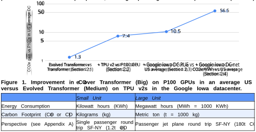
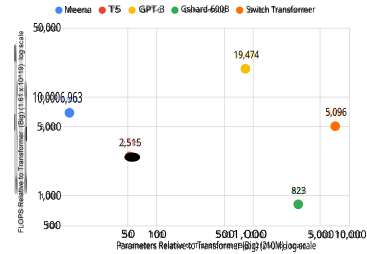
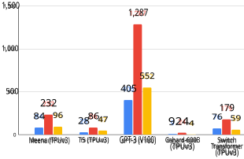
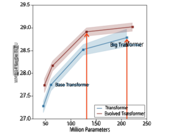
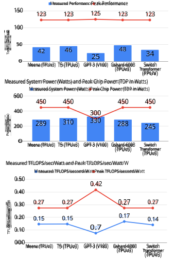
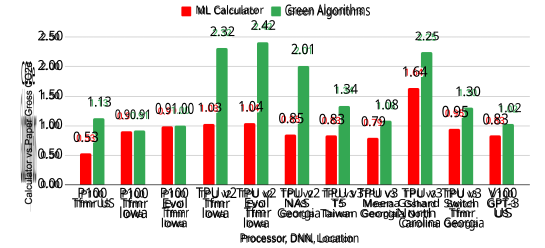
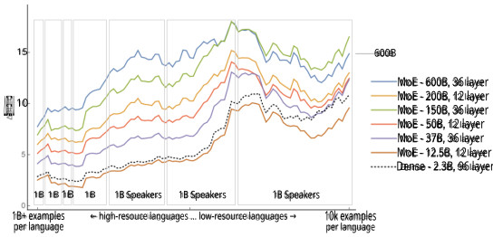

# Carbon  Emissions  and  Large  Neural  Network  Training 

David  Patterson1 , 2 ,  Joseph  Gonzalez2 ,  Quoc  Le1 ,  Chen  Liang1 ,  Lluis-Miquel  Munguia1 , Daniel  Rothchild2 ,  David  So1 ,  Maud  Texier1 ,  and  Jeff  Dean1 

{davidpatterson,  qvl,  crazydonkey,  llmunguia,  davidso,  maudt,  jeff}@google.com, 

{pattrsn,  jegonzal,  drothchild}@berkeley.edu 

**Abstract:** The  computation  demand  for  machine  learning  (ML) has  grown  rapidly recently,  which  comes  with  a number  of  costs.  Estimating  the  energy  cost  helps  measure  its  environmental  impact  and  finding  greener strategies,  yet  it  is <u>challenging  without  detailed  information.</u> 

We  calculate  the  energy  use  and  carbon  footprint  of  several  recent  large  models—T5 , <u>Meena , GShard, Switch  Transformer ,  and GPT-3 —and  refine  earlier  estimates  for  the  neural  architecture  search  that  found Evolved  Transformer .</u> 

We  highlight  the  following  opportunities  to  improve  energy  efficiency  and _CO 2   equivalent  emissions_ ( _CO 2 e_ ): 

- Large  but  sparsely  activated  DNNs  can  consume  <1/10th  the  energy  of  large,  dense  DNNs  without sacrificing  accuracy  despite  using  as  many  or  even  more  parameters. 

- Geographic  location  matters  for  ML  workload  scheduling  since  the  fraction  of  carbon-free  energy  and resulting  CO 2 e  vary  ~5X-10X,  even  within  the  same  country  and  the  same  organization.  We  are  now optimizing  where  and  when  large  models  are  trained. 

- Specific  datacenter  infrastructure  matters,  as  Cloud  datacenters  can  be  ~1.4-2X  more  energy  efficient than  typical  datacenters,  and  the  ML-oriented  accelerators  inside  them  can  be  ~2-5X  more  effective than  off-the-shelf  systems. 

Remarkably,  the  choice  of  DNN,  datacenter,  and  processor  can  reduce  the  carbon  footprint  up  to  ~100-1000X. 

These  large  factors  also  make  retroactive  estimates  of  energy  cost  difficult.  To  avoid  miscalculations,  we believe  ML  papers  requiring  large  computational  resources  should  make  energy  consumption  and  CO 2 e explicit  when  practical.  We  are  working  to  be  more  transparent  about  energy  use  and  CO 2 e  in  our  future research.  To  help  reduce  the  carbon  footprint  of  ML,  we  believe  energy  usage  and  CO 2 e  should  be  a  key metric  in  evaluating  models,  and  we  are  collaborating  with  MLPerf  developers  to  include  energy  usage  during training  and  inference  in  this  industry  standard  benchmark. 

## **1. Introduction** 

As  ML  models  increase  in  scale,  a  general  trend  is  that  they  become  more  accurate  and  more  capable. However,  larger  models  translate  to  greater  computing  demands  and,  by  extension,  greater  energy  demands. We  focus  on  natural  language  processing  (NLP)  because  it  is  important  in  Google  products  and  because  of  the recent  development  of  many  large  NLP  models,  e.g.,  T5  [Raf19],  Meena  [Adi20],  GShard  [Lep20],  Switch Transformer  [Fed21],  and  GPT-3  [Bro20]. Recent  studies attempt  to  evaluate  the  environmental  impact  of  this trend  in  NLP,  which  is  difficult  [Str19].  Here  we  investigate  and  share  the  estimates  of  the  energy  consumed and  CO 2 e3 of  these  recent  and  large  NLP  models.  We  also  reduce  by  88X  an  earlier  estimate  of  the  CO 2 e  for the  neural  architecture  search  for  Evolved  Transformer  [So19,  Str19]  by  characterizing  the  actual  search process  on  the  hardware  and  datacenter  on  which  it  was  performed  (see  Appendices  C  and  D). 

Our  investigation  into  CO 2 e  revealed  surprises  and  misunderstandings  about  the  full  Deep  Neural  Network (DNN)  lifecycle,  the  datacenters  and  hardware  that  run  them,  the  variations  in  energy  mix,  and  the  difficulty  of assessing  CO 2 e  accurately.  Note  that  we  are  evaluating  the  CO 2 e  of _operating_ computers  and  datacenters,  but not  fabricating  and  recycling  them  (see  [Gup20]  for  the  latter  topic). 

To  make  it  easier  for  the  ML  community  to  understand  the  real  impact  of  training  and  how  to  reduce  it,  we endorse  prior  calls  for  new  publication  norms  for  computationally  intensive  ML  models: 

> 1  Google 

> 2  University  of  California,  Berkeley 

> 3  “CO 2 e”  means  CO 2 _equivalent  emissions_ ,  accounting  for  carbon  dioxide  and  all  the  other  greenhouse  gases  as  well: methane,  nitrous  oxide,  ...  (calculated  from  Equation  A-1  in  40  Code  of  Federal  Regulations  98 ).  “CO 2  emissions”  is  only carbon  dioxide. _tCO 2 e_ stands  for  1000  kg  (metric  ton)  of  CO 2 equivalent  emissions _._ 

1 

1. We  must  assess  CO 2 e  correctly,  but  it  is  hard  to  quantify  precisely  in  part  because  all  the  required information  is  rarely  reported  or  publicly  available  (e.g.,  datacenter,  hardware,  energy  mix)  and  in  part because  it  is  hard  to  uncover  important  details  afterwards  (see  Section  4.1).  To  make  the  carbon  costs of  training  transparent,  we  encourage  more  researchers  to  measure  energy  usage  and  CO 2 e—or  to  get a  rough  estimate  using  a  tool  like  ML  Emissions  Calculator  [Lac19]  (Section  4.3)—and  publish  the  data. 

2. We  agree  with  [Str19,Sch20,Hen20]  that  efficiency  should  be  an  evaluation  criterion  for  publishing  ML research  on  computationally  intensive  models  besides  accuracy  and  related  measures,  since  we  need to  encourage  advances  across  the  board  as <u>the  most  sustainable  energy  is  the  energy  you  don’t  use .</u> 

3. And  even  if  we  could  bring  CO 2 e  to  zero  in  cloud  datacenters,  reducing  training  time  matters,  both because  “time  is  money,”  and  because  cheaper  training  lets  more  people  participate.  Hence,  we  also second  the  recommendation  of  [Str19]  for  more  researchers  to  publish  the  number  of  accelerators  and their  time  to  train  computationally  intensive  models  to  inspire  progress  in  reducing  training  costs. 

We  believe  such  new  incentives  could  lead  to  a  virtuous  cycle  where  ML  practitioners  compete  to  increase accuracy  while  lowering  energy  consumption  and  CO 2 e  that  could  bend  the  curve  of  ML  carbon  footprint growth  for  computationally  intensive  NLP  models. 

The  following  sections  summarize  the  findings  that  led  to  these  recommendations.  They  also  document  our CO 2 e  estimates,  highlight  recent  advances  that  curb  the  CO 2 e  of  ML,  and  estimate  the  CO 2 e  from  training  the five  recent  large  NLP  models  mentioned  above.  We  end  by  updating  the  results  of  [Str19]  on  the  emissions  of the  Evolved  Transformer  neural  architecture  search  and  discussing  common  misperceptions. 

We  start  with  an  overview  of  the  carbon  footprint  over  the  DNN  lifecycle  and  show  ways  to  improve  a concrete  example  by  nearly  two  orders  of  magnitude. 

## **2. Energy  Consumption  and  Carbon  Footprint  of  an  NLP  Model** 

Electricity  required  to  run  an  ML  model  is  a  function  of  the  algorithm,  the  program  that  implements  it,  the number  of  processors  that  run  the  program,  the  speed  and  power  of  those  processors,  a  datecenter’s efficiency  in  delivering  power  and  cooling  the  processors,  and  the  energy  supply  mix  (renewable,  gas,  coal, etc.).  A  simplified  formula  for  the  carbon  footprint  of  an  ML  model  that  takes  these  factors  into  account  is: 

_F ootprint_ = ( _electrical energytrain_+_q_ _ueries_ × _electrical energyinference_ ) × _CO_ 2 _edatacenter_/ _KWh_ 

Most  companies  spend  more  energy  on  serving  a  DNN  model  (performing  inference)  than  on  training  it. For  example,  NVIDIA  estimated  that  80–90%  of  the  ML  workload  is  inference  processing  [Leo19].  Similarly, Amazon  Web  services  claimed  that 90%  of  the  ML  demand  in  the  cloud  is  for  inference  [Bar19].  Given  its substantial  role  in  the  ML  model  lifecycle,  Alibaba,  Amazon,  Google,  and  NVIDIA  designed  ML  accelerators solely  for  inference.  If  the  total  ML  energy  is  split  10%  on  training  and  90%  on  serving,  then  even  if  a  given  ML model  required  double  the  energy  cost  of  training,  it  could  reduce  overall  total  carbon  emissions  if  that  model also  cut  serving  energy  by  20%.  Because  energy  usage  during  training  is  more  isolated  and  thus  easier  to investigate  than  inference,  we  focus  on  it  in  this  paper,  but  keep  in  mind  that  the  carbon  footprint  of  inference  is significant. 

An  ML  practitioner  is  often  improving  the  quality  of  an  existing  model  rather  than  starting  from  scratch.  We will  use  as  a  running  example  (found  in  [Str19])  the  CO 2 e  impact  of  going  from  training  a  Transformer  model using  off-the-shelf  hardware  in  an  average  datacenter  to  training  an  Evolved  Transformer  model  on  Google’s custom  hardware  for  DNNs  in  Google’s  energy  optimized  datacenters.  The  large  impact  of  each  factor  in  this example  demonstrates  why  we  suggest  that  the  trainers  of  a  model  be  involved  in  the  calculation  of  its  costs. 

Table  1  shows  the  CO 2 e  breakdown,  which  we  explain  further  in  the  next  subsections  along  with  the business  rationale  for  these  improvements,  demonstrating  the  cross-cutting  incentives  for  more  efficient  ML. Figure  1  illustrates  the  gains  per  step;  the  overall  improvement  in  CO 2 e  is  57X.  This  large  gain  demonstrates why  the  selection  of  the  DNN  model,  processor,  datacenter,  and  geographic  location  are  critical  to  improve CO 2 e.  Table  2  shows  the  units  for  CO 2 e  and  a  running  example  that  puts  these  units  into  perspective. 

We  next  go  over  the  four  factors  in  more  detail  that  contribute  to  the  carbon  footprint  of  training. 

2 

|Model|Transform|er  (Big)|Evolved Transformer (Medium)| Transformer (Big)| Evolved Transformer (Medium)|
|---|---|---|---|---|---|
|Number  of  Parameters(B)|0.2|1|0.13|0.21|0.13|
|Datacenter|US  Average||Google  Iowa|Council  Bluffs||
|Datacenter  Gross  CO2e/KWh  (kg/KWh)  2020 (Section  2.4  and  Appendix  D)|0.429||0.|478||
|Datacenter  Net  CO2e/KWh  (kg/KWh)  2020  (Section 2.4  and  Appendix  D)| 0.429||0.|080||
|Datacenter  PUE(Latestquarter  2020)|1.59||1|.11||
|Processor||P100||TP|U  v2|
|ChipThermal  Design  Power(TDP  in  Watts)||300||2|80|
|Measured  System  Average  Power  including memory,network  interface,fans,host  CPU(Watts)|29|6|271|229|227|
|Measured  Performance(TFLOPS/s) 5|6.7||4.7|28.8|24.0|
|Number  of  Chips|||8|||
|Trainingtime  to  accuracy goal(days)|3.5||3.2|0.81|0.62|
|Total  Computation(floating point  operations)|1.61E|+19|1.03E+19|1.61E+19|1.03E+19|
|Energyconsumption(KWh)|316|221|185|40|30|
|Gross  CO2e  for  Model  Training  (metric  ton)  (Section 2.4  and  Appendix  D)|0.1357|0.1055|0.0883|0.0189|0.0143|
|Net  CO2e  for  Model  Training  (metric  ton)  (Section 2.4  and  Appendix  D)|0.1357|0.0177|0.0148|0.0032|0.0024|
|%24/7  net  carbon  free  energy (CY  2019)|N/A||7|8%||

**Table  1.  See  Appendix  A  for  more  detail****4** **.  Estimates  of  CO 2 e  for  Transformer  and  Evolved  Transformer for  P100  and  TPU  v2  are  based  on  power  measurements.****5** **Evolved  Transformer  (Medium)  reached  the same  accuracy  as  Transformer  (Big)  in  [So19].  CO 2 e is  shown  both  before  (“gross”)  and  after  (“net”) accounting  for  24/7  reduction  via  real  time,  local  carbon  free  energy  purchases  (Appendix  B).  To  help put  the  CO 2 e  numbers  in  perspective,  a  single  passenger  round  trip  SF-NY  is  ~1.2t  CO 2 e  (Table  2).** 

**Table  2.  Small  and  large  units  for  energy  and  carbon  footprint  in  this  paper,  plus  airline  travel  CO 2 e used  for  perspective  on  the  relative  size  of  ML  emissions  compared  to  other  activities  (Section  4.8).** 

- 4  The  peak  TeraFLOPS/second  is  19  for  P100  and  46  for  TPU  v2. 

- 5  Training  on  TPU  v3  instead  of  TPU  v2  takes  Transformer  (Big)  0.44  days  (averaging  61  TFLOPS/s)  and  0.37  days  (47 TFLOPS/s)  for  Evolved  Transformer  (Medium).  For  TPU  v4,  the  respective  numbers  are  0.25  days  (93  TFLOPS/s)   and 0.19  days  (73  TFLOPS/s).  TPU  v3  shrinks  energy  consumed  and  gross  and  net  CO 2 e  from  TPU  v2  by  ~1.4X  for Transformer  and  by  ~1.3X  for  Evolved  Transformer. 

3 

### **2.1  Algorithm/program  improvement** 

The  Evolved  Transformer  (Medium)  model  discovered  by  So  et  al.  [So19]  using  neural  architecture  search (see  Section  4.1)  uses  1.6X  fewer  FLOPS  and  1.1X–1.3X  less  time  than  Transformer  (Big)  at  slightly  higher accuracy  (see  Table  1  and  Appendix  A)6 . 

_Business  Rationale_ .  Training  faster  saves  ML  researchers  time  as  well  as  saves  their  organizations  money and  reduces  CO 2 e. 

### **2.2  Processor  improvement** 

Google’s  custom  TPU  v2  processor  runs  Transformer  (Big)  4.3X  faster  than  P100  GPUs  and  Evolved Transformer  (Medium)  5.2X  faster.7 TPU  v2  also  uses  less  power:  1.3X  less  for  Transformer  and  1.2X  less  for Evolved  Transformer.  The  net  gain  in  performance/Watt  is  5.6X  and  6.2X,  respectively. 

_Business  Rationale_ .  The  substantial  increase  in  the  scope  and  scale  of  deep  learning  over  the  past  decade has  created  the  opportunity  to  build  customized  hardware  that  is  tailored  to  the  kinds  of  computations  involved in  training  and  serving  DNN  models.  Instead  of  using  GPUs  like  many  other  organizations,  over  the  past  seven years  Google  has  designed,  built,  and  deployed  four  generations  of  custom  Tensor  Processing  Unit  (TPU) hardware  for  DNNs  to  accelerate  model  training  and  serving  [Jou21].  To  get  a  better  return  on  their  investment, cloud  companies  actually  aim  for  improved _cost-performance,_ as  opposed  to  simply  performance.  Cost  here means _Total  Cost  of  Ownership_ ( _TCO_ ),  which  includes  the  annual  operating  costs  such  as  electricity  consumed and  amortization  of  capital  expenditures  for  the  computer,  cooling,  power  distribution,  and  the  building.  Jouppi _et  al_ .  show  that  power  consumption  is  nearly  perfectly  linearly  correlated  with  TCO8 [Jou21],  so performance/TCO  gains  also  help  performance/Watt,  saving  money  and  reducing  CO 2 e. 

### **2.3  Datacenter  improvement** 

A  useful  quantitative  metric  of  datacenter  efficiency  is  the  energy  overhead  above  and  beyond  what  directly powers  the  computing  equipment  inside  the  datacenters.  If  the  overhead  were  50%,  the _Power  Usage Effectiveness_ ( _PUE_ )  would  be  1.50.  The  US  national  datacenter  average  in  2018  was  1.58,  which  is  the  value [Str19] used _;_ <u>In  2020,  it  was  1.59.  Google publishes  its  datacenter  PUE  online  every  quarter .  The  PUE  for  the</u> Iowa  datacenter  where  we  ran  Evolved  Transformer  is  1.11,  a  factor  of  1.4X  better.  Cloud  datacenters  are roughly  2X  as  energy  efficient  as  a  typical  enterprise  datacenter  due  to  other  factors  like  server  utilization  (see [Höl20]),  but  we’ll  limit  the  quantitative  improvement  in  this  paper  to  the  easy-to-measure  PUE. 

More  broadly,  since  cloud  datacenters  are  much  more  energy  efficient,  the  long-feared  explosion  of datacenter  energy  usage  has  not  materialized.  A  recent  paper  in _Science_ [Mas20]  found  that  global  datacenter energy  consumption  increased  by  only  6%  compared  with  2010,  despite  computing  capacity  increasing  by 550%  over  the  same  time  period  [Mas21]. 

_Business  Rationale_ .  Cloud  companies  strive  for  energy  efficient  datacenters  since  it  saves  money  and lowers  emissions.  Perhaps  we  should  add  “energy  is  money”  to  Ben  Franklin’s  “time  is  money”  advice? 

### **2.4  Energy  mix  improvement** 

The  gross  carbon  intensity  of  energy  according  to  the  U.S.  average  mix  is 0.429 kg  of  CO 2 e/KWh  [USE21]. After  matching  Google’s  clean  energy  purchase  per  its  24/7  carbon-free  energy  framework  (see  Appendix  B), the  net  CO 2 e  drops  to  0.080  for  the  Iowa  datacenter  where  we  ran  Evolved  Transformer,  which  is  5.4X  better. 

_Business  Rationale_ .  Transmitting  electricity  long  distances  is  more  expensive  and  less  efficient  than sending  information  as  photons  over  optical  fibers  [Arm10].  Cloud  computing  allows  companies  like  Google  to have  a  global  portfolio  of  datacenters,  many  of  which  are  placed  where  the  grid  is  cleaner  (e.g.,  Finland)  or where  companies  can  purchase  clean  energy  directly  (e.g.,  Iowa).  In  2020  Google  announced  a  new  objective in  its  energy  strategy:  by  2030,  it  aims  to  run  all  Google  datacenters  and  offices  on  carbon-free  energy  24/7. <u>For  our  24/7  carbon-free  energy  accounting</u> (see  Appendix  B),  we  deduct  from  the  hourly  consumption  all 

> 6  Their  neural  architecture  search  also  found  another  version  that  had  the  same  performance  but  better  accuracy. 7  [Str19]  used  P100s,  which  are  contemporary  GPUs  to  TPU  v2s. 

> 8  The  correlation  coefficient  R  between  TCO  and  TDP  is  0.99  out  of  1.00  across  four  generations  of  TPUs. 

4 

clean  energy  purchased  on  that  same  geographically  local  grid  and  the  same  hour,  which  results  in  the  net CO 2 e/KWh  value.  As  Iowa  has  strong  nighttime  winds,  Google’s  wind  portfolio  lowered  Iowa's  datacenter _gross_ average  CO 2 e/KWh  in  December  2020  by  6X,  from  the  local  grid’s  0.478  kg  to  a _net_ average  of  0.080  kg. 

### **2.5  Summary:  Formulas  for  energy  consumption  and  carbon  footprint  of  training** 

Reducing  CO 2 e  is  not  only  a  moral  obligation  but  ultimately  sound  business.  To  decrease  the  footprint  of training,  an  ML  researcher  should  pick  the  DNN  model,  the  processor,  and  the  datacenter  carefully.9 Cutting energy  saves  money  and  CO 2 e  and  improving  the  energy  mix  reduces  CO 2 e.  We  refactor  the  equation  above for  training  into  energy  consumption  and  its  carbon  footprint  (tCO 2 e means  metric  tons  of  CO 2 e): 

_KWh_ = _Hours to train_ × _N umber of Processors_ × _Average Power per Processor_ × _P UE_ ÷ 1000 _tCO_ 2 _e_ = _KWh_ × _kg CO_ 2 _e per KWh_ ÷ 1000 

We  believe  it  is  straightforward  for  ML  practitioners  to  calculate  energy  consumption.  They  already  know hours  to  train  and  number  of  processors.  Google  and  Facebook  publish  PUE  of  their  datacenters,  so  that  is easy  to  look  up  for  those  clouds.  If  cloud  providers  don’t  share  PUE,  use  the  US  average  PUE  as  in  [Str19]. We  measured  the  power  of  the  processors  during  training,  which  is  ideal,  but  using  the  average  of  the  training of  several  similar  models  is  probably  sufficient  and  much  easier.10 Table  3  shows  the  average  power  and standard  deviation  for  the  processors  and  DNNs  that  we  measured  in  this  paper. 

The  final  piece  is  the  CO 2 e  of  the  datacenter  at  the  time  the  model  was  run.  Google  calculates  the  average per  month,  which  is  close  enough,  and  it  is  now  available  for  Google  employees  to  look  up.  Without  access  to such  a  dashboard,  use  the  ML  Emissions  Calculator  [Lac19]  or  Green  Algorithms  tool  [Lan20]  that  estimate  the CO 2 e  mix  by  region  (see  Figure  6  below)11 .  While  not  absolutely  necessary,  we  hope  the  ML  community  will lobby  all  cloud  providers  to  reveal  the  actual  energy  mix,  since  it  can  vary  within  a  region. For  example,  to  let customers  pick  the  datacenter  based  on  CO 2 e, <u>Google  Cloud  recently  released  the  percentage  of  carbon-free energy  and  gross  CO</u> ~~2~~ <u>e  of  its  datacenters  and  committed  to  publishing  updated  figures  going  forward.</u> We  next  show  the  impact  of  these  three  choices  on  much  larger  NLP  models. 

|_Processor_|_Average(Watts)_|_StDev  % DNNs  used  to  calculate  averagepower_|
|---|---|---|
|TPU  v2|221|5%Transformer  (Big),  Evolved  Transformer  (Medium),  Neural  Architecture Search[So19]|
|TPU  v3|283|10%  T5,  Meena,  Gshard,  Switch  Transformer|
|P100  GPU| 271|11%Transformer  (Big),  Evolved  Transformer  (Medium),  Neural  Architecture Search[So19]|
|V100  GPU| 325|2%  Transformer  (Big),  GPT-3  [Sut21]|

**Table  3.  Average  system  power  per  processor  and  standard  deviation  for  DNNs  in  this  paper.  We measured  the  Google  DNNs  (see  Tables  1  and  4).   OpenAI  measured  GPT-3  in  a  Microsoft  Azure datacenter  [Sut21].** 

## **3. Energy  Usage  and  CO 2 e  Emissions  of  Five  Recent  Large  NLP  Models** 

A  natural  question  that  follows  is  what  about  the  training  CO 2 e  of  much  larger  NLP  models?  Table  4  and Appendix  A  show  a  CO 2 e  calculation11 for  five  of  them:  T5,  Meena,  GShard,  and  Switch  Transformer  from Google  plus  GPT-3  from  Open  AI  that  runs  on  Microsoft  Azure  Cloud: 

- _T5_ is  a  pre-trained  language  model  that  casts  all  NLP  problems  in  a  unified  text-to-text  format  to  enable application  of  transfer  learning  techniques  to  reduce  the  cost  of  training  [Raf19].  The  largest  size  has 11B  parameters,  and  training  used  86  MWh  and  produced  47  tCO 2 e. 

- _Meena_ is  a  multi-turn  open-domain  chatbot  [Adi20].  This  2.6B  parameter  DNN  is  trained  to  minimize perplexity  of  the  next  token.  The  year-old  companion  paper  has  ~150  citations.  Training  Meena  used 

> 9  PUE  and  kg  CO 2 e  per  KWh  are  functions  of  the  datacenter  where  the  model  is  run. 

> 10  The  ML  Emissions  Calculator  [Lac19]  also  estimates  power  per  processor.  It  now  uses  the  values  in  Table  3  for  TPU  v2 and  TPU  v3  [Luc21].  At  the  time  of  this  writing,  the  calculator  shows  CO 2 e  produced  but  not  the  estimated  power  per processor,  energy  consumed,  or  CO 2 e/KWh. 

> 11   The  Google  models  happen  to  be  run  in  datacenters  where  the  gross  and  net  CO 2 e  were  the  same  or  close. 

5 

232  MWh  and  emissions  was  96  tCO 2 e.  As  Evolved  Transformer  saved  48  tCO 2 e  alone  for  the  single use  case  of  developing  Meena  (see  Table  4),  the  3.2  net  tCO 2 e  cost  for  its  development  returned  15:1. 

- _GShard_ is  composed  of  a  set  of  lightweight  annotation  APIs  that  provide  an  elegant  way  to  express  a wide  range  of  parallel  computation  patterns  with  minimal  changes  to  the  existing  model  code  [Lep20].  It enabled  scaling  up  of  a  multilingual  neural  machine  translation  Transformer  model  with  sparsely  gated mixture-of-experts  (MoE)  [Sha17]  using  automatic  sharding.  The  GShard-600B  model  is  a  particular use  of  that  framework  for  training  a  multi-lingual  translation  model  with  600B  total  parameters.  Sparse models  can  have  many  model  parameters  while  requiring  much  less  computation  than  dense  models. Training  GShard-600B  used  24  MWh  and  produced  4.3  net  tCO 2 e. 

- _Switch  Transformer_ simplifies  the  Mixture  of  Expert  (MoE)  routing  algorithm  to  design  intuitive  improved models  with  reduced  communication  and  computational  costs  [Fed21].  The  authors  show  large  sparse models—1500B  parameters  but  only  0.1%  activated  per  token—can  deliver  up  to  7x  increases  in pre-training  speed  with  the  same  computational  resources.  We  estimated  it  used  179  MWh  and <u>produced  59  net  tCO 2 e.</u> 

|Model|_Evolved_ _Trans-_ _former_ _NAS_|_T5_|_Meena_|_Gshard_ _-600B_|_Switch_ _Trans-_ _former_|_GPT-3_|
|---|---|---|---|---|---|---|
|Number  of  Parameters  (B)|0.064  per model|   11| 2.6| 619| 1500| 175|
|Percent  of  model  activated  on  everytoken|100%| 100%| 100%| 0.25%| 0.10%| 100%|
|Developer|||Google|||OpenAI|
|Datacenter  of  original  experiment|Google Georgia|Google Taiwan   |Google Georgia     |Google North Carolina   |Google Georgia|Microsoft|
|When  model  ran|Dec  2018|Sep2019|Dec  2019|Apr  2020|Oct  2020| 2020|
|Datacenter  Gross  CO2e/KWh  (kg/KWh  when  it  was  run)| 0.431| 0.545| 0.415| 0.201|0.403| 0.429|
|Datacenter  Net  CO2e/KWh  (kg/KWh  when  it  was  run)|0.431| 0.545| 0.415| 0.177|0.330| 0.429|
|Datacenter  PUE(when  it  was  run)|1.10| 1.12| 1.09| 1.09| 1.10| 1.10|
|Processor|TPU  v2||TPU|v3||V100|
|ChipThermal  Design  Power(TDP  in  Watts)|280||45|0||300|
|Measured  System  Average  Power  per  Accelerator, includingmemory,  network  interface,  fans,  host  CPU(W)|208| 310| 289| 288| 245| 330|
|Measured  Performance(TFLOPS/s) 12|24.8| 45.6| 42.3| 48.0| 34.4| 24.6|
|Number  of  Chips|200| 512| 1024| 1024| 1024| 10,000|
|Trainingtime(days)|6.8| 20| 30| 3.1| 27| 14.8|
|Total  Computation(floating point  operations)|2.91E+21|4.05E+22|1.12E+23|1.33E+22|8.22E+22|3.14E+23|
|EnergyConsumption(MWh)|7.5| 85.7| 232| 24.1| 179| 1,287|
|%  of  Google  2019  total  energy  consumption  (12.2  TWh =  12,200,000  MWh) [Goo20]|0.00006%|0.00070%|0.00190%|0.00020%|0.00147%|0.01055%|
|Gross  tCO2e  for  Model  Training|3.2| 46.7| 96.4| 4.8| 72.2| 552.1|
|Net  tCO2e  for  Model  Training|3.2| 46.7| 96.4| 4.3| 59.1| 552.1|
|Fraction  of  NAS  Estimate  in[Str19] (284  tCO2e)|0.011| 0.164| 0.340| 0.015| 0.208| 1.944|
|Fraction  of  equivalent  jet  plane  CO2e  round  trip  San Francisco  ↔  New  York(~180  t;  see  Ap.  A)|0.018| 0.258| 0.533| 0.024| 0.327| 3.054|
|tCO2e  savings  byMeena  usingEvolved  Transformer|--| --| 48.5| --| --| --|
|%  24/x7  carbon  free  energy (when  run)|31%| 19%| 30%| 73%| 43%| N/A|
|**Table  4.  CO2 e  for  NLP  models  (see  Appendix  A)****1** **mode  and  DVFS .  TPUs  don’t  offer  them,  so  their**|**2****.  V100’s** **TDP  is  m**|**TDP  is  clo** **uch  high**|**ser  to  av** **er  than  th**|**erage  po** **eir  avera**|**wer  due  t** **ge  power**|**o Turbo** **.**|

12  The  peak  TeraFLOPS/second  is  46  for  TPU  v2,  123  for  TPU  v3,  and  125  for  V100. 

6 

- _GPT-3_ is  an  autoregressive  language  model  with  175B  parameters,  10x  more  than  any  non-sparse language  model  at  the  time  [Bro20].  It  achieves  strong  performance  on  many  NLP  datasets.  A  winner  of the  best  paper  award  at  NeurIPS  2020,  this  8-month-old  paper  already  has  ~700  citations  and made <u>mainstream  media  headlines.</u>13 It  is  now  available  for  commercial  use.  One  potential  energy  benefit  of  a large  language  model  like  GPT-3  is  that  they  exhibit <u>few-shot  generalization ,  which  means  that  they</u> don’t  need  to  be  retrained  for  every  new  task  like  smaller  models  [Wan20].   Its  estimated  carbon emissions  due  to  training  are  552  tCO 2 e  and  its  energy  consumption  is  1287  MWh.14 

- Table  4  also  lists  the  neural  architecture  search  for  Evolved  Transformer,  discussed  shortly. 

**Figure  2.  Total  FLOPS  versus  number  of  parameters  relative  to  Transformer  (Big)  in  a  log-log  graph (Table  1).  While  all  are  not  doing  the  same  tasks,  a  reason  T5  has  relatively  lower  FLOPS  relative  to  its number  of  parameters  is  that  it  trains  until  the  accuracy  is  good  enough  instead  of  to  the  best  possible accuracy.  [Kap20]  notes  that  some  architectures  have  a  much  lower  footprint  than  others  at  equivalent accuracy  and  suggests  that  significant  power  might  be  saved  by  revisiting  accuracy  requirements.** 

Accelerator Years Energy Consumption (MWh) Net CO2e (metric tons) 

**Figure  3.  Accelerator  years  of  computation,  energy  consumption,  and  CO 2 e  for  five  large  NLP  DNNs.** 

> 13  Metz,  C.,  Meet  GPT-3.  It  Has  Learned  to  Code  (and  Blog  and  Argue),  November  24,  2020, _New  York  Times_ . 14  We  measured  all  the  data  for  Google  models.  OpenAI  measured  V100  performance,  V100  power,  total  FLOPS,  and PUE  for  GPT-3.  We  used  the  US  average  CO 2 e/KWh  for  GPT-3  at  Microsoft  Azure  (see  Appendix  A). 

7 

Figures  2  and  3  present  the  same  data  graphically.  Figure  2  plots  the  number  of  parameters  on  the  X  axis and  number  of  total  FLOPS  on  the  Y  axis  relative  to  Transformer  (Big)  [So19]  using  a  log-log  graph.  Sparsely activated  models  use  many  more  parameters  with  much  lower  total  FLOPS.  Since  performance  is  not necessarily  linear  in  FLOPS  (see  [Li21]),  Figure  3  shows  computation  in  processor  years  along  with  their energy  consumption  and  carbon  footprint.  Compared  to  the  dense  GPT-3,  sparsely  activated  Gshard  needs ~45X  fewer  processor  years,  uses  ~55X  less  energy,  and  reduces  gross  CO 2 e  ~115X  and  net  CO 2 e  ~130X. 

## **4.  Discussion** 

In  this  section,  we  address  the  additional  factors  relating  to  carbon  emissions  due  to  training  NLP  models.  We start  by  revisiting  the  estimate  of  neural  architecture  search  in  [Str19]  and  end  with  example  benefits  of  some NLP  models. 

## **4.1  Estimating  the  cost  of  neural  architecture  search  (NAS)** 

The  Evolved  Transformer  neural  architecture  search  (NAS)  was  used  as  an  example  of  an  expensive  NLP model  [Str19].  Although  it  is  now  surpassed  by  other  models  in  terms  of  training  cost  (Table  4),  we  discuss  it here  as  a  concrete  example  of  the  complexity  of  estimating  the  cost  of  a  ML  method  retroactively. 

As  Table  4  shows,  the  actual  cost  of  Evolved  Transformer  NAS  is  nearly  two  orders  of  magnitude  smaller than  previously  estimated  [Str19].  Why  the  discrepancy?  The  answer  is  that,  in  addition  to  the  efficiency  of Google  datacenters,  there  was  a  confusion  in  estimating  the  energy  cost  of  NAS.  In  Evolved  Transformer  NAS, researchers  used  a  small _proxy  task_ to  search  for  the  best  models  to  save  time  and  money,  and  then  scaled  up the  found  models  to  full  size.  Small  proxies  may  not  be  obvious,  which  made  it  hard  to  estimate  the  CO 2 e correctly  in  retrospect  from  the  NAS  paper  [So19].  Due  to  the  misunderstanding  of  the  usage  of  proxy  tasks  in NAS,  it  was  assumed  the  search  was  done  with  full  size  tasks .  Because  of  this  assumption,  despite considerable  effort  on  their  part,  Strubell _et  al._ ’s  energy  estimate  for  NAS  ended  up  18.7X  too  high  for  the average  organization  (see  Appendix  C)  and  88X  off  in  emissions  for  energy-efficient  organizations  like  Google (see  Appendix  D).  This  example  led  us  to  our  first  recommendation—that  more  researchers  measure  energy usage  and  CO 2 e  for  computationally  intensive  projects,  and  report  them  when  practical,  rather  than  counting on  others  to  estimate  it  retrospectively. 

Another  confusion  in  the  general  public  is  the  misperception  that  NAS  (and  therefore,  the  cost  associated with  NAS)  is  conducted  once  per  model  training.  In  practice,  however,  NAS  is  generally  not  performed  once per  model  training,  but  once  per _problem domain+architectural  search  space  combination_ .  For  example,  the Evolved  Transformer,  found  by  NAS  on  translation,  can  be  used  for  language  modeling  without  a  new  search [So19,  Adi20].  Unfortunately,  results  in  the  earlier  work  by  [Str19]  characterizing  NAS  were  misattributed  to single  model  training  costs  in  the  popular  press. 

As  an  analogy,  NAS  is  like  optimizing  the  energy  efficiency  and  cost  of  an  LED  light  bulb  with  extensive simulations  on  a  supercomputer,  training  a  model  is  akin  to  building  LED  light  bulbs,  and  inference  is analogous  to  all  the  customers  using  LEDs  to  light  their  homes.  The  analogous  confusion  would  be  claiming that  the  one-time  upfront  supercomputer  simulation  cost  should  be  included  in  the  CO 2 e  cost  of  every  light  bulb manufactured.  In  this  analogy,  the  onetime  CO 2   expenditure  of  the  supercomputer  simulations  can  be  more than  paid  back  with  the  improved  energy-efficiency  of  the  mass-produced  light  bulbs,  as  was  the  case  for  the actual  NAS  of  [So19]  (see  next  paragraph). 

In  terms  of  cost-benefit  tradeoff ,  NAS  can  also  lead  to  improved  energy  efficiency  in  training  of  downstream applications,  and  the  benefit  can  dramatically  outweigh  the  cost.  Figure  4  shows  that  the  Evolved  Transformer, found  by  NAS  [So19],  has  37%  fewer  parameters  and  converges  to  the  same  accuracy  with  25%  less  energy expenditure  (see  Table  1)  than  the  vanilla  Transformer  (Big)  model  on  WMT  English  to  German  translation. The  use  of  Evolved  Transformer  instead  of  a  regular  Transformer  architecture  saved  48.5  t CO 2 e  during  the training  of  the  Meena  DNN  (see  Tables  1  and  4).  The  savings  from  this  single  reuse  in  Meena  are  ~15X  larger than  the  energy  cost  of  running  the  search  to  discover  it.  The  results  of  the  Evolved  Transformer  neural 

8 

architecture  search  have  been  open-sourced.  It  can  readily  be  used  by  anyone  training  ML  models  for  NLP problems,  similar  to  how  a  Transformer-style  model  can  be  used  for  NLP  problems  [Evo19].15 

It  would  be  beneficial  to  compare  the  cost-savings  ratio  of  the  Evolved  Transformer  NAS  to  previous  work developing  more  efficient  architectures.  Unfortunately,  as  others  have  pointed  out  [Dod19,  Str19],  the  full  cost of  model  development  is  rarely,  if  ever,  reported  in  the  literature,  making  it  impossible  to  compare  this  analysis to  prior  work,  and  preventing  straightforward  comparison  among  different  approaches  more  generally. 

This  lack  of  training  development  costs  is  one  example  of  how  adopting  higher  standards  for  measuring and  reporting  ML  model  energy  requirements  would  lead  to  a  better  understanding  of  cost-accuracy  tradeoffs in  ML  models,  potentially  further  reducing  overall  emissions  by  empowering  more  informed  ML  model selection,  as  the  next  subsection  explains. 

**Figure  4:  Reproduction  of  Figure  4  from  So** **_et  al._ Dots  on  the  blue  line  represent  various  sizes  of  plain Transformer  NLP  models,  while  dots  on  the  red  line  represent  various  sizes  of  the  open-sourced Evolved  Transformer  architecture  that  was  discovered  by  the  neural  architecture  search  run  in  [So19]** **_._ Red  arrows  are  at  131M  and  210M  parameters  and  show  that  an  Evolved  Transformer  can  achieve higher  accuracy  at  less  cost:  it  runs  1.3X  faster  and  produces  1.3x  less  CO 2 e.** 

### **4.2  There  are  more  resources  used  for  training  than  the  only  final  training  run** 

[Str19]  and  others  point  out  that  it  often  takes  many  attempts  to  get  everything  set  up  correctly  before  the final  training  run,  so  the  final  training  run  does  not  reflect  the  total  cost.  Since  it’s  hard  to  improve  what  you can’t  measure,  one  issue  is  how  to  account  for  such  costs  accurately.  Fortunately,  an  internal  Google  product is  underway  that  will  record  information  about  the  training  process,  originally  intended  to  keep  track  of information  like  data  provenance.  The  developers  now  plan  to  add  energy  consumption  so  that  Googlers  can better  understand  the  full  training  lifecycle.  An  example  of  an  open  source  tool  to  record  such  information  is <u>experiment-impact-tracker  [Hen20].  In  addition,  the  developers  of  ML  Emissions  Calculator  [Lac19]  are</u> currently  working  on <u>CodeCarbon,  whose  goal  is  to  measure/approximate  carbon  consumption  automatically.</u> 

Alas,  there  will  be  no  way  to  verify  the  claims  in  papers  of  preliminary  training  development.  A  lesson  of computer  benchmarking  is  that  requiring  the  release  of  all  information  so  that  others  could  recreate  your  results was  an  effective  deterrent  to  fudging  the  numbers.  If  more  computationally  intensive  ML  papers  included energy  consumption  and  carbon  footprint  of  the  final  training  run  with  sufficient  details  that  others  could  check, 

> 15  Reuse  reduces  overall  development  effort  and  energy  usage.  For  example,  implementations  of  EfficientNets,  EfficientDets  [Tan19],  developed  via  NAS  for  image-classification  and  object-detection,  were  forked  on  GitHub  >4000  times. 

9 

that  would  be  a  great  step  forward.  Perhaps  ML  practitioners  could  study  the  total  lifecycle  to  develop  rules  of thumb  to  estimate  the  overall  carbon  footprint  based  on  its  final  training  cost.16 

The  next  subsection  also  emphasizes  the  value  of  measurement. Measured Perf (TFLOPS/s) and Peak Perf (TFLOPS/s) 

**Figure  5.  Measured  vs  peak  performance,  measured  system  power  vs  peak  chip  power  (TDP),  and measured  vs  peak  performance/Watt  for  V100  GPU  and  TPU  v3  (see  Table  4  and  Appendix  A).** 

### **4.3  Measurements  are  more  interesting  than  extrapolations** 

Although  extrapolations  of  carbon  emissions  are  relatively  easy,  more  attention  should  be  paid  to  actual experiments  that  have  been  conducted  rather  than  to  hypothetical  case  studies.  As  a  problematic  example, 

> 16  Since  large  NLP  models  can  take  a  month  to  train,  developers  cannot  afford  to  do  the  full  training  task  many  times.  Like [So19]  for  NAS,  they  likely  use  a  smaller  task  to  explore  the  space  for  a  limited  training  time.  One  indication  comes  from the  AutoML  work  in  [Li21].  Their  exploration  computation  cost  was  roughly  equal  to  the  final  training  cost. 

10 

let’s  hypothesize  what  the  CO 2 e  would  be  for  training  Transformer  (Big)  on  the <u>CTS-1  Quartz  -  Tundra  Extreme Scale  supercomputer</u> at  Lawrence  Livermore  National  Laboratory, one  of  the <u>top  500  supercomputers  (but  one</u> whose  design  is  not  optimized  for  ML  training).  Its  ~100,000  cores  might  use  ~75  MWh  of  power  and  might generate  32  tCO 2 e,  ~10,000  times  larger  than  for  TPU  v2s  at  Google  (Table  1)17 . 

The  measurement  advice  applies  to  processors  as  well  DNNs.  Tables  1  and  2  show  that  the  theoretical performance  per  Watt  is  higher  than  the  measured  performance  per  Watt  on  average  by  factors  of  1.6X  for TPUs  and  by  3.5X  for  GPUs.  Figure  5  shows  the  information  in  Table  1  graphically.  Using  theoretical performance  per  Watt,  V100  is  1.5X  better  than  TPU  v3,  but  it's  the  other  way  around  for  measured performance  per  Watt:  TPU  v3  is  2.0X  better  than  V100  on  average  for  these  large  NLP  DNNs. 

Figure  6  compares  the  gross  CO 2 e  estimates  from  the  ML  Emissions  [Lac19]  and  Green  Algorithms [Lan20]  calculators  to  the  processors  and  programs  in  this  paper  at  the  time  of  this  writing  (April  2021). Compared  to  the  results  in  Tables  1  and  4,  they  differ  by  factors  of  0.53–1.64  and  0.91–2.42  with  geometric means  of  0.92  and  1.48,  respectively18 . **The  ML  Emissions  and  Green  Algorithms  calculators  do  not estimate  net  CO 2 e,  which  could  be  up  to  10X  lower.** The  figure  once  again  shows  the  increase  in  accuracy of  measurement  over  indirect  calculations.  The  authors  of  the  Emissions  Calculator  agree  that  measurement  is preferred,  with  some  calculator  as  the  best  alternative  if  measurement  is  difficult  to  perform  [Luc21]. 

The  next  discussion  topic  reminds  us  that  improving  the  algorithm  is  often  more  important  than  improving the  hardware. 

**Figure  6.  Ratio  of  ML  Emissions  and  Green  Algorithm  calculators  vs  gross  CO 2 e  in  Tables  1  and  4.** 

### **4.4  Standard  ML  algorithmic  techniques  can  improve  energy  efficiency** 

There  are  many  algorithmic  techniques  that  can  improve  the  energy  efficiency  of  machine  learning  models. Some  techniques  can  achieve  the  same  accuracy  with  less  overall  computation.  Others  can  use  a  large, already-trained  model  as  a  starting  point  and  yield  a  lighter-weight,  more  computationally  efficient  model  with almost  the  same  accuracy.  These  techniques  all  serve  to  reduce  the  computational  cost  and  therefore  energy and  carbon  emissions  of  models.  Some  of  these  techniques  include: 

- _Distillation_ transfers  the  knowledge  from  large  models  into  smaller,  more  computationally  efficient models  [Hin15,  San20]. 

- _Pruning_ , _quantization_ ,  and _efficient  coding_ can  improve  the  energy  efficiency  of  DNNs  3X–7X  [Han15]. 

> 17  We  use  US  averages  for  kg  CO 2 e/KWh  and  datacenter  PUE  and  assume  it  runs  at  40%  of  the  peak  floating  point performance  of  Quartz-Tundra  (3.2  PetaFLOPS/sec).  For  reference,  Figure  5  shows  V100  running  at  20%  of  peak. 18  We  picked  the  closest  geographic  option  per  calculator  to  the  actual  location  in  each  case.  The  Green  Algorithms  paper lists  Meena  CO 2 e  as  164t  [Lan20],  but  the  calculator  result  as  of  April  2020  was  85t  for  Virgina  using  Google  Cloud. 

11 

- _Fine-tuning_ and _transfer  learning_ both  reuse  already-trained  representations,  rather  than  starting training  of  each  NLP  task’s  parameters  from  random  initialization,  for  example  [Dod20]. 

- _Sparsely  activated  mixture-of-expert-style  models_ can  provide  more  than  10X  reductions  in computation  requirements  and  energy  costs  for  both  training  and  inference  while  providing  significantly higher  accuracy  than  dense  Transformer  or  LSTM-based  models  of  equivalent  computational  cost  per token  [Sha17,Lep20,Fed21].  Gshard-600B  is  one  example,  evaluated  in  Section  3. 

We  commend  the  development  of  such  techniques.  Some  publication  venues,  such  as  the <u>EACL</u> and NAACL 2021  NLP  conferences,  have  begun  specifically  soliciting  research  of  this  nature  by  offering  “Efficient  and Green”  research  tracks,  alongside  workshops  such  as SustaiNLP and EfficientQA .  We  encourage  other venues  to  follow  suit,  and  hope  that  many  researchers  will  consider  this  line  of  work. 

The  next  topic  discusses  one  of  our  biggest  surprises  of  this  investigation,  the  importance  of  geography. 

### **4.5  It  matters  which  datacenter  is  used,  even  within  the  same  organization** 

We  were  amazed  by  how  much  it  matters _where_ and _when_ a  DNN  is  trained.  Moreover,  this  option  is  likely the  easiest  path  for  ML  practitioners  to  reduce  CO 2 e.  For  example,  after  reading  early  drafts  of  this  paper, some  colleagues  switched  to  a  Google  datacenter  with  a  smaller  carbon  footprint   to  train  a  large  NLP  model. 

Reviewers  of  early  drafts  suggested  that  datacenter  energy  use  is  a  zero-sum  game.  They  thought  that  any tasks  run  in  a  green  datacenter  simply  shift  other  work  to  dirtier  datacenters,  so  there  is  no  net  gain.  It’s  not true,  but  that  speculation  reveals  many  seemingly  plausible  but  incorrect  fallacies: 

- _Fallacy:  Datacenters  are  fully  utilized_ .  Applications  are  deployed  to  handle  worst  case  demand depending  on  the  time  of  day  and  day  of  the  week,  so  for  much  of  the  time  resources  are  idle  [Arm10]. 

- _Fallacy:  Cloud  centers  can’t  grow_ .  Similar  to  the  founding  of  a  new  university,  cloud  companies  buy much  more  land  than  they  need  initially  at  a  site  so  that  they  can  construct  more  buildings  in  the  future without  first  traversing  the  lengthy  process  of  acquiring  land  [Bar18]. 

- _Fallacy:  Renewable  energy  is  fixed  and  can’t  grow_ .  There  is  often  an  excess  of  renewable  energy  at some  times  of  day  (see  Appendix  B).  The  amount  of  solar  and  wind  energy  is  also  a  function  of  the investment  as  well  as  weather  conditions.  Google’s  long  term  renewable  energy  procurement  normally invests  in  the  creation  of  new  renewable  energy  resources.  The  greater  the  use  and  investment  in renewable  energy,  the  more  money  is  available  to  buy  and  deploy  new  solar  panels  and  wind  turbines, thereby  increasing  the  renewable  energy  supply.  Thus,  it’s _not_ the  case  that  Google’s  use  of  renewable energy  means  other  residents  must  use  dirty  energy.  Appendix  B  introduces  issues  around  carbon  free energy  use  and  investment. 

- _Fallacy:  Google  NLP  model  training  competes  with  other  tasks  in  the  datacenter_ .  Google  trains  large models  on  ML  supercomputers  that  even  have  their  own  interconnection  network,  so  ML  training  is distinct  from  CPU-only  tasks  [Jou20].  Tasks  for  CPUs  don’t  interfere  with  TPUs,  and  vice  versa. 

- _Fallacy:  Training  must  run  in  all  datacenters_ .  While  user  facing  inference  applications  need  global distribution  in  order  to  provide  low-latency  access  to  users  all  around  the  world  [Jou21],  there  is  no problem  to  limit  ML  training  computation  to  a  smaller  number  of  (green)  datacenters.  For  example, Google  is  currently  deploying  numerous  TPU  v4s,  many  of  which  will  be  located  in  windy  Oklahoma, whose  net  CO 2 e/KWh  is  even  lower  than  Iowa. 

- _Fallacy:  There  is  no  business  reason  to  reduce  carbon  emissions_ .  Reducing  climate  change  certainly has  long-term  economic  benefits  for  everyone.  Google  has  been  carbon  neutral  since  2007  and  has procured  enough  additional  renewable  energy  to  match  100%  of  its  datacenter  energy  usage  since 2017,  so  the  impact  of  the  remaining  carbon  from  training  at  Google  is  zero  even  today.  Other hyperscalers  aim  for  carbon  neutrality  by  2025  or  2030,  so  the  whole  cloud  may  become  carbon neutral.  With  its  new  24/7  local  carbon-free  energy  goal  by  2030,  Google  is  now  focused  on  purchasing carbon-free  energy  to  match  its  hourly  load  at  the  same  location  as  its  datacenters  with  the  goal  to decarbonize  its  electricity  supply  (see  Appendix  B). 

The  next  question  that  arose  is  whether  such  green  datacenters  are  available  to  only  a  few  ML  practitioners. 

12 

### **4.6  Many  have  access  to  energy-optimized  datacenters** 

The  increasing  use  of  cloud  computing  has  decreased  the  energy  intensity19 of  datacenters  20%  annually since  2010  [Has20].  Access  to  energy-optimized,  low-cost  cloud  datacenters  is  not  restricted  to  employees  of  a few  companies;  people  around  the  world  can  rent  computers  in  them  using  services  like  Alibaba  Cloud, Amazon  Web  Services,  Google  Cloud  Platform,  and  Microsoft  Azure.20 Moreover,  Alibaba,  Amazon,  and Google  offer  access  to  their  custom  processors  for  DNNs  through  their  cloud  service.  The  popularity  of  the public  cloud  is  indicated  by  its  annual  growth  in  business  by  up  to  50%  since  2010  [Sch21].  Many  believe  the cloud’s  efficiencies  in  cost  and  energy  mean  that  it  is  the  ultimate  future  of  all  datacenters  [Arm10,  Sch21]. 

The  next  topic  reminds  us  that  reducing  cost  and  energy  consumption  remains  important  no  matter  how green  the  cloud  becomes. 

### **4.7  Reducing  the  cost  of  training  matters  too** 

Though  many  have  access  to  these  relatively  efficient  compute  resources  and  cloud  companies  may dramatically  reduce  their  carbon  footprint  in  the  future,  it’s  still  important  to  reduce  the  economic _cost_ of training.  Saving  money  obviously  matters  to  everyone,  but  e xpensive  training  of  NLP  models  also  makes  this research  style  unattainable  for  many  researchers21 , 22 .  This  inequity  of  access  to  state-of-the-art  models  is another  strong  motivator,  alongside  environmental  concerns,  to  incentivize  the  development  of  energy-efficient ML  models  that  work  as  well  as  their  computationally  hungrier  counterparts. 

One  issue  that  was  difficult  for  us  during  our  investigation  was  to  put  into  perspective  the  4  to  552  tCO 2 e from  training  of  these  NLP  models,  which  the  next  subsection  explores. 

### **4.8  How  does  training  a  large  NLP  model  compare  to  other  activities?** 

<u>Google  Flights  estimate  for  the  emissions  of  a  direct  round  trip  of  a  whole  passenger  jet  between  San</u> Francisco  and  New  York  is  180  tCO 2 e  (see  Table  2  and  Appendix  A).  T5  training  emissions  are  ~26%,  Meena is  53%,  Gshard-600B  is  ~2%,  Switch  Transformer  is  32%,  and  GPT-3  is  ~305%  of  such  a  round  trip. 

Another  comparison  point  is  to <u>Bitcoin.  Every  purchase  that  transfers  bitcoin  currently  costs  ~700  KWh  or</u> ~0.3  tCO 2 e,  equivalent  to  the  CO 2 e  produced  by  ~750,000  credit  card  swipes.  Bitcoin  miners  use  custom  chips that  operate  continuously  24/7  until  they  fail.  Estimates  of  Bitcoin’s  impact  for  2021  are  ~78–121 TeraWatt-hours  and  ~37M–58M  tCO 2 e  [Cri21,  Dig21].  Stated  alternatively,  ~70M  people  have  Bitcoin  wallets yet  Google  consumes  1/10th  of  Bitcoin’s  energy  to  provide  services  for  billions  of  people,  and  all  of  Google’s energy  use  is  offset.  If  Bitcoin  were  a  country,  it  would  be  in  the  top  30  in  CO 2 e;  larger  than  Argentina,  whose population  is  45M.  The  estimated  annual  carbon  footprint  of  Bitcoin  mining  this  year  is  equivalent  to  roughly 200,000  to  300,000  whole  passenger  jet  SF↔NY  round  trips. 

In  2019 <u>the  world  saw  39M  flights  and US  airlines  flew  925M  passengers ,  which  helps  explain  why  air</u> travel  was  responsible  for  940  MtCO 2 ,  or  ~2.5%  of  the  world's  annual  CO 2   in  2018  of  33B  tCO 2 e  [Rit20]. 

Finally,  Google  publishes  its  total  energy  consumption,  and  for  2019  it  was  12.2  TeraWatt-hours  [Goo20]. Row  18  of  Table  4  shows  the  percentage  that  each  NLP  model  training  was  of  that  total.  Even  if  we  assume  all four  of  Google’s  large  NLP  models  in  Table  4  were  trained  in  2019,  the  total  represents  less  than  0.005%. **The training  of  those  four  large  NLP  models  is  not  a  significant  fraction  of  Google’s  energy  consumption.** 

> 19  Improvement  in  energy  intensity  is  expressed  as  energy  use  per  compute  instance.  [Has20]  goes  on  to  say  the  cloud’s increasing  share  of  datacenters  is  causing  a  “notable  improvement  compared  with  recent  annual  efficiency  gains  in  other major  demand  sectors  (e.g.,  aviation  and  industry),  which  are  an  order  of  magnitude  lower.” 

> 20  There  are  not  many  cloud  companies.  With  new  technologies,  initially  only  a  few  firms  can  practice  the  technology  and they  sell  it  to  others,  but  these  companies  compete.  There  are  many  examples.  Chemical  technologies  are  in  the  hands  of a  relatively  small  number  of  companies;  only  six  or  seven  institutions  worldwide  can  refine  crude  oil;  just  a  few  firms  can manufacture  computer  chips  in  the  finest  technology  node  (3–5  nm). 

> 21  To  support  the  goal  of  making  ML  more  inclusive, <u>Google  provides  free  access  to  a  total  of  ~500  PetaFLOPS/second  of TPU  compute  power  to  help  ML  researchers  around  the  world  participate  in  advancing  the  start  of  the  art  of  ML .</u> 

> 22  One  possible  unintended  consequence  of  making  training  of  a  model  less  expensive  is  that  more  people  will  train  the model  and  increase  energy  use,  but  that  seems  like  a  better  risk  than  to  continue  using  inefficient  models. 

13 

Having  spent  13  pages  on  the  cost  of  large  NLP  models  and  neural  architecture  search,  we  conclude  our discussion  with  three  examples  of  the  potential  benefits  of  NLP  models. 

## **4.9  Are  the  benefits  of  NLP  models  worth  the  energy  cost?** 

A  recent  example  of  a  societal  benefit  of  NLP  is  the COVID-19  Research  Explorer ,  which  helps  scientists and  researchers  efficiently  pore  through  articles  for  answers  or  evidence  to  COVID-19-related  questions.  It  is powered  by BERT ,  a  Transformer-style  model  trained  for  the  biomedical  domain  [Hal20].23 Its  training consumed  ~2.8  MWh  and  produced  0.13  tCO 2 e,  about  one-tenth  of  a  SF-NY  round  trip  by  one  passenger.24 

A  more  widespread  example  is  the  use of  BERT  in  search .  English  is  the  most  popular  language  on  the web.  This  use  of  BERT  takes  models  that  learn  from  improvements  in  English  and  applies  them  to  other languages.  In  particular,  BERT  significantly  improved  featured  snippets—short  text  summary  at  the  top  of Google  research  results—in  languages  like  Hindi,  Korean,  and  Portuguese. 

**Figure  7:  Reproduction  of  Figure  6  from  [Lep20]  with  annotations.  Translation  quality  comparison  of multilingual  Mixture  of  Expert  (MoE)  Transformer  models  trained  with  GShard  showing  the  increase  in** **<u>BLEU  score  versus  a  separate  baseline  Transformer  model  trained  on  each  language  pair  for  100</u> languages  to  English.  MoE  models  have  large  model  capacity  but  are  only  partially  activated  for  any given  token.  The  source  languages  are  grouped  on  the  x-axis  by  the  resources  available  for  each language  in  billions  of  speakers,  with  languages  like  French  and  Spanish  on  the  left  (>1B  examples) and  languages  like  Sindhi  and  Yoruba  on  the  right  (<1M  examples).  The  BLEU  score  improvements from  larger  models  and  multilingual  training  are  high  for  all  languages  but  are  even  higher  for low-resource  languages—the  graph’s  right-hand  side  is  higher  than  the  left—so  Yoruba  translation quality  benefits  more  than  Spanish  translation  quality.** 

A  final  example  is  the  GShard  multilingual  translation  model  itself.  Bender  &  Gebru _et  al._ [Ben21]  raise several  legitimate  issues  in  the  development  and  use  of  large  language  models.   Creating  such  models requires  careful  attention  to  issues  of  fairness  and  bias  [Ben21,  Gar19,  Joh20,  Kuc18,  Mer19],  but  they  also have  the  potential  to  benefit  people  everywhere.  For  example,  our  large  scale  translation  models  (M4)  have 

> 23  Despite  targeting  a  narrow  audience  of  scientists,  COVID  explorer  served  1000  queries  per  day  at  launch.  It  drew interest  from  Pfizer,  Bristol  Myers  Squibb,  AstraZeneca,  Regeneron,  British  Medical  Journal,  European  Food  Safety Authority,  and  the  National  Institute  of  Health.  Pfizer’s  Director  of  Global  Medical  Epidemiology  used  the  tool  daily;  it  led  to Pfizer  epidemiology  research  group  to  adapt  the  underlying  ML  models  for  systematic  reviews  and  literature  search. 24  Training  COVID  Explorer  took  6  days  on  64  TPU  v3s  running  in  Oklahoma.  It  used  ~2.8  MWh  and  0.13  net  tCO 2 e. 

14 

already  been  used  to  translate  billions  of  queries  annually  for  each  mid-to-low  resource  language25 with  2B speakers  globally  for  these  languages.  Figure  7,  from  the  GShard  paper  [Lep20],  shows  substantial improvements  for  translation  of  100  different  languages  to  English.  The  blue  line  on  the  top  in  the  left represents  the  600B  parameter  multi-lingual  translation  MoE  model  of  GShard.  The  dashed  black  line  near  the bottom  is  for  a  traditional  dense  DNN  that  is  fully  activated  for  every  token.  The  dense  DNN  requires  ~10X more  computational  resources  to  train  than  the  600B  sparse  MoE  model,  despite  substantially  lower  translation quality.  Figure  7  shows  the  larger  MoE  model,  the  larger  the  BLEU  score  gains  were  across  all  languages;  the lines  rarely  cross.  The  600B  MoE  model  improves  average  quality  +13.5  BLEU,  7.4  higher  than  the  2.3B  dense model. 

GShard-600B’s  emissions  (Table  4)  are  4.3  tCO 2 e  —3.5  passenger  SF-NY  round  trips—from  consuming  24 MWh  to  train  the  model  that  could  have  2B  users;  the  amortized  per-user  CO 2 e  impact  of  model  training  would be  less  than  the  CO 2 e  impact  of  sending  one  text  message26 . 

## **5.  Conclusion** 

Global  climate  change  is  a  threat  to  economies,  human  health,  and  the  environment,  and  the  ML  community needs  to  do  its  share  to  limit  its  carbon  emissions.27 We’re  thankful  that  papers  like  [Lac19,  Str19,  Sch20, Hen20]  helped  make  the  ML  community  aware  of  this  important  issue.  Improving  the  energy  efficiency  of algorithms,  datacenters,  hardware,  and  software  has  long  been  a  business  priority  for  Google  and  other  Cloud companies.  For  example,  Gshard-600B  operates  much  more  efficiently  than  other  large  NLP  models  and  ML accelerators  are  more  efficient  than  off-the-shelf  hardware. 

As  mentioned  in  the  introduction,  we  make  three  suggestions  for  publications  on  compute  intensive  models that  could  eventually  help  reduce  their  CO 2 e  footprint:  report  energy  consumed  and  CO 2 e  explicitly,  ML conferences  should  reward  improvements  in  efficiency  as  well  as  traditional  metrics,  and  include  the  time  and number  of  processors  for  training  to  help  everyone  understand  its  cost.  We  believe  power  will  be  included  in upcoming  MLPerf  benchmarks,  which  is  an  important  step  in  the  right  direction. 

If  the  ML  community  working  on  computationally  intensive  models  starts  competing  on  training  quality  and carbon  footprint  rather  than  on  accuracy  alone,  the  most  efficient  datacenters  and  hardware  might  see  the highest  ML  demand.  If  paired  with  publication  incentives  to  improve  emission  metrics  in  addition  to  accuracy, we  can  imagine  a  virtuous  cycle  that  slows  the  growth  of  the  carbon  footprint  of  ML  by  accelerating  innovations in  the  efficiency  and  cost  of  algorithms,  systems,  hardware,  datacenters,  and  carbon  free  energy. 

## **Acknowledgements** 

We  wish  to  express  our  thanks  to  colleagues  at  Google  and  elsewhere  who  helped  shape  and  improve  this paper.  Emma  Strubell  made  several  suggestions  of  ideas  and  organization  of  the  paper,  including  suggesting adding  data  about  the  five  large  models.  We  thank  Christopher  Berner,  Ilya  Sutskever,  OpenAI,  and  Microsoft for  sharing  information  about  GPT-3.  Dmitry  Lepikhin  and  Zongwei  Zhou  did  a  great  deal  of  work  to  measure the  performance  and  power  of  GPUs  and  TPUs  in  Google  datacenters.  Hallie  Cramer,  Anna  Escuer,  Elke Michlmayr,  Kelli  Wright,  and  Nick  Zakrasek  helped  with  the  sections  on  energy  and  CO 2 e  emissions  at  Google. Tim  Kraska  suggested  a  revised  organization  of  this  paper.  We  thank  Daniel  Adiwardana,  Gabriel  Bender, Andrei  Broder,  Charina  Chou,  Jesse  Dodge,  Oren  Etzioni,  Orhan  Firat,  Ananya  Ganesh,  Robbie  Gonzalez, David  Grangier,  Marsden  Hanna,  Urs  Hölzle,  Sheng  Li,  Sasha  Luccioni,  Preston  McAfee,  Andrew  McCallum, Esteban  Real,  Stven  Ross,  Brennan  Saeta,  Roy  Schwartz,  Victor  Schmidt,  Ian  Schneider,  Aarush  Selvan, Noah  A.  Smith,  Zak  Stone,  Kate  Weber,  and  Cliff  Young  for  their  help  and  feedback  on  the  manuscript. 

> 25  In  our  setup  for  Figure  7,  low  resource  languages  have  less  than  1M  training  examples,  mid  resource  languages  have less  than  10M  training  examples,  and  high  resource  languages  have  more  than  1B  training  examples. 26  An SMS  message  is  0.014  g  of  CO ~~2~~ <u>.  That  is  larger  than  24  MWh  /  2B,  which  yields  about  0.005  g  of  CO 2 .</u> 

> 27  We  did  not  address  the  carbon  footprint  of  ML  in  phones  and  other  edge  devices.  It  would  be  an  excellent  topic  for another  paper. 

15 

## **References** 

- [Adi20]  Adiwardana,  D. ,  Luong,  M.,   R.  So,  D.,  Hall,  J.,  Fiedel,  N.,  Thoppilan,  R.,  Yang,  Z.,  Kulshreshtha,  A.,  Nemade, G.,  Lu,  Y.,  and  Le.  Q.  Towards  a  Human-like  Open-Domain  Chatbot . arXiv  preprint  arXiv:2001.09977 . 

|[Arm10] Armbrust,  M.,  Fox,  A.,  Griffith,  R.,  Joseph,  A.D.,  Katz,  R.,  Konwinski,  A.,  Lee,  G.,  Patterson,  D.,  Rabkin,  A., Stoica,  I.  and  Zaharia,  M.,  2010.  A  view  of  cloud  computing._Communications  of  the  ACM,_53(4),  pp.50-58. [Bar19]  Barr,  J.  December  3,  2019.  Amazon  EC2  Update, aws.amazon.com/blogs/aws/amazon-ec2-update-inf1-instances-with-aws-inferentia-chips -for-high-performance-cost-effective-inferencing/.|
|---|
|[Bro20]  Brown,  T.,  Mann,  B.,  Ryder,  N.,  Subbiah,  M.,  Kaplan,  J.,  Dhariwal,  P.,  Neelakantan,  A.,  Shyam  ,  P.,  Sastry,   G., Askell,  A.,  Agarwal,  S.,  Herbert-Voss,  A.,  Krueger,  G.,  Henighan,  T.,  Child,  R.,  Ramesh,  A.,  Ziegler,  D.,  Wu,  J., Winter,  C.,  Hesse,  C.,  Chen,  M.,  Sigler,  E.,  Litwin,  M.,  Gray,  S.,  Chess,  B.,  Clark,  J.,  Berner,  C.,  McCandlish,  S., Radford,  A.,  Sutskever,  I.,  Amodei,   D.  July  22,  2020.  Language  models  are  few-shot  learners.  NeurIPS  2020. arXiv  preprint  arXiv:2005.14165.|
| [Ben21] Bender,  E.,  Gebru,  T.,  McMillan-Major,  A.  Shmitchell,  S.  On  the  Dangers  of  Stochastic  Parrots:  Can  Language Models  Be  Too  Big?  FAccT  2021. http://faculty.washington.edu/ebender/papers/Stochastic_Parrots.pdf. |
|[Car21]  Carbon  Offset  Research  and  Education,  2021,  Carbon  Offset  Guide, https://www.offsetguide.org/. |
|[Cha19] Chang,  K.W.,  Prabhakaran,  V.  and  Ordonez,  V.,  2019,  November.  Bias  and  fairness  in  natural  language processing.  In  Proceedings  of  the  2019  Conference  on  Empirical  Methods  in  Natural  Language  Processing  and the  9th  International  Joint  Conference  on  Natural  Language  Processing  (EMNLP-IJCNLP):  Tutorial  Abstracts. https://arxiv.org/pdf/1908.09635.pdf.|
|[Cri21]  Criddle,  C.,  February  10,  2021.  Bitcoin  consumes  more  electricity  than  Argentina, www.bbc.com/news/technology-56012952.|
|[Dig21]  Digiconomist,  2021,  Bitcoin  Energy  Consumption  Index, https://digiconomist.net/bitcoin-energy-consumption/. [Dod19] Dodge,  J.,  Gururangan,  S.,  Card,  D.,  Schwartz,  R.,  and  Smith,  N.,  2019.  Show  Your  Work:  Improved  Reporting of  Experimental  Results.  In  Proceedings  of  the  2019  Conference  on  Empirical  Methods  in  Natural  Language Processing  and  the  9th  International  Joint  Conference  on  Natural  Language  Processing (EMNLP-IJCNLP). www.aclweb.org/anthology/D19-1224/.|
|[Dod20] Dodge,  J.,  Ilharco,  G.,  Schwartz,  R.,  Farhadi,  A.,  Hajishirzi,  H.  and  Smith,  N.,  2020.  Fine-tuning  pretrained language  models:  Weight  initializations,  data  orders,  and  early  stopping. arXiv  preprint  arXiv:2002.06305.|
|[Evo19]  Apache-licensed  Evolved  Transformer  open-source  implementation  in  tensorflow/tensor2tensor  GitHub repository. https://github.com/tensorflow/tensor2tensor/blob/master/tensor2tensor/models/evolvedtransformer.py|
|_ [Fed21]  Fedus,  W.,  Zoph,  B.,  Shazeer,  N.,  January  11,  2021,  Switch  Transformers:  Scaling  to  Trillion  Parameter  Models with  Simple  and  Efficient  Sparsity https://arxiv.org/abs/2101.03961.|
|[Gar19]  Garg,  S.,  Perot,  V.,  Limtiaco,  N.,  Taly,  A.,  Chi,  E.H.  and  Beutel,  A.,  2019,  January.  Counterfactual  fairness  in  text classification  through  robustness.  In  Proceedings  of  the  2019  AAAI/ACM  Conference  on  AI,  Ethics,  and  Society (pp.  219-226). https://research.google/pubs/pub47670/.|
| [Goo16] Google,  December  2016,  Achieving  Our  100%  Renewable  Energy  Purchasing  Goal  and  Going  Beyond, https://static. googleusercontent.com/media/www.google.com/en//green/pdf/achieving-100-renewable-energy-purchasing-goal .pdf .|
|[Goo20] Google,  Environmental  Report  2020, https://www.gstatic.com/gumdrop/sustainability/google-2020-environmental-report.pdf .|
|[Goo21] Google,  February  2021,  24/7  Carbon-Free  Energy:  Methodologies  and  Metrics, https://www.gstatic.com/gumdrop/sustainability/24x7-carbon-free-energy-methodologies-metrics.pdf.|
| [Gup20] Gupta,  U.,  Kim,  Y.G.,  Lee,  S.,  Tse,  J.,  Lee,  H.H.S.,  Wei,  G.Y.,  Brooks,  D.  and  Wu,  C.J.,  2020.  Chasing  Carbon: The  Elusive  Environmental  Footprint  of  Computing._arXiv  preprint  arXiv:2011.02839_.|
|[Hal20]  Hall,  K.,  May  4,  2020,  An  NLU-Powered  Tool  to  Explore  COVID-19, https://ai.googleblog.com/2020/05/an-nlu-powered-tool-to-explore-covid-19.html.|
|[Han15] Han,  S.,  Pool,  J.,  Tran,  J.  and  Dally,  W.J.,  2015.  Learning  both  weights  and  connections  for  efficient  neural networks.  ICLR  2016. arXiv  preprint  arXiv:1510.00149 .|
| [Hen20] Henderson,  P.,  Hu,  J.,  Romoff,  J.,  Brunskill,  E.,  Jurafsky,  D.  and  Pineau,  J.,  2020.  Towards  the  systematic reporting  of  the  energy  and  carbon  footprints  of  machine  learning.  Journal  of  Machine  Learning  Research. https://jmlrorg/papers/v21/20-312html|
|.. [Her20]  Hernandez,  D.  and  Brown,  T.B.,  2020.  Measuring  the  algorithmic  efficiency  of  neural  networks.  arXiv  preprint arXiv:2005.04305. https://arxiv.org/abs/2005.04305 .|
|[Hin15]  Hinton,  G.,  Vinyals,  O.  and  Dean,  J.,  2015.  Distilling  the  knowledge  in  a  neural  network. arXiv  preprint arXiv:1503.02531.|
|[Höl20]  Hölzle,  U.,  Feb  27,  2020.  datacenters  are  more  energy  efficient  than  ever. bloggoogle/outreach-initiatives/sustainability/data-centers-energy-efficient|
|.  [Joh20]  Johnson,  M.,   April  22,  2020,  A  Scalable  Approach  to  Reducing  Gender  Bias  in  Google  Translate, https://ai.googleblog.com/2020/04/a-scalable-approach-to-reducing-gender.html .|

16 

- [Jou21]  Jouppi,  N.,  Yoon,  D-H,  Jablin,  T.,  Kurian,  G.,  Laudon,  J.,  Li,  S.,  Ma,  P.,  Ma,  X.,  Patil,  N.,Prasad,  S.,  Young,  C., Zhou,  Z.,  and  Patterson,  D.,  May  2021.  Ten  Lessons  From  Three  Generations  Shaped  Google’s  TPUv4i,  to appear,   the  48th  International  Symposium  on  Computer  Architecture. 

- [Kap20] Kaplan,  J.,  McCandlish,  S.,  Henighan,  T.,  Brown,  T.B.,  Chess,  B.,  Child,  R.,  Gray,  S.,  Radford,  A.,  Wu,  J.  and Amodei,  D.,  2020.  Scaling  laws  for  neural  language  models.  arXiv  preprint  arXiv:2001.08361. 

- [Kär18]  Kärcher  B.  Formation  and  radiative  forcing  of  contrail  cirrus. _Nature  communication_ s.  2018  May  8;9(1):1-7. <u>https://www.nature.com/articles/s41467-018-04068-0 .</u> 

- [Kuc18]  Kuczmarski,  J.  and  Johnson,  M.,  2018.  Gender-aware  natural  language translation. www.tdcommons.org/dpubs_series/1577/ . 

- [Lac19]  Lacoste,  A.,  Luccioni,  A.,  Schmidt,  V.  and  Dandres,  T.,  2019.  Quantifying  the  carbon  emissions  of  machine learning. arXiv  preprint  arXiv:1910.09700. 

- [Lan20]  Lannelongue,  L.,  Grealey,  J.  and  Inouye,  M.,  2020.  Green  algorithms:  Quantifying  the  carbon  footprint  of computation. <u>arXiv:  2007.07610.</u> 

- [Leo19]  Leopold,  G.  March  19,  2019,  AWS  to  Offer  Nvidia’s  T4  GPUs  for  AI  Inferencing, <u>www.hpcwire.com/2019/03/19/aws-upgrades-its-gpu-backed-ai-inference-platform/</u> . 

- [Lep20]  Lepikhin,  D.,  Lee,  H.,  Xu,  Y.,  Chen,  D.,  Firat,  O.,  Huang,  Y.,  Krikun,  M.,  Shazeer,  N.  and  Chen,  Z.,  2020.  GShard: Scaling  giant  models  with  conditional  computation  and  automatic  sharding. arXiv  preprint  arXiv:2006.16668 . 

- [Li21]  Li,  S.,  Tan,  M.,  Pang,  R.,  Li,  A.,  Cheng,  L.,  Le,  Q.  and  Jouppi,  N.P.,  2021.  Searching  for  Fast  Model  Families  on Datacenter  Accelerators. <u>arXiv  preprint  arXiv:2102.05610 .</u> 

- [Liu18]  Liu,  H.,  Simonyan,  K.  and  Yang,  Y.,  2018.  Darts:  Differentiable  architecture  search. arXiv  preprint <u>arXiv:1806.09055 .</u> 

- [Luc21]  Luccioni,  A.,  and  Schmidt,  V..  March  2021,  Private  Communication. [Mas20] Masanet,  E.,  Shehabi,  A.,  Lei,  N.,  Smith,  S.  and  Koomey,  J.,  2020.  Recalibrating  global  datacenter  energy-use estimates. _Science_ ,  367(6481),  pp.984-986. <u>https://datacenters.lbl.gov/sites/default/files/Masanet_et_al_Science_2020.full_.pdf .</u> 

- [Mas21] Masanet,  E.,  March  24,  2021, Data  Center  Energy  Analysis:  Past,  Present,  and  Future,  lecture  at  UCSB. [Mer19]  Mehrabi,  N.,  Morstatter,  F.,  Saxena,  N.,  Lerman,  K.  and  Galstyan,  A.,  2019.  A  survey  on  bias  and  fairness  in machine  learning.  arXiv  preprint  arXiv:1908.09635. https://arxiv.org/pdf/1908.09635.pdf . 

- [Pha18] Pham,  H.,  Guan,  M.,  Zoph,  B.,  Le,  Q.  and  Dean,  J.,  2018,  July.  Efficient  neural  architecture  search  via parameters  sharing.  In  International  Conference  on  Machine  Learning  (pp.  4095-4104).  PMLR.  arXiv  preprint <u>arXiv:1802.03268 .</u> 

- [Rad20] Radovanovic,  A.  April  22,  2020,  Our  datacenters  now  work  harder  when  the  sun  shines  and  wind  blows, <u>https://blog.google/inside-google/infrastructure/data-centers-work-harder-sun-shines-wind-blows</u> 

- [Raf19]  Raffel,  C.,  Shazeer,  N.,  Roberts,  A.,  Lee,  K.,  Narang,  S.,  Matena,  M.,  Zhou,  Y.,  Li,  W.  and  Liu,  P.J.,  2019. Exploring  the  limits  of  transfer  learning  with  a  unified  text-to-text  transformer. arXiv  preprint  arXiv:1910.10683 . 

- [Rit20]  Ritchie,  H.,  October  22,  2020,  Climate  change  and  flying:  what  share  of  global  CO2  emissions  come  from aviation? <u>https://ourworldindata.org/co2-emissions-from-aviation</u> . 

- [Ryo14] Ryor,  J.N.  and  Tawney,  L.E.T.H.A.,  2014.  Utility-Scale  Renewable  Energy:  Understanding  Cost  Parity.  Paris: World  Resources  Institute. <u>https://www.ctc-n.org/sites/www.ctc-n.org/files/resources/wri14_factsheets_utility_scale_v4.pdf .</u> 

- [San20] Sanh,  V.,  Debut,  L.,  Chaumond,  J.  and  Wolf,  T.,  2019.  DistilBERT,  a  distilled  version  of  BERT:  smaller,  faster, cheaper  and  lighter. arXiv  preprint  arXiv:1910.01108. 

- [Sch20]  Schwartz,  R.,  Dodge,  J.,  Smith,  N.A.  and  Etzioni,  O.,  2020.  Green  AI. _Communications  of  the  ACM_ ,  63(12), pp.54-63. <u>https://cacm.acm.org/magazines/2020/12/248800-green-ai/fulltext .</u> 

- [Sch21]  Schleier-Smith,  J.,   Sreekanti,  V.,  Khandelwal,  A.,  Carreira,  J.,  Yadwadkar,  N.,  Popa,  R.,   Joseph  E.  Gonzalez,J., Ion  Stoica,  I.,  and  David  A.  Patterson,  D.,  2021  What  Serverless  Computing  Is  and  Should  Become:  The  Next Phase  of  Cloud  Computing, _Communications  of  the  ACM,_ 64(5) _._ 

- [Sha17] Shazeer,  N.,  Mirhoseini,  A.,  Maziarz,  K.,  Davis,  A.,  Le,  Q.,  Hinton,  G.  and  Dean,  J.,  2017.  Outrageously  large neural  networks:  The  sparsely-gated  mixture-of-experts  layer.  ICLR  2017.  arXiv  preprint  arXiv:1701.06538 . 

- [So19]  So,  D.,  Le,  Q.  and  Liang,  C.,  2019,  May.  The  Evolved  Transformer.  In  International  Conference  on  Machine Learning  2019  (pp.  5877-5886).  PMLR. <u>arXiv  preprint  arXiv:1901.11117 .</u> 

- [Str19]  Strubell,  E.,  Ganesh,  A.  and  McCallum,  A.,  2019.  Energy  and  policy  considerations  for  deep  learning  in  NLP. ACL  2019. <u>arXiv  preprint  arXiv:1906.02243 .</u> 

- [Sut21]  Sutskever,  I.  Personal  Communication,  February  4,  2021. 

- [Tan19]  Tan,  M.  and  Le,  Q.,  2019,  May.  EfficientNet:  Rethinking  model  scaling  for  convolutional  neural  networks.  In International  Conference  on  Machine  Learning  (pp.  6105-6114).  PMLR. arXiv  preprint  arXiv:1905.11946. 

- [USE21] US  Energy  Information  Administration,  2021,  FAQ  How  much  carbon  dioxide  is  produced  per  kilowatt  hour  of U.S.  electricity  generation? <u>https://www.eia.gov/tools/faqs/faq.php?id=74&t=11.</u> 

- [Vas17]  Vaswani,  A.,  Shazeer,  N.,  Parmar,  N.,  Uszkoreit,  J.,  Jones,  L.,  Gomez,  A.N.,  Kaiser,  L.  and  Polosukhin,  I.,  2017. Attention  is  all  you  need.  NeurIPS  2017.  arXiv  preprint  arXiv:1706.03762. 

- [Wan20] Wang,  Y.,  Yao,  Q.,  Kwok,  J.T.  and  Ni,  L.M.,  2020.  Generalizing  from  a  few  examples:  A  survey  on  few-shot learning. _ACM  Computing  Surveys_ ,  53(3),  pp.1-34. 

17 

**Appendix  A.  Details  of  CO 2   Estimates  for  Four  Large  NLP  Models  in  Tables  1  and  4** We  describe  below  how  we  derived  the  values  in  Tables  1  and  4. 

- _Datacenter  Gross  CO 2 e/KWh  (Table  1,  row  4;  Table  4,  row  7):_ The  US  Average  is  from  [USE21].  For Google,  we  used  the  CO 2 e  per  KWh  in  the  datacenter  based  at  the  time  that  the  DNNs  ran. (Here  is  a <u>link  for  annual  CFE%  for  Google  Cloud .)  For  Microsoft,  we  use  the  2020  US  national  average.</u> 

- _Datacenter  Net  CO 2 e/KWh  (Table  1,  row  5;  Table  4,  row  8):_ No  change  from  above  except  for  Google, where  we  used  the  net  CO 2 e  per  KWh  in  the  datacenter  based  on  the  24/7  carbon-free  energy methodology  to  estimate  net  carbon  emissions  at  the  time28 that  the  DNNs  ran  (see  Section  2.4  and Appendix  B). 

- _PUE  (Table  1,  row  6;  Table  4,  row  9)_ :  We  use  the  Google  datacenter  PUE  where  the  DNNs  ran (published  at <u>https://www.google.com/about/datacenters/efficiency/).   OpenAI  told  us  that  the  PUE  for</u> the  datacenter  where  GPT-3  ran  was  1.10  [Sut21]. 

- _Measured  Average  Power  (Table  1,  row  9;  Table  4,  row  12)_ :  At  Google  we  measured  actual  power usage  rather  than  use  Thermal  Design  Power  (TDP),  as  TDP  is  a  worst  case  for  the  chip.  System power  measurement  includes  the  memory,  fans,  CPU  host,  network  interface  and  so  on,  similar  to  the methodology  of  [Str19].  OpenAI  measured  V100s  as  running  GPT-3  at  330W.  GPUs  can  run  on average  closer  to  its  TDP  due  to  GPU's  having  Turbo  Mode  and  Dynamic  Voltage  Frequency  Scaling, not  found  in  TPU  v2/v3. 

- _Measured  Performance  (Table  1,  row  10;  Table  4,  row  13):_ Profiling  data  was  obtained  via  Google's internal  performance  analysis  tool,  Xprof.  Measured  FLOPs/s  are  calculated  as  the  number  of computed  operations  divided  by  execution  time. 

- _Number  of  Chips  (Table  1,  row  11;  Table  4,  row  14)_ :  We  know  the  number  of  processors  for  the  Google models. <u>NVIDIA’s  press  release  about  GPT-3  suggests  OpenAI  used  10,000  V100  GPUs  for  GPT-3.</u> 

- _Training  time  (Table  1,  row  12;  Table  4,  row  15)_ :  We  have  the  exact  training  time  for  Google  DNNs. OpenAI  published  the  total  number  of  floating  point  operations  to  train  their  model:  3.14E+23  [Bro20]. OpenAI  told  us  the  V100  runs  GPT-3  at  24.6  TeraFLOPS/sec  [Sut21].  It  takes  ~14.8  days  for  10,000 GPUs  at  24.6  TeraFLOPS/sec  to  compute  3.14E+23  FLOPS.  For  the  CO 2 e  calculation,  it  doesn’t actually  matter  whether  it  takes  2  weeks  on  10,000  GPUs  or  20  weeks  on  1,000  GPUs,  but  we  need one  number  for  Table  4,  so  we  used  NVIDIA’s  suggestion  of  10,000  GPUs. 

- _Total  Computation  (Table  1,  row  13;  Table  4,  row  16):_ We  calculate  from  measured  performance, number  of  chips,  and  days  to  train  (except  for  GPT-3,  as  OpenAI  published  the  total  FLOPS). 

- _%  of  Google  2019  Energy  Consumption.  (Table  4,  row  17):_ For  all  models  (even  those  not  actually  run in  Google  datacenters  or  not  run  in  2019),  we  calculate  the  percentage  of  Google’s  total  energy consumption  of  12.2  Terawatt-hours  in  2019  [Goo20]. 

- _Ratio  of  round  trips  (Table  4,  row  22)_ .  To  give  perspective  on  the  CO 2 e  cost  of  training  a  model  is compared  to  other  activities,  we  show  the  CO 2 e  of  passenger  jets. Google  Flights calculated  the average  CO 2   emission  for  all  the  direct  flights  between  San  Francisco  (SFO)  and  New  York  (JFK)  in  its database  as  90.2t,  so  the  average  round  trip  is  180.4t.  (This  is  for  the  whole  plane,  not  just  for  one passenger.)  Google  Flights  relies  on  this European  Environmental  Agency  guidebook for  these calculations  and  includes  the  minimum  bounds  for  RF  and  NOx  factor  from  Figure  6b  in  [Kär18]. 

- _%  Carbon  Free  Energy  (Table  1,  row  17;  Table  4,  row  24)_ .  Collected  for  when  the  models  were  run. 

28   All  the  2020  datacenter  measurements  are  provisional,  awaiting  final  validation  in  May  2021 

18 

## **Appendix  B.  Carbon  Offset  and  24/7  Carbon  Free  Energy** 

While  energy  consumption  is  relatively  straightforward,  policies  to  reduce  carbon  footprint  are  not.  One  reason is  that  they  have  as  much  to  do  about  economics  and  accounting  as  they  do  about  physics.  This  short appendix  tries  to  clarify  the  distinction  between  conventional  carbon  offsets,  Google’s  goal  for  2030  of  24/7 Carbon  Free  Energy  (CFE)  for  its  global  datacenters  and  campuses,  and  what  it  is  doing  in  2021  to  set  the groundwork  for  2030.  Readers  interested  in  greater  depth  should  take  a  look  at  [Ryo14,  Goog16,  Goo21]. 

Conventional  carbon  offsets  try  to  create  economic  incentives  to  create  projects  that  avoid  or  remove CO 2 e.  When  pursuing  the  mitigation  of  carbon  emissions  from  electricity  production  and  consumption,  a company  can  match  their  MWh  of  consumption  with  MWh  of  clean  energy  through  certificates  called _REC_ s ( _Renewable  Energy  Certificates_ ).  The  rules  for  accounting  and  compensation,  are  defined  as  part  of  the GHG <u>Protocol ,  under  Scope  2  for  electricity.  Under  the  current  Scope  2  Guidance,  1MWh  of  energy  used  in  July  in,</u> say,  Georgia  that  produces  carbon  dioxide  can  be  compensated  by  purchasing  1MWh  of  CFE  in  Montana  in November.  Typically,  the  period  of  accounting  is  a  calendar  year.  Google  achieved  carbon  neutrality  using conventional  carbon  offsets  starting  in  2007.29 

As  part  of  the <u>GHG  Protocol ,  the World  Resource  Institute  defines  terms  and  economic  mechanisms  to</u> ensure  consistency  of  claims  about  carbon.  They  defined  the  following  [Car21,  Ryo14]  (also  see  Figure  8): 

   - _Additionality_ :  CO 2 e  reductions  are _additional_ if  they  would  not  have  occurred  in  the  absence  of  a  market for  offset  credits.  Additionality  is  essential  for  the  quality  of  carbon  offset  credits—if  their  associated CO 2 e  reductions  are  not  additional,  then  purchasing  offset  credits  in  lieu  of  reducing  your  own emissions  will  make  climate  change  worse. 

   - _The  Grid_ :  The  transmission  and  distribution  system  that  connects  generators  and  end-users. 

   - _Levelized  Cost  Of  Energy  (LCOE)_ :  The  projected  total  system  and  operating  costs  divided  by  total  KWh produced  over  the  lifetime  of  the  project  or  contract. 

   - _Power  Purchase  Agreement  (PPA)_ :  A  fixed-price  contractual  agreement  to  purchase  a  power  plant’s energy,  typically  calculated  using  LCOE. 

- _Renewable  Energy  Certificate  (REC_ )30 :  A  market-based  instrument  that  represents  the  property  rights to  the  environmental,  social,  and  other  non-power  attributes  of  renewable  electricity  generation.  The goal  is  a  certificate  that  ensures  the  energy  purchased  is  genuinely  renewable  and  not  double  counted. 

- Google’s  target  for  2030  is  to  go  beyond  the  traditional  Scope  2  rules  to  restrict  both  the  location  and  the 

- accounting  period. 

● Instead  of  anywhere  in  a  continent,  the  CFE  purchase  should  be  on  the  same  geographically  local  grid. ● Instead  of  the  accounting  period  being  one  year,  the  accounting  should  be  within  the  hour. To  achieve  100%  24/7  local  CFE,  grids  would  need  to  offer  both  real  time  accounting  of  the  CFE  fraction  of  the standard  grid  and  the  generating  companies  must  offer  more  flexible  options  to  allow  consumers  to  pick  CFE any  time  of  the  day,  not  just  when  the  wind  blows  or  when  the  sun  shines.  Ideally,  grid  operators  and generating  companies  will  deliver  on  that  vision,  and  the  standards  will  evolve  to  certify  and  quantify  the  24/7 CFE  approach.  But  we  are  not  there  yet. 

Figure  8  helps  explain  what  Google  is  doing  today.  Google  signs  long-term  contracts  as  PPAs  with renewable  energy  generating  companies  to  try  to  cover  Google’s  electricity  consumption.31 One  benefit  of long-term  contracts  is  that  they  guarantee  a  reliable  income  stream  for  many  years  and  therefore  make  such projects  more  easily  financeable.  To  hit  its  24/7  target,  Google  will  continue  to  purchase  clean  energy  from various  sources  such  as  energy  storage  and  energy  generation  to  ensure  it  has  a  clean  energy  supply  at  all  24 hours  of  the  day,  7  days  a  week. 

> 29  In  2017,  Google  became  the  first  major  company  to  match  100%  of  its  annual  electricity  use  with  renewable energy—purchasing  as  much  clean  energy  as  it  consumed  —which  it  has  done  for  three  consecutive  years. 

> 30  RECs  are  more  properly  called _Energy  Attribute  Certificates_ .  Europe  calls  them _Guarantees  of  Origin_ ( _GOs_ ),  not  RECs. 31  Google’s  more  than  50  long-term  contracts  to  purchase  renewable  energy  resulted  in  more  than  $7  billion  in  new  capital investment  in  renewable  energy  projects  worldwide  as  of  September  2019  [Goo20]. 

19 

The  percentage  of  CFE  for  a  datacenter  is  reported  ex-post,  after  load,  production,  and  grid  mix  data  are settled  and  made  available  to  Google.  With  the  current  24/7  CFE  framework,  when  Google  cannot  get  100% CFE  from  the  grid  plus  its  clean  energy  contracts  in  a  given  hour,  the  shortfall  counts  against  the  goal.  When the  grid  and  renewable  energy  contracts  overshoot  in  a  given  hour,  Google  doesn’t  get  any  extra  credit  for  it, as  the  accounting  period  is  reset  every  hour.32 Since  Google  can  estimate  how  much  CFE  is  expected  in  a specific  region  based  on  the  grid  and  its  multi-year  clean  energy  contract,  it  incentivizes  programs  to  run  in  this region.33 

Tables  1  and  4  show  this  distinction  as _gross  CO 2 e_ (energy  from  the  grid)  and  the _net  CO 2 e_ (after  applying the  24/7  local  renewable  energy  purchase  from  the  long-term  contracts).  Since  you  can’t  label  electrons,  there is  no  guarantee  that  Google  is  using  exactly  the  same  clean  energy  that  it  paid  for,  but  in  our  view  the  overall effect  is  the  same. 

Alas,  Google’s  large  models  in  Table  4  were  run  in  the  Georgia  datacenter,  where  in  the  past  there  was  no or  little  difference  between  gross  and  net  CO 2 e.  Regions  that  have  generator  companies  that  can  supply  clean energy  24/7  and  offer  marketplaces  that  allow  companies  to  acquire  clean  energy  at  any  time  of  day  will  be more  compelling  to  expand  future  growth  of  compute  from  a  carbon  impact  perspective.  A  great  example  is Oklahoma,  which  allowed  Google  to  average  95.6%  net  CFE  for  2020.   This  is  a  case  of  where  the  grass actually  is  greener  in  Oklahoma  than  in  Georgia.  As  mentioned  above,  in  2021  many  new  TPU  v4  accelerators will  be  deployed  in  windy  Oklahoma. 

4 MWh + RECs RECs RENEWABLE GENERATORS 2 3 MWh X ELECTRICITY MARKET GOOGLE DATA CENTER MWh OTHER GENERATORS …Renewable energy credits (RECs) — Electricity Bundled energy + RECs 1. FIXED- PRICE PPA 2. FLOATING WHOLESALE 3. REGULATED RETAIL 4. APPLY RECS TO Google purchases bundled MARKET SALE PURCHASE CONSUMPTION physical renewable energy and Google sells the physical Our data center buys We strip off the newly RECs directly from a wind or renewable electricity into the electricity at regulated created RECs from our PPAs solar farm using a negotiated, competitive wholesale energy rates from our utility, which (in step 1) and match them long-term, fixed- price market (utility grid) at the is supplying us from the to the retail electricity that structure. These contracts floating market price, where same grid into which we we purchase at the data are called power purchase it's pooled with other energy sold our physical renewable center. Over a year, the total agreements (PPAs). sources (such as wind, solar, PPA electricity. Our utility number of RECs we apply hydropower, coal, uses the grid to balance out equals the total consumption and nuclear). intermittency and deliver us at our data center. smooth 24/7 electricity. 

**Figure  8.  This  figure  explains  how  fixed-floating  swaps  work  for  Renewable  Energy  Certificates  (RECs). (Reproduced  from  [Goo16].)  Instead  of  accounting  over  a  full  year  at  a  mix  of  locations  as  in  step  4, 24/7  CFE  does  the  accounting  separately  for  every  hour  in  the  year  in  the  same  single  location.** 

32  Excess  CFE  from  Google  projects  is  used  to  support  other  grid  load  as  well  as  incentivizing  additional  renewable development  by  demonstrating  demand  and  driving  down  prices. 

> 33  Google  even  deployed  a  system  in  2020  that <u>shifts  the  timing  of  non-urgent  compute  tasks  (like  ML  training)  to  when carbon-free  power  sources  are  most  plentiful</u> [Rad20].  Its  next  iteration  will  even  move  a  task  to  a  new  datacenter. 

20 

## **Appendix  C.  Details  of  a  CO 2 e  Estimate  for  NAS  in  an  Average  Datacenter** 

[Str19]  estimates  the  CO 2 e  for  the  neural  architecture  search  (NAS)  to  find  the  more-efficient  Evolved Transformer  architecture  done  by  [So19]  at  Google  as  626,155  pounds  (284  tCO 2 e).   The  estimate  in  [Str19] was  done  for  the  hypothetical  scenario  of  running  the  computation  on  P100  GPUs  in  the  average  U.S. datacenter  with  the  average  U.S.  grid  energy  mix.  The  authors  of  this  note  represent  a  superset  of  the  authors of  [So19],  and  we  agree  that  the  information  needed  for  an  accurate  estimate  was  scattered  in  several subsections  in  the  So _et  al_ .  paper,  which  makes  it  difficult  to  determine  the  actual  CO 2 e.  This  experience  is  one reason  we  suggest  that  ML  conferences  encourage  future  NLP  papers  that  are  computationally  expensive  to include  a  calculation  of  energy  consumed  and  CO 2 e  to  make  sure  all  the  details  are  included,  as  it’s  difficult  to determine  them  retrospectively,  as  we  shall  see. 

NAS  costs  in  [Str19]  are  derived  from  the  NAS  process  described  in  section  5.2  of  [So19]: 

_“The  search  ran  for  15K  child  models,  requiring  a  total  of  979M  train  steps.  Over  13K  models  did  not make  it  past  the  first  hurdle,  drastically  reducing  the  resources  required  to  view  the  240  thousandth train  step  for  top  models,  which  would  have  cost  3.6B  training  steps  for  the  same  number  of  models without  hurdles.  After  the  search  concluded,  we  then  selected  the  top  20  models  and  trained  them  for the  full  300K  steps,  each  on  a  single  TPU  V.2  chip.”_ 

The  projection  of  the  So _et  al_ .  NAS  cost  by  Strubell _et  al_ .  overestimates  the  actual  Evolved  Transformer search  cost.  Strubell _et  al._ assumed  each  evaluation  in  the  search  is  conducted  using  a  large  configuration: Transformer  (Big)  with  batch  size  32,768.  However,  So _et  al._ actually  used  a  small  proxy  configuration  (Section 3.3  of  [So19])  to  reduce  compute  cost  (and  CO 2 e).  This  proxy  version  used  Transformer  (Base)  rather  than Transformer  (Big),  reducing  the  cost/step  by  2.3x.  It  also  reduced  the  training  batch  size  from  32,768  to  4,096 while  keeping  the  number  of  training  steps  unchanged,  reducing  the  cost/step  by  a  further  8x. 

As  a  result,  the  calculations  below  suggest  that  CO 2 e  from  the  misunderstanding  about  the  use  of  the smaller  proxy  task  were  overestimated  by  a  factor  of  ~18.7: 

#### <u>Assume  the  Carbon  Emission  Estimation  Method  in  [Str19]:</u> 

CO 2 e  =  num_chips  x  num_train_steps  x  hours/train_steps  x  emission/chip_per_hour num_train_steps  =  979,000,000   #  From  [So19] 

emission_per_chip_per_hour  ~=  0.2855296  pounds  CO 2 e  #  From  [Str19]  Table  334 . 

<u>Estimation  of  Compute  Cost  in  [Str19]:</u> 

8  P100s  for  batch  size  32,768  (packed  version)  from  [Vas17]  (4096  per  GPU): num_chips  =  8 

The  Training  speed  of  Transformer  Big  on  P100  from  [Vas17]: 

hours_per_train_steps =  84  hours  /  300,000  =  0.00028  (Section  5.2  in  [Vas17]) 

CO 2 e  =  8  *  979,000,000  *  0.00028  *  0.2855296  = **626,155  lbs  (284  t)** 

#### <u>Estimation  of  Compute  Cost  if  using  GPUs  of  the  Actual  Setting  Adopted  in  [So19]:</u> 

1  P100  for  batch  size  32,768  /  8=4096  (Section  4.1  second  paragraph  in  [So19]). 

num_chips =  1  (Section  4.3  in  [So19],  note  that  the  actual  search  used  one  TPU  v2  chip  to  fit  the  same batch  size  as  one  P100) 

Training  speed  of  Transformer _Base_ on  P100  from  [Vas17]: 

hours_per_train_steps  =  12  hours  /  100,000  =  0.00012  (Section  5.2  in  [Vas17]) 

CO 2 e  =  1  *  979,000,000  *  0.00012  *  0.2855296  = **33,544  lbs  (15.2  t)** 

Appendix  D  shows  a  ~5X  further  reduction  in  CO 2 e  by  adjusting  for  the  hardware  and  datacenter  where  the NAS  occurred  rather  than  for  P100s  in  a  hypothetical  US  average  datacenter. 

34  In  this  calculation,  emission_per_chip_per_hour  =  average  power  per  chip  (in  Watts)  *  PUE  *  lbs  CO 2 e  per  Watt. 

21 

## **Appendix  D.  Details  of  a  CO 2 e  Estimate  for  Google’s  Actual  NAS** 

To  calculate  the  emissions  of  the  actual  NAS  in  [So19]  at  Google,  where  the  search  was  actually  performed, we  must  adjust  by  three  more  factors  beyond  the  assumptions  in  Appendix  C: 

1. We  use  Google  Georgia  datacenter’s  PUE  from  the  period  in  which  the  search  computation  was  run (1.10  in  Table  4)  instead  of  the  US  average  in  2018  (1.58). 

2. Strubell _et  al._ used  the  US  average  CO 2   per  kilowatt  hour  (KWh)  as  calculated  by  the  U.S. Environmental  Protection  Agency  (EPA)  of  0.423  kg  per  KWh  in  2018.  For  Google,  we  use  the  Georgia datacenter’s  average  CO 2 e/KWh  for  the  month  when  NAS  was  performed  (0.431  CO 2 e/KWh  in  Table  4). 

3. So _et  al._ used  Google  TPU  v2  accelerators,  not  NVIDIA  P100  GPUs  as  modeled  in  [Str19].  TPU  v2s are  much  faster,  so  the  search  process  takes  32,633  TPU  v2  hours  instead  of  117,780  P100  hours.  We measured  the  power  when  running  the  [So19]  NAS  computation  on  TPU  v2,  including  the  memory, fans,  network  interfaces,  and  the  CPU  host.  The  average  power  was  208  Watts.  [Str19]  estimated  the power  per  P100  as  189  Watts35 .  The  performance/Watt  for  NAS  of  TPU  v2  improved (  117,780  /  32,633  )  *  (  189  /  208  )  or  3.3X. 

Our  estimate  of  the  actual  NAS  search  that  So _et  al._ ran  at  Google  after  adjusting  for  the  correct  datacenter PUE,  CO 2 e/KWh,  and  hardware  is  (6.8  *  24  *  200  *   208  *  1.10  /  1000)  *  0.431  /  1000  =  3.2  tCO 2 e  (7096  lbs) **.**36 **This  actual  emissions  value  is  88X  smaller  than  the  incorrect  estimate  of  the  carbon  emissions  of  this search  found  in  Strubell** **_et  al._** If  we  reran  the  NAS  search  today  on  TPU  v2s  in  Google’s  Iowa  datacenter with  24/7  local,  real  time  net  CO 2 e  reduction  instead  of  Google’s  Georgia  datacenter,  it  would  drop  from  3.2 tCO 2 e  to  0.6  tCO 2 e  (476X  smaller).  If  we  reran  using  newer  TPUs,  tCO 2 e  would  shrink  further. 

When,  where,  how,  and  on  which  hardware  training  occurs  matters  in  addition  to  what  DNN  is  trained, which  is  why  it’s  best  to  include  energy  consumed  and  CO 2 e  in  a  publication  rather  than  relying  on  others  to estimate  it  correctly  afterwards. 

> 35  Strubell _et  al_ .  used  a  mix  of  tools  to  estimate  power  for  GPU,  host  CPU,  and  host  memory  at  189  Watts,  which  they used  to  estimate  NAS.  Our  measurements  for  P100  are  much  higher  in  Table  4  for  Transformer  (Big)  296  Watts.  We included  everything  in  the  rack  like  we  do  for  TPUs,  including  TPU  memory,  top  of  rack  switch,  fans,  power  supplies,  and so  on.  The  two  systems  are  running  different  implementations  of  the  same  problem  and  the  CPU  hosts  are  different.  One issue  might  be  that  NVIDIA’s  power  measurement  tool  used  in  [Str18]  samples  power  once  a  minute,  so  there  may  be sampling  issues. 

> 36  To  put  3.2  net  tCO 2 e  into  perspective,Table  1  and  Appendix  A  use  Google  Flights  to  calculate  the  CO 2 e  for  the  average direct  round  trip  flights  between  SFO  and  JFK  as  180.4t.  The  Boeing  767  that  United  Airlines  flies  on  that  route  has  175 seats.  Google  Flights  uses  the  historical  average  of  84.5%  seat  occupancy,  yielding  1.2t  of  CO 2 e  per  passenger  round trip.  Thus,  the  CO 2 e  equivalent  of  NAS  is  ~3  passengers  taking  a  round  trip  between  San  Francisco  and  New  York. 

22 

