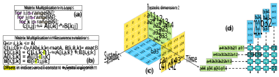
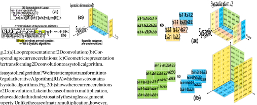
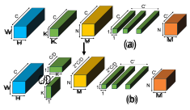
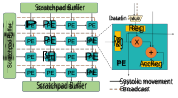
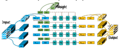
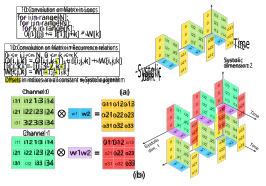
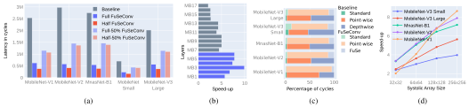

# FuSeConv: Fully Separable Convolutions for Fast Inference on Systolic Arrays 

Surya Selvam, Vinod Ganesan, Pratyush Kumar 

Department of Computer Science and Engineering, IIT Madras, India selvams@purdue.edu, _{_ vinodg,pratyush _}_ @cse.iitm.ac.in 

**_Abstract_ —Both efficient neural networks and hardware accelerators are being explored to speed up DNN inference on edge devices. For example, MobileNet uses depthwise separable convolution to achieve much lower latency, while systolic arrays provide much higher performance per watt. Interestingly however, the combination of these two ideas is inefficient: The computational patterns of depth-wise separable convolution are not systolic and lack data reuse to saturate the systolic array’s constrained dataflow. In this paper, we propose FuSeConv (FullySeparable Convolution) as a drop-in replacement for depth-wise separable convolution. FuSeConv generalizes the decomposition of convolutions fully to separable 1D convolutions along spatial and depth dimensions. The resultant computation is systolic and efficiently utilizes the systolic array with a slightly modified dataflow. With FuSeConv, we achieve a significant speed-up of 3x7x with the MobileNet family of networks on a systolic array of size 64x64, with comparable accuracy on the ImageNet dataset. The high speed-up motivates exploration of hardware-aware Neural Operator Search (NOS) in complement to ongoing efforts on Neural Architecture Search (NAS).** 

## I. INTRODUCTION 

Deep Neural Networks (DNNs) continue to establish stateof-the-art accuracy on tasks across domains. However, as accuracy requirements create larger and more complex DNNs, efficient inference on these networks becomes the primary challenge. There are two broad approaches to address this challenge - domain-specific hardware _accelerators_ and efficient _operators_ in DNNs. In many hardware accelerators, a systolic array [1] is a popular design pattern to accelerate matrix multiplication and convolution with a grid of multiplyaccumulate units (MACs). It’s efficiency is exemplified by TPUs [2]: At the time of release, the TPUv1 provided 25 to 29 times higher performance-per-watt than comparable GPUs [2]. On the other hand, depthwise separable convolution is a good example of an optimized operator in DNNs. A depthwise separable convolution decomposes a standard convolution into independent convolutions on each input channel, called depthwise convolution, followed by a 1x1 pointwise convolution. This reduces the number of parameters and operations as seen in the MobileNet [3]–[5] family of networks: MobileNet-V3 has 14.5 times fewer MACs but 1.6% higher accuracy on ImageNet than DenseNet-121 [6]. 

Surprisingly however, the combination of these two successful ideas, _i.e._ , systolic arrays executing depthwise separable convolution, does not work as expected. For instance, MobileNet-V2 has 12 _×_ fewer computations than ResNet-50, but runs only 1.3 _×_ faster on a systolic array with MACs arranged in a 32 _×_ 32 array. This incommensurate scaling 

has been identified earlier on EdgeTPU running EfficientNet [7] and while designing SqueezeNext [8]. In this work, we look at this discrepancy more closely by posing three research questions: Formally, why does depthwise separable convolution not work as well on systolic arrays? Can we design a drop-in replacement for it that is fast on systolic arrays? How good is such a replacement in terms of execution time and accuracy? 

For the first question, we study the formalism of Regular Iterative Algorithms (RIA) [9] and show that 2D convolution is not a _systolic algorithm_ – a class of algorithms that efficiently run on systolic architectures [10]. Consequently, to map depthwise seprabable convolution on to a systolic array, we need to apply the im2col [11] transformation. We show that this transformed computation does not have any data reuse on 2D systolic arrays, and thus has very poor utilization. 

For the second question, we propose Fully Separable convolution (FuSeConv) as a drop-in replacement for depthwise separable convolution. FuSeConv generalizes the decomposition fully to separable 1D convolutions along all spatial and depth dimensions. 1D convolutions are systolic algorithms and thus can be efficiently mapped on to systolic arrays. We show that for efficient execution on 2D systolic arrays, a small change in the dataflow is required - each row should support a weightbroadcast link. We evaluate that the cost of this additional dataflow pattern is small: For instance, for a systolic array of size 32 _×_ 32, only 4 _._ 35% area and 2 _._ 25% power overheads are incurred when synthesized on a 45nm node. 

For the third question, we extensively evaluate networks with FuSeConv layers for the ImageNet dataset. In particular, we replace all depthwise convolution layers in MobileNet(V1,2,3) and MNasNet networks with two proposed variants of FuSeConv layers. With detailed evaluation we show that one of the variants is more effective and achieves significant speed-ups on all three versions of MobileNet and MNasNet. In particular, we achieve a speed-up of 6 _._ 76 _×_ on MobileNetV1 on a systolic array of size 64 _×_ 64, while matching accuracy on ImageNet. Similarly on MobileNetV2 we obtain a speed-up of 5 _._ 1 _×_ . 

In summary, our work proposes a different primitive operator, fully decomposed 1D convolutions, for executing DNNs on systolic arrays. The significant out-performance of this proposed operator relative to already efficient networks motivates greater focus on hardware-aware Neural _Operator_ Search (NOS). We see NOS as a natural complement to ongoing active research on Neural Architecture Search (NAS), since it informs the choice of operators considered in the search space of NAS. 

The rest of the paper is organized as follows. We discuss 

Fig. 1: (a). Loop representation of matrix multiplication; (b). Corresponding recurrence relations; (c). Geometric representation of the recurrence relation; (d). Output-stationary dataflow mapping to a systolic-array 

background material in Section II. In Section III, we show why depthwise convolution is not efficient on systolic arrays. We propose FuSeConv and a modified dataflow in Section IV. We present experimental results in Section V and conclude in Section VI. 

## II. BACKGROUND 

## _A. Systolic Arrays_ 

A systolic array [1] defines a regular arrangement, such as a rectangular grid, of homogeneous processing elements (PEs). The word ‘systolic’ implies rhythmic patterns in communication and computation, which are globally synchronous. This constrained dataflow restricts applications that can be mapped onto systolic arrays. However, the ones that can be mapped, such as matrix multiplication, have improved performance due to low control overhead and main memory dependence. Systolic arrays are used in many DNN accelerators [2], [12], [13]. 

## _B. Systolic Algorithms_ 

We discuss systolic algorithms with the example of matrix multiplication, as studied in the pioneering work of Kung and Leiserson [14]. In Fig. 1(a) we show the standard loop implementation of a matrix-matrix multiplication. We transform this into the format of recurrence relations as shown in Fig. 1(b). These relations are said to define a _regular iterative algorithm_ (RIA) [9], since they satisfy three conditions: (a) Each variable is defined by a name and a set of indices (in this case 3). (b) Each variable is assigned a value just once (single assignment language). (c) For each recurrence relation, the difference between the indices of the variable in the LHS and each variable in the RHS is a constant. For instance, in the equation for _C_ [ _i, j, k_ ], the differences in indices (called index offsets) to the three variables _A_ , _B_ , and _C_ in the RHS are [0 _,_ 0 _,_ 0] _,_ [0 _,_ 0 _,_ 0] _,_ and [0 _,_ 0 _, −_ 1], respectively. RIAs that satisfy these three conditions are a super-set of algorithms which can be synthesized on systolic arrays, _i.e._ , systolic algorithms [15]. 

## _C. Mapping systolic algorithms on to systolic arrays_ 

The computation of the said recurrence relations can be visualized geometrically as shown in Fig. 1(c). Each point in the 3D space corresponds to a combination of the indices _i, j, k_ starting at the origin (0 _,_ 0 _,_ 0). As shown, inputs _A_ and _B_ are initialized in respective planes while output _C_ is initialized with 0s. All values are propagated through to other points as per the recurrence relations. The computations for updating the values 

are mapped on to three dimensions. The dimensions _i_ and _j_ , along which _A_ and _B_ are propagated, are marked as systolic dimensions. The dimension _k_ along which _C_ is updated is marked as the ‘time’ dimension, ending with the final computed value as shown. Assigning such dimensions is equivalent to _mapping_ the algorithm on to a 2D systolic array as shown in Fig. 1(d). In the mapping, matrices _A_ and _B_ are input along rows and columns (the two systolic dimensions), respectively. The output _C_ is computed in each processing element (PE) over time (the time dimension). Since the output remains stationary in the PEs, this dataflow is referred to as _output stationary_ . We can similarly study input and weight stationary dataflows. 

## _D. Convolution Operations_ 

In _standard convolution_ , an input of size _W × H × C_ is convolved with a filter of size _K × K × C_ to obtain an output of size _N ×M ×_ 1, where _N_ = _W −K_ +1 and _M_ = _H −K_ +1. The output of _C__′_ convolution filters are stacked to obtain an output of size _N × M × C__′_ . In _depthwise convolution_ , an input of size _W ×H ×C_ is convolved with a filter of size _K ×K ×C_ channel-wise, _i.e._ , every _W × H_ channel is convolved with the respective _K × K_ channel in the filter to obtain an output of size _N × M × C_ . This is followed by a _point-wise convolution_ with _C__′_ filters of size 1 _×_ 1 _× C_ to obtain an output of size _N × M × C__′_ . For both these illustrated cases, the input and output sizes are the same. However, there is a major difference in the number of operations: Standard convolution has a total of _NMC__′_ _K_2 _C_ operations, while depthwise separable convolution has _NMC_ ( _K_2 + _C__′_ ) operations. This reduction in number of operations with depthwise separable convolution translates to much reduced inference time at comparable accuracy values. 

## III. WHY DEPTHWISE CONVOLUTIONS ARE INEFFICIENT ON SYSTOLIC ARRAYS? 

In this section, we show why depthwise separable convolution has poor scaling performance on systolic arrays. We also explain this finding in contrast to the widespread use of systolic arrays for standard convolution. 

## _A. 2D convolutions are not systolic algorithms_ 

As described earlier, depthwise convolution requires independent convolutions between 2D slices of the input with 2D kernels, henceforth referred to as a 2D convolution. 2D convolution can be written in loops as shown in Fig. 2(a): _A_ is the input feature map, _B_ the weight kernel, and _C_ the output. Is 

Fig. 2: (a) Loop representation of 2D convolution; (b) Corresponding recurrence relations; (c) Geometric representation after transforming 2D convolution to a systolic algorithm. 

this a systolic algorithm? We first attempt to transform it into a Regular Iterative Algorithm (RIA) which as a set contains all systolic algorithms. Fig. 2(b) shows the recurrence relations for 2D convolution. Like in the case of matrix multiplication, we have added a third index to satisfy the single assignment property. Unlike the case of matrix multiplication, however, we observe that the index offsets between LHS and RHS are not constants. For instance, in the recurrence relation for _C_ , the index offset to _A_ is given as [ _⌊k/K⌋, k_ % _K,_ 0]. Since this index offset depends on the index _k_ , it violates the important requirement for a RIA. 

Fig. 3: Two methods that enable execution of standard convolution on systolic arrays: (a) Input reuse across filters, (b) Ordering operations along channels. 

matrices from multiple filters enabling data reuse. This is shown in Fig. 3(a), wherein the filters scale along systolic dimension 1 achieving high utilization. Thus, depthwise convolution’s channel-wise decomposition which was designed for higher efficiency also lowers utilization on systolic arrays. 

Can this specification be refactored in some other way to satisfy RIA’s requirement? Note that computing the output at index ( _i, j_ ) requires summing up _K_2 products. We can map these computations to _K_2 values of the _k_ index. Computing a sum of these products implies a single offset dependence between _C_ [ _i, j, k_ ] and _C_ [ _i, j, k_ + 1]. However, for matrices _A_ and _B_ , the computation of these products requires input across a grid of _K × K_ values. Independent of the order in which these values are accessed, their _i, j_ indices will depend on the index _k_ . However, all these products are summed to the same _i, j_ index of _C_ . Thus, in the same recurrence relation, the _i, j_ index of _C_ remain constant while those of _A, B_ depend on _k_ , violating the criterion for constant index offsets. We thereby conclude that 2D convolution cannot be written as an RIA, and consequently depthwise convolution is not a systolic algorithm. 

## _C. Channel-wise operations_ 

To avoid the expensive im2col transformation, an alternative approach maps standard convolution into channel-wise operations on systolic arrays [2]. Specifically, standard convolution is implemented as a dot product of vectors of size _C_ along channels from the input and filter matrices. The corresponding mapping on to a systolic array is shown in Fig. 3(b). The generated output needs to be reduced with an adder tree (usually a part of most systolic array accelerators) to obtain the final output. In this case too, we are able to utilize both systolic dimensions. Again, depthwise convolution does not expose any computation spanning channels to benefit from this mapping. 

Though depthwise convolution is not a systolic algorithm, standard convolution operations are mapped on to systolic arrays. We discuss two ways in which such mapping is done and why the results do not extend to depthwise convolution. 

In summary, with the RIA formalism, we showed that 2D convolution is not a systolic algorithm. Further, the two methods of im2col transformation and channel-wise operations, which enable standard convolution to execute on systolic arrays, are not applicable to depthwise convolution. This explains the poor utilization of systolic arrays with depthwise convolution, and motivates a new systolic-friendly operator. 

## _B. Transformation im2col and Data Reuse_ 

Consider a transformation of _A_ such that each set of _K × K_ values required in each step of convolution is stored in a row. With this transformation, the index offsets between _C_ and _A_ become constant. This is the approach with im2col [16] which creates a larger matrix _A__′_ from _A_ with repeating entries and a flattened _B_ matrix. The 2D convolution operation on these modified matrices is a systolic algorithm as shown in Fig. 2(c). Note that this computation does not scale on systolic dimension 1, i.e., when mapped to a 2D systolic array it would only use a single column resulting in very poor utilization. This also implies that data written on to the systolic arrays are not reused across operations. This lack of data reuse significantly lowers performance of depthwise convolution on systolic arrays. However, this is the not the case with standard convolution, where the same input channel has to be convolved with weight 

## IV. FUSECONV: OUR HW/SW CO-DESIGN SOLUTION 

In this section, we discuss the proposed FuSeConv-operation and how it can be mapped on to a systolic array. 

## _A. The FuSeConv Operator_ 

Though depthwise separable convolution decomposes standard convolution to reduce operations, the resultant algorithm is not systolic and does not benefit from either data reuse or channel-wise mapping. Our motivation with the FuSeConv is to combine the benefits of decomposing convolution with that of a systolic algorithm. In addition, we also draw inspiration from the work on grouped convolution [17]. 

Fig. 4: Transformation of a depthwise separable convolution layer into a FuSeConv layer 

Recall that a depthwise separable convolution has _K × K_ 2D convolutions for filtering _C_ input channels independently, followed by _C__′_ pointwise filters (see Fig. 4(a)). We extend this decomposition with FuSeConv, where we factorize the _K × K × C_ depthwise filters into two groups of depthwise filters: _K×_ 1 _×C/D_ 1D row filters and 1 _×K×C/D_ 1D column filters. Here, _D_ is a design-knob used to generate variants of FuSeConv layers. The resultant output is passed through _C__′_ pointwise filters (see Fig. 4(b)). In essence, FuSeConv performs 1D convolutions alone to fully separate the filtering of information along the three axes of the input, and hence the name. 

With the same input and output sizes as with depthwise separable convolution, FuSeConv is designed as a drop-in replacement. With this replacement, number of parameters changes from _C_ ( _K_2 + _C__′_ ) to _D_ <u>2</u>_C_(_K_+_C′_)andnumber of operations from _NMC_ ( _K_2 + _C__′_ ) to _D_ <u>2</u>_NMC_(_K_+_C′_). To study the trade-off between efficiency and accuracy, we consider two variants for _D_ = 1 and 2. In the _full variant_ with _D_ = 1, we apply both row and column filters on all channels for an output of size _K × K ×_ 2 _C_ . In the _half variant_ with _D_ = 2, row filters operate on _C/_ 2 channels while column filters operate on the other _C/_ 2 channels for an output of size _K × K × C_ . Clearly, the full variant with _D_ = 1 has more parameters and operations. 

## _B. FuSeConv is a systolic algorithm_ 

FuSeConv comprises of independent 1D convolutions which have been extensively studied and found to be systolic algorithms [18]. Indeed [1] illustrates 7 different ways of mapping a 1D convolution on to a linear systolic array. In Fig. 7 (a), we show the 1D convolution both as a loop and recurrence relations. The recurrence relations satisfy the requirements of an RIA. The other operation in a FuSeConv layer, point-wise convolution, is a vector dot-product and is also a systolic algorithm. Thus, FuSeConv can be efficiently mapped to systolic arrays without requiring transformations such as im2col. 

## _C. Proposed Hardware Architecture and Mapping_ 

_1) Optimized dataflow for FuSeConv:_ The independent 1D convolutions of FuSeConv can be mapped into individual rows of a 2D systolic array. However, this mapping requires a slightly modified dataflow: Each row of a systolic array should have a broadcast link that sends weight values to all PEs in that row, which is similar to Eyeriss [19] that relies on an NoC instead of a systolic architecture. This modified dataflow can co-exist 

Fig. 5: Overview of systolic array with the proposed dataflow 

Fig. 6: Mapping FuSe layers to the proposed systolic-array architecture 

with the standard systolic flow from top to bottom. For this, the PE can be configured (as shown in Fig. 5) to either read data from the top systolic link or the row broadcast link. We compute and report the additional overhead of this modified dataflow in the experimental section. 

_2) Mapping FuSeConv layers:_ Fig. 6 illustrates how a FuSeConv is mapped onto a systolic array of size _S × S_ with the modified dataflow. We choose the half variant ( _i.e._ , _D_ = 2), and only show the mapping of row 1D filters. The mapping of column filters and the full variant follows similarly and the 1x1 pointwise convolution of FuSeConv is mapped to the standard systolic dataflow. The input is sliced into its _W_ rows, denoted _A_ 1 through _AW_ , and each slice is allocated to one row of the systolic array. Every row is further sliced across the channels into _C/_ 2 channel slices denoted _A_ 1 _,_ 1 through _A_ 1 _,C/_ 2. Similarly, weights are sliced across channels into _C/_ 2 1D filters denoted _K_ 1 through _KC/_ 2. The computation follows multiple folds wherein at every fold one weight channel slice operates over one input-channel slice generating _S_ output feature map slices. After all folds are computed, the output slices are concatenated to form the output feature map. 

_3) Efficient utilization:_ With the proposed operation, modified dataflow, and mapping, is a systolic array efficiently utilized? In Fig. 7 (a), we visualize a 1D filter of 2 weights convolved with a 4x3 input. Note that due to the broadcast link, at any time step the weight value is available along systolic dimension 1 (columns in the array). Notice also that the different rows of the input are mapped along systolic dimension 2 (rows in the array). We have explicitly shown the values of the input along the systolic dimension 1 due to the modified dataflow pattern. Unlike for depthwise convolution, the computation of FuSeConv spans both systolic array dimensions, thereby achieving high utilization. The span along dimension 1 increases as columns in the input increase, while the span along dimension 2 increases as rows in the input increase. If input size is smaller than the systolic dimension _S_ , then we can simultaneously map 1D convolutions across multiple channels as shown in Fig. 7 (b). Thus, FuSeConv is a systolic algorithm 

Fig. 7: (a) Loop representation, recurrence relation and geometric representation of a 1D convolution; (b) Mapping multiple channels of 1D convolutions to the proposed systolic-array which can be mapped with the modified dataflow to fully utilize both axes of a 2D systolic array. 

V. EXPERIMENTAL SETUP AND RESULTS 

In this section, we detail the experimental setup and share results to evaluate FuSeConv. 

## _A. Experimental Setup_ 

_1) Networks:_ We study 5 baseline DNNs, 4 networks from the MobileNet family (V1, V2, V3 small, and V3 large) [3]–[5], and MnasNet-B1 [20]. These networks are designed to be efficient on inference especially for edge devices, and prominently include depthwise separable convolution. For each of these 5 networks, along with the baseline we consider 4 variants with FuSeConv. Full and Half variants with _D_ = 1 and _D_ = 2 are the first two variants which replace all depthwise separable convolution layers in the baseline network with respective FuSeConv layers. We then re-train the network with FuSeConv layers using the setup described below. We consider two other variants Full-50% and Half-50% by using FuSeConv replacements for only 50% of the depthwise separable convolution layers. For 50% variants, we do drop-in replacement for layers in such a way that maximum latency benefits are obtained. 

_2) Datasets and Training Setup:_ We evaluate the networks based on accuracy on ImageNet [21] dataset. We use PyTorch [22] to train the models and report accuracy. Half-precision floating point (FP16) is used as the precision for both weights and activations during training and inference. We use standard _rmsprop_ optimizer with 0.9 momentum, an initial learning rate of 0.016, with a batch size of 128 per GPU. The learning rate has an exponential decay of 0.97 for every 2.4 epochs. We maintain exponential moving averages of all weights with a decay of 0.9999, and use a weight decay of 1e-5. We train all models on either 8 V100 or 4 P100 GPUs for 350 epochs. 

_3) Latency Estimation:_ Latency is a complex function of several factors including speed of main memory, and size and speed of buffers within the systolic array. To simplify the comparison of software choices on systolic arrays, we use the methodology formalized in SCALE-Sim [23]. Specifically, we 

|Network|ImageNet accuracy|MACs (millions)|Params (millions)|Speedup|
|---|---|---|---|---|
|MobileNet-V1 [3]|70.60|589|4.23|1x|
|MobileNet-V1 FuSe-Full|72.86|1122|7.36|4.1x|
|MobileNet-V1 FuSe-Half|72.00|573|4.20|6.76x|
|MobileNet-V1 FuSe-Full-50%|72.42|764|4.35|2.2x|
|MobileNet-V1 FuSe-Half-50%|71.77|578|4.22|2.36x|
|MobileNet-V2 [4]|72.00|315|3.50|1x|
|MobileNet-V2 FuSe-Full|72.49|430|4.46|5.1x|
|MobileNet-V2 FuSe-Half|70.80|300|3.46|7.23x|
|MobileNet-V2 FuSe-Full-50%|72.11|361|3.61|2.0x|
|MobileNet-V2 FuSe-Half-50%|71.98|305|3.49|2.1x|
|MnasNet-B1 [20]|73.50|325|4.38|1x|
|MnasNet-B1 FuSe-Full|73.16|440|5.66|5.06x|
|MnasNet-B1 FuSe-Half|71.48|305|4.25|7.15x|
|MnasNet-B1 FuSe-Full-50%|73.52|361|4.47|1.88x|
|MnasNet-B1 FuSe-Half-50%|72.61|312|4.35|1.97x|
|MobileNet-V3 Small [5]|67.40|66|2.93|1x|
|MobileNet-V3 Small FuSe-Full|67.17|84|4.44|3.02x|
|MobileNet-V3 Small FuSe-Half|64.55|61|2.89|4.16x|
|MobileNet-V3 Small FuSe-Full-50%|67.91|73|3.18|1.6x|
|MobileNet-V3 Small FuSe-Half-50%|66.90|63|2.92|1.68x|
|MobileNet-V3 Large [5]|75.20|238|5.47|1x|
|MobileNet-V3 Large FuSe-Full|74.40|322|10.57|3.61x|
|MobileNet-V3 Large FuSe-Half|73.02|225|5.40|5.45x|
|MobileNet-V3 Large FuSe-Full-50%|74.50|264|5.57|1.76x|
|MobileNet-V3 Large FuSe-Half-50%|73.80|230|5.46|1.83x|

TABLE I: ImageNet performance, MACs and speedup of DNNs used to evaluate FuSeConv. 

assume that performance is limited only by operations on the systolic array: We add up the time required to load values into the array, compute in the MACs, systolically communicate partial values, and flush output beyond the array. Since convolution operations dominate inference on DNNs and FuSeConv is a drop-in replacement for depthwise convolution, we consider compute-bound convolutional layers (including Squeeze and Excite layers) and fully connected layers in latency estimation. We report all the performance numbers on a 64 _×_ 64 systolicarray. We only consider the output stationary dataflow, and add support for computing latency with proposed broadcast links. _B. Experimental Results_ 

_1) Accuracy on datasets:_ We report the accuracy of different model variants in Table I. Note the differences between accuracy of a variant and the corresponding baseline (without FuSeConv). For the Half variant, in 4 out of the 5 networks, there is a drop in accuracy of over 1%. On the other hand, the Full variant is always within 1% of accuracy of the baseline, with an average drop of under 0.3%. This shows that the higher parameter and operation counts of the Full variant enable improved accuracy. We thus conclude that the drop-in replacement with Full variant retains baseline accuracy. 

_2) Speedup in inference time:_ Table I shows the MAC count and speed-up relative to baseline (without FuSeConv) across networks and variants. Additionally, Fig. 8 (a) reports the exact latency of the networks. We report significant speed-up: 4 _._ 16 _×_ to 7 _._ 23 _×_ with the Half variant and 3 _._ 02 _×_ to 5 _._ 1 _×_ with the Full variant. These speed-up values are relative to baseline networks designed to be efficient on the edge. In spite of its larger MAC count, the Full variant is significantly faster than the baseline network due to the efficient mapping of FuSeConv on to the systolic array. The numbers for 50% variants reveal a sensitive design trade-off between operations/latency and accuracy. 

_3) Understanding the high speed-up:_ To understand the high observed speed-up, we pose two questions: Which _layers_ and which _operators_ are most responsible for the speed-up? 

Fig. 8: Experimental results evaluating FuSeConv: (a) Latency estimates on 64 _×_ 64 arrays, (b) Layer-wise speed up for MobileNetV2, (c) Latency distribution of operators for baseline and FuSeConv networks, and (d) Ablation study 

On the analysis of _layers_ , we compute layer-wise speed-up for the Full variant for MobileNetV2. The speed-up ranges from 2 _._ 48 _×_ to 9 _._ 38 _×_ (see Fig. 8(b)). Notably, initial layers which have larger input feature maps report larger speed-up values. This suggests that larger layers benefit more from FuSeConv transformation due to better utilization of the systolic array. 

On the analysis of _operators_ , we report the latency distribution of different operators before and after FuSeConv transformation. As shown in Fig. 8(c), the latency of baseline networks are dominated (30-50%) by depthwise-separable convolutions which as we saw inefficiently utilize the systolic array. After the FuSeConv transformation, the latency distribution drastically shifts towards point-wise convolutions while the efficient FuSeConv operators account for a much smaller fraction (411%). This establishes that the combination of FuSeConv and the modified dataflow significantly improves utilization. 

_4) Scaling to Larger Systolic Arrays:_ We study how the reported speed-up scales with increasing size of systolic arrays. As shown in Fig. 8(d), the speed-up increases as we move to larger arrays. This shows that the under-utilization of a systolic array becomes more stark with increasing array size. Interestingly, under-utilization has a more severe effect on performance for larger networks. For instance, the larger, older network MobileNetV1 shows a higher speed-up on larger arrays than the newer, smaller network MobileNetV3-small. This suggests differentiated design for cloud and edge accelerators. 

_5) Area and Power Overhead of Modified Dataflow:_ To evaluate the hardware overhead of the modified dataflow, we implemented a 32 _×_ 32 systolic-array in Bluespec System Verilog [24] and synthesized to NanGate’s open cell library in 45nm. Two variants were implemented - with and without the weight-broadcast links. The area and power consumption were measured using Synopsys Design Compiler. The relative area overhead was measured to be 4 _._ 35% while the power overhead was 2 _._ 25%. We consider these overheads to be justifiably small considering the large speed-ups reported with FuSeConv. 

## VI. CONCLUSION 

We analyzed why depthwise separable convolution is not efficient on systolic arrays with the formalism of regular iterative algorithms. As a drop-in replacement, we proposed FuSeConv which fully decomposes into 1D convolutions. We showed that FuSeConv is efficiently executed on systolic arrays with a modified dataflow. The Full variants of FuSeConv match the accuracy of efficient networks such as MobileNet and MNasNet, but with high speed-up of about 4 _×_ . Further work 

can explore other variants to sensitively trade-off latency and accuracy. Also, framing FuSeConv as the result of a manual _operator_ search, our work motivates automated Network Operator Search (NOS) in complement to ongoing studies on NAS. 

## VII. ACKNOWLEDGEMENTS 

We thank Google Cloud Platform and Robert Bosch Centre for Data Science and Artificial Intelligence, IIT Madras for their help with compute resources for this project. We thank Gokulan for his help in modeling systolic-arrays. Finally, we thank the anonymous reviewers for their insightful comments and suggestions towards improving the work. 

## REFERENCES 

- [1] H.-T. Kung, “Why systolic architectures?” _IEEE computer_ , 1982. 

- [2] N. P. Jouppi _et al._ , “In-Datacenter Performance Analysis of a Tensor Processing Unit,” in _ISCA 2017_ . 

- [3] A. G. Howard _et al._ , “MobileNets: Efficient Convolutional Neural Networks for Mobile Vision Applications,” _arXiv_ , 2017. 

- [4] M. Sandler _et al._ , “MobileNetV2: Inverted Residuals and Linear Bottlenecks,” in _CVPR 2018_ . 

- [5] A. Howard _et al._ , “Searching for mobilenetv3,” _arXiv 2019_ . 

- [6] G. Huang _et al._ , “Densely Connected Convolutional Networks,” in _In Proc. IEEE CVPR_ , 2017. 

- [7] S. Gupta _et al._ , “Accelerator-aware Neural Network Design using AutoML,” _arXiv preprint arXiv:2003.02838_ , 2020. 

- [8] A. Gholami _et al._ , “SqueezeNext: Hardware-Aware Neural Network Design,” in _In Proc. IEEE CVPR_ , 2018. 

- [9] S. K. Rao _et al._ , “Regular iterative algorithms and their implementation on processor arrays,” _In Proc. IEEE_ , 1988. 

- [10] S. W. Song, “Systolic algorithms: concepts, synthesis, and evolution.” 

- [11] K. Chellapilla _et al._ , “High Performance Convolutional Neural Networks for Document Processing,” 2006. 

- [12] “Accelerating AI in Datacenters. Xilinx ML Suite,” 2019. 

- [13] P. J. Bannon _et al._ , “Accelerated mathematical engine,” Jun. 2 2020, uS Patent 10,671,349. 

- [14] H. Kung and C. Leiserson, “Systolic arrays for (VLSI), Introduction to VLSI Systems,” _Mead and L. Conway_ , pp. 260–292, 1980. 

- [15] C. Wan, “Systolic algorithms and applications,” Ph.D. dissertation, Loughborough University. 

- [16] Y. Jia _et al._ , “Caffe: Convolutional Architecture for Fast Feature Embedding,” _arXiv preprint arXiv:1408.5093_ , 2014. 

- [17] A. Krizhevsky _et al._ , “Imagenet Classification with Deep Convolutional Neural Networks,” in _NeurIPS_ , 2012. 

- [18] P. Quinton, “Automatic Synthesis of Systolic Arrays from Uniform Recurrent Equations,” in _ISCA_ , 1984. 

- [19] Y.-H. Chen _et al._ , “Eyeriss: An Energy-Efficient Reconfigurable Accelerator for Deep Convolutional Neural Networks,” _IEEE JSSC 2016_ . 

- [20] M. Tan, B. Chen _et al._ , “MnasNet: Platform-Aware Neural Architecture Search for Mobile,” in _CVPR 2019_ . 

- [21] J. Deng _et al._ , “ImageNet: A Large-Scale Hierarchical Image Database,” in _In Proc. CVPR_ , 2009. 

- [22] A. Paszke _et al._ , “Pytorch: An Imperative Style, High-Performance Deep Learning Library,” in _NeurIPS_ , 2019, pp. 8026–8037. 

- [23] A. Samajdar _et al._ , “A systematic methodology for characterizing scalability of dnn accelerators using scale-sim,” in _ISPASS_ . IEEE, 2020. 

[24] R. Nikhil, “Bluespec System Verilog: efficient, correct RTL from high level specifications,” in _Proc. MEMOCODE_ . IEEE, 2004. 

