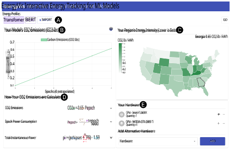
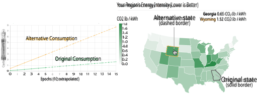
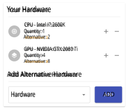

# **EnergyVis: Interactively Tracking and Exploring Energy Consumption for ML Models** 

Omar Shaikh Jon Saad-Falcon Georgia Institute of Technology Georgia Institute of Technology oshaikh@gatech.edu jonsaadfalcon@gatech.edu Nilaksh Das Scott Freitas Georgia Institute of Technology Georgia Institute of Technology nilakshdas@gatech.edu safreita@gatech.edu 

Austin P Wright Georgia Institute of Technology austinpwright@gatech.edu 

Omar Isaac Asensio Georgia Institute of Technology asensio@pubpolicy.gatech.edu 

Duen Horng (Polo) Chau Georgia Institute of Technology polo@gatech.edu 

**Figure 1: The EnergyVis user interface, with multiple coordinated views. (A) The** **_Model Energy Profile View_ allows users to select an energy profile of pre-loaded models, generate new profiles (for models that a user wishes to train), and import saved profiles. (B) The** **_Consumption Chart_ allows users to view the energy and carbon consumption of their selected model. (C) Using the** **_Model Region_ view, users can view the region where a model was trained, and select regions with a lower energy intensity as an alternative to reduce emissions. (D) Users can expand the** **_Colored Equation_ s for succinct descriptions of various variables and how they contribute to calculating a model’s emissions. (E) Finally, users can view or adjust hardware used to train a model using** **_Alternative Hardware_ .** 

Permission to make digital or hard copies of all or part of this work for personal or classroom use is granted without fee provided that copies are not made or distributed for profit or commercial advantage and that copies bear this notice and the full citation on the first page. Copyrights for components of this work owned by others than the author(s) must be honored. Abstracting with credit is permitted. To copy otherwise, or 

republish, to post on servers or to redistribute to lists, requires prior specific permission and/or a fee. Request permissions from permissions@acm.org. _CHI ’21 Extended Abstracts, May 8–13, 2021, Yokohama, Japan_ 

CHI ’21 Extended Abstracts, May 8–13, 2021, Yokohama, Japan 

Shaikh et al. 

## **ABSTRACT** 

The advent of larger machine learning (ML) models have improved state-of-the-art (SOTA) performance in various modeling tasks, ranging from computer vision to natural language. As ML models continue increasing in size, so does their respective energy consumption and computational requirements. However, the methods for tracking, reporting, and comparing energy consumption remain limited. We present EnergyVis, an interactive energy consumption tracker for ML models. Consisting of multiple coordinated views, EnergyVis enables researchers to interactively track, visualize and compare model energy consumption across key energy consumption and carbon footprint metrics (kWh and CO2), helping users explore alternative deployment locations and hardware that may reduce carbon footprints. EnergyVis aims to raise awareness concerning computational sustainability by interactively highlighting excessive energy usage during model training; and by providing alternative training options to reduce energy usage. 

## **CCS CONCEPTS** 

- **Human-centered computing** → **Visual analytics** ; • **Comput-** 

- **ing methodologies** → **Machine learning** . 

## **KEYWORDS** 

machine learning, environmental sustainability, interactive visualization, computational equity 

### **ACM Reference Format:** 

Omar Shaikh, Jon Saad-Falcon, Austin P Wright, Nilaksh Das, Scott Freitas, Omar Isaac Asensio, and Duen Horng (Polo) Chau. 2021. EnergyVis: Interactively Tracking and Exploring Energy Consumption for ML Models. In _CHI Conference on Human Factors in Computing Systems Extended Abstracts (CHI ’21 Extended Abstracts), May 8–13, 2021, Yokohama, Japan._ ACM, New York, NY, USA, 7 pages. https://doi.org/10.1145/3411763.3451780 

## **1 INTRODUCTION & BACKGROUND** 

Researchers and practitioners alike utilize machine learning (ML) to successfully model and draw insights from datasets. Continued advancements in ML have also significantly furthered modeling performance. However, as datasets grow more complex, researchers are switching to larger architectures that require increasingly more compute [2, 17, 23, 24]. These models’ parameter counts have increased by over 300 _,_ 000× from 2012 to 2019 [2]. Models like GPT-3 are reflective of this trend, with performance increases relying on scaling previously successful architectures [5]. Due to this rapid increase, ML researchers will soon be forced to account for computational efficiency for improved performance [12]. Other work, like Schwartz et al. [18], raises concerns regarding computational equity: as models grow larger and larger, computational resources make replication prohibitive. Pushing for Green AI, where compute requirements themselves are reduced, will guarantee a reduction in carbon footprints [18]. 

Continuing to reduce compute resources and energy consumption has several benefits. Firstly, smaller research teams and companies simply might not have access to renewable resources. In 

> © 2021 Copyright held by the owner/author(s). Publication rights licensed to ACM. ACM ISBN 978-1-4503-8095-9/21/05...$15.00 https://doi.org/10.1145/3411763.3451780 

this case, tracking just efficiency plays a key role in computational equity, as it enables users to explore how carbon footprints change if their models were deployed elsewhere. Secondly, carbon credits alone are an indirect—and occasionally ineffective—approach to reducing carbon output, as they require third-party verification, offset direct responsibility, and require monetary compensation, which might be impractical for smaller labs or companies [16]. Thirdly, energy from training models can be repurposed towards powering homes or essential infrastructure. Preliminary estimates from Strubell et al. [19], summarized in Table 1, highlight the significant carbon footprints coming from various natural language processing pipelines. For example, training a state-of-the-art NLP model (BERT [8]) on a GPU produces comparable carbon output to a trans-atlantic flight [19]. By directly reducing computationally intensive tasks, identified through monitoring ML training process, the computing community can help play a role in reducing emissions. 

Despite these increases in computational intensity, tracking and analyzing energy usage from training/evaluating these models remains a challenge. Prior work, like Henderson et al. [11], covers the lack of systemic reporting for carbon output stemming from ML models, while providing a framework and a tool for tracking and reporting energy usage using static graphs. Anthony et al. [3] builds on prior work by offering predictions for total carbon consumption through a command line interface. Finally, Lottick et al. [15] generates static energy usage reports at the end of an experiment, and includes a set of fixed, location based counterfactuals. However, these tools are limited to command line interfaces (CLI), or use static visuals to communicate results. Furthermore, practitioners may be unaware of alternatives to reduce their carbon footprint even after tracking and monitoring their models using prior work. 

To help address a small subset of these challenges, we are developing EnergyVis, an interactive system that tracks energy consumption for machine learning (ML) models, while providing practitioners and researchers with alternative options to reduce this consumption. By logging electricity usage from hardware components (kilowatt hours, kWh, or watts, W), EnergyVis collects energy usage from various computationally intensive experiments. Using energy resource data from the National Renewable Energy Laboratory (NREL) [1], along with collected energy usage, EnergyVis can estimate carbon output from experiments run in various locations, while exploring location based alternatives. EnergyVis also aims to raise awareness with respect to computational sustainability. In this work, our contributions include: 

- **EnergyVis** , a web-based system to interactively allow practitioners to explore energy efficiency costs (CO2 consumption, kWh, etc.) associated with training ML models. Building on prior energy tracking tools, used through the commandline interface or consisting of static graphs, EnergyVis provides a novel web-based interface for monitoring energy utility across experiments. Furthermore, EnergyVis can optionally sync to backend training code using a Python plugin, which updates projections and recorded energy consumption with respect to a running experiment. 

EnergyVis: Interactively Tracking and Exploring Energy Consumption for ML Models 

CHI ’21 Extended Abstracts, May 8–13, 2021, Yokohama, Japan 

|Consumption Mode|CO2e (Tons)|Consumption Mode|CO2e (Tons)|
|---|---|---|---|
|Air travel, 1 passenger, NY to SF Human life, avg, 1 year American life, avg, 1 year Car, avg incl. fuel, 1 lifetime|0.99 5.52 18.08 63.00|BERT_𝑏𝑎𝑠𝑒_ NLP Pipeline (parsing, SRL) Neural Architecture Search|0.72 39.23 313.08|

**Table 1: CO** 2 **consumption from familiar sources compared to NLP pipelines, from Strubell et al. [19]** 

- **Visual comparisons across experimental setups:** EnergyVis provides users with the option to visually compare energy efficiency projections from other experiments, allowing for cross-model energy efficiency comparisons. Given experimental data from other work, users can define hardware and energy source estimates, _overlaying their own tracking data with efficiency metrics from these works._ If possible, users can also import reports generated by EnergyVis, allowing for direct comparisons instead of estimations. 

- **Interactive exploration of alternatives for reducing energy consumption and carbon footprint:** EnergyVis allows users to pause experiments and observe the impact of alternatives on energy consumption projections. Concretely, EnergyVis allows users to select hardware and location counterfactuals while watching (real-time) projections for carbon usage change appropriately. By enabling alternative exploration, users can change elements of their training process to consume less energy, and reduce their footprint. 

**Figure 2: The Energy Profile View component allows users to switch between Energy Profiles. A preloaded mode (top) allows users to select, compare, or import preloaded energy profiles. Users can compare efficiency metrics across different energy profiles by right-clicking on a profile. A live tracking mode (bottom) allows users to collect their own energy profile for arbitrary models and export them, using EnergyVis’s optional backend.** 

## **2 SYSTEM DESIGN AND IMPLEMENTATION** 

EnergyVis is an interactive tool that allows users to compare energy usages across model training pipeline, and find alternatives to reduce energy consumption and CO2 production. EnergyVis consists of two different modes. The first mode is a **preloaded mode** , which allows users to load results from previously live-tracked models. The second mode is a **live-tracking mode** , which allows users to actively track results from a training model. To support both of these modes, EnergyVis consists of a frontend, which handles visualization, comparison, and alternatives selection. A backend, which is launched when users train a model using EnergyVis’s Python library, handles live-tracking of models. 

The frontend of EnergyVis was written using modern web technologies like React.js and D3, and consists of several components. The **(1) Energy Profile View** component loads **model energy profiles** into EnergyVis’s UI. Energy Profiles are JSON (meta-data) files that contain information about a models energy usage over training epochs. The **(2) Alternative Model Region** component highlights energy intensity (how much carbon is produced per kilowatt-hour of electricity) across different regions, and allows users to select alternate regions to train their models. Likewise, the **(3) Alternative Hardware** component displays a user’s hardware and allows alternative selection. The **(4) Consumption Chart** component graphs the consumption from a model profile, along with selected alternatives. Finally, **(5) Color Equation** components display equations used to calculate a model’s emissions given selected alternatives. 

_2.0.1 Model Energy Profile View._ The Model Energy Profile View allows users to select between model energy profiles. Energy Profiles are JSON metadata files containing information about a model’s training pipeline. These files consist of information like the hardware used to train the model, the location the model was trained in, how much energy the model used per epoch, and how long each epoch lasted. After energy profiles are imported, they appear as a button in the profile view. 

The energy profile view also allows users to switch between the **preloaded mode** and the **live tracking mode** , using the link button placed at the right of the view (seen in Figure 2). In the preloaded mode, users can either import an energy profile using the import button, or select from pre-imported models (in Figure 2, a Transformer [22] and BERT [8] model are imported). Users can also right click on unselected energy profiles to load their data as alternatives in EnergyVis’s UI; alternative profiles are highlighted using a dashed orange border. If users want to collect their own energy profiles, the live-tracking mode allows users to input a URL to EnergyVis’s backend (described in Section 2.2). After training a model in live-tracking mode, users can export a profile using the export button. 

_2.0.2 Alternative Model Region._ The Alternative Model Region Component (Figure 3, right) allows users to select alternative regions for training their models. Alternative region emissions are computing using _energy intensity_ ; some regions produce more lbs of CO2 for the same amount of electricity (in kWh, or kilowatt hours). Energy intensity is measured in_<u>𝐶𝑂</u>_ _𝑘𝑊ℎ_<u>2</u>_<u>𝑙𝑏𝑠</u>_.Asdifferentre- gions are selected (by clicking) or previewed (by hovering) on the 

CHI ’21 Extended Abstracts, May 8–13, 2021, Yokohama, Japan 

Shaikh et al. 

map, alternative emissions are computed by substituting new energy intensities in the emission computations. This allows users to make informed decisions about deployment locations for their models. 

## **2.1 EnergyVis Frontend** 

_2.1.1 Alternative Hardware._ EnergyVis also enables users to explore hardware based alternatives. The alternative hardware component (Figure 4) allows users to change the quantity of their hardware, or add new hardware to their training pipeline, while viewing updated energy usages. To implement hardware alternatives, we utilize a dataset from Sun et al. [20], consisting of power draw _𝑝_ and floating point operations per second (FLOPS) _𝑠_ for over 4000 GPUs and CPUs. To calculate alternative power consumed over an epoch, we multiply the original power used by_<u>𝑝𝑎</u>_<u>/</u>_𝑠𝑎_ _𝑝_ / _𝑠_, where_𝑝𝑎_and _𝑠𝑎_ are the power and FLOPs for the selected alternative hardware. Using this ratio, EnergyVis rescales the original power draw while considering power draw and speed of the alternate hardware. 

_2.1.2 Consumption Chart._ The Consumption Chart component plots energy data from an energy profile alongside selected alternatives, for each epoch. Data from the selected energy profile is loaded into the chart component (left, Figure 3). The consumption chart also allows users to toggle between carbon emissions (CO2) and electricity usage (kWh). EnergyVis includes electricity usage since some research labs or organizations may be restricted when selecting region alternatives; a fairer comparison between models should rely on electricity usage instead of carbon emissions. 

Users can also extrapolate beyond the provided data points in the selected energy profile. On the X-axis for the Consumption Chart (bottom left, Figure 3) users can use a stepper to increase or decrease extrapolated epochs. EnergyVis performs a least-squares linear regression on the recorded data, and predicts carbon emissions or electricity usage for the extrapolated points. Given this data, users can make informed decisions about training models for longer periods of time. 

_2.1.3 Color Equations._ To provide transparency into the calculations of carbon emissions, EnergyVis provides dynamically changing equations that walk users through emission computations. Drawing from Azad [4] and Hohman et al. [13], color equations highlight variables in color and provide corresponding text annotations in the same color. In EnergyVis, color equations can be contracted (Figure 1) or expanded (Figure 5); and allow users to directly edit constants within the explaining text, causing EnergyVis’s remaining components to reflect the updated changes. Likewise, edits made in the Alternative Region component also affect constants in the color equations. 

EnergyVis utilizes 3 equations to compute carbon emissions (seen in 1). The first equation computes CO2 emissions from each epoch by multiplying electricity used over an epoch with a U.S state-dependent energy intensity constant (i.e. how much carbon each kilowatt hour of electricity produces). The second equation computes the electricity used during each epoch. Lastly, the third equation is described in Figure 5. 

## **2.2 EnergyVis Live-Tracking Backend** 

EnergyVis’s _optional_ live-tracking backend allows users to livetrack and collect energy profiles for their models. If users already have energy profiles, EnergyVis can be backend-agnostic. The backend from EnergyVis is similar to Anthony et al. [3]: it monitors CPU energy usage using Intel’s Running Average Power Limit interface [6], collects GPU usage through NVIDIA’s System Management interface, and is written in Python. Like Anthony et al. [3], using the backend involves simply wrapping the model training code in a separate function provided by EnergyVis. 

However, EnergyVis contains modifications that allows the frontend to listen to training progress on the backend. On running the training code, EnergyVis launches a backend server that exposes an API to the frontend, and prints the access URL to the console. The API provides a constantly updating model energy profile—users can enter the API’s access URL into EnergyVis’s frontend, enabling live-tracking. 

## **3 USAGE SCENARIOS** 

We envision the usage scenarios of EnergyVis to include user communities involved in intensive computational tasks, where information about environmental impacts may be difficult to access or visualize. Here, we highlight three usage scenarios focusing on ML. 

**_Tracking CO_** 2 **_emission in real-time, and comparing results:_** Susan, a graduate student, is applying a series of models to a large image classification task. Susan visits a leaderboard website and selects the two promising models as candidates: EfficientNet [21] and ResNet [10]. Although Susan is unfamiliar with the specific techniques employed by the black-box models she is using, she _is_ aware of the potential energy efficiency limitations of her selected models; therefore, she wants to limit the electricity usage and emissions of her models. Susan cannot find an energy profile from her colleagues or online, so she begins actively tracking each of her models. she starts by using EnergyVis’s **live-tracking** mode. Susan begins by wrapping her EfficientNet training loop with EnergyVis’s Python plugin, and starts her training process—the training URL is printed to her console by EnergyVis. She then loads EnergyVis’s frontend, and enters the training URL in the Energy Profile component. She lets her model train for only 10 epochs, then halts the training process, since she cannot afford to spend too much time training. She then exports a model energy profile, and repeats this process for ResNet. After manually looking at the profiles, Susan realizes that the accuracy differences between EfficientNet and ResNet are insignificant for her task; however, EfficientNet uses significantly less energy. Susan confirms this suspicion by loading the profiles back into EnergyVis, and extrapolating several epochs in the Consumption Chart. Susan finally decides to use EfficientNet for her task. 

**_Comparing electricity usage across different preloaded models:_** James is a software engineer working on a sentiment analysis task. He’s interested in utilizing a state-of-the-art model for his task, but he’s unsure on what model he wants to use. Unfortunately, the startup he works for is trying to keep the monthly energy bill low, so he needs to be aware of energy efficiency. James opens 

EnergyVis: Interactively Tracking and Exploring Energy Consumption for ML Models 

CHI ’21 Extended Abstracts, May 8–13, 2021, Yokohama, Japan 

**Figure 3: Adjustments made to other components (like the Energy Map, right) reflect as an alternative consumption line on the Consumption Chart (left). In this figure, a user is hovering over Wyoming, causing the alternative to be rendered alongside the original consumption line.** 

**Figure 4: The alternative hardware component, where users can adjust or add hardware in their current training pipeline, enabling them to view hardware based energy alternatives.** 

while having similar performance as BERT, and decides to use the Transformer for his task. 

**_Picking location and hardware alternatives:_** Sarah, another graduate student, is working on a text classification task. She already designed a novel architecture, live-tracked her model, and collected energy profiles. However, she’s interested in exploring alternatives to reduce her emissions when training her model, since she plans on tweaking and training repeatedly. She opens EnergyVis and loads her model’s energy profile. Next, she begins using the Model Region component to compare the _𝐶𝑂_ 2 consumption in alternate states to her original state. Her research institution has compute deployed across several states. Sarah hovers over each lighter-colored state and compares the experiment consumption charts. After completing her search, she finds the least energy intensive state. Sarah also realizes that the state she selected has potentially more efficient hardware. To confirm this suspicion, she enters the hardware details into Alternative Hardware component, and notices that the alternative consumption in the Consumption Chart reduces again. Finally, she decides on deploying her model in her selected state. 

## **4 ONGOING WORK & CONCLUSION** 

EnergyVis and notices that energy profiles have already been collected for two language models (a “vanilla” Transformer [22] model, and BERT [8]) trained on a variant of his sentiment analysis task— because profiles have already been collected, James does not need to write any code, or use EnergyVis’s backend! He selects the BERT model, then right clicks on the Transformer (Figure 2), loading the Transformer’s data into the alternative views and overlaying the original carbon emissions with alternative emissions. James notices that EnergyVis is currently displaying Carbon Emissions, so he toggles the Consumption Graph component to display electricity usage instead. He realizes that the Transformer uses less energy 

**_Planned Evaluation._** We plan to extend our work by evaluating EnergyVis using a two-phase user study. We will recruit researchers and practitioners as participants of the study, where they will use EnergyVis for their ongoing research projects. Both phases may be conducted fully remotely via video-conferencing software (e.g., Zoom, BlueJeans). We are developing the user study protocol and will apply for our institution’s IRB (institutional review board) approval. Given participant permission, we plan to record computer screens and microphone audio for later analysis. For both phases, we will provide participants with a list of EnergyVis’s features, while encouraging participants to try them. 

CHI ’21 Extended Abstracts, May 8–13, 2021, Yokohama, Japan 

Shaikh et al. 

G Total Instantaneous Power pi = (pchipset + ∑ pg) · 1.59 g=1 Every 10 seconds, the total instantaneous power usage pi, in watts, is computed as the sum of those of your chipset pchipset (CPU and DRAM) and graphics cards pg, multiplied by a PUE coefficient (default value at 1.59 [Ascierto 2020]) that adjusts for electricity used by other resources like cooling and lighting. 

**Figure 5: An example of an expanded color equation. The above equation computes instantaneous power usage of all hardware components. Users can adjust the PUE constant directly in the text above.** 

Users will also be encouraged to think aloud and ask questions. All user study sessions will end with a questionnaire asking about EnergyVis’s usability (e.g., Easy to use? Easy to understand?) and feature usefulness. 

Phase 1 will be a lab study whose focus is to evaluate EnergyVis’s usability. We will design a number of tasks that involve livetracking a popular model’s energy efficiency (like EfficientNet[21] or a Transformer [22]), trained on a subset of ImageNet [7], or a sentiment classification task. Models and datasets for our tasks will be chosen to reflect a realistic training context for participants. We also plan on creating tasks that involve identifying methods to reduce emissions through EnergyVis’s alternative region or hardware components. Based on the user feedback from phase 1, we will improve EnergyVis’s usability and features. 

In phase 2, we plan to evaluate the _effectiveness_ of EnergyVis in raising awareness and potentially reducing emissions. Our participants will be asked to use EnergyVis for their ongoing research projects for a month, while collecting feedback about their experience. During this timespan, we will schedule regular, short checkins (twice a week) with the participants to collect feedback about the tool’s impact on their research, e.g., whether the tool leads to a change in their typical model training workflow, or prompts participants to reflect on their choices of hardware and cloud providers. 

**_Deployment._** EnergyVis will eventually be open sourced for users to track their own models. We also plan on allowing users to easily share and import model energy profiles through pull requests on EnergyVis’s codebase, so users can easily compare their own efficiency results with others in the research community. 

**_Conclusion._** As models grow larger, identifying _how_ to reduce the environmental impact of these models will lead to fairer and more sustainable training pipelines. To this end, EnergyVis provides an interactive means to explore the energy usage of ML models based on hardware and location of deployment. As we continue development on EnergyVis, we aim to add increased region support, support model architecture alternatives, allow users to share energy profiles on EnergyVis itself, and evaluate EnergyVis through a user study. 

## **ACKNOWLEDGMENTS** 

This work was supported in part by NSF grants IIS-1563816, CNS1704701, 1945332; DARPA (HR00112030001); gifts from Facebook, Intel, NVIDIA, Bosch, Google, Symantec, Yahoo! Labs, eBay, Amazon. 

## **REFERENCES** 

- [1] 2020. _NREL Cambium Dataset_ . https://cambium.nrel.gov/ 

**_Model Architecture Alternatives._** Currently, EnergyVis offers alternatives for hardware and location based counterfactuals. However, architectural changes have also resulted in reduced energy consumption. Models like MobileNet [14] and REST [9] use techniques like compression and early exiting to reduce parameter counts and, therefore, energy consumption. Suggesting alternatives and estimating updated energy consumption based on these techniques might provide users with another avenue to reduce energy usage. 

**_Increased Region Support._** Currently, EnergyVis only supports region based alternatives for the United States. In future iterations, we aim to include locations that have readily available energy intensities (carbon to energy production values). The European Union’s environment agency, for example, provides these intensity values—similar to NREL in the United States. 

- [2] Dario Amodei and Danny Hernandez. 2018. https://openai.com/blog/ai-andcompute/ 

- [3] Lasse F. Wolff Anthony, Benjamin Kanding, and Raghavendra Selvan. 2020. Carbontracker: Tracking and Predicting the Carbon Footprint of Training Deep Learning Models. ICML Workshop on Challenges in Deploying and monitoring Machine Learning Systems. arXiv:2007.03051. 

- [4] Kalid Azad. [n.d.]. Colorized Math Equations. https://betterexplained.com/ articles/colorized-math-equations/ 

- [5] Tom B. Brown, Benjamin Mann, Nick Ryder, Melanie Subbiah, Jared Kaplan, Prafulla Dhariwal, Arvind Neelakantan, Pranav Shyam, Girish Sastry, Amanda Askell, Sandhini Agarwal, Ariel Herbert-Voss, Gretchen Krueger, Tom Henighan, Rewon Child, Aditya Ramesh, Daniel M. Ziegler, Jeffrey Wu, Clemens Winter, Christopher Hesse, Mark Chen, Eric Sigler, Mateusz Litwin, Scott Gray, Benjamin Chess, Jack Clark, Christopher Berner, Sam McCandlish, Alec Radford, Ilya Sutskever, and Dario Amodei. 2020. Language Models are Few-Shot Learners. arXiv:2005.14165 [cs.CL] 

- [6] Howard David, Eugene Gorbatov, Ulf R. Hanebutte, Rahul Khanna, and Christian Le. 2010. RAPL: Memory Power Estimation and Capping. In _Proceedings of the 16th ACM/IEEE International Symposium on Low Power Electronics and Design_ (Austin, Texas, USA) _(ISLPED ’10)_ . Association for Computing Machinery, New York, NY, USA, 189–194. https://doi.org/10.1145/1840845.1840883 

- [7] J. Deng, W. Dong, R. Socher, L.-J. Li, K. Li, and L. Fei-Fei. 2009. ImageNet: A Large-Scale Hierarchical Image Database. In _CVPR09_ . 

EnergyVis: Interactively Tracking and Exploring Energy Consumption for ML Models 

CHI ’21 Extended Abstracts, May 8–13, 2021, Yokohama, Japan 

- [8] Jacob Devlin, Ming-Wei Chang, Kenton Lee, and Kristina Toutanova. 2019. BERT: Pre-training of Deep Bidirectional Transformers for Language Understanding. arXiv:1810.04805 [cs.CL] 

- [9] Rahul Duggal, Scott Freitas, Cao Xiao, Duen Horng Chau, and Jimeng Sun. 2020. REST: Robust and Efficient Neural Networks for Sleep Monitoring in the Wild. _WWW_ . 

- [10] Kaiming He, Xiangyu Zhang, Shaoqing Ren, and Jian Sun. 2015. Deep Residual Learning for Image Recognition. arXiv:1512.03385 [cs.CV] 

- [11] Peter Henderson, Jieru Hu, Joshua Romoff, Emma Brunskill, Dan Jurafsky, and Joelle Pineau. 2020. Towards the Systematic Reporting of the Energy and Carbon Footprints of Machine Learning. arXiv:2002.05651 [cs.CY] 

- [12] Danny Hernandez and Tom Brown. 2020. AI and Efficiency. https://openai.com/ blog/ai-and-compute/ 

- [13] Fred Hohman, Matthew Conlen, Jeffrey Heer, and Duen Horng (Polo) Chau. 2020. Communicating with Interactive Articles. _Distill_ (2020). https://doi.org/10.23915/ distill.00028 https://distill.pub/2020/communicating-with-interactive-articles. 

- [14] Andrew G Howard, Menglong Zhu, Bo Chen, Dmitry Kalenichenko, Weijun Wang, Tobias Weyand, Marco Andreetto, and Hartwig Adam. 2017. Mobilenets: Efficient convolutional neural networks for mobile vision applications. _arXiv preprint arXiv:1704.04861_ (2017). 

- [15] Kadan Lottick, Silvia Susai, Sorelle A. Friedler, and Jonathan P. Wilson. 2019. Energy Usage Reports: Environmental awareness as part of algorithmic accountability. arXiv:1911.08354 [cs.LG] 

- [16] Heather Lovell and Diana Liverman. 2010. Understanding carbon offset technologies. _New Political Economy_ 15, 2 (2010), 255–273. 

- [17] Olga Russakovsky, Jia Deng, Hao Su, Jonathan Krause, Sanjeev Satheesh, Sean Ma, Zhiheng Huang, Andrej Karpathy, Aditya Khosla, Michael Bernstein, Alexander C. Berg, and Li Fei-Fei. 2015. ImageNet Large Scale Visual Recognition Challenge. _International Journal of Computer Vision (IJCV)_ 115, 3 (2015), 211–252. https: 

//doi.org/10.1007/s11263-015-0816-y 

- [18] Roy Schwartz, Jesse Dodge, Noah A. Smith, and Oren Etzioni. 2019. Green AI. arXiv:1907.10597 [cs.CY] 

- [19] Emma Strubell, Ananya Ganesh, and Andrew McCallum. 2019. Energy and Policy Considerations for Deep Learning in NLP. In _Proceedings of the 57th Annual Meeting of the Association for Computational Linguistics_ . Association for Computational Linguistics, Florence, Italy, 3645–3650. https://doi.org/10.18653/ v1/P19-1355 

- [20] Yifan Sun, Nicolas Bohm Agostini, Shi Dong, and David Kaeli. 2020. Summarizing CPU and GPU Design Trends with Product Data. arXiv:1911.11313 [cs.DC] 

- [21] Mingxing Tan and Quoc V. Le. 2019. EfficientNet: Rethinking Model Scaling for Convolutional Neural Networks. In _Proceedings of the 36th International Conference on Machine Learning, ICML 2019, 9-15 June 2019, Long Beach, California, USA (Proceedings of Machine Learning Research, Vol. 97)_ , Kamalika Chaudhuri and Ruslan Salakhutdinov (Eds.). PMLR, 6105–6114. http://proceedings.mlr.press/ v97/tan19a.html 

- [22] Ashish Vaswani, Noam Shazeer, Niki Parmar, Jakob Uszkoreit, Llion Jones, Aidan N. Gomez, Lukasz Kaiser, and Illia Polosukhin. 2017. Attention Is All You Need. arXiv:1706.03762 [cs.CL] 

- [23] Alex Wang, Yada Pruksachatkun, Nikita Nangia, Amanpreet Singh, Julian Michael, Felix Hill, Omer Levy, and Samuel R. Bowman. 2019. SuperGLUE: A Stickier Benchmark for General-Purpose Language Understanding Systems. _arXiv preprint 1905.00537_ (2019). 

- [24] Alex Wang, Amanpreet Singh, Julian Michael, Felix Hill, Omer Levy, and Samuel Bowman. 2018. GLUE: A Multi-Task Benchmark and Analysis Platform for Natural Language Understanding. In _Proceedings of the 2018 EMNLP Workshop BlackboxNLP: Analyzing and Interpreting Neural Networks for NLP_ . Association for Computational Linguistics, Brussels, Belgium, 353–355. https://doi.org/10. 18653/v1/W18-5446 

