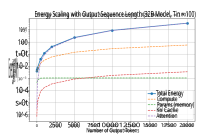
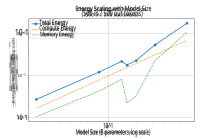
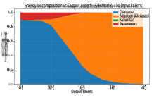

# **From Tokens to Watt-hours: Analytical Energy Estimation for LLM Inference on Modern GPUs** 

Tina Vartziotis_1,2,3_,_*_,_†_ , Rodopi Kosteli_4_,_†_ , Elli Danae Vartziotis_3,6_ , George Dasoulas_2_ , Michael Keckeisen_3_ , Konstantinos Skianis_5_ , Sotirios Kotsopoulos_1,7_ and Francesca Dominici_2_ 

_1National Technical University of Athens, Patission Complex 42, 10682 Athens, Greece_ 

_2Harvard University, 1350 Massachusetts Avenue, 02138 Cambridge, MA, USA_ 

_3TWT GmbH Science & Innovation, Industriestraße 6, 70565 Stuttgart, DE_ 

> _4 NIKI Ltd Digital Engineering, 205 National Resistance Street, 45500 Ioannina, Greece_ 

> _5 University of Ioannina, Campus, 451 10 Ioannina, Greece_ 

_6National and Kapodistrian University of Athens, Panepistimiou 30, 106 79 Athens, Greece_ 

_7Massachusetts Institute of Technology, 77 Massachusetts Avenue, 02139 Cambridge, MA, USA_ 

#### **Abstract** 

The operational energy consumption of large language model (LLM) inference is becoming an increasingly important component of the environmental footprint of deployed AI systems. However, direct measurement of inference energy often requires hardware telemetry, power instrumentation, or infrastructure-specific monitoring, limiting its applicability in comparative studies, early-stage system design, and sustainability reporting. This report presents an analytically structured, empirically calibrated, GPU-level methodology for estimating LLM inference energy on NVIDIA H100-class accelerators without direct runtime measurement. The proposed estimator combines parameter-scaled transformer FLOP accounting, calibrated memory-traffic factors, and hardware-specific energy coefficients for FP16/BF16 tensor-core computation and high-bandwidth-memory movement. It explicitly separates prompt prefill from autoregressive decoding, enabling energy estimates for input tokens, output tokens, and complete inference requests. The methodology further decomposes total energy into compute, parameter-access, key–value-cache write, and attention-read components, allowing the scaling behavior with model size, context length, and generated-token count to be analyzed. The resulting estimates are not intended to replace physical power measurements; rather, they provide transparent, reproducible, and assumption-explicit approximations suitable for model comparison, green-coding analysis, and design-time evaluation of LLM inference workloads. 

#### **Keywords** 

Large Language Models, GPU Inference, Inference Energy Modeling, Transformer Systems, Computing Emissions, Tensor-Core Computing, Energy-Efficient AI, Green AI, Sustainable Computing, High-Performance Computing 

## **1. Introduction** 

As large language models (LLMs) scale to serve millions of users across cloud, edge, and on-premise deployments, their cumulative inference energy has emerged as a first-order sustainability concern, driven by the substantial computational and environmental costs of large-scale AI inference. Prior work in Green AI has shown that advances in model capability are often accompanied by increases in energy consumption and carbon emissions, motivating energy-aware approaches to machine learning research and deployment [1, 2]. 

While early work focused primarily on training costs [3], broader Green AI research highlighted the importance of computational efficiency, energy-aware reporting, and environmental impact across the ML lifecycle [2, 4, 5, 6], including recent efforts to extend energy-aware optimization to model selection [7]. Attention has since shifted toward inference, which is becoming an increasingly important operational component of deployed LLM systems. 

> _*_ Corresponding author. 

> _†_ These authors contributed equally. 

> � tina.vartziotis@twt-gmbh.de (T. Vartziotis); rodopi.kosteli@nikitec.gr (R. Kosteli); elli.vartziotis@twt-gmbh.de (E. D. Vartziotis); gdasoulas@hsph.harvard.edu (G. Dasoulas); michael.keckeisen@twt-gmbh.de (M. Keckeisen); kskianis@uoi.gr (K. Skianis); skots@mit.edu (S. Kotsopoulos); fdominic@hsph.harvard.edu (F. Dominici) � 0000-0002-0877-7063 (T. Vartziotis); 0000-0001-7116-9338 (R. Kosteli); 0009-0006-1309-8598 (E. D. Vartziotis); 

> 0000-0002-0562-5136 (G. Dasoulas); 0000-0002-9421-8566 (K. Skianis); 0000-0002-9421-8566 (S. Kotsopoulos); 0000-0002-9421-8566 (F. Dominici) 

> © 2022 Copyright for this paper by its authors. Use permitted under Creative Commons License Attribution 4.0 International (CC BY 4.0). 

Unlike training, which is performed occasionally, inference workloads run continuously and scale with user demand through autoregressive token generation, accumulating substantial energy costs over a model’s deployment lifetime [8]. Their energy footprint depends strongly on generated-token count, sequence length, model size, hardware configuration, and batching behavior [9, 10, 11]. 

This makes inference energy a practical concern not only for large cloud providers, but also for applied AI teams, research groups, and small-to-medium organizations deploying LLMs on local or on-premise GPU infrastructure. For such deployments, accelerator-side energy does not capture the full service-level cost, since system and facility overheads, including cooling, networking, and power delivery, also contribute [12, 13]. Nevertheless, GPU-side energy is often a major controllable component of inference cost in GPU-dense systems [14], making GPU-level estimation useful for comparing model and workload choices, assessing green-coding interventions [15], and making deploymenttime decisions when full datacenter-level instrumentation is not available. 

Existing approaches for estimating or reporting AIrelated energy consumption often rely on hardware telemetry, external power measurement, infrastructurespecific monitoring, or coarse-grained carbon-accounting tools [6, 5]. Measurement-based studies provide valuable empirical evidence across hardware configurations and task types[16, 17], but their results are tied to specific hardware, serving systems, and runtime configurations. Carbon-aware inference work such as SPROUT further demonstrates that autoregressive generation can itself be optimized for sustainability [18]. Conversely, transformer scaling-law studies and GPU microarchitectural benchmarks provide the 

basis for analytical FLOP and hardware-energy modeling [19, 20, 21], but do not by themselves provide request-level or token-level inference energy estimates. This leaves a gap for transparent, reproducible estimators that combine transformer compute modeling, memory-traffic attribution, and hardware-specific energy coefficients to estimate request-level and normalized token-level GPU inference energy without requiring runtime instrumentation. 

We address this gap by presenting a semi-analytical methodology for estimating accelerator-side GPU compute and memory-movement energy for LLM inference. The estimator combines parameter-scaled transformer FLOP modeling, calibrated HBM memory-traffic estimation, and hardware-specific energy coefficients. It separates prompt prefill from autoregressive decode, reports normalized input-token, output-token, and request-level energy estimates, and decomposes total energy into compute, parameter-access, KV-cache-write, and attention-read components. Beyond comparative estimation, the framework also highlights actionable mechanisms for reducing GPU inference energy, including smaller models, shorter generations, KV-cache quantization, prompt compression, and improved batching efficiency. 

## **2. Methodology** 

This section defines the analytically structured, empirically calibrated methodology used to estimate GPU-level energy consumption for LLM inference. The estimator is designed for settings in which direct runtime power measurement is unavailable, impractical, or not comparable across systems. It therefore provides assumption-explicit energy estimates rather than replacing hardware-level measurement. The scope of the estimator is accelerator-side operational energy. We model only the energy associated with GPU-side computation and GPU memory movement during inference. System-level and datacenter-level contributions, including CPU execution, host memory, networking, storage, powersupply losses, cooling, and power usage effectiveness (PUE), are outside the scope of this work and are not included in the reported estimates. Similarly, this paper does not estimate carbon emissions; all reported quantities are expressed as GPU-level energy. 

Each inference request is separated into two phases: prompt prefill and autoregressive decode. During prefill, the model processes the input prompt and constructs the initial key–value (KV) cache. During decode, the model generates output tokens sequentially, with each step attending to the accumulated context through the KV cache. This phase separation is required because input-token and output-token costs have different compute and memory-access patterns. 

### **2.1. Request-Level Energy Decomposition** 

Let _𝑇_ in denote the number of input tokens, i.e., the tokenized prompt provided to the model, and let _𝑇_ out denote the number of generated output tokens. The total GPU energy of one request, denoted _𝐸_ GPU, is decomposed into prefill and decode energy: 

decode phase. The reported input-token and output-token energy values are defined as: 

$$
𝐸in/token = 𝐸pre 𝑇in , 𝐸out/token = 𝐸dec 𝑇out . (2)
$$

where _𝐸_ in _/_ token and _𝐸_ out _/_ token denote the average energy per input token and per generated output token, respectively. These quantities are not intrinsic constants of a model. They depend on prompt length, generated-token count, inference precision, batching, cache reuse, hardware characteristics, and serving implementation. At the GPU level, request energy is modeled as the sum of tensor-core compute energy and high-bandwidth-memory (HBM) movement energy: 

$$
𝐸GPU = 𝐸compute + 𝐸memory. (3)
$$

where _𝐸_ compute denotes energy consumed by tensor-core computation, and _𝐸_ memory denotes energy consumed by memory movement. This decomposition follows common GPU energy modeling approaches, which treat computation and data movement as the dominant contributors to energy consumption [21]. The compute term is proportional to the number of tensor-core floating-point operations: 

$$
𝐸compute = 𝛼TC𝐶TC, (4)
$$

where _𝐶_ TC denotes tensor-core FLOPs and _𝛼_ TC is the hardware-specific energy per tensor-core FLOP. The memory term is proportional to the number of bits transferred through HBM: 

$$
𝐸memory = 𝑒HBM𝑄HBM, (5)
$$

where _𝑄_ HBM denotes HBM traffic in bits and _𝑒_ HBM is the energy per transferred HBM bit. Combining these terms gives: 

$$
𝐸GPU = 𝛼TC𝐶TC + 𝑒HBM𝑄HBM. (6)
$$

This formulation separates workload-dependent quantities ( _𝐶_ TC _, 𝑄_ HBM) from hardware-specific coefficients ( _𝛼_ TC _, 𝑒_ HBM) [21]. 

### **2.2. Compute Model** 

For dense decoder-only transformers, we approximate the dominant tensor-core FLOPs using the standard parameterscaled transformer estimate: 

$$
𝐶pre,dense = 𝐾𝑁𝑇in, 𝐶dec,dense = 𝐾𝑁𝑇out, (7)
$$

where _𝑁_ is the number of model parameters and _𝐾_ = 6 is the FLOP coefficient per parameter per token. For long contexts, architecture-aware attention corrections are added through 

$$
𝐶pre = 𝐶pre,dense+𝐶pre,attn, 𝐶dec = 𝐶dec,dense+𝐶dec,attn, (8) so that
$$

$$
𝐶TC = 𝐶pre + 𝐶dec. (9)
$$

The full attention correction terms are provided in Supplementary Section A. 

$$
𝐸GPU = 𝐸pre + 𝐸dec. (1)
$$

where _𝐸_ pre is the energy consumed during the prefill phase and _𝐸_ dec is the energy consumed during the autoregressive 

### **2.3. Memory-Movement Model** 

In addition to tensor-core computation, LLM inference requires substantial data movement through the GPU memory hierarchy. We approximate the dominant off-chip memory traffic as high-bandwidth-memory (HBM) traffic and decompose it into parameter-access traffic, KV-cache write traffic, and attention-related KV-cache read traffic: 

$$
Bitstotal = Bitsparams + BitsKV + Bits′ attn. (10)
$$

This decomposition captures the primary sources of memory traffic in autoregressive transformer inference, including parameter access, KV-cache storage, and attention-related reads, as observed in modern LLM serving systems [22]. The corresponding memory energy is modeled as 

$$
𝐸memory = Bitstotal \cdot{}{} 𝑒HBM \cdot{}{} 𝜂(𝑁), (11)
$$

where _𝑒_ HBM is the energy per bit transferred from HBM and _𝜂_ ( _𝑁_ ) is a calibrated memory-inefficiency factor. The individual memory-traffic terms are defined in Section 3.4, with full derivations provided in Supplementary Section B. 

or datacenter-level energy. They are GPU-level compute and HBM-transfer coefficients. Additional coefficients for other accelerator classes, such as A100, are provided in the Supplementary Table 6. 

### **2.6. Simplified Parameter-Only Estimator** 

For model inventories where detailed architecture information is unavailable, we also define a simplified estimator. In this case, output-token energy is approximated as: 

$$
𝐸out/token = 𝛼eff𝐾𝑁, (15)
$$

where _𝛼_ eff is an effective energy-per-FLOP coefficient that absorbs compute, memory, and utilization effects. This parameter-scaled approximation is consistent with prior analyses showing that transformer compute scales linearly with model size [19, 20]. Input-token energy is modeled as a prompt-length-dependent multiple of output-token energy: 

$$
𝐸in/token = 𝑀(𝑇in)𝛼eff𝐾𝑁. (16)
$$

The request-level estimate is: 

### **2.4. Total Request and Token-Level Energy** 

$$
𝐸request = 𝑇in̂︀𝐸in/token + 𝑇out̂︀𝐸out/token. (17)
$$

The total GPU energy for a request, denoted _𝐸_ request, is obtained by combining the tensor-core compute term and the calibrated HBM memory-movement term: 

where _𝑀_ ( _𝑇_ in) is a prompt-length-dependent prefill multiplier. Its functional form is defined in Section 3.4. 

The simplified estimator is useful when only parameter counts and token counts are known. The architecture-aware estimator in equation 12 should be preferred whenever layer count, hidden dimension, KV-cache dimension, precision, and workload assumptions are available. 

_𝐸_ request = _𝛼_ TC ( _𝐶_ pre + _𝐶_ dec) + Bitstotal _· 𝑒_ HBM _· 𝜂_ ( _𝑁_ ) _._ (12) 

where _𝐶_ pre and _𝐶_ dec denote the total prefill and decode tensor-core FLOPs, obtained from the dense terms in Section 2.2 and, when applicable, the attention correction terms in Supplementary Section A. The term Bitstotal denotes total HBM traffic (Equation 10). The factor _𝜂_ ( _𝑁_ ) is a dimensionless inefficiency multiplier applied to the memory term, representing non-ideal HBM behavior. The average energy per processed token is: 

## **3. Evaluation Setup and Assumptions** 

This section specifies the hardware configuration, model set, workload assumptions, and fixed estimator parameters used in the analytical evaluation. The purpose is to make the reported energy estimates reproducible and to separate methodological assumptions from the numerical results. 

$$
𝐸avg/token = 𝐸request 𝑇in + 𝑇out . (13)
$$

where _𝑇_ in and _𝑇_ out are the numbers of input and generated output tokens, respectively. For phase-level reporting, we compute: 

### **3.1. Target Hardware and Precision** 

_𝐸_ dec = _𝐸_ compute _,_ dec+ _𝐸_ The evaluation is instantiated for NVIDIA H100-class ac-memory _,_ dec _._ (14) celerators, corresponding to the inference hardware considdenote the tensorered in this work. Unless otherwise stated, all models are during the prefill assumed to run using FP16 or BF16 tensor-core inference. _𝐸_ memory _,_ pre and Model weights and KV-cache entries are therefore assumed to use 16-bit precision: 

$$
𝐸pre = 𝐸compute,pre+𝐸memory,pre,
$$

where _𝐸_ compute _,_ pre and _𝐸_ compute _,_ dec denote the tensorcore compute energy consumed during the prefill and decode phases, respectively, and _𝐸_ memory _,_ pre and _𝐸_ memory _,_ dec denote the corresponding memory-movement energy. The input-token and output-token metrics are then obtained using Equation 2. 

$$
𝑏𝑤= 𝑏kv = 16. (18)
$$

For the H100-class configuration, we use the acceleratorlevel energy coefficients summarized in Table 1. Here, _𝛼_ TC denotes the energy per FP16/BF16 tensor-core FLOP and _𝑒_ HBM denotes the energy per bit transferred through highbandwidth memory. These coefficients represent GPU-level microarchitectural energy and do not include CPU, cooling, networking, or datacenter-level overheads. 

### **2.5. Hardware Coefficients** 

The hardware coefficients convert tensor-core FLOPs and HBM traffic into energy. In the main evaluation, we instantiate the estimator for H100-class FP16/BF16 inference using the fixed coefficients reported in Table 1: _𝛼_ TC = 0 _._ 52 pJ/FLOP and _𝑒_ HBM = 11 _._ 68 pJ/bit. These values are based on microarchitectural accelerator-energy measurements of GPU tensor-core computation and HBM access reported by Antepara et al. [21]. These coefficients represent microarchitectural accelerator energy rather than wall-plug 

**Table 1** 

Fixed constants and hardware coefficients used in the evaluation. 

|**Parameter**|**Value**|**Description**|
|---|---|---|
|_𝐾_|6|FLOPs per parameter per token (transformer constant)|
|_𝛼_TC|0.52 pJ/FLOP|H100 tensor-core energy coefficient|
|_𝑒_HBM|11.68 pJ/bit|HBM energy per bit transferred|
|_𝑏𝑤_|16|Bits per model weight (FP16/BF16)|
|_𝑏_kv|16|Bits per KV-cache element|

### **3.2. Model Set** 

We evaluate a representative set of transformer-based LLMs that cover small ( _<_ 3 _𝐵_ ), medium (3 _𝐵 −_ 30 _𝐵_ ), and large ( _>_ 30 _𝐵_ ) parameter regimes as summarized in Supplementary Table 5. The model set includes embedding models, general-purpose decoder-only LLMs, code models, reasoning models, and vision-language models. For each model, the estimator requires at minimum the parameter count _𝑁_ and the input/output token counts. When available, additional architecture-specific quantities such as the number of layers _𝑛ℓ_ , hidden dimension _𝑑_ model, Kv and effective KVcache dimension _𝑑_ kv are used by the architecture-aware estimator. If full architecture metadata is unavailable, the simplified parameter-only estimator is used. In this case, the model is represented by its parameter count and token workload only. This enables consistent comparison across heterogeneous model inventories while preserving explicit assumptions. 

### **3.3. Workload Scenarios** 

The analytical evaluation considers request-level inference workloads defined by the number of input tokens _𝑇_ in and generated output tokens _𝑇_ out. The default workload used for model-size comparisons is: 

$$
𝑇in = 500, 𝑇out = 500. (19)
$$

Additional experiments vary _𝑇_ out while holding model size and input length fixed in order to study how inference energy scales with generated sequence length. This isolates the effect of autoregressive decoding and attention-related KV-cache reads. Unless otherwise stated, the evaluation assumes single-request execution and does not explicitly model continuous batching. Effects of cache reuse, locality, and batching on parameter-access traffic are represented through the parameter-access factor _𝛾_ . 

### **3.4. Fixed Model Parameters** 

We adopt standard constants for transformer inference, including the dense transformer FLOP coefficient _𝐾_ , along with hardware-related energy parameters. All fixed modeling constants and hardware coefficients are summarised in Table 1. 

The individual memory-traffic terms in Equation 10 are specified by the parameter-access, KV-cache-write, and attention-read terms below: 

$$
Bitsparams = 𝑏𝑤𝑁𝛾(𝑁), 𝛾(𝑁) = 𝛾0 (︂𝑁 𝑁0 )︂𝛽 , (20) BitsKV = 2𝑏kv𝑑model𝑛ℓ𝑇out, (21) Bits′ attn = [︂ 2𝑏kv𝑑model𝑛ℓ (︂ 𝑇out𝑇in + 𝑇out(𝑇out -1) 2 )︂]︂ (22)
$$

Here, _𝛾_ ( _𝑁_ ) captures effective parameter reuse, while _𝑠_ attn( _𝑁_ ) captures non-ideal KV-cache read overhead; their calibrated forms are given in Table 2. Full derivations and interpretation are provided in Supplementary Section B. 

For the simplified parameter-only estimator, the prefill multiplier _𝑀_ ( _𝑇_ in) is selected according to the input length bucket: 

$$
𝑀(𝑇in) = ⎧ ⎪ ⎪ ⎪ ⎨ ⎪ ⎪ ⎪ ⎩ 1.2, 𝑇in \leq{}{}2048, 1.8, 2048 < 𝑇in \leq{}{}5120, 3.0, 5120 < 𝑇in \leq{}{}10240, 4.0, 𝑇in > 10240. (23)
$$

This multiplier is used only in the simplified parameteronly estimator. 

### **3.5. Calibration Procedure** 

We estimate the model parameters using a data-driven calibration procedure based on reported energy measurements for LLM inference [23]. For each model size, we first decompose the total energy into compute and memory components, using the analytical expressions derived in the previous sections. The remaining memory contribution is then further decomposed into parameter, KV-cache, and attention terms. Using this decomposition, we obtain approximate estimates of the effective parameter-access factor _𝛾_ ( _𝑁_ ) for each model: 

$$
𝛾(𝑁) = Bitsparams 𝑏𝑤𝑁 , (24)
$$

where Bitsparams is inferred from measured energy after subtracting compute and other memory contributions. The parameters _𝛾_ 0 and _𝛽_ are then determined by fitting the power-law model to these inferred values, while also ensuring consistency with the overall energy estimates. The parameters of _𝑠_ attn( _𝑁_ ) (Equation 22) and _𝜂_ ( _𝑁_ ) (Equation 11) are calibrated by minimizing the deviation between model predictions and measurement-based reported energy values across the evaluated models. In practice, we perform a low-dimensional parameter search over the coefficients of the scaling functions, selecting values that minimize the relative error while preserving the expected scaling trends with model size. 

This procedure is a constrained least-squares fitting over a small number of parameters, where the objective is to match both the magnitude and growth behavior of measured energy consumption rather than exactly fitting individual data points. Due to the small number of calibration parameters and limited data points, the calibration is intentionally kept _𝑠_ attnsimple( _𝑁_ )to _._ avoid overfitting and to retain generalizability 

**Table 2** 

Calibrated model parameters used in the analytical estimator. 

|**Parameter**|**Value**|**Description**|
|---|---|---|
|_𝛾_0|0.10|Baseline parameter-access factor at reference model size_𝑁_0|
|_𝑁_0 _𝛽_ _𝑠_attn(_𝑁_)|24B 0.8 1 + 1_._5 (︂_𝑁_ _𝑁_0 )︂0_._9 ︂_𝑁_ ︂0_._8|Reference model size for scaling relationships Exponent controlling degradation of parameter reuse with model size Attention scaling factor capturing KV-cache read overhead|
|_𝜂_(_𝑁_)|1 + 0_._8 (︂ _𝑁_0 )︂|Global memory-inefficiency factor for HBM traffic|

across models and workloads. After calibration, these factors are kept fixed across the scaling and decomposition experiments. 

This calibration makes the estimator an analytically structured, empirically calibrated model: transformer FLOP counts and memory-traffic terms provide the analytical structure, while the calibrated factors represent non-ideal reuse, attention-access overhead, and global HBM inefficiency. The factors should therefore be recalibrated when applying the methodology to a different GPU generation, inference engine, batching regime, or serving configuration. 

### **3.6. Reported Metrics** 

For each model–workload pair, the estimator reports prefill energy _𝐸_ pre, decode energy _𝐸_ dec, total request energy _𝐸_ request, input-token energy, output-token energy, and average energy per processed token. The full description of these metrics is provided in Supplementary Section D. 

### **3.7. Interpretation of Estimates** 

All reported values are analytical GPU-level estimates and are scenario-dependent approximations rather than direct measurements or intrinsic properties of the models. Differences between measured and estimated energy may arise from batching, tensor-parallel communication, framework overheads, kernel fusion, quantization, cache behavior, and runtime GPU utilization. These effects are discussed further in the limitations section. 

## **4. Results and Evaluation** 

This section presents the analytical energy estimates obtained using the setup defined in Section 3. We evaluate the estimator along four dimensions: scaling with generated sequence length, scaling with model size, decomposition of energy into compute and memory components, and comparison against measurement-based results from prior work. We also report token-level energy estimates for the model inventory considered in this study. Unless otherwise stated, all results assume FP16/BF16 inference on H100-class accelerators, a dense transformer FLOP constant _𝐾_ = 6, the calibrated parameter-access factor _𝛾_ ( _𝑁_ ), the attention-access factor _𝑠_ attn( _𝑁_ ), the memory-inefficiency factor _𝜂_ ( _𝑁_ ), and the hardware coefficients _𝛼_ TC = 0 _._ 52 pJ/FLOP and _𝑒_ HBM = 11 _._ 68 pJ/bit. The set of models considered in this study and their key architectural characteristics are summarized in Table S5, which can be found in the Supplementary material. 

### **4.1. Scaling with Generated Output Length** 

We first evaluate how inference energy scales with the number of generated tokens. For this experiment, we fix the model size to 32B parameters and use an input length of _𝑇_ in = 100 tokens. We then vary the number of generated output tokens _𝑇_ out. 

**Figure 1:** Energy breakdown as a function of generated output length _𝑇_ out for a 32B-parameter model with _𝑇_ in = 100 input tokens. Compute and KV-cache write costs scale almost linearly with _𝑇_ out, while attention-related KV-cache reads exhibit quadratic growth and become increasingly significant at larger output lengths. 

Figure 1 shows that compute energy grows approximately linearly with _𝑇_ out, consistent with the autoregressive decoding process in which each generated token requires one forward pass through the model. KV-cache write traffic also grows linearly, because each generated token contributes one new key and value entry per layer. In contrast, scaled attention-related memory traffic grows super-linearly. This is due both to the quadratic growth of KV-cache reads with output length and to the attention-access factor _𝑠_ attn( _𝑁_ ) used in the calibrated memory model. During decode, each newly generated token attends over the accumulated context, so the total number of KV-cache reads increases as: 

𝑇out𝑇in + 𝑇out(𝑇out −1)
2
.
(25)

### **4.2. Scaling with Model Size** 

We next evaluate the dependence of request-level energy on model size. The workload is fixed to: 

$$
𝑇in = 500, 𝑇out = 500. (26)
$$

This isolates the effect of model parameter count while holding the token workload constant. 

**Figure 2:** Energy per request as a function of model size for a fixed workload of 500 input tokens and 500 output tokens. Total energy, compute energy, and memory energy are shown on a log–log scale. 

Figure 2 shows that total request energy increases approximately linearly with model size on a log–log scale. This behavior is expected from the parameter-scaled compute model: 

$$
𝐶dec,dense = 𝐾𝑁𝑇out, 𝐶pre,dense = 𝐾𝑁𝑇in. (27)
$$

For fixed input and output lengths, the dominant dense matrix operations scale linearly with the number of parameters _𝑁_ . Consequently, the compute component follows: 

$$
𝐸compute \propto{}{}𝑁. (28)
$$

The memory component increases with model size through the calibrated factor _𝛾_ ( _𝑁_ ), the attention-access factor _𝑠_ attn( _𝑁_ ), and the global memory-inefficiency factor _𝜂_ ( _𝑁_ ). Under the fixed 500-token/500-token workload, compute remains the dominant component for most evaluated model sizes, although memory energy increases nonlinearly with the calibrated memory factors. While the overall scaling trend is approximately linear in model size, the memory-energy component exhibits non-monotonic behavior for certain models. This is due to differences in architectural configurations, rather than parameter count alone. In particular, key contributors to memory traffic, such as the hidden dimension _𝑑_ model and the number of layers _𝑛ℓ_ , do not scale uniformly with _𝑁_ across different models. As a result, some medium-sized models may exhibit lower memory traffic than nearby models with slightly different parameter counts, leading to localized deviations (e.g., a reduction in the memory-energy curve). This highlights that memory costs are sensitive to architectural design choices, not solely parameter count. 

### **4.3. Energy Decomposition** 

To understand which terms dominate request energy, we decompose total energy into compute, parameter movement, KV-cache writes, and attention-related KV-cache reads. The decomposition is evaluated for a 32B-parameter model while varying _𝑇_ out. Figure 3 shows the absolute energy decomposition as a function of generated output length for a 32Bparameter model. The stacked representation highlights the additive structure of the energy model, where total energy is the sum of compute and memory components. 

Compute energy increases approximately linearly with _𝑇_ out, reflecting the constant per-token cost of autoregressive decoding. In contrast, attention-related memory energy 

**Figure 3:** Fractional energy contribution as a function of generated output length for a 32B-parameter model. Compute dominates at short and moderate output lengths, while attentionrelated memory traffic increases with sequence length due to quadratic KV-cache read scaling. 

exhibits super-linear growth, due to the quadratic scaling of KV-cache reads with sequence length. At small output lengths, total energy is dominated by compute. As _𝑇_ out increases, the attention-related component grows rapidly and becomes a substantial contributor to the overall energy. This results in an upward curvature of the total energy trend, indicating the increasing impact of memory movement at longer sequence lengths. 

The contributions from parameter access and KV-cache writes are negligible relative to compute and attentionrelated memory traffic across the evaluated range. In particular, the KV-cache write component, although included in the model, is not visually distinguishable in the stacked representation. This is because KV writes scale linearly with _𝑇_ out, while attention-related KV-cache reads scale quadratically and dominate memory traffic at larger sequence lengths. 

### **4.4. Token-Level Energy Estimates for the Model Inventory** 

Table 3 reports simplified token-level estimates for the model inventory using the parameter-only computedominated estimator: 

$$
𝐸out/token = 𝛼TC𝐾𝑁,̂︀ 𝐸in/token \approx{}{}1.2̂︀𝐸out/token, (29)
$$

where the input-token multiplier corresponds to the short-prompt setting. These values are simplified, computedominated estimates; further interpretation is provided in Supplementary Section D. 

Table 3 shows the expected linear dependence of tokenlevel energy on model size. Sub-billion-parameter embedding models have estimated token-level costs below approximately 2.3 mJ/input token under the simplified estimator, whereas 70B- and 120B-parameter models require substantially higher per-token energy. For example, the simplified estimate for LLaMA 3.3 70B is 218.4 mJ/output token and 262.1 mJ/input token under the short-prompt assumption. The 120B model reaches 374.4 mJ/output token and 449.3 mJ/input token. These values are useful for comparative model selection because they expose the energy scaling of energy consumption with parameter count. The analysis isolates the cost of token processing and does not account for task performance. 

Models with identical parameter counts yield identical 

**Table 3** 

Estimated energy consumption per token and per request across evaluated models. 

|**Model**|**Params (B)**|_𝐸_out_/_token **(mJ/token)**|_𝐸_in_/_token **(mJ/token)**|_𝐸_request **(Wh)**|
|---|---|---|---|---|
|EmbeddingGemma|0.308|0.961|1.153|0.000599|
|MXBAI Embed Large|0.334|1.042|1.250|0.000696|
|Qwen3 Embedding|0.600|1.872|2.246|0.001027|
|Qwen3 (1.7B)|1.700|5.304|6.365|0.002641|
|Granite 3.2 Vision|2.530|7.894|9.472|0.004923|
|Qwen3 (8B)|8.000|24.960|29.952|0.011795|
|Granite 3.3|8.170|25.490|30.588|0.012465|
|Ministral 3 (14B)|14.000|43.680|52.416|0.021313|
|DeepSeek-Coder V2|16.000|49.920|59.904|0.017425|
|GPT-OSS (20B)|20.000|62.400|74.880|0.022281|
|Qwen3 (32B)|32.000|99.840|119.808|0.052721|
|Qwen2.5-Coder (32B)|32.000|99.840|119.808|0.052721|
|Qwen3-VL (32B)|32.000|99.840|119.808|0.052721|
|DeepSeek-R1|32.000|99.840|119.808|0.052721|
|Llama 3.3 (70B)|70.000|218.400|262.080|0.170747|
|GPT-OSS (120B)|120.000|374.400|449.280|0.155204|

**Table 4** 

Analytical versus measured energy per prompt for a 500-token input and 500-token output workload. 

|**Model size**|**Analytical energy**|**Measured energy**|**Error**|
|---|---|---|---|
|**(B parameters)**|**(Wh/request)**|**(Wh/request)**|**(%)**|
|8|0.011795|0.009270|27.23|
|24|0.032427|0.026280|23.39|
|70|0.170747|0.179230|4.73|
|72|0.170747|0.233260|26.80|

token-level estimates under the parameter-scaled compute model, since per-token FLOPs depend only on the number of parameters. Architectural differences influence memoryrelated energy and full request-level costs, but are not reflected in these simplified token-level estimates. Finally, modality-specific models such as vision-language architectures may incur additional costs that are not captured by the parameter-only formulation. 

### **4.5. Comparison with Measurement-Based Results** 

Finally, we compare the analytical estimates against the measurement-based study of Caravaca et al. [23]. The comparison uses the same nominal workload: 

$$
𝑇in = 500, 𝑇out = 500. (30)
$$

Table 4 shows that the analytical estimator matches measurement-based values within approximately 5–27% for the compared cases. The lowest error is observed for the 70B model, where the analytical estimate differs from the measured value by 4.73%. For the 8B, 24B, and 72B cases, the relative error remains below 30%. The remaining discrepancies are expected. The analytical model estimates GPU-level compute and memory movement under controlled assumptions, whereas measurement-based studies include additional effects from inference engines, batching policies, runtime scheduling, tensor-parallel execution, kernel fusion, GPU utilization, and system-level overheads. Differences may also arise from comparing models of similar size but different architecture. Therefore, 

the comparison shows that the estimator captures the correct order of magnitude and scaling behavior, rather than as exact per-deployment energy accounting. 

Overall, the results indicate that the proposed analytical estimator provides a transparent and reproducible approximation of LLM inference energy. It captures the expected linear scaling with model size, the super-linear effect of attention-related memory traffic in long generations, and the distinction between input-token, output-token, and request-level energy. 

## **5. Limitations and Conclusion** 

The proposed estimator is limited to accelerator-side operational energy. It excludes CPU execution, host memory, networking, storage, power-supply losses, cooling, and datacenter-level power usage effectiveness. Consequently, the reported values are GPU-level operational energy estimates, not end-to-end service energy, datacenter energy, carbon emissions, or lifecycle emissions. Nevertheless, accelerator-side energy is a major controllable component in GPU-dense on-premise inference deployments: H100 SXM-class accelerators have a thermal design power of approximately 700 W, and multi-GPU servers can therefore be dominated by accelerator power under high utilization [14]. Facility-level energy remains larger because of cooling and power-delivery overheads; for example, Uptime Institute reports an average data-center PUE of approximately 1.56, and MLPerf Power treats inference energy as a system-level measurement problem [12, 13, 24]. 

The estimator also abstracts away several architectureand system-specific effects. The parameter-scaled FLOP model does not fully capture feed-forward expansion ratios, grouped-query attention, multi-query attention, mixture-ofexperts routing, or modality-specific processing in visionlanguage models. The memory model approximates weight access, KV-cache writes, and attention reads using calibrated factors _𝛾_ ( _𝑁_ ), _𝑠_ attn( _𝑁_ ), and _𝜂_ ( _𝑁_ ), which summarize parameter reuse, attention-access overhead, and HBM inefficiency. These factors do not explicitly model the complete GPU memory hierarchy, kernel scheduling, cache residency, batching behavior, or inference engine implementation, and should be recalibrated for other hardware platforms, serving engines, or batching regimes. 

Despite these limitations, the methodology provides a reproducible framework for comparing GPU-level inference energy across models and workloads when direct instrumentation is unavailable. It also identifies actionable inference-stage levers for reducing energy: smaller or task-specialized models reduce parameter-scaled compute; shorter outputs reduce autoregressive decoding cost; prompt compression and retrieval filtering reduce context length; quantized weights and KV caches reduce memory traffic; and batching, prefix caching, efficient attention kernels, speculative decoding, and model routing can improve serving efficiency. The method is therefore best understood as a complementary tool for green-coding analysis, comparative model selection, and design-time evaluation, while precise deployment accounting still requires system-level power measurement. Future work should integrate measured serving traces, extend the estimator to quantized and mixture-of-experts models, and incorporate tensor-parallel communication and batching effects. 

## **Declaration on Generative AI** 

During the preparation of this work, the authors used OpenAI ChatGPT for language editing, restructuring, consistency checking, and drafting assistance. After using this tool, the authors reviewed and edited the content as needed and take full responsibility for the publication’s content. 

## **Acknowledgments** 

The authors gratefully acknowledge the ITEA GreenCode research project for fostering discussions on energy-aware AI systems and for funding parts of this work. The authors also thank their colleagues at TWT Science & Innovation, Stefanos Papanikolaou and Michael Herrnberger, for their valuable discussions and insights. 

## **References** 

- [1] E. Strubell, A. Ganesh, A. McCallum, Energy and policy considerations for deep learning in nlp, in: Proceedings of the 57th Annual Meeting of the Association for Computational Linguistics, Association for Computational Linguistics, Florence, Italy, 2019, pp. 3645–3650. URL: https://aclanthology.org/P19-1355/. doi:10.18653/v1/P19-1355. 

- [2] R. Schwartz, J. Dodge, N. A. Smith, O. Etzioni, Green ai, Communications of the ACM 63 (2020) 54–63. 

   - URL: https://doi.org/10.1145/3381831. doi:10.1145/ 3381831. 

- [3] D. Patterson, J. Gonzalez, Q. V. Le, C. Liang, L.-M. Munguia, D. Rothchild, D. So, M. Texier, J. Dean, Carbon emissions and large neural network training, 2021. URL: https://arxiv.org/abs/2104.10350. arXiv:2104.10350. 

- [4] P. Henderson, J. Hu, J. Romoff, E. Brunskill, D. Jurafsky, J. Pineau, Towards the systematic reporting of the energy and carbon footprints of machine learning, Journal of Machine Learning Research 21 (2020) 1–43. URL: http://jmlr.org/papers/v21/20-312.html. 

- [5] A. Lacoste, A. Luccioni, V. Schmidt, T. Dandres, Quantifying the carbon emissions of machine learning, 2019. URL: https://arxiv.org/abs/1910.09700. arXiv:1910.09700. 

- [6] L. Lannelongue, J. Grealey, M. Inouye, Green algorithms: Quantifying the carbon footprint of computation, Advanced Science 8 (2021) 2100707. URL: https://doi.org/10.1002/advs.202100707. doi:10.1002/ advs.202100707. 

- [7] F. Betello, V. Vineis, A. Purificato, G. Tolomei, F. Silvestri, One search fits all: Pareto-optimal eco-friendly model selection, arXiv preprint arXiv:2505.01468 (2025). arXiv:2505.01468. 

- [8] E. Lim, Z. Pan, Y. Zhou, Characterizing the carbon impact of llm inference, Final course project report for 15-642: Machine Learning Systems (2024). Inference characterization. 

- [9] J. Fernandez, C. Na, V. Tiwari, Y. Bisk, S. Luccioni, E. Strubell, Energy considerations of large language model inference and efficiency optimizations, in: Proceedings of the 63rd Annual Meeting of the Association for Computational Linguistics, Association for Computational Linguistics, 2025. URL: https:// aclanthology.org/2025.acl-long.1563/. 

- [10] Z. Fu, F. Chen, S. Zhou, H. Li, L. Jiang, Llmco2: Advancing accurate carbon footprint prediction for llm inferences, 2024. URL: https://arxiv.org/abs/2410.02950. arXiv:2410.02950. 

- [11] T. Vartziotis, M. Schmidt, G. Dasoulas, I. Dellatolas, S. Attademo, V. D. Le, A. Wiechmann, T. Hoffmann, M. Keckeisen, S. Kotsopoulos, Carbon footprint evaluation of code generation through llm as a service, in: A. C. Kulzer, H.-C. Reuss, A. Wagner (Eds.), 2024 Stuttgart International Symposium on Automotive and Engine Technology, Springer Fachmedien Wiesbaden, Wiesbaden, 2024, pp. 230–241. 

- [12] Uptime Institute, Uptime Institute Global Data Center Survey 2024, Technical Report, Uptime Institute Intelligence, 2024. Reports average data-center PUE of approximately 1.56. 

- [13] MLCommons, MLPerf Power: Benchmarking the Energy Efficiency of Machine Learning Systems, 2024. arXiv:2410.12032. 

- [14] NVIDIA, NVIDIA H100 Tensor Core GPU Datasheet, https://resources. nvidia.com/en-us-hopper-architecture/ nvidia-tensor-core-gpu-datasheet, 2023. Accessed 2026-05-24. 

- [15] T. Vartziotis, I. Dellatolas, G. Dasoulas, M. Schmidt, F. Schneider, T. Hoffmann, S. Kotsopoulos, M. Keckeisen, Learn to code sustainably: An empirical study on green code generation, in: Proceedings of the 1st International Workshop on Large Language Mod- 

els for Code, LLM4Code ’24, Association for Computing Machinery, New York, NY, USA, 2024, p. 30–37. URL: https://doi.org/10.1145/3643795.3648394. doi:10. 1145/3643795.3648394. 

- [16] S. Samsi, D. Zhao, J. McDonald, B. Li, A. Michaleas, M. Jones, W. Bergeron, J. Kepner, D. Tiwari, V. Gadepally, From words to watts: Benchmarking the energy costs of large language model inference, in: 2023 IEEE High Performance Extreme Computing Conference (HPEC), IEEE, ????, pp. 1–9. URL: https://ieeexplore.ieee.org/document/10363447/. doi:10.1109/HPEC58863.2023.10363447. 

- [17] S. Luccioni, Y. Jernite, E. Strubell, Power hungry processing: Watts driving the cost of AI deployment?, in: The 2024 ACM Conference on Fairness Accountability and Transparency, ACM, ????, pp. 85–99. URL: https://dl.acm.org/doi/10.1145/3630106.3658542. doi:10.1145/3630106.3658542. 

- [18] B. Li, Y. Jiang, V. Gadepally, D. Tiwari, Sprout: Green generative ai with carbon-efficient llm inference, in: Proceedings of the 2024 Conference on Empirical Methods in Natural Language Processing, Association for Computational Linguistics, 2024, pp. 21799–21813. URL: https://aclanthology.org/2024.emnlp-main.1215/. 

- [19] J. Kaplan, S. McCandlish, T. Henighan, T. B. Brown, B. Chess, R. Child, S. Gray, A. Radford, J. Wu, D. Amodei, Scaling laws for neural language models, 2020. URL: https://arxiv.org/abs/2001.08361. arXiv:2001.08361. 

- [20] J. Hoffmann, S. Borgeaud, A. Mensch, E. Buchatskaya, T. Cai, E. Rutherford, D. de Las Casas, L. A. Hendricks, J. Welbl, A. Clark, T. Hennigan, E. Noland, K. Millican, G. van den Driessche, B. Damoc, A. Guy, S. Osindero, K. Simonyan, E. Elsen, J. W. Rae, O. Vinyals, L. Sifre, Training compute-optimal large language models, in: Advances in Neural Information Processing Systems, volume 35, 2022, pp. 30016–30030. 

      - html. 

   - [26] NVIDIA, Ministral 3 model documentation, 2024. URL: https://docs.nvidia.com/nemo/megatron-bridge/ 0.2.0/models/vlm/ministral3.html. 

   - [27] Google, Embeddinggemma-300m, 2024. URL: https: //huggingface.co/google/embeddinggemma-300m. 

   - [28] Mixedbread AI, mxbai-embed-large-v1, 2024. URL: https://www.aimodels.fyi/models/huggingFace/ mxbai-embed-large-v1-mixedbread-ai. 

   - [29] Alibaba, Qwen3 embedding 0.6b, 2024. URL: https: //huggingface.co/Qwen/Qwen3-Embedding-0.6B. 

   - [30] Alibaba, Qwen3-32b model configuration, 2024. URL: https://huggingface.co/Qwen/Qwen3-32B. 

   - [31] IBM, Granite 3.3 8b instruct, 2024. URL: https:// huggingface.co/ibm-granite/granite-3.3-8b-instruct. 

   - [32] IBM, Granite 3.2 2b instruct, 2024. URL: https:// huggingface.co/ibm-granite/granite-3.2-2b-instruct. 

   - [33] DeepSeek AI, Deepseek coder v2 lite instruct, 2024. URL: https://huggingface.co/deepseek-ai/ DeepSeek-Coder-V2-Lite-Instruct. 

   - [34] DeepSeek AI, Deepseek r1 distill qwen 32b, 2024. URL: https://huggingface.co/deepseek-ai/ DeepSeek-R1-Distill-Qwen-32B. 

   - [35] Alibaba, Qwen3 8b model configuration, 2024. URL: https://huggingface.co/Qwen/Qwen3-8B. 

   - [36] Alibaba, Qwen3 32b model configuration, 2024. URL: https://huggingface.co/Qwen/Qwen3-32B. 

   - [37] Alibaba, Qwen3 1.7b model configuration, 2024. URL: https://huggingface.co/Qwen/Qwen3-1.7B. 

   - [38] Alibaba, Qwen2.5 technical report, 2024. URL: https: //arxiv.org/html/2409.12186v2. 

   - [39] Unsloth AI, Llama 3.3 overview, 2024. URL: https:// unsloth.ai/blog/llama3-3. 

   - [40] OpenAI, Gpt-oss 120b model configuration, 2024. URL: https://huggingface.co/openai/gpt-oss-120b. 

   - [41] OpenAI, Gpt-oss 20b model configuration, 2024. URL: https://huggingface.co/openai/gpt-oss-20b. 

- [21] O. Antepara, Z. Zhao, B. Austin, N. Ding, L. Oliker, N. J. Wright, S. Williams, Benchmark-driven models for energy analysis and attribution of gpu-accelerated supercomputing, in: Proceedings of the International Conference for High Performance Computing, Networking, Storage and Analysis, SC ’25, Association for Computing Machinery, St. Louis, MO, USA, 2025. URL: https://doi.org/10.1145/3712285.3759815. doi:10.1145/3712285.3759815. 

- [22] W. Kwon, Z. Li, S. Zhuang, Y. Sheng, L. Zheng, C. H. Yu, J. E. Gonzalez, H. Zhang, I. Stoica, Efficient memory management for large language model serving with pagedattention, in: Proceedings of the 29th ACM Symposium on Operating Systems Principles (SOSP), ACM, 2023. doi:10.1145/3600006.3613165. 

- [23] F. Caravaca, Á. Cuevas, R. Cuevas, From prompts to power: Measuring the energy footprint of llm inference, 2025. URL: https://arxiv.org/abs/2511.05597. arXiv:2511.05597. 

- [24] MLCommons, MLPerf Inference: Power Measurement Documentation, https://docs.mlcommons.org/ inference/power/, 2024. Accessed 2026-05-24. 

- [25] T. Dao, D. Y. Fu, S. Ermon, A. Rudra, C. Ré, Flashattention: Fast and memory-efficient exact attention with io-awareness, in: Advances in Neural Information Processing Systems, volume 35, 2022. URL: https:// proceedings.neurips.cc/paper_files/paper/2022/hash/ 67d57c32e20fd0a7a302cb81d36e40d5-Abstract-Conference. 

## **Supplementary Material** 

## **A. Derivation of the Compute Model** 

This section provides the architecture-aware compute terms used by the estimator. The main paper reports the compact parameter-scaled form, while the full attention correction terms are given here for reproducibility. 

For dense decoder-only transformers, the dominant computation arises from matrix multiplications in attention projections and feed-forward layers. When only the model parameter count is available, the dense decode-phase FLOPs per generated token, denoted _𝐶_ dec _/_ token, are approximated as: 

$$
𝐶dec/token \approx{}{}𝐾𝑁, (31)
$$

where _𝑁_ is the number of model parameters and _𝐾_ is a transformer FLOP constant. Following standard transformer FLOP accounting, we use: 

$$
𝐾= 6, (32)
$$

which corresponds to a commonly used approximation that dense transformer inference requires on the order of six FLOPs per parameter per token for the forward pass [19, 20]. 

The dense compute cost of the decode phase is therefore: 

$$
𝐶dec,dense = 𝐾𝑁𝑇out. (33)
$$

Similarly, the dense compute cost of the prefill phase is:

### **B.1. Parameter-Access Traffic** 

Model weights are stored in GPU memory and accessed during the forward passes required for inference. A naive upper-bound formulation would assume that the full set of model weights is transferred from HBM at every decoding step, leading to memory traffic proportional to the number of generated tokens. However, modern GPU implementations reduce this cost through on-chip caching, kernel fusion, memory locality, and overlap between memory access and computation. 

To account for imperfect parameter reuse, we introduce a model-size-dependent parameter-access factor _𝛾_ ( _𝑁_ ): 

$$
Bitsparams = 𝑏𝑤𝑁𝛾(𝑁), (39)
$$

where _𝑏𝑤_ is the number of bits per model weight and _𝑁_ is the number of model parameters. 

The parameter-access factor _𝛾_ ( _𝑁_ ) _∈_ (0 _,_ 1] represents the effective fraction of model parameters retrieved from HBM throughout the inference request. We model its dependence on model size as: 

$$
𝛾(𝑁) = 𝛾0 (︂𝑁 𝑁0 )︂𝛽 , (40)
$$

where _𝑁_ 0 is a reference model size, _𝛾_ 0 is the baseline reuse factor at _𝑁_ 0, and _𝛽_ approximates the degradation of effective reuse as the model working set exceeds on-chip memory capacity. 

$$
𝐶pre,dense = 𝐾𝑁𝑇in. (34)
$$

For long contexts, additional attention terms can be included. If architecture-level parameters are available, the prefill attention correction is approximated as: 

$$
𝐶pre,attn \approx{}{}2𝑛ℓ𝑑model𝑇2 in, (35)
$$

where _𝑛ℓ_ is the number of transformer layers and _𝑑_ model is the hidden dimension. 

During decode, the token generated at step _𝑡_ attends to a context of length _𝑇_ in + _𝑡 −_ 1. The attention-related decode cost is approximated as: 

$$
𝐶dec,attn \approx{}{}4𝑛ℓ𝑑model (︂ 𝑇out𝑇in + 𝑇out(𝑇out -1) 2 )︂ . (36)
$$

The total tensor-core compute estimate is:

$$
𝐶TC = 𝐶pre,dense + 𝐶dec,dense + 𝐶pre,attn + 𝐶dec,attn. (37)
$$

When detailed architectural parameters are unavailable, the attention correction terms are omitted and the parameter-scaled approximation is used. 

## **B. Derivation of the Memory-Movement Model** 

This section provides the full memory-traffic decomposition used by the architecture-aware estimator. The total HBM traffic is decomposed into parameter access, KV-cache writes, and attention-related KV-cache reads: 

$$
Bitstotal = Bitsparams + BitsKV + Bits′ attn, (38)
$$

where Bitsparams denotes parameter-access traffic, BitsKV denotes KV-cache write traffic, and Bitsattn_′_denotes scaled attention-related KV-cache read traffic. 

### **B.2. KV-Cache Write Traffic** 

For each generated token, the model stores key and value vectors in each transformer layer. The KV-cache write traffic is approximated as: 

$$
BitsKV = 2𝑏kv𝑑model𝑛ℓ𝑇out, (41)
$$

where _𝑏_ kv is the number of bits per KV-cache element, _𝑑_ model is the hidden dimension, _𝑛ℓ_ is the number of transformer layers, and _𝑇_ out is the number of generated output tokens. The factor of two accounts for storing both keys and values. 

### **B.3. Attention-Related KV-Cache Read Traffic** 

During autoregressive decoding, each newly generated token attends over the input prompt and the previously generated tokens through the KV cache. For an input length _𝑇_ in and an output sequence of length _𝑇_ out, the baseline attention-related memory traffic is: 

$$
Bitsattn = 2𝑏kv𝑑model𝑛ℓ (︂ 𝑇out𝑇in + 𝑇out(𝑇out -1) 2 )︂ . (42)
$$

This term includes a linear prompt-attention component and a quadratic generated-token component. To account for non-ideal memory behavior, including irregular access patterns, limited locality, cache contention, and increasing memory pressure at larger model sizes, we apply an attention-specific scaling factor: 

$$
Bits′ attn = Bitsattn \cdot{}{} 𝑠attn(𝑁), (43)
$$

where _𝑠_ attn( _𝑁_ ) _≥_ 1 is a dimensionless scaling factor. 

**Table 5** 

Overview of Model Architectural Configurations. 

|**Model**|**Params**|**Layers**|_𝑑𝑚𝑜𝑑𝑒𝑙_|
|---|---|---|---|
|Ministral 3 (14B) [26]|14B|40|5120|
|EmbeddingGemma [27]|308M|26|768|
|MXBAI Embed Large [28]|334M|24|1024|
|Qwen3 Embedding (0.6B) [29]|0.6B|28|1024|
|Qwen3-VL (32B) [30]|32B|64|5120|
|Granite 3.3 (8B) [31]|8.17B|40|4096|
|Granite 3.2 Vision [32]|2.53B|32|4096|
|DeepSeek-Coder V2 (16B) [33]|16B|27|2048|
|DeepSeek-R1 (32B) [34]|32B|64|5120|
|Qwen3 (8B) [35]|8B|36|4096|
|Qwen3 (32B) [36]|32B|64|5120|
|Qwen3 (1.7B) [37]|1.7B|28|2048|
|Qwen2.5-Coder (32B) [38]|32B|64|5120|
|Llama 3.3 (70B) [39]|70B|80|8192|
|GPT-OSS (120B) [40]|120B|36|2880|
|GPT-OSS (20B) [41]|20B|24|2880|

The attention-related terms follow the quadratic dependence on sequence length characteristic of standard selfattention, along with the associated memory-access costs on GPU memory hierarchies [25]. 

The importance of KV-cache memory traffic in LLM serving has also been emphasized in prior system-level work, including PagedAttention and vLLM [22]. 

### **B.4. HBM-Dominated Memory Energy** 

The memory-energy term is computed as: 

$$
𝐸memory = Bitstotal \cdot{}{} 𝑒HBM \cdot{}{} 𝜂(𝑁), (44)
$$

where _𝑒_ HBM is the energy per bit transferred from HBM and _𝜂_ ( _𝑁_ ) _≥_ 1 is a global memory-inefficiency factor. The factor _𝜂_ ( _𝑁_ ) approximates bandwidth saturation, memorycontroller overhead, cache contention, and pipeline stalls under high memory pressure. 

The factors _𝛾_ ( _𝑁_ ), _𝑠_ attn( _𝑁_ ), and _𝜂_ ( _𝑁_ ) are empirical calibration terms fitted against measurement-based LLM inference energy results reported by Caravaca et al. [23]. 

## **C. Model Architecture Details** 

In this section we present key architectural details of the models that have been used in this study. Table 5 shows the parameter, layer, and hidden dimension ( _𝑑_ model) of the model architectures. 

## **D. Reported Metrics** 

For each model–workload pair, the estimator reports energy at three levels of granularity: phase-level energy, tokennormalized energy, and aggregate request-level energy. This separation is necessary because LLM inference is not a homogeneous operation: prompt prefill and autoregressive decoding differ in their compute structure, memory-access pattern, and dependence on sequence length. 

The phase-level quantities are the prefill energy, _𝐸_ pre, and the decode energy, _𝐸_ dec. These terms represent the estimated GPU energy required to process the input prompt 

and to generate the output sequence, respectively. The total request energy is defined as 

$$
𝐸request = 𝐸pre + 𝐸dec. (45)
$$

To compare requests with different prompt and generation lengths, we normalize phase-level energy by the corresponding token counts. The input-token energy is defined as 

$$
𝐸in/token = 𝐸pre 𝑇in , (46)
$$

where _𝑇_ in is the number of prompt tokens. Analogously, the output-token energy is defined as 

$$
𝐸out/token = 𝐸dec 𝑇out , (47)
$$

where _𝑇_ out is the number of generated tokens. We additionally report the average energy per processed token: 

$$
𝐸avg/token = 𝐸request 𝑇in + 𝑇out . (48)
$$

This aggregate metric mixes prefill and decode costs and is therefore sensitive to the input/output token ratio. Finally, to analyze the dominant sources of energy consumption, the request energy is decomposed into compute and memory contributions: 

$$
𝐸request = 𝐸compute + 𝐸memory. (49)
$$

The memory component is further attributed to parameter access, KV-cache writes, and KV-cache reads. Reporting these components enables the evaluation to distinguish compute-dominated regimes from memory-influenced or long-context regimes. 

### **D.1. Interpretation of Simplified Token-Level Estimates** 

The model-inventory table in the main paper reports simplified token-level energy estimates based on a parameter-only, compute-dominated approximation: 

$$
𝐸out/token = 𝛼TC𝐾𝑁,̂︀ 𝐸in/token \approx{}{}1.2̂︀𝐸out/token. (50)
$$

These values do not include the calibrated memory factors _𝛾_ ( _𝑁_ ), _𝑠_ attn( _𝑁_ ), or _𝜂_ ( _𝑁_ ) used in the architectureaware evaluation. They are first-order comparative estimates across the model inventory, rather than full computeplus-memory request-level estimates. In contrast, the scaling and decomposition figures in the main paper use the full calibrated compute-plus-memory model. 

## **E. Implementation and Execution Assumptions** 

This section describes the implementation details and system assumptions underlying the analytical energy estimator. 

**Estimator implementation.** The estimator is implemented as a Python-based analytical tool that computes energy consumption from the model and the workload parameters. Given the number of model parameters _𝑁_ , number of layers _𝑛ℓ_ , hidden dimension _𝑑_ model, and token counts, the tool calculates FLOPs and memory traffic using the analytical formulas described in the main text. 

The implementation does not execute neural networks or perform runtime profiling. Instead, it deterministically estimates energy based on compute and memory abstractions. No direct GPU telemetry, wall-plug power instrumentation, or runtime energy measurement APIs (e.g., NVML or nvidiasmi) are used during estimation. 

**Hardware assumptions.** The main evaluation uses H100class coefficients, while additional accelerator coefficients are reported here for completeness. Energy conversion coefficients for tensor-core operations ( _𝛼_ TC) and HBM traffic ( _𝑒_ HBM) are taken from measurement-based prior work [21]. 

##### **Table 6** 

Accelerator-level energy coefficients for FP16/BF16 tensor-core inference. 

|**Hardware**|_𝛼_TC **(pJ/FLOP)**|_𝑒_HBM **(pJ/bit)**|
|---|---|---|
|H100 / GH200|0.52|11.68|
|A100|0.70|13.11|

**Software stack assumptions.** The estimator assumes inference execution on optimized tensor-core GPU kernels using FP16/BF16 arithmetic and HBM-resident model weights. It is intended to approximate inference behavior of optimized GPU-based implementations built on CUDA and highperformance libraries such as cuBLAS and cuDNN, as well as modern LLM inference frameworks (e.g., TensorRT-LLM, Megatron-LM, and vLLM). 

The model does not explicitly simulate kernel-level execution or software-specific optimizations such as kernel fusion, scheduling, or memory tiling. Instead, these systemlevel effects are treated implicitly and are approximated through the empirical scaling factors _𝛾_ ( _𝑁_ ), _𝑠_ attn( _𝑁_ ), and _𝜂_ ( _𝑁_ ), which collectively capture deviations from ideal compute and memory behavior observed in optimized inference systems. 

**Calibration reference.** Model parameters are calibrated using reported energy measurements for optimized LLM inference from prior work [23]. These measurements serve as reference values for matching the magnitude and scaling behavior of energy consumption. 

**Limitations.** The estimator does not model GPU execution at the kernel or instruction level. In particular, it does not simulate thread-level parallelism, CUDA scheduling, or detailed memory hierarchy behavior. Instead, such effects are approximated through calibrated scaling factors. As a result, the model is an analytical approximation rather than a cycle-accurate simulation or direct hardware measurement. 

