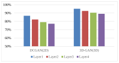
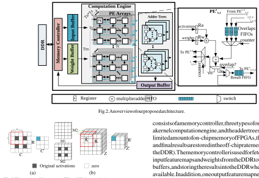
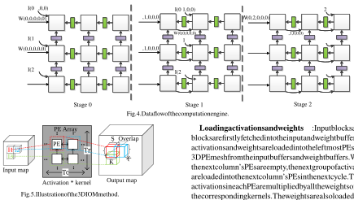
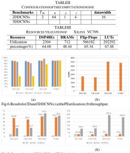

# Towards a Uniform Architecture for the Efficient Implementation of 2D and 3D Deconvolutional Neural Networks on FPGAs 

Deguang Wang1_,_2 , Junzhong Shen1_,_2 , Mei Wen1_,_2 and Chunyuan Zhang1_,_2 

> 1College of Computer, 2National Key Laboratory for Parallel and Distributed Processing National University of Defense Technology, Changsha, China 410073 Email: wangdeguang13@nudt.edu.cn 

**_Abstract_ —Three-dimensional deconvolution is widely used in many computer vision applications. However, most previous works have only focused on accelerating 2D deconvolutional neural networks (DCNNs) on FPGAs, while the acceleration of 3D DCNNs has not been studied in depth as they have higher computational complexity and sparsity than 2D DCNNs. In this paper, we focus on the acceleration of both 2D and 3D DCNNs on FPGAs by proposing efficient schemes for mapping 2D and 3D DCNNs on a uniform architecture. By implementing our design on the Xilinx VC709 platform for four real-life 2D and 3D DCNNs, we can achieve up to 3.0 TOPS with high hardware efficiency. Comparisons with CPU and GPU solutions demonstrate that we can achieve an improvement of up to** 63 _._ 3 _×_ **in throughput relative to a CPU solution and an improvement of up to** 8 _._ 3 _×_ **in energy efficiency compared to a GPU solution.** 

## I. INTRODUCTION 

Recently, deconvolution has become widely used in the fields of computer vision, such as semantic segmentation [1], generative models [2], and high-resolution imaging [3]. Because 3D images exist in most medical data used in clinical practice [4], 3D deconvolution has proven to be a better method than 2D deconvolution in some applications. Although the computational patterns of 2D and 3D deconvolutions are very similar, the computational complexity and memory requirements of 3D deconvolution are much higher than in 2D deconvolution, making it challenging to design efficient accelerators for them. In addition, deconvolution must insert ‘zero’ into the input image before implementing convolution operations, leading to the sparsity of the input image as well as the introduction of invalid operations (i.e., multiplications of zero). According to our study, the sparsity of the input features of 3D deconvolution layers is higher than that of 2D deconvolution layers. As shown in Fig. 1, the sparsity of the deconvolutional layers in an example of 3D deconvolutional neural networks (DCNNs) (i.e., 3D-GAN [5]) is clearly higher than for 2D DCNNs (i.e., DCGAN [2]). Therefore, the sparsity contributes to the processing engine (PE) workload imbalance [6]. 

Many studies [7–9] have primarily focused on accelerating convolutional neural networks (CNNs) on Field-Programmable Gate Arrays (FPGAs), due to the beneficial high performance and energy efficiency of FPGAs. However, to the best of our knowledge, not much attention has been given to accelerate 

Fig. 1. Sparsity of the deconvolutional layers. 

DCNNs, especially in 3D deconvolution. Given the similarity in the computational patterns of 2D and 3D deconvolutions, this work focuses on accelerating both of them on FPGA with a uniform architecture. The contributions of this work are summarized as follows: 

- 1) We propose a uniform architecture for efficient implementation of 2D and 3D DCNNs on FPGA. 

- 2) We propose a mapping scheme of 2D and 3D DCNNs on the uniform architecture, which can efficiently improve the parallel computational ability and computational efficiency of the accelerator. 

- 3) As a case study, we implement our design on an Xilinx VC709 board for four state-of-the-art 2D and 3D DCNNs: DCGAN, GP-GAN [10], V-NET [4] and 3DGAN. Experimental results show that our implementation achieves an improvement of up to 63 _._ 3 _×_ and 291 _._ 4 _×_ in throughput and energy efficiency relative to CPU, and a 8 _._ 3 _×_ energy efficiency gain over GPU. 

## II. RELATED WORK 

Few works have focused on accelerating deconvolutions [6, 11, 12]. In [11, 12], the researchers addressed the accelerations of the deconvolution in generative adversarial networks(GANs). Yazdanbakhsh et al. [11] introduced a new architecture to alleviate the sources of inefficiency associated with the acceleration of GANs using conventional convolution accelerators by reorganizing the output computations. In [12], an end-to-end solution was devised to generate an optimized synthesizable FPGA accelerator from a high-level GAN specification, alleviating the challenges of inefficiency and resources underutilization faced by conventional convolutional accelerators. Yan et al. [6] proposed a novel mapping method 

consists of a memory controller, three types of on-chip buffers, a kernel computation engine, and the adder trees. Due to limited amount of on-chip memory of FPGAs, the source data and final results are stored in the off-chip rate memory (i.e., the DDR). The memory controller is used for fetching the input feature maps and weights from the DDR to the on-chip buffers, and storing the results into the DDR when they are available. In addition, one output feature map needs _Nc_ (i.e., input channels) input feature maps, due to the limited on-chip memory, it is difficult to cache all the input data needed for one feature map on chip. Hence, we use blocking to resolve this issue. We adopt three separate on-chip buffers to store input, output and weight blocks. 

Fig. 3. Illustration of the process of 2D and 3D deconvolutions. 

called input oriented mapping (IOM, i.e., mapping each input computation task to each PE), which can efficiently overcome the inefficiency of PE computation. All the above mentioned works, however, only consider 2D DCNNs. To the best of our knowledge, we are the first to explore the acceleration of 2D and 3D DCNNs using a uniform architecture. 

The computation engine is the most important component of our accelerator, which consists of a _Tm_ group of PEs. In each group, the PEs are organized as a 3D mesh architecture, which contains _Tn ×Tz_ 2D PE planes. In this work, we regard the PE plane as a PE array with _Tr × Tc_ PEs. All PEs have direct connections to the input buffer, while only the leftmost PEs in each row have access to the weight buffer. The leftmost PEs in each row are responsible for collecting the results of the PEs of the same row and then deliver them to the following adder trees. The adder trees handle the additions of the results belonging to different feature maps. _Tm × Tc × Tz × log_ 2 _Tn_ adders are integrated in the adder trees to support a higher degree of parallelism. 

## III. BACKGROUND 

Deconvolution is similar to convolution operations, and the fundamental difference between them is that the original input feature maps of deconvolution requires the inseration of ‘zero’ between the original input activations. Fig. 3 shows the process of 2D and 3D deconvolutions. 

As Fig. 3 (a) illustrates, for 2D deconvolution, the original input map is inserted with ‘zero’ shown in white between the original input activations colored in gray. A _K × K_ kernel then performs convolutions with the inserted feature map to generate an _R__′_ _× C__′_ output map. Observed from Fig. 3 (b), the process of 3D deconvolution is similar to that of 2D deconvolution. The original image is first inserted with ‘zero’ between the rows and columns of the 2D data tiles, which is identical to 2D deconvolution. In addition, it is also necessary to insert ‘zero’ planes (i.e., the M1 plane) between every two 2D planes (i.e., the M2 plane) and a _K × K × K_ kernel then performs convolutions with the inserted feature map to generate an _R__′_ _× C__′_ _× Z__′_ output map. 

The architecture of the PE is presented in the right part of Fig. 2. It consists of two register files (i.e., _Ra_ and _Rw_ ) to buffer the input activations and weights. In addition, three _Overlap First-In-First-Outs (FIFOs)_ (i.e., FIFO-Vs, FIFO-Hs and FIFO-Ds) are designed to deliver the overlaps in the results data from the adjacent PEs. The products yielded by the multipliers are conditionally added with the data from the _Overlap FIFOs_ . Once the current results are determined to be overlaps, they will be sent to the _Overlap FIFOs_ of adjacent PEs, waiting to be added. Otherwise, they will be sent to the local _Result FIFOs_ . The results in the local FIFO of the current PE will be sent to the left PE once they have stored all the local results. 

## IV. THE PROPOSED ARCHITECTURE 

## _A. Architecture Overview_ 

Fig. 2 presents an overview of our proposed architecture for accelerating 2D and 3D deconvolutions. The accelerator 

**Loading activations and weights** : Input blocks and weight blocks are firstly fetched into the input and weight buffers, activations and weights are loaded into the leftmost PEs in the 3D PE mesh from the input buffers and weight buffers. When the next column’s PEs are empty, the next group of activations are loaded into the next column’s PEs in the next cycle. The activations in each PE are multiplied by all the weights of the corresponding kernels. The weights are also loaded into the leftmost PEs at the beginning of the process. When the weights are multiplied by activations in PEs, the weights are also sent to the next column’s PEs. The same column’s PEs shares the weights. 

## _B. 3D IOM Method_ 

Previous studies [11, 12] have adopted the output oriented mapping (OOM, i.e., mapping each output computation task to each PE) for the computation of deconvolution layers. This method, however, does not eliminate invalid operations thereby resulting in low computational efficiency of the PEs. In [6], Yan et al. proposed a novel mapping method called IOM, which can efficiently overcome the inefficiency of PE computation. Motivated by [6], we propose a 3D version of IOM for the mapping of 3D deconvolution on the accelerator. 

**Computing** : After the activations and weights are loaded into the PEs, they are immediately sent to the multiplier to yield the products in each PE. The results are then sent to the FIFOs. If the results overlap, they are send to Overlap FIFOs, else sent to Output FIFOs. Each PE performs _K × K × K_ multiplications to produce an output block. When th PEs process the overlapped part of the output blocks, the PEs load the overlapped elements from their FIFOs, and perform additions. When the computation process in the direction of input channels (i.e., _Tn_ ) is complete, _Tn_ results are accumulated by the adder trees. 

Fig. 5 illustrates the 3D IOM method. I1 _∼_ I3 are adjacent activations of the input map, and they are sent to three adjacent PEs of the PE array. In the PEs, each activation is multiplied by the _K × K × K_ kernel and generates a _K × K × K_ result block. The results are added to the corresponding location of the output maps. It is worth noting that some locations may overlap in the output maps and the overlapped elements of the same location should be added up to form the resulting output maps. The overlap results from the PEs which are responsible for processing I2 and I3 are sent to the PE which is responsible for processing I1, and point-wise addition is performed. In each block, the length of the overlapping part is _K_ - _S_ . 

**Writing Back** : When all the activations of the input blocks are complete and the overlaps are accumulated, the results, i.e., the output feature map is transferred to the output buffers. The results are accumulated until the input channels are complete, and the final outputs of output feature maps are then transferred to the external memory. 

To explain this concept in more detail, we illustrate the dataflow of the PE arrays after applying the 3D IOM method on the architecture in Fig. 4. For the sake of simplicity, Fig. 4 only shows the dataflow in a PE array, and the dataflow in other PE arrays are analogous. Table I lists the definitions used in the explanation of the dataflow. At stage 0, the activations I(0,0,0,0) _∼_ I(2,0,0,0) and weights W(0,0,0,0,0) are sent separately to the leftmost columns of the PEs in the PE array, i.e. PE0 0 _,_ 0_∼_PE 20 _,_ 0,andtheyaremultiplied.Theoverlapsproduced from PE0 1 _,_ 0_∼_PE0 2 _,_ 0issenttotheirFIFO-Vs.Atstage1, activations I(0,1,0,0) _∼_ I(2,1,0,0) are loaded into PE0 0 _,_ 1_∼_PE0 2 _,_ 1. W(0,0,0,0,0) are moved to PE0 0 _,_ 1_∼_PE0 2 _,_ 1,andtheyarethen multiplied by the activations I(0,1,0,0) _∼_ I(2,1,0,0). Meanwhile, PE0 0 _,_ 0_∼_PE0 2 _,_ 0performs the multiplication by W(0,1,0,0,0). The 

In 3D deconvolution, the output feature map size is given by Eq. (1). Note that _IH , IW , ID, OH , OW , OD_ represent the height, width and depth of the input maps and output maps. However, at the edge of the output feature map, there is additional data padded. Thus, the padded data is removed from the final output feature map. The final result is equal to traditional convolution with ‘zero’ inserted into the original input map. 

$$
OH = (IH -1) \times{}{} S + K. OW = (IW -1) \times{}{} S + K. OD = (ID -1) \times{}{} S + K. (1)
$$

We divide the dataflow in the PE arrays into three steps: 

TABLE I 

DEFINITION OF THE PARAMETERS. 

|**Parameter**|**Description** ||
|---|---|---|
|I(i_h_,i_w_,i_d_,i_c_)|input activation from|the i_c__th_ input channel|
|W(k_h_,k_w_,k_d_,i_c_,o_c_)|weight from the i_c__th_ |channel of the o_c__th_ filter|
|W(k_h_,k_w_,k_d_,i_c_,o_c_)|weight from the i_c__th_ |channel of the o_c__th_ filter|

overlaps produced by PE0 0 _,_ 1_∼_PE0 2 _,_ 1are then sent to their FIFO- Hs, and the overlaps produced by PE0 1 _,_ 0_∼_PE 20 _,_ 1aresentto their FIFO-Vs. At stage 2, activations I(0,2,0,0) _∼_ I(2,2,0,0) are loaded into PE0 0 _,_ 2_∼_PE0 2 _,_ 2.Inthemeantime,W(0,0,0,0,0)and W(0,1,0,0,0) are moved to PE0 0 _,_ 2_∼_PE0 2 _,_ 2and PE0 0 _,_ 1_∼_PE0 2 _,_ 1, and then multiplied by the corresponding activations. The overlaps produced by PE0 0 _,_ 2_∼_PE 20 _,_ 2aresenttotheirFIFO-Hs,andthe overlaps produced by PE0 1 _,_ 0_∼_PE0 2 _,_ 1aresenttotheirFIFO-Vs. 

## _C. Support for The Accelerations of 2D and 3D DCNNs_ 

Our architecture is able to support the acceleration of both 2D and 3D DCNNs. For 3D DCNNs, _Tz_ PE arrays are used for the computations of an input feature map. In this way, _Tn × Tz_ PE arrays can accelerate the computation of _Tn_ input feature maps simultaneously. For 2D DCNNs, we map the computations of an input feature map onto a PE array. Since the input feature maps are two-dimensional, we can use _Tn × Tz_ PE arrays to compute _Tn × Tz_ input feature maps in the meantime, while maintaining the size of the PE arrays (i.e., _Tr ×Tc_ ). In this case, the FIFO-D in each PE is disabled since there is no dataflow between adjacent PE arrays. Note that the dataflow in the PE arrays are identical when mapping 2D and 3D DCNNs on the computation engine. Since few control logics are required for supporting both 2D and 3D DCNNs in each PE, we omit the architecture details in Fig. 2. 

## V. EXPERIMENTAL RESULTS 

As a case study, we evaluate our design using four representative DCNN models: DCGAN, GP-GAN, 3D-GAN and V-Net. All the deconvolutional layers of the selected DCNNs have uniform 3 _×_ 3 and 3 _×_ 3 _×_ 3 filters. 

We quantitatively compare our FPGA implementation of 2D and 3D DCNNs with two other platforms: (1) a ten-core Intel E5 CPU (2.8 GHz) and (2) a NVIDIA GeForce GTX 1080 GPU. Our accelerator design is implemented on the Xilinx VC709 clocked at 200MHz, which contains a Virtex-7 690t FPGA and two 4GB DDR3 DRAMs. 

Table II illustrates the configuration of the parameters of our benchmarks. Note that we use 16-bit fixed activations and weights for all the benchmarks in our experiment. To avoid the reconfiguration overhead, we use an accelerator with fixed configurations for all the benchmarks. We use _Tm × Tn × Tz × Tr × Tc_ = 2 _,_ 048 PEs in total. 

Table III reports the resource utilization of our accelerator. The Digital Signal Processors (DSPs) and Look-up Tables (LUTs) dominate the resource consumption, and mainly utilized for implementing multipliers and adders, respectively. Fig. 6 presents PE utilization about the accelerator. Note that the PE utilization is defined as the ratio of the computation time occupied in total time. For all benchmarks, our accelerator can achieve up over 90% of PE utilization. It demonstrates 

Fig. 7. Comparisons of CPU, GPU and FPGA solutions: (a) relative performance; (b) relative energy efficiency. 

the effectiveness of our mapping and the uniform architecture for 2D and 3D deconvolutions. Note that the fourth layers of DCGAN and GP-GAN are bottlenecked by the memory access, which results in a reduction of PE utilization. In addition, it is also clear from Fig. 6 that we can achieve state-of-the-art performance (1.5TOPS _∼_ 3.0TOPS) for all the benchmarks. Because the higher sparsity of 3D deconvolution and the large amount of data delivered between PEs, the performance of 3D deconvolution on FPGA outperforms that of 2D deconvolution. 

For the benchmarks in our experiment, we compare our work with CPU and GPU, as shown in Fig. 7. The performance of our method on the accelerator outperforms that of the CPU by 22 _._ 7 _×_ to 63 _._ 3 _×_ . Concerning energy efficiency, our method outperforms the CPU by 104 _._ 7 _×_ to 291 _._ 4 _×_ and outperforms the GPU by 3 _._ 3 _×_ to 8 _._ 3 _×_ . 

## VI. CONCLUSION 

In this paper, we proposed a 2D and 3D deconvolution accelerator based on a uniform architecture on FPGA. We employed a mapping scheme of 2D and 3D deconvolutions on this architecture. To the best of our knowledge, this is the first work to implement 2D and 3D DCNNs on FPGA. By exploring the data transference between adjacent PEs without invalid operations, our design achieves an acceleration of 63 _._ 3 _×_ compared with CPU implementation, and an energy efficiency improvement of 8 _._ 3 _×_ compared with designs running on a GTX 1080 GPU. 

## REFERENCES 

- [1] J. Long, E. Shelhamer, and T. Darrell, “Fully convolutional networks for semantic segmentation,” in _Proceedings of the IEEE conference on computer vision and pattern recognition_ , 2015, pp. 3431–3440. 

- [2] A. Radford, L. Metz, and S. Chintala, “Unsupervised representation learning with deep convolutional generative adversarial networks,” _arXiv preprint arXiv:1511.06434_ , 2015. 

- [3] C. Dong, C. C. Loy, and X. Tang, “Accelerating the super-resolution convolutional neural network,” in _European Conference on Computer Vision_ . Springer, 2016, pp. 391–407. 

- [4] F. Milletari, N. Navab, and S.-A. Ahmadi, “V-net: Fully convolutional neural networks for volumetric medical image segmentation,” in _3D Vision (3DV), 2016 Fourth International Conference on_ . IEEE, 2016, pp. 565–571. 

- [5] J. Wu, C. Zhang, T. Xue, B. Freeman, and J. Tenenbaum, “Learning a probabilistic latent space of object shapes via 3d generative-adversarial modeling,” in _Advances in Neural Information Processing Systems_ , 2016, pp. 82–90. 

- [6] J. Yan, S. Yin, F. Tu, L. Liu, and S. Wei, “Gna: Reconfigurable and efficient architecture for generative network acceleration,” _IEEE Transactions on Computer-Aided Design of Integrated Circuits and Systems_ , 2018. 

- [7] C. Zhang, P. Li, G. Sun, Y. Guan, B. Xiao, and J. Cong, “Optimizing fpga-based accelerator design for deep convolutional neural networks,” in _Proceedings of the 2015 ACM/SIGDA International Symposium on Field-Programmable Gate Arrays_ . ACM, 2015, pp. 161–170. 

- [8] J. Qiu, J. Wang, S. Yao, K. Guo, B. Li, E. Zhou, J. Yu, T. Tang, N. Xu, S. Song _et al._ , “Going deeper with embedded fpga platform for convolutional neural network,” in _Proceedings of the 2016 ACM/SIGDA International Symposium on Field-Programmable Gate Arrays_ . ACM, 2016, pp. 26–35. 

- [9] Z. Liu, Y. Dou, J. Jiang, J. Xu, S. Li, Y. Zhou, and Y. Xu, “Throughputoptimized fpga accelerator for deep convolutional neural networks,” _ACM Transactions on Reconfigurable Technology and Systems (TRETS)_ , vol. 10, no. 3, p. 17, 2017. 

- [10] H. Wu, S. Zheng, J. Zhang, and K. Huang, “Gp-gan: Towards realistic high-resolution image blending,” _arXiv preprint arXiv:1703.07195_ , 2017. 

- [11] A. Yazdanbakhsh, H. Falahati, P. J. Wolfe, K. Samadi, N. S. Kim, and H. Esmaeilzadeh, “Ganax: A unified mimd-simd acceleration for generative adversarial networks,” _arXiv preprint arXiv:1806.01107_ , 2018. 

- [12] A. Yazdanbakhsh, M. Brzozowski, B. Khaleghi, S. Ghodrati, K. Samadi, N. S. Kim, and H. Esmaeilzadeh, “Flexigan: An end-to-end solution for fpga acceleration of generative adversarial networks,” in _2018 IEEE 26th Annual International Symposium on Field-Programmable Custom Computing Machines (FCCM)_ . IEEE, 2018, pp. 65–72. 

