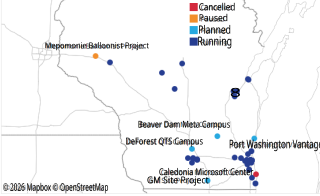
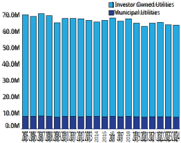
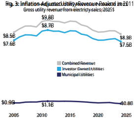
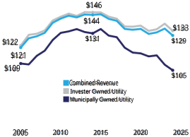

# WISCONSIN POLICYFORUM 

## **<mark>Data Centers May Change Wisconsin’s Utility Landscape</mark>** 

_Several massive data centers are being planned in Wisconsin to help power the global boom in artificial intelligence. The centers would add demand for electricity and water, but do so after years of declining usage of both. Since 2005, total energy sales by Wisconsin utilities have fallen 9% and peak demand for electricity has dipped by 2.6%. Water utilities have seen even larger reductions. Given that planned and potential data centers could require costly utility upgrades, it will be important to ensure those potential costs are fairly distributed._ 

**T** ech companies are investing billions into the construction of data centers in Wisconsin, building massive facilities to store and process data. There are currently at least 40 of these facilities operating in the state, with more in the works, as shown in Figure 1. These centers will train and operate artificial intelligence (AI) models and will be capable of processing and storing terabytes of data and more. Projects are planned in Port Washington, <u>Mount Pleasant, DeForest, Janesville, and Beaver Dam, with</u> some drawing strong opposition from local residents. 

Data centers also need millions of gallons of water each year, both to cool computer equipment and to generate <u>the electricity. This brief analyzes long-term trends in</u> energy and water use in Wisconsin to better understand how utilities would meet the demand of these new data centers. 

We present data from annual reports collected by utility regulators at the Public Service Commission of Wisconsin and provide additional context to help inform the debate on this issue. Due to our limited scope, we do not consider the pros and cons of investment in AI and data centers, nor the tradeoffs for Wisconsin 

In 2023, data centers used more than 4% of all electricity consumed in the United States. Federal officials expect that share to increase to between 6.7% and 12% by 2028, according to a study commissioned by the federal Energy Information Administration. Wisconsin is expected to follow that trend, with usage driven by massive investments into these facilities in response to growing demand for AI services. To meet the increased need for power, electric utilities in the state have proposed billions of dollars of <u>investments</u> in new infrastructure to generate and distribute power. Prior to these investments, electrical energy sales by utilities in the state had been falling, and the utilities had shifted investment into generating electricity with solar and wind power. 

Figure 1: More than 40 Data Centers Are Operating in Wisconsin Location of planned and existing data centers in Wisconsin 

Source: Milwaukee Journal-Sentinal and datacentermap.com 

ı1 

**Focus | January 2026** 

**1** 

communities of approving a center, though we plan to do further research on subject in the months to come. 

### **How Energy Use is measured** 

Electric utilities that operate in Wisconsin must submit annual reports to the state Public Service Commission each year, detailing the amount of electricity sold, their revenue, the costs of providing service, capital 

investments, and numerous other aspects of their operations. These reports show changes over time in energy sales by the state’s utilities, which include both massive investor-owned companies with statewide footprints and municipal-owned utilities that serve little more than a single community. 

Typically, electrical energy is measured in kilowatt-hours <u>(kWh), megawatt-hours (mWh)</u> (1,000 kilowatt-hours), or <u>gigawatt-hours (GWh)</u> (1,000 megawatt-hours), which represent the total amount of energy used over a certain period of time. On average, single-family homes use between 10,000 and 11,000 kWh per year. Most utility customers are billed per kilowatt hour. 

This differs from a kilowatt, megawatt, or gigawatt of electricity generation or use capacity, which are terms often used to reference the size of new data centers. For example, “hyperscale data centers” often can use at least one gigawatt of electricity at once, which is similar to the amount of power-generating capacity that is added when a new powerplant is constructed. These terms refer to the total amount of power that can be generated by a utility – or used by a consumer – at one time. This measure is important because electricity use is not evenly spread throughout a day or year. Instead, it changes over time depending on many factors. For example, electricity consumption is often at its highest on hot summer afternoons when the use of air conditioning peaks. 

When energy companies make power plant investment decisions, they consider both total electricity use and peak demand. If available power plants cannot meet both of these needs, there can be negative consequences for customers such as brown-outs, where power to some users is shut down, or in extreme cases, <u>blackouts. The massive power demand for data centers</u> affects both overall and one-time power use, so both are important to consider. 

### **Long-Term Energy Sales Trends** 

Figure 2: Electricity Sales Have Declined Since 2005 Total electricity sales by Wisconsin utilities, megawatt hours 

Source: Utility annual reports compiled by the Wisconsin Public Service Commission 

Electricity sales in Wisconsin in megawatt-hours have fallen by 9% over the past 20 years, led by a 10.6% drop by industrial and commercial users, as manufacturing operations have become more efficient and, in some cases, left the state. Among residential users, factors like modest population growth and increasing demand for summer cooling, which push electricity use up, have been more than offset by improving energy efficiency, resulting in a 1.0% decline in residential use since 2005. Falling sales by larger investor-owned utilities account for most of the overall drop, as Figure 2 shows. These large utilities dominate total electrical energy sales in the state. 

This long-term downward trend has two impacts. First, when adjusted for inflation, utility revenue has declined by 2.4% since 2005 and by 15.3% from its peak in 2011. As Figure 3 on the next page shows, this is especially acute for investor-owned utilities, which have seen revenues fall by an inflation adjusted $1.2 billion since their 2011 peak. Falling total revenue may make long-term infrastructure investments by utilities more difficult. 

Second, though the total amount of electricity purchased has fallen, the costs of massive infrastructure projects like transmission lines and new or expanded power plants have not. This means that each kWh of energy sold has to cover a greater share of a utility’s total operating costs. As Figure 4 shows, inflation-adjusted revenue per megawatt hour sold 

**2 Focus | January 2026** 

Source: Utility annual reports compiled by the Wisconsin Public Service Commission 

peaked in 2014 at $146 and has fallen steadily to $133 in 2024. 

Peak demand for electricity has remained relatively flat over time, meaning that the total generating capacity of the state’s power plants may not be able to decrease at the same rate as the long-term decline in total energy use. According to utility data collected by the Public Service Commission, peak demand decreased from a high of 15 gigawatts in 2006 to 14.6 gigawatts in 2024, 

Figure 4: Inflation-Adjusted Revenue per Megawatt Hour of Energy Peaked in 2014 and Dropped Since Gross utility revenue per megawatt hour sold, 2025$ 

Source: Utility annual reports compiled by the Wisconsin Public Service Commission 

a 2.6% decline. Over the same time, energy producers have invested in new power generation capacity through solar, wind, and natural gas plants, while taking coal plants offline. Aging coal plants were taken out of service because they had reached the end of their lifespan, and investing in other energy sources was seen as less expensive than rehabilitating these aging plants. 

Based on utility projections reported to the PSC, peak demand is expected to increase to 17.1 gigawatts over the next five years. Estimates cite the addition of new data centers as the primary driver of this increasing demand, as they have high and consistent energy needs. This growth in peak demand, in turn, seems to be driving the flurry of applications for new power plants in the state, though vehicle electrification and other factors are also projected to contribute to increasing demand. 

### **Data Center Energy Use** 

Data centers already use a substantial portion of all electricity generated in Wisconsin and the United States. This power is used to operate huge numbers of computer processors and data storage devices and to power the equipment needed to cool these components. 

It is not yet known how much energy would be used by the proposed data centers in Wisconsin. However, we can offer some context by looking at energy usage for other centers already in operation. Currently, the largest “hyperscale” data centers use up to 1.0 million mWh <u>per year, or 1,000 GWh. The power needs of each</u> center are relatively uniform throughout the year, which differs from most residential and commercial customers whose use often varies by season, with higher use in the summer due to air conditioning. 

Given Wisconsin customers purchased nearly 6.3 million fewer mWh of electricity in 2024 than in 2005, Wisconsin once had enough production capacity to meet the total electricity consumption for up to six of these new “hyperscale” facilities statewide if they were ideally distributed. However, because aging coal generating capacity was removed from the system, that capacity is no longer available. 

Each individual facility would use about 1.5% of the total energy being produced in the state. However, the planned data centers are not evenly distributed, and 

**3 Focus | January 2026** 

many of the newly proposed centers would be located in relatively small communities where they can represent an enormous increase in total energy use. In some cases, this requires a large investment in transmission lines. 

In addition, while a single data center may not change the overall power needs of the entire state, given the number of new data centers planned in Wisconsin, they are projected to drive up demand for energy to a point where additional investments in power plants will be required. 

### **Energy Generation Expansion** 

While energy use has declined, the Public Service Commission of Wisconsin reports that utilities have invested in cleaner energy sources that do not produce carbon dioxide, including solar and wind generation, in an attempt to limit the effects of climate change. At the same time, a number of older coal plants have been retired from service. However, driven largely by increasing power demands from data centers, utilities are planning new natural gas-fueled power-generating capacity to ensure reliable service when systemwide electricity demand peaks. 

Because these utilities are regulated, their rate structures and any changes to electricity prices are subject to approval by the state Public Service Commission. Utilities are allowed to charge different rates to different types of customers, though the rates must be directly related to the electricity they use. For example, many utilities charge some customers differential rates for electricity, with higher costs for electricity used during times of peak demand. So, for those customers, a kilowatt hour used in the dead of night on a cool day will cost less than one used on a hot afternoon. 

Costs for infrastructure expansion are generally covered by ratepayers, and in Wisconsin, investments must be reviewed by the Public Service Commission to ensure that they are both needed and will not unduly raise costs for ratepayers. Electricity rates have already been <u>rising,</u> and some have voiced concerns about the potential for additional capacity expansion related to data centers to drive these increases higher, especially for low-income customers. 

To address these concerns, We Energies has proposed a differential rate for large electricity users like data 

centers. These differential rates are intended to ensure that data centers are responsible for paying their full share of new infrastructure needs, and cover all the costs of the energy they use. 

In the face of rapid data center expansion, some lawmakers also have introduced legislation that would limit the impact of new energy investments on residential ratepayers. 

### **Data Center Water Use** 

Large scale data centers like those planned across Wisconsin have, in the past, used tens of millions of gallons of water annually. While these may seem like large numbers, it’s important to put them in context. Our <u>previous research</u> showed that Racine Water Works, the utility that supplies the village of Mt. Pleasant, saw a drop of more than 2.1 billion gallons in annual water sales between 1997 and 2022, which is more than 250 times the 8.4 million gallons per year that the new Microsoft data center is expected to use when fully operational. Since 2022, water sales by the utility have only grown by 1.9%, despite the presence of the world’s most powerful Microsoft data center. Newer, closedloop designs are intended to dramatically reduce the amount of water consumed by the facilities, so future developments may reduce water consumption concerns. 

Wisconsin utilities have billions of gallons of unused water sales capacity, largely because many heavy industrial users have left the state or shifted to more water-efficient operations. Data centers are likewise becoming more efficient with water over time. However, it’s likely that new infrastructure such as water mains would need to be built for many data centers to access the water they would need. 

While there may be some water quality concerns associated with using that much water for cooling, these concerns also exist to a greater extent for many large manufacturing users, such as a paper plant or cheese factory. Since most water used by data centers operates on a closed loop, only small amounts of water flow into surface waters, suggesting that these concerns are likely limited. 

In the face of falling demand for water, utilities raise rates to cover both the costs of operations and infrastructure investments. When these costs are spread out over a smaller number of sales, the price per 

**4 Focus | January 2026** 

gallon of water tends to increase. So, increasing water use somewhat could actually benefit customers by spreading infrastructure costs across additional gallons of water. However, to the extent that new water infrastructure is needed to supply these data centers, ratepayer costs could rise unless the data center developer pays for it. In some cases, developers appear willing to do so. 

### **Conclusion** 

Several large data centers are being planned in Wisconsin, with new proposals seeming to pop up every few weeks. These projects have the potential to create jobs and sharply increase the property tax base in the chosen communities, and they have helped drive <u>economic growth</u> nationally for the past year. Some data center developers and operators also have pledged to bring additional investments to the communities where their projects are located, including research partnerships with the University of Wisconsin and land donated for conservation purposes. 

Given the rapid expansion of data centers in Wisconsin, state officials may wish to work with utilities, plus relevant regional and federal bodies, to examine and track their cumulative impact on the state’s utilities comprehensively, particularly with respect to electricity generation and transmission. Publishing data on electrical energy and water usage and other impacts could help local and state leaders to plan for and manage them in the future. 

Data centers offer potential opportunities and challenges for communities in Wisconsin. A clear assessment of each could help to ensure that state leaders and residents understand the tradeoffs around this rapidly changing issue and manage them appropriately. 

However, these centers also would put additional pressure on the state’s energy and water infrastructure, and because of the lack of publicly available data on the resource use of individual facilities, it’s difficult to assess the magnitude of that pressure. For now, the power needs of data centers appear to be one of the most important areas for state and local policymakers to consider. 

In particular, it has yet to be fully determined how the costs of new infrastructure will be allocated and who will bear them. One major utility has proposed allocating most of the new energy generation costs to data center operators through higher rates, though skeptics remain concerned about this plan. It may also be worth considering what would happen if energy infrastructure is built and data center power demand then falls below projections. 

It is also worth noting that limited polling data suggest that proposed data centers are not popular so far with Wisconsin voters, regardless of political party. That highlights the importance of careful discussion and deliberation on the issue. And the massive current investment in data centers raises the question of whether their capacity might at some point outstrip demand – something that community leaders may wish to take into account when considering potential development agreements. 

**5 Focus | January 2026** 

