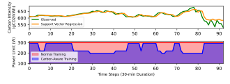
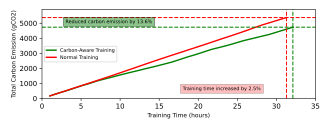

Published as a workshop <u>paper at ”Tackling Climate Change with Machine Learning”, ICLR 2023</u> 

# CHASING LOW-CARBON ELECTRICITY FOR PRACTICAL AND SUSTAINABLE DNN TRAINING 

**Zhenning Yang, Luoxi Meng, Jae-Won Chung, Mosharaf Chowdhury** 

University of Michigan 

_{_ znyang,luoxim,jwnchung,mosharaf _}_ @umich.edu 

## ABSTRACT 

Deep learning has experienced significant growth in recent years, resulting in increased energy consumption and carbon emission from the use of GPUs for training deep neural networks (DNNs). Answering the call for sustainability, conventional solutions have attempted to move training jobs to locations or time frames with lower carbon intensity. However, moving jobs to other locations may not always be feasible due to large dataset sizes or data regulations. Moreover, postponing training can negatively impact application service quality because the DNNs backing the service are not updated in a timely fashion. In this work, we present a practical solution that reduces the carbon footprint of DNN training without migrating or postponing jobs. Specifically, our solution observes real-time carbon intensity shifts during training and controls the energy consumption of GPUs, thereby reducing carbon footprint while maintaining training performance. Furthermore, in order to proactively adapt to shifting carbon intensity, we propose a lightweight machine learning algorithm that predicts the carbon intensity of the upcoming time frame. Our solution, _Chase_ , reduces the total carbon footprint of training ResNet-50 on ImageNet by 13.6% while only increasing training time by 2.5%. 

## 1 INTRODUCTION 

The growth of Deep Learning has led to a significant increase in energy consumption and carbon emissions from the use of GPUs for training DNNs (Anderson et al., 2022; Wu et al., 2021; Patterson et al., 2021), and enhancing the carbon efficiency of DNN training became a pressing and urgent problem. Concretely, training large DNNs such as GPT-3 (Brown et al., 2020), generates 552 metric tons of CO2 emissions (Patterson et al., 2021). 

However, not all Joules are born equal; Carbon intensity is a measure of electricity production, and is calculated by considering the number of grams of carbon dioxide emissions produced per kilowatt-hour (kWh) of electricity generated (g _·_ CO2 _/_ kWh). Naturally, carbon intensity can vary significantly depending on time and location. For instance, a region that relies heavily on coal for electricity generation would have a higher carbon intensity (Miller et al., 2022) than one that relies on carbon-free energy sources such as nuclear, solar, or wind (Google, 2018). Additionally, carbon intensity can also vary across time of day or season, as many renewable energy sources depend on natural phenomena. 

In this work, we demonstrate that by forecasting and exploiting shifts in real-time carbon intensity, we can enhance the carbon efficiency of DNN training. That is, when carbon intensity increases, we slow down training to draw less electricity; on the other hand, when carbon intensity decreases, we speed up training to make more progress. _Chase_ makes these decisions automatically and provides large reductions in carbon emissions while increasing training time marginally. Chase will be opensourced. 

## 2 RELATED WORK 

Carbon-aware job scheduling utilizes the variation of carbon intensity based on time (Li et al., 2016; Haghshenas et al., 2022) and location (Moghaddam, 2014; Berl et al., 2009) in order to reduce the 

1 

Published as a workshop <u>paper at ”Tackling Climate Change with Machine Learning”, ICLR 2023</u> 

carbon emissions of DNN training. But due to various constraints such as large datasets (Caesar et al., 2019; Dai et al., 2017; Deng et al., 2009), data regulations (GDPR, 2018), and availability of resources, moving jobs to _greener_ geographical locations is not always viable. Moreover, deferring training jobs to _greener_ times may not be an option either, since DNNs must be trained with the latest data and quickly deployed to production for the highest service quality. In contrast, our solution does not migrate nor postpone training jobs. Rather, as the training job runs as requested, we transparently adjust its speed and energy consumption so that it automatically _chases_ low-carbon electricity. 

Optimizing the energy consumption of DNN training can naturally lower carbon emissions due to the linear relationship between carbon and energy. GPUs, the primary hardware used for training DNNs, allow users to set their _power limit_ through software (Nvidia, 2022). Exploiting this technique, Zeus (You et al., 2023) jointly optimizes energy and time consumed to reach a target validation accuracy by automatically configuring power limit and batch size over multiple re-training jobs. However, Zeus focuses on the time and energy consumption of training jobs and is not aware of carbon intensity nor the time-varying nature thereof. 

To proactively react to changes in carbon intensity, having carbon intensity forecasts for the next time window is necessary. Recent approaches (Maji et al., 2022a;b) have achieved high forecasting performance, but the use of DNNs consumes GPU resources and can offset the amount of carbon footprint reduction from subsequent optimization techniques. On the other hand, there are commercial services (WattTime, 2022; ElectricityMaps, 2022) that provide historical carbon data and forecasting. However, the cost of their premium forecasting feature may not be affordable to all. We argue that a lightweight and low-cost solution for short-term carbon intensity forecasting is needed to democratize carbon-aware DNN training. 

## 3 METHODOLOGY 

In this work, we present a practical approach to reducing the carbon footprint of DNN training. We jointly optimize carbon emission and training performance by tuning the GPU’s power limit based on carbon intensity changes, essentially _prioritizing_ low-carbon energy. Moreover, to accurately predict the carbon intensity for the upcoming time window in an affordable manner, we utilize the historical carbon intensity data prior to the training job start time and fit a light regression model. 

### 3.1 CARBON INTENSITY FORECASTING 

During training, we aim to periodically adjust the power limit of the GPU by forecasting the carbon intensity until the next invocation. To build a predictive model for short-term carbon intensity forecasting, when a DNN training job is submitted, historical carbon intensity data one day prior to the start time ( _T_ time steps) are retrieved to fit the following regression model 

`CarbonIntensity` ( _t_ ) = _f_ ( `sin` ~~`t`~~ `ime` ( _t_ ) _,_ `cos` ~~`t`~~ `ime` ( _t_ ) _,_ `CarbonIntensity` ( _t −_ 1)) (1) 

where 

$$
sin time(t) = sin �2π \cdot{}{} t T � , cos time(t) = cos �2π \cdot{}{} t T � . (2)
$$

Our regression model captures the intuition that the carbon intensity of the next time step not only depends on the current carbon intensity but also on the current time of date, which influences the energy mix. Also, time step _t_ is converted into `sin` ~~`t`~~ `ime` ( _t_ ) and `cos` ~~`t`~~ `ime` ( _t_ ) to capture the cyclical nature of the diurnal carbon intensity trend. 

Users can configure the amount of historical data to collect, and the period between forecasts and power limit adjustments. For instance, a shorter period will allow more fine-grained power limit tuning, but also invoke forecasting more often. 

### 3.2 CARBON-AWARE DNN TRAINING 

In this section, we develop an online optimization algorithm that adapts the power limit _p_ of the GPU in order to adapt the changing carbon intensity. 

The performance of DNN training is often measured by time-to-accuracy (TTA), the time consumed to reach a given target accuracy (Coleman et al., 2019). We define the carbon emission throughout 

2 

Published as a workshop <u>paper at ”Tackling Climate Change with Machine Learning”, ICLR 2023</u> 

this process as _carbon-to-accuracy_ (CTA): 

$$
(3) CTA = TTA \times{}{} AvgPower \times{}{} AvgCarbonIntensity
$$

where `AvgPower` and `AvgCarbonIntensity` are the average power and average carbon intensity during training, respectively. We can formulate our problem as a cost minimization problem over time, where the cost can be defined as: 

$$
(4) η \cdot{}{} CTA + (1 -η) \cdot{}{} MaxPower \cdot{}{} MaxCarbonIntensity \cdot{}{} TTA
$$

where _η ∈_ [0 _,_ 1] is a configurable parameter, used to specify the relative importance of carbon efficiency and training performance a priori. GPU `MaxPower` and `MaxCarbonIntensity` are constants, used to standardize the units of measure in the cost metric (gCO2) and balance the two terms. 

Through substitution of Equation 3 into Equation 4, we obtain the following cost formulation: 

`TTA` _·_ ( _η ·_ `AvgPower` _·_ `AvgCarbonIntensity` + (1 _− η_ ) _·_ `MaxPower` _·_ `MaxCarbonIntensity` ) (5) 

Solving the full minimization problem directly is difficult due to the difficulty of accurately characterizing two terms in Equation 5: 

1. `AvgCarbonIntensity` : While carbon intensity may be predictable for a short time period, it is difficult to reliably predict carbon intensity for the entire duration of training, which could last days to even weeks. 

2. `TTA` : The stochastic nature of DNN training renders the prediction of TTA very difficult. 

Our insight is that carbon intensity will stay relatively constant over a short period of time, providing an opportunity for cost optimization per period. Consequently, we propose to iteratively optimize cost in an online manner by forecasting the carbon intensity of each _period_ beginning at time step _t ∈_ [1 _, T_ ] (§3.1) and determining the optimal GPU power limit _p_ at the beginning of each period. Thus, for each period, we solve the following optimization problem: 

_<u>η ·</u>_ `AvgPower` <u>(</u> _<u>p</u>_ <u>)</u> _·_ `CarbonIntensity` <u>(</u> _t_ <u>) + (1</u> _−_ _<u>η</u>_ <u>)</u> _·_ `MaxPower` _·_ `MaxCarbonIntensity` min _p ∈P_ `Throughput` ( _p_ ) 

(6)

where `AvgPower` ( _p_ ) represents the profiled power consumption when power limit _p_ is set and `Throughput` ( _p_ ) is inversely proportional to `TTA` since changing the power limit of the GPU does not change the number of samples the model will train on. Our formulation is inspired by Zeus (You et al., 2023), but differs in that we incorporate real-time carbon intensity and adapt to its changes. 

To sum up, when a training job arrives, our system first profiles `Throughput` ( _p_ ) and `AvgPower` ( _p_ ) for all _p_ in the set of allowed GPU power limits _P_ . Users can specify the length of each period, which determines how often the cost is optimized during the training process. At the start of each period, we forecast `CarbonIntensity` ( `t` ) and determine the optimal power limit for this period by solving Equation 6. Through periodic re-evaluation, we optimize the overall cost of the entire process and make DNN training carbon efficient. 

## 4 RESULTS 

### 4.1 FORECASTING PERFORMANCE 

For evaluation, we have observed that the average change in carbon intensity is less than 0.1% when retrieved and forecasted in durations shorter than 10 minutes. Thus, we retrieved historical carbon intensity trace for the Central US region using the WattTime API (WattTime, 2022), from 2023-0115 to 2023-01-27 (GMT), with a 30-minute duration (552 data points). 

We found that the first 24 hours of data prior to the DNN training job are sufficient for fitting the regression model. The remaining 504 data points or 252 hours were used for testing. A list of 

3 

Published as a workshop <u>paper at ”Tackling Climate Change with Machine Learning”, ICLR 2023</u> 

regression models (Table 1) was tested. To evaluate the performance of the models, we employed the mean absolute percentage error (MAPE) metric commonly used in time series forecasting. Support Vector Regression (SVR) (Basak et al., 2007) was the best-performing model employed in carbonaware DNN training. 

Table 1: Comparison of carbon intensity forecast model performances. 

|Model|MAPE %|
|---|---|
|**Support Vector Regression**|**0.94**|
|Linear Regression|1.57|
|GradientBoosting|2.23|
|AdaBoost|2.51|
|Random Forest|1.76|

### 4.2 DNN TRAINING 

To evaluate the effectiveness of our solution, we trained ResNet50 (He et al., 2015) on the ImageNet dataset (Deng et al., 2009) with one NVIDIA A40 GPU. `MaxPower` is set to 300W, which is the highest possible power limit for the A40 GPU. `MaxCarbonIntensity` is set to 750g _·_ CO2 _/_ kWh which is the observed max intensity within the 24-hour interval prior to the training job start time. Our method is compared against Normal Training, which is running the same task with the default GPU configuration (i.e. with `MaxPower` ). 

Figure 1: The power limit is dynamically adjusted to accommodate for fluctuations in carbon intensity during training. The default power limit for the A40 GPU is 300W. Training with default GPU configuration results in higher energy consumption and subsequently higher carbon emissions. 

Figure 2: In comparison to Normal Training, Carbon-Aware Training reduces carbon emissions during the entire training process and achieves the same accuracy with marginally longer training time. 

Our solution effectively reduces the total carbon footprint by 13.6% compared to normal DNN training methods (Figure 4.2). This is achieved through the use of less electricity and dynamic power 

4 

Published as a workshop <u>paper at ”Tackling Climate Change with Machine Learning”, ICLR 2023</u> 

limit adjustments to prioritize greener energy sources (Figure 4.2), with only a minimal increase of 2.5% in training time, allowing even time-sensitive DNN training jobs to reduce carbon emissions immediately. 

## 5 CONCLUSION 

In conclusion, this work addresses the problem of reducing the energy consumption and carbon emissions of DNN training on GPUs. By utilizing a simple regression model and a limited amount of historical data, we demonstrate that high short-term forecasting performance can be achieved. By incorporating this information, our solution dynamically and automatically adjusts the GPU power limit in real time, reducing carbon emissions without the need for job migration or deferral. As future work, we believe that extending Chase to support multiple DNN training jobs in data centers can significantly contribute to the fight against climate change. 

## 6 ACKNOWLEDGEMENTS 

We would like to thank the reviewers and SymbioticLab members for their insightful feedback. This work is in part supported by NSF grants CNS-1909067 and CNS-2104243 and a grant from VMWare. Jae-Won Chung is additionally supported by the Kwanjeong Educational Foundation. 

## REFERENCES 

- Thomas Anderson, Adam Belay, Mosharaf Chowdhury, Asaf Cidon, and Irene Zhang. Treehouse: A case for carbon-aware datacenter software, 2022. URL https://arxiv.org/abs/2201. 02120. 

- Debasish Basak, Srimanta Pal, and Dipak Patranabis. Support vector regression. _Neural Information Processing – Letters and Reviews_ , 11, 11 2007. 

- Andreas Berl, Erol Gelenbe, Marco Di Girolamo, Giovanni Giuliani, Hermann De Meer, Minh Quan Dang, and Kostas Pentikousis. Energy-Efficient Cloud Computing. _The Computer Journal_ , 53 (7):1045–1051, 08 2009. ISSN 0010-4620. doi: 10.1093/comjnl/bxp080. URL https://doi. org/10.1093/comjnl/bxp080. 

- Tom B. Brown, Benjamin Mann, Nick Ryder, Melanie Subbiah, Jared Kaplan, Prafulla Dhariwal, Arvind Neelakantan, Pranav Shyam, Girish Sastry, Amanda Askell, Sandhini Agarwal, Ariel Herbert-Voss, Gretchen Krueger, Tom Henighan, Rewon Child, Aditya Ramesh, Daniel M. Ziegler, Jeffrey Wu, Clemens Winter, Christopher Hesse, Mark Chen, Eric Sigler, Mateusz Litwin, Scott Gray, Benjamin Chess, Jack Clark, Christopher Berner, Sam McCandlish, Alec Radford, Ilya Sutskever, and Dario Amodei. Language models are few-shot learners. _CoRR_ , abs/2005.14165, 2020. URL https://arxiv.org/abs/2005.14165. 

- Holger Caesar, Varun Bankiti, Alex H. Lang, Sourabh Vora, Venice Erin Liong, Qiang Xu, Anush Krishnan, Yu Pan, Giancarlo Baldan, and Oscar Beijbom. nuscenes: A multimodal dataset for autonomous driving. _CoRR_ , abs/1903.11027, 2019. URL http://arxiv.org/abs/1903. 11027. 

- Cody Coleman, Daniel Kang, Deepak Narayanan, Luigi Nardi, Tian Zhao, Jian Zhang, Peter Bailis, Kunle Olukotun, Chris R´e, and Matei Zaharia. Analysis of dawnbench, a time-to-accuracy machine learning performance benchmark. _SIGOPS Oper. Syst. Rev._ , 53(1):14–25, jul 2019. ISSN 0163-5980. doi: 10.1145/3352020.3352024. URL https://doi.org/10.1145/ 3352020.3352024. 

- Angela Dai, Angel X. Chang, Manolis Savva, Maciej Halber, Thomas Funkhouser, and Matthias Nießner. Scannet: Richly-annotated 3d reconstructions of indoor scenes. In _Proc. Computer Vision and Pattern Recognition (CVPR), IEEE_ , 2017. 

- Jia Deng, Wei Dong, Richard Socher, Li-Jia Li, Kai Li, and Li Fei-Fei. Imagenet: A large-scale hierarchical image database. In _2009 IEEE Conference on Computer Vision and Pattern Recognition_ , pp. 248–255, 2009. doi: 10.1109/CVPR.2009.5206848. 

5 

Published as a workshop <u>paper at ”Tackling Climate Change with Machine Learning”, ICLR 2023</u> 

ElectricityMaps. Electricity maps, 2022. URL https://www.electricitymaps.com/. 

- GDPR. Art. 5 GDPR Principles relating to processing of personal data, 2018. URL https: //gdpr-info.eu/art-5-gdpr/. 

- Google. Moving toward 24x7 carbon-free energy at google data centers: Progress and insights, 2018. URL https://www.gstatic.com/gumdrop/sustainability/ 24x7-carbon-free-energy-data-centers.pdf. 

- Kawsar Haghshenas, Brian Setz, and Marco Aiello. Co2 emission aware scheduling for deep neural network training workloads. In _2022 IEEE International Conference on Big Data (Big Data)_ , pp. 1542–1549, 2022. doi: 10.1109/BigData55660.2022.10020544. 

- Kaiming He, Xiangyu Zhang, Shaoqing Ren, and Jian Sun. Deep residual learning for image recognition. _CoRR_ , abs/1512.03385, 2015. URL http://arxiv.org/abs/1512.03385. 

- Chao Li, Rui Wang, Depei Qian, and Tao Li. Managing server clusters on renewable energy mix. _ACM Trans. Auton. Adapt. Syst._ , 11(1), feb 2016. ISSN 1556-4665. doi: 10.1145/2845085. URL https://doi.org/10.1145/2845085. 

- Diptyaroop Maji, Prashant Shenoy, and Ramesh K. Sitaraman. Carboncast: Multi-day forecasting of grid carbon intensity. In _Proceedings of the 9th ACM International Conference on Systems for Energy-Efficient Buildings, Cities, and Transportation_ , BuildSys ’22, pp. 198–207, New York, NY, USA, 2022a. Association for Computing Machinery. ISBN 9781450398909. doi: 10.1145/ 3563357.3564079. URL https://doi.org/10.1145/3563357.3564079. 

- Diptyaroop Maji, Ramesh K. Sitaraman, and Prashant Shenoy. Dacf: Day-ahead carbon intensity forecasting of power grids using machine learning. In _Proceedings of the Thirteenth ACM International Conference on Future Energy Systems_ , e-Energy ’22, pp. 188–192, New York, NY, USA, 2022b. Association for Computing Machinery. ISBN 9781450393973. doi: 10.1145/3538637.3538849. URL https://doi.org/10.1145/3538637.3538849. 

- Gregory J Miller, Kevin Novan, and Alan Jenn. Hourly accounting of carbon emissions from electricity consumption. _Environmental Research Letters_ , 17(4):044073, apr 2022. doi: 10.1088/ 1748-9326/ac6147. URL https://dx.doi.org/10.1088/1748-9326/ac6147. 

- Fereydoun Farrahi Moghaddam. _Carbon-profit-aware job scheduling and load balancing in geographically distributed cloud for HPC and web applications_ . PhD thesis, Ecole´ de technologie sup´erieure, 2014. 

- Nvidia. Nvidia management library (nvml), 2022. URL https://developer.nvidia.com/ nvidia-management-library-nvml. 

- David Patterson, Joseph Gonzalez, Quoc Le, Chen Liang, Lluis-Miquel Munguia, Daniel Rothchild, David So, Maud Texier, and Jeff Dean. Carbon emissions and large neural network training, 2021. URL https://arxiv.org/abs/2104.10350. 

WattTime. Watttime, 2022. URL https://www.watttime.org/. 

- Carole-Jean Wu, Ramya Raghavendra, Udit Gupta, Bilge Acun, Newsha Ardalani, Kiwan Maeng, Gloria Chang, Fiona Aga Behram, James Huang, Charles Bai, Michael Gschwind, Anurag Gupta, Myle Ott, Anastasia Melnikov, Salvatore Candido, David Brooks, Geeta Chauhan, Benjamin Lee, Hsien-Hsin S. Lee, Bugra Akyildiz, Maximilian Balandat, Joe Spisak, Ravi Jain, Mike Rabbat, and Kim Hazelwood. Sustainable ai: Environmental implications, challenges and opportunities, 2021. URL https://arxiv.org/abs/2111.00364. 

- Jie You, Jae-Won Chung, and Mosharaf Chowdhury. Zeus: Understanding and optimizing GPU energy consumption of DNN training. In _USENIX NSDI_ , 2023. 

6 

