# **PREBA: A Hardware/Software Co-Design for Multi-Instance GPU based AI Inference Servers** 

Gwangoo Yeo∗ KAIST 

gwangoo525@kaist.ac.kr 

Yujeong Choi Google yujeong.choi.0606@gmail.com 

## **Abstract** 

NVIDIA’s Multi-Instance GPU (MIG) is a feature that enables system designers to reconfigure one large GPU into multiple smaller GPU slices. This work characterizes this emerging GPU and evaluates its effectiveness in designing high-performance AI inference servers. Our study reveals that the data preprocessing stage of AI inference causes significant performance bottlenecks to MIG. To this end, we present PREBA, which is a hardware/software co-design targeting MIG inference servers. Our first proposition is an FPGA-based data preprocessing accelerator that unlocks the full potential of MIG with domain-specific acceleration of data preprocessing. The MIG inference server unleashed from preprocessing overheads is then augmented with our dynamic batching system that enables high-performance inference. PREBA is implemented end-to-end in real systems, providing 3 _._ 7× improvement in throughput, 3 _._ 4× reduction in tail latency, 3 _._ 5× improvement in energy-efficiency, and 3 _._ 0× improvement in cost-efficiency. 

## **1 Introduction** 

Unlike throughput-hungry AI training algorithms, which is well-suited for acceleration using throughput-optimized GPUs, fully saturating a GPU’s high compute power and memory bandwidth under small batch inference scenarios is much more challenging. From an Artificial Intelligence as a Service (AIaaS) provider’s perspective, maintaining high GPU resource utilization is of utmost importance to optimize Total Cost of Ownership (TCO). As such, the low resource utilization in GPU-based AI inference presents an important research challenge with significant industrial importance. 

To overcome such challenge, recent high-end GPUs from NVIDIA are equipped with a feature called _Multi-Instance GPU_ (MIG) [63] which allows one large GPU’s resources to be partitioned into multiple smaller sized GPU _slices_ . Each GPU slice (henceforth referred to as a _virtual GPU_ , vGPU) functions as a standalone GPU and can independently be handed over to a Virtual Machine (VM) with performance 

Jiin Kim∗ KAIST 

jiin.kim@kaist.ac.kr 

Minsoo Rhu 

KAIST 

mrhu@kaist.ac.kr 

isolation guarantees using Single Root I/O Virtualization (SRIOV [70]). Such reconfigurability becomes extremely valuable for AIaaS providers because GPUs can now be deployed for both training (configured as one large monolithic GPU) and inference (partitioned into multiple vGPUs) with high GPU utilization. For instance, each vGPU can independently host an inference server and exploit query-level parallelism to improve GPU’s utilization, e.g., a single NVIDIA A100 GPU [61] can be partitioned into seven small vGPUs and host seven inference servers to concurrently handle multiple service queries. 

Given this landscape, a key objective of this paper is to characterize this emerging, reconfigurable GPU architecture and evaluate the efficacy of MIG for latency-critical AI workloads. Although we confirm that an MIG inference server partitioned into multiple small vGPUs is indeed highly effective in improving GPU utilization, we observe that the _data preprocessing_ stage of inference incurs a critical performance bottleneck when a GPU is partitioned using MIG. Current AI inference servers utilize the CPU to apply various application-specific preprocessing to the raw input data before sending them to the GPU for AI model execution (e.g., image decoding, resizing, cropping, and others for computer vision [72]). Our key observation is that the overhead of CPU-side data preprocessing increases proportionally to the number of vGPUs instantiated, causing significant reduction in Queries Processed per Second (QPS) vs. an inference server without any data preprocessing overheads. 

Another important research challenge with MIG is how to best exploit the multitude of vGPUs available in the inference server. Concretely, compared to the baseline system where one large GPU is available for scheduling inputs, a MIG inference server must consider multiple smaller vGPUs for scheduling. A critical aspect of input scheduling is how it should _batch_ multiple inputs to improve GPU utilization. We observe that the batching algorithm, when naively implemented for MIG inference servers, can suffer from high tail latency even at small batch sizes. Therefore, the batching system must consider MIG’s unique properties for optimizing input batching and scheduling decisions, one which to the best of our knowledge prior work has neglected upon. 

> ∗Co-first authors who contributed equally to this research. 

1 

To this end, we propose PREBA ( **PRE** processing and **BA** t- ching system) which is a hardware/software co-design for high-performance MIG inference servers. The key contributions of our proposed system are twofold: 

1. **(Hardware) A Data Processing Unit (DPU) for MIG.** PREBA fundamentally addresses MIG’s CPUside data preprocessing bottlenecks by completely offloading performance-critical data preprocessing operations to an FPGA-based DPU. Because of the diversity of AI inference workloads, it is important that PREBA’s hardware architecture contains enough flexibility to handle various application-specific data preprocessing operations. We show that our FPGA-based DPU can seamlessly accelerate the data preprocessing operations of diverse AI workloads. Our DPU microarchitecture is co-designed with the inference server’s input batching system so that it is tuned for the latencycritical nature of AI inference. Specifically, our DPU is optimized for minimizing a _single_ -input request’s latency while maximizing throughput, enabling our batching system to flexibly adjust the batching granularity based on the vGPU size, the AI model, and input size/length at runtime. 

2. **(Software) A dynamic batching system for MIG.** Designing an efficient batching system requires careful tuning of the following two hyperparameters: (a) the _maximum batch size_ ( _𝐵𝑎𝑡𝑐ℎ𝑚𝑎𝑥_ , i.e., the batching system will schedule the batched inputs once a certain number of inputs are ready for batched execution) and (b) the _maximum queueing delay for batching_ ( _𝑇𝑖𝑚𝑒𝑞𝑢𝑒𝑢𝑒_ , i.e., the longest time period the batching system will have input requests wait inside a queue to form a larger batch). We observe that tuning the values of these two hyperparameters for a given AI model without considering MIG’s effect on batching and scheduling (e.g., the sensitivity of a given vGPU’s model execution time and throughput as a function of batch size) leads to sub-optimal performance. We propose a dynamic batching system that leverages a profiling-based analytical model to systematically estimate the optimal _𝐵𝑎𝑡𝑐ℎ𝑚𝑎𝑥_ and _𝑇𝑖𝑚𝑒𝑞𝑢𝑒𝑢𝑒_ values to utilize for high-performance MIG inference servers. 

Overall, PREBA presents a practical yet highly effective architectural solution targeting MIG. To the best of our knowledge, this work is the first to identify, analyze, and explore the data preprocessing bottlenecks and the need for an efficient batching system tailored for inference servers utilizing MIG, an emerging yet highly important architectural feature introduced in state-of-the-art high-end NVIDIA GPUs. PREBA is implemented end-to-end over real systems using commodity hardware and open-source software, providing an average 3 _._ 7 × improvement in throughput, 3 _._ 4× reduction 

**Figure 1.** Overview of NVIDIA’s GPU architecture. 

in tail latency, 3 _._ 5× improvement in energy-efficiency, and 3 _._ 0× improvement in cost-efficiency. 

## **2 Background** 

### **2.1 AI Training vs. Inference in GPUs** 

GPUs are throughput-optimized processors employing manycore SIMD vectors with high-bandwidth memory (e.g., HBM [36] or GDDR [76]). Because AI training tasks employ large input batch sizes and exhibit throughput-hungry characteristics, GPUs have become the de facto standard in designing today’s AI training systems. For AI inference, however, the input batch size is orders of magnitude smaller than training. Therefore, the working set of inference is typically too small to fully saturate a high-end GPU’s compute and memory resources. As such, GPU-based inference servers oftentimes experience very low GPU utilization. To this end, there has been significant interest from both academia [6, 11, 20, 27, 28, 33, 68, 77–79, 85, 86] and industry [1, 4, 14, 40, 54, 81] to design a domain-specific architecture targeting AI inference. Nonetheless, outside of some hyperscalers [14, 40, 54, 81], the AI inference market is still dominated by GPUs as they are readily available with their mature software stack, functioning as the “go-to” platform for deploying AI services. 

Despite GPU’s prominence in deploying AI services, the GPU underutilization issue upon small batch inference scenarios is still a weak spot of GPU-based AI inference servers. To address such limitation, GPU vendors have released small, inference-purposed GPUs that contain relatively lower compute and memory throughput (e.g., NVIDIA T4 [60]), allowing better GPU utility even for small batch inference. Unfortunately, deploying these small GPUs for inference introduces a significant tradeoff: it reduces the _computational density_ of the inference server, proportional to the performance difference between a large (training-purposed) and small (inference-purposed) GPU. NVIDIA’s recently announced _Multi-Instance GPU_ (MIG [63]) architecture is intended to remedy the aforementioned challenges, allowing a GPU card to be (re)configured as either a single large GPU or be partitioned into multiple small GPU slices (referred to as _virtual GPUs_ , vGPUs, in the rest of this paper). In the following section, we delve deeper into the MIG architecture. 

### **2.2 NVIDIA’s MIG with Reconfigurability** 

This work employs NVIDIA’s MIG as the foundation for building an AI inference server. Below we elaborate on NVIDIA’s A100 GPU [61] which features MIG capabilities. 

2 

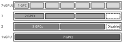**Figure 2.** MIG partitioning options in NVIDIA A100 GPU. 

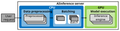**Figure 3.** End-to-end AI inference pipeline. 

**GPU hardware architecture.** Figure 1 provides a highlevel overview of a modern GPU architecture from NVIDIA. A Streaming Multiprocessor (SM) is the most fundamental building block in an NVIDIA GPU, which is essentially a SIMD processor [62]. Each SM includes a large register-file, a scratchpad, and an L1 cache to capture locality. A group of SMs constitute a cluster, which is called a Graphics Processing Cluster (GPC), and the SMs within a GPC share the communication channel to the Network-on-Chip (NoC). The NoC is implemented using a crossbar which enables GPCs to access the L2 cache and the corresponding DRAM channel. 

**Multi-Instance GPU.** NVIDIA’s MIG is architected using the GPCs (computation) and L2/DRAM slices (memory) as the basic building block. A vGPU (a GPU slice) is defined in the granularity of a GPC and an A100 GPU containing seven GPCs can be configured up to seven vGPUs, each containing a single GPC. There are restrictions on how many L2/DRAM slices a vGPU can be allocated with (e.g., it is impossible to combine a single GPC with four L2/DRAM slices into a single vGPU), so a vGPU must be configured within the limited set of possible “GPC × L2/DRAM” combinations dictated by NVIDIA. Figure 2 shows possible MIG configurations in NVIDIA A100 and how they can be utilized to instantiate multiple vGPUs, each running an AI inference server. 

### **2.3 AI Model Serving Pipeline for Inference** 

Figure 3 illustrates the end-to-end AI model serving pipeline to service an inference query (e.g., NVIDIA Triton Inference Server [58]). As depicted, the first two stages of model serving (data preprocessing, batching) are executed on the CPU while the GPU executes the last stage (model execution). Below we detail the operations conducted in each stage. 

1. **Data preprocessing.** The raw input data routed to the inference server is first preprocessed in order to be transformed into a data format that is compatible with the AI model. For the computer vision and audio processing AI workloads we focus on in this work, 

   - some representative preprocessing operations include a) decoding (JPEG→RGB), resizing, and cropping to generate the preprocessed image (e.g., 224×224×3) for computer vision [72], and b) resampling, Fast Fourier Transform (FFT), and applying Mel filters for audio processing [71] (Figure 4). 

2. **Batching.** Throughput-optimized GPUs prefer large input tensors over smaller ones to maximally exploit its abundant compute and memory performance (Section 2.1). Therefore, coalescing multiple preprocessed inputs into a single large input batch plays a critical role in achieving high GPU utilization [23, 29, 92]. Another key benefit of constructing a large input batch is that it increases the reuse of AI model parameters uploaded from the off-chip DRAM during the model execution stage, significantly improving GPU utility. 

3. **Model execution.** The final stage of model serving is the actual execution of the Deep Neural Network (DNN) layers that define the AI model. Popular inference serving systems like NVIDIA Triton Inference Server [58] or TensorFlow Serving [66] utilize an _inference execution engine_ to perform the tensor operations that constitute the DNN layer (e.g., TensorRT [59]). Once the final model output is derived, the CPU retrieves the final result and returns it back to the client. 

### **2.4 Related Work** 

**Data preprocessing for AI training/inference.** Mohan et al. [56] analyzed the impact of input data preprocessing on end-to-end AI training’s throughput, proposing various performance optimization strategies like I/O caching and sharing preprocessed training dataset across several training hyperparameter search jobs to amortize the data preprocessing overhead. Trainbox [69] similarly observes data preprocessing bottlenecks in AI training tasks and proposes to offload the compute-intensive data preparation to an FPGA device. There is also a line of work that proposes a disaggregated pool of CPU compute nodes, dedicated for data preprocessing, and allocates them on-demand per the training task’s preprocessing throughput requirements [31, 84, 94]. The work from Zhao et al. [94], for instance, puts a particular emphasis on optimizing the data preprocessing stage of recommendation model training. Similar to Trainbox, DLBooster [22] seeks to address the data preprocessing bottlenecks of AI by offloading preprocessing operations to an FPGA device. None of these prior art explores the implication of data preprocessing overheads over NVIDIA’s MIG nor proposes latency-optimization strategies tailored for data preprocesing accelerators. Overall, the key contribution of our work is orthogonal to these related work as our study is focused on AI inference servers employing NVIDIA’s reconfigurable MIG architecture. 

3 

**Figure 4.** Data preprocessing operations for (a) computer vision and (b) audio processing. 

**Exploration of NVIDIA MIG.** PARIS and ELSA [43] explored NVIDIA’s MIG architecture for AI inference, proposing optimal MIG partitioning strategies as well as highperformance scheduling policies for inference. However, this work assumes that the data preprocessing stage is always able to supply sufficient amount of preprocessed inputs to the model execution stage. Consequently, Kim et al. [43] only focuses on the backend GPU-side inference while data preprocessing is disabled (Figure 3). MISO [48] explores the best MIG partitioning strategies for co-located AI training jobs in a multi-tenant GPU cluster environment. Li et al. [47] and Robroek et al. [75] are also recent studies that characterize the performance of MIG for AI workloads. None of these prior work analyzes the data preprocessing bottlenecks in a MIG inference server let alone efficient batching strategies for MIG, rendering the key contribution of our work unique. 

**Software solutions to improve GPU utilization in latency-critical applications.** LAX [91], BayMax [19], and Prophet [18] develop solutions to improve GPU’s resource utilization without compromising Quality of Service (QoS) for latency-critical workloads. For instance, LAX points out the latency overheads of batching for latency-sensitive GPU applications and proposes to run multiple GPU tasks concurrently within a _heterogeneous_ set of GPU tasks (including AI workloads) using GPU streams, instead of batching. Baymax and Prophet seek to improve GPU utilization by estimating resource contention at shared resources (e.g., PCIe bandwidth) and utilize that information to intelligently determine which GPU tasks to concurrently execute among a _heterogeneous_ set of GPU workloads (a combination of generic GPU workloads like Rodinia [17] and AI workloads [34]). While not specifically targeting GPUs, PREMA [24] seeks to improve an AI accelerator’s resource utility using a preemptive scheduling algorithm targeting a heterogeneous set of AI workloads (but without concurrent task execution). A key distinction from these prior work vs. PREBA’s batching system is that our solution employs batching input requests targeting the _same_ AI model and executes the batched input _synchronously_ to improve GPU’s throughput, unlike these prior work seeking to _asynchronously_ execute multiple GPU workloads simultaneously among a heterogeneous set of GPU tasks. Another key distinction of PREBA is that our dynamic batching system is co-designed with our frontend DPU architecture tailored to address the unique challenges 

of NVIDIA’s MIG system. BatchMaker [30] and LazyBatching [23] suggest a fine-grained batching algorithm that coalesces inputs at the granularity of individual graph nodes (e.g., cells in RNN models or layers in DNN models) to improve batching efficiency and thus enhance GPU utilization. A key focus of PREBA is the identification of the unique challenges MIG’s batching system faces (i.e., its much lower _𝐵𝑎𝑡𝑐ℎ𝑘𝑛𝑒𝑒_ , the maximum batch size at the knee of the tail latency curve) and how to address them by co-designing it with the frontend data preprocessing stage. As the key insights behind BatchMaker and LazyBatching are orthogonal to PREBA’s batching system, they can be employed on top of our proposed system to further enhance performance. 

**Accelerating system software using DPUs.** While not targeting AI, there exists prior literature from academia (e.g., TCP/IP [12, 16, 57, 80, 83], I/O virtualization [21, 45, 46, 49], P2P data movements [5, 44, 87], remote I/O access over the network [42, 55]) and commercial products from industry (e.g., NVIDIA’s BlueField [64], Intel’s IPU [39]) that seek to offload CPU-intensive system software to an I/O attached accelerator [5, 13, 15, 16, 39, 44–46, 53, 64], similar in spirit to PREBA’s DPU. These latest research trends highlight the practicality and timeliness of our proposal. 

## **3 Characterization** 

This section utilizes NVIDIA’s A100 GPU to conduct a characterization of MIG inference servers. For brevity, we refer to a MIG partitioned into _𝑉_ vGPUs where each vGPU contains _𝑀_ GPCs (compute) and _𝑁_ GB of DRAM (memory) as a “Mg.Ngb(Vx)” configuration1 . For instance, an A100 GPU partitioned into seven vGPUs is 1g.5gb(7x), whereas one without any partitioning and functions as one big vGPU is 7g.40gb(1x) (Figure 2). As discussed later using Figure 13, the size of a single-input for an audio processing application can vary, unlike the fixed-size input for computer vision workloads. For brevity, all experiments discussed in this section assume that the input audio length is fixed at 2 _._ 5 sec. Nonetheless, we emphasize that the key observations discussed in this section remain intact regardless of the audio length. Section 5 further details our evaluation methodology. 

### **3.1 MIG Effectiveness in Improving GPU Utilization** 

We first evaluate how effective MIG is in improving the “chip-wide” aggregate throughput, which is one of the most important motivations behind the design of MIG, i.e., addressing the GPU underutilization problem when a small AI model is serviced on top of a training-purposed large GPU. 

> 1In this section, we evaluate 1g.5gb(7x), 2g.10gb(3x), and 7g.40gb(1x). Because 2g.10gb(3x) only utilizes a total of 6 GPCs (NVIDIA prevents the remaining 1 GPC from being activated, see Figure 2), the maximum throughput provided with 2g.10gb(3x) is 14 _._ 2% (=1/7) smaller than 1g.5gb(7x) and 7g.40gb(1x). We nonetheless present our characterization study under this design point to highlight the implication of MIG’s partitioning granularity on various aspects of AI inference servers. 

4 

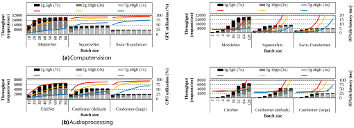**Figure 5.** (Bar chart) Model execution throughput and (line chart) its GPU utilization when preprocessing is disabled. The x-axis shows the input batch size executed by a single vGPU. 

To separate out the effect of CPU-side data preprocessing on the GPU-side model execution, we manually disable the execution of the data preprocessing stage and feed the GPU with a sufficient amount of preprocessed input batches. We then measure the model execution stage’s GPU utilization (Figure 5, right axis) and the aggregate throughput (Figure 5, left axis) while the input batch size is fixed at a value _𝑁_ (x-axis). 

Across all MIG configurations and all AI workloads, the GPU utilization monotonically increases as the input batch size is increased. However, the rate at which GPU utilization increases is noticeably higher with the fine-grained 1g.5gb(7x). This is because the compute resources of the small vGPUs in 1g.5gb(7x) can be utilized effectively even at small batch sizes, rendering its chip-wide GPU utilization also become high. Thanks to such high GPU utilization, the aggregate throughput a 1g.5gb(7x) system can achieve is significantly higher than 7g.40gb(1x), even with much smaller batch sizes. 

Overall, our characterization confirms that MIG partitioned into multiple fine-grained vGPUs (1g.5gb(7x)) can help improve the deployment cost of AI models by significantly improving GPU’s resource utilization. 

### **3.2 MIG’s Effect on Batching System** 

In real-world AI inference servers, input traffic patterns are constantly changing with varying traffic intensities, so designing an efficient batching system that balances throughput and tail latency becomes critical. In Figure 6, we show how the model execution stage’s throughput (left axis) and its tail latency (right axis) change as input batch size increases (xaxis). Across all MIG configurations and all models, once the aggregate throughput reaches a plateau, tail latency spikes up rapidly even with a very small increase in batch size. If the 

**Figure 6.** (Bar chart) Model execution throughput and (line chart) its 95%-ile latency when preprocessing is disabled. The x-axis (logscale) shows the input batch size executed by a single vGPU. 

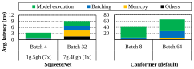**Figure 7.** Breakdown of average latency when 1g.5gb(7x) and 7g.40gb(1x) are configured with the appropriate _𝐵𝑎𝑡𝑐ℎ𝑚𝑎𝑥_ value to sustain the same inference throughput. Data preprocessing stage is disabled in this experiment. 

GPU already reached close to its maximum possible throughput, further increase in the batch size directly translates into a proportional increase in execution time (i.e., tail latency) with only incremental improvements in throughput. We refer to this tipping point as “the maximum batch size at the knee of the tail latency curve” ( _𝐵𝑎𝑡𝑐ℎ𝑘𝑛𝑒𝑒_ , denoted as green diamond markers in Figure 6). Given the property of _𝐵𝑎𝑡𝑐ℎ𝑘𝑛𝑒𝑒_ , we can see that setting the _maximum batch size_ ( _𝐵𝑎𝑡𝑐ℎ𝑚𝑎𝑥_ , i.e., the largest possible batch size the batching system will try to construct) as the _𝐵𝑎𝑡𝑐ℎ𝑘𝑛𝑒𝑒_ value is _optimal_ because having _𝐵𝑎𝑡𝑐ℎ𝑚𝑎𝑥_ larger than _𝐵𝑎𝑡𝑐ℎ𝑘𝑛𝑒𝑒_ provides practically no gain in throughput while only aggravating tail latency. 

As the batch size is increased, MIG partitioned into many small vGPUs (1g.5gb(7x)) experiences a more rapid increase in aggregate throughput than 2g.10gb(3x) and 7g.40gb(1x). This is because _𝐵𝑎𝑡𝑐ℎ𝑘𝑛𝑒𝑒_ value for 1g.5gb(7x) is smaller than that of 2g.10gb(3x) and 7g.40gb(1x). For example, 1g.5gb(7x) has _𝐵𝑎𝑡𝑐ℎ𝑘𝑛𝑒𝑒_ of 16/4/2 whereas 7g.40gb(1x) has a value of 128/32/16 for MobileNet/SqueezeNet/Swin-Transformer. Because 1g.5gb(7x) servers can reach high throughput even with small batches, an interesting property of 1g.5gb(7x) is that _the batching system can spend less time waiting for inputs_ 

5 

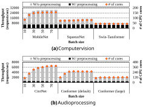**Figure 8.** (Left axis) Inference throughput with (black) and without (grey) the data preprocessing stage. (Right axis) The minimum number of CPU cores required for just preprocessing to sustain a single A100 GPU’s model execution throughput (i.e., matching the throughput of gray bars). Experiments are conducted over a server containing 32 CPU cores with 1g.5gb(7x) MIG configuration. 

_to construct a batch_ vs. 7g.40gb(1x). Figure 7 breaks down average latency when both 1g.5gb(7x) and 7g.40gb(1x) are each configured with the proper _𝐵𝑎𝑡𝑐ℎ𝑚𝑎𝑥_ value that provides the _same_ end-to-end inference throughput. As depicted, 1g.5gb(7x) has a smaller _𝐵𝑎𝑡𝑐ℎ𝑚𝑎𝑥_ value than 7g.40gb(1x) so it spends less time constructing batched inputs (the bluecolored “Batching”). In Section 4, we utilize these properties to design a dynamic batching system for MIG. 

### **3.3 Effect of Data Preprocessing on MIG Throughput** 

We now turn our attention to data preprocessing, evaluating its effect on end-to-end performance. The left axis in Figure 8 compares the end-to-end inference throughput with and without data preprocessing. That is, the performance _without_ the data preprocessing stage in Figure 8 (gray bars) is identical to the performance reported in Figure 5, whereas the performance _with_ data preprocessing is collected by executing all three stages in Figure 3 end-to-end. 

As depicted, the overall performance experiences a significant slowdown when the data preprocessing stage is activated, causing a 75 _._ 6% drop in throughput. With the 1g.5gb(7x) design point, a total of seven AI inference servers can concurrently process the service queries and cause a proportional increase in data preprocessing demand, i.e., 7× higher than 7g.40gb(1x). Such performance drop is due to the limited amount of CPU-side resources available for data preprocessing. Specifically, several key data preprocessing operations require abundant CPU cores and memory bandwidth in order to transform the raw input into AI modelspecific formats. Unfortunately, we observe that the compute throughput and memory bandwidth in current CPUs are not sufficiently high enough to sustain the data preprocessing 

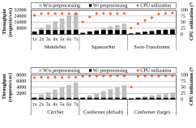**Figure 9.** Throughput (left axis) and CPU utilization (right axis) as a function of the number of inference servers activated, each server executing on a vGPU within a 1g.5gb(7x) MIG configuration. 

requirements of multiple inference servers deployed within MIG. In the right axis of Figure 8, we show the minimum number of CPU cores required just for preprocessing to fully unlock the maximum possible inference throughput (i.e., one that matches the AI model execution stage’s throughput, the gray bars in Figure 8). It is worth emphasizing that the host CPU is already busy handling various other critical tasks (e.g., load-balancing input traffic, GPU kernel launching, etc) so executing the data preprocessing stage puts high pressure on the already heavily burdened host CPU. Consider CitriNet which requires a staggering 393 preprocessing CPU cores (refer to Section 5) just to sustain the serving of a _single_ A100 GPU partitioned as 1g.5gb(7x), highlighting the significant bottleneck data preprocessing incurs. 

Such phenomenon is better highlighted in Figure 9 which shows how the data preprocessing throughput scales as a function of the number of inference servers deployed within MIG. In this experiment, the MIG is first configured as 1g.5gb(7x) and is instantiated with seven inference servers initially. We then limit the number of inference servers activated, from one to seven, and measure the data preprocessing throughput (left axis) as well as the corresponding CPU utilization (right axis). As shown, for all models we evaluate, the CPU utilization saturates around 90% with only a small number of inference servers activated and fails to further scale up throughput beyond this point. This implies that MIG’s inference servers will starve for preprocessed input data it can consume, leaving the GPU-side model execution stage idle. 

## **4 PREBA Architecture** 

### **4.1 High-Level Overview** 

Figure 10 provides a high-level overview of our PREBA system. Our DPU unlocks the full potential of MIG by fundamentally addressing its data preprocessing bottlenecks with 

6 

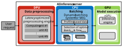**Figure 10.** High-level overview of PREBA. 

domain-specific acceleration. Concretely, all inference requests routed to the MIG inference server are completely offloaded to our DPU, which is integrated at the PCIe bus as the host CPU’s _co-processor_ , providing substantial improvements in preprocessing throughput. Once the MIG inference server is unleashed from its preprocessing overheads, our software system utilizes our dynamic batching system for high-performance AI inference. 

### **4.2 DPU Architecture for MIG Data Preprocessing** 

**Design objective.** We architect our DPU with the following two design objectives: 1) _design flexibility_ and 2) _latencycentric_ microarchitecture. Because of the diversity of AI inference workloads, we utilize an FPGA as our design substrate to flexibly handle various application-specific preprocessing operations while also reaping out the benefits of domainspecific acceleration. Furthermore, the design of our DPU microarchitecture is optimized for minimizing the latency to preprocess a batch with just a _single_ input request while also maximizing aggregate throughput. 

**Flexible design based on reconfigurable hardware.** In this paper, we focus on the DPU implementation for computer vision and audio processing AI models. While multiple AI models have evolved, preprocessing methods have remained relatively unchanged due to the limited diversity of input modalities (image/audio/text). By offering distinct implementations for both image and audio, we ensure that the majority of preprocessing computations can be efficiently offloaded with only incremental adjustments to the current implementation, while disregarding text-based modalities, which require minimal preprocessing (e.g., tokenization). Additionally, the implementation leverages the user-friendly HLS language alongside reconfigurable hardware to maximize deployment flexibility. 

**Motivation for single-input batch optimization.** Hardware accelerators for AI are typically optimized for batches with multiple input requests as it helps maximize parallelism and overall throughput. In contrast, our DPU microarchitecture is optimized for _single_ -input batches for several reasons. 

1. As we characterized in Section 3.2, the performance of a MIG inference server is highly sensitive to the _𝐵𝑎𝑡𝑐ℎ𝑚𝑎𝑥_ value, the optimal value of which is determined by the AI model architecture and the MIG partitioning granularity, i.e., the vGPU size. Optimizing the 

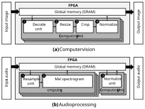**Figure 11.** DPU microarchitecture for preprocessing (a) computer vision and (b) audio processing. Each functional unit within the CU handles its own preprocessing operation defined in Figure 4. 

   - preprocessing stage for fast single-input preprocessing enables requests to be preprocessed immediately upon arrival to the inference server, providing extra latency budget for the next batching stage (Figure 3) to identify the optimal batching strategy in accordance to _𝐵𝑎𝑡𝑐ℎ𝑚𝑎𝑥_ (the maximum batch size) and _𝑇𝑖𝑚𝑒𝑞𝑢𝑒𝑢𝑒_ (the maximum queueing delay for batching). 

2. More crucially, the relatively scarce compute/memory resources available in 1g.5gb(7x)’s individual vGPUs render its optimal _𝐵𝑎𝑡𝑐ℎ𝑚𝑎𝑥_ value to become much smaller than 7g.40gb(1x)’s _𝐵𝑎𝑡𝑐ℎ𝑚𝑎𝑥_ value (e.g., Swin-Transformer’s _𝐵𝑎𝑡𝑐ℎ𝑚𝑎𝑥_ value is only 2 under 1g.5gb(7x)). Therefore, having the input requests be preprocessed in the most finest granularity (i.e., single-input request) provides the most flexibility to the subsequent batching stage to construct any batch size that best fulfills the model execution stage’s need. 

**DPU microarchitecture.** Figure 11 shows our DPU microarchitecture targeting computer vision and audio processing workloads, each of which contains multiple **C** omputing **U** nits (CUs) for preprocessing. A CU is the smallest granularity in which the host CPU controls and communicates with the FPGA to 1) transfer input/output data and 2) command the FPGA to execute preprocessing operations. A given CU contains multiple functional units, each of which is responsible for a specific stage of preprocessing (e.g., the “Decode” unit in a CU handles JPEG decoding operation in Figure 4(a))2 . Each functional unit is carefully designed to maximally reap 

> 2For clarity of explanation, we use the terminologies defined in Xilinx’s HLS programming guide [89]. The host CPU communicates with the CU using command queues and buffers created by Xilinx OpenCL extensions [41, 88]. Different functional units within a CU are designed to directly forward its input/output data via on-chip buffers (without communicating it over off-chip DRAM) in accordance with its _stream_ abstraction [89] using FIFO queues. 

7 

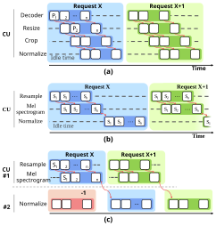**Figure 12.** Execution timeline how the two requests ( _𝑋_ and _𝑋_ +1) are handled by our DPU in (a) computer vision and (b,c) audio processing workloads. The timeline in (b) assumes a DPU design that integrates _all_ of the functional units of audio processing within a single CU, whereas (c) assumes our proposed DPU design in Figure 11(b) that utilizes two separate CU types for better resource utilization. P _𝑖_ and S _𝑖_ each refer to the group of image pixels and audio samples preprocessed by our functional units, respectively. 

out data-level parallelism inherent in the single input request leveraging the APIs on Xilinx Vitis DSP and Vision Library[10]. As mentioned previously, our CU is designed to minimize latency to process a single-input batch request. Despite such _latency_ -optimized DPU design, we also seek to maximize aggregate _throughput_ by employing multiple CUs in parallel (Figure 10). As such, our DPU can leverage _request-level parallelism_ to concurrently preprocess multiple single-input batches. 

It is worth emphasizing that a DPU microarchitecture that singlehandedly focuses on minimizing single-input preprocessing latency, without considering the DPU’s overall utilization, leads to sub-optimal system-wide throughput. Consider our DPU design for computer vision in Figure 11(a) and how it handles the two single-input batches in Figure 12(a). In the preprocessing algorithm for computer vision, different operations within data preprocessing have a simple, sequential inter-operation data dependency because the previous operation’s output is only used as the next operation’s input (Figure 12(a)). This type of sequential dataflow enables a single CU to integrate all types of functional units while still being able to fully utilize all of these units via pipelined 

execution (Figure 12(a)). This is in stark contrast to the preprocessing algorithm for audio processing which has a relatively complex dataflow. In audio preprocessing, the “Normalize” unit executes the following three sub-operations in sequence: 1) calculating the mean value across all the input audio samples, 2) determining the variance of all samples using the mean value calculated in the previous step#1, and 3) normalizing each sample data based on the mean and variance values derived previously. As such, the “Normalize” unit cannot initiate its preprocessing operation until _all_ the input samples have been processed by the previous “Resample” and “Mel spectrogram” units. Putting it differently, even when two single-input batch requests are available for scheduling, a CU design that integrates all functional units of audio preprocessing (similar to how a CU is designed for computer vision, Figure 11(a)) can only start preprocessing the second request when the first request is fully preprocessed (Figure 12(b)). Our latency-optimized DPU tackles such challenge by designing two separate CU types (i.e., CU for “Resample and Mel spectrogram” and CU for “Normalize”, Figure 11(b)) which our software runtime system utilizes for fine-grained scheduling of single-input batches. Such design point enables each single-input request to be processed with minimal latency while making sure the aggregate DPU-wide throughput is maximized via better utilization of our functional units (Figure 12(c)). 

**Implication of adding DPU to the system.** DPU is integrated into the system as a PCIe-attached I/O device. Below we discuss the potential overheads it may introduce. 

_Latency overhead._ In PREBA, the preprocessed data (which is generated by the DPU) is first forwarded back to the CPU, which is then sent to the GPU for model execution, i.e., DPU→CPU→GPU. One might be concerned that adding such an extra round trip latency can potentially nullify the performance benefits our FPGA-accelerated preprocessing provides. However, this extra PCIe latency is measured in the order of tens of microseconds, whereas an end-to-end inference request typically takes a few to tens of milliseconds. Therefore, the additional latency incurred by having our DPU integrated as a separate I/O device is negligible. 

_PCIe bandwidth._ Our DPU is integrated into the PCIe root complex via a PCIe switch, functioning as an additional I/O device from the host CPU’s perspective. Having an additional I/O device in the system can therefore potentially pressurize the PCIe communication bandwidth. However, the maximum usage of PCIe bandwidth for image and audio processing workloads incurring frequent CPU↔DPU data transfers (e.g., MobileNet and CitriNet) is measured at 6.13 GB/s and 0.9 GB/s, respectively. These numbers are significantly lower than the 32 GB/s communication bandwidth available with PCIe(gen4) specification (and more so with the now prevalent PCIe(gen5)), rendering DPU’s integration at PCIe to cause minimal interference to other I/O devices. However, in scenarios where multiple DPUs and 

8 

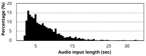**Figure 13.** Histogram of Librispeech’s audio input lengths [67] 

GPUs are integrated within the same PCIe root complex, it is possible that our PREBA system can be bottlenecked by PCIe bandwidth constraints. In those circumstances, implementing P2P data movement between DPU↔GPU across a PCIe switch and leveraging the switch’s bandwidth for inter-device communication can significantly alleviate any potential communication bottleneck [69]. 

_Cost._ Because our DPU is implemented using a separate FPGA card, it introduces extra cost and impacts the TCO of maintaining an inference server. In Section 6.3, we quantitatively evaluate PREBA’s cost-efficiency. 

### **4.3 Dynamic Batching System for MIG** 

Thanks to our DPU’s single-input batch-optimized design philosophy, our batching system can freely construct any input batch size that fulfills the requirements of the model execution stage. An efficient batching system requires the following two hyperparameters to be carefully chosen for optimal batching: _𝐵𝑎𝑡𝑐ℎ𝑚𝑎𝑥_ (the largest batch size the batching system will try to construct) and _𝑇𝑖𝑚𝑒𝑞𝑢𝑒𝑢𝑒_ (the maximum time period the batching system will have input requests wait in a batching queue to construct up to _𝐵𝑎𝑡𝑐ℎ𝑚𝑎𝑥_ -sized input batch). As discussed in Section 3.2, the optimal value of _𝐵𝑎𝑡𝑐ℎ𝑚𝑎𝑥_ is when it is set to the _𝐵𝑎𝑡𝑐ℎ𝑘𝑛𝑒𝑒_ point. This is because constructing a batch that is larger than _𝐵𝑎𝑡𝑐ℎ𝑘𝑛𝑒𝑒_ provides no benefits in improving throughput while significantly harming tail latency. Note that the _𝐵𝑎𝑡𝑐ℎ𝑘𝑛𝑒𝑒_ value is determined based on several factors: 1) the MIG “hardware” configuration inference is undertaken (1g.5gb(7x) vs. 7g.40gb(1x)), 2) the AI “model” subject for inference (MobileNet vs. SwinTransformer), and 3) the size of the model “input” (a fixedsize (224×224×3) input image vs. a variable-length audio input sample). We already discussed how the first two factors (“hardware” and “model”) affect the _𝐵𝑎𝑡𝑐ℎ𝑘𝑛𝑒𝑒_ point in Figure 6, so let us focus our discussion on the third factor, the model “input” size. 

**Effect of variable-length inputs on batching.** Unlike data preprocessing for computer vision which always generates a fixed-size (224×224×3) image for the model execution stage, the audio input length for audio processing can vary significantly (Figure 13). As such, the _𝐵𝑎𝑡𝑐ℎ𝑘𝑛𝑒𝑒_ point of an audio processing model can vary depending on the audio input length which we visualize in Figure 14 and Figure 15. While different audio input lengths lead to different 

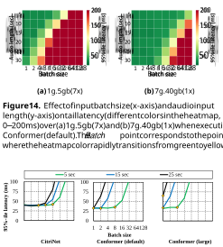**Figure 15.** Tail latency of the CitriNet and two Conformer models over 1g.5gb(7x) when the audio input length changes among 5/15/25 seconds. Note that the tail latency value at _𝐵𝑎𝑡𝑐ℎ𝑘𝑛𝑒𝑒_ (denoted as diamond markers) is almost constant around 35 ms (i.e., _𝑇𝑖𝑚𝑒𝑘𝑛𝑒𝑒_ ), regardless of the audio input length. 

_𝐵𝑎𝑡𝑐ℎ𝑘𝑛𝑒𝑒_ points, the tail latency value at _𝐵𝑎𝑡𝑐ℎ𝑘𝑛𝑒𝑒_ is almost constant at around 35 ms, regardless of the audio input length. In the remainder of this section, we refer to this tail latency value at _𝐵𝑎𝑡𝑐ℎ𝑘𝑛𝑒𝑒_ as _𝑇𝑖𝑚𝑒𝑘𝑛𝑒𝑒_ . Below we describe how PREBA’s batching system utilizes the aforementioned properties of _𝐵𝑎𝑡𝑐ℎ𝑘𝑛𝑒𝑒_ and _𝑇𝑖𝑚𝑒𝑘𝑛𝑒𝑒_ to systematically determine the optimal _𝐵𝑎𝑡𝑐ℎ𝑚𝑎𝑥_ and _𝑇𝑖𝑚𝑒𝑞𝑢𝑒𝑢𝑒_ for MIG. 

**Profiling-based estimation of Batch** _𝑚𝑎𝑥_ **.** PREBA conducts an offline profiling of the throughput vs. tail latency curve as a function of batch size and input size for the target AI model served on top of the MIG configuration of interest. The cost of conducting this one-time profiling is very low (several minutes to collect all results) and more importantly, such overhead is amortized over the several millions to billions of user queries serviced by the MIG inference server. Because the input size is fixed for computer vision while variable-length for audio processing, the profiled data will be in the form of Figure 6 for computer vision and be Figure 14/Figure 15 for audio processing. The _𝐵𝑎𝑡𝑐ℎ𝑘𝑛𝑒𝑒_ points can then be derived by utilizing these profiled data. For instance, only a single _𝐵𝑎𝑡𝑐ℎ𝑘𝑛𝑒𝑒_ point exists for a computer vision model (Figure 6) so we configure its _𝐵𝑎𝑡𝑐ℎ𝑚𝑎𝑥_ identical to this _𝐵𝑎𝑡𝑐ℎ𝑘𝑛𝑒𝑒_ point. As for audio processing, multiple _𝐵𝑎𝑡𝑐ℎ𝑘𝑛𝑒𝑒_ points exist per model (Figure 15), one per each audio input length, meaning there can also be multiple _𝐵𝑎𝑡𝑐ℎ𝑚𝑎𝑥_ values that are optimal for each audio input length. 

9 

Figure 16 illustrates PREBA’s _dynamic_ batching system that considers the variable-length nature of audio inputs and the corresponding _𝐵𝑎𝑡𝑐ℎ𝑘𝑛𝑒𝑒_ and _𝐵𝑎𝑡𝑐ℎ𝑚𝑎𝑥_ values for optimal batching. In our proposed batching system, the audio input lengths are bucketized into multiple non-overlapping windows of 2 _._ 5 seconds (e.g., [0.0−2.5 sec], [2.5-5.0 sec], _. . ._ ). Each bucket is allocated with a dedicated _batching queue_ that buffers all audio input requests whose length falls under that bucket. Therefore, a MIG inference server maintains a total of _𝑁_ batching queues ( _𝑁_ : total number of buckets). Because each batching queue is configured with its own optimal _𝐵𝑎𝑡𝑐ℎ𝑚𝑎𝑥_ value, one which is set identically to the _𝐵𝑎𝑡𝑐ℎ𝑘𝑛𝑒𝑒_ point that was derived through profiling, PREBA can dynamically construct the appropriate batch size that meets the properties of variable-length audio inputs. Putting everything together, once an input request is routed to our PREBA inference server, the audio input length is examined and is bucketized to be forwarded to its corresponding batching queue. Our dynamic batching system then seeks to accumulate enough audio inputs to construct a batch size that is up to _𝐵𝑎𝑡𝑐ℎ𝑚𝑎𝑥_ . 

**Analytical model based estimation for Time** _𝑞𝑢𝑒𝑢𝑒_ **.** The purpose of _𝑇𝑖𝑚𝑒𝑞𝑢𝑒𝑢𝑒_ is to regulate the time a batching system spends trying to form a batch. When the input traffic intensity is low (e.g., only a handful of requests are routed to the server), spending too much time waiting to form an input batch of size _𝐵𝑎𝑡𝑐ℎ𝑚𝑎𝑥_ can be wasteful. This is because the time spent trying to form that big of a batch size may incur too much latency and leave several vGPUs idle. 

As such, _𝑇𝑖𝑚𝑒𝑞𝑢𝑒𝑢𝑒_ should be chosen to minimize the idle time of GPU while making sure the batching system has a sufficient window of time to construct (up to _𝐵𝑎𝑡𝑐ℎ𝑚𝑎𝑥_ -sized) input batches. We previously established that _𝐵𝑎𝑡𝑐ℎ𝑚𝑎𝑥_ is the optimal batch size an inference server can employ in order to maximize throughput while maintaining tail latency within SLA bounds. Because our batching system does not construct batches whose size is larger than _𝐵𝑎𝑡𝑐ℎ𝑚𝑎𝑥_ , we can safely assume that the GPU’s model execution time of _any_ given input batch size will always be shorter than _𝑇𝑖𝑚𝑒𝑘𝑛𝑒𝑒_ (i.e., tail latency at _𝐵𝑎𝑡𝑐ℎ𝑘𝑛𝑒𝑒_ ). Consequently, for an inference server with a single vGPU (7g.40gb(1x)), setting the _𝑇𝑖𝑚𝑒𝑞𝑢𝑒𝑢𝑒_ value identical to _𝑇𝑖𝑚𝑒𝑘𝑛𝑒𝑒_ is optimal because the batching system only spends as much time batching the inputs that match the time GPU spends executing an existing input batch. As our 1g.5gb(7x) inference server contains seven vGPUs, the _𝑇𝑖𝑚𝑒𝑞𝑢𝑒𝑢𝑒_ value should therefore be adjusted to make sure all seven vGPUs always have at least a single input batch to consume. In PREBA, we set the _𝑇𝑖𝑚𝑒𝑞𝑢𝑒𝑢𝑒_ time as the ( _𝑇𝑖𝑚𝑒𝑘𝑛𝑒𝑒_ of a single vGPU executing the target AI model using _𝐵𝑎𝑡𝑐ℎ𝑚𝑎𝑥_ -sized input)/(total number of vGPUs, seven in 1g.5gb(7x)). This guarantees that the batching system at least generates an average of seven new batched inputs while the seven vGPUs concurrently execute each of its existing input batch for an average execution time of _𝑇𝑖𝑚𝑒𝑘𝑛𝑒𝑒_ . 

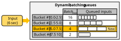**Figure 16.** PREBA’s dynamic batching system for audio processing workloads. Since the input request has an audio input length of 6 seconds, it falls under the third bucket, which allows the batching unit to coalesce the four input requests into a single batch of size 4. Example assumes the bucket window is 2.5 seconds long. 

PREBA divides variable-length audio inputs into multiple buckets based on their lengths. For each bucket, PREBA checks to ensure that there are no requests waiting longer than the _𝑇𝑖𝑚𝑒𝑞𝑢𝑒𝑢𝑒_ time. However, because requests are split across multiple queues, it is possible that GPU utilization can become low when insufficient number of requests are batched in each queue. To alleviate such inefficiency, if the constructed batch size does not reach the corresponding _𝐵𝑎𝑡𝑐ℎ𝑚𝑎𝑥_ for that bucket, PREBA tries to merge requests from adjacent buckets to maximize GPU utilization. When merging requests from different buckets, our batching system ensures that the batch size does not exceed the _𝐵𝑎𝑡𝑐ℎ𝑚𝑎𝑥_ of the longest input within the batch. 

## **5 Methodology** 

**Benchmarks.** We study a total of six AI workloads from computer vision (MobileNet (v3 small) [35], SqueezeNet (v1.1) [37], and Swin-Transformer [51]) and audio processing (two different model sizes of Conformer [32] and CitriNet [52]). We chose these models as they exhibit different computational intensities, allowing us to demonstrate the effectiveness of PREBA over different model characteristics. The model parameters of all of our computer vision models are from TorchHub [73] while those for audio processing are from NVIDIA NeMo [65]. 

**Input query modeling.** Following prior work [25, 93], we assume that each service query arrives to the inference server as a single-input request. In terms of query arrival rates, we follow recommendations from the MLPerf inference benchmark [74] which assumes a Poisson distribution for modeling the rate at which a new query arrives to the server. As for the input data, we used the ILSVRC-2012 dataset [38] for computer vision workloads and LibriSpeech dataset [67] for audio processing workloads. 

**Hardware.** Our server platform contains an AMD EPYC 7502 CPU, which contains 32 physical CPU cores with 256 GB of DRAM. We utilize a single NVIDIA A100 GPU [61] to design our MIG inference server which communicates with the CPU over PCIe. PREBA’s DPU is implemented on Xilinx’s U55C FPGA [8] using Vitis HLS 2022.2 [9]. The DPU 

10 

|**Application**|**Unit**|**LUT**|**REG**|**BRAM**|**URAM**|**DSP**|
|---|---|---|---|---|---|---|
||Decode|19.7%|8.6%|0.7%|22.5%|6.2%|
||Resize|7.1%|2.3%|0.0%|0.0%|8.6%|
|Image|Crop|0.6%|0.4%|0.0%|0.0%|0.0%|
||Normalize|13.0%|3.3%|11.2%|0.0%|3.0%|
||Total|44.5%|16.5%|19.3%|22.5%|17.8%|
||Resample|0.2%|0.1%|1.0%|0.0%|0.0%|
|Audio|Mel spectrogram|41.5%|24.6%|18.2%|37.5%|34.2%|
||Normalize|3.1%|1.7%|1.7%|7.5%|1.3%|
||Total|45.9%|26.9%|23.3%|45.0%|35.5%|

**Table 1.** FPGA resource utilization of our proposed DPU. 

communicates with the CPU over PCIe. Table 1 summarizes our DPU’s FPGA resource utilization. 

**Software.** NVIDIA Triton Inference Server (TRTIS) [58] currently does not support MIG (i.e., a single CUDA process can only enumerate a single MIG device), so we design a custom AI inference server faithfully following the design philosophy of TRTIS using Python 3.8.10, PyTorch 2.0.0, and CUDA 12.1. We utilize the Xilinx Runtime library to manage PREBA’s DPU. The baseline CPU-based data preprocessing stages are implemented using OpenCV [3] for computer vision and Librosa [2] for audio processing. 

## **6 Evaluation** 

In this section, all MIG inference servers are assumed to be configured as 1g.5gb(7x) as default (we later discuss the efficacy of PREBA over different configurations as a sensitivity study). The “Ideal” design refers to an oracular, upper-bound system which assumes that preprocessing does not cause any performance overhead.“Preprocessing(DPU)” and “Preprocessing(CPU)” refer to our PREBA system and the baseline CPU-based preprocessing design, respectively. 

### **6.1 Performance** 

**Throughput.** Figure 17 shows the end-to-end inference throughput of our studied systems. As depicted, the performance of the baseline system quickly gets bottlenecked by the data preprocessing stage and suffers from an average of 77 _._ 2% of throughput loss vs. “Ideal”. Our PREBA, on the other hand, achieves more than 91 _._ 6% of the performance of “Ideal” for 5 out of the 6 studied models, providing an average 3 _._ 7× end-to-end throughput improvement vs. baseline. 

**Latency.** We also show how well PREBA can sustain a much higher throughput while staying within a tail latency target (Figure 18). In general, the baseline system experiences a sharp increase in tail latency at a much lower throughput than the other two designs. This is because of the large latency overhead incurred during data preprocessing (e.g., 53% and 72% of inference time in SqueezeNet and Conformer(default), see Figure 19), suffering from high tail latency even when the inference server is handling a small number of incoming requests. Our PREBA system completely resolves this performance bottleneck and shows that it can 

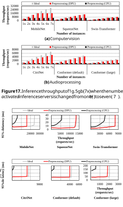**Figure 18.** Throughput vs. tail latency curve. All three designs run on top of a 1g.5gb(7x) MIG configuration. 

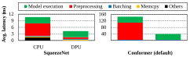**Figure 19.** Breakdown of end-to-end latency while running the experiments shown in Figure 18. For brevity, we only show results for SqueezeNet (left) and Conformer(default) (right). 

sustain 91 _._ 6% of the throughput of “Ideal” while staying within similar tail latency boundaries. This is also demonstrated by how close the red-colored lines (PREBA) are to the gray-colored lines (“Ideal”) for 5 out of the 6 studied workloads. 

11 

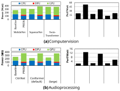**Figure 20.** Power consumption (left) and energy-efficiency (right). 

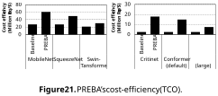### **6.2 Power and Energy-Efficiency** 

We now evaluate PREBA’s effect on power consumption and energy-efficiency (Perf/Watt). In Figure 20, we provide a breakdown of baseline vs. PREBA’s system-wide power consumption (left) and how that translates into energy-efficiency (right). In general, PREBA’s DPU incurs an additional power consumption but makes up for that overhead by reducing power consumed by the CPU (an average 35 _._ 4% reduction in CPU power consumption). What is noteworthy is that PREBA’s GPU power consumption has increased by an average of 2 _._ 8× for the three audio processing models. This is an artifact of the significant increase in GPU utilization enabled by our DPU architecture as it successfully unleashes the CPU-side data preprocessing bottlenecks of the baseline system. Because PREBA provides significant end-to-end speedup (i.e., reduction in execution time), the system-wide energy-efficiency is improved by an average of 3 _._ 5×. 

### **6.3 Cost-Efficiency (TCO)** 

To evaluate PREBA’s effect on reducing TCO, we quantify cost-efficiency using the evaluation metric suggested by prior work: (_Throu_ CAPEX_<u>ghp</u>_ +_ut_ OPEX×_time_[50]).CAPEX(CAPitalEXpenditure) denotes the one-time cost to purchase all hardware components, including server node [82], GPU and [7], FPGA [90]. 

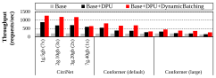**Figure 22.** Ablation study showing the effectiveness of PREBA’s hardware and software proposals. Because the dynamic batching system targets audio processing algorithms, we only present speedup numbers for our audio processing AI workloads. 

Also, _time_ is the active duration of these hardware components (3 years). Finally, OPEX (OPerating EXpence) encompasses the total power expense for operation, calculated as the product of power consumption, _time_ , and the cost of electricity ($0 _._ 139/ _𝑘ℎ𝑊_ [26]). Our proposed system outperforms the baseline in all evaluated workloads and demonstrates an average of 3 _._ 0× better cost efficiency, as shown in Figure 21. 

### **6.4 Ablation Study** 

The PREBA design point presented so far assumed that “all” of our proposal (i.e., DPU and dynamic batching system) are applied on top of the baseline system. In Figure 22, we conduct an ablation study to quantitatively evaluate the effectiveness of each of our hardware (DPU) and software (dynamic batching system) proposal individually. The leftmost gray bar (“Base”) represents the default baseline system without any of PREBA’s DPU and dynamic batching system incorporated. The “Base+DPU” design point (black bar) is one where “Base” is enhanced with our DPU to accelerate data preprocessing but without dynamic batching. Finally, “Base+DPU+DynamicBatching” (red bar) refers to our complete PREBA system incorporating both of our hardware/software proposals. Overall, “Base+DPU” outperforms “Base” by an average 101%. Adding our dynamic batching system to “Base+DPU” provides further performance improvement by an average 54%, demonstrating the efficacy and importance of each of our proposal. 

## **7 Conclusion** 

This paper presents a hardware/software co-design named PREBA which is a high-performance AI inference server targeting NVIDIA’s MIG architecture. Our characterization uncovers the significant data preprocessing bottlenecks MIG incurs and how MIG affects the inference server’s batching system. Motivated by such, we propose a DPU architecture that addresses the preprocessing bottlenecks of MIG inference. We then develop a dynamic batching system tailored to the unique algorithmic properties of MIG inference servers as well as the AI models running on top of it. Using commodity hardware and open-source software, we demonstrated the merits of PREBA over state-of-the-art solutions. 

12 

## **References** 

- [1] GRAPHCORE. https://www.graphcore.ai/products/c600. 

- [2] LibrosaCpp. https://github.com/ewan-xu/LibrosaCpp. 

- [3] OpenCV. https://opencv.org/. 

- [4] rebellions. https://rebellions.ai/rebellions-product/atom-2/. 

- [5] J. Ahn, D. Kwon, Y. Kim, M. Ajdari, J. Lee, and J. Kim. DCS: A Fast and Scalable Device-Centric Server Architecture. In _Proceedings of the International Symposium on Microarchitecture (MICRO)_ , December 2015. 

- [6] J. Albericio, P. Judd, T. Hetherington, T. Aamodt, N. E. Jerger, and A. Moshovos. Cnvlutin: Ineffectual-Neuron-Free Deep Convolutional Neural Network Computing. In _Proceedings of the International Symposium on Computer Architecture (ISCA)_ , June 2016. 

- [7] AMAZON. https://www.amazon.com/NVIDIA-Tesla-A100-AmpereGraphics/dp/B0BGZJ27SL, 2024. 

- [8] AMD Xilinx. Alveo U55C High Performance Compute Card. https: //www.xilinx.com/products/boards-and-kits/alveo/u55c.html, 2023. 

- [9] AMD Xilinx. AMD Vitis. https://www.xilinx.com/products/designtools/vitis/vitis-hls.html, 2023. 

- [10] AMD Xilinx. Vitis Libraries. https://docs.amd.com/r/en-US/Vitis_ Libraries, 2024. 

- [11] Aayush Ankit, Izzat El Hajj, Sai Rahul Chalamalasetti, Geoffrey Ndu, Martin Foltin, R. Stanley Williams, Paolo Faraboschi, Wen mei Hwu, John Paul Strachan, Kaushik Roy, and Dejan S Milojicic. PUMA: A Programmable Ultra-efficient Memristor-based Accelerator for Machine Learning Inference. 2019. 

- [12] Mina Tahmasbi Arashloo, Alexey Lavrov, Manya Ghobadi, Jennifer Rexford, David Walker, and David Wentzlaff. Enabling Programmable Transport Protocols in High-Speed NICs. In _USENIX Symposium on Networked Systems Design and Implementation (NSDI)_ , 2020. 

- [13] AWS. AWS Nitro System. https://aws.amazon.com/ec2/nitro/, 2023. 

- [14] A.W.Services. AWS inferentia. https://aws.amazon.com/machinelearning/inferentia/, 2024. 

- [15] Girish Bablani. Microsoft Announces Acquisition of Fungible to Accelerate Datacenter Innovation. https://www.fungible.com, 2023. 

- [16] Junehyuk Boo, Yujin Chung, Eunjin Baek, Seongmin Na, Changsu Kim, and Jangwoo Kim. F4T: A Fast and Flexible FPGA-based Fullstack TCP Acceleration Framework. In _Proceedings of the International Symposium on Computer Architecture (ISCA)_ , 2023. 

- [17] Shuai Che, Michael Boyer, Jiayuan Meng, David Tarjan, Jeremy W. Sheaffer, Sang-Ha Lee, and Kevin Skadron. Rodinia: A Benchmark Suite for Heterogeneous Computing. In _Proceedings of the International Symposium on Workload Characterization (IISWC)_ , 2009. 

- [18] Quan Chen, Hailong Yang, Minyi Guo, Ram Srivatsa Kannan, Jason Mars, and Lingjia Tang. Prophet: Precise QoS Prediction on NonPreemptive Accelerators to Improve Utilization in Warehouse-Scale Computers. In _Proceedings of the International Conference on Architectural Support for Programming Languages and Operation Systems (ASPLOS)_ , 2017. 

- [19] Quan Chen, Hailong Yang, Jason Mars, and Lingjia Tang. Baymax: QoS Awareness and Increased Utilization for Non-Preemptive Accelerators in Warehouse Scale Computers. In _Proceedings of the International Conference on Architectural Support for Programming Languages and Operation Systems (ASPLOS)_ , 2016. 

- [20] Y. Chen, T. Krishna, J. Emer, and V. Sze. Eyeriss: An Energy-Efficient Reconfigurable Accelerator for Deep Convolutional Neural Networks. In _Proceedings of the International Solid State Circuits Conference (ISSCC)_ , February 2016. 

- [21] Yiquan Chen, Jiexiong Xu, Chengkun Wei, Yijing Wang, Xin Yuan, Yangming Zhang, Xulin Yu, Yi Chen, Zeke Wang, Shuibing He, and Wenzhi Chen. BM-Store: A Transparent and High-performance Local Storage Architecture for Bare-metal Clouds Enabling Large-scale Deployment. In _Proceedings of the International Symposium on HighPerformance Computer Architecture (HPCA)_ , 2023. 

- [22] Yang Cheng, Dan Li, Zhiyuan Guo, Binyao Jiang, Jiaxin Lin, Xi Fan, Jinkun Geng, Xinyi Yu, Wei Bai, Lei Qu, Ran Shu, Peng Cheng, Yongqiang Xiong, and Jianping Wu. Dlbooster: Boosting End-toEnd Deep Learning Workflows with Offloading Data Preprocessing Pipelines. In _Proceedings International Conference on Parallel Processing_ , 2019. 

- [23] Yujeong Choi, Yunseong Kim, and Minsoo Rhu. Lazy Batching: An SLA-aware Batching System for Cloud Machine Learning Inference. In _Proceedings of the International Symposium on High-Performance Computer Architecture (HPCA)_ , 2021. 

- [24] Yujeong Choi and Minsoo Rhu. PREMA: A Predictive Multi-task Scheduling Algorithm For Preemptible Neural Processing Units. In _Proceedings of the International Symposium on High-Performance Computer Architecture (HPCA)_ , 2020. 

- [25] Daniel Crankshaw, Xin Wang, Guilio Zhou, Michael J Franklin, Joseph E Gonzalez, and Ion Stoica. Clipper: A Low-Latency Online Prediction Serving System. In _Proceedings of USENIX Symposium on Networked Systems Design and Implementation (NSDI)_ , 2017. 

- [26] DATACENTERS.com. Everything you need to know about data center power. https://www.datacenters.com/news/everything-you-need-toknow-about-data-center-power, 2020. 

- [27] Charles Eckert, Xiaowei Wang, Jingcheng Wang, Arun Subramaniyan, Ravi Iyer, Dennis Sylvester, David Blaauw, and Reetuparna Das. Neural Cache: Bit-serial In-cache Acceleration of Deep Neural Networks. In _Proceedings of the International Symposium on Computer Architecture (ISCA)_ , 2018. 

- [28] Renhao Fan, Yikai Cui, Qilin Chen, Mingyu Wang, Youhui Zhang, Weimin Zheng, and Zhaolin Li. MAICC : A Lightweight Many-core Architecture with In-Cache Computing for Multi-DNN Parallel Inference. In _Proceedings of the International Symposium on Microarchitecture (MICRO)_ , 2023. 

- [29] Pin Gao, Lingfan Yu, Yongwei Wu, and Jinyang Li. Low Latency RNN Inference with Cellular Batching. In _Proceedings of the EuroSys Conference_ , 2018. 

- [30] Pin Gao, Lingfan Yu, Yongwei Wu, and Jinyang Li. Low Latency RNN Inference with Cellular Batching. In _Proceedings of the EuroSys Conference (EuroSys)_ , 2018. 

- [31] Dan Graur, Damien Aymon, Dan Kluser, Tanguy Albrici, Chandramohan A Thekkath, and Ana Klimovic. Cachew: Machine Learning Input Data Processing as a Service. In _USENIX Annual Technical Conference (USENIX ATC)_ , 2022. 

- [32] Anmol Gulati, James Qin, Chung-Cheng Chiu, Niki Parmar, Yu Zhang, Jiahui Yu, Wei Han, Shibo Wang, Zhengdong Zhang, and Yonghui Wu. Conformer: Convolution-augmented Transformer for Speech Recognition. 2020. 

- [33] S. Han, X. Liu, H. Mao, J. Pu, A. Pedram, M. Horowitz, and W. Dally. EIE: Efficient Inference Engine on Compressed Deep Neural Network. In _Proceedings of the International Symposium on Computer Architecture (ISCA)_ , June 2016. 

- [34] J. Hauswald, Y. Kang, M. A. Laurenzano, Q. Chen, C. Li, T. Mudge, R. G. Dreslinski, J. Mars, and L. Tang. DjiNN and Tonic: DNN as a Service and Its Implications for Future Warehouse Scale Computers. In _Proceedings of the International Symposium on Computer Architecture (ISCA)_ , June 2015. 

- [35] Andrew Howard, Mark Sandler, Grace Chu, Liang-Chieh Chen, Bo Chen, Mingxing Tan, Weijun Wang, Yukun Zhu, Ruoming Pang, Vijay Vasudevan, Quoc V. Le, and Hartwig Adam. Searching for MobileNetV3. _arXiv preprint arXiv:1905.02244_ , 2019. 

- [36] Hynix. SK hynix Develops World’s Best Performing HBM3E, Provides Samples to Customer for Performance Evaluation. 2023. 

- [37] Forrest N Iandola, Song Han, Matthew W Moskewicz, Khalid Ashraf, William J Dally, and Kurt Keutzer. SqueezeNet: AlexNet-level Accuracy with 50x Fewer Parameters and _<_ 0.5MB Model Size. _arXiv preprint arXiv:1602.07360_ , 2016. 

13 

- [38] ImageNet. ImageNet Large Scale Visual Recognition Challenge 2012 (ILSVRC2012). https://www.image-net.org/challenges/LSVRC/2012/, 2012. 

- [39] Intel. Intel Infrastructure Processing Unit (Intel IPU). https://www.intel. com/content/www/us/en/products/details/network-io/ipu.html, 2023. 

- [40] N. P. Jouppi, C. Young, N. Patil, D. Patterson, G. Agrawal, R. Bajwa, S. Bates, S. Bhatia, N. Boden, A. Borchers, R. Boyle, P. Cantin, C. Chao, C. Clark, J. Coriell, M. Daley, M. Dau, J. Dean, B. Gelb, T. V. Ghaemmaghami, R. Gottipati, W. Gulland, R. Hagmann, C. R. Ho, D. Hogberg, J. Hu, R. Hundt, D. Hurt, J. Ibarz, A. Jaffey, A. Jaworski, A. Kaplan, H. Khaitan, D. Killebrew, A. Koch, N. Kumar, S. Lacy, J. Laudon, J. Law, D. Le, C. Leary, Z. Liu, K. Lucke, A. Lundin, G. MacKean, A. Maggiore, M. Mahony, K. Miller, R. Nagarajan, R. Narayanaswami, R. Ni, K. Nix, T. Norrie, M. Omernick, N. Penukonda, A. Phelps, J. Ross, M. Ross, A. Salek, E. Samadiani, C. Severn, G. Sizikov, M. Snelham, J. Souter, D. Steinberg, A. Swing, M. Tan, G. Thorson, B. Tian, H. Toma, E. Tuttle, V. Vasudevan, R. Walter, W. Wang, E. Wilcox, and D. H. Yoon. In-datacenter Performance Analysis of A Tensor Processing Unit. In _Proceedings of the International Symposium on Computer Architecture (ISCA)_ , 2017. 

- [41] Khronos Group. OpenCL. https://www.khronos.org/opencl/, 2023. 

- [42] Taehyun Kim, Deondre Martin Ng, Junzhi Gong, Youngjin Kwon, Minlan Yu, and KyoungSoo Park. Rearchitecting the TCP Stack for I/OOffloaded Content Delivery. In _USENIX Symposium on Networked Systems Design and Implementation (NSDI)_ , 2023. 

- [43] Yunseong Kim, Yujeong Choi, and Minsoo Rhu. PARIS and ELSA: An Elastic Scheduling Algorithm for Reconfigurable Multi-GPU Inference Servers. In _Proceedings of the ACM/IEEE Design Automation Conference (DAC)_ , 2022. 

- [44] Dongup Kwon, Jaehyung Ahn, Dongju Chae, Mohammadamin Ajdari, Jaewon Lee, Suheon Bae, Youngsok Kim, and Jangwoo Kim. Dcs-ctrl: A Fast and Flexible Device-Control Mechanism for Device-Centric Server Architecture. In _Proceedings of the International Symposium on Computer Architecture (ISCA)_ , 2018. 

- [45] Dongup Kwon, Junehyuk Boo, Dongryeong Kim, and Jangwoo Kim. FVM: FPGA-assisted Virtual Device Emulation for Fast, Scalable, and Flexible Storage Virtualization. In _USENIX Symposium on Operating Systems Design and Implementation (OSDI)_ , 2020. 

- [46] Dongup Kwon, Dongryeong Kim, Junehyuk Boo, Wonsik Lee, and Jangwoo Kim. A Fast and Flexible Hardware-based Virtualization Mechanism for Computational Storage Devices. In _USENIX Annual Technical Conference (USENIX ATC)_ , 2021. 

- [47] Baolin Li, Viiay Gadepally, Siddharth Samsi, and Devesh Tiwari. Characterizing Multi-Instance GPU for Machine Learning Workloads. In _Proceedings of IEEE International Parallel and Distributed Processing Symposium Workshops (IPDPSW)_ , 2022. 

- [48] Baolin Li, Tirthak Patel, Siddharth Samsi, Vijay Gadepally, and Devesh Tiwari. MISO: Exploiting Multi-Instance GPU Capability on Multi-Tenant GPU Clusters. In _Proceedings of the Symposium on Cloud Computing (SoCC)_ , 2022. 

- [49] Huaicheng Li, Mingzhe Hao, Stanko Novakovic, Vaibhav Gogte, Sriram Govindan, Dan RK Ports, Irene Zhang, Ricardo Bianchini, Haryadi S Gunawi, and Anirudh Badam. Leapio: Efficient and Portable Virtual NVMe Storage on ARM SOCs. In _Proceedings of the International Conference on Architectural Support for Programming Languages and Operation Systems (ASPLOS)_ , 2020. 

- [50] Ming Liu, Simon Peter, Arvind Krishnamurthy, and Phitchaya Mangpo Phothilimthana. E3: Energy-efficient Microservices on SmartNICaccelerated Servers. In _USENIX Annual Technical Conference (USENIX ATC)_ , 2019. 

- [51] Ze Liu, Yutong Lin, Yue Cao, Han Hu, Yixuan Wei, Zheng Zhang, Stephen Lin, and Baining Guo. Swin Transformer: Hierarchical Vision Transformer Using Shifted Windows. In _Proceedings of the International Conference on Computer Vision (ICCV)_ , 2021. 

- [52] Somshubra Majumdar, Jagadeesh Balam, Oleksii Hrinchuk, Vitaly Lavrukhin, Vahid Noroozi, and Boris Ginsburg. Citrinet: Closing the Gap between Non-Autoregressive and Autoregressive End-to-End Models for Automatic Speech Recognition, 2021. 

- [53] MangoBoost. Boost Your Datacenter! https://mangoboost.io/, 2023. 

- [54] Meta. Meta MITA v1. https://ai.meta.com/blog/meta-traininginference-accelerator-AI-MTIA/, 2023. 

- [55] Jaehong Min, Ming Liu, Tapan Chugh, Chenxingyu Zhao, Andrew Wei, In Hwan Doh, and Arvind Krishnamurthy. Gimbal: Enabling MultiTenant Storage Disaggregation on SmartNIC JBOFs. In _Proceedings of the ACM SIGCOMM Conference_ , 2021. 

- [56] Jayashree Mohan, Amar Phanishayee, Ashish Raniwala, and Vijay Chidambaram. Analyzing and Mitigating Data Stalls in DNN Training. _Proceedings of the VLDB Endowment_ , 2021. 

- [57] YoungGyoun Moon, SeungEon Lee, Muhammad Asim Jamshed, and KyoungSoo Park. AccelTCP: Accelerating Network Applications with Stateful TCP Offloading. In _USENIX Symposium on Networked Systems Design and Implementation (NSDI)_ , 2020. 

- [58] NVIDIA. NVIDIA Triton Inference Server. https://developer.nvidia. com/nvidia-triton-inference-server. 

- [59] NVIDIA. NVIDIA TensorRT: Programmable Inference Accelerator. 2018. 

- [60] NVIDIA. NVIDIA T4. https://www.nvidia.com/content/dam/enzz/Solutions/Data-Center/tesla-t4/t4-tensor-core-datasheet951643.pdf, 2019. 

- [61] NVIDIA. NVIDIA A100. https://www.nvidia.com/content/dam/enzz/Solutions/Data-Center/a100/pdf/nvidia-a100-datasheet.pdf, 2020. 

- [62] NVIDIA. NVIDIA CUDA Programming Guide, 2021. 

- [63] NVIDIA. Multi-Instance GPU. https://www.nvidia.com/en-us/ technologies/multi-instance-gpu/, 2023. 

- [64] NVIDIA. NVIDIA BlueField Data Processing Units. https://www. nvidia.com/en-us/networking/products/data-processing-unit/, 2023. 

- [65] NVIDIA. NVIDIA NeMo. https://www.nvidia.com/en-us/ai-datascience/generative-ai/nemo-framework/, 2023. 

- [66] Christopher Olston, Noah Fiedel, Kiril Gorovoy, Jeremiah Harmsen, Li Lao, Fangwei Li, Vinu Rajashekhar, Sukriti Ramesh, and Jordan Soyke. TensorFlow-Serving: Flexible, High-Performance ML Serving. _arXiv preprint arXiv:1712.06139_ , 2017. 

- [67] Open SLR. LibriSpeech ASR corpus. http://www.openslr.org/12/. 

- [68] A. Parashar, M. Rhu, A. Mukkara, A. Puglielli, R. Venkatesan, B. Khailany, J. Emer, S. W. Keckler, and W. J. Dally. SCNN: An Accelerator for Compressed-sparse Convolutional Neural Networks. In _Proceedings of the International Symposium on Computer Architecture (ISCA)_ , June 2017. 

- [69] Pyeongsu Park, Heetaek Jeong, and Jangwoo Kim. TrainBox: An Extreme-Scale Neural Network Training Server Architecture by Systematically Balancing Operations. In _Proceedings of the International Symposium on Microarchitecture (MICRO)_ , 2020. 

- [70] PCI SIG. Single-Root Input/Output Virtualization. https://www.pcisig. com/specifications. 

- [71] PyTorch. Torchaudio Transforms. https://pytorch.org/audio/stable/ transforms.html. 

- [72] PyTorch. Transforming and Augmenting Images. https://pytorch.org/ vision/stable/transforms.html. 

- [73] PyTorch. PyTorch Hub. https://pytorch.org/hub/, 2023. 

- [74] Vijay Janapa Reddi, Christine Cheng, David Kanter, Peter Mattson, Guenther Schmuelling, Carole-Jean Wu, Brian Anderson, Maximilien Breughe, Mark Charlebois, William Chou, Ramesh Chukka, Cody Coleman, Sam Davis, Pan Deng, Greg Diamos, Jared Duke, Dave Fick, J. Scott Gardner, Itay Hubara, Sachin Idgunji, Thomas B. Jablin, Jeff Jiao, Tom St. John, Pankaj Kanwar, David Lee, Jeffery Liao, Anton Lokhmotov, Francisco Massa, Peng Meng, Paulius Micikevicius, Colin Osborne, Gennady Pekhimenko, Arun Tejusve Raghunath Rajan, Dilip Sequeira, Ashish Sirasao, Fei Sun, Hanlin Tang, Michael Thomson, 

14 

Frank Wei, Ephrem Wu, Lingjie Xu, Koichi Yamada, Bing Yu, George Yuan, Aaron Zhong, Peizhao Zhang, and Yuchen Zhou. MLPerf Inference Benchmark. In _Proceedings of the International Symposium on Computer Architecture (ISCA)_ , 2020. 

- [75] Ties Robroek, Ehsan Yousefzadeh-Asl-Miandoab, and Pınar Tözün. An Analysis of Collocation on GPUs for Deep Learning Training. _arXiv preprint arXiv:2209.06018_ , 2022. 

- [76] Samsung. Samsung Develops Industry’s First GDDR7 DRAM To Unlock the Next Generation of Graphics Performance. 2023. 

- [77] Yakun Sophia Shao, Jason Clemons, Rangharajan Venkatesan, Brian Zimmer, Matthew Fojtik, Nan Jiang, Ben Keller, Alicia Klinefelter, Nathaniel Pinckney, Priyanka Raina, Stephen G. Tell, Yanqing Zhang, William J. Dally, Joel Emer, C. Thomas Gray, Brucek Khailany, and Stephen W. Keckler. Simba: Scaling Deep-Learning Inference with Multi-Chip-Module-Based Architecture. In _Proceedings of the International Symposium on Microarchitecture (MICRO)_ , 2019. 

   - [92] Gyeong-In Yu, Joo Seong Jeong, Geon-Woo Kim, Soojeong Kim, and Byung-Gon Chun. Orca: A Distributed Serving System for Transformer-Based Generative Models. In _USENIX Symposium on Operating Systems Design and Implementation (OSDI)_ , 2022. 

   - [93] Chengliang Zhang, Minchen Yu, Wei Wang, and Feng Yan. MArk: Exploiting Cloud Services for Cost-Effective,SLO-Aware Machine Learning Inference Serving. In _Proceedings of USENIX Annual Technical Conference (ATC)_ , 2019. 

   - [94] Mark Zhao, Niket Agarwal, Aarti Basant, Buğra Gedik, Satadru Pan, Mustafa Ozdal, Rakesh Komuravelli, Jerry Pan, Tianshu Bao, Haowei Lu, Sundaram Narayanan, Jack Langman, Kevin Wilfong, Harsha Rastogi, Carole-Jean Wu, Christos Kozyrakis, and Parik Pol. Understanding Data Storage and Ingestion for Large-Scale Deep Recommendation Model Training: Industrial Product. In _Proceedings of the International Symposium on Computer Architecture (ISCA)_ , 2022. 

- [78] Sayeh Sharify, Alberto Delmas Lascorz, Mostafa Mahmoud, Milos Nikolic, Kevin Siu, Dylan Malone Stuart, Zissis Poulos, and Andreas Moshovos. Laconic Deep Learning Inference Acceleration. In _Proceedings of the International Symposium on Computer Architecture (ISCA)_ , 2019. 

- [79] Hardik Sharma, Jongse Park, Naveen Suda, Liangzhen Lai, Benson Chau, Joon Kyung Kim, Vikas Chandra, and Hadi Esmaeilzadeh. Bit Fusion: Bit-Level Dynamically Composable Architecture for Accelerating Deep Neural Network. In _Proceedings of the International Symposium on Computer Architecture (ISCA)_ , 2018. 

- [80] Rajath Shashidhara, Tim Stamler, Antoine Kaufmann, and Simon Peter. FlexTOE: Flexible TCP Offload with Fine-Grained Parallelism. In _USENIX Symposium on Networked Systems Design and Implementation (NSDI)_ , 2022. 

- [81] Jake Siegel. Microsoft Maia v1. https://news.microsoft.com/source/ features/ai/in-house-chips-silicon-to-service-to-meet-ai-demand/, 2023. 

- [82] SuperMICRO. https://store.supermicro.com/us_en/mainstream-amd2u-as-2024s-tr.html, 2024. 

- [83] Maroun Tork, Lina Maudlej, and Mark Silberstein. Lynx: A SmartNICDriven Accelerator-Centric Architecture for Network Servers. In _Proceedings of the International Conference on Architectural Support for Programming Languages and Operation Systems (ASPLOS)_ , 2020. 

- [84] Taegeon Um, Byungsoo Oh, Byeongchan Seo, Minhyeok Kweun, Goeun Kim, and Woo-Yeon Lee. FastFlow: Accelerating Deep Learning Model Training with Smart Offloading of Input Data Pipeline. _Proceedings of the VLDB Endowment_ , 2023. 

- [85] Ying Wang, Huawei Li, and Xiaowei Li. Real-time Meets Approximate Computing: An Elastic CNN Inference Accelerator with Adaptive Trade-off Between QoS and QoR. In _Design Automation Conference (DAC)_ , 2017. 

- [86] Ying Wang, Shengwen Liang, Huawei Li, and Xiaowei Li. A NoneSparse Inference Accelerator that Distills and Reuses the Computation Redundancy in CNNs. In _Design Automation Conference (DAC)_ , 2019. 

- [87] Zeke Wang, Hongjing Huang, Jie Zhang, Fei Wu, and Gustavo Alonso. FpgaNIC: An FPGA-based Versatile 100Gb SmartNIC for GPUs. In _USENIX Annual Technical Conference (USENIX ATC)_ , 2022. 

- [88] Xilinx. Xilinx OpenCL Extension. https://xilinx.github.io/XRT/master/ html/opencl_extension.html, 2022. 

- [89] Xilinx. Vitis High-level Synthesis User Guide. https://docs.xilinx.com/ r/en-US/ug1399-vitis-hls, 2023. 

- [90] Xilinx. https://www.xilinx.com/products/boards-and-kits/alveo/u55c. html, 2024. 

- [91] Tsung Tai Yeh, Matthew D. Sinclair, Bradford M. Beckmann, and Timothy G. Rogers. Deadline-Aware Offloading for High-Throughput Accelerators. In _Proceedings of the International Symposium on HighPerformance Computer Architecture (HPCA)_ , 2021. 

15 

