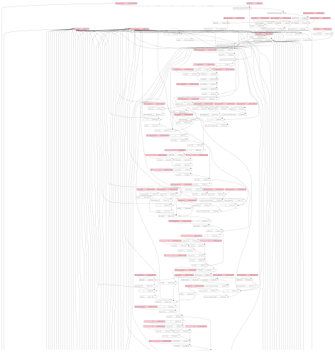
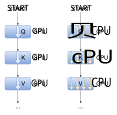
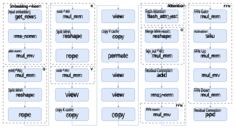
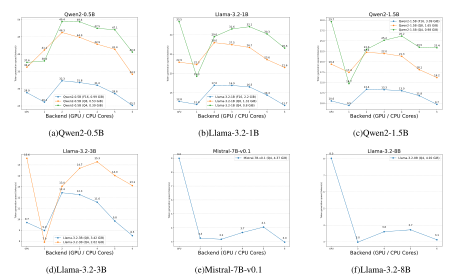
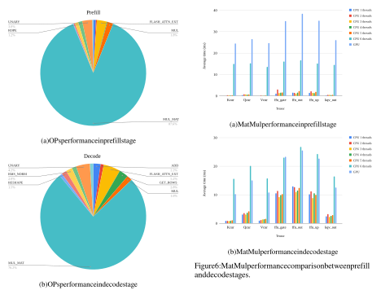
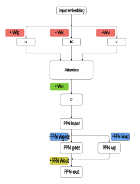
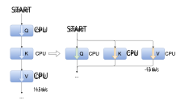
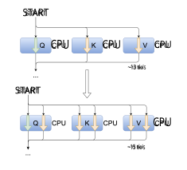
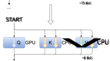

# CHALLENGING GPU DOMINANCE: WHEN CPUS OUTPERFORM FOR ON-DEVICE LLM INFERENCE 

**Haolin Zhang Jeff Huang** Department of Computer Science & Engineering Department of Computer Science & Engineering Texas A&M University Texas A&M University College Station, TX 77843 College Station, TX 77843 `chris_zhang@tamu.edu jeffhuang@tamu.edu` 

## **ABSTRACT** 

The common assumption in on-device AI is that GPUs, with their superior parallel processing, always provide the best performance for large language model (LLM) inference. In this work, we challenge this notion by empirically demonstrating that, under certain conditions, CPUs can outperform GPUs for LLM inference on mobile devices. Using a 1-billion-parameter LLM deployed via llama.cpp on the iPhone 15 Pro, we show that a CPU-only configuration (two threads, F16 precision) achieves 17 tokens per second, surpassing the 12.8 tokens per second obtained with GPU acceleration. We analyze the architectural factors driving this counterintuitive result, revealing that GPU memory transfer overhead and CPU thread optimization play a critical role. Furthermore, we explore the impact of thread oversubscription, quantization strategies, and hardware constraints, providing new insights into efficient on-device AI execution. Our findings challenge conventional GPU-first thinking, highlighting the untapped potential of optimized CPU inference and paving the way for smarter deployment strategies in mobile AI. However, fully explaining the observed CPU advantage remains difficult due to limited access to low-level profiling tools on iOS. 

**_Keywords_** On-Device AI _·_ SLM _·_ LLM Inference _·_ CPU Optimization _·_ ARM Architecture _·_ Mobile Machine Learning 

## **1 Introduction** 

Recent advances in _small language models (SLMs)_ have challenged the conventional focus on scaling up AI models. While GPUs have been the dominant choice for inference, emerging evidence suggests that they may not always offer the best performance, particularly for SLMs on mobile devices [5]. This shift is reshaping AI deployment, as compact models demonstrate high efficiency across diverse tasks. 

Models such as Phi [1, 13], LLaMA 3.2 Herd [10], TinyLLaMA [32], Apple Foundation Models [11], and Qwen-2 [31] exemplify this trend. They show that smaller architectures can achieve strong performance in natural language processing, expanding the possibilities for real-world applications beyond large-scale cloud infrastructure. 

Deploying SLMs on mobile devices presents unique challenges due to constraints in memory, processing power, and energy consumption. Researchers have proposed optimizations to address these limitations. Liu et al. [19] introduced MobileLLM, an architecture for sub-billion parameter models that optimizes embedding sharing, groupedquery attention, and deep-thin structures to minimize resource overhead. Pham et al. [23] developed SlimLM, fine-tuned for document assistance on smartphones, balancing model size, context length, and inference speed. Li et al. [17] presented Transformer-Lite, an inference engine that optimizes mobile GPU efficiency with dynamic shape support, FP4 quantization, and sub-tensor KV cache handling, achieving notable speedups. 

These advancements have fueled interest in on-device SLM deployment, reducing reliance on cloud services, improving privacy, and lowering latency and costs. A key tool in this domain is llama.cpp [9], an open-source framework optimized for consumer hardware, including mobile devices. It supports various performance optimizations, such as quantization [8] and multi-threaded execution, making 

Challenging GPU Dominance: When CPUs Outperform for On-Device LLM Inference 

it a valuable platform for pushing the limits of on-device AI. 

This paper examines the performance of SLMs on mobile devices. We evaluate six models, ranging from 0.5 billion to 8 billion parameters, under different precision settings to assess the impact of quantization and hardware configurations on inference speed. 

Given the iPhone’s prominence in the premium market and Apple’s growing investment in on-device AI [12], we selected the iPhone 15 Pro as our test platform. It features an Apple-designed A17 Pro SoC with an ARM v8.6-A ISA and a Metal-supported GPU. We use llama.cpp as the inference engine for our experiments. 

Our study highlights three key findings: 

- **CPU Competitiveness with GPU:** Under specific conditions, _CPU-only_ inference can match or even surpass GPU performance. For smaller models such as Qwen20.5B and LLaMA-3.2-1B, multi-threaded CPU execution with `Q4`1 and `F16` precision achieves speedups of 1.31 _×_ and 1.33 _×_ , respectively, over GPU execution. However, for models larger than 1.5B parameters, GPUs generally maintain higher throughput, as seen with Mistral-7B and LLaMA-3.2-8B, where CPU performance declines due to increased memory and computation demands. 

- **Matrix Multiplication as the Bottleneck:** Profiling reveals that matrix multiplication ( `GGML_OP_MUL_MAT` ) dominates computation, accounting for 87.6% of execution time in the prefill phase and 76.2% in the decode phase2 . This underscores the need to optimize General Matrix Multiplication (GEMM) operations to improve SLM inference efficiency. 

- **Impact of Thread Allocation:** Optimal performance occurs when the number of CPU threads matches the architecture’s performance cores. Adding more threads beyond this threshold yields diminishing returns or performance degradation, emphasizing the importance of architectureaware thread scheduling. 

Through these insights, we challenge the dominant “GPUfirst” paradigm, demonstrating that CPUs can be competitive for on-device AI. Our findings contribute to the development of resource-efficient, high-performance AI systems. 

The rest of the paper is organized as follows. Section 3 describes the llama.cpp compute graph and its role in model inference. Section 5 presents a performance analysis of models from 0.5B to 8B parameters across different backends and precision settings. Section 6 discussed profiling results from llama.cpp runtime. Section 7 proposes a hardware-aware execution strategy to maximize concurrency. Finally, Sections 8–9 discuss profiling challenges on mobile hardware and future directions for optimizing both CPU and GPU performance. 

> 1Effective 4.5 bits/weight 

> 2For llama3.2-1B@f16 

## **2 Related Work** 

### **2.1 Advancements in Small Language Models** 

Research on _small language models_ (SLMs) has aimed to achieve strong performance with lower computational costs, making them practical for mobile and edge applications. Several models have been introduced, including Meta’s OPT [33] and LLaMA series [28, 10], Microsoft’s Phi series [13, 1], the Qwen series [31], StabilityAI’s StableLM [3], and Google’s Gemma [27] and Gemini Nano [26]. Other models, such as MobileVLM [4] and Apple Foundation Models [11], have been designed with efficiency as a priority for resource-limited environments. 

One key improvement in modern SLMs is the refinement of self-attention mechanisms, which traditionally scale quadratically with sequence length. Methods such as _flash attention_ [6] optimize memory use by reducing redundant operations, improving inference speed. _Grouped-query attention (GQA)_ [2], used in the Qwen and LLaMA 3.2 series, reduces memory overhead by processing queries in groups, offering efficiency without sacrificing accuracy. 

Compression methods such as quantization further improve inference by reducing memory and bandwidth needs. Low-bit approaches, including GPTQ [7] and llama.cpp’s k-quant [8], minimize storage and computational requirements while maintaining precision. Recent work, such as SmoothQuant [29], extends these benefits by introducing weight-activation co-quantization to lower computational load while maintaining stable outputs. 

These developments improve the balance between efficiency and accuracy, making smaller models a practical alternative for on-device use. However, the efficiency of CPUs compared to GPUs for running these models under different quantization settings and model sizes is still not well understood. This study addresses this question by systematically evaluating CPU-GPU performance trade-offs across multiple configurations. 

### **2.2 On-Device Deployment of SLMs** 

Efficient on-device inference has led to the development of specialized engines, each with different optimization strategies. MNN [15] offers a highly optimized mobile inference engine with kernel optimizations and hybrid backend scheduling. However, its execution model focuses on individual operators rather than full compute graph scheduling, which affects performance on mobile devices with heterogeneous computing architectures. MNN also does not support quantization below 8-bit, limiting its effectiveness for larger models in memory-constrained environments. 

PowerInfer [25] improves performance by distributing frequently activated neurons on the GPU while offloading others to the CPU. This approach enhances execution speed on consumer GPUs and supports models as large as OPT175B. However, the method is designed for desktop envi- 

2 

Challenging GPU Dominance: When CPUs Outperform for On-Device LLM Inference 

ronments, which limits its direct applicability to mobile and embedded devices. 

ExecuTorch [24], an extension of PyTorch, broadens compatibility with edge devices while prioritizing ease of use and hardware efficiency across CPUs, NPUs, and DSPs. It relies on the PyTorch 2 compiler for model export, addressing some limitations of previous approaches, such as TorchScript in PyTorch Mobile. However, balancing a small memory footprint with execution speed remains an ongoing challenge. 

MediaPipe [21] is widely used for vision-based applications and provides a modular framework for evaluating system performance across platforms. While it allows for rapid prototyping, adapting it for transformer-based models may require modifications. 

Recent studies explore extreme quantization methods, such as BitNet b1.58 [22], which reduces model weights to ternary values (-1, 0, 1) while maintaining performance close to full-precision models. This method significantly reduces latency, memory use, and energy consumption. BitNet b1.58 also introduces a new training approach that supports efficient model scaling and informs future hardware design for low-precision inference. 

These inference engines and compression methods highlight different strategies for deploying LLMs on mobile and embedded devices, from hardware-specific optimizations to more flexible, cross-platform solutions. 

### **2.3 Measurement and Survey of On-Device LLM Deployment** 

The study of language model performance on resourceconstrained devices has gained attention, leading to systematic evaluations. Lu et al. [20] provide a survey of SLMs ranging from 100M to 5B parameters, covering architecture, training methods, and key performance metrics, such as inference speed and memory use. Their analysis focuses on transformer-based, decoder-only models common in smart devices. Li et al. [16] examine inference serving optimizations that improve efficiency without modifying core decoding methods. 

Xu et al. [30] review the challenges of running computationally intensive models on edge devices. Their study covers efficient architectures, compression techniques (quantization, pruning, knowledge distillation), and hardware acceleration methods, all critical for balancing accuracy with efficiency. Li et al. [18] evaluate 22 LLMs across four mobile devices, comparing accuracy, latency, and memory usage. Their results suggest that mobile inference engines often show little advantage from GPU acceleration, with some cases demonstrating slower performance. They also find that smaller models, such as Bloom 0.5B, achieve a 10.5 _×_ speedup over Bloom 7B with only a 1.37% accuracy reduction, supporting the idea that SLMs can provide efficient inference with minimal loss of precision. 

This study builds on previous research by providing an in-depth analysis of the llama.cpp inference framework, including its technical improvements. A new execution approach based on compute graph order is introduced, designed to optimize hardware usage and mitigate performance inefficiencies found in earlier work. Unlike prior studies that focus primarily on profiling mobile LLM performance, this research examines the deployment of 1- billion-parameter models on physical devices, offering insights for practical applications. 

## **3 Background** 

llama.cpp3 represents machine learning models as compute graphs, where each node corresponds to an operation in the model architecture. Model files are stored in the `gguf` format, containing both the model type (LLaMA, Baichuan, Falcon, Grok, etc.) and weight parameters. When a model is loaded, llama.cpp calls the `llama_build_graph` function, which dynamically constructs the compute graph based on the model architecture. 

For models in the LLaMA family, this graph is assembled using the `build_llama()` function. Algorithm 1 outlines the process of creating transformer layers, including attention mechanisms, feed-forward networks, and residual connections. 

|**Alg**|**orithm 1**Pseudocode for`build_llama`|
|---|---|
|1:|**function** BUILD_LLAMA |
|2:|INIT(gf, inpL) |
|3:|**for**each layer**do**|
|4:|norm_inp_←_NORM(inpL)|
|5:|_Q, K, V ←_ATTN_WEIGHTS(norm_inp)|
|6:|_Q, K ←_ROTARY(Q, K)|
|7:|attn_out_←_ATTENTION(Q, K, V)|
|8:|ffn_inp_←_ADD(attn_out, inpL)|
|9:|ffn_norm_←_FFN_NORM(ffn_inp)|
|10:|ffn_out_←_FFN(ffn_norm)|
|11:|inpL_←_ADD(ffn_out, inpL) |
|12:|**end for**|
|13:|final_norm_←_NORM(inpL)|
|14:|final_out_←_APPLY_WEIGHT(final_norm)|
|15:|BUILD_FORWARD_PASS(gf, final_out)|
|16:|**return**gf|
|17:|**end function**|

This function builds the compute graph to match the hierarchical structure of the LLaMA transformer model. Figure 1 shows a segment of the compute graph for **LLaMA 3.2-1B** , illustrating the structure of decoder blocks. The full graph can be accessed on GitHub. 

After constructing the graph, execution is managed by _ggml_ , a tensor library optimized for different hardware backends. In llama.cpp, execution follows a sequential schedule, where each node—representing an operation 

> 3Code based on commit 8648c52 

3 

Challenging GPU Dominance: When CPUs Outperform for On-Device LLM Inference 

Figure 1: Segment <mark>of the compute graph for a LLa</mark> MA 3.2 <mark>model.</mark> 

such as matrix multiplication or normalization—is processed in order based on its dependencies. 

Figure 2 shows the execution schedule for both GPUenabled and CPU-only configurations. When GPU acce <mark>ler</mark> - ation is available, nodes are offloaded to the GPU backend. In a CPU-only setup, computations are parallelized acros <mark>s</mark> multiple threads. 

Even with parallel execution at the hardw <mark>are level, opera</mark> - tions within each transformer block are sche <mark>duled</mark> **<mark>s</mark> eriall** **<mark>y</mark>** <mark>,</mark> meaning attention, residual connections, a <mark>nd feed-forward</mark> 

<mark>comp</mark> utations a <mark>re executed o</mark> ne after another within the <mark>same layer.</mark> Figure 3 illustrates this ordered execution, showi <mark>ng how</mark> dependencies are handled in the compute gr <mark>aph.</mark> 

<mark>Each node</mark> represents a fundamental mathematical oper- <mark>ation, such</mark> as **matrix multiplication** , **element-wise additio** **<mark>n</mark>** <mark>, or</mark> **<mark>r</mark> otar** **<mark>y</mark> position encoding (ROPE)** . The execu <mark>tion backend i</mark> s selected at compile time, based on <mark>hardware capabilitie</mark> s and compiler settings. Supported <mark>backends include</mark> <mark>`NEO`</mark> `N` , `AVX/AVX2` , `RISC-V Intrinsic` , 

4 

Challenging GPU Dominance: When CPUs Outperform for On-Device LLM Inference 

Figure 2: **Left (GPU-enabled)** : Nodes are offloaded to the GPU backend. **Right (CPU-only execution)** : Nodes are processed in parallel across four CPU threads. 

`Power9 Vector` , `Loongarch ASX` for CPU acceleration, and `CUDA` , `MUSA HIP` , `Vulkan` , `SYCL` and `Metal` for GPU execution. This flexibility allows llama.cpp to achieve efficient performance across different computing platforms. 

## **4 Methodology** 

### **4.1 Hardware and Software Setup** 

To evaluate the feasibility of running large language models on mobile devices, we conducted experiments on an iPhone 15 Pro, equipped with a 2-performance-core, 4- efficiency-core (2P+4E) CPU configuration and 8GB of RAM. The GPU was tested under its default enabled setting. The device operated on iOS 18.2.1, and all experiments were executed on a codebase built from commit `8648c52` , ensuring strict reproducibility. To mitigate performance variability caused by thermal throttling, we stabilized the device temperature by placing it in an ice-cooled environment. 

### **4.2 Model Selection and Precision** 

Considering the constrained computational and memory resources of mobile devices, our study evaluates a range of small-scale large language models (LLMs) optimized for efficiency without compromising performance. We conduct experiments on models with parameter sizes of 0.5B, 1B, 1.5B, 3B, 7B, and 8B, encompassing popular architectures such as Qwen([31]), LLaMA ([10]), and Mistral([14]) families. To investigate the trade-offs between precision and efficiency, we evaluate these models under 

various precision configurations, including full-precision (F16), 8-bit quantization (Q8), and 4-bit quantization (Q4). 

### **4.3 Test Configurations** 

To systematically analyze inference performance, we tested two execution modes: 

- **GPU-Enabled (Default)** : The model utilized the iPhone’s integrated GPU for acceleration, leveraging available hardware optimizations. 

- **CPU-Only Execution** : The model executed exclusively on the CPU, with thread parallelism ranging from 1 to 6 threads to assess performance scaling. 

### **4.4 Experimental Procedure** 

Each configuration was benchmarked using llama.cpp, measuring inference speed in tokens per second (tk/s). To ensure statistical reliability, each setting was evaluated over five independent runs, and the average throughput was recorded. To eliminate prompt variability, all tests used a fixed input: " `The meaning of life is` " (7 tokens in total). 

### **4.5 Evaluation Metrics** 

The primary performance metric was inference throughput, defined as the number of tokens generated per second (tk/s). This metric provides a direct measure of computational efficiency across different hardware configurations and precision formats. 

## **5 Results** 

### **5.1 Performance Comparison Across Models and Backends** 

We benchmark six models—Qwen2-0.5B, Qwen2-1.5B, Llama-3.2-1B, Llama-3.2-3B, Mistral-7B-v0.1, and Llama3.2-8B—under various numerical precision setups (F16, Q4, and Q8 when applicable) and across diverse backends (GPU or 1–6 CPU threads). For each configuration, we measure inference speed in tokens per second (tk/s). Figure 4 presents the consolidated results, with sub-figures illustrating performance trends for each model. 

**Memory and Timeout Constraints.** For larger models with 7B and 8B parameters, the F16 and Q8 configurations exceeded the device’s memory capacity, resulting in `mmap` failures. Additionally, attempting to run 7B or 8B models using a single or dual CPU thread frequently led to timeouts, as the context windows (128 tokens) could not be filled within 1 minute. This resulted in missing data points in certain plots. 

5 

Challenging GPU Dominance: When CPUs Outperform for On-Device LLM Inference 

Figure 3: Execution sequence of nodes within transformer blocks. Each operation is processed sequentially. 

### **5.2 F16 Precision Performance Analysis** 

Figures 4(a)–(d) illustrate the F16 performance for Qwen20.5B, Qwen2-1.5B, Llama-3.2-1B, and Llama-3.2-3B. Notably, for smaller-sized models (e.g., Qwen2-0.5B in Figure 4(a)), CPU execution can _exceed_ GPU performance when multiple threads are used. For instance, on Qwen20.5B at F16, the GPU baseline lags behind a 2-thread CPU configuration, underscoring the efficiency of multithreading for sub-1B parameter networks. A similar trend emerges for Llama-3.2-1B in Figure 4(b), where CPU performance scales favorably up to four or five threads before diminishing returns set in. 

For mid-sized models (e.g., Qwen2-1.5B, Llama-3.2-3B), GPU acceleration generally offers higher throughput. However, the CPU remains competitive given enough threads (four or more), indicating that careful threading can offset GPU kernel launch overheads and memory-transfer bottlenecks. For 8B-F16, no results are shown in Figure 4(f) due to memory allocation failures on the test device. 

### **5.3 Q4 (and Q8) Quantization Performance Analysis** 

Quantization to 4 bits significantly boosts inference speed across all models where it is supported. In Figures 4(a)–(d), we observe that moving from F16 to Q4 yields anywhere from a 1.5 _×_ to 2.5 _×_ speedup, most prominently on larger CPU thread counts. As shown in Figure 4(b) for Llama3.2-1B at Q4, the GPU baseline improves substantially over F16, while multi-threaded CPU execution narrows the performance gap with a suitable number of threads. For 7B and 8B models, Q8 configurations could not be fully 

benchmarked (memory allocation failures), and 1–2 CPU threads timed out for Q4. Nonetheless, the available data in Figures 4(e) and 4(f) for Mistral-7B-v0.1 (Q4) and Llama3.2-8B (Q4) suggest that performance scales best beyond two CPU threads, though the GPU remains superior when it can be utilized. 

### **5.4 Observations and Discussion** 

These experiments yield several key insights: 

- **CPU versus GPU trade-offs:** For small-scale models (e.g., below 1B parameters) at F16 precision, multi-threaded CPU execution _can outperform_ a GPU due to reduced kernel overheads and dynamic scheduling. 

- **Thread Scalability:** Adding CPU threads boosts throughput until an optimal threshold (commonly four or five in our tests), after which resource contention and memory bandwidth limits degrade performance. 

- **Quantization Benefits:** Q4 compression offers a noticeable increase in tokens per second across the tested backends, making it attractive for performance-sensitive applications that can tolerate small accuracy trade-offs. 

- **Limitations on Larger Models:** For 7B and 8B models, memory constraints (F16/Q8) and execution timeouts (1–2 threads) prevent a straightforward CPU-GPU comparison. Higher-capacity hardware or further quantization would be re- 

6 

Challenging GPU Dominance: When CPUs Outperform for On-Device LLM Inference 

quired for real-time inference on these larger networks. 

Overall, Figure 4 demonstrates that careful choice of numerical precision (F16 vs. Q4) and backend configuration (GPU vs. CPU threading) is crucial for balancing model size, hardware constraints, and desired inference speed. 

**Remark** : Interestingly, our observations indicated that smaller LLM inference on GPUs can exhibit lower performance compared to CPUs. This counterintuitive behavior, despite repeated verification, remains without a detailed low-level explanation. The primary reason for this gap is the absence of suitable profiling and diagnostic tools to precisely analyze system overheads, memory transfer bottlenecks, and parallelization inefficiencies on iOS devices. 

## **6 Discussion** 

### **6.1 Profiling Inference Bottlenecks** 

To understand why the CPU outperforms the GPU in certain models, we selected the Llama-3.2-1B-F16 model as our target due to its balanced model size and superior performance compared to 0.5B models, along with strong community support. To gain deeper insights into the performance constraints of running Llama-3.2-1B-F16 in a CPU-only environment, we conducted a detailed analysis of execution time distribution across various operations. As shown in Figure 5a, matrix multiplication ( `GGML_OP_MUL_MAT` ) dominates the computation during the **prefill** phase, accounting for **87.6%** of the total execution time. A similar trend is observed in the **decode** phase (Figure 5b), where matrix multiplications remain the primary bottleneck, albeit with a slightly reduced share of **76.2%** . These findings confirm that General Matrix Multiplication (GEMM) operations are the key computational bottleneck in LLaMA inference. 

Given these findings, optimization efforts should focus on accelerating GEMM computations, as they dictate overall inference efficiency. Several avenues merit exploration: 

- Utilizing ARM SVE SIMD and other architecturespecific instruction sets to accelerate matrix multiplications. 

- Implementing cache-aware execution strategies to mitigate memory bandwidth constraints. 

- Exploring hybrid execution models that dynamically partition workloads across CPU and GPU based on compute intensity and memory locality. 

### **6.2 Breakdown of GEMM Operations in LLaMA Inference** 

The LLaMA architecture relies on seven distinct matrix multiplications within each decoder layer: 

- **Self-Attention Block:** Query (Qcur), Key (Kcur), Value (Vcur), and Attention Output (kqv_out). 

- **Feedforward Network (FFN) Block:** FFN Up (ffn_up), FFN Gate (ffn_gate), and FFN Down (ffn_down). 

As illustrated in Figures 6a and 6b, profiling results indicate that the FFN block incurs the highest computational cost. This is expected, as the FFN contains two large GEMM operations ( `ffn_up` and `ffn_down` ), which operate over a significantly larger hidden dimension than the model’s input dimension, amplifying the computational burden. 

Despite efforts to improve performance through parallelization—specifically modifying the execution strategy from serial to topological graph execution and distributing workloads concurrently across multiple computational backends—we did not observe significant speedups or improvements in inference throughput. Currently, we cannot precisely pinpoint the factors causing this outcome. The inability to gain deeper insights stems from the limited lowlevel system access provided by iOS, preventing us from thoroughly profiling execution behaviors, system calls, or resource allocation patterns at runtime. 

## **7 Topological-Based Graph Execution** 

### **7.1 Implementation of Graph-Level Parallelism** 

After identifying `MatMul` as the dominant computational bottleneck (Figures 5a and 5b), we explored an alternative execution strategy that leverages compute graph parallelism and **topological order scheduling** . While llama.cpp’s default execution pipeline processes operations sequentially with low-level tensor parallelism, our approach builds a higher-level compute graph to dispatch independent `MatMul` operations in parallel. 

As illustrated in the simplified compute graph (Figure 7), certain nodes—particularly matrix multiplications—exhibit no dependencies on each other, presenting an opportunity for concurrent execution. This independence is especially evident in the self-attention mechanism, where the Q, K, and V `MatMul` in the attention block, as well as the FFN gate and FFN up `MatMul` in the FFN block, can be executed in parallel. Unlike tensor parallelism, which partitions a _single_ `MatMul` operation, our approach exploits graph-level parallelism to schedule _multiple_ `MatMul` operations concurrently. 

To implement this in llama.cpp, we modified the scheduler to: 

1. Dynamically analyze the compute graph to detect independent operations. 

2. Schedule independent `MatMul` operations across available hardware backends (e.g., CPU cores, GPU). 

3. Enforce topological ordering to respect data dependencies while maximizing concurrency. 

7 

Challenging GPU Dominance: When CPUs Outperform for On-Device LLM Inference 

Figure 4: Performance Comparison of Different Models Across Backends 

### **7.2 Performance Evaluation of Graph-Level Parallelism** 

We evaluated our execution model across three successive versions: 

- **Version 1:** Introduced graph-level parallelism, improving inference speed to _∼_ 13 tokens per second (tk/s), nearly matching default GPU-enabled execution (Figure 8). 

- **Version 2:** Augmented Version 1 with tensorlevel parallelism, further increasing throughput to _∼_ 15 tk/s (Figure 9). 

- **Version 3:** Attempted to distribute the graph + tensor workloads _across CPU and GPU_ . Instead of improving performance, the throughput dropped significantly to _∼_ 6 tk/s (Figure 10). 

### **7.3 Analysis of Performance Degradation in Version 3** 

Contrary to our expectations, Version 3 exhibited a substantial performance decline when offloading part of the graph to the GPU. We hypothesize several contributing factors: 

- **Memory Transfer Overheads:** Even though Apple GPUs use unified memory, runtime allocations and metadata synchronization (e.g., Metal buffers) can incur significant overhead on smallbatch operations. 

- **Thread Scheduling Conflicts:** Dispatching kernels to the GPU in parallel with CPU threads sometimes introduces scheduling contention, leading to idle time on both CPU and GPU. 

- **Underutilized GPU for Small GEMMs:** For lower batch sizes or smaller matrix shapes, GPU kernel launch overhead can overshadow potential gains from hardware acceleration. 

Hence, while graph-level parallelism was successful on the CPU (Versions 1 and 2), extending it to a heterogeneous environment (CPU + GPU) underscored the complexity of balancing device-specific overheads and concurrency. 

### **7.4 CPU vs. GPU Performance in GEMM Execution** 

Despite the inherent parallelism of matrix multiplications, profiling results indicate that CPU-based execution can outperform GPU-based execution in single-batch inference, particularly in small-scale models. The reasons include: 

- **Reduced Kernel Launch Overheads:** CPUs can execute small GEMMs more directly, whereas GPUs pay a nontrivial cost for launching kernels on smaller workloads. 

- **Efficient Thread Utilization:** Modern CPU architectures with multiple cores (and hyperthreading) handle small, frequent operations effectively, often surpassing GPU throughput on tiny matrices. 

8 

Challenging GPU Dominance: When CPUs Outperform for On-Device LLM Inference 

Figure 6: MatMul performance comparison between prefill and decode stages. 

Figure 5: Profiling result of different OPs in prefill and decode stages. 

## **8 Limitations** 

### **7.5 Future Directions for Optimization** 

Given that GEMM operations constitute the bulk of inference computation, future work should explore: 

- **Hardware-Aware Hybrid Execution:** Dynamically dispatching specific operations (e.g., selfattention vs. FFN) to CPU, GPU, or NPU based on workload characteristics. 

- **Quantization-Aware Scaling:** Evaluating the impact of lower-bit quantization (e.g., Q2, Q3) on memory-bound execution to reduce CPU inference latency. 

- **Fine-Grained Device Partitioning:** Investigating strategies to avoid large overheads in CPUGPU data transfers, for instance by batching multiple tokens or layers to amortize synchronization costs. 

Ultimately, a hardware-adaptive approach that tailors parallelization and synchronization strategies to each device’s capabilities is crucial for efficient LLM inference. 

While this study provides a detailed performance analysis of Llama 3.2-1B-F16 on mobile hardware, several key challenges remain in fully characterizing computational bottlenecks. These limitations highlight the complexities of profiling and optimizing LLM inference on constrained mobile platforms. 

### **8.1 Challenges in Function-Level Profiling with Hardware Performance Counters** 

Despite successfully collecting hardware performance counter data, accurately isolating performance metrics at the function level proved challenging. The profiling tools available on mobile devices impose constraints that prevent fine-grained attribution of memory bandwidth usage and execution latency to individual GEMM operations. As a result, our analysis cannot precisely quantify how specific layers contribute to overall computational and memory bottlenecks. Addressing this limitation requires either low-overhead instrumentation or deeper integration with vendor-provided profiling APIs. 

9 

Challenging GPU Dominance: When CPUs Outperform for On-Device LLM Inference 

Figure 7: Simplified compute graph of decoder block in Transformer model, matrix multiplication with no dependencies are are colored with same color 

### **8.2 GPU Profiling Instability with Metal Debugger** 

Efforts to capture GPU performance counters using Apple’s Metal Debugger were hindered by instability, with repeated application crashes occurring during data transfer between the iPhone and macOS. These failures suggest either an internal buffer limitation or a breakdown in the data transfer protocol when handling large inference traces. Without direct visibility into Metal’s internal profiling mechanisms, diagnosing the root cause remains challenging. To mitigate these limitations, future work should explore: 

- Profiling smaller models (e.g., 0.8B parameters) to determine if data size triggers instability. 

- Developing custom Metal kernel instrumentation to extract execution statistics outside the debugger. 

- Investigating Metal’s memory hierarchy to assess whether excessive traffic contributes to instability. 

### **8.3 Device-Specific Findings** 

Our study focuses on the iPhone 15 Pro, leveraging its A17 Pro 2P+4E CPU and Apple-designed mobile GPU. While these results provide valuable insights, they may not 

Figure 8: Comparison of the execution flow in llama.cpp before and after introducing graph-level parallelism. The baseline (Left) sequential execution processes Q, K, and V in series, achieving 11.5 tokens per second (tk/s). In contrast, Version 1 (Right) schedules these operations in parallel, increasing throughput to 13 tk/s. 

Figure 9: Transition from Version 1 (Top, graph-level parallelism) to Version 2 (Bottom), which incorporates tensor-level parallelism. By leveraging multiple threads per operation, Version 2 achieves further performance improvements, reaching 15 tk/s. 

generalize to other ARM-based mobile platforms such as Qualcomm Snapdragon or Google Tensor due to architectural differences in cache hierarchies, memory bandwidth, and GPU compute efficiency. Expanding the study to multiple hardware configurations would help assess the broader applicability of our findings across mobile AI inference pipelines. 

### **8.4 Limited Scope of Model Size and Precision** 

This work primarily evaluates a 1B parameter model using F16 and Q4 precision, providing a representative but narrow perspective on LLM inference efficiency. Larger 

10 

Challenging GPU Dominance: When CPUs Outperform for On-Device LLM Inference 

## START 

cision settings. Contrary to the prevailing assumption that GPUs always provide superior performance, our findings reveal a more nuanced picture: 

- Under carefully tuned configurations, CPU execution can surpass GPU performance, particularly when leveraging an optimal number of threads. 

Figure 10: Transition from Version 2 (Top, graph + tensor parallelism) to Version 3 (Bottom), where workloads are distributed across multiple hardware devices (CPU + GPU). Despite expectations of improved performance, Version 3 experiences a significant drop to 6 tk/s, likely due to memory synchronization overheads between CPU and GPU. 

models (e.g., 3B, 7B) introduce distinct scaling effects that could shift CPU-GPU performance trade-offs. Additionally, ultra-low-bit quantization (e.g., Q2, Q3) remains unexplored, despite its potential to alleviate memory bandwidth constraints and improve CPU efficiency. A more comprehensive study would assess the impact of varying model scales and precision levels on mobile inference. 

### **8.5 Power and Thermal Constraints** 

Although the experiments were conducted in a controlled, ice-cooled environment to mitigate thermal throttling, this does not reflect real-world deployment conditions, where sustained workloads induce heat buildup and frequency scaling. Furthermore, we did not measure power consumption, limiting our ability to assess energy efficiency across CPU and GPU execution paths. Future research should incorporate real-world thermal profiling and power analysis to evaluate sustained performance under typical operating scenarios. 

## **9 Conclusion** 

Large language models (LLMs) are increasingly deployed on mobile devices, yet the optimal execution strategy remains an open question. This study systematically evaluates the inference performance of Llama 3.2-1B across different execution backends, comparing CPU-only computation to GPU-accelerated execution under various pre- 

- The inference workload is heavily dominated by GEMM operations in the feedforward network (FFN), making them the primary bottleneck. 

- Lower-bit quantization (Q4) provides substantial speedups, emerging as a practical choice for applications where efficiency is prioritized over precision. 

- GPUs face inefficiencies stemming from kernel launch overhead, memory bandwidth constraints, and the challenge of efficiently partitioning workloads for smaller models. 

These observations suggest that achieving optimal LLM inference performance on mobile devices requires a hardware-aware execution strategy that effectively balances computation across available resources. To this end, future work should explore hybrid execution strategies that dynamically allocate workloads between CPU and GPU based on runtime conditions. Further optimizations in GEMM computations, particularly through ARM-specific instruction tuning, could provide significant gains. Additionally, the role of quantization in reducing memory footprint and improving efficiency warrants deeper investigation. 

Beyond computational optimizations, our findings also highlight a critical gap in current profiling tools for mobile AI workloads. Limitations in function-level performance attribution and GPU execution tracing hinder deeper analysis and optimization. Addressing these gaps through improved profiling methodologies will be essential for driving further advancements in on-device LLM performance. 

Overall, our study underscores the need for a systematic evaluation of CPU-GPU trade-offs in mobile LLM inference, paving the way for more efficient deployment strategies in resource-constrained environments. 

## **References** 

- [1] Marah Abdin et al. “Phi-3 technical report: A highly capable language model locally on your phone”. In: _arXiv preprint arXiv:2404.14219_ (2024). 

- [2] Joshua Ainslie et al. _GQA: Training Generalized Multi-Query Transformer Models from Multi-Head Checkpoints_ . 2023. arXiv: `2305.13245 [cs.CL]` . URL: `https://arxiv.org/abs/2305.13245` . 

- [3] Marco Bellagente et al. _Stable LM 2 1.6B Technical Report_ . 2024. arXiv: `2402.17834 [cs.CL]` . URL: `https://arxiv.org/abs/2402.17834` . 

11 

Challenging GPU Dominance: When CPUs Outperform for On-Device LLM Inference 

- [4] Xiangxiang Chu et al. _MobileVLM : A Fast, Strong and Open Vision Language Assistant for Mobile Devices_ . 2023. arXiv: `2312.16886 [cs.CV]` . URL: `https://arxiv.org/abs/2312.16886` . 

- [5] Kamil Czerski. _Implementing small language models (slms) with RAG on embedded devices leading to cost reduction, data privacy, and offline use_ . Jan. 2025. URL: `https : / / deepsense . ai / blog / implementing - small - language - models - slms - with - rag - on - embedded - devices - leading - to - cost - reduction - data-privacy-and-offline-use` . 

- [6] Tri Dao et al. “Flashattention: Fast and memoryefficient exact attention with io-awareness”. In: _Advances in Neural Information Processing Systems_ 35 (2022), pp. 16344–16359. 

- [7] Elias Frantar et al. _GPTQ: Accurate Post-Training Quantization for Generative Pre-trained Transformers_ . 2023. arXiv: `2210 . 17323 [cs.LG]` . URL: `https://arxiv.org/abs/2210.17323` . 

- [8] Georgi Gerganov. _K-Quants: Optimized Quantization for Llama.cpp_ . GitHub pull request #1684. 2023. URL: `https://github.com/ggerganov/ llama.cpp/pull/1684` . 

- [9] Georgi Gerganov. _llama.cpp_ . `https://github. com/ggerganov/llama.cpp` . 2023. 

- [10] Aaron Grattafiori et al. _The Llama 3 Herd of Models_ . 2024. arXiv: `2407.21783 [cs.AI]` . URL: `https: //arxiv.org/abs/2407.21783` . 

- [11] Tom Gunter et al. _Apple Intelligence Foundation Language Models_ . 2024. arXiv: `2407 . 21075 [cs.AI]` . URL: `https://arxiv.org/abs/2407. 21075` . 

- [12] Apple Inc. _Apple Intelligence for developers_ . URL: `https : / / developer . apple . com / apple - intelligence/` . 

- [13] Mojan Javaheripi et al. “Phi-2: The surprising power of small language models”. In: _Microsoft Research Blog_ 1.3 (2023), p. 3. 

- [14] Albert Q. Jiang et al. _Mistral 7B_ . 2023. arXiv: `2310. 06825 [cs.CL]` . URL: `https : / / arxiv . org / abs/2310.06825` . 

- [15] Xiaotang Jiang et al. _MNN: A Universal and Efficient Inference Engine_ . 2020. arXiv: `2002.12418 [cs.CV]` . URL: `https://arxiv.org/abs/2002. 12418` . 

- [16] Baolin Li et al. _LLM Inference Serving: Survey of Recent Advances and Opportunities_ . 2024. arXiv: `2407.12391 [cs.DC]` . URL: `https://arxiv. org/abs/2407.12391` . 

- [17] Luchang Li et al. _Transformer-Lite: High-efficiency Deployment of Large Language Models on Mobile Phone GPUs_ . 2024. arXiv: `2403.20041 [cs.CL]` . URL: `https://arxiv.org/abs/2403.20041` . 

- [18] Xiang Li et al. “Large Language Models on Mobile Devices: Measurements, Analysis, and Insights”. In: _Proceedings of the Workshop on Edge and Mobile Foundation Models_ . EdgeFM ’24. Minato-ku, Tokyo, Japan: Association for Computing Machinery, 2024, pp. 1–6. ISBN: 9798400706639. DOI: `10.1145/3662006.3662059` . URL: `https:// doi.org/10.1145/3662006.3662059` . 

- [19] Zechun Liu et al. “Mobilellm: Optimizing subbillion parameter language models for on-device use cases”. In: _arXiv preprint arXiv:2402.14905_ (2024). 

- [20] Zhenyan Lu et al. _Small Language Models: Survey, Measurements, and Insights_ . 2024. arXiv: `2409. 15790 [cs.CL]` . URL: `https : / / arxiv . org / abs/2409.15790` . 

- [21] Camillo Lugaresi et al. _MediaPipe: A Framework for Building Perception Pipelines_ . 2019. arXiv: `1906.08172 [cs.DC]` . URL: `https://arxiv. org/abs/1906.08172` . 

- [22] Shuming Ma et al. _The Era of 1-bit LLMs: All Large Language Models are in 1.58 Bits_ . 2024. arXiv: `2402.17764 [cs.CL]` . URL: `https://arxiv. org/abs/2402.17764` . 

- [23] Thang M. Pham et al. _SlimLM: An Efficient Small Language Model for On-Device Document Assistance_ . 2024. arXiv: `2411.09944 [cs.CL]` . URL: `https://arxiv.org/abs/2411.09944` . 

- [24] PyTorch. _ExecuTorch_ . `https://github.com/ pytorch/executorch` . 2024. 

- [25] Yixin Song et al. _PowerInfer: Fast Large Language Model Serving with a Consumer-grade GPU_ . 2024. arXiv: `2312 . 12456 [cs.LG]` . URL: `https : / / arxiv.org/abs/2312.12456` . 

- [26] Gemini Team et al. _Gemini: A Family of Highly Capable Multimodal Models_ . 2024. arXiv: `2312. 11805 [cs.CL]` . URL: `https : / / arxiv . org / abs/2312.11805` . 

- [27] Gemma Team et al. _Gemma: Open Models Based on Gemini Research and Technology_ . 2024. arXiv: `2403.08295 [cs.CL]` . URL: `https://arxiv. org/abs/2403.08295` . 

- [28] Hugo Touvron et al. _LLaMA: Open and Efficient Foundation Language Models_ . 2023. arXiv: `2302. 13971 [cs.CL]` . URL: `https : / / arxiv . org / abs/2302.13971` . 

- [29] Guangxuan Xiao et al. _SmoothQuant: Accurate and Efficient Post-Training Quantization for Large Language Models_ . 2024. arXiv: `2211.10438 [cs.CL]` . URL: `https://arxiv.org/abs/2211.10438` . 

- [30] Jiajun Xu et al. _On-Device Language Models: A Comprehensive Review_ . 2024. arXiv: `2409.00088 [cs.CL]` . URL: `https://arxiv.org/abs/2409. 00088` . 

- [31] An Yang et al. _Qwen2 Technical Report_ . 2024. arXiv: `2407 . 10671 [cs.CL]` . URL: `https : / / arxiv.org/abs/2407.10671` . 

12 

Challenging GPU Dominance: When CPUs Outperform for On-Device LLM Inference 

- [32] Peiyuan Zhang et al. _TinyLlama: An Open-Source Small Language Model_ . 2024. arXiv: `2401.02385 [cs.CL]` . URL: `https://arxiv.org/abs/2401. 02385` . 

- [33] Susan Zhang et al. _OPT: Open Pre-trained Transformer Language Models_ . 2022. arXiv: `2205 . 01068 [cs.CL]` . URL: `https : / / arxiv . org / abs/2205.01068` . 

13 

