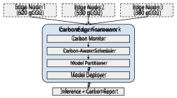
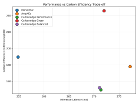
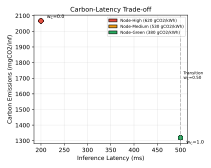

# CarbonEdge: Carbon-Aware Deep Learning Inference Framework for Sustainable Edge Computing 

Guilin Zhang_∗_ , Wulan Guo_∗_ , Ziqi Tan_∗_ , Chuanyi Sun_∗_ , Hailong Jiang_†_ 

_∗_ Department of Engineering Management and Systems Engineering, George Washington University, USA Email: _{_ guilin.zhang, wulan.guo, ziqi.tan, c.sun _}_ @gwu.edu 

_†_ Department of Computer Science, Information, and Engineering Technology, Youngstown State University, USA Email: hjiang@ysu.edu 

**_Abstract_ —Deep learning applications at the network edge lead to a significant growth in AI-related carbon emissions, presenting a critical sustainability challenge. The existing edge computing frameworks optimize for latency and throughput, but they largely ignore the environmental impact of inference workloads. This paper introduces CarbonEdge, a carbon-aware deep learning inference framework that extends adaptive model partitioning with carbon footprint estimation and green scheduling capabilities. We propose a carbon-aware scheduling algorithm that extends traditional weighted scoring with a carbon efficiency metric, supporting a tunable performance–carbon trade-off (demonstrated via weight sweep). Experimental evaluations on Docker-simulated heterogeneous edge environments show that CarbonEdge-Green mode achieves a 22.9% reduction in carbon emissions compared to monolithic execution. The framework achieves 1.3** _×_ **improvement in carbon efficiency (245.8 vs 189.5 inferences per gram CO2) with negligible scheduling overhead (0.03ms per task). These results highlight the framework’s potential for sustainable edge AI deployment, providing researchers and practitioners a tool to quantify and minimize the environmental footprint of distributed deep learning inference.** 

**_Index Terms_ —Edge Computing, Carbon Footprint, Green AI, Deep Learning Inference, Sustainable Computing** 

## I. INTRODUCTION 

The rapid deployment of artificial intelligence (AI) at the network edge has revolutionized applications ranging from autonomous vehicles to smart healthcare systems [1]. Edge computing enables real-time deep learning inference by processing data closer to its source, reducing latency and bandwidth consumption [2], [3]. And this growth of edge AI comes with a significant and often overlooked environmental cost: the carbon footprint of distributed inference workloads [4]. Recent studies have shown the substantial energy consumption and carbon emissions related to AI systems [5]. Training large language models can emit as much carbon as five cars over their lifetimes [6], and inference workloads contribute approximately 60% of Google’s machine learning energy consumption due to their cumulative scale [7], [8]. As edge AI deployments grow exponentially, addressing the environmental impact becomes an important research challenge aligned with global sustainability goals [9]. 

Some existing edge computing frameworks aim to solve above issues, like our prior work AMP4EC [10]. These frameworks have provided improvements in inference latency and throughput through adaptive model partitioning and intelligent task scheduling [11], [12]. However, they optimize purely for performance metrics, remaining uncertain to the carbon intensity of the computational resources that they use [13]. This means a missed opportunity: edge networks cross regions with different levels of carbon intensity in the power grid, from coal-heavy regions above 800 gCO2/kWh to renewable energy regions below 100 gCO2/kWh [14], [15]. 

To address it, this paper introduces **CarbonEdge** , a carbonaware deep learning inference framework. This framework extends adaptive model partitioning with comprehensive carbon footprint estimation and green scheduling capabilities. The framework has a **Carbon Monitor** module that provides carbon footprint. The footprint is tracking by integrating with CodeCarbon for host-level energy measurement and estimating per-node emissions, which is based on regional grid carbon intensity data. And it represents a **Carbon-Aware Scheduling Algorithm** that extends traditional weighted scoring mechanisms with a carbon efficiency metric ( _SC_ ), enabling operators to tune the performance-carbon trade-off via configurable weight parameters. Furthermore, we develop a **Green Partitioning Strategy** that considers both computational cost and carbon implications when distributing workloads across heterogeneous edge nodes. Comprehensive experimental validation demonstrates **22.9% carbon reduction** in Green mode with comparable latency, achieving 1.3 _×_ improvement in carbon efficiency [16], [17]. 

The remainder of this paper is organized as follows: Section II reviews related work in edge computing and carbonaware computing. Section III presents the CarbonEdge framework architecture. Section IV details experimental results. Section V discusses limitations and future directions. Section VI concludes the paper. 

## II. BACKGROUND AND RELATED WORK 

## _A. Edge Computing for Deep Learning Inference_ 

Edge computing enables real-time deep learning inference by processing data closer to its source [1], [2]. Model partitioning distributes DNN workloads across multiple edge nodes through techniques including layer-wise partitioning [18], [19], cooperative inference [20], and hierarchical partitioning [21]– [23]. Our prior work AMP4EC [10] achieved up to 78% latency reduction through adaptive partitioning. However, these approaches focus exclusively on performance optimization, ignoring environmental implications. 

## _B. Carbon Footprint of AI Systems_ 

The environmental impact of AI has gained significant attention [6], [7]. Patterson et al. revealed that inference accounts for approximately 60% of ML-related energy consumption at Google. Tools like CodeCarbon [24] estimate hardware electricity consumption and calculate carbon emissions based on regional grid carbon intensity, providing the foundation for carbon-aware system design. 

## _C. Carbon-Aware Computing_ 

Carbon-aware computing represents an emerging paradigm that incorporates carbon emissions into system optimization objectives. Clover [25] proposed a carbon-aware machine learning scheduler that exploits spatial and temporal variations in grid carbon intensity. EcoServe [26] introduced a holistic approach to AI system design that balances performance, energy efficiency, and carbon footprint. Recent work on sustainable edge computing [27] highlights the challenges and opportunities in this domain, while Ma et al. [28] demonstrate carbon reduction through renewable energy integration. 

## _D. Research Gap_ 

Despite progress in edge computing optimization and carbon-aware computing, a critical gap exists at their intersection. Edge computing frameworks [10], [18] optimize for latency but ignore carbon emissions. Carbon-aware systems [25], [26] primarily target cloud-based training, failing to address edge-specific challenges: device heterogeneity, geographic distribution, and latency constraints. CarbonEdge addresses this gap by combining online carbon tracking (given static grid intensity scenarios) with carbon-aware scheduling for distributed edge inference. 

## _E. Carbon Intensity Variation_ 

Electricity grid carbon intensity varies significantly across regions and time periods. Regions relying heavily on coalfired power plants may exceed 800 gCO2/kWh, while areas with abundant renewable energy can achieve intensities below 50 gCO2/kWh. China’s national average is approximately 530 gCO2/kWh, with significant regional variation—from over 700 gCO2/kWh in coal-dependent northern provinces to under 200 gCO2/kWh in hydropower-rich Yunnan [29]. 

This variation creates opportunities for carbon-aware scheduling: by preferentially routing workloads to nodes in 

Fig. 1. CarbonEdge system architecture showing the integration of carbon monitoring with adaptive scheduling. 

low-carbon regions or deferring non-urgent tasks to lowcarbon time periods, systems can substantially reduce their environmental footprint. CarbonEdge exploits this heterogeneity through its Carbon-Aware Scheduling Algorithm. 

## III. DESIGN AND IMPLEMENTATION 

This section provides the design and implementation of CarbonEdge, which integrates adaptive model partitioning to carbon-aware scheduling capabilities. The framework is based on the AMP4EC architecture [10], and adding a Carbon Monitor module and incorporating carbon efficiency into the scheduling algorithm. 

## _A. System Architecture_ 

CarbonEdge comprises four key components: (A) Carbon Monitor, (B) Carbon-Aware Scheduler, (C) Model Partitioner, and (D) Model Deployer. Figure 1 illustrates the system architecture. 

## _B. Carbon Monitor Module_ 

The Carbon Monitor uses traditional resource monitoring with energy consumption tracking and carbon emission calculation. It integrates with CodeCarbon [24] for hardware power measurement and uses regional carbon intensity data to estimate emissions. 

_1) Energy Tracking:_ The module monitors three primary power sources. GPU power consumption is retrieved via nvidia-smi or pynvml interfaces, providing real-time measurements of graphics processor utilization. CPU power is estimated using RAPL (Running Average Power Limit) interfaces available on modern processors. RAM power consumption is approximated as 0.375W per gigabyte based on typical DDR4 memory specifications. 

Total energy consumption is calculated as: 

$$
Etotal = T 0 (PGP U + PCP U + PRAM) dt (1)
$$

_2) Carbon Emission Calculation:_ Carbon emissions are computed using regional grid carbon intensity: 

$$
Cemissions = Etotal \times{}{} Icarbon \times{}{} PUE (2)
$$

**Algorithm 1** Carbon-Aware Node Selection **Require:** Task _t_ , nodes _N_ , mode weights _W_ **Ensure:** Best node _n__∗_ 

- 1: _best_ _<u>score ←</u>_ 0; _n__∗_ _← null_ 

2: **for all** _n ∈ N_ **do** 

where _Icarbon_ is the carbon intensity (gCO2/kWh) and _PUE_ is the Power Usage Effectiveness (default 1.0 for edge devices). 

## _C. Carbon-Aware Scheduling Algorithm_ 

The Carbon-Aware Scheduler adopts the Node Selection Algorithm (NSA) from AMP4EC with a carbon efficiency score. The total node score is computed as: 

- 3: **if** _n.load >_ 0 _._ 8 OR _n.latency > threshold_ **then** 4: **continue** 

- 5: **end if** 6: **if** _has_ _<u>sufficient</u> resources_ ( _n, t_ ) **then** 

- 7: _SR ← calc_ _<u>resource score</u>_ ( _n, t_ ) 8: _SL ←_ 1 _− n.load_ 

- 9: _SP ←_ 1 _/_ (1 + _n.avg_ _<u>time</u>_ ) 

- 10: _SB ←_ 1 _/_ (1 + _n.task_ _<u>count ×</u>_ 2) 

- 11: _SC ←_ 1 _/_ (1 + _n.carbon intensity × Eest_ ) 12: _score ← W ·_ [ _SR, SL, SP , SB, SC_ ] 

- 13: **if** _score > best_ _<u>score</u>_ **then** 

_Stotal_ = _wR ·SR_ + _wL ·SL_ + _wP ·SP_ + _wB ·SB_ + _wC ·SC_ (3) 

- 14: _best_ _<u>score ←</u> score_ ; _n__∗_ _← n_ 

- 15: **end if** 

The score components include resource availability ( _SR_ ), load balance ( _SL_ ), performance ( _SP_ ), fairness/balance ( _SB_ ), and the newly introduced carbon efficiency score ( _SC_ ). Each component is normalized to the [0,1] range and weighted according to the operational mode. 

_1) Carbon Efficiency Score (SC):_ The carbon efficiency score prioritizes nodes with lower carbon impact: 

$$
SC = 1 1 + Icarbon \times{}{} Eestimated (4)
$$

where _Eestimated_ is the estimated energy consumption for the task on that node, computed as _Eestimated_ = _Pnode × Tavg/_ 3600000 (converting power in watts and time in milliseconds to kWh). _Pnode_ is the node’s average power draw and _Tavg_ is the historical average execution time for that node. Nodes with lower carbon intensity or lower power consumption receive higher scores. 

_2) Scheduling Modes:_ CarbonEdge supports three operational modes with different weight configurations, as shown in Table I. 

TABLE I 

WEIGHT CONFIGURATIONS FOR SCHEDULING MODES 

|**Mode**|_wR_|_wL_|_wP_|_wB_|_wC_|
|---|---|---|---|---|---|
|Performance|0.25|0.25|0.30|0.15|0.05|
|Green|0.15|0.15|0.10|0.10|0.50|
|Balanced|0.20|0.20|0.15|0.15|0.30|

Balanced is included as a representative intermediate configuration; in setups where _SC_ has limited differentiation, it may behave similarly to Performance, motivating normalizationbased or constraint-based scheduling in future work. 

## _D. Node Selection Algorithm_ 

Algorithm 1 presents the carbon-aware node selection procedure. 

- 16: **end if** 

- 17: **end for** 

- 18: **return** _n__∗_ 

## _E. Model Partitioner_ 

The Model Partitioner analyzes deep learning models layerby-layer and divides them into segments suitable for distributed execution [20], [30]. For each layer, computational cost is estimated based on layer type: 

$$
Cost(l) =      kh \times{}{} kw \times{}{} Cin \times{}{} Cout Conv2D Nin \times{}{} Nout Linear params count others (5)
$$

Partition boundaries are determined to balance workload across nodes while minimizing communication overhead. 

## _F. Implementation_ 

CarbonEdge is implemented in Python using PyTorch for deep learning operations. Docker containers simulate heterogeneous edge nodes with configurable resource constraints. Source code will be made available upon publication. 

## IV. EXPERIMENTS AND EVALUATION 

This section presents experimental evaluation of CarbonEdge across multiple dimensions: carbon footprint reduction, performance trade-offs, and scheduling behavior analysis. 

## _A. Experimental Setup_ 

_1) Hardware Environment:_ Experiments were conducted on an Nvidia DGX SPARK workstation running Ubuntu 24.04. Docker containers simulated heterogeneous edge nodes with static carbon intensity scenarios [14], [15]. We deployed three simulated nodes: Node-High (1.0 CPU, 1GB RAM, 620 gCO2/kWh—high-carbon scenario), Node-Medium (0.6 CPU, 

512MB RAM, 530 gCO2/kWh—average scenario), and NodeGreen (0.4 CPU, 512MB RAM, 380 gCO2/kWh—low-carbon scenario). 

The carbon intensity range (380–620 gCO2/kWh) reflects realistic spatial variations across regional grids [14]. CodeCarbon operates on the host in machine mode, measuring total host power via RAPL (CPU) and nvidia-smi (GPU). **Node-level energy values are estimated** by apportioning host energy proportionally based on Docker cgroup resource quotas (--cpus, --memory); this is an accounting method, not direct per-container measurement. 

_2) Dataset:_ We used the ImageNet ILSVRC2012 validation set [31] for inference evaluation. Input images were preprocessed to 224 _×_ 224 pixels with standard normalization (mean=[0.485, 0.456, 0.406], std=[0.229, 0.224, 0.225]). We randomly sampled 50 images per experiment to simulate realistic edge inference workloads with varied input complexity. 

_3) Test Models:_ We evaluated three lightweight CNN architectures commonly deployed in edge environments: MobileNetV2 [32] (3.5M parameters), MobileNetV4 [33] (3.8M parameters), and EfficientNet-B0 [34] (5.3M parameters). These models represent the spectrum of efficient architectures suitable for resource-constrained edge devices. 

_4) Baselines:_ We compared CarbonEdge against several baselines. The Monolithic approach performs single-node inference without partitioning. AMP4EC [10] represents our prior distributed inference framework without carbon awareness. CarbonEdge was evaluated in three modes: Performance mode ( _wC_ = 0 _._ 05), Balanced mode ( _wC_ = 0 _._ 30), and Green mode ( _wC_ = 0 _._ 50). 

Each configuration was evaluated over 50 inference iterations with batch size 1. We measured inference latency (ms), throughput (req/s), energy (kWh), and carbon emissions (gCO2) using CodeCarbon [24] with measure_power_secs=1. We compute total energy over the full 50-inference run (multi-second duration) and report per-inference averages. Each experiment was repeated three times; 95% confidence intervals were below 15% of mean values. 

## _B. Carbon Footprint Analysis_ 

In general, our evaluation reveals three key findings. CarbonEdge-Green achieves significant carbon reduction (14.8%–32.2%) compared to monolithic execution while maintaining comparable latency. The carbon-aware scheduling effectively routes tasks to nodes with lower carbon intensity scenarios. The framework generalizes across different model architectures. These findings establish the viability of carbonaware scheduling for sustainable edge AI. Table II presents the detailed carbon emission results for MobileNetV2 across different configurations, serving as the primary benchmark for evaluating scheduling mode effectiveness. 

The results demonstrate that **CarbonEdge-Green achieves a 22.9% reduction in carbon emissions** compared to the 

TABLE II 

CARBON FOOTPRINT COMPARISON (MOBILENETV2) 

|**Configuration**|**Latency**|**Throughput**|**Carbon**|**Reduction**|
|---|---|---|---|---|
||(ms)|(req/s)|(gCO2/inf)|vs Mono (%)|
|Monolithic|254.85|3.93|0.0053|-|
|AMP4EC|277.22|3.62|0.0056|-6.7%|
|CE-Performance|271.38|3.69|0.0067|-26.7%|
|CE-Balanced|271.11|3.70|0.0066|-24.7%|
|CE-Green|272.02|3.68|**0.0041**|**+22.9%**|

Fig. 2. Trade-off between inference latency and carbon efficiency. CarbonEdge-Green achieves the highest carbon efficiency (245.8 inf/gCO2) with minimal latency impact. 

monolithic baseline. This reduction is achieved by preferentially routing inference tasks to nodes configured with lower carbon intensity (380 gCO2/kWh vs. 530 gCO2/kWh average). This result falls within the range reported by recent carbonaware scheduling work: Rajashekar et al. [16] report up to 35% reduction for LLM inference, while prior work reports up to 24% energy savings in DRL-based schedulers (summarized in [17]). 

Notably, Performance and Balanced modes show _increased_ carbon emissions because they prioritize high-performance nodes configured with higher carbon intensity. This tradeoff illustrates the importance of carbon-aware scheduling for sustainable edge AI. 

## _C. Performance-Carbon Trade-off_ 

Figure 2 illustrates the relationship between inference latency and carbon efficiency across scheduling modes, revealing that carbon reduction can be achieved with minimal latency impact. 

The results reveal several key findings. Regarding carbon efficiency, CarbonEdge-Green achieves 245.8 inferences per gram of CO2, compared to 189.5 for monolithic execution— a 1.30 _×_ improvement. In terms of latency, all CarbonEdge modes maintain comparable response times (approximately 271ms), with less than 7% overhead compared to monolithic execution. The trade-off analysis shows that Performance mode sacrifices carbon efficiency (149.6 inf/gCO2) for optimal 

node selection, while Green mode prioritizes environmental impact. 

## _D. Comparison with Related Work_ 

Table III compares CarbonEdge with recent carbon-aware systems, contextualizing our results within the broader research landscape. 

TABLE III 

COMPARISON WITH RELATED CARBON-AWARE SYSTEMS 

|**System**|**Target**|**Carbon Reduction**|
|---|---|---|
|GreenScale [35]|Edge-Cloud|10-30%|
|DRL Scheduler [17]|Kubernetes|up to 24%|
|LLM Edge [16]|Edge Clusters|up to 35%|
|**CarbonEdge (ours)**|Edge DL Inference|**22.9%**|

CarbonEdge’s 22.9% reduction is comparable to reductions reported by recent carbon-aware scheduling work in related domains. Direct comparisons are approximate due to different workloads and carbon accounting methods. 

## _E. Multi-Model Evaluation_ 

Table IV presents carbon footprint comparison across three lightweight architectures to demonstrate CarbonEdge’s generalizability. 

Fig. 3. Weight sweep showing carbon-latency trade-off. Transition occurs at _wC ≥_ 0 _._ 50. 

_SC_ has limited differentiation (range 0.054) compared to _SP_ (range 0.166). A weight sweep (Figure 3) reveals the transition threshold at _wC ≥_ 0 _._ 50—achieving 22.9% carbon reduction with minimal latency increase. Scheduling overhead is negligible: 0.03 ms per task with under 1% CPU utilization. 

## V. DISCUSSION 

## _A. Limitations and Future Work_ 

TABLE IV 

MULTI-MODEL CARBON FOOTPRINT COMPARISON 

|**Model**|**Mode**|**Latency** (ms)|**Carbon** (gCO2/inf)|**Reduction** (%)|
|---|---|---|---|---|
|MobileNetV2|Monolithic|254.85|0.0053|-|
|MobileNetV2|CE-Green|272.02|0.0041|**22.9%**|
|MobileNetV4|Monolithic|82.96|0.00123|-|
|MobileNetV4|CE-Green|84.28|0.00105|**14.8%**|
|EfficientNet-B0|Monolithic|116.29|0.00198|-|
|EfficientNet-B0|CE-Green|119.23|0.00134|**32.2%**|

The results demonstrate consistent carbon reduction (14.8%–32.2%) across architectures, confirming CarbonEdge’s generalizability. 

## _F. Scheduling Behavior Analysis_ 

Table V shows the node selection distribution for each scheduling mode. 

Several limitations should be acknowledged. Our experiments used Docker containers to simulate edge devices; CodeCarbon estimates energy at the host level with percontainer values apportioned via resource quotas (not direct measurement). The current implementation uses static carbon intensity scenarios; real-time temporal dynamics are not exploited. Balanced mode ( _wC_ = 0 _._ 30) exhibits similar node selection to Performance mode because _SC_ has limited differentiation when per-inference emissions are small ( _∼_ 0.001 gCO2)—future work should explore per-decision min-max normalization or constraint-based optimization. The evaluation focuses on task-level routing; cross-node distributed inference remains for future work. 

Future directions include real-time carbon intensity integration via APIs (e.g., Electricity Maps), energy-aware model partitioning, multi-tenant optimization with carbon budgets, and embodied carbon accounting. 

## _B. Practical Implications_ 

TABLE V 

NODE USAGE DISTRIBUTION (% OF TASKS) 

|**Mode**|**Node-High**|**Node-Medium**|**Node-Green**|
|---|---|---|---|
|Performance|100%|0%|0%|
|Balanced|100%|0%|0%|
|Green|0%|0%|100%|

The scheduling reflects the weighted scoring: Performance mode ( _wC_ = 0 _._ 05) prioritizes fast nodes, while Green mode = ( _wC_ 0 _._ 50) selects low-carbon nodes. Balanced mode ( _wC_ = 0 _._ 30) exhibits similar behavior to Performance because 

CarbonEdge provides practitioners with tools to quantify and minimize the environmental impact of edge AI deployments. Organizations can use the framework to report carbon emissions for sustainability compliance, make informed tradeoffs between performance and environmental impact, and optimize infrastructure placement based on carbon intensity. 

## VI. CONCLUSION 

This paper presented CarbonEdge, a carbon-aware deep learning inference framework for sustainable edge computing. By extending adaptive model partitioning with carbon 

footprint estimation and green scheduling capabilities, CarbonEdge enables operators to balance performance and environmental impact in distributed edge AI deployments. 

The results highlight the potential for carbon-aware optimization in edge computing. As edge AI deployments continue to proliferate, frameworks like CarbonEdge provide essential tools for sustainable development, helping organizations meet environmental goals without sacrificing the benefits of distributed inference. 

Future work will focus on dynamic carbon intensity integration, energy-aware partitioning, and extension to diverse accelerator platforms. We believe carbon-aware computing represents a critical evolution in edge system design, and CarbonEdge provides a foundation for sustainable edge AI. 

## REFERENCES 

- [1] E. Li, Z. Zhou, and X. Chen, “Edge ai: On-demand accelerating deep neural network inference via edge computing,” _IEEE Transactions on Wireless Communications_ , vol. 19, no. 1, pp. 447–457, 2019. 

- [2] W. Shi, J. Cao, Q. Zhang, Y. Li, and L. Xu, “Edge computing: Vision and challenges,” _IEEE Internet of Things Journal_ , vol. 3, no. 5, pp. 637–646, 2016. 

- [3] H.-I. Liu, M. Galindo, H. Xie, L.-K. Wong, H.-H. Shuai, Y.-H. Li, and W.-H. Cheng, “Lightweight deep learning for resource-constrained environments: A survey,” _ACM Computing Surveys_ , vol. 56, no. 10, pp. 1–42, 2024. 

- [4] A. S. Luccioni and A. Hernandez-Garcia, “Counting carbon: A survey of factors influencing the emissions of machine learning,” _arXiv preprint arXiv:2302.08476_ , 2023. 

- [5] E. Breukelman, S. Hall, G. Belgioioso, and F. Dorfler, “Carbon-aware computing for data centers with probabilistic performance guarantees,” in _European Control Conference (ECC)_ , 2024, pp. 1–8. 

- [6] E. Strubell, A. Ganesh, and A. McCallum, “Energy and policy considerations for deep learning in nlp,” in _ACL_ , 2019, pp. 3645–3650. 

- [7] D. Patterson, J. Gonzalez, Q. Le, C. Liang, L.-M. Munguia, D. Rothchild, D. So, M. Texier, and J. Dean, “Carbon emissions and large neural network training,” _arXiv preprint arXiv:2104.10350_ , 2021. 

- [8] Google Research, “Carbon footprint of machine learning training will plateau, then shrink,” https://research.google/blog/ carbon-footprint-of-machine-learning-training-will-plateau-then-shrink/, 2022, reports ML inference accounts for approximately 60% of Google’s ML energy. 

- [9] H. Liao, G. Tang, D. Guo, Y. Wang, and R. Cao, “Rethinking low-carbon edge computing system design with renewable energy sharing,” in _Proceedings of the 53rd International Conference on Parallel Processing_ , 2024, pp. 950–960. 

- [10] G. Zhang, W. Guo, Z. Tan, and H. Jiang, “Amp4ec: Adaptive model partitioning framework for efficient deep learning inference in edge computing environments,” in _FMEC_ , 2025. 

- [11] J. Karjee, P. Naik, K. Anand, and V. N. Bhargav, “Split computing: Dnn inference partition with load balancing in iot-edge platform for beyond 5g,” _Measurement: Sensors_ , vol. 23, p. 100409, 2022. 

- [12] Q. Yuan and Z. Li, “Distributed inference models and algorithms for heterogeneous edge systems using deep learning.” _Applied Sciences (2076-3417)_ , vol. 15, no. 3, 2025. 

- [13] N. Asadov, V. C. Coroam˘a, M. Franzil, S. Galantino, and M. Finkbeiner, “Carbon-aware spatio-temporal workload shifting in edge–cloud environments: A review and novel algorithm,” _Sustainability_ , vol. 17, no. 14, p. 6433, 2025. 

- [14] International Energy Agency, “Global energy & co2 status report 2019: Emissions,” https://www.iea.org/reports/ global-energy-co2-status-report-2019/emissions, 2019, average carbon intensity of electricity: 475 gCO2/kWh globally. 

   - [16] K. Rajashekar, N. Sharghivand, R. Prodan, and R. Farahani, “Toward sustainability-aware llm inference on edge clusters,” _arXiv preprint arXiv:2512.04088_ , 2024, reports up to 35% carbon reduction for LLM inference on edge. 

   - [17] J. Yang, Z. Saad, J. Wu, X. Niu, H. Leung, and S. Drew, “A survey on task scheduling in carbon-aware container orchestration,” _arXiv preprint arXiv:2508.05949_ , 2024, survey summarizing reports of up to 24% energy savings. 

   - [18] S. Bhattacharya and N. D. Lane, “Sparsification and separation of deep learning layers for constrained resource inference on wearables,” in _SenSys_ , 2016, pp. 176–189. 

   - [19] H. Liang, Q. Sang, C. Hu, D. Cheng, X. Zhou, D. Wang, W. Bao, and Y. Wang, “Dnn surgery: Accelerating dnn inference on the edge through layer partitioning,” _IEEE transactions on Cloud Computing_ , vol. 11, no. 3, pp. 3111–3125, 2023. 

   - [20] L. Zeng, X. Chen, Z. Zhou, L. Yang, and J. Zhang, “Coedge: Cooperative dnn inference with adaptive workload partitioning over heterogeneous edge devices,” _IEEE/ACM Transactions on Networking_ , vol. 29, no. 2, pp. 595–608, 2021. 

   - [21] Z. Taufique, A. Vyas, A. Miele, P. Liljeberg, and A. Kanduri, “Hidp: Hierarchical dnn partitioning for distributed inference on heterogeneous edge platforms,” in _IEEE Design, Automation and Test in Europe (DATE)_ , 2025. 

   - [22] Y. Chen, T. Luo, W. Fang, and N. N. Xiong, “Edgeci: Distributed workload assignment and model partitioning for cnn inference on edge clusters,” _ACM Transactions on Internet Technology_ , vol. 24, no. 2, pp. 1–24, 2024. 

   - [23] S. K. Ghosh, A. Raha, V. Raghunathan, and A. Raghunathan, “Partnner: Platform-agnostic adaptive edge-cloud dnn partitioning for minimizing end-to-end latency,” _ACM Transactions on Embedded Computing Systems_ , vol. 23, no. 1, pp. 1–38, 2024. 

   - [24] C. Carbon, “Track and reduce co2 emissions from your computing.” 

   - [25] B. Li, S. Samsi, V. Gadepally, and D. Tiwari, “Clover: Toward sustainable ai with carbon-aware machine learning inference service,” in _Proceedings of the International Conference for High Performance Computing, Networking, Storage and Analysis_ , 2023, pp. 1–15. 

   - [26] Y. Li, Z. Hu, E. Choukse, R. Fonseca, G. E. Suh, and U. Gupta, “Ecoserve: Designing carbon-aware ai inference systems,” _arXiv preprint arXiv:2502.05043_ , 2025. 

   - [27] P. Arroba, R. Buyya, R. C´ardenas, J. L. Risco-Mart´ın, and J. M. Moya, “Sustainable edge computing: Challenges and future directions,” _Software: Practice and Experience_ , vol. 54, no. 11, pp. 2272–2296, 2024. 

   - [28] H. Ma, Z. Huang, G. Lu, D. Fu, and C. Shi, “Greening edge ai: Optimizing inference accuracy and reducing carbon emissions with renewable energy,” _IEEE Internet of Things Journal_ , vol. 12, no. 13, pp. 24 300–24 312, 2025. 

   - [29] Ministry of Ecology and Environment of China, “China’s regional grid emission factors,” https://www.mee.gov.cn/, 2024. 

   - [30] P. Dai, B. Han, K. Li, X. Xu, H. Xing, and K. Liu, “Joint optimization of device placement and model partitioning for cooperative dnn inference in heterogeneous edge computing,” _IEEE Transactions on Mobile Computing_ , vol. 24, no. 1, pp. 210–226, 2025. 

   - [31] J. Deng, W. Dong, R. Socher, L.-J. Li, K. Li, and L. Fei-Fei, “Imagenet: A large-scale hierarchical image database,” in _IEEE Conference on Computer Vision and Pattern Recognition (CVPR)_ , 2009, pp. 248–255. 

   - [32] M. Sandler, A. Howard, M. Zhu, A. Zhmoginov, and L.-C. Chen, “Mobilenetv2: Inverted residuals and linear bottlenecks,” in _IEEE/CVF Conference on Computer Vision and Pattern Recognition (CVPR)_ , 2018, pp. 4510–4520. 

   - [33] D. Qin, C. Leichner, M. Delakis, M. Fornoni, S. Luo, F. Yang, W. Wang, C. Banbury, C. Ye, B. Akin _et al._ , “Mobilenetv4: Universal models for the mobile ecosystem,” in _European Conference on Computer Vision (ECCV)_ . Springer, 2024, pp. 78–96. 

   - [34] M. Tan and Q. Le, “Efficientnet: Rethinking model scaling for convolutional neural networks,” in _International Conference on Machine Learning (ICML)_ , 2019, pp. 6105–6114. 

   - [35] Y. G. Kim, U. Gupta, A. McCrabb, Y. Son, V. Bertacco, D. Brooks, and C.-J. Wu, “Greenscale: Carbon-aware systems for edge computing,” _arXiv preprint arXiv:2304.00404_ , 2023. 

- [15] EnergyTag, “It’s about time: Carbon intensity analysis,” https:// energytag.org/, 2024, carbon intensity fluctuates 0-1158 gCO2/kWh across 300 global zones. 

